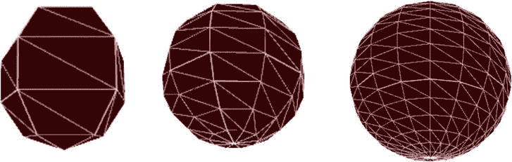
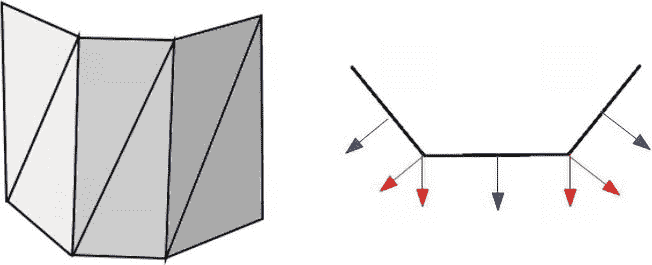
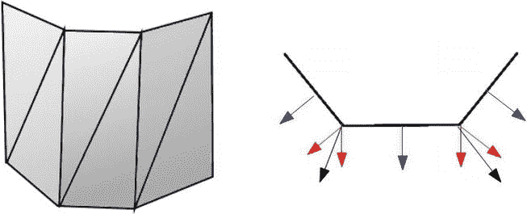
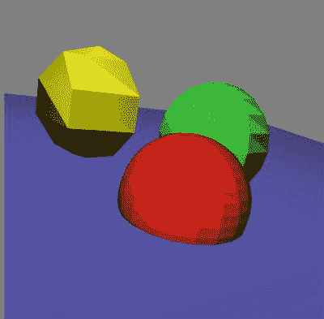
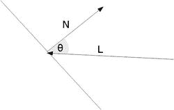

第四章

越来越现实

在这一章中，我们将介绍提高场景真实性的方法。由于适当的照明对我们的视觉感知是如此重要，本章的大部分内容将建立在上一章的基础上，并着重于改进我们的照明模型。具体来说，我们将

*   讨论平滑阴影和平坦阴影的区别
*   解释 Phong 照明模型，然后将其实现为一个着色器程序
*   展示如何添加雾
*   讨论生成阴影和添加全局照明的技术
*   混合对象并计算反射和折射

作为一种精神锻炼，注意你当前的环境。如果你在室内，看看你所在的房间。灯光是软的还是硬的？如果你能透过窗户看到太阳，那么阳光与人造光相比如何？哪些物体是闪亮的，哪些是暗淡的？任何物体在其表面反射其他物体吗？确定反射性更强的材料。有透明或半透明的物体吗？

如果你在外面，大气是什么样子的？是清晰还是朦胧？有风吗——物体会被风吹走吗？快速行驶的汽车的影子是什么样子的？你的影子是什么样子的？

问这些类型的问题并深入观察常见的物体和环境，将有助于您了解自然界中发生了哪些类型的复杂交互，并深入了解在我们的渲染中需要模拟和改进哪些内容，以再现逼真的外观。

我们将在本章中努力实现的最终图像如图 4-1 所示。

[图 4-1](#_Fig1) 。我们将在本章中构建的最后一个场景

设置

在这一章中，我们将展示一个比漂浮在空中的单个网格更有趣的例子。相反，我们将建立一个有几个球形网格的场景，这些网格在一个代表地面的平面上旋转。为此，我们将首先创建几个可重用的实用程序对象。

在第 1 章和第 3 章[中，我们使用了 gl-matrix.js 库的矩阵对象和函数。这个库也提供了 vector 对象和函数。](03.html)

矢量对象

我们将对网格数据执行一些常见的矢量操作。我们在着色器中内置了简单的向量(x，y，z)符号运算，但不是在 JavaScript 中。gl-matrix.js 库使用数字索引，如[0，1，2]:

var n = vec3.create(0.0，1.0，0.0)；

console . log(n[1])；//第二个元素

 **注**更多 gl-matrix.js 的使用示例可以在[https://github.com/toji/gl-matrix/blob/master/README.md](https://github.com/toji/gl-matrix/blob/master/README.md)在线找到

要使用 x，y，z 分量符号，我们可以使用 Three.js 中包含的全功能向量和矩阵库。虽然我提倡代码重用，但在本章中，我们只需要一些最小的操作，如叉积、长度和规格化函数。在这里我们可以创建一个我们自己的小 vector 对象，如清单 4-1 所示(基于 Three.js 库中的功能)。

***[清单 4-1。](#_list1)*** 一个局部矢量对象，只包含我们在本章中需要的功能

//矢量 3.js

向量 3 =函数(x，y，z ) {

this . x = x | | 0；

this . y = y | | 0；

this . z = z | | 0；

};

Vector3.prototype = {

除法:函数{

如果{

this . x/= s；

this . y/= s；

this . z/= s；

}

还这个；

},

交叉:函数(v ) {

var x = this.x，y = this.y，z = this.z

if(向量 3 的 v 实例){

this . x = y * v . z-z * v . y；

this . y = z * v . x-x * v . z；

this . z = x * v . y-y * v . x；

}

还这个；

},

长度:函数(){

返回 math . sqrt(this . x * this . x+this . y * this . y+this . z * this . z)；

},

normalize:函数(){

var length = this . length()；

返回 this.divide(长度)；

},

};

Notice above that we set default values in our constructor of (0,0,0) and also only divide if the passed in value is not 0.

平面类

为了帮助绘制一个平面，在我们的例子中，为了模拟一个其他物体坐在上面的表面，我们添加了一个名为 setupPlaneMesh 的函数(见[清单 4-2](#list2) )。

***[清单 4-2。](#_list2)*** 具有可覆盖属性和索引缓冲区的平面网格

//plane_mesh.js

函数 setupPlaneMesh(n，大小，平移，颜色，纹理)

{

size = （typeof size ！== 'undefined'） ？大小 ： 10.0;

颜色 = （颜色类型 ！== '未定义'） ？颜色 ： [0.5， 0.5， 1.0， 1.0];

translation =(翻译类型！== '未定义')？翻译:[0.0，0.0，0.0]；

textured =(纹理类型！== '未定义')？质感:假；

…

triangle snormals[n]= GL . create buffer()；

…

}

在[清单 4-2](#list2) 中，n 是 vbo 的全局数组的索引。尺寸、平移和颜色参数指的是平面的长度和宽度、初始平移量和颜色。如果没有提供参数，那么我们使用在三元运算中指定的默认值。

要添加网格，我们可以像这样调用:

setupPlaneMesh(3，10.0，[0.0，-1.0，0.0])；

平面设置函数的参数数量是五个，对于更复杂的网格，甚至可以更多。函数签名中的大量参数很难记住，很容易混淆并导致错误。代替清单 4-2 中的代码，我们仍然会设置默认参数，但是会传入一个更加灵活和详细的 JSON 对象来封装我们的数据。假设读者熟悉 JSON。如果你不是，请参考 http://json.org 的[。](http://json.org)

我们将把清单 4-2 中的代码改为:

函数 setupPlaneMesh(n，选项)

{

options = options | | { }；//确保我们有一个 JSON 对象

size =(选项类型. size！== '未定义')？options . size:10.0；

color = (typeof options.color！== '未定义')？options.color : [0.5，0.5，1.0，1.0]；

translation =(type of options . translation！== '未定义')？options.translation : [0.0，0.0，0.0]；

textured =(选项类型. textured！== '未定义')？options . textured:false；

…

}

我们现在添加一个新的平面网格，调用如下:

setupPlaneMesh(3，{"translation": [0.0，-1.0，0.0]，

【尺寸】:20.0

}

);

在设置了参数顺序的情况下，如果要将“纹理”更改为“真实”,则需要指定其间的任何和所有参数——大小、平移和颜色——即使您使用的是默认值。使用 JSON 对象的第二种方式让我们可以忽略不需要覆盖的参数，也不要求参数按照任何顺序排列。

 **注意**本章中的代码并没有针对性能进行优化。因为我们只有几个网格，这无关紧要。然而，对于涉及许多绘制调用的更复杂的场景，我们将需要编写优化的代码。请参考[第 9 章](09.html)了解最佳实践和提高性能的方法。

球体

为了生成球体网格，函数 setupSphereMesh 如[清单 4-3](#list3) 所示。第一部分让我们设置缓冲指数，半径，平移，颜色，划分，以及是否使用平滑阴影。接下来，我们使用球坐标生成网格。当我们渲染一个球体时，它由水平线(如果地球被建模为球体，请将纬线想象为与赤道平行)和垂直线(请将它们想象为从北极到南极并代表时区)组成。纬线和经线相交的地方就是顶点。顶点向“极点”靠近，而向“赤道”远离细分越多，网格就越接近真实的球体。

 **注**单位球面上每一点的法线值就是该点本身(缩放或平移前)。记住法向量是垂直指向表面的方向，从原点开始，这个方向就是向量本身。球坐标是单位长度的，所以这个向量已经被归一化了。

***[清单 4-3。](#_list3)*** 文件 sphere_mesh.js，生成一个球体网格

函数 setupSphereMesh(n，选项)

{

options = options | | { }；//确保我们有一个 JSON 对象

color = (typeof options.color！== '未定义')？options.color : [1.0，0.0，0.0，1.0]；

translation =(type of options . translation！== '未定义')？options.translation : [0.0，0.0，0.0]；

radius =(选项类型，radius！== '未定义')？options . radius:1.0；

divisions =(type of options . divisions！== '未定义')？选项.划分:30；

smooth _ shading =(options . smooth _ shading！== '未定义')？options . smooth _ shading:true；

textured =(选项类型. textured！== '未定义')？options . textured:false；

//网格生成修改自//http://learning web GL . com/cookbook/index . PHP/How _ to _ draw _ a _ sphere

var latitudeBands =除法，

经度带=划分；

var vertexPositionData = []，

normalData = []，

colorData = []，

textureData = []，

index data =[]；

的(订单编号= 0；纬度，经度++)

var theta = latNumber * Math。PI/latitude bands；

var sinet = math . sin(theta)：

var cosTheta = math . cos(theta)；

for(var long number = 0；longNumber < = longitudeBandslongNumber++) {

var phi = longNumber * 2 * Math。PI/longitude bands；

var sinphi = math . sin(phi)；

var cos phi = math . cos(phi)；

var x = cosPhi * sinTheta

var y = cosTheta

var z = sinPhi *语法；

var u = 1-(long number/longitude bands)；

其中 v =分数字/纬度带；

texture data . push((x+1.0)* . 5)；

texture data . push((y+1.0)* . 5)；

正常日期。推送(x)：

正常日期。push(y)；

正常日期。push(z)：

color data . push(color[0])；

color data . push(color[1])；

color data . push(color[2])；

color data . push(color[3])；

vertexpositiondata . push(radius * x+translation[0])；

vertexpositiondata . push(radius * y+translation[1])；

vertexpositiondata . push(radius * z+translation[2])；

}

}

的(订单编号= 0；纬度带；经度++) {。

for(var long number = 0；longNumber < longitudeBandslongNumber++) {

var first =(latNumber *(longitude bands+1))+long number；

var second = first+longitude bands+1；

indexData.push(第一)；

indexData.push(秒)；

index data . push(first+1)；

indexData.push(秒)；

indexData.push(秒+1)；

index data . push(first+1)；

}

}

if(！平滑 _ 阴影)

{

//计算平面着色法线

}

triangle snormals[n]= GL . create buffer()；

bindBuffer(gl。ARRAY_BUFFER，trianglesNormalBuffers[n])；

gl.bufferData(gl。ARRAY_BUFFER，new Float32Array(normalData)，gl。STATIC _ DRAW)；

trianglesNormalBuffers[n].itemSize = 3;

triangle snormal buffer[n]. num items = normal data . length/3：

triangle scolor buffer[n]= GL . create buffer()；

bindBuffer(gl。ARRAY_BUFFER，triangles color buffers[n])；

gl.bufferData(gl。ARRAY_BUFFER，new Float32Array(colorData)，gl。STATIC _ DRAW)；

triangle scolor buffer[n]。item size = 4；

三角形缓冲器。numItems = color data . length/4；

triangle dispositicebuffer[n]= GL . create buffer()；

bindBuffer(gl。ARRAY_BUFFER，triangles verticebuffers[n])；

gl.bufferData(gl。数组 _ 缓冲区，

新 float 32 array(vertexPositionData)，gl。STATIC _ DRAW)；

trianglesVerticeBuffers[n].itemSize = 3;

三角形分布缓冲区[n]。num items = vertexposition data . length/3：

中频(纹理)

{

triangle stexcoordbuser[n]= GL . create buffer()；

bindBuffer(gl。ARRAY_BUFFER，trianglesTexCoordBuffers[n])；

gl.bufferData(gl。ARRAY_BUFFER，new Float32Array(textureData)，

gl。STATIC _ DRAW)；

trianglesTexCoordBuffers[n].itemSize = 2;

三角形的。numItems = texture data . length/2；

}

vertxinindexbuffer[n]= GL . create buffer()；

bindBuffer(gl。ELEMENT_ARRAY_BUFFER，vertexindex buffers[n])；

gl.bufferData(gl。元素 _ 数组 _ 缓冲区，

新的 Uint16Array(indexData)，gl。STREAM _ DRAW)；

顶点索引缓冲区[n].itemSize = 3;

vertxinindexbuffer[n]. num items = index ATA . length；

}

…

我们将在场景中创建一个新的球体，如下所示:

setupSphereMesh(0，{"translation": [-1.0，-0.75，0.0]，

【颜色】:【1.0，0.0，0.0，1.0】，

【分工】:20、

“smooth_shading”:假

});

具有 5、10 和 20 细分的网格，如 WebGL 检查器所示(在第 9 章的[中介绍)，如图 4-2](09.html) 中的[所示。](#Fig2)

[图 4-2](#_Fig2) 。纬度和经度分别为 5、10 和 20 的球体

在[清单 4-3](#list3) 中，我们省略了平面阴影代码。在我们讨论了平滑阴影和平坦阴影的区别之后，我们将回到这个代码。

重新审视照明

照明是图形的核心，我们将在本章涵盖更多的灯光实现 细节，从阴影模型、传统的 Phong 照明模型开始，最后是全局辐射模型。

阴影模型

给多边形着色有两种基本方法:平滑着色和平滑着色。*平面阴影* 表示整个多边形是一种颜色。我们对所有顶点使用相同的法向量。因此，对于同一个顶点，边相交的法线可能不同，这取决于整个面的法线向量值。这种差异意味着相邻边上的照明值会有很大差异，因此您会看到一条边在哪里结束，另一条边在哪里开始。相反，*平滑阴影* 表示对颜色和法线值进行插值。这可以在顶点着色器(VS)中完成，如 Gouraud 着色，或在片段着色器(FS)中完成，如 Phong 着色。这两种着色技术将在本章后面详细介绍。

法向量再探

让我们先来看看多边形边相交且顶点共享时平面阴影的法向量是什么样子的(见[图 4-3](#Fig3) )。

[图 4-3](#_Fig3) 。平面着色:一种颜色，每个表面一个法线

正如你在[图 4-3](#Fig3) 中看到的，共享顶点处的法线是脱节的。相邻多边形的值之间会有明显的跳跃。使用平面着色时，如果入射的镜面反射光没有照射到顶点，镜面反射高光(回想一下镜面反射是在特定方向反射的光)将被忽略。因此，平面着色通常根本不计算镜面反射。

使用平滑着色时，共享顶点与其共享的所有面进行平均。图 4-4 的右边显示了如何使用一个新的法向量，它是两个共享边的平均值。当然，左图也有一些顶点不是跨多个三角形共享的，也有一些是由三个三角形共享的。

[图 4-4](#_Fig4) 。平滑着色:平均法线和插值颜色

平滑着色主要有两种类型:Gouraud 着色和 Phong 着色。Gouraud 着色是按顶点执行的，而 *Phong 着色*是按像素执行的，这样可以更好地捕捉镜面高光。

平面阴影

我们现在将返回 04/sphere_mesh.js 代码，看看我们之前忽略的平面阴影方法。在 WebGL 中，由于 FS 会自动插值结果，因此实际上执行平面着色比平滑着色更困难。对于球体，我们必须改变我们的三角形，使每个顶点都有相同的法线(见清单 4-4 )。

***[清单 4-4。](#_list4)*** 计算平面着色法线

if(！平滑 _ 阴影)

{

vertexPositionData = calculatedflattenedvertices(

vertexPositionData，index data)；

color data =[]；

for(var I = 0；i < indexData.length++i)

{

color data . push(color[0])；

color data . push(color[1])；

color data . push(color[2])；

color data . push(color[3])；

}

normal data = calculatePerFaceNormals(normal data，index data)；

}

…

函数 calculated vertices(origin vertices，indices)

{

var 顶点=[]；

for(var I = 0；i < indices.length++i)

{

a =指数[I]* 3；

vertices . push(orig vertices[a])；

vertices . push(orig vertices[a+1])；

vertices . push(orig vertices[a+2])；

}

返回顶点；

}

函数 calculatePerFaceNormals(原始法线，索引)

{

var normal = [];

for(var I = 0；i < indices.lengthi+=3)

{

var a = indexes[I]* 3；

var b =指数[I+1]* 3；

var c =指数[I+2]* 3；

n1 = new Vector3（origNormals[a]， origNormals[a+1]， origNormals[a+2]）;

n2 = new Vector3（origNormals[b]， origNormals[b+1]， origNormals[b+2]）;

n3 = new Vector3（origNormals[c]， origNormals[c+1]， origNormals[c+2]）;

NX =(n1 . x+N2 . x+n3 . x)/3；

ny = （n1.y + n2.y + n3.y）/3;

NZ =(n1 . z+N2 . z+n3 . z)/3；

v3 =新矢量 3(nx，ny，NZ)；

normals . push(v3 . x)；

normals . push(v3 . y)；

normals . push(v3 . z)；

normals . push(v3 . x)；

normals . push(v3 . y)；

normals . push(v3 . z)；

normals . push(v3 . x)；

normals . push(v3 . y)；

normals . push(v3 . z)；

}

返回法线；

}

在[清单 4-4](#list4) 中，我们扩展了我们的数据，包括每个索引的颜色、位置和法线数据，而不仅仅是每个顶点。我们使用恒定的颜色，因此扩展颜色数据是微不足道的。对于我们的顶点位置，我们传入原始顶点信息，然后通过查找与每个索引相关的顶点，使用这些信息来产生所有顶点位置(包括重复值)的更长的数组。对于法线，我们取所有三个三角形顶点法线的平均值，并将这个新值用于三角形中的每个顶点。参见[图 4-5](#Fig5) 。

[图 4-5](#_Fig5) 。具有不同细分的球体的平面着色

当我们渲染我们的球体时，我们将使用 drawArrays 方法而不是 drawElements，因为我们不再使用索引缓冲区。我们仍然使用 drawElements 方法来渲染平面:

if(i==3){

gl.drawElements(gl。三角形，顶点索引缓冲区[i]。numItems 冰川。UNSIGNED_SHORT，0)；

}否则{

gl.drawArrays(gl。三角形，0，trianglesVerticeBuffers[i]。numItems)；

}

平面着色器示例位于文件 04/01_flat.html 中。

朗伯反射

朗伯反射给出了物体任意点的漫射光强度。回想一下，漫射光取决于入射光到曲面点的角度，但是反射是全方位的。计算朗伯反射包括取法线向量 N 和光到表面 L 的方向，然后计算这些向量之间的角度的余弦。角度越大(高达 90 度)，余弦值就越低。当角度接近 0 时，余弦接近 1。所有其他角度值将介于-1 和 1 之间，当法线和光照向量垂直时，角度值为 0。(90，270)范围内的角度将返回负值，因为这意味着灯光位于曲面的法线向量的相反侧。

通常负值被箝位为 0。为了计算余弦，我们可以取归一化 N 和归一化 L 的点积，也就是朗伯项 dot(N，L)。光的漫射分量计算如下，其中 M D 和 L D 对应于材料漫射分量和光漫射分量:

漫反射= dot(N，L)*M D *L D

当仅使用漫射颜色和可选的全局环境光因子时，这有时被称为*朗伯照明*(参见[图 4-6](#Fig6) )。

[图 4-6](#_Fig6) 。朗伯反射的法线(N)和光照(L)向量

使用 Lambert 照明的 VS 如[列表 4-5](#list5) 所示。

***[清单 4-5。](#_list5)*** 计算朗伯量