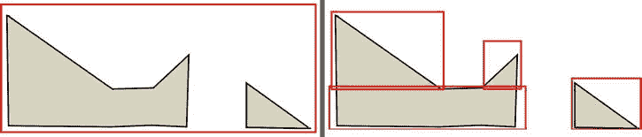
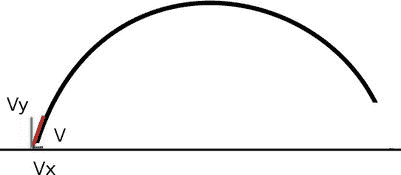
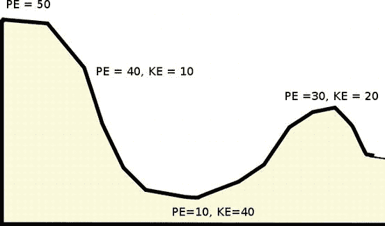
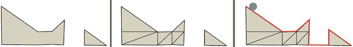

# 五、物理学

在这一章中，我们将介绍在我们的场景中物体之间的物理交互建模。我们将在本章中讨论的主题有:

*   位置、速度、加速度
*   重力和摩擦力之类的力
*   抛射体运动
*   检测碰撞并对其做出反应
*   弹性和动量守恒
*   势能和动能

背景

除了照明、纹理和其他现实主义的视觉线索，物体如何与周围环境进行物理交互也可以使我们的动画更加可信。不遵循物理规律的互动看起来很奇怪，也不现实。当然，这可能是我们所追求的效果。然而，在这一章中，我们将集中精力尝试让我们的场景在物理上表现得像我们期望的物体交互一样。

物理模拟的范围是巨大的。我们可以模拟水波或物体的浮力、轮胎的转动、飞机的飞行等等。在这一章中，我们将把范围缩小到基本的运动学:重力，简单碰撞，势能和动能，以及抛射物。

在对场景中的多个移动对象建模时，一个核心要求是能够检测对象何时相互接触。在本章中，我们将建立检测碰撞的方法。

作用在我们身上的力

每一天的每一秒，都有力量在作用于我们。这些力包括重力，它把我们拉向地球；表面法线，支撑着我们；摩擦力，阻止我们不断运动；旋转、风、物体或人推或拉我们的向心力；等等。当这些力的总和相互抵消时，我们就说处于静止状态。

标量和向量

在物理学中，我们处理两类量:*标量*和*矢量*。标量有大小但没有方向，而矢量有大小和方向。比如速度是标量，质量和时间也是。我们可以说，汽车的速度是每小时 50 英里，这是一个标量。如果我们说汽车以每小时 50 英里的速度向东行驶，那么它就是一个矢量。

变化率

对于物理学的应用，我们通常对向量感兴趣。我们可以测量一个物体的矢量位置或位移，例如沿 x 轴的 20 m。为了计算物体的速度，我们取物体在一段时间内的位移差。换句话说，速度是位移的变化率。加速度是速度的变化率。位移通常用 d 表示，速度用 v 表示，加速度用 A 表示。计算物体在从时间 A 到时间 B、的时间范围内的平均速度的基本公式是:

v =(dB–dA)/(时间B—时间 A

例如，如果 d A = 20m，时间 A = 1s，d B = 30m，时间 B = 5s，则:

v =(30m 20m)/(5s 1s)= 10m/4s = 2.5m/s

类似地，为了计算一段时间间隔内的平均加速度，我们取每个相应时间端点的速度，v A 和 v B :

A =(vBvA)/(时间 B 时间 A

如果 v A = 2.5m/s，时间 A = 1s，v B = 3.0m/s，时间 B = 2s，则:

a =(3.0m/s-2.5m/s)/(2s-1s)= 0.5m/s2

[图 5-1](#Fig1) 显示了位移随时间变化的样本图，接着是速度随时间变化的曲线图，然后是加速度随时间变化的曲线图。例如，请注意，我们可以在减速时向前移动，也可以在零加速度时快速移动。

[图 5-1](#_Fig1) 。左:对象的位置；中心:物体的速度；右图:物体的加速度

我们的第一个代码示例将模拟物体由于重力的影响而自由下落。这里，当我们谈到引力时，我们并不是在模拟所有物体之间的普遍吸引力。这种类型的引力对于在天文学中建立精确的轨道模型是必不可少的，但在我们的日常生活中，虽然存在物体之间的这些引力，例如路上的两个不同的人或汽车，但它们小到可以忽略不计。相反，我们将模拟我们最熟悉的重力类型:从一个物体如球(或人)向下自由落体到地球表面。

代码设置

我们将需要能够以一种更有助于更新的方式来跟踪场景元素，并且通过独立于顶点缓冲对象(VBO )数据来更加灵活。在前面的章节中，我们使用了不相互作用的孤立网格。在这一章中，我们将有物体之间的相互作用，并且需要能够跟踪物理属性并调整它们。为此，我们将创建一个新的球体对象，如[清单 5-1](#list1) 所示。

***[清单 5-1](#_list1) 。*** 跟踪球体的物理属性

SphereObject =函数 SphereObject (properties) {

var radius =(properties . radius = = = undefined)？1.0:properties . radius；

var position =(properties . position = = = undefined)？新矢量 3(0.0，0.0，0.0):

属性.位置；

var velocity =(properties . velocity = = = undefined)？新矢量 3(0.0，0.0，0.0):

属性.速度；

var acceleration =(properties . acceleration = = =未定义)？新矢量 3(0.0，0.0，0.0):

属性.加速度；

this.radius = radius

this.position =位置；

this.velocity =速度；

this.acceleration =加速度；

this . vbo _ index = properties . vbo _ index；

}

在清单 5-1 的[的球体对象中，我们跟踪球体的半径、位置、速度和加速度。我们还有一个 vbo_index 属性，我们将使用它将每个物理球体对象与相关的 vbo 对象联系起来。](#list1)

存储信息

我们将在一个数组中存储所有的 SphereObject 元素:

var scene elements =[]；

我们将三个球体和平面网格声明为:

setupSphereMesh(0，{

“转换”:[1.0，0.75，0.0]，

【颜色】:【1.0，0.0，0.0，1.0】，

}

);

setupSphereMesh(1，{

“翻译”:[0.0，0.0，1.0]，

【颜色】:[0.0，1.0，0.0，1.0]

}

);

setupSphereMesh(2，{

“转换”:[1.0，0.25，1.0]，

【颜色】:[1.0，1.0，0.0，1.0]

}

);

setupPlaneMesh(3，{"translation": [0.0，1.0，0.0]})；

**scene elements . push(new sphere object({ " vbo _ index ":0 })；**

**scene elements . push(new sphere object({ " vbo _ index ":1 })；**

**scene elements . push(new sphere object({ " vbo _ index ":2 })；**

随着本章进展到一个更加通用和灵活的系统，我们将修改这个开始的布局。跟踪元素类似于我们创建第 6 章中提到的粒子系统，关键区别在于这里的相互作用是确定性的，而粒子系统在本质上是部分未知或随机的。

为了帮助查看场景，我们将展示如何设置一个可通过鼠标点击、拖动和滚动事件进行调整的摄像机。

交互式地调整 摄像机

首先，我们将通过沿 z 轴备份我们的视口来缩小:

mat 4 . identity(mv matrix)；

mat4.translate(mvMatrix，[0.0，0.0，–20.0])；

//其他相机变换

我们现在将演示如何捕获鼠标向下、向上和移动事件来调整视图。能够以这种方式改变视图将让我们动态地环视我们的场景。

用鼠标旋转视图

要实现用鼠标移动改变视图，首先我们需要将事件处理程序附加到画布上，如清单 5-2 所示。

***[清单 5-2](#_list2) 。*** 捕捉鼠标事件来控制视图

var capture = false，

start = []，

angleX = 0，

角度 Y = 0;

$(文档)。ready(function(){

$("#my-canvas ")。on("鼠标按下"，功能(e){

capture = true

start = [e.pageX，e.pageY]：

console . log(" start:"+start)；

});

$("#my-canvas ")。on("mouseup "，函数(e){

capture = false

console.log("结束捕获")；

});

$("#my-canvas ")。鼠标移动(函数(e) {

如果(捕获)

{

var x = （e.pageX − start[0]）;

var y =(e . pagey start[1])；

//更新开始位置

start[0] = e.pageX;

start[1]= e . pagey；

anglex+= x；

angle+= y；

//console . log(" Angle:("+angleX+"，"+angleY+")；

}

});

});

在清单 5-2 的[中，mousedown 事件发出一个名为 capture](#list2) 的布尔标志，该标志应该捕获后续 mousemove 事件以及当前鼠标位置的数据。当 mouseup 事件发生时，我们让标志知道它应该停止捕获数据。当 mousedown 事件开始时，mousemove 事件计算从开始位置的偏移量。然后我们更新起始位置。这很重要；否则，我们将得到非常不稳定的结果。最后，我们增加存储 x 和 y 旋转角度的变量。

然后，在我们的应用中，我们在每一帧上更新我们的多视图矩阵，设置平移量和旋转值:

mat 4 . identity(mv matrix)；

mat4.translate(mvMatrix，[0.0，0.0，–20.0])；

mat4.rotate(mvMatrix，angleX*2*Math)。PI/180.0，[0.0，1.0，0.0]：

mat4.rotate(mvMatrix，angleY*2*Math)。PI/180.0，[1.0，0.0，0.0]：

 **注意**除了将鼠标处理程序附加到画布上，我们还可以将它们附加到整个文档上。这在前面的例子中很有用，因为移出画布将会停止鼠标事件的捕获，并在我们移回画布时产生意想不到的不良结果。鼠标按钮可能仍然是按下的，但是我们需要首先释放它，然后在事件被重新捕获之前再次单击并按住它。

通常最好先进行场景范围的变换，然后进行对象特定的变换。

使用鼠标滚轮控制缩放

滚动鼠标滚轮 常用于控制场景的放大和缩小。为此，我们将为 mousewheel 事件附加一个处理程序:

其中 zoom = 1.0

...

$(文档)。就绪(功能(事件){

$("#my-canvas ")。on("鼠标滚轮"，功能(e){

var delta = window . event . wheel delta；

如果(增量> 0)

{

zoom+= 0.1；

}否则{

缩放= 0.1；

//防止负缩放

如果(缩放< 0.01)

{

缩放= 0.1；

}

}

});

...

mat4.scale(mvMatrix，[缩放，缩放，缩放])；

现在，由于浏览器的差异，上面的代码将无法在 Firefox 上使用，因为 Firefox 使用了 DOMMouseScroll 事件而不是 mousewheel 事件。为此，我们可以添加多个事件处理程序:

函数 adjustZoom(增量)

{

如果(增量> 0)

{

zoom+= 0.1；

}否则{

缩放= 0.1；

如果(缩放< 0.01)

{

缩放= 0.1；

}

}

}

$(文档)。就绪(功能(事件){

$("#my-canvas ")。on("鼠标滚轮"，功能(e){

adjustZoom(window . event . wheel delta)；

}).on(" **DOMMouseScroll** )，函数(e){

//firefox

adjust zoom(**e . original event . detail***-1.0)；

});

...

 **注意**mouse wheel 和 DOMMouseScroll 事件的目标是鼠标指针当前位置下方的 DOM 元素，类似于 click 事件。

detail 属性的方向与 wheelDelta 相反，因此为了保持一致，我们将其乘以-1。这些属性的大小也不同，但是我们只关心表示向上或向下滚动方向的符号。在来自[https://github . com/brandonaaron/jQuery-mouse wheel/blob/master/jQuery . mouse wheel . js](https://github.com/brandonaaron/jquery-mousewheel/blob/master/jquery.mousewheel.js)的 jQuery mousewheel 插件中可以找到更健壮的鼠标滚轮事件处理。

本章中所有示例的着色器程序将与 04/05_phong_phong.html 演示中的 Phong 照明模型和着色器相同。我们准备开始模拟物理相互作用，我们要做的第一件事是模拟重力。

重力

正如大多数非物理学家所习惯的那样，重力仅仅是将物体拉向地球的力量。俗话说，“上去的，一定下来。”我们将模拟三个球形球向地面下落，并做一些连续的改进。

自由落体

我们第一次尝试建立重力模型时，会简单地降低每一帧中所有三个球体的位置。对于这个示例，我们将使用 04/05_phong_phong.html 文件中的代码作为起点，并使用前面概述的更改来跟踪场景元素。在[清单 5-3](#list3) 中，我们展示了如何通过搜索合适的 vbo_index 来调整每个球体，以确定哪些对象是球体，然后转换每个球体的模型视图矩阵。

***[清单 5-3](#_list3) 。*** 调整选择场景元素

函数 searchForObject(arr，index)

{

for(数组中的变量 I)

{

if(arr[i]。vbo_index == index)

{

影子系统

}

}

return 1；

}

函数 drawScene()

{

for(var I = 0；i < vertexIndexBuffers.length++i)

{

mat 4 . identity(mv matrix)；

mat4.translate(mvMatrix，[0.0，–1.0，–15.5])；

**var n = searchForObject(场景元素，I)；**

**如果(n！=-1)**

**{**

**mat4.translate(mvMatrix，[0 . 0 . 5 . 0-场景元素[n].position.y，0.0])；**

**scene elements[n]. position . y+= 0.1；**

**}**

mat 4 . tonversemat 3(mvmatrix，标准矩阵)；

mat3 .转发器(正常矩阵)；

setMatrixUniforms()；

...

}

}

在[清单 5-3](#list3) 中，我们有一个助手方法 searchForObject，它接受一个 SphereObjects 的输入数组，并根据输入的 vbo_index 值找到一个合适的对象索引，如果没有找到匹配，则为 1。扩展这种方法将允许我们在场景中潜在地拥有许多不同的对象类型，但是能够只影响匹配特定标准的 VBO 对象——在这种情况下，是一个球体。如果当前的 VBO 索引是匹配的，我们转换它的模型-视图矩阵并增加存储的 y 位置。地面网格的 VBO 指数将导致搜索返回 1，因此它将是固定的。

运行这段代码的结果(可以在 05/01a_gravity.html 文件中找到)是球体无限下落。它们经过地面，如[图 5-2](#Fig2) 左侧所示。现在让我们添加第一个碰撞检测案例来防止这种情况。

[图 5-2](#_Fig2) 。最左边:球体的起始位置；左:不与地面碰撞的自由落体；右:不包括半径的碰撞检测；最右边:正确的碰撞检测

坠落并与地面碰撞

首先，我们将正式确定球体和地面的初始高度:

var INITIAL _ HEIGHT _ TRANSLATION _ OF _ SPHERES = 5.0；

var GROUND _ Y = 1.0；

。。。

setupPlaneMesh(3，{ "translation": [0.0，GROUND_Y，0.0]})；

要测试一个物体是否撞到地面，我们需要测试我们球体的起始平移量减去平移的 y 位置是否大于地面高度。如果不是，我们停止增加位置:

。。。

var n = searchForObject(场景元素，I)；

如果(n！= −1)

{

if(INITIAL _ HEIGHT _ TRANSLATION _ OF _ sphere-scene elements[n]. position . Y > GROUND _ Y)

{

scene elements[n]. position . y+= 0.1；

}

mat4.translate( mvMatrix，

[0.0，INITIAL _ HEIGHT _ TRANSLATION _ OF _ SPHERES-scene elements[n]. position . y，0.0])；

}

。。。

运行这段代码可以停止球体，但是它们会卡在平面的中间，如图 5-2 右侧的[所示。因此，让我们改进我们的碰撞检测，以考虑球体的半径:](#Fig2)

if((INITIAL _ HEIGHT _ TRANSLATION _ OF _ SPHERES-

**(场景元素[n].position.y +场景元素[n])。半径)** ) >地面 _Y)

{

scene elements[n]. position . y+= 0.1；

}

该调整的结果显示在图 5-2 的[的最右侧。](#Fig2)

让我们再做一个代码改进，直接在我们的 SphereObject 中设置球体的初始平移，而不是在 setupSphereMesh 调用中:

setup spheresh(0，{ "color": [1.0，0.0，0.0，1.0]}；

setup spheresh(1，{ "color": [0.0，1.0，0.0，1.0]}；

setup spheresh(2，{ "color": [1.0，1.0，0.0，1.0]}；

setupPlaneMesh(3，{ "translation": [0.0，GROUND_Y，0.0]})；

scene elements . push(new sphere object({ " vbo _ index ":0，

“位置”:新矢量 3(1.0，0.75，0.0)})；

scene elements . push(new sphere object({ " vbo _ index ":1，

“位置”:new Vector3(0.0，0.0，1.0)})；

scene elements . push(new sphere object({ " vbo _ index ":2，

“位置”:新向量 3(1.0，0.25，1.0)})；

这种调整让我们可以在 VBO 代码中保留局部网格坐标和颜色细节，在球体对象中保留世界位置。因为它在 VBO 之外，我们现在可以很容易地调整位置，而无需修改我们的缓冲区。我们现在还需要在 translate 调用中调整我们的 x 和 z 位置:

mat4.translate(mvMatrix，

[场景元素[n].位置. x，

INITIAL _ HEIGHT _ TRANSLATION _ OF _ sphere-scene elements[n]. position . y，

场景元素

]);

我们的下一步是让球体反弹回来。

跌倒了，但又跳起来

让我们在这些球体中放一些弹簧，让它们在飞机撞击时弹回。那么我们如何做到这一点呢？如果地面受到撞击，我们需要改变方向。一种简单的方法是在撞击时翻转位置调整的方向:

函数 isAboveGround(n)

{

return(INITIAL _ HEIGHT _ TRANSLATION _ OF _ SPHERES–

(场景元素[n].position.y +场景元素[n])。半径) >地面 _ Y)；

}

。。。

var n = searchForObject(场景元素，I)；

如果(n！= −1)

{

if( isAboveGround(n))

{

scene elements[n]. position . y+= 0.1；

**}其他{**

**scene elements[n]. position . y = 0.1；**

}

。。。

}

这种方法的问题是球体将开始向上移动，但是因为它在地面上，所以在下一次迭代中它将立即向下移动。会再次到达地面，球体会再次开始向上。它将无限期地这样做，并陷入一个交替循环，使物体轻微晃动，但不会移动太多。

这种方法的另一个补充是添加一个标志，表明地面已被击中，这样一旦地面被击中，我们就永远不会通过继续下落的测试条件:

var flip _ direction =[假，假，假]；

。。。

if( isAboveGround(n) &&

！翻转方向[n]

)

{

scene elements[n]. position . y+= 0.1；

}否则{

flip _ direction[n]= true；

scene elements[n]. position . y = 0.1；

}

这确实消除了前面的问题，球在碰撞时会向上弹回。然而，这种方法并不是一个稳健或有用的解决方案，因为一旦球开始向上运动，它将永远向上运动，永远不会再向下运动。

我们现在将看看如何使用速度和加速度来正确地模拟一个弹跳的物体。

落下又弹起；重复

直到现在，我们还没有利用我们的球形物体的速度或加速度属性。

我们可以将等式 A =(vB—vA)/(时间B—时间 A )改写为:

v b = v a + a(时间B—时间 A

或者等效如下，其中 f 代表最终，I 代表初始，t 代表时间间隔:

v f = v i + at

这个方程可以用来模拟我们的自由落体。直到现在，下降的速度始终不变。这是不准确的，因为物体下落时会加速——所以使用这个等式也是对下降真实性的一个改进。当我们把球向上弹回时，在 SphereObject 中存储信息的灵活性就会显现出来。

让我们仔细看看等式 v f = v i + at。时间 t 可以设置为 1，因为我们可以使用帧值偏移来代替实际时间。重力将是加速度 a。通常，重力向下的值为 9.8 米/秒 2 ，但是我们的场景没有使用任何特定的比例或测量单位，所以我们选择的值可以是任何看起来不错的值——太高的值会使下降发生得太快，太低的值会导致下降太慢。价值观的实验是这里的关键。对于我们当前的场景设置，0.01 的加速效果很好。这里显示了一个球体初始化:

sceneElements.push(新的球形对象(

{

“vbo _ index”:0，

“位置”:新矢量 3(1.0，0.75，0.0)，

“加速度”:新矢量 3(0.0，0.01，0.0)

}

)

);

正常情况下，加速度表示为负数，但是由于我们平移每个球体的方式，我们使用了正值。如果你想使用负值，你可以调整翻译的符号。

我们每个球体的初始速度向量是(0，0，0)，这使得下一帧后的 y 速度:

v fy = v 、 + a 和【t = v、 + 0.01(1) = v 、 + 0.01 = 0.01

所以第一帧之后就是 v fy = 0.01，第二帧之后是 0.02，第三帧之后是 0.03，以此线性类推。当我们将速度应用于我们的距离方程 dfy= diy+vyt 时，这将产生相对于初始位移的位移，在第一帧后为 0.01，第二帧后为 0.03，第三帧后为 0.06，依此类推，非线性增加。

在我们的代码中，我们不是直接增加位置，而是先调整速度，然后再调整位置。这允许我们在与平面接触时逆转速度，而不会陷入循环:

if( isAboveGround(n))

{

场景元素[n].速度. y + =场景元素[n].加速度. y；

}否则{

场景元素[n]. velocity . y * = 1.0；

}

scene elements[n]. position . y+= scene elements[n]. velocity . y；

当你运行程序 05/01e_gravity.html 时，三个球会继续无限地上下弹跳。

非完美弹性

当前面例子中的球反弹时，它们的弹性非常好。*完美弹性*意味着它们在碰撞后向上运动的速度与它们在那一刻下落的速度相同。没有动量因摩擦或其他形式的能量而损失。除了在理论上，物体不是完全弹性的，所以我们可以通过降低弹性来使例子更真实。这意味着反弹将在某一点停止。这非常容易建模；我们只是把弹性作为一个变量加进去，然后乘以与地面发生碰撞时的速度:

var 弹性= 0.8；

。。。

if( isAboveGround(n))

{

场景元素[n].速度. y + =场景元素[n].加速度. y；

scene elements[n]. position . y+= scene elements[n]. velocity . y；

}否则{

//首先减去速度，这有助于防止卡住

scene elements[n]. position . y = scene elements[n].

sceneElements[n].velocity.y *=弹性；

}

弹性值的范围可以从 0.0 到没有弹性(停止不动；想象撞上一堵砖墙)到 1.0 表示完全弹性(有史以来最伟大的橡胶球，只是理论上可能)。在前面的代码中，我们还确保在弹性系数乘以速度之前调整位置。这有助于防止球突然停止。

为了说明这一点的必要性，请考虑一个距离地面 0.6 米、当前速度为 1.0 的物体。当速度方向切换到 1.0 时，它应该能够在下一次迭代中回到上面。但是，如果对象的弹性值为 0.4，这会将返回速度抑制为 0.4，而不是 1.0。下一个计算的位置将是 0.2，这意味着它仍然在表面下 0.2。这意味着下一次通过地面测试时，它会再次失败，速度会翻转。这是一个坏消息，因为物体在地面下，并再次向下移动。力度被反转并再次衰减到 0.16，这使力度降低到地面的 0.36，然后翻转到力度 0.064，依此类推。这种情况的结果是，在几次迭代之后，一个本来可以快速行进的物体可能会看起来像死了一样停在它的轨道上。至少可以说，这看起来很奇怪。在弹性倍增之前将速度添加到位置可以消除这个问题。弹跳球的最终版本如图[图 5-3](#Fig3) 所示。

[图 5-3](#_Fig3) 。弹跳球

在下一个例子中，我们将释放任意数量的球体到世界中，并有初始的 x，y 和 z 速度。

三维速度

我们将检查是否碰到了我们飞机的无形边界，如果超出了，就把球弹回到我们的区域内。一旦我们设置好了，我们还将测试球体之间的碰撞 。

检测与许多墙壁的碰撞

我们将在场景中添加任意数量的球体。首先，我们将添加一些代码来防止具有 x 和 z 速度的物体离开我们的观察区域。我们将测试与地面网格的虚拟墙壁的交集:

if(scene elements[n]. position . x > PLANE _ SIZE | | scene elements[n]. position . x < PLANE _ SIZE)

{

scene elements[n]. position . x+=(1.0 * scene elements[n].

场景元素[n]. velocity . x * = 1.0；

}否则{

scene elements[n]. position . x+= scene elements[n]. velocity . x；

}

if(scene elements[n]. position . z > PLANE _ SIZE | | scene elements[n]. position . z < PLANE _ SIZE)

{

scene elements[n]. position . z+=(1.0 * scene elements[n].

场景元素[n]. velocity . z * = 1.0；

}否则{

scene elements[n]. position . z+= scene elements[n]. velocity . z；

}

到目前为止，我们已经检测到与移动物体和不可移动物体的碰撞。现在我们将模拟运动物体相互碰撞。

相互碰撞

当我们想知道两个物体是否发生碰撞时，使用明确定义的形状来测试包围盒更简单。这将大大降低计算成本。存在其他体积，如椭球体和圆柱体，但最常用的是长方体和球体。

边界框和球体

我们选择的包围体取决于底层对象的形状。相当圆的物体用球体自然表现得很好，而许多其他物体更适合方形盒子。[图 5-4](#Fig4) 显示立方体不太适合球体，反之亦然。(这两件事我们都不想做。)

[图 5-4](#_Fig4) 。左图:包围球中的立方体；右图:边界框中的球体

 **注**关于球体和立方体几何图形的复习，请参考[http://en.wikipedia.org/wiki/Sphere](http://en.wikipedia.org/wiki/Sphere)和[http://en.wikipedia.org/wiki/Cube](http://en.wikipedia.org/wiki/Cube)

有了包围体，我们可以使用简单的几何图形来处理彼此靠近的对象。例如，我们知道，如果两个边界球的中心之间的距离小于它们半径之和，则这两个球相交。有了包围盒，我们就可以保证在不知道的情况下不会发生碰撞。如果包围体精确地表示对象，碰撞总是准确的。然而，如果包围体大于被保持的物体，当我们认为发生了碰撞(但实际上没有)时，就会有一些误报。被封装的对象离它的包围体越近，我们遇到的相交的假阳性就越少。

限制这种误差的一种方法是将不规则形状的网格分成更小的边界框或球体。随着较小的包围体(或 2D 情况下的区域)的数量增加，误差量减少并且将接近零。图 5-5 显示了 2D 不规则形状和边界矩形，以及几个更接近形状的边界矩形，但也增加了我们必须执行的计算检查的数量。包围矩形内的空白区域显示了误报的碰撞区域。

[图 5-5](#_Fig5) 。左:单个边界框；右图:四个边界矩形

现在我们准备探测球体之间的碰撞。首先，为了现实地处理碰撞，我们需要知道一些关于动量和动量守恒的知识。

动量守恒

动量 p 是物体质量 m 和速度 v 的乘积:

p =多视图

当两个物体碰撞时，理论上系统的整体动量保持不变。在现实中，摩擦也会发生，所以没有碰撞是完全弹性的。

动量守恒方程如下:

p1 _ 初始+p2 _ 初始= p1 _ 最终+p2 _ 最终

它可以重写为:

m1v1iT4】2+m2v2iT10】2= m1v1fT16】2+m2v2fT22

当你求解 v 1f 或 v 2f 时，你会得到这个:

v1f=[(m1—m2)/(m1+m2)]v1i+【2m2/(m1+m2)v2i

类似地:

v2f=[(m2m1)/(m1+m2)]v2i+【2m1/(m1+m2)v1i

当 m 1 = m 2 的质量时，第一个方程简化为:

v1f= 0/2m2* v1i+2m2/2m2* v2i= 0 * v1i+1 * v2i= v2i

同样:

v 2f = v 1i

所以速度被简单地交换了！

该方程特定于一个维度，但它也适用于正交(垂直)分量，因此我们可以将该方程分别应用于 x、y 和 z 三个维度。

均匀质量碰撞

如前所述，当质量和台球一样完全相同时，我们可以交换速度。

对于每一帧，我们将检查场景中的所有球体是否与场景中的其他物体发生碰撞(见[清单 5-4](#list4) )。

***[清单 5-4](#_list4) 。*** 检查质量相等的球体之间的碰撞

冲突检查(sceneElements，n)；

。。。

冲突的函数检查(arr，n)

{

for(数组中的变量 I)

{

如果(我！= n)

{

var p1 = arr[n]。位置；

其中 p2 = arr[i]的位置；

var v =新向量 3(P1 . x-p2 . x、P1 . y-p2 . y、P1 . z-p2 . z)；

if(v.length() < (2.0 * arr[n]。半径) )

{

//交换两个向量的速度

var tmp = arr[n]。速度；

安排，安排。速度= arr[i]。速度；

arr[i]。速度= tmp

//移动位置，这样就不会卡住

arr[n]. position . x+= arr[n]. velocity . x；

arr[n]. position . y+= arr[n]. velocity . y；

arr[n]. position . z+= arr[n]. velocity . z；

arr[I]. position . x+= arr[I]. velocity . x；

arr[I]. position . y+= arr[I]. velocity . y；

arr[I]. position . z+= arr[I]. velocity . z；

}

}

}

}

在[清单 5-4](#list4) 中，我们检查距离是否小于半径的两倍，因为半径是相同的。如果发生碰撞，我们用一个临时变量来交换速度。其结果如[图 5-6](#Fig6) 左侧所示。

[图 5-6](#_Fig6) 。左图:均匀质量的碰撞；右图:不同质量的碰撞

我们现在将创建不同半径和质量的球体，并计算它们之间的碰撞。

不同质量的碰撞

在下一个例子中，我们将使用不同半径的球体。我们将假设所有球体的材料都是相同的，并且它们是实心的。这让我们可以使用体积来按比例比较质量，而无需实际设置或知道任何球体的质量。回想一下，一个球体的体积是 V = 4/3*π*r 3 。

假设我们有两个球体:V1= 4/3 *π* r13和 V2= 4/3 *π* r23。这两个体积的比值为 V1/V2=(r1/r2)3。

如果 r 1 = 1，r 2 = 1，则比值= 1 3 = 1。体积和质量(因为它们是相同的材料)也是相同的。若 r 1 = 2，r 2 = 1，则比值= (2/1) 3 = 8。所以第一个球的体积是第二个球的八倍，质量也是第二个球的八倍。我们可以一般地使用两个球体的半径来设置我们的两个质量如下:

m1/m2=(r1/r2)3/1

m1=(r1/r2)3

m 2 = 1

 **注意**对于更复杂的计算，我们可以使用现有的物理库，比如在第 8 章的[中讨论的那些。](08.html)

给定初始速度和半径，我们可以计算每个球体的最终速度值，如清单 5-5 所示。

***[清单 5-5](#_list5) 。*** 检查不同质量球体间的碰撞

冲突的函数检查(arr，n)

{

for(数组中的变量 I)

{

如果(我！= n)

{

var p1 = arr[n]。位置；

其中 p2 = arr[i]的位置；

var v =新向量 3(P1 . x-p2 . x、P1 . y-p2 . y、P1 . z-p2 . z)；

if(v.length() < (arr[i].半径+数组[n]。半径) )

{

//交换两个向量的速度

var tmp1 = arr[n]。速度；

var tmp2 = arr[i]。速度；

var r1 = arr[n].radius;

var r2 = scar[i].半径;

var finalX = findfinalvides(tmp 1 . x，tmp2.x，r1，R2)；

var finally = findfinalvides(tmp 1 . y，tmp2.y，r1，R2)；

var finalZ = findfinalvides(tmp 1 . z，tmp2.z，r1，R2)；

安排，安排。velocity = new Vector3( finalX[0]，finalY[0]，finalZ[0])；

arr[i]。velocity = new Vector3( finalX[1]，finalY[1]，finalZ[1])；

//移动位置，这样就不会卡住

arr[n]. position . x+= arr[n]. velocity . x；

arr[n]. position . y+= arr[n]. velocity . y；

arr[n]. position . z+= arr[n]. velocity . z；

arr[I]. position . x+= arr[I]. velocity . x；

arr[I]. position . y+= arr[I]. velocity . y；

arr[I]. position . z+= arr[I]. velocity . z；

}

}

}

}

函数 findFinalVelocities，v2，r1，r2)

{

var m1 = （r1*r1*r1）/（r2*r2*r2）;

凡 m2 = 1.0

var f1 =(m1-m2)/(m1+m2)* v1+2 * m2/(m1+m2)* v2；

var F2 =(m2-m1)/(m2+m1)* v2+2 * m1/(m2+m1)* v1；

return [f1，F2]；

}

在清单 5-5 的[中，我们添加了一个助手方法 findFinalVelocities，它接受两个初始速度和半径，计算并返回最终速度值。我们按组件进行计算。在](#list5)[图 5-6](#Fig6) 的右边显示了不同大小的球体相互作用。

我们的下一个例子着眼于抛射体的路径。

射弹

我们都熟悉物体的抛射运动，无论是发射的炮弹、弓箭手的箭、被击中或投掷的棒球等等。抛射体有一个物体行进的抛物线弧，如图[图 5-7](#Fig7) 所示。

[图 5-7](#_Fig7) 。典型的投射路径

除非有风或其他水平力，否则水平速度分量 v x 在物体的整个飞行过程中保持不变。由于重力的作用，垂直速度随时间而减小，计算为(v y + a y t)。

 **注**给定一个初始速度矢量 ，v，一旦我们计算出初始正交的 x 和 y 速度分量，v x 和 v y ，我们就可以使用这些等式分别计算未来的速度:

vFX= v【IX】+a【x】t 和 v【fy】= v【iy】+a和

影响抛射体飞行的基本因素有两个 (我相信玩过《愤怒的小鸟》的人都很熟悉):初速的角度和大小。45 度角的初始水平和垂直速度相等。在 0 到 90 度之间，任何大于 45 度的角度都将具有更大的垂直速度，而任何小于 45 度的角度都将具有更大的水平速度。给定速度矢量和地面之间的角度θ，初始垂直分量 v y 是 sin(θ)，而初始水平分量 v x 是 cos(θ)。

假设我们的初速度是 25 m/s，角度是 60 度。那么 v y = 21.65m/s，v x = 12.5m/s .在平坦的表面上，当 y 分量距离方程 T5】的位移为 0 时，具有这个初速度的物体会撞击地面:

d = v 易 *t + 1/2*a y *t 2

这通过解决以下问题来实现:

0 = t(v+1/2 * ay * t)

第一个解通常出现在 t = 0s 时。第二种解决方案出现在以下情况:

t = 2viy/ay

= 2(21.65 米/秒)/(9.8 米/秒 2

= 4.42 秒

根据我们刚刚计算的停留时间，我们可以确定物体将移动的垂直距离如下:

d = vXi* t+1/2 * ax* t2

= 12.5 米/秒* 4.42 秒+ 0

= 55.25 米

 **注**求抛体的最大高度，可以取初速度 y，V iy ，解方程 VfyT7】2= Viy2+2ad 为 V  fy  = 0 时。这将对应于抛射体路径的顶点，在此处抛射体开始向下返回:d = ViyT17】2/2a = ViyT21】2/19.6 米/秒 2

我们现在将实现一个发射炮弹的演示。这个演示的主要新组件是听击键来调整一个半开盒子网格的角度，这个半开盒子网格代表我们的初速度的角度和初速度的速度。我们也听一个钥匙从这个盒子里发射一个球体。这里显示了 快捷键:

$(文档)。keyup(函数(evt){

交换机(evt.keyCode)>

案例 80: //'p '

暂停了=！暂停；

打破；

案例 83: //'s '

-角度；

打破；

案例 68: //'d '

++角度；

打破；

案例 37: //'左'

速度= 0.1；

打破；

案例 40: //'右'

速度+= 0.1；

打破；

案例 70:

火=真；

console.log("开火！");

场景元素[0]。位置=新向量 3(0.0，0.0，0.0)；

场景元素[0]。速度=新矢量 3(

speed*Math.cos(角度*.1)，speed*Math.sin(角度*.1)，0.0)；

打破；

默认值:

打破；

}

});

fire 事件重置球体的位置，然后根据角度设置速度。当我们对场景进行变换时，平移、旋转和缩放的顺序很重要。我们在这里执行的 gl-matrix.js 库中的一个新方法是缩小我们的场景，以便更容易看到抛射体的路径:

var 标度= 0.2；

。。。

mat4.scale(mvMatrix，[scale，SCALE，SCALE])；

当 f 键被按下并且火标志被设置时，我们更新我们的球体位置:

如果(火){

scene elements[0]. velocity . y+= scene elements[0].加速度. y；

scene elements[0]. position . x+= scene elements[0]. velocity . x；

scene elements[0]. position . y+= scene elements[0]. velocity . y；

scene elements[0]. position . z+= scene elements[0]. velocity . z；

}

为了在不清除浏览器的情况下看到投射体的完整路径，我们可以告诉 WebGL 在初始化时保留绘图缓冲区，并在帧之间调用 gl.clear:

GL = canvas . get context(" webgl " { preserve drawing buffer:true })| |)

canvas . get context(" experimental-web GL "，{ preserveDrawingBuffer:true })；

图 5-8 右侧显示了显示完整抛射体路径的输出。

[图 5-8](#_Fig8) 。左图:飞行中的弹丸；右图:未清除绘图上下文的射弹 T3】

这个演示的完整代码在 05/05 _ propeline . html 文件中。我鼓励你继续玩抛射体和动量游戏。例如，利用这里获得的知识，您可以编写一个简化版的网球程序。

本章的最后一个例子研究了势能和动能之间的关系。

势能

到目前为止，我们一直在看有动能的例子，动能就是运动的能量。另一方面，势能是储存的能量，通常是因为物体的高度和物体自由下落时重力施加的力。势能的一个经典例子是过山车。在过山车的顶部，当汽车静止时，系统中的能量是纯势能(PE)。当每辆车开始下降时，PE 被转换成动能(KE) ，飞车获得速度。当汽车到达地面时，KE 的比值增加，当汽车向上返回时，比值减小。

理论上系统总能量保持不变，如图[图 5-9](#Fig9) 所示。然而，在现实世界中，能量会因为摩擦力而损失。

[图 5-9](#_Fig9) 。没有摩擦，系统的 PE 和 KE 是守恒的

在我们的下一个例子中，我们将创建一个带有跳跃的小斜坡，并让一个球体沿着它移动。我们可以调整高度来确定一个值，这个值将产生足够的速度使它通过。图 5-10 显示了 2D 计划的坡道轮廓。实际的坡道将是三维的 ，但是像这样的图表对于规划网格是有用的。

[图 5-10](#_Fig10) 。左:坡道侧视图；中心:剖成三角形的侧视图；右:侧视图，边缘将测试与球的碰撞

建模的第一步是定义一些变量，以便我们可以轻松调整尺寸:

//斜坡尺寸

变化高度 _1 = 65.0，

HEIGHT_2 = 15.0，

HEIGHT_3 = 20.0，

HEIGHT_4 = 15.0，

长度= 60.0，

长度 _2 = 60.0 * 0.5，

长度 _3 = 60.0 * 0.75，

LANDING_RAMP_START =长度* 2.0，

LANDING_RAMP_END =长度* 3.0，

深度= 25.0；

先前的高度对应于初始最大高度、坡道平坦部分的高度以及跳跃/间隙之前的最后一个峰值和着陆坡道的初始高度。[图 5-10](#Fig10) 中的图不是这个比例；这是一个可以调整到任何尺寸的准则。长度决定了第一个渐变到间隙的距离，比例用于将模型缩放到更适合场景其余部分的大小。

我们将使渐变都是一种颜色，一种不需要每个顶点的颜色数据的方法是禁用网格的属性数组，并指定一个单独的向量:

GL . disablevertexattribarray(vertxcolrattray 属性)；

GL . vertixriib 4f(vertixolrattray 属性，1.0，0.9，0.7，1.0)；

网格的完整顶点和索引值 在 05/06_ramp.html 文件中，法线按照本书前四章的程序生成。斜坡网格和球体位置，以及完整路径的视图，在[图 5-11](#Fig11) 中显示。

[图 5-11](#_Fig11) 。左图:渲染的斜坡和移动的球体；中心:查看球体的完整路径；右图:路径的另一个视图

剩下的工作是计算与图 5-10 右侧[所示的四个边缘的碰撞，并计算与每个边缘角度的余弦和正弦值相关的速度分量。为了实现这一点，我们将首先创建一个新对象来代表球体可能遇到的 2D 墙，如](#Fig10)[清单 5-6](#list6) 所示。

***[清单 5-6](#_list6) 。*** 存储墙壁属性的一个对象

WallObject =函数 WallObject(属性){

var start _ x =(properties . start _ x = = = undefined)？0.0:properties . start _ x；

var start _ y =(properties . start _ y = = = undefined)？0.0:properties . start _ y；

var end _ x =(properties . end _ x = = = undefined)？0.0:properties . end _ x；

var end _ y =(properties . end _ y = = = undefined)？0.0:properties . end _ y；

this.slope = 0.0

if((end _ x start _ x)> 0.0001 | |(end _ x start _ x)

this . slope =(end _ y start _ y)/(end _ x start _ x)；

}

this.start _ x = start _ x

this.start _ y = start _ y

this.end _ x = end _ x

this.end _ y = end _ y

var a =[start _ x end _ x，start _ y end _ y]；

这个角度= 0.0；

this.angle = Math.atan2( a[1]，a[0])；

}

我们跟踪每条墙线的两个端点:坡度和角度。我们将所有四个墙表示添加到一个名为 ramp_walls 的数组中。这个结构中的每个插入看起来像这样:

p 在哪里

“start _ x”:0.0，

" start_y": HEIGHT_1，

“end_x”:长度 _2，

" end_y ":高度 _2

};

ramp _ walls . push(new wall object(p))；

在每个动画帧上，检查 与每面墙的碰撞，跟踪我们球体的总速度，并计算 x 和 y 的速度和位置，如[列表 5-7](#list7) 所示。

***[清单 5-7](#_list7) 。*** 检查墙壁碰撞并计算总速度和分量速度及位置

冲突的函数检查()

{

var x = sphere . position . x/SCALE；

var y = sphere . position . y/SCALE；

if(sphere . position . y < 0.0){ return；}//检查接地

var found = false

for(斜坡墙中的变量 I)

{

if( x > = ramp_walls[i]。start_x && x < = ramp_walls[i]。end_x)

{

发现=真；

if(ramp_walls[i].斜率< −0.001 || ramp_walls[i].slope > 0.001)

{

if(ramp_walls[i].斜率> 0.001)

{

sphere . total _ velocity = sphere . acceleration . y；

}否则{

sphere . total _ velocity+= sphere . acceleration . y；

}

//console . log(sphere . total _ velocity)；

sphere . velocity . x = sphere . total _ velocity * math . cos(ramp _ walls[I])。角度)；

sphere . velocity . y = sphere . total _ velocity * math . sin(ramp _ walls[I])。角度)；

sphere . position . y+= sphere . velocity . y；

}

sphere . position . x+= sphere . velocity . x；

}

}

if(！找到){

sphere . velocity . y+= sphere . acceleration . y；

sphere . position . x+= sphere . velocity . x；

sphere . position . y+= sphere . velocity . y；

}

}

在前面的代码中，如果我们不在有围墙的区域，则 found 为 false，并且我们对自由落体进行建模。如果我们在一个有墙的部分，我们检查斜率并适当地加上总速度。零斜率导致纯水平运动，没有加速度(因为我们忽略了摩擦力)。我们用壁角的正弦和余弦乘以总速度来计算 x 和 y 分量的速度。从[图 5-11](#Fig11) 中，你可以看到路径很接近，但并不完全精确。更高的速度 将显示自由落体和在着陆坡道上的位置之间更突然的变化。提高精确度的一种方法是在退出自由落体之前检查球体是否与墙壁相交。此函数返回的数字的符号表示一个点在线的哪一侧(零在线):

函数 getSideOfWall(wall，x，y)

{

其中 delta = 0.00001

var v =(wall . end _ x wall . start _ x)*(y wall . start _ y)–

(wall . end _ y wall . start _ y)*(x wall . start _ x)；

if(v

return 1；

} else if(v)>(0.0+差值)}

返回 1；

}

返回 0；

}

实现这种检查的任务留给了读者。如果你雄心勃勃，想要建立一个过山车模型，那么你的计算中需要考虑更多的因素，比如向心力。

摘要

本章介绍了物体的一些物理属性，并模拟了重力、碰撞和抛射。在下一章，我们将讨论分形、高度图和粒子系统的数学主题。在[第 8 章](08.html)中，当我们介绍一些可以执行复杂得多的计算的物理库时，我们将回到物理。