第九章

调试和性能

在本章中，我们将展示如何排除错误并提高应用程序性能。我们将:

*   展示用于调试 WebGL 代码和着色器的有用工具
*   复习一些常见错误及其解决方法
*   展示如何通过优化我们的代码来消除常见的瓶颈，从而提高 WebGL 的性能
*   确定 WebGL 最佳实践

排除故障

当我们的程序产生错误的结果时，作为计算机程序员，我们说程序中有*个错误*或者表现出*个错误* 。识别 bug 错误来源并修复它们的过程被称为*调试*。

为什么要以精通调试代码为目标？尽管调试通常是编程中最耗时和最令人沮丧的部分，但它也是开发中很自然的一部分。使用能够查明错误来源的工具和技术，以及对常见错误的了解，对于最小化我们花费在调试上的时间是至关重要的。

集成开发环境

我们应该寻求帮助的第一个地方是我们编码的地方。虽然我们可以使用没有语法高亮或代码智能的纯文本编辑器，但是我们为什么要这样做呢？大多数现代的 ide 会通过颜色和/或其他语法高亮显示提供近乎即时的反馈，并显示警告或通知。有很多很多的 ide 和文本编辑器可用，每一个都有各种各样的特性。有些是轻量级的，而有些是内存密集型的，有些是开箱即用的，而有些有插件或模块来添加功能。ide 的价格也从免费到非常昂贵不等。一些适合 JavaScript 和 web 开发的文本编辑器和 ide 包括 Sublime、Notepad++、Netbeans、Eclipse、WebStorm、Zend Studio、Aptana、Cloud9 和 Komodo。其中，有趣的是，Cloud9，顾名思义，是托管在云中的。没有本地安装，当然有利有弊。

至少，您的 IDE 或文本编辑器应该能够检测 JavaScript 和 HTML 语法，有一些颜色编码，可视化地匹配大括号和圆括号，有行号和搜索/替换支持。另一方面，ide 可以有内置的版本控制和远程文件支持、单元测试、重构、代码完成、API 智能等等。你可以在图 9-1 中看到一个 IDE 运行的例子。

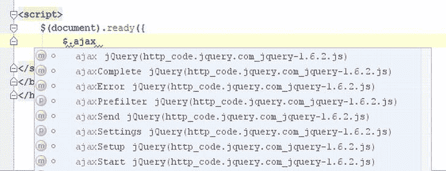

[图 9-1](#_Fig1) 。Webstorm IDE 中的 jQuery 库自动完成功能

我不会试图说服您使用特定的 IDE 或文本编辑器。选择权在你，最终应该是你觉得最舒服和最有效率的使用方式。需要考虑的一些因素包括:

*   积极发展和社区基础:不要花时间去学习那些很快就会过时或没人用的东西。
*   能力和生产力:你能通过几个按键/宏做一些令人惊奇的事情吗？或者 IDE 的巨大实际上阻碍了你的生产力吗？请记住，IDE 的目的是通过提供有助于开发的工具来提高生产率和易用性。
*   可扩展性:IDE 有插件、模块和第三方集成支持吗？
*   直观性:IDE 是否设计良好，易于导航？
*   可配置性:如果初始设置不符合您的要求，编辑器/IDE 中有多少是可定制的？
*   资源使用和稳定性:加载 IDE 需要几秒钟还是几分钟；是否有求必应；是否占用过多内存；经常死机吗？
*   焦点:IDE 是针对一种语言还是多种语言定制的？一个特定的任务还是很多？这些都有利弊。通常，如果一个 IDE 是为一种语言定制的，它会比为多种语言设计的软件更时尚、更优化，而且可能还拥有高级工具。然而，一个面向多种语言的 IDE 意味着如果你经常用多种语言编码，你只需要学习一个 GUI 。

浏览器开发工具

WebGL 在浏览器内部运行，使用的 API 是用 JavaScript 编写的。调试时我们应该寻求帮助的下一个地方是浏览器内部，因为每个主流浏览器都有自己内置的开发工具。这些开发人员工具的可用性和功能各不相同，但都具有相同的功能:查看和操作文档对象模型(DOM)、资源、网络流量的能力，以及输出 JavaScript 调试和错误信息的交互式控制台。

Chrome/Safari 都提供了*开发者工具*。Firefox 有 Firebug 和开发者扩展，Internet Explorer 有开发者工具栏，Opera 有蜻蜓。就内置支持而言，Internet Explorer 开发工具在版本 8 和版本 9 之间有了很大的改进。然而，在我看来，Chrome 和 Firefox 仍然是功能最丰富的浏览器工具。

默认情况下，Safari 禁用了他们的开发者工具。要启用它们，您需要转到首选项> >高级选项卡，然后单击“在菜单栏中显示开发菜单”复选框。火狐扩展可以在 http://getfirebug.com/和 T2 获得。

在图 9-2 中，我们演示了如何通过 Chrome 开发者工具控制台标签交互地找到一个 DOM 元素。

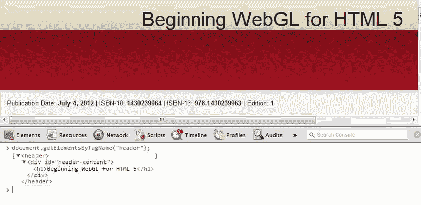

[图 9-2](#_Fig2) 。使用 Chrome 开发者工具中的控制台搜索<标题>标签

在图 9-3 中，我们展示了 Opera 的蜻蜓开发者工具的网络流量标签。此标签显示网页已载入和正在载入的资源的时间线。

[图 9-3](#_Fig3) 。用蜻蜓歌剧院观看网络统计

在图 9-4 中，我们展示了 Firefox 的一个很酷的新特性:以三维方式可视化 DOM 的能力。WebGL 使这个工具成为可能。

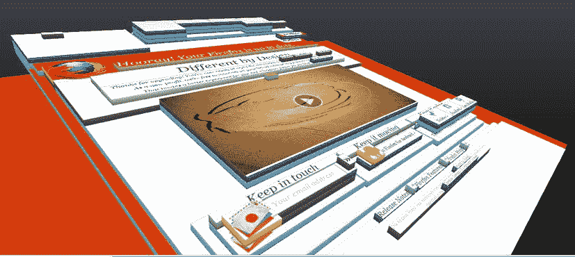

[图 9-4](#_Fig4) 。火狐中 DOM 元素的 3D 可视化，由 WebGL 实现

另外两个特定的浏览器工具是:在 Firefox 的地址栏中输入“about:config”和搜索“webgl”可以让你调整 Firefox 的 webgl 设置。在 Chrome 中输入地址“about:tracing ”,就可以在浏览器中对 WebGL 应用程序进行分析。

发送到控制台的调试消息

为了向我们自己或其他开发人员输出关于程序状态的信息，或者如果有我们应该知道的警告或错误，我们可以将消息打印到 JavaScript 控制台屏幕上，而不是显示可能令人讨厌的非严重错误的警告框，或者用我们的状态更新来混淆 DOM 文档。如前所述，所有的浏览器都有开发者工具，包括用于输入和输出命令和消息的控制台屏幕。JavaScript 中还有一个控制台对象，它有向开发人员控制台输出消息的方法。

例如，我们可以用 JavaScript 代码将日志消息和错误消息写到开发人员控制台，如下所示:

var myvar = 42

console.log("只是一些有帮助的信息")；//只是一些有用的信息

console.error("更严重的东西:"+myVar)；//更严重的东西:42

控制台中显示的这两条消息的主要区别在于，错误消息通常是红色字体，而日志消息是黑色的。控制台对象有更多的方法，Firebug 控制台的应用编程接口(API)可在[http://getfirebug.com/wiki/index.php/Console_API](http://getfirebug.com/wiki/index.php/Console_API)获得。尽管控制台对象的具体实现是依赖于浏览器的，但是其他的(比如基于 WebKit 的)支持 Firebug 使用的大部分实现。

查看别人的代码

因为 WebGL 使用的是 JavaScript 编写的客户端 API，所以我们可以很容易的查看别人的代码。这样做可以洞察我们以前可能没有考虑过的技术。查看 JavaScript 代码有两种方法:右键单击并访问菜单项“查看页面源代码”或“查看源代码”，或者查看开发人员工具的资源选项卡。对于着色器源，我们也可以查看原始源。然而，正如我们在第 7 章中所展示的，框架可以修改最终的着色器源。因此，使用像 WebGL inspector 这样的工具会更有用，我们将在本章的后面介绍。

在线沙盒

沙箱 是一个安全的环境，众所周知，孩子们可以在里面玩耍，发挥他们的想象力。用开发术语来说，沙箱是一个隔离的测试环境，我们可以在不损害生产代码的情况下摆弄我们的代码。

网上有很多地方我们可以快速安全地修改 JavaScript 代码。http://jsfiddle.net/的 jsFiddle 允许你运行 JavaScript 代码(可选 HTML 和 CSS)并查看输出。它提供了一个简单的选择框来切换普通 JavaScript 库的包含，并集成了 JSLint 支持来检查代码的有效性。与 jsFiddle 类似的站点是 JS Bin 及其位于 http://jsbin.com[的站点](http://jsbin.com)。

着色器可以在几个网站上在线修改，如 KickJS(可以在[http://www . KickJS . org/example/shader _ editor/shader _ editor . html](http://www.kickjs.org/example/shader_editor/shader_editor.html)找到)。我们在[第二章](02.html)中介绍了在线着色器工具，一些额外的站点在[附录 D](15.html) 中列出。

在线沙盒的主要用途是能够在为您配置的大部分环境中快速测试少量代码，并且能够安全地将您的代码作为链接共享给其他开发人员查看、调整和协作。

通用 WebGL 错误代码

WebGL 的一个问题使得调试相当困难，那就是只有五个主要的错误代码(包括表示没有错误的代码)。这些代码是数字常量。WebGL 规范的一个例子是:

const glen um INVALID _ ENUM = 0x 0500；

主要错误代码有:

*   没有错误- *我们准备好了*
*   INVALID_ENUM- *为枚举参数*指定了不可接受的值
*   INVALID_VALUE- *数值参数超出范围(例如试图指定着色器位置-1)*
*   INVALID_OPERATION- *指定的操作在当前状态下是不允许的(比如试图生成一个没有绑定纹理的纹理贴图)*
*   内存不足- *应用程序已耗尽内存*

WebGL 的许多函数调用都存在主要错误。这使得我们能够准确地触发和检测错误发生的位置和时间变得至关重要。有关每个函数可能抛出的错误代码的完整列表，请参考 WebGL 规范。

我们还可以检查许多 WebGL 状态，例如当我们使用以下命令检查帧缓冲区状态时:

GLenum checkFramebufferStatus(GLenum 目标)；

在其他可能的返回值中，我们可能会收到以下内容:

frame buffer _ INCOMPLETE _ ATTACHMENT//0x8cd 6

上下文错误

与 HTMLCanvasElement 关联的 WebGL 呈现上下文在创建时或在应用程序的整个生命周期中可能会有错误。我们现在将展示如何检查这些错误，并在遇到错误时适当地处理它们。

上下文创建

如果在我们尝试获取 WebGL 上下文时请求失败，浏览器需要向画布触发一个名为“webglcontextcreationerror”的 WebGL 上下文事件。为了监听这个事件，我们可以添加一个监听器，如 WebGL 规范示例 VII 所示，如[清单 9-1](#list1) 所示。

***[清单 9-1。](#_list1)*** 检查上下文创建错误

是 errorInfo = '。

函数 onContextCreationError(事件){

帆布. removeEventListener(

" webglcontextcreationerror "，

onContextCreationError， false）;

error info = e . status message | " unknown "；

}

canvas.addEventListener(

" webglcontextcreationerror "，

onContextCreationError， false）;

var GL = canvas . get context(" experimental-web GL ")；

if(！gl) {

alert("无法创建 WebGL 上下文。\ n 原因:"+

errorInfo(错误信息)：

}

清单 9-1 中的代码创建了一个错误监听器，试图获取一个 WebGL 上下文，如果有错误将显示原因，然后移除错误事件监听器。添加侦听器的好处是，我们可以深入了解无法创建上下文的原因。

上下文丢失和恢复

如果浏览器丢失了 WebGL 的上下文，我们可以检测到并恢复它。然而，任何资源，如纹理或缓冲区，将需要重新创建。上下文可能会因为移动电源事件、GPU 重置、客户端放弃背景标签或资源不足而丢失。来自 WebGL 规范的示例 VI 的一部分显示在[清单 9-2](#list2) 中，并演示了如何监听“webglcontextlost”和“webglcontextrestored”事件。

***[清单 9-2。](#_list2)*** 倾听失去的语境，还原语境

canvas.addEventListener(

" webglcontextlost "，函数(事件){

//通知 WebGL 我们处理上下文恢复

event.preventDefault（）;

//停止渲染

window.cancelAnimationFrame(必需)：

}，假)；

canvas.addEventListener(

" webglcontextrestored "，函数(事件){

initialize resources()；

}，假)；

在清单 9-2 中，我们注册了上下文丢失和恢复的监听器。如果上下文丢失了，我们就停止制作动画。在恢复时，我们重新装载我们的资源。

 **注意**上下文丢失是 WebGL 的主要安全问题之一，OpessnGL GL_ARB_robustness 扩展旨在为应用程序添加检测丢失上下文的能力。这将有助于显卡“监视”拒绝服务等恶意攻击。

持续检查错误

在开发过程中，我们可以使用由 Khronos 集团(监督 webgl 的联盟)创建的 webgl-debug.js 库，该库可从[https://CVS . Khronos . org/SVN/repos/registry/trunk/public/web GL/SDK/debug/web GL-debug . js](https://cvs.khronos.org/svn/repos/registry/trunk/public/webgl/sdk/debug/webgl-debug.js)获得。http://www.khronos.org/webgl/wiki/Debugging 的[概述了使用方法。这个库将在每次 WebGL 调用之间调用 getError，并将错误结果输出到控制台。我们可以通过调用以下命令将错误号转换成可读性更好的字符串:](http://www.khronos.org/webgl/wiki/Debugging)

webldbugutils . glenumosting(GL . get error())；

调用 getError 的开销很大，因为它会轮询 GPU，从而有效地阻止 WebGL API 和 GPU 之间的进一步通信，直到返回结果。因此，该库不应用于生产代码中。

在本地下载 webgl-debug.js 文件。从[第三章](03.html)的 03/texture_and_lighting.html 文件开始，我们会稍微修改一下代码来利用这个库。首先，我们包括新的脚本文件:

现在让我们产生一个错误，这样我们就可以演示这个库了。在 setupWebGL 函数中，将深度测试的启用从 gl.enable(gl。DEPTH_TEST)到 gl.enable(gl。DEPTH_TEST_FOOBAR)。如果我们运行这个程序，它看起来很奇怪，但是我们在控制台中没有得到任何指示，表明有一个 WebGL 错误，如图 9-5 所示。

[图 9-5](#_Fig5) 。我们的控制台没有产生错误

现在，我们将在 initWebGL 函数的 webgl-debug.js 库中包装我们的 WebGL 上下文:

如果(总帐)

{ GL = webldbugutils . make debug context(GL)；

结果(在 09/texture _ and _ lighting _ debug . html 文件中找到)是不产生图像，但是有用的调试信息被输出到控制台。它准确地告诉我们哪个函数和行是错误的 setupWebGL 函数中的第 132 行——如图 9-6 所示。

[图 9-6](#_Fig6) 。来自 webgl-debug.js 的调试信息

WebGL 检查器

目前可用的最好的浏览器内调试工具是 WebGL Inspector，它是一个有用的工具，可以查看视图着色器程序信息、加载的纹理、应用程序的当前状态、缓冲区的内容、捕捉快照以及帧的完整跟踪数据等等。WebGL inspector 由 Ben Vanik 和 James Darpinian 编写，可从[http://benvanik.github.com/WebGL-Inspector/](http://benvanik.github.com/WebGL-Inspector/)获得。它被宣传为

*“一个高级 WebGL 调试工具包…受 gDEBugger 和 PIX 的启发，目标是使高级 WebGL 应用程序的开发更容易。就像 Firebug 和开发者工具之于 HTML/JS，WebGL Inspector 之于 WebGL。”*

WebGL inspector 可以通过在网页中嵌入脚本或安装 Chrome 扩展来使用。安装完成后，带有 WebGL 内容的页面会在地址栏显示一个 GL 图标，并在网页上显示两个按钮，“捕获”和“UI”，如图[图 9-7](#Fig7) 所示。

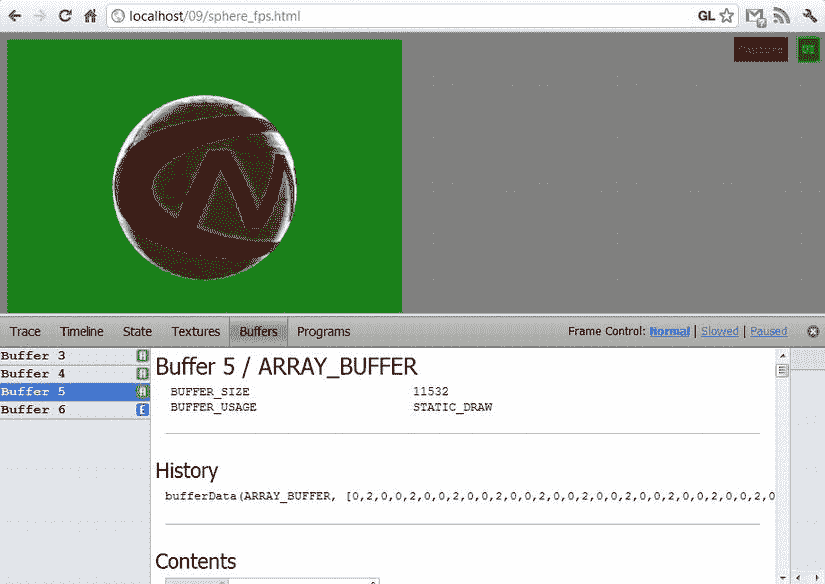

[图 9-7](#_Fig7) 。WebGL 检查器的缓冲区标签

在[图 9-7](#Fig7) 中，显示了缓冲区选项卡，显示了我们的顶点缓冲对象(VBOs)的内容。我们可以使用纹理选项卡来确保我们的纹理已经正确加载，查看过滤器和夹紧参数，以及其他关于纹理的信息(见[图 9-8](#Fig8) )。

[图 9-8](#_Fig8) 。WebGL 检查器的纹理数据

“程序”标签将显示我们程序的状态，以及属性和制服以及我们的顶点和片段着色器源代码，如图 9-9 所示。

[图 9-9](#_Fig9) 。WebGL 检查器的“程序”标签

状态选项卡显示了我们所有可调整的状态设置，如是否启用混合、混合颜色、透明颜色、多边形正面的方向等等，如图 9-10 所示。

[图 9-10](#_Fig10) 。WebGL 检查器的“状态”选项卡中显示的 WebGL 状态设置

时间轴选项卡将显示各种指标的实时数据，如帧时间、图元/帧和缓冲存储器。时间线是这个非常有用的程序的一个方面，它可以使用一些工作来产生更可扩展和可读的结果(见[图 9-11](#Fig11) )。

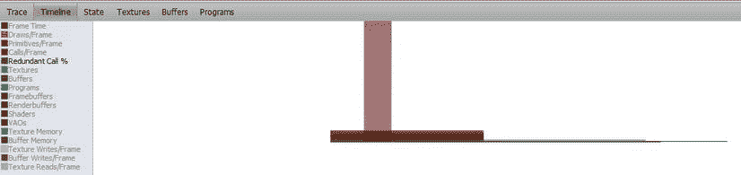

[图 9-11](#_Fig11) 。WebGL 检查器的时间线指标

到目前为止，我们还没有讨论捕获按钮。在我看来，这是 WebGL inspector 最有用的功能。当您点击该按钮时，WebGL inspector 将捕获屏幕，并生成一个完整的帧轨迹，如图 9-12 中[的轨迹选项卡](#Fig12)所示。我们的示例程序很小，只有 19 行，但是复杂的 WebGL 应用程序可以有数千行，我们将在后面演示。突出显示为黄色的行是多余的。这是帮助提高性能的重要信息，如下一节所示。您可以选择不突出显示多余的电话，但可能会发现反馈很有用。WebGL inspector 还可以让我们减慢或暂停帧的推进。

[图 9-12](#_Fig12) 。“跟踪”选项卡显示使用 WebGL 检查器捕获的帧

在图 9-12 的第 19 行，右边有两个图标。第一个带有向右的箭头，让我们从单个 draw 命令运行独立的输出。在我们的示例应用程序中，这是整个场景。然而，在有几个绘制调用的更复杂的应用程序中，显示场景的特定部分被渲染是非常有用的。当第二个链接(看起来像一个 *i* )被点击时，一个新的窗口将弹出完整的绘图信息。该弹出窗口很大，首先显示了绘制的元素的网格，可以用鼠标滚轮放大和缩小，并在按住鼠标按钮的同时旋转。这个网格对于视觉上确认我们的顶点已经以正确的顺序渲染是有用的，这样我们也可以确保我们的多边形面的一致缠绕；红色在顺时针和逆时针方向的亮度是不同的。我们还可以显示使用的纹理坐标网格。接下来，显示程序统一和当前值的列表，后跟属性。最后，我们看到了 WebGL 设置的状态:顶点，片段，深度/模板和输出。该弹出窗口的第一部分如[图 9-13](#Fig13) 所示。

[图 9-13](#_Fig13) 。有关 WebGL 检查器中特定绘图调用的信息

如果我们点击显示在轨迹日志右侧的图像像素(未在[图 9-12](#Fig12) 中显示),我们将在一个新的弹出窗口中获得关于颜色成分以及如何获得最终像素颜色的所有信息。我们的例子没有混合，所以最终的颜色计算很简单，如图[图 9-14](#Fig14) 所示。但是，当与非透明 alpha 值混合时，此信息可能非常有用。

[图 9-14](#_Fig14) 。WebGL 检查器的像素历史

最后，WebGL inspector 对于指出错误也很有用。重新添加 gl.enable(gl。DEPTH_TEST_FOOBAR)线使轨迹的错误线以红色高亮显示，如图[图 9-15](#Fig15) 所示。

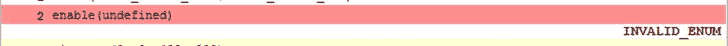

[图 9-15](#_Fig15) 。无效关键字导致的 WebGL 检查器错误

如果我们试图获得一个不存在的属性位置(例如，试图获得错误输入的属性 aVertexPosition2 而不是 aVertexPosition)，getAttribLocation 返回(-1)，这是一个无效值(参见[图 9-16](#Fig16) )。

[图 9-16](#_Fig16) 。属性位置值无效导致的 WebGL 检查器错误

 **注意**如果一个变量确实存在于你的顶点着色器中，但你从未使用过它，编译器会将其标记为未使用，并在编译和链接你的程序时将其移除。如果您稍后尝试获取它的位置，您将收到(-1)并产生相同的错误。

最后，假设我们调用了 gl.bindBuffer，将 null 值绑定到 WebGLBuffer 参数。这很容易发生，例如，在从文件中生成或读取数据时将数据写入变量，但在绑定已经初始化为 null 且从未写入的时使用不同的变量。突出显示的错误如[图 9-17](#Fig17) 所示。

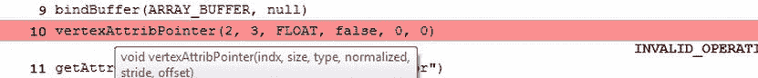

[图 9-17](#_Fig17) 。将 VBO 绑定到 null 导致 WebGL 检查器错误

正如您所看到的，WebGL inspector 是一个具有多种用途的工具，我敦促读者熟悉它——您会感谢自己的。

使用 glsl 装置进行测试

单元测试代码——将程序的各个部分隔离成小单元，并在每个单元上运行自动化测试——是一种有价值的方法，可以确保程序按照预期的方式运行，并在重构时检测代码中的错误(对代码进行结构性而非行为性的更改，以改进代码设计和质量)。

在 http://code.google.com/p/glsl-unit/有一个相当新的 GLSL 单元测试框架。要克隆 git 存储库，您可以使用:

git clone

[https://code.google.com/p/glsl-unit/](https://code.google.com/p/glsl-unit/)

常见陷阱

使用 WebGL 编程时，有一些错误比其他错误更容易遇到。这里有一些要避免的陷阱。

缓存内容

没有使用文件更改。浏览器仍然在使用旧版本。使用 Shift-F5 进行硬浏览器刷新，或者通过重命名资源文件或故意向着色器程序或 javascript 文件添加错误(临时)来引起浏览器的注意。

为不兼容的上下文重用画布

“2D”和“webgl”上下文不兼容。尝试使用一个然后用另一个调用 canvas.getContext 将返回 null，而不是获得有效的上下文。

移动设备碎片精确支持

WebGL 只要求片段着色器浮点值支持 mediump。许多手机和移动设备只支持这种精度。如果您的目标是移动用户，请不要使用 highp。我们还可以通过调用 getShaderPrecisionFormat 函数来轮询设备支持的精度。这可以让您根据设备功能提供不同的着色器。

摄像机视角朝向错误的方向

确保虚拟摄像机指向场景的正确方向，并且顶点位于剪辑空间和视口内。

质地问题

尝试生成纹理贴图时使用非 2 次方(NPOT)纹理是一个致命错误。可用的纹理单元的数量也有限制。如果你运行图 9-18 所示的 webglreport，你可以很容易地看到你当前的浏览器和 GPU 支持的确切数字。

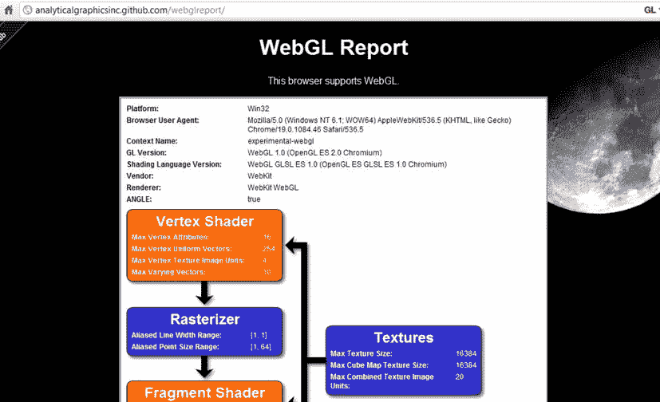

[图 9-18](#_Fig18) 。使用 webglreport 查看您的浏览器 WebGL 支持

性能因 GPU 而异

GPU有不同的硬件设置和优化。在一个 GPU 上优化的东西在另一个 GPU 上可能非常慢。

加载错误的资源

检查是否加载了正确的文件，无论是纹理图像、网格还是着色器文件。还要确保没有违反跨原始资源共享规则。

浏览器差异

建议在调试时在不同的浏览器中尝试您的代码，因为结果可能会有所不同，或者只在某些浏览器中有效。原因是一些 WebGL 规范是依赖于客户端的。有最低要求，但不是所有的实现都是一样的。也不是所有的扩展都受支持。要轮询浏览器支持的可用扩展列表，您可以使用以下函数:

domstring[]getsupportxtenderextensions()

对象 getExtension(DOMString 名称)

getSupportedExtensions 函数返回一组受支持的扩展名。返回的数组中的每个字符串都将从 getExtension 返回一个有效的对象，而不在受支持的数组中的任何字符串名将返回 null。返回的对象表示扩展已被正确启用，但不需要包含任何函数或常数。

我们还可以使用函数 getParameter(GLenum pname)来查找其他浏览器支持信息，例如使用以下命令检查支持的最大纹理大小:

GL . get parameters(GL)。MAX_TEXTURE_SIZE)。

即使没有 WebGL 浏览器差异，也有 JavaScript 浏览器差异需要测试。例如，JavaScript 对象或数组中的尾随逗号在大多数浏览器中是正确的，但在 Internet Explorer 中是错误的。

ie) [1，2，3，]在 ie 中是不好的，而[1，2，3]在所有浏览器中都是好的。

而{"a":"1 "，" b":"2 "，}在 IE 中是不好的而{"a":"1 "，" b":"2"}在所有浏览器中都是好的。

在[http://analyticalgraphicsinc.github.com/webglreport/](http://analyticalgraphicsinc.github.com/webglreport/)有一个很好的查看浏览器 WebGL 常量的实用程序，Chrome 输出示例如图[图 9-18](#Fig18) 所示。

外部着色器解析错误

当从外部文件加载着色器时，您可能会注意到一个似乎有效的语句，如以下任一项:

if(a < b){；}

if(a & & b){；}

每一行都会导致着色器无法加载，因为 XML 实体“

if(a<b){；}

if(a&&b){；}

或者，您可以调整从对 HTML 的 Ajax 调用返回的数据类型，然后用 jQuery 解析出脚本标记:

$.ajax({

异步:假，

url: './my_shader.fs '，

成功:函数(数据){

fs_source = $(数据)。html()；

},

数据类型： 'html'

});

性能

对于简单的应用程序，遵循 WebGL 最佳优化实践并不重要。浏览器和 GPU 可以非常快速地执行计算，因此少量的绘制调用将快速渲染，并以良好的帧速率出现，无论我们的代码是否经过优化。然而，随着我们的应用程序变得越来越复杂，并涉及更多的 WebGL 和 GPU 交互，它们将很快变慢，其影响范围从轻微的明显到令人虚弱的使用。对我们来说幸运的是，有已知的方法来获取现有的代码并优化它。

测量帧速率

为了查看我们所做的是否真的改善了处理，我们需要测量我们正在渲染的*帧率* (每秒的帧数)。较低的帧速率会显得起伏不定，而较高的帧速率会显得平滑自然。帧速率通常以每秒帧数(fps)来衡量。由于相机是手摇的，无声电影的帧速率可变，约为 14-26 fps。早期的投影仪将 fps 设置为恒定的 24 fps，这当然显得更加平滑。一些较新的电影使用 48 fps，计算机显示器的刷新率通常为 60 赫兹(Hz，赫兹，是每秒的周期数)，尽管现在更大的数字显示器超过 100 赫兹。所以你能达到的帧率越高越好。

为了测量帧率，我们将使用位于 https://github.com/mrdoob/stats.js 的 Github 上的 stats.js 库。这个库是 three.js 框架的作者写的，这个框架在[第 7 章](07.html)中有介绍。下载 stats.js 文件，并将其包含在代码中，如下所示:

接下来，我们需要将 stats

附加到我们的文档，并每次通过 requestAnimationFrame 循环调用它的 update 方法。请注意，如果我们的场景暂停，则不会调用 update 方法。这是个人偏好，否则当应用程序暂停时，fps 将会波动到一个更高但不相关的值。使用 stats.js 库的代码如[清单 9-3](#list3) 所示。

***[清单 9-3。](#_list3)*** 向我们的应用程序添加统计计算器

var Stats = new Stats()；

…

函数 initWebGL()

{

…

…

attach stats()；

(函数 animLoop(){

如果(！暂停){

setupwbgl()；

setMatrixUniforms()；

draw scene()；

stats . update()；

}

requestimationframe(aniloop，canvas)；

})();

}否则{

alert("错误:您的浏览器似乎不支持 WebGL。");

}

}

函数 attachStats()

{

stats . getdomelement()style . position = ' absolute '；

stats . getdomelement()style . left = ' 0px '；

stats . get item(). style . top = ' 0px '；

document . body . appendchild(stats . getdocument())；

}

 **注意:**你可以通过使用 setMode 方法查看渲染帧而不是 fps 所用的毫秒数:

stats.setMode（1）;0： 满分频， 1： 毫秒

统计部件显示在[图 9-19](#Fig19) 的左上角。

[图 9-19](#_Fig19) 。显示 stats.js 的 fps 指标

当我们使用 stats.js 并打开多个浏览器选项卡时，如果我们切换到不同的选项卡，然后返回，当我们返回时，帧速率会急剧下降。这很好，因为它表明 requestAnimationFrame 正在如承诺的那样工作，并且没有执行不必要的动画。

优化的复杂性

很难确定如何优化 GPU，因为有许多不同的硬件实现，一些有助于某些 GPU 的优化实际上会影响其他 GPU 的性能。

瓶颈

为了优化代码，您通常需要找到瓶颈——系统性能最受限制的地方——并修复它们。

很多人都熟悉的一个例子是洗衣服和烘干衣服。假设你有三台洗衣机和一台烘干机。每台洗衣机每次洗衣需要 30 分钟，烘干机需要两倍的时间:每次洗衣需要 60 分钟。洗衣机和烘干机的容量是一样的。我们需要等待干燥机完成，并受到所用时间的限制；这是我们系统的瓶颈。

假设我们有三车衣服要洗。进行 3 次洗涤的总时间为 210 分钟(并行洗涤 30 分钟+每次干燥 60*3)。我们可以通过以下方式限制或消除瓶颈来提高系统性能:

*   减少干燥时间
*   增加机器的生产能力
*   购买更多干衣机

有了第一个改进，假设你可以摆弄机器，把烘干时间缩短到 45 分钟。3 次装载的总时间为 165 分钟(30 + 45*3)。

对于第二个改进(但没有速度改进)，假设您可以修改烘干机，以处理两个完整的负载，而不是一个。您仍然需要进行 2 次完整的干燥机循环(1 次半容量= 1 台洗衣机负载，然后 1 次全容量= 2 台洗衣机负载)，但总时间减少到 150 分钟(30 + 60*2)。

对于第三个选项，如果您可以购买两台额外的机器，您的总时间将减少到 90 分钟(30 + 60)。

在洗衣机/干衣机的例子中，购买更多的硬件(类似于拥有更多的计算能力或 RAM)会带来最大的改进。然而，在其他情况下，瓶颈可以通过更有效的算法来改善。

例如，如果您有一个需要 1000 个数字的计算，并且该计算的当前复杂度以 n 3 的顺序增加，则需要 10 亿个计算单元才能完成。如果您购买 4 台机器并在它们之间分配计算，每台机器仍需要 250，000，000 次计算。然而，如果你可以在不购买任何新东西的情况下，将算法的复杂度降低到 n 2 ，你就减少了 1000 到 1000000 的计算成本。

WebGL 瓶颈

虽然优化不是绝对的，但是有一些通用的最佳实践指南，可以最大限度地提高性能并限制瓶颈。昂贵的操作包括阻止浏览器和 GPU 的通信以及不必要的计算和查找。片段着色器要执行的计算最多，因为它对场景中的每个像素都进行操作。由于这个原因，片段着色器也经常成为应用程序中的瓶颈。

片段着色器

片段着色器作用于每个像素。因此，这是计算瓶颈和性能损失的可能来源。判断片段着色器实际上是否是瓶颈的一种方法是减小画布的大小并比较帧速率。如果有显著的性能改进，那是因为需要计算的像素更少了，所以您应该尝试优化片段着色器。

一个技巧是做相反的事情:片段着色器完成后，将画布拉伸到更大的尺寸。这不需要更多的 GPU 计算，应该是一个相对便宜的客户端操作。当然，这只有在拉伸产生可接受数量的伪像或锯齿标记时才是可行的(也就是说，它看起来仍然很好)。

浏览器资源

甚至在我们开始渲染我们的场景之前，我们需要加载资源。有几种方法可以减少资源的物理大小，从而缩短网页的初始加载时间。

缩小 JavaScript 文件

当我们的代码为生产做好准备时，我们可以将多个文件组合起来并缩小成一个压缩文件。有很多工具可以做到这一点，从直接剪切/粘贴源文件到上传文件:

[http://www.minifyjavascript.com/](http://www.minifyjavascript.com/)

[http://jscompress.com/](http://jscompress.com/)

要使用命令行:

[http://html5boilerplate.com/docs/Build-script/](http://html5boilerplate.com/docs/Build-script/)

[http://developer.yahoo.com/yui/compressor/](http://developer.yahoo.com/yui/compressor/)

纹理

我们应该保持纹理尺寸尽可能的小。如果一个较小的 128 x 128 的纹理看起来和一个较大的 512 x 512 的几乎一样，我们应该使用它。内存会小 16 倍。其次，我们应该选择一个合适的图像格式。BMP 图像通常比 png 大，png 比 JPEGss 大，JPEG 比 WEBPs 大。您选择哪种格式还取决于您是否需要 alpha 通道，以及您可以承受多少图像数据丢失，同时仍能获得令人满意的图像质量。

浏览器与 GPU 能力的对比

GPU 的计算速度比客户端的 JavaScript 快几个数量级。在 GPU 上，许多许多操作可以并行完成，并使用编译后的本机代码。因此，如果可能的话，任何“重担”都应该由 GPU 来承担。

阻塞 GPU

GPU 从与顶点属性相关联的应用程序获取数据流。这些流然后到达顶点处理器，然后到达片段处理器。GPU 并行计算，但 JavaScript API 和 GPU 之间的通信更串行。自然，我们不希望尽可能地阻止这个浏览器与 GPU 的通信。这样做将导致我们的程序似乎停滞不前，帧速率下降。那么我们能做些什么来限制不必要的浏览器与 GPU 通信呢？

批量提取调用

我们应该尽可能地限制 draw 调用(drawArrays，drawElements ),方法是将它们批处理在一起。GPU 可以轻松地同时处理数百或数千个三角形。但是，单个 VBO 的大小也有上限。

 **注意:** Three.js 有一个工具可以合并不相交的几何图形，以减少所需的单独绘制调用的数量。详细信息在/src/extras/GeometryUtils.js 文件和函数 THREE.GeometryUtils.merge 中。

减少缓冲切换

我们应该将顶点属性(如颜色、法线和位置)组合成交错数组，而不是使用单独的 vbo。我们将在本章的后面讨论交错阵列。

减少着色器程序切换

如果我们有几个正在使用的着色器程序和几个对象，如果可能的话，我们希望对使用每个着色器的元素进行分组，以便我们可以限制我们需要更改活动着色器程序的频率。

缓存状态变化(gl.getX/gl.readX)

每次需要轮询 WebGL 的一个状态组件时，浏览器都需要中断 GPU 获取信息。要尽量避免的一些调用有 getAttachedShaders、getProgramParameter、getProgramInfoLog、getShaderParameter、getShaderInfoLog、getShaderSource、getTexParameter、getParameter、getError、getActiveAttrib、getActiveUniform、getattrib、getUniformLocation、getVertexAttrib、getVertexAttribOffset、getTexParameter、getRenderbufferParameter、getFramebufferAttachmentParameter、getBufferParameter parameter 以及关联的 set *X* 调用。如果可能的话，我们应该用 JavaScript 存储这些信息的缓存版本。我们还希望限制统一更改，因为它们需要与 GPU 进行交互。要限制的其他 WebGL 调用是 readPixel 和 finish。

不要在生产中使用 getError

如上所述，使用 getError 查询昂贵的 GPU。在开发过程中持续使用它，但不要在代码进入生产环境后使用它。

移除多余的呼叫

我们已经展示了 WebGL inspector 如何非常有助于向您展示不必要的 API 调用。不必要调用的一个例子是在没有任何改变的情况下每帧设置一个状态。这可以通过将特定的状态设置代码移动到呈现循环之外的初始化函数中来补救。

另一个不必要冗余的例子是通过重新计算每个球体的顶点来生成 1000 个球体，然后在场景中置换它们。相反，计算一次单位长度(1 = x^2 + y^2 + z^2)球体的顶点并存储它们。然后对于其他球体，缩放和变换所有生成的点以产生方差。这大大减少了所需的三角运算的数量，并用成本低得多的乘法和加法的初等运算来代替它们。

限制活动纹理更改

我们可以通过将小纹理合并成一个更大的纹理来减少改变活动纹理的频率。这个合成图像被称为*纹理图谱* 。一些行星、太阳和月亮的纹理图谱如图 9-20 中的[所示。](#Fig20)

[图 9-20](#_Fig20) 。月球、太阳和一些行星的纹理图谱

我们将在本章的后面使用这个纹理贴图来优化性能。为了提高性能，还应确保生成第 3 章中概述的 mipmaps。

用进废退

如果您没有使用混合或深度测试等功能，请禁用它们。例如，如果您只渲染到二维而没有 MVP 变换，或者如果您正在渲染 2D 对象，而您知道这些对象是按照从最远到最近的顺序绘制的，那么您可以安全地禁用深度测试。

更快的阵列

WebGL 数组自然比传统的 JavaScript 数组快，因为它们利用了新的 JavaScript 类型化数组。将此与交叉存取数组的使用相结合将提高 VBO 和属性性能，我们现在将对此进行解释。

类型化数组

传统上，JavaScript 中传输的原始数据被视为字符串。由于 WebGL 将大量数据传递给 GPU，因此使用类型化数组来提高性能。类型化数组使用原始二进制数据，并具有固定的字节大小和类型，这提高了流效率。

WebGL 使用原始大小:

gl .字节- 1 字节

gl。SHORT - 2 字节

gl。浮点型- 4 字节

JavaScript 中可用的类型化数组有以下几种:

ArrayBuffer， ArrayBufferView， DataView

浮动 32 阵列，浮动 64 阵列

int 16 阵列，int 32 阵列，int 8 阵列

Uint16Array， Uint32Array， Uint8Array

WebGL 中需要类型化数组。你可以在 https://developer.mozilla.org/en/JavaScript_typed_arrays 查看更多关于他们的信息。

交错数组

切换 VBOs 是昂贵的。为了简单起见，属性数据通常是分开的。然而，我们可以将部分或全部数据合并到一个交错数组中，而不是使用单独的颜色、纹理、位置和法线数组。这在性能方面会好得多，因为阻碍性能的不是一次传递给我们 GPU 的数据量，而是所需的单独绘制调用的数量。

交错数组只是在每个顶点将数据混合在一起。在[图 9-21](#Fig21) 中，数组数据的每一行都有 RGBA 颜色数据，后面是 XYZ 位置数据(W 被省略)。每行的元素总数是 7:RGB axyz。当我们告诉 WebGL 如何解释我们的数据时，将需要大小和顺序。WebGL 不关心数据的实际内容，由我们来提供数据的适当上下文。我们可以按照 XYZRGBA 的顺序有效地交错数组。

[图 9-21](#_Fig21) 。使用单独的数据阵列与交叉存取阵列

让我们看看使用交错数组所需的实际代码。在清单 9-4 中，我们展示了两个属性数组的数组声明，以及它下面的一个交错数组的声明。

***[清单 9-4。](#_list4)*** 分离位置和颜色数组和交错数组

//带有分隔数组的正方形

var vertexPositionArray = [

        10.0, 10.0, 0.0,

        10.0, -10.0, 0.0,

        -10.0, -10.0, 0.0,

        -10.0, 10.0, 0.0

];

var verticalarray =[

        1.0, 0.0, 0.0,

        0.0, 1.0, 0.0,

        0.0, 1.0, 1.0,

0.0, 0.0, 1.0

];

//带有交错数组数据的正方形

var vertexInterleavedArray = [

//x，y，z，r，g，b

10.0, 10.0, 0.0, 1.0, 0.0, 0.0,

        10.0, -10.0, 0.0, 0.0, 1.0, 0.0,

        -10.0, -10.0, 0.0, 0.0, 1.0, 1.0,

-10.0, 10.0, 0.0, 0.0, 0.0, 1.0

];

现在我们有了数据，我们可以将它绑定到一个缓冲区，然后在稍后绘制场景时将我们的属性指向缓冲区。清单 9-5 中的[显示了单独的缓冲器。](#list5)

***[清单 9-5。](#_list5)*** 绑定单独的缓冲区并稍后指向属性

//用于位置和颜色数据的两个缓冲区

var vertexpositionbuffer = GL . create buffer()；

gl.bindBuffer(gl)。ARRAY_BUFFER，vertexPositionBuffer：

gl.bufferData(gl。ARRAY_BUFFER，new float 32 ARRAY(vertexPositionArray)，gl。STATIC _ DRAW)；

var verticalrbbuffer = GL . create buffer()；

gl.bindBuffer（gl.ARRAY_BUFFER，顶点颜色缓冲区）;

gl.bufferData(gl。ARRAY_BUFFER，new float 32 ARRAY(vertexcoloraray)，gl。STATIC _ DRAW)；

…

gl.bindBuffer(gl)。ARRAY_BUFFER，vertexPositionBuffer：

gl . verticalpointer(vertexplicationattributes，3，GL)。浮点，false，0，0；

gl.bindBuffer（gl.ARRAY_BUFFER，顶点颜色缓冲区）;

gl . verticalpointer(verticalcolor 属性，3，GL)。浮点，false，0，0；

vertexAttribPointer 的最后两个参数是*步幅*和*偏移*。这些以字节为单位，默认值都是 0。

进展

stride 让 WebGL 知道数组中每行顶点数据相隔多远。所以对于 vertexPositionArray，这是 3 *Float32Array。字节每元素= 12。以下语句将产生与使用默认步幅 0 相同的结果。

gl . verticalpointer(vertexplicationattributes，3，GL)。浮点值，false，12.0；

对于我们的交错阵列，我们的跨距为 6 * float 32 阵列。每元素字节数= 24。请注意，我们还可以使用一个包含“垃圾数据”的数组，这些数据是我们在每行中没有使用或稍后使用的，例如://[r，g，b，x，y，z，some _ extra _ value]在这种情况下，跨距将是 7 * Float32Array。BYTES_PER_ELEMENT = 28，即使我们仍然只使用每行的 24 个字节。

抵消

偏移量告诉 WebGL 从哪个字节开始读取数据。对于[清单 9-4](#list4) 中的 vertexPositionArray，如果我们想要丢弃前两个数字并从第三个开始，我们将使用偏移量 2 * Float32Array。每元素字节数= 8。我们的前三个顶点是:

(0.0,10.0,-10.0)

(0.0,-10.0,-10.0)

(0.0,-10.0,10.0)

当我们需要指向交错数组中的特定数据属性时，stride 和 offset 真正派上了用场。使用相同的缓冲区，我们可以将属性的偏移量设置为不同的适当值。对于清单 9-4 中的[交错数据，位置数据没有偏移，而颜色数据是 3 * Float32Array。BYTES_PER_ELEMENT = 12 字节，所以我们将其偏移量设置为这个值，如](#list4)[清单 9-6](#list6) 所示。

***[清单 9-6。](#_list6)*** 使用单个缓冲器进行数据间插

//使用单个缓冲区的交错数据

var vertxinterleave dbuser = GL . create buffer()；

bindBuffer(gl。ARRAY_BUFFER，vertexInterleavedBuffer)；

gl.bufferData(gl。ARRAY_BUFFER，new float 32 ARRAY(vertexInterleavedArray)，gl。STATIC _ DRAW)；

…

bindBuffer(gl。ARRAY_BUFFER，vertexInterleavedBuffer)；

gl . verticalpointer(vertexplicationattributes，3，GL)。浮点值，false，24.0；

gl . verticalpointer(verticalcolor 属性，3，GL)。浮点，false，24，12；

索引缓冲区

如果可能的话，使用索引缓冲区，因为 GPU 针对它们的使用进行了优化。索引缓冲区允许我们重用顶点，因此需要在 CPU 和 GPU 之间传输更少的数据。

早期估算计算

您不会在每次需要使用圆周率时都计算到小数点后 100 位，而是使用预先计算的值。此外，圆周率精确到 100 位小数很可能是不必要的，并且不会在最终结果中产生任何差异。这展示了计算中的两个重要概念:

*   最快的计算是不需要进行的计算。
*   如果(视觉)结果大致相等，估计和简化往往比精确更好。

重用预先计算的值比多次执行计算要好。例如，如果每个顶点计算 cos(时间),在我们的 JavaScript 中每帧计算一次这个值，并作为统一值传递给顶点着色器，这比每个顶点都计算一次要好得多。

按照从最便宜到最贵的顺序:

*   在代码内部设置为常量的外部计算
*   应用程序设置期间完成的计算
*   计算重做了应用程序的每一帧
*   在顶点着色器中对每个顶点进行计算
*   对片段着色器中的每个像素进行计算

当然，我们还必须考虑到 GPU 比 JavaScript 强大得多，所以在有些情况下，早期用 JavaScript 进行复杂的计算与在 GPU 中多次进行计算一样糟糕，如果不是更糟糕的话。

最佳实践总结

以下是被广泛认为是 WebGL 最佳实践用法的技术:

*   尽可能批量，减少抽签调用的次数
*   交错属性数据
*   减少状态变化查询
*   不要在生产中调用 getError
*   保持纹理尺寸尽可能小；使用纹理贴图和批纹理
*   将尽可能多的计算从浏览器转移到 GPU，这样速度会大大提高
*   确保片段着色器得到优化，因为它是最常用的
*   使用 requestanimationframe

更多资源可在[附录 D](15.html) 中找到。

捏造的例子

我们往往会忘记(或不完全理解)我们所学的东西，除非我们深入研究并亲自尝试。因此，我们现在将编造一个例子，让许多对象在场景中随机移动，以使 WebGL 足够慢，以注意到优化的改进。我们将增加对象的数量，直到我们获得一个差的帧速率，然后我们将使用我们已经获得的调试和性能知识来优化它。

我已经创建了一个例子，09/spheres_original.html，它使用了六个纹理(太阳、地球、月亮、火星、木星和土星)以及一个基本的光照模型和随机运动。最初，每个球形对象将有一个单独的绘制调用，并使用非交错数据。通过调整渲染对象的数量，我们可以降低帧率。在我的机器上，6 个对象以 60 fps 运行，50 个以大约 35 fps 运行，100 个以大约 30 fps 运行，这还可以。一千个对象将帧速率降低到大约 4 fps。我尝试了 10，000，但是我的浏览器只是挂了一会儿。你可以在[图 9-22](#Fig22) 左边看到 50 个物体，右边看到 1000 个。您可以通过更改以下行来调整在您的计算机上渲染的对象的数量，并且可以通过使用显示在画布左上角的 stats.js 小部件来观察帧速率:

[图 9-22](#_Fig22) 。左边五十个物体；右边 1000

var num _ spheres = 1000

较低的-4 fps 是一个很好的起点，可以看到性能的改善。打开 WebGL Inspector，我们可以捕捉到一帧，在 Trace 选项卡中看到每帧执行了 18000 多行；以及如图[图 9-23](#Fig23) 所示的 1000 次总抽取呼叫；“缓冲区”选项卡中有 4，000 个独立的缓冲区；并且使用了超过 40 MB 的缓冲数据。

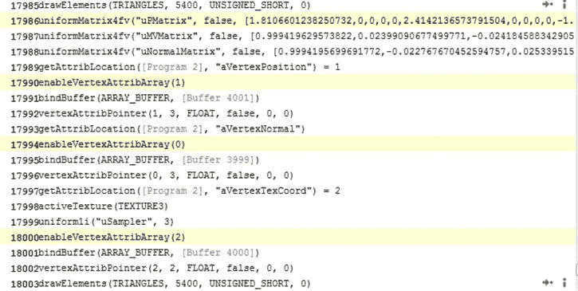

[图 9-23](#_Fig23) 。跟踪捕获显示超过 18，000 条线路，并突出显示冗余调用

捕捉一帧并使用跟踪来为我们识别冗余，我们可以看到正在设置视口，并且每帧都在重新计算透视矩阵。我们的视角不会改变，我们的相机也不会移动，所以这是一种浪费。我们可以将下面几行移动到渲染循环之前:

gl.viewport(0，0，canvas.width，canvas . height)；

mat4.perspective(45，canvas.width / canvas.height，0.1，100.0，p matrix)；

gl .统一矩阵 4 Fv(glprogram . pmatrixuniiform，false，pmatrix)；

这个改变稍微提高了 fps。我们将通过跟踪工作，直到我们尽可能多地消除冗余。接下来，我们可以看到，每次渲染对象时，我们都在重新启用顶点数组属性。我们也可以将这些线移动到渲染循环之前。

vertexpositionattributes = GL . getaftlocation(glprogram，" warning explication ")；

vertxnormalattribel = GL . getattriblocation(glprogram，" warning xnormal ")；

vertxtxcoordattributel = GL . getattriblocation(glprogram，" avertextxcoord ")；

GL . enableverticalscribarray(vertexpositionattributes)；

GL . enablevertexattribarray(vertexNormalAttribute)；

GL . enablevertxattribarray(vertxtxcoordattribute)；

令人惊讶的是，这段代码将帧速率一直提高到了 50 fps！跟踪中不再标记冗余，调用总数从 18，000 减少到 11，000。现在让我们看看我们可以推动这个应用程序显示多少个对象。增加渲染对象的数量，直到帧速率降低到 15 以下。去除冗余的完整代码在 09/optimized _ 1 _ removed _ redundances . html 文件中，输出如图[图 9-24](#Fig24) 所示。

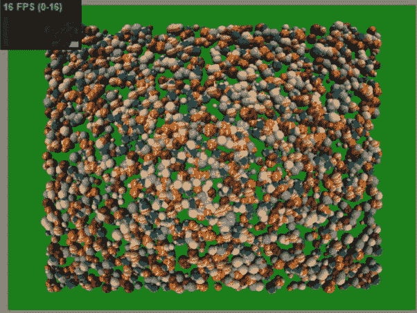

[图 9-24](#_Fig24) 。每秒 16 帧的三千个物体

 **注意:**使用太多的缓冲液可能会导致错误的结果。对于 100，000 个对象，我获得了很高的帧速率，但是在 WebGL 检查器中查看后，只有 12，000 个 vbo，而不是应该有的 400，000 个。痕迹中也只有 33，000 行；我们需要至少 100，000 英镑来分别跟注。我们实际上没有 100，000 个对象的最大证据是 3，000 个对象的结果看起来与 100，000 个相同。

稍后在交错我的顶点属性后，我可以看到 20，000 个 vbo 和更完整的图像，如图 9-25 所示。

除了对 VBO 总数的限制之外，对每个 VBO 的元素数量也有限制。最大索引数是 2^16 = 66536。

优化时，如果一个结果看起来好得不像真的，用你的直觉判断是否达到了浏览器的上限，或者结果是否被缓存在某个地方。

[图 9-25](#_Fig25) 。交错阵列出错。这些物体不是很圆

我们的下一个优化是将顶点位置、纹理坐标和法向数组交织成一个数组，这样我们就可以绘制更多的元素，因为我们为每个对象使用的缓冲区数量从 4 个减少到了 2 个(1 个缓冲区用于索引数组)。交错数组很好地清理了 drawScene 函数。[清单 9-7](#list7) 显示了我们使用交织数据的代码(生成的数据没有显示，但可以在 09/optimized _ 2 _ interleaved . html 文件中查看)并将其发送到 GPU。

***[清单 9-7。](#_list7)*** 交错数组属性指向

函数 drawScene()

{

for(var I = 0；I

setMvMatrix(球体位置[i])

setMatrixUniforms()；

var active _ num = I % textures . length；

gl.activeTexture(gl)。纹理 0 + active_num：

GL . uniform 1 I(GL program . sampleruniform，active _ num)；

bindBuffer(gl。ARRAY_BUFFER，triangles interleavedbuffers[I])；

gl . verticalpointer(vertexplicationattributes，3，GL)。浮点型，false，

8 * float 32 阵列。BYTES_PER_ELEMENT，0)；

gl . verticalpointer(vertxnormplatform 属性，3，GL)。浮点型，false，

8 * float 32 阵列。每元素字节数，

3 *浮动 32 阵列。字节每元素)；

gl . vertxtexcoordattribute，2，GL。浮点型，false，

8 * float 32 阵列。每元素字节数，

6 * float 32 阵列。字节每元素)；

gl.drawElements(gl)。三角形，vertxinindexbuffer[I]。numItems(项目编号)，

gl。UNSIGNED_SHORT，0)；

}

}

现在，如果你输入了错误的步幅，比如 8 *而不是 8 * Float32Array。BYTES_PER_ELEMENT(总字节数)在前面的代码中，你会得到意想不到的结果，如图[图 9-25](#Fig25) 所示。

然而，使用正确的步幅值会产生如图 9-26 所示的预期结果。

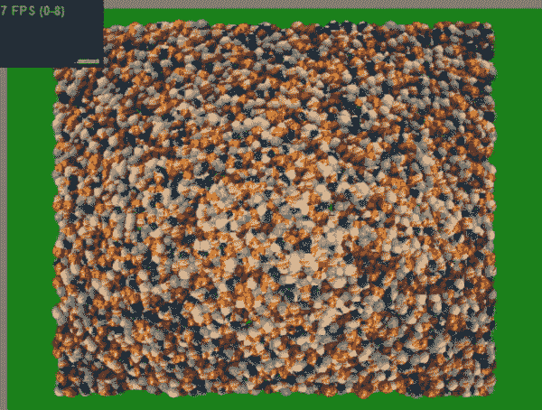

[图 9-26](#_Fig26) 。交错阵列走向正确；10，000 个对象，但帧率较低

接下来，我们将把六个 256 x 256 的纹理合并成一个 512 x 512 的纹理图谱。你会记得纹理图谱图像之前在[图 9-20](#Fig20) 中显示过。使用纹理贴图集意味着我们不需要改变每个物体的活动纹理，我们永远不需要改变统一的采样值！

使用纹理地图最困难的部分是生成坐标。这对于每个内部图像的维度也是 2 的幂的纹理图谱来说实际上是相当容易的，尽管宽度和高度不必相等。我们跟踪每个图像的 x 和 y 偏移，以及图像长度相对于整体纹理的比例(从 0 到 1)图集尺寸，如下所示:

//x_offset，y_offset，x_scale，y_scale

var textureAtlasAreas = [

[0.0，0.0，0.5，0.5]，//月亮

[0.5，0.0，0.5，0.5]，//孙

[0.0，0.5，0.25，0.25]，//土星

[0.0，0.75，0.25，0.25]，//木星

[0.5，0.5，0.25，0.25]，//地球

[0.5，0.75，0.25，0.25]//火星

];

然后，当我们设置我们的球体数据时，我们可以像这样访问这些信息:

var num _ textures = textureatlasareas . length；

for(var I = 0；I

var active _ num = i % num _ textures

var tex _ start _ x = texture atlasareas[active _ num][0]，

tex _ start _ y = texture atlasareas[active _ num][1]，

tex _ scale _ x = texture atlasareas[active _ num][2]，

tex _ scale _ y = texture atlasareas[active _ num][3]；

…

//纹理坐标

interleaveddata . push(u * tex _ scale _ x+tex _ start _ x)；

interleaveddata . push(v * tex _ scale _ y+tex _ start _ y)；

…

}

 **注意**纹理图谱的一个潜在缺点是纹理边界可能会有颜色渗色。

我们将通过调用 gl.generateMipmap(gl。质感 _ 2D)；我们要做的最后一个优化，也是最重要的一个优化是批量抽取调用。

当我们在示例的 setupSphereData 方法中生成网格，然后在 drawScene 方法中使用批的数量时，我们将执行批和每批球体的双循环，而不是循环通过我们要绘制的所有球体。

然而，我们现在至少面临一个问题。之前，我们更改了每个球体对象的模型视图矩阵。然而，现在我们将几个对象绘制批处理在一起，并且仍然每批只调整一次模型视图矩阵。这意味着一批中的每个球体都将在同一位置绘制。我们将只看到每批中最大的球体，较小的球体将隐藏在其中。例如，一次将 10，000 个球体批处理为 40 个，我们将渲染所有 10，000 个球体，但只看到 250 个。我们需要能够设置每个球体的模型视图。我们也不想不必要地更新制服。我们可以将这种计算转移到 GPU，而不是在 JavaScript 中为每个对象计算模型视图。这实际上是一种性能提升，因为 GPU 速度快得多。我们还必须在每次绘制时更新一次平移和旋转量的统一值，而不是针对每个对象。我们计算每个对象模型视图矩阵的原始 JavaScript 代码如[清单 9-8](#list8) 所示。

***[清单 9-8。](#_list8)*** JavaScript 代码用于计算每个对象模型的视图矩阵值

函数集矩阵

{

mat 4 . identity(mv matrix)；

mat4.identity(法线矩阵)；

mat4.translate(mvMatrix，[sp.x_offset，sp.y_offset，sp . z _ offset])；

mat4.rotate(mvMatrix，sp.angle，[sp.x_angle，sp.y_angle，sp . z _ angle])；

mat4 .反向(mvMatrix，法向矩阵)；

sp . x _ angle+= math . random()；

sp . y _ angle+= math . random()；

sp . z _ angle+= math . random()；

sp . x _ offset =(math . cos(sp . angle)* sp . x _ offset _ orig)；

sp . y _ offset =(math . sin(sp . angle)* sp . y _ offset _ orig)；

sp . z _ offset =-25.0+12.0 * math . sin(sp . angle)；

sp . angle+= 0.005；

}

我们可以创建统一的变量来存储这些值，并在我们的顶点着色器中使用它们，而不是重新计算在所有球体中保持不变的余弦和正弦值:

均匀浮动 uCosTime

统一浮动使用时间；

我们现在也将只计算一次球体几何图形，并将其存储，如清单 9-9 所示。

***[清单 9-9。](#_list9)*** 计算单位球面上的点

var unit _ sphere = null

…

函数 calculateUnitSpherePoints(纬度带，经度带)

{

//O(n^2)三角运算-代价高昂！

unit_sphere = {

【顶点】:[]，

"紫外线":[]

};

的(订单编号= 0；纬度，经度++)

var theta = latNumber * Math。PI/latitude bands；

var sinet = math . sin(theta)：

var cosTheta = math . cos(theta)；

for(var long number = 0；longNumber < = longitudeBandslongNumber++) {

var phi = longNumber * 2 * Math。PI/longitude bands；

var sinphi = math . sin(phi)；

var cos phi = math . cos(phi)；

var x = cosPhi * sinTheta

var y = cosTheta

var z = sinPhi *语法；

var u = 1-(long number/longitude bands)；

其中 v =分数字/纬度带；

//位置

unit _ sphere . vertices . push({ " x ":x，" y": y，" z ":z })；

//纹理坐标

unit_sphere.uvs.push({"u": u，" v ":v })；

}

}

}

我们可以使用存储的坐标来生成场景中的所有其他球体:

//位置

interleaveddata . push(radius * vertex . x+spherePositions[mesh _ number])。x _ offset _ orig)；

interleaveddata . push(radius * vertex . y+spherePositions[mesh _ number])。y _ offset _ orig)；

interleaveddata . push(radius * vertex . z+spherePositions[mesh _ number])。z _ offset _ orig)；

//正常

interleaveddata . push(vertex . x)；

interleaveddata . push(vertex . y)；

interleaveddata . push(vertex . z)；

//纹理坐标

interleaveddata . push(uv . u * tex _ scale _ x+tex _ start _ x)；

interleaveddata . push(uv . v * tex _ scale _ y+tex _ start _ y)；

这允许我们不改变 MVP 矩阵，也不需要在生成后使用 spherePositions 数组数据。我们现在可以用清单 9-10 中的代码批量绘制我们的对象。

***[清单 9-10。](#_list10)*** 批量绘制我们的对象

var num _ spheres = 15000

var num _ per _ batch = 250

var batches = num _ spheres/num _ per _ batch；

…

函数 drawScene()

{

GL . uniform 1 f(GL program . costime uniform，math . cos(current time))；

GL . uniform 1f(GL program . sin time uniform，math . sin(current time))；

for(var I = 0；I

bindBuffer(gl。ARRAY_BUFFER，triangles interleavedbuffers[I])；

gl . verticalpointer(vertexplicationattributes，3，GL)。浮点型，false，

8 * float 32 阵列。BYTES_PER_ELEMENT，0)；

gl . verticalpointer(vertxnormplatform 属性，3，GL)。浮点型，false，

8 * float 32 阵列。每元素字节数，

3 *浮动 32 阵列。字节每元素)；

gl . vertxtexcoordattribute，2，GL。浮点型，false，

8 * float 32 阵列。每元素字节数，

6 * float 32 阵列。字节每元素)；

gl.drawElements(gl)。三角形，vertxinindexbuffer[I]。numItems(项目编号)，

gl。UNSIGNED_SHORT，0)；

}

current time+= 0.01；

}

由于我们受限于单个 VBO 可以有多大，我们将使用 10 个分区的球体(每个球体 600 个索引)而不是 30 个分区(每个球体 5400 个索引)来演示批处理的加速。一次渲染 15，000 个这样的球体会产生 3 fps 的效果。渲染 15，000 但一次批处理 250 会产生更好的 45 fps，如图 9-27 所示。

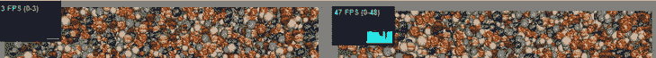

[图 9-27](#_Fig27) 。左图:批量大小为 1 以 3 fps 渲染；右图:-批量大小为 250 以 47 fps 渲染

摘要

本章讨论了如何调试 WebGL 应用程序并提高性能。这是两个重要的主题，将有利于您的 WebGL 开发和用户对您的应用程序的享受。一个以 3 fps 爬行的复杂场景和一个以 40 fps 移动的场景之间的差别是显著的，这可能是用户喜欢你的应用程序还是放弃它的差别。WebGL 可能很难调试，因为有许多因素在起作用:特定的浏览器、计算机和使用的 GPUJavaScript API 着色器程序；以及纹理等资源。其中每一个都可能是误差的来源。幸运的是，有强大的工具可以帮助我们，从我们使用的 IDE 到浏览器开发工具，以及使用 WebGL inspector。

在下一章，也是最后一章，我们将介绍各种各样的效果、技巧和窍门——图像处理、非真实感着色器，以及使用 framebuffer 对象来确定我们场景中的哪个元素当前被鼠标选中并实现阴影贴图。