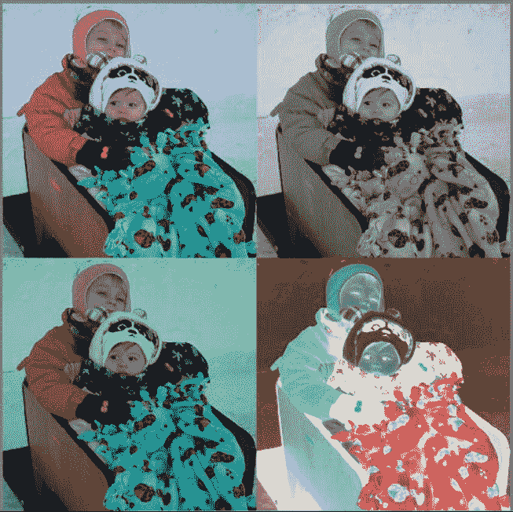

# 十、效果、提示和技巧

在本章中，我们将介绍各种 WebGL 效果、提示和技巧，例如:

*   基本图像处理
*   使用卷积滤波器的图像处理
*   反混淆
*   非真实感着色器
*   帧缓冲和渲染缓冲
*   从画布中拾取对象
*   阴影贴图实现

效果

通过图像处理和卷积滤波器可以实现各种各样的效果，如锐化、模糊、灰度、棕褐色调、颜色调整和边缘检测。

为了应用这些效果，我们将从加载纹理图像开始。然后，我们将在片段着色器中改变纹理中每个像素的原始颜色值。对于这些例子，设置类似于第 6 章中的一些例子，其中算法被用于纯粹在片段着色器中创建图像。这一次，我们有一个开始改变纹理图像。实际上，纹理图像可能来自 HTMLVideoElement 对象，因此我们可以使用这些相同的技术动态地改变视频流。我们将专注于静态图像处理。

基本图像操作

我们的第一个图像处理示例 将显示灰度、反转颜色值和原始纹理图像旁边的绿色图像。为此，我们首先设置一些效果常数和一个变量来存储一个统一的值，该值将通知我们的着色器使用哪个效果:

var NO_EFFECT = 0，

灰度 _ 效果= 1，

负 _ 效= 2，

GREEN _ TINT _ EFFECT = 3；

var effectUniform = null;

当我们渲染到画布上时，我们将实际绘制场景四次，每次使用四分之一的视口并改变效果。效果图如图[图 10-1](#Fig00101) 所示。不幸的是，很难看出黑白印刷有什么不同，所以请访问网站【http://www.beginningwebgl.com/ T2】获得全彩色版本。

[图 10-1](#_Fig00101) 。左上:原图；右上:灰度；右下:反转颜色；左下角:颜色更绿

调整视口和重新渲染可以让我们很容易地一次看到几个变化，这是在同一个场景中使用多个视口的应用，如第 1 章中所讨论的。视窗设置的代码如[清单 10-1](#list1) 所示。其中，我们在视口的不同区域绘制了四次，并通过更改统一值通知片段着色器每次应用哪个效果。

***[清单 10-1](#_list1) 。*** 为视口设置的代码

。。。

//左上角

gl.uniform1i(effectUniform，NO _ EFFECT)；

gl.viewport(0，canvas.height/2.0, canvas.height/2.0, canvas . height/2.0)；

draw scene()；

//左下角

gl.uniform1i(effectUniform，GREEN _ TINT _ EFFECT)；

gl.viewport(0，0，canvas.height/2.0,画布.高度/2.0)；

draw scene()；

//右上角

gl.uniform1i(effectUniform，gray _ EFFECT)；

gl.viewport(canvas.height/2.0，0，canvas.height/2.0, canvas . height/2.0)；

draw scene()；

//右下角

gl.uniform1i(effectUniform，NEGATIVE _ EFFECT)；

gl.viewport(canvas.height/2.0，canvas.height/2.0, canvas.height/2.0, canvas . height/2.0)；

draw scene()；

。。。

完整的代码可以在 10/01_image_processing.html 文件中找到。顶点着色器非常简单，只将原始的 x 和 y 坐标传递给片段着色器: