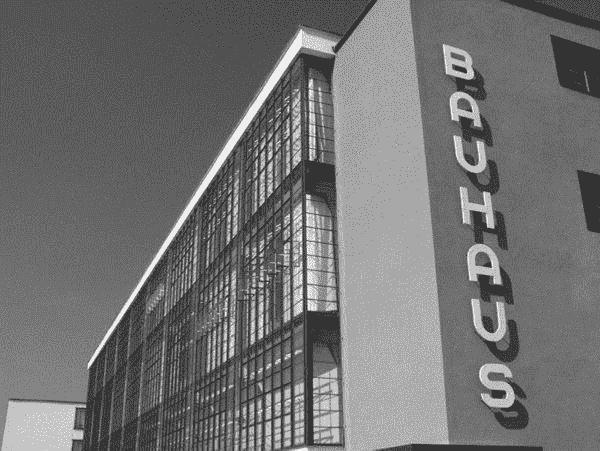
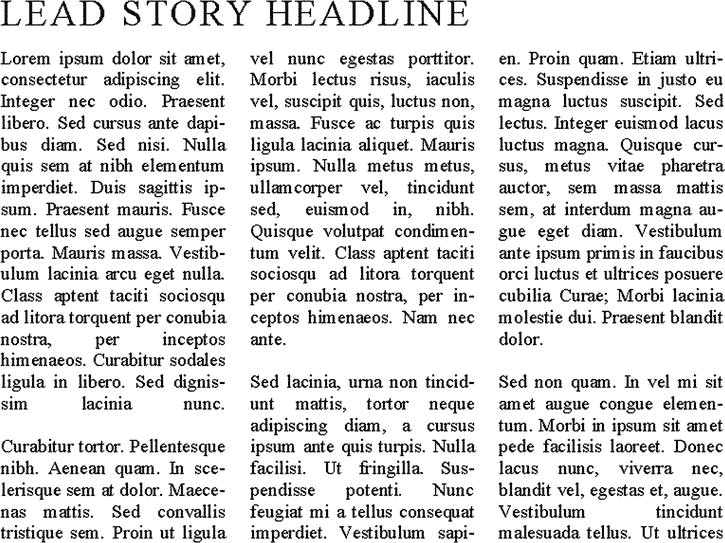
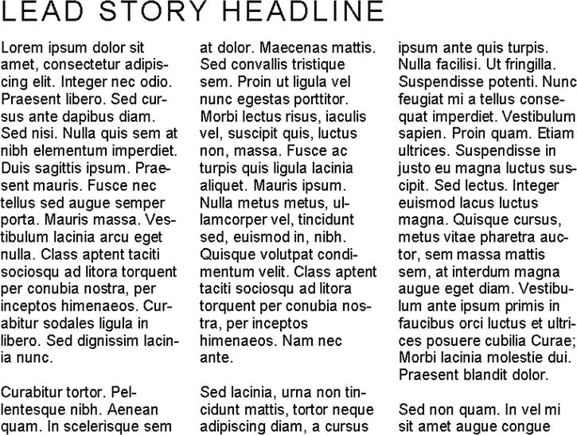
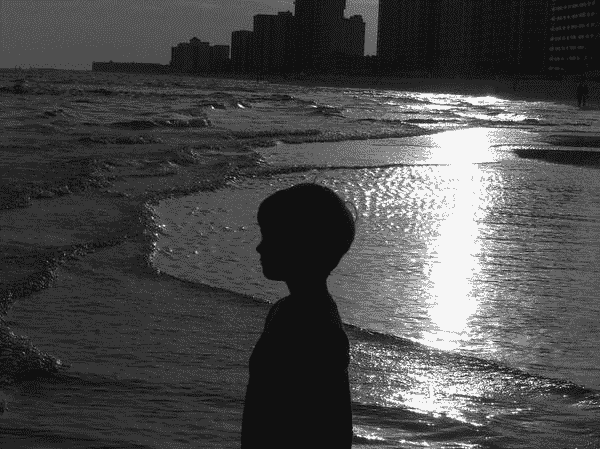
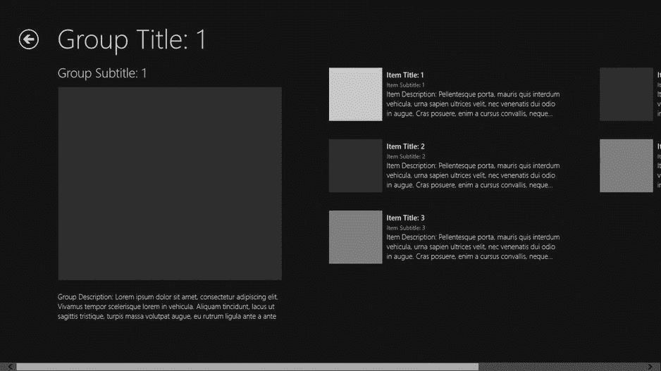
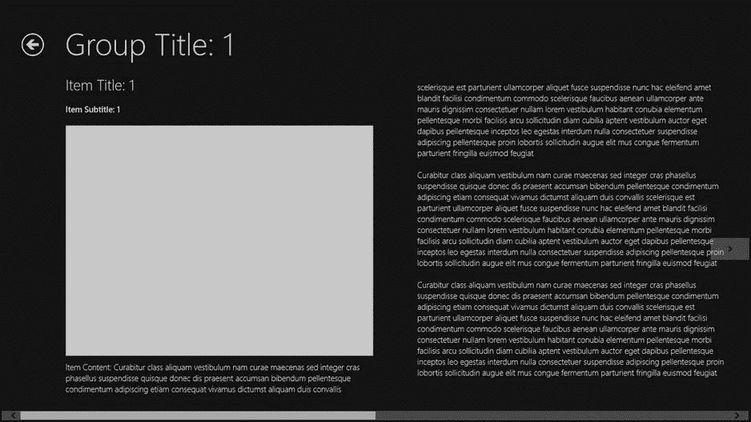
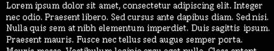
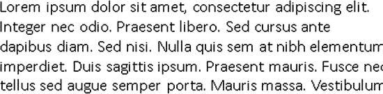
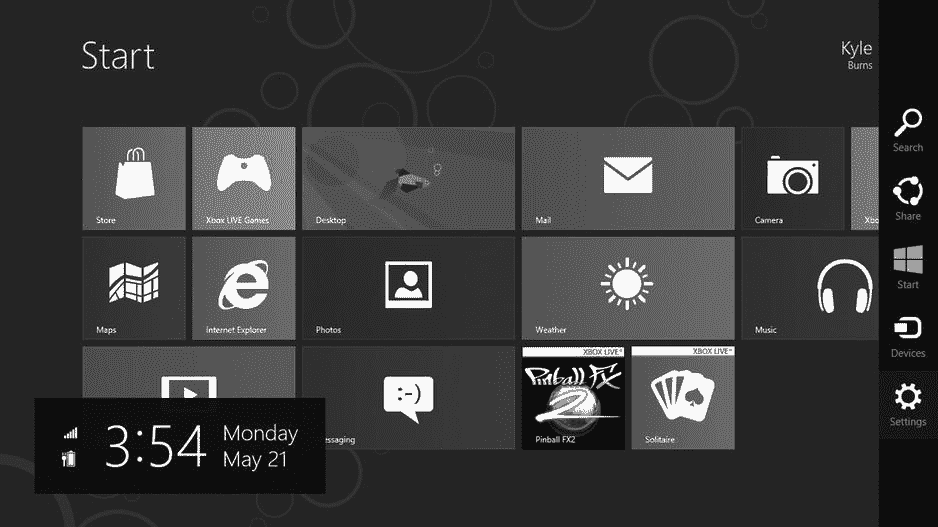

# 二、微软设计语言

除了上一章讨论的基本触摸原则，微软的设计团队开发了微软设计语言，以前称为 Metro，用于指导 Windows Phone 7、Windows Phone 7.5 以及现在的 Windows 8 和 Windows Phone 8 的用户界面开发。微软设计语言的灵感来自于在大都市地区和公共交通中看到的简单易懂的语言，并努力将这种简单和直观的味道带到计算中。在这一章中，我将介绍微软设计语言的元素，展示一些例子，并解释 Windows 8 是如何整合它们的。在进入微软设计语言本身之前，我将介绍一下瑞士设计风格，它的影响在微软设计语言的元素中可以清楚地看到。

瑞士设计风格

微软的设计语言受一种设计风格的影响最大，这种风格被称为瑞士设计风格，或国际印刷风格，它于 20 世纪 50 年代在瑞士发展起来，并在 20 世纪 60 年代和 70 年代真正开始形成自己的风格。

包豪斯的影响

瑞士的设计风格深受包豪斯运动的影响，瓦尔特·格罗皮乌斯于 1919 年在德国魏玛成立了包豪斯艺术学院。包豪斯运动的指导原则是功能胜于形式，因此支持简洁的交流和鲜明的对比胜于抽象的想法和渐变。它促进了为工业化社会设计的艺术和建筑，并且可以大规模生产。包豪斯运动对现代设计和建筑的发展产生了重大影响。如今，网站`http://Bauhaus-online.de`由柏林包豪斯设计档案馆/博物馆、魏玛经典基金会和包豪斯德绍基金会(见[图 2-1](#Fig1) )维护，旨在保存和传播关于学校的信息，并教育人们了解该机构的影响。

[图 2-1](#_Fig1) 。德国德绍的包豪斯建筑

瑞士设计风格的元素

瑞士设计风格的特点是有许多元素，我将在本章中讨论。这些元素包括排版，摄影，图像，大量使用空白，以及严格的组织。这些元素结合在一起，产生了瑞士风格设计作品的独特外观和感觉。

排印

受瑞士设计风格原则影响的艺术的前沿和中心是字体设计。瑞士风格的开发者，以及今天使用这种风格进行设计的人，坚定地认为文本应该清晰简单，不必要的装饰不仅遮蔽了文本中所传达的信息，还会分散人们的注意力。为了与文本应该清晰、简洁和简单的理念保持一致，瑞士设计通常采用无衬线字体，文本左对齐，右参差不齐。[图 2-2](#Fig2) 和 [2-3](#Fig3) 是新闻稿的示例，设计为两端对齐的列和衬线字体(Times New Roman)，后面是使用无衬线字体(Helvetica)和左对齐设计的相同新闻稿，以符合瑞士设计风格原则。请注意两个例子之间的显著差异，特别是字体，以及无衬线字体如何产生更整洁的外观。标题是这方面特别好的例子。

[图 2-2](#_Fig2) 。非瑞士风格的模拟时事通讯

[图 2-3](#_Fig3) 。使用瑞士风格排版的模拟时事通讯

除了关注简单的无衬线字体之外，瑞士设计在排版方面的另一个关键元素是使用对比字体大小和粗细来吸引对文本中某些点的注意或强调。当使用不同的字体大小时，这需要字体大小的明显差异，因此尽管一些设计学校可能提倡 12 点的标题和 10 点的正文，但瑞士设计可能要求 18 点的标题和 10 点的正文，以确保这两种文本元素之间的差异没有问题。

摄影

瑞士设计风格的另一个特点是，设计应该传达一种真实感，当用照片代替图画时，视觉元素会被认为“更真实”。

图 2-4 展示了一片水域上的日落。照片捕捉到了水中的波纹和阳光对水面的影响，给观众一种非常真实的感觉。

[图 2-4](#_Fig4) 。水面上日落的照片

图 2-5 也描绘了一片水域上的日落。照片中出现了许多相同的元素，如水中波纹的阳光反射和轮廓，但推动瑞士设计的理论认为，当使用插图而不是摄影时，观众不会感到他们所看到的是真实的。照片和画都很赏心悦目，但照片更符合瑞士风格。

[图 2-5](#_Fig5) 。水面上日落的画

肖像学

虽然照片比图画或其他插图更受欢迎，但在许多情况下，使用瑞士设计创作的作品通常会大量使用图标，以增加或取代文本。尤其是当瑞士设计用于必须向国际观众传达信息的场合，或者您不能确定需要传达信息的观众是否能理解印刷的文字，不管它们是用什么语言写的。1972 年德国慕尼黑夏季奥运会期间，丰富的图标与瑞士设计的其他元素结合在一起，在国际舞台上大放异彩。奥托·艾舍为奥运会设计了瑞士风格的小册子和传单，并使用了现在人们熟悉的图形图标系统来代表参加奥运会各种活动的个人。这促进了与出席奥运会的国际观众的交流。你还可以在公共汽车站和火车站、公共洗手间([图 2-6](#Fig6) )以及许多消费品上的警告标签中看到瑞士设计和图标的突出例子。

[图 2-6](#_Fig6) 。熟悉的瑞士风格设计有助于避免尴尬的错误

大量使用空格

在瑞士设计中，内容为王。在一个空间里随意放入太多东西会被认为过于杂乱或嘈杂，会分散对所传达信息的注意力。这导致了一个包含大量空白的设计目标，以确保出现在空白区域的任何东西都会立即成为关注的焦点。

图 2-7 显示了一只狗在一个多雪的国家里站岗。“哨兵”是一个描述性的说明，但没有特别注意狗或说明，因为内容都允许一起运行，没有任何分离，因为树木产生的“噪音”分散了说明的信息。虽然这个数字在视觉上很吸引人，但它缺乏瑞士设计原则所青睐的鲜明对比。我将利用大片雪地中的自然空白来突出照片中我希望引起注意的部分和标题，如图[图 2-8](#Fig8) 所示。

[图 2-7](#_Fig7) 。没有空白的照片和说明

[图 2-8](#_Fig8) 。照片和说明带有空白以形成对比

在图 2-8 中，我所做的唯一改变是将文本从树木产生的噪音中移除，让标题独立存在于不间断的空白中。这缩小了照片的焦点，排除了与主题没有直接关系的部分，真正使标题突出。更多的照片可以从顶部和底部裁剪，以使主体更加集中，但在这种情况下，足够的空间来确保冬季场景不会逃过观众的眼睛。无论是第一个版本还是第二个版本都不应被视为更好或更差，因为在有些情况下，目的是关注整个环境，而坚持瑞士设计的原则不是目标，在这种情况下，第一种处理方式可能是首选。

严密的组织

为了与简洁和避免任何干扰内容的主题保持一致，瑞士设计通常以严格的组织为标志。这体现在几何图形的一致性，以及在文本中使用字体大小来传达信息层次，以及坚持使用网格系统以结构化的方式布局文本和其他视觉元素。网格的使用绝对不局限于瑞士风格，它已经在排版设计中使用了几个世纪。在基于网格的设计中，设计图面被划分为一个或多个网格，这些网格用于定位带有单元格的文本和元素。这提供了一个有组织和一致的外观。有时，网格布局的使用可能不太明显，因为网格线不需要与设计图面的边缘垂直和平行，这使得设计可以遵循网格布局，而内容在查看者看来是倾斜的。

[图 2-9](#Fig9) 显示了通过使用网格布局实现的结构组织，但它也展示了在瑞士设计风格中，通过使用字体大小的明显差异来描绘信息层次中的不同级别，排版被用来实现组织的方式。在信息层次的最高层，页眉以 56 磅的字体大小显示。在下一个级别，组标题的字体大小大约是页面标题的一半。在此页面的最底层，项目标题大约是组标题大小的一半。

[图 2-9](#_Fig9) 。演示网格布局和层次结构的 Windows 应用商店应用

微软设计语言

微软设计语言在很大程度上植根于我刚才提到的瑞士设计风格，它指导着 Windows Phone 7/7.5/8 和 Windows 8 操作系统以及 Zune 和 Xbox 360 用户界面的用户体验设计，努力提供一致的外观和感觉，而不管您正在与什么设备进行交互。

微软设计语言原则

微软最早关于微软设计语言的指南将其描述为五个指导原则的汇合，而不是一本规则或食谱。在这一节中，我将介绍您在做出设计选择时应该权衡的原则。

展现对工艺的自豪感

在你的用户界面中，即使是最小的细节也不应该碰运气。用户看到的和经历的一切都应该是计划的一部分，并按照计划工作。此外，信息应该按照精心设计的视觉层次来呈现，并且应该使用基于网格的设计来布局。

快速流畅

应用应该允许用户直接与内容交互，并且应该通过使用 motion 为交互提供反馈来保持持续的响应。应用通常应该以“触摸优先”为设计理念。

真正的数字

微软失败的用户体验实验的一个最明显的例子是 1995 年微软 Bob 的发布。该应用是操作系统的外壳，旨在通过为不同的操作提供真实世界的类比来抽象出计算机的整体“计算机性”。如果您想要检索文档，请单击文件柜。需要写信吗？点击桌上的笔！鲍勃的失败最终是由两个因素造成的。第一个是它被认为是幼稚和傲慢的(许多类似于 Bob 的贝壳确实在幼儿园教室里很受欢迎)。第二，它根本不是人们与计算机交互的有效方式，引入旨在隐藏计算机的抽象概念往往会使交互效率大大降低，尤其是对于一天中大部分时间都必须使用计算机的人来说。微软设计语言原则承认人们知道他们正在与计算机交互，并呼吁设计师拥抱这种媒介。这包括使用云来保持用户和应用的连接，并有效地使用运动和大胆，充满活力的颜色与用户交流。

少花钱多办事

Windows 8 提供了丰富的功能，允许在您的设备和云中运行的应用相互交互。这使得应用能够专注于做一组定义非常狭窄的事情，并以非凡的方式做一件事情，而不是做不好几件事情。为了与包豪斯和瑞士设计的影响保持一致，内容应该是注意力的主要焦点，并且应该很少出现其他东西来分散对内容的注意力。Windows 应用商店应用的全屏特性甚至消除了对窗口 chrome 的需求，允许完全沉浸式的体验，因此当用户在您的应用中时，您的应用会受到他或她的所有关注。

团结一致赢得胜利

在 Windows Store 应用中工作的一个关键是样式已经设置好了。Windows Store 应用的用户在打开您的应用时，会期望他们已经对它有了一定程度的熟悉，因为他们熟悉其他 Windows Store 应用的外观和感觉。一些对单个应用，最终对应用所在的生态系统真正有害的事情是设计决策，这些决策从根本上改变了应用的设计范式，为用户提供了比他们习惯拥有的更“新”和“更好”的东西。你应该努力让你的用户知道你的应用做了它应该做的事情，但是试图通过改变用户界面和导航范例来给用户惊喜只会让他们迷惑，让他们对你的应用失去信任。Microsoft 提供了指南、工具、模板和样式表，使开发人员可以轻松创建外观一致的 Windows 应用商店应用，您应该充分利用这些资源。

Windows 应用商店应用的用户体验指南

除了微软为 Windows Store 应用发布的更为通用的原则之外，还发布了一套全面的指导原则，以便为在这一新生态系统中运行的应用的外观、感觉和行为提供详细的规范性指导。虽然这些指南的全部内容可以在 MSDN 图书馆网站`http://dev.windows.com`上免费获得，但本节并没有全面论述，而是涵盖了最适用于体验 Windows 8 的设计人员/开发人员的几个方面。

应用布局

应用应该使用网格布局来设计，按照内容的要求，使用层次导航方案或平面视图来组织。

当采用分级方法时，分级的顶部代表最低级别的细节，并且导航分级中的每个后续级别随着细节的增加而放大。通常，最高级别，有时被称为*中心* ，是应用的入口点，显示用户可以进入的一个或多个组(参见[图 2-10](#Fig10) )。

[图 2-10](#_Fig10) 。最高层分层导航(Hub)

通过从主枢纽选择一个组，显示下一级导航(通常称为*部分*)。章节页面被安排来提供一些关于章节本身的上下文，并列出最低导航级别和最高细节级别的单个项目(见[图 2-11](#Fig11) )。

[图 2-11](#_Fig11) 。部分级别的分层导航

在节页面中，用户可以通过使用返回箭头(如图 2-11 所示)返回上一级导航到中心，这是一种通过滑动手势(如果启用触摸)或通过使用屏幕左右边缘垂直居中的箭头导航到同级节页面的方法，或者选择项目以继续到详细页面。在导航的详细页面级别，呈现项目数据的粒度视图(参见[图 2-12](#Fig12) )。与部分页面一样，显示后退箭头是为了允许沿层次结构向上导航到组织项目的部分页面。与部分页面一样，用户可以通过在支持触摸的系统上使用滑动手势，或者通过与屏幕左右边缘的箭头进行交互，来选择在同一部分的详细页面之间导航。分层导航特别适合于浏览适合于主-详细分类的信息并与之交互。

[图 2-12](#_Fig12) 。详细页的分层导航

许多应用不适合主从分类，这种分类适合分层导航结构，更侧重于基于文档的风格，熟悉 Microsoft Word、Excel 或 Internet Explorer。对于这种类型的应用，平面导航系统要好得多。平面导航的核心是内容被分成页面，页面上的信息要么不相关，要么在同一层级(见[图 2-13](#Fig13) )。导航条在用户激活时出现，用于在活动文档之间切换，通常显示一个用户可以访问的命令，以将文档添加到会话中(见[图 2-14](#Fig14) )。

[图 2-13](#_Fig13) 。Internet Explorer 的设计使用整个视窗呈现单一文档的平面视图

[图 2-14](#_Fig14) 。激活导航栏以切换活动文档的 Internet Explorer

字体设计

由于它非常强调排版和以文本为中心的内容，如果不提供文本格式和使用的建议，Windows 应用商店应用的用户体验指南就不完整。遵循瑞士设计的传统，在构建应用时应该使用一致的字体。应该使用哪种特定的字体取决于文本的目的。打算用于 UI 元素上的按钮或标签的文本应该倾向于 Segoe UI 字体，这在整个 Windows 8 用户界面元素中使用(参见[图 2-15](#Fig15) )。

[图 2-15](#_Fig15) 。Segoe UI 用于标签和其他 UI 元素

以只读方式呈现给读者的文本块，如新闻文章，应该倾向于使用衬线字体，因为读者习惯于用衬线字体呈现扩展的文本块(见[图 2-16](#Fig16) )。这种字体应该以 9 磅、11 磅或 20 磅呈现，这取决于吸引焦点或显示重点的需要。这与瑞士风格在所有事情上对无衬线字体的偏好有所不同，因为微软设计团队发现在扩展阅读中衬线字体对眼睛更容易。

[图 2-16](#_Fig16) 。只读文本块的 Cambria】

供用户阅读和编辑的连续块应该使用无衬线字体 Calibri(见[图 2-17](#Fig17) )。这种字体的推荐大小为 13 磅，与 11 磅的 Segoe UI 高度相同，因此在同一行上一起使用时，两者将保持一致的外观。

[图 2-17](#_Fig17) 。用于阅读编辑文本块的 Calibri】

不管字体如何，当需要强调某些文本时，强调的适当方式是通过使用与字体大小或字体粗细形成鲜明对比。在信息层次的同一层次上，权重用于强调，而大小用于区分不同的层次。使用下划线或斜体等文本装饰会降低清晰度，不应在 Windows 应用商店应用中用作强调。

其他 Windows 应用商店应用用户体验指南

在这一节中，我已经提到了一些用户体验指南，但有意地将重点放在处理应用视觉外观的指南上，将更多的行为方面留给本书其他部分讨论的主题，当我讨论开发人员可以用来构建优秀的 Windows 应用商店应用的工具时。如果你想在一个地方看到所有这些指南，或者不想等待，我建议你更深入地看看 MSDN 网站的 Windows 应用商店部分(`http://msdn.microsoft.com/en-US/windows/default.aspx`)。

Windows 8 用户界面中的微软设计语言

除了桌面模式，Windows 8 用户界面在很大程度上基于微软设计语言指南和原则。让我们从查看开始屏幕开始(参见[图 2-18](#Fig18) )。

[图 2-18](#_Fig18) 。启动屏幕并激活魅力

开始屏幕具有全屏网格，显示对用户最重要的应用(由用户选择要包含在开始屏幕中的应用来指示),并且用户从中选择他或她想要运行的应用。这假设用户想做的第一件事是运行他或她通常使用的一个应用，网格的布局是尽可能高效地完成这个非常具体的任务。通过激活应用栏(未示出)，用户可以请求呈现所有应用，而不是他们更窄的收藏夹列表，从而允许用户通过额外的步骤运行安装在机器上的任何应用。如果用户不想运行某个应用，而是想执行一些其他任务，比如更改系统设置或搜索文件，用户可以激活屏幕右侧的魅力条，显示一个附加命令列表。

在本章的前面，您看到了在 Windows UI 模式下运行的 Internet Explorer 是平面导航风格的一个很好的例子。关于分层导航风格的一个例子，你可以看看 Windows 商店，那里的应用可以购买或免费下载。当您进入应用时，会显示中枢，显示可用应用的不同类别(参见[图 2-19](#Fig19) )。

[图 2-19](#_Fig19) 。Windows 商店中心页面

从该中心，用户可以直接选择某些详细信息项目，也可以选择深入查看部分页面。

在整个 Windows 8 界面以及随其提供的应用中，您可以看到一个重复出现的主题，即基于印刷字体的界面、鲜艳的颜色和动画，以确保用户认为这些应用响应迅速，并提供与其他应用和云中信息的连接。

结论

在本章中，您了解了 Microsoft 设计语言，它是 Windows 8 用户界面和 Windows 应用商店应用的基础，您了解了一些影响 Microsoft 设计语言发展的早期风格和设计范例。无论您何时构建 Windows 应用商店应用，这些概念都会保留在后台或前台，并且会影响您做出的每个设计决策。虽然本质上足够简单，以至于没有多少设计技巧的开发者也可以有效地创建这些用户界面，但是指南也提供了由视觉设计艺术和工艺领域的技术人员创建的更复杂的设计。这些熟练的设计师被鼓励更深入地钻研包豪斯、瑞士风格和微软的用户体验设计准则。