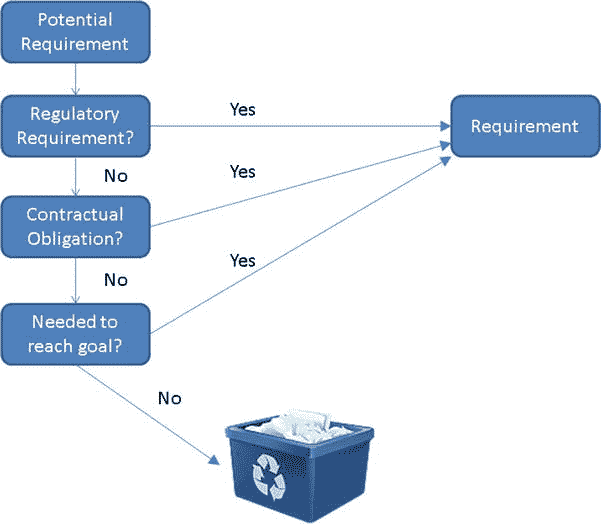
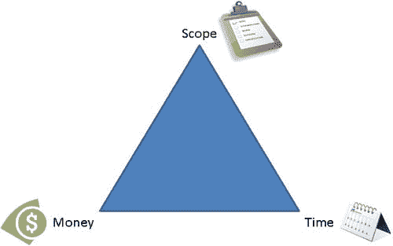

第三章

设计 Windows 应用商店应用

在一个完美的世界里，应用开发人员会收到清晰、简洁的文件包，上面精确地列出了他们的应用应该是什么样子，以及应该做什么。他们从那张纸开始工作，从他们的角度来看，那张纸可能是自发产生的，并产生一个工作的和有用的应用。虽然许多开发人员已经设法找到了这样一个世界，但对于大多数以写代码为生的人来说，这种安排似乎就像到达香格里拉一样遥不可及。

没有拿到完整设计的开发人员必须变得比那些将需求转化为代码的人更优秀，相反，他们必须承担我认为更加困难和有趣的软件设计任务。本章面向那些自愿或必须参与 Windows 应用商店应用设计的开发人员，旨在提供此过程中重要步骤的概述。在这篇文章中，我将介绍与决定应用应该做什么以及如何呈现给用户相关的重要概念。在这一章中，我主要关注的是收集作为设计输入的需求，因为一个完全理解应用需要解决的问题的新手设计师比一个不理解的熟练设计师能创造出更有用的应用。

 **注**收集需求、设计和构建软件有许多不同的方法。虽然我在本章中使用的一些术语可能倾向于一种或另一种方法，但我的意图是捕捉重要和相关的概念，而不管您使用什么方法(如果有的话)来构建您的软件。

沟通是关键

一位同事曾经告诉我，在应用的开发中，没有什么真理应该被认为是不证自明的。几年后，我和一个亲戚的一次谈话强化了这一点。这位亲戚以“我有个朋友在做法庭报道，需要软件帮忙”开始了一段对话。像这样的东西需要多长时间才能建成？”我开始回复:“你刚才问要多久才能建好。。。我的亲戚很快插话道，“但是我没有告诉你这个该死的东西需要做什么！”通常，像这样的对话揭示了客户心中的想法和构建软件的人所听到的之间的脱节，但在一个非典型的转折中，我的亲戚发现了许多商业伙伴不知道的东西——即，如果你想要构建一些东西，你必须清楚地传达你的要求。[图 3-1](#Fig1) 说明了这种断开，通常称为*阻抗不匹配*。

[图 3-1](#_Fig1) 。阻抗不匹配

阻抗不匹配经常导致开发人员构建所要求的而不是所需要的，其主要原因是参与该过程的每个人都非常清楚地看到自己的观点，并且无法想象其他人会以不同的方式看待事情。如果不能完全避免，阻抗不匹配可以减少，方法是在设计过程开始时，承认人们对不同主题的理解会有所不同，并致力于创造一个一切都不是理所当然的环境。

 **注意**没有作为团队的一部分参与软件开发的开发人员仍然应该在他们的头脑中区分开发人员和用户的角色，迫使他们自己站在用户的角度来看待事情。在这里，强迫自己在心里“解释”一切，就好像试图避免阻抗不匹配一样，这将有助于发现隐藏的需求。

应用应该擅长什么？

这似乎是一个显而易见的观点，但是当开始设计你的应用时，首先要确定的是它的用途。在这一点上，细节是不必要的；只需创建一个应用的一般陈述或描述，清楚地说明应用的用途或目的。一个设计良好的应用会有一件它真正擅长的事情，尤其是 Windows Store 应用，正如你将在第 19 章中了解到的，它们可以协同工作来解决比单个应用开发人员预想的更大的问题。最好使用模板语句，如“该应用将 _____ 以便 _____”来帮助您不仅关注*该应用将做什么*，还关注*为什么*该应用将做或它提供的好处。如果我正在构建一个应用来跟踪一辆车的汽油里程数，语句可能是这样的:“这个应用将计算一辆车的燃油经济性，以便我可以更好地预测我的燃油成本。”

 **注意**一定要以一种在整个设计和开发过程中非常明显的方式记录你的应用的高级目的。这构成了应用的主干，当您决定某项功能是否属于应用时，您会经常参考它。如果它不是某种法律或监管手段所必需的，并且对应用所声明的目的没有贡献，那么它就不属于应用。

确定功能需求

一旦应用的主要目的被确定为一种指导原则，确定支持主要目的的必要需求的工作就开始了，称为*功能需求*。根据您正在构建的应用的类型以及参与需求过程的其他人的可用性，有几种技术可以发现或引出需求。一些更常用的技巧包括:

*   *采访* : 利益相关者，或者对正在生产的软件或者软件产生的输出或利益有某种兴趣的人，被咨询以了解他们对应用的期望和需要。在访谈过程中，利益相关者应该感到他们可以自由地表达他们的需求，而不会被告知他们不能拥有某些东西，以确保他们不会忽略提及关键需求。
*   *头脑风暴* : 利益相关者和设计团队的成员一起为需求出主意。这个会议开始于一个“一切皆有可能”的氛围中，就像在面试技巧中一样，同样的原因是不要阻止利益相关者说出他们的需求。当所有参与者可以同时在同一个房间，使用白板和便笺等工具时，头脑风暴会议通常是最有效的，但是一个训练有素的团队可以通过使用电话会议工具远程实现类似的效果。关键是让每个人都集中注意力，同时积极参与。
*   *流程映射* : 对现有流程进行遍历并完整记录，以捕捉为实现目标而执行的所有步骤。这种技术需要一个现有的过程，并且当每一个步骤都可以被仔细检查时效果最好。仅仅知道当前做了什么是不够的，但是理解每一步背后的动机以及它如何有助于实现最终目标也是至关重要的。

 **注意**“我们总是”和“我们从来没有”是两个可以阻止组织改进的短语，除非组织愿意在需要开始一项有益的活动或结束一项没有价值的活动时加上“直到现在”。这让我想起了一个古老的故事，一个女人被她的母亲教导开始准备烤肉时，从每一端切下 1 英寸，就像她祖母所做的那样。当祖母来吃晚饭时，她注意到她的孙女正在切烤肉的末端，就问她为什么要这样做。“奶奶，你总是这样做的，”孙女回答道。老奶奶只是笑着回应道:“但是我的锅短了 2 英寸。”软件项目提供了一个很好的机会来问“为什么”,并确保类似的情况在你的组织中不存在。

评估已确定的要求

识别需求的技术都指定了不要阻止对任何涉众或团队成员来说重要或有效的需求的交流。这并不意味着每一个确定的需求都可以或者应该在最终产品中实现，只是它们都应该可以被评估。一旦确定了潜在需求的领域，下一步就是审查每个需求的适当性。适当性的决定因素简单明了。如果你能直接地(诚实地)交流满足需求对于允许应用满足它的目标是多么必要，那么这个需求就是合适的。这个规则的例外是，一些需求是由外部力量驱动的，比如合同义务和法规要求，这些需求必须被满足，而不管它们是否有助于满足应用的更高层次的目标。图 3-2 展示了用于决定是否将一个潜在需求提升为将要实现的需求的决策过程。

[图 3-2](#_Fig2) 。潜在的需求到需求决策

另一个经常用来确定潜在需求是否应该提升为实际需求的度量是将项目分类为“必须拥有”、“最好拥有”或“不需要”这个想法是“必须拥有”的项目成为需求；不考虑“不需要”的项目；如果在考虑了“必须拥有”的项目之后还有额外的资源可用，那么“最好拥有”的项目也会得到考虑。这种排名模式的危险在于，太多的注意力很容易被放在“值得拥有”的项目上，导致更多的时间、精力和最终的金钱花费在成功申请实际上并不需要的项目上。对于一个没有经验丰富的项目经理的项目，建议采用图 3-2 中描述的更加严格的需求定义过程。

 **提示**敏捷方法的实践者倾向于在所谓的*用户故事*中表达需求。用户故事通常采用某种形式的陈述“作为一个 _____，我需要系统 _____ 以便 _____”虽然术语*用户故事*是特定于某些方法的，但是识别关键涉众和每个需求的目的的想法对于任何方法都是有价值的实践。

根据应用的目的度量需求的行为不仅仅是保持应用忠实于目的的一种练习，它还旨在帮助保持驱动任何项目的三个关键因素之间的平衡，无论是构建软件还是摩天大楼。

*   时间:为了满足组织目标，项目必须在什么时候完成？
*   *钱*:能花多少？
*   范围:要完成的工作主体是什么？

这三个因素通常是所谓的*项目管理三角*、的一部分，如图[图 3-3](#Fig3) 所示。三角形是描述这些因素之间关系的一种很好的方式，因为，正如三角形的边一样，一个因素的改变不会影响其他两个因素。例如，如果有更多的资金，可能会雇用额外的开发人员，完成项目所需的时间将会缩短。通常，控制软件开发项目最简单的方法是保持对范围的严格控制。

[图 3-3](#_Fig3) 。项目管理三角

在一些项目中,“必须具备”的项目不能全部符合范围，因为项目受到时间、资金或两者的限制。在这些情况下，必须对项目进行评估，以确定是否有必须实现但可以等到以后实现的项目。这种优先化过程提供了时间来真正批判性地思考需求，并且可以决定是能够产生有价值的东西，还是因为需求过程停滞而不得不放弃项目。

分解需求

一旦确定了应用满足其目标的必要需求，一个称为*分解*的迭代过程就开始了。软件开发中的分解是指将一个大问题分解成单独的步骤。通过迭代分解，步骤本身被分解成更小的部分，这种情况会一直持续下去，直到没有什么需要分解的了，或者直到你“完成”了。 *Done* 是一个有点主观的术语，但是我认为它已经达到了这样一个程度，熟悉项目的开发人员应该能够坐下来，将需求作为构建应用的蓝图。在开发人员非常熟悉他们正在解决的问题的组织中，当开发工作将由不熟悉这些问题的开发人员执行时，“完成”将不会被分解到几乎同样粒度的级别。

 **注**分解是将令人生畏的问题转化为一系列容易解决的小问题的重要方法。记住关于如何吃大象的建议:一次吃一口。

构建交互流

到目前为止，焦点已经完全集中在应用作为一个整体需要完成什么上，您应该很清楚为了满足这些需求，应用需要输入和输出什么信息。一旦确定了这些需求，您就可以将注意力转移到确定用户如何最有效地将信息输入和输出应用上。在这里，你第一次开始考虑屏幕的想法，但它仍然是一个有点模糊的概念，因为你正在试图确定什么去哪里。在设计过程的这一点上，我通常倾向于避免暗示已经决定了屏幕将如何布局以及使用何种控件的语言。我更喜欢“然后用户选择保存操作”这样的短语，而不是“然后用户点击保存按钮”这是一个细微的差别，但是它将焦点放在确定完成应用目标所需的步骤顺序，以及如何将信息组织到用户交互的屏幕上。完成这一步后，您应该对应用会有哪些屏幕以及什么会触发这些屏幕之间的移动有一个很好的想法。图 3-4 显示了一个导航图，这是一个帮助定义和记录这些流程的有用方法。在其中，您可以清楚地看到应用中预期的视图，以及用户将如何在它们之间移动。

[图 3-4](#_Fig4) 。导航图

线框

一旦团队确定了应用的流程，就该处理线框了。线框是应用屏幕的低保真度草图，专注于屏幕将容纳的信息和命令，而不是担心如何使它们漂亮，并陷入美学细节中。可以在餐巾纸、白板(一定要拍照)的背面捕捉线框，或者通过 Expression Blend 中的 Visio、PowerPoint、Balsamic 或 SketchFlow 等工具捕捉线框。在这一步中，您将决定用户使用什么类型的控件来与应用进行最有效的交互。在 Windows 8 应用中，线框应该反映全屏体验，用户可以专注于内容。[图 3-5](#Fig5) 展示了一个样本线框。请注意，没有花费任何努力使它看起来像一个 Windows 应用；相反，它关注的是信息以及不同交互的结果。

[图 3-5](#_Fig5) 。三维线框模型

视觉设计

在应用的线框达成一致后，一些项目团队将把线框传递给视觉设计师，视觉设计师将使用诸如微软的 Blend for Visual Studio 2012 之类的工具将线框中的想法转化为视觉上有吸引力的界面。理想情况下，设计人员将遵循微软设计语言和瑞士设计风格中的指导原则，开发出与其他 Windows 8 应用外观一致的应用。Blend for Visual Studio 可以生成基于 HTML 的项目，这些项目与 Visual Studio 兼容，因此设计人员的工作可以成为开发人员添加代码以创建成品应用的基础。

 **注意**微软有他们 Blend 软件的多个版本。Expression Blend 可用于使用 SketchFlow 构建原型，以及构建 WPF 和 Silverlight 应用。Blend for Visual Studio 2012 随 Visual Studio 一起安装，可用于设计 Windows 应用商店应用。

大多数情况下，团队没有专门的视觉设计师。他们可能有一个比团队中其他开发人员更有设计眼光的开发人员，或者视觉设计可能只是听天由命。与某些设计范例不同，使用新的 Windows 设计准则实际上给了不喜欢艺术的开发人员一个机会来创建一个吸引人的用户界面。此外，Microsoft 在项目模板中包含内置样式，可用于帮助确保应用具有新的 Windows 外观。

结论

在这一章中，我简要介绍了设计应用的许多概念和步骤。虽然重点是团队执行流程时的情况，但是当您作为一个团队创建应用时，所有步骤都值得考虑。重要的是要记住，除了极少数例外，伟大的应用都是有意的。它们首先被定义，然后被设计，只有当这两个过程完成时，它们才被构建。Microsoft 为新的 Windows 应用商店应用提供了指导，简化了视觉设计的任务，但是为了生成适合其预期目的的应用，需求定义的工作仍然必须以尽可能彻底的方式完成。