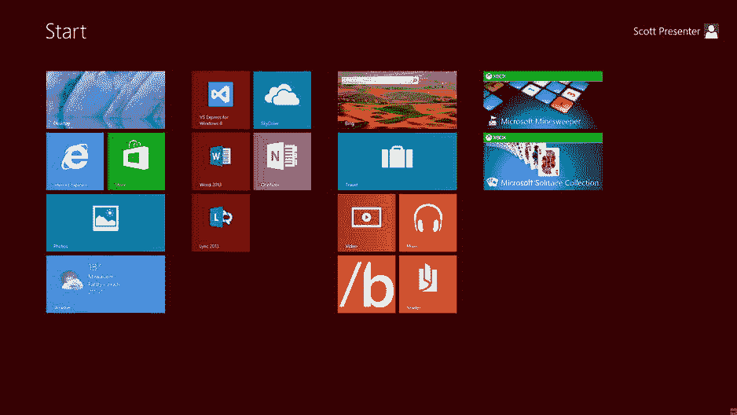
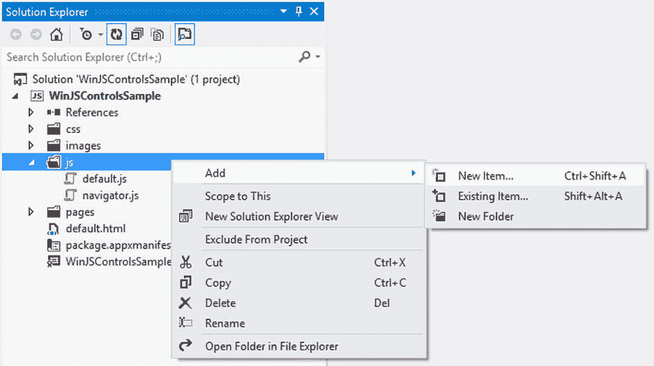
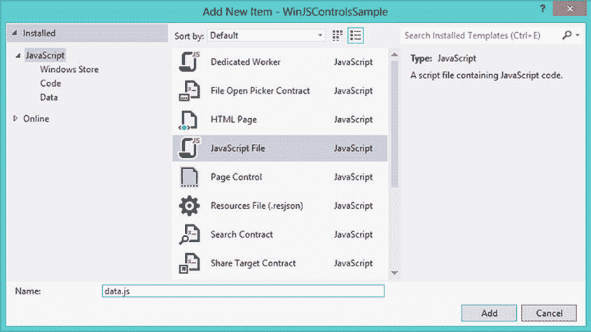
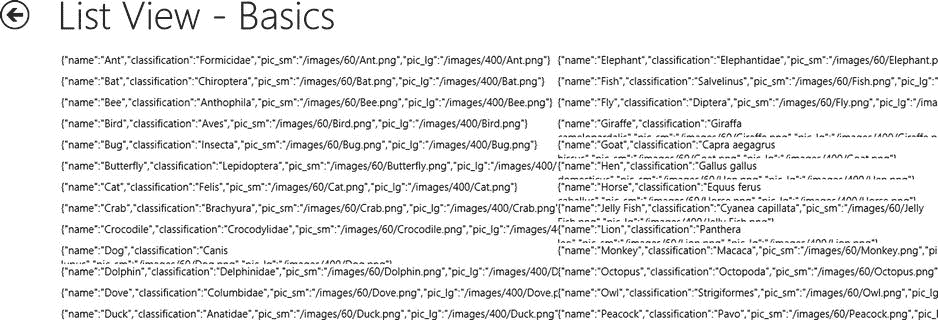
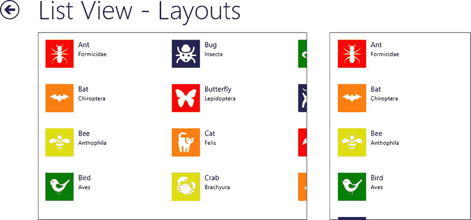
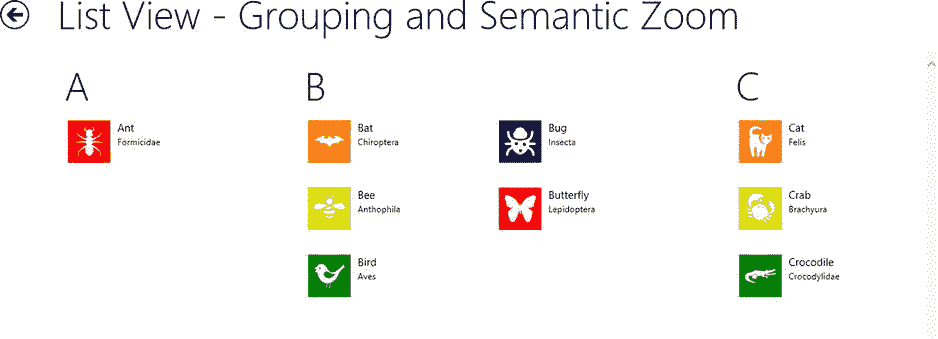
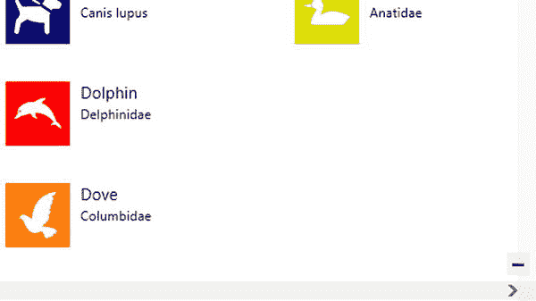
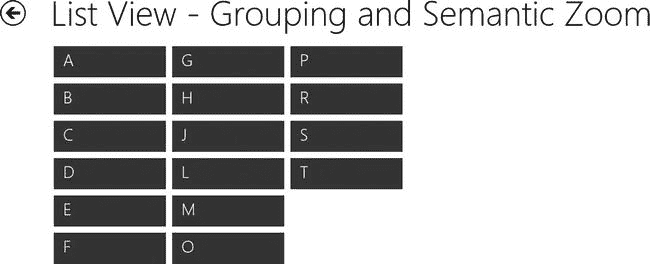

第七章


WinJS 集合控件

在前两章中，我介绍了一些可以用来构建 Windows 应用商店应用的控件。除了`DropDownList`控件之外，到目前为止我介绍的所有控件都是为处理单个值而设计的。每个文本输入控件都与单个字符串相关联；每个按钮控件都与一个操作相关联；每个工具提示显示一个项目的描述或说明。事实上，尽管`DropDownList`控件包含许多可供选择的项目，但它在逻辑上与单个设置相关的选项相关联。

在这一章中，我将介绍 WinJS 提供的基于集合的控件。当您有想要使用模板显示的项目列表时，可以使用这些控件。如果你用过 Windows 8，那么最明显的例子就是 Windows 开始屏幕，如图 7-1 所示。这个开始屏幕显示了我已经安装的应用列表。每一个，都有一个标题；小的或大的平铺图像；以及可选地，显示在标题上的一些实况内容。如你所见，我现在正处于热浪之中。



[图 7-1](#_Fig1) 。Windows 8 开始屏幕

虽然在本章中我不打算演示如何复制 Windows 开始屏幕，但是您将看到如何通过将集合控件绑定到数据列表来构建类似的功能。但是在绑定到数据列表之前，您首先需要理解拥有数据列表意味着什么。

收集

如果您从事编程已经有一段时间了，那么您无疑已经熟悉了项目集合。数组是一种常见的集合类型，数据库查询的结果、驱动器上的文件列表或您喜爱的博客的 RSS 提要中的项目也是如此。WinJS 提供了`WinJS.UI.IListDataSource`接口，用于在 Windows 应用商店应用中处理这些类型的收藏。此接口可用于向集合中添加新项，编辑或移除集合中的现有项，或将集合绑定到控件以在应用中显示。你将在本章中看到的 WinJS 集合控件、`ListView`和`FlipView`，都常用于显示来自`IListDataSource`的数据。

在某些情况下，您必须创建自己的实现`IListDataSource`的 JavaScript 类，比如当您想要将`ListView`控件直接绑定到 web 服务调用的结果时。然而，在许多情况下，您可以利用`WinJS.Binding.List`类从一组数据中创建一个`IListDataSource`。这就是我将在本章中解释的。事实上，在大多数情况下，我推荐这种方法，即使是在处理来自 web 服务的数据时。将 web 服务数据加载到一个数组中，然后将它们包装在一个`List`对象中，这样可以很好地将用户界面与底层数据源分离开来，并为您提供更多的灵活性和控制。我将在第 11 章更详细地讨论数据绑定。现在，我将保持它非常简单，因为本章的主要焦点是用来显示这些数据的控件。

让我们从第 5 章和第 6 章开始，对你的 WinJSControlsSample 项目做一些修改，这将允许你在本章后面使用`ListView`和`FlipView`控件。

项目设置

本章中你将看到的所有例子都将使用相同的项目集合。在这种情况下，它是一组动物。每个动物的定义都有动物的名称、科学分类以及大小不同的图片。让我们将这些数据添加到您的项目中。

1.  打开 WinJSControlsSample 项目。
2.  Right-click on the `js` folder in the Solution Explorer and add a new item (see [Figure 7-2](#Fig2)).

    

    [图 7-2](#_Fig2) 。向 js 文件夹添加新项目

3.  Select the JavaScript File item (see [Figure 7-3](#Fig3)).

    

    [图 7-3](#_Fig3) 。创建 JavaScript 文件

4.  将文件命名为`data.js`,然后单击 Add 按钮。
5.  将清单 7-1 中的[代码输入到您的](#list1)新`data.js`文件中，并保存该文件。

[***清单 7-1。***](#_list1) 添加数据

```js
var animals = new WinJS.Binding.List([
    {
        name: "Ant",
        classification: "Formicidae",
        pic_sm: "/img/60/Ant.png",
        pic_lg: "/img/400/Ant.png"
    },
    {
        name: "Bat",
        classification: "Chiroptera",
        pic_sm: "/img/60/Bat.png",
        pic_lg: "/img/400/Bat.png"
    },
    {
        name: "Bee",
        classification: "Anthophila",
        pic_sm: "/img/60/Bee.png",
        pic_lg: "/img/400/Bee.png"
    },

    // SNIPPED

    {
        name: "Squirrel",
        classification: "Sciuridae",
        pic_sm: "/img/60/Squirrel.png",
        pic_lg: "/img/400/Squirrel.png"
    },
    {
        name: "Turtle",
        classification: "Chelonii",
        pic_sm: "/img/60/Turtle.png",
        pic_lg: "/img/400/Turtle.png"
    }
]);
```

这段代码创建了一个由五只动物组成的数组，每只动物都有一个`name`、`classification`、`pic_sm`和`pic_lg`属性。然后，这个数组被包装在一个名为`animals`的`WinJS.Binding.List`对象中，这个对象将作为本章其余例子的数据源。

您还必须将每种动物引用的图像添加到项目中的适当目录中:一个 60×60 大小的小图像和一个 400×400 大小的大图像。创建图像的教程超出了本书的范围；但是，您可以使用您喜欢的任何方法。也就是说，Syncfusion 已经创建了 Metro Studio，这是一个包含数百个免费和免版税图标的伟大资源。我用它创作了整本书的许多图标和图像。可以从 Syncfusion 的网站这里下载:`http://www.syncfusion.com/downloads/metrostudio` `.`

 **注**本书附带的源代码包括一个名为 WinJSControlsSample 的完整项目，其中包括第 5、6、7、8 章中使用的样本代码。它包括这些示例中使用的所有图像文件，以及 data.js 文件中更长的动物列表。你可以在本书的 press 产品页面(`www.apress.com/9781430257790`)的 Source Code/Downloads 选项卡上找到本章的代码示例。

现在您已经有了所需的数据，让我们来看看显示项目集合的不同控件。

控制器

WinJS 提供了两个控件来显示 Windows 应用商店应用中的项目集合:`ListView`控件和`FlipView`控件。正如您将看到的，它们在许多方面是相似的，但是它们有一个显著的区别。`ListView`控件可以一次显示多个项目，用你的项目填满可用空间。另一方面，`FlipView`控件一次突出显示一个项目，用户可以像翻书一样滚动浏览您的收藏。

WinJS 还提供了几个其他的类，用于`ListView`或`FlipView`。两者都支持使用一个`WinJS.Binding.Template`对象来格式化你的集合中的单个项目。`ListView`还支持两种布局模式，`WinJS.UI.GridLayout`和`WinJS.UI.ListLayout`，这两种模式决定了你的每个项目显示在哪里。最后，您可以使用带有两个`ListView`控件的`WinJS.UI.SemanticZoom`类来允许您的用户选择他或她正在查看的数据的分辨率，缩小时是摘要或组级别的信息，放大时是项目级别的信息。您将在下面看一下这些控件和类，从下一节的`ListView`控件的一些基础开始。

当您学习本章中的示例时，应该将它们添加到前面章节中的 WinJSControlsSample 项目中。对于下面的每一个部分，你都必须按照[第 5 章](05.html)中添加 htmlcontrols 页面控件的步骤，向项目添加另一个页面控件。确保将所有示例代码放在页面控件的`<section aria-label="Main content" role="main">`和`</section>`元素之间。您还必须为 home.html 的每个页面控件添加一个导航按钮。最后，每个页面控件都必须引用你在本章前面创建的`data.js`文件。你可以在本章剩余部分中创建的每个页面控件的`head`部分添加这个引用(见[清单 7-2](#list2) )。

[***清单 7-2。***](#_list2) 引用您的动物数据对每个页面进行控制

```js
<head>
    <!-- SNIPPED -->
    <script src="/js/data.js"></script>
</head>
```

ListView 基础

几乎在每个应用中，你都需要显示一个项目列表，使用`ListView`控件是最常见的方式。在当前示例中，您将显示清单 7-1 中定义的动物数据列表。首先创建一个名为`listViewBasics.html`的新页面控件，然后将[清单 7-3](#list3) 中的代码添加到主部分，这将为您的页面添加一个`ListView`，并将其绑定到您之前在`data.js`中创建的`animals`列表。不要忘记引用`data.js`，如清单 7-2 中的[所示。](#list2)

[***清单 7-3。***](#_list3) 添加列表视图

```js
<div id="listView"
    class="win-selectionstylefilled"
    data-win-control="WinJS.UI.ListView"
    data-win-options="{
        itemDataSource: animals.dataSource,
        selectionMode: 'none',
        tapBehavior: 'none',
        swipeBehavior: 'none'
    }">
</div>
```

 **注意**要显示在 HTML 中添加的`ListView`或任何其他 WinJS 控件，必须在页面的 JavaScript 代码中添加对`WinJS.UI.processAll`的调用。但是，因为我们的示例使用了页面控件，所以这是在幕后为您处理的。但是，如果您曾经以不同的方式构建页面，请记住这一点。

我还设置了一些其他选项。通过将`class`属性设置为`win-selectionstylefilled`,`ListView`将用纯色背景高亮显示项目。如果没有添加该类，默认情况下将在该项周围绘制一个矩形。此外，我已经将`selectionMode`、`tapBehavior,`和`swipeBehavior`属性设置为`none`，这实质上是将您的列表置于只读模式，在这种模式下不能选择任何项目，当您单击一个项目时也不会发生任何事情。现在运行应用。你应该会看到类似于[图 7-4](#Fig4) 的东西。



[图 7-4](#_Fig4) 。一个无用的列表视图

你所有的数据都在那里，但这不是一个非常有用的观点。事实上，这很令人困惑，坦白说，还有点难看。在下一节，我将解释如何使用模板使它更实用。关于`selectionMode`、`tapBehavior`、`swipeBehavior`和其他`ListView`属性的文档可在`http://msdn.microsoft.com/en-us/library/windows/apps/br211837.aspx`的 MSDN 上获得。我鼓励您在继续之前花几分钟时间探索这些属性的其他值组合。例如，将`selectionMode`设置为`multi`并将`swipeBehavior`设置为`select`，您可以看到如何开始创建一个界面，其行为类似于 Windows 自带的邮件应用中的电子邮件列表。

模板

你可能在清单 7-1 中注意到，集合中的条目可能比单个值更复杂，比如一个字符串。在当前情况下，每个项目有四个不同的属性:`name`、`classification`、`pic_sm`和`pic_lg`。没有进一步的指示，`ListView`简单地显示集合中每个项目的文本表示，如图[图 7-4](#Fig4) 所示。使用模板，您可以指定如何显示项目的每个属性。通过将高亮显示的行添加到您的代码中，修改您添加到`listViewBasics.html`中的代码以匹配[清单 7-4](#list4) 。

[***清单 7-4。***](#_list4) 给你的 ListView 添加模板

```js
<div id="listViewTemplate" data-win-control="WinJS.Binding.Template" style="display: none">
    <div class="listViewItem">
        
        <div class="listViewItemText">
            <h4 data-win-bind="innerText: name"></h4>
            <h6 data-win-bind="innerText: classification"></h6>
        </div>
    </div>
</div>

<div id="listView"
    class="win-selectionstylefilled"
    data-win-control="WinJS.UI.ListView"
    data-win-options="{
        itemDataSource: animals.dataSource,
        itemTemplate: select('#listViewTemplate'),
        selectionMode: 'none',
        tapBehavior: 'none',
        swipeBehavior: 'none'
    }">
</div>
```

这段代码创建了一个`Template`控件，它定义了数据源中每个项目的属性应该如何显示。您将在整个`Template`中使用`data-win-bind`属性来设置绑定，这些绑定将用于将项目的值分配给正确的 HTML 属性。通过给`id`属性赋值，您就可以设置`ListView` 的`itemTemplate`属性，以便在显示时使用这个`Template`。我将在[第 11 章](11.html)中更详细地介绍数据绑定。当你运行应用时，你可以看到，如图[图 7-5](#Fig5) 所示，你离目标越来越近了，但仍有差距。


[图 7-5](#_Fig5) 。您的 ListView 就快完成了

你必须给你的页面控件添加一些 CSS 来润色一下。Visual Studio 在您创建页面控件时添加了一个名为`listViewBasics.css`的文件。打开文件并添加来自[清单 7-5](#list5) 的 CSS 代码。这段代码设置适当的宽度、高度、边距和其他样式属性，以使页面按预期显示。

[***清单 7-5。***](#_list5) CSS 为你的基本 ListView 示例

```js
.listViewItem {
    width: 250px;
    height: 75px;
    padding: 5px;
    overflow: hidden;
    display: -ms-grid;
}

    .listViewItem img.listViewItemImage {
        width: 60px;
        height: 60px;
        margin: 5px;
        -ms-grid-column: 1;
    }

    .listViewItem .listViewItemText {
        margin: 5px;
        -ms-grid-column: 2;
    }

#listView {
    height: 400px;
    width: 100%;
    -ms-grid-column-span: 2;
}
```

现在已经添加了所有代码，您可以再次运行应用。这一次，您终于看到了您所期望看到的:一个格式良好的网格，包含来自您的`animals`数据源的数据(参见[图 7-6](#Fig6) )。每个项目都显示彩色图标、动物名称及其分类，这在本章前面的`data.js`中已经定义。


[图 7-6](#_Fig6) 。一个漂亮的列表视图

布局

你可能注意到了在一个`ListView`控件中项目的默认显示是网格模式。从左上角开始(在从左到右的语言中，如英语)，项在一列中从上到下加载。当到达`ListView`的底部时，从第一列的右侧开始新的一列。如果与 ListView 控件所占用的空间相比，所显示的每个项目的可视大小较小，这通常是首选显示。但是，如果项模板需要更多的空间，或者如果 ListView 显示在狭窄的空间中，例如当您的应用处于对齐模式时，更紧凑的垂直布局可能是首选。这可以通过使用`ListView`的`layout`属性来完成。

添加一个名为`listViewLayouts.html`的新页面控件并引用`data.js`。然后将清单 7-6 中的代码添加到主部分。这段代码非常类似于您在前面几节中添加的内容。有一个`Template`控制和两个`ListView`控制。两个`ListView`控件绑定到同一个数据源并引用同一个`Template`控件。唯一的区别是第一个`ListView`的布局属性设置为`WinJS.UI.GridLayout`，而第二个`ListView`的布局属性设置为`WinJS.UI.ListLayout`。

 **注意**我有意忽略了一些用于布局你的示例应用屏幕的 HTML 和 CSS。我将涵盖与所描述的功能相关的所有代码，但是因为一些支持代码片段没有包含在代码清单中，所以您的应用看起来可能与这里包含的图略有不同。您可以通过引用名为 WinJSControlsSample 的完整项目来查看我使用的所有代码，该项目包含在本书附带的源代码中。你可以在本书的 press 产品页面(`www.apress.com/9781430257790`)的 Source Code/Downloads 选项卡上找到本章的代码示例。

[***清单 7-6。***](#_list6) 添加不同布局的 ListView 控件

```js
<div id="listViewTemplate" data-win-control="WinJS.Binding.Template" style="display: none">
    <div class="listViewItem">
        
        <div class="listViewItemText">
            <h4 data-win-bind="innerText: name"></h4>
            <h6 data-win-bind="innerText: classification"></h6>
        </div>
    </div>
</div>

<div id="col1">
    <div id="listViewGridLayout"
        class="win-selectionstylefilled"
        data-win-control="WinJS.UI.ListView"
        data-win-options="{
            itemDataSource: animals.dataSource,
            itemTemplate: select('#listViewTemplate'),
            selectionMode: 'none',
            tapBehavior: 'none',
            swipeBehavior: 'none',
            layout: { type: WinJS.UI.GridLayout }
        }">
    </div>
</div>

<div id="col2">
    <div id="listViewListLayout"
        class="win-selectionstylefilled"
        data-win-control="WinJS.UI.ListView"
        data-win-options="{
            itemDataSource: animals.dataSource,
            itemTemplate: select('#listViewTemplate'),
            selectionMode: 'none',
            tapBehavior: 'none',
            swipeBehavior: 'none',
            layout: { type: WinJS.UI.ListLayout }
        }">
    </div>
</div>
```

接下来，将清单 7-7 中的代码从[添加到](#list7)到`listViewLayouts.css`，然后运行应用。您应该会看到两个`ListView` 控件，如图 7-7 中的[所示。除了更窄以允许两个`ListView`控件适合屏幕之外，第一个控件与上一节的`ListView`相同。第二个`ListView`在垂直列表中显示它的项目。每个单独的项目在两个控件中显示相同，说明一个`Template`可以在许多控件中重用，并且多个控件可以绑定到同一个数据源。](#Fig7)

[***清单 7-7。***](#_list7) CSS 为您的列表视图布局示例

```js
.listViewItem {
    width: 250px;
    height: 75px;
    padding: 5px;
    overflow: hidden;
    display: -ms-grid;
}

    .listViewItem img.listViewItemImage {
        width: 60px;
        height: 60px;
        margin: 5px;
        -ms-grid-column: 1;
    }

    .listViewItem .listViewItemText {
        margin: 5px;
        -ms-grid-column: 2;
    }

#listViewGridLayout {
    height: 400px;
    width: calc(100% - 50px);
    border: 1px solid #464646; /* make it easier to distinguish  */
}

#listViewListLayout {
    height: 400px;
    width: 300px;
    border: 1px solid #464646; /* make it easier to distinguish  */
}
```



[图 7-7](#_Fig7) 。使用不同布局的两个 ListView 控件

WinJS 只包括这两个布局选项:`GridLayout`和`ListLayout`。如果您需要一个不同的布局，比如一个以行而不是列来定位数据的网格布局，您可以通过实现`WinJS.UI.ILayout`接口来选择自己实现一个新的布局选项。这超出了本书的范围，但是关于这个接口的更多信息可以在 MSDN 的`http://msdn.microsoft.com/en-us/library/windows/apps/jj712247.aspx`上找到。

分组和语义缩放

通常，长长的项目列表非常有意义。但是，有时，尤其是当列表很长时，可以通过对数据进行分组来改善用户体验。例如，一个城市列表可以按国家分组，一个电子邮件列表可以按发件人的电子邮件地址分组，或者，正如您在我们的示例中所做的，一个动物列表可以按字母顺序分组。

添加一个名为`listViewGrouping.html`的新页面控件并引用`data.js`。然后将清单 7-8 中的代码添加到主部分。这段代码类似于我们的第一个`ListView`示例，除了在这个示例中，我添加了另一个`Template`控件，用于每个组的标题。我还在`ListView`控件上设置了一些属性，以指示哪些文本应该显示在组标题中，以及标题应该使用我们新的`Template`。

[***清单 7-8。***](#_list8) 添加带有分组的 ListView】

```js
<div id="listViewHeaderTemplate"
    data-win-control="WinJS.Binding.Template"
    style="display: none">
    <div class="listViewHeader">
        <h1 data-win-bind="innerText: name"></h1>
    </div>
</div>

<div id="listViewTemplate"
    data-win-control="WinJS.Binding.Template"
    style="display: none">
    <div class="listViewItem">
        
        <div class="listViewItemText">
            <h4 data-win-bind="innerText: name"></h4>
            <h6 data-win-bind="innerText: classification"></h6>
        </div>
    </div>
</div>

<div id="listView"
    class="win-selectionstylefilled"
    data-win-control="WinJS.UI.ListView"
    data-win-options="{
        itemDataSource: groupedAnimals.dataSource,
        itemTemplate: select('#listViewTemplate'),
        groupDataSource: groupedAnimals.groups.dataSource,
        groupHeaderTemplate: select('#listViewHeaderTemplate'),
        selectionMode: 'none',
        tapBehavior: 'none',
        swipeBehavior: 'none'
    }">
</div>
```

在[清单 7-8](#list8) 中，我将`ListView`的`itemDataSource`属性设置为`groupedAnimals.dataSource`，将`ListView`的`groupDataSource`属性设置为`groupedAnimals.groups.dataSource`，但是`groupedAnimals`还不存在。您可以通过将清单 7-9 中的代码添加到之前创建的`data.js` JavaScript 文件的末尾来定义它。这段代码定义了一个用于对组进行排序的函数(`compareGroups`)、一个指示集合中的哪些项目应该分组在一起的函数(`getGroupKey`)以及一个指示应该使用哪些数据来填充在`groupHeaderTemplate`属性中指定的`Template`的函数(`getGroupData`)。然后代码使用这三个函数基于您的`animals`集合创建一个新的`WinJS.Binding.List`。有关创建分组列表的更多信息，请访问 MSDN 的`http://msdn.microsoft.com/en-us/library/windows/apps/hh700742.aspx` `.`

[***清单 7-9。***](#_list9) 将你的数据分组

```js
function compareGroups(left, right) {
    return left.toUpperCase().charCodeAt(0) - right.toUpperCase().charCodeAt(0);
}

function getGroupKey(dataItem) {
    return dataItem.name.toUpperCase().charAt(0);
}

function getGroupData(dataItem) {
    return {
        name: dataItem.name.toUpperCase().charAt(0)
    };
}

var groupedAnimals = animals.createGrouped(getGroupKey, getGroupData, compareGroups);
```

在这个例子中，我使用了动物名称的第一个字母作为分组关键字和分组标题。在一个更复杂的例子中，您可以按国家对城市进行分组，`getGroupKey`函数可以返回该国家的 ISO 国家代码。同样，因为在`groupHeaderTemplate`属性中指定的模板不限于简单的文本，所以`getGroupData`可以返回一个带有国家名称、其大洲和国旗图像的对象。在这种情况下，您还可以修改`compareGroups`函数，按照国家名称、洲、甚至国家的面积(平方英里)进行排序。

现在剩下的工作就是样式化这个`ListView`，所以让我们通过添加清单 7-10 中的[代码到用页面控件创建的`listViewGrouping.ccs`文件中。同样，这类似于在](#list10)[清单 7-5](#list5) 中添加的 CSS 代码，除了这个代码包含了你的组标题的样式。运行应用，查看类似于图 7-8 中[的分组`ListView`。](#Fig8)

[***清单 7-10。***](#_list10) 用于列表视图分组的样式

```js
.listViewHeader
{
    width: 50px;
    height: 50px;
    padding: 8px;
}

.listViewItem {
    width: 250px;
    height: 75px;
    padding: 5px;
    overflow: hidden;
    display: -ms-grid;
}

    .listViewItem img.listViewItemImage {
        width: 60px;
        height: 60px;
        margin: 5px;
        -ms-grid-column: 1;
    }

    .listViewItem .listViewItemText {
        margin: 5px;
        -ms-grid-column: 2;
    }

#listView {
    height: 400px;
    width: 100%;
    -ms-grid-column-span: 2;
}
```



[图 7-8](#_Fig8) 。项目按字母顺序分组的列表视图

还不错，但是想象一下一个包含数百种动物数据的`ListView`。这将是很好的能够看到你的动物群体作为一个索引列表，然后能够使用该索引找到你正在寻找的动物。WinJS 为此提供了`SemanticZoom`控件。如果你不熟悉语义变焦的概念以及它与光学变焦的区别，我将尝试描述它们。光学缩放是以不同的放大级别查看同一项目，而语义缩放允许您查看每个项目的少量数据，以换取查看更多项目的数据。我们来看几个类比。

光学变焦 是照片编辑软件的常用功能。你可以放大照片中的一片草，也可以缩小来看整片草坪。在这两种情况下，你看到的是同一张照片，只是放大倍数不同。另一方面，语义缩放是在线绘图软件的常见功能。你可以放大看到你居住的街道，但当你缩小时，你的街道消失了，你看到的是城市。继续缩小，你会看到州，然后是国家，然后是大陆。与照片中草叶的细节仍然是照片的一部分不同，缩小地图会导致街道的细节被其他东西的细节所取代。

语义缩放的另一个常见案例是日历。在最底层，您可以看到您在某一天参加的所有会议，包括时间、地点和其他与会者的详细信息。缩小时，您可能会看到整个星期，只列出会议标题和时间。进一步缩小，你可能看不到任何关于你的会议的信息，而只能看到年份和月份。

 **注意**`SemanticZoom`控件只支持一个缩放级别。如果你的应用有一个更深的层次，我鼓励你遵循[第 4 章](04.html)中介绍的网格应用项目模板，为层次的每一层导航到一个新的页面。

`SemanticZoom`控件允许您指定数据的不同视图，包含不同数量的细节。如果你的列表中有数百种动物，缩小到只看到组标题会很有帮助。然后你可以选择一个直接跳到你的动物列表的那一部分。您可以通过几个额外的步骤来添加这些功能。首先，将清单 7-11 中突出显示的代码从[添加到`listViewGrouping.html`。我已经添加了另一个`Template`控件和`ListView`控件，它们将在你缩小时使用。我还添加了`SemanticZoom`控件，它首先包含用户放大到最大细节级别时看到的`ListView`，其次包含用户缩小以查看更多项目的更少细节时看到的`ListView`。请注意，这些控件的顺序很重要，更详细的放大视图必须放在不太详细的缩小视图之前。](#list11)

[***清单 7-11。***](#_list11) 添加语义缩放及相关控件

```js
<div id="listViewHeaderTemplate" data-win-control="WinJS.Binding.Template" style="display: none">
    <div class="listViewHeader">
        <h1 data-win-bind="innerText: name"></h1>
    </div>
</div>

<div id="listViewTemplate" data-win-control="WinJS.Binding.Template" style="display: none">
    <div class="listViewItem">
        
        <div class="listViewItemText">
            <h4 data-win-bind="innerText: name"></h4>
            <h6 data-win-bind="innerText: classification"></h6>
        </div>
    </div>
</div>

<div id="semanticZoomTemplate" data-win-control="WinJS.Binding.Template" style="display: none">
    <div class="semanticZoomItem">
        <h2 class="semanticZoomItemText" data-win-bind="innerText: name"></h2>
    </div>
</div>

<div id="semanticZoom" data-win-control="WinJS.UI.SemanticZoom">

    <!-- zoomed in view -->
    <div id="listView"
        class="win-selectionstylefilled"
        data-win-control="WinJS.UI.ListView"
        data-win-options="{
            itemDataSource: groupedAnimals.dataSource,
            itemTemplate: select('#listViewTemplate'),
            groupDataSource: groupedAnimals.groups.dataSource,
            groupHeaderTemplate: select('#listViewHeaderTemplate'),
            selectionMode: 'none',
            tapBehavior: 'none',
            swipeBehavior: 'none'
    }">
    </div>

    <!-- zoomed out view -->
    <div id="zoomedOutListView"
        data-win-control="WinJS.UI.ListView"
        data-win-options="{
            itemDataSource: groupedAnimals.groups.dataSource,
            itemTemplate: select('#semanticZoomTemplate'),
            selectionMode: 'none',
            tapBehavior: 'invoke',
            swipeBehavior: 'none'
    }">
    </div>

</div>
```

你可以停在那里，有一个工作的例子，但稍加设计，你可以有一个工作的例子，也很好看。将清单 7-12 中[的代码添加到`listViewGrouping.css`中，并运行应用。](#list12)

[***清单 7-12。***](#_list12) 语义缩放的附加样式

```js
#zoomedOutListView {
    height: 400px;
    width: 100%;
    -ms-grid-column-span: 2;
}

#semanticZoom {
    height: 400px;
    width: 100%;
    -ms-grid-column-span: 2;
}

.semanticZoomItem
{
    color: #ffffff;
    background-color: #464646;
    width: 150px;
    height: 40px;
    padding: 5px 15px;
}
```

起初，`ListView`看起来和你添加分组时差不多，显示了所有动物的详细列表(见[图 7-9](#Fig9) )。然而，您会注意到的一个不同之处是在`ListView`的右下角增加了一个小减号(“-”)按钮。该按钮是激活`SemanticZoom`和缩小的几种方式之一。



[图 7-9](#_Fig9) 。添加了 SemanticZoom 的 ListView

要缩小并查看[图 7-10](#Fig10) ，用户可以

*   单击减号按钮。
*   按住键盘上的 Ctrl 键，并使用鼠标上的滚轮向下滚动。
*   使用第 1 章中描述的捏手势。当然，这只适用于触摸屏。



[图 7-10](#_Fig10) 。缩小的列表视图

在`ListView`中确定所需位置后，用户可以执行以下操作之一进行放大:

*   通过单击或直接点击来选择群组。
*   将鼠标悬停在所需的组上，然后按住 Ctrl 键并在鼠标滚轮上向上滚动。
*   使用第 1 章中描述的拉伸手势。同样，这需要触摸屏。

 **注意**开箱即用，唯一能与`SemanticZoom`控件一起工作的 WinJS 控件是`ListView`。然而，通过实现`WinJS.UI.IZoomableView`接口，可以创建你自己的控件，或者修改另一个控件。关于此界面的更多信息，请访问`MSDN at` `http://msdn.microsoft.com/en-us/library/windows/apps/br229794.aspx`。

FlipView

到目前为止，您已经看到了许多查看项目列表的技术，但是每种技术都一次向用户显示几个项目。虽然这是一个非常常见的场景，但有时，您希望将列表中的项目一次一个地呈现给用户，WinJS 为此任务提供了`FlipView`控件。`FlipView`控件的一个常见例子是一个相册，用户可以看到一张照片和一个标题，然后点击一个按钮前进到下一张。因此，让我们建立一个这样的例子。

添加一个名为`flipView.html`的新页面控件并引用`data.js`。然后将清单 7-13 中的代码添加到主部分。你会再次注意到这段代码与之前的`ListView`例子非常相似。事实上，如果您将`data-win-control`属性从`WinJS.UI.FlipView`更改为`WinJS.UI.ListView`，您仍然可以使用应用。这是因为`FlipView`和`ListView`都绑定到相同类型的数据源，并且都用相同类型的模板显示它们的项目。

[***清单 7-13。***](#_list13) 添加一个动画视图

```js
<div id="flipViewTemplate" data-win-control="WinJS.Binding.Template" style="display: none">
    <div class="imageWithOverlay">
        
        <div class="overlay">
            <h2 class="title" data-win-bind="innerText: name"></h2>
        </div>
    </div>
</div>
<div id="flipView"
    data-win-control="WinJS.UI.FlipView"
    data-win-options="{
        itemDataSource: animals.dataSource,
        itemTemplate: select('#flipViewTemplate')
    }">
</div>
```

让我们通过添加来自[清单 7-14](#list14) 到`flipView.css`的 CSS 代码来设置`FlipView`的样式。在这个例子中有相当多的 CSS 代码，但这主要是因为我希望图像标题显示在覆盖在图像底部的半透明块中。你可以在[图 7-11](#Fig11) 中看到结果。用户可以通过点击箭头或在触摸屏上滑动来从一幅图像滚动到下一幅图像。

[***清单 7-14。***](#_list14) 设计您的动画视图

```js
#flipView
{
    width: 400px;
    height: 400px;
    border: solid 1px black;
}

.flipViewContent
{
    width: 400px;
    height: 400px;
}

.imageWithOverlay
{
    display: -ms-grid;
    -ms-grid-columns: 1fr;
    -ms-grid-rows: 1fr;
    width: 400px;
    height: 400px;
}

    .imageWithOverlay img
    {
        width: 100%;
        height: 100%;
    }

    .imageWithOverlay .overlay
    {
        position: relative;
        -ms-grid-row-align: end;
        background-color: rgba(0,0,0,0.65);
        height: 40px;
        padding: 20px 15px;
        overflow: hidden;
    }

        .imageWithOverlay .overlay .title
        {
            color: rgba(255, 255, 255, 0.8);
        }
```


[图 7-11](#_Fig11) 。你的动物的全景

一个常见的改进是在你的`FlipView,`下面的`ListView`中提供图像的缩略图，两个控件绑定到同一个数据源。然而，`FlipView`并不局限于显示带标题的图片。例如，如果您正在构建一个定制的文档阅读应用，您可以使用一个`FlipView`来显示文档的每一页。

结论

在本章中，您看到了几种不同的向用户显示项目集合的技术。这里介绍的控件——`ListView`及其布局选项,`Template`、`SemanticZoom,`和`FlipView`—无疑会在你的 Windows 应用商店中找到它们的位置。虽然我只触及了这些控件的表面，但是它们提供了丰富的功能，并且有许多定制。我将在后面的章节中探讨其中的一些功能。