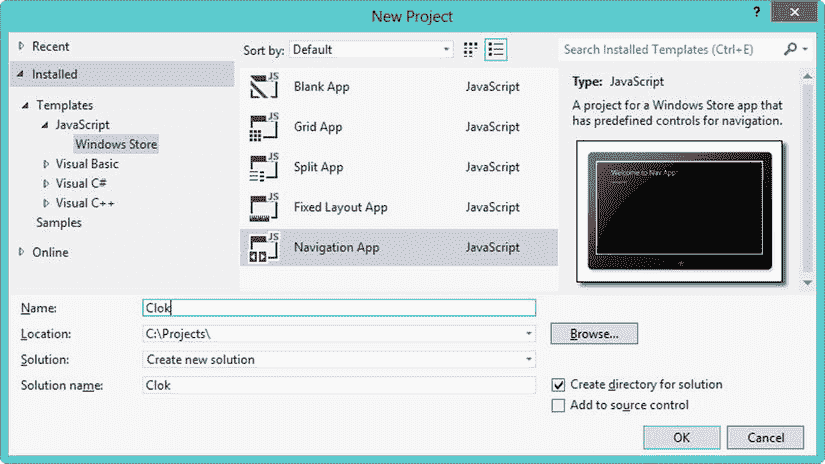
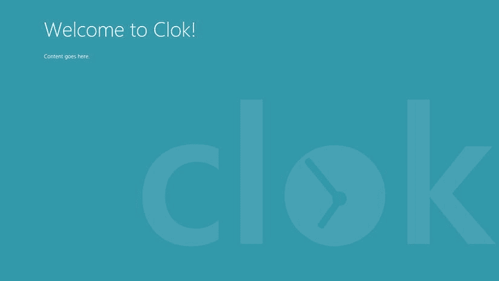
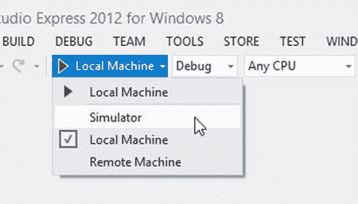
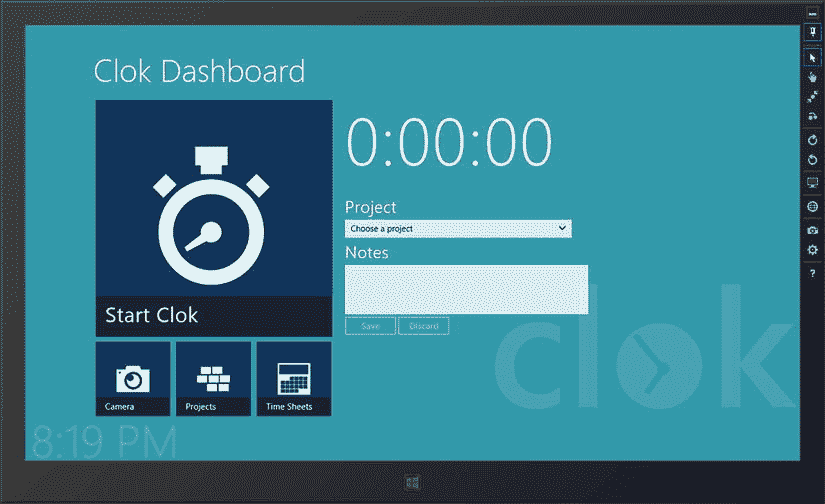
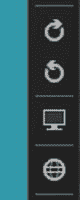
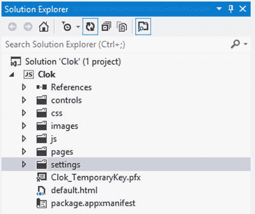
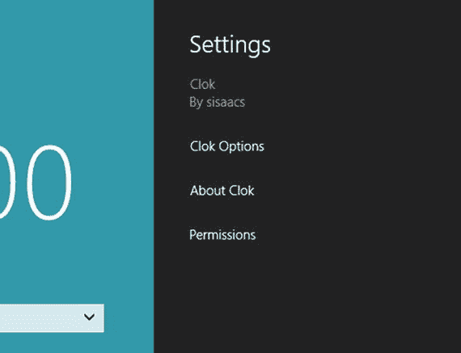
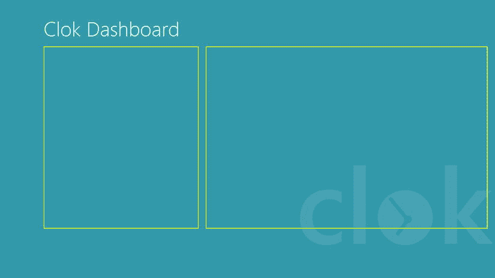

第九章


构建用户界面

现在，我已经介绍了触摸概念、Microsoft 设计风格的原则、创建 Visual Studio 项目以及使用 Windows 应用商店应用程序的许多可用控件，是时候做一些更有趣的事情了。在本章中，您将开始构建一个真实世界的应用程序，并在本书的其余部分继续构建。我们将构建一个面向软件顾问、设计师、自由职业者和任何其他执行基于项目的工作的人的计时应用程序。

当我不写书的时候，我会花时间做软件开发顾问。像许多咨询公司一样，我工作的公司使用第三方时间和费用跟踪系统来支持它与各种客户合作的所有顾问。从任何地方都可以使用 web 浏览器访问它，这是一个非常完整的系统，具有各种功能和配置选项。不幸的是，这不是最容易使用的系统。所有的附加功能和可配置选项都需要大量的点击和导航来输入我每天的计费时间。因此，像许多必须记录项目花费时间的人一样，我发现自己使用穷人的通用数据库:Microsoft Excel 来记录我所有的时间。每月一次，我在一个窗口打开我们的时间和费用系统，在另一个窗口打开 Excel，将时间从一个窗口复制到另一个窗口。还不算太糟，但是有时我会在同一天接到多个客户的账单。我可以通过调整我在 Excel 中记录时间的方式来解决这个问题，或者我可以写一个应用程序。因为我刚好在写一本关于构建 Windows Store 应用程序的书，所以我选择了后者，这样我们就可以一起构建了。

**介绍克洛克**T2】

在本书的剩余章节中，我们将构建 Clok，一个 Windows 商店的时间表应用程序。为了防止这本书长达 1500 页，我将保持基本的特性集。以下是顾问可以使用 Clok 执行的高级功能:

*   通过启动和停止计时器来跟踪项目的时间
*   将照片和文稿添加到项目
*   管理项目列表
*   管理以前跟踪的时间条目

这听起来可能不多，但是您会发现，有许多技术对于使用 HTML 和 JavaScript 构建 Windows Store 应用程序非常有用，这些技术可以组合在一起构建一个真实但简单的应用程序。在[图 9-1](#Fig1) 中，你可以看到当你完成这一章时，我们应用程序的主屏幕将会是什么样子。


[图 9-1](#_Fig1) 。完整的 Clok 仪表板

我定义的四个高级功能都有一个按钮。最大的按钮用于开启和关闭计时器。在[图 9-1](#Fig1) 中，计时器当前正在运行，我已经指出了我正在进行的项目，并添加了一些注释。此外，还添加了徽标和当前时间。在接下来的几页中，您将看到这个屏幕是如何创建的。

 **注**本书附带的源代码包括一个完整的项目，其中包含本章使用的所有源代码和图像文件。你可以在本书的 press 产品页面(`www.apress.com/9781430257790`)的 Source Code/Downloads 选项卡上找到本章的代码示例。

创建项目外壳

因此，让我们卷起袖子，开始使用导航应用程序模板创建一个新的 Visual Studio 项目。如果[图 9-2](#Fig2) 还不够，你可以参考[第 5 章](05.html)并遵循同样的步骤。将新项目命名为 Clok。我将在本书的剩余部分构建这个项目中应用程序的所有功能。



[图 9-2](#_Fig2) 。“新建项目”对话框

正如您在[第 5 章](05.html)中看到的，导航应用项目模板为我们创建了许多文件。在这一章中，我们编辑这些文件中的大部分，并创建一些新文件，以实现如图[图 9-1](#Fig1) 所示的应用程序设计。除了我们在本章中开发的主屏幕，我们将在应用程序中使用这种设计，因为我们将在后面的章节中添加更多的屏幕。

实施设计

当我们在[第 5 章](05.html)中创建项目时，我们配置应用程序使用`ui-light.css`中定义的主题，而不是`ui-dark.css` 中定义的默认主题。然而，对于 Clok，我们将保留默认的黑暗主题。不要求使用这两个主题中的任何一个；但是，它们提供了一种简单的方法来确保您的应用程序的外观和行为与您的用户已经安装和使用的许多其他应用程序一样。

在`ui-dark.css`中定义的主题具有深色背景和浅色文本。默认背景是深灰色，文本是白色的。相反，`ui-light.css`中定义的主题有浅色背景和深色文本，默认为白色背景上的黑色文本。虽然我们确实想使用深色主题，但我们希望在屏幕右下角有一个蓝色背景和一个模糊版本的应用程序徽标。将清单 9-1 中突出显示的代码添加到`default.css`中。一定要将`background.png`(可以在本书附带的源代码中找到)添加到`images`文件夹中。

[***清单 9-1。***](#_list1) 改变我们应用的背景

```js
#contenthost {
    height: 100%;
    width: 100%;

    background-color: #3399aa;
    background-image: url('/img/background.png');
    background-repeat: no-repeat;
    background-attachment: fixed;
    background-position: 100% calc(100% - 85px);
}
```

详细的 CSS 教程超出了本书的范围，但简单地说，这段代码将应用程序的背景颜色设置为蓝色，用`#3399aa`表示，并设置一个显示一次的背景图像(`no-repeat`)，当用户滚动应用程序窗口(`fixed`)时保持不动，并位于屏幕底部最右侧 85 像素处。如果你正在寻找关于 CSS 的更深入的报道，除了数百本书之外，你可以用你最喜欢的网络搜索引擎找到大量的信息，比如大卫·鲍尔斯的*开始 CSS 3*(a press，2012)。现在运行应用程序将显示如图 9-3 所示的应用程序。我们还没到那一步，但已经开始成形了。



[图 9-3](#_Fig3) 。我们的新应用背景在一个分辨率为 1366×768 的屏幕上

它看起来很好，但是 Clok 标志比图 9-1 中的大了很多。根据您的屏幕分辨率，它可能会比您想要的占用更多的屏幕空间。比如很多 Windows RT 平板的屏幕分辨率都是 1366×768；不过我的笔记本电脑屏幕是 1920×1080 的屏幕分辨率。[图 9-4](#Fig4) 显示了同一个应用程序在这个更大的屏幕上的样子。


[图 9-4](#_Fig4) 。我们相同的新应用程序背景显示在分辨率为 1920×1080 的大屏幕上

我们真的不希望我们的时间输入表单覆盖我们的应用程序徽标。我们希望用户可以看到这个标志，尤其是在 Clok 应用程序的主屏幕上。我们可以将徽标变小，这样它就不会被平板电脑等较小屏幕上的表单隐藏，但在较大的屏幕分辨率下，徽标可能会显得太小。解决方案是使用 CSS 媒体查询来定义仅在满足特定条件时才应用的 CSS 规则。在`default.css`的末尾添加来自[清单 9-2](#list2) 的代码。当应用程序窗口宽度小于 1400 像素时，这将导致背景徽标调整大小。在下一节中，我将介绍测试这种行为的技术。

[***清单 9-2。***](#_list2) 在较小的屏幕上改变背景图像的大小

```js
@media screen and (max-width: 1400px) {
    #contenthost {
        background-size: 40%;
    }
}
```

实现 Clok 设计的下一步是将当前时间添加到屏幕底部。我们将使用我们在第 8 章中构建的时钟控件的修改版本。修改包括几个简单的助手函数，这些函数将在以后派上用场，同时还更改了名称空间。修改后的版本包含在本章的源代码管理中。[清单 9-3](#list3) 突出显示了对`default.html`添加控件所做的修改。

[***清单 9-3。***](#_list3) 添加当前时间

```js
<!DOCTYPE html>
<html>
<head>
    <title>Clok</title>

    <!-- WinJS references -->
    <link href="//Microsoft.WinJS.1.0/css/ui-dark.css" rel="stylesheet" />
    <script src="//Microsoft.WinJS.1.0/js/base.js"></script>
    <script src="//Microsoft.WinJS.1.0/js/ui.js"></script>

    <!-- Clok references -->
    <link href="/css/default.css" rel="stylesheet" />
    <script src="/js/default.js"></script>
    <script src="/js/navigator.js"></script>
    <script src="/controls/js/clockControl.js"></script>
</head>
<body>
    <div id="contenthost"
        data-win-control="Application.PageControlNavigator"
        data-win-options="{home: '/pages/home/home.html'}"></div>
    <div id="currentTime" data-win-control="Clok.UI.Clock"></div>
</body>
</html>
```

控件的默认配置是显示当前时间，包括秒。你会从[第 8 章](08.html)中记起，你可以用`data-win-options`将`showClockSeconds`设置为`false`。您也可以在 JavaScript 中设置相同的值，方法是添加清单 9-4 到`default.js`中突出显示的代码。

[***清单 9-4。***](#_list4) 在 JavaScript 中设置控件选项

```js
args.setPromise(WinJS.UI.processAll().then(function () {
    currentTime.winControl.showClockSeconds = false;

    if (nav.location) {
        nav.history.current.initialPlaceholder = true;
        return nav.navigate(nav.location, nav.state);
    } else {
        return nav.navigate(Application.navigator.home);
    }
}));
```

最后，将清单 9-5 中的 CSS 规则添加到`default.css`中。此规则设置字体大小和粗细，将颜色设置为半透明白色，并将时间放在屏幕的左下角。

[***清单 9-5。***](#_list5) 造型当前时间

```js
#currentTime {
    font-size: 60pt;
    font-weight: 200;
    letter-spacing: 0;
    line-height: 1.15;
    color: rgba(255, 255, 255, 0.2);
    position: fixed;
    top: calc(100% - 85px);
    left: 10px;
}
```

实现我们的设计的最后一步是添加一些增量 CSS 规则来覆盖各种控件的颜色，以便它们与我们想要的设计相匹配。Microsoft 提供了大量示例应用程序来说明构建 Windows 应用商店应用程序的不同方面。您可以单独下载许多示例，但我建议从 MSDN 下载整个示例应用程序包:`http://msdn.microsoft.com/en-US/windows/apps/br229516` `。虽然这个包中的所有示例都有助于理解如何在您的代码中实现不同的功能，但主题 Roller 示例实际上是开发人员的一个有用软件。它允许你选择一个亮或暗的主题，并指定一些你想在应用程序中使用的不同颜色。然后它会生成并预览一些 CSS 规则来添加到你自己的应用程序代码中(见[图 9-5](#Fig5) )。`

 `

[图 9-5](#_Fig5) 。主题滚轮示例应用

 **注**主题滚轮应用包含在示例 app 包中，也可以单独下载:`http://code.msdn.microsoft.com/windowsapps/Theme-roller-sample-64b679f2`。

本章附带的示例代码包括一个名为`themeroller.css`的文件，该文件包含由 Theme Roller 示例应用程序生成的增量 CSS 规则。您可以将该文件复制到您的 Visual Studio 项目中，或者您可以使用主题 Roller 示例应用程序自己生成 CSS 规则。你必须将这个 CSS 文件的引用添加到`default.html`(参见[清单 9-6](#list6) )。

[***清单 9-6。***](#_list6) 引用新的 CSS 文件

```js
<!-- SNIPPED -->
<link href="/css/default.css" rel="stylesheet" />
<link href="/css/themeroller.css" rel="stylesheet" />
<!-- SNIPPED -->
```

因为 Clok 目前是相当空的，所以您实际上还看不到我们应用程序中的任何变化，但是生成的样式覆盖了`ui-light.css`和`ui-dark.css`中的一些默认样式，所以我们稍后添加的控件匹配我们已经定义的主题。例如，[清单 9-7](#list7) 包含了来自`themeroller.js`的一个片段，它将改变你添加的任何下拉列表控件的颜色，比如在[图 9-1](#Fig1) 中用于选择一个项目的控件。

[***清单 9-7。***](#_list7) 用增量 CSS 规则覆盖默认 CSS 规则

```js
/*
Text selection color
*/
::selection, select:focus::-ms-value {
    background-color: rgb(0, 0, 70);
    color: rgb(255, 255, 255);
}

/*
Option control color
*/
option:checked {
    background-color: rgb(0, 0, 70);
    color: rgb(255, 255, 255);
}

    option:checked:hover, select:focus option:checked:hover {
        background-color: rgb(33, 33, 94);
        color: rgb(255, 255, 255);
    }
```

至此，我们已经完成了 Clok 的外壳。类似于我们在第 5 章到第 8 章中所做的工作，除了我们将在本章后面添加的`SettingsFlyout` 控件之外，这个应用程序中的大多数功能都将使用页面控件加载到这个 shell 中，在我看来，这使得导航应用程序模板非常方便。

使用模拟器进行调试

基于[图 9-3](#Fig3) 和[图 9-4](#Fig4) 之间的差异，你可以明白为什么用不同类型和尺寸的设备定期测试你的应用是一个好的实践。在尽可能多的真实设备(台式机、笔记本电脑和平板电脑)上测试您的应用程序是无可替代的。但是，有时您不容易访问这些设备，或者您可能正在积极开发功能，还没有准备好部署到多台机器上进行更严格的测试。如果你没有各种硬件来测试，微软视窗模拟器可以帮助你。模拟器是你在开发机器上运行的软件，允许你在不同的设备上模拟运行你的应用程序。

最重要的是，您已经有了模拟器，因为它是随 Visual Studio 一起安装的。你可能已经注意到了 Visual Studio 中调试按钮旁边的一个小菜单指示器(见[图 9-6](#Fig6) )。此菜单允许您设置调试目标。默认情况下，选择本地机器，但是有两个附加选项:远程机器和模拟器。选择模拟器，然后运行您的应用程序。模拟器将打开，您的应用程序将启动(参见[图 9-7](#Fig7) )。



[图 9-6](#_Fig6) 。使用模拟器进行调试



[图 9-7](#_Fig7) 。在模拟器中完成版本的 Clok

 **注意**模拟器不是虚拟机，也不是和你的开发机器隔离的。模拟器只是运行与您的开发计算机上安装的相同的 Windows 安装，并且使用您用来启动 Visual Studio 的相同凭据运行。因此，我发现在我的开发机器的后台运行的一些程序在我启动模拟器时偶尔会表现异常，通常是因为该程序的两个实例——一个在我的开发机器上，一个在模拟器上——试图访问同一个锁定的资源。

模拟器提供了许多特性来促进基本测试。在模拟器工具栏的顶部，您会发现一个图钉图标，您可以切换该图标以将模拟器保持在所有其他窗口的顶部(参见[图 9-8](#Fig8) )。在它的正下方是四个图标，允许您选择交互模式。您可以在鼠标模式、基本触摸模式、挤压/缩放触摸模式和旋转触摸模式之间进行选择。在鼠标模式下，您的应用程序在模拟器中的行为与在开发机器上的行为相同。


[图 9-8](#_Fig8) 。选择交互模式(左)；触摸模式下的鼠标光标(中间)和按下时的鼠标光标(右侧)

在基本触摸模式下，鼠标光标被替换为单目标图标，而在捏合/缩放或旋转触摸模式下，它是双目标图标。这些目标指示当你点击鼠标时，你的虚拟手指将触摸屏幕的位置。当您在其中一种触摸模式下单击鼠标时，光标会再次改变，以指示触摸交互正在进行中。在基本触摸模式下，您的鼠标的行为可能与您预期的一样:单击鼠标以点击，然后单击并按住鼠标以拖动或打开上下文菜单。

捏/缩放和旋转触摸模式一开始使用起来有点棘手，但只需几次尝试就能习惯。你滚动鼠标滚轮来移动目标。在挤压/缩放触摸模式下，这将使目标靠近或远离，而在旋转触摸模式下，一个目标将围绕另一个目标旋转。一旦你的目标被设置成你想要的样子，点击并按住你的鼠标按钮，同时用你的鼠标滚轮滚动来实际执行手势。我的主要开发机器是一台没有触摸屏的笔记本电脑。对于更精确的手势，我发现用两只手更容易。我使用笔记本电脑内置的触摸板按钮来点击，同时使用鼠标上的滚轮来挤压、缩放或旋转。不过，你的手指可能比我的更协调。

下一组图标，如图 9-9 所示，允许您测试对模拟设备的更改。前两个选项允许您顺时针或逆时针旋转设备 90 度，在横向、纵向、横向翻转和纵向翻转方向之间循环。[图 9-9](#Fig9) 中的第三个图标提供了改变模拟器屏幕分辨率的方法。我在创建[图 9-3](#Fig3) 和[图 9-4](#Fig4) 中的图像时使用了这个功能。这组按钮中的最后一个图标提供了更改模拟器位置的方法，这在测试使用地理定位来确定应用程序用户位置的功能时非常有用。



[图 9-9](#_Fig9) 。更改设备设置

其余的工具栏图标如[图 9-10](#Fig10) 所示。相机图标将获取模拟器的截图，齿轮图标允许您指定截图将存储在开发机器的驱动器上的什么位置。最后，熟悉的问号图标将为您提供模拟器所提供的各种功能的更多帮助。


[图 9-10](#_Fig10) 。更改设备设置

我鼓励你花点时间在模拟器上玩一玩。打开您已经安装的其他应用程序，观察这些应用程序在屏幕旋转或调整大小时的行为。熟悉不同的交互模式。虽然在开发 Clok 时，我们不太需要使用收缩/缩放和旋转交互模式，但在构建更复杂的应用程序时，它们肯定会派上用场。尽管模拟器很有帮助，但建议您在将应用程序发布到 Windows 应用商店之前，在尽可能多的真实设备上测试应用程序。

 **注意**如果你在网络上有第二个测试设备，远程机器调试非常方便，我经常用它来测试我平板电脑上的应用程序。为调试配置远程目标既快速又简单。MSDN 上有一个很好的攻略:`http://msdn.microsoft.com/en-us/library/windows/apps/hh441469.aspx`。

添加设置弹出按钮

随着我们在接下来的几章中构建 Clok，我们将添加一些应用程序级别的设置，用户可以利用这些设置来定制应用程序的行为。在这一节，我们将添加一个`SettingsFlyout`，我们将在本书的其余部分继续添加设置。我们还将在另一个`SettingsFlyout`中添加一些关于 Clok 的信息，给潜在用户一个应用程序的概述和一个找到更多信息的方法。

我们已经在第 6 章的[中看到了如何添加一个空的`SettingsFlyout`到我们的应用程序中，我们将在本章中遵循同样的基本步骤。然而，我们将在 Visual Studio 中以稍微不同的方式组织我们的文件，以最小化混乱。让我们从在 Visual Studio 中添加一个`settings`文件夹](06.html)到我们项目的根目录开始(见[图 9-11](#Fig11) )。



[图 9-11](#_Fig11) 。在解决方案资源管理器中添加设置文件夹

 **注意**我们用来构建应用程序的文件只是普通的 HTML、CSS 和 JavaScript 文件。我们可以按照我们认为合适的方式来组织我们的项目，只要所有的部分都与正确的路径相链接。例如，我们可以选择将每个`PageControl`的 CSS 文件放到项目的`css`文件夹中。或者，如果我们计划添加大量的页面，我们可以将它们组织到子文件夹中。

锁定选项设置弹出按钮

将名为`options.html`的 HTML 文件添加到`settings`文件夹中。用清单 9-8 中的代码替换该文件的默认内容。这将是我们的用户想要改变 Clok 默认设置时打开的`SettingsFlyout`。我们将在整本书中添加更多内容。

[***清单 9-8。***](#_list8)options.html 的 HTML 代码

```js
<!DOCTYPE html>
<html>
<head>
    <title>Options</title>
</head>
<body>
    <div id="settingsDiv" data-win-control="WinJS.UI.SettingsFlyout"
        aria-label="Options"
        data-win-options="{settingsCommandId:'options',width:'narrow'}">

        <div class="win-ui-dark win-header" style="background-color: #000046;">
            <button type="button" class="win-backbutton"
                onclick="WinJS.UI.SettingsFlyout.show()"></button>
            <div class="win-label clok-logo">Options</div>
        </div>
        <div class="win-content">
            <div class="win-settings-section">
                <h3>Settings Section Header</h3>
                <p>Put your settings here.</p>
            </div>
            <div class="win-settings-section">
                <h3>Settings Section Header</h3>
                <p>Put your settings here.</p>
             </div>
        </div>
    </div>
</body>
</html>
```

当您查看这段代码时，您会发现它与清单 6-18 中的[非常相似。除了为标题指定窄的宽度和不同的颜色，最显著的区别是我们用 CSS 类`win-settings-section`在`div`元素中添加了一些占位符内容。这个类是由 WinJS 提供的，并且是一个简单的方法来应用一个样式到我们的`SettingsFlyout`上，这个样式和其他的 Windows 应用程序是一致的。您可以在一个名为`ui-dark.css`的文件中看到这个 CSS 规则，以及 WinJS 提供的任何其他 CSS 规则。为了在解决方案资源管理器中找到这个文件，展开`References`文件夹，然后是`Windows Library for JavaScript 1.0`文件夹，最后是`css`文件夹(参见](06.html#list18)[图 9-12](#Fig12) )。您不能编辑这些文件，但您可以通过添加类似于我们之前使用主题滚轮的增量样式来更改样式。


[图 9-12](#_Fig12) 。WinJS 提供的 CSS 文件

关于锁定设置弹出按钮

您现在使用的大多数应用程序都有一个包含应用程序信息的屏幕。通常情况下，会打开一个弹出窗口，显示应用程序的描述和链接，以了解有关应用程序或构建它的公司的更多信息。这一概念延续到了 Windows Store 应用程序，弹出窗口被一个`SettingsFlyout`所取代。要在 Clok 中添加这个特性，需要在`settings`文件夹中添加一个名为`about.html`的 HTML 文件。用清单 9-9 中的代码替换该文件的默认内容。

[***清单 9-9。***](#_list9)about.html 的 HTML 代码

```js
<!DOCTYPE html>
<html>
<head>
    <title>About Clok</title>
</head>
<body>
    <div id="settingsDiv" data-win-control="WinJS.UI.SettingsFlyout"
        aria-label="About Clok"
        data-win-options="{settingsCommandId:'about',width:'narrow'}">

        <div class="win-ui-dark win-header" style="background-color: #000046;">
            <button type="button" class="win-backbutton"
                onclick="WinJS.UI.SettingsFlyout.show()">
            </button>
            <div class="win-label clok-logo">About Clok</div>
        </div>
        <div class="win-content">
            <div class="win-settings-section">
                <h3>About Clok</h3>
                <p>
                    Clok is a sample application being developed in conjunction with
                    <em>Beginning Windows Store Application Development: HTML and JavaScript
                    Edition</em>, an upcoming title about building Windows Store applications
                    with HTML,  JavaScript and CSS using the WinJS and WinRT libraries.  It is
                    written by <a href="http://www.tapmymind.com">Scott Isaacs</a> and
                    <a href="http://apress.com/">Apress Media LLC</a> will publish the
                    title in Summer 2013.
                </p>
                <p>
                    For more information, please visit:
                    <a href="http://clok.us/">http://clok.us/</a>.
                </p>
            </div>
        </div>
    </div>
</body>
</html>
```

正如您所看到的，在这种情况下使用`SettingsFlyout`是一种合适的技术，尽管它实际上并不用于修改任何应用程序设置，正如其名称所暗示的那样。

将设置弹出按钮添加到设置窗格

最后一步是注册我们的两个`SettingsFlyout`控件，以便 Windows 在设置面板上显示它们。打开`default.js`并添加[清单 9-10](#list10) 中突出显示的代码。

[***清单 9-10。***](#_list10) 注册我们的设置弹出按钮

```js
// SNIPPED

if (app.sessionState.history) {
    nav.history = app.sessionState.history;
}

// add our SettingsFlyout to the list when the Settings charm is shown
WinJS.Application.onsettings = function (e) {
    e.detail.applicationcommands = {
        "options": {
            title: "Clok Options",
            href: "/settings/options.html"
        },
        "about": {
            title: "About Clok",
            href: "/settings/about.html"
        }
    };
    WinJS.UI.SettingsFlyout.populateSettings(e);
};

args.setPromise(WinJS.UI.processAll().then(function () {
    currentTime.winControl.showClockSeconds = false;

    if (nav.location) {
        nav.history.current.initialPlaceholder = true;
        return nav.navigate(nav.location, nav.state);
    } else {
        return nav.navigate(Application.navigator.home);
    }
}));

// SNIPPED
```

运行应用程序并打开“设置”面板。您可以使用以下方法之一打开“设置”面板:

*   将鼠标移动到屏幕的右上角以显示 Windows charms，然后单击设置按钮
*   从触摸屏右侧向内滑动以显示 Windows charms，然后点击设置按钮
*   在键盘上按下 Windows 徽标键+I

一旦你这样做了，你会看到我们的两个`SettingsFlyout`控件在[图 9-13](#Fig13) 中列出。



[图 9-13](#_Fig13) 。“设置”面板中列出了我们的设置弹出控件

构建仪表板

到目前为止，在这一章中，我们已经将重点放在实现应用程序的通用设计元素上——这些元素将在 Clok 的每个屏幕上可见。在这一部分，我们将开始构建仪表板的用户界面，如图 9-14 所示。


[图 9-14](#_Fig14) 。仪表盘上的 UI 元素

当然，您可以在您的应用程序中使用任何您希望的布局技术，因为我们只是使用 HTML 和 CSS 来布局我们的界面元素。我将借此机会讨论 CSS3 中两种不同的布局选项，以 Clok dashboard 为例。我将介绍 flexbox 布局和网格布局，这两者都是万维网联盟(W3C)的工作草案。换句话说，这些 CSS3 布局很可能会成为跨不同浏览器工作的标准。

 **注意**用 HTML 和 JavaScript 构建的 Windows Store 应用使用了与 Internet Explorer (IE) 10 相同的渲染引擎。因此，IE 10 中支持的 CSS 和 JavaScript 在您的应用程序中也受支持。

Flexbox 布局

flexbox 或 flexible box 布局是一个新的 CSS 布局选项，通过将元素的`display`属性设置为`-ms-flexbox`来启用。它提供了一种简单的方法来指示该元素的子元素的大小是灵活的，通过指定它们如何增长或收缩来填充可用空间。flexbox 布局有很多选项，关于它可以写几十页。我不会深入探讨这个布局选项，我将只介绍两个用例作为例子。首先，我们将通过定义灵活的区域来创建仪表板的整体页面布局。然后我们将再次使用 flexbox 布局来定位四个菜单选项，以匹配[图 9-14](#Fig14) 。

使用 Flexbox 定义页面布局

图 9-14 中的仪表板有两个内容区域。在左边，我们有四个菜单选项，右边是一个时间输入表单。打开`home.html`并用清单 9-11 中突出显示的代码替换 main section 元素的内容。

[***清单 9-11。***](#_list11) 仪表盘上的两个内容区

```js
<section aria-label="Main content" role="main">
    <div id="mainMenu"></div>
    <div id="timeEntry"></div>
</section>
```

在本节的后面，我们将向`mainMenu`元素添加菜单选项，向`timeEntry`元素添加大的计时器显示和表单字段。在我们添加所有这些控件之前，让我们先来看看这两个区域的布局。将清单 9-12 中突出显示的代码添加到`home.css`中，将 CSS 规则添加到三个元素中:主要部分和两个新内容区域中的每一个。

[***清单 9-12。***](#_list12) 在 CSS 中设置 Flexbox

```js
.homepage section[role=main] {
    margin-left: 120px;
    width: calc(100% - 120px);
    display: -ms-flexbox;
    -ms-flex-direction: row;
    -ms-flex-align: start;
    -ms-flex-pack: start;
    -ms-flex-wrap: nowrap;
}

    .homepage #mainMenu {
        width: 424px;
        -ms-flex: 0 auto;

        border: 2px solid yellow;  /* temporary */
        height: 500px;             /* temporary */
    }

    .homepage #timeEntry {
        margin-left: 20px;
        margin-right: 20px;
        -ms-flex: 1 auto;

        border: 2px solid yellow;  /* temporary */
        height: 500px;             /* temporary */
    }

@media screen and (-ms-view-state: snapped) {
    .homepage section[role=main] {
        margin-left: 20px;
    }
}

@media screen and (-ms-view-state: portrait) {
    .homepage section[role=main] {
        margin-left: 100px;
    }
}
```

将`display`属性设置为`-ms-flexbox`表示主部分应该被视为 flexbox 容器。将`-ms-flex-direction`属性设置为`row`会导致该 flexbox 的子对象的水平布局。该属性的其他选项包括`column`，用于垂直定向，以及`row-reverse`和`column-reverse`，用于以与定义时相反的顺序显示子项。

`-ms-flex-align`属性用于指定子元素如何垂直于`-ms-flex-direction`对齐。也就是说，当使用`row`指定水平布局时，`-ms-flex-align`属性指定如何垂直显示子元素，当使用`column`时，它指定如何水平显示子元素。因为我们的例子有一个水平布局，将`-ms-flex-align`设置为`start`将会在容器顶部对齐我们的两个内容区域。该属性的其他选项包括`end`、`center`、`stretch`和`baseline`。

当`-ms-flex-align`属性控制垂直于布局方向的显示时，`-ms-flex-pack`属性控制平行于布局方向的布局。因为我们已经将这个属性设置为`start`，这个 flexbox 的子对象将会向左对齐。该属性的其他选项包括`end`、`center`和`justify`。

既然我们的 flexbox 容器已经定义好了，让我们看看我们为两个内容区域添加的规则。添加一个`width`设置将会使菜单选项保持在左边，给`timeEntry`元素添加边距将会防止定时器和表单与菜单选项冲突。`-ms-flex`属性是 flexbox 的最后一块魔力。为`mainMenu`元素指定`0`将阻止它增长或收缩以适应可用空间，但为`timeEntry`元素指定`1`将导致该元素增长以填充剩余空间。如果我们有两个非零值的元素，剩余的空间将按比例分割成这个值，这意味着如果一个被设置为`1`而另一个被设置为`2`，第二个元素将伸缩两倍于第一个元素。

 **注意**关于 flexbox 布局的更深入的讨论，包括本章使用的所有属性，可以在 MSDN: `http://msdn.microsoft.com/en-us/library/ie/hh673531.aspx`找到。

对于`mainMenu`和`timeEntry`元素，我临时添加了一个`height`和一个`border`，这样我们可以很容易地看到 flexbox 实际上是如何布局其子元素的。你可以在[图 9-15](#Fig15) 中看到结果。



[图 9-15](#_Fig15) 。我们最初的 flexbox 布局

用 Flexbox 定位菜单选项

到目前为止，我们已经看到了一个使用 flexbox 布局在页面中创建区域的例子。它还可以用于在这些区域中的一个区域内布置内容。我们还将使用 flexbox 在[图 9-14](#Fig14) 的左侧布置菜单选项。首先，让我们添加 HTML。打开`home.html`并用清单 9-13 中突出显示的代码替换主节元素的内容。

[***清单 9-13。***](#_list13)Clok 仪表盘的内容

```js
<section aria-label="Main content" role="main">
    <div id="mainMenu">
        <div id="toggleTimerMenuItem" class="mainMenuItem primaryMenuItem"></div>
        <div id="cameraMenuItem" class="mainMenuItem secondaryMenuItem"></div>
        <div id="projectsMenuItem" class="mainMenuItem secondaryMenuItem"></div>
        <div id="timesheetMenuItem" class="mainMenuItem secondaryMenuItem"></div>
    </div>
    <div id="timeEntry">
        <div id="elapsedTime">
            <h2 id="elapsedTimeClock"
                data-win-control="Clok.UI.Clock"
                data-win-options="{ mode: Clok.UI.ClockModes.CountUp }"></h2>
        </div>

        <div>
            <label for="project">Project</label>
            <select id="project">
                <option value="">Choose a project</option>
                <option value="1">Website Redesign (ABC Telecom)</option>
                <option value="2">Windows Store App (ABC Telecom)</option>
            </select>
        </div>
        <div>
            <label for="timeNotes">Notes</label>
            <textarea id="timeNotes"></textarea>
        </div>

        <div>
            <button id="saveTimeButton">Save</button>
            <button id="discardTimeButton">Discard</button>
        </div>
    </div>
</section>
```

我在`mainMenu`区域添加了四个空的`div`元素，作为菜单选项的占位符。我将在下一节添加实际的内容——图标和文本。我还在`timeEntry`区域添加了计时器和时间输入表单字段。[清单 9-14](#list14) 包含了`home.css`的代码。

[***清单 9-14。***](#_list14) 新 CSS 规则布局菜单选项和时间录入表单字段

```js
.homepage section[role=main] {
    margin-left: 120px;
    width: calc(100% - 120px);
    display: -ms-flexbox;
    -ms-flex-direction: row;
    -ms-flex-align: start;
    -ms-flex-pack: start;
    -ms-flex-wrap: nowrap;
}

    .homepage #mainMenu {
        width: 424px;
        -ms-flex: 0 auto;

        display: -ms-flexbox;
        -ms-flex-direction: row;
        -ms-flex-align: start;
        -ms-flex-wrap: wrap;
    }

        /* all menu buttons */
        .homepage .mainMenuItem {
            border: 2px solid transparent;
            margin: 4px;
            background: rgba(0,0,50,0.65);
        }

        /* just the big menu button */
        .homepage .primaryMenuItem {
            height: 408px;
            width: 408px;
        }

        /* the smaller menu buttons */
        .homepage .secondaryMenuItem {
            height: 128px;
            width: 128px;
        }

    .homepage #timeEntry {
        margin-left: 20px;
        margin-right: 20px;
        -ms-flex: 1 auto;
    }

        .homepage #timeEntry label {
            display: block;
            font-size: 2em;
        }

        .homepage #elapsedTime {
            padding-bottom: 30px;
        }

            .homepage #elapsedTimeClock {
                font-size: 8em;
            }

        .homepage #project {
            width: 400px;
        }

        .homepage #timeNotes {
            width: 400px;
            height: 75px;
        }

@media screen and (-ms-view-state: snapped) {
    .homepage section[role=main] {
        margin-left: 20px;
    }
}

@media screen and (-ms-view-state: portrait) {
    .homepage section[role=main] {
        margin-left: 100px;
    }
}
```

我去掉了向两个主要内容区域添加黄色边框和高度的规则，但是我还添加了许多其他规则。我们对`timeEntry div`及其包含的控件所做的更改非常简单，所以我不会在这里讨论它们。不过，你会注意到，我们通过将`display`属性设置为`-ms-flexbox`来声明`mainMenu div`是另一个 flexbox 容器。与主部分一样，该容器也是通过将`-ms-flex-direction`属性设置为`row`以水平布局排列的，并且通过将`-ms-flex-align`设置为`start`其内容在顶部对齐。然而，这一次，我们已经通过将`-ms-flex-wrap`属性设置为`wrap`来指示不适合第一行的项目应该换行到下一行。运行应用程序，查看我们目前的进度([图 9-16](#Fig16) )。


[图 9-16](#_Fig16) 。菜单选项的占位符，以及我们的时间输入表单

我们离图 9-1 中的目标越来越近了。我们将一个 flexbox 容器嵌套在另一个中。这是一种构建复杂布局的强大方法，正如您将在下一节中看到的，可以在这个 flexbox 容器中进一步嵌套网格布局。

网格布局

与 flexbox 类似，网格布局是另一个新的 CSS 布局选项，通过将元素的`display`属性设置为`-ms-grid`来启用。顾名思义，这种布局允许您指示该元素的子元素排列在一个网格中。

如果你是十年或更久以前的 web 开发人员，你可能熟悉使用 HTML `table`元素来布局 web 页面。在使用 CSS 进行网页布局变得突出之前，这是一种常见的做法。虽然它允许对布局进行简单的控制，但由于几个原因，它不再受欢迎，特别是因为它严重地将表示逻辑与页面内容混合在一起。大约在从使用 HTML `table`元素布局到使用 CSS 布局的转变开始的同时，我开始花更多的时间在 web 应用程序的后端，而不是在布局上。因此，我仍然对基于`table`的布局情有独钟，尽管我知道有更好的选择。

幸运的是，网格布局现在已经可用。我和像我一样的其他人现在可以使用熟悉的基于表格的概念来实现我们想要的布局，但仍然保持我们的内容和表示逻辑之间的分离，因为网格现在是在 CSS 中指定的，而不是用`table`元素指定的。我们将使用网格布局向每个菜单选项添加图标和文本。将[清单 9-15](#list15) 中突出显示的代码添加到`home.html`中。另外，一定要添加这里引用的图像文件；它们包含在本书附带的源代码中。

[***清单 9-15。***](#_list15)Clok 仪表盘的菜单选项

```js
<div id="mainMenu">
    <div id="toggleTimerMenuItem" class="mainMenuItem primaryMenuItem">
        
        <div class="mainMenuItem-overlay">
            <h4 class="mainMenuItem-title" id="timerTitle">Start Clok</h4>
        </div>
    </div>
    <div id="cameraMenuItem" class="mainMenuItem secondaryMenuItem">
        
        <div class="mainMenuItem-overlay">
            <h4 class="mainMenuItem-title">Camera</h4>
        </div>
    </div>
    <div id="projectsMenuItem" class="mainMenuItem secondaryMenuItem">
        
        <div class="mainMenuItem-overlay">
            <h4 class="mainMenuItem-title">Projects</h4>
        </div>
    </div>
    <div id="timesheetMenuItem" class="mainMenuItem secondaryMenuItem">
        
        <div class="mainMenuItem-overlay">
            <h4 class="mainMenuItem-title">Time Sheets</h4>
        </div>
    </div>
</div>
```

对于我们之前创建为空的`div`元素的每个菜单选项，我们现在添加了一个图标和一个标签。四个菜单选项中的每一个所使用的代码模式都是相同的，除了第一个被分配了一个 CSS 类`primaryMenuItem`，而其他三个使用了`secondaryMenuItem` CSS 类。无论大小，所有四个都分配了`mainMenuItem` CSS 类。将多个类分配给一个元素的能力允许我们指定适用于所有元素的 CSS 规则，以及仅适用于某些元素的单独规则。清单 9-16 中突出显示了`home.css`所需的 CSS 变化。

[***清单 9-16。***](#_list16) CSS 实现菜单选项 的网格布局

```js
/* SNIPPED */

.homepage #mainMenu {
    -ms-flex: 0 auto;
    width: 424px;
    display: -ms-flexbox;
    -ms-flex-align: center;
    -ms-flex-direction: row;
    -ms-flex-wrap: wrap;
}

    /* all menu buttons */
    .homepage .mainMenuItem {
        border: 2px solid transparent;
        margin: 4px;
        background: rgba(0,0,50,0.65);
        display: -ms-grid;
        -ms-grid-columns: 1fr;
    }

        .homepage .mainMenuItem:hover {
            cursor: pointer;
            border: 2px solid #ffffff;
        }

        .homepage .mainMenuItem .mainMenuItem-image {
            -ms-grid-row-span: 2;
        }

        .homepage .mainMenuItem .mainMenuItem-overlay {
            -ms-grid-row: 2;
            padding: 6px 15px;
            background: rgba(0,0,35,0.65);
        }

    /* just the big menu button */
    .homepage .primaryMenuItem {
        height: 408px;
        width: 408px;
        -ms-grid-rows: 1fr 70px;
    }

        .homepage .primaryMenuItem .mainMenuItem-image {
            height: 382px;
            width: 382px;
            margin: 10px;
        }

        .homepage .primaryMenuItem .mainMenuItem-overlay .mainMenuItem-title {
            font-size: 2.5em;
        }

    /* the smaller menu buttons */
    .homepage .secondaryMenuItem {
        height: 128px;
        width: 128px;
        -ms-grid-rows: 1fr 32px;
    }

        .homepage .secondaryMenuItem .mainMenuItem-image {
            height: 128px;
            width: 128px;
            padding: 0;
        }

        .homepage .secondaryMenuItem .mainMenuItem-overlay .mainMenuItem-title {
            font-size: 1em;
        }

.homepage #timeEntry {
    margin-left: 20px;
    margin-right: 20px;
    -ms-flex: 1 auto;
}

/* SNIPPED */
```

从清单 9-16 的顶部开始，我们做的第一个改变是通过将`display`属性设置为`-ms-grid`来表明我们的任何`mainMenuItem`元素都将是网格布局容器。我们在`-ms-grid-columns`属性中定义了一个单列。`-ms-grid-columns`属性和`-ms-grid-rows`属性(我们稍后将介绍)都可以采用各种不同的值，包括以下内容:

*   一个或多个带单位的指定尺寸，如`3px`或`1.5em`
*   一个或多个百分比值
*   剩余空间的一个或多个部分，如`1fr`或`1fr 2fr`
*   这些值的任意组合，比如`150px 1fr 2fr 150px`。本例将定义四列(`-ms-grid-columns`)或四行(`-ms-grid-rows`)，其中第一列和第四列各为 150 像素，剩余空间的三分之一将分配给第二列或第二行，三分之二分配给第三列或第三行。

对于`-ms-grid-columns`属性和`-ms-grid-rows`属性还有一些其他的选项，我不会在这里介绍，但是你可以在`http://msdn.microsoft.com/en-us/library/windows/apps/hh466340.aspx`和`http://msdn.microsoft.com/en-us/library/windows/apps/hh466350.aspx`阅读更多关于这些 CSS 属性的内容。

接下来，我们添加了 CSS 规则来将鼠标光标变为指针，并在用户的鼠标悬停在其中一个元素上时显示白色边框。因为我们用`-ms-grid-row-span`属性指定图像将跨越两行，并使用`-ms-grid-row`属性将覆盖图放在第二行，所以覆盖图将放在图像底部的顶部。当我们在这里将背景颜色设置为半透明的深蓝色时，当各种`primaryMenuItem`和`secondaryMenuItem` CSS 规则被定义后，覆盖的确切大小和位置将被确定。

 **注意**注意这个例子中`-ms-grid-rows`和`-ms-grid-row`的区别。前者应用于网格容器，以定义网格将有多少行。后者应用于网格中的一个项目，以指示该项目的放置行。同样的建议也适用于`-ms-grid-columns`和`-ms-grid-column` CSS 属性。

我之前提到过，虽然我们所有的菜单项都应用了`mainMenuItem` CSS 类，但是它们也有`primaryMenuItem`类或者`secondaryMenuItem`类。到目前为止，我在本节中介绍的所有 CSS 规则都适用于我们所有的菜单选项，不管它们是大还是小。您会注意到，我们还没有为任何菜单选项指定任何大小。为了解决这个问题，我们为`primaryMenuItem`类和`secondaryMenuItem`类添加了一组相似的 CSS 规则。[清单 9-17](#list17) 包含一段 CSS 代码，取自[清单 9-16](#list16) ，它定义了大菜单选项的各种尺寸。

[***清单 9-17。***](#_list17) CSS 覆盖为大菜单选项

```js
/* just the big menu button */
.homepage .primaryMenuItem {
    height: 408px;
    width: 408px;
    -ms-grid-rows: 1fr 70px;
}

    .homepage .primaryMenuItem .mainMenuItem-image {
        height: 382px;
        width: 382px;
        margin: 10px;
    }

    .homepage .primaryMenuItem .mainMenuItem-overlay .mainMenuItem-title {
        font-size: 2.5em;
    }
```

您可以看到，这是我们指定网格行大小的地方，表明第二行是`70px`高，第一行填充剩余的空间。图像和标题文本的大小也被设置为适合大菜单选项的值。回头参考[清单 9-16](#list16) ，你会看到小菜单选项非常相似的 CSS 规则。我不会在这里详细介绍它们，因为除了定义更小的维度之外，它们与清单 9-17 中的[几乎相同。](#list17)

如果您再次运行 Clok，您将会看到我们所有的菜单选项都已就位(参见[图 9-17](#Fig17) )。当然，没有一个菜单选项可以使用，但是我们会在[第 10 章](10.html)中看到如何开始添加一些功能。


[图 9-17](#_Fig17) 。我们的菜单选项，每个都用 CSS 网格布局定义

 **注意**你可能认为向项目添加文档和照片并不完全符合时间跟踪功能。你说得对，但它是一个有用的功能，原因有很多，比如为费用报告记录收据。更重要的是，它给了我们一个在应用程序中处理文件的理由。我们将在第 16 章和第 22 章中进一步探讨这个问题。

结论

我们在这一章中涉及了很多内容。我们为 Clok 创建了一些高级需求，Clok 是我们将在本书剩余部分构建的示例应用程序。我们创建了应用程序的整体外观，每当我们向 Clok 添加一个新的`PageControl`时，它就会自动应用。我们添加了两个`SettingsFlyout`控件，当我们添加用户可以修改的选项时，它们将在整本书中更新。最后，我们使用新的 CSS flexbox 和网格布局添加了应用程序主页的所有用户界面元素 Clok 仪表板。Clok 还不做任何事情，但它开始看起来像一个真正的应用程序。我们将在[第 10 章](10.html)中开始添加一些基本功能，包括一些有用的动画，以便在用户执行某些任务时为他们提供视觉反馈。`