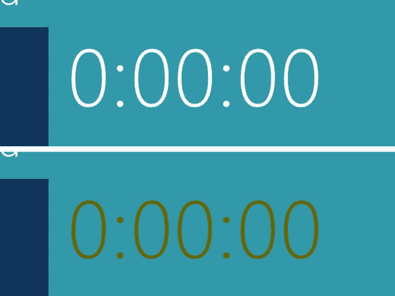
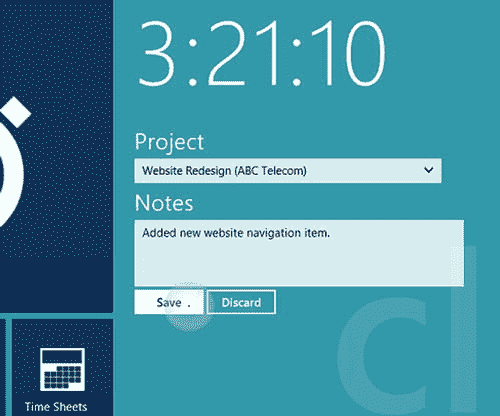
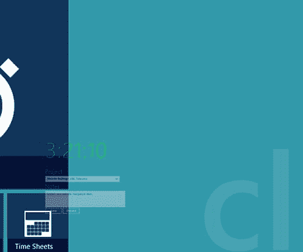

第十章


过渡和动画

微妙的动画存在于整个 Windows 8。当切换到开始屏幕时，磁贴会放大以填充熟悉的网格，它们会对被点击或触摸做出反应。激活的搜索或设置窗格像抽屉一样从屏幕一侧滑出。同样，`AppBar`控件从屏幕的顶部或底部滑入。我用了*微妙*这个词来描述这些动画。我的意思是，在日常使用中，你更有可能注意到动画是否已经被删除，而不是它们最初的存在。

我们当然可以构建一个没有动画的应用，但是许多好的应用利用动画为用户提供关于正在发生的变化或他或她刚刚发起的动作的直观反馈。好的动画很短，发生的很快。此外，它们经常模拟一些真实世界的运动，例如当按钮被按下时，它看起来会移开。在应用中添加动画时要记住的一点是，动画不应该分散用户对应用主要目的的注意力。

转场和动画:有什么不同

到目前为止，我在一般意义上使用单词 *animation* 来表示“屏幕上正在移动的东西”，但是这个术语在技术上是不正确的。实际上，Windows Store 应用可以定义两种不同类型的动作:CSS 过渡和 CSS 动画，或者简单地说，过渡和动画。这两者在很多方面都很相似。转场和动画都会在一段时间内在屏幕上产生运动，因为它们会修改应用中 HTML 元素的 CSS 属性，如大小、颜色、旋转、位置、透视和透明度。

不过，转场和动画在一些方面有所不同。最显著的区别是动画可以定义关键帧，这使您可以更好地控制动画元素的 CSS 属性如何随时间变化。例如，通过定义关键帧，单个动画可以将元素的颜色从白色更改为黄色，然后再更改为红色，最后重置回白色。在本章的后面你会看到一个类似的例子。

动画允许您在动画的不同点指定各种 CSS 属性的值。另一方面，转换不定义 CSS 属性的值，但是定义 CSS 属性如何在原始值和更改后的值之间转换。例如，我们可以使用一个过渡来指示任何时候我们改变一个元素的位置，它应该缓慢地进入和退出(开始缓慢移动，然后在减速到停止之前加速)或者以恒定的速度从开始位置移动到新的位置。

实际上，动画通常用于提供一些反馈，在完成时将 CSS 属性重置为原始状态。另一方面，过渡不会自动将 CSS 属性重置为其原始状态。因此，如果我们使用一个过渡将一个元素的颜色从白色变为黄色再变为红色，那么这个元素将一直保持红色，直到我们将它变回白色。

动画(和过渡)的方法

那么，我们如何使我们的应用的元素动画化呢？正如软件开发中常见的那样，有许多方法可以实现这一点。我将在本章中介绍四种不同的技术，如下所示:

*   纯粹在 CSS 中
*   在我们的 JavaScript 代码中使用内置于 WinJS 动画库中的动画
*   使用 JavaScript 以编程方式操作我们的 CSS
*   用 JavaScript 定义我们自己的过渡和动画，并在我们的 JavaScript 代码中执行它们

纯 CSS 动画

最后，我将在本章中介绍的所有动画和过渡都是 CSS 动画和 CSS 过渡。屏幕上的运动或变化是更改 CSS 属性并允许客户端以平滑的方式呈现从一个值到另一个值的更改的结果。虽然我将介绍一些从 JavaScript 代码中启动这些动画和过渡的技术，但是一些简单但有用的动画可以直接在我们的 CSS 中定义。

我们将通过在`home.css`中定义关键帧，为我们在第 9 章的[中用 Clok 创建的计时器添加一个动画。关键帧允许我们在一个特殊的`@keyframes` CSS 规则中定义动画中许多中间步骤的 CSS 规则，它包含我们正在定义的每个步骤或帧的规则。将清单 10-1 中的代码从](09.html)[添加到`home.css`的末尾。](#list1)

[***清单 10-1。***](#_list1) 在 CSS 中定义关键帧

```js
@keyframes animateTimeIn {
    from, to {
        color: rgba(255, 255, 255, 1);
    }

    50% {
        color: rgba(255, 255, 0, 0.5);
    }
}
```

首先要注意的是，我们已经将我们的`@keyframes`规则命名为`animateTimeIn`，以便我们以后可以引用它。我们的初始状态在`from`规则中定义，我们的最终状态在`to`规则中定义。因为这两者是相同的，我们可以声明一次规则，用逗号分隔规则名。这正是我们在[清单 10-1](#list1) 中所做的，在那些情况下设置前景色为白色。我们已经创建了另一个规则，它将在动画进行到一半时将颜色更改为半透明的黄色。

 **注意**类似于我们在`50%`定义动画中点的方式，你也可以用`0%`定义初始状态，用`100%`定义最终状态。这些值分别相当于`from`和`to`。

到目前为止，我们已经定义了当动画出现时什么值会改变，但是在我们的 CSS 中还没有提到我们的计时器。为了将动画附加到我们的计时器上，我们必须将清单 10-2 中突出显示的代码添加到`home.css`中。

[***清单 10-2。***](#_list2) 将我们的关键帧动画应用到计时器

```js
.homepage section[role=main] #timeEntry #elapsedTime #elapsedTimeClock {
    font-size: 8em;
    animation: animateTimeIn 750ms ease-in-out 1s 2 normal;
}
```

通过指定我们在[清单 10-1](#list1) 中定义的名称，将`animation` CSS 属性添加到该规则中允许我们确定我们想要将哪个动画应用到`elapsedTimeClock`元素。我们的动画将在 750 毫秒的时间内渐入渐出。它将在 1 秒钟的延迟后启动，并将重复两次。这个快捷语法允许我们在一行中定义动画属性。我们也可以单独设置这些属性(见[清单 10-3](#list3) )。

[***清单 10-3。***](#_list3) 长格式相当于清单 10-2 中的

```js
.homepage section[role=main] #timeEntry #elapsedTime #elapsedTimeClock {
    font-size: 8em;
    animation-name: animateTimeIn;
    animation-duration: 750ms;
    animation-timing-function: ease-in-out;
    animation-delay: 1s;
    animation-iteration-count: 2;
    animation-direction: normal;
}
```

 **注意**关于这些和其他 CSS 动画属性的更完整的描述可以在 MSDN 的`http://msdn.microsoft.com/en-us/library/hh673530.aspx`找到。

当您现在启动应用时，定时器控件将在白色和黄色之间交替两次(参见[图 10-1](#Fig1) )。目前，这不是很有用，因为我们在每次应用启动时都显示动画。然而，想象一个场景，我们启动 Clok，计时器已经在运行，或者计时器没有运行，但是有一个值还没有保存。在那些独特的情况下，使用这个动画或类似的动画，可能是提醒用户应用当前处于“进行中”状态的一种微妙方式。



[图 10-1](#_Fig1) 。我们的计时器处于初始状态(上图)和修改后的颜色(下图)。底部图像中的颜色与我们应用中的颜色不同。它已经变暗，以增加印刷书籍中的对比度

纯 CSS 过渡

除了在 CSS 中定义动画，您还可以定义过渡。值得注意的是，CSS 转场本身不会在屏幕上产生运动。例如，您不能使用`transition`属性指定新的颜色。转换实际上做的是定义目标元素如何从它的当前样式改变到它的新样式。这意味着您必须为目标元素定义两套 CSS 规则:转换的开始和结束。

因为我们有三个尚未实现的菜单选项，我们将添加一个当用户将鼠标悬停在它们上面时改变它们的过渡。我们要做的第一件事是向我们还没有实现的菜单选项添加另一个 CSS 类。通过将`notImplemented`添加到三个较小菜单选项的`class`属性来修改`home.html`(参见清单 10-4 中[突出显示的代码)。](#list4)

[***清单 10-4。***](#_list4) 标记菜单选项为未实现

```js
<div id="cameraMenuItem" class="mainMenuItem secondaryMenuItem notImplemented">
    
    <div class="mainMenuItem-overlay">
        <h4 class="mainMenuItem-title">Camera</h4>
    </div>
</div>
<div id="projectsMenuItem" class="mainMenuItem secondaryMenuItem notImplemented">
    
    <div class="mainMenuItem-overlay">
        <h4 class="mainMenuItem-title">Projects</h4>
    </div>
</div>
<div id="timesheetMenuItem" class="mainMenuItem secondaryMenuItem notImplemented">
    
    <div class="mainMenuItem-overlay">
        <h4 class="mainMenuItem-title">Time Sheets</h4>
    </div>
</div>
```

既然我们已经指出了哪些菜单选项应该应用转换，我们必须定义转换完成后将生效的 CSS 规则。将清单 10-5 中的 CSS 代码添加到`home.css`中。

[***清单 10-5。***](#_list5) 为未实现的菜单选项添加 CSS

```js
/* buttons that haven't been implemented yet */
.homepage .mainMenuItem.notImplemented:hover {
    cursor: default;
    border: 2px solid transparent;
    background: rgba(50,50,50,0.65);
    background-image: url('/img/Thumb-Down.png');
}

    .homepage .mainMenuItem.notImplemented:hover .mainMenuItem-image {
        visibility: hidden;
    }

    .homepage .mainMenuItem.notImplemented:hover .mainMenuItem-overlay {
        background: rgba(35,35,35,0.65);
    }

    .homepage .mainMenuItem.notImplemented:hover .mainMenuItem-overlay .mainMenuItem-title {
        display: none;
    }

    .homepage .mainMenuItem.notImplemented:hover .mainMenuItem-overlay::after {
        content: 'Coming Soon';
    }
```

如果你现在运行 Clok，任何时候你将鼠标悬停在三个小菜单选项中的一个上，背景色就会变成灰色，图标就会变成“拇指朝下”图标。此外，描述性文本将变为“即将推出”一旦您移开鼠标，菜单选项将恢复正常状态。[图 10-2](#Fig2) 显示了时间表按钮的两种状态。


[图 10-2](#_Fig2) 。未实现的菜单选项的正常状态(左)和同一菜单选项的悬停状态(右)

当您运行应用并将鼠标移到 Time Sheets 选项上时，您可能会注意到，虽然样式发生了变化，但这是一个突然的变化。这是因为，到目前为止，我们只定义了 CSS 的最终状态，但是我们还没有指出 CSS 应该如何从初始状态转换到最终状态。让我们给`home.css`再加一行代码。清单 10-6 中突出显示的代码行将使背景颜色从默认的蓝色逐渐过渡到灰色。

[***清单 10-6。***](#_list6) 设置初始 CSS 规则和悬停状态规则之间的短暂转换

```js
.homepage .mainMenuItem.notImplemented:hover {
    cursor: default;
    border: 2px solid transparent;
    background: rgba(50,50,50,0.65);
    background-image: url('/img/Thumb-Down.png');
    transition: background 500ms ease-in-out 0s;
}
```

我鼓励您在继续之前先尝试一下 CSS。例如，您可能还想给覆盖图的背景色添加一个过渡，因为目前，它仍然会立即从深蓝变为深灰。CSS `transition`属性和其他相关属性的文档可以在`http://msdn.microsoft.com/en-us/library/hh673535.aspx`找到。

WinJS 动画库

当你使用 Windows 8 时，你会发现有许多常见的动画。WinJS 通过一个动画库提供了其中的许多内容，我们可以在我们的应用中使用它们来提供与其他 Windows 应用商店应用以及 Windows 本身一致的视觉反馈。例如，有一些预定义的动画，用于向`ListView`控件添加一个项目，用于淡入或淡出视图，以及用于让一个元素对被点击或触摸做出反应。当用户按下一个按钮时，我们将使用这个库来激活菜单选项。用来自[清单 10-7](#list7) 的代码替换`home.js`中的页面定义。

[***清单 10-7。***](#_list7) 添加指针动画

```js
WinJS.UI.Pages.define("/pages/home/home.html", {
    ready: function (element, options) {
        this.initializeMenuPointerAnimations();
    },

    initializeMenuPointerAnimations: function () {
        var buttons = WinJS.Utilities.query(".mainMenuItem");
        buttons.listen("MSPointerDown", this.pointer_down, false);
        buttons.listen("MSPointerUp", this.pointer_up, false);
        buttons.listen("MSPointerOut", this.pointer_up, false);
    },

    pointer_down: function (e) {
        WinJS.UI.Animation.pointerDown(this);
        e.preventDefault();
    },

    pointer_up: function (e) {
        WinJS.UI.Animation.pointerUp(this);
        e.preventDefault();
    },
});
```

在新的`initializeMenuPointerAnimations`方法中，我们找到了所有的菜单选项按钮——那些带有`mainMenuItem` CSS 类的 HTML 元素。对于我们找到的每个项目，我们监听`MSPointerDown`和`MSPointerUp`事件，它们代表鼠标或触摸交互。我们创建了两个名为`pointer_down`和`pointer_up`的函数，通过调用 WinJS 动画库中的适当方法`WinJS.UI.Animation.pointerDown`或`WinJS.UI.Animation.pointerUp`来激活被点击或触摸的项目，从而处理这些事件。如果你仔细观察[图 10-3](#Fig3) ，你可以看到当按钮被按下时，它的尺寸会稍微缩小，给人一种被推开的感觉。在与应用交互时，效果会明显得多。


[图 10-3](#_Fig3) 。推开我们的按钮

此外，我们正在处理`MSPointerOut`事件，就像它是一个`MSPointerUp`事件一样。如果我们忽略该事件，很容易使菜单选项停留在按下状态，例如，单击它并在释放鼠标按钮之前将鼠标滑离它。

我们在这里只介绍了动画库中的两个动画。还有其他几个可用的，你可以在`http://msdn.microsoft.com/en-us/library/windows/apps/br229780.aspx`的 MSDN 上了解更多。

使用 JavaScript 操作 CSS

正如我们在前面几节中看到的，直接在 CSS 中配置动画和过渡很简单，使用 WinJS 动画库也一样简单。但是，有时候你需要更多一点的控制。例如，您可能希望让用户指定在上面的动画中使用的颜色。他们可能会选择橙色，而不是黄色。或者他们可以选择`#E3A238`。或者，您可能希望在动画或过渡完成后运行一些代码，这正是我们在本节中要做的。

我们将向 Clok 添加一个 CSS 转换，当用户保存他们的时间条目时，就会触发这个转换。在这种情况下，动画可能是不必要的，但它有助于向用户提供反馈，尤其是那些通过触摸与 Clok 交互的用户。如果我们简单地保存数据并重置表单，用户可能不会确信他们的数据已经保存，因为这在视觉上看起来与他们放弃时间输入时一样。为了提供清晰的反馈，我们将使用 CSS 转换来缩小表单，并使其向时间表菜单选项移动，以表明他们的条目已经保存到他们的时间表中。[图 10-4](#Fig4) 显示了用户输入一些注释并按下保存按钮后的时间输入表单。让我们看看在他或她按下保存按钮后，我们需要添加什么来使有趣的事情发生。



[图 10-4](#_Fig4) 。一个 Clok 用户正在保存她的时间条目

首先要做的事情:让计时器滴答作响

在我们添加代码来添加这个转换之前，我们有一些设置工作要做。用清单 10-8 中突出显示的代码更新`home.js`中的页面定义。这段代码并不特定于我们将要添加的转换，所以我不会详细讨论它，但是它是配置基本表单行为所必需的。当你滚动这段代码时，你会看到熟悉的处理事件和改变控件的值和状态的概念，我在第 8 章的[中讨论过，当时我们创建了自定义时钟控件。您将看到当 Clok 用户按下 Start Clok 菜单选项时启动计时器的代码，然后当他按下 Stop Clok 菜单选项时停止计时器。有一些逻辑可以防止用户在没有选择项目的情况下保存条目，以及防止用户保存或丢弃没有经过时间的计时器。目前，保存按钮和放弃按钮都只是重置表单。虽然这是丢弃按钮的正确动作，但我们还是给自己留了一个注释，记录用户按下保存按钮时的时间输入。我将在第 12 章](08.html)中介绍这一点。

[***清单 10-8。***](#_list8) 准备我们的 JavaScript 来处理时间输入表单事件

```js
WinJS.UI.Pages.define("/pages/home/home.html", {
    ready: function (element, options) {
        this.initializeMenuPointerAnimations();

        toggleTimerMenuItem.onclick = this.toggleTimerMenuItem_click.bind(this);

        project.onchange = this.project_change.bind(this);
        saveTimeButton.onclick = this.saveTimeButton_click.bind(this);
        discardTimeButton.onclick = this.discardTimeButton_click.bind(this);

        this.setupTimerRelatedControls();
    },

    initializeMenuPointerAnimations: function () {
        var buttons = WinJS.Utilities.query(".mainMenuItem");
        buttons.listen("MSPointerDown", this.pointer_down, false);
        buttons.listen("MSPointerUp", this.pointer_up, false);
        buttons.listen("MSPointerOut", this.pointer_up, false);
    },

    pointer_down: function (e) {
        WinJS.UI.Animation.pointerDown(e.srcElement);
        e.preventDefault();
    },

    pointer_up: function (e) {
        WinJS.UI.Animation.pointerUp(e.srcElement);
        e.preventDefault();
    },

    timerIsRunning: false,

    toggleTimerMenuItem_click: function (e) {
        this.toggleTimer();
    },

    project_change: function (e) {
        this.enableOrDisableButtons();
    },

    discardTimeButton_click: function (e) {
        this.discard();
    },

    saveTimeButton_click: function (e) {
        this.save();
    },

    save: function () {
        // TODO: save the time entry
        this.resetTimer()
    },

    discard: function () {
        this.resetTimer()
    },

    toggleTimer: function () {
        this.timerIsRunning = !this.timerIsRunning;
        this.setupTimerRelatedControls();
    },

    resetTimer: function () {
        this.timerIsRunning = false;
        elapsedTimeClock.winControl.reset();
        project.selectedIndex = 0;
        timeNotes.value = "";

        this.setupTimerRelatedControls();
    },

    setupTimerRelatedControls: function () {
        if (this.timerIsRunning) {
            elapsedTimeClock.winControl.start();
            timerImage.src = "/img/Clock-Running.png";
            timerTitle.innerText = "Stop Clok";
        } else {
            elapsedTimeClock.winControl.stop();
            timerImage.src = "/img/Clock-Stopped.png";
            timerTitle.innerText = "Start Clok";
        }

        this.enableOrDisableButtons();
    },

    enableOrDisableButtons: function () {
        if ((project.value !== "")
                && (!this.timerIsRunning)
                && (elapsedTimeClock.winControl.counterValue > 0)) {
            saveTimeButton.disabled = false;
        } else {
            saveTimeButton.disabled = true;
        }

        discardTimeButton.disabled = (this.timerIsRunning)
                || (elapsedTimeClock.winControl.counterValue <= 0);
    },
});
```

用 JavaScript 添加 CSS 过渡

如果你现在运行 Clok，这个应用可能会像你预期的那样运行。您可以启动和停止计时器，并保存有效的时间条目。现在让我们看看清单 10-9 中的[来找到我们需要添加到我们的`save`方法中来触发转换的代码。](#list9)

[***清单 10-9。***](#_list9) 我们更新了保存方法

```js
save: function () {
    // TODO: save the time entry

    timeEntry.style.transition = 'color 5ms ease 0s, '
        + 'transform 500ms ease 0s, opacity 500ms ease 0s';

    timeEntry.style.transform = 'scale3d(0,0,0)';
    timeEntry.style.opacity = '0';
    timeEntry.style.color = '#00ff00';
    timeEntry.style.transformOrigin = "-130px 480px";

    var self = this;
    var transitionend = function (e1) {
        if (e1.propertyName === "transform") {
            timeEntry.removeEventListener('transitionend', transitionend);
            self.resetTimer();
        }
    };
    timeEntry.addEventListener('transitionend', transitionend, false);
},
```

我们在这里添加的第一行代码是为了定义我们的转换。这一行将动画显示对`color`、`transform`或`opacity` CSS 属性的任何更改，在指定的时间内逐渐改变每个属性、`5ms`的属性、`500ms`的属性、`transform`和`opacity`的属性。接下来，我们为这些属性中的每一个指定新的值，指示我们的时间输入表单应该收缩和褪色，同时将文本颜色更改为绿色，以表示成功。`transformOrigin`属性允许我们指出转换发生的点。在这种情况下，我们已经指出过渡的中心在时间输入表单左上角的左侧 130 像素和下方 480 像素处。这些数字是根据我们之前为菜单选项定义的大小选择的，并将在时间表按钮的顶部设置过渡的原点。

接下来，我们创建一个名为`transitionend`的内嵌函数来处理同名事件。正如您可能猜到的，当转换完成时会引发此事件。我们有三个同时发生的转换，`color`、`transform`和`opacity`转换在完成时都会引发这个事件，每个都在不同的时间发生。我们的处理函数忽略了`color`和`opacity`完成事件，但是当`transform`转换完成时，我们的处理函数重置表单并停止监听后续的转换完成事件。因为`opacity`转换的持续时间与`transform`转换的持续时间相同，所以监听那个转换是否完成是等效的。

 **注意**如果这个转换是我们要添加到 Clok 中的唯一一个转换，我们就不需要像这样担心删除事件监听器。然而，如果不这样做，任何后续的转换也会触发`transitionend`事件处理程序，这可能会导致意想不到的结果。

现在，当我们运行 Clok 并保存我们的时间条目时，我们可以清楚地看到我们的时间条目被保存到我们的时间表中(见[图 10-5](#Fig5) )。



[图 10-5](#_Fig5) 。成功完成的时间输入表保存到我们的时间表

这一转变相当顺利，Clok 开始成为一个有用的小应用。不过，我们现在有一个小问题。一旦条目被保存，表单就消失了。如果用户想为另一个项目记录时间，我们可以让他关闭 Clok 并重新启动它，但这将是一个非常糟糕的体验。幸运的是，就像我们将时间输入表单动画化一样容易，我们可以将表单重置为初始状态。[清单 10-10](#list10) 就是这么做的。我添加了一个新的`resetTimerStyles`方法来将所有的样式重置回它们的初始值，并清除过渡。然后我从现有的`resetTimer`方法中调用这个方法。

[***清单 10-10。***](#_list10) 把东西放回原处

```js
resetTimer: function () {
    this.timerIsRunning = false;
    elapsedTimeClock.winControl.reset();
    project.selectedIndex = 0;
    timeNotes.value = "";

    this.resetTimerStyles();
    this.setupTimerRelatedControls();
},

resetTimerStyles: function () {
    timeEntry.style.transition = 'none';
    timeEntry.style.transformOrigin = "50% 50%";
    timeEntry.style.transform = 'scale3d(1,1,1)';
    timeEntry.style.opacity = '1';
    timeEntry.style.color = '#ffffff';
},
```

executeTransition 和 executeAnimation 方法

在上一节中，我们看到了如何通过修改想要制作动画的元素的各种 CSS 样式属性来创建过渡。这非常方便和简单。然而，还有一些事情需要记住。在易访问控制面板中，Windows 8 允许用户禁用不必要的动画(参见[图 10-6](#Fig6) )。有些用户可能会关闭动画，因为启用动画时，他们使用的计算机会变慢。其他人这样做可能只是因为他们不想被动画分散注意力。不管是什么原因，如果动画(或过渡)对应用的功能并不重要，你应该尊重用户的选择，不要启动动画。


[图 10-6](#_Fig6) 。禁用不必要的动画

那么我们如何检查这个值呢？Windows 运行时(WinRT)定义了一个我们可以使用的类。`Windows.UI.ViewManagement.UISettings`类提供了一种简单的方法来访问一些常见的用户界面设置(参见[清单 10-11](#list11) )。一旦我们有了这个类的实例，我们可以检查一个名为`animationsEnabled`的属性，它直接对应于[图 10-6](#Fig6) 中的设置。

[***清单 10-11。***](#_list11) 检查用户偏好的例子

```js
var uiSettings = new Windows.UI.ViewManagement.UISettings();
if (uiSettings.animationsEnabled) {
    // perform animation or transition
    myElement.style.transition = "opacity 500ms ease 0s";
    timeEntry.style.opacity = "0.5";
}
```

此外，WinJS 提供了一个函数`WinJS.UI.isAnimationEnabled`，它检查该设置，并结合一些其他标准，确定是否应该出现动画。确定`isAnimationEnabled`值的标准的描述可以在 MSDN: `http://msdn.microsoft.com/en-us/library/windows/apps/hh779793.aspx`上找到。`isAnimationEnabled`函数由动画库和`ListView`控件在内部使用，它为您提供保持动画一致性所需的信息。虽然纯粹用 CSS 声明动画是不可能的，[清单 10-12](#list12) 给出了一个假设的例子，说明我们如何修改[清单 10-9](#list9) 中的代码，在开始转换之前检查这个函数。

[***清单 10-12。***](#_list12) 假想改变我们的保存方法

```js
save: function () {
    if (WinJS.UI.isAnimationEnabled()) {
        // SNIPPED
    }
},
```

这种做法的缺点是，每当使用 JavaScript 定义自定义 CSS 过渡或 CSS 动画时，您都必须检查该函数。我提到过动画库在内部检查这个方法，所以我们之前创建的`pointerDown`和`pointerUp`动画在创建动画时会自动考虑控制面板设置。如果能够为我们声明自动检查`isAnimationEnabled`功能的自定义动画和过渡，将会非常方便。

幸运的是，这是可能的。动画库在内部使用两个 WinJS 方法来执行过渡和动画。对`isAnimationEnabled`函数的检查发生在这两个方法中，并且它们也被公开，供我们在自己的应用中使用。我们可以使用`WinJS.UI.executeTransition`和`WinJS.UI.executeAnimation`分别设置一个或多个过渡和动画，在页面中的特定元素上执行。

我们来看一个例子。在上一节中，我们添加了一个转换，以便在用户保存时间条目时向她提供反馈。在这一节中，我们还将为丢弃按钮添加一个过渡。将表格动画条目保存到时间表菜单选项中。当我想到丢弃一些东西，比如一个空水瓶，我会想象自己把它扔进回收站。在 Clok 中我们没有回收站的概念；然而，我们可以创建一个扔掉某物的类比。与保存动画一样，我们将让我们的丢弃动画缩小表单，但不是向菜单选项显示动画，我们只是让它在缩小到背景中时旋转，而不是变成绿色来指示成功，我们将让文本变成红色来指示我们正在删除该条目。用[清单 10-13](#list13) 中突出显示的代码更新`home.js`中的`discard`方法。

[***清单 10-13。***](#_list13) 一种新的丢弃方法

```js
discard: function () {
    var self = this;

    var slideTransition = WinJS.UI.executeTransition(
        timeEntry,
        [
            {
                property: "transform",
                delay: 0,
                duration: 500,
                timing: "ease",
                from: "rotate(0deg) scale3d(1,1,1)",
                to: "rotate(720deg) scale3d(0,0,0)"
            },
            {
                property: "opacity",
                delay: 0,
                duration: 500,
                timing: "ease",
                from: 1,
                to: 0
            },
            {
                property: "color",
                 delay: 0,
                duration: 5,
                timing: "ease",
                from: '#ffffff',
                to: '#ff0000'
            }
        ]).done(function () { self.resetTimer(); });
},
```

这里我们使用`executeTransition`方法在我们的`timeEntry`元素上执行三种不同的转换。

*   我们通过将旋转角度从 0 度转换到 720 度来旋转表单两次。
*   我们正在通过改变它的不透明度来淡化表单。
*   我们将文本颜色从白色改为红色。

然后，一旦转换完成，计时器和表单被重置。结果是，Clok 现在给用户反馈，确认当她按下放弃按钮时，我们已经有意清除了表单(见[图 10-7](#Fig7) )。


[图 10-7](#_Fig7) 。丢弃动画

结论

在这一章中，你已经看到了向用户提供可视化、动画反馈的多种方式。虽然过多的动画会分散注意力，但是代表用户已经执行的动作的微妙的动画可以向我们的用户提供信心，我们的应用已经如预期的那样运行了。

我们选择的动画技术包括纯粹用 CSS 定义的简单动画，使用 WinJS 动画库中几个预定义的动画之一，使用 JavaScript 以编程方式修改与元素相关联的 CSS 样式，或者使用 WinJS 中的低级`executeTransition`或`executeAnimation`方法。虽然在我们的应用中，每一个都有它的位置，但是我们应该意识到用户可能因为这样或那样的原因不喜欢看到不必要的动画，我们应该让这个事实影响我们决定使用哪种动画方法。