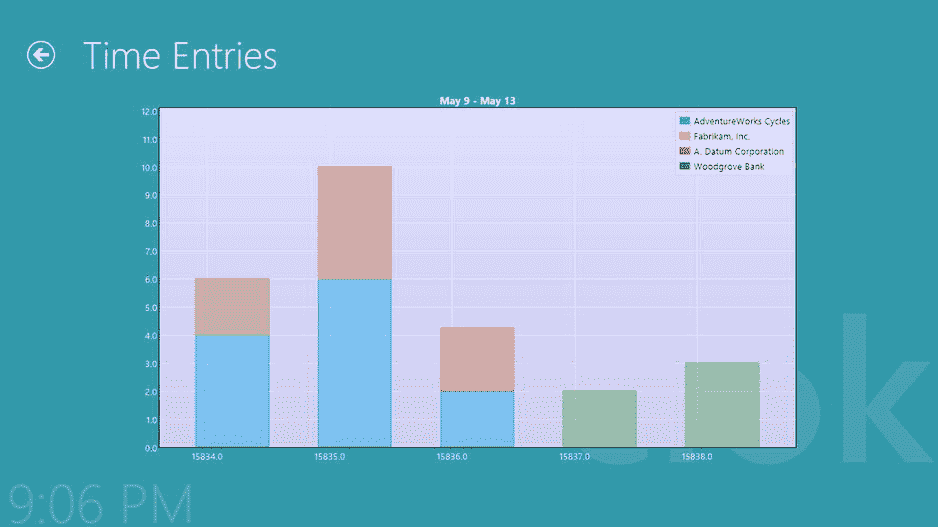

第十三章


网络工作者

在第 12 章中，我介绍了承诺作为一种处理异步操作返回值的方法。虽然承诺在如何进行异步工作方面提供了很大的灵活性，但我指出*异步*并不意味着多线程。JavaScript 应用在单线程环境中执行。*异步*并不意味着“同时做两件事”相反，它的意思是“以后再做这件事，完成后让我知道发生了什么。”也就是说，在多线程上执行的应用有几个优点，例如利用多个处理器来更快地执行任务或在后台执行一些工作，同时用户可以继续使用应用的其他部分。

那么，在开发 Windows 应用商店应用时，我们有什么选择呢？嗯，我们可以用 C#或 C++编写部分应用作为 WinRT 组件，它们支持线程。事实上，这篇关于 MSDN 的文章讨论了这个选项。我不会在本书中涉及这些细节，尽管我会在第 18 章中介绍用 C#构建 WinRT 组件。不是 C#或 C++开发人员？幸运的是，HTML5 提供了 Web Workers 作为一种新的选择。

网络工作者

worker(或者更正式地说，Web Worker)是一个在后台运行的 JavaScript 脚本。Workers 是 HTML5 的一个特性，并不是专门用来用 HTML 和 JavaScript 构建 Windows Store 应用的。如果你曾经在一个 web 开发项目中与工人一起工作过，那么你可以跳过这一章。如果你还不熟悉 workers，那么本章将提供一个基本的介绍，从清单 13-1 开始，它展示了创建一个 worker 所需的代码。

[***清单 13-1。***](#_list1) 创建一个网络工作者的实例

```js
var myWorker = new Worker("/path/to/worker/script.js");
```

工作线程在单独的线程上运行。然而，JavaScript 是一个单线程环境，所以每个 worker 都在自己的环境中执行。结果，一个工作者不能访问主 UI 线程上的任何对象，比如`document`对象。它不能操纵 DOM。它不能改变页面上 JavaScript 变量的值。它完全孤立在自己的环境中。

这对线程安全来说非常好。你永远不必担心冲突，因为两个工人改变了同一个变量。您不需要处理竞争情况——两个或多个线程如果没有按照正确的顺序完成，将会导致意外的结果。你不用锁任何东西。您不必担心在其他编程环境中使多线程开发具有挑战性的许多概念。也就是说，一个不能改变主线程上任何东西的脚本有多大用处？当然，在某些情况下，当您想要“启动并忘记”时，它可能会有所帮助，但是要实际使用它们，如果有某种方法可以从工作线程影响您的主线程，那就更好了。

这就是信息的来源。虽然工作线程不能改变主线程上的任何东西，反之亦然，但消息可以从一个线程传递到另一个线程。清单 13-2 包含了一个如何配置主线程与工作线程通信的例子。

[***清单 13-2。***](#_list2) 在主线程和工作线程之间传递消息

```js
myWorker.onmessage = function(e) {
    var messageFromWorker  =  e.data;
    // do something with the message
};

// send a message to the worker thread
myWorker.postMessage(messageToWorker);
```

在这个进程的另一边，在 worker 线程中，有一个类似的`onmessage`事件和`postMessage`方法(参见[清单 13-3](#list3) )。

[***清单 13-3。***](#_list3) 处理和发送来自工作线程的消息

```js
self.onmessage = function (e) {
    processTheData(e.data);
};

self.postMessage(responseMessage);
```

尽管我们现在有两个 JavaScript 环境，每个环境都执行自己的脚本，但是每个环境仍然是单线程的。迷茫？我用一个类比来解释这是怎么回事。

想象一下，你和我都在同一个团队工作，只不过我在不同的大楼工作，我们从来没有见过面，也没有当面说过话。在这个虚构的场景中，我们唯一的交流方式是通过办公室间的 messenger 互相发送消息。当你需要我的东西时，你给信差一个便条(叫`worker.postMessage`)。他或她把它放在我的桌子上，只要我能拿到它，我就拿着它(`self.onmessage`)开始做你在信息中要求的工作。当我完成后，我让信使把结果送还给你(`self.postMessage`)。当你看到结果(`worker.onmessage`)并决定你想用它们做什么时，你就完成了这个循环。只要我们能够就如何以对方能够理解的方式写笔记达成一致，我们就可以各自做好自己的工作(各自在单线程环境中)，而不会妨碍到对方。

绘制时间条目

在第 12 章中，我们给 Clok 增加了一些功能，允许用户输入他们在一个项目上工作的时间。如果用户可以看到一个图表，说明他们在每个客户端上花费了多少时间，这将是很有帮助的。在本章中，我将向您展示如何使用 Web Workers 实现这一点，使用一个名为 Flotr2 ( `www.humblesoftware.com/flotr2/`)的开源图形库。

 **注**Web 超文本应用技术工作组(WHATWG)，这个负责开发 HTML 规范的组织，包括 Web 工作者，已经提供了一些关于工作者的指导。它说，工人“体重相对较重”，而且“有望长寿”虽然我们的图形示例将说明开发人员如何利用工作人员，但它不是工作人员的理想用例，因为这个过程实际上非常快。在`www.whatwg.org/specs/web-apps/current-work/multipage/workers.html`在线阅读 WHATWG HTML 规范。

在我们开始之前，让我们确定时间入口图的一些要求:

*   应该创建一个条形图来表示时间条目。它应该显示在自己的页面上，从时间表页面链接。
*   应用于时间表页面的任何过滤器也应该应用于图表。
*   图表的数据点应按客户分组。也就是说，如果用户在同一个客户的多个项目上工作，在这些项目上工作的时间将被合并到图上的单个条中。

没有网络工作者的情况下开始

在`timeEntries`文件夹中，添加一个名为`graph.html`的新页面控件。顾名思义，这个页面将显示您将要添加的图表。开发这个特性的第一次迭代将集中在获得一个正确格式化的测试图，以显示在页面上。我们将从直接硬编码在页面控件的 JavaScript 文件中的图形数据开始。

Flotr2 图形库将在它动态创建的`canvas`元素上生成图形。我们只需要在页面上提供一个包含这个新的`canvas`元素的占位符。用清单 13-4 中高亮显示的代码修改`graph.html`的 body 元素。

[***清单 13-4。***](#_list4) 为图形添加容器

```js
<body>
    <div class = "graph fragment">
        <header aria-label = "Header content" role = "banner">
            <button class = "win-backbutton" aria-label = "Back" disabled type = "button" > </button>
            <h1 class = "titlearea win-type-ellipsis">
                <span class = "pagetitle" > Time Entries</span>
            </h1>
        </header>
        <section aria-label = "Main content" role = "main">
            <div id = "graphcontainer" > </div>
        </section>
    </div>
</body>
```

接下来，对`graph.css` 进行修改，如[清单 13-5](#list5) 中突出显示的。这些规则将导致 Flotr2 渲染的图形显示在页面中央。

[***清单 13-5。***](#_list5) CSS 变化

```js
.graph section[role = main] {
    /* remove the CSS properties that were added to this rule by default */
}

#graphcontainer {
    width: 70vw;
    height: 70vh;
    margin: 8px auto;
}
```

Flotr2 项目相当广泛，但我将只涉及完成本章目标所需的部分。请访问该项目的网站(`www.humblesoftware.com/flotr2/`)以熟悉它所提供的功能。在浏览了文档和一些例子之后，下载名为`flotr2.js`的 JavaScript 文件。或者，因为 Flotr2 的创建者已经发布了许可的开源许可证，你可以在本书的源代码中找到一个副本。(见该书的 Apress 产品页面的源代码/下载标签[ `www.apress.com/9781430257790` ]。)一旦你有了文件的副本，将`flotr2.js`放在[清单 13-6](#list6) 中指定的路径中，然后添加对`graph.html`的 JavaScript 引用。

[***清单 13-6。***](#_list6) 引用图形库

```js
<head>
    <!-- SNIPPED -->
    <script type = "text/javascript" src = "/js/lib/flotr2/flotr2.js" > </script>
</head>
```

我之前提到过，我们将使用硬编码数据构建我们的图形功能的第一次迭代。事实上，我们的测试图基于 Flotr2 堆叠条形图示例。将清单 13-7 中[的代码添加到`graph.js`的`ready`函数中。](#list7)

[***清单 13-7。***](#_list7) 生成测试数据并显示图形

```js
var d1 = [], d2 = [], d3 = [], graph, i;

for (i = -10; i < 10; i++) {
    d1.push([i, Math.random()]);
    d2.push([i, Math.random()]);
    d3.push([i, Math.random()]);
}

var graphdata = [
    { data: d1, label: 'Series 1' },
    { data: d2, label: 'Series 2' },
    { data: d3, label: 'Series 3' }
];

var graphoptions = {
    bars: {
        show: true,
        stacked: true,
        horizontal: false,
        barWidth: 0.6,
        lineWidth: 1,
        shadowSize: 0
    },
    legend: {
        position: "ne",
        backgroundColor: "#fff",
        labelBoxMargin: 10,
    },
    grid: {
        color: "#000",
        tickColor: "#eee",
        backgroundColor: {
            colors: [[0, "#ddf"], [1, "#cce"]],
            start: "top",
            end: "bottom"
        },
        verticalLines: true,
        minorVerticalLines: true,
        horizontalLines: true,
        minorHorizontalLines: true,
    },
    xaxis: {
        color: "#fff",
    },
    yaxis: {
        color: "#fff",
    },
    HtmlText: true
};

graph = Flotr.draw(graphcontainer, graphdata, graphoptions);
```

我不会详细讨论所有代码，因为 Flotr2 文档涵盖了大部分内容。我确实想快速介绍一下突出显示的代码语句。代码创建了三个数据序列:`d1`、`d2`和`d3`。它向其中的每一个添加随机数据点。但是，请注意，这不是传递给`draw`方法的数据对象。相反，这些序列中的每一个都被包装成一个包含`label`属性的对象的`data`属性，该属性将显示在图表的图例中。Flotr2 支持在这个对象上设置额外的属性，但是我们只利用了`label`属性。一个名为`graphdata`的包装对象数组被传递给`draw`方法，同时传递的还有我们在[清单 13-4](#list4) 中添加到`graph.html`的`graphcontainer div`的引用。`graphoptions`对象为我们的图表设置了许多显示属性，这些都记录在 Flotr2 网站上。

将导航选项添加到时间表页面是加载图表页面之前需要做的最后一件事。我已经用应用栏上的一个新按钮做到了这一点。遵循清单 12-31 和图 12-11[中使用的相同模式，在项目细节屏幕的应用栏中添加一个时间表按钮，在时间表页面上创建一个新的基于 sprite 的`AppBarCommand`](12.html#list31) (参见[图 13-1](#Fig1) )。


[图 13-1](#_Fig1) 。时间表应用栏上的新图表按钮

 **注意**如果你不想创建自己的图像，你可以使用我创建的版本。您可以在本书附带的源代码中找到它。(见该书的 Apress 产品页[ `www.apress.com/9781430257790` ]的源代码/下载标签)。)

当然，这个按钮需要一个为其`click`事件定义的处理程序。将[清单 13-8](#list8) 中的代码添加到`list.js`中。一定要将这个函数连接到`ready`函数中的`click`事件。

[***清单 13-8。***](#_list8) 点击处理程序，将当前过滤器传递到图形页面

```js
graphTimeEntriesCommand_click: function (e) {
    WinJS.Navigation.navigate("/pages/timeEntries/graph.html", {
        filter: this.filter,
    });
},
```

 **注意**如果你忘记了如何将`click`事件连接到这个处理程序，参考[清单 12-32](12.html#list32) 中的例子。

虽然我们不会在本节中使用它，但是我们会将用户当前的时间表过滤器传递给`graph.html`。这将确保用户在时间表页面上查看的任何时间条目都包含在图表中。在本章的后面，我将向您展示如何实现这一点。同时，你应该有一个工作测试图。运行 Clok 并点击时间表应用栏上的图表按钮，看看它看起来如何(参见[图 13-2](#Fig2) )。


[图 13-2](#_Fig2) 。我们的第一张图表

多亏了一些开源开发者的辛勤工作，我们有了一个看起来非常漂亮的图表，没有很多代码。接下来，让我们看看如何在这个特性中引入一个 Web Worker。

从 Web Worker 返回图形数据

我们的最终目标是基于在时间表页面上选择的过滤器，使用一个工人来计算图表应该显示的数据点。在这一节中，我们将继续使用硬编码的数据，但是我们将把生成数据的逻辑转移到一个 worker。

在 Visual Studio 项目的`js`文件夹中创建一个名为`workers`的文件夹。选择专用工人文件类型，并将名为`timeGraphWorker.js` 的工人添加到`workers`文件夹中(参见[图 13-3](#Fig3) )。


[图 13-3](#_Fig3) 。添加工人

 **注**值得注意的是，HTML5 规范定义了专用 Web Worker 和共享 Web Worker。共享工作线程为多个脚本连接到同一个工作线程提供了一种方式。但是，Windows 应用商店应用不支持共享工作线程。在这里，我只讨论敬业的员工。如果你正在做 web 开发，目标是支持共享工作者的有限的浏览器集，你会在网上找到更多的信息。

删除 worker 中的默认代码，并用清单 13-9 中的代码替换它。

[***清单 13-9。***](#_list9) 我们工人的初稿

```js
/// <reference group = "Dedicated Worker" />

importScripts(
    "//Microsoft.WinJS.1.0/js/base.js",
    "/js/extensions.js",
    "/js/utilities.js",
    "/data/project.js",
    "/data/timeEntry.js",
    "/data/storage.js"
    );

(function () {
    "use strict";

    var data = Clok.Data;
    var storage = data.Storage;

    self.onmessage = function (e) {
        getData(e.data);
    };

    function getData(messageData) {
        var d1 = [], d2 = [], d3 = [], i;

        for (i = -10; i < 10; i++) {
            d1.push([i, Math.random()]);
            d2.push([i, Math.random()]);
            d3.push([i, Math.random()]);
        }

        var graphdata = [
            { data: d1, label: 'Series 1' },
            { data: d2, label: 'Series 2' },
            { data: d3, label: 'Series 3' }
        ];

        self.postMessage({
            type: "graphdata",
            data: graphdata
        });
    }
})();
```

这个脚本做的第一件事是导入许多其他脚本。因为 worker 在他们自己的环境中运行，所以包含在`graph.html`页面或`default.html`页面的`head`元素中的脚本在 worker 中是不可用的。您可以使用`importScripts`功能来引用我们需要的文件。当这个工人在`onmessage`处理器中收到一条消息时，调用`getData`函数。最终，`messageData`参数将是来自时间表页面的`filter`对象，但是我将在下一节中介绍它。在`getData`中，我在[清单 13-7](#list7) 中引入的相同代码用于创建一个`graphdata`对象，然后使用`postMessage`将该对象传递回主线程。

但是这些都不会发生，直到工作线程从主线程收到一条消息。[清单 13-10](#list10) 包含了`ready`函数的新定义，以及一个格式化日期的帮助函数。将这两个功能都添加到`graph.js`中。

[***清单 13-10。***](#_list10) 创建一个工作线程并与之通信

```js
ready: function (element, options) {
    var timeGraphWorker = new Worker("/js/workers/timeGraphWorker.js");

    timeGraphWorker.onmessage = function getGraphData(e) {
        var message = e.data;

        if (message && message.type === "graphdata") {
            var graphoptions = {
                bars: {
                    show: true,
                    stacked: true,
                    horizontal: false,
                    barWidth: 0.6,
                    lineWidth: 1,
                    shadowSize: 0
                },
                legend: {
                    position: "ne",
                    backgroundColor: "#fff",
                    labelBoxMargin: 10,
                },
                grid: {
                    color: "#000",
                    tickColor: "#eee",
                    backgroundColor: {
                        colors: [[0, "#ddf"], [1, "#cce"]],
                        start: "top",
                        end: "bottom"
                    },
                    verticalLines: true,
                    minorVerticalLines: true,
                    horizontalLines: true,
                    minorHorizontalLines: true,
                },
                xaxis: {
                    color: "#fff",
                },
                yaxis: {
                    color: "#fff",
                },
                title: this.formatDate(options.filter.startDate)
                    + " - " + this.formatDate(options.filter.endDate),
                HtmlText: true
            };

            var graph = Flotr.draw(graphcontainer, message.data, graphoptions);

            timeGraphWorker.terminate();
            graph.destroy();
        } else if (message && message.type === "noresults") {
            graphcontainer.innerHTML = "No data found.  Try adjusting the filters.";
        }
    }.bind(this);

    timeGraphWorker.postMessage({
        startDate: options.filter.startDate,
        endDate: options.filter.endDate,
        projectId: options.filter.projectId
    });
},

formatDate: function (dt) {
    var formatting = Windows.Globalization.DateTimeFormatting;
    var formatter = new formatting.DateTimeFormatter("day month.abbreviated");
    return formatter.format(dt);
},
```

代码中突出显示的部分与我们在[清单 13-7](#list7) 中添加的部分相同。然而，我没有在页面加载时直接在`ready`函数中执行代码，而是将它移到了名为`timeGraphWorker`的新`Worker`对象的`onmessage`事件处理程序中。这是在清单 13-9 中`postMessage`被调用时接收从工作线程发送的消息的函数。当收到消息时，检查消息的`type`属性。如果消息包含数据，主线程使用该数据来呈现图形。如果`type`为`noresults`，则向用户显示一条消息。因为我们的数据仍然是硬编码的，所以我们还看不到那个消息。在连接了`onmessage`事件处理程序之后，对`timeGraphWorker.postMessage`的调用将把来自时间表页面的`filter`对象发送给工人。在这个调用发生之前，这个工人实际上并没有做任何事情。

 **注意**在[清单 13-10](#list10) 的末尾，您会发现对`timeGraphWorker.terminate`的调用。有两种方法可以终止工作线程。首先，从主线程调用`terminate`方法。另一种是从工作线程本身调用`close`方法。它们是等价的。

如果您现在运行 Clok 并导航到图表页面，您将看到类似于图 13-4 中的图表。除了数据是随机的这一事实之外，它与[图 13-2](#Fig2) 中的数据没有任何不同，但是这个数据是在一个工作线程中计算出来的。好吧，它实际上是硬编码在一个 worker 线程中的，但你仍然创建了一些多线程 JavaScript，这令人印象深刻。


[图 13-4](#_Fig4) 。我们图表的第二次迭代与第一次非常相似

将时间表过滤器 作为消息传递

到目前为止，我们已经得到了一个漂亮的图表，其中填充了在工作线程中硬编码的数据。难题的最后一部分是用来自我们的`Storage`类的真实数据替换硬编码的数据。用清单 13-11 中[的版本替换`timeGraphWorker.js`中`getData`函数的当前版本。](#list11)

[***清单 13-11。***](#_list11) 从存储类中获取实时录入数据

```js
function getData(messageData) {
    storage.timeEntries.getSortedFilteredTimeEntriesAsync(
            messageData.startDate,
            messageData.endDate,
            messageData.projectId)
        .then(
            function complete(results) {
                if (results.length < = 0) {
                    self.postMessage({
                        type: "noresults"
                    });
                } else {

                    // TODO: transform the data into format Flotr2 understands

                    // TODO: generate friendly labels for the graph axis

                    // TODO: post data back to the main thread

                }
            }.bind(this)
        );
}
```

现在我们有进展了。正如我在第 12 章的[中所讨论的，调用`getSortedFilteredTimeEntriesAsync`会返回一个`Promise`，当它被满足时，会将图表所需的时间输入数据传递给`then`函数的`complete`参数。如果没有结果，只需将消息发送回主线程。正如您在`TODO`评论中看到的，当结果被发现时，有三个任务需要完成，以使图形](12.html)显示出来。

*   将从`getSortedFilteredTimeEntriesAsync`接收的数据转换成 Flotr2 图形库可以处理的格式。
*   为图表轴生成友好标签。
*   将数据发送回主线程，供 Flotr2 渲染。

我将把第一个和第三个任务放在一起讨论，然后以第二个任务结束。

映射、减少并再次映射

调用`getSortedFilteredTimeEntriesAsync`的结果包括创建图表所需的所有数据。实际上，我们只需要来自`results`中每个`timeEntry`对象的三个值。不幸的是，`timeEntry`对象的格式与 Flotr2 需要的数据点不匹配。

将数据转换成正确的格式有多种方法。您可以创建许多`for`循环来迭代结果，并为图形库逐步构建数据对象。我选择使用`map`和`reduce`函数来处理这个问题。用[清单 13-12](#list12) 中的代码替换第一个`TODO`注释。

[***清单 13-12。***](#_list12) 转换数据

```js
var msInDay = 86400000; // to normalize dates

var graphdata = results.map(function (item) {
    // First, map to an array containing only the raw data needed
    return {
        clientName: item.project.clientName
            + ((messageData.projectId > 0)
                ? ": " + item.project.name
                : ""),
        dateWorked: item.dateWorked.removeTimePart(),
        timeWorked: Clok.Utilities.SecondsToHours(item.elapsedSeconds, false)
    };
}).reduce(function (accumulated, current) {
    // Second, reduce all hours worked on each day for the same client into a single value

    var found = false;
    for (var i = 0; i < accumulated.length; i++) {
        if (accumulated[i][0] === current.clientName) {
            found = true;
            continue;
        }
    }

    if (!found) {
        var worked = [];
        var dt = messageData.startDate;
        while (dt < = messageData.endDate) {
            worked[worked.length] = [dt / msInDay, 0];
            dt = dt.addDays(1);
        }
        accumulated[accumulated.length] = [current.clientName, worked];
    }

    for (var i = 0; i < accumulated.length; i++) {
        if (accumulated[i][0] === current.clientName) {
            for (var j = 0; j < accumulated[i][1].length; j++) {
                if (accumulated[i][1][j][0] === current.dateWorked.getTime() / msInDay) {
                    accumulated[i][1][j][1] + = current.timeWorked;
                    continue;
                }
            }
        }
    }

    return accumulated;
}, []).map(function (item) {
    // Finally, map the reduced values into the format Flotr2 requires
    return { label: item[0], data: item[1] };
});
```

代码并不漂亮，但是它做了它需要做的事情。我在这个任务的各个步骤中强调了一些注释，以说明正在发生的事情。对`map`的第一次调用将每个`timeEntry`对象的层次结构简化为一个扁平的对象，只包含客户、日期和工作时间。`reduce`函数的前两个块确保每个客户端在每个日期都有一个图形值，默认情况下是`0`。在初始化过程之后，`reduce`函数会遍历这些展平对象的数组，按照客户和日期对它们进行分组，并对每个组的工作时间进行求和。如果你熟悉 SQL，类似的任务可以用类似于清单 13-13 中[的查询来完成。](#list13)

[***清单 13-13。***](#_list13) 这个我看清楚多了

```js
select clientName, dateWorked, sum(timeWorked) as timeWorked
from timeEntries
group by clientName, dateWorked
```

不幸的是，您不能在 JavaScript 中嵌入 SQL。也就是说，本章的重点不是编写理想的 MapReduce 代码。其他人已经详细介绍了这一点，并且可以在网上找到大量的算法和技术。

`graphdata`对象包含了你所有贴图和缩小的结果。你现在需要做的就是用[清单 13-14](#list14) 中的代码替换[清单 13-11](#list11) 中的第三个`TODO`注释，将数据发送回主线程。

[***清单 13-14。***](#_list14) 将我们紧张计算的结果发布回主线程

```js
self.postMessage({
    type: "graphdata",
    data: graphdata
});
```

当你运行 Clok 并导航到图表时，你会看到一个漂亮、精确的图表，如图 13-5 所示。



[图 13-5](#_Fig5) 。图表上的条形看起来不错，但轴标签却不怎么样

虽然条形看起来很准确，但水平轴上的标签没有任何意义。让我们解决这个问题。

为图表创建轴标签

事实证明，默认情况下，Flotr2 将日期视为非常大的数字——自 1970 年 1 月 1 日以来的毫秒数，由一个`Date`对象的`getTime`函数返回。这意味着我们图中的每根棒线距离第二天的棒线有 86，400，000(每天的毫秒数)个单位。这使得图中的条形很难看到，所以我将[清单 13-12](#list12) 中的日期除以那个数字进行了归一化。因此，横轴上的值代表自 1970 年以来的天数，而不是自 1970 年以来的毫秒数。

虽然 15，835 比 1，368，144，000，000 要好，但是对于试图计算出他或她哪一天工作了 10 小时的用户来说，这个标签并不是特别有用。幸运的是，Flotr2 允许您将标签与横轴上的每个值相关联。用[清单 13-15](#list15) 中的代码替换[清单 13-11](#list11) 中的第二个`TODO`注释。

[***清单 13-15。***](#_list15) 制作人性化的轴标签

```js
var tickDays = [], otherDays = [];

var dateFormatter = function (dt) {
    var formatting = Windows.Globalization.DateTimeFormatting;
    var formatter = new formatting.DateTimeFormatter("day month.abbreviated");
    return formatter.format(dt);
};

var dt = messageData.startDate;
while (dt < = messageData.endDate) {
    if ((dt.getDay() === 0)
            || (messageData.startDate.addDays(7) > = messageData.endDate)
            || (messageData.startDate.getTime() === dt.getTime())
            || (messageData.endDate.getTime() === dt.getTime())
        ) {
        tickDays.push([dt / msInDay, dateFormatter(dt)]);
    } else {
        otherDays.push([dt / msInDay, dateFormatter(dt)]);
    }

    dt = dt.addDays(1);
}
```

在这段代码中，`tickDays`存储了一个友好版本的要在图表上显示的日期。如果请求的图表是七天或更短时间的数据，那么范围内的每个日期都会添加到`tickDays`中。否则，`tickDays`包含用户友好的日期标签，这些日期要么是星期天，要么与过滤器的`startDate`或`endDate`属性相匹配。任何不符合这些标准的日期都会添加到`otherDays`中。除了在图表的水平轴上显示友好的标签之外，这两个数组还将决定竖线在图表上出现的位置。在此之前，我们必须将这些值返回给主线程。将[清单 13-16](#list16) 中突出显示的代码添加到来自[清单 13-14](#list14) 的`postMessage`调用中。

[***清单 13-16。***](#_list16) 给我们的信息增加更多的价值

```js
self.postMessage({
    type: "graphdata",
    ticks: tickDays,
    minorTicks: otherDays,
    data: graphdata
});
```

为了正确显示图形标签，主线程中还需要做最后一项更改。通过将[清单 13-17](#list17) 中高亮显示的代码添加到`xaxis`属性来修改`graphoptions`对象。

[***清单 13-17。***](#_list17) 配置轴标签

```js
xaxis: {
    color: "#fff",
    showLabels: true,
    ticks: message.ticks,
    minorTicks: message.minorTicks,
},
```

现在 Flotr2 可以按预期渲染图形和标签了(见[图 13-6](#Fig6) )。


[图 13-6](#_Fig6) 。这些标签现在更有意义了

简单说说承诺

图表看起来很棒。图形的数据点在工作线程中计算，并在消息中传递回主线程。轴标签美观易读。你现在可以停下来，对你的工作感到高兴。事实上，这是我能做的最大限度的练习。

也就是说，如果你想找一些家庭作业，你可以多做一步。如果您喜欢通用语法，您可以将这个 Web Worker 封装在一个`WinJS.Promise`中。这将允许您在一个`then`或`done`方法中处理来自工人的消息，而不是在一个`onmessage`事件处理器中。功能没有变，只是语法变了。如果这是你感兴趣的事情，那么我推荐你阅读这个论坛的信息，作为你如何实现这个目标的例子:`http://social.msdn.microsoft.com/Forums/en-US/winappswithhtml5/thread/9722d406-6de2-4705-9f00-4fdd7c2ad6b3`。

 **注意**所列论坛帖子中描述的技术已经被 Kraig Brockschmidt 记录在他的书*用 HTML、CSS 和 JavaScript 编程 Windows 8 应用*(微软出版社，2012)中。

虽然不是在 Web Workers 的上下文中，但我在第 14 章中使用了类似的技术，当我将数据库连接的创建包装在一个`Promise`中时，当连接成功打开时就完成了。你会在[清单 14-1](#list1) 和[清单 14-2](#list2) 中看到这段代码。

结论

虽然承诺允许您以方便的方式处理异步操作，但是 Web Workers 提供了让代码在不同的线程上执行的机会。将工作线程与主线程隔离开来意味着两个线程不能引用相同的变量。虽然这一开始似乎会适得其反，但它实际上会导致一个更稳定、解耦的系统，在这个系统中，作为开发人员，您不必担心多线程开发中的常见问题，如竞争条件和锁定。配置您的主线程和辅助线程通过传递和接收消息进行通信是一项简单的任务，可以实现多线程应用开发，而没有其他语言中可能遇到的潜在脆弱性。