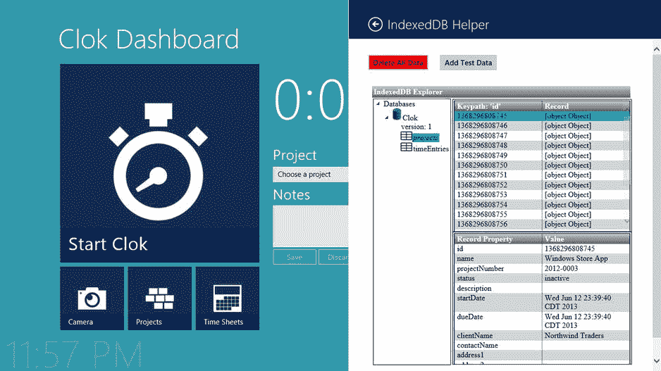
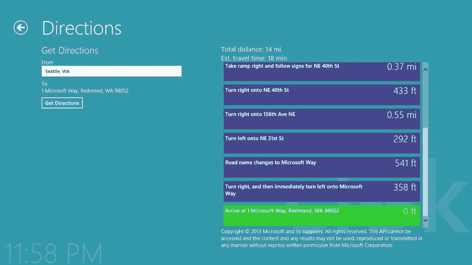

第十四章


数据源选项

在第 11 章中，我介绍了数据绑定，并介绍了一些可以用来在屏幕上显示应用程序数据的不同技术。然而，到目前为止，Clok 中的所有数据都存储在内存中。当应用程序启动时加载测试数据，当应用程序关闭时，对该数据的任何修改都将被丢弃。虽然这使我们能够构建一个看起来不错的应用程序，并制定出允许用户与数据交互的细节，但这还不足以成为一个可用的应用程序。

然而，到本章结束时，Clok 将处于一种状态，人们实际上可以开始每天使用它。这并不是说它是一个完整的应用程序——在本书的其余部分，我们仍然会添加一些功能来改善用户体验。也就是说，在完成本章的练习后，我开始自己使用 Clok。

那么，怎样才能让 Clok 从一个看起来功能正常的应用程序变成一个实际可用的应用程序呢？Clok 缺少的最大特性是以持久格式保存数据的能力。在本章中，我将讨论使用 IndexedDB 处理本地数据，以及使用`WinJS.xhr`函数将远程数据集成到 Clok 中。

本地数据源

本地数据的情况很明显。访问本地数据源中的数据比访问远程数据源中的相同数据更快。无论用户是否连接到互联网或内部网络，它始终可用。在用户没有连接的情况下，一个只依赖远程数据的应用是没有用的。在本节的大部分时间里，我将介绍一种被称为索引数据库 API 的技术，或简称为 IndexedDB 。

索引 b

IndexedDB 是一个数据库引擎，内置于现代 web 浏览器中，如 Internet Explorer、Firefox 和 Chrome web 浏览器。因为使用 HTML 和 JavaScript 构建的 Windows Store 应用程序利用了 Internet Explorer 的渲染和脚本支持，所以 IndexedDB 也可以在 Clok 等应用程序中使用。使用 IndexedDB，您可以将用户的数据存储在本地，就在您的应用程序中，使这些数据随时可用，无论是否连接。

与关系数据库管理系统(RDBMS)不同，如 Microsoft SQL Server 或 Oracle 数据库，IndexedDB 将数据存储为对象。一个对象可以有一个很深的层次结构，比如一个客户对象包含一个订单集合，每个订单都有一个产品集合。或者它可以是一个简单的对象，比如一个`Project`对象或`TimeEntry`对象。

 **注意**在开始使用 IndexedDB 之前，一定要注释`storage.js`中用于用临时数据填充内存列表的代码。在本章的后面，您将把这段代码的修改版本移动到一个新文件中。

从 IndexedDB 填充内存列表

在第 7 章的[中，我提到了一个事实，我更喜欢使用对象和对象集合，而不是构建我的用户界面来直接耦合到数据本身。这为我选择如何读写数据提供了一定的灵活性。考虑到这一点，我将说明如何使用 IndexedDB 作为数据存储来支持我们现有的内存中数据对象。](07.html)

使用 IndexedDB 时，您需要做的第一件事是创建一个数据库。在`storage`类定义之前，添加[清单 14-1](#list1) 到`storage.js`中突出显示的代码。

[***清单 14-1。***](#_list1) 创建索引数据库

```js
"use strict";

var data = Clok.Data;

var _openDb = new WinJS.Promise(function (comp, err) {
    var db;

    var request = indexedDB.open("Clok", 1);

    request.onerror = err;

    request.onupgradeneeded = function (e) {
        var upgradedDb = e.target.result;
        upgradedDb.createObjectStore("projects", { keyPath: "id", autoIncrement: false });
        upgradedDb.createObjectStore("timeEntries", { keyPath: "id", autoIncrement: false });
    };

    request.onsuccess = function () {
        db = request.result;

        // Do something with the database here
    };
});

var storage = WinJS.Class.define(
    // SNIPPED
```

因为所有 IndexedDB 操作都是异步发生的，所以我将`_openDb`定义为代表数据库的`Promise`。由于异步的特性，使用 IndexedDB 的一个常见模式是发出某种类型的请求，并在处理程序中检查该请求的响应。这正是清单 14-1 中发生的事情。通过调用`indexedDB.open`，我请求打开名为 Clok 的数据库的版本 1。该请求的任何错误都由`Promise`对象的`err`函数处理。一旦成功连接到数据库，`onsuccess`事件处理程序将做一些有趣的事情，稍后我将展示这一点。

然而，目前 Clok 数据库的版本 1 并不存在。当请求一个新版本的数据库时，调用`onupgradeneeded`事件处理程序，在这里您可以创建集合，或者对象存储，在这里维护数据。每个对象都需要一个键，而`Project`和`TimeEntry`类上的`id`属性是一个理想的键。因为我们已经有了逻辑来设置这些`id`属性的值，所以我指定了键不会自动递增。

 **注意**除了用于创建初始数据库，`onupgradeneeded`处理程序还用于将现有数据库升级到新版本。在这种情况下，您将在处理程序中添加代码来检查`e.oldVersion`，以确定用户的数据库有多过时，以及成功升级它需要哪些步骤。你可以在`www.w3.org/TR/IndexedDB/`看到这样的例子。

一旦创建并打开了数据库，就会引发`success`事件，调用`onsuccess`处理程序。到目前为止，那里没有什么有趣的事情发生。我只在一个名为`db`的变量中设置了对数据库的引用。因为我计划在整个 Clok 中继续使用内存中的数据列表，所以当数据库打开时，应该用数据库中当前的数据填充这些列表，以便现有的屏幕继续像以前一样工作。将[清单 14-2](#list2) 中高亮显示的代码添加到`onsuccess`处理程序中。

[***清单 14-2。***](#_list2) 此代码在数据库成功打开时执行

```js
request.onsuccess = function () {
    db = request.result;

    _refreshFromDb(db).done(function () {
        comp(db);
    }, function (errorEvent) {
        err(errorEvent);
    });
};
```

通过在`_openDb`声明后添加清单 14-3 中的代码来定义`_refreshFromDb` 。

[***清单 14-3。***](#_list3) 用数据库中的数据填充内存列表

```js
var _refreshFromDb = function (db) {
    return new WinJS.Promise(function (comp, err) {
        while (storage.projects.pop()) { }
        while (storage.timeEntries.pop()) { }
        var transaction = db.transaction(["projects", "timeEntries"]);

        transaction.objectStore("projects").openCursor().onsuccess = function (event) {
            var cursor = event.target.result;
            if (cursor) {
                var project = data.Project.createFromDeserialized(cursor.value);
                storage.projects.push(project);
                cursor.continue();
            };
        };

        transaction.objectStore("timeEntries").openCursor().onsuccess = function (event) {
            var cursor = event.target.result;
            if (cursor) {
                var timeEntry = data.TimeEntry.createFromDeserialized(cursor.value);
                storage.timeEntries.push(timeEntry);
                cursor.continue();
            };
        };

        transaction.oncomplete = comp;
        transaction.onerror = err;
    });
}
```

`_refreshFromDb`函数返回一个`Promise`，它首先清空内存列表。与所有 IndexedDB 操作一样，在事务中，游标对数据库中的每个对象存储打开。只要游标有值，该值就会被添加到适当的内存列表中。事务的`oncomplete`处理程序被设置为`Promise`的`comp`处理程序，这将触发[清单 14-2](#list2) 中的`done`函数。此时，调用`_openDb Promise`的`comp`处理程序来提供对数据库的引用，该引用可用于引用`_openDb`的任何代码。

 **注意**将 WinJS 对象保存到 IndexedDB 数据库时，只保存构造函数中定义的属性。当从数据库中检索对象时，任何定义为实例成员的属性，如`TimeEntry`类中的`project`属性，都没有值。为了缓解这个问题，在`Project`和`TimeEntry`类中，我都添加了一个新的静态函数，名为`createFromDeserialized`。该函数获取从游标返回的匿名对象，并基于这些值创建一个完全水合的对象。这些函数的定义可以在本书附带的源代码中找到。你可以在这本书的产品页面的源代码/下载标签中找到本章的代码示例(`www.apress.com/9781430257790`)。

如果你现在运行 Clok，你会很快发现没有数据(见[图 14-1](#Fig1) )。我们删除了测试数据，现在正在用数据库中的数据填充这些列表。但是，数据库中还没有数据。在这一章的后面，我将展示一些对我们开发人员有帮助的功能，通过提供一种方法来重置我们的测试数据和探索数据库中的数据。在此之前，让我们对 Clok 进行修改，这样当用户保存或删除数据时，我们的数据库就会更新。


[图 14-1](#_Fig1) 。Clok 中没有项目

 **注意**在 Clok 中，我已经使用 IndexedDB 来填充在前面章节中添加的数据的内存列表。这提供了不需要对用于显示和管理项目和时间输入数据的现有屏幕进行任何改变的好处。如果您愿意，您可以实现`IListDataSource`接口来创建自己的数据源，直接使用 IndexedDB。这将允许你绑定`ListView`控件，例如，直接绑定到你的数据，而不必像我在 Clok 中做的那样，先把它加载到一个`WinJS.Binding.List`对象中。关于如何做到这一点的示例，请参见下面的博客条目:`http://stephenwalther.com/archive/2012/07/10/creating-an-indexeddbdatasource-for-winjs`。

当数据改变时更新索引数据库

通过运行应用程序，您可能不知道这一点，但我们已经做了所有必要的更改，将数据从 IndexedDB 数据库加载到内存中，以便在屏幕上显示。在这一节中，我将展示从数据库中保存和删除数据所需的更改。幸运的是，所有需要的更改都局限于`storage.js`，这是将数据加载到内存列表并在整个应用程序中使用这些列表的另一个好处。将清单 14-4 中[的代码添加到`storage.js`中`_refreshFromDb`](#list4) 的定义之后。

[***清单 14-4。***](#_list4) 方法来处理 IndexedDB 数据库中的数据

```js
var _getObjectStore = function (db, objectStoreName, mode) {
    mode = mode || "readonly";

    return new WinJS.Promise(function (comp, err) {
        var transaction = db.transaction(objectStoreName, mode);
        comp(transaction.objectStore(objectStoreName));
        transaction.onerror = err;
    });
};

var _saveObject = function (objectStore, object) {
    return new WinJS.Promise(function (comp, err) {
        var request = objectStore.put(object);
        request.onsuccess = comp;
        request.onerror = err;
    });
};

var _deleteObject = function (objectStore, id) {
    return new WinJS.Promise(function (comp, err) {
        var request = objectStore.delete(id);
        request.onsuccess = comp;
        request.onerror = err;
    });
};
```

 **注意**所有这些函数都返回`Promise`对象，你也可以修改`save`和`delete`函数来返回`Promise`对象。虽然我不会在本章中讨论它，但是您可以对调用这些函数的各个地方进行更新，以利用 async 提供的好处。例如，您可以在用户点击保存按钮时提供一个进度指示器，然后在完成`Promise`时移除它。

定义了这些函数后，我们现在可以对`save`和`delete`函数进行修改。用[清单 14-5](#list5) 中指定的新版本替换保存和删除项目的功能。

[***清单 14-5。***](#_list5) 新版本功能保存和删除项目

```js
storage.projects.save = function (p) {
    if (p && p.id) {
        var existing = storage.projects.getById(p.id);
        if (!existing) {
            storage.projects.push(p);
        }

        return _openDb.then(function (db) {
            return _getObjectStore(db, "projects", "readwrite");
        }).then(function (store) {
            return _saveObject(store, p);
        });
    }

    return WinJS.Promise.as();
};

storage.projects.delete = function (p, permanent) {
    permanent = permanent || false;

    if (p && p.id) {
        if (!permanent) {
            var existing = storage.projects.getById(p.id);
            if (existing) {
                // soft delete = default
                existing.status = data.ProjectStatuses.Deleted;
                return storage.projects.save(existing);
            }
        } else {
            var index = this.indexOf(p);
            if (index >= 0) {
                this.splice(index, 1);

                return _openDb.then(function (db) {
                    return _getObjectStore(db, "projects", "readwrite");
                }).then(function (store) {
                    return _deleteObject(store, p.id);
                });
            }
        }
    }
    return WinJS.Promise.as();
};
```

对`save`函数的修改非常简单。我只是添加了代码来连接到数据库，选择正确的对象存储，并将项目对象保存到该存储中。然而，我对`delete`函数做了一些修改。以前，没有办法从 Clok 中永久删除一个项目。项目只是被分配了一个`Deleted`状态，然后被保存。在典型的 Clok 使用过程中，情况依然如此。然而，当我们在下一节中添加重置临时数据的功能时，我们将需要一种永久删除数据的方法。

在这两个函数中，现在都返回了一个`Promise`。如果操作成功，在[清单 14-4](#list4) 中相应的`_saveObject`或`_deleteObject`函数中定义的`Promise`将返回给调用代码。否则，使用`WinJS.Promise.as`函数返回一个空的`Promise`，不向其提供任何参数。这最后一步不是必需的，但是它确保了通过调用`save`或`delete`返回的对象类型的一致性——它总是一个`Promise`。

保存和删除时间条目功能的更新版本可以在[清单 14-6](#list6) 中看到。这些函数的变化与清单 14-5 中的[非常相似，尽管`delete`函数更简单，因为它总是永久删除时间条目。](#list5)

[***清单 14-6。***](#_list6) 新版本功能保存和删除时间条目

```js
storage.timeEntries.save = function (te) {
    if (te && te.id) {
        var existing = storage.timeEntries.getById(te.id);
        if (!existing) {
            storage.timeEntries.push(te);
        }

        return _openDb.then(function (db) {
            return _getObjectStore(db, "timeEntries", "readwrite");
        }).then(function (store) {
            return _saveObject(store, te);
        });
    }

    return WinJS.Promise.as();
};

storage.timeEntries.delete = function (te) {
    if (te && te.id) {
        var index = this.indexOf(te);
        if (index >= 0) {
            this.splice(index, 1);

            return _openDb.then(function (db) {
                return _getObjectStore(db, "timeEntries", "readwrite");
            }).then(function (store) {
                return _deleteObject(store, te.id);
            });
        }
    }

    return WinJS.Promise.as();
};
```

 **注意[清单 14-5](#list5) 和[清单 14-6](#list6) 中的**，你会注意到当我更新数据时，不管是保存还是删除，我都在更新内存列表和 IndexedDB 数据库。另一种方法是只更新数据库，然后从数据库中重新填充列表，类似于第一次建立数据库连接时加载列表的方式。这种方法没有错，但是我选择这个方向是为了最小化对应用程序的更改。每次重新加载列表都需要更改各种屏幕，以便在列表重新填充后重新加载数据。

现在让我们将一些临时数据放回到 Clok 中，以便于测试。

IndexedDB 浏览器

出于开发的目的，在 Clok 中拥有临时测试数据还是不错的。事实上，因为我们刚刚实现了持久存储所有 Clok 数据的功能，所以如果能够清除任何数据并将数据库重置为默认测试状态就好了。在这一节中，我将向您展示如何添加一个 settings 弹出按钮，它不仅允许您重置测试数据，还提供了一个小的数据库浏览器，您可以使用它来查看存储在 IndexedDB 数据库中的各种对象。

创建“设置”弹出按钮

在`settings`文件夹中添加一个名为`idbhelper.html`的 HTML 文件。用清单 14-7 中的代码替换`idbhelper.html`的默认内容。

[***清单 14-7。***](#_list7) 新设置弹出的外壳

```js
<!DOCTYPE html>
<html>
<head>
    <title>IndexedDB Helper</title>
</head>
<body>
    <div id="settingsDiv" data-win-control="WinJS.UI.SettingsFlyout"
        aria-label="IndexedDB Helper"
        data-win-options="{settingsCommandId:'idbhelper',width:'wide'}">

        <div class="win-ui-dark win-header" style="background-color: #000046;">
            <button type="button" class="win-backbutton"
                onclick="WinJS.UI.SettingsFlyout.show()">
            </button>
            <div class="win-label clok-logo">IndexedDB Helper</div>
        </div>
        <div class="win-content">
            <div class="win-settings-section">

            </div>
        </div>
    </div>
</body>
</html>
```

接下来，通过添加[清单 14-8](#list8) 中突出显示的代码来修改`default.js`。不要像添加`options`和`about`设置弹出按钮那样将新的命令定义添加到`e.detail.applicationcommands`中，而是单独添加，这样更容易根据用户的偏好显示或隐藏它，这一功能将在第 15 章的[中添加。](15.html)

[***清单 14-8。***](#_list8) 布线设置弹出按钮

```js
WinJS.Application.onsettings = function (e) {
    e.detail.applicationcommands = {
        "options": {
            title: "Clok Options",
            href: "/settings/options.html"
        },
        "about": {
            title: "About Clok",
            href: "/settings/about.html"
        }
    };

    e.detail.applicationcommands.idbhelper = {
        title: "IndexedDB Helper",
        href: "/settings/idbhelper.html"
    };

    WinJS.UI.SettingsFlyout.populateSettings(e);
};
```

现在你有了一个新的空的设置弹出按钮，让我们添加一些功能来帮助开发人员构建和测试 Clok。

从微软下载并配置 IDBExplorer

微软的 Internet Explorer 团队开发了一个名为 IDBExplorer 的工具。最初在内部使用，微软向开发人员开放，以探索他们的 IndexedDB 数据库，包括结构和数据。你可以从下面的博客文章中阅读和下载这个工具:`http://blogs.msdn.com/b/ie/archive/2012/01/25/debugging-indexeddb-applications.aspx`。下载包含该工具的 ZIP 文件，并将名为`IDBExplorer`的文件夹从该包复制到 Visual Studio 项目的`settings`文件夹中。[图 14-2](#Fig2) 显示了完成后你应该有的正确的文件夹层次结构。您可以在本书附带的源代码中参考这个过程的完整版本。


[图 14-2](#_Fig2) 。将 IDBExplorer 工具添加到设置文件夹中

如果我们建立的是一个网站，而不是一个 Windows 应用商店，我们早就完成了。然而，为了让这个有用的工具在我们的应用程序中工作，我们还需要完成几个步骤。IDBExplorer 包含一个旧版本的 jQuery。然而，jQuery 的最新版本在 Windows Store 应用程序中工作得更好，所以我建议从`www.jquery.com`下载 jQuery 2.0 版或更高版本，并将其添加到您刚刚添加到项目的`IDBExplorer`中。我选择下载缩小版，如图[图 14-3](#Fig3) 所示，但是未压缩版也可以。


[图 14-3](#_Fig3) 。更新到新版本的 jQuery

 **注意**虽然 jQuery 版与 Windows Store 应用程序配合良好，但在调试模式下运行 Clok(按 F5 而不是 Ctrl+F5)时，您可能偶尔会看到错误。跳过调试器中可能出现的任何错误是安全的。正常运行 Clok 时，如果没有附加调试器，这些错误不会有任何负面影响。我怀疑 jQuery 的某个未来版本会消除这个问题。

在将 IDBExplorer 工具添加到设置弹出按钮之前，您必须对其本身进行的最后一项更改是用来自[清单 14-9](#list9) 的代码更新`IDBExplorer.html`的内容。

[***清单 14-9。***](#_list9) 更新页面以更好地与 Windows 应用商店应用配合使用 s

```js
<!DOCTYPE html>
<html FontName2">http://www.w3.org/1999/xhtml ">
<head>
    <!-- IDBExplorer references -->
    <script src="jquery-2.0.2.min.js"></script>
    <script src="jquery.jstree.js"></script>
    <script src="IDBExplorer.js"></script>
    <link rel="stylesheet" type="text/css" href="IDBExplorer.css" />
    <link rel="stylesheet" type="text/css" href="style.css" />
</head>
<body onload="setDBName();initIDBExplorer();">
</body>
</html>
```

这样，IDBExplorer 就不再需要修改了，您只需通过添加一个`iframe`来托管它，从而在 settings 弹出菜单中显示这个工具。将[清单 14-10 中突出显示的代码](#list10)添加到`idbhelper.html`。

[***清单 14-10。***](#_list10) 在 iframe 中托管 IDBExplorer

```js
<div class="win-settings-section">
    <iframe style="width: 550px; height: 600px"
        src="/settings/IDBExplorer/IDBExplorer.html?name=Clok"></iframe>
</div>
```

立即运行 Clok 并打开 IndexedDB 辅助程序设置弹出按钮。您应该看到 IDBExplorer 显示了关于我们的空数据库的信息(见[图 14-4](#Fig4) )。一旦我们将测试数据添加回 Clok，这个工具将会更有帮助。我将在下一节向您展示如何做到这一点。


[图 14-4](#_Fig4) 。IDBExplorer 显示一个空数据库

添加按钮以重置和加载测试数据

在本章的前面，我让你删除了`storage.js`中加载临时数据到 Clok 的代码。在这一节中，我将向您展示如何将临时数据放回到 Clok 中。首先，在 IndexedDB 辅助设置弹出按钮的顶部添加几个按钮。将清单 14-11 中[突出显示的代码添加到`idbhelper.html`中。](#list11)

[***清单 14-11。***](#_list11) 添加按钮来重置我们的测试数据

```js
<div class="win-settings-section">
    <button onclick="deleteAllData();" style="background-color:red;">Delete All Data</button>
    <button onclick="addTestData();">Add Test Data</button>
    <iframe style="width: 550px; height: 600px"
        src="/settings/IDBExplorer/IDBExplorer.html?name=Clok"></iframe>
</div>
```

因为 IndexedDB Helper settings 弹出按钮仅供开发人员使用，并且应该在部署之前从项目中删除，所以我决定直接在`idbhelper.html`中添加 JavaScript 代码。将来自[清单 14-12](#list12) 的脚本引用添加到`idbhelper.html`的`head`元素中。

[***清单 14-12。***](#_list12) JavaScript 引用和按钮点击处理程序

```js
<script src="//Microsoft.WinJS.1.0/js/base.js"></script>
<script src="//Microsoft.WinJS.1.0/js/ui.js"></script>

<script src="/js/extensions.js"></script>
<script src="/js/utilities.js"></script>

<script src="/data/project.js"></script>
<script src="/data/timeEntry.js"></script>
<script src="/data/storage.js"></script>

<script>

    function deleteAllData() {
        // SNIPPED
    }

    function addTestData() {
        // SNIPPED
    }

</script>
```

重置我们的临时数据是一个两步过程。首先，我们必须删除当前数据库中的所有数据，然后我们必须将临时数据添加到数据库中。用清单 14-13 中[的代码替换`idbhelper.html`中的`deleteAllData`函数](#list13)。

[***清单 14-13。***](#_list13) 删除所有数据按钮处理程序

```js
function deleteAllData() {
    var msg = new Windows.UI.Popups.MessageDialog(
        "This cannot be undone.  Do you wish to continue?",
        "You're about to remove all data from Clok.");

    msg.commands.append(new Windows.UI.Popups.UICommand(
        "Yes, Delete It", function (command) {

            var storage = Clok.Data.Storage;
            storage.projects.forEach(function (p) {
                storage.projects.delete(p, true);
            });
            storage.timeEntries.forEach(function (te) {
                storage.timeEntries.delete(te);
            });
        }));

    msg.commands.append(new Windows.UI.Popups.UICommand(
        "No, Don't Delete It", function (command) { }));

    msg.defaultCommandIndex = 0;
    msg.cancelCommandIndex = 1;

    msg.showAsync();
}
```

单击“删除所有数据”按钮时，会出现一个消息对话框，要求在继续之前进行确认。如果确认，所有项目和时间条目将从内存列表中永久删除，进而从 IndexedDB 数据库中删除数据。

添加临时数据的代码与我们在第 11 章中添加的代码几乎相同，有三个显著的不同:

*   如果任何数据已经存在，则不能添加测试数据。
*   我现在调用`projects.save`和`time.save`，而不是调用`projects.push`和`time.push`将对象添加到列表中，这将把项目添加到`WinJS.Binding.List`对象和 IndexedDB 数据库中。
*   其中一个项目指定了地址细节，这在本章后面讨论远程数据时会有帮助。

用[清单 14-14](#list14) 中的代码替换`idbhelper.html`中的`addTestData`函数。

[***清单 14-14。***](#_list14) 添加测试数据按钮处理程序

```js
function addTestData() {

    var projects = Clok.Data.Storage.projects;
    var time = Clok.Data.Storage.timeEntries;

    if (projects.length > 0 || time.length > 0) {
        var msg = new Windows.UI.Popups.MessageDialog(
            "You cannot add test data since Clok already contains data.",
            "Cannot add test data.");
        msg.showAsync();
        return;
    }

    var createProject = function (name, projectNumber, clientName, id, status) {
        // SNIPPED
    }

    // SNIPPED

    // one needs an address for map example
    var project = createProject(name1, "2012-0017", client3, 1368296808748);
    project.address1 = "1 Microsoft Way";
    project.city = "Redmond";
    project.region = "WA";
    project.postalCode = "98052";
    projects.save(project);

    // SNIPPED

    var createTime = function (id, projectId, dateWorked, elapsedSeconds, notes) {
        // SNIPPED
    }

    // SNIPPED

    time.save(createTime(timeId++, 1368296808757, date1, 10800, "Lorem ipsum dolor sit."));

    // SNIPPED
}
```

 **注**你可以在本书附带的源代码中找到更详细的`addTestData`版本。您可以在该书的 press product 页面的 Source Code/Downloads 选项卡(`www.apress.com/9781430257790`)上找到本章的代码示例。

运行 Clok 并打开 IndexedDB 助手设置弹出按钮。点击按钮添加测试数据，然后查看项目节点(见[图 14-5](#Fig5) )和时间条目节点。您应该会看到所有的测试数据都被列出来了，并且您可以点击顶部窗格中的不同项目，以查看下部窗格中的详细信息。当您对*项目*和*时间条目*进行更改时，这些更改将反映在 IDBExplorer 的设置弹出菜单中。每当您需要新的测试数据时，只需返回到此设置弹出按钮来删除当前数据并添加新的测试数据。



[图 14-5](#_Fig5) 。已完成的索引数据库帮助程序

 **注意**您可能会注意到，首次启动 Clok 时，仪表板屏幕上的项目下拉列表最初并不总是包含活动项目的完整列表。但是，如果您导航到不同的页面，然后返回，列表是完整的。这是因为数据从 IndexedDB 数据库异步加载到填充该控件的`WinJS.Binding.List`中。我们可以通过使用承诺在数据加载后填充控件来解决这个问题。取而代之的是，我们将暂时保留这个问题，当我在第 17 章的[中讲述处理应用程序状态变化时，我们将解决这个问题。](17.html)

SQLite〔t0〕

对于本地数据存储来说，IndexedDB 是一个非常方便的选项，但它不是唯一的选项。如果你的背景和我的相似，你可能有相当多的使用关系数据库系统的经验，比如 Microsoft SQL Server。遗憾的是，您无法从 Windows 应用商店应用程序直接访问存储在基于服务器的数据库中的数据。您可以编写一个服务层来支持您的关系数据库，并将其作为远程数据源进行访问。

您还可以使用 SQLite 之类的工具在 Windows 应用商店应用程序中构建本地数据库。虽然这不是现成的直接支持，我也不会在本书中讨论，但是您可以使用第三方库来为您的应用程序添加对 SQLite 的支持。其中一个名为 *SQLite3-WinRT* 的库可以在这里找到:`https://github.com/doo/SQLite3-WinRT`。

文件存储

除了 IndexedDB 和 SQLite，还可以使用文件在本地存储数据。您可以将 JavaScript 对象保存到文件中。就此而言，在文件中，你可以将文本保存为任何你想要的格式。我不会在这里讨论如何处理文件，但是我会在第 16 章中讨论这个话题。

远程数据源

虽然选择在本地存储数据很重要，但这并不能降低支持远程数据源的需求。使用远程数据的场景数不胜数，例如:

*   获取到客户办公室的路线—我们接下来将研究这个场景
*   阅读和发送电子邮件
*   订阅新闻或博客订阅源
*   计算各航运公司的运费
*   从公司 CRM 中查看和编辑客户数据
*   从同一台机器上运行的另一个进程获取数据

 **注意**需要注意的是，术语*本地数据*不仅仅指与应用程序在同一台机器上的数据。它指的是存储在应用程序本身中的数据。因为 Windows 应用商店应用程序彼此独立，所以一个应用程序不能直接访问另一个应用程序包含的数据，即使这两个应用程序是由同一开发人员创建的。尽管这两个应用程序在同一台机器上，但它们之间有一道墙，数据共享必须通过某种类型的服务进行。

通常，来自远程服务的数据通过 HTTP 公开，要么使用 REST API，要么使用 RPC API。如果您不熟悉这些术语，网上有大量关于 REST 和 RPC 的详细信息，但是它们之间的最大区别是 REST 强调查找和使用一些数据(资源)，而 RPC(如 SOAP)强调执行一些远程操作，本质上是调用在不同进程中运行的函数。完全简化一下，REST 侧重于名词，RPC 侧重于动词。我将要介绍的例子从 REST API 获取数据。

WinJS.xhr

如果您开发 web 应用程序已经有一段时间了，那么您应该熟悉`XMLHttpRequest` (XHR)、，它用于向某处的 web 服务器提交请求并评估响应。web 服务器可以位于公共互联网、私有网络上，甚至与发出请求的应用程序位于同一台机器上。此外，尽管 XML 是其名称的一部分，`XMLHttpRequest`也可以从服务器接收 JSON 数据。因为对远程服务器的请求不会立即响应，所以使用`XMLHttpRequest`发出的请求将指定一个处理函数，在响应可用时执行。清单 14-15 显示了一个非常简单的例子，使用`XMLHttpRequest`请求`someUrl`并对来自服务器的响应做一些事情。

[***清单 14-15。***](#_list15) 用 XMLHttpRequest 从远程服务器请求东西

```js
var request = new XMLHttpRequest();

request.onreadystatechange = function() {
    if (request.readyState === 4 && request.status === 200) {
        // do something with the response
    } else {
        // something bad happened
    }
}

var asyncRequest = true;
request.open("GET", someUrl, asyncRequest);
request.send();
```

这个例子没有完全实现。它只检查`readyState`是`4`(请求已经完成)和 HTTP 状态代码是`200`的情况。它认为任何其他情况都是错误的。`WinJS.xhr`函数将`XMLHttpRequest`的功能封装在`WinJS.Promise`中。响应在`Promise`的`then`或`done`函数中可用，而不是指定处理函数。[清单 14-16](#list16) 执行与[清单 14-15](#list15) 相同的任务，使用`WinJS.xhr`和承诺代替。

[***清单 14-16。***](#_list16) 用 WinJS.xhr 向远程服务器请求东西

```js
WinJS.xhr({ url: someUrl, type: "GET" })
    .done(function success(completeEvent) {
        // do something with the response
    }, function err(errorEvent) {
        // something bad happened
    });
```

可以说它读起来更简单一些，但是因为这个函数返回了一个`Promise`，所以它非常适合 WinJS 中流行的异步编程风格。除了用`GET`方法请求数据，还可以用`WinJS.xhr`提交数据。如果您使用`WinJS.xhr`提交数据，您可能会使用`POST`方法而不是`GET`，并且还必须为 options 参数指定一个`data`属性。例如，您可以使用类似于[清单 14-17](#list17) 的代码将一个新用户保存到远程数据源中。

[***清单 14-17。***](#_list17) 用 WinJS.xhr 发布数据

```js
WinJS.xhr({ url: someUrl, type: "POST", data: { name: "Scott", dob: "Dec 1" } })
```

Clok 的一个新需求是为用户提供到客户所在地的驾驶方向。我将带你通过配置和使用 Bing Maps API 和`WinJS.xhr`来添加这个功能。

必应地图设置

你可能熟悉微软的必应地图产品。与其他提供地图和方向的公司一样，微软也为开发者提供了一个 API，将必应地图集成到他们自己的软件中。在撰写本文时，Bing 地图可以添加到 Windows Store 应用程序中，对于每天使用少于 50，000 笔交易的应用程序(`www.microsoft.com/maps`)不收取许可费。尽管我预计 Clok 会在 Windows Store 取得巨大成功，但我不认为使用率会很快接近这个数字。

尽管这项服务是免费的，但至少在最初，为了使用 Bing Maps API，需要一个密钥。创建一个帐户并登录到 Bing 地图门户(`www.bingmapsportal.com`)。从这里开始，为 Windows 应用商店应用程序创建一个新的基本密钥(见[图 14-6](#Fig6) )。


[图 14-6](#_Fig6) 。请求阿炳地图 API 密钥

一旦你完成了表格，你的钥匙就可以用了。在[图 14-7](#Fig7) 中，你可以看到我的键列表，键本身被模糊掉了。这是一长串字母和数字。一会儿我会告诉您在哪里添加 Clok 的键。如果你把它放错了地方，你可以在任何时候从 Bing 地图门户检索到它。


[图 14-7](#_Fig7) 。我当前的 Bing 地图 API 密钥列表

现在你有了钥匙，你需要一个地方来放它。在 Visual Studio 项目的`data`文件夹中创建一个名为`bingMapsWrapper.js` 的新 JavaScript 文件。将清单 14-18 中[的代码添加到`bingMapsWrapper.js`中。确保在`apikey`变量中添加 Bing Maps API 密钥。](#list18)

[***清单 14-18。***](#_list18) 定义 BingMaps 类

```js
(function () {
    "use strict";

    var apikey = "PUT_YOUR_KEY_HERE";
    var apiEndpoint = " http://dev.virtualearth.net/REST/v1/ ";
    var xhrTimeout = 2000;

    var mapsClass = WinJS.Class.define(
        function constructor() { /* empty constructor */ },
        { /* static class, no instance members */ },
        {
            credentials: {
                get: function () { return apikey; }
            },

            getDirections: function (start, end) {
                // TODO: get the directions here
            }
        }
    );

    WinJS.Namespace.define("Clok.Data", {
        BingMaps: mapsClass,
    });
})();
```

到目前为止，这个类还很简单，只在`credentials`属性中公开了您的键。`getDirections`函数接受起始地址(`start`)和目的地地址(`end`)，并将使用这些值向 Bing 地图服务请求驾驶路线。用清单 14-19 中的代码替换`getDirections`的定义。

 **注意**一定要给`default.js`中的`bingMapsWrapper.js`文件添加一个脚本引用。

[***清单 14-19。***](#_list19) 向必应地图服务请求路线

```js
getDirections: function (start, end) {
    var distanceUnit = "mi";

    var routeRequest = apiEndpoint + "Routes?"
        + "wp.0=" + start
        + "&wp.1=" + end
        + "&du=" + distanceUnit
        + "&routePathOutput=Points&output=json"
        + "&key=" + apikey;

    return WinJS.Promise.timeout(xhrTimeout, WinJS.xhr({ url: routeRequest }))
        .then(function (response) {
            var resp = JSON.parse(response.responseText);

            if (resp
                    && resp.resourceSets
                    && resp.resourceSets[0]
                    && resp.resourceSets[0].resources
                    && resp.resourceSets[0].resources[0]
                    && resp.resourceSets[0].resources[0].routeLegs
                    && resp.resourceSets[0].resources[0].routeLegs[0]
                    && resp.resourceSets[0].resources[0].routeLegs[0].itineraryItems
                    && resp.resourceSets[0].resources[0].routeLegs[0].itineraryItems.length > 0
            ) {
                var directions = {
                    copyright: resp.copyright,
                    distanceUnit: resp.resourceSets[0].resources[0].distanceUnit,
                    durationUnit: resp.resourceSets[0].resources[0].durationUnit,
                    travelDistance: resp.resourceSets[0].resources[0].travelDistance,
                    travelDuration: resp.resourceSets[0].resources[0].travelDuration,
                    bbox: resp.resourceSets[0].resources[0].bbox
                }

                var itineraryItems =
                    resp.resourceSets[0].resources[0].routeLegs[0].itineraryItems.map(
                        function (item) {
                            return {
                                compassDirection: item.compassDirection,
                                instructionText: item.instruction.text,
                                maneuverType: item.instruction.maneuverType,
                                travelDistance: item.travelDistance,
                                travelDuration: item.travelDuration,
                                warnings: item.warnings || []
                            };
                        });

                directions.itineraryItems = new WinJS.Binding.List(itineraryItems);

                return directions;
            }

            return null;
        });
}
```

 **注意**目前，Clok 将只提供以英里为单位的驾驶方向。在第 15 章中，你将添加一个特性，允许用户指定他或她喜欢英里还是公里。

在构建 Bing 地图服务的 URL 之后，该值被传递给`WinJS.xhr`函数，我们已经将它封装在对`WinJS.Promise.timeout`的调用中。这种技术通常用于限制应用程序尝试连接到指定 URL 的时间。在本例中，`xhrTimeout`被设置为 2000 毫秒，因此如果任何从服务获取方向的尝试花费的时间超过 2 秒，用户将被视为离线，请求将被取消。在本章的后面，我将处理取消操作产生的错误，向用户显示适当的消息。

另一方面，如果请求成功，响应(JSON 格式的文本)将被解析成一个名为`resp`的 JavaScript 对象。来自 Bing 地图服务的有效响应具有非常深的层次结构。如果`resp`已经定义了这个层次，那么就构建了一个`directions`对象。该对象是收到的实际响应的简化版本。为了在为数据构建 UI 时简化数据绑定，我删除了层次结构中许多不必要的字段和层。`getDirections`函数返回一个`Promise`，而`directions`对象将通过`then`或`done`函数用于新方向页面。我稍后将对此进行说明，但首先我们需要对项目详细信息页面进行一些更改，以允许用户请求驾驶方向。

向项目详细信息添加按钮

用户将需要一种方法来导航到我们将在下一节创建的新方向页面。您必须在项目详细信息屏幕上的应用程序栏中添加一个按钮，该按钮将导航到新页面。至此，您已经能够在应用程序栏中添加按钮并处理`click`事件了，所以我只总结一下要点。向项目详细信息屏幕上的应用程序栏添加方向按钮。将`icon`属性设置为`directions`，将`disabled`属性设置为`true`(参见[清单 14-20](#list20) )。

[***清单 14-20。***](#_list20) 在项目详情屏幕上添加应用栏按钮

```js
<button
    data-win-control="WinJS.UI.AppBarCommand"
    data-win-options="{
        id:'goToDirectionsCommand',
        label:'Directions',
        icon:'directions',
        section:'selection',
        tooltip:'Directions',
        disabled: true}">
</button>
```

接下来，将清单 14-21 中的代码添加到`detail.js`中。不要忘记在`detail.js`的就绪函数中连接这个`click`事件处理程序。

[***清单 14-21。***](#_list21) 导航至方向屏幕

```js
goToDirectionsCommand_click: function (e) {
    if (this.currProject
            && this.currProject.id
            && this.currProject.isAddressSpecified()) {
        WinJS.Navigation.navigate("/pages/projects/directions.html", {
            project: this.currProject
        });
    }
},
```

通过添加来自[清单 14-22](#list22) 的高亮代码来修改`detail.js`中的`configureAppBar`函数。这将允许为有地址的项目启用方向按钮。如果正在查看的项目尚未保存地址，或者项目尚未保存，按钮将保持禁用状态。

[***清单 14-22。***](#_list22) 启用指路按钮，如果当前项目有地址

```js
configureAppBar: function (existingId) {
    var fields = WinJS.Utilities.query("#projectDetailForm input, "
        + "#projectDetailForm textarea, "
        + "#projectDetailForm select");

    fields.listen("focus", function (e) {
        projectDetailAppBar.winControl.show();
    }, false);

    if (existingId) {
        deleteProjectCommand.winControl.disabled = false;
        goToTimeEntriesCommand.winControl.disabled = false;

        if (this.currProject.isAddressSpecified()) {
            goToDirectionsCommand.winControl.disabled = false;
        }
    }
},
```

清单 14-21 中的和清单 14-22 中的都引用了一个名为`isAddressSpecified`的新函数。要定义这个函数，添加清单 14-23 中的代码，作为`data\project.js`中`Project`类的实例成员。

[***清单 14-23。***](#_list23) 一个确定项目是否有指定地址的函数

```js
isAddressSpecified: function () {
    return (!!this.address1
            || !!this.city
            || !!this.region
            || !!this.postalCode);
}
```

运行 Clok 并导航到几个不同的项目，一个有客户端地址，一个没有。如果您使用了本书附带的源代码中指定的测试数据，那么一个项目将会有一个地址。如果您的测试数据中没有一个项目有客户端地址，那么添加一个地址。[图 14-8](#Fig8) 显示了没有客户地址的项目的项目详细信息屏幕，而[图 14-9](#Fig9) 显示了有客户地址的项目的相同屏幕。


[图 14-8](#_Fig8) 。此项目没有客户地址


[图 14-9](#_Fig9) 。这个项目有一个客户地址，用户可以请求方向

这样，用户现在可以导航到新方向页面。如果我们已经创造了它，他们就可以。现在，如果你点击方向按钮，应用程序只会崩溃。

显示驾驶方向

完成此功能的最后一步是向用户实际显示驾驶方向。让我们为新的方向页面定义一些简单的要求。

*   用户可以输入他或她的起始地址。
*   如果由于某种原因无法检索到方向，用户将会看到一条简单的错误消息。
*   如果从 Bing 地图服务中成功检索到方向，它们将显示在列表中。

在`pages\projects`文件夹中创建一个名为`directions.html`的新页面控件。将页面标题设置为 Directions，并用来自[清单 14-24](#list24) 的代码替换主要部分元素的内容。

[***清单 14-24。***](#_list24) 指点页面

```js
<div id="directionsTemplate" data-win-control="WinJS.Binding.Template" style="display: none">
    <div class="directionsItem">
        <div class="directionsItem-instruction">
            <h3 class="directionsItem-instructionText"
                data-win-bind="textContent: instructionText"></h3>
        </div>
        <div class="directionsItem-distance">
            <h2 class="directionsItem-formattedDistance"
                data-win-bind="textContent: travelDistance
                    Clok.Data.TravelDistanceConverter"></h2>
        </div>
    </div>
</div>

<div id="directionsContainer">
    <div id="locationsPane">
        <h2>Get Directions</h2>
        <div class="formField">
            <label for="fromLocation">From</label><br />
            <input id="fromLocation">
        </div>
        <div class="formField">
            <label for="toLocation">To</label><br />
            <span id="toLocation"></span>
        </div>
        <button id="getDirectionsButton">Get Directions</button>
    </div>
    <div id="directionsPane">
        <div id="directionsSuccess" class="hidden">

            <div id="totalDistance">
                Total distance:
                <span
                    data-win-bind="textContent: travelDistance
                        Clok.Data.TravelDistanceConverter"></span>
            </div>
            <div id="totalTime">
                Est. travel time:
                <span
                    data-win-bind="textContent: travelDuration
                        Clok.Data.TravelTimeConverter"></span>
            </div>

            <div
                id="directionsListView"
                class="itemlist win-selectionstylefilled"
                data-win-control="WinJS.UI.ListView"
                data-win-options="{
                    layout: {type: WinJS.UI.ListLayout},
                    itemTemplate: select('#directionsTemplate'),
                    selectionMode: 'none',
                    swipeBehavior: 'none',
                    tapBehavior: 'none'
                }">
            </div>
            <div data-win-bind="textContent: copyright"></div>
        </div>
        <div id="directionsError" class="hidden">
            Could not get directions. Please check your
            addresses and internet connection.
        </div>
    </div>
</div>
```

页面的布局类似于时间表屏幕，所以我不会详细解释。一边是一个表单，另一边是一个包含方向列表的 ListView。flexbox CSS 布局用于在它们各自的侧面显示它们。

我也不会在这里涵盖完整的 CSS 文件，因为其中没有什么是你没有看过的，在本书附带的源代码中有完整版本的`directions.css`。这里我要指出的一点是，我已经添加了 CSS 来突出显示方向列表中的最后一步，使用了[清单 14-25](#list25) 中指定的 CSS。

[***清单 14-25。***](#_list25) 突出指示最后一步

```js
#directionsPane #directionsListView .win-container:last-of-type {
    background-color: limegreen;
}
```

我这样做是为了改善用户体验，因为它给出了一个非常明确的指示，即没有更多的步骤，这在滚动一长串看起来都一样的方向时就不太清楚了。除了`last-of-type`伪元素，你还可以使用`nth-of-type(odd)`或者`nth-of-type(even)`在两种不同的风格之间切换。

用清单 14-26 中[的代码替换`directions.js`的内容。](#list26)

[***清单 14-26。***](#_list26) 页面定义为指路屏幕

```js
(function () {
    "use strict";

    var maps = Clok.Data.BingMaps;

    WinJS.UI.Pages.define("/pages/projects/directions.html", {
        // This function is called whenever a user navigates to this page. It
        // populates the page elements with the app's data.
        ready: function (element, options) {
            this.populateDestination(options);
            getDirectionsButton.onclick = this.getDirectionsButton_click.bind(this);
        },

        populateDestination: function (options) {
            if (options && options.project) {
                var proj = options.project;

                var addressParts = [
                    proj.address1,
                    proj.city,
                    ((proj.region || "") + " " + (proj.postalCode || "")).trim()];

                this.dest = addressParts.filter(function (part) {
                    return !!part;
                }).join(", ");
                toLocation.textContent = this.dest;
            }
        },

        showDirectionResults: function (hasDirections) {
            if (hasDirections) {
                WinJS.Utilities.removeClass(directionsSuccess, "hidden");
                WinJS.Utilities.addClass(directionsError, "hidden");
            } else {
                WinJS.Utilities.addClass(directionsSuccess, "hidden");
                WinJS.Utilities.removeClass(directionsError, "hidden");
            }
        },

        getDirectionsButton_click: function (e) {

            if (fromLocation.value) {

                maps.getDirections(fromLocation.value, this.dest)
                    .then(function (directions) {

                        if (directions
                                && directions.itineraryItems
                                && directions.itineraryItems.length > 0) {

                            WinJS.Binding.processAll(
                                document.getElementById("directionsContainer"), directions);

                            this.showDirectionResults(true);

                            directionsListView.winControl.itemDataSource
                                = directions.itineraryItems.dataSource;

                            directionsListView.winControl.forceLayout();

                        } else {
                            this.showDirectionResults(false);
                        }
                    }.bind(this), function (errorEvent) {
                        this.showDirectionResults(false);
                    }.bind(this));

            } else {
                this.showDirectionResults(false);
            }
        },
    });
})();
```

当从项目细节屏幕导航到该屏幕时，当前项目作为`options`参数的属性被传递到方向页面。`populateDestination`函数提取目的地地址并将其转换成标准格式，该格式将在获取方向的呼叫中使用。然后，它在屏幕上显示目的地地址。`showDirectionResults`功能用于在检索到方向时切换方向列表，在检索不到方向时切换错误消息。

对 Bing 地图服务的调用发生在`getDirectionsButton_click`。如果用户指定了起始地址，则调用`BingMaps`类中的`getDirections`。如果有成功的响应，页面的数据绑定将通过调用`WinJS.Binding.processAll`来连接。否则，将显示错误消息。

最后一步是添加清单 14-24 中引用的绑定转换器。将清单 14-27 中突出显示的代码添加到`bingMapsWrapper.js`中。

[***清单 14-27。***](#_list27) 为列表方向绑定转换器

```js
var secondsToTravelTimeConverter = WinJS.Binding.converter(function (s) {
    if (s > 3600) {
        return Clok.Utilities.SecondsToHours(s, true) + " hr";
    } else if (s > 60) {
        return (s / 60).toFixed(0) + " min";
    } else {
        return "< 1 min"
    }
});

var travelDistanceConverter = WinJS.Binding.converter(function (distance) {
    if (distance >= 5) {
        return distance.toFixed(0) + " mi";
    } else if (distance >= 0.2) {
        return distance.toFixed(2) + " mi";
    } else {
        return (distance * 5280).toFixed(0) + " ft";
    }
});

WinJS.Namespace.define("Clok.Data", {
    BingMaps: mapsClass,
    TravelTimeConverter: secondsToTravelTimeConverter,
    TravelDistanceConverter: travelDistanceConverter
});
```

Bing 地图服务以英里为单位返回距离，以秒为单位返回持续时间。我使用了一些简单的公式，根据英里数或秒数转换成一个更加用户友好的值。立即运行 Clok，获取从您所在位置到您的某个客户的路线。图 14-10 应该类似于你的屏幕，在右边的列表中有一个方向列表，包括你的最终目的地用绿色突出显示(或者如果你正在阅读这本书的黑白版本，用一种较浅的灰色)。



[图 14-10](#_Fig10) 。从西雅图到雷德蒙的方向

 **注意**`directions.itineraryItems`中的每个值都包含一个`maneuverType`属性和一个`warnings`属性。我们不会在本书中使用它们，但是雄心勃勃的开发者可以在`ListView`中使用它们为用户提供额外的信息。例如，当`maneuverType`为“右转”时，您可能希望显示一个指向右边的箭头，当出现“收费站”警告时，您可能会显示一个货币符号。Bing 地图服务可以返回 60 多种策略类型和 30 多种警告类型。关于机动类型和警告的更多信息可分别在`http://msdn.microsoft.com/en-us/library/gg650392.aspx`和`http://msdn.microsoft.com/en-us/library/hh441731.aspx`的 MSDN 上获得。

外部库

虽然用 HTML 和 JavaScript 构建的 Windows 应用商店应用程序中对远程数据的大多数访问将使用`WinJS.xhr`来检索或提交数据，但还有其他选择。使用外部库，无论是 JavaScript 库还是其他 WinRT 库，都可以实现自己处理远程数据的方法。例如，如果您在应用程序中使用 jQuery，您可以使用`$.get`或`$.post`来处理远程 HTTP 服务。在幕后，jQuery 仍然在使用`XMLHttpRequest`，但是它把它抽象出来了。同样，如果您正在构建或引用一个 C# WinRT 组件，它可能会使用`HttpClient`类访问远程数据。虽然我将在第 18 章的[中介绍一个非常简单的 C# WinRT 组件，但我不会用这两种技术来介绍远程数据源](18.html)。

Azure 移动服务

如果你正在寻找一个完整的远程数据解决方案，我会鼓励你看看 Windows Azure 移动服务。除了数据存储和检索之外，移动服务还提供了许多出色的功能，例如数据验证、单点登录用户身份验证、推送通知等等。所有这些功能在多个平台上都受支持，包括 Windows 应用商店应用、Windows Phone、iOS、Android 和 HTML 应用。移动服务是一个巨大的话题，可以用一整本书来专门讨论它。与其在这里尝试，我建议去 Windows Azure 移动服务在线开发中心获取文档和教程。

结论

外面有很多数据。有时候，你需要它在你的应用程序中本地可用，供离线使用，IndexedDB 是一个很好的选择。其他时候，您需要从第三方服务访问数据，或者将数据保存到您公司开发的自定义 HTTP 服务中。在这些情况下，`WinJS.xhr`是一个很好的起点。然而，还存在其他选择，包括 SQLite，用于本地数据存储，以及使用外部库或 Windows Azure Mobile 服务来提供对远程数据源的访问。

Clok 现在是一个人们可以实际使用的应用程序。在本章之前，没有保存任何数据，每次启动应用程序时，任何更改都会丢失。随着本章中 IndexedDB 的引入，现在可以保存对项目和时间条目的所有更改。在接下来的几章中，我们还将继续进行一些改进，以改善用户体验，包括允许用户保存一些应用程序偏好，我将在第 15 章中介绍。