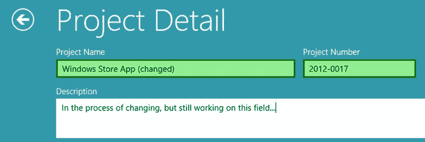
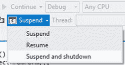
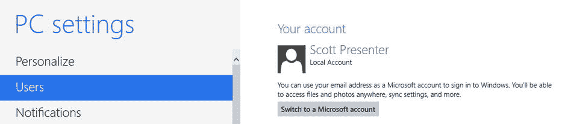

# 十五、会话状态和设置

在第 14 章中，我介绍了一些使用本地和远程数据源的技术。除了用户在应用中创建并与之交互的数据之外，通常还需要保存和加载其他值。例如，您可能希望保存用户正在处理的表单的内容，以便您可以在应用终止后重新填充表单。或者用户可能希望在每次运行应用时指定某些首选项。

尽管可能，但将这些类型的值存储在 IndexedDB 数据库中并不理想。实际上，虽然 IndexedDB 可以高效地存储大量信息，但有更好的方法来存储这些类型的值。如果您的应用没有其他理由使用 IndexedDB，尤其如此，因为创建和连接 IndexedDB 数据库会产生开销。

我所指的值的类型被认为是会话状态或设置。会话状态和设置是类似的概念，因为它们允许您使用简单的语法存储简单的值，通常很小。Windows 应用商店应用可以利用会话状态和两种类型的设置—本地和漫游。在本章中，我将介绍以下主题:

*   *会话状态*:如果应用被挂起和终止，存储维护和恢复应用状态所需的值
*   *本地设置*:存储在应用启动之间和重启之后必须保持的值。用户当前使用的单台计算机的本地
*   *漫游设置*:功能上与本地设置相同，只是它们在多台机器之间同步

 **注**微软在 MSDN 发表了一篇题为《高效存储和检索状态》的文章它比较了您可能考虑用于存储数据、会话状态和设置的各种选项。可以在`http://msdn.microsoft.com/en-us/library/windows/apps/hh781225.aspx`找到。

会话状态

使用 Windows 8 时，您可以从开始屏幕启动任意数量的应用。您可以让一个应用以全屏模式运行，也可以让两个应用并排显示。您可以随意在打开的应用之间切换，当您返回到之前使用的应用时，您可以从您离开的地方继续。标准的东西，对吧？实际上，所有这些应用可能不会一直运行。事实上，当你从一个应用切换出来时，Windows 会挂起它。该应用将保留在内存中，直到您切换回来，此时 Windows 将恢复该应用。因为应用在内存中，所以这是一个非常无缝的体验，而且应用似乎从未停止运行。

那么，为什么要提起呢？有时，当您从某个应用切换出来后，您的电脑将没有足够的资源将该应用保存在内存中。此时，Windows 将终止该应用，释放它正在使用的资源。例如，假设您正在使用应用来完成一个很长的表单，然后切换到其他地方查找完成表单所需的信息。找到所需信息后，切换回应用并完成表单。如果在您查找信息时，Windows 终止了应用，当您切换回来时会发生什么？解决这个问题是会话状态的目的。会话状态可用于在您使用应用时捕获它的当前状态，然后在终止的应用重新启动时还原它。

幸运的是，WinJS 使得从会话状态中保存和检索项目变得很容易。我将向您展示如何在项目详细信息页面上将会话状态合并到 Clok 中。如果 Clok 在此屏幕上工作时被终止，当它恢复时，会话状态将用于使屏幕看起来就像 Clok 被终止前一样。

保存会话状态

在本节中，您将添加代码以将项目详细信息表单的当前状态保存到会话状态中。当用户更改字段中的值时，您将更新会话状态。这是一个非常简单的要求，实现也非常简单。首先，打开`detail.js`，在文件顶部附近添加清单 15-1 中突出显示的类别名。

[***清单 15-1。***](#_list1) 添加一些别名来方便自己

```js
var app = WinJS.Application;
var data = Clok.Data;
var storage = Clok.Data.Storage;
```

`WinJS.Application`类有一个名为`sessionState`的对象，这是我们处理会话状态的访问点。因为 JavaScript 是一种动态语言，你可以简单地给`sessionState`附加新的属性，它们就会被保存。通过添加清单 15-2 中突出显示的代码来更新`ready`函数。

[***清单 15-2。***](#_list2) 字段改变时更新会话状态

```js
ready: function (element, options) {

    // SNIPPED

    WinJS.Utilities.query("input, textarea, select")
        .listen("change", function (e) {
            this.populateProjectFromForm();
            app.sessionState.currProject = this.currProject;
        }.bind(this));

    projectStatus.addEventListener("change", function (e) {
            this.populateProjectFromForm();
            app.sessionState.currProject = this.currProject;
        }.bind(this));
},
```

这段代码为任何输入字段、文本区域或下拉列表上的`change`事件添加一个事件处理程序，并为`projectStatus ToggleSwitch`添加一个事件处理程序。两个处理程序的代码是相同的。首先，调用您在[第 11 章](11.html)中添加的`populateProjectFromForm`函数。在此之前，该函数仅在保存`currProject`变量之前使用(见[清单 15-3](#list3) )。

[***清单 15-3。***](#_list3) 之前使用的 populateProjectFromForm 函数

```js
this.populateProjectFromForm();
storage.projects.save(this.currProject);
```

在[清单 15-3](#list3) 中，`populateProjectFromForm`函数根据表单字段中的值更新`currProject`的值。然后`currProject`被保存到`app.sessionState`中，顾名思义，这是 WinJS 应用中存储会话状态的地方。

到目前为止非常简单，当用户对项目细节表单进行更改时，这将非常有助于保持会话状态最新。但是，当用户键入时，不会引发 change 事件。对于文本输入控件，只有在用户更改控件的值，然后将焦点从输入字段移开后，才会引发该事件。在许多情况下，这不会有太大的不同。但是，假设在应用终止之前，您已经在描述字段中键入了几个段落。如果您一直在输入，但从未通过(例如)移动到下一个字段来触发更改事件，则您的更改不会添加到会话状态中。

为了处理这个场景，您必须处理`WinJS.Application`的`checkpoint`事件，该事件在应用即将被挂起时被触发。将[清单 15-4](#list4) 中高亮显示的代码添加到`detail.js`中。

[***清单 15-4。***T5】处理检查点事件](#_list4)

```js
ready: function (element, options) {

    // SNIPPED

    this.app_checkpoint_boundThis = this.checkpoint.bind(this);
    app.addEventListener("checkpoint", this.app_checkpoint_boundThis);

    WinJS.Utilities.query("input, textarea, select")
        .listen("change", function (e) {
            this.populateProjectFromForm();
            app.sessionState.currProject = this.currProject;
        }.bind(this));

    projectStatus.addEventListener("change", function (e) {
            this.populateProjectFromForm();
            app.sessionState.currProject = this.currProject;
        }.bind(this));
},

checkpoint: function () {
    this.populateProjectFromForm();
    app.sessionState.currProject = this.currProject;
},
```

尽管对于当前的任务来说可能会更简单，但是添加事件监听器时不寻常的语法很快就会派上用场。简而言之，我将`app_checkpoint_boundThis`定义为一个函数，它是`checkpoint`函数，并且`this`变量的作用域与`ready`函数中的相同。在`checkpoint`函数中，使用了与清单 15-2 中定义的另外两个事件处理程序相同的代码。

现在，用户已经做出或正在做出的任何更改都将保存到会话状态中。如果他或她对字段进行了更改，会话状态将立即更新。如果当应用终止时，用户正在进行更改，当应用的`checkpoint`事件被触发时，会话状态将被更新。

 **注意** Windows 8 在终止你的应用时不会引发事件。当它被挂起时，它会通过`checkpoint`事件通知应用。当对保存的值进行更改时，以及当应用被挂起时，都应该保存会话状态。

`checkpoint`事件是`WinJS.Application`类的一部分。这意味着应用本身，而不仅仅是这个屏幕，正在引发事件。因此，我们希望确保当这个页面不活动时，比如当用户已经导航离开时，我们不必费心处理这个事件。同样，如果用户已经明确地离开了这个页面，我们可以丢弃存储在会话状态中的值。记住:会话状态的目的是让你的应用看起来好像从未被挂起或终止过。在`detail.js`中的`ready`函数后添加来自[清单 15-5](#list5) 的代码。

[***清单 15-5。***](#_list5) 当用户导航离开页面时重置内容

```js
unload: function () {
    app.sessionState.currProject = null;
    app.removeEventListener("checkpoint", this.app_checkpoint_boundThis);
},
```

正在读取会话状态

将对象保存到会话状态非常容易。现在，我将向您展示如何在恢复一个终止的应用时使用它。当前，当该屏幕加载时，执行清单 15-6 中的[代码来初始化`currProject`属性](#list6)。如果我们正在编辑一个现有的项目，我们将`currProject`设置为该值；否则，我们将它设置为一个新的、空的`Project`。

[***清单 15-6。***](#_list6)curr project 的当前初始化

```js
this.currProject = storage.projects.getById(options && options.id)
    || new Clok.Data.Project();
```

现在我们添加了会话状态作为初始化`currProject`的另一个因素，逻辑会变得稍微复杂一些。让我们把这个逻辑移到一个新的函数中，试图让`ready`函数更容易理解。用[清单 15-7](#list7) 中的代码替换[清单 15-6](#list6) 中的代码，即`detail.js`的`ready`函数的第一行。

[***清单 15-7。***](#_list7) 替换代码

```js
this.setCurrentProject(options);
```

你必须添加更新的初始化逻辑，所以通过添加清单 15-8 中[的代码来定义`detail.js`中的`setCurrentProject`函数](#list8)。

[***清单 15-8。***](#_list8) 初始化 currProject 的新逻辑

```js
setCurrentProject: function (options) {
    var sessionProject = (app.sessionState.currProject)
        ? data.Project.createFromDeserialized(app.sessionState.currProject)
        : null;

    if (options && options.id && sessionProject && options.id !== sessionProject.id) {
        sessionProject = null;
    }

    this.currProject = sessionProject
        || storage.projects.getById(options && options.id)
        || new Clok.Data.Project();

    app.sessionState.currProject = this.currProject;
},
```

该函数做的第一件事是确定项目当前是否保存在会话状态中。如果是，但由于某种原因，它不是当前正在查看的同一项目，则会话状态中的值将被忽略。此时，`currProject`被设置为来自会话状态的`Project`对象，如果它存在的话。如果不是，但是我们正在编辑一个项目，`currProject`被设置为那个`Project`对象。否则，当我们添加一个新项目时，`currProject`被设置为一个新的空的`Project`对象。然后，在结束时，`currProject`被保存到会话状态。

因为项目细节屏幕已经将其表单绑定到了`currProject`属性，这就是我们所要做的。项目详细信息屏幕现在将在会话状态中保存其状态，并在应用终止后恢复时恢复。让我们看看如何测试这个。

测试暂停和终止

要从 Visual Studio 测试这段代码，您必须调试应用(F5)，而不是不调试就运行应用(Ctrl+F5)。您也可以单击 Visual Studio 工具栏上的“调试”按钮。[图 15-1](#Fig1) 显示了我的调试按钮，调试目标设置为模拟器。这将启动 Clok 并附加 Visual Studio 调试器。


[图 15-1](#_Fig1) 。在 Windows 模拟器中调试

立即调试 Clok。我更喜欢使用模拟器，但是如果你愿意，你也可以选择本地机器或者远程机器。导航至现有项目的项目详细信息屏幕，并对一个或多个字段进行更改(参见[图 15-2](#Fig2) )。



[图 15-2](#_Fig2) 。项目详细信息，在一个字段中进行了更改，在另一个字段中进行了更改

当您仍在项目详细信息屏幕上时，在保存项目之前，切换回 Visual Studio。当 Clok 连接调试器运行时，你会在工具栏上看到一个类似于图 15-3 所示的菜单。如果你只点击按钮，它将暂停应用。相反，如果您展开菜单，您可以选择挂起、恢复或挂起并关闭。



[图 15-3](#_Fig3) 。模拟应用终止

由于 Windows 处理应用暂停和恢复的方式，这些场景将“正常工作”，Clok 将表现得好像它从未被中断过一样。然而，挂起和关闭选项模拟当资源太低而无法在不使用时将应用保留在内存中时，Windows 终止应用。如果您现在选择该选项，Clok 将关闭。

但是，如果您再次启动它，它应该会返回到同一个屏幕，您正在进行的更改仍然会显示在表单中。看起来应该还是像[图 15-2](#Fig2) 。

关于会话状态的快速注释

会话状态是 WinJS 的一个便利特性，它让你的应用看起来好像从未停止运行。但是，有时会丢弃会话状态。

*   我们添加了代码，以便在用户导航到另一个屏幕时丢弃它。
*   如果用户手动关闭应用，例如通过按 Alt+F4，或者从触摸屏的顶部向下滑动并将应用拖到屏幕的底部，则它会被丢弃。
*   当用户重新启动计算机时，它将被丢弃。

在本书附带的代码中(参见本书的 Apress 产品页面[ `www.apress.com/9781430257790` ]的源代码/下载选项卡)，您可以找到一个版本的方向屏幕，它也利用了会话状态。我没有将它添加到时间输入屏幕。如果您想在屏幕上添加会话状态，这可能是一个很好的练习。这比我们在这里看到的要复杂一些，因为除了跟踪时间条目添加/编辑表单的当前状态之外，它还必须考虑在时间条目列表中选择了哪些项目(如果有的话)。

本地设置

会话状态存储值，使应用看起来好像从未停止运行，即使它可能已被挂起或终止，然后又被恢复。另一方面，本地设置有不同的目的。虽然会话状态最终会被丢弃，但在应用启动、应用关闭和计算机重新启动之间，本地设置会得到维护。本地设置是一个很好的工具，可以在这台计算机上存储与该应用相关的值，并以一种持久的方式长期存储这些值。

保存本地设置

虽然现在可以使用 Clok，但是有许多不便之处。一个突出的问题是，如果您在仪表板上启动计时器，然后关闭应用或导航到另一个屏幕，当您返回时，计时器已经停止并重置。在这一节中，我将向您展示如何使用本地设置来保持应用启动和导航之间的计时器状态。

为此，我们将保存计时器的当前状态(它的`startStops`属性)、当前选择的项目以及已经输入到本地设置中的任何注释。有了这些值，当启动 Clok 或从应用的另一个屏幕导航回仪表板时，就有可能以正确的状态显示计时器。打开`home.js`并将来自[清单 15-9](#list9) 的代码添加到文件顶部附近。

[***清单 15-9。***](#_list9) 添加更多别名

```js
var appData = Windows.Storage.ApplicationData.current;
var localSettings = appData.localSettings;
```

接下来，将[清单 15-10 中的代码](#list10)添加到`PageControl`定义中的`home.js`中。

[***清单 15-10。***](#_list10) 功能更新本地设置

```js
saveDashboardStateToSettings: function () {
    var state = JSON.stringify({
        startStops: elapsedTimeClock.winControl.startStops,
        projectId: Number(project.options[project.selectedIndex].value),
        timeNotes: timeNotes.value,
    });

    localSettings.values["dashboardState"] = state;
},

removeDashboardStateFromSettings: function () {
    localSettings.values.remove("dashboardState");
},
```

许多类型的值可以保存到本地设置中，但不幸的是，表示计时器启动和停止时间的对象数组不能。为了解决这个问题，我使用了`JSON`类中的`stringify`函数将 JavaScript 对象转换成 JSON 格式的字符串。虽然没有简单地将`state`变量保存到本地设置中那么方便，但这是一个简单的步骤。

在[清单 15-10](#list10) 中定义的函数将在`home.js`中的不同地方被调用。每当用户启动或停止计时器、选择项目或输入注释时，都会调用`saveDashboardStateToSettings`函数。将[清单 15-11](#list11) 中高亮显示的代码添加到`home.js`中。

[***清单 15-11。***](#_list11) 调用该功能保存本地设置

```js
project_change: function (e) {
    this.enableOrDisableButtons();
    this.saveDashboardStateToSettings();
},

timeNotes_change: function (e) {
    this.saveDashboardStateToSettings();
},

toggleTimer: function () {
    this.timerIsRunning = !this.timerIsRunning;
    this.setupTimerRelatedControls();
    this.saveDashboardStateToSettings();
},
```

类似地，`removeDashboardStateFromSettings`函数将在两个不同的时间被调用:当一个时间条目被保存或丢弃时。在`save`和`discard`功能的最后是一个`done`功能，它目前只重置计时器。将清单 15-12 中突出显示的代码添加到这两个`done`函数中，以便在不再需要该值时清理本地设置。

[***清单 15-12。***](#_list12) 清除本地设置中的保存和丢弃功能

```js
.done(function () {
    self.resetTimer();
    self.removeDashboardStateFromSettings();
});
```

正在读取本地设置

与会话状态一样，保存本地设置是一项非常简单的任务。你不会惊讶地发现，阅读它们也一样简单。在这一节中，我将向您展示如何读取之前保存的本地设置，以使 Clok 仪表板按照用户的期望工作。即使应用可能没有运行，计时器也会显示为连续运行。这也是我在《T2》第 12 章中重构`Clock`控件的原因之一。因为我们可以根据计时器的开始和停止来计算经过的时间，所以我们可以让计时器看起来好像它一直在运行，而实际上并没有。

你要做的第一件事是添加代码来读取我们在[清单 15-10](#list10) 中创建的本地设置。因为我们必须将其保存为 JSON 格式的字符串，所以我们必须使用`JSON.parse`函数将其转换回对象。将[清单 15-13 中的代码](#list13)添加到`home.js`。

[***清单 15-13。***](#_list13) 功能读取本地设置并初始化控件

```js
setDashboardStateFromSettings: function () {
    var state = localSettings.values["dashboardState"];

    if (state) {
        state = JSON.parse(state);

        elapsedTimeClock.winControl.startStops = state.startStops;
        project.selectedIndex = this.getIndexOfProjectId(state.projectId);
        timeNotes.value = state.timeNotes;

        if (elapsedTimeClock.winControl.isRunning) {
            this.startTimer();
        }
    }
},

getIndexOfProjectId: function (projectId) {
    var index = 0;

    for (var i = 0; i < project.options.length; i++) {
        if (!isNaN(project.options[i].value)
                && Number(project.options[i].value) === projectId) {

            index = i;
            break;
        }
    }

    return index;
}
```

从本地设置中获取状态后，它用于为计时器、所选项目和 notes 字段设置正确的值。然后，如果定时器控件应该运行，我们通过调用`startTimer`函数来启动它。`startTimer`函数是新的，但其中的代码不是。我只是重构了`setupTimerRelatedControls`函数，拉出了启动和停止的逻辑。更新`setupTimerRelatedControls`函数，并在[清单 15-14](#list14) 中添加两个新函数。

[***清单 15-14。***](#_list14) 重构函数

```js
setupTimerRelatedControls: function () {
    if (this.timerIsRunning) {
        this.startTimer();
    } else {
        this.stopTimer();
    }

    this.enableOrDisableButtons();
},

startTimer: function () {
    elapsedTimeClock.winControl.start();
    timerImage.src = "/img/Clock-Running.png";
    timerTitle.innerText = "Stop Clok";
    this.timerIsRunning = true;
},

stopTimer: function () {
    elapsedTimeClock.winControl.stop();
    timerImage.src = "/img/Clock-Stopped.png";
    timerTitle.innerText = "Start Clok";
    this.timerIsRunning = false;
},
```

需要对`Timer`控件做一点小小的改动。目前，让计时器开始计数的唯一方法是调用`start`函数。然而，该功能仅在定时器尚未运行时有效。在我们返回计时器应该运行的仪表板屏幕的情况下，我们必须能够启动更新运行时间的间隔。将[清单 15-15](#list15) 中高亮显示的代码添加到`timerControl.js`中的`start`函数中。

[***清单 15-15。***](#_list15) 添加条件允许定时器从停止的地方重新开始

```js
start: function () {
    if (!this.isRunning) {
        this._intervalId = setInterval(this._updateTimer.bind(this), 250);
        this.startStops[this.startStops.length] = { startTime: (new Date()).getTime() };
        this.dispatchEvent("start", {});
    } else if (this._intervalId <= 0) {
        // timer is running, but not updating yet
        this._intervalId = setInterval(this._updateTimer.bind(this), 250);
    }
},
```

当`startStops`中有一个项目有一个没有`stopTime`的`startTime`时，`Timer`控件的`isRunning`属性为`true`。只要我们停留在仪表板上，就会根据`isRunning`属性开始或停止更新 UI 的时间间隔。然而，如果我们启动计时器，然后重新启动 Clok，或者简单地从应用的另一个屏幕返回到仪表板屏幕，那么`startStops`数组将导致`isRunning`成为`true`，即使间隔时间没有更新 UI。有了这个改变，调用`start`将开始间隔。

现在用来自[清单 15-16](#list16) 的代码更新`home.js`中的`ready`函数。

[***清单 15-16。***](#_list16) 修改就绪功能

```js
ready: function (element, options) {

    this.initializeMenuPointerAnimations();
    this.bindListOfProjects();
    this.setDashboardStateFromSettings();
    this.setupTimerRelatedControls();

    toggleTimerMenuItem.onclick = this.toggleTimerMenuItem_click.bind(this);
    project.onchange = this.project_change.bind(this);
    timeNotes.onchange = this.timeNotes_change.bind(this);
    editProjectButton.onclick = this.editProjectButton_click.bind(this);
    saveTimeButton.onclick = this.saveTimeButton_click.bind(this);
    discardTimeButton.onclick = this.discardTimeButton_click.bind(this);

    projectsMenuItem.onclick = this.projectsMenuItem_click.bind(this);
    timesheetMenuItem.onclick = this.timesheetMenuItem_click.bind(this);

},
```

除了将一些语句以不同的顺序组合成类似的代码，主要的区别是我调用了我们刚刚在清单 15-13 的[中添加的新的`setDashboardStateFromSettings`函数。现在，在推出 Clok 并进行测试之前，还有一个问题需要解决。](#list13)

您可能还记得上一章中的一个注释，描述了由于从 IndexedDB 数据库异步加载数据而导致的在仪表板上加载项目列表的延迟。如果您现在运行此代码，应用可能仍然会启动，但没有完全填充的项目列表。不用担心；数据就在那里，如果您导航到(例如)项目屏幕，然后再回到控制面板，就会显示出来。然而，我们只是添加了代码，根据保存到本地设置的状态，在这个列表中选择适当的项目。当我讨论闪屏和应用状态时，我提到我会在第 17 章中讨论减轻这种情况的方法。也就是说，如果没有项目列表，很难展示这个例子的预期效果。我将向您展示如何用承诺暂时解决这个问题。将清单 15-17 中的代码作为静态成员添加到`storage.js`中。

[***清单 15-17。***](#_list17) 创建函数初始化 IndexedDB

```js
initialize: function () {
    return _openDb;
},
```

将`home.js`中`ready`函数的内容包装起来(参见[清单 15-16](#list16) )，调用`initialize`函数，返回一个`Promise`对象(参见[清单 15-18](#list18) )。

[***清单 15-18。***](#_list18) 将 Ready 函数的内容包装在一个承诺中

```js
ready: function (element, options) {
    storage.initialize().done(function () {
        // SNIPPED
    }.bind(this));
},
```

 **注意**这实际上是处理这个问题的一个非常有效的方法，但是我们将在第 17 章中用不同的方式来解决这个问题。这修复了当仪表板是第一个加载的屏幕时的数据加载竞争情况，但是它没有解决用户以某种方式打开 Clok 到不同屏幕的问题。如果用户在不同的屏幕上恢复之前执行的已终止的应用，这可能会发生，或者它可能会通过点击通知或从 Windows 搜索界面激活 Clok 来发生，这是我将在第 19 章中讨论的主题。

测试本地设置

在一个看起来不像仪表板的静态截图中，我没有太多可以演示的内容。但是，如果你现在跑 Clok，你可以通过一个小测试看到你的劳动成果。

1.  发射 Clok。
2.  启动计时器并选择一个项目。
3.  关闭 Clok 一会儿。
4.  重新推出 Clok。

当 Clok 重新启动时，仪表板将显示自您第一次启动计时器以来经过的总时间。在关闭应用之前，让计时器保持运行状态，并在关闭应用之前让计时器停止运行，以此来测试它。在这个过程中，你甚至可以重启电脑。

如果 Clok 在第 14 章的结尾是一个可用的应用，那么它现在就更可用了。仍然有许多特性需要添加，但这是最明显的缺点。另一个可以改善整体用户体验的特性是允许用户为应用中的不同选项指定一些偏好。我将在下一步介绍漫游设置时讨论这个问题。

漫游设置

本地设置和漫游设置非常相似。在应用启动甚至计算机重启之间，它们都永久地存储值。因为它们都是`ApplicationDataContainer`的实例，所以它们的 API 是相同的。两者都是存储用户偏好的好选择。不同之处在于，存储在本地设置中的任何内容都只能在存储它的计算机上使用。另一方面，存储在漫游设置中的任何内容都将与同一用户安装了您的软件的任何其他计算机同步。

在这一节中，我将向您展示如何使用漫游设置来存储用户对 Clok 的偏好。建议将影响用户与应用交互方式的任何此类设置存储在漫游设置中，而不是本地设置中。如果他们在另一台电脑上使用该应用，这些设置将在电脑之间同步。

起初，在计算机之间漫游设置对我来说似乎是违反直觉的，但我当时的问题是，我考虑的每个例子都是只对单台计算机有意义的设置。我正在编写一个应用，从用户的硬盘上加载图像文件，我想在设置中存储最近使用的路径。这在多台电脑上实际上没有意义，因为一台电脑上包含图像的目录可能在另一台电脑上不存在。然而，当我开始考虑其他类型的设置时，我开始明白漫游设置应该是我的首选，在适当的时候恢复到本地设置。如果一个设置影响用户与应用的交互方式，那么这个设置应该漫游。例如，在 Clok 中，我们将允许用户指定他们喜欢 12 小时制还是 24 小时制。如果他们更喜欢一台计算机上的 12 小时时钟，他们很可能更喜欢每台计算机上的 12 小时时钟。

关于漫游设置，需要记住的一点是，只有当用户使用 Microsoft 帐户登录他们的计算机时，这些设置才会漫游。如果他们没有使用 Microsoft 帐户登录计算机，漫游设置就像本地设置一样。微软于`http://msdn.microsoft.com/en-us/library/windows/apps/hh465094.aspx`在 MSDN 上发布了“漫游应用数据指南”。如果您想测试漫游设置的同步功能，您可以切换到 Microsoft 帐户登录，方法是转到开始屏幕，键入“用户”，将搜索上下文切换到设置，然后单击用户搜索结果。从那里，你可以配置你的电脑，这样你就可以用微软账户登录(见[图 15-4](#Fig4) )。



[图 15-4](#_Fig4) 。切换到 Microsoft 帐户

保存漫游设置

Clok 有一些特性,我们的用户可能想要为这些特性指定偏好。在这一节中，我将向您介绍如何实现 UI 来允许他们指定自己的首选项，以及如何将这些首选项保存到漫游设置中。具体来说，我们将允许用户更改以下内容:

*   当前时间是以 12 小时制还是 24 小时制显示
*   秒是否将显示为当前时间的一部分
*   发出 Bing 地图请求的连接超时
*   在方向屏幕上是以英里还是公里显示距离
*   是否启用或禁用我们在第 14 章的[中添加的 IndexedDB 助手设置弹出按钮](14.html)

你要做的第一件事是向 Clok 选项设置弹出按钮添加控件，允许用户表明他或她的偏好。用清单 15-19 中[的代码替换`settings\options.html`中的`win-content``div`。](#list19)

[***清单 15-19。***](#_list19) 构建 Clok 选项 UI

```js
<div class="win-content">
    <div class="win-settings-section">
        <h3>Current Time</h3>
        <div id="clockModeToggle"
            data-win-control="WinJS.UI.ToggleSwitch"
            data-win-options="{
                title:'12-hour format or 24-hour format',
                labelOn: '15:30',
                labelOff: '3:30 PM'
            }"></div>
        <div id="clockSecondsToggle"
            data-win-control="WinJS.UI.ToggleSwitch"
            data-win-options="{
                title:'Show or hide seconds',
                labelOn: 'Show',
                labelOff: 'Hide'
            }"></div>
    </div>

    <div class="win-settings-section">
        <h3>Bing Maps API</h3>
        <label>Connection Speed (timeout)</label>
        <label><input type="radio"
            name="bingMapsTimeout"
            id="bingMapsTimeout_2000"
            value="2000" />Fast connection (2 sec)</label>
        <label><input type="radio"
            name="bingMapsTimeout"
            id="bingMapsTimeout_5000"
            value="5000" />Normal connection (5 sec)</label>
        <label><input type="radio"
            name="bingMapsTimeout"
            id="bingMapsTimeout_10000"
            value="10000" />Slow connection (10 sec)</label>

        <div id="bingMapsDistanceUnitToggle"
            data-win-control="WinJS.UI.ToggleSwitch"
            data-win-options="{
                title:'Metric or Imperial System',
                labelOn: '6.4 km',
                labelOff: '4 mi'
            }"></div>
    </div>

    <div class="win-settings-section">
        <h3>Debugging</h3>
        <div id="indexedDbHelperToggle"
            data-win-control="WinJS.UI.ToggleSwitch"
            data-win-options="{
                title:'Enable IndexedDB Helper',
                labelOn: 'Enabled',
                labelOff: 'Disabled'
            }"></div>
    </div>
</div>
```

我添加了几个`ToggleSwitch`控件来配置当前时间。单选按钮用于指定 Bing 地图连接超时。另外两个`ToggleSwitch`控件用于指定英里或公里以及启用 IndexedDB 助手。当然，简单地向用户显示这些控件并不能更新漫游设置。在`settings`文件夹中新建一个名为`options.js`的 JavaScript 文件，并在`options.html`的`head`元素中引用它(参见[清单 15-20](#list20) )。

[***清单 15-20。***](#_list20) 引用

```js
<head>
    <title>Options</title>
    <script src="options.js"></script>
</head>
```

接下来，将清单 15-21 中的代码添加到新的`options.js`文件中。

[***清单 15-21。***](#_list21) 保存漫游设置

```js
(function () {
    "use strict";

    var appData = Windows.Storage.ApplicationData.current;
    var roamingSettings = appData.roamingSettings;

    var page = WinJS.UI.Pages.define("/settings/options.html", {

        ready: function (element, options) {
            clockSecondsToggle.onchange = this.clockSecondsToggle_change;
            clockModeToggle.onchange = this.clockModeToggle_change;

            bingMapsTimeout_2000.onchange = this.bingMapsTimeout_change;
            bingMapsTimeout_5000.onchange = this.bingMapsTimeout_change;
            bingMapsTimeout_10000.onchange = this.bingMapsTimeout_change;

            bingMapsDistanceUnitToggle.onchange = this.bingMapsDistanceUnitToggle_change;
            indexedDbHelperToggle.onchange = this.indexedDbHelperToggle_change;
        },

        clockSecondsToggle_change: function (e) {
            roamingSettings.values["clockSeconds"] =
                clockSecondsToggle.winControl.checked;
        },

        clockModeToggle_change: function (e) {
            roamingSettings.values["clockMode"] =
                (clockModeToggle.winControl.checked)
                ? Clok.UI.ClockModes.CurrentTime24
                : Clok.UI.ClockModes.CurrentTime12;
        },

        bingMapsTimeout_change: function (e) {
            roamingSettings.values["bingMapsTimeout"] = Number(e.currentTarget.value);
        },

        bingMapsDistanceUnitToggle_change: function (e) {
            roamingSettings.values["bingDistanceUnit"] =
                (bingMapsDistanceUnitToggle.winControl.checked) ? "km" : "mi";
        },

        indexedDbHelperToggle_change: function (e) {
            roamingSettings.values["enableIndexedDbHelper"] =
                indexedDbHelperToggle.winControl.checked;
        },
    });
})();
```

在“设置”弹出按钮中使用用户首选项时，最佳做法是在做出任何更改后立即应用这些更改。例如，当用户改变一个`ToggleSwitch`的值时，这个改变应该立即生效。因此,“设置”弹出按钮上没有“保存”或“提交”按钮。相反，我用一个函数处理了每个控件的 change 事件，该函数在用户指示更改时立即将首选项保存到漫游设置中。

正如您在这段代码中看到的，任何当前存储在本地设置中的设置都可以通过简单地将`localSettings.values["someKey"]`更改为`roamingSettings.values["someKey"]`而移动到漫游设置中。了解了这一点，有灵感的开发人员可以构建一个更复杂的偏好系统，允许用户指定他或她想要漫游的设置(如果有的话)。根据用户的偏好，您可以决定是使用`localSettings`容器还是`roamingSettings`容器。

保存漫游设置非常容易。读他们呢？

读取漫游设置

当用户没有指定某个设置的首选项时，您的应用应该使用合理的默认值。这实际上适用于任何类型的设置:本地设置、漫游设置，甚至会话状态。有几种方法可以解决这个问题。一种选择是在检查设置时使用默认值，以获得用户的偏好并发现他或她没有指定。在某些情况下，这没问题，这就是我对会话状态采取的方法。但是，使用这种方法，每次需要用户的首选项时，您都必须检查一个值并设置一个默认值。如果在应用的多个地方使用了某个特定的设置，那么在每个地方都会有重复的代码。

另一个选择是确保设置总是有一个值。这是我在 Clok 中采用的方法。将清单 15-22 中定义的函数添加到`default.js`。该函数查看每个漫游设置，如果它们还没有值，则给它们分配一个默认值。

[***清单 15-22。***](#_list22) 确保漫游设置有合适的默认值

```js
var initializeRoamingSettings = function () {
    roamingSettings.values["clockSeconds"] =
        roamingSettings.values["clockSeconds"] || false;

    roamingSettings.values["clockMode"] =
        roamingSettings.values["clockMode"] || Clok.UI.ClockModes.CurrentTime12;

    roamingSettings.values["bingMapsTimeout"] =
        roamingSettings.values["bingMapsTimeout"] || 5000;

    roamingSettings.values["bingDistanceUnit"] =
        roamingSettings.values["bingDistanceUnit"] || "mi";

    roamingSettings.values["enableIndexedDbHelper"] =
        roamingSettings.values["enableIndexedDbHelper"] || false;
};
```

确保将清单 15-23 中的别名添加到`default.js`的顶部，靠近其他别名。

[***清单 15-23。***](#_list23) 别名用于漫游设置

```js
var appData = Windows.Storage.ApplicationData.current;
var roamingSettings = appData.roamingSettings;
```

因为清单 15-22 中的代码将在应用启动后很快执行，在我们有机会尝试读取漫游设置之前，这些设置将总是有一个指定的值。这使得我们可以在需要时简单地检查设置，而不必担心如果用户从未保存某个特定设置的值该怎么办。

当我们仍然在`default.js`中工作时，让我们根据用户的偏好添加代码来显示或隐藏 IndexedDB 助手设置弹出按钮。用清单 15-24 中[突出显示的代码更新`default.js`。这既包括对`initializeRoamingSettings`的调用，也包括决定 IndexedDB 助手设置弹出按钮是否可用的逻辑。](#list24)

[***清单 15-24。***](#_list24) 初始化漫游设置并决定添加设置弹出按钮

```js
initializeRoamingSettings();

// add our SettingsFlyout to the list when the Settings charm is shown
WinJS.Application.onsettings = function (e) {
    e.detail.applicationcommands = {
        "options": {
            title: "Clok Options",
            href: "/settings/options.html"
        },
        "about": {
            title: "About Clok",
            href: "/settings/about.html"
        }
    };

    if (roamingSettings.values["enableIndexedDbHelper"]) {
        e.detail.applicationcommands.idbhelper = {
            title: "IndexedDB Helper",
            href: "/settings/idbhelper.html"
        };
    }

    WinJS.UI.SettingsFlyout.populateSettings(e);
};
```

现在，让我们重新访问“块选项设置”弹出按钮。现在，用户可以打开设置弹出按钮并保存他或她的设置。但是，加载“设定”弹出按钮时，“设定”弹出按钮上的控件不会反映每个设定的当前值。将[清单 15-25 中的代码](#list25)添加到`options.js`。另外，一定要从`options.js`中的`ready`函数调用`initializeSettingsControls`函数。

[***清单 15-25。***](#_list25) 为 Clok 选项设置弹出按钮上的控件设置初始状态

```js
initializeSettingsControls: function() {
    clockSecondsToggle.winControl.checked =
        roamingSettings.values["clockSeconds"];

    clockModeToggle.winControl.checked =
        roamingSettings.values["clockMode"] === Clok.UI.ClockModes.CurrentTime24;

    switch (roamingSettings.values["bingMapsTimeout"]) {
        case 5000:
            bingMapsTimeout_5000.checked = true;
            break;
        case 10000:
            bingMapsTimeout_10000.checked = true;
            break;
        default:
            bingMapsTimeout_2000.checked = true;
    }

    bingMapsDistanceUnitToggle.winControl.checked =
        roamingSettings.values["bingDistanceUnit"] === "km";

    indexedDbHelperToggle.winControl.checked =
        roamingSettings.values["enableIndexedDbHelper"];
},
```

正如我所展示的，根据设置更新 UI 或设置对象属性很简单。虽然我不会在`bingMapsWrapper.js`中展示合并漫游设置所需的更新，但我会简单地提醒你在自己做这些更改时去哪里查看。应根据设置来设置`xhrTimeout`变量，以及`getDirections`函数中的`distanceUnit`变量。此外，记得更新`travelDistanceConverter`函数，以指示距离使用公制，如果这是用户指定的。如果你卡住了，你可以在本书附带的源代码中看到一个完整版本的`BingMaps`类。(见该书的 Apress 产品页[ `www.apress.com/9781430257790` ]的源代码/下载标签)。)

数据更改事件

在上述情况下，每次需要时都会检查漫游设置。然而，如果一个设置已经被应用，然后它改变了，会发生什么呢？例如，如果用户指定他或她想要为您的应用使用一个新的主题，但是该主题在应用启动时已经被应用了，该怎么办？或者，如果用户更改了另一台机器上的漫游设置，该怎么办？当该设置与当前机器同步时，您的应用应该做什么？

WinRT 定义了一个您可以在这些情况下处理的事件。每当漫游设置同步时，`datachanged`事件就会自动触发。此外，您可以在自己的代码中触发它。我将带您浏览这个场景，我们添加代码来将用户的首选项应用于当前时间的格式。在您的代码中手动触发`datachanged`事件需要一行代码。用[清单 15-26](#list26) 中突出显示的代码更新`options.js`。

[***清单 15-26。***](#_list26) 表示漫游设置已经改变

```js
clockSecondsToggle_change: function (e) {
    roamingSettings.values["clockSeconds"] =
        (clockSecondsToggle.winControl.checked);

    appData.signalDataChanged();
},

clockModeToggle_change: function (e) {
    roamingSettings.values["clockMode"] =
        (clockModeToggle.winControl.checked)
        ? Clok.UI.ClockModes.CurrentTime24
        : Clok.UI.ClockModes.CurrentTime12;

    appData.signalDataChanged();
},
```

您还必须添加来自[清单 15-27](#list27) 到`default.js`的代码，以处理`datachanged`事件。

[***清单 15-27。***](#_list27) 改变漫游设置改变时当前时间的显示

```js
appData.addEventListener("datachanged", function (args) {
    configureClock();
});

var configureClock = function () {
    currentTime.winControl.showClockSeconds = roamingSettings.values["clockSeconds"];
    currentTime.winControl.mode = roamingSettings.values["clockMode"];
};
```

除了在设置更改时将用户的首选项应用于当前时间格式之外，您还应该在 Clok 启动时应用它们。用清单 15-28 中[的高亮代码修改`default.js`。](#list28)

[***清单 15-28。***](#_list28) 配置 Clok 启动的当前时间

```js
args.setPromise(WinJS.UI.processAll().then(function () {
    configureClock();

    if (nav.location) {
        nav.history.current.initialPlaceholder = true;
        return nav.navigate(nav.location, nav.state);
    } else {
        return nav.navigate(Application.navigator.home);
    }
}));
```

在本书附带的源代码中，我也在方向屏幕上使用了类似的技术。如果用户在将他们的偏好从英里改为公里时没有看到方向屏幕，或者相反，我们没有什么可担心的。下次他们得到指示时，将使用正确的单位。但是，如果他们只是得到了以公里为单位指定距离的方向，并且他们将首选项切换到了英里，那么方向列表应该用新的单位刷新。我通过监听`directions.js`中的`datachanged`事件并适当地刷新指令来完成这个任务。

尺寸限制和复合设置

对于可以与漫游设置同步的内容有一些限制。每个设置的名称最长可达 255 个字符。此外，每个设置的最大大小为 8KB，复合设置除外，它的最大大小为 64KB。复合设置可用于将许多相关设置组合在一起，并将其作为一个单元进行同步。我们不会给 Clok 添加任何复合设置，但是清单 15-29 中的代码展示了如何在应用中使用它们。

[***清单 15-29。***](#_list29) 复合设置

```js
var compositeSetting = new Windows.Storage.ApplicationDataCompositeValue();
compositeSetting["first"] = "Scott";
compositeSetting["last"] = "Isaacs";
compositeSetting["dob"] = "Dec 1";
roamingSettings.values["profile"] = compositeSetting;
```

高优先级漫游设置

您的用户可以通过使用同一个 Microsoft 帐户登录多台机器来利用漫游功能。也就是说，虽然漫游设置会在设置它的计算机上立即生效，但它不会立即与任何其他计算机同步。您可以通过将单个设置命名为“高优先级”来指定要尽快同步的设置如上所述，它可以是一个复合设置，但大小限制为 8KB。如果您有关键设置要同步，这可能是一个有用的功能，但如果超过此限制，优先级将被移除，它将像正常的优先级设置一样同步。

结论

有句话叫魔鬼在细节中。在这一章中，我讨论了一些技术来确保你的应用中的小东西按预期工作。当应用终止后恢复时，使用会话状态来设置应用的正确状态可能会涉及大量繁琐的工作，但是如果您不这样做，用户会认为您的应用有问题。让你的用户有机会保存设置可以让你的应用运行得更流畅，也可以让用户灵活地让应用以他们认为最有帮助的方式运行。

尽管处理会话状态和设置可能很乏味，但编写或理解代码并不困难。随着越来越多的应用发布到 Windows Store 中，你会希望你的应用因其质量和对细节的关注而脱颖而出，而不是因其看似不完整而脱颖而出。我鼓励你花时间评估一下你可以实现哪些小细节来改善用户体验。