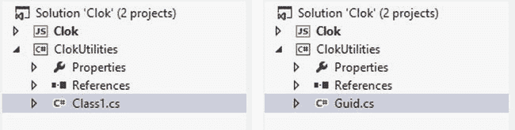
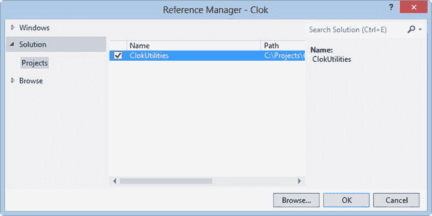
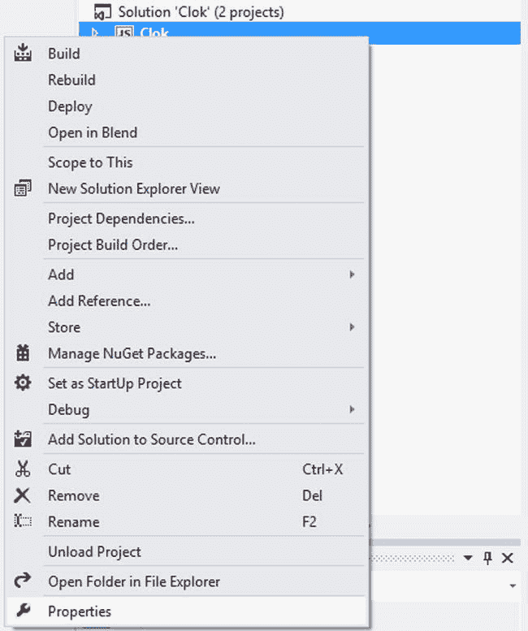

# 十八、外部库

正如你现在所知道的(我希望)，这本书的目的是介绍如何用 HTML 和 JavaScript 构建 Windows Store 应用。这本书的每一章都集中在教你一个概念，允许你使用现有的 HTML 和 JavaScript 知识来构建原生的 Windows 应用。然而，这一章将有一个稍微不同的焦点:使用外部库。

外部库在可重用的包中提供功能，无论它们是 JavaScript 库还是 WinRT 组件。如果您的背景是 web 开发，您可能会首先想到无处不在的 jQuery 库。如果您的背景是与。NET 框架，您可能会想到诸如 log4net 之类的东西，这是一个用于执行日志记录操作的流行库。

当我第一次写这本书的大纲时，我本来打算给这一章起名叫*第三方库*，但是我很快意识到这并不能提供一个完整的画面。虽然将他人编写的应用库合并到您的应用中是很常见的，但是构建您自己的可重用组件并将其添加到您的应用中也是很常见的。

在这一章中，我将介绍一些你在评估第三方 JavaScript 库时必须考虑的事情。我还将提供一个简单的例子，用 C#创建一个 WinRT 组件供 Clok 使用，同时允许您在其他 Windows 应用商店应用甚至 Windows Phone 应用中重用该功能。

JavaScript 库

JavaScript 库并不缺乏。如果你是一名 web 开发人员，你可以找到一个 JavaScript 库来完成你想要的几乎任何任务，从通用库，如 jQuery，到专用库，如我在第 13 章中讨论的 Flotr2 图形库。除了这些第三方库之外，您还可以构建自己的自定义 JavaScript 库，并在多个 Windows 应用商店应用以及您的网站上使用它。

许多 JavaScript 库可以在 Windows 应用商店应用中使用。如果你有一个喜欢的 JavaScript 库，你会很高兴知道它可能会工作。也就是说，有一些注意事项要记住。

安全问题

你可能认为让一个外部库访问用户的计算机是危险的，你是对的。当然，在编写软件时，无论是构建网站、桌面应用还是 Windows 应用商店应用，这都应该是一个问题。在决定将第三方库合并到您的应用中时应该小心，在 Windows 应用商店应用中可能比在网站上更小心，因为用户可能已经授予您的 Windows 应用商店应用对文件系统或相机的访问权限。

为了限制风险，应用中的页面在两种上下文之一中运行:本地上下文或 web 上下文。在 web 上下文中运行的页面，例如在`iframe`中托管的网页，对用户计算机的访问是有限的，并且不能访问 WinRT。应用中包含的页面，比如我们添加到 Clok 中的每个页面，都在本地上下文中运行。这些页面对用户的计算机有更大的访问权限。因此，在本地上下文中运行的任何脚本对它可以添加到页面的内容都有一些限制。

如果本地上下文中的一个脚本将 HTML 添加到页面中，该 HTML 将由`window.toStaticHTML`函数处理，以确定是否允许动态添加。如果它包含可能是恶意的代码，比如脚本或`iframe`，就会抛出异常。当使用某些属性或函数添加内容时，会发生这种情况。例如，试图设置`innerHTML`或`outerHTML`属性只有在内容被`toStaticHTML`成功处理后才会成功。MSDN ( `http://msdn.microsoft.com/en-us/library/windows/apps/hh465388.aspx`)上提供了不允许的 HTML 元素和属性的列表。

如果您要添加到应用中的 JavaScript 库使用了这些受限的属性或函数，您应该确保进行彻底的测试，以确保您的应用按预期工作。有关哪些属性和功能受到限制的更多信息，请访问 MSDN ( `http://msdn.microsoft.com/en-us/library/windows/apps/hh465380.aspx`)。

 **注意**请记住，您可能包含的 JavaScript 库本身并不一定是恶意的。这些限制是为了防止这些库动态地将恶意代码添加到通过`XmlHttpRequest`从互联网甚至从用户输入获得的页面中。

绕过安全限制

在一些合法的情况下，您可以拥有一些您信任并且知道是安全的内容，但是通过由`toStaticHTML`函数强制实现的安全性，这是不允许的。如果您正在编写自己的 JavaScript 库，或者可以修改第三方库，有一些方法可以绕过这些限制，尽管应该谨慎使用。这些限制是有原因的——保护你的用户。只有当您可以确定没有潜在的危险影响时，才应该使用这些方法，因为本节中描述的方法不受上一节中描述的过滤的影响。

在上一节中，我提到了`innerHTML`和`outerHTML`属性。虽然设置这些属性需要经过`toStaticHTML`的过滤，但是`WinJS.Utilities.setInnerHTMLUnsafe`和`WinJS.Utilities.setOuterHTMLUnsafe`功能则不需要。如果您确信内容是安全的，您可以使用这些方法来设置这些属性。关于`setInnerHTMLUnsafe`功能和`setOuterHTMLUnsafe`功能的更多信息可在 MSDN ( `http://msdn.microsoft.com/en-us/library/windows/apps/br211696.aspx`和`http://msdn.microsoft.com/en-us/library/windows/apps/br211698.aspx`)上获得。

此外，如果你必须调用一个通常被认为不安全的函数，比如动态添加对 DOM 的 JavaScript 引用，你可以把它包装在对`MSApp.execUnsafeLocalFunction` 的调用中(参见[清单 18-1](#list1) )。

[***清单 18-1。***](#_list1) 执行不安全的功能

```js
MSApp.execUnsafeLocalFunction(function() {
    // something typically considered unsafe
});
```

与用于网站的 HTML 和 JavaScript 相比，用于 Windows 应用商店的 HTML 和 JavaScript 的其他差异和相似之处可在 MSDN ( `http://msdn.microsoft.com/en-us/library/windows/apps/hh465380.aspx`)上找到。

同样，应该非常谨慎地使用这些方法，并且只有当您控制了将对页面进行的更改时才使用这些方法。

WinRT 组件

除了 JavaScript 库，您还可以将 Windows 运行时组件或 WinRT 组件整合到您的应用中。WinRT 组件 是一个可以从 Windows 应用商店应用中使用的 DLL。该组件可以用 C#、VB 或 C++编写，可以在用这些语言编写的 Windows 应用商店应用中使用，也可以在用 HTML 和 JavaScript 编写的 Windows 应用商店应用中使用。

许多第三方 WinRT 组件是可用的。例如，如果您想使用 SQLite 数据库而不是 IndexedDB，您可以在`www.sqlite.org/download.html`下载一个组件。想要在您的应用中添加电话呼叫支持吗？Twilio 有 WinRT 组件的源代码，可以在`www.github.com/twilio/twilio-csharp`获得。如果你的应用将利用 Windows Azure 移动服务，你可以从`www.windowsazure.com/en-us/develop/mobile`获得你需要的信息。

当然，许多其他 WinRT 组件也是可用的，但是在本章的剩余部分，我将介绍如何构建一个非常简单的 WinRT 组件，然后将它集成到 Clok 中。

建的原因 WinRT 组件 T3】

有几个原因可能导致您决定构建 WinRT 组件。可能您需要的一些功能在 JavaScript 语言本身中不可用，并且不是由 WinJS 或 WinRT 库提供的。构建 WinRT 组件的另一个常见原因是代码重用。您可以构建一个组件，并在多个 Windows 应用商店应用甚至 Windows Phone 应用中重用它。此外，您可能已经有了为另一个平台编写的大量代码，例如用 C++编写的 iOS 应用代码。

对于这一章，我创建了一个新的需求来添加一些 JavaScript 中没有的功能。在[第 11 章](11.html)中，当定义`Project`类时，我将`id`属性的默认值设置为基于当前时间的值。对于 Clok 来说，这可能没问题，但是，正如我当时提到的，不能保证它是唯一的。我本可以在第 14 章中引入 IndexedDB 时改变这种行为，因为 IndexedDB 允许你指定一个自动递增的标识符，但是我不想让`Project`和`TimeEntry`类依赖于数据源的选择。此外，虽然本书没有涉及，但我可能会在某个时候决定 Clok 需要跨多个设备共享其数据。虽然在同一毫秒内产生两个物体，从而产生相同的`id`的可能性非常小，但这并非不可能。除了将所有存储和`id`生成转移到某个中央服务器，要求 Clok 始终连接到互联网，使用全球唯一标识符 GUID，因为`id`是最佳选择。不幸的是，JavaScript 没有创建 GUIDs 的方法。幸运的是，C#做到了，而且非常容易。

 **注意**正如我提到的，WinRT 组件可以在 C#、VB 或 C++中创建。在这个例子中，我将使用 C#,但是如果您对其他语言更熟悉的话，也可以随意使用其中的一种。

创建 C# WinRT 组件

如果你做过的话。NET 开发，那么您可能熟悉如何在 Visual Studio 中创建新的类库项目。您会发现创建 WinRT 组件的过程几乎是相同的。以下步骤将引导您完成这一过程。

1.  Right-click the Clok solution in Visual Studio’s Solution Explorer. Select Add  New Project (see [Figure 18-1](#Fig1)).

    

    [图 18-1](#_Fig1) 。向 Clok Visual Studio 解决方案添加新项目

2.  In the left pane of the New Project dialog (see [Figure 18-2](#Fig2)), select Visual C#  Windows Store.

    

    [图 18-2](#_Fig2) 。Visual Studio 的 C# Windows 应用商店项目模板

3.  选择 Windows 运行时组件项目模板。
4.  给这个项目起个名字:ClokUtilities。
5.  单击“确定”创建您的项目。

Visual Studio 为你创建项目的时候，还会在项目中添加一个名为`Class1.cs` 的 C#类文件(见[图 18-3](#Fig3) )。在解决方案资源管理器中右键单击`Class1.cs`文件，并将其重命名为`Guid.cs`。



[图 18-3](#_Fig3) 。自动创建的类文件(左)，重命名为 Guid.cs(右))

这个类文件`Guid.cs`，是本书中我们将要修改的 ClokUtilities 项目中唯一的文件。但是，您可以使用这个项目添加任何其他您想用 C#构建的功能。组件不限于单个类。然而，我们现在的要求很简单。我将向您展示一些执行两个简单任务的 C#代码。首先，它提供了一种创建 GUID 并在 JavaScript 中使用它的方法。其次，它为我们提供了一种检查字符串以确定它是否是有效 GUID 的方法。用[清单 18-2](#list2) 中的代码替换`Guid.cs`的内容。

[***清单 18-2。***](#_list2)Guid 类

```js
public sealed class Guid
{
    public static string NewGuid()
    {
        return System.Guid.NewGuid().ToString();
    }

    public static bool IsGuid(string guidToTest)
    {
        if (string.IsNullOrEmpty(guidToTest))
        {
            return false;
        }

        System.Guid guid;
        return System.Guid.TryParse(guidToTest, out guid);
    }
}
```

现在，从 Visual Studio 的“生成”菜单中，选择“生成解决方案”选项。就这样。您刚刚创建了一个 WinRT 组件，尽管它非常简单。在进入下一节之前，我想指出一些关于这个类和 WinRT 组件的事情。首先，注意到`Guid`类是公共的和密封的。这是在 JavaScript 中使用 WinRT 类所必需的。

第二，虽然好用。在组件内部，公开的类型 必须是 WinRT 类型。这包括任何公共函数的返回类型、公共函数的任何参数的类型以及任何公共属性的类型。由于这个要求，我不能从`NewGuid`函数返回类型为`System.Guid`的值。相反，我必须首先将它转换成一个字符串，然后返回那个值。MSDN ( `http://msdn.microsoft.com/en-us/library/br205768(v=vs.85).aspx`)上有 WinRT 类型列表。

第三，当使用 JavaScript 中的 WinRT 类时，属性和函数的名称是大小写字母——也就是说，名称中的第一个字符是小写字母，后面的每个单词都以大写字母开头。另一方面，名称空间和类是 Pascal 大小写——每个单词，包括名称的第一个字符，都以大写字符开头。因此，当你在本章后面使用 JavaScript 中的`Guid`类时，你将调用`ClokUtilities.Guid.newGuid`，尽管我们在 C#中将其定义为`ClokUtilities.Guid.NewGuid`。

因为这不是一本关于使用 C#创建 WinRT 组件的书，所以我就不赘述了。然而，你可以在`http://msdn.microsoft.com/en-us/library/windows/apps/br230301.aspx`和`http://msdn.microsoft.com/en-us/library/windows/apps/hh779077.aspx`找到大量关于在 MSDN 上用 C#创建 WinRT 组件的附加信息。

更新时钟

在这一节中，我将带您完成利用您刚刚创建的`Guid`类所需的更改。我将介绍如何更新`Project`和`TimeEntry`类的`id`属性以使用`newGuid`函数，以及使用`isGuid`函数测试有效的 GUIDs。

引用 Clok 中的 ClokUtilities 项目

在使用新的 WinRT 组件之前，必须首先从 Clok 引用 ClokUtilities 项目。

在解决方案资源管理器中，展开 Clok 项目。然后右击引用并选择添加引用。 . .从上下文菜单中(参见[图 18-4](#Fig4) )。


[图 18-4](#_Fig4) 。打开参考管理器

在打开的参考管理器窗口中，从左窗格中选择解决方案项目，并勾选 ClokUtilities 旁边的框(参见[图 18-5](#Fig5) )。然后单击“确定”按钮添加引用并关闭“引用管理器”窗口。



[图 18-5](#_Fig5) 。在引用管理器中添加引用

添加了对组件的引用后，现在可以从 JavaScript 代码中访问上一节中创建的`Guid`类。要完成从使用数字到 GUIDs 的转换，需要对现有文件做一些小的改动。T3】

更改数据类别

所需的大部分更改是对`data`文件夹中的类进行的:`Project`、`TimeEntry,`和`Storage`类。让我们从`Project`类开始。在`data`文件夹中，打开`project.js`并用清单 18-3 中突出显示的代码更新`constructor`函数。

[***清单 18-3。***](#_list3) 变更项目施工方

```js
function constructor() {
    this.id = ClokUtilities.Guid.newGuid();
    this.name = "";
    // SNIPPED
},
```

这会将`id`属性的默认值从基于当前时间的数字更改为从 ClokUtilities WinRT 组件生成的 GUID 的字符串表示形式。在`project.js`中的`createFromDeserialized`功能也需要类似的改变。用[清单 18-4](#list4) 中突出显示的代码更新`createFromDeserialized`函数。

[***清单 18-4。***](#_list4) 改变项目工厂方法

```js
createFromDeserialized: function (value) {
    var project = new Clok.Data.Project();

    project.id = (ClokUtilities.Guid.isGuid(value.id) && value.id) || project.id;
    project.name = value.name;

    // SNIPPED

    return project;
},
```

这种变化利用了`isGuid`函数来确保`id`的值始终是一个 GUID。

对`TimeEntry`类的更改是类似的。[清单 18-5](#list5) 突出显示了`timeEntry.js`中的`constructor`函数需要做的两处修改，而[清单 18-6](#list6) 中突出显示的修改，看起来与[清单 18-4](#list4) 几乎相同，应该在`projectId`属性定义中进行。

[***清单 18-5。***](#_list5) 更改 TimeEntry 构造函数

```js
function constructor() {
    this.id = ClokUtilities.Guid.newGuid();
    this._projectId = "";
    this._dateWorked = (new Date()).removeTimePart();
    this.elapsedSeconds = 0;
    this.notes = "";
},
```

[***清单 18-6。***](#_list6) 改变 TimeEntry 类中的 projectId 属性

```js
projectId: {
    get: function () {
        return this._projectId;
    },
    set: function (value) {
        this._projectId = (ClokUtilities.Guid.isGuid(value) && value) || this._projectId;
    }
},
```

在`Storage`类中唯一需要改变的是`getSortedFilteredTimeEntriesAsync`函数，它用于确定在时间表页面上显示哪些时间条目。用清单 18-7 中[突出显示的代码行更新`storage.js`。](#list7)

[***清单 18-7。***](#_list7) 存储类中唯一的变化

```js
storage.timeEntries.getSortedFilteredTimeEntriesAsync = function (begin, end, projectId) {
    return new WinJS.Promise(function (complete, error) {
        setTimeout(function () {
            try {

                var filtered = this
                    .createFiltered(function (te) {
                        if (begin) {
                            if (te.dateWorked < begin) return false;
                        }

                        if (end) {
                            if (te.dateWorked >= end.addDays(1)) return false;
                        }

                        if (projectId && ClokUtilities.Guid.isGuid(projectId)) {
                            if (te.projectId !== projectId) return false;
                        }

                        if (!te.project || te.project.status !== data.ProjectStatuses.Active)
                            return false;

                        return true;
                    });

                var sorted = filtered.createSorted(storage.compareTimeEntries);

                complete(sorted);
            } catch (e) {
                error(e);
            }
        }.bind(this), 10);
    }.bind(this));
};
}
```

更改 Clok 仪表板屏幕

您必须对 Clok Dashboard 屏幕进行四项更改以支持 GUIDs。其中三个变化是完全一样的，所以我只展示一次。用[清单 18-8](#list8) 中突出显示的代码更新`home.js`中的`editProjectButton_click`函数。

[***清单 18-8。***](#_list8) 清除转换为数字

```js
editProjectButton_click: function (e) {
    var id = project.options[project.selectedIndex].value;
    nav.navigate("/pages/projects/detail.html", { id: id });
},
```

因为在 JavaScript 中我们将 GUIDs 视为字符串，所以这一更改是为了移除`id`属性到数字的转换。除了`editProjectButton_click`之外，在`save`功能和`saveDashboardStateToSettings`功能中也需要相同的变化，同样在`home.js`中也是如此。实际上，在`getIndexOfProjectId`函数中也需要同样的改变，除了验证一个值是一个 GUID，而不是验证它是一个数字。用清单 18-9 中突出显示的代码更新`home.js`中的`getIndexOfProjectId`函数。

[***清单 18-9。***](#_list9) 在下拉列表中查找指定项目

```js
getIndexOfProjectId: function (projectId) {
    var index = 0;

    for (var i = 0; i < project.options.length; i++) {
        if (ClokUtilities.Guid.isGuid(project.options[i].value)
                && project.options[i].value === projectId) {

            index = i;
            break;
        }
    }

    return index;
}
```

更改索引数据库辅助设置弹出按钮

除了上面描述的更改，您还必须对`idbhelper.html`中的`addTestData`函数进行更改。在您可以使用“IndexedDB 辅助程序设置”弹出按钮上的“添加测试数据”按钮之前，这是必需的。必要的更改只是用硬编码的 GUIDs 替换硬编码的数字，所以我在这里不举例说明这些更改。您可以在该书的产品页面(`www.apress.com/9781430257790`)的“源代码/下载”选项卡上找到本章的源代码示例中的更新文件。

调试 WinRT 组件

当调试使用您创建的 WinRT 组件的应用时，Visual Studio 不允许您同时调试 C#代码和 JavaScript 代码。不幸的是，你必须做出选择。幸运的是，在两者之间切换只需要点击几下。首先，在解决方案资源管理器中右击 Clok 项目并选择属性菜单项(参见[图 18-6](#Fig6) )。



[图 18-6](#_Fig6) 。在解决方案资源管理器中选择属性菜单项

这将打开 Clok 属性页窗口。在左窗格中选择调试，然后将调试器类型更改为您希望调试的类型(参见[图 18-7](#Fig7) )。选择“仅脚本”，用于调试 HTML/JavaScript 项目，如 Clok，或选择“仅托管”，用于调试用 C#编写的 WinRT 组件，如 ClokUtilities。


[图 18-7](#_Fig7) 。更改调试器类型

无论调试哪种类型的代码，都不能直接启动 WinRT 组件。因此，您必须确保 Clok 项目是在您开始调试时启动的项目。在开始调试之前，可以通过在解决方案资源管理器中右击 Clok 项目并选择“设为启动项目”来实现这一点。

升级期间保留用户数据

如果您现在运行 Clok，您将不会在 Clok 仪表板屏幕的下拉列表中看到任何项目。您也不会在时间表页面上看到任何以前的时间条目。这种变化风险很低，因为 Clok 还没有发布。然而，如果用户已经在使用 Clok，并且存储了项目和时间输入数据，那么如果这些数据全部丢失，他们会非常失望。

当然，如果您有用户，您应该关心在这样的更改期间保留用户的数据。当将来进行类似的更改时，您应该确保包含将应用中的所有现有数据修改为新格式的代码。有许多方法可以实现这一点，但是最合适的地方是在 IndexedDB 初始化代码中。在`storage.js`中，不是调用`indexedDB.open("Clok", 1)`，而是调用`indexedDB.open("Clok", 2)`，以表明您想要打开一个到数据库版本 2 的连接。因为第一次尝试打开数据库时，版本 2 并不存在，所以你必须更新`onupgradeneeded`函数来将数据从版本 1 迁移到版本 2(参见[清单 18-10](#list10) )。

[***清单 18-10。***](#_list10) 将数据迁移到新格式的不完整例子

```js
request.onupgradeneeded = function (e) {
    var upgradedDb = e.target.result;
    if (e.oldVersion < 1) {
        // Version 1: the initial version of the database
        upgradedDb.createObjectStore("projects", { keyPath: "id", autoIncrement: false });
        upgradedDb.createObjectStore("timeEntries", { keyPath: "id", autoIncrement: false });
    }
    if (e.oldVersion < 2) {
        // Version 2: data updated to use GUIDs for id values
        // TODO - modify all projects and time entries
    }
};
```

但是我们还没有任何用户，所以现在，只需运行 Clok 并使用 IndexedDB 助手来删除所有当前数据并添加新的测试数据。一旦你这样做了，你应该不会注意到与第 17 章结尾的版本有什么不同。所有的变化都在幕后。T3】

结论

外部库是重用功能的好方法，不管是别人创建的还是你自己创建的。大量的 JavaScript 库几乎可用于任何目的，或者您可以重用为您的网站创建的 JavaScript 库。如果您需要 JavaScript 中没有的功能，或者如果您有最初为另一个平台编写的现有代码，WinRT 组件是补充您的项目的好方法。虽然您在本章中创建的 WinRT 组件非常简单，但是可以应用相同的技术来构建更复杂的功能，这些功能可以在所有 Windows 应用商店应用以及 Windows Phone 应用中使用。