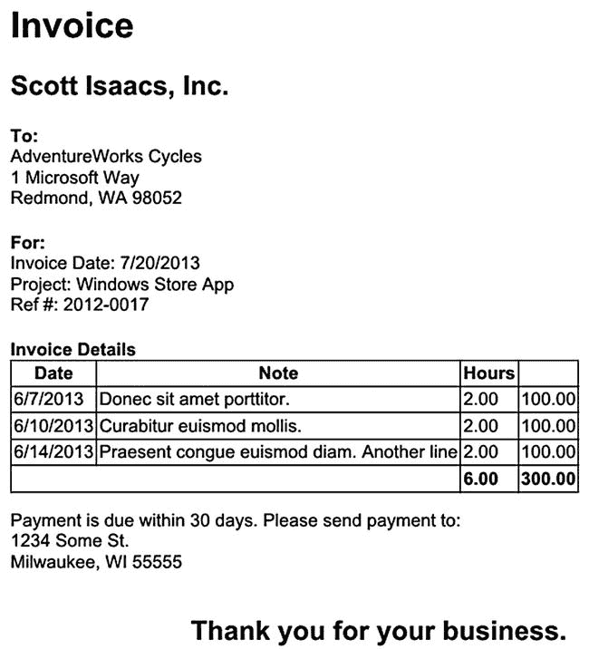

第二十章


印刷

我写软件已经很多年了。每当讨论添加打印功能的话题时，我都会有两种内部反应。如果我在做一个网络开发项目，我会想，“好吧，没什么大不了的。易于打印的网页通常很简单。”如果我正在开发一个 WinForms 或 WPF 桌面应用，我会想，“唉。”给桌面应用添加打印支持并不是什么难事，但通常比其他具有类似价值的功能更具挑战性。

幸运的是，如果您正在使用 HTML 和 JavaScript 构建 Windows Store 应用，那么向已安装的应用添加打印支持也很简单。正如您将在本章中看到的，打印可以使用您当前用于打印网页的相同技术来完成。但是，Windows 应用商店应用还提供了额外的打印功能，只需多做一点工作，就可以获得一些其他方式无法获得的额外优势。

这件事的美妙之处在于你可以选择。如果额外的好处(我将在接下来的几页中讨论)不值得在您的应用中额外增加 50 行左右的代码，那么您不必这样做。当然，我即将给你那 50 行代码，所以也许这是值得的。

网页开发-风格打印

如果你的背景是 web 开发，那么我将在本章中讨论的从 Windows 应用商店打印的第一个技术应该是熟悉的。在这一节中，我将演示使用 CSS 和`window.print`在 Clok 中打印项目细节屏幕，这是一个内置于 HTML 浏览器(如 Internet Explorer)中的功能，它与 Windows Store 应用共享相同的 HTML 呈现引擎。我将在本节中介绍以下内容:

*   将打印按钮添加到项目详细信息屏幕的应用栏
*   使用媒体查询来指定仅在打印时应用的 CSS 规则
*   实现将内容发送到打印机的代码

向项目详细信息屏幕添加打印按钮

我们要做的第一步是向项目详细信息屏幕的应用栏添加一个打印按钮。将[清单 20-1](#list1) 中的代码添加到`pages\projects\detail.html`中`AppBar`定义的末尾。

[***清单 20-1。***](#_list1) 向应用栏添加打印按钮

```js
<button
    data-win-control="WinJS.UI.AppBarCommand"
    data-win-options="{
        id:'printCommand',
        label:'Print',
        icon:'url(/img/Print-small-sprites.png)',
        section:'global',
        tooltip:'Print',
        disabled: true}">
</button>
```

 **注**本书附带的源代码包括一个完整的项目，其中包含本章使用的所有源代码和图像文件。您可以在本书的产品详细信息页面的源代码/下载选项卡上找到本章的代码示例(`www.apress.com/9781430257790`)。

与方向和时间表应用栏按钮类似，当应用处于快照视图时，这个打印按钮也应该隐藏。将清单 20-2 中突出显示的代码添加到媒体查询中的`detail.css`中，该查询指定了 Clok 何时处于快照视图中的规则。

[***清单 20-2。***](#_list2) 在抓拍视图中隐藏打印按钮

```js
#projectDetailAppBar #goToDirectionsCommand,
#projectDetailAppBar #goToTimeEntriesCommand,
#projectDetailAppBar #printCommand {
    display: none;
}
```

此外，只有当用户查看现有项目的详细信息时，才应启用此按钮。将[清单 20-3](#list3) 中的代码添加到`detail.js`中的`configureAppBar`函数中。

[***清单 20-3。***](#_list3) 启用打印按钮

```js
printCommand.winControl.disabled = false;
```

CSS 媒体查询用于打印

下一步是指定打印时将应用的替代 CSS 规则。与项目详细信息屏幕的当前布局相比(见[图 20-1](#Fig1) )，该屏幕的打印版本不需要后退按钮或如此宽的左边缘边距。此外，应用栏和当前时间应该隐藏。最后，Description 字段应该扩展以显示更长的文本，为了更好地衡量，我们将在打印时将其移动到页面的末尾。


[图 20-1](#_Fig1) 。项目详细信息屏幕

该表单使用 CSS 网格布局在屏幕上定位各种元素。在[第 11 章](11.html)中，添加了项目细节屏幕，我们在`detail.html`中用内联样式指定了`-ms-grid-row`和`-ms-grid-column` CSS 属性。因为您将在打印时使用 CSS 来重新定位描述字段，所以您必须对定义它的 HTML 做一点小小的更改。用清单 20-4 中突出显示的代码更新`detail.html`。

[***清单 20-4。***](#_list4) 更新描述表单字段

```js
<div class="formField" id="descriptionLabelAndField"
        style="-ms-grid-column: 1; -ms-grid-column-span: 3;" >
    <label for="projectDescription">Description</label><br />
    <textarea id="projectDescription" data-win-bind="value: description"></textarea>
</div>
```

CSS 属性`-ms-grid-row`已经被删除，现在必须在新规则中将其添加到`detail.css`中。将清单 20-5 中突出显示的代码添加到`detail.css`中。

[***清单 20-5。***](#_list5) 在屏幕上查看时，将描述字段定位在网格的第二行

```js
#descriptionLabelAndField {
    -ms-grid-row: 2;
}

#projectDescription {
    height: 60px;
    width: calc(90vw - 120px);
}
```

现在，您必须定义打印屏幕时将应用的 CSS 规则。如果您有许多规则，您可以将它们添加到第二个 CSS 文件中，并从`detail.html`中引用它们。在这种情况下，不需要太多规则，所以将来自[清单 20-6](#list6) 的 CSS 添加到`detail.css`的末尾。

[***清单 20-6。***](#_list6) CSS 媒体查询打印

```js
@media print {
    .fragment header[role=banner] {
        -ms-grid-columns: 0px 1fr;
    }

    .detail section[role=main] {
        margin-left: 0px;
        margin-right: 0px;
    }

    .detail header .win-backbutton {
        display: none;
    }

    #projectDetailForm .formField.required input,
    #projectDetailForm .formField.required textarea,
    #projectDetailForm .formField.required select {
        border: inherit;
        background-color: inherit;
    }

    #descriptionLabelAndField {
        -ms-grid-row: 7;
    }

    #projectDescription {
        height: 350px;
        width: 90vw;
    }

    #currentTime,
    #projectDetailAppBar {
        display: none;
    }
}
```

因为这些规则包含在打印介质查询(`@media print`)中，所以它们将仅在打印该屏幕时应用。这些规则实现了我在本节开始时描述的各种需求，比如删除 Back 按钮，将 Description 字段放在 CSS 网格布局的第七行，从而将它移动到页面的末尾。

发送到打印机

最后一步是将页面发送到打印机。将[清单 20-7](#list7) 中的代码添加到`detail.js`中。还要确保在`detail.js`的`ready`函数中连接这个`click`事件处理程序。

[***清单 20-7。***](#_list7) 打印屏幕

```js
printCommand_click: function (e) {
    window.print();
},
```

立即运行 Clok 并导航到现有项目的项目详细信息屏幕。如果点击打印按钮，打印窗格将会打开，允许您从安装在您计算机上的打印机列表中选择一台打印机(参见[图 20-2](#Fig2) )。


[图 20-2](#_Fig2) 。打印机选择

选择打印机后——本例中为 Microsoft XPS Document Writer 显示打印预览窗格(参见[图 20-3](#Fig3) )。此视图允许您查看将要打印内容的缩略图，以及所选打印机支持的一些打印选项。在[图 20-3](#Fig3) 中，唯一可见的选项是将方向从纵向改为横向。


[图 20-3](#_Fig3) 。打印预览

 **注意**微软 XPS Document Writer 是一款虚拟打印机，可以将任何可以打印的内容转换成 XPS 文件。如果我选择了物理打印机，我会看到其他选项，如更改打印份数或将彩色模式从彩色更改为黑白的选项。可以为打印预览窗格配置附加选项。有关这些其他选项的更多信息，请访问 MSDN ( `http://msdn.microsoft.com/en-us/library/windows/apps/hh761453.aspx`)。

在打印预览窗格中，单击打印按钮会将文档提交到选定的打印机。在[图 20-2](#Fig2) 和[图 20-3](#Fig3) 的例子中，我的电脑上会创建一个 XPS 文件。

WinRT 打印

在上一节中，我描述了用于打印网页的典型方法:定义打印友好的 CSS 规则并启动打印过程。当构建 web 应用时，你可以通过调用`window.print`来触发打印，类似于你在[清单 20-7](#list7) 中看到的。此外，网络浏览器本身提供打印功能来执行相同的任务。默认情况下，Windows Store 应用没有打印功能，但是 Windows 允许应用使用 Devices charm 进行打印(参见[图 20-4](#Fig4) )。


[图 20-4](#_Fig4) 。Windows 设备魅力

与 Windows Share charm 一样，默认情况下不会向其他设备发送任何内容(参见[图 20-5](#Fig5) )。然而，通过添加相对少量的代码，您可以使您的应用发送到其他设备，如打印机。


[图 20-5](#_Fig5) 。此应用目前无法发送到其他设备

创建打印机类

这种与 Windows 的集成是在应用中使用 WinRT 打印类的好处之一。您可以在应用中包含一个打印按钮来打印某些内容，但是在应用中添加必要的挂钩来支持 Windows 打印界面是一个简单的步骤，可以使您的应用看起来更加完美。

在应用中声明打印合同比添加搜索合同或共享目标合同更简单。你不必对`package.appxmanifest`做任何修改。在最简单的层面上，需要三个步骤。

1.  获取一个`Windows.Graphics.Printing.PrintManager`类的实例并处理它的`printtaskrequested`事件。
2.  创建一个`Windows.Graphics.Printing.PrintTask`类的实例。
3.  指定要打印的源文档。

虽然这三个步骤是打印的唯一要求，但在打印时，您还可以采取其他一些步骤来使您的应用更加健壮和完善。例如，应用中支持打印的每个屏幕都必须处理`PrintManager`对象的`printtaskrequested`事件。但是，在任何给定时间，只能有一个此事件的处理程序处于活动状态。因此，如果您有多个必须支持打印的屏幕，则必须注销与当前可见屏幕不关联的此事件的处理程序。

此外，`PrintTask`对象有一个`completed`事件，您可以选择处理它来通知您的应用打印过程是成功还是失败。使用 WinRT 打印类的另一个主要优点是，从 Windows 向应用反馈打印作业的状态。使用`window.print`时，您的应用不会收到任何关于打印作业状态的反馈。在许多情况下，这不是必需的，但是如果成功的打印对于应用的用户来说是至关重要的一步，那么使用 WinRT 打印类获得的附加信息将会很有帮助。

在这一节中，我将讨论我添加到 Clok 中的一个类，该类封装了这些细节，并使向应用中任意数量的屏幕添加打印支持变得更加容易。在 Visual Studio 项目的`js`文件夹中创建一个名为`printing.js`的新 JavaScript 文件。请务必在`default.html`中添加对该文件的引用。添加从[清单 20-8](#list8) 到`printing.js`的代码。

[***清单 20-8。***](#_list8) 添加打印实用程序类

```js
(function () {
    "use strict";

    var printingClass = WinJS.Class.define(
        function ctor() {
            this.printManager = Windows.Graphics.Printing.PrintManager.getForCurrentView();
            this.printManager_printtaskrequested_boundThis
                = this.printManager_printtaskrequested.bind(this);
            this._document = null;
            this._title = "Clok";
            this._completed = null;
        },
        {
            register: function (title, completed) {
                this._title = title || this._title;
                this._completed = completed || this._completed;
                this.printManager.addEventListener("printtaskrequested",
                    this.printManager_printtaskrequested_boundThis);
            },

            unregister: function () {
                this.printManager.removeEventListener("printtaskrequested",
                    this.printManager_printtaskrequested_boundThis);
            },

            setDocument: function (doc) {
                this._document = doc;
            },

            print: function () {
                Windows.Graphics.Printing.PrintManager.showPrintUIAsync();
            },

            printManager_printtaskrequested: function (e) {
                if (this._document) {
                    var printTask = e.request.createPrintTask(this._title, function (args) {
                        args.setSource(MSApp.getHtmlPrintDocumentSource(this._document));
                        printTask.oncompleted = this._completed;
                    }.bind(this));
                }
            },
        }
    );

    WinJS.Namespace.define("Clok", {
        Printer: printingClass,
    });
})();
```

在这段代码定义的`Clok.Printer`类的构造函数中，获得了当前视图的`PrintManager`。在`register`函数中，它的`printtaskrequested`事件被处理，在`unregister`函数中，该处理程序被移除。`print`功能只需打开 Windows 打印界面，点击设备图标即可打开。`printManager_printtaskrequested`处理函数创建所需的`PrintTask`对象，表明要打印的源是在`setDocument`函数中指定的值。如果在`register`函数中指定了`completed`事件处理程序，当`PrintTask`对象的`completed`事件被引发时，它将被调用。

发送到打印机

上一节中创建的`Printer`类封装了支持应用中最常见的打印场景所需的所有逻辑。在这一节中，我将向您展示如何在支持打印的屏幕上使用`Printer`类。我们将更新本章前面添加到项目细节屏幕的打印逻辑，以使用新的`Printer`类。

 **注意**本章前面添加到项目细节屏幕的打印友好的 CSS 仍然需要用于这个部分。使用 WinRT 打印类不会影响文档的打印呈现方式。它只影响如何将呈现的文档发送到打印机。

在本章的前面，我指定了只有在查看现有项目时才应该启用打印。使用`window.print`技术时，用户将永远无法使用设备的魅力启动打印过程。在这种情况下，只需禁用新项目的打印按钮就足够了。在更新 Clok 以使用 WinRT 打印类之后，用户将能够从 Devices charm 进行打印，因此禁用 Clok 中的打印按钮是不够的。相反，您必须指定应该打印的文档。将[清单 20-9 中的函数](#list9)添加到`detail.js`中。

[***清单 20-9。***](#_list9) 指定要打印的文件

```js
configurePrintDocument: function (existingId) {
    if (existingId) {
        this.printer.setDocument(document);
    } else {
        this.printer.setDocument(null);
    }
},
```

在这种情况下，当查看一个现有的项目时，当前的`document`对象——如果您是 web 开发人员，您所熟悉的同一个`document`对象——将被发送到打印机。如果用户没有查看现有项目，则指定`null`，禁用当前屏幕的打印。在这一章的后面，我将讨论你必须打印替代内容的一些选项，也就是说，你如何打印不仅样式不同于当前屏幕而且实际上完全不同的内容。

`configurePrintDocument`定义引用了`this.printer`，您还没有定义它。将清单 20-10 中[高亮显示的代码添加到`detail.js`中的`ready`函数和`unload`函数中。](#list10)

[***清单 20-10。***](#_list10) 注册和注销打印机类的实例

```js
ready: function (element, options) {
    this.printer = new Clok.Printer();
    this.printer.register("Project Detail", function (e) {
        if (e.completion === Windows.Graphics.Printing.PrintTaskCompletion.failed) {
            // printing failed
        }
    });

    this.setCurrentProject(options);

    this.configureAppBar(options && options.id);
    this.configurePrintDocument(options && options.id);
    var form = document.getElementById("projectDetailForm");
    WinJS.Binding.processAll(form, this.currProject);

    // SNIPPED
},

unload: function () {
    app.sessionState.currProject = null;
    app.removeEventListener("checkpoint", this.app_checkpoint_boundThis);
    this.printer.unregister();
},
```

在`ready`中，`this.printer`被定义，它的`register`函数被调用。在这个例子中，我已经为`completed`事件指定了一个处理程序，但是我把实现留给了您，作为一个练习。目前，我只添加了一个打印任务失败的条件。此外，您可以测试`e.completion`何时为`submitted`、`canceled`或`abandoned`。MSDN ( `http://msdn.microsoft.com/en-us/library/windows/apps/windows.graphics.printing.printtaskcompletion`)上有关于`Windows.Graphics.Printing.PrintTaskCompletion`枚举的文档。

除了为`completed`事件指定一个处理程序，我还为底层的`PrintTask`对象指定了一个标题。在许多情况下，用户永远不会看到这个标题，但是有两种情况下，一个友好的、相关的标题会对用户有所帮助。

*   They will see this title when they view the printer’s queued jobs (see [Figure 20-6](#Fig6)).

    

    [图 20-6](#_Fig6) 。打印机队列为古腾堡，我家的打印机

*   当使用 XPS Document Writer 或其他创建文件而不是将文档发送到物理打印机的虚拟打印机驱动程序时，它将是默认文件名。

还有一个步骤来改变项目细节屏幕，以使用 WinRT 打印类来代替`window.print`。在我们的新`Printer`类中，对`window.print`的调用必须替换为对`print`函数的调用。用清单 20-11 中的代码更新`detail.js`中的`printCommand_click`处理函数的定义。

[***清单 20-11。***](#_list11) 用新的打印机类打印

```js
printCommand_click: function (e) {
    this.printer.print();
},
```

对于最简单的打印任务，`window.print`可能就足够了。然而，正如您在本节中看到的，与 Windows 集成用于打印需要少量的开发投资。在许多应用中，在[清单 20-8](#list8) 中定义的`Clok.Printer`类只需稍加修改或不加修改就可以使用，所以我鼓励你在必须打印的应用中加入这个功能。

打印替代内容

前两节演示了打印当前屏幕的打印机友好版本。然而，有时你必须打印不同但相关的内容。有时，由 WinJS 控件生成的 HTML 不适合打印，即使它包含您希望打印的内容。在这一节中，我将展示两种可以用来解决打印替代内容问题的技术:

*   在`head`元素中指定打印的替代文档
*   从`iframe`打印文件

为了演示这些技术，我们将让用户能够打印驾驶路线和发票。在这两种情况下，我们都将使用在上一节中创建的`Clok.Printer`类。

打印驾驶路线

在规划本章内容时，我想到的第一个可能的打印示例是从方向屏幕打印驾驶方向。事实证明，从`ListView`开始打印并不总是能得到想要的结果。我没有尝试为方向屏幕上的`ListView`控件生成的复杂 HTML 制定易于打印的 CSS 规则，而是决定直接从 Bing 地图网站打印方向。

使用 HTML 页面的`head`中的`link`元素，您可以指定打印时应该使用的替代内容。[清单 20-12](#list12) 展示了一个在`link`元素中使用媒体查询来指定打印替代内容的例子。

[***清单 20-12。***](#_list12) 使用链接元素

```js
<link id="alternateContent" rel="alternate" media="print" href="printer.html" />
```

Bing 地图打印友好页面的链接是动态的。显示从密尔沃基到华盛顿州雷德蒙方向的页面非常适合打印

```js

http://www.bing.com/maps/print.aspx?cp=45.3601835,-105.018913&pt=pf&rtp=pos.43.041809_-87.906837_Milwaukee%2C%20WI∼pos.47.678558_-122.130989_Redmond%2C%20WA
```

因为它是动态的，所以您不能将`link`元素添加到`directions.html`中，如[清单 20-12](#list12) 所示。相反，您将构建这个`link`元素，并在`directions.js`中将它动态添加到页面中。在本节的其余部分，我将带您了解 Clok 中需要进行的更改，以允许用户从 Bing 地图网站打印行驶方向。

向方向屏幕添加打印按钮

我们要做的第一步是向方向屏幕添加一个带有打印按钮的应用栏。将清单 20-13 中的代码添加到`pages\projects\directions.html`中。

[***清单 20-13。***](#_list13) 向路线屏幕添加应用栏

```js
<div id="directionsAppBar"
    class="win-ui-dark"
    data-win-control="WinJS.UI.AppBar"
    data-win-options="{ sticky: true }">

    <button
        data-win-control="WinJS.UI.AppBarCommand"
        data-win-options="{
            id:'printCommand',
            label:'Print',
            icon:'url(/img/Print-small-sprites.png)',
            section:'global',
            tooltip:'Print',
            disabled: true}">
    </button>
</div>
```

虽然方向屏幕不会打印用户正在查看的文档，但是您仍然可以使用您在本章前面添加的`Clok.Printer`类来打印 Bing 地图中的行驶方向。在下一节中，我们将对`Printer`类做一些小的修改，以便更容易地支持为打印指定替代内容。同时，用清单 20-14 中[突出显示的代码更新`directions.js`。](#list14)

[***清单 20-14。***](#_list14) 注册、注销、处理 Printer 类实例的点击事件

```js
ready: function (element, options) {
    this.printer = new Clok.Printer();
    this.printer.register("Directions");

    printCommand.onclick = this.printCommand_click.bind(this);

    // SNIPPED
},

unload: function () {
    // SNIPPED

    this.printer.unregister();
},

printCommand_click: function (e) {
    this.printer.print();
},
```

 **注意**诚然，Clok 的方向屏幕不像 Bing 地图网站那样全面，没有地图或改变目的地的手段。为了给用户提供这些选项，你会发现，在本书附带的源代码中，我在应用栏中添加了一个额外的按钮，用于启动用户当前搜索的 Bing 地图网站。您可以在本书的产品详细信息页面的源代码/下载选项卡上找到本章的代码示例(`www.apress.com/9781430257790`)。

更改打印机类别

打印替代内容的任务可以在不对本章前面添加的`Printer`类做任何修改的情况下完成。必须添加到页面的`head`元素中的`link`元素可以很容易地在`directions.js`中创建。事实上，我最初就是这样开发这个功能的。然而，本着使`Printer`类更容易重用的精神，在这一节中，我将带您经历一些小的变化，以将该逻辑添加到`Printer`类中。用清单 20-15 中突出显示的代码更新`printing.js`。

[***清单 20-15。***](#_list15) 支持打印机类内的替换内容

```js
unregister: function () {
    this.printManager.removeEventListener("printtaskrequested",
        this.printManager_printtaskrequested_boundThis);
    this._removeAlternateContent();
},

setAlternateContent: function (href) {
    this._removeAlternateContent();

    var alternateContent = document.createElement("link");
    alternateContent.setAttribute("id", "alternateContent");
    alternateContent.setAttribute("rel", "alternate");
    alternateContent.setAttribute("href", href);
    alternateContent.setAttribute("media", "print");
    document.getElementsByTagName("head")[0].appendChild(alternateContent);

    this.setDocument(document);
},

_removeAlternateContent: function () {
    var alternateContent = document.getElementById("alternateContent");
    if (alternateContent) {
        document.getElementsByTagName("head")[0].removeChild(alternateContent);
    }
},
```

在`setAlternateContent`函数中创建了`link`元素。在创建并添加到`document`对象后，`setDocument`被当前的`document`对象调用，该对象包含必要的`link`元素作为参数。在定义`link`元素之前，当`Printer`类被取消注册时，调用`_removeAlternateContent`函数，该函数用于删除任何先前指定的替代内容。这种安全措施确保了永远不会指定一个以上的这样的元素。

更改 BingMaps 类

易于打印的 Bing 地图页面的 URI 包括经度和纬度坐标，如下所示:

```js

http://www.bing.com/maps/print.aspx?cp=45.3601835,-105.018913&pt=pf&rtp=pos.43.041809_-87.906837_Milwaukee%2C%20WI∼pos.47.678558_-122.130989_Redmond%2C%20WA
```

需要起点和终点的坐标，以及它们之间中心点的坐标。目前，`Clok.Data.BingMaps`类不包含任何坐标，但是因为 Bing Maps API 包含了所需的坐标，所以添加这些值会很容易。用清单 20-16 中突出显示的代码更新`data`文件夹中`bingMapsWrapper.js`的`getDirections`函数。

[***清单 20-16。***](#_list16) 包括起点和终点的坐标

```js
var directions = {
    copyright: resp.copyright,
    distanceUnit: resp.resourceSets[0].resources[0].distanceUnit,
    durationUnit: resp.resourceSets[0].resources[0].durationUnit,
    travelDistance: resp.resourceSets[0].resources[0].travelDistance,
    travelDuration: resp.resourceSets[0].resources[0].travelDuration,
    bbox: resp.resourceSets[0].resources[0].bbox ,
    startCoords: resp.resourceSets[0].resources[0].routeLegs[0].actualStart.coordinates,
    endCoords: resp.resourceSets[0].resources[0].routeLegs[0].actualEnd.coordinates
}
```

 **注意**如果你正在使用本书附带的源代码，在运行这些示例之前，你必须在`bingMapsWrapper.js`中添加你的 Bing 地图 API 密钥。

设置替代内容

使用户能够打印驾驶路线指引的最后一步是指定应该打印的替代内容。因为替代内容是由 URI 指定的，所以当用户请求方向时，必须构建该 URI。用[清单 20-17](#list17) 中突出显示的代码更新`directions.js`中的`getDirectionsButton_click`处理函数。

[***清单 20-17。***](#_list17) 将 URI 构造为打印友好页面，并将其设置为要打印的替代内容

```js
getDirectionsButton_click: function (e) {
    printCommand.winControl.disabled = true;
    this.printer.setDocument(null);

    if (fromLocation && fromLocation.value && this.dest) {

        maps.getDirections(fromLocation.value, this.dest)
            .then(function (directions) {

                if (directions
                        && directions.itineraryItems
                        && directions.itineraryItems.length > 0) {

                    WinJS.Binding.processAll(
                        document.getElementById("directionsContainer"), directions);

                    this.showDirectionResults(true);

                    directionsListView.winControl.itemDataSource
                        = directions.itineraryItems.dataSource;

                    directionsListView.winControl.forceLayout();

                    var printPage = " [http://www.bing.com/maps/print.aspx?cp](http://www.bing.com/maps/print.aspx?cp) ="
                        + ((directions.startCoords[0] + directions.endCoords[0]) / 2) + ","
                        + ((directions.startCoords[1] + directions.endCoords[1]) / 2)
                        + " & pt=pf & rtp=pos." + directions.startCoords[0] + "_"
                        + directions.startCoords[1] + "_" + fromLocation.value
                        + "∼pos." + directions.endCoords[0] + "_" + directions.endCoords[1]
                        + "_" + this.dest

                    this.printer.setAlternateContent(printPage);

                    printCommand.winControl.disabled = false;
                } else {
                    this.showDirectionResults(false);
                }
            }.bind(this), function (errorEvent) {
                this.showDirectionResults(false);
            }.bind(this));
    } else {
        this.showDirectionResults(false);
    }
},
```

该功能的第一个变化是当用户发起新的驾驶路线指引请求时禁用打印功能。调用`setDocument`函数是通过`null`调用的，因为该参数将禁用当前屏幕的打印，即使用户试图使用设备的魅力进行打印。如果用户请求的驾驶方向可用，则创建 URI 并传递给`setAlternateContent`函数。这将启用从设备的魅力打印，但不会自动启用打印应用栏按钮，所以我们明确启用它。

立即运行 Clok，导航到指定了客户地址的项目的方向屏幕，然后输入起始位置并单击获取方向。方向载入后，使用打印按钮或 Devices charm 打印行驶方向(参见[图 20-7](#Fig7) )。


[图 20-7](#_Fig7) 。便于打印的驾驶路线预览

 **注**如果您使用 Microsoft XPS Document Writer 测试您的打印功能，它会在您的 Documents 文件夹中保存一份 XPS 文档。

打印项目时间表的发票

在上一节中，您使用了一个`link`元素来指定打印的替代内容。该内容的 URI 可以引用应用中的一个文件或 Internet 上的一个页面，但无论是哪种情况，打印的内容都是通过请求指定 URI 的内容来检索的。在这一节中，我将讨论在一个`iframe`元素中托管内容，并指定`iframe`的内容应该用作打印的替代内容，我将向您展示如何使用这种技术从时间表屏幕构建一个可打印的发票。

添加发票选项设置弹出按钮

到目前为止，在 Clok 中，用户还没有办法指定他们自己公司的名称或他们的计费率——这是创建发票所需的两件事。在本节中，您将添加一个新的发票选项设置弹出按钮，以允许用户指定这两个值，并提供一个段落来描述他们的账单条款。这些值可以添加到您在第 15 章中创建的现有 Clok 选项设置弹出按钮的新部分，但是，在我看来，它们与该设置弹出按钮上可用的其他设置无关，所以我建议添加一个新的。因为这些步骤与构建“Clok 选项设置”弹出按钮的步骤几乎相同，所以我不会在这里讨论细节，但我会突出显示您需要采取的步骤。

1.  在 Visual Studio 项目的`settings`文件夹中创建一个名为`invoiceOptions.html`的新设置弹出按钮和一个名为`invoiceOptions.js`的对应 JavaScript 文件。
2.  允许用户为三个新的漫游设置提供值:
    *   a.`invoiceCompanyName`
    *   b.`invoiceDefaultRate`
    *   c.`invoicePaymentOptions`
3.  Specify default values for these roaming settings in the `intializeRoamingSettings` function in `default.js` (see [Listing 20-18](#list18)). These values will be used if the user does not specify values of his or her own.

    [***清单 20-18。***](#_list18) 为新的漫游设置提供默认值

    ```js
    roamingSettings.values["invoiceCompanyName"] =
        roamingSettings.values["invoiceCompanyName"] || "Your Company Name";

    roamingSettings.values["invoiceDefaultRate"] =
        roamingSettings.values["invoiceDefaultRate"] || 50.00;

    roamingSettings.values["invoicePaymentOptions"] =
        roamingSettings.values["invoicePaymentOptions"] || "Payment is due within 30 days.";
    ```

4.  在设置了`applicationcommands`变量的`default.js`中引用这个新的设置弹出按钮，使其包含在设置窗格中。

该过程与您在第 15 章中添加锁定选项设置弹出按钮时遵循的过程相同。本书随附的源代码中提供了发票选项设置弹出按钮的完整版本，以及本章中的所有其他源代码。

 **注意**这些变化将允许用户指定一个单一的计费率用于所有项目。您可能希望添加的一个有用功能是允许用户另外指定每个项目的计费率。如果指定了项目费率，则该费率将用于发票计算；否则，将使用默认汇率。

更新时间表屏幕

在 HTML ( `pages\timeSheets\list.html`)和 JavaScript 代码(`pages\timeSheets\list.js)`)中，需要对时间表屏幕进行一些更改。按照本章前面几节中使用的相同模式，在时间表屏幕的应用栏中添加一个打印发票按钮。不要忘记注册一个`Clok.Printer`的实例，并通过调用`Printer`实例的`print`函数来处理打印发票按钮的`click`事件。

在本节中，您将使用一个`iframe`元素的内容作为打印的替代内容。现在将那个`iframe`元素添加到`list.html`(参见清单 20-19[)。](#list19)

[***清单 20-19。***T5】将包含发票的 iframe 元素](#_list19)

```js
<iframe height="0" width="0" id="invoiceFrame" src="/templates/invoice.html"></iframe>
```

`iframe`可以放在屏幕的任何地方，因为它没有高度和宽度。但是，我建议将它放在`timeEntriesContainerdiv`之前，并将`height`和`width`属性临时设置为正数，这样您就可以在测试期间看到`iframe`的内容。`src`属性中引用的`invoice.html`文件尚不存在。我将在下一节介绍该文件的细节，但同时，在 Visual Studio 项目的根目录下创建一个名为`templates`的新文件夹，然后在该文件夹中添加一个名为`invoice.html`的占位符 HTML 文件(参见[图 20-8](#Fig8) )。


[图 20-8](#_Fig8) 。向 Visual Studio 项目添加发票模板

仅当使用应用栏中的过滤器按钮选择单个项目时，才能打印发票。当用户更新过滤器时，您必须添加代码来确定项目是否被选中。用[清单 20-20](#list20) 中突出显示的代码更新`list.js`中的`filter_changed`函数。

[***清单 20-20。***](#_list20) 过滤器更换时重新生成发票

```js
filter_changed: function (e) {
    this.updateResultsArea(searchInProgress);
    this.printer.setDocument(null);
    printInvoiceCommand.winControl.disabled = true;

    storage.timeEntries.getSortedFilteredTimeEntriesAsync(
            this.filter.startDate,
            this.filter.endDate,
            this.filter.projectId)
        .then(
            function complete(results) {
                if (results.length <= 0) {
                    timeEntryAppBar.winControl.show();
                    this.updateResultsArea(noMatchesFound);
                } else {
                    if (ClokUtilities.Guid.isGuid(this.filter.projectId)) {
                        this.printer.setDocument(invoiceFrame.document);
                        printInvoiceCommand.winControl.disabled = false;
                    }
                    this.updateInvoiceIframe(results);
                    this.updateResultsArea(timeEntriesListView);
                }
                this.showAddForm();
                this.filteredResults = results;
                timeEntriesListView.winControl.itemDataSource = results.dataSource;
            }.bind(this),
            function error(results) {
                this.updateResultsArea(searchError);
            }.bind(this)
        );
},
```

当一个项目被选中，并且`this.filter.projectId`包含一个 GUID 时，调用`setDocument`函数，将`iframe`的`document`对象作为参数。接下来您将添加的`updateInvoiceIframe`函数用于将时间表数据从时间表屏幕传递到`iframe`中的发票。将清单 20-21 中的代码从[添加到`list.js`。](#list21)

[***清单 20-21。***](#_list21) 发送时间单数据到发票

```js
updateInvoiceIframe: function (results) {
    var invoiceLines = results.map(function (item) {
        return {
            elapsedSeconds: item.elapsedSeconds,
            dateWorked: item.dateWorked,
            notes: item.notes
        };
    });

    var invoiceProject = results.getAt(0).project;

    var invoiceData = {
        project: invoiceProject,
        lines: invoiceLines
    }
    invoiceFrame.postMessage(invoiceData, "ms-appx://" + document.location.host);
},
```

与`iframe`的交流是使用`postMessage`完成的，与在[第 13 章](13.html)中完成的与网络工作者的交流方式非常相似。创建一个`invoiceData`对象，它包含发票上要包含的每个时间条目的详细信息，以及对正在开票的项目的引用。出于安全原因，对`postMessage`的调用包括当前域作为第二个参数。在`invoice.html`，我们将验证发布的消息来自同一个域。

生成发票

在本节中，我将展示`invoice.html`的内容，当用户从时间表屏幕打印时，将打印该文件。`iframe`可以包含您希望应用包含的任何内容。对于 Clok，我将`invoice.html`构建为一个单独的文件，在文件中包含必要的 CSS 和 JavaScript，而不是像我们在应用的其余部分所做的那样引用外部特定于页面的 CSS 和 JavaScript 文件。在上一节中，您创建了一个占位符`invoice.html`文件。用[清单 20-22](#list22) 中的代码更新文件。如果您不想键入所有代码，您可以在本书附带的源代码中找到该文件的完整版本。

[***清单 20-22。***](#_list22)invoice.html 发票模板的内容

```js
<!DOCTYPE html>
<html>
<head>
    <title></title>
    <style type="text/css">
        body {
            font-family: sans-serif;
        }

        h4.sectionHead {
            margin-bottom: 0px;
        }

        .invoiceLines {
            border-collapse: collapse;
            border-spacing: 0px;
        }

            .invoiceLines th,
            .invoiceLines td {
                border: 1px solid black;
                margin: 0px;
                padding: 2px;
            }

            .invoiceLines .totals {
                font-weight: bold;
            }

            .invoiceLines #totalDesc {
                background: black;
            }
    </style>

    <script src="//Microsoft.WinJS.1.0/js/base.js"></script>
    <script src="//Microsoft.WinJS.1.0/js/ui.js"></script>

    <script src="/data/timeEntry.js"></script>
    <script src="/data/project.js"></script>

    <script>
        var appData = Windows.Storage.ApplicationData.current;
        var roamingSettings = appData.roamingSettings;

        var formatDate = function (dt) {
            var formatting = Windows.Globalization.DateTimeFormatting;
            var formatter = new formatting.DateTimeFormatter("shortdate");
            return formatter.format(dt);
        }

        window.onmessage = function (message) {
            if (message.origin !== "ms-appx://" + document.location.host) {
                return;
            }

            WinJS.UI.processAll().then(function () {
                var compName = roamingSettings.values["invoiceCompanyName"];
                var rate = Number(roamingSettings.values["invoiceDefaultRate"]);
                var pmtOptions = roamingSettings.values["invoicePaymentOptions"];
                if (pmtOptions.indexOf("<br") < 0) {
                    pmtOptions = pmtOptions.replace(/\r\n/g, "<br />").replace(/\n/g, "<br />");
                }

                var invoiceLines = document.getElementById("invoiceLines");
                var template = document.getElementById("invoiceLineTemplate").winControl;

                var sumHour = 0;
                var sumCost = 0;

                invoiceLines.innerText = "";
                message.data.lines.forEach(function (item) {
                    var hrs = item.elapsedSeconds / 3600;

                    item.dateWorked = formatDate(item.dateWorked);
                    item.hours = hrs.toFixed(2);
                    item.lineCost = (rate * hrs).toFixed(2);

                    sumHour += hrs;
                    sumCost += rate * hrs;

                    template.render(item, invoiceLines);
                });

                invoiceDate.innerText = formatDate(new Date());
                projectName.innerText = message.data.project.name;
                projectNumber.innerText = message.data.project.projectNumber;

                companyName.innerText = compName;
                clientName.innerHTML = message.data.project.clientName;
                contactName.innerHTML = message.data.project.contactName;
                address1.innerHTML = message.data.project.address1;
                address2.innerHTML = message.data.project.address2;
                city.innerHTML = message.data.project.city;
                region.innerHTML = message.data.project.region;
                postalCode.innerHTML = message.data.project.postalCode;

                totalHours.innerText = sumHour.toFixed(2);
                totalCost.innerText = sumCost.toFixed(2);

                paymentOptions.innerHTML = pmtOptions;
            });
        }

    </script>
</head>
<body>
    <h1>Invoice</h1>
    <h2 id="companyName"></h2>

    <h4 class="sectionHead">To:</h4>
    <div>
        <div id="clientName"></div>
        <div id="contactName"></div>
        <div id="address1"></div>
        <div id="address2"></div>
        <div>
            <span id="city"></span>,
            <span id="region"></span>
            <span id="postalCode"></span>
        </div>
    </div>

    <h4 class="sectionHead">For:</h4>
    <div>
        <div>
            Invoice Date: <span id="invoiceDate"></span>
            <br />
            Project:  <span id="projectName"></span>
            <br />
            Ref #:  <span id="projectNumber"></span>
            <br />
        </div>
    </div>

    <h4 class="sectionHead">Invoice Details</h4>
    <table style="display: none;">
        <tbody data-win-control="WinJS.Binding.Template" id="invoiceLineTemplate">
            <tr>
                <td data-win-bind="textContent: dateWorked"></td>
                <td data-win-bind="textContent: notes"></td>
                <td data-win-bind="textContent: hours"></td>
                <td data-win-bind="textContent: lineCost"></td>
            </tr>
        </tbody>
    </table>

    <table class="invoiceLines">
        <thead>
            <tr>
                <th>Date</th>
                <th>Note</th>
                <th>Hours</th>
                <th></th>
            </tr>
        </thead>
        <tbody id="invoiceLines"></tbody>
        <tfoot>
            <tr class="totals">
                <td id="totalDesc" colspan="2"></td>
                <td id="totalHours"></td>
                <td id="totalCost"></td>
            </tr>
        </tfoot>
    </table>

    <p id="paymentOptions"></p>
</body>
</html>
```

`invoice.html`大部分都是标准的、无趣的 HTML、CSS、JavaScript。然而，我在清单 20-22 中强调了几件事，我想指出来。

*   因为`invoice.html`加载了`ms-appx`协议，它可以完全访问 WinRT 和 WinJS 库，以及我们添加到 Clok 中的任何类。你可以在上面看到，我已经添加了对 WinJS JavaScript 文件以及 Clok 的`Project`和`TimeEntry`类定义的脚本引用。
*   作为引用 WinJS 库的结果，我能够利用`WinJS.Binding.Template`类创建一个名为`invoiceLineTemplate`的模板，该模板定义了发票中的行项目将如何显示。
*   在`onmessage`处理函数中，通过[清单 20-21](#list21) 中的`postMessage`发送的`invoiceData`可作为`message.data`使用。基于该对象的属性填充单个占位符，发票的行项目由`invoiceLineTemplate`模板呈现。
*   您在本章前面创建的三个漫游设置的值用于显示用户的公司名称和帐单条款，以及计算应付金额。

立即运行 Clok 并导航至时间表屏幕。在过滤了单个项目的列表后，您可以使用应用栏中的打印发票按钮或使用 Devices charm 来打印发票(参见[图 20-9](#Fig9) )。



[图 20-9](#_Fig9) 。从时间表屏幕打印的发票样本

高级打印主题

在本章中，我只讲述了从 Windows 应用商店打印的基础知识。当然，打印遵循 80/20 规则，即你需要完成的 80%的工作是用 20%的可能特性完成的。甚至可能是 90/10 法则。然而，`Windows.Graphics.Printing`名称空间中还有许多其他的类，您可能会发现它们对一些更特殊的打印需求很有用。例如，有一些类可以简化任务，比如交流打印任务的进度，或者允许用户在打印预览窗格中指定更多或更少的选项，比如打印质量或纸张大小。

MSDN ( `http://msdn.microsoft.com/en-us/library/windows/apps/windows.graphics.printing.aspx`)上有关于`Windows.Graphics.Printing`名称空间的更多信息。

结论

从 Windows 应用商店应用打印的基础与从网站打印非常相似。在这一章中，我介绍了一些定义打印内容的不同方法，以及一些启动打印过程的不同方法。可以通过对屏幕内容应用仅打印 CSS 规则、链接到应该打印而不是当前屏幕的替代内容的 URI，或者打印`iframe`元素的内容来指定内容。您可以使用原生的`window.print`函数来启动打印过程，但是只需少量的工作，您就可以利用 WinRT 打印类，为您的用户提供更加集成的体验。只需稍加修改或不加修改，本章创建的`Clok.Printer`类应该能够处理您可能面临的大量打印任务。