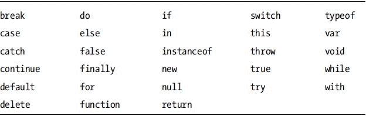

第二章


JavaScript 基础知识

正如我们在[第一章](1.html)中所说，enchant.js 是用 JavaScript 编程语言编写的。当您在 enchant.js 中编写游戏时，您将使用 JavaScript 语言编写命令和其他代码，因此在深入研究 enchant.js 游戏之前，我们需要研究简单的 JavaScript。如果你已经熟悉 JavaScript，可以跳过这一章。

JavaScript 是用于网页脚本的主要编程语言。与大多数用于创建必须安装在计算机上才能运行的软件应用程序的编程语言不同，JavaScript 代码在客户端 web 浏览器上运行。鉴于 enchant.js 和用 enchant.js 编写的游戏都是用 JavaScript 创建的，所以理解 JavaScript 的基本概念是必不可少的。如果您是编程新手，学习这些基础知识将使您受益匪浅，因为它们恰好也是面向对象语言的构建块，并且是学习其他流行编程语言(如 Java 和 C++)的有用起点。

一种编程语言的语法，或者更确切地说，这种语言的元素编写的特定方式，被称为语法。在本章中，你将通过在 code.9leap.net 网站上编写代码来学习 JavaScript 的构建模块、语法和功能。我们将带您一步一步地完成这一过程，并通过一系列简单的代码项目来解释每一个构建模块。

汇总列表

在本章中，我们将向您展示如何执行以下操作:

1.  声明一个变量
2.  给变量赋值
3.  添加变量
4.  检查变量的值
5.  使用变量本身操作变量
6.  使用增量操作变量
7.  比较变量
8.  看看两个变量有多相似
9.  操纵比较
10.  用 If 语句实现逻辑
11.  创建一个对象
12.  更智能地使用 While 和 For 循环语句
13.  用 Break 中断循环
14.  用 Continue 跳过循环迭代
15.  生成随机数
16.  用开关定义场景
17.  将编号数据存储在一个数组中
18.  在关联数组中存储无编号的数据
19.  使用功能节省时间
20.  查看变量的位置
21.  用原型制作物体蓝图

声明一个变量

*变量*是值的容器，在大多数情况下可以随时用新值更新，因此得名。它们的值“不同”，所以它们是“可变的”使用变量优于显式值是因为变量的动态特性。如果在计算中包含一个变量，然后又更改了该变量的值，则下次执行相同的计算时，将使用新值。

要使用一个变量，首先必须用`var`语句声明它，它告诉应用程序在内存中为该变量保留一个位置。在 JavaScript 的任何一条语句的末尾，都必须包含一个分号(；).

要声明三个名为`num0`、`num1`和`sum`的变量，请执行以下操作:

1.  如果您还没有帐户，请转到`http://code.9leap.net`并登录或注册。
2.  转到`http://code.9leap.net/codes/show/26854`,点击 fork 按钮，将空白的 JavaScript 模板分叉。
3.  通过直接修改屏幕左上角 code.9leap 徽标右侧的字段来更改项目的标题。选择适当的东西，比如“声明一个变量”(对于所有将来派生此代码的示例，请以这种方式更改标题，以跟踪您的单个项目。)
4.  Type in the code shown in [Listing 2-1](#list1).

    [***清单 2-1。***](#_list1) 声明一个变量

    ```js
    var num0;
    var num1;
    var sum;
    ```

命名变量

您可以在变量名中使用以下字符:

*   字母(A-Z，A-Z)
*   数字(但不是变量名的第一个字符)
*   下划线(_)

[表 2-1](#Tab1) 显示了 JavaScript 中不能用作变量名的保留字。

[表 2-1。](#_Tab1)JavaScript 中的保留字



[表 2-2](#Tab2) 显示了当前未被使用，但将来被使用的概率很高的单词。我们建议在命名变量时避免使用它们。

[表 2-2。](#_Tab2)保留文字供将来使用


您不能使用 JavaScript 中预定义的任何其他单词，如`String`、`true`等。完整名单请见`www.javascripter.net/faq/reserved.htm`。

给变量赋值

一旦变量被声明，就可以给它赋值。要给`num0`和`num1`赋值，请执行以下操作:

1.  Below the [Listing 2-1](#list1) code you entered, type in the code shown in [Listing 2-2](#list2).

    [***清单 2-2。***](#_list2) 给变量赋值

    ```js
    num0 = 100;
    num1 = 200;
    ```

 **注意**变量可以通过使用

```js
var num3 = 400;
```

添加变量

变量可以用来代替数字进行运算。如果使用变量执行算术运算，变量的当前值将用于计算。要将`num0`和`num1`相加并将结果分配给`sum`，请执行以下操作:

1.  Below the [Listing 2-2](#list2) code you entered, type in the code shown in [Listing 2-3](#list3).

    [***清单 2-3。***](#_list3) 添加变量

    ```js
    sum = num0 + num1;
    ```

基本算术运算符

你不仅仅局限于添加变量或数字。所有基本的算术运算都可以执行。[表 2-3](#Tab3) 显示了基本操作符。

[表 2-3](#_Tab3) 。基本算术运算符

| 操作员 | 描述 | 例子 |
| --- | --- | --- |
| + | 添加 | a + b(将 a 和 b 相加) |
| – | 减法 | a–b(从 a 中减去 b) |
| * | 增加 | a * b(a 和 b 相乘) |
| / | 分开 | a/b(a 除以 b) |
| % | 剩余物 | a % b(a 除以 b 的余数。换句话说，7 % 4 = 3，因为 4 一次进入 7，余数为 3。) |

运算符具有优先级:乘法和除法首先发生，然后才是加法和减法。要改变优先顺序，如果你想在计算其他部分之前计算特定部分，这可能是有用的，使用括号，如清单 2-4 所示。您不需要复制这段代码。仅供参考。

[***清单 2-4。***](#_list4) 用括号改变操作顺序

```js
var result0 = 1 + 2 * 3;        //result0 will be 7
var result1 = (1 + 2) * 3;      //result1 will be 9
```

检查变量的值

要查看`sum`的值，请执行以下操作:

1.  Below your current code, type in the code shown in [Listing 2-5](#list5). The `document.write()` command tells the program to display whatever is within the parentheses on-screen, and uses the plus sign to combine, or concatenate, values together to display a final result. Commands like this are called *methods*, and can be identified by the parentheses at the end of the method name. The period before `write` indicates that it is a method of the `document` object, a predefined set of code allowing JavaScript to have access to the browser window. We’ll cover objects in more detail later.

    [***清单 2-5。***](#_list5) 在屏幕上显示总和的值

    ```js
    document.write("Total amount = " + sum);
    ```

2.  单击运行按钮。(我们在下文中将其简称为 Run。)预览区应该显示“总金额= 300”。

如果你想对照一个完成的例子检查你的代码，你可以在`http://code.9leap.net/codes/show/19823`找到一个。

数据类型

为什么我们必须在[清单 2-5](#list5) 中的`document.write()`内放置的内容加上引号？这是因为`document.write()`只接受字符串值。字符串用于存储文本字符串，是 JavaScript 中五种基本数据类型之一。其中三种数据类型——数字、字符串和布尔——用于存储数据，而另外两种用于表示变量的当前状态。[表 2-4](#Tab4) 显示了五种数据类型。

[表 2-4。](#_Tab4)基本数据类型

| 类型 | 分配值 | 用法示例 |
| --- | --- | --- |
| `Number` | 基数为 10 | var num = 10 |
|  | 基数为 8 (0 附加到值的开头) | var num = 011： |
|  | 基数为 16 (0x 附加到值的开头) | var num = 0x 9a； |
|  | 浮点，基数为 10(使用句点[。]) | 凡 fnum = 3.1415 |
|  | 浮点，指数(使用句点[。]和 E) | var fnum =-3.1 和 12； |
| `Boolean` | `true`或`false` | 其中标志= true |
| `String` | 用双引号或单引号括起来的字符串 | var str = "字符串"； |
|  |  | var str = '字符串'； |
| `null` | 已知该对象存在，但没有值 | var obj = null; |
| `undefined` | 对象不存在、不返回值或尚未初始化 |

除了基本的数据类型，JavaScript 中还有复杂的数据类型:

*   *对象*:对象是多种基本数据类型和/或其他对象的集合，通常由开发人员预定义或定义。如果你要创建一个保龄球游戏，你很可能有多个对象代表保龄球瓶，另一个对象代表保龄球。
*   *数组*:数组是一组索引有序的数据。在保龄球游戏示例中，您的保龄球瓶对象可以全部存储在一个数组中。添加到数组中的每一项都分配有一个数字，从 0 开始，每添加一项就增加 1。
*   关联数组:关联数组是一组没有特定顺序的命名数据。与常规数组不同，关联数组可以将一个项与任何其他值或项配对在一起。想象一下，我们的保龄球游戏是 3d 游戏，保龄球瓶上方悬挂着几盏灯。关联阵列可用于将每个保龄球瓶与特定的灯连接在一起。
*   *函数*:函数执行一个定义的计算或一组代码。在保龄球游戏的例子中，如果保龄球与瓶接触，可以使用一个函数来使保龄球瓶翻倒。

我们将在后面更详细地介绍复杂的数据类型。

 **注意**在 C/C++和 Java 这样的编程语言中，变量有静态数据类型(比如`integer`或者`string`)，你不能把一种数据类型的值赋给另一种数据类型的变量。换句话说，如果你有一个`integer`变量，你不能给这个变量赋值一个字符串。

在 JavaScript 中，情况并非如此。任何数据类型的值都可以赋给一个变量，完全不同数据类型的变量可以在以后重新分配给同一个变量。名为`foo`的变量可以用`foo = 10;`赋一个数值，然后下一行可以声明`foo = "bar";`为同一个变量赋一个字符串值。这种灵活性是 JavaScript 的一个主要优点，但缺点是有时在执行计算时必须格外小心。稍后我们会看到这样的例子。

使用变量本身操作变量

许多游戏都包含一个分数，当玩家获得分数时，该分数会不断更新。要更新这个分数，包含它的变量必须增加。请执行以下操作来了解如何操作:

1.  清除您编写的代码，直到[清单 2-5](#list5) 。
2.  Type in the code shown in [Listing 2-6](#list6).

    [***清单 2-6。***](#_list6) 通过引用自身操纵变量

    ```js
    var score = 10;
    score = score + 20;
    document.write(score);
    ```

3.  单击运行。预览屏幕应该显示“30”
4.  将`score = score + 20;`替换为`score += 20;`
5.  再次单击运行。结果是一样的。步骤 4 使用自引用操作的缩写形式，称为复合赋值操作符。

复合赋值运算符

复合赋值运算符是同时对一个变量赋值和另一个运算的运算符。表 2-5 显示了这些有用的操作符。

[表 2-5。](#_Tab5)复合赋值运算符

| 操作员 | 描述 | 例子 |
| --- | --- | --- |
| `+=` | 添加 | a += 10(相当于 a = a + 10) |
| `–=` | 减法 | a –= 10(相当于 a = a–10) |
| `*=` | 增加 | a *= 10(相当于 a = a * 10) |
| `/=` | 分开 | a /= 10(相当于 a = a / 10) |
| `%=` | 剩余物 | a %= 10(相当于 a = a % 10) |

使用增量操作变量

当变量需要增加值 1 时，可以使用更简短的操作符。执行以下操作来查看它的运行情况:

1.  清除您当前的代码。
2.  Type in the code in [Listing 2-7](#list7).

    [***清单 2-7。***](#_list7) 声明并递增变量

    ```js
    var num = 1;
    num++;
    document.write(num);
    ```

3.  单击运行。预览屏幕应该显示“2”，表明`++`将 num 的值增加 1。
4.  清除您当前的代码。
5.  Type in [Listing 2-8](#list8).

    [***清单 2-8。***](#_list8) 在一个语句内递增一个变量

    ```js
    var num = 1;
    document.write(num++);
    num = 1;
    document.write(++num);
    ```

6.  单击运行。屏幕首先显示“1”，然后显示“2”在类似于`document.write()`的语句中，如果增量运算符(`++`)在变量之后，那么`document.write()`语句将首先执行，如果运算符出现在变量之前，那么运算符将在`document.write()`之前执行。

 **注意**增量运算符的反义词是减量运算符(`--`)。减量运算符的工作方式与增量运算符完全相同，只是它从附加的变量中减去 1。

比较变量

JavaScript 包含名为*关系运算符*的命令，比较两个值并根据结果返回布尔值`true`或`false`。执行以下操作来查看它们的运行情况:

1.  清除您当前的代码。
2.  Type in the code in [Listing 2-9](#list9).

    [***清单 2-9。***](#_list9) 比较数值

    ```js
    var num0 = 4;
    var num1 = 7;
    document.write(num0 >= num1);
    document.write(num0 < num1);
    document.write(num0 === num1);
    ```

3.  单击运行。屏幕先显示`false`，因为 4 不大于等于 7；显示`true`，因为 4 小于 7；又显示了`false`，因为 4 不等于 7。

表 2-6 显示了可用的关系运算符。

[表 2-6](#_Tab6) 。关系运算符

| 操作员 | 描述 | 例子 |
| --- | --- | --- |
| `==` | 相等的 | a == b |
| `===` | 严格等价 | a === b |
| `!=` | 不等价 | 答！= b |
| `!==` | 严格不等价 | 答！== b |
| `>` | 大于 | a > b |
| `>=` | 大于或等于 | a >= b |
| `<` | 不到 | a < b |
| `<=` | 小于或等于 | a <= b |

看看两个值有多相似

通过执行以下操作，查看等价(`==`)和严格等价(`===`)关系运算符有何不同:

*   1.清除您当前的代码。
*   2.  Type in the code in [Listing 2-10](#list10).

    [***清单 2-10。***](#_list10) 不同等价运算符

    ```js
    var num0 = 4;
    var num1 = "4";
    document.write(num0 == num1);
    document.write(num0 === num1);
    ```

*   3.单击运行。屏幕首先显示 true，因为如果被比较的值之一是字符串，则符号`==`会暂时将所有值转换为字符串。这叫做*型转换*。然后屏幕显示 false，因为`===`符号不执行类型转换。要评估为相同，比较值必须是相同的数据类型。

 **注意**等价运算符的反义词是不等价运算符(`!=`和`!==`)，它们执行几乎完全相同的运算。然而，`!=`操作符执行类型转换，而`!==`操作符不执行。

操纵比较

有时您会想要操纵比较如何解析(`true` / `false`)。要查看如何操作这些比较，请执行以下操作:

*   4.清除您的代码。
*   5.  Type in the code in [Listing 2-11](#list11).

    [***清单 2-11。***](#_list11) 操纵比较

    ```js
    document.write(!(4 > 3));
    document.write((4 < 7) && (5 < 13));
    document.write((4 > 5) || (4 < 5));
    ```

*   6.单击运行。

屏幕会先说`false`是因为语句(`4 > 3`)解析为`true`，`!`逻辑运算符反转其后的布尔语句(`true` / `false`)，使之成为`false`。然后屏幕列出`true`，因为(`4 < 7`)和(`5 < 13`)都评估为`true`。只有当它周围的两个语句都是`true`时，`&&` ( `and`)逻辑运算符才返回 true。最后屏幕再次显示`true`，因为在(`4 > 5`)和(`4 < 5`)中，有一个是`true`。如果至少有一个语句是`true`，则`||` ( `or`)运算符解析为`true`。[表 2-7](#Tab7) 显示了逻辑运算符。

[表 2-7。](#_Tab7)逻辑运算符

| 操作员 | 描述 | 例子 |
| --- | --- | --- |
| `!` | `false`如果 a 是`true`，`true`如果 a 是`false` | `!` a |
| `&&` | `true`如果 a 和 b 都是`true`，否则为`false` | a `&&` b |
| `&#124;&#124;` | `true`如果 a 或 b 为`true`，否则为`false` | a `&#124;&#124;` b |

用 If 语句实现逻辑

有时，当且仅当满足特定条件时，我们希望在代码中执行特定的操作。请执行以下操作来了解如何操作:

1.  清除您当前的代码。
2.  Type in the code in [Listing 2-12](#list12).

    [***清单 2-12。***](#_list12) 用 If 语句实现逻辑

    ```js
    var num0 = 4;
    var num1 = 8;
    if (num0 >= num1) {
        document.write(num0 + " is greater than or equal to " + num1 + ".");
    }
    else if (num0 < num1) {
        document.write(num0 + " is less than " + num1 + ".");
    }
    ```

3.  单击运行。屏幕将显示“4 小于 8”改变`num0`和`num1`的值，看看如何改变结果。只有当第一条`if`语句评估为`false` ( `num0 >= num1`返回`false`)时，才会评估`else if()`语句。

创建一个对象

对象是一个结构，它可以包含自己的变量(称为*属性*)和方法。当它们属于一个对象时，它们被称为*实例属性*和*实例方法*。要创建一个使您能够获取当前日期的对象，请执行下列操作:

*   1.清除您的代码。
*   2.  Type in the code in [Listing 2-13](#list13). This code creates a variable as an instance of an object called the `Date` object, which contains methods that can give us information about the current date. The `new Date()` part of the code is called the *constructor* of the `Date` object, and by assigning it to a variable, you create the object.

    [***清单 2-13。***T5】创建日期对象](#_list13)

    ```js
    var date = new Date();
    ```

*   3.  Type in the code in [Listing 2-14](#list14). The methods of the date object return information about the year, month, or day of the current date. When `getMonth()` is called, 1 is added to the result because `getMonth()` counts January as 0, February as 1, and so on. [Table 2-8](#Tab8) shows the methods that can be used with the `Date` object.

    [***清单 2-14。***](#_list14) 给变量分配日期信息

    ```js
    var y = date.getFullYear();
    var m = date.getMonth() + 1;
    var d = date.getDate();
    ```

[表 2-8](#_Tab8) 。日期对象的方法

| 方法 | 影响 | 返回值 |
| --- | --- | --- |
| `getFullYear()` | 返回四位数的公历年 | {Number} 4 位数的公历年 |
| `getMonth()` | 返回月份- 1(因为它是一个数组引用) | {Number}月 1 日 |
| `getDate()` | 返回日期 | {Number}天 |
| `getDay()` | 返回一周中的第几天 | 一周中的第{Number}天 |
| `getHours()` | 返回小时 | {Number}小时 |
| `getMinutes()` | 返回分钟 | {Number}分钟 |
| `getSeconds()` | 返回第二个 | {Number}秒 |
| `getMilliseconds()` | 返回毫秒 | {Number}毫秒 |

*   4.  Type in the code in [Listing 2-15](#list15). You are concatenating multiple strings and values of the month, day, and year variables together into a single variable, `text`.

    [***清单 2-15。***](#_list15) 创建一个字符串并显示它

    ```js
    var text = "The date is " + m + "/" + d + "/" + y;
    document.write(text);
    ```

*   5.单击运行。屏幕上会显示一个字符串，显示当前日期。如果遇到问题，可以在`http://code.9leap.net/codes/show/19827`查看完整的代码示例。

`Date`对象只是 JavaScript 预定义的众多对象之一。表 2-9 包含了一些与 JavaScript 捆绑在一起的主要对象。

[表 2-9](#_Tab9) 。JavaScript 包含的主要对象

| 对象名称 | 目标描述 |
| --- | --- |
| 窗户 | 浏览器窗口 |
| 文件 | 浏览器中的网页 |
| 设计 | 网页中的框架 |
| 历史 | 浏览器历史记录 |
| 位置 | 当前页面位置 |
| 锚 | HTML 超链接 |
| 小应用程序 | 网页中的嵌入式程序 |
| 区域 | 图像上的可点击区域 |
| 形式 | Web 表单 |
| 图像 | 网页上的图像 |
| 层 | 透明元素的图层 |
| 环 | 链接到外部样式资源 |
| 按钮 | 可点击按钮 |
| 检验盒 | 可标记的复选框 |
| fileupload(文件上载) | 文件上传对话框 |
| 隐藏的 | 隐藏密码 |
| 密码 | 接受密码 |
| 收音机 | 可标记单选按钮 |
| 重置 | 清除表单中的选项 |
| 文本 | 单行文本 |
| 链接区 | 文本区域 |
| 挑选 | 下拉菜单上的选择 |
| 排列 | 值数组 |
| 布尔代数学体系的 | 布尔值(`true` / `false`) |
| 日期 | 存储日期 |
| 事件 | 随着事件(如单击)发生 |
| 功能 | 功能(方法) |
| 数学 | 数值计算 |
| 航海家 | 浏览器信息 |
| 数字 | 存储一个号码 |
| 目标 | 存储代码元素 |
| 正则表达式 | 正则表达式 |
| 线 | 字符串 |

这个庞大的对象列表乍一看可能令人望而生畏，但它只是作为一个快速参考。如果您想了解更多信息，请参阅 Mozilla Developer Network 的 JavaScript guide 中的“预定义核心对象”一节，这是一个关于 JavaScript 基本核心对象及其用途的极好资源。

 **注意**如果你熟悉 C/C++或 Java 等面向对象语言，你可能会熟悉*类*的概念。在这些语言中，类充当对象的预定义模板。可以为给定的类定义属性和方法，然后从该类创建的所有对象都将继承这些属性和方法。

在 JavaScript 中，类的概念在技术上是不存在的，取而代之的是*原型*的概念。一个原型是一个特别指定的对象，可以为其定义属性和方法。当创建新对象时，它们可以从原型创建，并且将具有与原型相同的属性和方法。

起初，类和原型的概念可能看起来很相似，但是它们的限制是不同的。我们不会详细讨论基于类的编程和基于原型的编程，但主要的区别是从原型创建的对象可以用它们自己的函数定义覆盖预定义的原型函数，而作为类的一部分创建的对象通常不能这样做。

更智能地使用 While 和 For 循环语句

重复让你的编码生活变得更容易，因为在很多情况下，程序可以很容易地被设计来为你执行重复的任务。假设我们需要设计一种方法，将 1 到 1000 之间的所有数字相加，并将该值赋给一个变量(`int`)。如果我们手动添加 1 到 100 之间的每一个数字，我们最终会得到类似于[清单 2-16](#list16) 中的代码。

[***清单 2-16。***](#_list16) 一种不切实际的将顺序数字相加的方法

```js
int num = 1 + 2 + 3 + 4 + 5 + 6 + 7 + 8 + 9 + 10 + 11 + 12 + 13 + 14 + 15 + 16 + 17 + 18 + 19 + 20 + 21 + 22 + 23 + 24 + 25 + 26 + 27 + 28 + 29 + 30 + 31 + 32 + 33 + 34 + 35 + 36 + 37 + 38 + 39 + 40 + 41 + 42 + 43 + 44 + 45 + 46 + 47 + 48 + 49 + 50 + 51 + 52 + 53 + 54 + 55 + 56 + 57 + 58 + 59 + 60 + 61 + 62 + 63 + 64 + 65 + 66 + 67 + 68 + 69 + 70 + 71 + 72 + 73 + 74 + 75 + 76 + 77 + 78 + 79 + 80 + 81 + 82 + 83 + 84 + 85 + 86 + 87 + 88 + 89 + 90 + 91 + 92 + 93 + 94 + 95 + 96 + 97 + 98 + 99 + 100;
```

哎哟。这看起来不像是一种很实用的消磨时间的方式，不是吗？为了加快速度，我们可以使用`loop`语句来为我们执行这个重复的计算。要查看实际效果，请执行以下步骤:

1.  清除您的代码。
2.  Type in the code in [Listing 2-17](#list17) to first create a variable, `i`, which will be used to control the loop (in other words, the control variable), and then create two other variables to store the results from the upcoming loops.

    [***清单 2-17。***](#_list17) 创建变量

    ```js
    var i;
    var sumFor;
    var sumWhile;
    ```

3.  Create a `while` loop to add together all numbers from 1 to 100 by typing in the code in [Listing 2-18](#list18) after your current code. First, you must give `sumWhile` a value of 0 because you will be using a self-referencing operator (`+=`) in your code, so it must have a value before you begin. Next, you give `i` a value of 1\. This number represents both the first time through the `while` loop, and the first number to be added to `sumWhile`. Finally, you enter the `while` loop. At the beginning of the `while` loop, the program will check to see if `i` has a current value equal to or less than 100\. If it does, it will move into the loop, add the current value of `i` to `sumWhile`, and then add one to `i`. The loop will then check again to see if `i` is less than or equal to 100 and start again. This will continue repeatedly until the last value, 100, is added to `sumWhile`.

    [***清单 2-18。***](#_list18)While 循环

    ```js
    sumWhile = 0;
    i = 1;
    while (i <= 100) {
            sumWhile += i;
            i++;
    }
    document.write("The result using a while loop: " + sumWhile + "<BR />");
    ```

     **注意**`document.write()`方法中的“< BR / >”是一个 HTML 标签(用括号括起来的 HTML 元素的名称，指定要插入的网页元素)，它告诉系统在显示更多文本之前向下移动一行。

4.  单击运行。屏幕将显示 5050 的结果。
5.  Now do the same thing with a different kind of loop, the `for` loop, by typing in the code in [Listing 2-19](#list19) below your current code. The `for` loop has three statements at the beginning of it. The first (`i = 1;`) declares and creates a variable to control the loop. The second one (`i <= 100;`) is checked before the `for` loop is run or rerun, exactly the same as the statement at the beginning of the `while` loop. Finally, the last statement (`i++`) is run when a `for` loop completes, before the second statement is checked against for a rerun.

    [***清单 2-19。***](#_list19)For 循环

    ```js
    sumFor = 0;
    for (i = 1; i <= 100; i++) {
            sumFor += i;
    }
    document.write("The result using a for loop: " + sumFor + "<BR />");
    ```

6.  单击运行。屏幕将显示 5050 两次，因为两个循环计算的是相同的东西。如果遇到问题，您可以在`http://code.9leap.net/codes/show/19828` `.`对照完整的代码样本检查您的代码

 **提示**如果一个`for`语句只有一个命令，就像清单 2-19 中的[一样，花括号就没有必要了。例如，清单中的`for`循环可以重写为](#list19)

```js
for (i = 1; i <= 1000; i++) sumFor = sumFor + i;
```

用 Break 中断循环

偶尔，在一个循环的执行过程中，我们希望停止处理该循环中的代码，并在循环结束后继续处理代码。这很容易用`break`语句来完成，该语句将当前处理从循环中断开，即使循环的条件仍然满足。要查看它的运行情况，请执行以下操作:

1.  清除您的代码。
2.  Type in the code in [Listing 2-20](#list20).

    [***清单 2-20。***](#_list20) 打破循环

    ```js
    var sumWhile = 0;
    var i = 1;
    while (true) {
        sumWhile += i;
        i++;
        if (i > 100) break;
    }
    document.write(sumWhile);
    ```

3.  单击运行。结果和之前一样。当`i`等于 100 时，它被加到`sumWhile`，变成 101，然后因为它大于 100，`while`循环停止。

用 Continue 跳过循环迭代

在其他情况下，您可能希望跳过循环中剩余的代码，重新开始。只要满足了`for`或`while`循环的条件表达式，就可以用`continue`语句来完成。发出该语句后，循环代码的下一次迭代将立即开始。像往常一样，在`for`循环中，当返回到循环代码的开始时，`for`循环的递增/递减表达式被执行。通过编写一个只计算从 0 到 100 的偶数的程序，执行以下步骤来验证这一点:

1.  清除您的代码。
2.  Type in the code from [Listing 2-21](#list21). The line `if (i % 2 != 0) continue;` says if the remainder after dividing `i` by 2 is not 0 (if `i` is odd), skip the remaining code in the current `for` loop iteration and begin the next `for` loop iteration immediately.

    [***清单 2-21。***](#_list21) 利用继续跳过奇数

    ```js
    var sumFor = 0;
    for (i = 1; i <= 100; i++) {
        if (i % 2 != 0) continue;
        sumFor = sumFor + i;
    }
    document.write("The sum of all even numbers up to 100 is " + sumFor);
    ```

3.  单击运行。显示结果 2550。

生成随机数

如果你想让敌人角色随机出现在你的游戏中，或者如果你想创建一个游戏来告诉你当天的运气，并随机给你分配一个“运气”值，你需要能够创建随机数。执行以下操作，了解它在算命游戏中的工作原理:

1.  清除您的代码。
2.  Type in the code in [Listing 2-22](#list22) to create variables and assign a random number to `num`.

    [***清单 2-22。***](#_list22) 为算命游戏创造变量

    ```js
    var num;
    var text = "";
    num = Math.floor(Math.random() * 4);
    ```

    `Math.random()`返回一个从 0(包括 0)到 1(不包括 1)的值。将它乘以 4，得到一个从 0 到 4 的值，但不包括 4。`Math`对象的`floor()`方法将圆括号中的内容向下舍入。因此，您刚刚编写的代码将随机返回 0、1、2 或 3。

3.  Create the fortune-telling game using your random variable by typing in the code in [Listing 2-23](#list23) below your current code.

    [***清单 2-23。***](#_list23) 用 If 语句算命

    ```js
    if (num===0) {
        text = "Super Lucky";
    } else if (num===1) {
        text = "So-so Luck";
    } else if (num===2) {
        text = "Minor Luck";
    } else {
        text = "Bad Luck";
    }
    document.write("Your fortune: " + text);
    ```

    这里，您根据`num`的值给`text`赋值，然后输出结果。

4.  单击运行。你会随机得到一个关于你当前“幸运度”的回答

用开关定义场景

在最后一个代码示例中，使用了几个`if`语句来确定应该给`text`分配什么值。然而，有一种更简单的方法来实现这一点，不需要所有的`if`语句。请执行以下操作来了解如何操作:

1.  Delete the `document.write()` statement and all `if` statements. Your code should look as it does in [Listing 2-24](#list24).

    [***清单 2-24。***](#_list24) 为开关设置示例

    ```js
    var num;
    var text = "";
    num = Math.floor(Math.random() * 4);
    ```

2.  Add the switch statement by typing in the code in [Listing 2-25](#list25) below your current code.

    [***清单 2-25。***](#_list25) 算命开关声明

    ```js
    switch (num) {
            case 0:
                    textSwitch = "Excellent Luck";
                    break;
            case 1:
                    textSwitch = "Moderate Luck";
                    break;
            case 2:
                    textSwitch = "Small Luck";
                    break;
            default:
                    textSwitch = "Bad Luck";
                    break;
    }
    ```

    `switch`语句接受括号中的任何值，找到与该数字匹配的大小写，然后执行其下的代码。如果当前案例中没有`break`语句，switch 语句将继续执行下一个案例的代码，依此类推，直到遇到`break`语句或到达`switch`语句的结尾。如果没有找到匹配，则执行`default`案例。

3.  单击运行。你会得到一笔随机产生的财富。

将编号数据存储在数组中

数组用于跟踪数据集，这在处理地图、字符串(文本字符数组)等时是必要的。执行以下操作，查看如何在数组中创建一组数字索引(编号)数据:

1.  清除您的代码。
2.  Create an array to represent a collection of three devices by typing in the code in [Listing 2-26](#list26).

    [***清单 2-26。***](#_list26) 创建设备阵列

    ```js
    var array = new Array(3);
    array[0] = "iPhone";
    array[1] = "Android";
    array[2] = "Computer";
    ```

    就像当我们创建一个`Date`对象的实例时，您使用一个构造函数来创建一个数组(`new Array(3)`)。`Array(3)`告诉程序创建一个有 3 个空格的数组。

3.  Create a string to save parts of the array into it, and then iterate through the array, adding all of the array elements to the string before displaying it. [Listing 2-27](#list27) shows how to do this.

    [***清单 2-27。***](#_list27) 遍历一个数组

    ```js
    var text = "";
    for (var i = 0; i < array.length; i++) {
        text += array[i] + "<BR />";
    }
    document.write(text);
    ```

    注意复合赋值操作符`+=`是如何被用来在字符串末尾添加字符的。使用一个`for`循环允许你自动遍历一个数组中的所有元素。

4.  单击运行。屏幕将显示数组中的三个元素。

 **注意**你不需要指定更大的数组来添加更多的条目到数组中。例如，在上面的例子中键入`array[3]="iPad";`不会导致错误。

数组对象的方法

在上一个示例中，您创建了一个数组对象。该对象带有几个可以在其上执行的方法。例如，如果您在代码末尾键入`array.push("Galaxy");`，它会将“Galaxy”添加到数组中最后一项之后的任何位置。表 2-10 提供了数组对象方法的总结。

[表 2-10](#_Tab10) 。数组对象的方法

| 种类 | 密码 | 影响 |
| --- | --- | --- |
| 添加元素 | `push`(元素) | 将元素添加到数组的末尾。 |
|  | `unshift`(元素) | 将元素添加到数组的开头。 |
| 移除元素 | `pop`() | 移除数组末尾的元素。 |
|  | `shift`() | 移除数组开头的元素。 |
| 排序元素 | `sort`() | 按升序对数组元素进行排序。 |
|  | `reverse`() | 对数组中的元素进行逆序排序。 |
| 提取元素 | `slice`(开始，结束) | 提取指定开始和结束位置内的元素，并用它们创建一个新数组。 |
|  | `slice`(开始) | 从指定的起始位置到数组的末尾提取元素，并用它们创建一个新数组。 |

在关联数组中存储无编号的数据

如果您想为刚刚创建的数组中的每个设备存储一种颜色，该怎么办？为此，您需要使用关联数组而不是常规数组。执行以下操作以创建关联阵列:

1.  清除您的代码。
2.  Create your associative array by typing in the code in [Listing 2-28](#list28).

    [***清单 2-28。***](#_list28) 创建关联数组

    ```js
    var obj = new Object();
    obj["iPhone"]     = "White";
    obj["Android"]    = "Black";
    obj["Computer"]   = "Silver";
    ```

    在 JavaScript 中，关联数组不是作为数组对象存储的，因为所有数组对象都是索引的，数组中的每个实体都包含一个键值(从 0 开始)和一个成对值。这里，我们使用 JavaScript 中对象作为值数组的能力，将设备名称和颜色的字符串链接在一起。

3.  Create a string, add the associative array objects, and then display the string by typing in the code in [Listing 2-29](#list29).

    [***清单 2-29。***](#_list29) 手动遍历关联数组

    ```js
    var textObj = "";
    textObj += "The iPhone is " + obj["iPhone"] + ".<BR />";
    textObj += "The Android is " + obj["Android"] + ".<BR />";
    textObj += "The Computer is " + obj["Computer"] + ".<BR />";
    document.write(textObj);
    ```

4.  单击运行。设备的颜色列表显示在屏幕上。

因为对象数组的索引方式不同于标准数组，所以不能用简单的`for`循环遍历它们。

使用功能节省时间

你已经见过自带函数的对象，比如数组，但是如果你打算做几乎任何需要你多次输入相同代码的事情，你可以定义你自己的函数来节省你的时间。请执行以下操作来了解如何操作:

1.  清除您的代码。
2.  Define a function that accepts an argument (whatever is passed in parentheses), and then writes it on the screen after “I will buy the,” by typing in the code in [Listing 2-30](#list30).

    [***清单 2-30。***](#_list30) 定义购买()功能

    ```js
    function buy(device) {
        document.write("I will buy the " + device + ".<BR />");
    }
    ```

3.  Call the function using “iPhone” and “Android” as arguments by typing in the code in [Listing 2-31](#list31).

    [***清单 2-31。***](#_list31) 调用功能

    ```js
    buy("iPhone");
    buy("Android");
    ```

4.  单击运行。屏幕将显示“我将购买”行两次，因为您调用了该函数两次。

查看变量的位置

我想让你想象一下，你要写的程序发生在一个中世纪的王国，有几个村庄和一座城堡。为了便于解释，假设这个王国的国王名叫鲍勃。在整个王国，如果有人谈论鲍勃，每个人都知道他们在谈论国王。然而，如果在一个给定的村庄里，还有一个叫鲍勃的人呢？在那个村子里，人们可能称当地居民鲍勃为“我们的鲍勃”，但在城堡里，如果有人称“鲍勃”，很可能每个人都会认为这个人就是国王。

这在本质上是范围的概念。它指的是程序中变量的可见性。换句话说，范围是变量的上下文。要了解其工作原理，请执行以下操作:

1.  清除您的代码。
2.  Create a variable representing King Bob and assign him a value of 39 to represent his age by typing in the code in [Listing 2-32](#list32). Because he is the ruler of the kingdom, we will create him as a variable at the beginning of the program, giving him a global scope. This means that if you type “bob” anywhere in the program, the program will know you mean King Bob.

    [***清单 2-32。***](#_list32) 神树王鲍勃

    ```js
    var bob = 39;
    ```

3.  Create a function that creates a variable representing a random Bob in one of the kingdom’s villages, assign him a random age between 10 and 50, and then increase that age by one to simulate the villager Bob celebrating his birthday, before displaying that Bob’s age on the screen, by typing in the code in [Listing 2-33](#list33).

    [***清单 2-33。***](#_list33) 创建函数创建随机 Bob

    ```js
    function villager() {
            var bob = Math.floor(Math.random() * 50 + 10);
            this.bob += 1;
            document.write("King Bob's age is " + bob + ".<BR />");
            document.write("Villager Bob, this Bob, is " + this.bob + ".");
    }
    ```

    请注意，当您引用函数内部的 Bob 时，您使用`this.bob`来指定您指的是函数内部的那个。为了解释村民 Bob 的可见性，我们说他有函数作用域，而不是像 King Bob 那样有全局作用域。

4.  Call the `villager` function by typing in the code in [Listing 2-34](#list34) below your current code.

    [***清单 2-34。***](#_list34) 调用村民函数

    ```js
    Villager();
    ```

5.  单击运行查看结果。您将看到国王鲍勃的年龄为 39 岁，然后是村民鲍勃的随机年龄。

 **注意**你不能引用在一个函数之外的函数中创建的变量。这是函数范围的限制。例如，我们不能在函数外部键入`this.bob`来引用村民 Bob。在`villager()`之外，我们唯一能看到或与之互动的鲍勃就是鲍勃大王。

用原型制作物体蓝图

原型本质上是一套可以用来创造物体的蓝图。通过创建具有属性和方法的原型，我们可以轻松地创建具有原型中指定的相同属性和方法的新对象。要创建和使用包含名称和编程语言的软件原型，请执行以下操作:

1.  清除您的代码。
2.  Create the prototype first as a function, and then add properties by typing in the code in [Listing 2-35](#list35).

    [***清单 2-35。***](#_list35) 创建原型和属性

    ```js
    function Software() {
    }

    Software.prototype.name     = "";
    Software.prototype.language = "";
    ```

3.  Create a function for the prototype that displays information about it by typing in the code in [Listing 2-36](#list36).

    [***清单 2-36。***](#_list36) 创建原型功能

    ```js
    Software.prototype.output = function() {
        document.write(this.name + " is written in " + this.language + "<BR />");
    };
    ```

4.  Type in the code in [Listing 2-37](#list37) to create a new object, `accounting`, as an instance of the `Software` prototype; specify values for its properties; and then call its function to display information on the screen.

    [***清单 2-37。***T5】创建会计对象](#_list37)

    ```js
    var accounting = new Software();

    accounting.name     = "Spreadsheet Master";
    accounting.language = "Java";

    accounting.output();
    ```

5.  单击运行。您将看到一条消息，说明 Spreadsheet Master 是用 Java 编写的。
6.  尝试在`accounting`对象下创建另一个对象，并调用`output()`函数。如果你遇到麻烦，查看`http://code.9leap.net/codes/show/19835`中的工作示例。

 **注意**以前面的代码为例，用`accounting`作为对象名，在这里输入类似于`accounting.secondLanguage = "C++";.`、`secondLanguage`之前没有用`var`或者任何东西声明过，就可以随时给这个对象添加属性。这是一份即时声明。使用`accounting.showLanguage = function() {document.write(this.language)};`功能也可以以类似的方式添加到对象中。

结论

恭喜你！如果您已经通读了本节并使用了 code.9leap.net 的示例代码，那么您现在应该对变量、运算符、字符串、数组、函数和原型有所了解。这些是 JavaScript 的构建块，也是当今使用的许多面向对象语言的构建块。理解这些基础知识为你学习如何在 enchant.js 中编写自己的 HTML5 游戏打下了基础。

在第 3 章中，我们深入研究了 enchant.js 库，了解了精灵、场景、标签、表面等等。这些是 enchant.js 提供的基本特性。随着我们在《T2》第 3 章和《T4》第 4 章中的进展，你会开始看到这些特性是如何结合在一起创造一个游戏的。