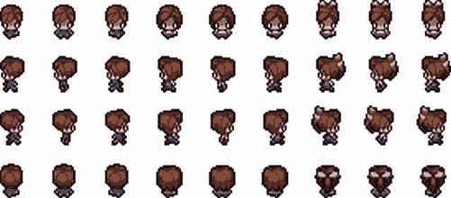

第三章


enchant.js 的基本特性

既然您已经熟悉了 JavaScript 的基础知识，那么您应该对 enchant.js 的元素如何交互以及为什么要以特定的方式编写元素有了更好的理解。在这一章中，我们从你开始创作游戏需要知道的 enchant.js 的基本概念开始，然后我们探索集成这些概念的项目。我们涵盖了继承和显示对象树，这是每个 enchant.js 游戏都存在的两个元素，然后我们涵盖了标签、精灵、表面、触摸事件和基于屏幕的界面元素。我们在练习中大量使用了 code.9leap.net。一旦你读完这一章，你将对游戏的主要组件以及如何创建它们有一个基本的了解。

汇总列表

1.  遗产
2.  查看游戏的元素
3.  创建标签
4.  创建精灵
5.  用曲面绘制地图
6.  使用触摸进行互动
7.  使用 D-pad 进行互动

继承

在面向对象编程中，*继承*是将一个对象归类为一个更大类别的成员的关系。为了更好地理解这一点，想象一个苹果。苹果是一种水果，借用面向对象编程的术语，我们可以说它继承了水果的品质。例如，苹果像所有其他水果一样含有种子。这类似于面向对象编程中的继承。

可以继承和被继承的对象的一个例子是 *节点*。游戏中的每一个物品都被称为一个节点。[图 3-1](#Fig1) 显示了不同类型的节点及其分类。


[图 3-1](#_Fig1) 。节点的分类

图中的每个项目都有自己的功能和属性。此外，每个项目还具有与层次结构中它上面的类别相同的功能和属性。例如，`Node`类包含一个名为`moveBy(x, y)`的函数，它移动节点的量等于作为 x 轴和 y 轴的参数传递的量。因为这个函数是`Node`类的一部分，所以一个`Entity`、`Label`、`Sprite`、`Map`、`Group`或者`Scene`都可以调用`moveBy()`。这叫继承。

查看游戏元素

创建游戏时，并不是游戏的所有部分都能立即看到。如果我们创建一个射击游戏，敌人出现在屏幕的顶部，并不是所有的敌人在游戏开始时都是可见的。如果是的话，这个游戏很可能要么太难被击败，要么很快结束。

相反，我们随着时间的推移在场景中创建和注册敌人，使他们可见。游戏中所有可见的元素都是称为*显示对象树的对象层次结构的一部分。* 显示对象树的根对象称为*场景*。创建游戏时，默认创建一个场景。这个默认场景被称为`rootScene`。可以创建多个场景，可以将多个对象注册到显示对象树中的场景，如图[图 3-2](#Fig2) 所示。


[图 3-2](#_Fig2) 。显示对象树

如果`rootScene`是活动场景，只有注册到它的对象在屏幕上可见。注册到场景 1 或场景 2 的对象将不可见。通过向场景中添加对象，移除对象，以及改变哪个场景是活动的，我们可以改变游戏过程中屏幕上显示的内容。我们将通过本章后面提供的代码示例，用更多的实际操作细节来检验这一点。

创建标签

在游戏中有很多情况下需要在屏幕上显示文本，例如当用户的分数在游戏过程中发生变化，关卡有时间限制，或者主要角色有特定的生命值。任何出现在游戏中的文本，除了风格化的艺术，都应该存在于标签中。enchant.js 中的标签是以一种允许它们在字体、颜色和位置方面容易操作的方式创建的。

作为本节的初始练习，我们将完成创建一个 enchant.js 游戏所需的所有步骤，该游戏可以创建随机位置和颜色的标签。

设置游戏

当您编写创建和执行游戏的 JavaScript 时，您必须遵循特定的格式来初始化或激活 enchant.js 库，并指定页面加载后要运行的游戏代码。请按照以下步骤查看如何操作:

1.  Go to `http://code.9leap.net/codes/show/27204` and fork the code to have a workable blank template. You might need to log in or create an account to do this.

     **注意**如果你没有使用 code.9leap.net，你需要将 enchant.js 库导入到你的项目中，这将在[第一章](1.html)中介绍。

2.  Type in the code shown in [Listing 3-1](#list1).

    [***清单 3-1。***](#_list1) 初始化 enchant.js 库

    ```js
    enchant();
    ```

    这个命令告诉 enchant.js 初始化创建和运行游戏所需的所有代码。

3.  Under that, type in the code shown in [Listing 3-2](#list2).

    [***清单 3-2。***](#_list2) 创建 window.onload()

    ```js
    window.onload = function() {
    }
    ```

这指示浏览器只有在加载了所有其他内容之后才运行花括号(`{}`)中的代码。这确保了在游戏真正开始之前，enchant.js 运行所需的一切都已存在。每个 enchant.js 游戏都必须有这两个组件才能运行。我们在花括号中输入了几乎所有的游戏代码。

制作核心物品并开始游戏

既然我们已经为我们的游戏完成了必要的基础工作，我们可以创建游戏的核心，即`Core`对象。`Core`对象是游戏本身，在创建时定义了游戏的大小。游戏的所有元素(场景、标签、精灵等等)都是在这个`Core`对象中创建的。要创建它，请执行以下操作:

1.  Modify your `window.onload` statement to match [Listing 3-3](#list3). This creates the `Core` object, specifying the size of the game to be 320 pixels wide (first argument) by 320 pixels tall (second argument). Assume that all code instructions past this point should be entered within the curly brackets, beneath the last line of code entered unless stated otherwise.

    [***清单 3-3。***](#_list3) 创建核心对象

    ```js
    window.onload = function() {
            var game = new Core(320, 320);
    }
    ```

     **注意**在 0.6 版本之前，`Core`对象被称为`Game`对象。如果你使用早期版本的 enchant.js 创建的游戏，你可能会看到使用`Game`对象而不是`Core`对象(`var game = new Game(320,320)`)的符号。这种情况已经改变，因为 enchant.js 越来越多地用于非游戏应用。

    实际上，如果你遇到一个`Game`对象，你可以把它当作一个`Core`对象。

2.  Place your cursor at the end of the line that reads var `game = new Core(320, 320);` and press Enter a few times to move your cursor down a few lines. Type in the code in [Listing 3-4](#list4). This command tells the game to start and should always appear at the end of your `window.onload` statement.

    [***清单 3-4。***](#_list4) 开始游戏

    ```js
    game.start();
    ```

创建标签

下一步是创建一个带有消息的标签。执行以下操作来创建一个:

1.  After the line `var game = new Core(320, 320);`, type in the code in [Listing 3-5](#list5). This creates a label with the text we designate in quotes.

    [***清单 3-5。***](#_list5) 创建标签

    ```js
    var label = new Label("Hello World!");
    ```

将标签添加到根场景

如果此时单击 Run 按钮，将不会发生任何事情。正如我们前面提到的，游戏中的物体必须添加到活动场景中才能可见。执行以下操作来添加它:

1.  Type in the code in [Listing 3-6](#list6) below the last line of code entered. This adds the label we created to the `rootScene`.

    [***清单 3-6。***](#_list6) 给 rootScene 添加标签

    ```js
    game.rootScene.addChild(label);
    ```

2.  单击运行按钮。“你好世界！”出现在屏幕的左上角，因为标签现在是默认场景`rootScene`的一部分。

更改标签的属性

我们之前讨论了 enchant.js 中的对象如何拥有自己的属性，这些属性控制着游戏中这些对象的特征。要更改标签的特征，请执行以下操作:

1.  Above the line `game.rootScene.addChild(label);`, type in the code in [Listing 3-7](#list7). This makes several changes to the appearance of the label.

    [***清单 3-7。***](#_list7) 改变标签的属性

    ```js
    label.font = "16px sans-serif";
    label.color = "rgb(255,0,0)";
    label.x = 50;
    label.y = 100;
    ```

2.  单击运行。标签以不同的位置、字体和颜色出现。

格式化字体

在清单 3-7 中，我们用`label.font = "16px sans-serif"`改变了标签的字体。

指定的第一个属性是字体的大小。这由一个数字表示，以像素为单位指定字体的大小，后跟字母“px ”,两者之间没有空格。

接下来，指定字体的名称。可以使用预定义的字体名称(字体系列名称)，如“MS PGothic”，但有些设备不包含这些字体。如果没有特定字体的设备试图呈现标签，用户可能会遇到错误。对于用户来说，错误从来都不是有趣的事情，这就是为什么你的字体最好使用通用名称，如下所示。请注意，衬线是字母末端的风格化点，最常见于印刷中使用的字母。

*   无衬线字体:哥特式字体(无衬线)
*   *衬线*:罗马字体(带衬线)
*   *单空间*:固定宽度字体

格式颜色

在清单 3-7 中，我们用`label.color = "rgb(255,0,0)";`改变了标签的颜色。

enchant.js 中的颜色可以为标签和任何其他接受颜色的元素设置，使用任何对 CSS(级联样式表)中的颜色有效的格式。如果您不熟悉 CSS，请不要担心，因为我们将在这里介绍不同的格式。CSS 中有六种有效的颜色分配方式，如[表 3-1](#Tab1) 所示。由于该属性被定义为一个字符串，请确保将赋值用双引号(`""`)括起来。

[表 3-1](#_Tab1) 。不同的方式指定颜色红色

| 值(本例中为红色) | 描述 |
| --- | --- |
| " #ff0000 " | " #RRGGBB "格式。这些值在“00 FF”之间定义为以 16 为基数的数字。 |
| " #f00 " | “#RGB”格式。这些值定义在“0 \u F”之间，以 16 为基数。这种格式创建的颜色与“#ff0000”相同，只是一种缩写格式。 |
| rgb(255，0，0) | “rgb(R，G，B)”格式。这些值被定义为以 10 为基数的“0 \u 255”之间的数字。 |
| " rgb(100%，0%，0%)" | “rgb(R，G，B)”格式。这些值被定义为以 10 为基数的百分比，介于“0%∞100%”之间。 |
| 「rgba(255，0，1.0)」 | “rgba(R，G，B，A)”格式。RGB 定义在“0 \u 255”之间，透射率(alpha 透明度)定义在“0.0 \u 1.0”之间(0 表示完全透明，1 表示完全不透明)。 |
| “红色” | 颜色由名称定义。 |

此外，表 3-1 中的大多数列表表示三种颜色的混合:红色、绿色和蓝色。为了指定红色，我们选择红色的最大值(以 16 为基数的 ff)和绿色和蓝色的最小值(以 16 为基数的 00)。在 16 进制中，0–9 与 10 进制相同(正常计数)，然后 10 = A，11 = B，依此类推，直到 16 = F，16 进制中字母的大小写没有区别(也称为十六进制格式)。

定义位置

通过设置标签的 x 和 y 属性值来定义位置。在[清单 3-7](#list7) 中，我们用`label.x = 50;`将标签的位置设置为距离游戏屏幕左边缘 50 像素，用`label.y = 100;`设置为距离游戏屏幕上边缘 100 像素。

创建一个为我们创建标签的函数

优化是编程中的一个常见概念。这意味着使用尽可能少的代码，或者使用代码快捷方式，来创建一个游戏或其他应用。在我们的游戏中，我们将创建多个标签，因此创建一个为我们创建和配置标签的函数要比手动多次创建标签容易得多，而且这个函数可以被调用无数次。请执行以下操作来了解如何操作:

1.  Delete the code you wrote from [Listings 3-6](#list6) and [3-7](#list7) and replace it with the code in [Listing 3-8](#list8). This function will accept four arguments, create a `Label` with the `text` argument, specify the color to be whatever was indicated for the `color` argument, set the position with the `x` and `y` arguments, and then add the label to the `rootScene`.

    [***清单 3-8。***T5】创建 addLabel 函数](#_list8)

    ```js
    game.addLabel = function(text, color, x, y) {
            var label = new Label(text);
            label.font = "16px sans-serif";
            label.color = color;
            label.x = x;
            label.y = y;
            game.rootScene.addChild(label);
    };
    ```

    这本身不会产生标签。相反，它包含创建标签的说明。要创建标签，我们必须调用函数并提供参数。

2.  Under the preceding code, type in the code in [Listing 3-9](#list9).

    [***清单 3-9。***](#_list9) 调用 addLabel

    ```js
    game.addLabel("50 Points", "rgb(255,0,0)", 50, 50);
    game.addLabel("100 Points", "rgb(50,0,100)", 50, 200);
    ```

3.  单击运行。将出现红色标签和紫色标签。

创建随机数函数

为什么我们需要随机数？因为我们要给我们创建的标签分配随机属性，并且需要随机数来完成。执行以下操作创建随机数函数:

1.  Go to the very bottom of your code, below the last semicolon of the `window.onload` statement, and type in the code in [Listing 3-10](#list10).

    [***清单 3-10。***](#_list10) 随机数功能

    ```js
    function rand(num){
            return Math.floor(Math.random() * num);
    }
    ```

`floor()`和`random()`都是`Math`对象的方法，这是 JavaScript 中预定义的对象。`rand()`函数的定义接受一个参数`num`，该参数乘以`Math.random()`的结果。`Math.random()`将返回一个介于 0 和 1 之间的小数值。`Math.floor`将结果向下舍入到最接近的整数，然后该数字将作为`rand()`函数的结果返回(提供)。

 **注意**十进制值`Math.random()`可以返回的范围包括 0 但不包括 1。例如，如果我们将`Math.random()`乘以 100，理论上可以返回的最小值是 0，理论上可以返回的最大值是非常接近 100 的值，但不完全是 100(换句话说，接近 99.99999999999)。用`Math.floor()`将它向下舍入，得到一个介于 0 和 99 之间的随机整数。

例如，如果我们调用`rand(100)`，程序返回 0.88134 作为`Math.random()`的返回值，它将首先乘以我们指定的参数(`100`)，变成 88.134。然后通过`Math.floor()`将其向下舍入到 88 并返回。创建这个函数的理由将在下一节中变得显而易见。

使用 ENTER_FRAME 事件监听器自动创建标签，并定期处理

现在我们已经有了轻松创建标签所必需的函数，我们需要能够以固定的时间间隔调用该函数的东西，也称为*周期性处理*。我们可以用一个事件监听器来做这件事。事件侦听器是代码的一部分，它不断地寻找特定的事件，当事件发生时，事件侦听器触发我们创建的特定代码。请执行以下操作来了解如何操作:

1.  Delete the two `game.addLabel()` statements you created in [Listing 3-9](#list9) and replace them with the code in [Listing 3-11](#list11). This code instructs the program to execute the code within the curly braces (`{}`) every time the `ENTER_FRAME` event occurs. This event occurs every frame.

    [***清单 3-11。***](#_list11) ENTER_FRAME 事件监听器

    ```js
    game.rootScene.addEventListener(Event.ENTER_FRAME, function() {
    });
    ```

    您可以为任何`Node`对象(不仅仅是`rootScene`)创建事件监听器，并设置它们监听 enchant.js 中的任何事件。[表 3-2](#Tab2) 列出了 enchant.js 中的主要事件

    [表 3-2。](#_Tab2)事件

    | 事件类型 | 描述 | 事件发布者 |
    | --- | --- | --- |
    | `Event.A_BUTTON_DOWN` | 按下 a 按钮时发生的事件 | 核心，场景 |
    | `EventA_BUTTON_UP` | 释放 a 按钮时发生的事件 | 核心，场景 |
    | `Event.ADDED` | 将节点添加到组时发生的事件 | 结节 |
    | `Event.ADDED_TO_SCENE` | 将节点添加到场景中时发生的事件 | 结节 |
    | `Event.B_BUTTON_DOWN` | 按下 b 按钮时发生的事件 | 核心，场景 |
    | `Event.B_BUTTON_UP` | 释放 b 按钮时发生的事件 | 核心，场景 |
    | `Event.DOWN_BUTTON_DOWN` | 按下向下按钮时发生的事件 | 核心，场景 |
    | `Event.DOWN_BUTTON_UP` | 释放向下按钮时发生的事件 | 核心，场景 |
    | `Event.ENTER` | 场景开始时发生的事件 | 事件 |
    | `Event.ENTER_FRAME` | 处理新帧时发生的事件 | 核心，场景 |
    | `Event.EXIT` | 场景结束时发生的事件 | 事件 |
    | `Event.EXIT_FRAME` | 帧处理即将结束时发生的事件 | 核心 |
    | `Event.INPUT_CHANGE` | 按钮输入改变时发生的事件 | 核心，场景 |
    | `Event.INPUT_END` | 按钮输入结束时发生的事件 | 核心，场景 |
    | `Event.INPUT_START` | 按钮输入开始时发生的事件 | 核心，场景 |
    | `Event.LEFT_BUTTON_DOWN` | 按下左键时发生的事件 | 核心，场景 |
    | `Event.LEFT_BUTTON_UP` | 释放左键时发生的事件 | 核心，场景 |
    | `Event.LOAD` | 游戏加载完成时调度的事件 | 核心 |
    | `Event.PROGRESS` | 游戏加载期间发生的事件 | 核心 |
    | `Event.REMOVED` | 从组中删除节点时发生的事件 | 结节 |
    | `Event.REMOVED_FROM_SCENE` | 从场景中移除节点时发生的事件 | 结节 |
    | `Event.RENDER` | 呈现实体时发生的事件 | 实体 |
    | `Event.RIGHT_BUTTON_DOWN` | 按下右键时发生的事件 | 核心，场景 |
    | `Event.RIGHT_BUTTON_UP` | 释放右键时发生的事件 | 核心，场景 |
    | `Event.TOUCH_END` | 当与节点相关的触摸结束时发生的事件 | 结节 |
    | `Event.TOUCH_MOVE` | 当与节点相关的触摸移动时发生的事件 | 结节 |
    | `Event.TOUCH_START` | 与节点相关的触摸开始时发生的事件 | 结节 |
    | `Event.UP_BUTTON_DOWN` | 按下向上按钮时发生的事件 | 核心，场景 |
    | `Event.UP_BUTTON_UP` | 释放向上按钮时发生的事件 | 核心，场景 |

2.  Type in the code in [Listing 3-12](#list12) inside the curly braces to create and assign variables to represent a random score to be displayed; the value of red (in the RGB color component of the label), green, and blue; and the x and y position.

    [***清单 3-12。***](#_list12) 创建变量并分配随机值

    ```js
    var score = rand(100);
    var r = rand(256);
    var g = rand(256);
    var b = rand(256);
    var x = rand(300);
    var y = rand(300);
    ```

3.  Below the code you just entered, but still inside the curly braces, call the `addLabel()` function we created earlier, passing the random variables as the arguments of the function, by typing in the code in [Listing 3-13](#list13).

    [***清单 3-13。***](#_list13) 调用 addLabel()函数

    ```js
    game.addLabel(score + " Points", "rgb(" + r + "," + g + "," + b + ")", x, y);
    ```

4.  单击运行。标签可以在屏幕上快速创建。

使用帧和模数 减慢处理速度

标签的创建在这一点上可能看起来有点失控，因为在您单击 Run 按钮之后，不久整个屏幕就会完全充满标签。幸运的是，你可以放慢速度。请执行以下操作来了解如何操作:

1.  Enter the code you wrote in [Listing 3-12](#list12) and 3-13 inside an `if` statement, as shown in [Listing 3-14](#list14). Here, `game.frame` is equal to the number of frames that have elapsed in a game, and the modulo operator (`%`) will return the remainder after dividing the number of frames by 3\. If that value is equal to 0, a label will be created. The final effect of this code is to cause a label to be created every third frame.

    [***清单 3-14。***](#_list14) 控制标签创建的频率

    ```js
    if (game.frame % 3 === 0) {
            var score = rand(100);
            var r = rand(256);
            var g = rand(256);
            var b = rand(256);
            var x = rand(300);
            var y = rand(300);
            game.addLabel(score + " Points", "rgb(" + r + "," + g + "," + b + ")", x, y);
    }
    ```

2.  单击运行。标签的创建速度要慢得多。

指定时间后移除标签

现在创建标签的速度更慢了，但过不了多久，它们仍然会填满屏幕。要在标签创建后清除它，我们需要使用另一个事件监听器。

1.  Type in the code in [Listing 3-15](#list15) under `game.rootScene.addChild(label);` (still inside the `window.onload` function curly braces). Here, we add an event listener to the labels we create, specifying to remove the label from the document object tree if the label’s age, or the number of frames the label has been part of the document object tree, exceeds 10 frames.

    [***清单 3-15。***](#_list15) 去除标签

    ```js
    label.addEventListener(Event.ENTER_FRAME, function() {
            if (label.age > 10) game.rootScene.removeChild(label);
    });
    ```

    你有没有注意到在`if`语句后面没有花括号？这是因为只有一个语句。如果没有花括号，`if`语句只触发后续的单行代码。

2.  单击运行。标签是随机创建的，并在创建后不久从屏幕上删除。

使标签移动

作为标签的最后一个效果，我们希望它们在创建后向上移动。执行以下操作，指示它们每帧向上移动一个像素:

1.  Directly above the `if` statement you entered from [Listing 3-15](#list15), but still within the event listener curly braces, enter the code from [Listing 3-16](#list16). This simply reduces the y position of the label by one.

    [***清单 3-16。***](#_list16) 移动标签

    ```js
    label.y --;
    ```

2.  Because the ENTER_FRAME event listener executes its code every frame, the label moves up the screen at a rate of 30 frames every second, as the frames per second (fps) setting of the `Core` object is set to 30 fps by default.

     **注意**你可以通过修改`Core`对象的`fps`属性来改变每秒帧数的设置(换句话说就是`game.fps = 16;`)。

3.  单击运行。标签会显示出来，并在消失之前在屏幕上向上移动。

标签用于显示游戏中的分数等，前面的练习简要介绍了如何创建标签。随着我们的继续，我们将更多地使用它们。如果你遇到任何问题，你可以在`http://code.9leap.net/codes/show/27211`找到一个完整的工作代码样本。

创建精灵

虽然也有例外，但大多数游戏都有一个主角，或者敌人，或者盟友，或者某种角色。这些角色由图像表示，通常以某种身份四处活动。在 enchant.js 中，角色由精灵表示。创建精灵时，它配备了许多属性和方法，使其更容易操作。

为精灵设置游戏

要为精灵设置游戏，您需要为精灵预加载图像并创建一个`game.onload`语句。执行以下操作，查看如何创建一个在屏幕上行走的熊精灵:

1.  从`http://code.9leap.net/codes/show/27204`分叉空白的 enchant.js 模板。
2.  Type in the code in [Listing 3-17](#list17) to create the basic structure of the game. Here, we use the `preload` function to load in the image of a bear to be used for the sprite. This image is included in the project on code.9leap.net and was included when you forked it in the preceding step.

    [***清单 3-17。***](#_list17) 熊游戏的基本结构

    ```js
    enchant();
            window.onload = function() {
            var game = new Core(320, 320);
            game.preload('chara1.gif');

            game.onload = function() {

            };

            game.start();
    };
    ```

这个代码示例还包含了`game.onload`函数，当加载图像或者不仅仅是添加和删除节点和事件监听器时，这个函数是必需的。这个函数类似于`window.onload`，在游戏完全加载后执行它的代码。

创建精灵

要创建 sprite，必须声明一个代表 sprite 的变量，必须给它分配一个图像，然后必须将其添加到文档对象树中。以下步骤向您展示了如何完成此过程:

*   1.  Create a variable to represent a 32-pixel-wide by 32-pixel-tall sprite by typing in the code in [Listing 3-18](#list18) inside the `game.onload` function. You can assume that all future references to placing code inside a function mean to place that code inside the curly braces at the end of that function.

    [***清单 3-18。***](#_list18) 创建精灵变量

    ```js
    var bear = new Sprite(32, 32);
    ```

*   2.  Assign the image you preloaded in the last section by typing in the code in [Listing 3-19](#list19) on the next line.

    [***清单 3-19。***](#_list19) 将图像分配给图像属性

    ```js
    bear.image = game.assets['chara1.gif'];
    ```

*   3.  On the next line, add the bear to the `rootScene` to make it visible by typing in the code in [Listing 3-20](#list20).

    [***清单 3-20。***](#_list20) 使熊可见

    ```js
    game.rootScene.addChild(bear);
    ```

*   4.单击运行。这只熊出现在屏幕的左上角。

指定精灵的框架

如果您在这个项目中使用`code.9leap.net`，您将会看到`chara1.gif`在屏幕右侧以缩略图的形式出现。这张图片包含了几只熊的图片，那么为什么目前只有一只熊出现在我们的游戏中呢？答案与框架有关。

当你用`Sprite(32,32)`创建一个精灵时，程序会创建一个尺寸为 32×32 像素的精灵。当您将图像指定给精灵时，程序会将该图像分割成相同大小的帧，并从 0 开始用数字标识它们。这个概念被称为*帧索引*，如图 3-3 中的`chara1.gif`所示。


[图 3-3](#_Fig3) 。帧索引

通过将所需的帧数设置为 frame 属性，可以为 sprite 选择帧。为此，请执行以下操作:

*   5.  Select the white standing bear as the frame by inserting the code in [Listing 3-21](#list21) above the `game.rootScene.addChild(bear);` statement. Inserting the code after the `addChild` function carries the risk of the brown bear appearing onscreen and then switching to the image of the white bear.

    [***清单 3-21。***](#_list21) 分配白熊帧

    ```js
    bear.frame = 5;
    ```

*   6.单击运行。精灵看起来像一只白熊。

制作精灵动画

我们有图像是很好的，但是一个画面的真正意义是创造运动的幻觉。最后，我们将指示熊在屏幕上来回移动，因为我们希望熊看起来像是在走路。在我们的 chara1.gif 图像中，有一些白熊的图像，我们可以快速连续显示来实现这一点。请执行以下操作来了解如何操作:

1.  Replace the `bear.frame` line you just added with the code shown in [Listing 3-22](#list22). This notation is an array of numbers and acts as a shortcut for animation. For each frame, the frame will move to the next indicated frame in the sequence.

    [***清单 3-22。***](#_list22) 动画熊

    ```js
    bear.frame = [5, 6, 5, 7];
    ```

2.  单击运行。熊精灵在帧中快速循环。这是我们的目标，但现在看来，这只熊似乎有点神经质。让我们让他慢一点。
3.  Rewrite your `bear.frame` statement to match the code in [Listing 3-23](#list23). This slows down the rate of the frame change by assigning the same image for two frames instead of just one.

    [***清单 3-23。***](#_list23) 减缓熊的定格

    ```js
    bear.frame = [5,5,6,6,5,5,7,7];
    ```

     **注意**不要使用[清单 3-23](#list23) ，你可以在游戏开始前写一个`game.fps = 16;`语句，让游戏每秒处理 16 帧，而不是默认的 30 帧，来减缓熊改变帧的速度。请记住，这将降低游戏中所有实体的帧速率。

4.  单击运行。为了行走，熊以更正常的速率改变帧。

移动精灵

精灵现在有适当的动画行走，但不移动。执行以下操作，在屏幕上移动小熊:

1.  Create an event listener on the bear sprite registered to the ENTER_FRAME event by typing in the code in [Listing 3-24](#list24) under `game.rootScene.addChild(bear);`. Enter the code inside the curly braces of the `game.onload` function.

    [***清单 3-24。***](#_list24) 在 Bear 上创建事件监听器

    ```js
    bear.addEventListener(Event.ENTER_FRAME, function() {
    });
    ```

2.  Create periodic processing inside the event listener to move the bear to the right by increasing the x position by 3, as shown in [Listing 3-25](#list25).

    [***清单 3-25。***](#_list25) 动人的熊

    ```js
    bear.x += 3;
    ```

3.  单击运行。熊跑过屏幕。
4.  Create an `if` statement to move the bear only to the right if the bear’s location is less than the edge of the screen by modifying [Listing 3-25](#list25) to match [Listing 3-26](#list26). We use `320 – 32` because, while 320 is the edge of the right side of the game screen, the position of the sprite is measured from the top-left corner. When the sprite is at x = 320, the bear will not be visible. Since 32 is the width of the sprite, putting the limit of the bear at `320 – 32` ensures the bear stays onscreen.

    [***清单 3-26。***](#_list26) 用 If 语句约束运动

    ```js
    if (bear.x < 320 - 32) bear.x += 3;
    ```

确定精灵的方向以匹配其运动

让我们让熊精灵在屏幕上来回行走，面向它行走的任何方向。为此，我们使用了`scaleX`属性。请执行以下操作来了解如何操作:

1.  Insert the code in [Listing 3-27](#list27) above the `game.rootScene.addChild(bear);` statement. The `scaleX` property defaults to the value of 1 when the sprite is created and can be modified to change the size of the bear (in other words, `scaleX = 2;` will scale the bear to 200%). By making `scaleX` a negative value, the image of the bear is flipped across the x-axis, making the bear face the left side of the screen.

    [***清单 3-27。***](#_list27) 反转熊横过 X 轴

    ```js
    bear.scaleX = -1;
    ```

     **注意**使用`sprite.scaleY = -1;`可以在 y 轴上反转精灵图像。

2.  单击运行。这只熊似乎在屏幕上向后走。这不是我们想要的最终结果，但是它让您了解了`scaleX`属性是如何工作的。我们将使用`scaleX`属性来指示熊在接下来的几个步骤中如何移动。
3.  删除您在清单 3-26 中输入的代码。
4.  Replace the `if` statement (`if (bear.x < 320 - 32) bear.x += 3;`) in the bear’s event listener with [Listing 3-28](#list28). This code sample specifies that if the bear is facing right, it should move to the right by 3 pixels for each frame and should be flipped to face left if the bear reaches the right side of the screen. If the bear faces left, the bear should move to the left by 3 pixels for each frame and should be turned around to face right again when it reaches the left side of the screen.

    [***清单 3-28。***](#_list28) 定向熊

    ```js
    if (bear.scaleX === 1) {
            bear.x += 3;
            if (bear.x > 320 - 32) bear.scaleX = -1;
    } else {
            bear.x -= 3;
            if (bear.x < 0) bear.scaleX = 1;
    }
    ```

5.  单击运行。熊按照描述移动。

到目前为止，您应该已经熟悉了使用事件侦听器来处理每一帧上的代码。这是 enchant.js 中很多游戏的核心，如果你遇到任何 Sprite 代码的问题，可以在`http://code.9leap.net/codes/show/27365`找到完全工作的代码样例。

用曲面绘制地图

enchant.js 中的地图是由几个叫做 *tiles* 的小图像组成的。假设你正在创建一个游戏，背景是一片片绿草，一个角色在屏幕上来回移动。要在 enchant.js 中创建一个充满绿草瓷砖的地图，您需要首先将这些瓷砖添加到一个`Surface`对象中。

`Surface`对象是 enchant.js 中用于绘图的对象。绘画是指在一个物体上创造形状(这里不讨论)或图像的行为。一旦绘制了表面，就将其指定为 sprite 的 image 属性，以将其加入到显示对象树中。使用一个`Surface`对象允许在一个对象上绘制多个图像，这使得它成为显示地图的主要候选对象。在下面的代码示例中，我们创建了一个完全由绿草平铺组成的地图。

设置游戏

执行以下操作来设置一个使用`Surface`对象的示例游戏:

1.  从`http://code.9leap.net/codes/show/27204`分叉空白的 enchant.js 模板。
2.  Set the groundwork for your game by typing in the code in [Listing 3-29](#list29). The preloaded `map0.gif` file, shown in [Figure 3-4](#Fig4), contains the component tile images that we will use to create the map.

    [***清单 3-29。***](#_list29) 设置游戏

    ```js
    enchant();
    window.onload = function() {
            var game = new Core(320, 320);
            game.fps = 16;

            game.preload('http://enchantjs.com/assets/img/map0.gif');

            game.start();
    };
    ```

    

    图 3-4 。map0.gif

为地图创建容器

在我们用切片填充地图之前，地图必须有几个容器可以使用。执行以下操作来创建它们:

1.  Below the `preload` statement, type in the code in [Listing 3-30](#list30). Here, we create a variable to act as the sprite, which will display the map. We assign our preloaded map image to the variable `maptip`, which makes it easier to reference later. Finally, we create a new `Surface`, which is what we will draw our map tiles on.

    [***清单 3-30。***](#_list30) 创建容器

    ```js
    game.onload = function() {
            var bg = new Sprite(320, 320);
            var maptip = game.assets['http://enchantjs.com/assets/img/map0.gif'];
            var image = new Surface(320, 320);
    };
    ```

用图块推广地图

用`draw()`命令绘制一个`Surface`对象。在本节中，我们认为`draw()`命令是用来复制和粘贴图像到一个表面上的。由于我们的 16x16 瓷砖图像必须一次一个地粘贴到我们的空白表面上，我们可以编写一个很长的这些语句的列表来绘制瓷砖，但是使用循环来这样做可以节省我们的时间。执行以下操作来创建循环:

1.  Create two `for` loops to represent x and y coordinates by typing in the code in [Listing 3-31](#list31) below `var image = new Surface(320,320);` but still inside the `game.onload` function.

    [***清单 3-31。***](#_list31) 平铺循环

    ```js
    for (var j = 0; j < 320; j += 16) {
            for (var i = 0; i < 320; i += 16) {

            }
    }
    ```

这一开始可能会令人困惑，但是将两个`for`循环放在一起是一个非常有用的工具，可以在一个`Surface`上增量移动，这正是我们在地图上以特定间隔放置图块所需要做的。

将变量`j`和`i`分别视为空白背景上的虚拟光标的 y 和 x 坐标。想象一下这个空白背景被切割成 16 像素乘 16 像素的正方形，做成一个巨大的桌子。变量`j`代表我们假想的光标的行位置，变量`i`代表列位置。这个假想的光标总是指向一个 16 x 16 方块的左上角，因为那是所有使用`draw()`功能的操作的起点。

当进入第一个`for`循环时，`j`的值为`0`。然后进入第二个`for`循环，其中`i`也具有初始值`0`。我们假想的光标当前在(0，0)，在表格的左上角。我们将在一个`draw()`命令中使用这个位置来复制一个图块，它还没有显示。在`draw()`命令之后，第二个`for`循环重复，这次`i`值为 16。我们的`draw()`命令现在将在(`16,0`)运行。如此重复，直到`i`变为 320。这时，第一排瓷砖将被绿色瓷砖填满。然后，重复第一个`for`循环，该过程从第二行开始，依此类推。

但是我们不要想太多。我们必须首先创建`draw()`命令，这样才能工作。

*   2.   Inside the second `for` loop, create the `draw()` command to actually copy the tiles throughout the `for` loop by copying [Listing 3-32](#list32) into the second `for` loop (`for (var i = 0; i < 320; i += 16) {}`).

    [***清单 3-32。***](#_list32) 绘制命令复制图块

    ```js
    image.draw(maptip, 0, 0, 16, 16, i, j, 16, 16);
    ```

是的，这个命令有很多参数。他们是这样做的:

*   `maptip`:这是要用作源图像的预加载图像资产(要在地图上使用的图块的图像)。
*   `0, 0`:这是一个假想矩形左上角的 x 和 y 坐标，将用于从原始图像中捕捉一个区域。如果你想象在一幅图像上点击并拖动一个选择框来复制它的一部分，这将是点击的起点。
*   `16, 16`:这是假想矩形右下角的 x 和 y 坐标，用来从源图像中捕捉一个区域。如果您单击并拖动来创建选择框，这些将是您放开单击的坐标。
*   `i, j`:目的地`Surface`上的 x 和 y 坐标，表示所拍摄图像粘贴位置的左上角。在调用几个`draw()`语句的过程中，通过`for`循环来改变这些值，以完美地分隔瓦片。
*   `16, 16`:最后两个值表示要粘贴的图像的宽度和高度。如果这些从捕获区域的大小改变，它将在粘贴之前缩放图像。

将地图分配给背景并显示它

既然我们已经将图块复制到目的地`Surface`，我们需要将它添加到`bg` sprite 中，这样我们就可以将它添加到显示对象树中。

1.  Under the `for` loops, but still inside the `game.onload` function, type in the code in [Listing 3-33](#list33).

    [***清单 3-33。***](#_list33) 添加地图

    ```js
    bg.image = image;
    game.rootScene.addChild(bg);
    ```

2.  单击运行。地图出现，充满了绿色的草地瓷砖。

在 enchant.js 中，地图构成了许多游戏的背景。尽管创建地图的技术可能很难掌握，但熟悉地图对于创建更具沉浸感的游戏来说是无价的。

使用触摸进行交互

创建一个在草地上移动玩家的游戏的下一步是创建一个角色，当玩家点击屏幕时，他移动到屏幕上的那个点。这是通过用户点击游戏屏幕时发生的触摸事件来实现的。

创建角色

记住 enchant.js 中的游戏主要由每一帧运行的循环控制，这一点很重要。如果我们有一个角色在屏幕上走来走去，它将不得不为每个移动方向设置精灵，并进行相应的处理。请执行以下操作来查看这是如何实现的:

1.  At the very top of your code, before the `enchant()` command, add constants (values that will not change) by typing in the code in [Listing 3-34](#list34). These values are used for specifying sprites for movement.

    [***清单 3-34。***](#_list34) 创建方向常数

    ```js
    var DIR_LEFT  = 0;
    var DIR_RIGHT = 1;
    var DIR_UP    = 2;
    var DIR_DOWN  = 3;
    ```

2.  Add `chara0.gif` ([Figure 3-5](#Fig5)) to the list of images to be preloaded by modifying the `game.preload` statement to the one shown in [Listing 3-35](#list35).

    

    图 3-5 。chara0.gif

    [***清单 3-35。***](#_list35) 给要加载的图片添加 chara0.gif

    ```js
    game.preload('http://enchantjs.com/assets/img/chara0.gif',
            'http://enchantjs.com/assets/img/map0.gif');
    ```

3.  Create a variable to represent our character, the girl from `chara0.gif`, and set the basic properties of that character by typing in the code in [Listing 3-36](#list36) directly under `game.rootScene.addChild(bg);`. Setting the x and y coordinates to `160 – 16` causes the character to appear directly in the center of the screen. The `frame` is set to 7 to show the girl facing down first.

    [***清单 3-36。***](#_list36) 塑造基础少女角色

    ```js
    var girl = new Sprite(32, 32);
    girl.image = game.assets['http://enchantjs.com/assets/img/chara0.gif'];
    girl.x     = 160 - 16;
    girl.y     = 160 - 16;
    girl.frame = 7;
    ```

4.  Create secondary properties for the girl and add her to the document object tree by typing in the code in [Listing 3-37](#list37) directly below the preceding code. The `toX` and `toY` properties are created to represent the location the girl will head toward when a player clicks the screen. The `girl.anim` array represents frame numbers used for animating the walking motion of the girl for all four directions.

    [***清单 3-37。***](#_list37) 为女孩创造次级属性

    ```js
    girl.toX   = girl.x;
    girl.toY   = girl.y;
    girl.dir   = DIR_DOWN;
    girl.anim  = [
            15, 16, 17, 16, //Left
            24, 25, 26, 24, //Right
            33, 34, 35, 34, //Up
            6,  7,  8,  7]; //Down
    game.rootScene.addChild(girl);
    ```

5.  单击运行。女孩出现在草砖前的屏幕上。

处理触摸动作

最后一步是建立一个事件监听器，如果`toX`和`toY`与女孩的当前位置实质上不同，则移动女孩，并处理用户做出的触摸事件。请执行以下操作来了解如何操作:

1.  Create an event listener for the girl character to process movement by typing in the code in [Listing 3-38](#list38) under `game.rootScene.addChild(girl);`. Like all ENTER_FRAME event listeners, this will be processed on the girl sprite for every frame.

    [***清单 3-38。***](#_list38) 为女孩创建事件监听器

    ```js
    girl.addEventListener(Event.ENTER_FRAME, function() {
    };
    ```

2.  Within the event listener you just added, create an `if` statement to process the upward movement of the girl by typing in the code in [Listing 3-39](#list39). This code sample states that if the current Y position of the girl is lower (greater) than the girl’s destination (`toY`), the girl’s direction should be set as `DIR_UP` and the girl should be moved up by 3 pixels each frame, unless the girl’s current Y position is within 3 pixels of the destination. This is done by checking to see if the absolute value (`Math.abs()`) of the girl’s Y position minus the girl’s destination Y position is less than 3 pixels.

    [***清单 3-39。***](#_list39) 加工向上运动

    ```js
    if (girl.y > girl.toY) {
            girl.dir = DIR_UP;
            if (Math.abs(girl.y - girl.toY) < 3) {
                    girl.y=girl.toY;
            } else {
                    girl.y -= 3;
            }
    }
    ```

3.  Add the code to process the movement for the remaining directions (down, left, and right) by typing in the code in [Listing 3-40](#list40) under the code you just added, but still within the girl’s event listener. This code uses the exact same approach as the preceding code to move the girl in the appropriate direction.

    [***清单 3-40。***](#_list40) 加工其他方向的运动

    ```js
    else if (girl.y < girl.toY) {
            girl.dir = DIR_DOWN;
            if (Math.abs(girl.y - girl.toY) < 3) {
                    girl.y = girl.toY;
            } else {
                    girl.y += 3;
            }
    }

    if (girl.x > girl.toX) {
            girl.dir = DIR_LEFT;
            if (Math.abs(girl.x - girl.toX) < 3) {
                    girl.x = girl.toX;
            } else {
                    girl.x -= 3;
            }
    }

    else if (girl.x < girl.toX) {
            girl.dir = DIR_RIGHT;
            if (Math.abs(girl.x- girl.toX) < 3) {
                    girl.x = girl.toX;
            } else {
                    girl.x += 3;
            }
    }
    ```

4.  Specify how the girl should be animated by adding [Listing 3-41](#list41) directly under the last code you entered, still inside the girl’s event listener. This code sample states that if the girl is not moving, her age should be made to equal 1\. Every frame, the girl’s age will increase; however, if she is standing still, her age will be reset to 1\. This is used in the frame assignment on the next line to keep the girl from being animated if she is not moving. In the next line, the frame is assigned as a number from the array of values we specified earlier. The code means that the frame of the girl should cycle through the four frames of a given direction the girl is traveling in or facing.

    [***清单 3-41。***](#_list41) 给女孩做动画

    ```js
    if (girl.x == girl.toX && girl.y == girl.toY) girl.age = 1;
    girl.frame = girl.anim[girl.dir * 4 + (girl.age % 4)];
    ```

5.  Create the `TOUCH_START` and `TOUCH_MOVE` event listeners to capture clicks from the player and save those values to the girl’s `toX` and `toY` properties by modifying the last part of your code to match [Listing 3-42](#list42). The two event listeners should be added inside the `game.onload` function, but outside the girl’s ENTER_FRAME event listener. Here, the `TOUCH` events are being passed into the functions as an argument (`function(e)`) and include the X and Y coordinates of where the touch event happens. Assigning those coordinates to the girl’s `toX` and `toY` properties (with `-16` to center the girl) move the girl to the location being touched by the player.

    [***清单 3-42。***](#_list42) 包括事件监听器进行触摸

    ```js
                            ...if (girl.x == girl.toX && girl.y == girl.toY) girl.age = 1;
                            girl.frame = girl.anim[girl.dir * 4 + (girl.age % 4)];

                    });

                    bg.addEventListener(Event.TOUCH_START, function(e){
                            girl.toX = e.x - 16;
                            girl.toY = e.y - 16;
                    });

                    bg.addEventListener(Event.TOUCH_MOVE, function(e){
                            girl.toX = e.x - 16;
                            girl.toY = e.y - 16;
                    });
            };
            game.start();
    };
    ```

6.  单击运行。女孩现在跟着屏幕上的鼠标点击，向他们走去。

本节介绍了一些用触摸事件控制精灵的复杂技巧。为你的精灵们启用这个能力将会为你的玩家们创造更流畅更有趣的游戏。

使用数字键盘进行交互

到目前为止，我们看到的玩家和游戏之间的唯一交互是触摸事件。然而，这并不是玩家与游戏互动的唯一方式。为了支持触摸事件之外的交互，enchant.js 附带了一个插件，用于将数字和模拟方向键(d-pads)放入游戏中。数字 d-pad([图 3-6](#Fig6) )只包含四个方向按钮(上、下、左、右)，而模拟 pad 是由用户拇指操纵的控制杆。Playstation 2 和 3 控制器上的控制杆是现实生活中模拟垫的好例子。模拟板传递操纵杆相对于其中心的当前位置的 X 和 Y 值。本书不涉及模拟焊盘；相反，我们专注于数字键盘。


[图 3-6](#_Fig6) 。数字键盘

在本节的代码示例中，我们创建了一个数字 d-pad，为您提供了一个具有熊角色和地板的侧滚游戏的基础。按下 d-pad，使轴承向指定方向移动。

创建数字键盘

执行以下操作创建数字键盘:

1.  Fork the code at `http://code.9leap.net/codes/show/27476` to create the basis of the game. If you are not using code.9leap.net, copy the code from [Listing 3-43](#list43) into a new code file.

    [***清单 3-43。***](#_list43)D-Pad 游戏基础

    ```js
    var STATUS_WAIT = 0;
    var STATUS_WALK = 1;
    var STATUS_JUMP = 2;

    enchant();
    window.onload = function() {
        //create game object
        var game = new Core(320, 320);
        game.fps = 16;

        //load images
        game.preload('http://enchantjs.com/assets/img/chara1.gif',
            'http://enchantjs.com/assets/img/map0.gif');

        //called when the loading is complete
        game.onload = function() {
            //create the background
            var bg = new Sprite(320, 320);
            bg.backgroundColor = "rgb(0, 200, 255)";
            var maptip = game.assets['http://enchantjs.com/assets/img/map0.gif'];
            var image = new Surface(320, 320);
            for (var i = 0; i < 320; i += 16) {
                image.draw(maptip, 3 * 16, 0, 16, 16, i, 320 - 16, 16, 16);
            }
            bg.image = image;
            game.rootScene.addChild(bg);

            //The d-pad should be created below this line

            //create bear
            var bear = new Sprite(32, 32);
            bear.image  = game.assets['http://enchantjs.com/assets/img/chara1.gif'];
            bear.x      = 160 - 16;
            bear.y      = 320 - 16 - 32;
            bear.status = STATUS_WAIT;
            bear.anim   = [10, 11, 10, 12];
            bear.frame  = 10;
            game.rootScene.addChild(bear);

            //frame loop for the bear
            bear.addEventListener(Event.ENTER_FRAME, function() {

                //frame setting
                if (bear.status == STATUS_WAIT) {
                    bear.frame = bear.anim[0];
                } else if (bear.status == STATUS_WALK) {
                    bear.frame = bear.anim[bear.age % 4];
                } else if (bear.status == STATUS_JUMP) {
                    bear.frame = bear.anim[1];
                }
            });
        };

        //start game
        game.start();
    };
    ```

     **注意**D-pad 需要加载`ui.enchant.js` 插件。这显示在 code.9leap 示例中的 index.html 文件中，包括在调用 enchant.js 游戏脚本的 index.html 文件的文件头中添加`<script src='/static/enchant.js-latest/plugins/ui.enchant.js'></script>`或类似的指针。

2.  Create the D-pad by typing in the code in [Listing 3-44](#list44) under the comment line that says `//The d-pad should be created below this line`. This creates the D-pad at (`0,220`).

    [***清单 3-44。***](#_list44) 创建一个数字键盘

    ```js
    var pad = new Pad();
    pad.x   = 0;
    pad.y   = 220;
    game.rootScene.addChild(pad);
    ```

3.  单击运行。D-pad 出现在屏幕的左下角。

用 D-Pad 处理移动

您已经创建了 D-pad，但是您仍然需要对它进行编程来移动熊。请执行以下操作:

1.  Tie the D-pad in with the movement of the bear by adding [Listing 3-45](#list45) to the inside of the Bear’s ENTER_FRAME event listener (directly under `bear.addEventListener(Event.ENTER_FRAME, function() { }`. This ties in the input from the d-pad with commands to move the bear.

    [***清单 3-45。***](#_list45) 用 D-Pad 加工运动

    ```js
    //up
    if (bear.status != STATUS_JUMP) {
            bear.status = STATUS_WAIT;
            if (game.input.up)  {
                    bear.status = STATUS_JUMP;
                    bear.age = 0;
            }
    }

    //left
    if (game.input.left)  {
            bear.x -= 3;
            bear.scaleX = -1;
            if (bear.status != STATUS_JUMP) bear.status = STATUS_WALK;
    }

    //right
    else if (game.input.right) {
            bear.x += 3;
            bear.scaleX =  1;
            if (bear.status != STATUS_JUMP) bear.status = STATUS_WALK;
    }

    //when jumping
    if (bear.status == STATUS_JUMP) {
            if (bear.age < 8) {
                    bear.y -= 8;
            } else if (bear.age < 16) {
                    bear.y += 8;
            } else {
                    bear.status = STATUS_WAIT;
            }
    }
    ```

2.  单击运行。D-Pad 现在控制熊的移动。

与触摸事件一样，d-pad 可用于移动字符，如果您不想通过触摸事件来定位，它是一个有用的元素。如果你想给你的游戏一种复古的感觉，它们特别有用。

结论

关于 enchant.js 基础的章节到此结束。我们已经使用代码示例创建了标签、精灵、表面、触摸事件和虚拟面板。你现在已经为在 enchant.js 中创建自己的基本游戏打下了坚实的基础。当你创建自己的游戏时，你可能不会使用我们检查过的所有元素，但很有可能你会至少使用其中的一些，因为大多数 enchant.js 游戏都使用标签和精灵。

在下一章中，我们将介绍 enchant.js 的一些更高级的功能，例如在场景之间导航，添加开始屏幕和游戏结束屏幕，创建高级地图，以及建立声音播放。这些工具允许你把你的游戏带到一个更高的复杂和创造性的水平。