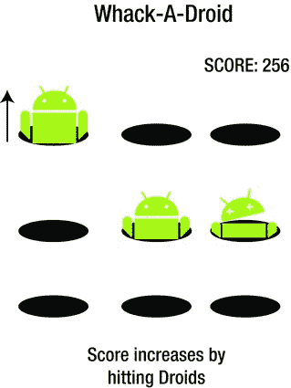
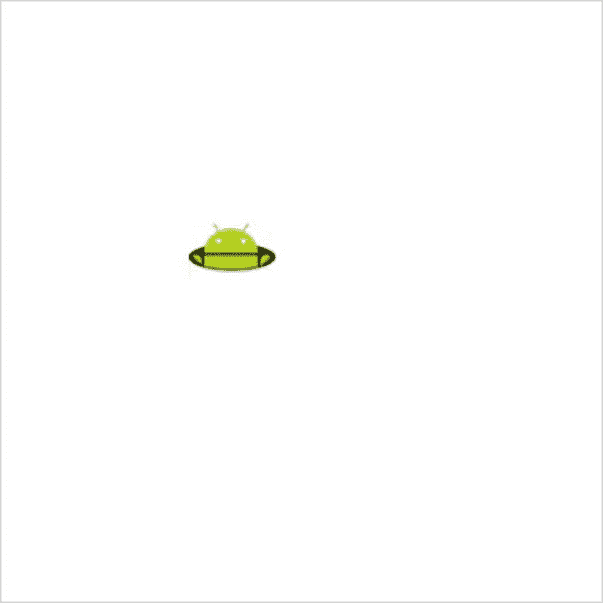
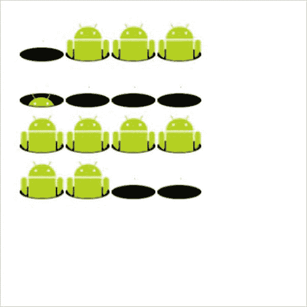

# 五、游戏设计

到目前为止，我们已经专注于 JavaScript 和 enchant.js 的基础知识，包括您必须用来编写代码以利用 enchant.js 的许多功能的特定格式。这些基础知识包括精灵、标签、场景、地图、如何在`9leap.net`上上传和共享您的游戏，等等。然而，这并不是一个好的游戏开发商所能做到的！

如果你一头扎进去，试图在没有任何参考资料的情况下，仅仅使用我们之前在本书中提到的内容，从头开始构建你自己的游戏，你将会遇到问题。很多问题。为了使整个过程对你来说更容易，我们在这一章中提供了一些关于从头开始设计和开发游戏的背景。

强大的能力(或者说功能)意味着巨大的责任，作为一名游戏开发者，你对你的玩家有责任。enchant.js 引擎是开发游戏的强大工具。但它的最终目的是什么？当然是为了给玩家带来快乐！好玩是游戏的重点。你的玩家是与你的游戏互动的人，如果他们不喜欢这种体验，他们就没有动力玩你花时间开发的游戏。

这一章特别介绍了构建原创游戏的创作过程。它充满了如何使这个过程变得简单的提示。它也给你一些提示，告诉你如何设计你的游戏来吸引和娱乐你的玩家。我们涵盖了一个游戏应该经历的开发周期:从构思，到编码，最后到改进游戏成品。

迷你游戏开发的牢不可破的规则

在用 enchant.js 制作游戏时，有几个“牢不可破”的规则是你应该遵守的，用该库开发的大多数游戏都是迷你游戏。迷你游戏是小规模的游戏，其特点是游戏时间短，关卡之间的进展简单。

通常，它们只需要一到三个人来开发，有时不到一个小时就可以完成。虽然有些是在几天内开发出来的，但是你不应该在一个游戏上花太多的钱。不断尝试，不要担心失败。你犯的错误越多，从中吸取的教训越多，你的技能就会提高得越多。

不要试图制作史诗游戏

如果你试图从一开始就制作一个史诗游戏，你肯定会失败。从制作一个适合你技能的小而简单的游戏开始，然后逐渐扩展它的功能。事实上，之前大部分财务上成功的游戏，并不是以打造一款史诗级游戏为目标开始的。如果你仔细看看那些游戏，你会发现它们都是由极其简单的组件组成的，尽管数量很多。

在一个完整的简单游戏中，存在许多阶段，每个阶段都通过一个故事连接到另一个阶段。从一开始规则就很复杂的游戏很少见。

不要试图做一个完全原创的游戏

重要的是，当你制定游戏规则时，不要试图实现 100%的原创性。游戏已经以这样或那样的形式发展了很长时间。许多初学者开始渴望做一些没有人见过的东西，但他们冒着创造一些事实上没有人喜欢的东西的风险。试着想象一种没人尝过或听说过的食物。现在想象一下吃这样一种食物，由一个从来没有做过饭的人准备的。一个可怕的想法，不是吗？

它可能完全是一种幸运的美味，但是美食通常不会偏离我们习惯听到的描述它们的形容词:甜、辣、多汁、丰盛等等。当然，一个大师级的厨师会用新的和创新的方式来处理这些味道，但是你不会看到那些刚刚开始学习烹饪艺术的人一头扎进烹饪科学的实验中。

创新很重要，但是如果味道很糟糕，那就不值得了。考虑花生酱和果冻。将两种熟悉的味道结合成新的东西比尝试烹饪完全闻所未闻的东西要好。游戏也一样。不要一开始就以原创为目标。结合熟悉的主题和规则，然后逐渐开始创造你自己独特的转折。

玩家要在十秒钟内掌握游戏

人们很容易被有许多规则的复杂游戏吓倒。在一个完美的游戏中，玩家本能地掌握游戏如何运作，并在开始玩的那一刻就被吸引住了。你要让玩家觉得“这很好玩！”在十秒或更短的时间内。不要指望你的球员有耐心。从他们开始玩游戏的那一刻起，他们就应该尽可能多地了解这个游戏及其吸引力。

如果你的游戏有多个关卡或者比一个标准的迷你游戏更复杂，可以考虑在游戏的开头增加一个可选的教程关卡。教程等级是教你的玩家如何玩的好方法，同时保持动手的感觉。

不要太沉迷于编程

编程本身就很有趣，一些游戏拥有迷人的结构。也就是说，人们很容易过度关注编程，而忽略了游戏的本质。请记住，你的最终目标是创造一些很多人会玩的东西。把你的注意力放在让游戏有趣上，而不是复杂的编程上。

遇到麻烦时，就去“时间攻击”

在大多数游戏中，你可以简单地通过增加时间限制(时间攻击)来增加赌注和乐趣。例如，在 9leap ( `http://9leap.net/games/4`)发布的“高速黑白棋”中，一个简单的黑白棋(奥赛罗)游戏通过获得时间限制获得了新的生命。这是一场慢节奏的战略游戏，极大地增加了赌注和难度。

不要纠结于失去了什么

对于游戏开发者来说，时间和资源短缺是很典型的，即使一个大型游戏是由一家大公司开发的。无限的开发时间和资源几乎是不可能的。当你开始为缺乏时间和资源而烦恼的时候，你的游戏进程就停止了。相反，专注于在时间和资源允许的情况下做出最好的游戏。

让别人开心

创造一个游戏的全部意义在于为他人创造一些乐趣。如果你费尽心思做了一个游戏，不要纠结于有多少人下载它或者它有多精英。试着用你的游戏带给你的朋友和家人一个微笑。

游戏开发流程

游戏无疑有多种形式，当你计划在 enchant.js 中制作自己的游戏时，研究一些不同类型的游戏总是一个好主意，例如 Fruits Panic(在`9leap.net/games/90`的一种动作益智游戏)或 Golf Solitaire(在`9leap.net/games/2994`的一种纸牌游戏)来获得灵感。

然而，一旦你决定了你感兴趣的游戏类型，如果你没有一个路线图来指引你正确的方向，你如何着手实际创建它会是一个混乱的过程。下面的列表显示了开发你自己的游戏的六个步骤。请注意，游戏设计是一个非常大的话题，有许多不同的观点。因为用 enchant.js 创建的大多数游戏都很简单，所以这里列出的开发过程可能不同于更复杂的方法。

1.  设计游戏规则。
    *   a.当你刚开始玩你的第一个游戏时，独自从头开始创建所有的规则可能会有点混乱。例如，如果你正在设计一个像“方块断路器”这样的游戏，你需要决定球在撞击方块和撞击球拍时将如何改变方向，决定所有的电源、球的速度、球加速的速率等等。在这种情况下，看看别人是如何为自己的游戏实现规则并模仿他们的技术是一个非常好的主意。在这个过程中，你应该作为模型使用的游戏是你觉得自己能够制作的游戏。把你的想法写在纸上，如果可以的话，甚至模拟一些动作。如果你还不知道所有的细节，不要担心。不要过度。
2.  选择一个主题并准备精灵。
    *   a.选择一个你想做的游戏的大致想法。花一分钟想象你的游戏。会是赛车吗？宇宙飞船与外星人战斗？之后，玩家会对什么念念不忘？你已经决定了你的游戏规则，所以想一个能最大化玩家潜力的主题可能是个好主意。你还应该评估你的艺术，声音和故事资产，以配合主题。你将如何创造或获得它们？
3.  给游戏编程。
    *   a.你已经选好了你的主题和规则，现在是时候根据它们来编写游戏代码了。根据你的主题，在此之前你可能需要准备一些基本的图片、声音或故事。
4.  自己玩吧。
    *   a.一旦你的游戏版本被编程，你必须亲自尝试一下。无论你多么仔细地制定游戏规则，如果你不真正测试游戏，你就会错过规则中的问题。你不仅仅是测试你的游戏是否遵循你已经建立的规则。你也在反复测试平衡，看看游戏是太难，太容易，还是太难控制。如果可以的话，寻求他人的帮助。玩这个游戏的人越多，给你的反馈越多，你就越能学会如何让它变得更有趣。
5.  完善您的规则并返回到步骤 3。
    *   a.在对你的游戏做了一点测试后，重新检查你的规则，看看如何改进它们，修改你的代码来实现改进，然后再玩你的游戏。根据需要重复这个公式。游戏的最终趣味水平将会因你的细心程度而大相径庭。如果你对自己提出的内容感到满意，增加更多的关卡可能是个好主意。
6.  完成游戏。
    *   a.这里是您添加最后润色的地方。比如制作标题画面，添加高分排名表，细化游戏外观等。

如果你已经有了一个你想做的游戏的想法，请随意交换第一步和第二步。首先选择一个主题，然后制定相应的规则，这可能会很有趣。

在实际的游戏开发中，这个过程要复杂得多，并且根据制作过程的不同而不同。然而，由于 enchant.js 提供的功能，开发周期缩短到这样一个程度:与不使用该库相比，您可以更快地重复这个游戏开发周期。

试着想出一个你想开发的游戏。在接下来的部分中，我们将一步一步地介绍开发过程，从头到尾制作一个完整的示例游戏。当我们经历这个过程时，试着找到利用这个过程来开发你自己的游戏的方法。

设计游戏规则

实际上，你可以通过决定游戏规则或者游戏主题来开始设计你的游戏。然而，如果你是游戏开发的初学者，我们建议你首先规划规则，因为执行游戏规则是游戏编程新手的最大障碍。

你可能会想，“你是怎么想出游戏规则的？”好吧，说白了，你先看看外面已经有什么了。挑出与你的概念相似，与你的技能水平相匹配的东西。在短暂但丰富的电脑游戏历史中，你会发现游戏中的每一条规则都被反复实验、润色，并转化为现有的游戏。就像在武术中一样，游戏有一些预先定义好的风格和技巧。在这一点上不要担心创新。

考虑从`9leap.net`下载一个开源游戏，然后重组源代码，或者检查源代码，并将其作为在自己的游戏中实现类似规则的灵感。不要因为从现有游戏中借用游戏的核心规则而感到难过。即使你一开始就这样做，通过一点一点地给游戏添加新元素，你作为游戏设计师的个性和个性就会开始显现。

打地鼠、射击游戏、基于对话的角色扮演游戏(RPG)和解谜游戏是初学者模仿的一些流行类型。如果你打算专门为智能手机制作一款游戏，我们建议你从拼图或打地鼠游戏开始。

在下面的章节中，我们使用打地鼠作为创建新游戏的基础。如果你碰巧不熟悉，打地鼠是一种游戏，目标是当鼹鼠出现在他们的洞里时击中它们。这是一个简单的游戏，适合初学者。

首先，请访问`http://code.9leap.net/codes/show/23694`并玩游戏。简要地看一下代码来熟悉它，但是您现在还不需要复制任何东西。

挑选一个主题

一个真正的打地鼠游戏使用一只鼹鼠的图像。然而，让我们使用一个机器人(Android)角色的图像来代替鼹鼠。Droid 图像是在知识共享许可下授权的，所以我们可以随意使用它。

因此，对于这个游戏，我们将制作一个重击机器人游戏，而不是重击鼹鼠游戏。正如你所看到的，在选择了你的规则之后，选择一个主题是绝对没有错的。重要的是从简单的事情开始。

当然，如果你喜欢画画，你可以画一颗痣或者别的什么东西(甚至是某个人)来让自己变得疲惫不堪。仅仅通过改变你的主题，游戏本身的本质就可以发生巨大的变化。即使游戏的逻辑保持不变，通过改变一个小的视觉方面，整个游戏体验可以发生巨大的变化。

选择主题后，在纸上画出游戏的样子。不一定要画得好。当你把游戏的元素写在纸上时，它可以帮助你理解创建游戏所需的步骤。图 5-1 显示了我们的重击机器人游戏的草图。



[图 5-1](#_Fig1) 。素描你的游戏

草图显示了一个 3×3 的网格，机器人将从这些网格中出现。随着时间的推移，多个机器人会从洞里出现，当玩家点击它们时，它们会做鬼脸，然后又掉回洞里。每成功击中一次，玩家的分数就会增加。在特定时间或特定数量的机器人出现后，游戏将结束。

当你进入编码阶段时，偏离这个草图并提供一个解释是非常好的，但是把一些东西写在纸上给你一个工作的起点。在此之后，如果有必要，您可以继续创建您的图像。

为了制作 Droid 的图像文件([图 5-2](#Fig2) )，我们使用了免费的开源图像编辑程序 GIMP for Mac，可以从`www.gimp.org`下载。但是，您可以使用任何图像编辑程序来创建 sprite 工作表。


[图 5-2](#_Fig2) 。机器人角色【mogura.png】精灵表

在这个 sprite 工作表中，六帧 48x48 像素的图像从左到右排列在一起(每个洞的图像构成一帧)，然后在我们用`Sprite(48,48)`创建 sprite 时使用。这与该图像中一帧的大小(48x48 像素)相一致。在第一帧中，机器人的脸还没有出现，在接下来的四帧动画中，他慢慢地出现，直到最后一帧显示他被重击。

如果你正在使用 GIMP，你可以做以下事情来创建一个非常简单的 sprite 工作表，如图 5-2 所示:

1.  单独下载或绘制 sprite 工作表的组件。
2.  创建一帧大小的新图像。
3.  将 sprite 工作表的组件粘贴到图像中。
4.  将图像另存为 PNG 格式的单独文件，以保持透明度。
5.  编辑图像以创建下一帧，并将其另存为新图像。
6.  重复此过程，直到您创建了所有需要的框架。
7.  使用 GIMP 附带的融合图层脚本合并所有图像。你可以在`http://imagine.kicbak.com/blog/?p=114`找到使用融合层脚本的说明。
8.  将图像保存为新的 PNG 文件。

每帧之间的差异很重要。如果你的帧完全不同，那么动画会看起来像机器人或者不存在。在我们的 Droid 游戏中，如果一帧中有一个空洞，而下一帧中的 Droid 完全在洞外，那么当游戏运行并在两帧之间快速切换时，将不会有动画。机器人会突然出现。然而，如果有 30 帧，Droid 每次向上移动很小的量，这将不会有效地使用您的文件，并且需要更多的工作来编程。这里没有你应该制作的具体帧数。最好使用它来找出什么看起来最好，同时不要使用太多的框架。

给游戏编程

一旦你决定了游戏的规则和主题，就该进入编程阶段了。当你到了这一步，开始编程最简单的方法就是尽可能地创建你的游戏的最简单的版本。这个版本不一定需要是工作版，也绝对不需要具备前瞻游戏的所有特性。

创建最简单的版本

打地鼠游戏最简单的版本是一个显示一个洞的程序。因为最终会有不止一个洞，所以我们应该首先为洞创建一个类。执行以下操作来创建该类:

1.  在`http://code.9leap.net/codes/show/28286`处分叉空白项目模板。这个模板不包含游戏代码，但是包含了你需要的精灵图片。
2.  Initialize the enchant library and define a class for holes by typing in the code in [Listing 5-1](#list1) into your project. This will run all the code inside it whenever a `Pit` object (hole) is created.

    [***清单 5-1。***](#_list1) 定义坑类

    ```js
    enchant();

    Pit = Class.create(Sprite,{
         initialize:function(x,y){
              //Call the Sprite class (super class) constructor
              enchant.Sprite.call(this,48,48);
              this.image = game.assets[’mogura.png’];
              this.x = x;
              this.y = y;
         }
    });
    ```

3.  Create a single hole on the screen by adding the code in [Listing 5-2](#list2) under the code you just entered.

    [***清单 5-2。***](#_list2) 在屏幕上创建一个孔

    ```js
    window.onload = function(){
         game = new Game(320, 320);
         //Load Droid image
         game.preload(’mogura.png’);
         game.onload = function(){
              var pit = new Pit(100,100);
              game.rootScene.addChild(pit);
        }
        game.start();
    }
    ```

4.  Click Run. A hole is displayed, as shown in [Figure 5-3](#Fig3). The `Pit` class we created extends the enchant.js `Sprite` class, and therefore can be used in the same way as `Sprite`. If you encounter problems, you can see the result of this step on `code.9leap.net` (`http://code.9leap.net/codes/show/23728`).

    

    [图 5-3](#_Fig3) 。简单打地鼠程序的结果

让机器人出现

下一步是修改我们的`Pit`类，使 Droid 出现。代码中唯一改变的部分是`Pit`类，所以我们将只展示这一部分。执行以下操作来更改该类:

1.  Modify the `Pit` class to change to the next frame of the Droid if the current frame is one of the first four by modifying the `Pit` class to match [Listing 5-3](#list3). This loops the animation of the Droid appearing over and over again, but it is the groundwork for the next few steps. In this and all future code listings in the chapter, changes from the previous code are in boldface.

    [***清单 5-3。***](#_list3) 更新了坑类

    ```js
    Pit = Class.create(Sprite,{
         initialize:function(x,y){
              //Call the Sprite class (super class) constructor
              enchant.Sprite.call(this,48,48);
              this.image = game.assets[’mogura.png’];
              this.x = x;
              this.y = y;
              //Defines an event listener to run every frame
              this.addEventListener(’enterframe’,this.tick);
         },
         tick:function(){
              this.frame++;
              //Loop the animation once complete
              if(this.frame>=4)this.frame=0;
         }
    });
    ```

2.  Click Run. The Droid repeatedly appears out of the hole, as shown in [Figure 5-4](#Fig4). If you encounter problems, you can check the result of this step on `code.9leap.net` (`http://code.9leap.net/codes/edit/23729`).

    

    [图 5-4](#_Fig4) 。打地鼠更新了动画

调整动画速度

我们制作了一个动画，展示我们的小机器人从他的洞里快速出现。然而，他移动得太快了以至于不能击中他，所以我们需要让他慢一点。目前，在机器人精灵的第四帧之后，我们立即返回到第 0 帧。这突然回到他的洞感觉不自然。让我们重写它，这样一旦我们进行到第四帧，我们就返回到 0。执行以下操作进行这些更改:

1.  Add a variable `mode` to the `Pit` class. Use it to define how the Droid should behave with respect to animation by modifying the `Pit` class to match [Listing 5-4](#list4).

    [***清单 5-4。***](#_list4) 制作坑类动画

    ```js
    Pit = Class.create(Sprite,{
         initialize:function(x,y){
              //Call the Sprite class (super class) constructor
              enchant.Sprite.call(this,48,48);
              this.image = game.assets[’mogura.png’];
              this.x = x;
              this.y = y;
              //Defines an event listener to run every frame
              this.addEventListener(’enterframe’,this.tick);
              //Keeps track of the state of the Droid
              this.mode = 0;
         },
         tick:function(){
              //only change the frame every other frame
              //the return call ends the function
              if(game.frame%2!=0)return;
              switch(this.mode){
                   //Droid is appearing from the hole
                   case 0:
                        this.frame++;
                        //change mode after completely appearing
                        if(this.frame>=4) this.mode=1;
                        break;
                   //Droid is hiding in the hole
                   case 1:
                        this.frame--;
                        //change mode after completely hiding
                        if(this.frame<=0) this.mode=0;
                        break;
              }
         }
    });
    ```

如果模式设置为`0`，这将代表机器人正在出现，但尚未完全出现，那么机器人将前进通过前四帧，然后将其模式更改为`1`。模式`1`代表躲在洞里的机器人，并使机器人颠倒它出现时使用的帧的顺序。最终的结果是，机器人会反复出现，然后消失。

我们的动画也变得更干净了。我们已经更改了代码，因此基于一个`if`语句，帧处理每两帧发生一次，而不是每一帧，这使它变得更好更平滑。此外，我们还添加了一个名为`mode`的新属性，具有模式`0`(出现)和模式`1`(隐藏中)，并且我们已经基于该属性执行了一个切换来执行相应的处理。如果遇到问题，可以在`code.9leap.net` ( `http://code.9leap.net/codes/show/23730`)上查看这一步的结果。

让机器人随机出现

用我们现在的代码，如果我们复制这个洞，所有的机器人会同时出现。我们需要让机器人出现的时间随机。目前我们只有模式`0`(显示)和模式`1`(隐藏)，所以我们需要添加一个模式，在两者之间等待一段随机的时间，方法如下:

1.  Upgrade the `Pit` class to cause random time to elapse between appearing and disappearing by replaying the `Pit` class with the code shown in [Listing 5-5](#list5).

    [***清单 5-5。***](#_list5) 升级坑类

    ```js
    //function to generate random numbers
     rand = function(n){
         return Math.floor(Math.random()*n);
    }

    //Define a class for holes
    Pit = Class.create(Sprite,{
         initialize:function(x,y){
              //Call the Sprite class (super class) constructor
              enchant.Sprite.call(this,48,48);
              this.image = game.assets[’mogura.png’];
              this.x = x;
              this.y = y;
              //Defines an event listener to run every frame
              this.addEventListener(’enterframe’,this.tick);
              //Set the Droid mode to 2 (waiting) in the beginning.
              this.mode = 2;
              //Set the next mode as 0 (appearing)
              this.nextMode = 0;
              //wait for a random number (0-99) of frames
              this.waitFor =  game.frame+rand(100);
         },
         tick:function(){
              //only change the frame every other frame
              //the return call ends the function
              if(game.frame%2!=0)return;
              switch(this.mode){
                   //Droid is appearing from the hole
                   case 0:
                        this.frame++;
                        if(this.frame>=4) {
                        //switch to Mode 2 (waiting) after appearing
                            this.mode=2;
                        //the mode to go to after Mode 2 is Mode 1 (hide)
                        this.nextMode=1;
                        //Set a random waiting time for 0 ∼ 99 frames
                        this.waitFor = game.frame+rand(100);
                                    }
                        break;
                   //Droid is going to hide in the hole
                   case 1:
                        this.frame--;
                        //if Droid is hidden...
                        if(this.frame<=0){
                             //Switch to Mode 2 (waiting)
                             this.mode=2;
                             //The next mode should be Mode 0 (appear)
                             this.nextMode=0;
                             //Set a random waiting time for 0 ∼ 99 frames
                             this.waitFor = game.frame+rand(100);
                        }
                        break;
                   //Droid is waiting
                   case 2:
                        //if the game’s current frame is greater than
                        //the set frame to wait for...
                        if(game.frame>this.waitFor){
                             //Make a transition to the next mode
                             this.mode = this.nextMode;
                        }
                        break;
              }
         }
    });
    ```

我们增加了一个名为`rand()`的函数来生成随机数，还创建了一个新的`mode`，模式`2`(等待)。

游戏开始后经过的帧数存储在`game.frame`中。当`waitFor`中设置的帧数过去后，我们转换到下一个模式。通过在模式`0`(出现)和模式`1`(隐藏)之间插入这个，机器人出现和消失之间的时间可以被随机化。

如果有任何问题，请检查`http://code.9leap.net/codes/show/23731`处的代码。

实现机器人重击

到目前为止，我们已经将我们的机器人朋友设置为随机出现和消失。现在让我们创建当玩家点击他时的处理。对于所谓的“疲惫的”事件，我们使用一个`touchstart`事件监听器(事件监听器在[第 2 章](2.html)中介绍)。执行以下操作来实现它:

1.  Modify the `Pit` class by adding the bold sections of code shown in [Listing 5-6](#list6).

    [***清单 5-6。***](#_list6) 实现“疲惫不堪”的状态

    ```js
    //Define a class for holes
    Pit = Class.create(Sprite,{
         initialize:function(x,y){
              //Call the Sprite class (super class) constructor
              enchant.Sprite.call(this,48,48);
              this.image = game.assets[’mogura.png’];
              this.x = x;
              this.y = y;
              //Defines an event listener to run every frame
              this.addEventListener(’enterframe’,this.tick);
              //Defines an event listener for when the Droid gets whacked
              this.addEventListener(’touchstart’,this.hit);
              //Set the Droid mode to 2 (waiting) in the beginning.
              this.mode = 2;
              //Set the next mode as 0 (appearing)
              this.nextMode = 0;
              //wait for a random number (0-99) of frames
              this.waitFor =  game.frame+rand(100);
         },
         tick:function(){
              //only change the frame every other frame
              //the return call ends the function
              if(game.frame%2!=0)return;
              switch(this.mode){
                   //Droid is appearing from the hole
                   case 0:
                        this.frame++;
                        if(this.frame>=4) {
                        //switch to Mode 2 (waiting) after appearing
                            this.mode=2;
                        //the mode to go to after Mode 2 is Mode 1 (hide)
                        this.nextMode=1;
                        //Set a random waiting time for 0 ∼ 99 frames
                        this.waitFor = game.frame+rand(100);
                                    }
                        break;
                   //Droid is going to hide in the hole
                   case 1:
                        this.frame--;
                        //if Droid is hidden...
                        if(this.frame<=0){
                             //Switch to Mode 2 (waiting)
                             this.mode=2;
                             //The next mode should be Mode 0 (appear)
                             this.nextMode=0;
                             //Set a random waiting time for 0 ∼ 99 frames
                             this.waitFor = game.frame+rand(100);
                        }
                        break;
                   //Droid is waiting
                   case 2:
                        //if the game’s current frame is greater than
                        //the set frame to wait for...
                        if(game.frame>this.waitFor){
                             //Make a transition to the next mode
                             this.mode = this.nextMode;
                        }
                        break;
              }
         },
         //Whack Droid
         hit:function(){
              //only when Droid has appeared at least half-way
              if(this.frame>=2){
                   //Droid after being whacked
                   this.frame=5;
                   //Switch to waiting mode
                   this.mode=2;
                   this.nextMode=1;
                   //Number of frames to wait is fixed at 10
                   this.waitFor = game.frame+10;
              }
         }
    });
    ```

请注意我们刚刚添加的新功能`hit`。如果你在机器人至少半张脸出现时点击它，重击动画将会播放。

疲惫不堪的 Droid 帧显示了十帧后，Droid 再次转换到模式`1`(隐藏)。以这种方式实现其他功能时切换状态的程序被称为*状态机*。

如果您在自己的代码中遇到意外行为，您可以在`http://code.9leap.net/codes/show/23739`检查这一步的结果。

我们现在已经创造了打地鼠游戏的基本要素，在这个游戏中，你要对抗我们的机器人朋友。然而，我们仍然有一个问题。如果你持续不断地击打机器人，他的脸就会卡在疲劳状态。

防止机器人连续重击

我们需要确保一旦机器人被击垮，我们不能再打他，让他保持被击垮的状态。为此，让我们通过执行以下操作向我们的`Pit`类添加一个新属性:

1.  Update the `Pit` class by adding the bold sections from [Listing 5-7](#list7).

    [***清单 5-7。***](#_list7) 防打圈动画

    ```js
    //Define a class for holes
    Pit = Class.create(Sprite,{
         initialize:function(x,y){
              //Call the Sprite class (super class) constructor
              enchant.Sprite.call(this,48,48);
              this.image = game.assets[’mogura.png’];
              this.x = x;
              this.y = y;
              //Defines an event listener to run every frame
              this.addEventListener(’enterframe’,this.tick);
              //Defines an event listener for when the Droid gets whacked
              this.addEventListener(’touchstart’,this.hit);
              //Set the Droid mode to 2 (waiting) in the beginning.
              this.mode = 2;
              //Set the next mode as 0 (appearing)
              this.nextMode = 0;
              //wait for a random number (0-99) of frames
              this.waitFor =  game.frame+rand(100);
              //stores info on whether or not the Droid
              //has already been whacked
              this.currentlyWhacked = false;
         },
         tick:function(){
              //only change the frame every other frame
              //the return call ends the function
              if(game.frame%2!=0)return;
              switch(this.mode){
                   //Droid is appearing from the hole
                   case 0:
                        this.frame++;
                        if(this.frame>=4) {
                        //switch to Mode 2 (waiting) after appearing
                        this.mode=2;
                        //the mode to go to after Mode 2 is Mode 1 (hide)
                        this.nextMode=1;
                        //Set a random waiting time for 0 ∼ 99 frames
                        this.waitFor = game.frame+rand(100);
                             }
                        break;
                   //Droid is going to hide in the hole
                   case 1:
                        this.frame--;
                        //if Droid is hidden...
                        if(this.frame<=0){
                             //Switch to Mode 2 (waiting)
                             this.mode=2;
                             //The next mode should be Mode 0 (appear)
                             this.nextMode=0;
                             //Set a random waiting time for 0 ∼ 99 frames
                             this.waitFor = game.frame+rand(100);
                             //reset flag as the whacked Droid disappears
                             this.currentlyWhacked = false;
                        }
                        break;
                   //Droid is waiting
                   case 2:
                        //if the game’s current frame is greater than
                        //the set frame to wait for...
                        if(game.frame>this.waitFor){
                             //Make a transition to the next mode
                             this.mode = this.nextMode;
                        }
                        break;
              }
         },
         //Whack Droid
         hit:function(){
              //Do nothing if the Droid has already been whacked
              if(this.currentlyWhacked)return;
              //only when Droid has appeared at least half-way
              if(this.frame>=2){
                   //Set the flag so we know he’s been whacked
                   this.currentlyWhacked = true;
                   //Droid after being whacked
                   this.frame=5;
                   //Switch to waiting mode
                   this.mode=2;
                   this.nextMode=1;
                   //Number of frames to wait is fixed at 10
                   this.waitFor = game.frame+10;
              }
         }
    });
    ```

在这里，我们添加了`currentlyWhacked`属性，这是一个标志，表示机器人是否被攻击。当 Droid 被创建时，这个属性被设置为`false`。每当一个机器人被重击，这个属性被设置为`true`，并开始隐藏动画序列。机器人消失后，这个标志被设置为`false`，因为一个新的机器人将从洞里出来。这样，我们就避免了机器人被连续攻击的情况。

如果您在编写与这个示例匹配的代码时遇到问题，您可以在`http://code.9leap.net/codes/show/23740`检查代码。

复制孔

我们几乎已经完成了只有一个洞的重击机器人游戏的基础。你可能会想，“为什么我们要大费周章只挖一个洞？”通过像我们所做的那样创建一个类，我们可以在眨眼之间完成我们的游戏。执行以下操作复制孔:

1.  Modify the `game.onload` function by editing it to match [Listing 5-8](#list8).

    [***清单 5-8。***](#_list8) 复制机器人孔

    ```js
    game.onload = function(){
              //Line up holes in a 4x4 matrix
              for(var y=0;y<4;y++){
                   for(var x=0;x<4;x++){
                        var pit = new Pit(x*48+20,y*48+20);
                        game.rootScene.addChild(pit);
                   }
              }
    }
    ```

2.  Click Run. A line of Droids appears, as shown in [Figure 5-5](#Fig5).

    

    [图 5-5](#_Fig5) 。创建 Pit 类的多个实例

就像这样，我们有一个打地鼠游戏！如您所见，使用类可以节省大量时间。

因为我们将在接下来的步骤中进一步完善我们的游戏，请确保到目前为止您所做的一切都已成功完成。到目前为止的代码可以从`http://code.9leap.net/codes/show/23741`开始检查和分叉。

随机排列孔洞

开发游戏时，尝试不同的方法会很有帮助。例如，为了检查它将如何影响游戏，您可能想尝试让我们的重击机器人游戏中的洞随机出现在屏幕上，而不是排成 4x4 的网格。你可以在[清单 5-9](#list9) 和[图 5-6](#Fig6) 中看到实现这一点的变化。

[***清单 5-9。***](#_list9) 随意放置孔洞

```js
game.onload = function(){
     for(var i=0;i<7;i++){
          //Place pits randomly
          var pit = new Pit(rand(300),rand(300));
          game.rootScene.addChild(pit);
     }
}
```


[图 5-6](#_Fig6) 。随机放置孔

因为洞的位置是随机的，所以每次你重新载入游戏时它们都会改变。不管这些孔在哪里结束，它们的工作方式完全相同，因为它们是由`Pit`类定义的。

现在是有趣的部分了。根据球洞的最终位置，比赛的本质将会改变。发挥你的创造力，尝试创造自己的原创球洞布置。你现在已经完成了你的第一个游戏原型！

播放、重复、完成

一旦你有了一个工作原型，下一步就是玩这个原型，并注意游戏中任何需要改进或添加的部分。

如果你玩几次我们完成的“重击机器人”游戏，你会发现少了两样重要的东西:一个分数和机器人出现次数的限制。

如果你试着让游戏的球洞变得随机，对于下面的例子，重置你的`game.onload`函数回到清单 5-8 中显示的。

显示分数

让我们从显示分数开始:

1.  Create the `ScoreLabel` class by adding the code shown in [Listing 5-10](#list10) above the line of code starting with `window.onload`.

    [***清单 5-10。***](#_list10) ScoreLabel Class

    ```js
    //ScoreLabel class definition, extending Label class
    ScoreLabel = Class.create(Label,{
         initialize:function(x,y){
              //Call the Label class constructor
              enchant.Label.call(this,"SCORE:0");
              this.x=x;
              this.y=y;
              this.score = 0;
         },
         //Adds points to the score
         add:function(pts){
              this.score+=pts;
              //Change the displayed score
              this.text="SCORE:"+this.score;
         }
    });
    ```

2.  Create a new instance of the `ScoreLabel` class by adding a new instance of the `ScoreLabel` class, as shown in [Listing 5-11](#list11).

    [***清单 5-11。***](#_list11) 创建 ScoreLabel

    ```js
    game.onload = function(){

         //Display ScoreLabel
         scoreLabel=new ScoreLabel(5,5);
         game.rootScene.addChild(scoreLabel);

         //Line up holes in a 4x4 matrix
         for(var y=0;y<4;y++){
              for(var x=0;x<4;x++){
                   var pit = new Pit(x*48+20,y*48+20);
                   game.rootScene.addChild(pit);
              }
         }
    }
    ```

3.  Add code to increase the score whenever a Droid gets hit by adding the bold sections from [Listing 5-12](#list12) to the `hit` function.

    [***清单 5-12。***](#_list12) 增加命中分数

    ```js
    //Whack Droid
    hit:function(){
         //Do nothing if the Droid has already been whacked
         if(this.currentlyWhacked)return;
         //only when Droid has appeared at least half-way
         if(this.frame>=2){
              //Set the flag so we know he’s been whacked
              this.currentlyWhacked = true;
              //Droid after being whacked
              this.frame=5;
              //Switch to waiting mode
              this.mode=2;
              this.nextMode=1;
              //Number of frames to wait is fixed at 10
              this.waitFor = game.frame+10;
              //Add score
              scoreLabel.add(1);
         }
    }
    ```

4.  Click Run. A score appears in the upper-left side of the screen and increases by one whenever a player whacks a Droid.

    如果您在添加这段代码时遇到问题，请查看位于`http://code.9leap.net/codes/show/23777`的示例代码。

限制机器人的出现

既然我们已经增加了一个分数，事情看起来就要结束了。然而，我们的机器人出现得太频繁了，以至于只要快速击中同一个点就可以获得高分。有取之不尽的机器人供应，剥夺了玩家富有挑战性的游戏体验。

让我们改变游戏，让我们的机器人只出现 30 次。以这种方式改变会迫使玩家在机器人出现的 30 次中获得尽可能多的命中。为此，请执行以下操作:

1.  Create a variable for the total number of Droids and the maximum number of appearances for a Droid, and then implement them by copying in the bold sections from [Listing 5-13](#list13).

    [***清单 5-13。***](#_list13) 限制机器人外观

    ```js
    enchant();
    //function to generate random numbers
    rand = function(n){
         return Math.floor(Math.random()*n);
    }

    //Number of appearances of the Droid

    maxDroid = 30;

    //Total number of Droids

    totalDroid = 16;

    //Define a class for holes
    Pit = Class.create(Sprite,{
         initialize:function(x,y){
              //Call the Sprite class (super class) constructor
              enchant.Sprite.call(this,48,48);
              this.image = game.assets[’mogura.png’];
              this.x = x;
              this.y = y;
              //Defines an event listener to run every frame
              this.addEventListener(’enterframe’,this.tick);
              //Defines an event listener for when the Droid gets whacked
              this.addEventListener(’touchstart’,this.hit);
              //Set the Droid mode to 2 (waiting) in the beginning.
              this.mode = 2;
              //Set the next mode as 0 (appearing)
              this.nextMode = 0;
              //wait for a random number (0-99) of frames
              this.waitFor =  game.frame+rand(100);
              //stores info on whether or not the Droid
              //has already been whacked
              this.currentlyWhacked = false;
         },
         tick:function(){
              //only change the frame every other frame
              //the return call ends the function
              if(game.frame%2!=0)return;
              switch(this.mode){
                   //Droid is appearing from the hole
                   case 0:
                        this.frame++;
                        if(this.frame>=4) {
                        //switch to Mode 2 (waiting) after appearing
                        this.mode=2;
                        //the mode to go to after Mode 2 is Mode 1 (hide)
                        this.nextMode=1;
                        //Set a random waiting time for 0 ∼ 99 frames
                        this.waitFor = game.frame+rand(100);
                             }
                        break;
                   //Droid is going to hide in the hole
                   case 1:
                        this.frame--;
                        //if Droid is hidden...
                        if(this.frame<=0){
                             //Switch to Mode 2 (waiting)
                             this.mode=2;
                             //The next mode should be Mode 0 (appear)
                             this.nextMode=0;
                             //Set a random waiting time for 0 ∼ 99 frames
                             this.waitFor = game.frame+rand(100);
                             //reset flag as the whacked Droid disappears
                             this.currentlyWhacked = false;

                             //Reduce maximum amount of Droids
                             maxDroid--;
                             //If the amount is exceeded the Droid should not appear
                            if(maxDroid<=0) {
                                this.mode=3;
                                if(maxDroid <= -1*totalDroid + 1) {
                                    game.end(scoreLabel.score, scoreLabel.text);
                                }
                            }
                        }
                        break;
                   //Droid is waiting
                   case 2:
                        //if the game’s current frame is greater than
                        //the set frame to wait for...
                        if(game.frame>this.waitFor){
                             //Make a transition to the next mode
                             this.mode = this.nextMode;
                        }
                        break;
              }
         },
         //Whack Droid
         hit:function(){
              //Do nothing if the Droid has already been whacked
              if(this.currentlyWhacked)return;
              //only when Droid has appeared at least half-way
              if(this.frame>=2){
                   //Set the flag so we know he’s been whacked
                   this.currentlyWhacked = true;
                   //Droid after being whacked
                   this.frame=5;
                   //Switch to waiting mode
                   this.mode=2;
                   this.nextMode=1;
                   //Number of frames to wait is fixed at 10
                   this.waitFor = game.frame+10;
                   //Add score
                   scoreLabel.add(1);
              }
         }
    });

    //ScoreLabel class definition, extending Label class
    ScoreLabel = Class.create(Label,{
         initialize:function(x,y){
              //Call the Label class constructor
              enchant.Label.call(this,"SCORE:0");
              this.x=x;
              this.y=y;
              this.score = 0;
         },
         //Adds points to the score
         add:function(pts){
              this.score+=pts;
              //Change the displayed score
              this.text="SCORE:"+this.score;
         }
    });

    //Initialization
    window.onload = function(){
         game = new Game(320, 320);
         //Load Droid image
         game.preload(’mogura.png’);
         game.onload = function(){

              //Display ScoreLabel
              scoreLabel=new ScoreLabel(5,5);
              game.rootScene.addChild(scoreLabel);

              //Line up holes in a 4x4 matrix
              for(var y=0;y<4;y++){
                   for(var x=0;x<4;x++){
                        var pit = new Pit(x*48+20,y*48+20);
                        game.rootScene.addChild(pit);
                   }
              }
         }

         game.start();
    };
    ```

你可以在`code.9leap.net` ( `http://code.9leap.net/codes/show/23778`)找到这个改动的源代码。

目前，我们的重击机器人游戏结束了。然而，有很多其他的方法来制作打地鼠类型的游戏。你可以重击移动的鼹鼠或者增加等级，在等级中鼹鼠的速度和洞的位置是变化的，当然你也可以和机器人以外的其他东西战斗或者让他们从洞以外的地方出现(比如门)。通过改变规则和主题，无限的变化是可能的。

现在轮到你了。释放你的创造力，尝试创造一件属于你自己的杰作。完成游戏后，尝试将其上传到`http://9leap.net`。如果遇到问题，请参见[第 1 章](1.html)了解关于上传游戏的信息。

结论

在这一章中，我们重点介绍了使用 enchant.js 设计游戏的过程。我们看了游戏设计的牢不可破的规则，回顾了游戏开发过程，甚至设计了一个完全可用的打地鼠游戏。在下一章中，我们将研究游戏中最经典的原型之一，街机射击游戏，并一步一步地解释如何用 enchant.js 创建一个这样的游戏。