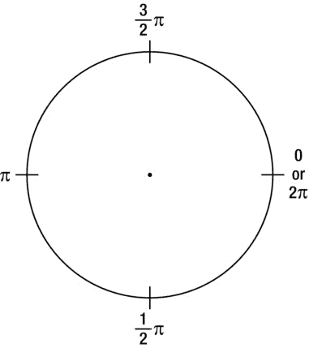
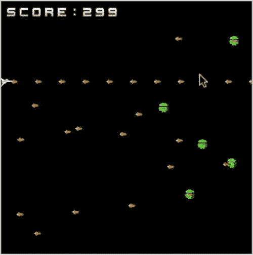
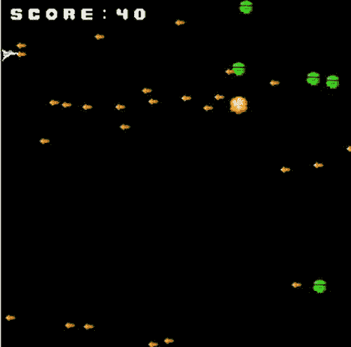
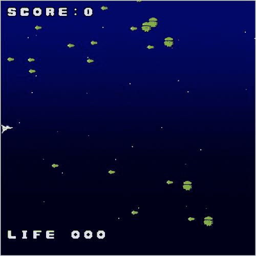

第六章


创建街机射击游戏

在第五章中，我们研究了游戏设计并创造了我们自己的打地鼠(或者我应该说是打地鼠机器人？)游戏。在这一章中，我们来看另一个游戏，一个比打地鼠更复杂的街机射击游戏。

在街机射击游戏中，我们包括几个有助于有趣游戏的功能:背景音乐，不可玩的角色(如好人和坏人)，爆炸，滚动背景，等等。将所有这些元素整合在一起需要在游戏设计方面进行仔细的规划，因为我们创建的所有类都必须相互交互。例如，从玩家的船上发射的子弹应该会让敌人消失。除了介绍街机射击游戏是如何设计和编码的，我们还介绍了几个新的主题，包括指示器、关卡和旋转。

汇总列表

1.  探索游戏和设置
2.  为游戏奠定基础
3.  创建玩家的船
4.  创建拍摄类
5.  创建 PlayerShoot 类并使船射击
6.  制造敌人
7.  创建敌人射击类并让敌人射击
8.  让敌人呈弧形移动
9.  爆炸
10.  添加滚动背景
11.  添加生活量表

建造街机射击游戏

让我们从我们能制作的最简单的街机射击游戏开始，然后逐步增加复杂度。本节我们编写的游戏是一个简单的射击游戏。当玩家触摸屏幕时，飞船会移动到触摸的位置，只要用户触摸它，飞船就会发射子弹穿过屏幕。敌人的船出现在屏幕的对面，向玩家的船射击。如果玩家的船被击中，游戏结束。玩家每消灭一艘敌舰，分数就会增加。游戏的目标是在被击中之前获得尽可能高的分数。

在第 5 章中，我们的方法是写一小段简单的代码，然后在开发过程中不断改进，在每一次迭代中玩游戏。我们在这里也是这样做的，但是因为街机射击游戏比打地鼠游戏更复杂，所以有更长的步骤。

探索游戏，设置

如果你在我们开始编码之前玩了我们将要编码的游戏，你会对游戏的工作原理有更好的了解。执行以下操作来熟悉游戏，并设置您将在其中编码的环境:

1.  在`http://9leap.net/games/1034`玩几次游戏，感受一下我们将要制作的游戏。特别注意敌人是如何随机出现的，当屏幕上有很多敌人子弹时，游戏会变得多么困难。这款游戏因其重玩价值而在`9leap.net` `上广受欢迎。由于随机产生的敌人，每次的体验都不一样。`
`*   在`http://code.9leap.net/codes/show/29839`叉模板。该模板包含您需要的必要图像文件。`

 `为游戏打基础

和往常一样，最好先从一个游戏最简单的元素开始，然后再加入更复杂的元素。在这里，我们设置了`Core`对象，设置了背景，并创建了一个乐谱。执行以下操作进行设置:

1.  Initialize the enchant.js library and create the `Core` entity by copying the code in [Listing 6-1](#list1) into the blank template. Because of the complexity of this section, we label sections of code with comments so we can refer to them later in the chapter.

    [***清单 6-1。***](#_list1) 街机射手的基础

    ```js
    enchant();
    //Class Definitions

    window.onload = function() {
        game = new Core(320, 320);
        //Game Properties
        game.fps = 24;

        game.onload = function() {
        };

        game.start();
    };
    ```

2.  Create a black background by typing the code in [Listing 6-2](#list2) into the `game.onload` function. This specifies the `backgroundColor` of `rootScene` to be black.

    [***清单 6-2。***](#_list2) 创建黑色背景

    ```js
    //In-Game Variables and Properties
    game.rootScene.backgroundColor = 'black';
    ```

    `rootScene`的`backgroundColor`属性可以接受所有标准颜色的名称和颜色的十六进制值(例如，`#FF0000`代表红色)。

3.  单击运行。屏幕应该会变黑。
4.  Create a game variable for the player’s score by adding the code in [Listing 6-3](#list3) to the `//Game Properties` section. Later, we'll make this variable increase in value whenever enemies are hit by bullets from the player’s ship.

    [***清单 6-3。***](#_list3) 创建分数变量

    ```js
    game.score = 0;
    ```

5.  Create a `ScoreLabel` and add it to `rootScene` by adding the code in [Listing 6-4](#list4) to the `//In-game Variables and Properties` section. The `(8,8)` specifies the top-left corner of the label to be placed 8 pixels to the right and 8 pixels down from the top-left corner of the game. Later, we’ll update the value of the `ScoreLabel` with the value of `game.score` every frame.

    [***清单 6-4。***](#_list4) 为 rootScene 创建并添加分数标签

    ```js
    scoreLabel = new ScoreLabel(8, 8);
    game.rootScene.addChild(scoreLabel);
    ```

    `ScoreLabel`类是名为`ui.enchant.js`的插件的一部分，该插件包含在`enchantjs.com`的下载包中。如果你早点从 code.9leap.net 接手这个项目的话，它也包括在内。如果没有，在继续之前，您需要确保行`<script src='/static/enchant.js-latest/plugins/ui.enchant.js'></script>`被添加到您的`index.html`文件中。

6.  单击运行。`ScoreLabel`应出现在屏幕顶部，并带有单词“`SCORE:`”。

如果您的代码遇到任何问题，您可以在`http://code.9leap.net/codes/show/29841`找到一个完整的工作示例。

创建玩家的船

下一步是创建玩家的船，我们将创建一个类。执行以下操作来创建它:

1.  Create a class definition for the player by entering the code in [Listing 6-5](#list5) to the `//Class Definitions` section. For a refresher, the `enchant.Sprite` declaration creates the new class as an extension of the `Sprite` class, which means all properties and methods of the `Sprite` class will work on the `Player` class as well. Everything in the `initialize` function will be run when a `Player` object is created.

    [***清单 6-5。***](#_list5) 玩家类

    ```js
    // Player class
    var Player = enchant.Class.create(enchant.Sprite, {
        initialize: function(x, y){

        }
    });
    ```

2.  Preload `graphic.png`, which contains all the images used in this game, by adding the code in [Listing 6-6](#list6) to the `//Game Properties` section. [Figure 6-1](#Fig1) shows the graphic.

    [***清单 6-6。***](#_list6) 预加载图像

    ```js
    game.preload('graphic.png');
    ```

    

    [图 6-1](#_Fig1) 。Graphic.png

3.  Define the `Player` class as a 16x16 instance of the `Sprite` class and specify `graphic.png` as its image by entering the code in [Listing 6-7](#list7) into the `initialize` function of the `Player` class.

    [***清单 6-7。***](#_list7) 指定尺寸和图像

    ```js
    enchant.Sprite.call(this, 16, 16);
    this.image = game.assets['graphic.png'];
    ```

4.  Make the location of `Player` to be whatever was specified when it was created and set the `frame` by adding the code in [Listing 6-8](#list8) directly under what you just added.

    [***清单 6-8。***](#_list8) 设置位置和帧

    ```js
    this.x = x;
    this.y = y;
    this.frame = 0;
    ```

5.  Create a variable to keep track of when the screen is being touched by adding the code in [Listing 6-9](#list9) to `//Game Properties`. This will set in the touch event listeners we’ll create next, and will be used to determine if bullets should be fired from the ship later.

    [***清单 6-9。***T5【跟踪触摸】](#_list9)

    ```js
    game.touched = false;
    ```

6.  Back in the `initialize` function, add an event listener to move the `Player` to Y position of the touch event when a `touchstart` event occurs by entering the code in [Listing 6-10](#list10). When the `touchstart` event occurs, we also set the `game.touched` variable to `true`. Notice how we don’t need to put a line break between `player.y = e.y;` and `game.touched = true;`. The semicolons delineate the commands.

    [***清单 6-10。***](#_list10) 添加 Touchstart 事件监听器

    ```js
    game.rootScene.addEventListener('touchstart',
            function(e){ player.y = e.y; game.touched = true; });
    ```

7.  Below that, add event listeners for both `touchend` and `touchmove` events to take care of all possible interaction from the player by adding the code in [Listing 6-11](#list11).

    [***清单 6-11。***](#_list11) 附加事件监听器

    ```js
    game.rootScene.addEventListener('touchend',
            function(e){ player.y = e.y; game.touched = false; });
    game.rootScene.addEventListener('touchmove',
            function(e){ player.y = e.y; });
    ```

8.  Create an instance of the `Player` class and add it to `rootScene` by entering the code in [Listing 6-12](#list12) directly below what you just added, still inside the `initialize` function.

    [***清单 6-12。***](#_list12) 将`Player`添加到`rootScene`

    ```js
    game.rootScene.addChild(this);
    ```

9.  Create an instance of `Player` by adding the code in [Listing 6-13](#list13) to the `//In-game Variables and Properties` section. The instance of `Player` is automatically added to `rootScene` because of the last step.

    [***清单 6-13。***](#_list13) 创建`Player` 的实例

    ```js
    player = new Player(0, 152);
    ```

10.  Click Run. The ship appears on the screen. If you click and hold, the ship will follow your cursor up and down on the screen.

    如果您在本节中遇到问题，可以在`http://code.9leap.net/codes/show/29845`找到一个工作代码示例。

创建拍摄类

这个游戏中会出现两种弹药:玩家船射的弹药和敌人射的弹药。这两种类型使用相同的图像，所以我们将从创建一个通用的`Shoot`类开始。执行以下操作来创建它:

1.  Create the basic `Shoot` class by entering the code in [Listing 6-14](#list14) beneath the `//Player Class` definition. It should have two functions: `initialize` and `remove`. It should also extend the `Sprite` class. When an instance of the `Shoot` class is created, we will pass three values to it: an X coordinate, a Y coordinate, and a direction.

    [***清单 6-14。***T5】创建射击类](#_list14)

    ```js
    // Shoot class
    var Shoot = enchant.Class.create(enchant.Sprite, {
        initialize: function(x, y, direction){
        },
        remove: function(){
        }
    });
    ```

2.  Create the `Shoot` class as a 16x16 instance of the `Sprite` class, and create and assign necessary variables by entering the code in [Listing 6-15](#list15) into the initialize function of the `Shoot` class. We will use the `moveSpeed` variable next to control the speed of movement and allow for easy modification of ammunition speed later on.

    [***清单 6-15。***](#_list15)`Shoot`类的实例变量

    ```js
    enchant.Sprite.call(this, 16, 16);
    this.image = game.assets['graphic.png'];
    this.x = x;
    this.y = y;
    this.frame = 1;
    this.direction = direction;
    this.moveSpeed = 10;
    ```

3.  Create an `enterframe` event listener to control movement by entering the code in [Listing 6-16](#list16) directly beneath `this.movespeed = 10;`. Code entered here will be run on instances of `Shoot` every frame.

    [***清单 6-16。***](#_list16) 创建一个`enterframe`事件监听器

    ```js
    this.addEventListener('enterframe', function(){
            });
    ```

我们将在下一节中向这个事件监听器添加代码。

用 Cos 和 Sin 控制方向

我们创建了`Shoot`类来接受方向，但是我们还不知道传递什么样的值来指示方向。我们也有一个事件监听器来处理运动，但是我们还不知道如何处理偏离方向的运动。我们如何做到这一点？具有功能`cosine`和`sine`，通常简称为`cos`和`sin`。

要理解这些功能，首先需要理解单位圆的方向，如图[图 6-2](#Fig2) 所示。



[图 6-2](#_Fig2) 。单位圆

单位圆用弧度表示方向。一弧度等于一个圆的半径的长度，在它的圆周上排成一行。圆圈中的`pi`符号是一个数学常数，等于一个圆的周长除以其直径(约 3.14)。这有什么关系？因为 cos 和 sin 只接受以弧度表示的值，而左右主方向分别等于`pi`和`0`(或`2 * pi`)。

假设你想从圆心画一条长度为 1 的线。`Cos`和`sin`将分别给出该线端点的 x 和 y 坐标，根据`pi`给出一个方向。例如，如果我们想向点的右边移动 1，我们可以将`pi`传递给`cos`来找出我们需要沿着 x 轴移动多少才能到达那里(-1)。我们还将通过`pi`到`sin`来找出我们需要沿着 y 轴(0)移动多少。

代码就是这样处理运动的。我们根据`pi`选择一个方向，然后使用`cos`和`sin`来计算每一帧精灵移动多少。

*   4.  Inside the event listener you just created, specify how instances of the `Shoot` class should move based off `cos` and `sin` by entering the code in [Listing 6-17](#list17). Multiplying the results of the calculations by `moveSpeed` allows the ammunition to be manipulated in terms of speed later, if needed.

    [***清单 6-17。***](#_list17) 用`Cos`和`Sin` 控制移动

    ```js
    this.x += this.moveSpeed * Math.cos(this.direction);
    this.y += this.moveSpeed * Math.sin(this.direction);
    ```

*   5.  Designate instances of the `Shoot` class to call the `remove` function if the shots stray far outside the bounds of the game screen by entering the code in [Listing 6-18](#list18) inside the `enterframe` event listener, below what you just added. We could use 0 for the minimum allowed values of X and Y before the `remove` function is called, but using `–this.width` and `–this.height` ensures the shots don’t disappear off the screen unnaturally. Do not worry about defining what the `remove` function does just yet.

    [***清单 6-18。***](#_list18) 调用`remove`函数

    ```js
    if(this.y > 320 || this.x > 320 || this.x < -this.width || this.y < -this.height){
                this.remove();
    }
    ```

*   6.  Inside the definition of the `remove` function, under the definition of the `initialize` function, specify what should happen when the `remove` function is called by entering the code in [Listing 6-19](#list19). The `delete` command removes a given instance of the `Shoot` class from memory. In a very long game, if this is not specified it could bog down the system.

    [***清单 6-19。***](#_list19)`remove`功能

    ```js
    game.rootScene.removeChild(this);
    delete this;
    ```

*   7.  Add instances of the `Shoot` class to `rootScene` on creation by adding the code in [Listing 6-20](#list20) to the `initialize` function, after the event listener.

    [***清单 6-20。***](#_list20) 将`Shoot`添加到`rootScene`

    ```js
    game.rootScene.addChild(this);
    ```

创建 PlayerShoot 类并让船射击

我们创建了通用的`Shoot`类，但是现在我们需要为玩家的船发射的弹药创建一个类，并在船发射时创建它的实例。执行以下操作来创建该类:

1.  In the `//Class Definitions` section, create the `PlayerShoot` class and its `initialize` function by entering the code in [Listing 6-21](#list21).

    [***清单 6-21。***](#_list21) 创建 PlayerShoot 类

    ```js
    // PlayerShoot class
    var PlayerShoot = enchant.Class.create(Shoot, { // Succeeds bullet class
        initialize: function(x, y){
        }
    });
    ```

2.  Create the `PlayerShoot` class as an instance of the `Shoot` class, specifying 0 as the direction, by inserting the code in [Listing 6-22](#list22) into the `initialize` function. Remember the unit circle? The value of 0 is equal to a direction facing the right side of the screen. Because the ship is on the left side of the screen, bullets fired will head toward the right.

    [***清单 6-22。***](#_list22) 创建`Shoot`类的实例

    ```js
    Shoot.call(this, x, y, 0);
    ```

3.  We now need make the ship fire instances of the `PlayerShoot` class. Go back to the `Player` class definition and create an `enterframe` event listener inside the `initialize` function by entering the code in [Listing 6-23](#list23) right above the line `game.rootScene.addChild(this);`.

    [***清单 6-23。***](#_list23) Enterframe 事件监听器

    ```js
    this.addEventListener('enterframe', function(){
    });
    ```

4.  Inside this event listener, add the code in [Listing 6-24](#list24) to create an `if` statement to be executed once every three frames and to be executed if the game is being touched.

    [***清单 6-24。***](#_list24) If 语句控制出手

    ```js
    if(game.touched && game.frame % 3 === 0){
    }
    ```

5.  Inside the `if` statement, create a new instance of the `PlayerShoot` class by entering the code in [Listing 6-25](#list25).

    [***清单 6-25。***](#_list25) 创建一个`PlayerShoot`实例

    ```js
    var s = new PlayerShoot(this.x, this.y);
    ```

6.  单击运行。当你点击屏幕时，你的船会发射弹药穿过屏幕。

如果您在本节中遇到问题，您可以在`http://code.9leap.net/codes/show/29907`找到一个完整的工作代码示例。

创造敌人

我们的船现在可以发射子弹，但现在我们需要为船创造一些可以射击的东西。执行以下操作为敌人创建一个职业并将他们添加到游戏中:

1.  Create the basic `Enemy` class definition with an `initialize` and `remove` function by adding the code in [Listing 6-26](#list26) to the `//Class Definitions` section, below the `Player` class definition.

    [***清单 6-26。***](#_list26) 基础`Enemy`类

    ```js
    //Enemy class
    var Enemy = enchant.Class.create(enchant.Sprite, {
        initialize: function(x, y){
        },
        remove: function(){
        }
    });
    ```

2.  Make the `Enemy` class a 16x16 instance of the `Sprite` class and assign the `frame`, `x`, and `y` variables by entering [Listing 6-27](#list27) into the `initialize` function.

    [***清单 6-27。***](#_list27) 制作 Sprite 实例并赋值变量

    ```js
    enchant.Sprite.call(this, 16, 16);
    this.image = game.assets['graphic.png'];
    this.x = x;
    this.y = y;
    this.frame = 3;
    ```

3.  Specify the direction of movement for enemies to be to the left in terms of the unit circle (`Math.PI`), and create a variable for movement speed by entering the code in [Listing 6-28](#list28) below what you just entered.

    [***清单 6-28。***](#_list28) 为方向和运动创建变量

    ```js
    this.direction = 0;
    this.moveSpeed = 3;
    ```

4.  Under what you just entered, create an event listener to move the enemy using the variables you just created by entering the code in [Listing 6-29](#list29).

    [***清单 6-29。***](#_list29) 移动敌人

    ```js
    // Define enemy movement
    this.addEventListener('enterframe', function(){
            this.x -= this.moveSpeed * Math.cos(this.direction);
            this.y += this.moveSpeed * Math.sin(this.direction);
    });
    ```

5.  Make the `Enemy` call the `remove` function (which we’ll define soon) if it is outside the dimensions of the screen by entering the code in [Listing 6-30](#list30) directly under the line `this.y += this.moveSpeed * Math.sin(this.direction);`.

    [***清单 6-30。***](#_list30) 除去屏幕外的敌人若

    ```js
    // Disappear when outside of screen
    if(this.y > 320 || this.x > 320 || this.x < -this.width || this.y < -this.height){
            this.remove();
    }
    ```

6.  Finally, have the `Enemy` add itself to `rootScene` when it is created by entering the code in [Listing 6-31](#list31) into the `initialize` function, under the event listener you just added.

    [***清单 6-31。***](#_list31) 给 rootScene 添加敌人

    ```js
    game.rootScene.addChild(this);
    ```

7.  Define the `remove` function by entering [Listing 6-32](#list32) into the `remove` function. This will remove the enemy from `rootScene` and delete it from memory. Also, it will remove the enemy from an array we’re going to create to keep track of enemies. (Hence the `delete enemies[this.key];`, which will be explained soon.)

    [***清单 6-32。***](#_list32) 清除功能

    ```js
    game.rootScene.removeChild(this);
    delete enemies[this.key];
    delete this;
    ```

8.  In the `//In-Game Variables and Properties` section, create an array to keep track of enemies by entering the code in [Listing 6-33](#list33).

    [***清单 6-33。***](#_list33) 制造敌阵

    ```js
    enemies = [];
    ```

9.  Under the new array, create an `enterframe` event listener for the game to create enemies randomly by entering the code in [Listing 6-34](#list34). We create a variable inside the `Enemy` called `enemy.key` and assign the game’s current frame to it because this gives us something to keep track of the enemies with. If we do not do this, we would not be able to reference a specific enemy later on, which is needed when the enemies stray off screen or are hit with ammunition from the ship. Enemies have approximately a 1 in 10 chance of being created because of `if(Math.random()*100 < 10)` and, if created, are placed randomly on the y-axis.

    [***清单 6-34。***](#_list34) 在游戏中制造敌人

    ```js
    game.rootScene.addEventListener('enterframe', function(){
        if(Math.random()*100 < 10){
            var y = Math.random() * 320;
            var enemy = new Enemy(320, y);
            enemy.key = game.frame;
            enemies[game.frame] = enemy;
        }
    });
    ```

10.  Update the game’s `scoreLabel` every frame by entering the code in [Listing 6-35](#list35) underneath the `if` statement, but still inside the event listener.

    [***清单 6-35。***](#_list35) 每帧更新游戏分数

    ```js
    scoreLabel.score = game.score;
    ```

11.  点击运行。敌人被创造出来并飞过屏幕。然而，当船上的子弹击中他们时，什么也没有发生。
12.  Make the ship’s ammunition destroy enemies with an event listener by entering the code in [Listing 6-36](#list36) into the `PlayerShoot` class definition, under `Shoot.call(this, x, y, 0);`. The way this `for` loop is constructed causes the program to go through every single member of the enemies array, checking to see if the given bullet is in contact with it. If so, both the bullet and the enemy in the array are removed, and the player’s score is increased by 100.

    [***清单 6-36。***](#_list36) 制伏敌人

    ```js
    this.addEventListener('enterframe', function(){
        // Judges whether or not player's bullets have hit enemy
        for(var i in enemies){
            if(enemies[i].intersect(this)){
                // Eliminates enemy if hit
                this.remove();
                enemies[i].remove();
                //Adds to score
                game.score += 100;
            }
        }
    });
    ```

13.  单击运行。你现在可以通过射击来消灭敌人。如果您在本节中遇到问题，可以在`http://code.9leap.net/codes/show/29929`找到一个工作代码示例。

创建敌人射击类并让敌人射击

在这一点上，没有办法输掉比赛，这不是很引人注目。让我们创建一个敌人弹药的职业，让敌人向飞船开火，通过以下方式增加难度:

1.  Create the `enemyShoot` class by adding the code in [Listing 6-37](#list37) in the `//Class Definitions` section. Create it as an instance of the `Shoot` class, with the direction set as `Math.PI`, as that faces left in the unit circle.

    [***清单 6-37。***](#_list37) 排敌班

    ```js
    // Class for enemy bullets
    var EnemyShoot = enchant.Class.create(Shoot, { // Succeeds bullet class
        initialize: function(x, y){
            Shoot.call(this, x, y, Math.PI);
        }
    });
    ```

2.  Add an `enterframe` event listener inside the `initialize` function by adding the code in [Listing 6-38](#list38) under the line that begins with `Shoot.call`. This event listener should contain an `if` statement specifying that the game should end if the center of `player` and the center of a given enemy bullet is 8 pixels or less at any given time.

    [***清单 6-38。***](#_list38) 指定`playerShoot`和`player` 之间的点击次数

    ```js
    this.addEventListener('enterframe', function(){
        if(player.within(this, 8)){
            game.end(game.score, "SCORE: " + game.score);
        }
    });
    ```

3.  Make the `Enemy` class create instances of the `enemyShoot` class every 10 frames by changing the `if` statement inside the `Enemy enterframe` event listener to match what is shown in [Listing 6-39](#list39). The variable age can be called on any `Entity` and gives the number of frames the `Entity` has been alive.

    [***清单 6-39。***](#_list39) 制敌射击

    ```js
    // Disappear when outside of screen
    if(this.y > 320 || this.x > 320 || this.x < -this.width || this.y < -this.height){
        this.remove();
    }else if(this.age % 10 === 0){ // Fire every 10 frames
        var s = new EnemyShoot(this.x, this.y);
    }
    ```

4.  点击运行。敌人现在开始反击。

如果您在本节中遇到问题，可以在`http://code.9leap.net/codes/show/30105`找到一个工作代码示例。

使敌人沿弧线移动

敌人现在沿直线移动。这使得玩游戏相当直接，但有点简单。让我们让敌人以弧线移动，让游戏更有趣。我们将通过创建一个变量来指定方向应该向上运动还是向下运动(theta ),这取决于敌人在哪里被创建，然后在每一帧稍微改变方向。为此，请执行以下操作:

1.  Each enemy needs to have a variable that will be used to change its direction. Create a variable (`theta`) that is passed as an argument when an `Enemy` is created by changing the opening line of the `initialize` function to match the code in [Listing 6-40](#list40).

    [***清单 6-40。***](#_list40) 添加了`theta`变量

    ```js
    initialize: function(x, y, theta){
    ```

2.  Although direction is specified in terms of the unit circle, it’s easier to work in degrees for specific amounts other than `0` or `Math.PI`. We’ll be passing a value in degrees to `theta`, so convert it to radians by entering the code in [Listing 6-41](#list41) right before the line that reads `this.direction = 0;`.

    [***清单 6-41。***](#_list41) 将`theta`转换成弧度

    ```js
    this.theta = theta * Math.PI / 180;
    ```

3.  Inside the `enterframe` event listener of the `Enemy` class, make `theta` change the direction of the `Enemy` every frame by entering the code in [Listing 6-42](#list42) directly under the line that reads `this.addEventListener('enterframe', function(){`.

    [***清单 6-42。***](#_list42) 递增`Enemy`方向

    ```js
    this.direction += this.theta;
    ```

4.  Now enemies can accept a value for `theta`, and this will change the direction of the `Enemy` every frame, but we need to specify how the enemies are created to really use this. To accomplish this, change the `if` statement inside the game’s `rootScene enterframe` event listener to match the code in [Listing 6-43](#list43). If the `Enemy` is created in the upper half of the screen, the enemy will arc upwards (direction angle will increase by 1 each frame). If it is created in the lower half of the screen, it will arc downwards (direction angle will decrease by 1 each frame).

    [***清单 6-43。***](#_list43) 制造敌人那道弧线

    ```js
    if(rand(100) < 10){
            // Make enemies appear randomly
            var y = rand(320);
            if (y < 160) {
                    theta = 1;
            } else {
                    theta = -1;
            }
            var enemy = new Enemy(320, y, theta);
            enemy.key = game.frame;
            enemies[game.frame] = enemy;
    }
    ```

5.  Click Run. Enemies move in an arc, making the game more compelling. Your game should appear as it does in [Figure 6-3](#Fig3).

    

    [图 6-3](#_Fig3) 。简单的射击游戏

如果您在本节中遇到问题，可以在`http://code.9leap.net/codes/show/30564`找到一个工作代码示例。

强化游戏

目前，我们的游戏在目前的状态下是一个工作游戏。我们可以把它留在这里，转到另一个游戏，但让我们研究一些方法，通过添加一些功能来使游戏更引人注目。

我们将对原来的游戏做一些补充，并在接下来的部分解释如何做。

爆炸

先来加点爆款。目前，当敌舰被击落时，它们就消失了。让我们通过在敌舰被击中时引起爆炸来增加一点刺激。

1.  Download the explosion ([Figure 6-4](#Fig4)) sprite sheet from `http://enchantjs.com/assets/img/effect0.gif` and add it to your project. We’ll use this sprite sheet for our explosion.

    

    [图 6-4](#_Fig4) 。爆炸效果图

2.  Create a basic class, called `Blast`, as an extension of the `Sprite` class by adding the code in [Listing 6-44](#list44) into the `//Class Definitions` section. The class should have an `initialize` and `remove` function.

    [***清单 6-44。***](#_list44) 爆炸类

    ```js
    // Class for explosions
    var Blast = enchant.Class.create(enchant.Sprite, {
        initialize: function(x, y){
        },
        remove: function(){
        }
    });
    ```

3.  Inside the `initialize` function, create the `Blast` class as a 16x16 instance of the `Sprite` class, and pass the `x` and `y` arguments to the local variables `x` and `y` by entering the code in [Listing 6-45](#list45).

    [***清单 6-45。***](#_list45) 在爆炸中分配变量

    ```js
    enchant.Sprite.call(this,16,16);
    this.x = x;
    this.y = y;
    ```

4.  Jump down to the `window.onload` function and add a preload statement under `game.preload('graphic.png');` to add the sprite sheet of the explosion by entering the code in [Listing 6-46](#list46).

    [***清单 6-46。***](#_list46) 预载爆炸图像

    ```js
    game.preload('effect0.gif');
    ```

5.  Back in the `initialize` definition of the `Blast` class, under `this.y = y;`, add a statement to use `effect0.gif` as the image for the explosion by adding the code in [Listing 6-47](#list47).

    [***清单 6-47。***](#_list47) 指定`effect0.gif`为`Blast`图像

    ```js
    this.image = game.assets['effect0.gif'];
    ```

6.  Specify the `frame` to start at 0, and specify a duration of 20 frames by entering [Listing 6-48](#list48) on the next line. We will use the duration soon to draw out the animation over a specific amount of time.

    [***清单 6-48。***](#_list48) 指定起始帧和持续时间

    ```js
    this.frame = 0;
    this.duration = 20;
    ```

7.  Below that, create an `enterframe` event listener by entering the code in [Listing 6-49](#list49). We’ll use this event listener to control the `frame` of the explosion.

    [***清单 6-49。***](#_list49) 事件监听器为`Blast`

    ```js
    this.addEventListener('enterframe', function(){
    }
    ```

8.  Inside the event listener, create a statement to set the `frame` of the explosion to go from 0 to 4 over a period of 20 frames by entering the code in [Listing 6-50](#list50). This is accomplished with an algorithm. This algorithm first takes the current number of frames the explosion has been alive for (`this.age`) and divides it by the desired duration of the animation (`this.duration`) to get a fraction representing how far through the animation sequence the explosion should be. This is multiplied by 5 because the total sequence, shown in the sprite sheet, is 5 frames long. At this point, the result most likely has a decimal value (such as 4.42), so it is rounded down with `Math.floor`, and the result is what is assigned to the current frame of the explosion. The result is that the explosion progresses smoothly over 20 frames, and this value can be changed simply by editing the value of `duration` from 20 to something else.

    [***清单 6-50。***](#_list50) 给`frame` 赋值

    ```js
    // Explosion animation
    this.frame = Math.floor(this.age/this.duration * 5);
    ```

9.  Beneath that, but still in the event listener, enter the code in [Listing 6-51](#list51) to create an `if` statement that calls the `remove` function if the explosion has been alive for the desired duration. Note that if there is only one statement after the `if` statement, curly braces (`{}`) are not required.

    [***清单 6-51。***](#_list51) 调用`remove`函数

    ```js
    if(this.age == this.duration) this.remove();
    ```

10.  Under the `if` statement, outside of the event listener, but still inside the `initialize` function, add the blast to `rootScene` by entering the code in [Listing 6-52](#list52).

    [***清单 6-52。***](#_list52) 给`rootScene` 添加冲击波

    ```js
    game.rootScene.addChild(this);
    ```

11.  Make the `remove` function remove the blast from `rootScene` by entering the code in [Listing 6-53](#list53) into the definition of the `remove` function.

    [***清单 6-53。***](#_list53) 清除根景爆炸

    ```js
    game.rootScene.removeChild(this);
    ```

12.  Make `playerShoot` create an instance of the `Blast` class if it hits an enemy by rewriting the definition of `playerShoot` to match the code in [Listing 6-54](#list54). The line you should add is in bold type.

    [***清单 6-54。***](#_list54)`playerShoot`创建`Blast` 的实例

    ```js
    // PlayerShoot class
    var PlayerShoot = enchant.Class.create(Shoot, { // Succeeds bullet class
        initialize: function(x, y){
            Shoot.call(this, x, y, 0);
            this.addEventListener('enterframe', function(){
                    // Judges whether or not player's bullets have hit enemy
                    for(var i in enemies){
                        if(enemies[i].intersect(this)){
                        //Start Explosion
                        var blast = new Blast(enemies[i].x,enemies[i].y);
                            // Eliminates enemy if hit
                            this.remove();
                            enemies[i].remove();
                            //Adds to score
                            game.score += 100;
                            }
                    }
                    });
        }
    });
    ```

13.  单击运行。尝试玩游戏，看看当敌人被玩家船上的子弹击中时，爆炸是如何出现的。如果你做的一切都正确，游戏应该会出现在图 6-5 中。



[图 6-5](#_Fig5) 。具有爆炸功能的街机射击游戏

如果您在本节中遇到问题，您可以在`http://code.9leap.net/codes/show/30633`找到一个完整的工作代码示例。

添加滚动背景

现在，我们已经加入了爆炸，事情开始看起来有点好，但我们仍然有一段路要走。为了增加准现实主义的元素，让我们为我们的游戏创建一个滚动背景。

首先，我们需要一个正好是屏幕两倍宽的背景图像。图像的左右两边应该完全一样，最左边或最右边都没有星星。我们一会儿就知道为什么了。

我们一次向左滚动一个像素，当我们到达终点时，我们循环回到起点，在整个游戏中不断重复这个过程。这就是为什么我们希望背景图片的左右两边是一样的。如果玩家注意到背景中的突然变化，看起来会很不自然。我们将使用[图 6-6](#Fig6) 中所示的图像。


图 6-6 。png 图形

通过创建`Background`类并加入这个循环动作，我们创造了一个无休止滚动的背景效果。执行以下操作来创建`Background`类并实现它:

*   14.  In the `//Class Definitions` section, create a class for the background as an extension of the `Sprite` class by entering the code in [Listing 6-55](#list55). The only method needed is the `initialize` method, as we never remove it from `rootScene`.

    [***清单 6-55。***](#_list55) `Background`类

    ```js
    // Background class
    var Background = enchant.Class.create(enchant.Sprite, {
        initialize: function(){
        }
    });
    ```

*   15.  Inside the `initialize` function, create `Background` as a 640x320 `Sprite` by entering in [Listing 6-56](#list56). This dimension is just as tall and twice as wide as the game screen.

    [***清单 6-56。***](#_list56) 创建为精灵的实例

    ```js
    enchant.Sprite.call(this,640,320);
    ```

*   16.转到`http://enchantjs.com/?p=731`并下载图像文件`bg.png`，用作背景。
*   17.将文件上传到您在`code.9leap.net`中的项目。
*   18.  Inside the `window.onload` function, under the `//Game Properties section`, add [Listing 6-57](#list57) to preload `bg.png`.

    [***清单 6-57。***](#_list57) 预加载背景图像

    ```js
    game.preload('bg.png');
    ```

*   19.  Back inside the `initialize` function of the `Background` class, add [Listing 6-58](#list58) to the variable declarations to position the background and assign `bg.png` to be used as the background image.

    [***清单 6-58。***](#_list58) 定位和图像变量

    ```js
    this.x = 0;
    this.y = 0;
    this.image = game.assets['bg.png'];
    ```

*   20.  Below that, but still inside the initialize function, add an `enterframe` event listener to move the background to the left by one pixel every frame by entering in the code in [Listing 6-59](#list59).

    [***清单 6-59。***](#_list59) 移动`Background`每一帧

    ```js
    this.addEventListener('enterframe', function(){
            this.x--;
    });
    ```

*   21.  Inside the event listener, underneath `this.x--;`, write a statement to reset the position of `Background` if it has been scrolled all the way over by entering the code in [Listing 6-60](#list60). We know if the image has been scrolled all the way over if its x position is `-320` or less.

    [***清单 6-60。***](#_list60) 重置背景位置

    ```js
    if(this.x<=-320) this.x=0;
    ```

*   22.  Under the event listener, but still inside the `initialize` function, add `Background` to `rootScene` by entering the code in [Listing 6-61](#list61).

    [***清单 6-61。***](#_list61) 给 rootScene 添加背景

    ```js
    game.rootScene.addChild(this);
    ```

*   23.  Finally, in the `game.onload` function, replace the line that reads `game.rootScene.backgroundColor = 'black';` with the code in [Listing 6-62](#list62) to create an instance of `Background`.

    [***清单 6-62。***](#_list62) 创建`Background` 的实例

    ```js
    background = new Background();
    ```

*   24.单击运行。游戏应该出现在[图 6-7](#Fig7) 中。


[图 6-7](#_Fig7) 。背景滚动的街机射击游戏

如果您在本节中遇到问题，可以在`http://code.9leap.net/codes/show/30704`找到一个工作代码示例。

添加生命量表

目前，玩家只需一击就会死亡。如果他们在至少三次击中后倒下，似乎会公平得多。考虑到这一点，让我们添加一些东西，让玩家有多条命，并允许他们在死亡前承受几次打击。为此，请执行以下操作:

1.  In the `game.onload`function, under the `//In-Game Variables and Properties` section, add a variable as part of the `Core` object (`game`) to keep track of a player’s life by entering the code in [Listing 6-63](#list63).

    [***清单 6-63。***](#_list63) 创建一个生命变量

    ```js
    game.life = 3;
    ```

    我们现在已经初始化了一个代表玩家剩余生命数的变量。因为我们在`game.onload`内部这样做，并使用`game.life`作为变量名(使用`game.`前缀使其成为这里称为`game`的`Core`对象的一部分)，所以它可以在游戏内部的任何地方被引用。

2.  Rewrite the `EnemyShoot` class to reduce the amount of life the player has by 1 if hit by an enemy bullet by making the class match the code in [Listing 6-64](#list64). You should erase the line that reads `game.end(game.score, "SCORE: " + game.score);` and replace it with the code in bold type.

    [***清单 6-64。***](#_list64) 命中时减少生命

    ```js
    // Class for enemy bullets
    var EnemyShoot = enchant.Class.create(Shoot, { // Succeeds bullet class
        initialize: function(x, y){
            Shoot.call(this, x, y, Math.PI);
            this.addEventListener('enterframe', function(){
                if(player.within(this, 8)){     // Bullet has hit player
                        game.life--;
                    }
            });
        }
    });
    ```

3.  Under `game.life--;`, but still inside the `if` statement, write another `if` statement to end the game if the player’s life is less than or equal to 0 by entering the code in [Listing 6-65](#list65).

    [***清单 6-65。***](#_list65) 结束游戏如果没有生命

    ```js
    if(game.life<=0)
    game.end(game.score, "SCORE: " + game.score);
    ```

    我们已经重写了游戏，当玩家被击中时生命值减少 1，如果生命值为 0，游戏就结束了。我们可以创建一个类来显示生活，但是不需要在屏幕上添加太多内容，所以在这种情况下，简单地在`game.onload`中创建指示器会更有效。

    我们将使用作为`ui.enchant.js`插件的一部分提供的`MutableText`类来制作指示器。`MutableText`类与`Label`类非常相似，但是它不使用计算机中已经安装的字体在屏幕上创建文本，而是使用 sprite 表中文本字符的图像，很像`Sprite`。

     **注意**`ScoreLabel`类是`MutableText`类的扩展，行为类似。

    如果我们在这里使用常规的`Label`类，结果看起来会很便宜，因为将使用系统字体。通过使用`MutableText`，你可以使用更好看的字体，并且因为使用图像而不是系统字体，你可以确保字母看起来总是一样的，不管游戏运行在什么样的浏览器或操作系统上。

4.  Within the `game.onload` function, below the line that reads `player = new Player(0, 152);`, create a new instance of `MutableText` by entering the code in bold type from [Listing 6-66](#list66). The first argument (`8`), specifies the X position of the upper-left corner of the new instance, the second argument (`320 – 32`) specifies the Y position, the third (`game.width`) specifies the width of the label, and the fourth specifies the text that should be shown.

    [***清单 6-66。***](#_list66) 创造了`lifeLabel`

    ```js
    game.onload = function() {
        //In-Game Variables and Properties
        background = new Background();
        game.life = 3;

        scoreLabel = new ScoreLabel(8, 8);
        game.rootScene.addChild(scoreLabel);
        player = new Player(0, 152);
        enemies = [];
        // Display life
        lifeLabel = new MutableText(8, 320 - 32, game.width, "");
    ```

5.  Beneath the line that reads `lifeLabel = new MutableText(8, 320 – 32, game.width, "");`, but still inside the `game.onload` function, create an event listener to update the text of `lifeLabel` with a number of 0s equal to however many lives the player has left by entering the code in [Listing 6-67](#list67).

    [***清单 6-67。***](#_list67) 显示生命数量

    ```js
    lifeLabel.addEventListener('enterframe', function(){
        this.text = "LIFE " + "OOOOOOOOO".substring(0, game.life);
    });
    ```

    因为我们在一个`enterframe`事件侦听器中定义了`lifeLabel`的文本，所以生命量表将在每一帧中更新。

    我们来看看`"OOOOOOOOO".substring(0, game.life);`部分。这个“O”代表游戏中的单身生活。`"OOOOOOOOO"`是一个 JavaScript 字符串对象，所以我们可以直接调用应用于该字符串的方法。我们可以通过使用`substring()`方法从一个字符串的开头到指定的点提取文本。

    应该注意的是，`substring()`方法的第二个参数表示子字符串应该从中提取字符的点。请记住，字符串和数组中的位置引用以 0 开头。这意味着如果`game.life`等于 3，子串用`"OOOOOOOOO".substring(0, game.life);`处理，子串将在位置 0、位置 1 和位置 2 返回 0，但在到达第三个位置之前会停止。

    这也是为什么游戏以三条命开头，在游戏中用三个 0 来代表(`"LIFE 000"`)。随着生命的减少，它会显示`"LIFE OO"`然后是`"LIFE O."`

    正如你所看到的，enchant.js 允许你轻松地创建游戏指示器，而不必创建一个全新的类。

6.  Finally, under the event listener, add the `lifeLabel` to `rootScene` by entering in the code in [Listing 6-68](#list68).

    [***清单 6-68。***](#_list68) 给 rootScene 添加 life label

    ```js
    game.rootScene.addChild(lifeLabel);
    ```

7.  单击运行。寿命计将出现在图 6-8 的[中。](#Fig8)



[图 6-8](#_Fig8) 。带生命计的街机射击游戏

如果您在本节中遇到问题，您可以在`http://code.9leap.net/codes/show/30801`找到一个完整的工作代码示例。

结论

希望你能看到最终拍摄程序的总体流程与我们在本章前面看到的简单原型没有太大的不同。事实上，`Background`类和许多其他类与我们在本章开始时检查的原型完全相同。

正如我们看到的第五章一样，在重击机器人的例子中，通过一点一点地重写和改进原型，一个成熟而复杂的游戏可以被开发出来。

在这一章中，我们探索了射击游戏的开发，看看如何为子弹、敌人和玩家创建类，以及如何处理子弹和敌人或玩家飞船之间的碰撞检测。然后，我们研究了可以用来改进基本游戏的更高级的概念，包括爆炸、生命标尺等等。

在下一章，我们将看看如何在`code.9leap.net`之外创建独立游戏，并研究如何使用 3D 来创建带有`gl.enchant.js`插件的游戏。`