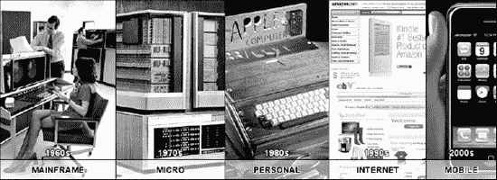

# 一、思考移动触摸

> *“个人的一小步，人类的一大步…”*

—尼尔·阿姆斯特朗

对于那些每天与技术一起生活和工作的人来说，这是令人兴奋的时刻，无论他们是一生都在使用技术的年轻人，还是已经适应了技术的人。这是激动人心的时刻，因为近年来，没有任何其他技术像移动设备的发展那样如此显著地改变了我们的生活。

在这本书里，你会看到移动革命如何改变了我们开发应用的方式，以及触摸屏技术如何带来新的变化。首先，您将学习如何使用新的触摸设计技术来设计基于触摸的用户界面。然后，您将学习如何根据 iPhone 和 iPad 的特定需求来调整基于触摸的设计原则。我们的项目基于标准信息架构过程的敏捷版本，用于优化用户和单个开发人员(或小团队)的需求。

在设计阶段之后，您将学习如何在开发阶段实现设计，以及如何使用 web 标准和基于 WebKit 的框架来实现项目目标。

作为该过程的最后一步，您将学习如何测试移动触摸应用，以及如何在通过 Apple WebApp 门户或其他第三方门户发布应用之前，以用户为中心的方式评估测试。

### 为什么是移动网络？

移动市场是存在的，它每天都在增长，这是一场影响我们生活方式的革命。问题是，“我们为什么要在这个市场上投入时间和资源？”

#### 从桌面到移动

根据摩根士丹利(Morgan Stanley)的说法，计算的历史经历了五个主要周期(如图 1–1 所示):大型机计算(20 世纪 60 年代)、微型计算(20 世纪 70 年代)、个人计算(20 世纪 80 年代)、桌面互联网计算(20 世纪 90 年代)和移动互联网计算(21 世纪初)。看看移动互联网计算时代，你可以找出这种演变的原因。

**图 1–1。** *计算史上的技术周期*

首先，新的触摸屏技术增加了界面的可用性，同时减少了移动网络浏览的挫折感。其次是脸书和 Twitter 等社交网络的惊人发展。第三是新的 VoIP 服务，它是传统 2G 和 3G 蜂窝通信的有吸引力的替代品，这是当地 ISP 在过去几年中提供的新的廉价数据计划。

iPhone 处于这一过程的中心，因为它催化了这三个因素(也是其中一些因素的先驱)，正如你从[图 1–2](#fig_1_2)中看到的，它已经逐月获得并保持了其在市场上的主导地位。这是今天开始为 iPhone 和 iPad 设计和开发的另一个好理由。在短时间内，学习 Objective-C(用于本地应用)或 web standards(用于 web 应用)这样的语言所花费的时间肯定是值得的。

**图 1–2。***2011 年市场上的顶级制造商(来源:MobileMix)*

在不久的将来，移动设备的不断发展将涉及一些交互，推动移动生态系统优化其一些服务，并将它们作为所有设备的标准功能，同时引入其他新服务，如以下服务:

###### **增强现实**

移动设备可以使用来自网络服务的信息来“浏览”现实。

###### **作为钱包的移动设备**

我们可以通过我们的设备进行安全支付，将普通的智能手机转变为借记卡或信用卡。移动商务也变得越来越普遍。

###### **移动电视**

移动用户可以广泛访问由专业公司和普通用户创建的传统和面向移动的内容。

###### **“智能”移动网络**

这使得移动电话能够自动连接到位于用户附近区域的所有可用接入点。

###### **全球定位服务**

用户的位置会自动更新并导出，以供私人和公共应用使用。

###### **口袋里的互联网**

今天，你可以用市场上的几个触摸屏设备浏览互联网，但在未来，即使是“大规模生产”的手机也将配备 HTML 浏览器。

###### **改进的人体工程学和可用性**

大多数用户都知道，要在“大规模生产”设备上运行应用或输入数据，必须在手机键盘上进行大量点击。在不久的将来，许多这样的设备将配备触摸屏技术。

#### 移动市场

如今，超过 40 亿人拥有或使用移动设备。其中，近 50%的人通过移动设备访问网络，而且这个数字还在逐年增长。

今天，市场上有六种主要的移动操作系统:

*   ios
*   Symbian 操作系统
*   机器人
*   肾脏 OS
*   Windows Phone 7
*   WebOS

您可以在[Figure 1–3](#fig_1_3)中看到全球每个操作系统的不同百分比。

**图 1–3。***2011 年操作系统份额(来源:MobileMix)。*

根据这些百分比，今天开始为移动设备设计和开发的第一个好理由是市场很大，比桌面市场有更多的工作机会。

随着移动市场的迅猛发展，如今越来越多的人通过移动设备而不是台式电脑访问网络。对于电子邮件、RSS 或社交网络等服务，移动互联网接入和桌面互联网接入之间的差距甚至更大。今天，在最近的 MobileMix 报告中显示，这三种服务是移动设备上使用最多的。(“美国 60%的流量来自有 WiFi 功能的设备，iPhone 比其他智能手机更多地用于 WiFi。”2011 年 5 月报告，第 17 页。)就我自己而言，我很难想象每天去上班却不能在 iPhone 上访问 RSS 提要和电子邮件。

#### 为什么现在要移动？

随着移动设备发展中的增长路径变得显而易见，你终于有理由投入时间开发苹果设备了。原因是这些类型的服务在非触摸屏设备和一些有触摸屏的非苹果设备上不可用。

今天是跳上移动设备开发列车的正确时刻，因为我们(计算机)活动的中心无疑正在从我们的房子里转移到我们的口袋里。

#### 面向移动的方法

移动设备的设计和开发需要一个小的范式变化；所涉及的技术不同，用户界面不同，甚至环境条件也不同，因为大多数时候，您的应用和服务是在户外使用的，而不是在安静舒适的房间里。

尽管如此，你始终需要记住的唯一建议是常见而明显的:试着站在移动用户的立场上，一切都会好的。

在本书的第二部分，我们使用 iPhone 和 iPad 现在，我们向您展示一些在接触面向移动设备的范例时需要记住的要点。

#### 面向移动的指南

要解决移动网站设计带来的问题，并获得与标准网站一样用户友好和有用的结果，需要一些创造性的解决问题的技巧，包括:

*   了解可用的硬件和软件
*   给用户一种访问标准站点的感觉
*   给予用户访问标准站点的选项
*   为纵向和横向视图设计
*   只包含标准站点中的重要内容
*   为线性用户体验区分内容的优先级
*   优化手指导航
*   优化代码以减少带宽使用
*   最大限度地减少图像的使用，以减少带宽使用
*   确保您的重定向正常工作
*   测试，测试，测试！

作为设计者和开发者，你的目标是构建**一个 Web** ，在这个 Web 中，相同的信息是可用的，并且针对不同的设备进行了优化，正如[图 1–4](#fig_1_4)中所详述的。

**一网打尽**

W3C 对一个网站的概念定义如下:

“一个网络意味着尽可能合理地向用户提供相同的信息和服务，而不管他们使用什么设备。但是，这并不意味着在所有设备上，完全相同的信息都以完全相同的方式呈现。移动使用环境、设备能力变化、带宽问题和移动网络能力都会影响表示。此外，一些服务和信息更适合并针对特定的用户环境。”

摘自“W3C 移动 Web 最佳实践 1.0”第 3.1 章

根据 W3C 标准，不要害怕提供不同版本的内容，因为内容的作用是向用户传递信息；因此，专注于提供相同的(优化的)信息，而不一定是完全相同的内容。

**图 1–4。** *视觉上的一网范例*

这个概念与跨浏览器设计中使用的概念相同；不幸的是，许多设计师仍然认为设计一个跨浏览器的网站意味着在所有现有的浏览器中实现相同的网站外观。

从内容输出的角度来看(不仅仅是从这个角度来看)，跨浏览器设计的主要功能是使相同的消息可以在不同的浏览器中使用。

注:**我们将在第二章的[中深入解释内容提取方法。](02.html#ch2)**

### 苹果手机硬件

你在这本书里提到的一个关键点是“硬件不那么重要；用户体验才是真正的杀手级应用。”尽管如此，深入了解项目中使用的硬件是设计和开发高质量作品的基础和必要条件。

通常，人们会在设计网站或Web 应用时寻求指导，以兼容同一设备的不同型号，答案总是相同的:如果您设计网站，请针对最老的设备优化您的工作，因为网站是一个通用资源，您需要向用户保证其功能的可用性。

如果您设计一个 iOS web 应用，您需要保证一组功能从最旧的设备到最新的设备都可用，并且这些功能的子集只针对最新的设备进行了优化。合理的比例可能是 30%到 70 %,其中 70%的功能可用于所有设备型号。

### 总结

这一章展示了计算技术是如何经历了四代以及使用了哪些技术。它还展示了在其高级功能之上运行 iOS 的设备如何成为本地和 web 开发人员的最佳解决方案。

本章描述了一种面向移动的范例的一般方法，以及解决移动网站和 web 应用设计中出现的问题的一些基本原则。

向您介绍了一些基于触摸屏设备的杀手级服务，并看到了几乎所有这些服务都是如何在移动中使用的。此外，您还看到了设计人员和开发人员需要如何处理这种新型的移动环境来优化移动用户体验。