# 三、iOS 设备的Web 开发

> *“…如果您知道如何使用最现代的 web 标准编写应用，您就拥有了所需的一切…*
> 
> 开发者们，我们为你们准备了一个非常甜蜜的故事。您现在就可以开始构建您的 iPhone 应用了…”

—史蒂夫·乔布斯

Web 开发过程涉及许多技术和原则，因此，这一章将介绍许多主题，恐怕会很长。

在第一部分，我们将介绍框架的概念，解释它们通常是如何构造的。然后我们将介绍在 iOS 设备上开发 WebApp 的两个框架。

首先，我们将看看 WebApp 的四种不同方法，然后讨论移动网站和 Web app 之间的区别。我们还将解释 WebApp 和本地应用之间的区别，并展示 Web 开发模型的优缺点。

在这一章的中间部分，我们将提出这本书的核心论点之一，即网络标准。我们将介绍 HTML5 的新标签和 CSS3 的新属性，然后我们将介绍 JavaScript 的最佳实践。

在本章的最后一部分，我们将分析 Safari Mobile 和 WebKit 引擎的浏览器支持，我们将介绍一个与任何类型的触摸开发过程相关的基本概念:手指不是鼠标。

我们将探索一些用于 Safari 的开发工具，因为开发人员清楚地了解 web 和本地开发流程所提供的可能性非常重要，所以我们将介绍 SDK(本地)开发模型。

### Web 开发工具

有许多工具可以帮助 web 开发项目变得更快、更高效。除了像 Espresso(如图[图 3–1](#fig_3_1)所示)这样具有智能代码片段、代码折叠和代码感知功能的便捷文本编辑器之外，您还会发现大量工具、实用程序和框架可以大大提高开发速度，减少调试和测试时间，并提高输出质量。

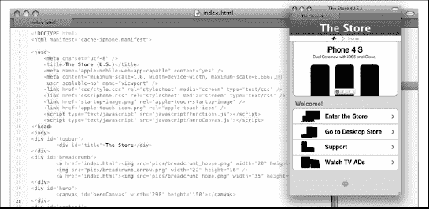

**图 3–1。** *Espresso 是一个很好的网页编辑器，有很多有用的功能，比如 LivePreview。*

本章末尾的[表 3–30](#tab_3_30)中列出的工具包括各种实用程序、优化器以及测试和调试工具，旨在帮助我们更高效地创建网站和 web 应用。

对于一个 web 开发人员来说，最重要的工具就是他将作为项目基础的框架，所以我们来分析一些有用的 iPhone 和 iPad 框架。

#### 开发框架

正如在第二章的[中的“iPad 模块模型”中提到的，iPad 设计的趋势是使用桌面方式，依赖于 iPad 完美呈现这类页面的能力。](02.html#ch2)

由于这个原因，我们在网上可以选择的 iPad 框架非常少(例如，JQuery Mobile，Sencha Touch)。如果我们想为 iPhone 开发，情况就完全不同了。现在我们有很多 iPhone 框架可以从网上免费下载。

出于我们的目的，我们将使用为 iPhone 开发网站或 WebApp 的最佳框架之一:iWebKit 框架。

##### 什么是框架，它是如何构成的？

计算机编程中的框架是一种抽象，它允许提供一般功能的公共代码被用户代码覆盖或定制，以提供更具体的功能。

框架具有以下具体特征:

*   **Control**

    整个程序的控制流程不是由调用者决定，而是由框架决定。

*   **Behavior**

    框架有一个默认的行为。此默认行为必须是有用的行为，而不是一系列的无操作(不执行任何操作)。

*   **Extensibility**

    框架可由用户通过选择性覆盖来扩展，或者由提供特定功能的用户代码来定制。

*   **Modifiability**

    框架代码不允许修改。用户可以扩展框架，但不能修改其代码。

在我们的上下文中， **WebApp 框架**是设计用来支持动态网站或 WebApp 开发的软件。这种框架旨在减轻与 web 开发中执行的常见活动相关的开销，并促进代码重用。

所提出的框架共享相同的结构，并提供 3 种资源:

*   **HTML Templates (page-name.html)**

    HTML 模板是作为例子给出的；我们所需要做的就是使用这些作为我们的起点，并根据我们的特定需求定制这些页面。

*   **CSS File (file-name.css)**

    CSS 文件定义了页面，苹果原生的布局和 HTML 页面中使用的所有标签。

*   **JavaScript File (file-name.js)**

    JavaScript 文件定义了所有 HTML 页面中使用的类似本机的行为

从一个框架到另一个框架的变化将是项目(文档)结构，文件如何组织，以及我们使用的 CSS 类名或 JavaScript 函数名。除此之外，它们在终端用户交互方面的功能都是相同的。

**注:**我们可以用不同的框架达到相同的最终结果。使用为我们的开发需求提供“最佳”特性的框架是一个好主意。

现在是时候看看这些框架能提供什么了。

##### 用于 iPhone 的 iWebKit 5 框架

iWebKit Framework 5.04 ( [图 3–2](#fig_3_2))将用户界面(UI)分为不同的`
`元素，用于顶栏、内容区域、页脚和其他块元素。给`
`分配一个特定的 id，我们可以把它归类为一个特定类型的用户界面元素。

**图 3–2。***iPhone 主页的 iWebKit】*

###### 连接框架元素

为了链接框架元素，我们需要在 HTML 文档头中插入一个从页面到 CSS 和 JavaScript 文件的链接。

`<meta content="yes" name="apple-mobile-web-app-capable" />
<meta content="minimum-scale=1.0, width=device-width, maximum-scale=0.6667,
 user-scalable=no" name="viewport" />
<linkhref="css/style.css" rel="stylesheet" type="text/css" />
<scriptsrc="javascript/functions.js" type="text/javascript" language="JavaScript" >
</script>`

###### UI 元素:标题栏

内容栏充当页面标题的容器。通常在这个区域的两边，我们有一个或多个后退或导航按钮。该区域定义如下:

`

`

在标题栏内，我们将添加一个标题:

`

        
iWebKit 5 Demo

`

然后我们添加一个导航按钮:

`

        
iWebKit 5 Demo

        

                <a href="http://iwebkit.net" class="noeffect">PC Site</a>
        

`

`id="leftbutton"`指定了一个包含在标题栏上的左按钮。我们还可以使用`id="rightbutton"`在标题栏的右侧包含一个右按钮。

或者，我们可以使用`

`或`

`在标题中添加多个导航按钮。多个按钮使我们能够实现可视化的导航路径，就像桌面网站中可点击的面包屑轨迹一样。

例如，请注意下面的[图 3–3](#fig_3_3)中显示的页面标题中的导航。我们可以选择返回上一次访问的页面(“表单”页面)或跳回主页(房屋图标)。

**图 3–3。***iWebKit 框架:标题栏(左)和导航路径(右)*

提供一个可以将用户带到我们网站桌面版本的按钮也很重要(见[图 3–3](#fig_3_3)，左侧)。这是因为我们的移动信息架构中的一个基本步骤是优先选择内容作为原始桌面版本的子集。换句话说，有时用户无法使用移动应用访问桌面版网站中的所有信息。

在标题栏下方，我们还可以使用`<divid="tributton">
`添加一个补充导航栏。

`

        

                <a id="pressed" href="#">Home</a>
                <a href="changelog.html">Changelog</a>
                <a href="about.html">About</a>
        

`

###### UI 元素:内容区域

内容区域充当页面所有内容元素的容器。该区域定义如下:

`

`

所有的页面内容都将放在这种内容包装器中，如图[Figure 3–4](#fig_3_4)所示。

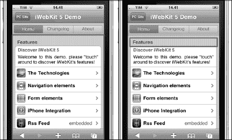

**图 3–4。***iWebKit 框架:内容区域(左)和灰色标题(右)*

###### UI 元素:内容框容器

内容框充当内容的容器。通常，在这个区域的顶部，我们有一个使用``定义的标题，两个元素都使用:

`Features`

类`graytitle`用典型的 iOS 浮雕样式定义了标题，在这个标签下面，我们有一个内容框容器，使用:

`<ul class="pageitem"></ul>`

在这个`pageitem`容器中，我们可以定义许多不同类型的元素，每种元素都有自己的风格，定义在 CSS 类或 id 中。

###### UI 元素:文本框

使用`textbox`类，我们为文本定义了一个框，通常用作页面的描述。

`<li class="textbox">
`

在[图 3–5](#fig_3_5)中，我们可以看到`textbox`如何包含另外两个元素，一个文本框标题和一个描述。

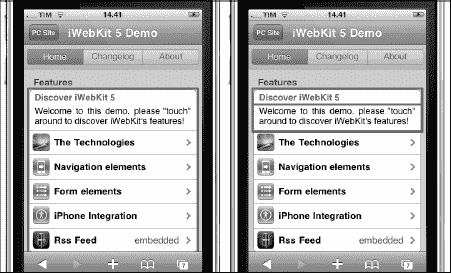

**图 3–5。***iWebKit 框架:内容框容器(左)和文本框标题和描述(右)*

###### UI 元素:文本框标题和描述

在`textbox,`中，我们可以定义任何类型的标准 HTML 内容，但是在本例中，我们使用一个框架类来添加一个标题，使用:

`        Discover iWebKit 5`

然后，我们可以加上一段描述:

`<li class="textbox">
        Discover iWebKit 5
        
Welcome to this demo. please &quot;touch&quot; around to discover
 iWebKit&apos;s features!

</li>`

###### UI 元素:菜单项

菜单项是我们用户界面的主要组成部分。现在，我们将定义一个类似设置的菜单，它是使用以下内容定义的:

`<li class="menu">
        <a href="technology.html">
                
                The Technologies
                ` `        </a>
</li>`

每一行都由一个列表元素`<li class="menu"></li>`组成，该元素包含一个链接元素``，该元素包装了另外三个标签:左边的一个图像``，一个文本``，以及右边的一个图标``。

如果我们想要添加更多的链接(行),我们需要添加如上所述的其他块。

###### UI 元素:页脚

页脚，如[图 3–6](#fig_3_6)所示，可以用来添加任何关于站点的相关信息，在这里是关于框架的信息。页脚的定义使用:

`

        <a href="http://iwebkit.net">Powered by iWebKit</a>

` 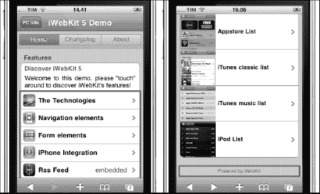

**图 3–6。***iWebKit 框架:其主页底部和应用商店列表页面*

到目前为止，我们已经分析了 iWebKit 主页及其结构。如[图 3–7](#fig_3_7)所示，该框架提供了许多其他页面样式，包括:

*   经典列表
*   App Store 列表
*   iTunes 经典列表
*   iTunes 音乐列表
*   iPod 列表

即使有所有这些选项，方法总是相同的:打开代码，分析它，然后开始按照您的项目需求定制它。通过使用源代码，我们可以在不知道框架的情况下开始使用它。

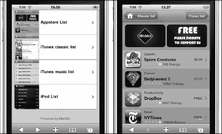

**图 3–7。***iWebKit 框架:其他页面列表样式和 App Store 列表页面*

下面是一个帮助您了解 iWebKit 框架的练习。

**探索 IWEBKIT 框架**

这里有一个练习，可以增加你对可能遇到的每个框架样式或页面元素的了解。以下是指导方针，逐步显示在这个练习中你需要做什么。

1.  从[http://iwebkit.net/](http://iwebkit.net/)下载 iWebKit 框架
2.  在您喜欢的开发 IDE 中打开文件“applist.html”。
3.  使用您的设备在 Mobile Safari 中打开页面“applist.html”的预览
4.  首先在代码中插入注释，解释每个标签的特征。如果你需要一个例子，回头看看上面我介绍 iWebKit 主页的那一段。
5.  尝试添加、删除或自定义框架元素。

对 iWebKit 框架中的所有其他页面样式重复这个练习。一旦你完成了这个练习，你就完成了准备开始使用和定制框架的第一步。

前面的内容实际上只是对 iWebKit 结构的介绍；我们将从第 8 章(创建 WebApps:移动应用开发)开始详细了解如何使用这个框架。

#### 移动网站

移动 iPhone 或 iPadweb 站点是专为苹果设备设计的，不应与在移动浏览器上查看桌面浏览器的站点相混淆。这类网站的特点是典型的 iOS 环境风格。

正如我们前面看到的，在本书的信息架构部分，桌面和移动版本之间的内容从来都不相同。在大多数情况下，移动网站提供主要内容的一个子集，并以优先的方式提供。但首先让我们看看移动市场是如何发展的。

苹果设备出现之前的移动网络就像十年前的网络一样:速度慢，使用成本高，而且没什么好看的。

**注:**在计算中，分辨率无关是指计算机屏幕上的元素可以以独立于像素网格的尺寸绘制的概念。

我们可以推测出移动网站的一些优点和缺点，如下所示:

**优点**

*   使用与桌面版本相同的 Web 标准创建
*   易于维护和发布
*   提供更高级别的用户体验(设备核心功能交互)
*   提供移动服务

cons

*   提供的内容有限
*   由于网络延迟，加载缓慢

### 移动应用

移动 iPhone 或 iPadWebApp 不需要从 App Store 下载并安装在设备上。使用 HTML、CSS 和 JavaScript，WebApps 能够在移动 Safari 浏览器中运行时为最终用户提供类似本机的应用体验。[图 3–8](#fig_3_8)展示了两个知名的 web app:mobile me 和 GoogleLatitude。

**注意:**在本书中，从现在开始，我将使用单词 *native* 来指代真正的 iOS 原生应用，使用术语 *native-like* 来指代我们的 WebApp，它是为了模拟 iOS 的(真正的)原生用户界面而构建的。

具有类似本地应用体验的 WebApp 提供了一个不同的范例。这种实时范例基于在当前视图中执行动作的触摸。正如我们将在下一节“WebApp 的四种不同方法”中看到的，这是一种 4 级(类似本机)体验，代表了这种设备上可能的最高级别的用户体验。这种体验与桌面体验非常不同，桌面体验是基于页面隐喻的，在页面隐喻中，点击等同于刷新视图中的内容。

**图 3–8。** *两个著名的 WebApps:苹果的 MobileMe(左)和谷歌的 Google Latitude(右)*

通过使用 WebKit，iPhone(甚至在更大程度上，iPad)可以以一种完美可用的方式呈现尚未针对移动设备进行优化的 web 应用，包括 DHTML 和 Ajax 支持的内容。

出于这个原因，我们现在看到，移动网络的大部分使用来自具有更好浏览器的设备(通常是基于 WebKit 引擎的浏览器)，在一些市场中，比例为 7:1。

在探讨 WebApp 的利弊之前，我们需要考察一下 Web 开发模型(WDM)。

### Web 开发模式

web 开发模型(WDM)用于使用 HTML、CSS 和 JavaScript 等 Web 标准开发 iPhone 和 iPad (web)应用。

#### Web 开发模式:利弊

正如我们在[第二章](02.html#ch2)中看到的，不同的项目有不同的需求。有些应用比其他应用更适合 web 开发模型(WDM)。了解利弊将有助于我们做出正确的决定，哪条道路可能更合适。

自 2008 年第一个 SDK 发布以来，许多事情都发生了变化，WebApp 与原生应用之战开始了。今天，在 2011 年，随着最新版本的 HTML 和 CSS 以及最近全球范围的网络升级，事情明显不同了。

尽管本地应用和 web 应用之间的差异仍然存在，但茶叶似乎表明，在未来这种差距将在某种程度上缩小。2010 年 5 月，在 I/O 开发者大会上，谷歌宣布基于 Android 的 web app 将很快获得本地硬件功能(运动传感器、摄像头和谷歌的语音识别)。对我来说，这一事实表明，一旦 Android WebApps 能够访问硬件功能，iOS WebApps 将不会等待很长时间来遵循相同的路径，并填补 WebApps 和原生应用之间的最后差距

在我们等待这激动人心的一天的同时，我们需要对我们的项目进行彻底的研究，以便清楚地了解它的需求，并能够选择正确的方法来实现项目的目标。

本质上，在以下情况下，WebApp 是更好的选择:

1.  我们需要经常更新我们的内容。
2.  我们不需要苹果商店的任何功能。
3.  我们不需要特别快的图形性能。
4.  我们不依赖于本机功能。
5.  我们不依赖于在后台运行我们的应用。
6.  我们不依赖发送(推送)通知。

如果我们的应用不是游戏，不需要摄像头、GPS、加速度计、多媒体声音/图形、大量视频或完全离线访问，那么编写 WebApp 可能是个好主意。一个好的 WebApp 的例子是用于 iPad 的 Gmail WebApp，如[图 3–9](#fig_3_9)所示。

本地应用当然应该更快，因为我们可以定义我们的缓存策略、网络服务和事件/线程模型。本机应用也在用户的控制之下，用户决定安装、更新和卸载什么。唯一涉及网络的部分是获取安装包的过程。相反，WebApps 在服务器的控制下，最终可能会离线，在这种情况下，更新必须由应用的创建者发起和实现。

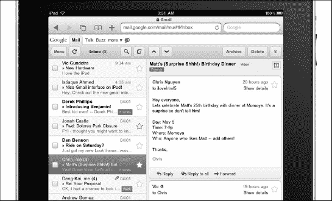

**图 3–9。** *谷歌为我们提供了一个如何为 iPad 开发 WebApp 的好例子。*

本机应用还可以访问摄像头、GPS(不仅仅是 WebApp 中的单一地理位置)和其他很酷的硬件功能，如加速度计。他们还可以在自己的本地数据存储中保存和访问数据，甚至能够使用 SQLite，从另一个应用访问数据，并允许完全离线访问其内容。

iTunes 应用商店页面上也有原生应用，提供大量免费流量、推广和收入。

**图 3–10。***Google Reader:MobileRSS 原生 UI(左)和 Google Web UI(右)的比较*

另一方面，Safari 中 JavaScript 引擎的速度有了很大提高，我们现在能够编写与原生应用具有相同性能的 web 应用，至少在大多数情况下是如此。使用 HTML 缓存系统，我们还可以提供对 WebApp 数据的离线访问。在[图 3–10](#fig_3_10)中，我们可以看到我们如何通过 Google Reader WebApp 实现类似本地的用户体验。[图 3–10](#fig_3_10)还显示了原生应用 MobileRSS 和类似原生应用 Google Reader 之间的比较。

如果我们的应用不是游戏，不需要摄像头、GPS、加速度计、多媒体声音/图形、大量视频或完全离线访问，那么编写 WebApp 可能是个好主意。现在，我们可以继续我们之前的讨论，编辑两个易于阅读的列表，列出 WebApps 的一些重要优点和缺点，我们将继续进一步讨论。

web 应用的一些优点有:

*   目标-不需要 C 技能
*   不需要订阅苹果开发计划
*   不需要在运行 OSX 的 Mac 上开发
*   Web 标准技能可以在其他开发领域重用
*   开发生命周期很快
*   Bug 修复是实时的
*   企业 WebApp 不需要企业许可证
*   WebApps 不需要下载和安装
*   苹果和非苹果设备都可以访问 WebApps
*   WebApps 将在每一台装有浏览器的设备(手机或台式机)上运行
*   WebApps 可以用 PhoneGap 这样的工具打包到本地应用中
*   我们不必与苹果分享我们的收入

web 应用的一些缺点有:

*   在一些繁重的环境中，web 应用比本地应用要慢
*   一些复杂的用户界面效果很难实现
*   存储在文件系统中的数据不可访问
*   某些硬件功能不可访问
*   如果我们想为应用收费，个人支付系统是必需的

其中一些观点非常相关。我喜欢 Objective-C，我喜欢编程，我喜欢原生方法范例，但是通过使用 WDM，许多有创造力的网页设计者和开发者将能够重用他们的(网页标准)技能，并立即开始在 iPhone 和 iPad 上工作。

能够及时修复漏洞也是一个重要的优势。有了 WDM，修复一个错误是几天的事情，有时是几个小时，我们只需要修复错误并将修复上传到服务器。每当我们修复原生应用中的一个 bug，苹果就会开始一个新的审批流程。这个过程超出了开发人员的控制，有时会有压力。在第 12 章中，我们将看到如何部分解决这个问题，但是在一般情况下这个问题仍然存在。

要讨论的另一个重要的“优点”是，从开发人员的角度来看，构建 web 应用而不是本地应用提供了开发跨平台应用的机会。

我知道您在想什么:谁关心跨平台开发？我在这里不是要告诉您为 Android 或 WebOS 开发(尽管在信息架构过程中考虑这些设备可能不是一个疯狂的想法)，但是我会建议开发一个具有高度可移植性的项目是一个目标，您可能不想低估它的价值。在开发 iOS WebApp 的过程中，你只需对代码做最少的修改，就能为 Android 或 WebOS 创建相同的 WebApp。

今天，跨平台开发不仅仅意味着为不同的品牌开发。有了分辨率为 480×320 像素、分辨率为 163 ppi 的旧 iPhone，分辨率为 960×640 像素、分辨率为 326 ppi 的新 iPhone 4 和 iPhone 4 S，分辨率为 1024×768 像素、分辨率为 132 ppi 的 iPad，以及新的 iPod 系列，我们必须能够处理许多具有类似服务和操作系统的不同设备。

**注:**记住，对于第四代 iPhone，我们有两种不同的屏幕分辨率:新款 iPhone 4 和 iPhone 4 S 的 326 ppi 下的 640×960，以及旧款的 163 ppi 下的 320×480。我们也有两个不同的固件历史:iPhone 2G 和 3G 都运行旧的 iPhone OS 3.1.3(或更早版本)，iPhone 3G S、iPhone 4 和 iPhone 4 S 以及 iPad 运行最新的 iOS 固件；此外，多任务只能从 iOS 4 开始使用。

必须区别对待这些设备，因为它们的硬件不同，性能不同，提供的服务也不同。我们拥有的是一个伪跨平台场景，我称之为跨平台上下文中的**。每年都会推出新的 iPhone 型号，从现在开始，每年都会宣布新的 iPad 型号，因此最好准备好使用内部跨平台方法进行开发，因为我们迄今为止看到的只是开始。**

最后一个非常重要的优势是，WebApp 可以通过 PhoneGap 这样的开源工具打包成原生应用。通过这种方式，你可以两全其美:编写一个 WebApp，然后从它生成一个本地应用。

#### web app 的四种不同方式

当我们为可以在浏览器中运行的 WebApp 开发网站时，我们可以从四种不同的方法中进行选择。所有这 4 种 web 应用都是使用相同的 web 标准编写的，如 HTML4、HTML4、CSS2、CSS3 和 JavaScript(1.6 版以及 1.7 和 1.8 版的一些功能)，但每个级别提供的用户体验质量是不同的。

##### 第 1 级:兼容

这是一种基本的开发方法，旨在为苹果的所有移动设备提供完全兼容的结构。这种结构使用 HTML4 和 CSS2 标记，并且基于块，以便于导航和缩放，如图[图 3–11](#fig_3_11)所示。然而，对于移动用户来说，它仍然过于面向桌面。

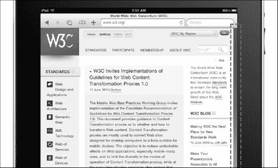

**图 3–11。** *兼容的网站:W3C 官方网站没有针对 iPad 的优化布局。*

这种级别的方法还必须避免不支持的技术，如 Flash、Java 和其他插件，并且确实不做任何专门针对 iPhone 或 iPad 用户的事情。这里的主要目标是确保不设置任何障碍来阻止令人满意的浏览体验。

所有不使用不支持的技术的在线 W3C 标准 WebApp 都属于第一类。

##### 二级:优化

对苹果设备的第二级支持旨在提供基本的移动用户体验。这意味着布局仍然是面向桌面的，尽管网站或 WebApp 使用 HTML5、CSS3 进行标记，并使用 JavaScript 提供用户交互，但它以非常基本的方式使用它们，不支持 WebKit 浏览引擎提供的最新功能。它也不提供任何硬件交互，如 GPS 地理定位，或一触式短信和电话。[图 3–12](#fig_3_12)显示了一个优化的 WebApp 的例子。

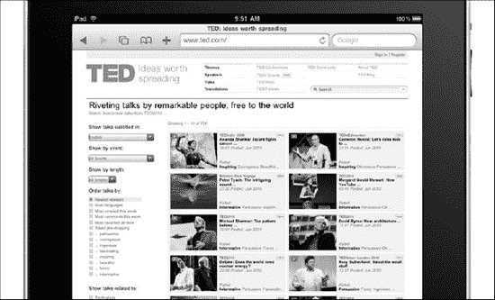

**图 3–12。** *一个优化的网站:TED 网站在其页面中使用 HTML < video >标签。*

每个网站或 WebApp 都应该至少属于这一类，尤其是如果有一个指向专用或本地资源的活动重定向。苹果官方网站上推广的支持 iPad 的网站属于第二类。

##### 第三级:专用

第三级支持的主要区别是定制的视口尺寸。这是真正的移动用户体验的第一步。然而，尽管这些网站和 web 应用是为 iPhone 或 iPad 浏览而定制的，但它们并不试图模仿原生的 iOS 用户界面。[图 3–13](#fig_3_13)显示了一个专用 WebApp 的例子。

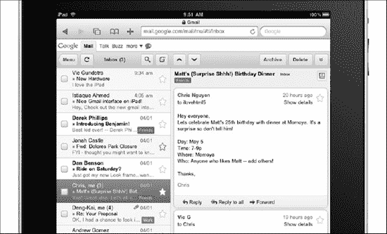

**图 3–13。** *专用的 web app:Gmail 页面中空格的使用是面向 iPad 的。*

这些网站和应用使用 HTML5、CSS3 进行标记，并通过 JavaScript 提供用户交互，但以非常基本的方式使用这些标准，不支持 WebKit 浏览引擎提供的最新功能，也不提供 GPS 地理定位或一触式 SMS 和电话等硬件交互。

在这第三个层次的方法中，我们有一个 WebApp 的所有 iPhone 和 iPad 专用(移动)版本。

##### 第四级:类似原生的

类似原生的方法提供最高级别的移动用户体验，旨在模拟原生 iOS 用户界面，提供与设备服务的直接集成，包括电话、消息、邮件、联系人、地图和通过 GPS 或 GSM 三角测量的地理定位服务。[图 3–14](#fig_3_14)显示了一个类似本地的 WebApp 的例子。

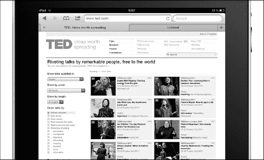

**图 3–14。** *一个类似原生的 WebApp:使用类似原生结构设计的苹果商店用例*

为了在项目中与客户的需求保持一致，考虑和评估我们想要在信息架构过程中使用哪种程度的开发方法是很重要的。

#### web 应用和本地应用:对用户来说有什么不同

开发一个在移动 Safari 上运行的 WebApp 与一个作为原生应用运行的 web app 有一些基本的区别。到目前为止，我们已经从发展的角度看到了这些差异。

下一个问题是:对最终用户来说，有什么明显的不同吗？当移动用户依赖一个 WebApp 时，用户体验会有什么变化？

##### 用户界面

正如我们在[第 2 章](02.html#ch2)中看到的，web 和原生应用用户界面由两部分组成:原生用户界面(NUI)和可视区域。

一般来说，原生用户界面随着从原生到 WebApps 而改变。它由以下模块组成:

*   **WebApp**

    状态栏

    栏 URL(移动 Safari)

    标题栏

    底部栏(iPad 上没有)

*   **Native Application**

    状态栏

    标题栏

    下鼠笼条

当在 Mobile Safari 中呈现我们的 WebApp 时，我们必须处理状态和标题栏之间添加的栏，如图[Figure 3–15](#fig_3_15)所示。我们可以使用 meta 标签来解决这一差异，并获得与原生应用完全相同的外观和感觉。

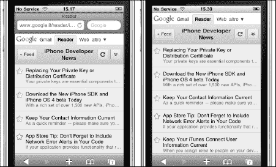

**图 3–15。** *从 WebApp 到类似原生的观感:iPhone 上的 Gmail。*

你将在第 8 章中看到如何模拟本地应用的外观。NUI 的底部也从原生更改为 WebApp，由以下部分组成:

*   **WebApp**

    应用选项和功能栏

*   **Native Application**

    移动 Safari 底部栏

这是一个无法解决的问题，因为我们无法通过 meta 标签来隐藏它。我们可以做的是在它上面放置一个页脚，但是这种做法会从可视区域窃取更多的像素，在大多数情况下不推荐这样做。

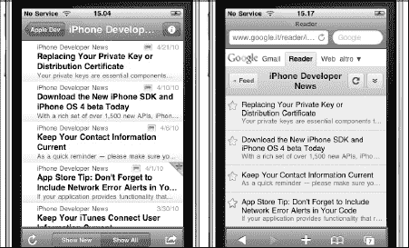

**图 3–16。** *Native 和 WebApp UI 对比:两个不同的底栏*

就我个人而言，我不认为这最后一点是一个真正的问题。让移动 Safari 的底部栏可见，如[图 3–16](#fig_3_16)所示，对我来说很有意义。由于我们使用 Mobile Safari 作为应用的自然环境，从语义的角度来看，这就像有一个原生的底部栏。

##### 用户体验(UX)

用户体验是一个广泛的话题，遍及我们的 web(和本地)应用的许多领域。除此之外，我们还可以发现原生应用和 web 应用之间存在显著差异的一个主要领域:应用控件。

在本机应用中，用户可以更改他的应用的许多设置，并以这种方式对用户体验进行某种控制。用数学术语来说，他可以定义用户体验的几个子集。这在 WebApp 中是不可能的，因为除了创建模仿本地选项页面的外观和感觉的选项页面，我们唯一可以交互的选项是移动 Safari 设置。这些设置不会改变用户体验，因为浏览器和 WebApp 是两个不同的实体。换句话说，您可以在 Mobile Safari 中更改的设置不是 WebApp 的设置。

**图 3–17。** *Native 和 WebApp UI 对比:呈现应用选项的两种不同方式*

谷歌界面为我们提供了一个解决这个问题的很好的例子，它使用下拉菜单呈现了有用选项的子集，如图[图 3–17](#fig_3_17)所示。这个优秀设计的例子并没有真正解决问题，但是它确实极大地改善了用户体验。

另一个明显的区别是，WebApp 需要在我们打开浏览器后再打开。启动操作分为两步:打开浏览器，打开 WebApp。

对于这个问题，我们可以使用 iOS 的功能来创建一个链接到我们的 WebApp 的跳板图标，我们只需点击一下就可以启动它，就像我们对其他所有原生应用所做的那样。我们在第 8 章中讨论了这一点。

##### 人机交互

与基于 Safari 的 WebApp 相比，用户与原生编译应用的交互反应更灵敏(人机交互)。这是因为两个原因:

*   网络脚本的解释性
*   WebApp 的网络依赖性

然而，尽管有技术限制，我们可以执行优化阶段，以实现可接受的性能。其中一些技术将在第 10 章中介绍。

在[表 3–1](#tab_3_1)中，我们可以看到**平台内**的另一个实例，因为我们必须处理在不同硬件上实现的三种网络协议:四个不同版本的 iPhone、一个版本的 iPad 和一个版本的 iPod Touch。

T2】

接下来，我们将介绍 web 标准、HTML 和 CSS 的新特性以及 JavaScript 最佳实践。

#### Web 标准:HTML、CSS 和 JavaScript

在本书中，我们将假设您已经了解 HTML、CSS 和 JavaScript 的基础知识。我们将在第 7 章中以面向苹果设备的方式接触 HTML、CSS 和 JavaScript，但在本书中，我们不会涉及网络标准的基础知识。原因是不可能从基础知识开始涵盖所有这三个(非常重要的)主题，并保持关注和实现我们的主要目标:展示如何为 iPhone 和 iPad 设计和开发的基础知识。

**注意:**如果你需要学习 HTML 和 CSS 基础，一本好书是来自 Apress 的《从 CSS 和 XHTML 开始 HTML》。

如果你需要了解 JavaScript 和 DOM 基础，一本好书是《用 DOM 脚本和 Ajax 开始 JavaScript:从新手到专业人员》Christian Heilmann (Apress 2006)。

然而，在我们进入第 7 章之前，我们现在要探讨的是那些 web 标准在开发阶段的作用，以及我们将如何使用这些新引入的特性来达到我们的目的。与此同时，如果你需要回到 web 标准的基础，找一本好书，填补你所缺少的知识的空白。

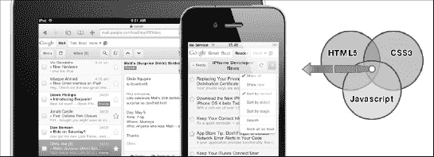

**图 3–18。** *基于 3 种 Web 标准的 iPhone 和 iPadWebApp、CSS 和 JavaScript*

在接下来的页面中，您会发现两个表格，一个包含 HTML 中的新标签，另一个包含所有的`<video>`标签属性，用作小型标准参考。

如[图 3–18](#fig_3_18)所示，HTML、CSS 和 JavaScript 用于实现以下目标:

*   HTML:页面结构(语义方面)
*   CSS:页面表现(美学术语)
*   JavaScript:页面行为(在用户交互方面)

##### HTML:介绍新功能

HTML 旨在成为 HTML4 的后继者，旨在通过制定关于如何处理所有 HTML 元素以及如何从错误中恢复的精确规则来提高互操作性并降低开发成本。

在这之后，HTML 还允许开发人员通过更加语义化地表达内容来创建跨平台的设计。一个例子是一组新的标签，如`<header>`、`<nav>`、`<section>`、`<aside>`和`<footer>`，这些标签使内容更易于机器阅读，从而使移动浏览器和搜索引擎更容易正确处理内容。

HTML 中的一些新特性还包括嵌入音频、视频、图形、客户端数据存储和交互式文档的功能。HTML 引入的五个最激动人心的特性是:

*   **Web Workers**

    允许网页浏览器超线程(iOS5 支持)。使用单独的后台线程进行处理，而不会影响网页的性能。当我们开发 WebApps 时，以及(通常)当我们依赖繁重的脚本来执行功能时，这是一个重要的特性。

*   **Video Element**

    嵌入视频，无需依赖第三方(通常是专有的)插件或编解码器(苹果移动设备上没有)。现在，嵌入和操作视频就像嵌入和控制图像一样简单。

*   **Canvas**

    允许我们即时渲染图形和图像。在我们移动环境的某些情况下，使用画布而不是图像来节省带宽是非常有利的。

*   **Application Caches**

    能够在本地存储 WebApp，无需连接到互联网即可访问。对于任何开发 WebApps 的人来说，这是一个巨大的进步，因为现在他有了一个本地应用的有效替代品。

*   地理位置

该 API 使用与托管该 API 的设备相关联的高级接口(GPS)来定义位置信息。这是另一个很棒的功能，因为以前只有本地应用可以与 GPS 等很酷的硬件功能交互(即使只是针对单一的地理定位服务)。需要注意的是，HTML 的语义本质要求深入理解每个标签的确切含义。我们可以通过阅读 W3C 网站上的官方 HTML 参考来深入了解这一点。

**注意:**官方 W3C HTML 元素参考可从:`[http://dev.w3.org/HTML/html-author/#the-elements](http://dev.w3.org/HTML/html-author/#the-elements)`获得

在[Table 3–2](#tab_3_2)中，我已经按字母顺序列出了 HTML 中所有的新标签。这些标签将被添加到 HTML4 中旧的、受支持的、不被否决的标签中。HTML 仍然是一项进行中的工作；你可以在官方网页上看到完整的参考资料:`[www.w3.org/TR/HTML/](http://www.w3.org/TR/HTML/).`

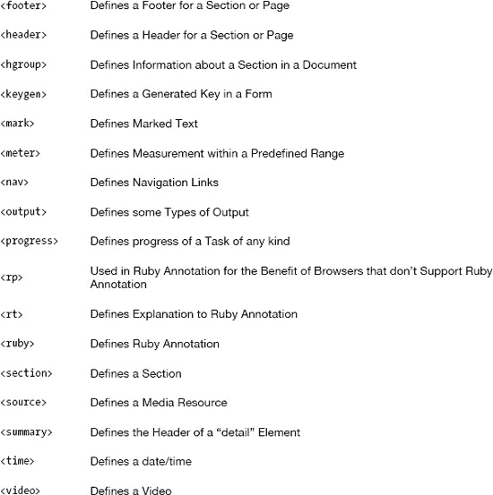

新的`<video>`标签是整个 HTML 列表中最著名的标签，因为苹果和 Adobe 之间关于 Flash 技术支持的争议众所周知。图 3–19 中显示了一个例子。

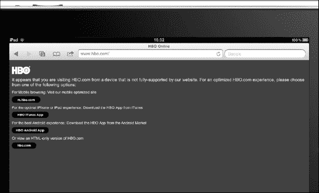

**图 3–19。***HBO 网站:iOS 不支持 Adobe Flash 技术，而是支持 HTML 视频标准。*

今天，如果我们想插入与任何苹果设备兼容的视频，我们需要使用这个标签。为此，在[表 3—7](#tab_3_7) 中，我们显示了每个`<video>`属性及其相关描述。

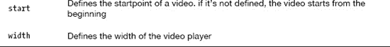

HTML 代码是:

`<videosrc="videos/name-of-the-video.mov" controls="true"É
poster="img/video-preview.jpg" width="300" height="200" />`

使用 HTML 为桌面开发还带来了浏览支持的兼容性问题，但在我们的环境(苹果移动设备)中，这个问题不存在，因为移动 Safari 支持上一个 HTML 草案中的所有新标签和功能。我们将在第 7 章更详细地考虑整个 HTML 标准。

##### CSS 3:介绍新功能

旧的 CSS2 规范太大太复杂，不能一大块更新，所以万维网联盟(W3C)把它分成了几个小块。包括的一些模块有:

*   盒子模型
*   多栏布局
*   背景和边框
*   列表模块
*   文本效果
*   超链接演示
*   语音模块

**注意:** CSS 仍然是一个“进行中”的项目，你可以在:`[www.w3.org/Style/CSS/current-work](http://www.w3.org/Style/CSS/current-work).`查看完整的模块列表

CSS 的主要影响是能够使用新的选择器和属性来实现新的设计功能，如动画或渐变，并以更容易的方式实现当前的设计功能。

现在我们将看到一些最常见的属性，这些属性将出现在我们为 iPhone 和 iPad 设计和开发的每个框架中。当我们扩展我们的框架时，了解这些属性将在第 8 章中有用。

**注意:**在所有 CSS 模块达到推荐状态之前，每个浏览器供应商都有能力决定如何实现那些属性。由于这个原因，在每个属性前面都有一个专有的前缀。

特定于供应商的前缀的目的是让其他呈现引擎知道可以安全地忽略该属性而不会产生错误，同时让开发人员知道这些属性是实验性的，并不完全受支持，即使 W3C 计划这样做。

一旦 CSS 被完全定义、支持，并正式成为 Web 标准，所有这些前缀都将被移除。

一个例子是:

`border-radius: 3px;`
`-webkit-border-radius: 3px;`(基于 WebKit 的浏览器实现)
`-moz-border-radius: 3px;`(基于 Gecko 的浏览器实现)

Safari(和其他基于 webkit 的浏览器)从版本 3 开始就支持带有-webkit-前缀的`border-radius`(从版本 5 开始不再需要)。

目前，当使用桌面网站和 WebApps 时，我们需要多次指定相同的属性，至少为每个最常用的浏览器指定一次，以便实现最低级别的 CSS 属性可访问性。

**注意:**在我们的苹果设备环境中，我们唯一需要做的事情就是实现 WebKit CSS，因为我们只会使用基于 WebKit 的浏览器，比如 Safari。

###### 边框半径

使用 CSS2 编码实现圆形边框可能很棘手，正如我们所知，iOS 到处都有圆形边框。有许多可用的方法，但是没有一个非常简单。这需要我们使用额外的标记，并为每个边界创建单独的图像。

使用 CSS，创建一个圆形的边界是令人难以置信的快速和容易。如[表 3–4](#tab_3_4)所示，我们可以将此属性应用于所有角或单个角，宽度和颜色很容易改变。

CSS 语法是:

`-webkit-border-radius: <length>;`

T2】

**图 3–20。***CSS 中圆形边框属性的例子(图片 Christian Krammer)。*

###### 边框图片

边框图像是最有用的附加功能之一——请注意，iPhone 上所有从底部滑入的大按钮也可以用这个属性来设计。CSS 能够根据您的选择重复或拉伸边框图像，如[表 3–5](#tab_3_5)和[图 3–21](#fig_3_21)所示。

CSS 语法是:

`-webkit-border-image: <source><slice><width><outset><repeat>;`

T2】

**图 3–21。***CSS 中边框图像属性的例子(images Christian Krammer)。*

###### 渐变

渐变是完全在 CSS 中指定的浏览器生成的图像，由几种颜色之间的平滑渐变组成。渐变是使用`-webkit-gradient`函数指定的，可以代替图像 URL 传递。有两种类型的渐变，线性和径向。您可以指定多个中间颜色值，称为色标，渐变功能会在它们之间插入颜色值。

您用来创建颜色停止的函数称为`color-stop`。将该函数作为参数传递给`-webkit-gradient`函数，以指定线性和径向渐变的开始、中间和结束颜色。指定色标之间的颜色被内插，如[表 3.6](#tab_3_6) 和[图 3–22](#fig_3_22)所示。

CSS 语法是:

`-webkit-gradient ( <gradient-line><color-stop><color-stop><color-stop> );
-webkit-gradient ( <gradient-line><color-stop><color-stop><color-stop> );`

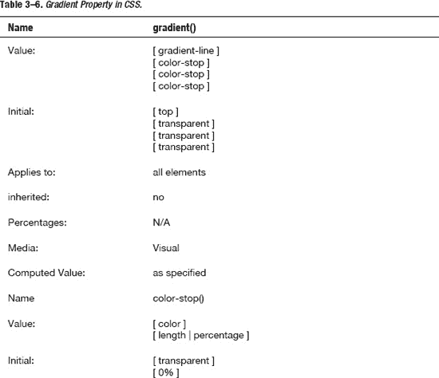

**图 3–22。***CSS 中渐变属性的例子。*

###### 盒子尺寸

新的盒子模型是 CSS 草案中最广泛的领域之一。这个框大小方面允许您定义某些元素以某种方式适应某个区域。如果出于某种原因，我们想在用户界面中设计一个两列边框的框，并将这两个框并排放置，使用这个模型就可以实现。这将强制浏览器呈现具有指定宽度和高度的框，并将边框和填充放置在框内。

CSS 中的框大小属性如[表 3–7](#tab_3_7)所示，CSS 语法为:

`-webkit-box-sizing: <box-sizing value>;`

T2】

###### 方框阴影

用 CSS2 添加一个盒子阴影是困难的；通常我们需要使用额外的标记。当我等待在不久的将来切换到一个完整的 CSS 网站时，我个人已经为我的网站添加了一个额外的`
`，以便为主要内容添加一个纸阴影效果。CSS 替代方案更加优雅和简洁。

CSS 中的方框阴影属性如[表 3–8](#tab_3_8)所示，CSS 语法为:

`-webkit-box-shadow: <offset-x><offeset-y><blur radius><color>;`

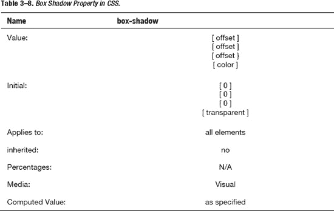

[Figure 3–23](#fig_3_23)展示了 CSS 中方框阴影属性的一个例子。

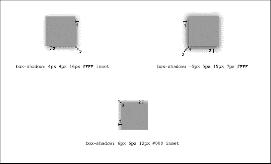

**图 3–23。***CSS 中方框阴影属性的例子(图片 Christian Krammer)。*

###### 概述

CSS2 中已经提供了设置元素轮廓的功能，但是在 CSS 中包含了根据我们定义的值来偏移元素轮廓的功能。它在两个方面不同于边框:

*   轮廓不占用空间
*   轮廓可以是非矩形的

**注意:**所有的轮廓形状都是长方形，但一个轮廓可以是长方形的集合体。

CSS 中的大纲属性如[表 3–9](#tab_3_9)所示，CSS 代码为:

`outline: <width><style><color>;
outline-offset: <offset>;`

T2】

###### 背景尺寸

在 CSS 出现之前，背景大小是由所用图像的实际大小决定的。这个新的 CSS 属性使得用百分比或像素来指定所需的背景图像大小成为可能。当模拟 iOS 用户界面时，我们总是尽可能使用 CSS 属性而不是图像。

在任何情况下，`background-size`属性，在需要的地方，将允许我们在几个不同的上下文中重用图像，并且扩展背景以更精确地填充区域。

CSS 中的背景大小属性如[表 3–10](#tab_3_10)所示，CSS 语法为:

`-webkit-background-size: <length-x><length-y>;`

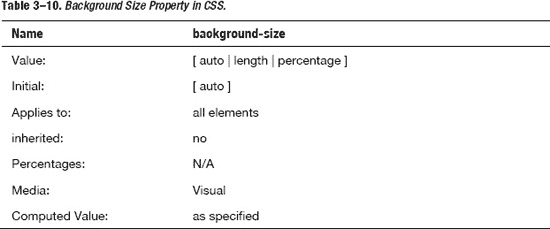

[图 3–24](#fig_3_24)展示了 CSS 中背景大小属性的例子。

**图 3–24。***CSS 中背景大小属性的例子。*

###### 背景由来

CSS 还允许我们指定如何计算背景的位置，如[Table 3–11](#tab_3_11)所示。这允许在放置背景图像方面有很大的灵活性。

CSS 语法是:

`background-origin: <origin-value>;`

[图 3–25](#fig_3_25)显示了 CSS 中背景原点属性的例子。

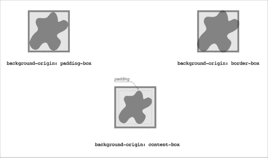

**图 3–25。***CSS 中背景起源属性的例子(图片克里斯蒂安·克拉默)。*

###### 多重背景

使用多种背景的新功能可以节省大量时间，并允许我们实现以前需要多个背景的效果。多种背景属性与 backgroundsize 相结合，为我们提供了一个强大的工具，以缩小本机 UI 外观和我们的模拟(web)用户界面之间的差距。

CSS 中的多重背景属性如[表 3–12](#tab_3_12)所示，CSS 代码为:

`background: <source-1><position><repeat>, <source-n><position><repeat>;`

[Figure 3–26](#fig_3_26)显示了 CSS 中多重背景属性的例子。

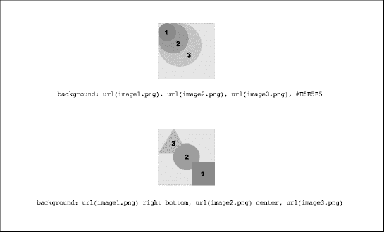

**图 3–26。***CSS 中(多个)背景属性的例子。*

###### 文字阴影

对于想要模仿原生 iOS 用户界面的人来说，文本阴影是一个基本的 CSS 属性。iOS 中几乎所有的文字都是浮雕的，我个人觉得可读性很强。

CSS 中的文本阴影属性如[表 3–13](#tab_3_13)所示，CSS 代码为:

`-webkit-text-shadow: <offset-x><offeset-y><blur radius><color>;`

T2】

文本阴影属性的示例如[Figure 3–27](#fig_3_27)所示。

**图 3–27。***CSS 中文本阴影属性的例子(图片 Christian Krammer)。*

###### 文字溢出

文本溢出是 iOS 本地用户界面仿真中涉及的另一个基本属性。菜单标题中的省略号表示菜单允许的不仅仅是简单的点击查看结果操作(例如，选择一个网络…)，但是在 iPhone 环境中，标题经常会溢出标题栏，如果我们使用标题栏左侧和右侧的按钮来帮助用户更好地浏览内容，情况会更糟。

在这种情况下，text overflow Text Overflow 属性允许我们用一些漂亮的省略号(“…”)来剪辑文本，作为对用户的视觉提示，文本已经被剪辑。有了 iPad，这个问题就不再存在了，因为屏幕更大了。

文本溢出属性如[表 3–14](#tab_3_14)所示，CSS 语法为:

`text-shadow: <overflow-value>;`

T2】

###### 自动换行

使用 CSS2，如果一个单词太长而不能放在一个区域的一行中，它会扩展到外部。这种情况并不常见，但时有发生。新的自动换行功能，如[Table 3–15](#tab_3_15)所示，允许我们强制文本换行，即使这意味着在单词中间将其拆分。

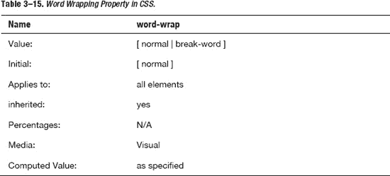

想象 CSS

CSS 语法是:

`word-wrap: <wrap-value>;`

CSS 代码是:

`word-wrap: break-word;`

###### 网络资源

这个新属性将是网页设计的革命性变化，但对于我们这些需要使用原生 iOS 用户界面的人来说，这个属性并没有那么有用。因为 Safari 的字体库中有 Helvetica。使用 web 字体属性可能意味着下载潜在的大文件，并有一些奇怪的标识来表示文本。

CSS 中的 web 字体属性如[表 3–16](#tab_3_16)所示，CSS 语法为:

`@font-face { <font-family>; <source>; }`

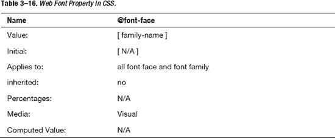

###### 点击高亮显示

在触摸屏设备范例中，我们所知的桌面用户体验中的悬停状态并不存在，但是通过这个有用的 WebKit 扩展，我们可以突出显示一个链接或一个 JavaScript 可点击的元素。也支持 alpha 通道。

CSS 中的点击高亮属性如[表 3–17](#tab_3_17)所示，CSS 语法为:

`-webkit-tap-highlight-color: <color>;`

###### 多列

从桌面的角度来看，多栏属性更令人兴奋，因为 iPhone 和 iPad 用户界面不经常使用多栏布局。在某些情况下，该属性对于实现一些漂亮的内容表示仍然很有用。这个属性允许我们指定文本应该分成多少列，以及它们应该如何显示。

CSS 中有四个与多列布局相关的属性，允许我们设置列数、宽度、每列之间的间距以及每列之间的边框。这 4 个属性是:

*   列计数
*   列宽
*   列间隙
*   列规则

CSS 中的多列属性如[表 3–18](#tab_3_18)所示，CSS 语法为:

`.TwoColumnLayout { <number-of-column><width><gap><rule> }`

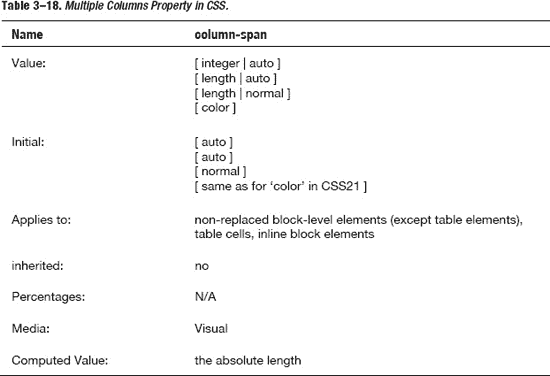

###### 跨越列

如果我们希望一个元素跨越多列，就使用这个属性；通常我们将它用于标题、表格或图像。

CSS 中的 span column 属性如[表 3–19](#tab_3_19)所示，CSS 语法为:

`column-span: <number-of-column>;`

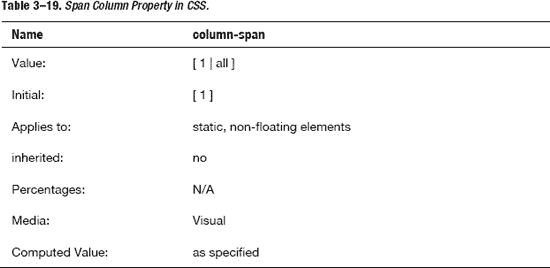

###### 过渡

属性可以用来扩展 CSS 属性值的修改，比如高度、宽度或颜色。并不是所有的属性都可以用过渡来制作动画，但是对于 iPhone 和 iPad 开发来说，所有重要的属性都在列表中。

第一个值表示正在转换的属性，第二个值控制持续时间，第三个值控制转换的类型。

CSS 中的过渡属性如[表 3–20](#tab_3_20)所示，CSS 语法为:

`-webkit-transition: <property><time><function>;`

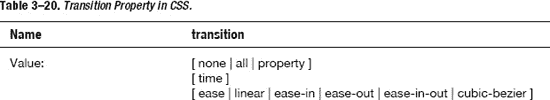

[Figure 3–28](#fig_3_28)显示了 CSS 中过渡属性的例子。

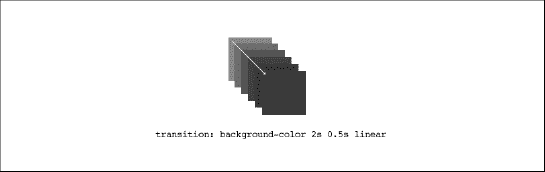

**图 3–28。***CSS 中过渡属性的例子(图片 Christian Krammer)。*

###### 变换

变换用于通过数学运算修改对象的几何图形。该属性是在页面之间模拟一些典型的 iOS 效果的基础，对于创建有趣的视觉效果和动画非常有用。

在`transform`属性中，一列转换函数将被用作值，并按提供的顺序应用。与其他 CSS 值完全一样，各个转换函数由空格分隔。

`transform`属性与 transform-origin 属性一起工作，设置过渡发生的原点。

可用的转换函数有:

*   **matrix(number，number，number，number，number，number)** 以六个值的变换矩阵的形式指定 2D 变换。`matrix(a,b,c,d,e,f)`相当于应用变换矩阵【a b c d e f】。
*   **translate(translate-value，translate-value)** 通过向量[tx，ty]指定 2D 平移，其中 tx 是第一平移值参数，ty 是可选的第二平移值参数。如果未提供 ty，则 ty 的值为零。
*   **translate X(translation-value)**指定 X 方向上给定量的平移。
*   **translate Y(translation-value)**指定 Y 方向上给定量的平移。
*   **scale(number，number)** 指定由 2 个参数描述的[sx，sy]缩放向量的 2D 缩放操作。如果没有提供第二个参数，它将采用与第一个参数相等的值。
*   **scaleX(number)** 使用[sx，1]缩放矢量指定缩放操作，其中 sx 作为参数给出。
*   **scaleY(number)** 使用[1，sy]缩放矢量指定缩放操作，其中 sy 作为参数给出。
*   **rotate(angle)** 根据 transform-origin 属性的定义，按照参数中指定的角度，指定元素原点的 2D 旋转。
*   **倾斜(角度，角度)**指定沿 X 和 Y 轴的倾斜变换。第一个角度参数指定 X 轴上的倾斜。第二个角度参数指定 Y 轴上的倾斜。如果没有给定第二个参数，则值 0 用于 Y 角度(例如，Y 轴上没有倾斜)。
*   **skewX(angle)** 指定一个给定角度的沿 X 轴的倾斜变换。
*   **skewY(angle)** 指定一个给定角度的沿 Y 轴的倾斜变换。

CSS 中的转换属性如[表 3–21](#tab_3_21)所示，CSS 语法为:

`-webkit-transition: <transform function> <type of effect>;
-webkit-transition-origin: <transform origin>;`

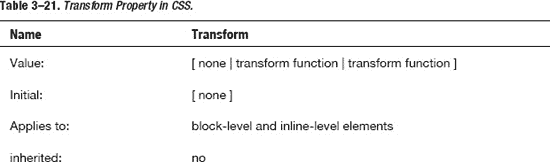
T4】

[Figure 3–29](#fig_3_29)显示了 CSS 中转换属性的例子。

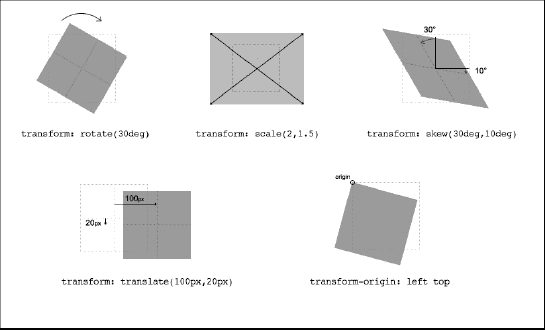

**图 3–29。***CSS 中变换属性的例子(图片 Christian Krammer)。*

###### 动画

与过渡类似，动画会随着时间的推移修改属性。使用`transition`属性，我们实现了从一个值到另一个值的单向效果。这种属性对于模拟 iOS 页面过渡或创建类似 Flash 的动画非常有用。

使用`animation`属性，我们可以提供任意数量的不一定是线性的中间值，实现相当复杂的动画。这些中间值称为关键帧，是所有动画过程的基础。

**注:**动画和电影制作中的一个关键帧，就是定义任何平滑过渡的起点和终点的一张图纸。它们被称为“帧”,因为它们在时间上的位置是以胶片上的帧来测量的。关键帧序列定义了观众将看到的图像，而关键帧在电影、视频或动画时间轴上的位置定义了移动的时间。

CSS 中的动画属性如[Table 3–22](#tab_3_22)所示，CSS 语法为:

`animation-name: <name>;
animation-duration: <time>;
animation-iteration-count: <integer>;
animation-timing-function: <function>;
@keyframes <name> {
        from {
                left: <start-x>;
                top: <start-y>;
        }
        to {
                left: <destination-x>;
                top: <destination-y>;
        }
}`

在我们的框架中，JavaScript 负责用户界面的行为，但是在许多其他情况下,`animation`属性提供了一个有效的替代方法。这个属性也是所有 CSS 模块中最复杂的。为此，我们将详细分析它的所有属性。更多详情见[表 3–23](#tab_3_23)。

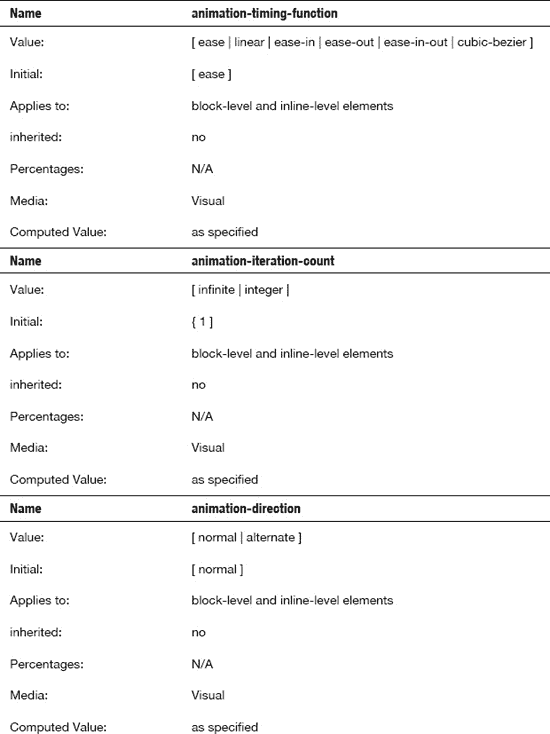

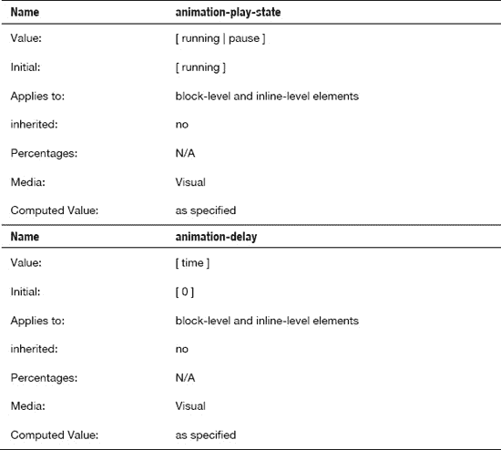

###### 关键帧

关键帧用于在动画过程中的不同点指定动画属性的值。关键帧指定动画的一个循环的行为；动画可以迭代一次或多次。

使用专门的 CSS at-rule 指定关键帧。一个`@keyframes`规则由关键字`@keyframes`组成，后面是给动画命名的标识符`animation-name`，后面是一组样式规则。

关键帧规则的 CSS 语法是:

`keyframes-rule: '@keyframes' IDENT '{' keyframes-blocks '}';
keyframes-blocks: [ keyframe-selectors block ] ;
keyframe-selectors: [ 'from' | 'to' | PERCENTAGE ] [ ',' [ 'from' | 'to' |
É
 PERCENTAGE ] ];`

下面的例子将产生一个动画，在五秒钟内将一个元素从(0，0)移动到(100px，100px)并重复九次(总共十次迭代)。请注意，我们没有使用上面列出的所有属性，因为我们不需要它们来实现这种特殊的效果。

###### 反思

没有其他 CSS 属性像反射属性一样具有苹果风格。在苹果商店的每一个产品展示上都会用到倒影，结合负空间的使用，这是实现漂亮整洁设计的一个很有价值的工具。

**注:**负空间，在艺术中，是图像主体周围和主体之间的空间。当主体周围的空间，而不是主体本身，形成一个有趣的或艺术相关的形状时，负空间可能是最明显的，并且这种空间偶尔被用作图像的“真实”主体的艺术效果。负空间的使用是艺术构成和视觉设计的关键要素。

为了达到最终效果，box-reflection 属性由 3 个参数或值组成。第一个参数设置反射的方向。第二个参数指定反射的偏移量。第三个参数是应用于反射的遮罩，使用名为`gradient`的属性传递。详情见[表 3–24](#tab_3_24)。

CSS 语法是:

`-webkit-box-reflect: <direction> <offset> <mask-box-image>;`

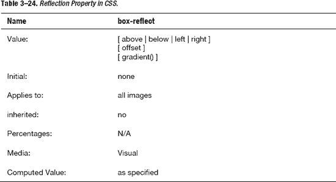

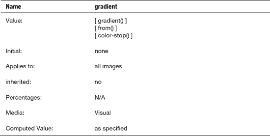

##### JavaScript:介绍最佳实践。

基于浏览器的开发是 JavaScript 的主要平台，通常在网页环境中执行。为 iPhone 或 iPad 编写 JavaScript 时需要考虑的一个因素是这些设备提供的糟糕性能，如图[图 3–30](#fig_3_30)所示。

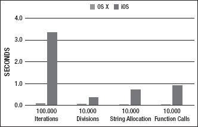

**图 3–30。***Mac OS X(左)和 iOS(右)的 JavaScript 性能对比*

在这些情况下，遵循高性能代码的最佳实践变得更加重要。下面将介绍一些最佳实践原则，帮助我们在 iPhone 和 iPadweb 站点和 WebApps 中开发更干净、更快速的代码。

###### 让代码可以理解

第一点很容易解释:为变量和函数选择容易理解和简短的名字。用变量或函数名描述一个值总是一个好的做法。

###### 不要使用全局变量

使用全局变量通常是一个糟糕的想法，因为我们冒着代码被添加到页面中的其他 JavaScript 覆盖的风险。

###### 使用严格的编码风格

我们必须始终使用有效的代码。一般来说，浏览器非常宽容 JavaScript 解析器，但是当我们转移到另一个环境或者将项目交给另一个开发人员时，使用松散的编码风格会伤害我们。JavaScript 验证器将帮助我们实现有效性。

**注意:**与 HTML 和 CSS 不同，W3C 没有为我们的 JavaScript 代码提供任何官方验证服务，幸运的是，JSON 和 JSmin 的创始人道格拉斯·克洛克福特已经创建了 JSLint JavaScript 验证器。www.jslint.com/的[有 JSLint](http://www.jslint.com/)

###### 根据需要对代码进行注释

重要的是要记住，无论你的代码有多好，它仍然不会自我解释。在注释我们的代码时，避免“行注释”也很重要。使用/* */要安全得多，因为它不会在删除换行符时导致错误。

###### 不要使用混合技术

我们可以在许多上下文中使用 JavaScript，比如计算、转换、访问外部资源(Ajax)，以及定义接口的行为(事件处理)。对于其他任何事情，坚持使用我们已经拥有的技术来完成工作是一个好主意。

一个很好的例子是，如果我们试图用 JavaScript 改变表示。这确实是一个糟糕的方法，因为人们不应该为了改变演示的外观而改变 JavaScript 代码。我们将使用的所有框架都将这一原则付诸实践。它让我们不用编写一行 JavaScript 代码就可以使用许多定制的用户界面组件。

###### 使用快捷符号

使用快捷符号，一旦我们对它足够熟悉，我们可以让我们的代码变得简洁易读。

###### 模块化代码

对于开发人员来说，保持代码模块化和专门化总是一种节省时间的做法。特别是当我们是初学者时，我们倾向于编写单个函数来实现我们所有的(行为)目标。不幸的是，当我们开始扩展代码时，我们面临着在几个函数中编写相同代码的风险。为了避免这种情况，重要的是编写更小的、通用的助手函数来完成一个特定的任务。

###### 允许渐进增强

在编写代码时，我们必须只使用 JavaScript 来实现特定的行为。在任何其他情况下，我们必须使用其他 web 标准，如 HTML 和 CSS。这里的要点是避免大量依赖于 JavaScript 的代码。以这种方式开发，我们将提供渐进的增强和第一级的优化，因为 DOM 的生成是缓慢和膨胀的。

**定义:**渐进式增强是一种强调可访问性的网页设计策略……渐进式增强以分层的方式使用网络技术，允许每个人访问网页的基本内容和功能、更高级的浏览器软件或更多地体验网页的增强版本。
——(来源维基百科)

###### 允许维护和定制

我们代码中所有可能改变的东西不应该分散在整个代码中。一个好的做法是将这些代码放到一个配置对象中，并将其公开，这样维护和定制将更容易实现。

###### 不要编写大量嵌套循环

在循环中嵌套循环总是一个坏主意，因为这意味着要处理几个迭代器变量。我们可以使用专门的工具方法以更简洁的方式达到同样的效果。

###### 优化循环

在 JavaScript 中，循环会变得非常慢，大多数时候是因为糟糕的编码。一个好的指导方针是始终将计算量大的代码放在循环之外。

###### 尽量少用 DOM

正如我们前面所说的，DOM 的生成是缓慢而庞大的，所以重要的是要记住不要滥用它，或者过度使用和分散它，而不是使用组操作。

###### 总是测试任何元素

我们不能简单地相信任何进来的数据。如何避免这种情况的一个例子是使用`typeof`测试进入我们函数的数据的格式，或者在改变或使用 DOM 元素之前测试它们的可用性。

###### 仅使用 JavaScript 添加行为

在编写 JavaScript 代码时，很难跟踪我们生成的 HTML 的质量。我们知道，在任何情况下，JavaScript 旨在实现我们的网站或 WebApp 中的行为，因此，如果我们发现自己用 JavaScript 创建了大量的 HTML，我们可能做错了。

###### 首先为人类开发代码

作为良好的实践，在开发过程的某些点上，我们总是优化我们的代码。重要的是要记住，活代码是为机器做的，开发代码是为人类做的，所以我们不想过早地优化，惩罚我们自己或其他必须接替我们的开发人员。

#### 浏览器对标准的支持:WebKit 和 Safari

在为 iPhone 和 iPad 开发网站或 web 应用时，浏览器代表了我们所有项目的基础。苹果浏览器是在 WebKit 浏览器引擎上开发的，使用的网络标准有:

*   HTML，HTML4，XHTML，XHTML-MP
*   CSS， CSS2
*   Java Script 语言
*   创建交互式、快速动态网页应用的网页开发技术
*   挽救（saving 的简写）
*   用于文本、视频、音频等的其他技术。

把 Safari 想象成你最好的朋友(也许是这样，因为你在这个浏览器前花的时间会比和你所有真正的朋友在一起的时间都多):你对它越了解，你就越不会遇到问题。

Safari 和 Mobile Safari 都基于相同的 WebKit 浏览器引擎，都支持完整的 CSS2 规范，以 100%的分数通过 CSS Acid3 测试(见[图 3–31](#fig_3_31))。这两种浏览器还支持几乎所有的新 CSS 规范，我个人假设我所有的 iPhone 或 iPadweb 站点和 WebApp 都支持所有的 CSS 规范，因为所有对开发有用的属性都得到支持。Safari 还引入了一些新的 WebKit 属性，如 CSS `-webkit-reflection`和`-webkit-tap-highlight-color`，我们希望它们能很快包含在 CSS 规范中。

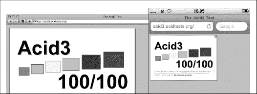

**图 3–31。***Safari(左)和 Mobile Safari(右)上的 Acid3 测试*

Safari 和移动 Safari 之间最著名的行为差异是`position: fixed`问题(仅从 iOS5 开始支持)。当我们想要在底部(或上部)或我们的网站或 WebApp 中插入某种 UI 元素，如固定的页脚(或页眉)时，这可能会成为一个问题。在这种情况下，如果用户上下滚动页面，UI 元素也会上下滚动。

为了理解这种情况发生的原因，我们需要记住，我们在 iPhone 上(有时在 iPad 上)看到的只是整个 HTML 页面的一个窗口。

**注意:**桌面环境中的*视窗*区域是 2D 区域的可见部分，比可视化屏幕大。

就好像我们面前有一本打开的书，手里拿着一张纸，中间切出一个 320×416 像素的方孔。一旦我们把纸放在书的页面上，如果我们想阅读页面，我们需要移动 320×416 的方孔(视窗)并把它放在我们想阅读的单词上。这正是 Mobile Safari 视窗所做的，当我们轻弹和滚动时，我们移动视窗，而视窗后面的网站保持静止。下面的[图 3–32](#fig_3_32)显示了这一原理。

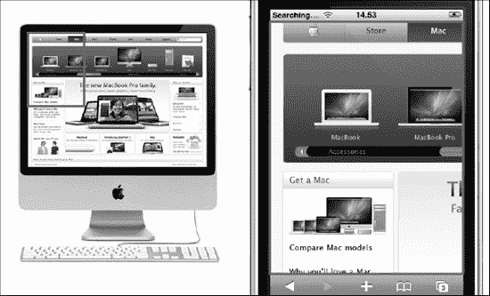

**图 3–32。***iOS 和 OS X 视口尺寸对比。*

因此，CSS 属性是有效的并且正在工作。因为视窗在移动而不是页面在移动，所以元素看起来也在移动。我们有几种方法来解决这个问题，我们将在第 8 章中看到各种方法。

移动 Safari 浏览器是 A 级浏览器，这意味着它可以与桌面级浏览器相媲美。在本节中，我们看到了浏览器支持 web 标准的重要性，在下一节中，我们将看到 iOS 的限制和约束，以及这对 Web 开发人员意味着什么。

##### iOS 限制和约束

既然 iPhone 和 iPad 都是移动设备，它们肯定有限制，既然这个世界上没有什么是无限的(除了数学上的无限)，它们肯定有一些限制。

最后，我总是对限制和约束做出积极的反应，即使在开始的时候，它们有时会让我心烦意乱，紧张，甚至生气。我仍然记得有一天我意识到旧的 iOS 固件(称为 iPhone OS)不允许任何本机和第三方应用的多任务功能，可能最好忘记在那些短暂的时刻我脑海中闪过的东西。

作为人类和开发者，我们的角色是将限制和约束转化为机遇，为我们生活中的一切和我们遇到的一切赋予价值。

我们今天面临的是一些硬件和软件的限制和约束。[表 3–28](#tab_3_28)显示了其中最重要的几项。

正如我们从表格的第二部分看到的，在许多情况下，不支持的技术不是基本的，而在其他情况下，我们有很好的替代或很好的解决方法；所以让我们往积极的方面想！

下面是一个如何按照触摸屏范例重新设计用户体验的例子。想象一下，我们正在浏览桌面上的网页，然后点击菜单中的链接。会生成一个带有几个选项的下拉菜单，将鼠标悬停在这些选项上会导致该项目的描述出现在附近的信息框中。点击链接会将我们带到另一个页面。

这种用户体验在 iPhone 或 iPad 上是不存在的，因为不支持 CSS hover 属性。

我们可以做的是设计一个针对 iPhone 或 iPad 优化的界面，并在第一次点击链接时让信息框出现，并在用户第二次点击时激活链接，将他带到所需的页面。一个名为`tap-highlight-color`的 WebKit 扩展也可以用来使被点击的元素被一种颜色全部或部分遮挡。

在下一段中，我们将看到为用户界面的第一行提供支持的设计是多么重要:手指。

##### 手指不是鼠标:手指友好的重要性

作为 iPhone 或 iPad 开发人员(以及一般的触摸设备开发人员)，我们需要掌握的第一件事是，手指不是鼠标。出于几个原因，记住这一点很重要。

当我们用鼠标浏览网页时，我们在页面上移动指针。指针只有几个像素宽，顶部只有一两个像素宽。从**手指角度**来看，我们可以有手指细的小用户，和手指粗的大用户。大多数用户将处于中间位置，但几乎所有人都无法用手指点击桌面网页上的典型链接。不管我们谈论的是什么样的链接，一个**手指不友好的**链接在任何一种触摸设计中都是不可接受的，如图[图 3–33](#fig_3_33)所示。

**图 3–33。** *链接完全是手指不友好不使用缩放功能。*

现在，我能听到你说，感谢上帝我们有变焦镜头！你说得对，但是我们关于移动 UX 的黄金法则是，一切都应该用最少的操作就可以轻松访问。在触摸设备上，我们必须设计最小高度为 30px 的链接。如果链接高度为 30px，并且在链接之间使用了适量的不可触摸空间，那么可以假设几乎所有的用户都能够点击链接并使用界面。

另一个重要的方面是手指输入并不总是对应于鼠标输入。鼠标有一个左按钮和一个右按钮，中间有一个滚动条，它可以快速移动到用户想去的任何地方。

许多开发者说，这里的重点是支持所有可能的鼠标事件，以增加触摸用户体验。我完全不同意。对我来说，重点是从零开始设计用户体验，忘记经典的鼠标用户体验，向前看，甚至不要向后看一眼。

在[Table 3–29](#tab_3_29)中，我们展示了实现优化的触摸用户体验的手势，以及它们如何根据不同的环境而变化:网站、WebApp 和本地应用。

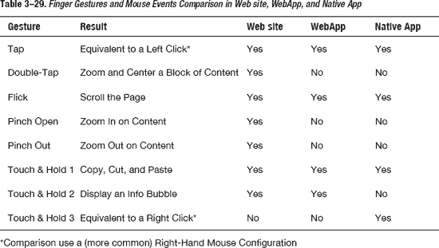

我们也有几个在 iPhone 或 iPad 上没有手势事件等效物的鼠标交互，以及其他一些只属于过去的交互，因为它们在触摸屏范式中并不有趣。这些互动包括:

*   悬停效果
*   悬停生成的内容
*   拖动窗口应用
*   一些基于点击的互动

##### 内部渐进增强

渐进式增强是一种使用分层技术的实践，允许任何人访问我们的内容，不管他的能力如何。一些技术与沟通有关，而另一些则侧重于互动。

为了采用**渐进增强范例，**我们只需要从内容分离的方法开始，正如我们在[第 2 章](02.html#ch2)中看到的。从使用 **HTML** 的内容输出方法标记我们的文本的基础层开始，我们使用 **CSS** 为表示添加了一个额外的层，并使用 **JavaScript** 为行为添加了一个最终层。

这种方法是我们需要应用的 web 标准最佳实践的一部分，但是当我们为苹果设备开发时，它不足以保证最终的结果。在这种情况下，我们有其他变量要处理，以提供我们用户体验的**优雅降级**。这就是内部渐进增强进入场景的地方，如图[Figure 3–34](#fig_3_34)所示。

**图 3–34。** *网站和 WebApp 上的渐进式增强范例*

正如我们在关于 WebApp 的利与弊以及本机和 WebApp 之间的区别的部分中所看到的，要考虑的问题是内部跨平台实例。在这里，我们的主要目标是让用户体验从市场上最后一部 iPhone 或 iPad 温和地退化到它的第一个祖先(iPhone 2G 和 iPad 3G)。

提供内部渐进增强的有用准则由以下几点组成:

*   制定**设备计划**:了解哪种设备型号将是您的主要目标。
*   如果你想访问不同类型的设备，比如 iPhone/iPod 和 iPad，那么就计划同一 WebApp 的不同版本，然后分别优化每个用户的体验。
*   在所有支持的设备之间开发一个**公分母**，以共享基本(和通用)级别的用户体验。设想如何从相同的内容输出代码实现不同的版本，以便**优化每个用户体验**。
*   以一种语义的方式使用 Web 标准，用 HTML 标记内容，用一种 T2 的方法来标记内容。在添加任何 CSS 样式之前，先从这第一层的页面可用性着手。
*   使用 **CSS** 添加表示层。
*   使用 **JavaScript** 提供用户交互。
*   在信息架构和开发的所有阶段使用**可用性测试**,以确保尽管存在硬件差异，用户体验仍能逐步改善

##### Safari 的开发者资源和工具

新版 Safari 带来了一些新的开发功能。这些功能在 Mobile Safari 上不可用，但如果我们需要处理特定的任务，如 JavaScript 调试，或监控资产活动，我们总是可以使用 iPhone 和 iPad 项目的桌面版本。

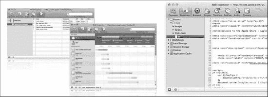

**图 3–35。** *Safari 开发工具:数据库(左)、JavaScript 调试器(中)、资源(右)。*

我们可以通过打开 Safari 偏好设置的“高级”面板中的“开发”菜单，从菜单栏访问 Safari 5 中的所有开发人员工具，如[Figure 3–35](#fig_3_35)所示。这样，我们就可以一键访问所有的开发人员功能。

###### 网页检查器

Web 检查器是开发人员工具的命令中心，Web 开发人员可以在这里轻松访问所有可用的工具。您将在下一段中看到的所有功能都可以通过 Web Inspector 访问。

###### 元素

有了这个工具，我们可以访问网页的结构。使用 Elements Pane，我们还可以对 DOM 和 CSS 代码进行更改，并立即看到更改的预览。

###### 资源

使用这个工具，我们可以访问应用的资源，从而允许我们查看和修改本地数据和 SQL 数据库信息。我们还可以获得被访问域的信息。

###### 网络

有了这个工具，我们可以监控资源是如何通过网络加载的，并且我们可以处理任何类型的加载延迟问题。

###### 脚本

有了这个工具，我们可以在运行时检查 JavaScript 代码和调试。这个工具还提供了 JavaScript 代码使用的所有资源的信息。

###### 时间线

有了这段代码，我们在 WebApp 的交互时间线上有了一个窗口。我们可以看到网页是如何加载和渲染的。

##### 移动 Safari 的开发者工具

Mobile Safari 有一个集成的调试控制台，如图[Figure 3–36](#fig_3_36)所示。这不像使用桌面版本的浏览器，但它可以用于检查我们的网站或 WebApp 中的错误。

**图 3–36。** *手机 Safari 调试控制台*

要激活这个功能，你需要进入设置页面，进入 Safari 页面设置，然后选择开发者。在开发人员页面中，打开选项调试控制台。一旦激活，调试控制台将显示一个(有限的)控制台消息列表。

### SDK 开发模式

2002 年，苹果推出了 Mac OS X，当时它为每一位麦金塔用户提供了一整套应用开发工具。自从名为 Panther 的 10.3 版本出现后，这些工具就作为名为 Xcode 的集成开发环境的一部分出现了。所有 OS X 应用，如 Safari、iTunes、Mail 或 iChat，都是由 Apple 使用相同的 Xcode 工具开发的。

在这一节中，我们将简要介绍这种范式及其组件，因为即使这本书是关于 web 开发模型的，对开发人员来说，对苹果开发世界有一个 360 度的视角也是有好处的。

#### 苹果的 Objective-C、Cocoa Touch 和 Xtools 模型

Xtools IDE、Cocoa Touch 框架和 Objective-C 语言构成了每个 iOS 开发人员的三位一体。一切从这里开始。

##### Xcode IDE

当我们谈论 Xtools 时，99%的情况下我们指的是 Xcode IDE、界面生成器和 iPhone/iPad 模拟器。

Xcode 是一个 IDE。有了这个工具，我们还可以管理我们所有的测试设备，使用适当的证书自动打包到 iPhone/iPad 应用中，并在 iPhone/iPad 上安装应用。

远程调试器功能还可以实时连接到设备，在设备上控制应用时管理断点，并为实时测试提供良好的工具。

##### iPhone/iPad 模拟器

iPhone/iPad 模拟器运行我们的应用的方式与实际的 iPhone/iPad 设备非常相似。这个工具是每个开发人员在测试第一阶段最好的朋友。使用 iPhone/iPad 模拟器，我们甚至可以通过使用鼠标来模拟触摸手势，并且我们还可以为我们的应用创建视频教程提供良好的资源。

##### 目标-C 语言

Objective-C 是一种面向对象的语言，它有一个动态的类系统，是标准 C 语言的超集。这种语言建立在 Cocoa (Mac OS X)和 Cocoa Touch (iOS)框架之上。

Objective-C 还推出了针对多核 MAC 优化的垃圾收集器，但作为 iOS 开发者，我们可以忘记这个功能，因为在 iOS 上，我们必须手动优化我们的内存使用。

##### 可可触摸框架

Cocoa Touch 框架驱动了所有的 iOS 应用，并分享了许多在 Mac 上发现的成熟模式，但它特别关注基于触摸的界面和优化。

Cocoa Touch 框架由以下部分组成:

*   基础框架
*   UIKit 框架
*   框架集合

###### 基础框架

基础框架是一个抽象层，它从 UIKit 中的用户界面对象中抽象出许多底层的操作系统元素，比如基本类型、包管理、文件操作和网络，我们将在下面介绍这些内容。这个框架是所有不属于用户界面的东西的入口，并且定义了 Objective-C 类的基础层。

除了提供一组有用的基本对象类之外，它还引入了几个范例，这些范例定义了 Objective-C 语言没有涵盖的功能。基础框架的设计考虑了这些目标:

*   提供一小组基本的实用程序类
*   通过引入一致的约定来简化软件开发，比如解除分配
*   支持 Unicode 字符串、对象持久性和对象分布。
*   提供一定程度的操作系统独立性以增强可移植性

基础框架包括**根对象类**，表示基本数据类型(如字符串和字节数组)的类，用于存储其他对象的集合类，表示系统信息(如日期)的类，以及表示通信端口的类。

这个框架引入了几个范例来避免常见情况下的混淆，并引入了跨类层次的一致性。

###### UIKit 框架

Mac OSX 程序员使用一个名为 AppKit 的框架，它提供了所有的窗口、按钮、菜单、图形上下文和事件处理机制，这些都是定义 OSX 体验的基础。可可触感等同物被称为 UIKit。UIKit 框架提供了为 iPhone、iPad 和 iPod Touch 构建和管理应用用户界面所需的类。它提供了专门为触摸屏界面设计的应用对象、事件处理、绘图模型、窗口、视图和控件。

除了 UIKit 之外，Cocoa Touch **系列框架**还包括创建世界一流的 iPhone 和 iPad 应用所需的一切，从 3D 图形到专业音频，到网络，甚至是控制相机或从 GPS 硬件获取位置信息的特殊设备访问 API。

这些框架的例子包括:

*   **音频和视频**
    *   核心音频
    *   open al！open al！open al
    *   媒体库
    *   AV 基金会
*   **图形和动画**
    *   核心动画
    *   OpenGL 是
    *   石英 2D
*   **数据管理**
    *   核心数据
    *   数据库
*   **网络和互联网**
    *   -你好
    *   WebKit
    *   BSD 插座

Cocoa Touch 建立在**模型-视图-控制器范式**之上，包括强大的 Objective-C 框架，只需几行代码就能执行全部任务，同时提供基本的 C 语言 API，以便在需要时直接访问系统。

**注:**模型-视图-控制器(MVC)是软件工程中使用的软件架构模式。该模式将“领域逻辑”(用户的应用逻辑)与输入和表示(GUI)隔离开来，允许独立开发、测试和维护每一个。

##### SDK 开发生命周期

当我们用 SDK 开发模式开发时，生命周期基本相同。改变的只是我们有一个启动阶段，在这个阶段我们需要注册苹果开发项目，还有一个最后阶段，我们向苹果提交我们的申请以获得批准。

在[图 3–37](#fig_3_37)中，我们以“构建”的通称来表示三个阶段:设计、实现和测试，但是过程结构与我们在[第二章](02.html#ch2)中看到的是一样的。

生命周期还显示了最后一步如何变化，因为原生应用将进入 iTunes 应用商店，而不是像所有 web 应用那样在线。

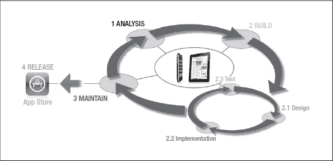

**图 3–37。** *SDK 开发模式生命周期*

我们将不再深入探讨 Objective-C、Cocoa Touch 和 Xtools，因为这本书的重点是使用 web 标准设计和开发 WebApps。

#### 嗨，我在 Mac 上

在本章的最后，我想和你分享史蒂夫·乔布斯在 2007 年 WWDC 大会上关于使用网络标准为 iPhone 进行Web 开发的话。我知道如果史蒂夫·乔布斯说了什么，那总是自私地支持苹果，但我也觉得他的许多引用非常鼓舞人心。

> “…完整的 Safari 引擎在 iPhone 内部。因此，您可以编写出令人惊叹的 Web 2.0 和 Ajax 应用，它们看起来和行为都与 iPhone 上的应用一模一样…”
> 
> *“…他们可以打电话、发电子邮件，甚至可以在谷歌地图上查找位置…”*
> 
> *“…如果你知道如何使用最现代的网络标准编写应用，你就拥有了你需要的一切…”*
> 
> *“…所以开发者们，我们认为我们已经为你们准备了一个非常甜蜜的故事。您现在就可以开始构建您的 iPhone 应用了…”*

#### 用于苹果移动开发的工具和框架

本章使用的工具既有免费的也有付费的。[Table 3–30](#tab_3_30)列出了一些你可以用来设计下一个网站或 WebApp 的有用工具。

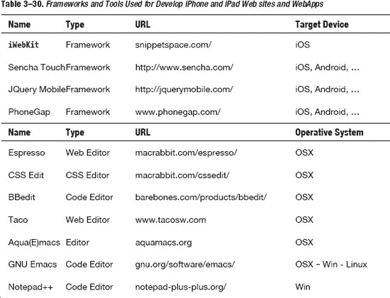

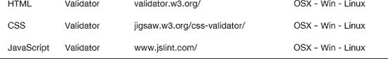

### 总结

在这一章中，我们介绍了框架背后的概念，我们看到了开发阶段的框架方法和结构如何为开发人员提供有用的构件。

在第二部分中，我们研究了 web 开发模型、它的优点和缺点，以及开发 WebApp 的四种不同方法。我们还分析了 WebApp 用户的不同之处，比较了本地和 WebApp 用户(和开发人员)的体验。介绍了 Webkit 和 Safari，展示了典型的设备限制和约束，并介绍了内部跨平台概念。

在本章的第三和最后一部分，我们研究了 SDK 开发模型，介绍了 Xtools、Objective-C 和 Cocoa Touch 框架。通过说明原生应用的生命周期，我们还看到了如何使用 PhoneGap 等其他开源工具，让我们从使用 web 标准开发的 WebApp 开始开发原生应用。