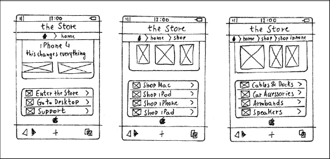
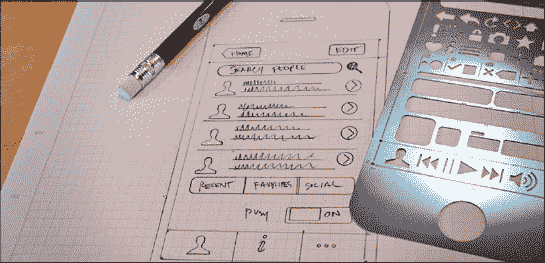
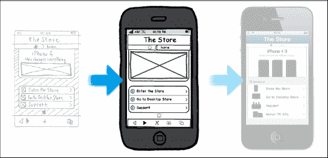
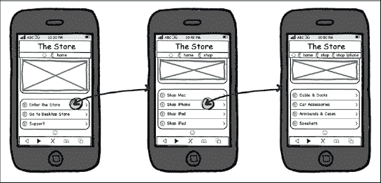
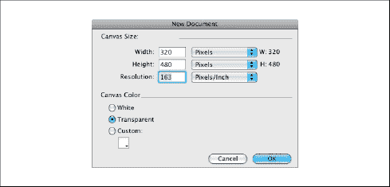
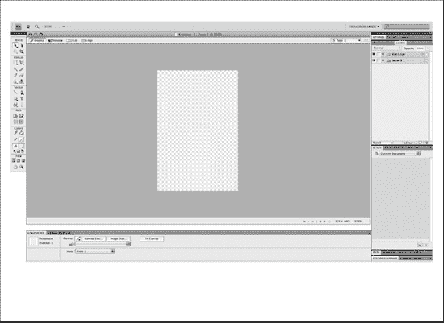
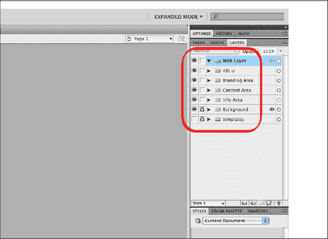
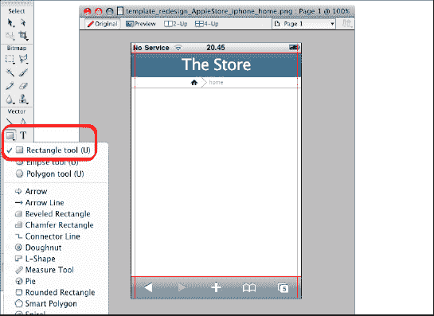
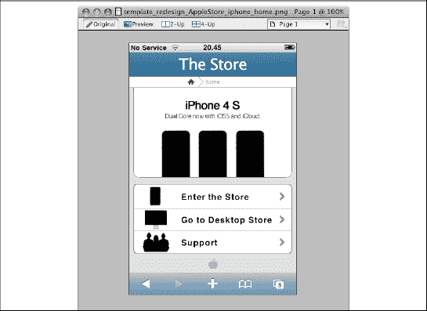
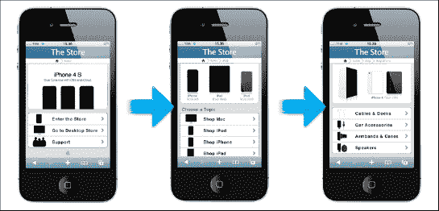

## 第五章

## iPhone UI 设计:简单思考

> *“少即是多……”*
> 
> 卢翼密斯·凡德罗

这一章是关于 iPhone 用户界面设计的。我们将首先介绍设计该界面的基本概念，即“简单思考”，然后看看 iPhone 用户的体验和用户认知资源限制的本质。

在这个简短的介绍之后，我们将探索使用手绘草图技术的草图解剖，并将解释如何用一些有用的工具模拟一个用户界面，比如 Balsamiq。我们将探索 Balsamiq 的界面，并展示如何优化它。

接下来，我们将直接进入 Adobe Fireworks，并解释如何逐个像素地设计用户界面。设计用户界面时，你需要控制所有元素的每一个像素。Adobe Fireworks 为处理像素提供了更好的工具和界面，因为与使用 Adobe Photoshop 相比，它使您能够更稳定地控制用户界面元素，并更容易地移动和修改它们。与 Photoshop 相比，Adobe Fireworks 还提供了更好的导出工具，允许您更好地优化每个图形元素的权重。你在这本书里设计的所有东西都可以用 Adobe Photoshop 来实现，所以如果你愿意，可以随意使用。

在最后一部分，我们将向您展示如何重用您的设计来创建一个用例，并提供用户体验的可视化表示。

### 用户界面草图

在[第 4 章](04.html#ch4)中，你学习了界面设计流程，看到了一个 iPhone 版的“商店”用例。[第 4 章](04.html#ch4)重点讲述了用于设计令人惊叹的触摸界面的界面设计原则。

在本章和下一章，我们将详细解释我们是如何设计我们的触摸优化界面的。我们还将经历从草图到最终产品的整个创意过程。

### 想得简单

少往往就是多。因此，“简单思考”是我们 iPhone 设计和开发活动的主题。在前面的章节中，我们建立了基础来更好地理解为什么“简单思考”的概念是优化像 iPhone 这样的小设备上的移动体验的正确方法。

**注:**主旋律是一个音乐术语，指的是与特定想法相关的重复出现的主题。推而广之，这个词在其他生活语境中也用来指任何一种重复出现的主题、实践或想法。

在接下来的段落中，我们将讨论“简单思考”概念背后的要点，从而将您在前面章节中学到的内容联系起来。

#### iPhone 是一款移动设备

对于大多数用户来说，iPhone 是在移动中使用的。如果你在家或在工作，有一台台式机、笔记本或平板电脑，你可能不会使用 iPhone。

自从 iPad 发布以来，这个概率就更大了。在 iPad 出现之前，需要使用移动服务的人可能会使用 iPhone。然而，现在这种情况已经发生了变化，已经售出了数百万台 iPads。

为了在旅途中使用 iPhone，用户需要具有简单结构的资源，以允许设备在各种环境中运行。

#### iPhone 页面模型的本质

iPhone 页面模型是我们所有作品的基本结构。这是一个线性和简单的结构，与 iPhone 完美配合。然而，它不允许设计者和开发者以更详细的方式呈现内容。

使用 iPhone 浏览内容的线性流动非常适合移动环境，坚持这一概念而不试图添加任何桌面或平板电脑使用的技术非常重要。甚至 iOS4 中引入的多任务功能也使用了页面模型，这使得用户可以使用多个应用，尽管一次只能使用一个页面。

#### iPhone 的局限性

iPhone 基于 3.5 英寸的显示屏，无论 WebApp 的设计或开发有多出色，屏幕大小都是一样的。即使视网膜显示器具有相同的尺寸，可视区域内的用户界面比例也是相同的。这意味着，尽管用户界面元素的可读性更好，但用户体验的水平保持不变。

我们还需要记住，尽管 iPhone 彻底改变了用户体验和浏览移动网络的模式，但它仍然是一款针对移动内容优化的小型手机，硬件功能有限。例如，新的触摸键盘比旧智能手机中使用的 qwerty 键盘有了巨大的改进，因为它可以根据应用的需要而改变，并可以在纵向和横向模式下使用。然而，对于 3.5 英寸的显示器，它将总是被限制在可能的使用案例的子集。

#### 用户认知资源的性质

这个世界上的一切都是有限的，大多数东西都是有限的。事情就是这样。在我们的移动环境中，屏幕尺寸是有限的，可用带宽、提供的服务和 RAM 也是有限的。因此，用户的认知资源是有限的。

因为用户体验是在大脑中诞生和发展的，用户的认知资源影响着他们的 iPhone 体验。意识到这一点很重要。有限的认知资源意味着用户界面必须以一种简单的方式进行优化，我们必须意识到一些环境比其他环境需要更多的认知资源。

最后，我们所能做的就是永远不要忘记列奥纳多·达·芬奇的话:“简单是最后的复杂。”

### 素描解剖学

草图可能看起来是整个设计过程中很容易的一部分。你拿一支笔和一张纸，你就完成了。毕竟不一定要画西斯廷教堂！然而，事实远非如此。绘制一个视图，在本地开发中被称为，意味着将你的手与你头脑中的创造性部分同步。因为这个原因，像素描这样简单的事情需要多年的练习。

历史注释:现代素描的第一个例子可以追溯到 15 世纪上半叶的锡耶纳，当时马里亚诺·迪·雅各比·德托·塔科拉创作了一套关于民用和军事技术的四卷本素描，名为 *De Ingenisis* 。

对我们来说幸运的是，画一个视图比其他种类的工程或建筑草图简单；但是，基础是一样的。在勾画用例之前，您必须记住以下几点。

*   快速
    一幅速写必须旨在给人一种印象。
*   **直接**
    速写使用简单明了的措辞。
*   最少的
    草图只包括传达信息所需的内容。
*   自由
    素描给人一种开放的感觉，因为它由本能的线条组成，而不是紧密、精确的线条。
*   **分组**
    一个草图在其他草图创建的上下文中是有意义的。
*   **建议**
    草图并不明确陈述什么，而是探索一个概念，暗示一条设计和开发的道路。

现在你对草图的意思有了更好的理解，第一步是用纸和笔勾画出你的想法。这是重要的一步，因为你的大脑和你的手比和你的鼠标连接得更好。

在草图阶段，您将:

1.  在白纸上画些手绘草图，
2.  创建草图之间的逻辑连接，以及
3.  使用模板重新设计你的手绘草图。

[Figure 5–1](#fig_5_1)显示了在纸上绘制的三个 iPhone 视图。对于这些草图，我们使用了 1:1 尺寸的手工木模板。您可能会注意到，标准的 X 框用于表示所有的图像。这是线框设计的标准做法，但也推荐用于草图设计，以便专注于表示页面结构。关于绘制用户界面的最佳实践的更多信息将在[第 6 章](06.html#ch6)中详述 iPad 用例。

当从头开始一个项目时，在视图之间建立逻辑联系将有助于你阐明你的想法，并使你的设计有条理。把所有的观点打印出来，贴在墙上，和别人讨论你的想法是个好主意。

**图 5–1。** *“商店”用例的手绘草图。*

对于这个用例，您不需要处理逻辑(内容)连接，因为您正在处理一个(重新)设计。进行(重新)设计意味着你已经对桌面版本的内容进行了优先排序，并且制作了一个显示内容结构和关系的优化的 iPhone 站点地图。

**图 5–2。** *界面设计流程的第一步。*

如果您与开发团队合作，并且需要展示您的作品，您可能需要使用模板重新设计草图。[图 5–3](#fig_5_3)展示了如何使用模板重新设计手绘草图。

**图 5–3。** *使用 iPhone 的 UI 模板重新设计草图。*

一旦你用纸和笔画了草图，并用模板重新设计了它，你就可以用工具来构建你的视图了。在下一节中，您将看到如何使用工具将您的原始草图转换为使用 Adobe Fireworks 的最终设计。

### 使用工具进行设计

当你头脑中的想法清晰时，进入过程的第二步，即使用工具设计你的视图版本。对于我们的项目，我们选择了 Balsamiq 模型(我们在本章末尾插入了本书中使用的所有其他工具的相应网页的链接)。

Balsamiq 是一个 zenware 项目，这意味着它可以帮助你“进入状态”并呆在那里。Balsamiq 是界面设计过程第二步的完美程序(见[图 5–4](#fig_5_4))。

**注:** zenware 的意思是 Zen 软件，帮助你集中注意力，达到被称为心流的超高效认知状态，并保持这种状态的软件。zenware 的目标是消失，在你需要的时候支持你，但尽可能不碍事。你应该忘记软件就在那里。

这个程序提供了几乎和用铅笔素描一样的速度和粗糙感，但是具有数字媒介的优势。例如，放大容器只是一个拖动操作，重新排列元素不需要重新开始，你的线框将足够清晰，你明天就能理解它们。

**图 5–4。** *界面设计流程的第二步。*

#### 探索 Balsamiq 模型界面

Balsamiq 模型有一个工具栏，您可以从中选择一个元素类别，如下所示。

*   **所有**
    你可以看到所有可用的元素。
*   **大**
    你可以看到所有类别中的所有大元素，包括 iPhone 和许多其他图像，如封面流。
*   **按钮**
    你可以看到所有的按钮，包括 iPhone 的开/关切换开关。
*   **常见元素**
    你可以看到所有类别中所有的常见元素。
*   **容器**
    你可以看到所有的容器元素。尽管有一个通用的矩形容器，这个类别对于桌面项目更有用。
*   **布局**
    你可以看到所有的元素，以便组成一个布局。
*   你可以看到有用的元素来标记你的作品。
*   **媒体**
    你可以看到所有的媒体元素，包括图标、封面流、图片和视频播放器元素。
*   **文本**
    你可以看到所有的文本元素，比如标题、导航栏、面包屑、树形窗格以及其他类似桌面的对象。
*   **iPhone**
    你可以看到所有的 iPhone 元素，包括键盘、值选择器、iOS 菜单和提醒框。该类别在[图 5–5](#fig_5_5)中显示。

**图 5–5。***Balsamiq 样机应用:iPhone 部分。*

Balsamiq 范式非常简单。拖放您的元素，修改它，并组成您的模型。[Figure 5–6](#fig_5_6)显示了用于组成“商店”用例模型的一些元素。

**图 5–6。***Balsamiq 原型范例:拖放和修改。*

#### 代表连接

当第一个视图准备好时，复制并粘贴它，以便创建另一个要修改的实例。现在的目标是创建几个并排的视图来表示关系，并给出关于上下文的视觉感受。

**图 5–7。** *用 Balsamiq 样机进行草图阶段。*

[图 5–7](#fig_5_7)显示了三个视图之间的联系。此图显示了“商店”用例中的“转到 iPhone 配件页面”操作。

**图 5–8。** *统一建模语言(UML)用例图为“转到 iPhone 配件页面”。*

一旦你所有的视图和关系都处理好了，Balsamiq 模型的工作就完成了，你就可以使用图形程序来完善你的视图的美学部分了。

### 使用 Adobe Fireworks 进行设计

在使用 Balsamiq 等工具根据你的草图创作了一个模型之后，是时候进入该过程的第三阶段，并切换到 Adobe Photoshop 或 Fireworks 等图形程序来处理美学方面的问题了。Adobe Photoshop 可能是处理位图的最佳图形程序，但如果您使用许多矢量形状进行 WebApp 设计，并且需要控制、移动、变换或修改像素，Fireworks 是最佳选择。

Adobe Fireworks 比 Photoshop 更加面向 web。位于界面左下角的属性工具就是一个很好的例子。属性工具向设计者提供关于元素的 X 和 Y 坐标及其像素尺寸的持续反馈。属性框在用户界面设计过程中很有用。再比如导出工具；与 Photoshop 中的算法相比，Fireworks 优化算法效果更好，给出的结果也更好。从这个角度来说，Fireworks 甚至比 Photoshop 还要好。

**图 5–9。** *界面设计流程的第三步。*

**注意:**在下一节中，我们将介绍用于设计“商店”用例的功能。我们显示了所有可以找到的*命令*，以及圆括号内的*键盘快捷键*。

我们从《超越 CSS:网页设计的艺术》的作者安迪·克拉克那里学到了这一课。

#### 创作画布

打开 Adobe Fireworks 后，您需要创建一个新文档。选择`File`  `New` (  N)。

**图 5–10。** *Adobe Fireworks:创建新文档。*

现在用下面的画布大小创建一个新文档。

*   **宽度:** 320(像素)
*   **身高:** 480(像素)
*   **分辨率** : 163 (ppi)

此画布大小遵循 iPhone 2G、3G 和 3GS 显示功能，但如果您想要使用新的 Retina 显示屏，则需要设定以下画布大小。

*   **宽度:** 640(像素)
*   **身高:** 960(像素)
*   **分辨率** : 326 (ppi)

**图 5–11。** *Adobe Fireworks:一个新的空白文档。*

在 3.5 英寸的 iPhone 屏幕上，两种分辨率的比例相同。

#### 组织层级

您的设计将在几个级别上部署。为此，首先要做的是创建一些文件夹来组织您的资产并保持您的环境整洁。使用语义方法，创建以下文件夹。

*   IOs ui
*   **品牌区域**
*   **内容区**
*   **信息区**
*   **背景**
*   **模板**

**图 5–12。** *Adobe Fireworks:资产文件夹的语义结构。*

第一个文件夹名为“iOS ui”，将包含状态栏和底部栏。接下来的文件夹(品牌、内容和信息区域)将包含 WebApp。在这些文件夹下，创建两个级别，称为“背景”和“模板”在品牌、内容和信息区域，再添加两个文件夹，一个叫做“文本”，另一个叫做“图标”

#### 版面设计

首先要做的是添加另一个名为“标尺”的文件夹该文件夹将包含四行，两行用于固定可视屏幕边界，两行用于固定侧面的 10 px 填充。添加标尺后，选择**选择矩形工具(U)插入背景层。**

**图 5–13。** *土坯礼花:可视区域和填充标尺。*

现在画一个 320×480 像素的矩形。这个矩形将是画布的基本背景色，但更重要的是，它将用于使用 align 函数对齐画布对象。新矩形绘制在背景文件夹内，以便位于 iOS 文件夹的 iOS 界面资源下。

**注意:**Align 函数是一个相对函数。我们不能只选择一个对象并寻找对齐功能，因为它将不可用。在这个环境中作为一个相对函数意味着你需要传递两个或更多的对象给这个函数来对齐。这是必要的，因为函数会将“某物”与“另一物”对齐

现在，您已经准备好了画布，可以开始添加设计元素了。

#### 界面设计

使用矩形工具，添加以下元素。

*   **Header Bar**

    矩形:45 × 480 像素

    渐变:线性

    颜色:#566E93，#314F7B

*   **Breadcrumb Bar**

    矩形:20 × 480 像素

    颜色:#ffffff

**图 5–14。** *土坯烟花:品牌推广区。*

添加两个条后，通过选择**选择文本工具(T)添加文本。**文字定义如下。

*   **Header Text**

    字体:Myriad Pro，常规，30 磅

    投影:1 像素实心，#3B4C66，270 度

*   **Breadcrumb Text**

    字体:Myriad Pro，轻半浓缩，12 磅

要在页眉文本中间对齐页面标题，请通过选择**修改对齐**T3】居中水平( 5)来选择页眉文本和白色背景。

最后要添加的元素是房子图标。手动绘制，定义如下:

*   **House Icon**

    尺寸:14 × 11 像素

    颜色:#2B2B2B

既然品牌区域已经完成，那么就转到内容区域。选择背景级别，并使用矩形工具绘制一个矩形作为内容背景，定义如下。

*   **Content Background**

    矩形:350 × 480 像素

    颜色:# D8D8D8

既然已经定义了灰色背景，选择**选择线条工具(N)给内容区域的顶部添加一些光线。**该行定义如下。

*   **Content Area Light**

    行:1 × 480 像素

    颜色:#ffffff

**图 5–15。** *土坯烟花:内容区。*

下一步是通过选择**选择圆角矩形**来插入英雄内容。创建两个圆角矩形，如下所示。

*   **Hero Content 1**
    Rectangle: 190 × 300 px

    颜色:#ffffff

*   **Hero Content 2**
    Rectangle: 190 × 302 px

    颜色:#ffffff

    边框:1 像素纯色#000000

当绘制圆角矩形时，选择两个矩形，调整角的大小，并通过选择**修改**  **展平选区** (  Z)来展平图像。

**图 5–16。** *土坯烟花:英雄内容区。*

**注意:**在使用柔和的线条边框时，由于抗锯齿的原因，很难有锐利的 1 px 角度边框。因此，当使用 CSS 时，有必要使用一些小技巧来获得与实现阶段相同的清晰边框效果。将英雄内容 1 放在英雄内容 2 之上。因为英雄内容 2 是 302 px 宽，而英雄内容 1 只有 300 px，所以只有一个 1 px 的边框会保持可见。

当英雄内容区域准备好时，插入文本，如下所示。

*   **Hero Heading**

    字体:Helvetica，Bold，22 pt

    颜色:#000000

*   **Hero Sub-Heading**

    字体:Helvetica，普通，12 磅

    颜色:#666666

在这两个标题下面，插入 iPhones 4 图像和三个代表 Hero Carousel 的 6 px 圆圈。

**图 5–17。** *Adobe Fireworks:内容区的边到边菜单。*

在英雄内容之后，基于边到边的结构设计菜单区域。使用圆角矩形工具设计一个矩形，如下所示。

*   **Menu Area**

    矩形:300 × 132 像素

    颜色:#ffffff

    边框:1 像素纯色#000000

菜单的高度是每个菜单项的标准 44 px。文本条目定义如下。

*   **Main Menu Text Entry**

    字体:Helvetica、Bold、16 pt

    颜色:#111111

在每个菜单项的左侧，我们有一个 34 像素高的图标，在最左侧，有一个 6 × 12 像素的右箭头。

**注意:**与英雄内容区一样，使用柔和的线条边框。这意味着，如果你想获得一个清晰的 1 px 的边界，你需要应用同样的技术，使用两个重叠的盒子。

现在，菜单区域和内容区域的设计已经完成，添加信息区域。像苹果品牌标志一样，这个区域的设计应该是极简主义的，只包含标志，不包含其他任何东西。[图 5–18](#fig_5_18)显示了整个设计，信息区位于底部。

**图 5–18。** *Adobe Fireworks:底部带有信息区的整个设计。*

至此，流程完成。在这个过程中产生的资产被重用，以创建电子原型，用于可用性的初步测试，并为移动信息架构过程中的下一个实现步骤做准备。

#### 重用设计

*重用*是设计和开发界的一个重要词汇。重用通常既省时又省力，为项目提供了一个坚实且经过测试的基础。这种实践在本地开发中更有用，在本地开发中，可重用代码是过程的基本部分；即使是一小段经过测试的代码也可以节省开发人员的大量精力。设计模式与代码或设计重用实践共享相同的范例，我们在其中识别问题或需求，并提供解决方案或代码/设计/模式。

在我们的设计项目流程中，我们使用为“商店”主页创建的视图来设计另外两个视图，“商店”商店页面和“商店”iPhone 商店页面。我们鼓励您在未来的项目中实现这种重用方法。

**图 5–19。** *“商店”用例:三个 iPhone 视图。*

在我们的过程中，我们重用了为“商店”主页设计的视图，以设计另外两个视图。这有助于给最终的 WebApp 设计一个更具体的感觉。我们设计的其他视图是“商店”商店、“商店”页面和“商店”商店 iPhone 页面。

查看[图 5–19](#fig_5_19)，您可以看到主页和其他两个页面之间的一些小差异。这是因为我们想在主页上使用一个更大的基于图片传送带的英雄内容页面来创造优势。由于主菜单中只有三个文本条目，所以能够实现这一结果。这样，英雄内容区和主菜单都在可见区，不需要用户滚动。

**图 5–20。** *用户界面交互中的“转到 iPhone 配件页面”用例。*

首页上，主消息依托英雄内容区；主菜单只提供明显的选项，比如“进店”。在其他视图中，主要信息包含在主菜单中，而(缩小的)主要内容区域只是让用户看一眼就知道他们的页面是否是想要的。英雄内容区也提供一些产品的信息，引诱用户购买。然而，这与用户体验无关，从营销的角度来看，这只是一个次要目标。

一旦你的 WebApp 的所有视图或页面都设计好了，你就可以通过创建几个用例给用户一个可视化的表示，如图[图 5–20](#fig_5_20)所示，或者通过给出一个界面-内容关系的概述，如图[图 5–21](#fig_5_21)所示。如果您需要在进入实现阶段之前检查接口的一致性，这两者对团队的其他成员和您自己都很有用。

**图 5–21。** *“商店”用例中界面-内容关系的部分表示。*

#### 用户界面设计工具

本章中使用的工具包括物理工具和软件应用。Table 5–1 列出了一些你可以用来设计下一个用户界面的有用工具。

### 总结

在这一章的第一部分，我们分析了界面设计的过程，讨论了草图的剖析和“简单思考”的范例。我们讨论了 iPhone 的局限性、iPhone 页面模型和用户的认知资源如何影响设计风格，并解释了所有这些元素如何成为“简单思考”设计范式的来源。

在第二部分中，我们解释了如何使用像 Balsamiq 样机这样的工具来改进用笔和纸制作的基本草图。我们解释过，您可以开始创建一些内容和界面连接，以创建概念设计的初始视觉表示。

在本章的第三部分，我们告诉你如何使用 Adobe Fireworks 设计用户界面。从创建新画布到界面设计，我们一步一步地处理这个过程。在这个过程的最后，我们引入了重用你的设计来创建另外两个视图或页面的想法，我们建议将界面-内容关系的可视化表示作为实现阶段的可交付成果。