# 六、iPad UI 设计：反向思考

> *”。。如果你想创造什么东西，
> 你一定是什么东西……*
> 
> 约翰·沃尔夫冈·冯·歌德

在前一章中使用 iPhone 用户界面后，现在您将能够开始使用项目的 iPad 版本。当你为苹果平板电脑做项目时，你需要选择是想要一个兼容的用户界面还是一个类似原生的用户界面。没有正确或错误的方法，因为一切都是由项目需求决定的。

在本章中，您将看到如何应用这两种方法。在上一章中，你看到了“简单思考”是设计 iPhone 用户界面的基本概念。现在，您将看到 iPad 设计如何需要视角转换来优化设备功能。

首先，将介绍一种称为“反向思考”的简化新方法，然后您将学习如何从桌面界面设计 iPad 兼容的用户界面，展示项目流程中这一重要步骤背后的原则。

然后，像在 iPhone 章节中一样，你将学习如何绘制用户界面草图，之后，你将学习如何用 Adobe Fireworks 设计它。整个设计过程将分别针对 iPad 兼容版和 iPad 原生版进行介绍。

### 用户界面草图

在第 5 章中，你设计了苹果商店用例的 iPhone 版本。在[第 6 章](#ch6)中，你将使用相同的程序，但是你将看到兼容版本和 iPad 原生版本。由于这两个版本分享了大部分 iPad 的原理，但并不完全相同，当其中一个版本特别需要某些东西时，就会被识别出来。

你将使用 iPad，而不是使用 iPhone 来展示兼容版本，因为对于 iPhone 来说，尽可能切换到原生版本会更好，而对于 iPad 来说，这并不总是正确的。

### 想倒了

这一节的标题并没有说明一切，大概也没有表现出和 iPad 有什么直接的关系。这个标题背后的意思可能听起来像是:继续简单地思考，但是以相反的方式。这定义了一个反向的(简单的)方法。这种颠倒的方法源于这种新设备的中间位置，就在 iPhone 这样的纯移动设备和 iMac 或 Mac Pro 这样的纯固定桌面之间。术语“反转”代表不同的方法，需要相反的方法来实现与 iPhone 版本相同的目标。

在 iPad 原生版中，由于纵向和横向方向背后的新概念，有必要重新考虑您的思维。在纵向模式下，设备呈现一列布局，在横向模式下，呈现两列布局。

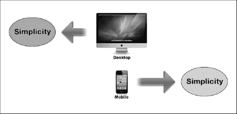

**图 6–1。** *从桌面和移动的角度看简单性的实现过程*

这意味着你经常需要对相同的内容使用两种相反的方法来优化两个方向。在横向提供的两栏设计中，您应该使用左(小)栏作为主要内容的支撑。左栏为用户提供了方向，使其更容易浏览复杂的站点或应用内容。

在纵向方向，单栏设计没有这种导航支持，因此，用户必须使用标题中的按钮，以弹出菜单的形式访问左栏。这个事实建议使用第二个 CSS 文件来修改主要内容结构，包括一些设计元素来弥补缺少的左栏。在主要内容里面提供一些导航信息，你将能够通过弹出菜单减少对左栏的访问，增加用户体验的质量。

在 iPad 兼容版本中，重新分解是必要的，因为您将在桌面版本上工作，但您需要应用移动(触摸)环境中的一些规则，以便优化用户触摸体验。在 iPad 出现之前，桌面和移动规则存在并应用于两个不同的世界。在这种新的设计风格中，你将合并两种类型的方法，比如桌面和移动，使用一个基于简单概念的公共背景。在 iPad 问世之前，这两种方法指向相反的方向。

从混沌理论中可以了解到，有时在设计阶段将事情简单化需要更复杂的程序。正如您将在下一节中看到的，有时您需要添加特性来降低复杂性并使模式更简单。

#### 颠倒的简单

你怎么能用简单来指向一个方向，为了实现你的设计目标，而指向相反的方向呢？这种概念的例子是对内容进行优先排序(移动方法)，保持类似桌面的结构(桌面方法)，或者用桌面结构(桌面方法)和面向移动的结构(移动方法)来呈现内容。每种情况都是两种方向相反的力的例子。

现在你会再一次看到，简单的概念是如何成为明显不同的事物之间的一个基本的共同因素，你会看到你的设计目标影响这些相反的力量指向同一个方向。

**注:**简单性理论是一种认知理论，旨在解释某种人类与环境的互动对人类思维的吸引力。这个理论声称有趣的情况对观察者来说比预期的要简单。这一理论的一个众所周知的实现是奥卡姆剃刀(来自英国逻辑学家和神学家的名字，和方济各会修士，奥卡姆的威廉)。

从认知的角度来看，简单性是一个领域的属性，只需要很少的信息就可以详尽地描述。简单的对立面是复杂。

谷歌主页是颠倒简单的完美例子——如何以一种非常简单的方式呈现一件非常复杂的事情。正如谷歌负责搜索产品和用户体验的副总裁玛丽莎·梅耶尔(Marissa Mayer)所说，“谷歌拥有非常复杂的瑞士军刀的功能，但主页简单、优雅，可以放在口袋里。”

**注:**玛丽莎·梅耶尔以优异的成绩毕业于斯坦福大学计算机科学专业，在谷歌搜索和 Gmail 方面有着显著的公众参与，可以认为她对这些 ui 的成功负有高度责任。《财富》杂志将她列为世界上最有权力的 50 位女性之一，也是有史以来最年轻的女性。她被认为设计了谷歌地图、谷歌地球、iGoogle 等等。

谷歌很好的利用了这个概念，苹果也是。它的一体化 iMac 是如何通过简化事情来降低复杂性的完美例子。

在开始勾画 iPad 用例之前，在下一节中，您将看到如何将简单性应用到您的设计中，并应用这个概念背后的一些规则。

#### 删除并优先排序

“移除”听起来很简单，但是想想看——你怎么知道从你的设计中去掉什么呢？这是每个设计师在试图做到简洁时都会面临的主要问题。这个问题引发了三大担忧

*   *害怕错过某些东西*:设计师担心从设计中删除元素会降低用户找到他所需要的东西的可能性。与这种恐惧作斗争的设计者在没有应用任何内容优先排序的情况下添加了无尽的内容。
*   *害怕被误解*:设计师担心从设计中删除元素会降低用户理解内容信息的可能性。与这种恐惧作斗争的设计师在并非绝对必要的地方添加了技术信息或许多说明。
*   *害怕失败*:设计师害怕从设计中去除元素会增加失败的概率。与这种恐惧作斗争的设计师依赖于信息的数量而不是质量。

克服这些恐惧对设计师来说很重要。通过简单的概念，你可以降低你的网站或Web 应用的噪音水平，这一事实将使有用的内容或功能更加突出。这是每一个伟大(简单)设计背后的基本概念。

下一个问题是，你如何知道你已经尽可能简单地做出了一些东西？不幸的是，这个问题没有答案；除了良好的测试阶段之外，你的经验对你帮助最大。在你的界面设计过程中，好的指导方针应该如下

*   *理解设计元素的核心*:在网站或 web 应用上下文中全局地查看元素。
*   *决定移除元素是否会增加全局设计值*:你需要确保移除元素不会破坏设计。

当你移除一个元素时，总是因为你把它看作是拼图的一部分，你决定移除它。如果你在设计中看不到它的全球意义，你将永远没有机会增加你设计的全球价值。

#### 隐藏和塑造

有时无法从设计中移除元素或子元素。在这种情况下，你可以做的是隐藏这些元素，以便将(有限的)用户认知资源集中在最重要的部分，并保持这些元素对第二类用户可用。

记住你的次要用户是很重要的，但是你不想混淆或分散你的主要目标用户对主要设计信息的注意力。这个概念的一个很好的例子是苹果商店网站的产品页面的结构。主产品页面上的信息简洁明了，但是每个产品的顶部都有一个工具栏，让高级用户可以访问硬件细节。

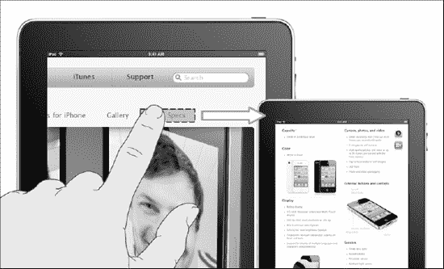

**图 6–2。***iPhone 4 页面:内容设计中的隐藏与塑造*

在[图 6–2](#fig_6_2)中，你可以看到主要目标用户并没有从设计背后的信息中分心，但是高级用户也对所有细节感到满意；请注意，这种策略非常有效，因为高级用户在寻找内容时不会感到沮丧，因为他们不必扫描网站或 web 应用的内容结构。这种用户交互不会发生在新手用户身上。

这一步将极大地影响用户体验的全球水平，因为如果你忘记了一类受众，你将失去大量的潜在用户。想象以下两种情况

*   苹果商店在 iPhone 主页中展示了所有的硬件功能，没有隐藏任何类型的元素或内容——CPU、RAM、Wi-Fi、功能、应用；一切。一个新手用户会迷失在无尽的难以理解的单词列表中，他很可能不会与新手机建立任何形式的关系。这只会意味着一件事:在 90%的情况下，他永远不会买 iPhone 4。
*   iPhone 主页只显示手机的基本信息，没有提供具体硬件信息的链接。高级用户可能会认为新手机是给没有经验的用户的，不会满足于通过网页与品牌建立的关系类型，也不会购买新 iPhone。

**图 6–3。** *苹果支持页面:内容设计中的隐藏与塑造*

[Figure 6–3](#fig_6_3)显示了另一个缩小部分内容，同时隐藏经典下拉菜单条目的例子。下拉菜单可以取代设计中的水平菜单。当这种类型的菜单隐藏了一部分内容，同时隐藏了另一个水平菜单中的条目时，Apple Store 在支持页面中使用了这种方法。

这仅仅是以战略方式使用隐藏和形状概念能够真正提高用户体验水平的两种例子。

#### 收缩和分组

有时还会出现一个元素或一部分内容不能被删除或隐藏的情况。典型的情况是当这个元素或部分内容对于次要类型的用户非常重要并且必须快速访问时。在这种情况下，您将使用收缩和分组方法。为了在你的小组中达到完美的组织水平，必须制定一个计划。缩小一个元素或内容的一部分可能意味着在视觉上缩小它的大小，这样做可以减少用户注意力的影响。内容的元素或部分仍然可用，但是它在用户的消息中不再具有主要角色。

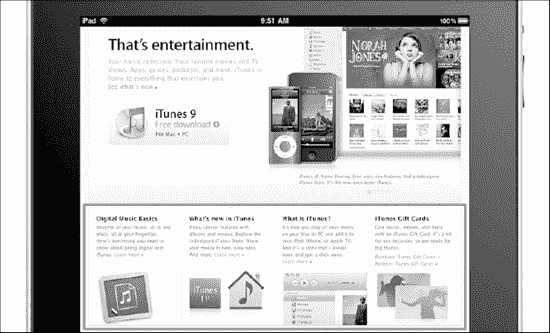

**图 6–4。***iTunes 页面:内容设计中的收缩和分组*

[Figure 6–4](#fig_6_4)展示了内容的三个部分对于页面的整体理解是多么重要，以至于不能从设计中隐藏或删除。解决方法是缩小它，把它放在主图片下面，如果需要的话，让用户有机会轻松阅读。在[图 6–4](#fig_6_4)中突出显示的元素中，来自苹果的设计师应用了相似性、接近性和对称性法则。

最后一点，重要的是要记住，对于收缩和分组，有时你需要添加，而不是删除设计中的一个元素或一部分内容。

#### 简单-复杂悖论的要点

到目前为止，您已经看到，通过应用这三个基本概念，您可以在设计中降低复杂性并增加简单性。您还可以看到，在移动环境中，简单性与高质量的用户体验密切相关。

重要的事实是，简单与复杂有着天然的联系，两者都只是发生在我们头脑中的同一事件的两种不同表达方式。出于这个原因，试图用简单来消除复杂是完全徒劳的，因为正如混沌理论对简单-复杂悖论的暗示，复杂模式中包含更简单的模式，它们是更复杂模式的反映。

几个重要的要点:

*   *简单不能消除复杂*:使用简单的概念，你不能从你的设计中消除复杂；简单需要复杂才能在我们心目中脱颖而出。
*   *简单会让你变得复杂*:移除、隐藏或缩小设计中的错误元素会增加整体的复杂性。
*   *简单是主观的*:简单是一种感知，源于用户的想法。你不能假设每个用户都认为你的设计简单。

现在，是时候进入实用部分，开始分析你的 Apple Store 用例的兼容和原生类 iPad 版本了。

#### 描绘用户界面

在这一节中，您将学习如何将三个简单性原则应用到兼容的和类似本机的版本中。从 iPad 兼容版本开始，你可以在[图 6–5](#fig_6_5)中看到草图和最终设计构图的关系。在开发这个版本时，除了手指友好和优化结构以获得轻松的触摸用户体验之外，设计方法与桌面版本相差不远。

应用删除和优先原则，删除特殊交易框和融资选项框。尽管如此，最重要的一步是消除内容的布局优势。

如果用户需要在两个相反的地方寻找重要的信息，他在浏览体验中需要更多的认知资源。众所周知，由于认知资源是有限的，如果导航结构从用户那里拿走了太多的资源，那么只有少量的资源可供用户理解内容。这将降低用户体验的水平。

作为这一步的结果，你将把主要内容放在内容结构之上，把一些导航元素放在其他元素之上。

**图 6–5。***iTunes 页面:内容设计中的收缩和分组*

您应该应用隐藏和形状原则，将软件盒和礼品卡盒从流行的配件盒中隐藏起来。这些盒子将被隐藏，但仍然可以通过使用“更多”中的一个，从新的流行配件盒中一键访问链接。你还应该藏一些 iPhone 和 iPad 的畅销商品；该框将显示前十名中的随机项目，完整的前十名可使用“更多..”列表底部的链接。

您应该应用隐藏和分组原则，将两个侧栏合并并隐藏到一个更大的侧栏中。合并这两列将对导航元素进行分组，因此，您将把用户焦点分组到(仅)布局的一个区域中。与其他设计改进相比，真正改变的是用户体验水平。

在[图 6–6](#fig_6_6)中分析您的用例的原生 iPad 版本，您可以看到与之前的兼容版本相比，该设计方法更加面向移动设备。

这一次，由于可用的屏幕空间有限，与桌面显示器相比，您将以更积极的方式应用删除和优先原则。您需要将商店索引页面中的英雄图像整合到主页中，并仅插入主要内容框作为主要英雄图像信息的支持。

在侧边栏中，您需要根据一个设备和非标准用户改变商店配置文件的可能性，对四个商店选项进行优先级排序，以便将您的购物置于上下文环境中。因为您已经积极地对导航和主要内容进行了优先排序，所以您已经打开了切换到商店的兼容版本的可能性，并且，作为最后的选择，您应该插入一个到客户支持的快捷方式。

**图 6–6。***iTunes 页面:内容设计中的收缩和分组*

第一个原则，删除和优先化，在这种移动方法中占主导地位，隐藏和成形原则以及收缩和分组原则应用较少。一旦你明白了这个事实，你就能够隐藏以下四个选项背后的几乎所有内容，Shop Mac，iPod，iPhone，和 iPad，并且你不需要收缩设计的任何部分，因为你将移除原则应用于一些明智的设计元素。

### 设计使用工具

草图已经准备好了，这意味着您已经准备好使用 Balsamiq 样机工具，这个工具与您用于 iPhone 样机的工具相同。Balsamiq 样机工具为您的兼容版本提供了一些伟大的设计元素，即使是面向触摸的，也仍然具有类似桌面的结构。原生版本将使用 Adobe Fireworks 设计，因为到目前为止，您还没有任何用于表示 iPad 草图的优化工具。

选择大菜单，并使用浏览器窗口元素来表示您的 iPad Safari 应用，如[Figure 6–7](#fig_6_7)所示。它看起来并不完全像 iPad Safari 窗口，但它可以满足您的需求:

*   **Browser Windows**

    宽度:1024px

    高度:2000 像素

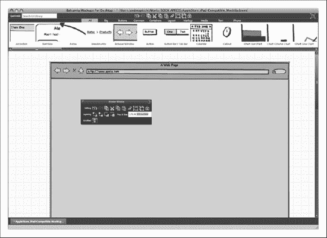

**图 6–7。** *Balsamiq 样机:浏览器窗口。*

打开浏览器窗口后，选择常用菜单，拖动主导航栏的一个菜单栏元素和次导航栏的另一个菜单栏元素，如下所示:

*   **Primary Navigation Bar**

    宽度:980 像素

    高度:36px

*   **Secondary Navigation Bar**

    宽度:980 像素

    高度:30px

[Figure 6–8](#fig_6_8)展示了如何使用按钮元素来表示搜索引擎栏，从而完成主导航栏。

现在导航区域已经完成，您可以从通用菜单中拖动 Rectangle/Canvaz/Panel 元素，并将其设计如下:

*   **Content Main Area**

    宽度:626 像素

    高度:385 像素

**图 6–8。** *Balsamiq 模型:主要和第二导航栏和内容主要区域*

在内容主区域的下方，是聚光灯区域，可以通过从通用菜单中拖动一个图像元素来绘制，尺寸如下:

*   **Spotlight Area**

    宽度:628 像素

    高度:250 像素

接下来是五线谱选择框。它是使用通用菜单中的对话框/窗口元素绘制的，如下所示:

*   **Staff Picks Box**

    宽度:628 像素

    高度:425 像素

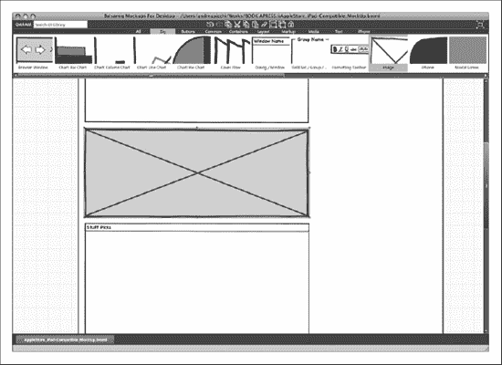

**图 6–9。** *Balsamiq 模型:聚光灯区域和五线谱选择框*

在五线谱 Picksbox 下面，使用 Rectangle/Canvas/Panel 元素绘制附件框，然后使用 Dialog/Window 元素绘制信息框。这两个元素都应该从公共菜单中选择。这两个元素具有以下尺寸:

*   **Accessories Box**

    宽度:628 像素

    高度:215 像素

*   **Informational Box**

    宽度:628 像素

    高度:395 像素

**图 6–10。** *Balsamiq 样机:配件盒和信息盒*

现在，您已经完成了设计中与内容相关的部分。现在，您需要插入与导航相关的区域，并绘制侧栏。使用矩形/画布/面板，绘制侧栏主标题，并为侧栏主菜单添加另一个矩形/画布/面板元素。这两个元素具有以下尺寸:

*   **Side Bar Main Header**

    宽度:340 像素

    高度:80px

*   **Side Bar Main Menu**

    宽度:340 像素

    高度:165 像素

**图 6–11。** *Balsamiq 模型:侧边栏主标题、侧边栏主菜单和搜索引擎栏*

接下来，使用对话框/窗口元素绘制新的存储框。下面新到店盒子，为了设计流行的配件盒子，把两个 Balsamiq 元素结合起来。为流行的附件框标题拖动一个矩形/画布/面板元素，为框的其余部分拖动一个对话框/窗口元素，包括侧栏副标题行，以及侧栏内容列表。

**图 6–12。** *Balsamiq 样机:侧栏主标题和侧栏主菜单*

最后，站点信息区会有很多链接。为了绘制这些链接，选择文本菜单并拖动两个标签/字符串文本元素。使用水平标尺/分隔符元素选择布局菜单。

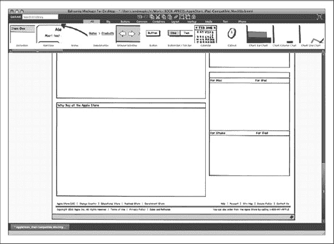

**图 6–13。** *Balsamiq 样机:现场信息区*

模型现在已经准备好了，可以使用模型导出快照进行导出，然后转换为 PNG 文件。对于原生的 iPad 版本，你需要改变你的方法，因为，到目前为止，市场上还没有一个优化的模型工具。如果你需要模拟一个设计作品，你可以使用 OmniGraffle。但是您需要设计一个草图，最好直接进入 Adobe Fireworks，将草图和设计阶段合并在一个步骤中。这是您将在下一节中为类似原生的 iPad 版本所做的事情。

### 用 Adobe Fireworks 设计

到目前为止，您已经绘制了兼容的和原生的 iPad 版本，但是您只使用 Balsamiq 样机工具模拟了兼容的版本。在下一节中，您将学习兼容版本的标准设计组合方法，然后学习如何使用类似本机版本的灰色框设计来合并草图和设计阶段。

#### 兼容 iPad 的版本

在这一部分中，您将开始处理兼容版本，然后您将呈现类似本机的版本，两个版本都遵循用于 iPhone 过程的相同过程。

##### 创建画布

打开 Adobe Fireworks 后，您需要使用 **File  New (  N)创建一个新文档。**

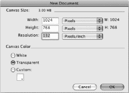

**图 6–14。** *Adobe Fireworks:创建新文档*

您的文档应该具有以下画布大小:

*   宽度:768 像素
*   高度:1024(像素)
*   分辨率:132 (ppi)

这块画布，按照 iPad 9.7 英寸 IPS 显示屏，使用 132-ppi 分辨率。请记住，配备传统 LCD 3.5 显示屏的 iPhone 在标准显示屏上使用 163 ppi，在 Retina 显示屏上使用 326 PPI 分辨率。

**注:**IPS(面内切换)是一种液晶显示技术，它将液晶单元沿水平方向排列。在这种方法中，电场通过晶体的每一端施加，但这需要每个像素两个晶体管，而不是标准薄膜晶体管(TFT)显示器所需的单个晶体管。

虽然智能手机上大多数旧的 LCD 技术都有 35 度的视角，但新的 IPS 显示屏为苹果用户提供了高达 180 度的视角。这项技术可以在苹果 iMac、iPad 和最新的配备 Retina 显示屏的 iPhone 4 中找到。

使用 iPad 的好消息是，你不必像使用 iPhone 那样处理不同的显示分辨率——至少在下一个 iPad 版本发布之前不会。

##### 组织层级

您的设计将部署在几个级别上，因此您首先要做的是创建一些文件夹来组织资产并保持工作环境整洁。

众所周知，iPad 和 iPhone 运行的是同一个操作系统；iOS。这意味着用户界面元素具有不同的宽度和高度，但具有相同的语义，因此工作区的组织级别看起来完全相同，除了一个名为 Safari 的额外文件夹，您将在其中插入 Safari 用户界面资源。

基于语义方法，您将创建以下文件夹:

*   ios
*   旅行队
*   品牌区域
*   内容区域
*   信息区
*   背景
*   模板

**图 6–15。** *Adobe Fireworks:资产文件夹的语义结构*

最后一个文件夹是模板文件夹，用于收集某些重要资源的副本，这些资源可用于设计作品的关键部分。

##### 版面设计

现在，您将为设计合成边界添加标尺文件夹。您将绘制四条线，但是这一次，在 Safari 环境中工作，您将没有底部栏，取而代之的是 Safari URL 栏。

在两侧，边界线限制了 15px 的边距，在顶部，iOS 状态栏限制了 20px，在底部，Safari URL 栏限制了 58px。一旦你添加了标尺，你可以添加一个背景层，使用选择矩形工具(U)。

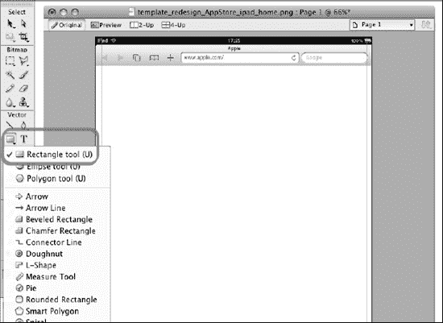

**图 6–16。** *土坯烟花:可视区域和填充标尺*

现在，您将在背景文件夹中绘制一个尺寸为 768 × 1024px 的白色矩形。这个矩形将是画布的基本背景色，正如你在 iPhone 版本中看到的，它还将激活画布对象的对齐功能。

现在你已经准备好了画布，一切都准备好开始添加设计元素了。

##### 界面设计

从顶部开始，您将设计主导航栏(PNB)和次导航栏(SNB)。您将在画布的每一侧留 22px 的边距，在顶部和底部留 20px。将使用选择圆角矩形添加以下元素:

*   **Primary Navigation Bar**

    宽度:980 像素

    高度:36px

    渐变:线性

    颜色:#8484、#CACACA

*   **Secondary Navigation Bar**

    宽度:980 像素

    高度:30px

    渐变:线性

    颜色:# eccec # F7 F7 F7 F7

    边框:1px 纯色#CBCBCB

**图 6–17。** *Adobe Fireworks:主导航栏(1)和次导航栏(2)*

每个主导航栏按钮都有一个固定的尺寸。内容如下:

*   **Primary Navigation Bar Button**

    宽度:100 像素

    高度:36px

    右边框:3px (1px + 1px + 1px)

    高度:36px

主导航栏按钮的右边框由 3px 组成，每个单个像素定义如下:

*   **PNB Right Border Left Vertical Line**

    渐变:线性

    颜色:# 8c8c8c # ce ce

*   **PNB Right Border Center Vertical Line**

    渐变:线性

    颜色:#727272，#B6B6B6

*   **PNB Right Border Right Vertical Line**

    渐变:线性

    颜色:# 8c8c8c # ce ce

接下来，使用选择文本工具(T)添加文本。该文本将定义如下:

*   **Navigation Bar Text**

    字体:Myriad Pro，常规，16 磅

    颜色:#262626

    投影:1px 纯色，#FFFFFF，270 度

*   **Breadcrumb Bar Text**

    字体:大型、常规、12pt 高光

    颜色:#666666

在设计中向下移动，下一个要处理的区域是内容主区域。选择背景级别，使用圆角矩形工具(选择圆角矩形)在内容背景中绘制一个矩形。其定义如下:

*   **Content Main Area**

    宽度:628 像素

    高度:385 像素

    颜色:#ffffff

    边框:1px 纯色#CBCBCB

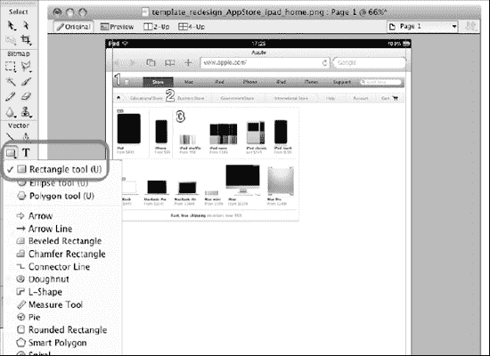

**图 6–18。** *土坯烟花:内容主区(3)*

在内容主区域下方，为聚光灯区域绘制另一个圆角矩形(选择圆角矩形)。这应绘制如下:

*   **Spotlight Area**

    宽度:628 像素

    高度:250 像素

    颜色:#ffffff

    边框:1px 纯色#CBCBCB

在聚光灯区域下方，为五线谱精选、附件和信息框再画三个圆角矩形(选择圆角矩形)。这应绘制如下:

*   **Staff Picks Box**

    宽度:628 像素

    高度:425 像素

    颜色:#ffffff

    Border: 1px solid #CBCBCB

*   **Accessories Box**

    宽度:628 像素

    高度:215 像素

    颜色:#ffffff

    边框:1px 纯色#CBCBCB

*   **Information Box**

    宽度:628 像素

    高度:395 像素

    颜色:#ffffff

    边框:1px 纯色#CBCBCB

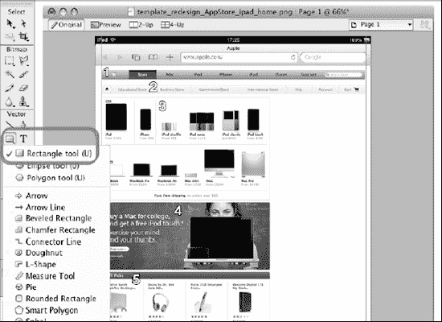

**图 6–19。** *土坯烟花:聚光灯(4)和工作人员采摘区(5)*

每个框的高度在这里并不重要，因为它会根据内容的类型而变化。重要的是，为了保持与桌面版本相同的外观和感觉，要与(通用)内容框标题保持一致。这通过使用以下值来完成:

*   **(General) Content Box Header**

    宽度:628 像素

    高度:24px

    渐变:线性

    颜色:#224272，#5C6F8D

*   **Informational Content Box Header**

    宽度:628 像素

    高度:24px

    渐变:线性

    颜色:#999999，#C2C2C2

(常规)内容框标题中使用的文本如下:

*   **(General) Content Box Header Text**

    字体:大型、常规、12pt 高光

    颜色:#ffffff

**图 6–20。** *Adobe Fireworks:边栏主标题(9)和边栏主菜单(10-11)*

下一步是使用选择圆角矩形工具插入侧栏主标题。您需要创建一个圆角矩形，并满足以下条件:

*   **Side Bar Main Header**

    宽度:340 像素

    高度:80px

*   **Gradient: Linear**

    颜色:#294876，#5B7396，#A9B5C8

    边框:1px 纯色#5E7598

**注意:**要设计三种颜色的线性渐变，您需要在 Adobe Fireworks 默认提供的两种颜色中添加一种颜色。要添加颜色，只需双击颜色条纹。

侧栏主标题中使用的文本如下:

*   **(General) Content Box Header Text**

    字体:Myriad Pro，常规，30 磅

    颜色:#ffffff

    投影:1px 纯色，#3B4C66，90 度

侧栏主菜单位于侧栏主标题下方。使用矩形工具(选择圆角矩形)绘制圆角矩形，如下所示:

*   **Side Bar Main Menu**

    宽度:340 像素

    高度:165 像素

    颜色:#ffffff

    边框:1px 纯色#CBCBCB

侧栏主菜单中使用的文本如下:

*   **Side Bar Main Menu Text Right Column**

    字体:Myriad Pro，常规，20 磅

    颜色:#333333

*   **Side Bar Main Menu Text Right Column**

    字体:Myriad Pro，常规，16 磅

    颜色:#333333

**图 6–21。** *土坯焰火:边栏内容列表(14)*

侧边栏的底部由另外三个框组成:商店新品、流行饰品和畅销品框。每个箱子都由三部分组成(除了新到商店的箱子，它由两部分组成)，标识如下:

*   **Side Bar Box Header**

    渐变:线性

    颜色:#224272，#5C6F8D

    字体:Myriad Pro，常规，18 磅，#FFFFFF

*   **Side Bar Sub Title Row**

    颜色:#efefef

    边框:1px 纯色#CBCBCB

    字体:Myriad Pro，常规，16 磅

    图标:圆形，16px

*   **Side Bar Content List**

    颜色:#ffffff

    边框:1px 纯色#CBCBCB

    字体:Myriad Light，常规，16 磅

设计的最后一个元素是信息区。该区域未被包裹在盒子内，显示了与以下文本相关的一些一般信息:

*   **Site Information Area Text**

    字体:Myriad Pro，常规，12 磅

    颜色:#999999

*   **Site Information Area Link**

    字体:Myriad Pro，常规，12 磅

    颜色:#0085CF

**图 6–22。** *Adobe Fireworks:信息框(7)和站点信息区(8)*

当您的兼容版本完成时，设计合成也就完成了。一旦一切都完成了，您就可以开始工作了。

#### iPad 原生版

画布值和工作空间组织与您在兼容版本中看到的相同。您的设计合成设置不会发生任何变化。改变的是画布尺寸，因为你必须从纵向切换到横向。

##### 创建画布

打开 Adobe Fireworks 后，您需要使用**文件新建** (  N)创建一个新文档。

**图 6–23。** *Adobe Fireworks:创建新文档*

您的文档应该具有以下画布大小:

*   宽度:1024px
*   高度:960 像素
*   分辨率:132 像素

##### 灰色盒子设计

灰色方框设计将代表你的纸上草图，并将成为你设计作品的基础。这是设计阶段的另一种方法。最终目标是两种方法的设计组合；每种方法都是主观的，由您(或您的团队)决定选择哪种方法。

[Figure 6–24](#fig_6_24)向您展示了您在浏览器窗口的构成中保留了 78px，还向您展示了如何使用矩形工具(选择矩形工具(U))来设计侧栏标题和内容标题。侧栏标题和内容标题应满足以下条件:

*   **Side Bar Header**

    宽度:300 像素

    高度:44px

    颜色:#999999

    正文:Helvetica，粗体，20 磅

    文字阴影:1px 实线，#333333，270deg

*   **Content Main Header**

    宽度:724 像素(723 像素内容+1 像素左边框)

    高度:44px

    颜色:#999999

    正文:Helvetica，粗体，20 磅

    文字阴影:1px 实线，#333333，270deg

**图 6–24。** *Adobe Fireworks:侧栏和内容主标题*

现在已经分配了设计的两个区域，所以您可以开始使用侧栏来添加元素。使用矩形工具(选择矩形工具(U))，添加符合以下要求的九个菜单项和两个菜单标题:

*   **Menu Entry**

    宽度:300 像素

    高度:44px

    颜色:#999999

    下边框:1px 纯色，#ADADAD(最后一个元素#666666)

*   **Menu Title**

    宽度:300 像素

    高度:26px

    颜色:#999999

    上边框:1px 纯色，#CCCCCC

    下边框:1px 纯色，#666666

    正文:Helvetica，粗体，18 磅

    文字阴影:1px 实线，#333333，270deg

**图 6–25。** *Adobe Fireworks:边栏菜单元素和标题*

侧栏现在已经完成，您现在可以跳转到另一栏中的内容主区域。使用圆角矩形工具(选择圆角矩形)，设计英雄框、产品框和站点信息框，如下所示:

*   **Hero Box**

    宽度:644px

    高度:237 像素

    边框:1px 实心，#666666

*   **Products Box**

    宽度:644px

    高度:402 像素

    边框:1px 实心，#666666

*   **Site Information Box**

    宽度:644px

    高度:62px

    边框:1px 实心，#666666

**图 6–26。** *土坯礼花:英雄箱和产品箱*

[图 6–27](#fig_6_27)展示了最终的灰色方框，你将使用它作为你设计作品的基础。由于结构已经在设计阶段形成，您只需要更改元素颜色，添加文本、图标和图像。

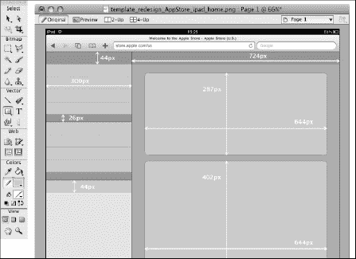

**图 6–27。** *土坯烟花:灰色盒子设计尺寸*

下一步是通过组织工作空间并为您的资产创建文件夹来开始设计合成。

##### 组织层级

工作区将使用相同的文件夹、级别和层次结构。基于语义方法，您将创建以下文件夹:

*   ios
*   旅行队
*   品牌区域
*   内容区域
*   信息区
*   背景
*   模板

**图 6–28。** *Adobe Fireworks:资产文件夹的语义结构*

##### 版面设计

现在灰色框准备好了，您可以添加另一个文件夹，称为标尺，到您的设计合成边界。选择这个文件夹(图层)，用线条工具(选择线条工具(N))画四条红线。这三行将设置浏览器窗口边界和内容主区域的 20px 填充边界。

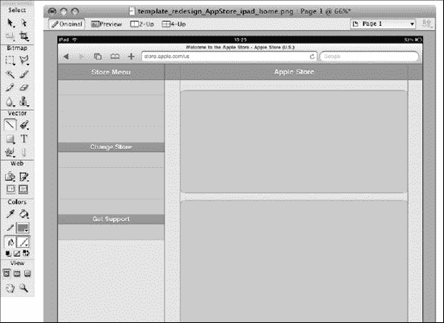

**图 6–29。** *土坯烟花:灰色盒子上有统治者的图案*

由于采用了灰盒设计，您的工作现在将变得更加容易。你将不再需要设计任何其他元素，只需要改变它的颜色。从侧栏开始，将元素颜色更改为以下颜色:

*   **侧栏区域**
    *   背景:#FFFFFF
*   **侧栏标题(商店菜单)**
    *   渐变:线性
    *   颜色:#294876，#F4F5F7
*   **菜单标题(更改商店，获得支持)**
    *   边框顶部:1px 纯色，#CCCCCC
    *   底部边框:1px 纯色，#666666
*   **菜单项(通用菜单元素)**
    *   颜色:#ffffff
    *   上边框:1px 纯色，#F0F0F0
    *   底部边框:1px 纯色，#D1D1D1(最后一项#666666)

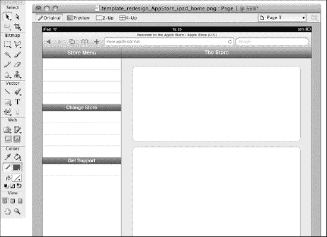

**图 6–30。** *土坯烟花:没有内容的彩色图案*

继续内容方面，您将把元素颜色更改为以下颜色:

*   **Content Area**

    背景:#E1E6EB

*   **Content Box (Hero Box, Products Box, Site Information Box)**

    颜色:#F7F7F7

    边框:1px 纯色，#828282

现在内容的一切都准备好了。在侧边栏中，开始在左侧添加文本条目和图标，如下所示:

*   **Menu Entry Icon & Text**

    宽度:“随图标设计变化”

    高度:34px

    正文:Helvetica，粗体，16 磅

侧栏已完成，现在您可以跳转到内容主区域，并在三个框中添加以下文本

*   **Hero Box**

    标题文本:Helvetica，粗体，50 磅，#000000

    副标题文本:Helvetica，粗体，20 磅，#000000

*   **Products Box**

    描述文本:Lucida Grande，粗体，11 磅，#000000

    价格文本:Lucida Grande，粗体，11 磅，#666666

*   **Site Information Box**

    文字:大亮度，Bold，10pt # 999999

    链接:大亮度，Bold，10pt，#0085CF

*   **Footer Apple Logo**

    宽度:“随图标设计变化”

    高度:20px

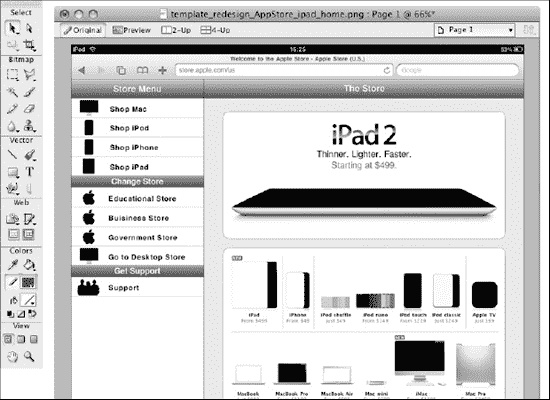

**图 6–31。** *土坯烟花:最终仿原生设计构图*

除了作为布局结构一部分的菜单图标的尺寸外，图像尺寸与内容的含义有关，可以在不影响整体结构的情况下进行更改。这是没有报告这些设计元素尺寸的主要原因。

设计构图完成。您已经具备了推进项目流程下一个大步骤的一切必要条件；实现阶段。在第七章中，你将开始介绍本书中使用的三种语言:HTML、CSS3 和 JavaScript。

##### 用户界面设计工具

本章中使用的(不是使用而是建议的)工具既是物理工具也是应用。Table 6–1 列出了一些设计下一代用户界面的有用工具。

### 总结

在这一章的第一部分，你分析了界面设计的过程，并介绍了草图的剖析和“简单思考”的范例。iPhone 的局限性，iPhone 的页面模型，以及认知资源如何影响你的设计风格都被讨论了。还讨论了这三个元素是如何成为“简单思考”设计范例的基础的。

在这一章的第二部分，Balsamiq 原型工具被用来改进用纸和笔绘制的草图。内容、界面连接和概念设计的第一个可视化表示都已创建。

在本章的第三部分，Adobe Fireworks 用于设计用户界面。这个过程是一步一步来的，从创建一个新的画布到界面设计。在过程的最后，引入了从显示的主页创建另外两个视图或页面的设计重用，还引入了作为实现阶段可交付成果的界面-内容关系的可视化表示。