# 七、WebKit 的 Web 标准：最大化移动 Safari

> “不仅仅是它看起来和摸起来的样子..
> 
> 设计就是它的工作方式。”
> 
> —史蒂夫·乔布斯

在这相当长的一章中，我们从移动 Safari 的角度来讨论 web 标准。在第一部分中，我们介绍 HTML5，它的标记语法，它的新标签，以及它如何从 HTML4 重新定义一些标签。我们讨论 HTML5 以及`<video>`和`<audio>`标签的语义。我们还引入了`<canvas>`标签，在这一节的最后，我们展示了一个在“商店”用例中实现的幻灯片演示的实例。

在第二部分，我们来看看 CSS Level3，它的新属性和语法。我们列举了可用于这些新属性的所有值。

在本章的最后一部分，我们将讨论 Javascript 的基础:它的语法、语句、函数和方法。我们还看了浏览器对象模型(BOM)和文档对象模型(DOM ),并展示了如何使用它们来动态改变网页。

**注意:**本章涵盖了每个技术领域的基础知识，所以如果你对 HTML5、CSS3 和 Javascript 很有信心，可以随意跳到下一章，或者跳到本章的相关章节，复习一下你生疏的领域。

### 比较 iPhone 和 iPad 的网络演示

如前所述，iPhone 和 iPad 是两种不同的设备。这两种设备的一个共同点是它们的 HTML5 语义结构。

这两种设备的不同之处在于它们如何通过两种不同的 CSS3 样式表和 Javascript 行为来呈现我们项目中的内容。iPhone 基于**页面模型范式**，而 iPad 基于**块模型范式**，或者多页面模型范式。

在这一章中，我们来看看 web 标准如何在这些差异背后扮演一个共同的角色，以及如何使用它们来开发更好的网站和 web 应用。

### HTML5

物理学家蒂姆·伯纳斯·李于 1989 年开发了超文本标记语言(HTML ),当时他正在欧洲研究组织(CERN)工作。

1991 年，HTML 第一次被公开提及，1995 年，它达到了 2.0 版本。HTML 在 1997 年经历了 3.2 和 4.0 版本，并在 1999 年达到了众所周知的 4.0.1 版本。HTML5 的工作始于 2004 年，将于 2022 年达到“建议”版本。

2022 年的日期对于设计师和开发者来说可能听起来太遥远了，但是我们可以专注于我们今天可以用这种语言做什么。在 2012 年，HTML5 将达到候选推荐的状态，这意味着一些最有趣的功能，如音频、视频和画布标签、web workers、地理定位、应用缓存和 HTML5 语义标签，目前都是可用的。

我们在第 10 章中介绍了应用缓存，但是接下来的章节将介绍这个新的 web 标准的基础。

#### HTML5 标记语法

标记语言是为文本的处理、定义和表示而设计的；用于指定格式的代码被称为*标签*。HTML5 定义了与 HTML4 和 XHTML1 兼容的 HTML 标记语法；HTML4.0.1 的大部分在 HTML5 中幸存了下来。

HTML5 旨在成为 HTML4 的继任者，旨在通过制定如何处理所有 HTML 元素的精确规则，以及首次为标记语言制定如何从错误中恢复的规则，来提高互操作性并降低开发成本。对于网页设计者和网页开发者来说，错误处理并不像浏览器制作者和测试者那样重要。

使用过 XHTML 的人都知道，XHTML 强迫我们使用 XML 语法，所有的属性都用引号括起来，并使用小写代码。HTML5 中的所有内容都是有效代码:大写、小写、引号、无引号、自结束标记等等。这种态度让我们回到了 90 年代末，在 XHTML 1.0 之前，这种非规则产生了自 Berners-Lee 在 1989 年打开他的第一台服务器以来最糟糕的 HTML 代码。

正如您可能理解的那样，我们不喜欢 HTML5 语法的松散，并鼓励为 HTML5 带来一种类似 XHTML 的简洁风格——如果您在一个团队中工作，一致性在每个级别都很重要，那就更是如此。

HTML5 中的一种新方法包含了*弃用的元素*。在过去的 HTML 版本中，设计人员或开发人员被建议不要在代码中使用不推荐使用的元素，浏览器也不会在其规范中包含不推荐使用的元素。因为 HTML5 的目标是向后兼容，它不是将元素声明为不推荐使用并从其规范中删除，而是将其声明为过时，并在其规范中保持呈现元素规则。我们可以将这种类型的方法定义为用户友好或面向用户体验，因为从 HTML5 开始，如果 HTML5 兼容的浏览器遇到了*过时元素*，它仍然能够呈现它并提供更高级别的用户体验。

我们还可以注意到，在许多方面，新的 HTML5 语法是简单驱动的。《宣言》是这种态度的一个很好的例子。我们在下面的代码中比较了 iWebKit Framework 5.0.4 XHTML 和新的 HTML5 `doctype`声明:

`<!-- XHTML DocType -->
<!DOCTYPE html PUBLIC "-//W3C//DTD XHTML 1.0 Strict//EN"
"http://www.w3.org/TR/xhtml1/DTD/xhtml1-strict.dtd">

<!-- HTML5 DocType -->
<!DOCTYPE html>`

我们可以看到新的`doctype`声明更加简单。这种方法还简化了字符编码声明，其中`charset`属性是指定 UTF-8 编码所必需的唯一属性。下一个示例显示了新的 HTML5 字符编码声明语法，与用于 iWebKit Framework 5.0.4 的旧的(仍然允许的)HTML4.0.1 进行了比较。

`<!-- XHTML DocType -->
<meta content="text/html; charset=utf-8" http-equiv="Content-Type" />

<!-- HTML5 DocType -->
<meta charset=”UTF-8”>`

这种演变也带来了整个 HTML 历史上最具代表性的标签语法的变化——将我们的文本变成超文本的标签:`<a>`标签。(X)HTML 规范将`<a>`标签实现为行内元素，迫使我们在每次需要创建标题时使用多个标签。在 HTML5 中，`<a>`标签仍然是一个内嵌标签，不同的是，在 HTML5 中，嵌套的块级元素不再无效。

以下代码是(X)HTML 和 HTML5 中的`<a>`标签的示例。

`<!-- (X)HTML <a> Tag -->
<h2>**<a href="/portfolio.html">**Portfolio**</a>**</h2>

**<a href="/portfolio.html">**Find out more about my last Book.**</a>**

<!-- HTML5 <a> Tag -->
**<ahref="/portfolio.html">** <h2>Portfolio</h2>

Find out more about my last Book.

**</a>**`

您可能已经注意到，HTML5 与其说是革命性的，不如说是进化性的，它并没有显著地改变标记的故事。

#### HTML5 重新定义

尽管许多 HTML4 元素在本质上没有改变地被引入 HTML5，但是一些历史上的表示元素被赋予了语义([Figure 7–1](#fig_7_1))。WC3 的 HTML5 建议重新定义了[Table 7–1](#tab_7_1)中显示的元素。

#### HTML5 语义

除了到目前为止引入的一些新的语法规则，最显著的特性包括标签的语义。HTML5 有一种自然的面向语义的态度，并使开发人员能够通过更语义地表达内容来创建跨平台的设计。为了实现这一点，HTML5 引入了一些新的标签，如`<header>`、`<nav>`、`<section>`、`<aside>`和`<footer>,`，以构建我们的网站或 Web 应用，并使内容更易于机器阅读，从而使移动浏览器和搜索引擎更容易正确处理内容。

**图 7–1。** *HTML4 和 HTML5 在两个简单 iPhone 页面结构中的对比*

HTML5 还引入了一些新的内联元素，如`<mark>`、`<time>`、`<meter>`和`<progress>`，这些元素与之前的元素(如`<strong>`、`<em>`、``等)一样，从“内联”重命名为“文本级语义”在[Table 7–2](#tab_7_2)中，我们按字母顺序列出了 HTML5 中所有的新标签。这些标签被添加到来自(X)HTML 规范的以前的、受支持的和未被否决的标签中。下一节将介绍一些新的媒体标签。

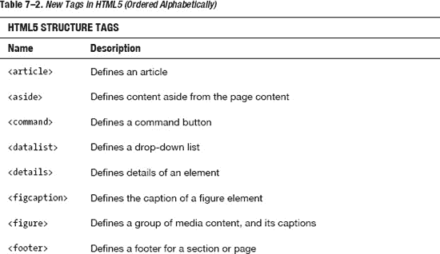

#### HTML5 媒体

诸如 XHTML、CSS 和 Javascript 之类的 Web 标准为我们提供了发布文本和图像所需的一切，它们为我们的项目添加了交互功能。当我们处理音频和视频时，问题就来了。为了插入音频和视频内容，我们曾经依赖于像 Adobe Flash 这样的外部插件。HTML5 通过引入新的标签来嵌入音频和视频，无需外部插件，从而填补了这一空白。

##### 视频标签

新的`<video>`标签是 HTML5 列表中迄今为止最著名的标签，因为众所周知的苹果和 Adobe 之间关于 Flash 技术支持的争议。它使我们能够直接在浏览器中播放网站或 web 应用中的视频。此功能仅对桌面浏览器有效。在 iPhone 或 iPad 环境中，视频不是真正的嵌入式视频，因为它不直接在浏览器中播放。

iOS 总是启动内置的媒体播放器，它占据了整个屏幕，用户可以使用完成按钮返回到网站或 web 应用。用于我们“商店”用例的电视广告页面的`<video>`标签结构如下:

`… … …

        <video width="100%" height="148" src="videos/iphone_facetime.mp4" controls poster="pics/poster-facetime.jpg"></video>

… … …`

`controls`属性告诉浏览器是否必须显示视频控件，而`poster`属性是用作视频占位符的图像。不仅总是将控制属性添加到<视频>标签是一个好习惯，还必须记住 Safari Mobile 会忽略控制属性。控件总是可见的，并且不需要 true/false 属性(即使在 Safari 桌面上)。关于`<video>`标签需要记住的另一个重要行为是，iOS 上的 Safari 会忽略 autoplay 属性。

像其他 HTML5 元素一样，`<video>`标签可以通过 CSS 进行样式化。在这个例子中，我们只使用了四个属性，但是这个新标签有许多其他属性，可以帮助我们为用户提供更丰富的体验。在[表 7–3](#tab_7_3)中，我们显示了每个`<video>`属性及其相关描述。

T2】

[Table 7–4](#tab_7_4)显示了 iOS 支持的视频格式。

T2】

##### 音频标签

`<audio>`标签是 HTML5 中引入的另一个重要的媒体标签。它使我们能够在浏览器中播放带有本地音频回放的音频文件。`<audio>`标签的工作方式与`<video>`标签相同，尽管它的属性是`<video>`标签的子集。`<audio>`标签的结构如下:

`<audiosrc="audioName.mp3" controls autobuffer></audio>`

在这个例子中，我们使用一个属性向用户显示音频控件，使用一个属性预先缓冲音频文件。像某些`<video>`属性一样，这些是没有值可指定的布尔属性，如下例所示:

`// (X)HTML5 syntax <audio src="audioName.mp3" **controls=”true”**autobuffer=”true”></audio>
// HTML5 syntax
<audio src="audioName.mp3" **controls**autobuffer></audio>`

如果您喜欢类似 XML 的语法，可以指定属性值，但这不是必需的。为`<audio>`标签定义的所有属性在[表 7–5](#tab_7_5)中报告。

[表 7.6](#tab_7_6) 显示了 iOS 支持的音频格式。

T2】

##### 画布标签

`<audio>`和`<video>`标签是 HTML5 发展过程中最重要的两个标签，我们经常在我们的网站或 Web 应用中使用这些标签。`<canvas>`标签代表了网络图形功能的巨大进步，因为它使 Web 开发者能够构建许多与本地应用多年来拥有的相同的事件和效果。尽管 GPU 开销的缺点，我们可以使用动态图像来节省带宽和减少图像加载延迟。

##### HTML 画布 vs. SVG 像素与矢量

HTML5 Canvas 和 Scalable Vector Graphics (SVG)都是使我们能够在浏览器中创建丰富图形的 web 技术，但它们彼此有着根本的不同。

HTML5 Canvas 规范是一个 Javascript API，它使我们能够编写可编程的绘图操作。Canvas 本身使 web 开发人员能够定义一个 canvas 上下文对象，然后可以绘制该对象。我们还可以插入图像(例如。png 或者。jpg)和浏览器能够加载的任何其他内容。

要进行实际绘图，您有两种选择:

*   2D 绘画语境
*   3D 绘图上下文

另一方面，SVG 是一种基于 XML 的矢量图形格式。SVG 内容可以是静态的，也可以是动态的、交互式的和动画的。有了 SVG，我们可以做的不仅仅是简单的矢量图形和动画；我们可以用脚本、高级动画事件和过滤器开发高度互动的 web 应用。

SVG 仍处于优化过程中，以便在浏览器中与 HTML 和 CSS 更紧密地集成。SVG 1.1 是 W3C 推荐标准，在撰写本文时，它是完整规范的最新版本。除了 SVG 1.1，我们还有 SVG Tiny 1.2 ( `[www.w3.org/TR/SVGTiny12/](http://www.w3.org/TR/SVGTiny12/)),`)，这也是 W3C 针对移动设备的推荐标准。我们可以在`[www.w3.org/Graphics/SVG/WG/wiki/Roadmap](http://www.w3.org/Graphics/SVG/WG/wiki/Roadmap)`遵循 SVG 路线图。

HTML Canvas 和 SVG 也是 iOS 设备上 Adobe Flash 的一个很好的替代品。出于这个原因，我们希望基于开放 HTML5 标准的未来 web 将完全支持 SVG。

##### HTML 画布和 SVG 比较

乍一看，Canvas 和 SVG 似乎是实现同一目标的不同技术；然而，两者之间存在几个重要的差异。[Table 7–7](#tab_7_7)显示了其中的一些。

HTML Canvas 和 SVG 并不是互斥的，我们可以找到好的方法在同一个网页中一起使用(比如 Canvas 作为背景，SVG 在上面)；我们可以在画布上绘制 SVG，反之亦然。这里列出了 HTML Canvas 和 SVG 的一些优缺点。

**HTML 画布**

**优势**

*   高 2D 拉伸性能
*   在固定画布尺寸上保持恒定的性能水平
*   将生成的图像保存为 png 或 jpg 的选项

**缺点**

*   没有绘制元素的 DOM 节点
*   没有动画 API
*   较差的文本呈现能力

**SVG(可缩放矢量图形)**

**优势**

*   独立于分辨率
*   内置动画支持
*   使用 SVG DOM API 完全控制每个元素

**缺点**

*   引入(DOM)渲染延迟

就实践实现而言，底线是，除了在 HTML Canvas+SVG 方法中(如在游戏应用中，我们可以使用 Canvas 动态渲染光栅图形并用 SVG 制作动画)，HTML Canvas 应该用于生成光栅图形。另一方面，SVG 应该用于独立于分辨率的用户界面和高度交互的动画。

##### 画布元素

HTML Canvas 元素为 web 页面提供了一个地方(画布), Web 开发人员可以在这里使用 Javascript 代码绘制各种自由形式的图形，如线条、形状、图像，甚至是动态文本。缺点是，一旦我们在

<canvas>中绘制了一些东西，它们就会成为页面 DOM 的一部分，Javascript 引擎就会忘记它们。</canvas>

一个网页可以有不止一个

<canvas>，并且这些可以重叠，可以和其他标准一起使用，比如 SVG。当我们在

<canvas>中绘制一个对象时，坐标系从左上角开始，x 值从左到右递增，y 值从上到下递增，如图[图 7–2](#fig_7_2)所示。</canvas>

</canvas>

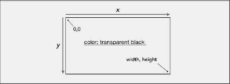

**图 7–2。** *起始画布坐标系和背景颜色*

以下代码显示了基本的画布语法和属性:

`<canvas id="heroCanvas width="460" height="300">
        Fallback Content
</audio>`

`<canvas>`标签通常有一个 ID 属性，因为 Javascript 使用它来访问绘图区域。默认的<画布>尺寸是 300x150，但是我们可以使用标签中的宽度和高度属性来设置它们。

如果用户禁用了 Javascript 引擎，而浏览器不理解什么是`<canvas>`标签，将显示回退内容。在这种特殊情况下，甚至宽度和高度属性都被忽略；为了避免这个问题，我们可以使用 CSS 设置宽度和高度，以保持设计行为不变。

`#canvasHero
{
        display: inline-block;  // only on non-floated element
        height: 300px;
        width: 460px;
}`

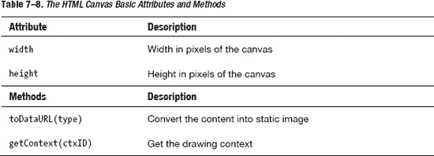

[Table 7–8](#tab_7_8)中的`toDataURL()`方法将图像的内容转换成静态图像，通常是. png。png 支持是强制性的，但也可以支持其他格式。

[表 7–8](#tab_7_8)中的`getContext()`方法获取画布的绘制上下文。该上下文包含关于画布的信息，并为该特定上下文提供所有绘制方法。

`<html>
<head>
        <title>Canvas Test</title>
        
</head>
<body>

        <h1>Canvas Example 01</h1>
<canvas id="canvasTest01" width="300" height="200">
        Please Enable Javascript Engine
</canvas>
</body>
</html>` 

**图 7–3。** *使用 HTML 2D API:使用画布和 CSS 绘制基本形状*

##### 基本形状和线条

在图 7–3 所示的第一个例子中，我们看到了如何使用 CSS 绘制画布。现在，让我们进入下一个层次，看看我们如何使用 Javascript 来影响画布在浏览器中的外观。在`<canvas>`上绘图需要以下步骤:

1.  检索对`Canvas`元素的引用。
2.  使用`getContext().`从元素中获取绘图上下文
3.  如果`getContext`返回的结果不为空，我们可以使用绘图 API。

这种方法的一个例子如下:

`<canvas id="canvasTest" width="300" height="200">
        Please Enable Javascript Engine
</canvas>
        function drawOnCanvas() {
                varctxElement = document.getElementById(“canvasTest”);
                varctx = ctxElement.getContext("2d");
                if (ctx != null) {
                        // we can draw using Canvas 2D API
                }
}`

我们定义了一个函数，在主体函数中，我们获取了对存储在变量`ctxElement`中的画布的引用，然后我们发出了一个对 2D API 的请求。如果测试结果不为空，我们可以使用 2D API 进行绘制。

2D 画布 API 提供了几种方法，分为三组，如图[Figure 7–4](#fig_7_4)所示。

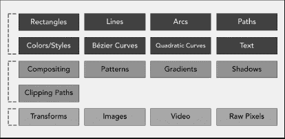

**图 7–4。** *把 HTML 2D API 分成三组*

在下一个例子中，我们将看到如何使用 2D API 中的方法填充矩形。首先，我们使用`getElementById`方法获取对 canvas 元素的引用，并像前面的例子一样请求 2D API。然后，我们使用`fillStyle`和`fillRect`方法填充矩形。矩形是画布支持的唯一基本形状。这与 SVG 不同，SVG 也支持椭圆作为原始形状。在[Table 7–9](#tab_7_9)中，我们可以看到操作矩形的三种基本方法。

T2】

`fillStyle`方法设置应用于矩形的样式的颜色，`fillRect`设置操作的开始和结束坐标。从宽度和高度<画布>属性值中检索结束坐标。在[图 7–5](#fig_7_5)中，我们可以看到最终的结果。

**图 7–5**。*使用 HTML 2D API:使用画布和方法绘制基本形状*

下面的完整代码来自我们当前的例子。

`<html>
<head>
       <title>Canvas Test</title>
       
</head>
<body>

        <h1>Canvas Example 02</h1>
        <canvas id="canvasTest02" width="400" height="300">Please Enable Javascript
Engine</canvas>
</body>
</html>`

在下一个例子中，我们可以看到如何绘制两个形状——一个像以前一样用颜色填充，另一个用笔画填充。我们还将看到如何在两个绘制的形状上使用`clearRect(x,y,w,h)`方法。在[图 7–6](#fig_7_6)中我们可以看到最终的结果。

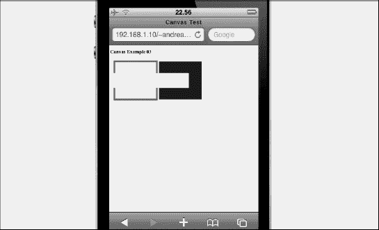

**图 7–6。** *运行中的 HTML 2D API:绘制和清除形状*

让我们来看看下面的代码，这些代码来自我们在[Figure 7–6](#fig_7_6)中显示的绘制和清除形状示例。

`<html>
<head>
        <title>Canvas Test</title>
        
</head>
<body>

          <h1>Canvas Example 03</h1>
          <canvas id="canvasTest03" width="600" height="300">Please Enable Javascript
Engine</canvas>
</body>
</html>`

线条和形状有些不同。可以使用各种设置来创建线，这些设置决定了线如何连接在一起以及如何结束。在[Table 7–10](#tab_7_10)中，我们可以看到对行进行操作的方法。

在下面的例子中，我们看到了如何画线以及`threelineCap`方法的属性是如何工作的。如图[Figure 7–7](#fig_7_7)所示，通过使用这三个属性，我们可以实现三种不同的效果。

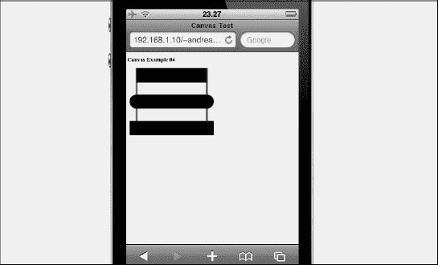

**图 7–7。**T3【HTML 2D API 在行动:lineCap 方法

以下代码来自[图 7–7](#fig_7_7)中所示的 lineCap 方法示例。

`<html>
<head>
        <title>Canvas Test</title>
        
</head>
<body>

         <h1>Canvas Example 04</h1>
         <canvas id="canvasTest04" width="600" height="600">Please Enable Javascript
Engine</canvas>
</body>
</html>`

我们用一条红线来展示 lineCap 方法是如何工作的；通过这种方式，我们可以看到线的末端从哪一点被修改。在下一节中，我们将看到如何绘制复杂的形状。

##### 复杂的形状

我们已经看到了如何画简单的形状，现在我们画一些更复杂的形状，比如路径。路径是一组点，就像数学中直线是一组点一样。

路径可以是开放的，也可以是封闭的；封闭路径总是有一个与起点相同的终点。一个上下文可以有且只能有一个当前路径。在[表 7–11](#tab_7_11)中，我们可以看到在一种叫做*弧*的路径上运行的方法。弧是圆的一部分的曲线；圆被认为是 360 度的弧。

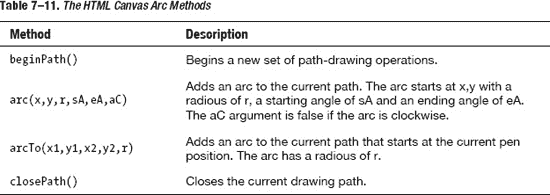

在[图 7–8](#fig_7_8)中，我们可以看到一条用弧线绘制的简单路径。

**图 7–8。***HTML 2D API 在行动:使用弧线绘图*

以下代码是[图 7–8](#fig_7_8)中所示的示例。

`<html>
<head>
        <title>Canvas Test</title>
        
</head>
<body>

        <h1>Canvas Example 06</h1>
        <canvas id="canvasTest06" width="800" height="600">Please Enable Javascript Engine</canvas>
</body>
</html>`

弧线不是我们可以使用画布 2D API 绘制的唯一路径。Canvas 还可以让我们绘制贝塞尔曲线和二次曲线。使用两个控制点来确定曲线，从起点到终点绘制贝塞尔曲线。二次曲线类似于贝塞尔曲线，但它们只使用一个控制点来确定曲线。这意味着与二次曲线相比，使用两个控制点的贝塞尔曲线可以绘制更复杂的曲线。

**图 7–9。***HTML 2D API 在行动:Canvas curves 实现*

在[图 7–9](#fig_7_9)中，我们可以看到有两个控制点的贝塞尔曲线和只有一个控制点的二次曲线的区别。在[表 7–12](#tab_7_12)中，我们可以看到操作贝塞尔曲线和二次曲线的方法。

在[图 7–10](#fig_7_10)中，我们可以看到如何使用二次曲线绘制一个简单的高尔夫球杆。

**图 7–10。***HTML 2D API 在行动:使用二次曲线绘图*

以下代码是[图 7–10](#fig_7_10)中所示的示例。

`<head>
        <title>Canvas Test</title>
        
</head>
<body>

        <h1>Canvas Example 06</h1>
        <canvas id="canvasTest06" width="800" height="600">Please Enable Javascript Engine</canvas>
</body>
</html>`

##### 使用裁剪路径

在上一节中，我们看到了路径的例子。现在我们来看看如何使用路径来定义一个遮罩，该遮罩定义了一个发生绘图的区域，以及该空间之外的一个绘图无效的区域。默认情况下，剪辑路径由整个画布定义。在[Table 7–13](#tab_7_13)中，我们可以看到使用裁剪路径的方法。

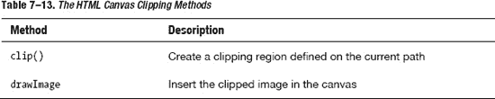

在下面的例子中，我们使用一个圆弧来定义一个 360 度的圆形遮罩。该示例的代码如下所示:

`<html>
<head>
        <title>Canvas Test</title>
        
</head>
<body>

        <h1>Canvas Example 07</h1>
        <canvas id="canvasTest07" width="800" height="200">Please Enable Javascript Engine</canvas>
        
</body>
</html>`

接下来，我们看看如何操作画布对象。

##### 操纵画布对象

除了可以绘制一些复杂的形状，canvas 还提供了一些高级操作来变换、缩放或旋转 canvas 对象。在[表 7–14](#tab_7_14)和[表 7–15](#tab_7_15)中，我们可以看到用于这些高级操作的方法。

除了[表 7–14](#tab_7_14)中的内置转换，我们还可以使用[表 7–15](#tab_7_15)中的两种方法定义我们自己的转换。

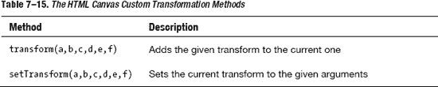

Canvas 还有一个默认合成方法的设置，它决定了如何将新内容绘制到画布表面。我们在[表 7–16](#tab_7_16)中列出了 12 种不同的合成方法。

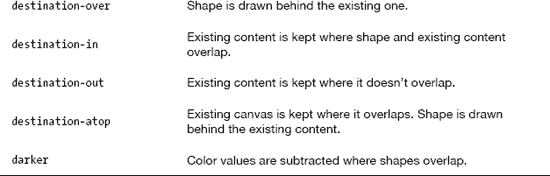

在[图 7–11](#fig_7_11)中，我们可以看到[表 7–16](#tab_7_16)中的方法是如何操作的。

**图 7–11。***HTML 2D API 在行动:组合方法*

之前的 canvas 高级操作是在我们需要用 HTML 开发一个网页游戏的时候使用的；然而，重要的是开发人员要知道像 HTML 第五版这样的“标准”提供的所有可能性。

##### 画布状态

我们在画布中绘制的每个上下文都维护一个*绘制状态*。使用一些特定的方法可以访问和管理绘图状态。

该状态保存在保存状态的堆栈中。这意味着我们可以通过将一个状态插入堆栈顶部来保存它，并通过弹出堆栈顶部的最后一个状态并恢复它来恢复一个状态。

绘图状态，也称为*画布状态*，跟踪来自不同属性的几个值，如下所示:

1.  当前方法值(例如，fillStyle、strokeStyle 等)
2.  电流变换矩阵
3.  当前剪辑区域

画布状态用于恢复形状的一组值，而不必手动跟踪它们。表 7–17 显示了 HTML 画布的状态方法。

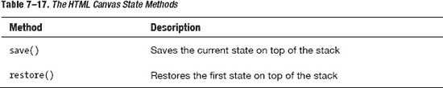

在下面的例子中，我们首先用一些颜色和笔画值绘制一个矩形，然后保存画布状态。接下来，我们用不同的颜色和笔画值绘制另一个矩形，然后，在绘制第三个矩形之前，我们恢复画布状态。恢复方法将先前保存的状态应用于第三个矩形，如图[Figure 7–12](#fig_7_12)所示。

**图 7–12。***HTML 2D API:save()和 restore()方法在起作用*

在[图 7–12](#fig_7_12)中显示的前一个例子的代码如下:

`<html>
<head>
        <title>Canvas Test</title>
        
</head>
<body>

        <h1>Canvas Example 05</h1>
        <canvas id="canvasTest05" width="800" height="600">Please Enable Javascript Engine</canvas>
</body>
</html>`

当我们在复杂的上下文中工作时，`save()`和`restore()`方法将我们从每次需要对某个形状应用微小变化时跟踪当前和过去画布状态的手工工作中解救出来。

要查看最新的 HTML5 Canvas 草案版本，请访问位于`[www.w3.org/TR/html5/the-canvas-element.html](http://www.w3.org/TR/html5/the-canvas-element.html)`的 W3C 官方页面。

##### 制作画布幻灯片

现在我们为“商店”用例创建一个幻灯片。我们使用由画布绘制的三个不同的图像，以及一个负责随着时间推移滑动这三个图像的 Javascript 函数。有关 Javascript 的回顾，请参阅本章后面的“Javascript”一节。

第一步是打开我们的 index.html，在我们的英雄区域插入

<canvas>，如下所示:</canvas>

`… … …

        <canvas id='heroCanvas' width='298' height='150'></canvas>` `

… … …`

现在我们需要创建一个名为 *heroCanvas.js* 的新文件，并将其保存在框架的 Javascript 文件夹中。

`varimagePaths = [
        "pics/hero-slide_01.png", "pics/hero-slide_02.png", "pics/hero-slide_03.png"
];
varshowCanvas = null;
varshowCanvasCtx = null;
varimg = document.createElement("img");
varcurrentImage = 0;`

前面显示的代码的第一部分初始化了幻灯片放映所需的变量。变量`imagePaths`是一个数组，包含幻灯片中显示的所有图像，几个引用画布上下文的变量，一个存储使用`createElement() DOM`方法创建的新图像元素的变量 img，以及一个跟踪幻灯片中显示的当前图像的索引变量。

`window.onload = function () {
        showCanvas = document.getElementById('heroCanvas');
        showCanvasCtx = showCanvas.getContext('2d');

        img.setAttribute('width','298');
        img.setAttribute('height','150');
        switchImage();

        setInterval(switchImage,2500);
}`

现在，我们可以编写一组函数，当窗口的对象被加载时，这些函数就会启动。在函数代码的第一个块中，我们获得了对画布的引用，然后我们请求画布 2D API。在第二个块中，我们设置要显示的图像的宽度和高度，然后我们调用`switchImage()`函数，我们将在本章后面看到。在最后一个块中，我们将每个图像之间的幻灯片放映间隔设置为 2.5 秒。

`functionswitchImage() {
        img.setAttribute('src',imagePaths[currentImage++]);
        img.onload = function() {
                if (currentImage>= imagePaths.length)
                        currentImage = 0;

                showCanvasCtx.drawImage(img,0,0,298,150);
        }
}`

现在我们来看一下`switchImage()`函数，在这个例子中它完成了所有困难的工作。首先，这个函数将图像函数的源设置为数组中的当前图像索引值。当图像加载时，我们运行一个函数来检查当前图像是否大于图像路径数组。如果它更大，该函数将索引重置为零，重新开始计数。最后，我们调用画布上下文中的`drawImage()`函数，使用给定的坐标绘制图像。每次间隔时间结束时，或者说每隔 2.5 秒就会调用`switchImage()`功能。在下面的内容中，我们将整个 Javascript 代码和函数定义放在 Javascript 文件的顶部，这是我们的建议。

`<head>
        ... ... ...
        ... ... ...
        ... ... ...

</head>`

最后一步，我们需要将 Javascript 文件作为外部文件导入，并在前面所示的部分插入一个

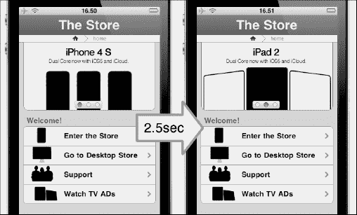

**图 7–13。***HTML 2D API:画布幻灯片演示*

正如我们现在所看到的，canvas 为那些对开发 WebApp 感兴趣的人带来了一系列新的机会。接下来，我们将看到新的 CSS level 3 如何为我们开发 IOs 设备的 WebApp 提供更多帮助。

### CSS3

旧的 CSS2 规范太大太复杂，无法在一个大的文档规范中更新，所以它被划分为万维网联盟(W3C)的较小的文档规范。一些模块包括以下内容:

*   盒子模型
*   多栏布局
*   背景和边框
*   列表模块
*   文本效果
*   超链接演示
*   语音模块

**注意:** CSS3 仍然是一个“进行中”的项目，你可以在这里看看完整的模块列表:`[www.w3.org/Style/CSS/current-work](http://www.w3.org/Style/CSS/current-work).`

CSS3 的主要影响是能够以更简单的方式实现当前的设计功能，并使用新的选择器和属性来引入新的设计功能，如动画或渐变效果。

现在我们看到了一些最常见的属性，这些属性存在于每一个可用于为 iPhone 和 iPad 设计和开发的 iPhone 和 iPad 框架中。当我们扩展我们的框架时，我们在第 8 章中掌握了这些特性。

#### 前缀

在所有的 CSS3 模块达到推荐状态之前，每个浏览器供应商都有能力决定如何实现这些属性。由于这个原因，在每个属性前面都有一个专有的前缀。

特定于供应商的前缀的作用是让其他呈现引擎知道可以安全地忽略该属性，而不会产生错误。同时，它让开发人员知道那些属性是实验性的，并不完全受支持，即使是 W3C 计划的。

一旦 CSS3 被完全定义、支持并正式成为 Web 标准，所有这些前缀都将被删除。

下面是一个例子:

`border-radius: 3px; -webkit-border-radius: 3px; (WebKit-based Browser implementation) -moz-border-radius: 3px; (Gecko-based Browser implementation)`

目前，当使用桌面网站和 web 应用时，我们需要多次指定相同的属性，至少为每个最常用的浏览器指定一次，以便实现最低级别的 CSS3 属性可访问性。

在我们的苹果设备环境中，我们需要关注 WebKit CSS3 的实现，因为我们只使用基于 WebKit 的浏览器，比如 Safari。

#### 圆形边框

使用 CSS2 编码实现圆角边框不是一件简单的事情。众所周知，iOS 到处都有圆形边框。有许多方法可以用来创建 CSS2 圆角边框，但是这些方法需要额外的标记和每个边框单独的图像。

使用 CSS3，创建一个圆形的边界是令人难以置信的快速和容易。我们可以将此属性应用于一个或所有角，或者应用于单个角。[Table 7–18](#tab_7_18)显示了 CSS 级圆角边框属性。

CSS 语法如下:

`-webkit-border-radius: <length>;`

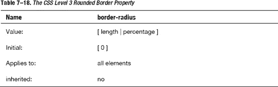

#### 边框图片

边框图像是最有用的附加功能之一；请注意，iPhone 上所有从底部滑动的大按钮也可以用这个属性来设计。CSS3 能够根据您的选择重复或拉伸边框图像。[Table 7–19](#tab_7_19)显示了 CSS 级边框图像属性。

CSS 语法如下:

`-webkit-border-image: <source><slice><width><outset><repeat>;`

T2】

#### 渐变

一个*渐变*是一个完全在 CSS 中指定的浏览器生成的图像，它由几种颜色之间的平滑渐变组成。渐变是使用`-webkit-gradient`函数指定的，可以代替图像 URL 传递。两种类型的梯度是公认的:线性和径向。您可以指定多个中间颜色值，称为*色标*，渐变功能会在它们之间插入颜色值。

您用来创建颜色停止的功能称为颜色停止。将该函数作为参数传递给`-webkit-gradient()`函数，以指定线性和径向渐变的开始、中间和结束颜色。指定色标之间的颜色是内插的。[表 7–20](#tab_7_20)显示了 CSS 级渐变属性。

CSS 语法如下:

`-webkit-gradient ( <gradient-line><color-stop1><color-stop2><color-stopN> );
-webkit-gradient ( <gradient-line><color-stop1><color-stop2><color-stopN> );`

T2】

#### 盒子尺寸

新的盒子模型是 CSS3 草案中最广泛的领域之一。这个框大小方面使您能够定义某些元素以某种方式适应某个区域。如果我们想在用户界面中设计一个两列边框的盒子，并把两个盒子并排放置，使用这个属性就可以实现。这将强制浏览器呈现具有指定宽度和高度的框，并在框中放置边框和填充。[Table 7–21](#tab_7_21)显示了 CSS 级框大小属性。

CSS 语法如下:

`-webkit-box-sizing: <box-sizing value>;`

T2】

#### 方框阴影

添加框阴影是另一个使用 CSS2 规范很难实现的效果，因为通常我们需要使用额外的图像和标记。虽然我们等待在不久的将来切换到一个完整的 CSS3 网站，但目前我们在我们的桌面网站上添加了一个额外的

，以便给主要内容添加一个纸阴影效果。CSS3 的替代品更加优雅和简洁。[Table 7–22](#tab_7_22)显示了 CSS 级框阴影属性。

CSS 语法如下:

`-webkit-box-shadow: <offset-x><offeset-y><blur radius><color>;`

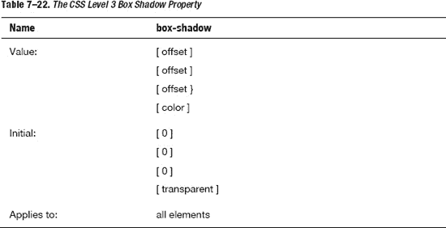

#### 概述

CSS2 中已经提供了设置元素轮廓的功能，但是在 CSS3 中，它包含了将轮廓从元素偏移一个我们定义的值的功能。它在两个方面不同于边框:

*   轮廓不占用空间。
*   轮廓可以是非矩形的。

[Table 7–23](#tab_7_23)显示了 CSS 级大纲属性。CSS 代码如下:

`outline: <width><style><color>;
outline-offset: <offset>;`

#### 背景尺寸

在 CSS3 之前，背景尺寸由所用图像的实际尺寸决定。有了这个新的 CSS3 属性，就可以用百分比或像素来指定背景图像应该有多大。模仿 iOS 用户界面，我们总是尽可能使用 CSS 属性，而不是图像。

无论如何，在需要的地方，背景大小属性使我们能够在几个不同的上下文中重用图像，并且它还扩展了背景以更准确地填充区域。

[Table 7–24](#tab_7_24)显示了 CSS 级背景尺寸属性。CSS 语法如下:

`-webkit-background-size: <length-x><length-y>;`

T2】

#### 背景由来

CSS3 还使我们能够指定如何计算背景的位置。这使得在放置背景图像方面具有很大的灵活性。

[Table 7–25](#tab_7_25)显示了 CSS 背景原点属性。CSS 语法如下:

`background-origin: <origin-value>;`

#### 多重背景

使用多种背景的新 CSS3 功能是一个很好的时间节省器，它使我们能够实现以前需要一个以上的`
.`的效果。这个属性，结合背景大小，为我们提供了一个强大的工具来减少本地 UI 外观和我们的模拟(web)用户界面之间的差距。

[Table 7–26](#tab_7_26)显示了 CSS 级多重背景属性。CSS 代码如下:

`background: <source-1><position><repeat>, <source-n><position><repeat>;`

T2】

#### 文字阴影

文本阴影是模拟原生 iOS 用户界面的一个基本 CSS3 属性。iOS 中几乎所有的文字都是浮雕的，可读性很强。

[Table 7–27](#tab_7_27)显示了 CSS 级文本阴影属性。CSS 代码如下:

`-webkit-text-shadow: <offset-x><offeset-y><blur radius><color>;`

#### 文字溢出

文本溢出是 iOS 本地用户界面仿真中涉及的另一个基本属性。通常，在 iPhone 环境中，标题会溢出标题栏，如果我们使用标题栏左侧和右侧的按钮来帮助导航内容，这种情况会更常见。

这个属性使我们能够用省略号(“...”)来剪辑文本)作为对用户的视觉提示，表明文本已被剪辑。有了 iPad，这个问题就不再存在了，因为屏幕更大了。

[Table 7–28](#tab_7_28)显示了 CSS 级文本溢出属性。CSS 语法如下:

`text-shadow: <overflow-value>;`

#### 自动换行

使用 CSS2，如果一个单词太长而不能放在一个区域的一行中，它会扩展到外部。这种情况并不常见，但时有发生。新的单词换行功能使我们能够强制文本换行，即使这意味着在单词中间进行拆分。[Table 7–29](#tab_7_29)显示了 CSS 级自动换行属性。

CSS 语法如下:

`word-wrap: <wrap-value>;`

CSS 代码如下:

`word-wrap: break-word;`

#### 网络资源

虽然这个新属性对于网页设计来说是一个革命性的变化，但对于我们这些需要使用原生 iOS 用户界面的人来说，这个属性并没有那么有用，因为我们在 Safari 字体堆栈中有 Helvetica。如果我们需要用一些奇怪的标志来表示文本，这个属性最终会成为一个方便的工具。

[Table 7–30](#tab_7_30)显示了 CSS 级 web 字体属性。CSS 语法如下:

`@font-face { <font-family>; <source>; }`

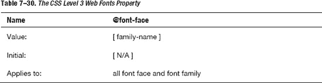

#### 点击高亮显示

在触摸屏设备范例中，悬停状态(如我们在桌面用户体验中所知)并不存在，但是通过这个有用的 WebKit 扩展，我们可以突出显示一个链接或一个 Javascript 可点击的元素。也支持 alpha 通道。

[Table 7–31](#tab_7_31)显示了 CSS 级点击高亮属性。CSS 语法如下:

`-webkit-tap-highlight-color: <color>;`

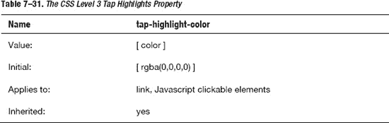

#### 多列

从桌面的角度来看，多栏属性更令人兴奋，因为 iPhone 和 iPad 用户界面不经常使用多栏布局。在某些情况下，这个属性仍然可以用来实现一些不错的内容表示。这个属性使我们能够指定文本应该拆分多少列，以及它们应该如何显示。

四个属性与 CSS3 中的多列布局相关，使我们能够设置列数、宽度、分隔每列的间距以及每列之间的边界。这四个属性是

*   列计数(列数)
*   列宽(列的宽度)
*   列间隙(列之间的间隙)
*   列标尺(列之间的边框)

[Table 7–32](#tab_7_32)显示了 CSS 级多列属性。CSS 语法如下:

`.twoColumnLayout { <number-of-column><width><gap><rule> }`

#### 跨越列

如果我们希望一个元素跨越多列，就使用这个属性；通常我们把它用于标题、表格和图片。

[Table 7–33](#tab_7_33)显示了 CSS Level 3 spanning columns 属性。CSS 语法如下:

`column-span: <number-of-column>;`

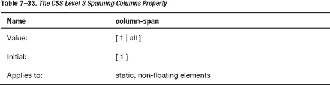

#### 过渡

transition 属性可用于随时间修改 CSS 属性，如高度、宽度或颜色。并不是所有的属性都可以用过渡来制作动画，但是对于 iPhone 和 iPad 开发来说，所有重要的属性都在列表中。

第一个值是指被转换的属性，第二个值控制持续时间，第三个值控制转换的类型。

[Table 7–34](#tab_7_34)显示了 CSS 级转换属性。CSS 语法如下:

`-webkit-transition: <property><time><function>;`

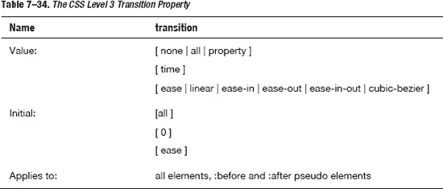

#### 变换

变换用于通过数学运算修改对象的几何图形。该属性是模拟页面间一些典型 iOS 效果的基础，用于创建有趣的视觉效果和动画。

在 transform 属性中，转换函数列表用作值，并按提供的顺序应用。与其他 CSS3 值完全一样，各个转换函数由空格分隔。

transform 属性与 transform-origin 属性一起工作，设置过渡发生的原点。

可用的转换函数有

**matrix(number，number，number，number，number)**
指定一个 2D 变换形式的六值变换矩阵(3X3)。Matrix(a，b，c，d，e，f)等价于应用变换矩阵[a b c d e f]。

**translate(translate-value，translate-value)**
通过向量[tx，ty]指定 2D 平移，其中 tx 是第一平移值参数，ty 是可选的第二平移值参数。如果没有提供< ty >，则 ty 的值为零。

**translate X(translation-value)**
指定在 X 方向平移给定量。

**translate Y(translation-value)**
指定在 Y 方向平移给定量。

**scale(number，number)**
指定了一个由[sx，sy]两个参数描述的缩放向量的 2D 缩放操作。如果没有提供第二个参数，它将采用与第一个参数相等的值。

**scaleX(number)**
使用[sx，1]缩放矢量指定缩放操作，其中 sx 作为参数给出。

**scaleY(number)**
使用[1，sy]缩放矢量指定缩放操作，其中 sy 作为参数给出。

**旋转(角度)**
指定一个关于元素原点的 2D 旋转，旋转角度在参数中指定，由 transform-origin 属性定义。

**倾斜(角度，角度)**
指定沿 X 和 Y 轴的倾斜变换。第一个角度参数指定 X 轴上的倾斜。第二个角度参数指定 Y 轴上的倾斜。如果没有给定第二个参数，则 Y 角度的值为 0(例如，Y 轴上没有倾斜)。

**【skewX(角度)**
指定沿 X 轴按给定角度的倾斜变换。

**skewY(angle)**
指定一个给定角度的沿 Y 轴的倾斜变换。

[Table 7–35](#tab_7_35)显示了 CSS 级转换属性。CSS 语法如下:

`-webkit-transition: <transform function><type of effect>;
-webkit-transition-origin: <transform origin>;`

#### 动画

与过渡类似，动画会随着时间的推移修改属性。使用转换属性，我们实现了从一个值到另一个值的单向效果；这种属性对于页面过渡很有用，但是对于构建任何类型的视觉效果来说价值有限。

使用 Animation 属性，我们可以提供任意数量的不一定是线性的中间值，以实现复杂的动画。这些中间值被称为*关键帧*，是所有动画过程的基础。

**注:**动画和电影制作中的关键帧是定义任何平滑过渡的起点和终点的图形。它们被称为“帧”,因为它们在时间上的位置是以胶片上的帧来测量的。关键帧序列定义了观众将看到的图像，而关键帧在电影、视频或动画时间轴上的位置定义了移动的时间。

[表 7–36](#tab_7_36)显示了 CSS 级动画属性。CSS 语法如下:

`animation-name: <name>;
animation-duration: <time>;
animation-iteration-count: <integer>;
animation-timing-function: <function>;
@keyframes<name> {
        from {
              left: <start-x>;
              top: <start-y>;
         }
         to {
                left: <destination-x>;
                top: <destination-y>;         }
}`

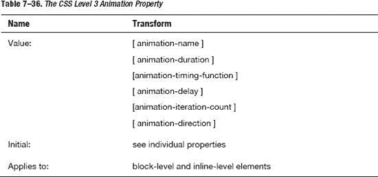

在我们的框架中，Javascript 负责用户界面的行为，但是动画属性在许多情况下提供了有效的替代方法。这个属性也是所有 CSS3 模块中最复杂的；为此，我们详细分析其所有属性，如[表 7–37](#tab_7_37)所示。

#### 关键帧

关键帧用于在动画过程中的不同点指定动画属性的值。关键帧指定动画的一个循环的行为；动画可能会重复一次或多次。

使用专门的 CSS at-rule 指定关键帧。一个`@keyframes`规则由关键字“`@keyframes`”组成，后面是为动画命名的标识符“`animation-name`”，后面是一组样式规则。

关键帧规则的 CSS 语法如下:

`keyframes-rule: '@keyframes' IDENT '{'keyframes-blocks'}';
keyframes-blocks: [ keyframe-selectors block ] ;
keyframe-selectors: [ 'from' | 'to' | PERCENTAGE ] [ ',' [ 'from' | 'to' | PERCENTAGE ] ];`

#### 反思

没有任何一个 CSS3 属性像反射属性一样具有苹果风格。在苹果商店的每一个产品展示上都使用了倒影，结合负空间的使用，它是实现干净设计的一个有价值的工具。

**注:**正如我们在分析感知法则时看到的，艺术中的负空间是图像主体周围和主体之间的空间。

当主体周围的空间，而不是主体本身，形成一个有趣的或艺术相关的形状时，负空间是最明显的。这个空间偶尔被用作图像的“真实”主题的艺术效果。负空间的使用是艺术构成和视觉设计的关键要素。

为了达到最终效果，反射属性由三个参数或值组成。第一个参数设置反射的方向。第二个参数指定反射的偏移量。第三个参数是应用于使用 gradient 属性传递的反射的遮罩。

[表 7–38](#tab_7_38)显示了 CSS 级反射属性。CSS 语法如下:

`-webkit-box-reflect: <direction><offset><mask-box-image>;`

T2】

### Javascript

到目前为止，使用 HTML5 标记语言，我们已经构建了网站或 web 应用的结构。然后，我们使用 CSS3 样式表来修改它的视觉表现。现在是时候研究它的行为了，正是在这一点上，Javascript 开始发挥作用。Javascript 是一个复杂的主题，很难在这里全面介绍，因此本节是一个速成班。

Javascript 由网景团队于 1995 年开发，首次出现在网景 2。Javascript 的原名是 LiveScript，但在 1996 年，由于 Sun Java 语言在当时是一件大事，Netscape 和 Sun 达成了一项协议，将其名称改为 Javascript。回想起来，这是一个很大的错误，因为 Javascript 和 Java 互不相干；Javascript 不是基于 Java 的，也不是 Java 的轻量级版本。将这种脚本语言称为 Javascript 可能达到了某种营销目的，但它也造成了许多混乱。

1996 年，微软为 Internet Explorer 3 开发了自己的版本，名为 Jscript。1997 年，Netscape 向欧洲计算机制造商协会(ECMA)提交了 Javascript 语言，以便创建一个独立的官方标准版本，称为 ECMAScript (ECMA-262)，尽管 IT 界的每个人都继续称它为 Javascript。1999 年，ECMAScript 3 发布，2009 年推出了 ECMAScript 5，它与 ECMAScript 3 语言版本向后兼容。Mobile Safari 部分支持 iOS4.3.2 中的 ECMAScript 5，而 iOS5 几乎支持所有新功能。

Javascript 是一种用于与网页交互的客户端脚本语言。与其他非脚本编程语言不同，Javascript 只在特定的应用中工作(例如，Safari Mobile 之类的 web 浏览器)。操作系统(比如 iOS)运行 web 浏览器，web 浏览器包含页面，页面包含 Javascript。我们可以在[图 7–14](#fig_7_14)中看到这个原理。

**图 7–14。** *网页浏览器、网页和 Javascript 代码之间的关系*

Javascript 是一种脚本语言，并被有意地加以限制，这意味着，例如，它不能访问文件系统、数据库或硬件。采用这种方法的原因是 Javascript 并不是一种通用的编程语言，而是被设计用来操作网页的。

当用户打开浏览器并从 web 服务器请求网页时，web 服务器以纯文本的形式将 HTML 和 CSS 发送回浏览器，让浏览器负责解释、呈现并最终显示最终内容。如前所述，Javascript 是一种客户端语言，这意味着它的工作方式与 HTML 和 CSS 文件相同:web 服务器将 Javascript 发送给浏览器，然后浏览器解释并运行它。我们可以在[图 7–15](#fig_7_15)中看到这些步骤。

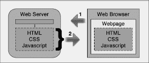

**图 7–15。** *网络浏览器和网络服务器之间的交互*

客户端方法与 PHP 或 Ruby on Rails 等语言的服务器端方法相反，这些语言在 web 服务器上执行，其结果被提交给浏览器。

#### 给网页添加 Javascript

使用`
</body>
</html>`

前面的 Javascript 代码展示了内嵌技术，其中代码内嵌在两个`**
<title>Javascript Test Page </title>
</head>`

前面的代码展示了导入的技术，其中代码是使用 src 属性导入的。

此时，我们可能会问自己，“我们在哪里插入 Javascript 代码？”浏览器从上到下读取并解释所有代码，这意味着浏览器一读取 Javascript 就解释并运行它。这意味着，根据代码在网页中的位置，Javascript 会导致页面渲染延迟，降低所有页面的速度。此外，在部分的底部，就在结束的标记之前插入 Javascript 代码被认为是一个好的做法，如前面的 Hello World 示例所示。

#### Javascript 结构

Javascript 是一种由*解释的*语言，而不是由*编译的*，另一种类型的语言。编译过的语言需要通过一个叫做*编译器*的特殊程序来运行，它将我们编写的代码转换成可以由操作系统控制的 CPU 运行的机器代码。正如我们已经看到的，我们不需要用 Javascript 做这些；使用浏览器，我们只需向 web 服务器发出一个请求，web 服务器将浏览器解释和运行的 Javascript 代码的纯文本版本发送回浏览器。

Javascript 也是区分大小写的，这意味着 Javascript 中的以下代码各不相同:

`alert(“Hello World!”);                // correct Javascript syntax
Alert(“Hello Wolrd!”);                // incorrect Javascript syntax`

Javascript 语句通常写在一行上，并且必须以分号结束，如前面的示例所示。分号的作用与英语中的句号或句号相同。当我们有一个很长的语句时，我们可以通过将它分成多行来提高可读性，只在语句的末尾使用分号。

Javascript 区分大小写，但不区分空格，这意味着它不关心语言不同部分之间的空格。以下陈述都是正确的，并以相同的方式解释:

`alert("Hello World!");                // correct Javascript syntax
alert ("Hello World!");                // correct Javascript syntax`

我们可以通过使用两个正斜杠将单行注释插入到 Javascript 代码中，如前面的示例所示。如果我们需要插入多行注释，我们可以使用组合正斜杠星号，并使用它的另一面，星号正斜杠来结束注释，如下例所示。

`/* this is
a multiple line
comment */`

#### 数据类别

在 Javascript 中，我们有两种类型的数据:原始数据和引用数据。原始数据类型是不可约的，原始值存储在*堆栈*中，这意味着直接在变量 access 的位置中。引用数据类型是复合的，是一个对象，引用值存储在*堆*中，这意味着变量中的值是一个指针，指向内存中存储对象的位置。下表显示了两类数据:

> **原始数据**
> 
> 数字
> 
> 布尔代数学体系的
> 
> 线
> 
> 空
> 
> 不明确的
> 
> **参考数据**
> 
> 目标
> 
> 功能
> 
> 排列
> 
> 日期
> 
> 错误
> 
> 正则表达式

那些刚接触栈和堆的人在试图理解它们的本质时会有点迷惑。出于我们的目的，需要理解的重要概念是，堆栈是一个具有后进先出(LIFO)策略的内存区域，应用在其中跟踪其内存需求。堆是内存中的另一个区域，对象存储在这里，指针可以随时访问。图 7–16 展示了原语和引用类型在实践中是如何工作的。

**图 7–16。***Javascript 中的原语和引用数据*

[Figure 7–17](#fig_7_17)显示了栈和堆如何处理原始和引用数据类型。

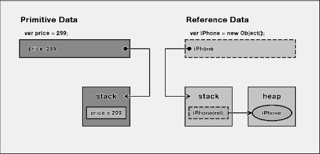

**图 7–17。***Javascript 中的原语和引用数据*

从开发人员的角度来看，这种在内存中存储数据的不同方式对程序的感知没有任何可见的影响。

#### 保留字

保留字在每种语言中都有一席之地，包括 Javascript。Javascript 描述了一组*保留字*，我们不能用它们作为函数和变量的标识符。如果我们使用保留字，命名函数或变量通常不会收到错误，然后该字将被视为关键字，我们将得到一个关键字错误。

在[Table 7–39](#tab_7_39)中，我们可以看到 Javascript 中最常见的保留字。

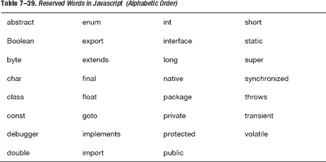

Javascript 还描述了一组表示 Javascript 语句开始或结束的关键字。关键字和保留字一样，是保留的，我们不能用它们来命名函数或变量。如果我们试图使用一个关键字来命名一个变量或函数，我们可能会得到一个错误消息，比如“需要标识符”[Table 7–40](#tab_7_40)显示了 Javascript 中的所有关键字。

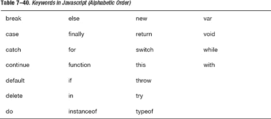

#### 变量

使用编程语言还意味着跟踪许多不同类型的数据。为此，每种编程语言都有变量。一个*变量*是一个容器，它抽象出一块物理内存，物理地存储数据。在[Figure 7–18](#fig_7_18)中，我们可以看到如何以线性形式描绘物理内存。

**图 7–18。** *设备内存以线性(向量)形式表示*

当数据存储在内存中时，我们可以通过两个基本操作来访问它，这两个操作称为读和写。使用读操作，我们可以检索存储在内存中的变量的值，而使用写操作，我们可以更新变量的值。

在 Javascript 中，我们使用保留字“`var`”创建一个变量，后跟变量的名称，然后是分号。以下示例显示了一些变量声明。我们必须记住 Javascript 是区分大小写的。

`varvarName;                  // generic variable declaration
varuserEmail;                // variable for an email address
vartodayDate;                // variable for a date`

我们使用的变量名必须写成一个单词，字母之间不能有空格，因为在变量声明中不允许有空格。该名称可以由字母、数字、下划线符号或美元符号组成，但不能以数字开头。以下示例演示了这一规则。

`vartodayDate;             // correct declaration
var 2012todayDate;        // incorrect declaration
var todayDate2012;        // correct declaration`

我们在前面的例子中看到的声明创建了一个未定义的变量，这意味着该变量没有值。为了给变量赋值，我们需要使用等号运算符后跟一个允许值，如图[Figure 7–19](#fig_7_19)所示。

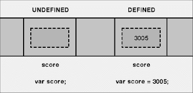

**图 7–19。** *未定义(左)和已定义(右)变量*

声明也可以分成两个语句，但是这种方法很少使用，因为它增加了代码的行数，并且没有提高代码的可读性。

`var score;               // first step of variable declaration
score = 3005;            // second step of variable declaration
var score = 3005;        // compact approach to variable declaration`

在 Javascript 中，我们也可以省略第一步，只写第二步，如前面的例子所示。Javascript 首先寻找一个名为“分数”的变量，如果没有找到，它会重新创建这个变量*。省略保留字“`var`”被认为是一种不好的做法，因为这会导致 Javascript 的意外行为，降低代码的可读性。*

 *要声明多个变量，我们可以只使用一行来创建它们，而不是将它们分布在多行中。

`var score;                                       // single approach
varhightScore;                                // single approach
var score, hightScore;                           // compact approach
var score = 3005;                                // single approach
varhightScore = 19733005;                        // single approach
var score = 3005, hightScore = 19733005;         // compact approach`

在许多其他编程语言中，当我们声明一个数据类型(例如，变量)时，我们不只是给变量一个名称，我们还需要指定将存储在变量本身中的确切数据类型。在 Javascript 中，我们不能这样做。Javascript 是一种“弱类型语言”，而其他语言(如 Java)则是“强类型语言”。在 Javascript 中，我们使用保留字“`var`”来创建一个通用变量，它存储任何类型的数据，比如整数、布尔值、字符串等等。因此，Javascript 不会区别对待不同类型的数据；它使用通用变量类型来存储任何类型的可用数据。

#### 操作员

我们写的每一条语句都至少涉及到一个操作:赋值、将数据从一个地方移动到另一个地方，以及加法和减法就是几个例子。为了执行操作，我们需要操作符。

最常见的运算符是算术运算符，但我们也有逻辑运算符、赋值运算符、布尔运算符以及许多其他运算符。我们可以将这些运算符分为六个功能类别，如下所示:

> **赋值**
> 根据其右操作数的值，给左操作数赋值。
> 
> **逻辑**
> 根据逻辑运算符返回一个逻辑值。
> 
> **比较**
> 根据比较运算符返回一个逻辑值。
> 
> **组合**
> 返回结果，不影响任何一个操作数，包括字符串和数学运算符。
> 
> **按位**
> 根据被视为 32 位值序列的操作数返回一个数值。
> 
> **不属于标准组的其他类型**
> 运算符包括逗号运算符(，)，点运算符(。)，条件运算符(？:)、删除运算符(Delete)、新建运算符(New)、in 运算符(In)、Typeof 运算符(typeof)、Instanceof 运算符(instanceof)和 void 运算符(Void)。

通常，运算符需要一个或多个操作数作为值和一个输出，下面是一个简单的(数学)表达式结构示例:

`"operand""operator""operand""operator""output" 90 + 10 = 100`

Table 7–41 列出了一些最常见的 Javascript 运算符。

T2】

在 Javascript 中，和在其他编程语言中一样，我们有操作符优先级，这意味着一些操作符被认为比其他操作符更重要。一个运算符越重要，它的优先级就越高，这意味着它在任何其他优先级较低的运算符之前执行。

`score = 100 + 100 * 2;                // score value is 210
score = (100 + 100) * 2;                  // score value is 400`

从我们的例子中可以看出，如果我们需要创建一个特定的顺序，我们可以像在数学运算中经常做的那样使用括号。

最后一个例子是条件运算符，其一般语法如下:

`Condition ?true : false`

本质上，我们有一个条件，我们指定如果条件为真会发生什么，如果条件为假会发生什么。

`vargameScore = 500;
varhighScore = 350;
highScore = (game >highScore) ? gameScore : hightScore;`

在我们的例子中，我们展示了带有条件操作符的赋值。首先，我们测试游戏分数是否高于现有的高分。在这种情况下，500 大于 350，条件运算符返回 500 并将其赋给变量 highScore，从而更新最佳记录值。

#### 条件语句

每当我们使用一种编程语言时，我们需要问和回答两个问题{它们是什么？].与其他语言一样，在 Javascript 中，我们有一些条件语句来满足这些需求。第一个条件语句是`if`语句，如下面的代码示例所示:

`if (condition) {
// action code here
}`

`if`语句在括号中有一个条件。如果条件为真，将执行大括号中的代码。大括号中的代码部分是语句的主体。写一个`if`语句不需要花括号，但是不使用花括号的方法被认为是一个不好的实践，因为代码的可读性会随着代码复杂性的增加而降低。

条件只能评估为真或假。为了实现这一点，我们通常使用如下例所示的运算符:

`if (a<10) {
// action code here
}
if (b==10) {
// action code here
}
if (c!=10) {
// action code here
}`

`if`语句使我们只能处理一个选择:如果条件为真，就做点什么。如果我们需要主案例的替代方案，我们可以使用`if-else`语句。使用`if-else`语句，如果条件测试返回 false，则执行 else 分支。

`if (condition) {
// action code here
} else {
        // action code here
}`

接下来，我们来看一个简单的`if-else`语句。我们使用分数变量创建两个选项:

`var score = 500;

if (score>100) {
alert("Congrats, New Record!");
} else {
alert("Sorry, Try Again!");
}`

在[Figure 7–20](#fig_7_20)中，我们可以看到在 Safari Mobile 上运行上述代码时会发生什么。

**图 7–20。** *动作中的条件 if 语句*

我们也可以嵌套`if`或`if-else`语句，但是最好不要超过两层嵌套语句，因为这样会降低代码的可读性。

`if (condition) {
// action code here
} else {
        // action code here
        if (condition) {
                // nested code here
        }
}`

如果我们有一个逻辑复杂的 Javascript 代码，与其使用深度嵌套的条件语句，不如将它拆分开来，在不同的函数中实现。

#### 循环语句

通常我们需要多次执行我们的代码，比如当我们改变多个元素的背景，在一些特定的上下文中隐藏多个元素，等等。最基本的循环是在`while`语句中实现的。

`while(condition) {
    // action code here
    increment/decrement operator
}`

在 while 循环中，我们执行语句体，直到条件为真。递增/递减运算符保证`while`在有限次数后退出；否则，`while`执行什么无限循环。

`var a = 1;

while(a<10) {
    alert(a);
    a++;
}`

另一个循环语句是`do-while`。`do-while`语句是`while`语句的变体，但有一个重要的区别。`do-while`语句总是至少执行一次。

`var a = 1;

do {
    alert(a);
    a++;
} while(a<10);`

`do-while`至少执行一次，因此语句体出现在条件之前，这意味着第一次执行语句体，之后才第一次检查条件。

我们研究的最后一个循环语句是`for`语句。`for`语句获取我们在 while 语句中使用的所有逻辑部分，并将它们压缩成一行。出于这个原因，我们总是可以将一个`for`语句转换成一个`while`语句，反之亦然。

`for(index variable; condition, increment/decrement) {
        // action code here
}`

下面的代码显示了一个`for`循环的实现，它使用了在`while`语句中使用的相同逻辑部分:

`for(vari=1; i<10; i++) {
    alert(a);
}`

`for`语句在 Javascript 中很常见，正如我们所见，它也类似于`while`语句。只有经验告诉我们什么时候`for`语句比`while`语句更好，反之亦然。

#### 功能

当我们的代码变得大而复杂时，将大的 Javascript 元素分解成更小的可重用的模块化部分被认为是一个好的实践。我们通过提取 Javascript 代码的不同部分，将它们包装起来，并给它们命名来实现这一点。这是创建 Javascript 函数背后的逻辑方法。

`functionfunctionName() {
        // actiondoce here
}`

`Function`是用于创建函数的保留字。接下来，我们选择一个名称，后跟括号。圆括号中是函数希望将数据传递给它的地方；在这种情况下，该函数不接受任何数据。

声明函数后，我们可以在 HTML 代码中使用它的名字调用它，如下例所示。

`functionName();`

编写我们的函数代码并没有正式告诉我们在哪里插入 Javascript 代码，因为 Javascript 引擎在运行任何东西之前首先扫描整个代码检查函数。然而，在我们的 Javascript 文件上定义一个函数，然后在以后调用它被认为是一个好的实践。

`functionfunctionName() {
        // action here
}
… … …
… … …
… … …
functionName();`

一个函数也可能有一个或多个参数。这些在括号中指定，如下例所示:

`functionfunctionName(parameters) {
        // action here
}`

在下一个示例中，我们编写了一个 sum 函数，它接受两个参数，并使用警告框返回总和:

`<html>
<head>
         <title>Javascript Test</title>
</head>` `<body>
        <h1>Javascript Test Page</h1>

</body>
</html>`

在[Figure 7–21](#fig_7_21)中，我们可以看到使用 Safari Mobile 测试的结果。

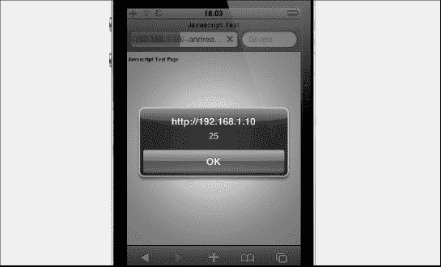

**图 7–21**。*sum()函数在起作用*

在 Javascript 中，我们不需要从函数中返回任何类型的值，但是如果我们需要从函数中发回信息，我们可以使用 return 保留字，如下所示:

`function sum(a,b) {
varmySum = a+b;
        alert(mySum);
        returnmySum;
}`

#### 可变范围

*变量作用域*的概念是指某些变量可访问的区域。变量作用域是每种编程语言的一个基本概念，还涉及到其他几个概念。一个变量可以有局部作用域或全局作用域。

局部变量有一个*局部作用域*，并且是在函数中声明的变量，这意味着我们不能从函数外部访问这个变量。这种变量一直存在，直到函数结束。另一方面，我们有一个*全局范围*，其中变量在脚本块的顶级块中声明，在脚本块中声明的任何类型的函数之外，并且可以从文档中的任何地方访问。这种变量会一直存在，直到文档关闭。

在编写`sum`函数时，我们使用变量`mySum`来存储求和结果。函数中声明的每一个变量都是局部变量，这意味着它只局限于局部变量，不存在于函数本身之外。在这种情况下，`mySum`是一个具有局部范围的局部变量，在函数外部是不可见的。

`varmySum;
function sum(a,b) {
mySum = a+b;
        alert(mySum);
        erturnmySum;
}`

如果我们需要一个在整个代码中都可见的变量，我们需要在函数之外声明这个变量。在这种情况下，该变量是一个全局变量。在前面的例子中，我们在函数外部声明了`mySum`，并在函数体中赋值 add 结果。

在 Javascript 中，变量作用域只能是全局的或局部的。对于那些使用其他编程语言的人来说，这可能听起来有点奇怪，但是正如我们前面提到的，Javascript 是一种有意限制的语言，它专注于并面向其目标:操纵网页。

#### 数组

到目前为止，我们已经学习了如何在变量中存储值。有时我们需要在同一个对象中存储多个值。这种类型的对象是一个*数组*，可以使用以下两种语法之一来声明。

`var myArray = [];                // shorthand declaration
var myArray = new Array();       // longhand declaration
var myArray = Array(); // longhand declaration
var myArray = Array(5); // array with 5 slots`

在 Javascript 中，我们可以创建一个元素数量固定的数组(如我们前面的一个例子所示)，但在 Javascript 中，数组是动态的，在这种语言中，数组的值不是固定的或指定的。

因为数组是对象，所以我们可以检索它们的属性。在[Table 7–42](#tab_7_42)中，我们可以看到这些数组属性。

T2】

因为数组是对象，所以它们也有方法。在 Javascript 中，我们可以将方法视为属于对象的函数。可以使用以下语法调用方法。

`objectName.methodName();`

在[Table 7–43](#tab_7_43)中，我们可以看到对称为数组的对象类型进行操作的方法。

数组是 Javascript 中最常用的对象之一，事实上几乎无处不在，主要是因为大多数数组都是由 Javascript 引擎创建的，用于处理各种不同的情况。稍后当我们使用 DOM 时，我们会看到更多这方面的内容。

#### 字符串

为了给变量赋值，我们需要用引号或双引号将单词或短语括起来。两种类型的引号都是允许的；不允许混淆引号，如下例所示:

`varmyString = "double quoted string";       // correct syntax
varmyString = "single quoted string";       // correct syntax
varmyString = 'mixed quoted string";        // incorrect syntax`

如果我们使用单引号，并希望在字符串中插入引号或双引号，我们需要使用反斜杠前缀，以便告诉 Javascript 引擎关闭字符串。

`varmyString = "don't use single quotes";       // correct syntax
varmyString = 'don't use single quotes';       // incorrect syntax
varmyString = 'don\'t use single quotes';      // correct syntax`

字符串可以被当作数组对象(字符数组)来处理，并应用于它，方法之一是我们之前看到的数组。出于同样的原因，字符串对象与数组对象具有相同的属性，如[表 7–44](#tab_7_44)所示。

同样，字符串对象也有对这种类型的 Javascript 对象进行操作的方法。字符串对象方法如[表 7–45](#tab_7_45)所示。

T2】

记住 Javascript 是区分大小写的，这在我们处理字符串时很重要。

#### 物体

如前所述，Javascript 支持对象的概念。一个对象可以被想象成各种数据和行为的容器。例如，数据存储在变量或数组中，而行为由方法和函数表示。

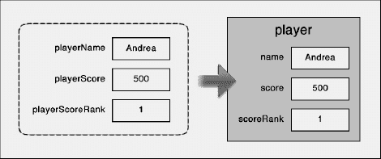

**图 7–22。** *(左)三个变量和三个对象的属性(右)*

在[Figure 7–22](#fig_7_22)中，我们看到了如何将变量包装到一个容器(一个对象)中。一旦我们这样做了，数据在容器对象中就更深了一层。如果我们需要访问一个对象中的数据，我们可以使用下面的语法。当一个变量在一个对象之外时，它被称为“变量”，当它在一个对象之内时，它被称为“属性”

`var player = new Object();        // create a new object called "player"
player.name = "Andrea";
player.score = 500;
player.scoreRank = 1;

objectName.propertyName // generic syntax for property declaration`

当我们声明一个 Javascript 对象时，我们也可以使用简写，如下例所示。我们声明一个变量，并给它分配一组用大括号括起来的属性。

`var player = { name:"Andrea", score: 500, scoreRank:1 }`

在大括号中，我们使用三个名称/值对来创建与我们之前使用四行不同的代码创建的对象相同的对象。

#### BOM(浏览器对象模型)

浏览器对象模型(BOM)描述了使用浏览器的方法和界面。浏览器本身是一个对象，可以通过引用顶级对象窗口从其顶部到底部状态栏进行访问。从顶级对象窗口中，我们可以访问包含在其他(子)对象中的重要信息，如下所示:

> **导航器**
> 包含关于浏览器引擎类型或版本的信息。
> 
> **位置**
> 保存当前浏览器中显示的网址。
> 
> **历史**
> 包含浏览器的历史列表。
> 
> **框架**
> 提供了当前页面内框架的数组。
> 
> **文档**
> 代表浏览器中的当前页面。

因为 BOM 没有官方标准，每个浏览器为这些和其他对象定义自己的属性和方法；然而，BOM 提供了一些事实上的标准，比如有一个窗口和一个导航对象。请注意 BOM 是如何覆盖 DOM 所覆盖的文档的，从而产生了重叠效果。在这种情况下，我们可以说，在我们的 WebApp 中，我们将始终使用 DOM 来访问和修改文档元素。

#### DOM(文档对象模型)

DOM 代表文档对象模型。“文档”一词不是指整个 WebApp，而只是指它的单个网页。“对象”一词指的是文档的单个部分，指的是所有可以作为单个部分进行操作的事物。在[Figure 7–23](#fig_7_23)中，我们可以从“商店”用例中看到页面的单个对象。单个对象可以是一个标题元素、一个完整的有序列表，或者是同一个无序列表中的单个元素，甚至是整个文档。

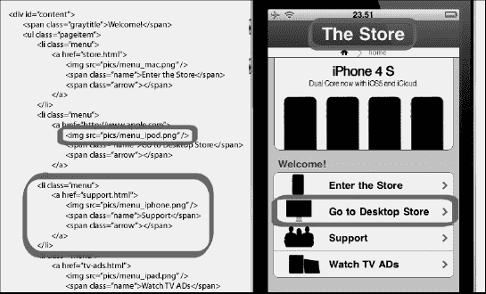

**图 7–23。** *开发者视图(右)和设计视图(右)在一些文档的对象上*

单词“模型”指的是表示网页的图表。此图基于连接文档各个部分的树形结构；每个单独的部分都是一个节点，在图 7–24 的示例中有所表示。

**图 7–24。** *节点结构(左)和视觉设计结构(右)*

图中的一个节点可以有一个由直接在其上面的节点表示的父节点，也可以有直接在其下面的节点表示的子节点。模型指的是页面图结构，但它实际上只是一组我们可以达成一致的术语和一组我们可以使用的标准。

这意味着到目前为止我们所定义的是一组一致同意的术语(模型)，描述了如何与网页(文档)的单个部分(对象)进行交互。DOM 不是一种语言；这是一个约定，因为 Javascript 同意这一点，所以它在 Javascript 中可用。

DOM 以节点的形式工作，我们不仅有代表单个文档元素的节点，还有代表一个节点可能具有的各种属性的节点。官方的 Javascript 中有十二种类型的节点，但实际上我们只对其中的三种感兴趣:元素、属性和文本节点。在[Figure 7–25](#fig_7_25)中，我们可以看到一个无序列表的 DOM。

**图 7–25。** *代码(左)及其 DOM 结构(右)*

这里要把握的要点是，节点不包含(直接)属性或文本。根据 DOM，与包含一些文本或属性的元素相关的每个节点都有一个文本或属性的子节点。

现在我们来看看如何使用 DOM。

#### 比较 DOM 和 HTML 结构

正如我们前面看到的 DOM 映射一样，HTML 文档有一个分层树，其中单个 HTML 元素是树的节点。虽然这是真的，但澄清 HTML 层次结构与 DOM 层次结构不同是很重要的。每个 HTML 元素都有自己的属性，这些属性不在 HTML 层次结构中表示，但是为了被访问，必须在 DOM 节点层次结构中表示。下面的例子说明了这一点:

`<html>
        <head>
              <title>DOM Structure Test</title>
        </head>
        <body>
                      <section id="intro">
                      <h1>The DOM Structure</h1>
                      
Loremipsum dolor sit amet

                </section>
        </body>
</html>`

在[Figure 7–26](#fig_7_26)中，我们可以看到 HTML 和 DOM 结构之间的比较。

**图 7–26**。 *HTML 和 DOM 结构对比*

[Figure 7–26](#fig_7_26)还显示了 HTML 元素结构中没有表示的 HTML 属性是 DOM 结构中的一种特殊节点，因为它们不参与父子关系。然而，它们仍然是对象，因此可以通过 Javascript 调用来访问。[Table 7–46](#tab_7_46)显示了 Javascript 中最常见的节点类型。

#### 使用 DOM

DOM 是按照节点工作的，所以对我们来说，主要问题是:我们如何获取这些节点中的一个？关键的考虑是节点是否是唯一的，因此它是否有 ID。如果我们要寻找的元素有一个惟一的 ID，我们可以使用 DOM 中最重要的方法:

`document.getElementById("elementId");`

我们使用该方法的方式是将它与存储返回元素的变量声明结合起来，如下例所示。

`varmyElement = document.getElementById("edgeMenu");`

在这种情况下，该方法返回用于[Figure 7–26](#fig_7_26)中的前一个示例的无序列表。在[Table 7–47](#tab_7_47)中，我们可以看到 DOM 定义的三个最有用的方法。

如果我们使用`getElementByTagName(),`，我们可以通过一次方法调用来获取一组元素。在这种情况下，Javascript 创建一个数组并插入所有返回的元素。`getElementByTagName()`的语法如下，这段代码返回文档中所有的`<li>`元素。

`varmyListElements = document.getElementsByTagName("li");
myListElements[3];        // return the fourth links in position three inside the array`

在我们的示例中，我们在文档对象上使用 getElementById 和 getElelmentsByTagName 方法，但是我们在文档的所有对象上使用它们。在下一个例子中，我们不需要文档中的所有链接，只需要特定菜单中的链接。

`varmyEdgeMenu = document.getElementsById("edgeMenu");
varedgeMenuLinks = myEdgeMenu.getElementsByTagName("li");`

首先，我们使用 ID 获取`edgeMenu`元素，然后在这个节点上调用`getElementsByTagName()`。结果是该方法只返回 edgeMenu 的< li >元素。

下一个问题是:如果我们不仅想简单地抓取一个节点，还想改变它，我们能做什么？当我们编写 HTML 代码时，我们可以修改元素的属性，有时甚至添加一个或多个属性。例如，改变图像的 src 属性或标题中的链接，或`
`或列表中的一些其他属性。

一旦我们获取了一个元素，我们可以使用两种不同类型的元素来实现我们的目标:一种用于获取属性，另一种用于设置属性。在[表 7–48](#tab_7_48)中，我们可以看到这些方法。

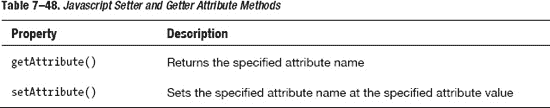

当我们想要获得一个属性时，我们将属性的名称以字符串格式传递给方法，并用双引号括起来。当我们想要设置一个属性时，我们传递属性的名称和属性值，通常是用双引号括起来的字符串格式。语法如下:

`elementName.getAttribute("align");
elementName.setAttribute("align","left");`

到目前为止，我们只改变了元素的属性，但有时我们可能不仅需要改变属性，还需要改变元素的内容。最好的方法是手动创建它，并在文档中插入单独的 DOM 节点，这样可以动态地改变页面。该过程需要两步:

1.  创建元素。
2.  将元素添加到文档中。

在下一个例子中，我们向我们的 edgeMenu 添加了一个条目，或者换句话说，我们向用于我们的菜单的`<ul>`无序列表添加了一个`<li>`元素。

`varnewEdgeMenuElement = document.createElement("li");
edgeMenu.appendChild(newEdgeMenuElement);`

在我们创建并向 edgeMenu 添加一个新节点后，我们可能需要向它添加文本。我们可以使用以下语法来做到这一点:

`varnewMenuText = document.createTextNode("Watch TV Ads");
newEdgeMenuElement.appendChild(newMenuText);`

到目前为止，我们使用了两种新方法来创建节点，在[Table 7–49](#tab_7_49)中，我们可以看到一些用于操作 DOM 树结构的有用方法。

T2】

现在，我们将相同的新项目插入到 edgeMenu 中，但这次是在第一个和第二个`<li>`元素之间，而不是像上一个示例中那样在末尾插入。

`varnewEdgeMenuElement = document.createElement("li");
varsecondMenuItem = edgeMenu.getElementsByTagName("li") [1];
edgeMenu.insertBefore(newEdgeMenuElement, seconfItem);`

第一步使用我们在前面的例子中使用的相同代码，所以我们从创建新的`<li>`元素开始。在第二步中，我们使用`getElementByTagName`方法获取`edgeMenu`中的第二个`<li>`元素，因为`<li>`元素没有 ID，我们在 edgeMenu 结构中指定了第二个位置。在第三步中，我们使用`insertBefore`方法，在`edgeMenu`中的第二个`<li>`元素之前插入新的`<li>`。

#### 一些 Javascript 最佳实践

一般来说，一种编程语言有许多规则，开发人员必须遵循这些规则来编写抱怨代码。这些规则指定了创建有效代码必须编写的内容。当我们接近最佳实践时，为了创建高质量的代码，我们从必须写什么切换到应该写什么。从本质上讲，最佳实践旨在实现清晰性、可读性和意义。

**命名约定**

变量、函数或对象的名称应该有意义，并且应该是大写字母，第一个字母小写。对象的名称应该以大写字母开头。

**拉条样式**

Javascript 中的主导风格是基于 C 语言中最传统的大括号风格。如果我们有一个 If 或 while 语句，花括号在与关键字(if、while 等)相同的行上打开，代码在块中缩进，并单独在一行中封闭花括号。

**功能声明**

当我们声明一个函数时，我们应该总是在试图调用它之前定义它，并且我们应该总是使用花括号来定义一个块，即使在关键字之后只有一个语句(if、while 等等)。

**语法**

声明变量时，始终使用分号结束语句，并始终使用关键字“`var`”。

关于这个主题的更多信息，请使用搜索引擎并搜索 Javascript 风格指南。有来自 Mozilla、Yahoo 和 Google 的个人编写的指南。

#### 网络标准资源

在[Table 7–50](#tab_7_50)中，我们有关于本章介绍的三种网络标准的官方资源。如果您不熟悉这些技术中的一种或多种，请继续使用以下官方资源来构建您的 web 标准基础。

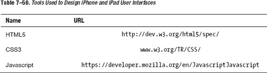

### 总结

本章讨论了 web 标准。在第一部分中，我们介绍了 HTML5，它是构建所有网站和 web 应用的 web 标准。我们介绍了新的标记标签，并将注意力集中在新的面向语义的方法上。我们还分析了新的 HTML5 媒体标签，如`<audio>, <video>,`和`<canvas>`标签。

在第二部分中，我们介绍了新的 CSS3 属性，与旧的 CSS2 规范相比，这些属性使我们能够以更简单、更好的方式模拟原生 iOS 环境。

在第三部分，也是最后一部分，我们研究了 Javascript，查看了它的实现并研究了它的基础。

在接下来的章节中，我们将使用这些知识来实践和扩展 iPhone 和 iPad 的 HTML5、CSS3 和 JavaScript 框架。*