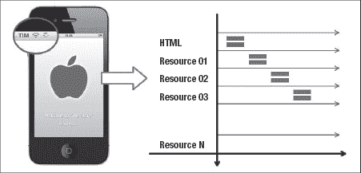
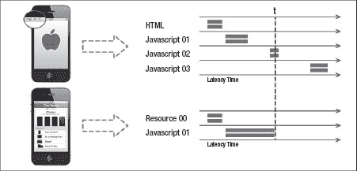
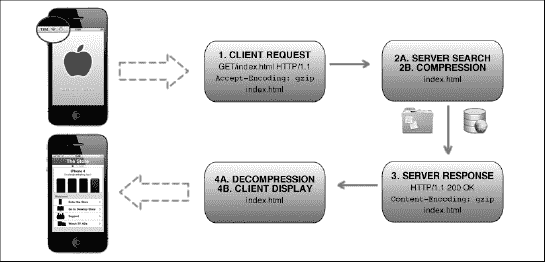
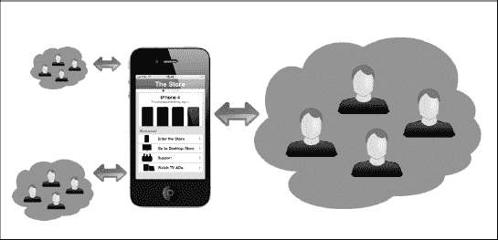
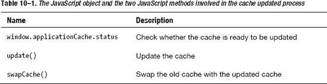
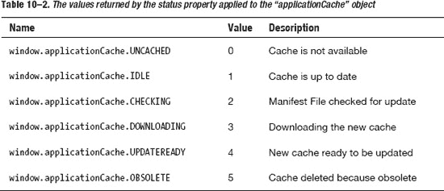
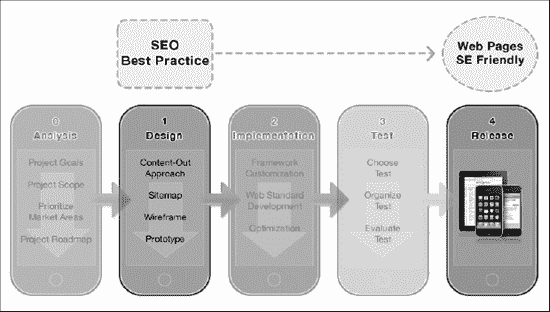

# 十、优化 iOS WebApps

> 完美不是在没有更多可以增加的时候，而是在没有更多可以减少的时候
> 
> -安托万·德·圣-exéry

这一章是关于网页优化和搜索引擎优化(SEO)。首先我们讨论 iPhone 和 iPad 的兼容性，然后我们展示如何优化 WebApp 的性能。我们还建议了一些优化代码、减少 HTTP 请求和最小化 DOM 访问的规则。

然后，我们演示如何压缩 WebApp，优化其可用性，并使其能够离线工作。最后，我们看看 WebApps 的移动 SEO 方法，首先分析搜索引擎的结构，然后探索如何实现面向搜索引擎的设计。我们也看看 Google 算法背后的原理和一些有用的移动 SEO 工具。

### iPad 和 iPhone 的兼容性

除了 iPhone 和 iPad 用户的用户体验完全不同这一事实之外，好的优化背后的大多数概念对这两种设备来说是共同的。

这些概念中的一些以不同的方式实现，以便优化设备的特定方面，而其他概念同样适用于提高用户体验的水平。

### 性能优化

优化我们的 WebApp 的性能不是一种我们只能在项目工作流程结束时执行的开发方法。与测试阶段一样，它在项目的整个过程中都是适用的。显然，在开发阶段的最后，我们对我们的 WebApp 应用了一些优化技术，但是为了减少错误和缩短整个开发时间，从一开始就结合一些好习惯是最有效的(见[图 10–1](#fig_10_1))。

**图 10–1。** *在整个项目工作流程中应用优化最佳实践*

当我们优化我们的网页时，知道什么可以优化是很重要的。对于那些了解维尔弗雷多·帕累托原理的人来说，你也知道 80%的结果来自 20%的原因，这意味着如果不知道我们的优化过程的确切目标是什么，将很难获得积极的结果。

接下来，我们将了解一些以规则形式呈现的最佳实践，以便清楚地展示适用于我们 WebApp 的性能优化流程的实用方法。

#### 代码优化

代码优化是任何类型的优化技术的第一步，因为一切都基于代码——一切都编码在我们的网页中。好的代码可以节省带宽，减少渲染延迟，并随着时间的推移提高页面的可读性和可维护性。

以下是在我们的 WebApp 中编写任何类型的代码时要记住的一些最佳实践。

##### 规则 1:使用网络标准投诉代码

使用 HTML5、CSS3 和 JavaScript 兼容代码。除了干净的 HTML5 语法，这还意味着在页面的`<head>`部分插入我们的样式表，并且(除了到 iWebKit 框架的链接)在我们的网页底部插入 JavaScript。这是因为页面顶部的样式表大大加快了加载时间。另一方面，在网页底部插入 JavaScript，这样 JavaScript 代码就不会阻塞 HTTP 请求。这是因为当 JavaScript 正在下载时，浏览器不会启动任何其他资源下载，即使该资源位于不同的主机名上。

**注意:**此规则的一个替代方法是在页面顶部插入桌面移动重定向 JavaScript 代码。我们可以这样做，因为在这种情况下，执行脚本比呈现和加载网页更重要。

该规则有助于解析器更快地工作，并有助于减少整体呈现延迟。

##### 规则 2:编写简洁的代码

写细长的代码。删除代码中不必要或多余的部分，避免在不必要的地方使用制表符和空格。如果可以用其他技术达到同样的效果，就不要使用 CSS 表达式。CSS 规则被评估的频率超出了我们的想象，会对网页的性能产生负面影响。

**注意:**在我们的用例中，出于说明的目的，我们覆盖了许多 CSS 规则，以便呈现原始的 iWebKit 框架和我们的用例定制代码。在实际项目中，将被覆盖的 CSS 规则的数量保持在最小。

为注释、CSS ID 和类或 JavaScript 变量和函数选择简短且有意义的名称。如果您喜欢编写 xHTML 代码，请不要犹豫采用 xHTML5 语法，并在样式表中将 CSS 规则结合到良好的因子分解水平。使用 Gzip 压缩或缩小 HTML5、CSS 和 JavaScript 代码，但要记住在项目中存储一个用于开发目的的未压缩版本。

这个规则减少了我们网页的总重量，默认情况下，减少了渲染和加载延迟。

##### 规则 3:减少 HTTP 请求

务必时刻关注导入资源(包括图片)的数量。越多的文件导入到我们的网页，就意味着浏览器的渲染和加载延迟越长。最小化 HTTP 请求的数量加快了网页加载时间。考虑到这一点，考虑在我们的 web 页面中添加 HTTP 缓存可能是一个好主意。

HTTP 缓存，也称为 web cache，是基于很好的原理，但由于其规范限制，在 Apple Safari 中几乎无法使用。以下列表总结了 HTTP 缓存的一些主要限制:

*   **单个资源必须小于 15kB(非压缩)**为 iPhones 设计的网页应该将每个组件的大小减少到 15kB(IOs 3 之前为 25kB)或更小，以获得最佳的缓存行为。iPhone 能够缓存 105 个 15kB 的组件。尝试再缓存一个文件会导致从缓存中删除一个现有文件。
*   **全局缓存资源必须小于 1.5MB** 虽然 iPhone 能够缓存多个组件，但多个组件的最大缓存限制在 1.5MB 左右(iOS3 之前为 500kB)。缓存中可用的最大字节约为 105 * 15 = 1575kB。
*   **关闭设备电源清除 HTTP 缓存**如果用户需要强制硬复位，缓存中的组件将会丢失。原因是，在 iPhone 上，Safari 从系统内存中分配内存来创建缓存组件，但不会将缓存组件保存在永久存储器中。
*   **关闭标签清除 HTTP 缓存**关闭除空白标签以外的所有标签，然后关闭 Safari 清除缓存。

我们可以从开发的角度来看，这种类型的缓存是不可靠的，因为它清理得太频繁了，无法缓存现代网页中的大部分资源。即使是最压缩的 JavaScript 框架或 CSS 也很难达到 15K 以下，几乎所有网络设备中使用的图像都没有达到这一限制。HTML5 提供的离线特性对我们的目标来说是一个更好的选择，我们将在本章后面介绍它们。

**图 10–2。** *根据 HTTP/1.1 协议请求 WebApp 资源*

除了减少我们网页的渲染时间之外，遵循这一规则的最好理由是 HTTP/1.1 协议规定浏览器只能并行下载每个主机名的两个资源，如[Figure 10–2](#fig_10_2)所示。

解决这种瓶颈的方法是将我们的外部资源分散到多个主机名上。最后，我们不能忘记在我们的网页中避免所有的 HTTP 重定向。HTTP 重定向是使用 301 或 302 状态代码完成的，在这两种情况下，它都会增加平均页面加载时间的延迟，从而降低用户体验的质量。

该规则通过减少客户端和服务器端之间的通信延迟来减少加载时间。

##### 规则 4:结合 CSS 和 JavaScript 文件

这个规则必须考虑到项目的复杂性，但是基本思想是我们将所有的 CSS 规则和 JavaScript 代码合并到一个文件中，而不是拥有多个文件。这将降低 HTTP 头的权重，并减少由于 TCP 启动缓慢而导致的网页中导入多个资源的延迟，如[Figure 10–3](#fig_10_3)所示。

这种方法的一个副作用是我们被迫更新更大的文件，即使是很小的代码更新；然而，这往往是一条正面效应大于负面效应的道路。

**图 10–3。** *传输延迟时间:单个和多个 JavaScript 文件的比较*

在我们的“商店”用例中，iWebKit JavaScript 框架核心和 CSS 都在单个。js 和。用优化程序缩小的 css 文件。我们可以在这些文件的开发版本(非精简版)中保留代码的逻辑结构，并随后添加头文件和单个注释，以使代码维护及其功能更新更容易。在本章末尾的参考资料部分，你会找到一些在线的迷你资源。

##### 规则 5:最小化 DOM

在我们的项目中，艰苦的工作由框架完成，但是我们仍然需要编写 JavaScript 代码来完成一些项目需求。在这种情况下，规则很简单:最小化 DOM 访问和 DOM 对象的数量。

该规则将减少网页每次运行 JavaScript 时的网页加载时间和用户体验延迟。

#### 图像优化

优化阶段的一个重要步骤是图像优化。图像优化是另一个不包含任何大秘密的好习惯的例子。简而言之，优化我们的 WebApp 的图像可以显著提高我们的网页的性能，使它们更轻，并减少加载延迟。

以下是我们处理 WebApp 图片时需要记住的一些最佳实践。

##### 规则 6:优化颜色深度

在我们设计了一个图像之后，我们需要通过使用正确的图像格式导出它来优化它的权重。如果是照片，我们需要在 JPG 格式中使用一个好的压缩比。如果是用户界面图像，检查使用的颜色数量是很重要的。如果我们使用的颜色少于 256 色，我们可以将其导出为 PNG8。在大多数情况下，以 PNG8 格式导出比以 256 色 GIF 格式导出渲染的图像要小。使用相似的颜色也有助于降低颜色数量和图像权重。

我们还应该强调，使用 Adobe Photoshop、Fireworks 或 Gimp 等图形程序导出图像会添加不需要的元数据，从而增加图像权重。通过访问元数据面板并浏览**文件**  **文件信息** (T)或使用 F，我们可以在 Fireworks 中看到应用于图像的元数据

一个解决办法是使用 PNGOut 这样的程序优化我们的图像，使它们尽可能的苗条。

该规则减少了网页加载时间，提高了用户体验水平。

##### 规则 7:使用 CSS 精灵

“雪碧”这个词可能会让你想起 80 年代，那时人们整天玩“准将 64”或“ZX 频谱”游戏。因为在计算机科学中，所有旧的东西迟早会再次变成新的，所以 web 开发人员采用了旧的精灵管理背后的思想，并把它带到了 CSS 世界。请看下面的[图(10–4)](#fig_10_4)中的例子。

**图 10–4。***iWebKit 框架中用于设计复选框的 CSS Sprite 技术*

要使用 CSS Sprite 技术，首先我们将两个或多个图像组合成一个背景图像，然后我们通过 CSS 设置单个图像的宽度和高度，最后我们使用 CSS 边距规则调整背景位置，以便只显示必要的部分。通过这种方法，我们可以使用一个单一的背景图像并显示几个不同的图形(单一图像)，从而节省服务器请求并加快页面加载时间。

`/* from framework style.css stylesheet */
input[type="checkbox"] {
  width: 94px;
  height: 27px;
  background: url('../img/checkbox.png');
  -webkit-appearance: none;
  border: 0;
  float: right;
  margin: 8px 4px 0 0;
}

input[type="checkbox"]:checked {
  background-position: 0 27px;
}`

CSS 背景规则显示从坐标 0px，0px；这保证了如果我们设置 27px 的高度，默认情况下将显示关闭状态。在这种情况下，Sprite 技术通过使用 27px 的偏移量来显示 ON 状态，如第二个 CSS 规则所示。

如果我们在用户界面中使用许多图像，CSS Sprite 技术可以帮助减少网页的全局加载时间，并避免传统翻转技术中典型的白色闪光。因为图像加载时间比呈现时间长，所以每次浏览器第一次加载翻转图像时，使用传统的图像翻转技术都会产生白色闪光。

**雪碧锻炼**

在我们的“商店”用例中，我们使用一些图片来设计面包屑栏。实现精灵技术，以加快渲染时间。

*   对所有面包屑图像使用 Sprite。
*   将两个或多个 Sprite 面包屑图像分组，并比较单个 Sprite 方法的渲染时间。

比较结果，确定哪种方法最适合我们的特定用例。

该规则减少了网页加载时间，并且每次网页运行 JavaScript 时用户体验都会延迟。

##### 规则 8:使用 CSS 规则代替图片

这条规则听起来可能很奇怪，但是因为图像优化过程旨在全局减少图像的权重，所以尽可能使用 CSS 规则来代替位图图像。

**CSS 文本练习**

在我们的“商店”用例中，我们使用少量图像设计面包屑栏。实现 CSS 技术来加速渲染时间。

*   对所有的面包屑链接使用文本而不是图像。
*   将房屋图标与面包屑文本对齐。

比较 Sprite 和 CSS 方法的渲染时间。

我们需要对用户界面中涉及的所有内容使用 CSS 规则，并且只在极少数情况下插入图像。如果我们必须为用户界面元素使用一个图像，它必须优化它的颜色深度。如果我们需要插入许多图像，我们需要将这些图像插入 CSS 精灵。我们也应该对每个小的设计细节使用 CSS 规则，比如边框、背景或者渐变。

该规则减少了网页每次运行 JavaScript 时的网页加载时间和用户体验延迟。

##### 规则 9:永远不要缩放图像

根据设备视窗或设计元素的宽度和高度，始终使用具有适当尺寸的图像。依靠 Safari 缩放图像以达到最佳效果从来都不是一个好主意。该规则的唯一例外是当我们想要在单个设备 WebApp 中插入图像时(仅适用于 iPhone 或 iPad)。在这种情况下，插入宽度值为 100%的图像将适合横向(较大)和纵向(较小)方向。

该规则减少了网页每次运行 JavaScript 时的网页加载时间和用户体验延迟。虽然遵循这条规则很重要，但请记住，指定图像的宽度和高度也很重要，因为这也有助于减少渲染时间。

**图像优化练习**

我们的“商店”用例中使用的所有图像都是 PNG 格式。尝试确定何时可以使用另一种格式(如 JPG 或 GIF)来优化这些图像。不要忘记一些格式不支持 Alpha 透明度。

选择一个图形程序，打开位于“/images”目录和“/pics”目录下的“商店”用例中使用的一些图像。

*   使用不同的格式导出图像。
*   使用不同设置的相同格式导出图像。

比较图像重量和图像质量，然后看看是否可以用优化的图像替换其中的一些图像。

#### 应用压缩

Safari 支持 GZIP 压缩(RFC 1952)，因此压缩我们 WebApp 的一些资源通常是一个好主意，因为这将提高用户体验的水平。我们可以决定何时压缩 HTML5 文档、CSS3 样式表或 JavaScript 代码，而我们不想压缩图像或 PDF 文件，因为它们已经被压缩了。压缩图像或 PDF 文件会增加 CPU 开销，并可能增加文件大小。

从服务器端来看，为了在我们的 WebApp 中使用 GZIP 压缩的资源，服务器必须配置为在请求时提供压缩的资源。另一方面，客户端必须能够支持这种类型的文件。

图 10–4 中的请求/响应过程可通过以下三个步骤恢复:

*   **Client**

    连接到服务器

    向 GZIP 支持发送请求:“接受-编码:gzip”

*   **Server**

    感谢 GZIP 的支持

    用 Gzip 算法压缩资源

    发送 GZIP 编码的资源:“内容编码:gzip”

*   **Client**

    接收 GZIP 编码资源

    解压缩 GZIP 编码资源

    显示(或使用)资源

**图 10–5。***GZIP 压缩资源请求:HTTP/1.1 协议在起作用*

以下代码是 GZIP 资源的 HTTP/1.1 请求和响应的报头示例(也显示在[Figure 10–5](#fig_10_5)中)。

`GET / HTTP/1.1
... ... ...
**Accept-Encoding: gzip**
... ... ...`

服务器收到客户端请求后，确定所请求的资源是否有压缩版本。如果是，服务器将它发送给客户机，并在响应中添加以下字符串。

`HTTP/1.1 200 OK
... ... ...
**Content-Encoding: gzip**
... ... ...`

我们可以使用 GZIP 压缩的文件没有限制，这是最简单的方法来实现网页重量的显著减少。GZIP 压缩可以减少大约 70%的重量。

尽管如此，因为完美在这个世界上不存在，一般来说 GZIP 压缩有一些负面影响。

*   首先，我们需要一个支持 GZIP 压缩的浏览器。在我们的上下文中，这不是问题，因为基于 Safari 和 WebKit 的浏览器支持 GZip。
*   第二，如前所述，我们不能压缩图像或 PDF 文件，因为它们已经被压缩。
*   第三，重要的是要记住，因为 Safari 需要动态解压缩这些资源，在某些情况下，这个过程会增加应用的 CPU 周期和开销，并消除可能的好处。执行测试，以确保此开销不会抵消可能获得的好处。

#### 可用性优化

可用性是我们项目的基本需求，在项目流程结束之前测试可用性总是一个好主意。在项目流程的某个阶段测试我们的工作可以告诉我们是否符合项目需求，并给我们一个关于可用性的反馈。

在第 2 章中，我们看到了错误可以通过项目流程传播，以及其成本如何随着传播而增加。一个好的测试阶段消除了，或者至少减轻了这个因果过程。

**图 10–6。** *可用性优化:在每个项目流程的阶段安排测试*

我们可以在项目流程的每一步中进行不同层次的可用性优化，我们可以在项目流程结束时，WebApp 最终发布之前再次进行可用性优化。遵循我们多样化的方法，我们可以根据项目的详细程度安排不同类型的测试。[图 10–6](#fig_10_6)显示了一种方法，该方法从纸质原型测试和电子原型测试开始，并为预发布测试阶段安排了在真实移动设备上的现场测试。

与简单的网站相比，WebApp 需要更精确的测试阶段，所以我们鼓励你永远不要忽略这个阶段。即使你从事一个简单的项目，经验也会告诉你你的项目需要测试的软硬程度。

根据涉及的主题，我们有两种类型的可用性测试。

*   可用性检查
    通常由评估者执行，评估者不是设计者或开发者，也不参与项目。可用性检查应该从设计的早期阶段就开始。可用性检查的一个例子是*认知演练*，其中评估者模拟用户为特定任务解决问题的过程。
*   **可用性测试**
    通常由设计者或开发者对用户进行。可用性测试在设计阶段、实现阶段和发布阶段使用不同类型的测试来执行。可用性测试的一个例子是*原型测试*，设计师或开发者测试设计的多用户方面，包括服务和特定功能。

认知演练是一种廉价的测试形式；然而，尽管这种方法在软件开发中比在 web 开发中更常用，但是原型测试对于我们的移动设计和开发环境来说是一个有效的选择。出于这个原因，我们在第 11 章中介绍了原型测试，其中我们详细了解了如何组织、执行和评估测试。

现在重要的是介绍可用性测试的结构以及一些更重要的概念。可用性测试和原型测试一样，由以下步骤构成:

1.  **选择测试环境。**
    我们需要根据我们选择执行的原型测试的类型和项目需求来选择测试环境。
2.  **创建用例。**
    我们需要创建一个用例，为用户定义一个任务，从项目需求中验证一个或多个用例需求。
3.  **准备测试资产。**
    我们需要准备和重用我们将用来执行测试的资产。
4.  **选择用户。**
    我们需要根据用例需求选择合适的用户。
5.  **执行测试会话。**
    我们需要运行测试来验证用例需求。
6.  **听取测试报告。**
    我们需要向用户和观察者汇报测试情况。
7.  **评估测试。**
    我们需要根据用例需求评估测试。
8.  **创建调查结果和建议。**
    我们需要提供发现和建议，推动设计师和开发人员改进项目。

这八个步骤要求我们根据应用配置文件选择用户。然而，我们不知道需要多少用户来为测试收集可靠的数据。我们在下一节回答这个问题。

##### 可用性问题如何影响用户

我们可以把问题定义为难以处理、解决或克服的事情。测试一个项目通常意味着找到能代表用户问题的东西。

如果我们为我们的用例选择了“正确的”用户，那么即使是单一的用户测试也会给我们提供可靠的信息来改进我们的项目。然而，无论一个用户有多“正确”，他们的声音仍然是人群中的一员。用户偶然执行某个动作或受个人非代表性上下文影响的风险太高，以至于不能基于单个用户反馈创建整个测试。

合乎逻辑的结论可能是添加尽可能多的用户来发现尽可能多的问题。虽然这种方法看起来似乎是正确的，但事实并非如此。那些有一些概率和统计知识的人知道，有一个值代表努力和结果之间的最佳比例，在这个值后面，结果与努力相比是最小的。因此，选择一大群用户并不是解决问题的最佳方法。

最好选择一个较小的群体作为样本量，以发现尽可能多的问题。这条路把我们带到了 Jim Lewis，他在 1982 年发表了一项研究，描述了如何使用二项分布来模拟样本大小。这项研究在 1992 年得到了 Robert Virzi 的支持。Virzi 发现 80%的可用性问题是由前四到五个用户发现的，而严重的问题更有可能是由前几个用户发现的。

**图 10–7。** *可用性问题:不同的小组可能会发现不同类型的问题*

选择样本大小的问题似乎已经解决了，因为 4 到 5 个用户应该是我们测试会话的合适数量。甚至 20 世纪 90 年代早期的尼尔森研究也证实了这一规模。不幸的是，正如 Woolrych 和 Cockton 在 2001 年的研究中所显示的，问题并不总是影响用户。这意味着用二项式分布对问题频率的简单估计会产生误导。

出于这个原因，我们可以为大中型项目选择的最佳方法是设置几个四至五个用户组，以代表不同类别的用户，如图[图 10–7](#fig_10_7)所示，并发现尽可能多的问题。在实践中，我们需要对一个组执行测试，修复发现的问题，然后对另一个组重新执行测试。关于可用性问题的概率和统计研究是漫长而复杂的，但是通过简化结论(如图[图 10–8](#fig_10_8))我们可以看到平均 18 个用户我们可以发现 85%的问题。这得到了 Jakob Nielsen 和 Thomas Landauer 在 ACM INTERCHI 会议(荷兰阿姆斯特丹)上的演讲“可用性问题发现的数学模型”的支持。

**图 10–8。** *可用性问题研究:我们需要 18 个用户来发现 85%的可用性问题。*

对于一个简单的项目，比如一个网站或一个不太复杂的 WebApp，我们可以依靠一个由四至五名用户组成的小组，利用我们的经验来填补剩余的空白。我们还可以通过测试前三个用户，解决问题，然后测试另外两个用户，将循环方法应用到单个组中。数据不会像多组方法那样完整，但是这种方法会更加灵活，反馈仍然有用。

### 离线 WebApp

在本书中，我们总是专注于用我们的网页来模拟本地应用环境和行为。很明显，我们的网页依赖于互联网接入来提供任何类型的服务，但它们也依赖于互联网来检索网页本身的各种设计元素。

使用 HTML5 离线特性，我们可以通过在 WebApp 的缓存中存储任何类型的资源来解决这个问题。需要缓存的文件在一个名为*清单文件*的文件中声明。一旦文件被缓存，Safari 会在开始任何服务器端处理之前查找清单文件，同时避免下载之前下载和存储的文件。

**注意:** Safari 会评估清单文件的内容，以确定是否要更新它。文件日期或任何其他属性将不会像我们过去在 HTTP 条件 GET 请求中看到的那样被计算。如果我们想强制更新，我们可以通过 JavaScript 来完成。

应用缓存在浏览器会话之间持续存在，这意味着以前缓存的资源可以在没有任何网络支持或 iOS 处于飞行模式的情况下查看或继续工作。

#### 清单文件

清单文件是托管在应用的 web 服务器上的一个简单的文本文件，它列出了需要由我们的 WebApp 下载和缓存的所有静态资源。清单文件由两个主要部分和一个可选部分组成:

*   缓存清单声明
*   缓存清单 URL 列表
*   缓存类型声明(不需要)

iWebKit 框架不使用任何清单文件，因为从 5.04 版本开始，它用 CSS3 方法替换了大部分用户界面图像。尽管如此，从我们的用例来看，至少缓存所有产品的图片并为用户提供离线目录访问是很重要的。

缓存清单文件应以大写前缀“缓存清单”开头在此之下，我们可以定义三个(子)节标题，始终使用大写前缀，对应于 WebApp 要求的三种不同行为:

*   **缓存清单**
    这是缓存清单头。
*   **缓存**
    资源总是从缓存中加载，即使在联机模式下也是如此。
*   **网络**
    资源总是从服务器加载，即使文件列在缓存头下。这是缓存规则的一个例外。
*   **回退**
    资源用于替代其他加载失败或加载不完全的资源。

如果我们在“缓存清单”声明头之后列出资源，而没有指定三种类型(子)头中的任何一种，则默认缓存类型将应用于所有列出的资源。典型的缓存清单文件类似于以下代码:

`CACHE MANIFEST
CACHE
# Comment on Cache Rule Files
file01
file02
fileN
NETORK
# Comment on Network Rule Files
file01
file02
fileN
FALLBACK
# Comment on Cache Rule Files
file01
file02
fileN`

在标题下方，我们还可以使用前缀“#”插入注释。此功能通常用于标记缓存版本、修改清单文件以及强制更新缓存。下面的代码显示了我们的“商店”用例的清单文件。如果我们需要缓存整个文件夹，就像在“存储”用例中一样，我们可以简单地插入绝对文件夹路径，所有文件都会默认添加到缓存清单白名单中。

`CACHE MANIFEST
# WebApp Images inside the pic folder
http://www.thestore.com/images
# WebApp Images inside the images folder
http://www.thestore.com/images`

在这段代码中，我们使用绝对路径，但是也允许使用相对路径；这完全取决于你。创建清单文件后，我们需要使用扩展名"保存它。显式”。对于“商店”用例，我们使用“cache-iphone.manifest ”,并保存在应用根目录中。

下一步是使用属性`manifest`将清单文件链接到我们的 web 页面中的`<html>`标记内，如下面的代码所示:

`<html manifest="cache-iphone.manifest">`

清单文件必须使用“text/cache-Manifest”MIME 类型提供，因此最后一步是在。htaccess”文件，该文件放在 web 根目录中。如果没有按此顺序完成，Safari 将不会识别清单文件。

`AddType text/cache-manifest.manifest`

现在一切就绪，但是因为我们的应用查看清单文件中的资源列表以了解清单文件是否需要更新，所以如果我们想要强制执行这个更新过程，我们需要使用 JavaScript。

**注意:**我们可以通过在文件中使用一个注释行来修改清单文件。这将在下次检查清单文件时从我们的 WebApp 生成一个更新。然而，推荐使用 JavaScript 方法，因为它为开发人员提供了更多的可能性。如果下载清单文件(其父文件或缓存清单文件中指定的资源)时出现故障，则整个下载/更新过程都会失败。

我们可以使用`window.applicationCache` JavaScript 对象访问缓存，并使用`update()`和`swapCache()`方法分三步更新它:

1.  测试(旧的)缓存是否可以更新。
2.  更新(新的)缓存。
3.  用更新的缓存替换旧的缓存。

在[Table 10–1](#tab_10_1)中，我们可以看到用于缓存更新过程的三个项目。

当我们使用`status`属性检查`applicationCache`对象时，我们根据缓存状态观察到不同的返回。[Table 10–2](#tab_10_2)显示了`status`属性返回的可能值。

现在，我们准备通过编写一条`if`语句来测试`applicationCache`对象的状态值，如果准备好了，就执行缓存更新，从而将一切付诸实践:

`if (window.applicationCache.status == window.applicationCache.UPDATEREADY)
{
    applicationCache.update();
    applicationCache.swapCache();
}`

在工作流程的这一点上，我们的 WebApp 几乎为发布阶段做好了准备，但在我们考虑发布它之前，我们需要关注优化的另一个重要方面，一个基于我们的 WebApp 和搜索引擎之间的关系的方面。我们将在下一段中看到如何处理这一部分。

### 移动搜索引擎优化

搜索引擎优化是我们项目工作流程中的一个重要步骤。SEO 对网站来说比 WebApp 更重要，因为与网站相比，WebApp 很少依靠搜索引擎结果来推广自己。尽管如此，SEO 也应该在 WebAppdesign 的每个阶段之后。

**图 10–9。** *SEO 最佳实践在整个项目工作流程中的应用*

SEO 阶段提出了一些对网站和 web 应用都有价值的规则。正如我们之前看到的可访问性、可用性以及代码或图像优化，为搜索引擎优化我们的网页是一种贯穿我们项目工作流程始终的方法。制定一个完整的 SEO 计划超出了本书的范围，但是在接下来的章节中，我们看到了一些关键点，这些关键点使我们的网站排名更高，并且我们的 WebApp 对主要的搜索引擎更友好。

#### 剖析搜索引擎

像谷歌这样的搜索引擎的最小用户界面背后有更多的东西。不幸的是，我们无法知道搜索引擎如何工作的每一个细节，因为这是专有信息。尽管如此，每个搜索引擎都是由几个已知的部分组成的，总的来说，这些部分可以帮助我们理解它们是如何工作的。

*   爬虫、蜘蛛和机器人
    爬虫、蜘蛛和机器人是在网络上爬行的程序，在数据库中搜索要索引的网页。Google 是基于爬虫的搜索引擎的一个例子，它的爬虫扫描网络，收集关于每个 URL 的信息。
*   **用户界面(UI)**
    用户界面是用户编写查询的地方。谷歌提供的最小用户界面只是每个搜索引擎前端的一个例子。
*   **搜索引擎数据库**
    搜索引擎数据库包含关于每个存储的 URL 的多个数据点。这些数据可以以多种不同的方式排列，每个搜索引擎都有自己的方式来完成这项工作。每个搜索引擎如何安排这些类型的数据是一个严格保守的秘密；Google 使用的 PageRank 方法就是一个例子。
*   **搜索引擎算法**
    搜索引擎算法是每个搜索引擎的心脏，是让一切运转的部分。该算法评估一个或多个输入(用户在搜索引擎用户界面中插入的单词)并生成输出，并搜索存储 URL 和关键字的数据库。这种算法可以归类为问题求解算法，它由分析不同网站部分的多种算法组成。每个搜索引擎都有自己的算法实现。
*   **搜索引擎结果页面(SERP)**
    搜索引擎结果页面，除了搜索引擎用户界面之外，是用户唯一可见的部分。这个页面是由搜索引擎算法按特定顺序分类的链接的集合。

在接下来的部分，我们将看到如何设计和实现我们的网页，以使搜索引擎更加友好。

#### 面向搜索引擎的设计

从我们项目工作流程的早期阶段开始，为搜索引擎优化我们的网页是很重要的。面向搜索引擎的设计是一个标题，代表在我们的设计阶段使用的方法。让我们来看看设计阶段的步骤。

##### 域名标题

任何 SEO 方法的第一步甚至在我们打开图形程序或代码编辑器之前就已经开始了。选择错误的域名会毁了你未来在搜索引擎上获得好位置的所有努力。尽管这一步至关重要，但解决方案很简单:在域名中插入 primary 关键字。

`http://iphone.thestore.com     /* iPhone Third Level Domain Name */`

这是我们“商店”用例的假设名称的一个例子。在域名中插入主要关键字保证了我们的 WebApp 将使用一个单词进行存储，该单词将在 SEO 优化阶段的后续步骤中用作主要关键字。

##### 页面标题

HTML 页面标题是需要优化的最重要的标签之一。页面标题显示为 SERP 中的第一行，它是我们 WebApp 最有意义的来源。一个好的标题是简短的，包括识别我们网页的主要关键字。

`<title>The Store</title>                                                   /* Store Index Page Title */
<title>The Store (U.S.)</title>                                    /* US Home Page Title */
<title>The Store (U.S.) | Contact Us</title>                /* Contacts Page Title */`

我们必须为每个页面写一个独特的标题，每个标题必须包括 WebApp 的名称。代码显示了“商店”用例的三个例子。

##### 当标签

曾经有一段时间，元标签是搜索引擎优化的圣杯，但现在的情况已经发生了变化，因为这种类型的标签被网站管理员滥用。要优化的一个重要标签是描述元标签。像 Google 这样的搜索引擎使用这个标签在 SERP 中的第二和第三行(如果文本足够长)显示我们的网页描述。一个好的描述标签包括我们的关键字(或多个关键字),并且信息丰富。下面的代码是“商店”用例中的一个例子。

`<meta name="description" content="Apple designs and creates iPod and iTunes,É
 Mac laptop and desktop computers, the OS X operating system, and theÉ
revolutionary iPhone and iPad." />        /* Store Index Page Description Metatag */`

另一个重要的元标签是关键字标签；这不是基本的，但仍然很重要。从下面的代码中我们可以看到，在我们的“商店”用例中，选择很容易，因为像苹果这样的大品牌只需要一个关键词:苹果。在其他项目中，多个关键字也可以；不要滥用就好。

`<meta name="Keywords" content="Apple" />        /* Store Index Page Keywords Metatag */`

关键词必须与潜在访问者在搜索您的网站时使用的单词和短语相匹配。

##### 内容

内容对于优化我们的网页很重要。最终，用户寻找的只是一小块可以阅读的内容。重点是，现在我们需要区分用户登陆兼容页面、iPad 页面还是 iPhone 页面的情况。

一般来说，在 SEO 内容优化中，我们需要在网页的几个战略点上使用关键字元标签中指定的关键字:

*   页眉(主要关键字)
*   页面标语(次要关键字)
*   页面内容(主次关键字)
*   页面链接(主要关键字，只要有可能)

如果我们以面向 Google 的方式思考，在网页的上部使用我们的关键字是很重要的，因为这对爬虫来说是最重要的(有意义的)部分。因为 iPad 版本，甚至 iPhone 版本，已经严格地对内容进行了优先级排序，这使得我们的工作变得既容易又困难。

优先内容可以使我们的工作更容易，因为我们认为这种类型的内容是基于重要的关键字和简短有意义的段落，以便以最直接和最快的方式传递信息。

与此同时，优先化的内容会使我们的工作更加困难，因为有时内容太短，以至于几乎不可能以对人类和爬虫都有意义的方式来组织。

**图 10–10。** *面向搜索引擎的设计:主键“iPhone”的使用示例*

处理这种情况的方法是坚持在我们的移动版本上使用我们的优先内容，并在兼容版本的内容上多玩一点，这样我们就有更多的空间和机会来取得好的结果。

我们需要避免的最后一件事是关键字填充的陷阱。关键词填充，简单来说就是把一个关键词用太多次或者强行放在一个段落里，唯一的目的就是增加它的使用量。如果关键词在上下文中没有意义，就不要使用。这可能会降低我们网页的质量分数。

##### 链接

一个没有链接的网页就像是海洋中的一个失落的岛屿；它就在那里，但几乎没有人知道它的存在，或者，如果他们知道，如何达到它。链接的作用是连接我们的网页和其他相关信息，包括网页内部和外部的信息。链接如此重要的另一个原因是，链接对我们的 WebApp SEO 分数的最终权重有很大的价值。更准确地说，入站和出站链接有“权重”,而内部链接只是为了更好地“抓取”网站。

谷歌及其著名的算法是由拉里·佩奇和谢尔盖·布林在 1998 年开发的，并获得了斯坦福大学的专利，是第一个为网页中的入站和出站链接分配动态和不同值的算法。谷歌网页排名算法的真正细节是未知的，因为这是该公司的秘密之一；尽管如此，一些细节是已知的。

###### Google page rank 概念

一个随机用户访问一个网页的概率称为其 *PageRank* 。Google PageRank 概念使用 Google 的全局链接结构来确定单个页面的价值。PageRank 给出了一个页面重要性和质量的近似值。

实现这一概念的算法将从网页 A 到网页 B 的链接解释为网页 A 对网页 B 的投票。Google PageRank 算法不仅关注网页收到的投票或链接的数量，还分析投票的网页。由具有高 PageRank 值的网页所投的票，因为它们本身是重要的或者在网络社区中被有利地视为“已建立的公司”,权重更大，并且有助于使其他网页看起来也是已建立的。

###### Google page rank 算法概念

网页 A 的 PageRank 值给出如下:

pr(a)=(1-d)+d(pr(t1)/c(t1)+pr(TN)/c(TN))

这里，由出站链接给出的 PageRank 等于文档的 PageRank 分数 PR(Ti)除以出站链接的(标准化)数量 C(Ti)。

*   **PR(A):** 页面 A 的 PageRank 值
*   **PR(T1):** 指向年龄 A 的第 1 页的 PageRank 值
*   **C(T1):** 第一页的链接数，它指向第一页
*   **PR(Tn):** 一个页面 n 指向页面 A 的 PageRank 值
*   **C(Tn):** 页面 n 的链接数，它指向页面 A
*   **d:** 阻尼因子:在每一页上，一个随机的浏览者会请求另一个随机页面的概率。名义上，该值设置为 0.85，并且可以设置在 0 和 1 之间。

让我们假设一个由四个网页组成的小宇宙，其关系如下，也如[图 10–11](#fig_10_11)所示。

*   **页面 A:** 不链接任何页面
*   **页面 B:** 链接到页面 A 和页面 C
*   **页面 C:** 链接到页面 A
*   **页面 D:** 链接到页面 A、页面 B 和页面 C

对于四个网页的总体，PageRank 的初始近似值将在这四个网页之间平均分配，并且是 0.25 (0.25 * 4 = 1)。假设每页的阻尼系数为 0.85，则提供以下等式:

pr(a)=(1-d)+d(pr(b)/2+pr(c)/1+pr(d)/3)

pr(a)=(0.15)+0.85(0.25/2+0.25/1+0.25/3)

pr(a)=(0.15)+0.85(0.125+0.250+0.083)

PR(A) = (0.15) + 0.85(0.458)

PR(A) = (0.15) + 0.3893

PR(A) = 0.5393

在[Figure 10–11](#fig_10_11)中，我们可以看到使用数学符号的示例中 PageRank 值的计算。

**图 10–11。** *谷歌页面排名算法:网页 B、C、D 将其 page rank 值加到网页 A 上*

[图 10–12](#fig_10_12)显示了相同的概念，其中网页 A 根据链接到它的每个其他网页的 Page Rank 值接收页面等级值。

**图 10–12。** *谷歌页面排名算法:网页 B、C、D 将其 Page Rank 值加到网页 A 上*

传入和传出链接在 WebApp 的生命中扮演着重要的角色，但链接的作用远不止链接其他网页。链接也分为内部链接和外部链接。外部链接离开网页，帮助爬虫到达你的 WebApp 的每一页。在这种情况下，外部链接扮演着与网站地图相同的角色。这就是为什么网站地图在任何 web 项目中都被强烈推荐的原因。链接到许多其他(相关)页面的面包屑也扮演着同样的角色。另一方面，内部链接不是指向不同的网页，而是指向网页本身。

##### 图片

搜索引擎将网页视为文本页面，这意味着它们不理解图像。图像在我们的网站和 web 应用中有一个基本的角色，因为作为人类，我们对图像的理解要比文本好得多。因此，我们在项目中从不回避图像。

这里的要点是，当我们需要赋予网页意义时，不要依赖图像。例如，不要在我们的图像中插入重要的文本信息，如行动号召或重要的标题。图像的作用是用一系列不同的、可能更强大的、读者可以理解的符号来支持内容。

考虑添加文本消息作为网页中每个图像的伴侣，并添加一个`alt`属性来与爬虫通信。下面的代码在`
`中，它包装了我们的“商店”用例主页中的英雄内容。

`<ahref="#"><imgsrc="pics/hero_iphone4.png" alt="The New iPhone4"/></a>
<ahref="#"><imgsrc="pics/hero_ipad.png" alt="The Revolutionary iPad"/></a>
<ahref="#"><imgsrc="pics/hero_ipod.png" alt="The New iPod Touch"/></a>`

如果我们需要插入关于元素的额外信息，我们可以选择添加 title 属性。我们也可以选择不插入`alt`属性，因为图像对于爬虫和网页来说没有任何相关的意义。这方面的一个例子是下面的代码，来自边到边菜单中用作图标的图像。下面这段代码只引用了一个菜单项。

`<li class="menu"><a href="#">
<imgsrc="pics/menu_mac.png" />
Shop Mac
</a></li>`

该图像没有在``标签中指定任何`alt`属性。但是，如果您添加了一个带有描述的标签，就不会被认为是错误。

`<li class="menu"><a href="#">
<imgsrc="pics/menu_mac.png" alt=”Shop Mac” />
Shop Mac
</a></li>`

这段代码显示了对这个例子的合适描述。

##### JavaScript 代码

JavaScript 帮助我们构建一个更好的 WebApp，并模仿原生应用的外观，但这并不意味着它总是 SEO 友好的。解决方案是将我们的 JavaScript 代码外部化，就像我们对“商店”用例中使用的框架核心所做的那样。

`<scriptsrc="javascript/functions.js" type="text/javascript"></script>`

除了极少数情况，我们需要导入所有的 JavaScript 代码，无论包含在哪里，以使我们的网页更加 SEO 友好。另一方面，这会增加网页的加载延迟，但是正如我们已经确定的，完美不属于这个世界。在这些情况下，我们需要解释上下文，并根据我们的项目范围、目标和维度选择正确的方法。

##### 移动搜索引擎优化工具

如今，我们有许多工具来监控我们的网页，从像谷歌分析这样的Web 应用到一些原生的 iOS 应用。谷歌分析是一种快速简单的方法来监控流量，并清楚地了解我们的 WebApp 如何与用户互动。

谷歌分析是由海胆在 2005 年开发的，从 2006 年开始对用户公开。使用谷歌分析工具的好处是多方面的。Google Analytics 帮助您准确地确定哪个是最有效的网页，了解浏览我们的网页所花费的平均时间，甚至了解哪个访问者成为了有效用户。这些和许多其他类型的数据被组织在易于分析的文本和图形报告中。

###### 谷歌分析

注册谷歌账户后，我们可以登录位于[http://www.google.com/analytics](http://www.google.com/analytics)的谷歌分析页面。登录后，我们可以通过几个步骤从 Google Analytics 控制面板添加我们的 WebApp。

此时，创建一个网站地图并将其添加到我们的 WebApp 中是很重要的，这样才能确保每个 URL 都能被 Google 的正常爬行过程发现。Sitemap 还可以用于向 Google 提供特定类型内容的元数据，如图像、视频、新闻等。

Google Analytics 从我们的项目中收集数据之前的最后一步是将控制面板中的一段代码添加到我们所有的网页中，就在 head closing 标签之前。使用几个不同的仪表板视图来收集和可视化信息。我们有一个控制面板，所有信息都显示在一起，以便一次浏览所有信息，但我们也可以在单个视图中切换最小化信息。其中一些观点如下:

*   内容概述
*   页面视图显示
*   访问视图
*   跳出率视图
*   流量来源视图
*   引用站点视图
*   搜索引擎视图

重要的是要记住，数据不是实时收集的，统计数据要到每天的午夜(太平洋标准时间)才可用。谷歌分析也需要几个小时来完全更新所有的统计条目。如果我们的网页能够每月产生超过一百万的页面浏览量，提醒你除了 Google Analytics 提供的免费服务之外，还有一个更大的网站可以使用的高级版本的服务是有用的。

#### 关于优化和 SEO 的资源

在[Table 10–3](#tab_10_3)中，我们使用了本章中的一些工具来优化我们的项目。如果您不熟悉这些技术中的一种或多种，我们建议您使用以下服务继续项目。

### 总结

在这一章中，我们研究了最优化。在本章的开始，我们通过首先解释如何编写和生成好的图像，然后学习如何压缩我们的 WebApp，建立了处理面向性能的优化的正确方法。

在本章的第二部分，我们讨论了可用性优化，并介绍了两种同样在 UML(统一建模语言)中标准化的方法和测试。我们还看到了问题如何真正影响我们的用户，以及如何为我们的目的选择正确的用户样本。

本章的第三部分讨论了离线应用，我们看到了如何使用 Manifest 文件来缓存 WebApp 的单个或多个文件。

在最后一节中，我们研究了面向搜索引擎的优化，首先介绍了移动 SEO 背后的概念，然后介绍了搜索引擎的结构。我们结束了工作，我们的网页的一部分，需要优化，使其搜索引擎友好。

我们还介绍了著名的谷歌算法背后的概念，我们看到了像谷歌分析这样的工具如何帮助我们收集重要信息，这些信息可用于规划正确的移动战略，并在我们的 WebApp 上做出重要决策。