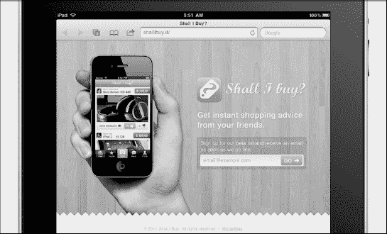
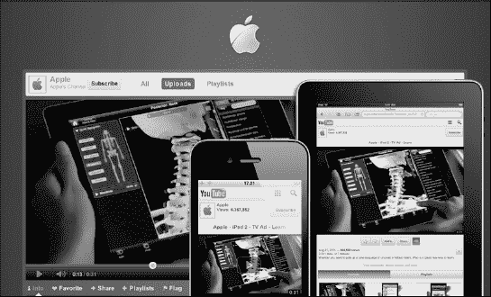
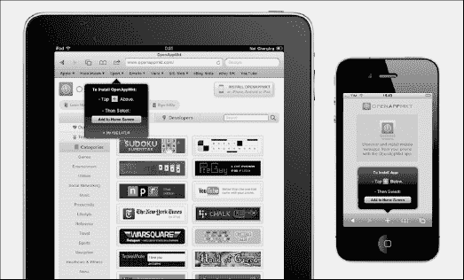
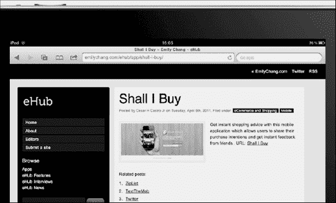
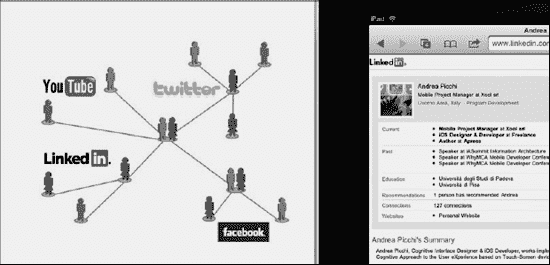
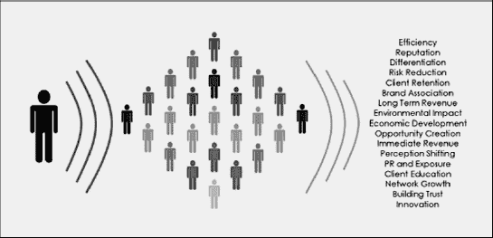
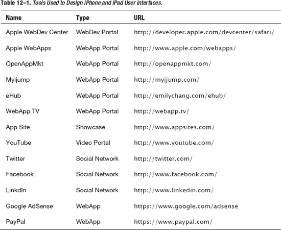

## 第十二章

## 最大化 iOS 网络应用的市场

> 天赋赢得比赛，但团队合作和智慧赢得冠军。

—迈克尔·乔丹

在本章中，您将学习如何推广 WebApp。您将看到如何使用一些特定的方法来帮助保证 WebApp 具有良好的可见性，甚至在它发布到网络上之前。

我们将讨论 Beta 测试邀请和新闻发布；您将看到为 WebApp 创建网站的好处，以及如何使用视频社交网络(如 YouTube)来提高知名度。

我们还将向您展示如何将 WebApp 提交到苹果 WebApp 门户网站，以及除了苹果官方门户网站之外，网络还提供了哪些其他选项。最后，我们将讨论如何将你的 WebApp 货币化，以及为此你可以使用哪些服务。

### 使用您的移动战略

之前，在[第 2 章](02.html#ch2)中，我们制定了一个移动战略，并讨论了该战略对于实现目标和减少错误，最终创建一个成功的项目是多么重要。一个成功的营销计划的关键是准确地知道你的 Web 应用程序能提供什么，以及你的潜在用户的概况。这就是为什么在项目早期制定的移动战略在这一点上变得至关重要。

利用开发移动战略时收集的信息，您可以针对特定范围的用户群更好地营销您的 Web 应用程序。第 12 章介绍了一些最好的方法。

### 如何推广你的 WebApp

假设你的移动战略已经走上正轨，并且你知道你要瞄准的用户群，你就可以考虑如何推广你的 WebApp 了。正如您将在以下部分看到的，可以使用各种技术来接触更广泛的潜在用户。

这些技术可以根据 Web 应用程序的开发状态而改变。在发布的早期阶段，使用测试版邀请进行测试，并向少数重要用户介绍 Web 应用程序。如图[Figure 12–1](#fig_12_1)所示，一旦 Web 应用程序准备就绪，您就可以设计一个网站来创建一个身份和/或创建一个 YouTube 频道，您可以在其中插入关于最重要功能的视频教程。

**图 12–1。** *一个推广 native 和 WebApps 的 Wordpress 主题(图片来源:Templatic)。*

在这一点上，Web 应用程序已经准备好在主要的面向苹果的博客上发布，并插入到一些主要的 WebApp 门户网站中，在那里您可以获得潜在用户的可见性。一旦 Web 应用程序在主要的 WebApp 门户上上线，就该利用社交网络的病毒性质来围绕您的 Web 应用程序进行正面宣传了。

#### 使用测试版邀请测试者

营销计划的第一步甚至在 Web 应用程序发布之前就已经开始了。在设计人员和开发人员在内部完成 alpha 测试之后，Web 应用程序进入 beta 测试阶段，真实用户在他们自己的环境中测试它。

测试邀请阶段包括一小组用户，根据他们的个人资料和与其他重要用户的潜在联系来选择。选择这类用户是因为他/她代表了测试 Web 应用程序的重要特征；他/她还与潜在用户有着重要的联系，而这些联系是通过其他沟通渠道无法达到的。

在您的 Web 应用程序中，提前为 Beta 测试人员创建一个帐户，并在用户使用 Web 应用程序之前将该帐户和其他信息发送给用户，这将是一个好主意。这将为测试人员创造一个更舒适的环境，并帮助他将所有的服务和功能联系起来，减少他的学习曲线。

测试人员的一个很好的选择可能是另一个团队的设计师或开发人员，一个参与特定业务的用户，他可以传播关于 Web 应用程序的消息，或者一个重要的博客作者或记者。这一策略的见证人是美国记者、《华尔街日报》的首席科技专栏作家沃尔特·s·莫斯伯格(Walter S. Mossberg)，他总是在苹果公司的最新设备实际发布到每一家苹果商店之前收到该设备的版本。事实上，莫斯伯格在等式中扮演的角色更像是一个测试版审核者，而不是测试者，但苹果战略背后的概念是相同的。

#### 使用新闻稿

报刊永远是各类新闻的第一环节，数字新闻也不例外。在网上主要的面向苹果的博客上发布关于你的发布的新闻稿是很重要的。你必须确保为你的 WebApp 提供一个完整的描述和关键功能的截图，确保细节不被博主掌握。

#### 创建一个 WebApp 网站

创建一个网站或 web 应用程序意味着在互联网上传播其身份信息，被搜索引擎索引，并代表每个潜在用户的支持点。许多设计人员和开发人员在本地和 Web 应用程序过程中都忽略了这一步，这是一个严重的错误。对于任何类型的应用程序来说，网站都是最好的沟通渠道之一。

当设计一个网站时，记住你的 web 应用程序的身份和主要用户的目标轮廓是很重要的，这样你就不仅仅是在追求你个人的设计品味。在这个阶段，颜色的选择和设计中使用的线条类型至关重要。为一个主要是女性的 Web 应用程序创建一个激进的设计可能会在你的促销活动中对你不利。

**图 12–2。** *本地应用 Twitterrific 提供了一个应用网站的好例子。*

在第四章中，我们讨论了色彩心理学以及色彩和用户心情之间的关系。除了正确选择颜色和线条，网站还必须包括以下部分:

*   **功能。这就是 Web 应用程序能为用户做的事情，清楚而直接地陈述出来。功能也可以在主页上以预览的形式呈现，如图[图 12–2](#fig_12_2)所示。**
*   **版本历史。**务必注意 Web 应用程序中实现的所有更新和新功能，以便为开发人员提供背景知识，并为用户提供参考。
*   **教程。**重要的是，在网站上，用户能够找到一个教程，这将有助于他使用所有的主要功能和实施的服务。
*   **关于。**在可能的情况下，清楚地描述你的团队是很重要的。表扬整个团队将有助于你的应用在用户面前看起来更加专业。
*   **支持。**为用户提供支持，以解决与网络应用中实现的服务和功能相关的任何问题，这一点非常重要。对于任何想要创造回头客的团队来说，提供良好的支持是关键。
*   **社交分享选项。**为了让用户传播关于 Web 应用的新闻，提供一个社交分享选项是很重要的。在所有可用的选项中，Twitter 和脸书共享选项是必须的；提供脸书式的按钮也很重要。
*   **社区(可选)。**为开发者提供一个见面、分享和共同成长的地方非常重要。该选项仅适用于开发人员在不同地方工作而没有机会面对面交流的开源项目。
*   **博客(可选)。**更新 Web 应用程序的开发状态非常重要。一个活跃的博客给用户一个积极的形象，并作为良好的支持，帮助创造回头客。

应用程序网站的最好例子来自于那些致力于本地 iOS 应用程序的网站，因为本地 iOS 项目背后的销售需求使得本地开发者在比较 web 开发者之前采用这种技术；Twitterrific 应用程序网站提供了一个很好的例子，如图[图 12–2](#fig_12_2)所示。这两种开发方法的好处是一样的。

最后，务必为 iPad 和 iPhone 用户实现添加到主屏幕功能。这被认为是在每个 WebApp 中实现的一个好的实践，原因有二。首先，并不是所有的用户都会给页面加书签，即使他们觉得这些页面很有趣；其次，当添加到主屏幕时，Web 应用程序被认为是本地仿真过程的最后一步。如果不能从主屏幕启动，访问类似本机的 WebApp 会大大降低用户的类似本机的体验。

#### 使用电子邮件营销

创建应用推广网站后，鼓励潜在用户注册时事通讯是一个不错的主意，这些时事通讯会提供有关您的 web 应用状态的信息、介绍新功能或宣布错误修复。

**图 12–3。** *原生应用“我该不该买”就是电子邮件营销的好例子。*

[Figure 12–3](#fig_12_3)展示了一个实现这种方法的网站，一旦 WebApp 退出 Beta 测试阶段并可供所有用户在线使用，它就会提供更新。

#### 创建 YouTube 视频教程

视频教程是为 Web 应用程序的用户，尤其是初学者提供支持的好方法；这些教程简单直接地解释了如何正确使用应用程序的服务和功能。YouTube 视频可以嵌入到您的应用程序网站的教程部分。YouTube 频道在谷歌这样的搜索引擎中有很高的知名度。

过去，许多大牌，如苹果，都有自己的 YouTube 频道(见[图 12–4](#fig_12_4))。最近的频道功能现在允许用户定制频道样式和主题，为开发人员提供了匹配特定用户身份的机会。

**图 12–4。** *苹果桌面、iPad 和 iPhone 上的官方 YouTube 频道。*

开一个 YouTube 频道很容易；在 http://www.youtube.com 注册一个账户只需要几分钟。使用上传视频表单时，您必须记得选择正确的标题、描述和标签。良好的标题和标签是必要的，以便最大限度地提高视频在谷歌搜索引擎上被准确索引的可能性，使用户更容易浏览所有重要信息。

每个视频下的描述由一个三行的预览加上一个显示整个描述内容的(更多信息)链接组成。在三行预览中，请确保插入描述视频内容所需的所有内容，仅在第三行后详细介绍。这保证了用户在与您的视频互动时获得最高水平的体验。

#### 提交至 Apple WebApp 门户网站

对于网络开发者来说，苹果 WebApp 门户是最接近应用商店的东西。这个门户网站不能像使用不同渠道的应用程序商店那样，为提交的所有 Web 应用程序提供相同的可见性，但它仍然是推广任何类型的 Web 应用程序的最佳选择。

正如在 App Store 的世界里，为了提交一个项目，需要向苹果注册一个开发者账户。这里的区别在于，在这种情况下，即使是免费版本也足以将 Web 应用程序提交到门户。

**图 12–5。***iPad(左)和 iPhone(右)上的苹果官方 WebApps 门户。*

从 Apple WebApp 门户，如[图 12–5](#fig_12_5)所示，点击位于右侧边栏标题为“提交申请”的横幅您将被重定向到位于`[http://developer.apple.com/devcenter/safari](http://developer.apple.com/devcenter/safari)/`的苹果开发中心，在那里，一旦使用您的 Apple ID 登录，您将能够访问苹果 iPhone 网络应用程序表单。在表格的最后，可以插入 320 × 436 像素的应用截图和 128 × 128 像素的产品应用图标。

您还可以通过更新或更改与您的 web 应用程序相关的任何类型的信息，从 Apple 开发中心管理您的提交。

#### 提交到其他 WebApp 门户

有几个原因可以解释为什么使用 Apple Store WebApp 门户网站是任何网络开发人员推广其应用程序的最佳选择。第一，门户是官方来源，由苹果人员监管；第二，组织得很好。苹果 WebApp 门户并不是唯一的出路；推广您的 Web 应用程序的其他好方法也是可用的。

OpenAppMkt，可在[http://openappmkt.com](http://openappmkt.com)/获得，是一个纯苹果风格的 WebApp 门户；它组织得很好，并提供了几个选项，如共享工具栏和用户评论框，这是苹果门户网站所没有的。从用户的角度来看，OpenAppMkt 需要一个免费的用户帐户，用户可以在其中插入自己的电子邮件信息，这些信息将用于将 Web 应用程序直接发送到开发人员的电子邮件帐户。

**图 12–6。***iPad 上的 OpenAppMkt。*

如果您想提交您的 Web 应用程序，您需要注册一个开发者帐户。从开发人员仪表板的侧边栏，您可以单击 Submit New App 按钮，并在表单中填写所有 Web 应用程序的信息。您还需要提供一个应用程序图标，选择正确的类别，并指定您的 Web 应用程序是否是为 iPhone 和/或 iPad 设计的及其价格。

OpenAppMkt 对于 web 开发人员来说是一个很好的资源，它还以 80-20%的利率提供收入处理。这种方法类似于 App Store 使用的方法。[Figure 12–6](#fig_12_6)显示开发者选项卡，您可以在其中上传您的 WebApp 信息。

**图 12–7。***OpenAppMkt 的添加到 Home 函数在起作用。*

[图 12–7](#fig_12_7)显示，OpenAppMkt 已经为 iPad 和 iPhone 用户应用了将提醒“添加到主屏幕”插入 WebApp 的最佳实践，增加了类似本机的体验。

**图 12–8。***eHub 网站是一个不断更新的网络应用资源。*

另一个很好的 WebApp 门户是 eHub(见[图 12–8](#fig_12_8))，可在 http://emilychang.com/ehub获得。这个门户网站承载桌面项目和移动网络应用程序，并产生大量的互联网流量。

#### 利用社交网络的病毒式传播

建立网站是网络应用营销计划的基本步骤；添加博客也是向用户更新错误修复和新功能的好方法。社交网络为从个人到企业的各种类型的推广提供了一个完美的平台。

订阅社交网络让你有机会发布任何类型的更新。它甚至比博客更快，让你有机会发现和创造新的重要关系，如图[Figure 12–9](#fig_12_9)所示。在这方面，并不是所有的社交网络都是平等的；例如，像 Twitter 和 LinkedIn 这样的平台(能够在个人主页中导入推文)比脸书更加以商业为导向。然而，重要的是优化任何可用的通信渠道。

**图 12–9。** *社交网络互联的例子(来源:图片来自 Labrow Marketing)。*

说到一般的 WebApp 项目，第一步可能是创建一个 LinkedIn 帐户。LinkedIn(参见[Figure 12–9](#fig_12_9))是一个面向商业的社交网络平台，是与世界各地的设计师、开发人员和专业团队建立重要联系的最佳渠道。LinkedIn 个人资料是完整的，它提供了一个展示你的知识和过去经验的绝佳机会，还提供了向你的电子邮件联系人发送邀请、导入你的 Twitter 时间表和你的 SlideShare 演示文稿的能力，同时与你的许多渠道建立了强大的联系。

第二步可能是创建一个 Twitter 账户。该帐户可以是个人的，也可以专用于 Web 应用程序。Twitter 是一个有创意的微博社交网络平台。这意味着，除了私人用户之外，许多专业设计人员和开发人员也使用它来分享他们项目的新闻和更新。Twitter 的帖子限制在 140 个字符以内，非常适合简短快速的项目更新。你的个人 Twitter 主页可以通过修改背景图片和主题的调色板来定制，以匹配任何个人身份。

第三步可能是为你的 WebApp 创建一个脸书页面。在这三个网络中，脸书是最不注重商业的，因为与 Twitter，尤其是 LinkedIn 相比，出于职业目的使用脸书的人的比例是最低的。尽管如此，聪明地使用脸书可能会让你接触到新的潜在用户——那些还不是 WebApp 大用户或回头客的人。在这个阶段，记住不同的项目有不同的需求和优先级也很重要。选择合适的社交网络来接触你的目标用户。

**图 12–10。** *社交媒体网络上的病毒式传播(图片交集咨询)。*

### 将网络应用货币化

网络应用的赚钱不像原生应用那么容易，因为你不能依赖应用商店的支持。App Store 承担了销售你原生应用的责任。应用推广只是加分项；App Store 提供了几乎所有提交给它的应用程序的良好可视性。当有必要从一个需要从零开始推广的 Web 应用程序中提高收入时，音乐就会改变。

除了 OpenAppMkt 这样的门户网站提供的机会之外，增加收入的两个最佳方式是通过 Google AdSense 和 PayPal 捐款。

**图 12–11。***iPad 上的 Google AdSense 服务注册页面。*

Google AdSense 提供了在你的内容中插入和展示定向广告并从中赚钱的机会。这项服务可以在移动和桌面平台上运行，有一个专门的网页应用部分。在 Google AdSense 上注册一个帐户后，您需要向您的 Web 应用程序添加一段代码，就像在 Google Analytics 中一样。Google AdSense 还提供了定制移动广告的能力，以最好地匹配您的 Web 应用程序设计的外观和感觉。

PayPal 是一个众所周知的广泛使用的平台。您可以在您的 Web 应用程序中使用 PayPal 捐款，以便从中筹集资金。在这种情况下，将“捐赠”按钮添加到应用程序网站和 web 应用程序是一个好主意。如果你的网络应用是一个特定的应用，并有效地解决用户的功能或服务问题，PayPal 是一个有效的收入来源。

### WebApp 市场上的资源

[Table 12–1](#tab_12_1)列出了使用互联网推广任何类型的 WebApp 的主要 WebApp 门户和社交网络。我们已经包括了 PayPal 和 AdSense 的链接，供那些对他们的项目货币化感兴趣的人使用。

### 总结

本章讨论了如何最大化 Web 应用程序市场，通过展示由于应用程序商店模式，Web 应用程序市场无法与本地应用程序市场相提并论。

在本章的第一部分，我们介绍了在项目早期开发的移动战略如何有助于为您的项目规划促销活动和营销战略。

在本章的第二部分，我们介绍了几种实现营销目标的方法。我们使用(VIP) Beta 测试人员来测试和推广应用程序，然后我们创建了一个网站来将 web 应用程序介绍给搜索引擎和互联网。创建网站后，我们创建了一个 YouTube 频道来推广应用程序，并提供视频支持以将视频教程导入到网站。

在本章的第三部分，一旦我们的 Web 应用程序的主要结构建立起来，我们就把它提交给 Apple WebApp 门户以及其他门户，比如 OpenAppMkt。我们还看到了像 OpenAppMkt 这样的门户网站如何通过应用商店中的本地应用程序来帮助我们提高收入。

在本章的第四部分，我们利用社交网络的病毒式传播，向 LinkedIn 和 Twitter 上特定类型的用户以及脸书上各种类型的潜在用户传播关于我们 Web 应用程序的信息。

在本章的最后一部分，我们介绍了两种将 Web 应用程序货币化的方法。ADSense 服务可以为开发者提供不错的平均收入。我们还看到了 PayPal 服务如何更好地与解决重要问题的 Web 应用程序配合，并在用户中产生一种感激之情，促使他/她捐款。