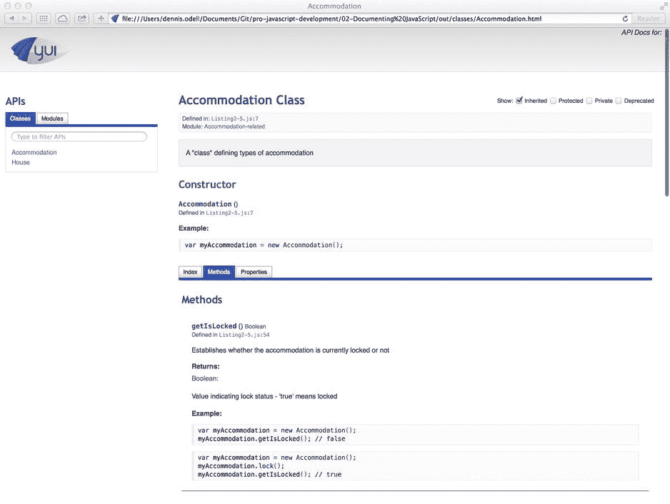

# 2.记录 JavaScript

在前一章，我们看了面向对象的 JavaScript 和编码惯例。编写面向对象代码和建立约定的目的是确保代码对开发人员来说清晰易懂。浏览器中的 JavaScript 引擎并不关心你的代码写得有多整洁，或者对你来说是否有意义——它只是遵循一套规则。对你和你的团队来说，更重要的是理解你写的代码以及如何使用它，因为这简化了维护你的代码库的任务。代码可维护性意味着任何规模的团队都可以在同一组文件上协作，并对如何添加、修改和删除部分代码有共同的理解，从而获得一致的结果。除了代码本身可以理解之外，你会发现你需要添加小的注释或大块的文档来向其他开发人员解释，包括你自己(如果你将来不记得你的推理),代码的特定部分执行什么任务以及如何使用它。

有两类用户受益于好的文档，这取决于您的代码的目标受众。第一组是你自己和你的项目合作者。好的文档让每个人都知道你的代码是做什么的，它是如何做的，以及为什么要做，从而减少混乱和引入错误的机会。

第二组是其他开发者，与你的项目无关。如果您的项目将公共函数公开为某种 API(应用编程接口),那么您将需要确保您的文档是最新的、可读的和可理解的，最好有工作示例来帮助其他开发人员采用它。想象一下，如果 jQuery 的文档质量很差，它肯定不会像现在这样迅速而容易地被采用。良好、全面的文档是让更多开发人员采用您的代码的关键。

文档可以采取多种形式，从代码文件中的一些关键注释到专门描述代码库的整个网站；每一种都更适合不同的情况。本章将主要关注文档的结构化形式，在 JavaScript 代码文件的注释中使用特殊格式的标记，并使用这种结构生成一个完全可用的文档网站，而无需编写任何 HTML 或 CSS 代码。

## 内嵌和阻止注释

有时候代码本身并不能解释到底发生了什么，你不能逃避给你的代码添加注释以使代码更容易理解。注释代码是好的，但是作为一般规则，尽量让代码说话。如果可以通过更好地命名变量来避免添加注释，那么就这样做。如果您需要添加注释来增加代码的价值，请使用行内注释，它是为单行 JavaScript 代码设计的:

`// JavaScript recognises this line a comment because of the double slashes at the start`

或者使用块注释，它被设计成跨越多行代码:

`/*`

`* JavaScript recognises this as a block comment because of the slash / asterisk combination`

`* at the start and the asterisk / slash combination at the end. Many developers choose to`

`* begin each line of commented text with an asterisk and apply spacing such that each`

`* asterisk lines up with the one from the previous line.`

`*/`

## 结构化 JavaScript 文档

我们可以简单地创建一个单独的文档文件，其中包含描述我们代码的用法说明和示例，但是，我们必须确保每当对代码本身进行更改时，该文件都是最新的，这可能非常耗时，并且很可能不会完成，这意味着它将永远与它所描述的代码不同步。

在我看来，创建文档的最佳方式是将用法说明和示例直接添加到代码文件本身的块注释中，就在代码所在的地方。这样，对于添加或更改代码的开发人员来说，他们看到的与代码相关的文档也需要更新，这就为文档保持最新提供了更好的机会。

因此，我们有一个策略来确保文档保持相关性，但是如果它与源代码一致，那么阅读起来就不那么容易了，你想阅读的只是文档本身。因此，我们需要一种将文档从源代码中提取出来的方法，使其成为一种更可展示的形式——理想情况下，这将是运行一个程序来为我们做这件事的一个简单例子，因为我们不想自己手动执行提取——我们是开发人员，我们没有耐心去做那件事！

幸运的是，有几个程序可以从源代码文件中提取特殊格式的文档，并在一个简单的网页中以易于使用的格式呈现出来。这样的程序有 JSDoc([http://bit . ly/JSDoc _ 3](http://bit.ly/jsdoc_3))、dox ( [http:// bit. ly/ d_ o_ x](http://bit.ly/d_o_x) )、YUIDoc([http://bit . ly/yui _ doc](http://bit.ly/yui_doc))。行业偏好似乎倾向于后者，这也是我们在本章剩余部分用来生成文档的原因。

## YUIDoc 文档格式

YUIDoc 不处理和理解你的源文件中的任何代码；相反，它只观察您自己围绕代码编写的特殊格式的块注释。在我使用其他文档处理程序的经验中，一些自动处理程序经常错过我理解的关于我的代码的重要因素，但是他们没有。然后，您被迫手动添加额外的文档，以覆盖其自动处理器。因此，我倾向于使用只理解我告诉它的内容的处理器，这样我就可以在文档中清楚明了地表达我的代码，而不会有任何虚假的信息进入我的文档。

YUIDoc 将从文件中只读块注释，即使这样也会忽略所有不以组合`/**`开头的注释，如下所示。您可以选择在注释的每一行的开头添加额外的星号(`*`)字符，以继续表示每一行都是同一注释的一部分，并将每一行排成一行。Sublime Text([http://bit . ly/Sublime _ Text](http://bit.ly/sublime_text))等代码编辑器会自动为你做到这一点:

`/**`

`* This will be read by YUIDoc`

`*/`

`/*`

`* This will not`

`*/`

`/***`

`* Neither will this`

`*/`

现在我们知道了如何让 YUIDoc 读取注释块，我们需要知道以 YUIDoc 可以理解的格式在块中放入什么。YUIDoc 支持@-标签，这是一种小标签，每个标签都以@字符开头，后跟其他相关的名称和信息。YUIDoc 的词汇表中有两组标签，主要标签和次要标签。描述一些周围代码的每个注释块必须包含一个且只能包含一个主标记，后面跟随着所需数量的辅助标记。

与其列出每个标签及其定义，不如让我们看看一些真实的用例，看看哪些标签适合哪种情况。

### 记录“类”、构造函数、属性和方法

我们在第 1 章中仔细研究了面向对象的 JavaScript 编码，其中我们介绍了“类”的创建以及将方法和属性与它们相关联。让我们从那一章中选取一个例子，并以 YUIDoc 格式添加一些基本的文档注释。

清单 2-1 使用清单 1-19 中的`Class.create`方法定义了一个名为`Accommodation`的“类”，带有一个名为`initialize`的构造函数，两个公共属性`isLocked`和`isAlarmed`，以及两个公共方法`lock`和`unlock`。

清单 2-1。需要记录的简单 JavaScript“类”

`var Accommodation = Class.create({`

`isLocked: true,`

`isAlarmed: true,`

`lock: function() {`

`this.isLocked = true;`

`},`

`unlock: function() {`

`this.isLocked = false;`

`},`

`initialize: function() {`

`this.unlock();`

`}`

`});`

我们将从顶部开始我们的文档，使用 YUIDoc 的`@class`标签来标记一个“类”。标签前面是“类”的定义，后面是“类”的名称。我们之所以包括这个名字，是因为 YUIDoc 的解析器只读取这些格式化的注释，并不执行或解析代码中的变量名。首先，我们描述“类”，留下一个空行，然后我们放置 YUIDoc 标签。

`/**`

`* A "class" defining types of accommodation`

`*`

`* @class Accommodation`

`* @constructor`

`*/`

我们从我们定义的“类”的简单文本描述开始特殊格式的注释。这可以是我们喜欢的或长或短，如果需要，跨越多行。然后，我们用 YUIDoc 标签开始每一个新行，第一个标签是`@class`，后跟“class”公共变量名，然后添加一个带有`@constructor`标签的新行，这表明该变量是一个构造函数，可以从该函数创建对象实例。我认为，YUIDoc 的美妙之处在于，它不会试图解析您的代码，通过变量和函数的使用来推断文档。在这种情况下，我们使用`Class.create`而不是定义一个简单的`function`来创建一个构造函数和“类”的事实对 YUIDoc 来说并不重要，只要使用正确的`@`标签来描述它。这种方法可能会抛出另一个文档引擎来声明一个“类”,并且可能会返回与我们预期的完全不同的文档。

您的代码中可能有一个“类”,它并不打算每次都用 new 关键字进行实例化，而是在定义后进行实例化，代码的其余部分应该使用这个实例化。这就是所谓的单例，或者静态“类”，可以在你的文档中通过使用`@static`标签而不是`@constructor`标签来表示你的“类”定义，如清单 2-2 所示。

清单 2-2。记录静态“类”

`/**`

`* A static "class" containing methods for reading and writing browser cookies`

`*`

`* @class Cookies`

`* @static`

`*/`

`// A self-instantiating "class" such as this is known as a singleton or static "class"`

`var Cookies = (function() {`

`// Properties and methods to get and set cookie values go here…`

`}());`

记录属性遵循与“类”本身相似的模式；我们在代码中记录的属性上方直接创建格式化的注释。

`/**`

`* Denotes whether the accommodation is currently locked`

`*`

`* @property {Boolean} isLocked`

`*/`

在我们的属性定义之后，我们使用`@property`标签通过名称将我们的属性定义为 YUIDoc。注意，我们可以在`@`-标记和属性名之间的花括号中声明类型。这有助于其他开发人员了解用于您的属性的正确值类型，因此记住将这一点添加到您的文档中尤为重要。您可以使用 JavaScript 中任何可用的默认类型，例如`Boolean`、`String`、`Number`、`Object`、`Array`、`Date`、`Function`，以及您在代码中自己创建的任何自定义“类”类型。

记录方法的工作方式与属性非常相似，只是我们使用了`@method`标签，不需要指定数据类型，因为方法总是属于`Function`类型。

`/**`

`* Unlocks the accommodation`

`*`

`* @method unlock`

`*/`

清单 2-3 显示了清单 2-1 中`Accommodation`“类”的完整文档版本。

清单 2-3。一个简单的、完整的 JavaScript“类”

`/**`

`* A "class" defining types of accommodation`

`*`

`* @class Accommodation`

`* @constructor`

`*/`

`var Accommodation = Class.create({`

`/**`

`* Denotes whether the acommodation is currently locked`

`*`

`* @property {Boolean} isLocked`

`*/`

`isLocked: true,`

`/**`

`* Denotes whether the acommodation is currently alarmed—thieves beware!`

`*`

`* @property {Boolean} isAlarmed`

`*/`

`isAlarmed: true,`

`/**`

`* Locks the accommodation`

`*`

`* @method lock`

`*/`

`lock: function() {`

`this.isLocked = true;`

`},`

`/**`

`* Unlocks the accommodation`

`*`

`* @method unlock`

`*/`

`unlock: function() {`

`this.isLocked = false;`

`},`

`/**`

`* Executed automatically upon creation of an object instance of this "class".`

`* Unlocks the accommodation.`

`*`

`* @method initialize`

`*/`

`initialize: function() {`

`this.unlock();`

`}`

`});—`

#### 指定方法的输入参数和返回值

我们在清单 2-3 中记录的方法不包含输入或输出，所以记录它们就像描述函数的目的一样简单。为了用输入和输出的描述来标记一个方法，如果其他开发人员要理解你的方法应该如何被使用，这是必不可少的，你把`@param`和`@return`标签添加到我们已经看到的`@method`标签中。看看下面的方法，我们将把它添加到清单 2-1 的`Accommodation`“类”中。

`alarm: function(message) {`

`this.isAlarmed = true;`

`alert("Alarm is now activated. " + message);`

`return this.isAlarmed;`

`}`

我们将向该方法添加文档，详细说明该方法做什么，以及它的输入和输出，每一项都列在单独的行上。

`/**`

`* Activates the accommodation's alarm and displays a message to that effect`

`*`

`* @method alarm`

`* @param {String} message The message to display once the alarm is activated`

`* @return {Boolean} The current activation state of the alarm`

`*/`

注意`@param`与`@property`的相似之处在于应指定输入参数的类型；然而，与`@property`不同的是，参数的描述应该紧跟在它的名字之后。`@return`标签要求我们在花括号中指定返回值的数据类型，然后描述该值代表什么。

您可能已经编写了代码，将您的某个方法的输入组合成一个单一的对象文字参数，正如第 1 章中推荐的那样。这可以通过将对象文字中的每个属性作为单独的参数列出来进行记录，使用点符号表示每个属性都是同一对象的一部分。

`/**`

`* Set all object instance properties in one shot`

`*`

`* @method setProperties`

`* @param {Object} options Properties object`

`* @param {Boolean} options.isAlarmed Denotes whether the accommodation is alarmed`

`* @param {Boolean} options.isLocked Denotes whether the accommodation is locked`

`* @param {String} options.message Message to display when alarm is activated`

`*/`

`Accommodation.prototype.setProperties(options) {`

`options = options || {};`

`this.isAlarmed = options.isAlarmed || false;`

`this.isLocked = options.isLocked || false;`

`this.message = options.message || "Alarm activated!";`

`};`

#### 记录可选的方法输入参数

如果您有包含可选参数的方法，您可以用 YUIDoc 格式表示这些方法，方法是将参数名放在方括号中。

`/**`

`* Activates the accommodation's alarm, optionally displaying a custom message`

`*`

`* @method alarm`

`* @param {String} [message] Custom message to display once the alarm is activated`

`* @return {Boolean} The current activation state of the alarm`

`*/`

如果没有提供可选值，某些可选输入参数可能会有默认值。在我们的例子中，我们可能希望将可选的`message`输入参数默认为一个特定的文本字符串。我们可以用 YUIDoc 格式来表示这一点，方法是在参数名后面加上`=`，然后是该参数的默认值。

`/**`

`* Activates the accommodation's alarm, optionally displaying a custom message`

`*`

`* @method alarm`

`* @param {String} [message=Alarm activated!] Custom message to display when alarm is activated`

`* @return {Boolean} The current activation state of the alarm`

`*/`

#### 记录包含常数值的属性

在第一章的[中，我们看了用大写字母表示“常数”变量，或幻数。我们可以在 YUIDoc 格式文档中使用`@final`标签来表示常量:](01.html)

`/**`

`* The mathemtical constant Pi`

`*`

`* @property PI`

`* @final`

`*/`

`var PI = 3.1415;`

#### 记录私有、受保护和公共的方法和属性

为了您自己和其他开发人员的利益，您应该在代码中记录公共的、受保护的和私有的属性和方法。在你的文档中，一个方法或属性可以被标记为私有的，只需在一行中添加`@private`标签，受保护的属性可以用`@protected`标签来标记。清单 2-4 展示了一个完整的文档化的“类”,它有公共的、受保护的和私有的属性和方法，摘自我们在《T2》第一章第三节中写的代码。

清单 2-4。包含私有和公共方法和属性的完整记录的“类”

`/**`

`* A "class" defining types of accommodation`

`*`

`* @class Accommodation`

`* @constructor`

`*/`

`var Accommodation = (function() {`

`function Accommodation() {}`

`/**`

`* Denotes whether the property is currently locked`

`*`

`* @property {Boolean} _isLocked`

`* @protected`

`*/`

`var _isLocked = false,`

`/**`

`* Denotes whether the property is currently alarmed`

`*`

`* @property {Boolean} _isAlarmed`

`* @private`

`*/`

`_isAlarmed = false,`

`/**`

`* Message to display when the alarm is activated`

`*`

`* @property {String} _alarmMessage`

`* @protected`

`*/`

`_alarmMessage = "Alarm activated!";`

`/**`

`* Activates the alarm`

`*`

`* @method _alarm`

`* @private`

`*/`

`function _alarm() {`

`_isAlarmed = true;`

`alert(_alarmMessage);`

`}`

`/**`

`* Disables the alarm`

`*`

`* @method _disableAlarm`

`* @private`

`*/`

`function _disableAlarm() {`

`_isAlarmed = false;`

`}`

`/**`

`* Locks the accommodation`

`*`

`* @method lock`

`*/`

`Accommodation.prototype.lock = function() {`

`_isLocked = true;`

`_alarm();`

`};`

`/**`

`* Unlocks the accommodation`

`*`

`* @method unlock`

`*/`

`Accommodation.prototype.unlock = function() {`

`_isLocked = false;`

`_disableAlarm();`

`};`

`/**`

`* Returns the current lock state of the accommodation`

`*`

`* @method getIsLocked`

`* @return {Boolean} Indicates lock state, ‘true' indicates that the accommodation is locked`

`*/`

`Accommodation.prototype.getIsLocked = function() {`

`return _isLocked;`

`};`

`/**`

`* Sets a new alarm message to be displayed when the accommodation is locked`

`*`

`* @method setAlarmMessage`

`* @param {String} message The new alarm message text`

`*/`

`Accommodation.prototype.setAlarmMessage = function(message) {`

`_alarmMessage = message;`

`};`

`return Accommodation;`

`}());`

#### 记录继承的“类”

从第一章的内容中，我们知道如何通过我们的代码展示继承，但是我们也需要在我们的文档中表示父类和子类之间的关系。我们可以使用 YUIDoc `@extends`标签来表示哪个“类”是当前记录的“类”的父类。

`/**`

`* Define a "class" representing a house`

`*`

`* @class House`

`* @constructor`

`* @extends Accommodation`

`*/`

`function House() {};`

`House.prototype = new Accommodation();`

`/**`

`* Locks the house and activates the alarm`

`*`

`* @method lock`

`*/`

`House.prototype.lock = function() {`

`Accommodation.prototype.lock.call(this);`

`this.alarm();`

`};`

#### 记录链接的方法

您的文档可以被标记，以表示代码中的某些方法可以用`@chainable`标签链接在一起。正如我们在[第 1 章](01.html)中看到的，这仅仅涉及在方法结束时返回方法调用的上下文，因此同样的方法可以被立即调用:

`/**`

`* Locks the house and activates the alarm`

`*`

`* @method lock`

`* @chainable`

`*/`

`House.prototype.lock = function() {`

`Accommodation.prototype.lock.call(this);`

`this.alarm();`

`return this;`

`};`

#### 记录相关“类”的组

您的代码文件可能包含几个“类”，所有这些类共享一个相似的分组或彼此相关的含义。在许多情况下，这种分组将自然地形成为从单个父“类”继承的一组“类”。您可以使用`@module`标签和分组名称向 YUIDoc 表示这个分组，其中至少有一个这样的标签应该存在于您的代码库中，即使这个分组只包含一个“类”。

`/**`

`* Group of accommodation-related "classes"`

`*`

`* @module Accommodation-related`

`*/`

如果你想进一步细化你的分组，你可以使用`@submodule`标签和`@module`来表示你代码中“类”的子分组模块。

`/**`

`* House-specific "classes"`

`*`

`* @module Accommodation-related`

`* @submodule House-specific`

`*/`

### 记录事件

如果您正在编写在代码中触发自定义事件的代码，当这些事件被触发时将调用侦听器函数，您应该使用`@event`标记按名称记录事件，并使用`@param`标记描述传递给侦听该事件触发的任何函数的任何参数:

`/**`

`* Fired when the accommodation is alarmed`

`*`

`* @event accommodationAlarmed`

`* @param {String} message The message that was shown when the accommodation was alarmed`

`*/`

### 记录代码示例

有时基于文本的文档不能代替代码示例。这就是为什么 YUIDoc 能够通过使用`@example`标签在结构化文档注释中标记代码，作为后面代码的用法示例。您可以指定任意数量的示例，用另一个`@example`标签分隔每个示例。示例代码应该缩进四个空格或一个制表符，原因将在本章讨论 Markdown 格式时变得更加清楚。

`/**`

`* Sets a new alarm message to be displayed when the accommodation is locked`

`*`

`* @method setAlarmMessage`

`* @example`

`*     var myAccommodation = new Accommodation();`

`*     myAccommodation.setAlarmMessage("My alarm is enabled – thieves beware! ");`

`*     myAccommodation.alarm(); // Alerts "My alarm is enabled – thieves beware! "`

`*`

`* @example`

`*     var myAccommodation = new Accommodation();`

`*     myAccommodation.setAlarmMessage(); // Leave message blank`

`*     myAccommodation.alarm(); // Alerts an empty box with no message`

`*/`

### 其他 YUIDoc 文档标签

在这一章中，我们已经讨论了您可能在 90%的真实案例中需要的文档标记。然而，随着你对记录你自己的代码越来越熟悉，你可能会发现你需要记录你的代码中本章没有解释的方面。要查看与 YUIDoc 一起使用的可用标签的完整列表，请通过[http://bit . ly/YUIDoc _ syntax](http://bit.ly/yuidoc_syntax)访问官方语法参考网站。

## 表达性文档格式–降价

不要用 HTML 标记编写更长形式的“类”、方法和属性描述以及用法文档，对于开发人员来说，这很难阅读，可以使用一种对开发人员更友好的格式，称为 Markdown—[http://bit . ly/Markdown _ format](http://bit.ly/markdown_format)。

约翰·格鲁伯和艾伦·施瓦茨在 2004 年开发了 Markdown，作为开发人员编写纯文本文档的一种简单方法，这些文档可以作为纯文本轻松阅读，但也可以轻松转换为 HTML 以便阅读。它使用了当时纯文本消息中已经存在的约定，特别是在电子邮件和新闻组中。它在 GitHub、Stack Overflow 和 SourceForge 等网站上生成富文本而不需要编写 HTML，因此变得很流行。

在你的结构化文档中使用 Markdown 将有助于你的文档更加丰富和富有表现力，而不会使你的源代码文件过于臃肿或者更加难以阅读。YUIDoc 支持描述和示例中自由格式文档的 Markdown 格式，允许生成非常有表现力和全面的文档。因此，熟悉格式的细节非常重要。让我们来看看编写 Markdown 的一些最常见的方法，以及这些方法在 Markdown 处理器上运行时产生的 HTML 输出，比如 YUIDoc 中的处理器。

### 将标题下的内容分组

HTML 标题标签`<h1>`到`<h6>`可以使用以下示例中所示的形式作为 markdown 文本块的输出:

`A Main Heading`

`==============`

`A Secondary Heading`

`-------------------`

`# Alternative Form Of Main Heading, aka Header Level 1`

`## Alternative Form Of Secondary Heading, aka Header Level 2`

`### Header Level 3`

`#### Header Level 4 ####`

`##### Header Level 5`

`###### Header Level 6 ######`

这个 Markdown 块在处理成 HTML 时会产生以下内容:

`<h1>A Main Heading</h1>`

`<h2>A Secondary Heading</h2>`

`<h1>Alternative Form Of Main Heading, aka Header Level 1</h1>`

`<h2>Alternative Form Of Seconday Heading, aka Header Level 2</h2>`

`<h3>Header Level 3</h3>`

`<h4>Header Level 4</h4>`

`<h5>Header Level 5</h5>`

`<h6>Header Level 6</h6>`

直观地比较 markdown 输入和 HTML 输出应该会向您揭示，与相对难以扫描的 HTML 输出相比，读写 Markdown 是多么简单。

请注意主标题和次标题的两种可能形式，以及原始降价中第 4 层和第 6 层标题上过时的结束标记。这两者都是为了在不影响输出的情况下让输入更容易阅读，根据你喜欢的外观，你可以随意使用任何你认为合适的方法。

### 换行和创建段落

使用 markdown 创建文本段落不需要特殊符号；只需在一个文本块和另一个文本块之间添加两个换行符，就可以在生成的 HTML 中的每个文本块周围生成一个`<p>`标签。

`80 days around the world, we'll find a pot of gold just sitting where the rainbow's ending. Time—we'll fight against the time, and we'll fly on the white wings of the wind.`

`Ten years ago a crack commando unit was sent to prison by a military court for a crime they didn't commit. These men promptly escaped from a maximum-security stockade to the Los Angeles underground.`

此处示例中显示的降价将被转换为以下 HTML 输出。

`<p>80 days around the world, we'll find a pot of gold just sitting where the rainbow's ending. Time—we'll fight against the time, and we'll fly on the white wings of the wind.</p>`

`<p>Ten years ago a crack commando unit was sent to prison by a military court for a crime they didn't commit. These men promptly escaped from a maximum-security stockade to the Los Angeles underground.</p>`

由此你可能会认为，要在 HTML 输出中创建一个换行符而不是一个段落换行符，你只需在 Markdown 文件中包含一个换行符即可，但事实并非如此。在 Markdown 中，一个单独的换行符会将输出文本合并成一个段落。

`80 days around the world, we'll find a pot of gold just sitting where the rainbow's ending.`

`Time—we'll fight against the time, and we'll fly on the white wings of the wind.`

此处的示例在处理后产生以下 HTML 输出。

`<p>80 days around the world, we'll find a pot of gold just sitting where the rainbow's ending.`

`Time—we'll fight against the time, and we'll fly on the white wings of the wind.</p>`

要在输出中生成 HTML 换行符`<br />`，必须在 Markdown 中的换行符前加上两个或更多空格。这将在之前的行尾，所以在读取输入文件时看不到。

`80 days around the world, we'll find a pot of gold just sitting where the rainbow's ending.`

`Time—we'll fight against the time, and we'll fly on the white wings of the wind.`

示例中第一行末尾的␣符号表示使用了空格字符，因此请确保不要使用␣字符本身。处理这个 Markdown 输入会产生下面的 HTML 输出。

`<p>80 days around the world, we'll find a pot of gold just sitting where the rainbow's ending.<br />Time—we'll fight against the time, and we'll fly on the white wings of the wind.</p>`

### 创建列表

有序列表和无序列表都可以通过 markdown 表示，并解释为正确的 HTML 标签。

无序列表可以用星号(`*`)、连字符(`-`)或加号(`+`)来表示，每个符号后面都有一个或多个空格字符或制表符，这意味着它非常灵活，您可以使用任何您觉得最自然的符号。

`* Monkey`

`* Donkey`

`* Wonky`

`-       Monkey`

`-       Wonky`

`-       Donkey`

`+ Donkey`

`+ Monkey`

`+ Wonky`

所示示例在处理后会产生以下 HTML 输出。注意每个列表的 HTML 都是相同的，尽管在原始的减价列表中使用了不同的项目符号。

`<ul>`

`<li>Monkey</li>`

`<li>Donkey</li>`

`<li>Wonky</li>`

`</ul>`

`<ul>`

`<li>Monkey</li>`

`<li>Wonky</li>`

`<li>Donkey</li>`

`</ul>`

`<ul>`

`<li>Donkey</li>`

`<li>Monkey</li>`

`<li>Wonky</li>`

`</ul>`

有序列表可以这样生成:每行以一个数字开头，后跟一个句点，然后是一个或多个制表符或空格字符。降价文件中使用的实际数字并不重要；它们将作为从数字 1 开始的单个有序数字列表进行处理。这实际上对编写降价文本的人是有益的，因为他们只需要将所有数字设置为相同的数字，这意味着如果他们向列表中添加额外的项目，他们不必重新排序数字。

`1\. Monkey`

`2\. Donkey`

`3\. Wonky`

`1.      Monkey`

`1.      Wonky`

`1.      Donkey`

`1\. Donkey`

`2\. Monkey`

`3\. Wonky`

该示例在处理后会产生以下 HTML 输出。注意每个列表的 HTML 都是相同的，尽管在原始的减价列表中使用了不同的数字。

`<ol>`

`<li>Monkey</li>`

`<li>Donkey</li>`

`<li>Wonky</li>`

`</ol>`

`<ol>`

`<li>Monkey</li>`

`<li>Wonky</li>`

`<li>Donkey</li>`

`</ol>`

`<ol>`

`<li>Donkey</li>`

`<li>Monkey</li>`

`<li>Wonky</li>`

`</ol>`

并不是所有的列表都像我们目前看到的例子一样简单；您可能希望将列表嵌套在一起以创建层次结构。幸运的是，这可以通过使用 markdown 简单地将子列表项缩进四个空格或一个制表符来实现。

`* Monkey`

`* Wonky`

`* Donkey`

`1\. Monkey`

`1\. Wonky`

`1\. Donkey`

示例中的代码经过处理后会生成以下 HTML 输出。请注意列表项的嵌套。

`<ul>`

`<li>Monkey`

`<ul>`

`<li>Wonky</li>`

`</ul>`

`</li>`

`<li>Donkey</li>`

`</ul>`

`<ol>`

`<li>Monkey`

`<ol>`

`<li>Wonky</li>`

`</ol>`

`</li>`

`<li>Donkey</li>`

`</ol>`

只需在列表项之间添加一个换行符，就可以在列表项文本周围放置段落。您可以在每个列表项中包含多个文本段落，只需将每个额外的段落缩进四个空格或一个制表符。

`*   Monkey`

`A monkey is a primate of the Haplorrhini suborder and simian infraorder.`

`*   Donkey`

`The donkey or ass, Equus africanus asinus, is a domesticated member of the Equidae or horse family.`

此示例在处理后会产生以下 HTML 输出。

`<ul>`

`<li>`

`<p>Monkey</p>`

`<p>A monkey is a primate of the Haplorrhini suborder and simian infraorder.</p>`

`</li>`

`<li>`

`<p>Donkey</p>`

`<p> The donkey or ass, Equus africanus asinus, is a domesticated member of the Equidae or horse family.</p>`

`</li>`

`</ul>`

### 强调文本

使用 markdown，您可以通过在要强调的文本周围使用星号(`*`)或下划线(`_`)来强调句子中的文本。

`Donkeys are *not* monkeys.##`

`I repeat, Donkeys are _not_ monkeys.`

该示例在处理后会产生以下 HTML 输出。使用强调时，请注意斜体文本。

`<p>Donkeys are <em>not</em> monkeys.<br />`

`I repeat, Donkeys are <em>not</em> monkeys.</p>`

您可以通过将星号或下划线加倍来增加额外的强调。

`Donkeys are **really** not monkeys.##`

`I repeat, Donkeys are __really__ not monkeys.`

此示例在处理后会产生以下 HTML 输出。当在减价文件中强调时，请注意加粗文本的使用。

`<p>Donkeys are <strong>really</strong> not monkeys.<br />`

`I repeat, Donkeys are <strong>really</strong> not monkeys.</p>`

### 显示代码

有两种方法来区分 Markdown 格式的代码片段:内联方法和块方法。前者由代码周围的反斜杠(```)字符表示，用于您希望将一小部分代码作为一行文本的一部分。后者用于显示一行或多行代码，只需将每行代码缩进四个空格字符或一个制表符即可。这就是为什么当我们使用`@example` YUIDoc 标签时，我们缩进它旁边列出的代码。

`Simply install Grunt by typing `npm install grunt` at the command line.`

`<!doctype html>`

`<html>`

`<head></head>`

`</html>`

所示示例在处理后会产生以下输出 HTML。请注意，任何 HTML 标签都将它们的一些字符替换为实体，因此它们呈现为文本，而不是试图解析为它们所代表的标签。

`<p>Simply install Grunt by typing <code>npm install grunt</code> at the command line.</p>`

`<pre><code>&lt;!doctype html&gt;`

`&lt;html&gt;`

`&lt;head&gt; &lt;/head&gt;`

`&lt;/html&gt;</code></pre>`

### 添加报价

要在自己的段落中引用引文，只需在文本前加上一个向右的尖括号，后跟一个或多个空格或制表符。通过包含空引用行来分隔每个段落，可以在块引用中嵌套多个段落。

`> Little Henry took his book one day and went into the garden to study. He sat where the arbor cast a pleasant shade, and he could smell the fragrance of the flowers that he himself had planted.`

`>`

`> At times, he would forget his book while listening to the music of the birds, or gazing at the peonies and tulips, but he would soon think again of his lesson, and commence studying with new zeal.`

此示例在处理为 HTML 后会产生以下输出。

`<blockquote>`

`<p>Little Henry took his book one day and went into the garden to study. He sat where the arbor cast a pleasant shade, and he could smell the fragrance of the flowers that he himself had planted. </p>`

`<p>At times, he would forget his book while listening to the music of the birds, or gazing at the peonies and tulips, but he would soon think again of his lesson, and commence studying with new zeal.</p>`

`</blockquote>`

### 链接到 URL

链接到一个 URL 就像在你的 Markdown 格式的内容中包含那个 URL 一样简单。URL 可以按原样书写，也可以用尖括号`<`和`>`括起来。绝对和相对 URL 都是允许的。

`For more, see`[`http://www.google.com`](http://www.google.com/)`or <`[`http://www.bing.com`](http://www.bing.com/)T4】

此示例在处理后生成以下 HTML。

`For more, see <a href="``http://www.google.com">http://www.google.com</a``> or <a href="``http://www.bing.com">http://www.bing.com</a`T4】

然而，通常情况下，您会希望将特定文本链接到 URL。这是通过将要链接的文本放在方括号`[`和`]`中，然后在其后立即将链接 URL 包含在标准方括号中来实现的。

`One popular search engine is [Google](`[`http://www.google.com`](http://www.google.com/)T2】

此示例在处理后会产生以下 HTML 输出。

`One popular search engine is <a href="``http://www.google.com">Google</a`T2】

最后，Markdown 支持引用链接的使用，这是一种在整个文档中使用的链接查找表。这允许 markdown 文件的作者将所有链接 URL 移动到文档中的另一个点，通常在末尾，以使文档的其余部分更容易阅读。然后给每个链接分配一个引用名称或方括号内的编号，用冒号(`:`)和一个或多个空格或制表符与 URL 分隔。然后，在剩余的减价内容中，可以通过方括号中的相同数字名称来引用该链接。参考名称本身可以包含字母、数字、空格和标点符号的任意组合，但请注意它们不区分大小写。

`Popular search engines include [Google][1], [Bing][2], and [Yahoo][yahoo], but the most popular today is [Google][1].`

`[1]:` `http://www.google.com`

`[2]:`[`http://www.bing.com`T3】](http://www.bing.com/)

`[yahoo]:`[`http://www.yahoo.com`T3】](http://www.yahoo.com/)

下面的 HTML 是经过处理后产生的。请注意，参考列表本身不会显示在输出中。

`Popular search engines include <a href="``http://www.google.com">Google</a``>, <a href="``http://www.bing.com">Bing</a``>, and <a href="``http://www.yahoo.com">Yahoo</a``>, but the most popular today is <a href="``http://www.google.com">Google</a``>.`

如果您希望在 HTML 输出中向 link 标签添加 title 属性，那么您可以在 link URL 后面使用引号将它提供给 markdown 内容。这适用于内联链接和引用链接。

`The most popular search engine today is [Google](`[`http://www.google.com`](http://www.google.com/)T2】

`[1]:`[`http://www.bing.com`](http://www.bing.com/)T2】

`[2]:`[`http://www.yahoo.com`](http://www.yahoo.com/)T2】

所示示例在处理后会产生以下 HTML 输出。

`The most popular search engine today is <a href=`[`http://www.google.com`](http://www.google.com/)`title="Visit Google">Google</a>, followed by <a href=`[`http://www.bing.com`](http://www.bing.com/)`title="Visit Bing">Bing</a> and <a href=``title="Visit Yahoo">Yahoo</a>.`

### 插入图像

向 markdown 内容添加图像的语法与已经看到的链接语法非常相似。主要区别在于，它由前面的感叹号(`!`)字符表示为图像，没有多余的空格或制表符。然后，这后面是一个放在方括号中的名称，这将在结果 HTML 输出中产生一个包含该文本的`alt`属性。然后将图像 URL 本身放在括号中，并在 URL 在处理后的 HTML 输出中添加 title 属性后，在引号中提供一个可选的标题。

``

`T2】

`![Company Logo][logo]`

`![Main Image][1]`

`[logo]: /path/to/logo.png`

`[1]: /path/to/main.jpg "The Main Page Image"`

所示示例在处理后会产生以下 HTML 输出。

``

``

``

### 创建水平嵌线

要分割减价内容中的部分，可以插入一个水平分隔线。这可以在 markdown 中实现，在它们自己的行上使用三个或更多的星号(`*`)、连字符(`-`)或下划线(`_`)。与其他一些降价规则不同，您可以在这些字符之间使用空格而不影响输出，但是您不能在同一行上混合使用这三种类型的字符。

`***`

`---`

`___`

`* * *`

`- - - -`

`______________`

所示的每个示例在处理后都会产生完全相同的 HTML 输出，如下所示。

`<hr />`

### 使用反斜杠插入保留字符

你会看到某些字符在 markdown 中有特定的含义，并被转换成 HTML。如果您想在 markdown 中使用这些字符中的一个而不进行转换，markdown 提供了一种机制来实现这一点——只需在本来会被替换的字符前插入一个反斜杠(`\`)字符。这适用于以下字符:

`\  backslash`

``  backtick`

`*  asterisk`

`_  underscore`

`{} curly braces`

`[] square braces`

`() parentheses`

`#  hash`

`+  plus`

`-  minus (hyphen)`

`.  dot`

`!  exclamation point`

### 对于其他一切，有 HTML

如果你发现你需要表现一些 Markdown 的格式规则不支持的东西，你不必沮丧。Markdown 支持根据需要添加 HTML 标签，以提供额外的格式。请注意，HTML 块将按原样处理，这意味着 HTML 块中任何 Markdown 格式的内容都将被忽略。

`Markdown doesn't support tables, but *HTML* does!`

`<table>`

`<tr>`

`<td>Hello</td>`

`<td>World</td>`

`</tr>`

`</table>`

`And now we're back into __Markdown__ again!`

上面的例子在处理后会产生下面的 HTML 输出。

`<p>Markdown doesn't support tables, but <em>HTML</em> does!</p>`

`<table>`

`<tr>`

`<td>Hello</td>`

`<td>World</td>`

`</tr>`

`</table>`

`<p>And now we're back into <strong>Markdown</strong> again!</p>`

## 使用 YUIDoc 创建文档网站

现在我们已经为我们的代码编写了一些文档，是时候以一种易于使用的格式呈现出来，以便其他人理解。我们一直用 YUIDoc 格式编写文档，所以我们将使用相关的 YUIDoc 工具来生成一个站点。

这个 YUIDoc 工具是一个 JavaScript 应用，旨在与 Node.js 一起工作，node . js 是一个应用框架，它在命令行上运行完全用 JavaScript 编写的文件。我们将在下一章中更详细地讨论 Node.js，但是现在你需要做的就是安装它。

访问 [http:// bit. ly/ node_ js](http://bit.ly/node_js) 并从那里下载 Node.js，按照说明安装；这还会安装一个名为节点包管理器(NPM)的工具，它允许您快速方便地从中央存储库中下载应用(称为包)。

接下来我们需要下载 YUIDoc 包本身。在命令行上，执行以下命令，这将自动安装 YUIDoc 工具，并使其可以在计算机上的任何文件夹中运行:

`npm –g install yuidocjs`

对于 Mac 或其他基于 Unix 的系统，您可能需要在命令前加上`sudo`，以允许代码以足够的权限执行，从而在系统范围内安装该工具。

现在我们已经安装了 YUIDoc，让我们运行它。使用命令行导航到包含您记录的 JavaScript 代码文件的文件夹，并运行以下命令(不要去掉末尾的句点字符):

`yuidoc.`

当执行时，YUIDoc 将查看当前文件夹及其子文件夹中的所有 JavaScript 文件，并从中提取结构化文档。它不会试图执行你的任何代码，它只是读取每个文件，就像它是纯文本一样，寻找它的特定标签集和特殊格式的开始注释块字符。然后，它获取从文档中收集的信息，并生成一个 JSON 格式的文件，以结构化的形式表示这些数据，同时生成一个使用默认模板样式的完整点击 HTML 站点。

如果您希望 YUIDoc 只查看当前文件夹，而不查看子文件夹，请为该命令提供参数`–n`。

`yuidoc –n.`

现在我们可以运行 YUIDoc 来为我们生成文档，我们需要一些代码来为生成文档。让我们使用清单 2-5 中的代码，您应该将它保存到您计算机上一个文件夹中的一个名为`Listing2-5.js`的文件中。你可以从 GitHub 的 [http:// bit. ly/ pro_ js_ dev](http://bit.ly/pro_js_dev) 上下载这一章的代码。这段代码定义了一个父“类”和一个子类，以及方法和属性，有些是公共的，有些是受保护的。

清单 2-5。使用 YUIDoc 生成站点的文档代码

`/**`

`* Accommodation-related "classes"`

`*`

`* @module Accommodation-related`

`*/`

`/**`

`* A "class" defining types of accommodation`

`*`

`* @class Accommodation`

`* @constructor`

`* @example`

`*     var myAccommodation = new Accommodation();`

`*/`

`var Accommodation = Class.create((function() {`

`/**`

`* Denotes whether the accommodation is currently locked`

`*`

`* @property {Boolean} _isLocked`

`* @protected`

`*/`

`var _isLocked = true,`

`publicPropertiesAndMethods = {`

`/**`

`* Locks the accommodation`

`*`

`* @method lock`

`* @example`

`*     var myAccommodation = new Accommodation();`

`*     myAccommodation.lock();`

`*/`

`lock: function() {`

`_isLocked = true;`

`},`

`/**`

`* Unlocks the accommodation`

`*`

`* @method unlock`

`* @example`

`*     var myAccommodation = new Accommodation();`

`*     myAccommodation.unlock();`

`*/`

`unlock: function() {`

`_isLocked = false;`

`},`

`/**`

`* Establishes whether the accommodation is currently locked or not`

`*`

`* @method getIsLocked`

`* @return {Boolean} Value indicating lock status—'true' means locked`

`* @example`

`*     var myAccommodation = new Accommodation();`

`*     myAccommodation.getIsLocked(); // false`

`*`

`* @example`

`*     var myAccommodation = new Accommodation();`

`*     myAccommodation.lock();`

`*     myAccommodation.getIsLocked(); // true`

`*/`

`getIsLocked: function() {`

`return _isLocked;`

`},`

`/**`

`* Executed automatically upon creation of an object instance of this "class".`

`* Unlocks the accommodation.`

`*`

`* @method initialize`

`*/`

`initialize: function() {`

`this.unlock();`

`}`

`};`

`return publicPropertiesAndMethods;`

`}()));`

`/**`

`* "Class" representing a house, a specific type of accommodation`

`*`

`* @class House`

`* @constructor`

`* @extends Accommodation`

`* @example`

`*     var myHouse = new House();`

`*/`

`var House = Accommodation.extend({`

`/**`

`* Indicates whether the house is alarmed or not—'true' means alarmed`

`*`

`* @property {Boolean} isAlarmed`

`*/`

`isAlarmed: false,`

`/**`

`* Activates the house alarm`

`*`

`* @method alarm`

`*/`

`alarm: function() {`

`this.isAlarmed = true;`

`alert("Alarm activated!");`

`},`

`/**`

`* Locks the house and activates the alarm`

`*`

`* @method lock`

`*/`

`lock: function() {`

`Accommodation.prototype.lock.call(this);`

`this.alarm();`

`}`

`});——`

从命令行导航到保存代码的文件夹，并执行 YUIDoc 以生成代码清单的文档网站:

`yuidoc –n.`

这将在当前文件夹中生成一个名为`out`的子文件夹，并用代表文档的 HTML 和 CSS 填充它。在 web 浏览器中打开名为`index.html`的文件，查看生成的网站。这将显示一个看起来很像图 [2-1](#Fig1) 所示的页面。



图 2-1。

YUIDoc generates a full HTML site automatically from your documented JavaScript code

页面左侧的两个选项卡允许您在已记录的“类”和模块列表之间跳转—我们记录了两个“类”和一个模块。单击一个模块名称，可以在页面中央看到该模块的描述，以及归入该模块的所有“类”的列表。单击此处或左侧栏中的“类”名称，将在页面的中心区域显示该“类”的完整文档。

“类”文档显示了“类”描述、构造函数以及我们在文档中声明的示例代码，并突出显示了语法。下面的三个选项卡允许您查看所有方法和属性的索引列表，或者详细查看该“类”的方法或属性。单击一个方法或属性名称会将您直接带到相应的选项卡，将页面滚动到它的定义和文档。我们代码的所有文档都在这里，格式化为易读的文本。

默认情况下，生成的站点只显示公共属性和方法。要查看或隐藏受保护的和私有的属性和方法，请切换页面右上角的相应复选框。当查看`House`子类的文档时，您可以使用页面右上角的`inherited`复选框在显示该“类”可用的所有方法和属性之间切换，或者只显示那些在“类”定义本身上定义的方法和属性。这对于检查继承的“类”的特定文档或者仅仅查看该“类”特有的那些方法和属性是一种有用的方式

### 更进一步

YUIDoc 支持各种定制，从在页面左上方设置徽标，到为文档提供完全不同的外观的完整预建主题。要了解关于定制 YUIDoc 的更多信息，请通过 [http:// bit. ly/ yui_ doc](http://bit.ly/yui_doc) 访问项目文档页面。对于一个好的替代主题，请尝试 Dana，可通过[http://bit . ly/yuidoc _ Dana](http://bit.ly/yuidoc_dana)获得。如果你想学习如何创建自己的自定义主题，完整的文档可以通过[http://bit . ly/yuidoc _ themes](http://bit.ly/yuidoc_themes)获得。体验 YUIDoc 的乐趣，记住一定要记录代码，这既是为了其他开发人员的利益，也是为了您自己的健康。

## 摘要

在这一章中，我们已经讨论了 JavaScript 代码文档，无论是非正式的还是结构化的，它都可以让你自己、你的项目团队以及任何接触你的代码的公众受益。我们已经介绍了 YUIDoc 和 Markdown 格式，并基于代码中的结构化文档自动生成了一个成熟的文档网站，而无需编写任何 HTML 或 CSS 代码。

在下一章中，我们将研究如何使用技巧、提示和技术的组合来编写最高质量的 JavaScript 代码，使我们的代码运行良好并且尽可能少出错。