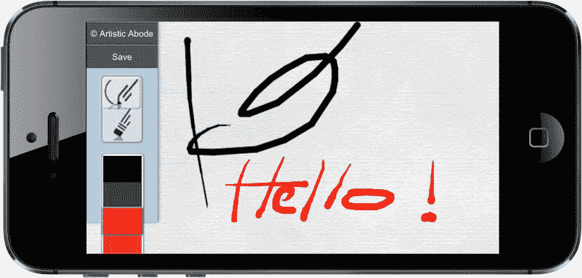
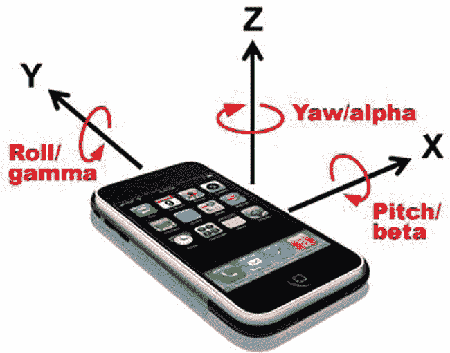

# 10.移动 JavaScript 开发

在最近几年的所有技术进步中，很少有哪一项能像移动智能手机和平板电脑革命那样影响深远。行业趋势表明，台式电脑的销售正在下降，而移动设备的采用正在以极快的速度增长。对许多人来说，在小屏幕设备上上网比在台式机上更频繁。我们需要确保跟上这种变化，使我们的网站和应用程序适应我们用户的需求，他们中的许多人很快就会熟悉通过手指访问的万维网。

在本章中，我们将学习移动设备 web 开发的限制以及如何克服这些限制，如何通过 JavaScript 从这些设备上的传感器访问数据，如何处理网络问题和不良连接，最后，如何调整我们的 JavaScript 以适应采用响应式设计原则和技术的网站。

## 移动网络发展的制约因素

由于设备比台式电脑小得多，不难相信在移动设备的设计和构造中会做出一些妥协。其中一些损害与设备本身的技术有关，一些损害是用于在设备和最近的手机发射塔或 WiFi 网络之间传输数据的网络的连锁效应。了解这些限制可以让我们调整我们的网站和应用程序开发，以尽量减少它们的影响，并为我们的最终用户提供最佳体验。

### 电池寿命

在撰写本文时，大多数智能手机电池在正常情况下只能给用户一两天的电池寿命。性能密集型应用和网站消耗的电池电量可能会超过设备空闲时的标准功耗。

我们需要在网站和应用程序中构建代码，尽可能减少对电池寿命的影响。这包括尽可能少地更新页面的显示区域，并尽可能少地执行 JavaScript 来提供所需的用户体验。避免使用 JavaScript 在页面上执行动画和过渡；如果这些是必要的，使用 CSS3 转场( [`http://bit.ly/css_trans`](http://bit.ly/css_trans) )和动画( [`http://bit.ly/css_anims`](http://bit.ly/css_anims) )来代替，它们更有效地利用 CPU，节省电池。如果您打算从移动设备的传感器访问数据，如地理位置或方向，请仅在您实际需要的时间内偶尔访问这些值，并在您不再需要访问数据时断开代码中任何事件侦听器的连接。使用第 4 章中[讨论的事件框架原理，在传感器数据频繁变化时执行较少的代码。](04.html)

### 网络带宽速度和延迟

移动网络提供商宣传的速度并不总是与现实相符，你可能不会对此感到惊讶。事实是，移动设备的连接速度可能会受到许多因素的限制，包括与您所连接的手机信号发射塔的距离、连接到同一发射塔的其他人的数量以及环境因素，如天气和周围建筑物的密度。在现代 4G/LTE 移动网络中，速度问题变得不那么尖锐，因为潜在的数据传输速率要高得多；然而，影响设备感知网络速度的另一个因素是延迟，即 HTTP 数据包从设备到达服务器并返回所需的时间。WiFi 和有线网络的延迟很低，这意味着客户端-服务器通信很快，感觉响应很快；然而，在移动网络上，延迟是一个更大的问题，主要是因为设备和手机信号塔之间的距离要远得多。

低延迟会影响网站或应用程序发出的每一个 HTTP 请求。因此，你的请求越多，你的应用程序的响应就越慢，因为完整的页面需要更长的时间来呈现。记住这一点，尽可能将 JavaScript 文件缩小并连接在一起用于页面加载，并使用第 4 章和第 9 章中介绍的技术在需要时卸载不必要的脚本以按需加载。以同样的方式缩小和连接 CSS 文件(在 [`http://bit.ly/css_min`](http://bit.ly/css_min) 尝试 CSS 缩小器)，并将图像文件合并到精灵中(在 [`http://bit.ly/css_sprite`](http://bit.ly/css_sprite) 中详细解释了该技术)，如果可能，或者使用 base64 编码直接从 CSS 文件中引用较小的图标大小的图像文件作为数据 URIs(在 [`http://bit.ly/data_uris`](http://bit.ly/data_uris) 阅读更多关于 base64 编码和数据 URIs 的信息)。浏览器对每个域名同时下载的文件数量有限制，因此通过在多个域之间分割资源，可以同时下载更多文件，这一过程称为并行化。然而，这是一项需要非常小心使用的技术，因为每次 DNS 查找都需要时间，并且会增加页面加载的总延迟。通过尝试同时下载大量文件，没有一个文件会在合理的时间内完成下载的风险会增加，因为可用的网络带宽分布在所有文件上。明智地使用这种并行化技术，因为它很容易产生与预期相反的效果。确保您的 web 服务器支持 JavaScript 和 CSS 文件的缓存和 help 压缩，因为这将有助于减少每次从服务器加载的数据量。在这一章的后面，我们将看看如何使用 HTML5 应用程序缓存来存储文件，以减少页面每次请求 HTTP 的次数。

### 板载内存大小

在最近的智能手机普及浪潮之前，Web 开发人员不必担心设备上的可用内存量；一段时间以来，桌面设备已经容纳了相当数量的内存，足够用。在撰写本文时，大多数入门级台式计算机现在都配有 2GB 的板载内存，而最高端的移动设备只有大约 512MB。也不是所有的可用内存都可以被网页访问，因为它必须在操作系统和其他后台应用程序和进程之间共享。实际上，一个 512MB 的设备可能只有不到一半的空间可用于实际的前台运行应用程序。

考虑图像；一旦从服务器上下载了图像，它就会以未压缩的像素数据形式出现在设备的内存中。包含大量图像的网页会消耗更多的设备可用内存，图像越大，使用的内存就越多。因此，在通过网络将大图像传输到移动设备上，然后在页面上将它们调整得更小时要小心，因为它们与大得多的图像消耗相同的内存量。这同样适用于 JavaScript，它可能会被压缩以更有效地传输数据，但一旦它到达设备，就会被解压缩并存储在内存中。确保不要为了显示页面而传输过多或过大的文件，因为每个文件都会消耗内存。当内存被填满时，操作系统将试图通过关闭未使用的后台任务和应用来释放内存，从而影响用户移动体验的响应性和便利性。

除了标准处理器之外，许多移动设备还配备了图形处理器(GPU ),每个处理器都有自己分配的内存。通过将清单 10-1 所示的 CSS 转换应用到包含图像的元素，可以将图像卸载到图形内存中，在那里对图像进行硬件加速。

清单 10-1。将可视页面元素卸载到图形内存的 CSS 规则

`.element {`

`/* enforces hardware acceleration on the GPU */`

`-webkit-transform: translateZ(0); /* Vendor-specific prefix for Safari 3.1+ / Chrome */`

`-moz-transform: translateZ(0); /* Vendor-specific prefix for Firefox 3.5 - 15 */`

`-ms-transform: translateZ(0); /* Vendor-specific prefix for Internet Explorer 9 */`

`-o-transform: translateZ(0); /* Vendor-specific prefix for Opera 10.50—12.00 */`

`transform: translateZ(0);  /* Standard rule (Firefox 16+, IE 10+, Opera 12.10+) */`

`}`

但是，使用这种技术时要小心，并且要有限度，因为硬件合成图像占用的视频内存是标准内存中相同图像的四倍，对应于 GPU 上单独显示的图像中的红色、蓝色、绿色和 alpha 通道。

### 操作系统响应能力

我们网站和应用程序的用户希望他们的应用程序有一定程度的响应能力。轶事证据表明，如果用户在 300 毫秒内没有收到动作的反馈，他们会感到明显的滞后，并对应用程序形成负面印象。出于这个原因，他们与页面的任何交互都必须在这个时间段内产生一些可见的反应。如果他们点击了一个触发 Ajax 调用的按钮，但是由于延迟或连接速度的原因，该调用在 300 毫秒内没有产生响应，那么您应该在页面上显示一个指示器，表明后台正在发生一个操作。这可以采取纺车指示器的形式，尽管许多开发人员和设计师选择使用新一代的指示器，如蒂姆·霍尔曼在线在 [`http://bit.ly/loaders_and_spinners`](http://bit.ly/loaders_and_spinners) 收集和策划的指示器。

让这个问题更加复杂的是，大多数移动设备上的标准`click`事件处理程序直到用户在屏幕上点击后抬起手指 300 毫秒后才被触发。这种延迟是有意的，因为设备需要等待以查看用户是否想要双击屏幕来触发不同的动作，例如页面缩放；如果没有延迟，每个动作都将被解释为单击。为了在用户轻击屏幕后抬起手指的瞬间触发一个动作，将你的代码连接到`touchend`事件，而不是`click`事件，尽管要记住这对想要双击屏幕上该元素的用户来说意味着什么。

## 使用 JavaScript 访问移动设备传感器

正如我们人类依靠我们的感官为我们提供关于我们环境的数据一样，智能手机和平板设备也使用自己的数字感官——触摸屏、地理位置、方位、方向和运动——来提供交互，并根据用户及其现实世界的环境来定制应用程序和游戏。添加外部附件可以给移动设备带来更多的感官体验——这些包括:健康附件，如测量血糖水平( [`http://bit.ly/bg_module`](http://bit.ly/bg_module) )或跟踪血压([`http://bit.ly/blood_pressure`](http://bit.ly/blood_pressure))；健身的附加装置，如心率监测器( [`http://bit.ly/hr_monitor`](http://bit.ly/hr_monitor) )和鞋内传感器([`http://bit.ly/nike_ipod`](http://bit.ly/nike_ipod))；以及用于小型企业的附加设备，例如用于接受支付的信用卡读卡器( [`http://bit.ly/cc_readers`](http://bit.ly/cc_readers) )。

web 开发人员可以通过三种主要方式访问内置设备传感器报告的数据:

*   为他们希望支持的每个平台(例如 Google Android、Apple iOS、Microsoft Windows Phone)使用本地操作系统应用程序编程接口(API)。
*   使用 PhoneGap ( [`http://phonegap.com`](http://phonegap.com/) )之类的框架，这使得开发人员可以在 HTML5 中编写一次代码，并将其重新编译为适用于每个操作系统和设备的原生应用，使用原生 API 进行交互。
*   可以使用标准化的 web 标准 API(API 的细节通过 [`http://bit.ly/1aIQV0x`](http://bit.ly/1aIQV0x) )来访问传感器数据，这些 API 可以在移动浏览器中使用 JavaScript 与不同的设备一起工作，例如 iOS 的 Mobile Safari、Android 的 Chrome、Windows Phone 的 IE、Opera Mobile 和 Firefox 等。

第三种基于 web 标准的方法的优势在于，它避开了每次更新应用程序或发布漏洞修复时都要经过应用程序商店审批流程的要求。用户也不必手动更新他们的应用程序(它可以自动完成)，它仍然允许构建功能性和美观的应用程序。这是最吸引我的方法，我将在本节中详细介绍。

我将依次讨论每个传感器，并描述如何通过 JavaScript 访问其数据，给出真实世界的使用示例，并提供一些我的个人经验以获得最佳结果。请参考移动 HTML5 兼容性表( [`http://mobilehtml5.org`](http://mobilehtml5.org/) )了解当前哪些浏览器和设备支持访问传感器数据的完整详细信息。

### 访问地理定位传感器

地理定位传感器是移动地图应用背后的动力，定位用户在地球上的位置，以帮助他们绘制通往不同目的地的路线。该传感器使用多种方法的组合，可能包括 WiFi 定位(通过 [`http://bit.ly/wifi_positioning`](http://bit.ly/wifi_positioning) 读取更多)、GSM 蜂窝塔三角测量(通过 [`http://bit.ly/mobile_tracking`](http://bit.ly/mobile_tracking) 读取更多)、GPS 卫星定位(通过 [`http://bit.ly/gps_triangulate`](http://bit.ly/gps_triangulate) 读取更多)来检索代表用户位置的经纬度坐标。为了保护用户的隐私，网站或应用程序在从地理位置传感器访问数据之前必须请求许可(通过 [`http://bit.ly/geo_api`](http://bit.ly/geo_api) 指定 W3C 指南)。用户会看到一个对话框，询问他们是否允许访问他们的位置，如图 [10-1](#Fig1) 所示，这是向苹果 iOS 7 用户显示的。

图 10-1。

Operating system dialog asking the user to permit access to their location from a website

使用这些地理位置数据，开发人员可以改善他们网站或应用程序的用户体验，例如，在 web 表单中自动预填充城市和国家字段，或者查找用户附近的电影院在什么时间上映什么电影。将这些数据与谷歌地图 API(使用说明通过 [`http://bit.ly/maps_api`](http://bit.ly/maps_api) )结合使用，意味着我们可以构建专用的地图和路线应用程序，当用户改变位置时，这些应用程序会动态更新用户界面。知道位置还使网络应用程序能够使用 Panoramio API(通过 [`http://bit.ly/panoramio_api`](http://bit.ly/panoramio_api) 的使用说明)或训练助手(通过 [`http://bit.ly/exercise_app`](http://bit.ly/exercise_app) 跟随教程)显示在用户附近区域拍摄的照片，以计算跑步者跑完一定距离需要多长时间，并能够与过去和未来的跑步进行比较。

W3C 地理定位 API ( [`http://bit.ly/w3c_geo_api`](http://bit.ly/w3c_geo_api) )允许我们通过 JavaScript 访问用户的位置坐标，提供一次性的位置锁定，或者在用户移动时持续跟踪用户的能力。浏览器的`navigation.geolocation.getCurrentPosition()`方法只执行一次传递给它的回调函数，该函数接收用户的位置坐标，而`navigation.geolocation.watchPosition()`方法在每次用户位置改变时执行一次传递的回调函数，从而允许地理位置监控。该 API 还允许我们确定返回坐标的准确性，并指定我们是希望位置被正常返回还是以高精度返回。

Note

精确定位将花费更长的时间来确定用户，并且在此过程中可能会消耗更多的设备电池电量。

清单 10-2 中的例子显示了如何使用这个 API 根据用户的位置动态更新屏幕上的地图，为了简单起见，使用了谷歌的静态地图 API(使用说明通过 [`http://bit.ly/static_maps`](http://bit.ly/static_maps) )。它假设它正在 HTML 页面的上下文中运行，它将在该页面中放置地图切片图像。

清单 10-2。访问地理定位传感器并在地图上显示位置

`// Create a  element on the page to display the map tile in`

`var mapElem = document.createElement("img");`

`// Define a function to execute once the user's location has been established,`

`// plotting their latitude and longitude as a map tile image`

`function successCallback(position) {`

`var lat = position.coords.latitude,`

`long = position.coords.longitude;`

`mapElem.setAttribute("src", "`[`http://maps.googleapis.com/maps/api/staticmap?markers`](http://maps.googleapis.com/maps/api/staticmap?markers)T2】

`}`

`// Define a function to execute if the user's location couldn't be established`

`function errorCallback() {`

`alert("Sorry - couldn't get your location.");`

`}`

`// Detect the Geolocation API before using it—'feature detection'—exposed in the`

`// navigator.geolocation object in the browser`

`if (navigator.geolocation) {`

`// Start watching the user's location, updating once per second (1s = 1000ms)`

`// and execute the appropriate callback function based on whether the user`

`// was successfully located or not`

`navigator.geolocation.watchPosition(successCallback, errorCallback, {`

`maximumAge: 1000`

`});`

`// Size the map tile image element and add it to the current page`

`mapElem.setAttribute("width", 300);`

`mapElem.setAttribute("height", 300);`

`document.body.appendChild(mapElem);`

`}`

为了防止 JavaScript 错误，我们使用功能检测来确保在针对其 API 编码之前可以访问地理位置传感器，在代码周围使用简单的`if`语句，浏览器可能支持也可能不支持。可以在页面加载时请求访问用户的位置，但最好避免这样做，因为这会迫使他们在知道如何使用之前选择共享他们的位置，从而引起怀疑。为用户提供一个按钮，让他们按下就可以访问他们的位置，这让他们对网站或应用程序有更强的控制感，这使他们更有可能授予权限。

如果用户拒绝访问他们的位置，您可以使用基于 IP 的回退(例如在 [`http://freegeoip.net`](http://freegeoip.net/) 的 FreeGeoIP)来定位他们在城市或国家级别的大致位置。如果这不合适，礼貌地向用户解释，在他们授予你权限之前，你不能向他们提供某些特定的功能，这样让他们觉得他们可以控制自己的数据以及数据的使用方式。

#### 地理定位的进一步阅读

如果您想了解 W3C 地理定位 API 的更多信息，下面的链接将帮助您更深入地了解这个迷人的传感器。

*   Mozilla 开发者网络上的“使用地理定位”(通过 [`http://bit.ly/using_geo`](http://bit.ly/using_geo) )
*   Jef Claes 的“地理定位 API 的异常处理”(通过 [`http://bit.ly/geo_exception`](http://bit.ly/geo_exception) )
*   “使用地理定位 API 的简单行程表”，作者 Michael Mahemoff，HTML5 Rocks (via [`http://bit.ly/trip_meter`](http://bit.ly/trip_meter) )

### 访问触摸传感器

触摸屏允许用户以简单自然的方式控制他们的移动设备的界面。屏幕下方的触摸传感器可以检测一个或多个手指的接触，并跟踪它们在屏幕上的移动。在 JavaScript 中，这种移动导致了一个`touchevent`，你可以通过 [`http://bit.ly/w3c_touch_event`](http://bit.ly/w3c_touch_event) 在 W3C 网站上读到更多。

使用 W3C 触摸事件 API ( [`http://bit.ly/w3c_touchevents`](http://bit.ly/w3c_touchevents) )在 JavaScript 中访问来自触摸传感器的数据。这使得网站和应用程序能够通过图像传送带和幻灯片来增强，例如，对手指滑动做出反应。它还允许开发先进的网络应用程序，允许人们用手指画画，如 Artistic Abode 通过 [`http://bit.ly/abode_touch`](http://bit.ly/abode_touch) 演示的一个，如图 [10-2](#Fig2) 所示，或者通过用手指翻动卡片找到配对来测试他们的记忆，如在 [`http://bit.ly/mem_vitamins`](http://bit.ly/mem_vitamins) 在线找到的 MemoryVitamins。

图 10-2。

A picture being drawn using a finger on a touchscreen with Artistic Abode’s web app

每当用户触摸、移动或从屏幕上移开手指时，浏览器中就会触发一个触摸事件，首先是手指放在屏幕上时的`touchstart`事件，当手指移动时的`touchmove`事件，最后是手指从屏幕上移开时的`touchend`事件。可以为每个事件分配事件处理函数，从而为我们的 web 应用程序创建所需的行为。除了给我们当前触摸点的位置，传感器还可以通过我们的事件处理程序告诉我们哪个页面元素被触摸，并提供当前屏幕上所有其他手指触摸的列表，那些在特定元素内的触摸，以及那些自上次触发触摸事件以来发生变化的触摸。

某些触摸动作触发移动设备本身的操作系统内的行为:例如，在图像上按住手指可能会触发上下文菜单出现，或者两个手指在页面上分开可能会触发页面缩放。如果您正在为触摸传感器编写代码，那么当触摸事件触发时，您可以使用传递给事件处理程序的`event`对象的`preventDefault()`方法，在您的事件处理程序函数中覆盖这个默认的操作系统行为。

清单 10-3 展示了如何使用触摸屏 API 来显示屏幕上任意时刻的当前触摸次数，每当一个或多个手指被添加到屏幕上或从屏幕上移除时都会更新。它假设运行在一个 HTML 页面的上下文中，并向其中添加了一个用于显示屏幕触摸次数的`
`元素。

清单 10-3。从触摸传感器访问数据

`// Create a 
 element on the page to output the total number of current touches`

`// on the screen to`

`var touchCountElem = document.createElement("p");`

`// Define an event handler to execute when a touch event occurs on the screen`

`function handleTouchEvent(event) {`

`// Get the list of all touches currently on the screen`

`var allTouches = event.touches,`

`allTouchesLength = allTouches.length;`

`// Prevent the default browser action from occurring`

`// when the user touches and holds their finger on the screen`

`if (event.type === "touchstart") {`

`event.preventDefault();`

`}`

`// Write the number of current touches onto the page`

`touchCountElem.innerHTML = "There are currently " + allTouchesLength + " touches on the screen.";`

`}`

`// Add the output 
 element to the current page`

`document.body.appendChild(touchCountElem);`

`// Assign the event handler to execute when a finger touches (touchstart) or is removed`

`// from (touchend) the screen`

`window.addEventListener("touchstart", handleTouchEvent, false);`

`window.addEventListener("touchend", handleTouchEvent, false);`

苹果 iOS 设备支持一组更高级的与手势相关的 JavaScript 事件。当用户在屏幕上捏或旋转两个或更多手指并报告数字移动了多远时，这些事件就会触发。然而，这些都是特定于设备的，因此如果您希望在不同的设备上复制这些事件，您可能会发现 JavaScript 库 Hammer.js ( [`http://bit.ly/hammer_js`](http://bit.ly/hammer_js) )很有用，它使您能够在网站和应用程序中的多个设备之间轻松使用触摸手势。

#### 触摸传感器的进一步阅读

如果您想了解更多关于 W3C touch events API 的信息，您可能会发现以下链接很有用:

*   Boris Smus 在 HTML5 Rocks 上开发多点触控浏览器( [`http://bit.ly/multitouch_dev`](http://bit.ly/multitouch_dev) )
*   Mozilla 开发者网络上的触摸事件( [`http://bit.ly/touchevents`](http://bit.ly/touchevents) )
*   在 Apple Safari Web 内容指南上处理手势事件( [`http://bit.ly/handling_events`](http://bit.ly/handling_events) )

### 访问方位和方向传感器

方位传感器确定设备被握持的方向；它还可以检测设备如何围绕三个不同的旋转轴定位，如图 [10-3](#Fig3) 所示，假设设备具有内部陀螺仪。一些设备，如苹果的 iPhone 和 iPad，也包括磁力计，有助于确定设备指向的精确方向。围绕 x 轴、y 轴和 z 轴的旋转可以分别称为滚动俯仰和偏航，或者用β、γ和α旋转的度数来表示。

图 10-3。

Rotation around the x, y, z axes of a mobile device. Source: [`http://hillcrestlabs.com`](http://hillcrestlabs.com/)

通过了解移动设备的方向，我们可以调整我们网站的功能来适应，比如在主要内容区域的上方或旁边重新定位导航菜单。JavaScript 中的 W3C 屏幕方向 API ( [`http://bit.ly/screen_orientation`](http://bit.ly/screen_orientation) )通知我们设备的当前方向，是纵向还是横向，以及它是否被倒置。它触发一个`orientationchange`事件，我们可以将代码挂入其中，在设备重定向的那一刻执行。清单 10-4 中的例子显示了如何使用屏幕方向 API 来添加一个 CSS 类到你的页面的`<body>`标签中，以指示设备是纵向的还是横向的，并允许通过它进行适当的样式改变。

清单 10-4。根据移动设备的方向更改 HTML 页面上的类名

`// Define an event handler function to execute when the device orientation changes between`

`// portrait and landscape`

`function onOrientationChange() {`

`// The device is in portrait orientation if the device is held at 0 or 180 degrees, and in`

`// landscape orientation if the device is held at 90 or -90 degrees`

`var isPortrait = window.orientation % 180 === 0;`

`// Add a class to the <body> tag of the page according to the orientation of the device`

`document.body.className += isPortrait ? " portrait" : " landscape";`

`}`

`// Execute the event handler function when the browser tells us the device has`

`// changed orientation`

`window.addEventListener("orientationchange", onOrientationChange, false);`

`// Execute the same function on page load to set the initial <body> class`

`onOrientationChange();`

如果您只想在设备重定向时更改可见的页面样式，请考虑使用 CSS 媒体查询( [`http://bit.ly/css_mq`](http://bit.ly/css_mq) )而不是 JavaScript 来实现，因为这将提供正确的关注点分离( [`http://bit.ly/concerns_web`](http://bit.ly/concerns_web) )。

使用内置陀螺仪可以让我们创建游戏的移动版本，如 Jenga ( [`http://bit.ly/jenga_game`](http://bit.ly/jenga_game) )或 Marble Madness ( [`http://bit.ly/marble_madness`](http://bit.ly/marble_madness) )来测试用户的稳定性和神经。当旋转包含陀螺仪的移动设备时，浏览器根据 W3C device orientation API([`http://bit.ly/orientation_event`](http://bit.ly/orientation_event))触发重定向事件。此事件提供的数据表示设备围绕其三个轴旋转的量，以度为单位。将这些运动数据反馈给我们的 JavaScript 代码允许我们根据程序逻辑更新显示。清单 10-5 中的代码展示了如何使用内置的陀螺仪和 DeviceOrientation API 来根据设备的精确方向旋转 3D 页面上的图像。它将一个``标签添加到当前的 HTML 页面中以显示图像。由此产生的伪 3D 效果可以在图 [10-4](#Fig4) 中看到。

清单 10-5。根据移动设备的精确方位以伪 3D 旋转图像

`// Create a  element on the page and point to an image of your choosing`

`var imageElem = document.createElement("img");`

`imageElem.setAttribute("src", "Listing10-5.jpg");`

`// Create an event handler function for processing the device orientation event`

`function handleOrientationEvent(event) {`

`// Get the orientation of the device in 3 axes, known as alpha, beta, and gamma, and`

`// represented in degrees from the initial orientation of the device on load`

`var alpha = event.alpha,`

`beta = event.beta,`

`gamma = event.gamma;`

`// Rotate the  element in 3 axes according to the device's orientation using CSS`

`imageElem.style.webkitTransform = "rotateZ(" + alpha + "deg) rotateX(" + beta + "deg) rotateY(" + gamma + "deg)";`

`}`

`// Add the  element to the page`

`document.body.appendChild(imageElem);`

`// Listen for changes to the device orientation using the gyroscope and fire the event`

`// handler accordingly`

`window.addEventListener("deviceorientation", handleOrientationEvent, false);`

图 10-4。

Running Listing 10-5, creating a pseudo-3D effect on an image using device sensors

我们可以将磁力计的数据与 CSS 旋转变换结合起来，构建一个虚拟罗盘，或者将屏幕上的地图与用户面对的方向对齐。Apple 的 Mobile Safari 浏览器提供了一个特定于 Webkit 的实验性属性，每当设备移动时，都会返回以正北度数为单位的当前指南针方向，允许我们相应地更新显示。目前没有用于访问磁力计的标准化 API，尽管这被设想为已经提到的 DeviceOrientation API 的扩展。

清单 10-6 中的代码显示了如何根据设备当前指向的方向，旋转一个表示指南针的 HTML 页面上的``标签(正北由页面上直接向上的图像表示)。

清单 10-6。根据移动设备的罗盘航向旋转图像

`// Create a  element on the page and point to an image of a compass`

`var imageElem = document.createElement("img");`

`imageElem.setAttribute("src", "Listing10-6.jpg");`

`// Create a function to execute when the compass heading of the device changes`

`function handleCompassEvent(event) {`

`// Get the current compass heading of the iPhone or iPad, in degrees from due north`

`var compassHeading = event.webkitCompassHeading;`

`// Rotate an image according to the compass heading value. The arrow pointing to due north`

`// in the image will continue to point north as the device moves`

`imageElem.style.webkitTransform = "rotate(" + (-compassHeading) + "deg)";`

`}`

`// Add the  element to the page`

`document.body.appendChild(imageElem);`

`// Observe the orientation of the device and call the event handler when it changes`

`window.addEventListener("deviceorientation", handleCompassEvent, false);`

#### 方位和方向传感器的进一步阅读

要了解更多关于方位和方向传感器的编码，请通过 [`http://bit.ly/detect_orientation`](http://bit.ly/detect_orientation) 查看 Mozilla 开发者网络网站上的“检测设备方位”。

### 访问运动传感器

移动设备的运动传感器告诉我们用户在三个线性轴(x(左右)、y(向前/向后)、z(向上/向下)上移动设备的速度，对于内置陀螺仪的设备，还告诉我们设备围绕三个旋转轴(x(β旋转角度，即滚动)、y(γ，即俯仰)和 z(α，即偏航)移动的速度。

运动传感器用于 flip-to-silence 应用程序，如 Flip4Silence(通过 [`http://bit.ly/flip4silence`](http://bit.ly/flip4silence) 通过 Google Play 提供给 Android)和游戏，如世嘉的《超级猴子球 2》(通过 [`http://bit.ly/smball2`](http://bit.ly/smball2) 在 App Store 上提供给苹果 iOS)。运动传感器开辟了各种可能性，从让用户通过摇动他们的设备来重置表格或撤销动作，到高级网络应用，如通过 [`http://bit.ly/is_quake`](http://bit.ly/is_quake) 在线找到的虚拟地震仪。

W3C DeviceMotionEvent API([`http://bit.ly/device_motion`](http://bit.ly/device_motion))规定，每当移动设备移动或旋转时，移动设备都会触发一个 JavaScript 事件，这将传递传感器数据，给出设备加速度(以米每秒平方为单位— `m/s^2`)和旋转速度(以度每秒为单位— `deg/s`)。加速度数据以两种形式给出:一种考虑重力的影响，另一种忽略重力的影响。在后一种情况下，即使完全静止不动，该设备也会报告每秒平方 9.81 米的向下加速度。清单 10-7 中的代码展示了如何使用 DeviceMotionEvent API 向用户报告设备的当前加速度。它假设运行在一个 HTML 页面的上下文中，并添加了两个`
`标签来显示运动传感器返回的值，分别是没有重力的影响和有重力的影响。

清单 10-7。访问运动传感器以显示设备在任何方向上的最大加速度

`// Create 
 elements for displaying current device acceleration values in`

`var accElem = document.createElement("p"),`

`accGravityElem = document.createElement("p");`

`// Define an event handler function for processing the device's acceleration values`

`function handleDeviceMotionEvent(event) {`

`// Get the current acceleration values in 3 axes and find the greatest of these`

`var acc = event.acceleration,`

`maxAcc = Math.max(acc.x, acc.y, acc.z),`

`// Get the acceleration values including gravity and find the greatest of these`

`accGravity = event.accelerationIncludingGravity,`

`maxAccGravity = Math.max(accGravity.x, accGravity.y, accGravity.z);`

`// Output to the user the greatest current acceleration value in any axis, as well as the`

`// greatest value in any axis including the effect of gravity`

`accElem.innerHTML = "Current acceleration: " + maxAcc + "m/s^2";`

`accGravityElem.innerHTML = "Including gravity: " + maxAccGravity + "m/s^2";`

`}`

`// Add the 
 elements to the page`

`document.body.appendChild(accElem);`

`document.body.appendChild(accGravityElem);`

`// Assign the event handler function to execute when the device is moving`

`window.addEventListener("devicemotion", handleDeviceMotionEvent, false);`

#### 运动传感器的进一步读数

要了解有关在移动设备上使用运动传感器的更多信息，请查看以下在线资料。

*   Apple Safari 开发者库的“设备运动事件类参考”( [`http://bit.ly/devicemotion`](http://bit.ly/devicemotion) )
*   Mozilla 开发者网络的“方向和运动数据解释”( [`http://bit.ly/orientaton_motion`](http://bit.ly/orientaton_motion) )

### 失踪的传感器

在撰写本文时，无论是摄像头还是麦克风传感器都无法在移动浏览器中通过 JavaScript 访问。例如，如果我们能够访问这些传感器，我们就有可能捕获用户面部的图像并分配给一个在线帐户，或者允许用户为自己录制音频笔记。

不同浏览器供应商之间的分歧是缺乏访问这些数据的标准化 API 的部分原因。然而，最近的 W3C 媒体捕获和流 API ( [`http://bit.ly/media_capture`](http://bit.ly/media_capture) )正在获得关注，并及时使开发人员能够从相机中捕获静态图像或视频流，或者从麦克风中捕获音频流(在用户允许的情况下)，以便在我们的 JavaScript 代码中使用。目前，这个 API 只在谷歌的 Chrome 浏览器和 Mozilla 的 Firefox 浏览器上可用，但支持看起来很快就会添加。通过访问浏览器中的 [`http://bit.ly/caniuse_stream`](http://bit.ly/caniuse_stream) ，查看浏览器对此功能的最新支持。

### 传感器数据的事件帧

在第 4 章的[中，我描述了处理频繁触发事件的事件框架过程，通过减少每次触发事件时执行的代码量来提高性能。当涉及到移动设备时，应该认真使用这种技术，因为移动设备不能像桌面浏览器那样快速地处理 JavaScript。如果没有帧，事件处理函数将消耗设备上额外的额外内存，并导致网站或应用程序感觉无响应。清单 10-8 显示了我们如何调整清单 10-5 中的代码，将事件框架技术应用到 DeviceOrientation API。](04.html)

清单 10-8。使用事件帧根据移动设备的精确方向旋转图像

`// Create variables to store the data returned by the device orientation event`

`var alpha = 0,`

`beta = 0,`

`gamma = 0,`

`imageElem = document.createElement("img");`

`imageElem.setAttribute("src", "Listing10-5.jpg");`

`// Update the event handler to do nothing more than store the values from the event`

`function handleOrientationEvent(event) {`

`alpha = event.alpha;`

`beta = event.beta;`

`gamma = event.gamma;`

`}`

`// Add a new function to perform just the image rotation using the stored variables`

`function rotateImage() {`

`imageElem.style.webkitTransform = "rotateZ(" + alpha + "deg) rotateX(" + beta + "deg) rotateY(" + gamma + "deg)";`

`}`

`document.body.appendChild(imageElem);`

`// Connect the event to the handler function as normal`

`window.addEventListener("deviceorientation", handleOrientationEvent, false);`

`// Execute the new image rotation function once every 500 milliseconds, instead of every time`

`// the event fires, effectively improving application performance`

`window.setInterval(rotateImage, 500);`

### 进一步利用传感器数据

使用 JavaScript 增强网站和创建基于传感器数据的网络应用的可能性和机会是巨大的。我在这里考虑了一些例子——只要有点创造力，我相信你可以想出更多的例子。尝试将来自不同传感器的数据(如地理位置和方向或运动和方向)结合起来，以帮助您构建增强的网站和 web 应用程序，从而以令人兴奋的新方式响应用户及其环境。尝试并从中获得乐趣！

## 网络连接故障和脱机状态

在移动设备上浏览网页的一个众所周知的问题是网络连接的掉线问题，特别是如果用户在运动中，例如在火车上或在汽车后座。当点击一个链接打开一个新页面时，用户很清楚网络已经断开，因为他们将看到一个移动设备上熟悉的屏幕。图 [10-5](#Fig5) 展示了这样的屏幕在苹果 iOS 7 上的样子。

图 10-5。

Network drops on mobile devices cause inconvenient experiences for those browsing the web

如果我们正在构建一个由 JavaScript 驱动的 web 应用程序，其中删除了硬页面转换以支持单页面体验，如果网络连接断开，用户将不会看到这样的屏幕，因此，作为开发人员，我们需要自己在应用程序中处理这个问题，例如，向用户指示网络连接已断开，或者将 HTTP 调用存储在缓冲区中，直到网络连接恢复。

### 检测联机和脱机状态

清单 10-9 中的代码展示了如何使用浏览器的`navigator.onLine`属性，在 JavaScript 代码执行的任何时候检测网络连接是否断开。

清单 10-9。在 JavaScript 代码执行期间的特定时间点检测网络连接的中断

`var isOnline = navigator.onLine;`

`if (isOnline) {`

`// Run code dependent on network access, for example, execute an Ajax call to the server`

`} else {`

`alert("The network has gone offline. Please try again later.");`

`}`

清单 10-9 中的代码对于包装任何网络连接代码都很有用，比如使用`XmlHttpRequest`的 Ajax 调用，或者动态创建引用外部文件资源的`<script>`、``或`<link>` DOM 元素。但是，您可能希望在屏幕上向用户显示网络是否已连接。我们可以利用网络断开和恢复时触发的两个 JavaScript 事件，分别命名为`offline`和`online`，而不是连续轮询`navigator.onLine`的值。然后，当网络状态改变时，您可以将代码挂接到这些事件上来更新页面，如清单 10-10 所示。

清单 10-10。检测 JavaScript 应用程序中任何一点的网络连接变化

`// Define a function to execute when the network drops`

`function goneOffline() {`

`alert("No network connection");`

`}`

`// Define a function to execute when the network connection returns`

`function backOnline() {`

`alert("The network connection has been restored");`

`}`

`// Connect these functions up to the relevant JavaScript events that fire when the`

`// network goes offline and back online, respectively`

`window.addEventListener("offline", goneOffline, false);`

`window.addEventListener("online", backOnline, false);`

清单 10-11 展示了我们如何将两种形式的网络连接断开检测结合到一个代码例程中，该例程在网络离线时存储 Ajax 调用，并在网络连接恢复时立即执行它们。

清单 10-11。当网络中断时堆叠 Ajax 调用，并在网络恢复时释放

`// Define a variable to store our stack of Ajax calls in if they can't be made immediately`

`// because of a dropped network connection`

`var stack = [];`

`// Define the function that makes Ajax calls`

`function ajax(url, callback) {`

`// The XMLHttpRequest class enables Ajax requests to be made in the browser`

`var xhr = new XMLHttpRequest(),`

`LOADED_STATE = 4,`

`OK_STATUS = 200;`

`// If the browser has gone offline, add the function arguments (the url and callback) to the`

`// stack for sending later`

`if (!navigator.onLine) {`

`stack.push(arguments);`

`} else {`

`// If the browser is online, make the Ajaz call`

`xhr.onreadystatechange = function() {`

`// A readyState of 4 indicates that the server response is complete`

`if (xhr.readyState !== LOADED_STATE) {`

`return;`

`}`

`// Execute the callback function if the server responded with a HTTP 200`

`// status message ("OK")`

`if (xhr.status === OK_STATUS) {`

`callback(xhr.responseText);`

`}`

`};`

`// Trigger the Ajax HTTP GET operation`

`xhr.open("GET", url);`

`xhr.send();`

`}`

`}`

`// Define a function that loops through the stack of unsent Ajax calls, sending each in turn`

`function clearStack() {`

`// Loop through the items in the stack until the stack length is 0 (a falsy value)`

`while (stack.length) {`

`// Make the Ajax call, using the data from the stack. The shift() method pulls the first`

`// item off the array and returns it, altering the original array`

`ajax.apply(ajax, stack.shift());`

`}`

`}`

`// Ensure the clearStack function executes as soon as the network connection is restored`

`window.addEventListener("online", clearStack, false);`

然后使用`ajax()`方法在代码中进行 Ajax 调用，如下所示。清单 10-11 中的代码将处理是立即进行网络调用还是等到网络连接恢复。

`ajax("/my-service-url", function(data) {`

`alert("Received the following data: " + JSON.stringify(data));`

`});`

您可以进一步修改这个示例，以允许您的网站或应用程序处理偶尔的网络中断，而不会影响用户在与您的代码交互的任何时候的体验。

### 用 Web 存储 API 保存数据

当您的 web 应用程序离线时，我们在清单 10-11 中看到了如何堆叠调用，以便一旦网络连接恢复，它们可以继续。然而，在这种情况下，用户并不知道正在发生这种情况，例如，他们发出的保存个人数据的调用没有通过服务器，而只是存储在内存中。如果他们选择关闭浏览器中的选项卡，这些内存内容将被清除，这意味着这些调用将永远不会被发送到服务器。我们需要一种方法将这个堆栈保存在内存中，即使浏览器关闭了，这样当用户将来返回应用程序时，只要网络连接，就可以从堆栈中进行调用。

持久变量存储过去是通过创建 cookiess 来处理的，cookie 是放在用户机器上的小文件，随每个 HTTP 请求一起发送到服务器。这是低效的——随每个请求发送的大 cookie 文件可能会导致应用程序的性能大大降低。今天，我们可以访问 HTML5 Web 存储 API ( [`http://bit.ly/webstorage_api`](http://bit.ly/webstorage_api) )，特别是该规范中定义的`window.sessionStorage`和`window.localStorage`对象。前者`sessionStorage`，只允许在用户浏览器会话期间存储数据。通常，一旦他们关闭浏览器，任何存储的值都会被删除。另一方面，`localStorage`对象允许数据跨会话持久化，直到被用户或应用程序删除。对象上有三种方法可以从本地存储内存块中按名称获取、设置和删除项目:分别是`getItem`、`setItem`和`removeItem`。清单 10-12 展示了如何使用这些方法将变量数据保存在内存中，即使是在浏览器关闭之后。

清单 10-12。使用 Web 存储 API 在浏览器关闭后保存数据值

`// Check to see if we have stored a value for the "favoriteBrowser" key before`

`var favoriteBrowser = window.localStorage.getItem("favoriteBrowser");`

`// If not, prompt the user to tell us their favorite web browser`

`if (!favoriteBrowser || favoriteBrowser === "") {`

`favoriteBrowser = prompt("Which is your favorite web browser?", "Google Chrome");`

`// Store their favorite browser in localStorage for next time they visit`

`window.localStorage.setItem("favoriteBrowser", favoriteBrowser);`

`}`

`// Show the user that we know what their favorite browser is, even if they told us some time ago`

`alert("Your favorite browser is " + favoriteBrowser);`

`// Ask if the user would like us to remove their favorite browser value from persistent storage`

`if (confirm("Would you like us to forget your favorite browser?")) {`

`// Remove the value from localStorage`

`window.localStorage.removeItem("favoriteBrowser");`

`}`

`getItem`、`setItem`和`removeItem`方法可以被替换成简化的、更熟悉的语法，将`localStorage`对象视为 JavaScript 中的标准对象，创建、访问和删除该对象的属性以持久化它们的数据，如清单 10-13 所示，它执行与清单 10-12 完全相同的功能。还要注意如何直接访问`localStorage`对象，而不需要通过`window`对象来获取对它的引用。

清单 10-13。访问 Web 存储 API 的另一种方法

`// Data within localStorage can be accessed as if they were properties on a standard object`

`var favoriteBrowser = localStorage["favoriteBrowser"];`

`if (!favoriteBrowser || favoriteBrowser === "") {`

`localStorage["favoriteBrowser"] = prompt("Which is your favorite web browser?", "Google Chrome");`

`}`

`alert("Your favorite browser is " + favoriteBrowser);`

`if (confirm("Would you like us to forget your favorite browser?")) {`

`// The delete keyword allows the removal of a property from localStorage`

`delete localStorage["favoriteBrowser"];`

`}`

我们可以将 Web 存储 API 应用到我们在清单 10-11 中编写的代码中，以便在网络断开时堆栈 Ajax 调用，如果用户关闭浏览器，则持久保存该堆栈，并在用户重新打开浏览器并且网络连接恢复时进行这些调用，如清单 10-14 所示。

清单 10-14。当网络中断时堆叠 Ajax 调用，并在浏览器关闭后持久化它们

`localStorage["stack"] = localStorage["stack"] || [];`

`function ajax(url, callback) {`

`var xhr = new XMLHttpRequest(),`

`LOADED_STATE = 4,`

`OK_STATUS = 200;`

`if (!navigator.onLine) {`

`// Data in localStorage is stored as strings, so to store complex data structures such`

`// as arrays or objects, we need to convert those into a JSON-formatted string first`

`localStorage["stack"].push(JSON.stringify(arguments));`

`} else {`

`xhr.onreadystatechange = function() {`

`if (xhr.readyState !== LOADED_STATE) {`

`return;`

`}`

`if (xhr.status === OK_STATUS) {`

`callback(xhr.responseText);`

`}`

`};`

`xhr.open("GET", url);`

`xhr.send();`

`}`

`}`

`function clearStack() {`

`if (navigator.onLine) {`

`while (localStorage["stack"].length) {`

`// After reading the JSON-formatted string data out of localStorage, it needs to be`

`// converted back into a complex data form for use with the ajax() function`

`ajax.apply(ajax, JSON.parse(localStorage["stack"].shift()));`

`}`

`}`

`}`

`// Check on page load if there are any previously stacked Ajax calls that could now be sent`

`window.addEventListener("load", clearStack, false);`

`window.addEventListener("online", clearStack, false);`

在开始使用这个 API 在本地添加兆字节的数据之前，有必要考虑一下浏览器对以这种方式存储的数据量的限制。每个域名最多可以在本地存储 5MB 的数据。虽然这是一个可以在许多浏览器中更改的设置，但这是默认的数量，没有办法通过 JavaScript 来更改。如果您试图使用`localStorage`写入超过 5MB 的数据，JavaScript 将抛出一个错误，并且不允许您保存额外的数据，直到您删除先前存储的数据。如果您希望以这种方式清除本地存储的全部内容，您可以调用`localStorage.clear()`方法，这将释放您的应用程序的所有可用空间，将您恢复到 5MB 的默认数据存储量。

要深入了解 Web 存储 API，请通过 [`http://bit.ly/dom_storage`](http://bit.ly/dom_storage) 阅读 Mozilla 开发者网络在线上的“DOM 存储指南”。

### HTML5 应用程序缓存

我们处理离线状态的最后一项技术是 HTML5 应用程序缓存。使用一种特殊格式的文件(称为缓存清单)，您可以在应用程序中列出要下载的特定文件，并将其存储在本地设备的缓存中，这样每次都可以从缓存中加载这些文件，而不是直接从网络中加载。这意味着，一旦您访问了一个网站或应用程序，即使您的网络连接离线，您也应该能够再次访问同一网站。这不仅有利于那些使用移动设备或网络连接不良的用户，桌面设备也可以体验到这种好处，这意味着一旦以这种方式缓存，网站几乎可以瞬间加载。

缓存清单文件是一个简单的文本文件，约定规定它应该有一个`.appcache`文件扩展名，尽管这并不是任何规范的本质或一部分。更重要的是，缓存清单文件必须使用 MIME 类型的`text/cache-manifest`，对于大多数 web 服务器来说，这意味着需要为特定的文件扩展名向服务器配置添加特定的规则。

必须通过使用`<html>`标记上的`manifest`属性引用 HTML 文件来引用清单文件:

`<html manifest="manifest.appcache">`

清单文件本身看起来像一个标准的文本文件，它的第一行必须是`CACHE MANIFEST`才能被正确识别。在它最简单的用法中，应该有一个文件列表，每行一个，然后将被缓存以备将来对同一页面的请求。如果清单文件中列出的任何文件不存在，或者在请求时返回 HTTP 错误状态(例如，404 或 500)，则整个清单文件将被视为无效，并且不会使用此机制缓存任何文件。下次加载页面时，浏览器会将清单文件视为从未见过，尝试再次下载所有引用的资源。

如果浏览器检测到自上次缓存文件以来清单文件已被更新，它将返回到 web 服务器下载任何已更改的引用文件—当它这样做时，它会为每个文件请求发送一个`If-Modified-Since` HTTP 头，这意味着只有自上一轮缓存以来被更新的文件才会在缓存中被替换。一个好的技巧是在清单文件中包含一个注释行，由行首的散列字符(`#`)表示，它引用文件的版本号和/或可选的更改日期。更新引用的文件时，更新文件中的版本号，以便浏览器检测到更改并开始检查更新的文件。如果清单文件没有更改，浏览器将继续提供文件的缓存版本，直到用户手动删除缓存。当请求过去以这种方式缓存的页面时，浏览器将首先加载页面的缓存版本，然后在后台下载更新的文件。只有在下次刷新页面时，才会加载更新的资产。这与许多人对浏览器行为的预期相反，如果检测到清单文件中的更改，他们会立即根据新的资源重新下载并呈现整个页面。

清单 10-15 显示了一个简单的缓存清单文件，列出了下次页面加载时应该加载和缓存的文件资产，无论是在线还是离线。请注意，您不需要列出引用清单文件本身的 HTML 页面，因为默认情况下会缓存该页面。

清单 10-15。一个简单的缓存清单文件

`CACHE MANIFEST`

`# Version 1.0.1 - 2013-01-02`

`/library/styles/main.css`

`/library/scripts/lib/jquery.min.js`

`/library/scripts/main.js`

`/img/background.jpg`

`/img/logo.png`

缓存清单文件可能包含三个可选部分，每个部分由标题表示:`CACHE:`、`NETWORK:`和`FALLBACK:`。`CACHE:`部分与没有列出的部分相同，也就是说，它包含应该存储在离线缓存中的列出的文件。

`NETWORK:`部分列出了需要用户在线才能访问的 URL，例如表单操作 URL、web 服务和其他网络基本文件。本节中列出的任何资源都将通过网络直接访问，完全绕过缓存。本节只需要部分 URL，所以如果一组 web 服务通过相同的基础 URL 公开，例如， [`https://api.twitter.com/1.1/`](https://api.twitter.com/1.1/) ，那么这就是需要列出的所有内容。通配符值允许使用星号(`*`)字符。

`FALLBACK:`部分列出了当网络离线时用来代替网络基本 URL 的本地缓存文件。它由文件名、URL 或模式组成，后跟在网络连接中断时使用的本地缓存文件。在最简单的情况下，对于一个静态 HTML 站点，您可以使用通配符来引用所有的`.html`文件，并让它们退回到一个单独的脱机 HTML 文件，向用户解释该站点当前在那个单独的页面上是脱机的，以获得更令人满意的用户体验。在更高级的情况下，您可以提供对任何服务器端脚本、图像、样式表、JavaScript 文件等的回退，以便在网络中断时为您的用户提供良好的体验。

清单 10-16 显示了一个更高级的缓存清单文件，它使用了可选的`CACHE:`、`NETWORK:`和`FALLBACK:`部分。

清单 10-16。包含三个部分的缓存清单文件

`CACHE MANIFEST`

`# Version 1.0.1 - 2013-10-02`

`CACHE:`

`/library/styles/main.css`

`/library/scripts/lib/jquery.min.js`

`/library/scripts/main.js`

`/img/background.jpg`

`/img/logo.png`

`# Always go straight to the network for API calls from a base /api/ URL`

`NETWORK:`

`/api/`

`# Replace a 'network online' image with a 'network offline' image when the network is down`

`FALLBACK:`

`/img/network-status-online.png /img/network-status-offline.png`

如果你想了解更多关于 HTML5 应用缓存的内容，请访问 Mozilla 开发者网站上的“使用应用缓存”一文( [`http://bit.ly/app_cache`](http://bit.ly/app_cache) )。

## 响应式设计的 JavaScript

响应式网页设计是一种新兴的设计和构建网站和应用程序的技术，它允许界面适应正在浏览的设备的特性。小屏幕设备(如智能手机)将显示适当大小和比例的用户界面，大屏幕设备上的用户也是如此。CSS3 媒体查询允许根据设备的当前特征对页面元素应用不同的样式规则。

在许多情况下，使用这种技术对网站进行视觉上的改变可能会导致界面行为的改变。可能在较大设备上完全显示的导航菜单可能在较小设备上隐藏在屏幕外，使用切换按钮来触发菜单的显示；切换按钮的行为仅适用于小屏幕视图。

通过使用浏览器的`window.matchMedia()`方法，传递要与当前显示进行比较的媒体查询或部分查询，可以基于当前活动的 CSS3 媒体查询规则执行不同的 JavaScript 代码。这将返回一个包含一个`matches`属性的`MediaQueryList`对象，如果它所代表的媒体查询在那时是活动的，那么这个属性将被设置为`true`。

如果应用的媒体查询发生变化，您将需要重新检查每个`MediaQueryList`对象的`matches`属性的状态。幸运的是，在绝大多数情况下，这应该是挂钩到浏览器窗口的`resize`事件的简单情况，如清单 10-17 所示。

清单 10-17。基于 CSS3 媒体查询执行特定的 JavaScript

`// Create MediaQueryList objects for different CSS3 Media Query rules`

`var landscapeMQL = window.matchMedia("(orientation: landscape)"),`

`smallScreenMQL = window.matchMedia("(max-width: 480px)");`

`function checkMediaQueries() {`

`// Execute specific code if the browser is now in landscape orientation`

`if (landscapeMQL.matches) {`

`alert("The browser is now in landscape orientation");`

`}`

`// Execute specific code if the browser window is 480px or narrower in width`

`if (smallScreenMQL.matches) {`

`alert("Your browser window is 480px or narrower in width");`

`}`

`}`

`// Execute the function on page load and when the screen is resized or its orientation changes`

`window.addEventListener("load", checkMediaQueries, false);`

`window.addEventListener("resize", checkMediaQueries, false);`

通过 [`http://bit.ly/matchmedia`](http://bit.ly/matchmedia) 阅读 Mozilla 开发者网络上关于 matchMedia 方法的更多信息。

## 摘要

在本章中，我们考虑了 web，特别是 JavaScript，因为它适用于用户在移动设备、智能手机或平板设备上浏览。我们已经看到了在内存、带宽、延迟和速度方面需要考虑的限制，以及如何最好地解决这些问题。我们研究了如何直接从这类设备的板载传感器中访问数据，使我们的应用能够对位置、运动、方向等做出反应。我们还了解了网络连接中断时会发生什么，以及如何在网络恢复后立即处理网络操作，从而提供流畅的用户体验。最后，我们学习了如何基于在响应网站的浏览器中应用的 CSS3 媒体查询来执行特定的 JavaScript。

以移动为中心的开发是一个不断增长的领域，随着每年新设备和操作系统更新的发布，我们可以使用开放的标准 W3C APIs 通过 JavaScript 直接访问越来越多的设备功能。确保你定期了解最新的发展，这样你才不会在这个快速发展的技术进步的世界中落后。

在下一章中，我们将了解如何使用 HTML5 Canvas drawing API 来构建桌面和移动在线游戏，而不依赖于任何第三方插件，如 Adobe Flash。