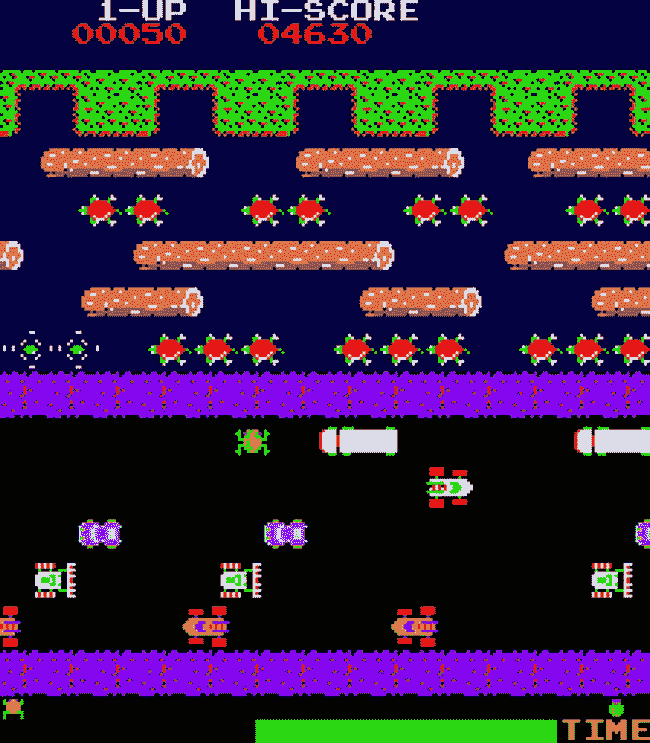
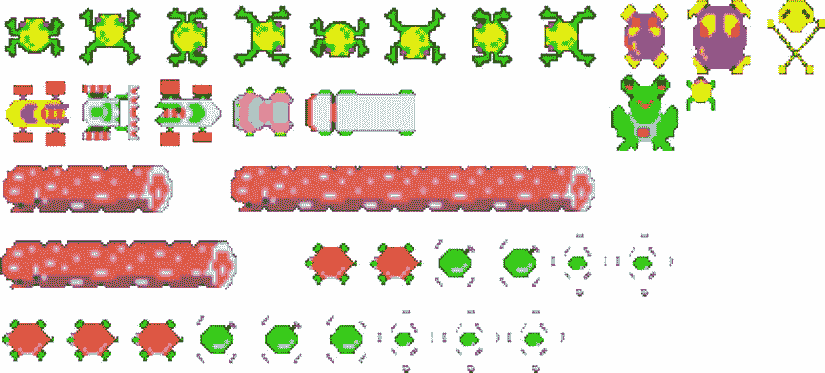

# 11.用 Canvas API 构建游戏

近年来，web 浏览器最令人兴奋的新功能之一是在 HTML5 及其相关 JavaScript API 中采用了`<canvas>`标签。单独在 HTML 文档中，它什么也不做。然而，将它与 JavaScript 的强大功能结合起来，您的页面中就有了一个空白的绘图表面，您可以向其中添加形状、图像和文本。canvas 元素的内容由平面绘图表面上的像素数据表示，而不是由文档中的单个 DOM 元素表示，因此，如果您用另一个形状覆盖现有形状，文档中不会有原始形状曾经存在的记录。通过在一段时间内在同一个画布上反复清除和重绘，并进行细微的变化，我们可以给人一种元素内的动画和运动的印象。通过将这个动画连接到触摸屏、鼠标或键盘上的控制器，我们允许用户能够操纵屏幕上发生的事情。结合一些行为逻辑，我们可以使用`<canvas>`元素来构建在浏览器中运行的游戏。在这一章中，我们将先看看 Canvas JavaScript API 中的基本绘图操作，然后再深入研究如何使用它来构建游戏的细节，包括构建经典街机游戏 Frogger 的工作版本。

## 画布中的基本绘图操作

画布表面上的所有绘制都只通过 JavaScript 进行，默认情况下所有画布都是空白的。在绘制之前，我们需要获得对 canvas 元素的二维绘制上下文的引用，这将返回对我们希望在其上绘制的表面的引用——canvas 规范的未来发展可以通过为不同的需求创建额外的上下文来实现，例如通过 WebGL 规范( [`http://webgl.org`](http://webgl.org/) )现在可以在 canvas 中实现三维图形。获取绘图上下文引用就像执行 canvas DOM 元素的`getContext()`方法一样简单，从那里可以执行许多方法来绘制形状和在画布上添加文本，如清单 11-1 所示。

清单 11-1。画布中的基本绘图操作

`// Create a new <canvas> element`

`var canvas = document.createElement("canvas"),`

`// Get a reference to the drawing context of the canvas`

`context = canvas.getContext("2d");`

`// Set the dimensions of the canvas`

`canvas.width = 200;`

`canvas.height = 200;`

`// By default, a canvas is drawn empty, however if we needed to empty its contents after`

`// drawing to it, we could execute this function`

`function emptyCanvas() {`

`// Erase the contents of the canvas from the top-left of the canvas to the position at`

`// 200px x 200px from the top-left corner`

`context.clearRect(0, 0, 200, 200);`

`}`

`// With the drawing context established, we can now execute any of the drawing commands we`

`// would like on our blank canvas. For example, if we want to draw a circle in the top-left`

`// corner of our canvas, we could execute the following function`

`function drawCircle() {`

`// First, we tell the drawing context that we're creating a path—essentially a line`

`// between one point and another that could take any course between the two points`

`context.beginPath();`

`// The context's arc() method tells the path to take an arc shape. The method’s first`

`// two parameters indicate its starting position of the arc in pixels along the x- and`

`// y-axes, respecitvely. The third parameter indicates the size of the arc, in pixels,`

`// and the final two parameters indicate the arc's start and end angle, in radians,`

`// respsecitvely. To draw a circle, the start angle will always be 0, and the end angle`

`// will always be twice the value of PI, which indicates a full 360 degrees in radians.`

`context.arc(100, 100, 100, 0, 2 * Math.PI);`

`// By default, this line's path would be invisible, however the stroke() method ensures`

`// that a visible line is drawn along the path making its outline visible. We could also`

`// have used the fill() method to fill the circle with a fixed color.`

`context.stroke();`

`}`

`// Drawing a straight line works in a similar way to drawing a circle in that we must define`

`// our line before calling the stroke() method to actually apply the graphical "ink" to the`

`// canvas`

`function drawLine() {`

`// Move the drawing context location to position 50px (from the left edge of the canvas) x 40px`

`// (from the top edge of the canvas)`

`context.moveTo(50, 40);`

`// Mark out a staright line from the context's current position to position 150px x 160px,`

`// without actually drawing a line onto the canvas`

`context.lineTo(150, 160);`

`// Apply the "ink" to the canvas to fill in the marked-out line`

`context.stroke();`

`}`

`// Define a function to draw a red square onto the canvas using the drawing context's`

`// fillRect() method, setting the draw color to use first before performing the action`

`function drawSquare() {`

`// Set the fill style of the next draw operation. #FF000 is the hex value representing red.`

`context.fillStyle = "#FF0000";`

`// Draw a 100px red square starting at position 20px x 20px`

`context.fillRect(20, 20, 100, 100);`

`}`

`// We could even add text onto our canvas using the fillText() and strokeText() drawing`

`// context methods as shown in this function`

`function writeText() {`

`// First set the font style to use for the text to draw onto the canvas`

`context.font = "30px Arial";`

`// Write some text onto the canvas at position 0px x 0px`

`context.fillStyle = "#000";`

`context.fillText("Filled Text", 0, 30);`

`// Write some outlined text onto the canvas beneath the existing text at position 0px x 40px`

`context.strokeText("Outlined Text", 0, 70);`

`}`

`// Execute the defined drawing functions, adding their shapes and text to the canvas`

`emptyCanvas();`

`drawCircle();`

`drawLine();`

`drawSquare();`

`writeText();`

`// Add the new <canvas> DOM element to the end of the current HTML page once loaded`

`window.addEventListener("load", function() {`

`document.body.appendChild(canvas);`

`}, false);`

在一个 web 页面的上下文中执行清单 11-1 中的代码会导致图 [11-1](#Fig1) 中所示的图像被添加到页面的`<canvas>`元素中。

图 11-1。

Basic drawing operations in Canvas

关于 Canvas API 中可用的绘图方法的更详细的概述，请通过 [`http://bit.ly/canvas_tutorial`](http://bit.ly/canvas_tutorial) 查看 Mozilla 开发者网络上的“Canvas 教程”。

## 高清画布元素

用于移动和桌面设备的屏幕技术的最新进展已经为这种设备带来了高清晰度图形的出现，有时称为视网膜图形，因为单个像素边界对于肉眼内的视网膜来说是不可区分的。默认情况下，画布元素不会为这种屏幕类型创建更高清晰度的图形，标准的基于画布的图形在这些屏幕上通常看起来像素化或模糊不清。幸运的是，有一些技术可以帮助我们创建高分辨率的画布元素。

为了确保您的画布只为显示它的设备屏幕呈现正确数量的像素，我们可以利用浏览器的`window`对象的`devicePixelRatio`属性。存储在该属性中的值表示当前屏幕支持的标准显示分辨率之上的分辨率因子，例如，`1`表示标准屏幕，`2`表示视网膜显示器。如果适合屏幕类型，我们使用这个值来放大我们的`<canvas>`元素的宽度和高度，像以前一样使用 CSS 来再次将其缩小到正确的大小以便显示。因此，所有绘图操作的尺寸和大小也必须适当地按该因子缩放，以便在设备上以正确的大小呈现。Paul Lewis 在 HTML5 Rocks blog 上通过 [`http://bit.ly/hidpi_canvas`](http://bit.ly/hidpi_canvas) 写了一些关于如何实现这一点的完整文档，值得一读，但是如果您确信您正在绘制的图形不是需要执行的特别密集的操作，您可以简单地创建两倍于您打算显示它的大小的画布，呈现假设这个更大大小的所有内容(即，不使用比例因子)，然后简单地使用 CSS 将画布元素的宽度和高度设置回 HTML 页面中所需的显示大小。这样，通过在较小的空间中简单地渲染更多的像素，就可以在画布上看到更高分辨率的图形。如果您的最终用户没有高清屏幕，我们会渲染不显示的额外像素，这就是为什么这种技术应该只用于不太密集的图形操作，以免影响浏览器性能。

## 使用画布构建游戏

Canvas API 的一个常见用途是构建在浏览器中运行的游戏，这曾经只是为 Adobe 的 Flash player 编写的专有代码的领域。由于该 API 在桌面和移动设备上都受到广泛支持，因此使用 Canvas API 编写的游戏也可以在移动中从浏览器中玩。

许多游戏由相似的程序和结构组成，包括:

*   游戏板或世界的存在，它定义了游戏中动作的约束
*   绘制用户控制的玩家以及游戏板上出现的任何敌人或障碍物并制作动画，并跟踪每个敌人或障碍物在游戏板上的位置
*   使用诸如按键、点击、轻敲、移动和其他相关输入设备的输入机制来控制玩家在游戏板上的移动
*   保持更新的分数、高分数，并跟踪玩家剩余的生命数和/或玩家剩余多少时间来完成该关卡
*   检测一个或多个玩家或障碍物何时在游戏板上相互碰撞，以及玩家失去生命或完成关卡或游戏的处理

现在让我们更详细地看看如何使用 Canvas API 对这些结构中的每一个进行编码，使它们能够协同工作，形成一个可工作的游戏。

### 在画布上绘制图像

大多数游戏都涉及图像在屏幕上的移动——玩家的角色很少是简单的形状，如圆形或方形，将游戏图形设计为在游戏中使用的图像可能是最容易的。这需要将图像从文件直接绘制到画布上，这可以使用画布绘制上下文的`drawImage()`方法来完成，向它传递一个对``元素的引用和画布上绘制图像的位置，如清单 11-2 所示。

清单 11-2。在画布上绘制图像

`// Create a new <canvas> element to draw the image to`

`var canvas = document.createElement("canvas"),`

`// Get the drawing context of the <canvas> element`

`context = canvas.getContext("2d"),`

`// Create a new  element to reference the image to draw onto the <canvas>`

`img = document.createElement("img");`

`// Assign a function to execute once the assigned image has loaded—the image will not begin to`

`// load until its "src" attribute has been set`

`img.addEventListener("load", function() {`

`// Draw the image onto the <canvas> element at position 0px x 0px—the top-left corner of`

`// the element`

`context.drawImage(img, 0, 0);`

`}, false);`

`// Assign the "src" attribute of the  element to point to the location of the image we wish`

`// to display within the <canvas> element. The image will then load and the event handler`

`// assigned previously will be executed`

`img.src = "filename.png";`

`// Append the new <canvas> element to the end of the current HTML page once loaded`

`window.addEventListener("load", function() {`

`document.body.appendChild(canvas);`

`}, false);`

#### 使用精灵贴图图像避免多个图像文件

避免加载在网页上一起使用的多个小图像文件的常用技术是将这些图像组合成一个精灵图，一个包含每个单独图像的较大图像。这有助于通过减少浏览器和服务器需要完成的 HTTP 请求的数量来提高性能。在一个标准网页中，通过结合使用 CSS `background-position`属性和`width`和`height`属性，可以从较大的图像中提取单独的图像进行显示。在画布上显示图像的情况下，`drawImage()`方法中使用的参数的变化允许我们从一个较大的精灵贴图图像文件中提取图像的较小部分，如清单 11-3 所示。

清单 11-3。将一个单独的图像从精灵贴图绘制到画布上

`var canvas = document.createElement("canvas"),`

`context = canvas.getContext("2d"),`

`img = document.createElement("img");`

`img.addEventListener("load", function() {`

`var individualImagePositionTop = 200,`

`individualImagePositionLeft = 150,`

`individualImageWidth = 300,`

`individualImageHeight = 40,`

`displayPositionTop = 100,`

`displayPositionLeft = 100,`

`displayWidth = 150,`

`displayHeight = 40;`

`// Draw the individual image located at position 200px x 150px and with dimensions 300px x`

`// 40px onto the <canvas> element at position 100px x 100px, rendering at half the size of`

`// the original, at 150px x 40px`

`context.drawImage(img, individualImagePositionTop, individualImagePositionLeft, individualImageWidth, individualImageHeight, displayPositionTop, displayPositionLeft, displayWidth, displayHeight);`

`}, false);`

`img.src = "sprite-map.png";`

`window.addEventListener("load", function() {`

`document.body.appendChild(canvas);`

`}, false);`

### 画布中的动画

动画是任何游戏的基本方面，Canvas API 要成为构建游戏的良好平台，它需要支持更新其中绘制的像素的位置和外观的能力。因为画布的内容只表示为固定空间中的像素，所以我们无法在不影响画布其余内容的情况下定位单个图像、形状或画布的其他部分并进行更新。为了创造动画的幻觉，我们因此需要足够频繁地重新渲染画布的内容，以使人眼察觉不到除了平滑动画之外的任何变化。我们绘制画布的每个组成部分，然后清除画布，并在固定时间后重新绘制，如果需要，将元素移动到新的位置。通过每秒重画几次，我们创造了动画的错觉。

清单 11-4 显示了一个简单的圆形移动穿过一个`<canvas>`元素的动画，它是通过每 50 毫秒重绘一次画布来创建的，每次都更新圆形的新位置。

清单 11-4。画布中的简单动画

`var canvas = document.createElement("canvas"),`

`context = canvas.getContext("2d"),`

`// Define the position, size and properties of the circle to be drawn onto the canvas`

`leftPosition = 0,`

`topPosition = 100,`

`radius = 100,`

`startDegree = 0,`

`endDegree = 2 * Math.PI; // = 360 degrees in radians`

`// Define a function to be executed periodically to update the position of the circle and redraw`

`// it in its new position`

`function animate() {`

`// Update the position on the screen where the circle should be drawn`

`leftPosition++;`

`// Empty the contents of the canvas`

`context.clearRect(0, 0, canvas.width, canvas.height);`

`// Draw the circle onto the canvas at the new position`

`context.beginPath();`

`context.arc(leftPosition, topPosition, radius, startDegree, endDegree);`

`context.stroke();`

`}`

`// Execute the animate() function once every 50 milliseconds, redrawing the circle in its`

`// updated position each time`

`setInterval(animate, 50);`

`// Add the <canvas> element to the current page once loaded`

`window.addEventListener("load", function() {`

`document.body.appendChild(canvas);`

`}, false);`

### 游戏控制

所有游戏都会对来自游戏设备的某种形式的输入做出反应——否则它们会很无聊。最常见的是，这包括控制一个主要角色，试图使用某种形式的灵巧来确保角色达到某个目标，避免途中的敌人和障碍。在台式计算机上，按下键盘上的特定键或者通过移动或点击鼠标来控制角色的位置。在移动设备上，可以通过在触摸屏上点击，或者以某种方式旋转或移动设备来控制字符。因为基于画布的游戏可以在这两种类型的设备上运行，所以您应该确保您创建的任何游戏都可以由任何类型的设备上的输入类型来控制。

清单 11-5 展示了如何在一个基于画布的游戏中捕捉特定的按键或轻击来控制玩家。

清单 11-5。捕捉输入以控制游戏中的角色

`var canvas = document.createElement("canvas");`

`// Define a function call to move the player’s character in the <canvas>`

`function move(direction) {`

`// Insert code here to update the position of the character on the canvas`

`}`

`// When the player presses the arrow keys on the keyboard, move the player's`

`// character in the appropriate direction`

`window.addEventListener("keydown", function(event) {`

`// Define the key codes for the arrow keys`

`var LEFT_ARROW = 37,`

`UP_ARROW = 38,`

`RIGHT_ARROW = 39,`

`DOWN_ARROW = 40;`

`// Execute the move() function, passing along the correct direction based on the`

`// arrow key pressed. Ignore any other key presses.`

`if (event.keyCode === LEFT_ARROW) {`

`move("left");`

`} else if (event.keyCode === RIGHT_ARROW) {`

`move("right");`

`} else if (event.keyCode === UP_ARROW) {`

`move("up");`

`} else if (event.keyCode === DOWN_ARROW) {`

`move("down");`

`}`

`}, false);`

`// When the player taps in certain places on the <cavnas> on their touch-sensitive`

`// screen, move the player's character in the appropriate direction according to where the`

`// screen has been tapped`

`canvas.addEventListener("touchstart", function(event) {`

`// Get a reference to the position of the touch on the screen in pixels from the`

`// top-left position of the <canvas>`

`var touchLeft = event.targetTouches[0].clientX,`

`touchTop = event.targetTouches[0].clientY;`

`// Execute the move() function, passing along the correct direction based on the`

`// position tapped on the <canvas> element`

`if (touchLeft < (canvas.width / 8)) {`

`move("left");`

`} else if (touchLeft > (3 * canvas.width / 8)) {`

`move("right");`

`} else if (touchTop < (canvas.height / 8)) {`

`move("up");`

`} else if (touchTop > (3 * canvas.height / 8)) {`

`move("down");`

`}`

`}, false);`

`// Add the <canvas> element to the current HTML page once loaded`

`window.addEventListener("load", function() {`

`document.body.appendChild(canvas);`

`}, false);`

### 冲突检出

到目前为止，我们已经看到了如何在`<canvas>`元素上绘制、动画和控制游戏的图形元素，接下来要处理的是当玩家的角色接触到障碍物或敌人时会发生什么——在游戏开发的说法中，这被称为碰撞。在许多游戏中，当玩家的角色与敌方角色相撞时，会受到一些伤害或可能失去一条生命。因为`<canvas>`元素只包含像素数据，所以我们无法简单地通过使用 JavaScript 扫描元素的可视内容来区分字符。我们在游戏中需要做的是保持我们的主角和所有障碍和敌人的位置，因为我们无论如何都要计算他们在动画序列中的下一个动作。我们可以获得每个元素的位置，并使用一个函数来比较它们，以确定玩家角色周围的边界是否与障碍物或敌人角色周围的边界相交。清单 11-6 中的代码显示了一个示例函数，它可以用来判断玩家和`<canvas>`中的另一个元素之间是否发生了冲突。

清单 11-6。简单碰撞检测

`// Define a function to establish if the bounds of the player’s character intersects with those`

`// of an obstacle or enemy, causing a collision`

`function intersects(characterLeft, characterWidth, characterTop, characterHeight, obstacleLeft, obstacleWidth, obstacleTop, obstacleHeight) {`

`// Define Boolean variables to indicate whether a collision occurs on the y-axis and whether`

`// it occurs on the x-axis`

`var doesIntersectVertically = false,`

`doesIntersectHorizontally = false,`

`// Establish the bounds of the character and obstacle based on the supplied parameters`

`characterRight = characterLeft + characterWidth,`

`characterBottom = characterTop + characterHeight,`

`obstacleRight = obstacleLeft + obstacleWidth,`

`obstacleBottom = obstacleTop + obstacleHeight;`

`// A collision occurs on the y-axis if the top position of the character sits between the`

`// top and bottom positions of the obstacle or if the bottom position of the character sits`

`// between the same positions of the obstacle`

`if ((characterTop > obstacleTop && characterTop < obstacleBottom) ||`

`(characterBottom > obstacleTop && characterTop < obstacleBottom)) {`

`doesIntersectVertically = true;`

`}`

`// A collision occurs on the x-axis if the left position of the character sits between the`

`// left and right positions of the obstacle or if the right position of the character sits`

`// between the same positions of the obstacle`

`if ((characterLeft > obstacleLeft && characterLeft < obstacleRight) ||`

`(characterRight > obstacleLeft && characterLeft < obstacleRight)) {`

`doesIntersectHorizontally = true;`

`}`

`// A collision occurs if the character intersects the obstacle on both the x- and y-axes.`

`return doesIntersectVertically && doesIntersectHorizontally;`

`}`

### 游戏循环

游戏循环是一个根据固定持续时间重复调用的函数，本质上是游戏的核心——它更新游戏板中任何角色的位置，检查冲突，并在更新的位置呈现`<canvas>`元素中的角色。虽然玩家的输入可以在任何时候出现，以尝试更新角色在屏幕上的位置，但是只有当下一次调用游戏循环函数时，角色才基于该输入被绘制在其新位置。

确保游戏循环在特定的时间间隔运行以保持动画以固定的帧速率流畅的一种技术是使用浏览器的`setInterval()`功能，如清单 11-7 所示。

清单 11-7。使用 setInterval()函数以固定的帧速率运行游戏循环

`// Define a function to act as the game loop`

`function gameLoop() {`

`// Update character positions, check for collisions and draw characters in new positions`

`}`

`// Execute the gameLoop() function once every 50 milliseconds, resulting in a frame rate of 20`

`// frames per second (=1000/50)`

`setInterval(gameLoop, 50);`

使用`setInterval()`函数运行游戏循环的问题是，如果浏览器在再次启动之前没有及时完成执行游戏循环函数的代码，积压的代码会聚集起来，导致浏览器似乎被锁定，或者导致任何动画中出现口吃——这不是好事。幸运的是，浏览器制造商已经找到了解决这个问题的方法，这样，你就不必不顾代码对浏览器的影响而要求代码运行，浏览器可以告诉你它何时可用，何时能够处理更多的命令。这是通过调用`window`对象上的`requestAnimationFrame()`方法来实现的，向其传递一个函数，并由浏览器在下一个可用的时机执行。通过结合使用这个方法和一个定时器来确保命令按照一个固定的帧速率执行，我们给了浏览器更多的控制，允许更平滑的动画，如清单 11-8 所示。由于在规范确定之前，跨浏览器的命名存在一些差异，我们需要一个简单的 polyfill 来确保跨浏览器的操作，如清单 11-8 开头所示，它展示了一个游戏循环的例子。

清单 11-8。使用 requestAnimationFrame 运行游戏循环

`// Create a simple cross-browser polyfill for modern browsers' requestAnimationFrame()`

`// method to enable smooth, power-efficient animations. Credit to Paul Irish via`

`//`[`http://bit.ly/req_anim_frame`T3】](http://bit.ly/req_anim_frame)

`window.requestAnimationFrame = (function(){`

`return window.requestAnimationFrame || window.webkitRequestAnimationFrame || window.mozRequestAnimationFrame || function (callback){`

`window.setTimeout(callback, 1000 / 60);`

`};`

`})();`

`// Store a reference to the last time the game loop began in a local variable—initialize it`

`// to the current time`

`var lastTimeGameLoopRan = (new Date()).getTime(),`

`// Define the refresh rate we desire for our game loop to re-render our canvas within.`

`// A 20 millisecond refresh rate gives a frame rate of 50 frames per second (=1000 / 20)`

`refreshRate = 20;`

`// Define a function to act as the game loop`

`function gameLoop() {`

`// Get the current time and infer from there the difference between it and the last time`

`// the game loop ran`

`var currentTime = (new Date()).getTime(),`

`timeDifference = currentTime - lastTimeGameLoopRan;`

`// Execute this function again when the next animation frame is ready for use by`

`// the browser - keeps the game loop looping but within the confines of the browser's`

`// performance and constraints, which is ultimately best for the player`

`window.requestAnimationFrame(gameLoop);`

`// the time difference between the current execution of the gameLoop() function and`

`// its previous execution is greater than or equal to the defined refresh rate, then`

`// run the typical game loop operations`

`if (timeDifference >=refreshRate) {`

`// Update character positions, check for collisions and draw characters in`

`// new positions`

`// Update the last time the game loop ran so its next execution will occur at the`

`// correct time`

`lastTimeGameLoopRan = currentTime;`

`}`

`}`

`// Start the first run of the game loop`

`gameLoop();`

### 分层画布以获得更好的性能

对一个`<canvas>`元素的每个绘制操作都需要一定的时间来执行。如果你有一个有很多角色的复杂游戏，并且你开始意识到每一个绘制操作在性能方面都很重要，那么将这个数字乘以无数倍，因此应该尽可能地避免重绘游戏的静态部分。例如，对于一些具有静态背景的游戏，创建两个`<canvas>`元素更有意义，一个用于绘制背景，另一个用于所有定期更新的角色移动和动画。然后可以使用 CSS 将这两个元素放置在彼此之上，包含所有移动的元素放置在包含背景的元素之上，背景只需绘制一次，从不更新。

## 在画布上构建“青蛙过河”游戏

让我们使用 Canvas API 将我们所学的知识付诸实践。我们将基于 1981 年的街机经典游戏 Frogger ( [`http://bit.ly/frogger_game`](http://bit.ly/frogger_game) )构建一个简单的游戏，展示如何最好地绘制角色并制作动画，处理来自游戏控制器的输入，处理游戏中两个或更多角色之间的冲突检测，以及如何调节帧速率以保持玩家的最佳性能。

如果你不熟悉，这个游戏的目的是引导一只青蛙从下到上穿过屏幕，首先带领角色穿过一条繁忙的道路，不要碰到任何交通，然后使用漂浮的木头和偶尔浮出水面的乌龟的背越过一条河，同时避免潜伏在水中的危险，最后将我们的英雄角色送到屏幕顶部的五个目标站之一，此时屏幕底部又会创建一只新的青蛙。一旦角色进入每个目标站一次，游戏就赢了。作为控制游戏的人，用户必须确保青蛙不会被车辆撞上，不会被运出屏幕，接触到水，包括当海龟潜入水下时站在它的上面，并且角色必须在规定的时间内到达其中一个目标站。如果一个事故降临到角色身上，它的五条生命中的一条将会失去，直到一条都没有了，游戏被认为结束。

青蛙过河器中的一个典型关卡如图 [11-2](#Fig2) 所示。

图 11-2。

Frogger—the arcade classic

让我们从创建基本的 HTML 页面来存放我们的游戏开始，如清单 11-9 所示。我们在`<head>`中使用特殊格式的`<meta>`标签来固定移动设备的视口宽度。我们还需要一个自定义字体，名为“Arcade Classic”，可以从 [`http://bit.ly/arcade_font`](http://bit.ly/arcade_font) 免费下载，以在画布中显示分数和其他文本，所以我们也将它加载到这里。然后，我们创建两个`<canvas>`元素，一个容纳背景，一个容纳动画前景，并定义 CSS 将两个画布层叠在一起，确保它们以实际画布尺寸的一半显示，以支持高清显示。

清单 11-9。在画布上托管青蛙游戏的 HTML 页面

`<!DOCTYPE html>`

`<html>`

`<head>`

`<title>Frogger In Canvas</title>`

`<meta charset="utf-8">`

`<meta name="viewport" content="width=480, initial-scale=1.0">`

``

`</head>`

`<body>`

`<canvas id="background-canvas" class="canvas" width="960" height="1280"></canvas>`

`<canvas id="canvas" class="canvas" width="960" height="1280"></canvas>`

`<!-- Load in scripts here once defined -->`

`</body>`

`</html>`

有了 HTML 之后，我们从 JavaScript 开始。清单 11-10 显示了我们如何开始我们的游戏代码，通过创建一个命名空间来存放我们的代码，并定义一些关键的属性和方法用于代码的其余部分，包括观察者设计模式方法，我们将使用它在整个游戏代码中的代码模块之间进行通信。

清单 11-10。定义一个命名空间和关键属性和方法，以便在我们的游戏中使用

`// Define a namespace to contain the code for our game within a single global variable`

`var Frogger = (function() {`

`// Locate the main <canvas> element on the page`

`var canvas = document.getElementById("canvas"),`

`// Get a reference to the <canvas> element's 2-D drawing surface context`

`drawingSurface = canvas.getContext("2d"),`

`// Locate the background <canvas> element on the page`

`backgroundCanvas = document.getElementById("background-canvas"),`

`// Get a reference to the background <canvas> element's 2-D drawing surface context`

`backgroundDrawingSurface = backgroundCanvas.getContext("2d"),`

`// Get a reference to the <canvas> element's width and height, in pixels`

`drawingSurfaceWidth = canvas.width,`

`drawingSurfaceHeight = canvas.height;`

`return {`

`// Expose the <canvas> element, its 2-D drawing surface context, its width and`

`// its height for use in other code modules`

`canvas: canvas,`

`drawingSurface: drawingSurface,`

`drawingSurfaceWidth: drawingSurfaceWidth,`

`drawingSurfaceHeight: drawingSurfaceHeight,`

`// Expose the background <canvas> element's 2-D drawing surface context`

`backgroundDrawingSurface: backgroundDrawingSurface,`

`// Define an object containing references to directions the characters in our game can`

`// move in. We define it here globally for use across our whole code base`

`direction: {`

`UP: "up",`

`DOWN: "down",`

`LEFT: "left",`

`RIGHT: "right"`

`},`

`// Define the observer design pattern methods subscribe() and publish() to allow`

`// application-wide communication without the need for tightly-coupled modules. See`

`// Chapter 7 for more information on this design pattern.`

`observer: (function() {`

`var events = {};`

`return {`

`subscribe: function(eventName, callback) {`

`if (!events.hasOwnProperty(eventName)) {`

`events[eventName] = [];`

`}`

`events[eventName].push(callback);`

`},`

`publish: function(eventName) {`

`var data = Array.prototype.slice.call(arguments, 1),`

`index = 0,`

`length = 0;`

`if (events.hasOwnProperty(eventName)) {`

`length = events[eventName].length;`

`for (; index < length; index++) {`

`events[eventName][index].apply(this, data);`

`}`

`}`

`}`

`};`

`}()),`

`// Define a method to determine whether two obstacles on the game board intersect`

`// each other on the horizontal axis. By passing in two objects, each with a 'left'`

`// and 'right' property indicating the left-most and right-most position of each`

`// obstacle in pixels on the game board, we establish whether the two intersect`

`// each other - if they do, and they are both on the same row as each other on the`

`// game board, this can be considered a collision between these two obstacles`

`intersects: function(position1, position2) {`

`var doesIntersect = false;`

`if ((position1.left > position2.left && position1.left < position2.right) ||`

`(position1.right > position2.left && position1.left < position2.right)) {`

`doesIntersect = true;`

`}`

`return doesIntersect;`

`}`

`};`

`}());`

接下来的每个代码清单都需要在清单 11-9 中的 HTML 页面的`<script>`标签中被依次引用，才能看到最终的结果。

现在让我们创建我们的核心游戏逻辑，包括游戏状态，游戏循环，分数处理，以及建立玩家的剩余生命和完成关卡的剩余时间，如清单 11-11 所示。

清单 11-11。青蛙过河的核心游戏逻辑

`// Create a simple cross-browser polyfill for modern browsers' requestAnimationFrame()`

`// method to enable smooth, power-efficient animations. Credit to Paul Irish via`

`//`[`http://bit.ly/req_anim_frame`T3】](http://bit.ly/req_anim_frame)

`window.requestAnimationFrame = (function(){`

`return window.requestAnimationFrame || window.webkitRequestAnimationFrame || window.mozRequestAnimationFrame || function (callback){`

`window.setTimeout(callback, 1000 / 60);`

`};`

`})();`

`// Define the game logic module which keeps track of the game state, the players's score,`

`// the number of lives remaining, handles collisions between the player's character and`

`// other obstacles and ensures the game graphics are drawn onto the <canvas> at the`

`// right moment. This module contains the brains behind the game play and instructs other`

`// code modules to do the heavy lifting through the use of the observer design pattern.`

`(function(Frogger) {`

`// Define a variable to hold the current player's score`

`var _score = 0,`

`// Define and initialize a variable to hold the high score achieved in the game`

`_highScore = 1000,`

`// Define the number of lives the player has remaining before the game is over`

`_lives = 5,`

`// Define the number of milliseconds the player has to get their character to`

`// the goal (60 seconds). If they take too long, they will lose a life`

`_timeTotal = 60000,`

`// Define a variable to store the current time remaining for the player to reach`

`// the goal`

`_timeRemaining = _timeTotal,`

`// Define the refresh rate of the graphics on the <canvas> element (one draw every`

`// 33` 1/3 `milliseconds = 30 frames per second). Attempting to redraw too frequently`

`// can cause the browser to slow down so choose this value carefully to maintain a`

`// good balance between fluid animation and smooth playability`

`_refreshRate = 33.333,`

`// Define a variable to store the number of times the player's character has`

`// reached the goal`

`_timesAtGoal = 0,`

`// Define a variable to indicate the number of times the player's character needs`

`// to reach the goal for the game to be won`

`_maxTimesAtGoal = 5,`

`// Define a Boolean variable to indicate whether the player's movement is currently`

`// frozen in place`

`_isPlayerFrozen = false,`

`// Define a variable to store the last time the game loop ran - this helps keep`

`// the animation running smoothly at the defined refresh rate`

`_lastTimeGameLoopRan = (new Date()).getTime();`

`// Define a function to be called to count down the time remaining for the player to`

`// reach the goal without forfeiting a life`

`function countDown() {`

`if (_timeRemaining > 0) {`

`// This function will be called as frequently as the _refreshRate variable`

`// dictates so we reduce the number of milliseconds remaining by the`

`// _refreshRate value for accurate timing`

`_timeRemaining -= _refreshRate;`

`// Publish the fact that the remaining time has changed, passing along the`

`// new time remaining as a percentage - which will help when we come to display`

`// the remaining time on the game board itself`

`Frogger.observer.publish("time-remaining-change", _timeRemaining / _timeTotal);`

`} else {`

`// If the remaining time reaches zero, we take one of the player's remaining`

`// lives`

`loseLife();`

`}`

`}`

`// Define a function to be called when all the player's lives have gone and the game`

`// is declared over`

`function gameOver() {`

`// Pause the player's movements as they are no longer in the game`

`freezePlayer();`

`// Inform other code modules in this application that the game is over`

`Frogger.observer.publish("game-over");`

`}`

`// Define a function to be called when the player has reached the goal`

`function gameWon() {`

`// Inform other code modules that the game has been won`

`Frogger.observer.publish("game-won");`

`}`

`// Define a function to be called when the player loses a life`

`function loseLife() {`

`// Decrease the number of lives the player has remaining`

`_lives--;`

`// Pause the player's movements`

`freezePlayer();`

`// Inform other code modules that the player has lost a life`

`Frogger.observer.publish("player-lost-life");`

`if (_lives === 0) {`

`// Declare the game to be over if the player has no lives remaining`

`gameOver();`

`} else {`

`// If there are lives remaining, wait 2000 milliseconds (2 seconds) before`

`// resetting the player's character and other obstacles to their initial`

`// positions on the game board`

`setTimeout(reset, 2000);`

`}`

`}`

`// Define a function to be called when the player's character is required to be frozen`

`// in place, such as when the game is over or when the player has lost a life`

`function freezePlayer() {`

`// Set the local variable to indicate the frozen state`

`_isPlayerFrozen = true;`

`// Inform other code modules - including that which controls the player's`

`// character - that the player is now be frozen`

`Frogger.observer.publish("player-freeze");`

`}`

`// Define a function to be called when the player's character is free to move after`

`// being previously frozen in place`

`function unfreezePlayer() {`

`// Set the local variable to indicate the new state`

`_isPlayerFrozen = false;`

`// Inform other code modules that the player's character is now free to move around`

`// the game board`

`Frogger.observer.publish("player-unfreeze");`

`}`

`// Define a function to increase the player's score by a specific amount and update`

`// the high score accordingly`

`function increaseScore(increaseBy) {`

`// Increase the score by the supplied amount (or by 0 if no value is provided)`

`_score += increaseBy || 0;`

`// Inform other code modules that the player's score has changed, passing along`

`// the new score`

`Frogger.observer.publish("score-change", _score);`

`// If the player's new score beats the current high score then update the high`

`// score to reflect the player's new score and inform other code modules of a`

`// change to the high score, passing along the new high score value`

`if (_score > _highScore) {`

`_highScore = _score;`

`Frogger.observer.publish("high-score-change", _highScore);`

`}`

`}`

`// Define a function to execute once the player reaches the designated goal`

`function playerAtGoal() {`

`// When the player reaches the goal, increase their score by 1000 points`

`increaseScore(1000);`

`// Increment the value indicating the total number of times the player's character`

`// has reached the goal`

`_timesAtGoal++;`

`// Freeze the player's character movement temporarily to acknowledge they have`

`// reached the goal`

`freezePlayer();`

`if (_timesAtGoal < _maxTimesAtGoal) {`

`// The player must enter the goal a total of 5 times, as indicated by the`

`// _maxTimesAtGoal value. If the player has not reached the goal this many`

`// times yet, then reset the player's character position and obstacles on the`

`// game board after a delay of 2000 milliseconds (2 seconds)`

`setTimeout(reset, 2000);`

`} else {`

`// If the player has reached the goal 5 times, the game has been won!`

`gameWon();`

`}`

`}`

`// Define a function to execute when the player moves their character on the game`

`// board, increasing their score by 20 points when they do`

`function playerMoved() {`

`increaseScore(20);`

`}`

`// Define a function to be called when the game board needs to be reset, such as when`

`// the player loses a life`

`function reset() {`

`// Reset the variable storing the current time remaining to its initial value`

`_timeRemaining = _timeTotal;`

`// Release the player's character if it has been frozen in place`

`unfreezePlayer();`

`// Inform other code modules to reset themselves to their initial conditions`

`Frogger.observer.publish("reset");`

`}`

`// The game loop executes on an interval at a rate dictated by value of the`

`// _refreshRate variable (once every 50 milliseconds), in which the game board is`

`// redrawn with the character and obstacles drawn at their relevant positions on`

`// the board and any collisions between the player's character and any obstacles`

`// are detected`

`function gameLoop() {`

`// Calculate how many milliseconds have passed since the last time the game loop`

`// was called`

`var currentTime = (new Date()).getTime(),`

`timeDifference = currentTime - _lastTimeGameLoopRan;`

`// Execute this function again when the next animation frame is ready for use by`

`// the browser - keeps the game loop looping`

`window.requestAnimationFrame(gameLoop);`

`// If the number of milliseconds passed exceeds the defined refresh rate, draw`

`// the obstacles in the updated position on the game board and check for collisions`

`if (timeDifference >= _refreshRate) {`

`// Clear the <canvas> element's drawing surface - erases everything on the`

`// game board so we can redraw the player's character and obstacles in their`

`// new positions`

`Frogger.drawingSurface.clearRect(0, 0, Frogger.drawingSurfaceWidth, Frogger.            drawingSurfaceHeight);`

`if (!_isPlayerFrozen) {`

`// As long as the player's character is not frozen in place, ensure the`

`// timer is counting down, putting pressure on the player to reach the`

`// goal in time`

`countDown();`

`// Inform other code modules to check the player has not collided with an`

`// obstacle on the game board`

`Frogger.observer.publish("check-collisions");`

`}`

`// Now on our empty canvas we draw our game board and the obstacles upon it in`

`// their respective positions`

`Frogger.observer.publish("render-base-layer");`

`// After the game board and obstacles, we draw the player's character so that`

`// it is always on top of anything else on the <canvas> drawing surface`

`Frogger.observer.publish("render-character");`

`// Store the current time for later comparisons to keep the frame rate smooth`

`_lastTimeGameLoopRan = currentTime;`

`}`

`}`

`// Define a function to kick-start the application and run the game loop, which renders`

`// each frame of the game graphics and checks for collisions between the player's`

`// character and any obstacles on the game board`

`function start() {`

`// Inform other code modules of the initial state of the game's high score`

`Frogger.observer.publish("high-score-change", _highScore);`

`// Start the game loop running`

`gameLoop();`

`}`

`// Execute the start() function to kick off the game loop once the "game-load" event`

`// is fired. We'll trigger this event after we've configured the rest of our code`

`// modules for the game`

`Frogger.observer.subscribe("game-load", start);`

`// Execute the playerAtGoal() function when another code module informs us that the`

`// player has reached the goal`

`Frogger.observer.subscribe("player-at-goal", playerAtGoal);`

`// Execute the playerMoved() function when we have been informed that the player has`

`// moved their character`

`Frogger.observer.subscribe("player-moved", playerMoved);`

`// Execute the loseLife() function when we are informed by another code base that the`

`// player's character has collided with an obstacle on the game board`

`Frogger.observer.subscribe("collision", loseLife);`

`// Pass the global Frogger variable into the module so it can be accessed locally,`

`// improving performance and making its dependency clear`

`}(Frogger));`

现在让我们创建一些可重用的基础代码，用于创建我们的主要角色的图像和动画，以及从一个大的精灵图像创建游戏板上的障碍，如图 [11-3](#Fig3) 所示。您应该能够看到每个单独的图像的边界位于较大的精灵。

图 11-3。

The sprite map containing all the images required to support our game in a single file

你可以通过 [`http://bit.ly/frogger_image`](http://bit.ly/frogger_image) 下载这个精灵图片，用于本章的代码清单。清单 11-12 显示了允许我们从这个精灵图像创建单独的图像和动画的代码。

清单 11-12。从精灵图像创建图像和动画的基本代码

`// Define a "class" for creating images to place on the game board. All the individual`

`// images are stored together in a single large image file called a Sprite Map. By knowing`

`// the position within this sprite file of the image to display, together with its width`

`// and height, we can pull out the individual images for display. By only loading in a`

`// single image file we improve the loading performance of the game`

`Frogger.ImageSprite = function(startPositionLeft, startPositionTop) {`

`// Each instance stores its starting position on the game board so it can later be`

`// reset to its initial position if necessary`

`this.startLeft = startPositionLeft || 0;`

`this.startTop = startPositionTop || 0;`

`// Initialize an object property to later store any animations for this image`

`this.animations = {};`

`// Set this image to its initial state for display`

`this.reset();`

`};`

`// Define a "class" for assigning animations to an ImageSprite instance to allow any image`

`// on the game board to appear to animate. An animation is a sequence of images which will`

`// be displayed in order over a fixed time period to give the impression of movement`

`Frogger.Animation = function(options) {`

`options = options || {};`

`// Store the rate to move between the images in the animation sequence, in milliseconds`

`// - defaults to a rate of 150 milliseconds`

`this.rate = options.rate || 150;`

`// Store a Boolean value to indicate whether this animation is to loop or play once`

`this.loop = options.loop || false;`

`// Store the supplied position in pixels from the left-hand side of the spite map image`

`// where the first image in this animation sequence is located`

`this.spriteLeft = options.spriteLeft || 0;`

`// Store the animation sequence which indicates a multiple of the image with as an`

`// offset from the spriteLeft value. A sequence value of [0, 1, 2] would indicate there`

`// are three images in this animation sequence located at the position stored in the`

`// spriteLeft property, that position + the width of the sprite image, and that`

`// position + double the width of the sprite image, respectively. It is therefore`

`// expected that an animation sequence of images are stored horizontally beside each`

`// other in order within the sprite map image file`

`this.sequence = options.sequence || [];`

`};`

`// Define and initialize properties and methods to be inherited by each instance of the`

`// Frogger.Animation "class"`

`Frogger.Animation.prototype = {`

`// Define a value to indicate the current frame shown from the animation sequence.`

`// As the sequence property is an Array, this is effectively an index within that Array`

`frame: 0,`

`// Define a property to indicate whether the animation is currently playing - that is`

`// that the frame index of the animation sequence is being actively incremented at the`

`// rate supplied at initiation time`

`playing: false,`

`// Define a property to store a timer indicator to start and stop the incrementing of`

`// the frame index on demand`

`timer: null,`

`// Define a function to start playing the animation - essentially incrementing the`

`// frame index on a timer at the rate supplied upon instantiation`

`play: function() {`

`var that = this;`

`// If the animation is not currently playing, then reset it to its initial state`

`if (!this.playing) {`

`this.reset();`

`this.playing = true;`

`}`

`// Increment the current frame index of the animation on a timer at a rate given`

`// by the supplied value upon instantiation, storing a reference to the timer in`

`// the timer property so that it can be stopped at a later time`

`this.timer = setInterval(function() {`

`that.incrementFrame();`

`}, this.rate);`

`},`

`// Define a function to rewind the current frame index of the animation sequence back`

`// to the start`

`reset: function() {`

`this.frame = 0;`

`},`

`// Define a function to increment the current frame index of the animation sequence`

`incrementFrame: function() {`

`// Only increment the current frame if the animation should be playing`

`if (this.playing) {`

`// Increment the current frame index of the animation sequence`

`this.frame++;`

`// If we have reached the end of the animation sequence, stop the animation if`

`// it was not intended to loop, otherwise reset the current frame index of the`

`// animation back to the start`

`if (this.frame === this.sequence.length - 1) {`

`if (!this.loop) {`

`this.stop();`

`} else {`

`this.reset();`

`}`

`}`

`}`

`},`

`// Define a function to return the value stored in the animation sequence at the`

`// current frame index. This value will be used later on to correctly identify which`

`// individual image from the large sprite map to display within the <canvas> element`

`getSequenceValue: function() {`

`return this.sequence[this.frame];`

`},`

`// Define a function to return the number of pixels from the left-hand edge of the`

`// sprite map of the first frame of this animation. This is used in conjunction with`

`// the current value of the animation sequence and the image width to decide which`

`// image to display within the <canvas> element`

`getSpriteLeft: function() {`

`return this.spriteLeft;`

`},`

`// Define a function to stop the timer from incrementing the current frame index, and`

`// hence stop the animation from playing`

`stop: function() {`

`// Terminate the timer`

`clearInterval(this.timer);`

`// Indicate that the animation is no longer playing`

`this.playing = false;`

`}`

`};`

`// Define and initialize properties and methods to be inherited by each instance of the`

`// Frogger.ImageSprite "class" to enable individual images from a larger sprite map to be`

`// drawn onto the <canvas> element`

`Frogger.ImageSprite.prototype = {`

`// Define properties to store the current position in pixels of the image on the`

`// game board from the top and left-hand edges`

`top: 0,`

`left: 0,`

`// Define properties to store the initial position in pixels of the images on the game`

`// board from the top and left-hand edges so that the image can be returned to its`

`// initial position at a later stage if needed`

`startLeft: 0,`

`startTop: 0,`

`// Define a property containing a reference to a new  tag holding the single`

`// large sprite map image. Because this is an object, it will be shared across all`

`// instances of the Frogger.ImageSprite "class", saving on memory usage`

`sprite: (function() {`

`var img = document.createElement("img");`

`img.src = "spritemap.png";`

`return img;`

`}()),`

`// Define properties to define the default width and height, in pixels, of an`

`// individual image within the large sprite map image file`

`width: 80,`

`height: 80,`

`// Define properties denoting the location of the top and left positions, in pixels,`

`// of the individual image within the large sprite map image. Together with the width`

`// and height properties, we are able to pull out an individual image from the sprite`

`// map to display within the <canvas> element`

`spriteTop: 0,`

`spriteLeft: 0,`

`// Declare no animations by default`

`animations: null,`

`// Define a property indicating the name of the currently playing animation, if any`

`currentAnimation: "",`

`// Define a property to indicate whether the individual image represented by this`

`// object instance is currently hidden from display`

`isHidden: false,`

`// Define a function to reset this image back to its initial position and to reset any`

`// associated animation of that image`

`reset: function() {`

`// Reset the top and left position of the image on the game board back to its`

`// initial position defined upon instantiation`

`this.left = this.startLeft;`

`this.top = this.startTop;`

`// Reset any associated animations to their initial state`

`this.resetAnimation();`

`// Declare this image no longer to be hidden`

`this.isHidden = false;`

`},`

`// Define a function to associate one or more animation with this image - data is`

`// passed in as an object literal with each key representing the name of the animation`

`registerAnimation: function(animations) {`

`var key,`

`animation;`

`// Loop through the supplied object literal data indicating the animations to`

`// register`

`for (key in animations) {`

`animation = animations[key];`

`// Create instances of the Frogger.Animation "class" for each item in the`

`// supplied data object. Each item's data is passed to the "class" upon`

`// instantiation to define its animation sequence, animation rate, and other`

`// initial properties`

`this.animations[key] = new Frogger.Animation(animation);`

`}`

`},`

`// Define a function to reset any currently playing animation back to its initial state`

`resetAnimation: function() {`

`if (this.animations[this.currentAnimation]) {`

`// If an animation is currently playing, then call its reset() method to`

`// restore it to its initial state`

`this.animations[this.currentAnimation].reset();`

`}`

`// Once reset, there should be no currently playing animation`

`this.currentAnimation = "";`

`},`

`// Define a function to play a specific animation sequence by name. The name must`

`// correspond with one provided to the registerAnimation() method previously`

`playAnimation: function(name) {`

`// Set the current animation to the provided name`

`this.currentAnimation = name;`

`if (this.animations[this.currentAnimation]) {`

`// If an animation is found by the supplied name, then call its play() method`

`// to begin incrementing its current frame index using its internal timer`

`this.animations[this.currentAnimation].play();`

`}`

`},`

`// Define a function to draw the individual image onto the <canvas> element at the`

`// supplied left and top positions, in pixels. If an animation is currently playing,`

`// ensure the correct image is displayed based on that animation's current sequence`

`// value`

`renderAt: function(left, top) {`

`// Locate the animation that is currently playing, if any`

`var animation = this.animations[this.currentAnimation],`

`// If an animation is playing, get its current sequence value based on its`

`// internal frame index. If no animation is playing, assume a sequence value`

`// of 0\. This value will be multiplied by the width of the individual image`

`// within the sprite map to identify the exact image to show based on the`

`// animation's current frame index`

`sequenceValue = animation ? animation.getSequenceValue() : 0,`

`// If an animation is playing, get the location of the animation's initial`

`// frame as an offset in pixels from the left-hand edge of the sprite map image.`

`// We make an assumption that the top offset of the animation images is the`

`// same as the main image itself represented in this object instance - meaning`

`// that all frames of the animation should be positioned together with the main`

`// non-animating image on the same row of the sprite map image`

`animationSpriteLeft = animation ? animation.getSpriteLeft() : 0,`

`// Calculate the offset in pixels from the left-hand edge of the sprite map`

`// image where the individual image to display is to be found, based on whether`

`// an animation is currently playing or not. If no animation is playing, the`

`// offset will be the same as that stored in the spriteLeft property of this`

`// object instance`

`spriteLeft = this.spriteLeft + animationSpriteLeft + (this.width * sequenceValue);`

`// If the image is not currently to be considered hidden, then extract the individual`

`// image from the sprite map and draw it onto the <canvas> drawing surface at the`

`// top and left positions, in pixels, as provided to this method, when called`

`if (!this.isHidden) {`

`Frogger.drawingSurface.drawImage(this.sprite, spriteLeft, this.spriteTop, this.width,             this.height, left, top, this.width, this.height);`

`}`

`},`

`// Define a function to set the stored left and top offset positions, in pixels,`

`// indicating where on the game board the image should be displayed. These values are`

`// then used in the renderAt() method to draw the image at this position`

`moveTo: function(left, top) {`

`this.left = left || 0;`

`// Since most images are moved left and right in this game, rather than up and down,`

`// we let the top offset value be optional`

`if (typeof top !== "undefined") {`

`this.top = top || 0;`

`}`

`},`

`// Define a function return the width of the individual image we are extracting from`

`// the large sprite map image`

`getWidth: function() {`

`return this.width;`

`},`

`// Define a function to return the left and right positions, in pixels, of the image`

`// which we can use later to perform collision detection with other obstacles on the`

`// game board`

`getPosition: function() {`

`return {`

`left: this.left,`

`// The right position is derived as the left position plus the width of the`

`// individual image`

`right: this.left + this.width`

`};`

`},`

`// Define a function to hide this image from the game board by effectively stopping`

`// the drawing of the image to the <canvas> within the renderAt() method`

`hide: function() {`

`this.isHidden = true;`

`}`

`};`

现在让我们创建一个代码模块来定义游戏板的限制和参数，包括角色可以移动的范围，如清单 11-13 所示。游戏板本身本质上是一个网格，其中的障碍物固定在某个垂直网格位置，只能水平移动-玩家的角色是这个规则的一个例外，因为它能够在游戏板上上下跳跃，一次移动一个网格位置。

清单 11-13。编码游戏板参数

`// Define a code module to define the parameters of the game board itself, the number of`

`// rows and columns within the grid, along with their relative positions in pixels, and`

`// the bounds within which the player's character may move`

`(function(Frogger) {`

`// Define the width and height of each square on the game board grid, in pixels. The`

`// game board is divided into rows with different obstacles on each, and columns within`

`// which the player's character can move`

`var _grid = {`

`width: 80,`

`height: 80`

`},`

`// Define the number of rows on the game board. The top two rows contain the score,`

`// the next two contain the home base the player is attempting to reach. There then`

`// follow five rows of water-based obstacles before reaching a 'safe' row where the`

`// player's character may take refuge without obstacles. There then follow five rows`

`// of road-based obstacles before another 'safe' row, which is where the player's`

`// character starts its game from. The final row holds the remaining time and number`

`// of lives remaining. There are 17 rows, therefore, though since we start counting`

`// rows at position 0, the total number of rows is said to be 16 using the grid`

`// square defined previously`

`_numRows = 16,`

`// Define the number of columns on the game board, from left to right, based on the`

`// game board grid defined previously. The total number of columns is 12 but since`

`// we count position 0 as a column, we represent the number as 11 instead`

`_numColumns = 11,`

`// Define the limits of movement of the player's character on the game board in`

`// pixels, returning the left-, right-, top- and bottom-most positions the`

`// character can be placed. This is to ensure the player is not able to move`

`// their character onto the parts of the game board that show the score, the time`

`// remaining, etc.`

`_characterBounds = {`

`left: 0,`

`right: _numColumns * _grid.width,`

`top: 2 * _grid.height,`

`bottom: (_numRows - 2) * _grid.height`

`},`

`// Define an array containing the pixel positions of each of the 17 rows as`

`// measured from the left-most edge of the game board - each is essentially a`

`// multiple of the grid width. This allows easy access to pixel positions by`

`// row number.`

`_rows = (function() {`

`var output = [],`

`index = 0,`

`length = _numRows;`

`for (; index < length; index++) {`

`output.push(index * _grid.width);`

`}`

`return output;`

`}()),`

`// Define an array containing the pixel positions of each of the 12 columns as`

`// measured from the top-most edge of the game board - each is essentially a`

`// multiple of the grid height. This allows easy access to pixel positions by`

`// column number.`

`_columns = (function() {`

`var output = [],`

`index = 0,`

`length = _numColumns;`

`for (; index < length; index++) {`

`output.push(index * _grid.height);`

`}`

`return output;`

`}());`

`// Listen for the "game-load" event, which will be fired once all our code modules`

`// are configured`

`Frogger.observer.subscribe("game-load", function() {`

`// Publish the "game-board-initialize" event, passing along relevant information`

`// about the game board for other code modules to use to ensure they draw their`

`// images to the correct place on the board, and allow the character to only`

`// move between certain limits as defined in this code module`

`Frogger.observer.publish("game-board-initialize", {`

`// Pass across the number of rows and columns the board consists of`

`numRows: _numRows,`

`numColumns: _numColumns,`

`// Pass across arrays representing the pixel positions of each of the rows`

`// and columns on the board to simplify the drawing of images onto the <canvas>`

`// element in the correct place`

`rows: _rows,`

`columns: _columns,`

`// Pass across the width and height of each grid square on the game board`

`grid: {`

`width: _grid.width,`

`height: _grid.height`

`},`

`// Pass across the object containing the left, right, top and bottom positions`

`// in pixels which the player's character is allowed to move within on the`

`// game board`

`characterBounds: _characterBounds`

`});`

`});`

`}(Frogger));`

清单 11-14 展示了我们如何使用自定义的 Arcade Classic 字体将当前和高分以及其他文本添加到`<canvas>`元素中。通过将所有代码一起存储在一个模块中，该模块处理文本和游戏状态消息的呈现，例如“游戏结束”和“你赢了！”对于游戏板，如果在画布上呈现文本时出现问题，我们确切地知道应该在哪里查找。

清单 11-14。在游戏板上添加文本，包括分数和消息，如“游戏结束”

`// Define a code module to add text-based visuals to the game board, e.g. the score, high`

`// score, and any informative text for the player about the game state, such as "Game Over"`

`// or "You Win!"`

`(function(Frogger) {`

`// Define the text size and font name to use for the text. You can find the Arcade`

`// Classic font for download for free online at`[`http://bit.ly/arcade_font`T3】](http://bit.ly/arcade_font)

`var _font = "67px Arcade Classic",`

`// Define variables to store the current game state locally in this module`

`_score = 0,`

`_highScore = 0,`

`_gameWon = false,`

`_gameOver = false,`

`// Define a variable to store the initialized data from the game board module`

`// defined previously - this will be populated later with data from that module`

`_gameBoard = {};`

`// Define a function to render the player's score and high score to the <canvas> element`

`function renderScore() {`

`// Select the font face and size`

`Frogger.drawingSurface.font = _font;`

`// Right-align text at the position we define to draw the text at`

`Frogger.drawingSurface.textAlign = "end";`

`// Write the text "1-UP", right-aligned to the 4th column position and ending half`

`// a row down from the top of the game board in white (hex color value #FFF)`

`Frogger.drawingSurface.fillStyle = "#FFF";`

`Frogger.drawingSurface.fillText("1-UP", _gameBoard.columns[3], _gameBoard.grid.height / 2);`

`// Write out the current score in red (hex color value #F00) right-aligned beneath`

`// the "1-UP" text previously drawn to the <canvas>`

`Frogger.drawingSurface.fillStyle = "#F00";`

`Frogger.drawingSurface.fillText(_score, _gameBoard.columns[3], _gameBoard.grid.height);`

`// Write the text "HI-SCORE", right-aligned to the 8th column position and ending`

`// half a row down from the top of the game board in white (hex color value #FFF)`

`Frogger.drawingSurface.fillStyle = "#FFF";`

`Frogger.drawingSurface.fillText("HI-SCORE", _gameBoard.columns[8],         _gameBoard.grid.height / 2);`

`// Write out the current high score in red (hex color value #F00) right-aligned`

`// beneath the "HI-SCORE" text previously drawn to the <canvas>`

`Frogger.drawingSurface.fillStyle = "#F00";`

`Frogger.drawingSurface.fillText(_highScore, _gameBoard.columns[8], _gameBoard.grid.height);`

`}`

`// Define a function to render the text "GAME OVER" to the <canvas>. This will only be`

`// called when the game is over`

`function renderGameOver() {`

`// Use the Arcade Classic font as previously defined, and write the text centered`

`// around the given drawing position in white`

`Frogger.drawingSurface.font = _font;`

`Frogger.drawingSurface.textAlign = "center";`

`Frogger.drawingSurface.fillStyle = "#FFF";`

`// Write the text center aligned within the <canvas> and at the 9th row position`

`// from the top of the game board`

`Frogger.drawingSurface.fillText("GAME OVER", Frogger.drawingSurfaceWidth / 2,         _gameBoard.rows[9]);`

`}`

`// Define a function to render the text "YOU WIN!" to the <canvas> which will be called`

`// when the player has won the game by reaching the home base position five times`

`function renderGameWon() {`

`// Use the Arcade Classic font as previously defined, and write the text centered`

`// around the given drawing position in yellow (hex value #FF0)`

`Frogger.drawingSurface.font = _font;`

`Frogger.drawingSurface.textAlign = "center";`

`Frogger.drawingSurface.fillStyle = "#FF0";`

`// Write the text center aligned within the <canvas> and at the 9th row position`

`// from the top of the game board`

`Frogger.drawingSurface.fillText("YOU WIN!", Frogger.drawingSurfaceWidth / 2,         _gameBoard.rows[9]);`

`}`

`// Define a function to render the "TIME" label in the bottom-right corner of the`

`// game board`

`function renderTimeLabel() {`

`// Use the Arcade Classic font as previously defined, and write the text centered`

`// around the given drawing position in yellow (hex value #FF0)`

`Frogger.drawingSurface.font = _font;`

`Frogger.drawingSurface.textAlign = "end";`

`Frogger.drawingSurface.fillStyle = "#FF0";`

`// Write the text right aligned within the <canvas> and in the bottom right corner`

`// of the game board`

`Frogger.drawingSurface.fillText("TIME", Frogger.drawingSurfaceWidth, Frogger.        drawingSurfaceHeight);`

`}`

`// Define a function to render the text-based visuals to the game board as appropriate`

`// depending on the current game state - we'll connect this up later to be called`

`// once on every cycle of the game loop`

`function render() {`

`renderScore();`

`renderTimeLabel();`

`// Only render the "GAME OVER" text if the game is actually over`

`if (_gameOver) {`

`renderGameOver();`

`}`

`// Only render the "YOU WIN!" text if the players has won the game`

`if (_gameWon) {`

`renderGameWon();`

`}`

`}`

`// When the game logic publishes a message declaring that the player has won the game,`

`// set the local variable to indicate this also so that the "YOU WIN!" text will be`

`// drawn onto the <canvas> during any following execution of the game loop`

`Frogger.observer.subscribe("game-won", function() {`

`_gameWon = true;`

`});`

`// When the game logic module publishes a message indicating that the game has been`

`// lost, set the local variable to reflect this fact so that the "GAME OVER" text gets`

`// written to the <canvas> element on the next cycle around the game loop`

`Frogger.observer.subscribe("game-over", function() {`

`_gameOver = true;`

`});`

`// Reset the local variables indicating the game state if the game logic has forced`

`// a game state reset to occur`

`Frogger.observer.subscribe("reset", function() {`

`_gameOver = false;`

`_gameWon = false;`

`});`

`// Update the local score variable when the player's score changes throughout the`

`// course of the game. The updated score will then be written onto the <canvas> on`

`// the next cycle of the game loop`

`Frogger.observer.subscribe("score-change", function(newScore) {`

`_score = newScore;`

`});`

`// Update the local high score variable when the game's high score changes throughout`

`// the course of the game. The updated high score will then be drawn to the <canvas>`

`// on the next cycle of the game loop`

`Frogger.observer.subscribe("high-score-change", function(newHighScore) {`

`_highScore = newHighScore;`

`});`

`// Subscribe to the "game-board-initialize" event fired by the previous code module,`

`// storing the game board properties and settings in a local variable`

`Frogger.observer.subscribe("game-board-initialize", function(gameBoard) {`

`_gameBoard = gameBoard;`

`// Start listening to the "render-base-layer" event, fired from within the game`

`// loop, and execute the render() function when it occurs, drawing the text onto`

`// the game board in the appropriate position for each cycle of the game loop`

`Frogger.observer.subscribe("render-base-layer", render);`

`});`

`}(Frogger));`

该是我们把背景图像添加到背景画布上的时候了，这就是我们在清单 11-15 中要做的，以及渲染玩家剩余的生命数和玩家角色到达目标的剩余时间。因为背景是静态的，我们只会在游戏开始时绘制一次，之后就不需要再触摸或修改了。我们将用于游戏板的图像如图 [11-4](#Fig4) 所示，可以通过 [`http://bit.ly/frogger_gameboard`](http://bit.ly/frogger_gameboard) 下载与本章的代码清单一起使用。

清单 11-15。画出游戏背景，剩余生命数，剩余时间

`// Define a code module to draw the game board background image to the background <canvas>`

`// element. We will draw the image once only since it is static and will not change - all`

`// graphical elements that could change are drawn to the main <canvas> element instead.`

`(function(Frogger) {`

`// To draw an image file onto the <canvas> we need to create a new  element to`

`// contain the image first`

`var _background = document.createElement("img");`

`// Once the image has loaded, draw the image onto the background <canvas> element's`

`// drawing surface, starting at the top-left corner and covering the full width and`

`// height of the drawing surface`

`_background.addEventListener("load", function() {`

`Frogger.backgroundDrawingSurface.drawImage(_background, 0, 0, Frogger.drawingSurfaceWidth,         Frogger.drawingSurfaceHeight);`

`}, false);`

`// Setting the "src" attribute of the  causes the file to load immediately, which`

`// is why it was essential to configure our "load" event handler first. We load the`

`// file named "gameboard.gif" which contains the background of the game board. This`

`// will only be drawn once since we are not within the game loop at this point. By`

`// splitting the background out into a separate element, we avoid needing to redraw`

`// the background each time the game loop executes since it is static.`

`_background.src = "gameboard.gif";`

`}(Frogger));`

`// Define a code module to show the number of lives the player has remaining, and how much`

`// time remains before automatically losing a life, within the <canvas> element`

`(function(Frogger) {`

`// Define an array, to be populated later, which will represent the number of lives the`

`// player has remaining`

`var _lives = [],`

`// Define a variable indicating the time remaining on the countdown before the`

`// player automatically loses a life, represented as a percentage, starting at`

`// 100% and counting down to 0`

`_timeRemainingAsPercentage = 100,`

`// Define a variable for storing the game board properties and settings`

`_gameBoard;`

`// Define a subclass of Frogger.ImageSprite to represent the individual image found`

`// at position 720px from the left and 80px from the top of the sprite map image which`

`// is 40px wide by 40px tall and depicts a small frog to be used to denote a remaining`

`// life`

`function Life(left, top) {`

`// The left and top parameters indicate the starting position of this instance of`

`// the Life "class". We pass those parameters directly onto the parent`

`// Frogger.ImageSprite() constructor function`

`Frogger.ImageSprite.call(this, left, top);`

`}`

`// Inherit properties and methods from the Frogger.ImageSprite "class"`

`Life.prototype = new Frogger.ImageSprite();`

`Life.prototype.constructor = Life;`

`// Set the dimensions and location of the remaining life image from within the larger`

`// sprite map image file`

`Life.prototype.spriteLeft = 720;`

`Life.prototype.spriteTop = 80;`

`Life.prototype.width = 40;`

`Life.prototype.height = 40;`

`// Define a function to be executed when the game board has initialized, passing along`

`// the properties and settings from the game board code module`

`function initialize(gameBoard) {`

`// Define a variable representing the position from the top of the game board`

`// to display the remaining lives`

`var lifePositionTop;`

`// Store the game board properties and settings in a local variable within this`

`// code module`

`_gameBoard = gameBoard;`

`// Set the lifePositionTop variable to the appropriate position in the bottom-left`

`// corner of the game board`

`lifePositionTop = (_gameBoard.numRows - 1) * _gameBoard.grid.height;`

`// Define five lives for the player by populating the _lives array with five`

`// instances of the Life "class", each one initialized with its starting position`

`// from left to right along the bottom-left corner of the game board`

`_lives = [`

`// Each life is displayed at the same position from the top of the game board`

`// and each spaced horizontally according to the width of the individual`

`// image so they sit right beside each other`

`new Life(0, lifePositionTop),`

`new Life(1 * Life.prototype.width, lifePositionTop),`

`new Life(2 * Life.prototype.width, lifePositionTop),`

`new Life(3 * Life.prototype.width, lifePositionTop),`

`new Life(4 * Life.prototype.width, lifePositionTop)`

`];`

`// Listen for the "render-base-layer" event fired from within the game loop and`

`// execute the render() function, defined further down, when it is called`

`Frogger.observer.subscribe("render-base-layer", render);`

`}`

`// Define a function to render the number of lives remaining on the game board`

`function renderLives() {`

`var index = 0,`

`length = _lives.length,`

`life;`

`// Loop through the number of remaining lives stored in the _lives array, and`

`// call the renderAt() method of each of the Life "class" instances contained`

`// within, drawing the life on the game board at the appropriate position`

`for (; index < length; index++) {`

`life = _lives[index];`

`life.renderAt(life.left, life.top);`

`}`

`}`

`// Define a function to render the time remaining as a green rectangular bar along the`

`// bottom edge of the game board`

`function renderTimeRemaining() {`

`// Define the width of the rectangle. When full, this will be the width of 10`

`// columns on the game board. As the time remaining decreases, the width will`

`// decrease accordingly`

`var rectangleWidth = _timeRemainingAsPercentage * _gameBoard.rows[10],`

`// Define the height of the rectangle, which will always be half of one grid`

`// square on the game board`

`rectangleHeight = _gameBoard.grid.height / 2,`

`// Define the left-hand edge, in pixels, where the rectangle should be drawn`

`// from on the <canvas>. Since the countdown should appear to be decreasing`

`// from the left to the right, this will be the inverse of the time remaining`

`// percentage, multiplied by the full width of the rectangle`

`rectangleLeft = (1 - _timeRemainingAsPercentage) * _gameBoard.rows[10],`

`// Define the top edge, in pixels, where the rectangle should be drawn from`

`// on the <canvas> element. This will be the bottom edge of the game board so`

`// we need to subtract the desired height of the rectangle from the height`

`// of the game board itself`

`rectangleTop = Frogger.drawingSurfaceHeight - rectangleHeight;`

`// Set the drawing context to draw in green (hex color #0F0)`

`Frogger.drawingSurface.fillStyle = "#0F0";`

`// Draw the rectangle on the game board at the given positions`

`Frogger.drawingSurface.fillRect(rectangleLeft, rectangleTop, rectangleWidth,         rectangleHeight);`

`}`

`// Define a function to draw the remaining lives and time remaining on the game board,`

`// executed when the "render-base-layer" event is fired from within the game loop`

`function render() {`

`renderLives();`

`renderTimeRemaining();`

`}`

`// When the game logic module informs us that the player has lost a life, we remove`

`// the last entry from the _lives array, which removes the right-most life image from`

`// the bottom-left corner of the canvas, indicating the correct number of lives`

`// remaining`

`Frogger.observer.subscribe("player-lost-life", function() {`

`_lives.pop();`

`});`

`// When the game logic module informs us that the time remaining for the player to`

`// reach the goal has changed, we store the new value returned as a percentage`

`Frogger.observer.subscribe("time-remaining-change", function(newTimeRemainingPercentage) {`

`_timeRemainingAsPercentage = newTimeRemainingPercentage;`

`});`

`// When the game board initializes its properties and settings, execute the`

`// initialize() function`

`Frogger.observer.subscribe("game-board-initialize", initialize);`

`}(Frogger));`

图 11-4。

The game board background image, containing all the static elements in one image file

背景可见，并且我们的基本代码已经就绪，可以从精灵贴图中提取各个图像，现在是时候为我们的游戏板定义障碍了，包括车辆、木头、乌龟和玩家试图达到的目标，以及为每个目标显示的图像和动画。清单 11-16 显示了这一点。

清单 11-16。为游戏板上的障碍和目标创建图像和动画

`// Define a namespace to store the individual obstacles and images to place on the game`

`// board as "classes" representing the individual images from the sprite map for each`

`Frogger.Image = (function(Frogger) {`

`// Define a race car obstacle whose starting position on the x-axis can be set when`

`// instantiated`

`function RaceCar(left) {`

`Frogger.ImageSprite.call(this, left);`

`}`

`// The race car is defined as the image found in the sprite map at position 0px x 80px`

`// respectively from the left and top edges of the sprite map image file`

`RaceCar.prototype = new Frogger.ImageSprite();`

`RaceCar.prototype.constructor = RaceCar;`

`RaceCar.prototype.spriteLeft = 0;`

`RaceCar.prototype.spriteTop = 80;`

`// Define a bulldozer obstacle`

`function Bulldozer(left) {`

`Frogger.ImageSprite.call(this, left);`

`}`

`// The bulldozer is the image found at position 80px x 80px within the sprite map`

`Bulldozer.prototype = new Frogger.ImageSprite();`

`Bulldozer.prototype.constructor = Bulldozer;`

`Bulldozer.prototype.spriteLeft = 80;`

`Bulldozer.prototype.spriteTop = 80;`

`// Define a turbo race car obstacle`

`function TurboRaceCar(left) {`

`Frogger.ImageSprite.call(this, left);`

`}`

`// The turbo race car is the image found at position 160px x 80px within the sprite map`

`TurboRaceCar.prototype = new Frogger.ImageSprite();`

`TurboRaceCar.prototype.constructor = TurboRaceCar;`

`TurboRaceCar.prototype.spriteLeft = 160;`

`TurboRaceCar.prototype.spriteTop = 80;`

`// Define a road car obstacle`

`function RoadCar(left) {`

`Frogger.ImageSprite.call(this, left);`

`}`

`// The road car is the image found at position 240px x 80px within the sprite map`

`RoadCar.prototype = new Frogger.ImageSprite();`

`RoadCar.prototype.constructor = RoadCar;`

`RoadCar.prototype.spriteLeft = 240;`

`RoadCar.prototype.spriteTop = 80;`

`// Define a truck obstacle`

`function Truck(left) {`

`Frogger.ImageSprite.call(this, left);`

`}`

`// The truck is the image found at position 320px x 80px within the sprite map, with a`

`// width of 122px as opposed to the standard 80px width of the other individual images`

`Truck.prototype = new Frogger.ImageSprite();`

`Truck.prototype.constructor = Truck;`

`Truck.prototype.spriteLeft = 320;`

`Truck.prototype.spriteTop = 80;`

`Truck.prototype.width = 122;`

`// Define a short log obstacle`

`function ShortLog(left) {`

`Frogger.ImageSprite.call(this, left);`

`}`

`// The short log is the image found at position 0px x 160px within the sprite map, with`

`// a width of 190px`

`ShortLog.prototype = new Frogger.ImageSprite();`

`ShortLog.prototype.constructor = ShortLog;`

`ShortLog.prototype.spriteLeft = 0;`

`ShortLog.prototype.spriteTop = 160;`

`ShortLog.prototype.width = 190;`

`// Define a medium log obstacle`

`function MediumLog(left) {`

`Frogger.ImageSprite.call(this, left);`

`}`

`// The medium log is the image found at position 0px x 240px within the sprite map,`

`// with a width of 254px`

`MediumLog.prototype = new Frogger.ImageSprite();`

`MediumLog.prototype.constructor = MediumLog;`

`MediumLog.prototype.spriteLeft = 0;`

`MediumLog.prototype.spriteTop = 240;`

`MediumLog.prototype.width = 254;`

`// Define a long log obstacle`

`function LongLog(left) {`

`Frogger.ImageSprite.call(this, left);`

`}`

`// The long log is the image found at position 240px x 160px within the sprite map,`

`// with a width of 392px`

`LongLog.prototype = new Frogger.ImageSprite();`

`LongLog.prototype.constructor = LongLog;`

`LongLog.prototype.spriteLeft = 240;`

`LongLog.prototype.spriteTop = 160;`

`LongLog.prototype.width = 392;`

`// Define a turtle obstacle. There are two types of turtle obstacle on the game board,`

`// one representing a group of two turtles and one representing a group of three`

`// turtles. Both types of turtle obstacle have some shared behavior which is defined`

`// in this "class" which acts as a base for both obstacles to inherit from.`

`function Turtle(left) {`

`Frogger.ImageSprite.call(this, left);`

`}`

`Turtle.prototype = new Frogger.ImageSprite();`

`Turtle.prototype.constructor = Turtle;`

`// The turtles will animate and appear to dip underwater on occasion. We need to`

`// know when the turtle is underwater so that if the player's character is positioned`

`// above the turtle at that point, they will lose a life. This will be handled by the`

`// collision detection code later, but for now we just need to create a method to`

`// tell us when the turtle in underwater`

`Turtle.prototype.isUnderwater = function() {`

`var isUnderwater = false,`

`// Get a reference to the current animation of the turtle diving underwater`

`// and resurfacing`

`animation = this.animations[this.currentAnimation];`

`// The turtle is deemed to be underwater when it is showing the furthestmost image`

`// from the sprite map in the animation sequence. This is represented by the`

`// largest number in the animation frame sequence which we can get using the`

`// Math.max() method in JavaScript. If the current animation sequence value matches`

`// this furthestmost image in the sprite map, the turtle is underwater.`

`if (animation.getSequenceValue() === Math.max.apply(Math, animation.sequence)) {`

`isUnderwater = true;`

`}`

`return isUnderwater;`

`};`

`// Define an obstacle representing a group of two turtles together`

`function TwoTurtles(left) {`

`Turtle.call(this, left);`

`}`

`// Inherit from the Turtle base "class" defined previously`

`TwoTurtles.prototype = new Turtle();`

`TwoTurtles.prototype.constructor = TwoTurtles;`

`// The group of two turtles is the image found at position 320px x 240px within the`

`// sprite map, with a width of 130px`

`TwoTurtles.prototype.spriteLeft = 320;`

`TwoTurtles.prototype.spriteTop = 240;`

`TwoTurtles.prototype.width = 130;`

`// Override the reset() method to define and auto-play the animation of the turtle`

`// diving and surfacing`

`TwoTurtles.prototype.reset = function() {`

`Turtle.prototype.reset.call(this);`

`// Register the dive and surface animation which plays each frame in the sequence`

`// at a frame rate of 200 milliseconds, and loops once it reaches the end of the`

`// sequence. The numbers in the sequence represent the multiples of offset of the`

`// width of the individual image to grab the animating image from - essentially`

`// switching between a number of side-by-side images from the sprite map file to`

`// give the illusion of movement`

`this.registerAnimation({`

`"diveAndSurface": {`

`sequence: [0, 1, 2, 3, 3, 2, 1, 0, 0, 0, 0, 0, 0, 0, 0, 0, 0, 0, 0, 0],`

`loop: true,`

`rate: 200`

`}`

`});`

`// Play the animation straight away`

`this.playAnimation("diveAndSurface");`

`};`

`// Define an obstacle representing a group of three turtles together`

`function ThreeTurtles(left) {`

`Turtle.call(this, left);`

`}`

`// Inherit from the Turtle base "class" defined previously`

`ThreeTurtles.prototype = new Turtle();`

`ThreeTurtles.prototype.constructor = ThreeTurtles;`

`// The group of three turtles is the image found at position 0px x 320px within the`

`// sprite map, with a width of 200px`

`ThreeTurtles.prototype.spriteLeft = 0;`

`ThreeTurtles.prototype.spriteTop = 320;`

`ThreeTurtles.prototype.width = 200;`

`// Register the dive and surface animation as before, but animating over a greater`

`// number of frames and at a slower animation rate than with the group of two turtles`

`ThreeTurtles.prototype.reset = function() {`

`Turtle.prototype.reset.call(this);`

`this.registerAnimation({`

`"diveAndSurface": {`

`sequence: [0, 1, 2, 3, 3, 3, 2, 1, 0, 0, 0, 0, 0, 0, 0, 0, 0, 0, 0, 0, 0],`

`loop: true,`

`rate: 300`

`}`

`});`

`this.playAnimation("diveAndSurface");`

`};`

`// Define a "class" representing the frog image displayed when the player's character`

`// reaches the goal`

`function GoalFrog(left) {`

`Frogger.ImageSprite.call(this, left);`

`}`

`// The goal frog is the image found at position 640px x 80px within the sprite map`

`GoalFrog.prototype = new Frogger.ImageSprite();`

`GoalFrog.prototype.constructor = GoalFrog;`

`GoalFrog.prototype.spriteLeft = 640;`

`GoalFrog.prototype.spriteTop = 80;`

`// Override the moveTo() method so that this image cannot be moved from its place`

`// on the game board once it has been placed down`

`GoalFrog.prototype.moveTo = function() {};`

`// Define a "class" representing the goal the player will be aiming to meet with at`

`// the far end of the game board from their start position`

`function Goal(left) {`

`Frogger.ImageSprite.call(this, left);`

`}`

`// Since the goal is drawn onto the game board as part of the background <canvas>`

`// we do not need to draw it again here, so we specify the image position as being`

`// a transparent block from the sprite map image so effectively nothing is actually`

`// drawn to the canvas. We can still take advantage of the other features of the`

`// ImageSprite "class", however, to simplify collision checking later on, which`

`// will tell us when the player's character has reached a goal`

`Goal.prototype = new Frogger.ImageSprite();`

`Goal.prototype.constructor = Goal;`

`Goal.prototype.spriteLeft = 800;`

`Goal.prototype.spriteTop = 320;`

`// Override the moveTo() method so that the goal cannot be moved from its place`

`// on the game board once it has been placed down`

`Goal.prototype.moveTo = function() {};`

`// Add a custom property to this "class" to denote whether the goal instance has been`

`// met by the player's character`

`Goal.prototype.isMet = false;`

`// Expose the "classes" defined in this module to the wider code base within the`

`// Frogger.Image namespace`

`return {`

`RaceCar: RaceCar,`

`Bulldozer: Bulldozer,`

`RoadCar: RoadCar,`

`TurboRaceCar: TurboRaceCar,`

`Truck: Truck,`

`ShortLog: ShortLog,`

`MediumLog: MediumLog,`

`LongLog: LongLog,`

`TwoTurtles: TwoTurtles,`

`ThreeTurtles: ThreeTurtles,`

`GoalFrog: GoalFrog,`

`Goal: Goal`

`};`

`}(Frogger));`

定义完障碍后，就该定义代码、图像和动画来表现玩家的角色及其在游戏板上的蛙泳动作了，如清单 11-17 所示。

清单 11-17。玩家的角色

`// Define a code module to represent the player's character on the game board and to`

`// handle its movement and behavior according to the current game state`

`Frogger.Character = (function(Frogger) {`

`// Define a variable to store the image representing the player's character`

`var _character,`

`// Define a variable to store the game board properties and settings`

`_gameBoard = {},`

`// Define a variable to denote the starting row of the player's character on the`

`// game board`

`_startRow = 14,`

`// Define a variable to denote the starting columns of the player's character on`

`// the game board - essentially centered`

`_startColumn = 6,`

`// Define a variable to store the current row the player's character has reached`

`_currentRow = _startRow,`

`// Define a Boolean variable to indicate whether the player's character is`

`// currently frozen in place, as happens temporarily when the player loses a life`

`// or reaches the goal`

`_isFrozen = false;`

`// Define a "class" to represent the player's frog character, inheriting from the`

`// Frogger.ImageSprite "class". The left and top values passed in on instantiation`

`// reflect the starting position in pixels of the player's character from the top-left`

`// hand corner of the game board`

`function Character(left, top) {`

`Frogger.ImageSprite.call(this, left, top);`

`// Register five animations to play when the player loses a life or when the`

`// character is moved in any of four different directions - up, down, left or right`

`this.registerAnimation({`

`// When the player loses a life, switch between the three images found starting`

`// at 640px from the left of the sprite map image at a rate of 350 milliseconds,`

`// stopping on the last image`

`"lose-life": {`

`spriteLeft: 640,`

`sequence: [0, 1, 2],`

`rate: 350`

`},`

`// When the player's character moves up a row on the game board, switch between`

`// the two images found starting at the left-hand edge of the sprite map`

`"move-up": {`

`spriteLeft: 0,`

`sequence: [1, 0]`

`},`

`// When the player's character moves right on the game board, switch between`

`// the two images found starting at 160px from left-hand edge of the sprite map`

`"move-right": {`

`spriteLeft: 160,`

`sequence: [1, 0]`

`},`

`// When the player's character moves down on the game board, switch between`

`// the two images found starting at 320px from left-hand edge of the sprite map`

`"move-down": {`

`spriteLeft: 320,`

`sequence: [1, 0]`

`},`

`// When the player's character moves left on the game board, switch between`

`// the two images found starting at 480px from left-hand edge of the sprite map`

`"move-left": {`

`spriteLeft: 480,`

`sequence: [1, 0]`

`}`

`});`

`}`

`// Inherit from the Frogger.ImageSprite "class"`

`Character.prototype = new Frogger.ImageSprite();`

`Character.prototype.constructor = Character;`

`// Define the individual images for the player's character sprite as being found at`

`// position 0px x 0px within the sprite map image file`

`Character.prototype.spriteLeft = 0;`

`Character.prototype.spriteTop = 0;`

`// Define a method to move the character up one row on the game board`

`Character.prototype.moveUp = function() {`

`// Move the top position of the character up by the height of one grid square`

`// on the game board`

`this.top -= _gameBoard.grid.height;`

`// Ensure the character does not move outside of the bounds restricting its`

`// movement around the game board - we don't want it appearing on top of the`

`// score at the top of the screen`

`if (this.top < _gameBoard.characterBounds.top) {`

`this.top = _gameBoard.characterBounds.top;`

`}`

`// Play the animation named "move-up", making it look like the character is moving`

`this.playAnimation("move-up");`

`// Keep track of the current row the character sits upon`

`_currentRow--;`

`};`

`// Define a method to move the character down one row on the game board`

`Character.prototype.moveDown = function() {`

`// Move the top position of the character down by the height of one grid square`

`// on the game board`

`this.top += _gameBoard.grid.height;`

`// Ensure the character does not move outside of the bounds restricting its`

`// movement around the game board - we don't want it appearing on top of the`

`// countdown timer at the base of the screen`

`if (this.top > _gameBoard.characterBounds.bottom) {`

`this.top = _gameBoard.characterBounds.bottom;`

`}`

`// Play the animation named "move-down", making it look like the character is moving`

`this.playAnimation("move-down");`

`// Keep track of the current row the character sits upon`

`_currentRow++;`

`};`

`// Define a method to move the character one column to the left on the game board`

`Character.prototype.moveLeft = function() {`

`// Move the position of the character on the game board left by the width of one`

`// grid square on the game board`

`this.left -= _gameBoard.grid.width;`

`// Ensure the character does not move outside of the bounds restricting its`

`// movement around the game board - we don't want it disappearing off the side`

`if (this.left < _gameBoard.characterBounds.left) {`

`this.left = _gameBoard.characterBounds.left;`

`}`

`// Play the animation named "move-left", making it look like the character is moving`

`this.playAnimation("move-left");`

`};`

`// Define a method to move the character one column to the right on the game board`

`Character.prototype.moveRight = function() {`

`// Move the position of the character on the game board right by the width of one`

`// grid square on the game board`

`this.left += _gameBoard.grid.width;`

`// Ensure the character does not move outside of the bounds restricting its`

`// movement around the game board - we don't want it disappearing off the side`

`if (this.left > _gameBoard.characterBounds.right) {`

`this.left = _gameBoard.characterBounds.right;`

`}`

`// Play the animation named "move-right", making it look like the character is moving`

`this.playAnimation("move-right");`

`};`

`// Define a function which returns the current position of the player's character in`

`// pixels from the top of the game board`

`function getTop() {`

`// Look up the top position in pixels from the game board properties by the current`

`// row the character is sitting upon`

`return _gameBoard.rows[_currentRow];`

`}`

`// Define a function which hides the player's character from display`

`function hide() {`

`// Call the hide() method on the instance of the Character "class" that will`

`// represent the player's character`

`_character.hide();`

`}`

`// Define a function which moves the player's character in one of four possible`

`// directions - up, down, left, or right`

`function move(characterDirection) {`

`// Only move the player's character if it is not deemed to be frozen in place`

`if (!_isFrozen) {`

`// Call the appropriate method on the Character instance based on the`

`// direction the character is to move in`

`if (characterDirection === Frogger.direction.LEFT) {`

`_character.moveLeft();`

`} else if (characterDirection === Frogger.direction.RIGHT) {`

`_character.moveRight();`

`} else if (characterDirection === Frogger.direction.UP) {`

`_character.moveUp();`

`} else if (characterDirection === Frogger.direction.DOWN) {`

`_character.moveDown();`

`}`

`// Publish an event to the rest of the code modules, indicating that the`

`// player's position has been moved by the player`

`Frogger.observer.publish("player-moved");`

`}`

`}`

`// Define a function to render the player's character on screen`

`function render() {`

`// Call the Character instance's renderAt() method, passing along its current`

`// left and top position`

`_character.renderAt(_character.left, _character.top);`

`}`

`// Define a function, to be executed when the player loses a life, which plays the`

`// appropriate animation`

`function loseLife() {`

`_character.playAnimation("lose-life");`

`}`

`// Define a function to move the player's character to the given position in pixels`

`// from the left-hand edge of the game board - this will be used when the character`

`// is sitting on a moving object to keep the character aligned with that object`

`function setPosition(left) {`

`// Ensure the character does not move outside of its defined bounds on the game`

`// board`

`if (left > _gameBoard.characterBounds.right) {`

`left = _gameBoard.characterBounds.right;`

`} else if (left < _gameBoard.characterBounds.left) {`

`left = _gameBoard.characterBounds.left;`

`}`

`// Move the character's position from the left-hand edge of the game board to match`

`// the given position`

`_character.moveTo(left);`

`}`

`// Define a function to reset the player's character's position on the game board`

`function reset() {`

`_character.reset();`

`// Reset the local variable indicating the current row the character sits upon`

`_currentRow = _startRow;`

`}`

`// Define a function to return the current position of the character on the game board`

`function getPosition() {`

`return _character.getPosition();`

`}`

`// Define a function to set the local _isFrozen variable to true, indicating that the`

`// player's character's position on the game board should be frozen in place`

`function freeze() {`

`_isFrozen = true;`

`}`

`// Define a function to set the local _isFrozen variable to false, indicating that the`

`// player's character is free to move around the game board`

`function unfreeze() {`

`_isFrozen = false;`

`}`

`// Define a function to be executed when the game board has initialized, passing along`

`// the properties and settings from the game board code module`

`function initialize(gameBoard) {`

`_gameBoard = gameBoard;`

`// Initialize an instance of the Character "class" to represent the player's`

`// character, setting its start position on the game board`

`_character = new Character(_gameBoard.columns[_startColumn], _gameBoard.rows[_startRow]);`

`// Ensure the local render() function is executed when the "render-character"`

`// event is fired from within the game loop to draw the player's character on`

`// the screen`

`Frogger.observer.subscribe("render-character", render);`

`}`

`// When the game logic module informs us that the player has lost a life, execute the`

`// loseLife() function to play the appropriate animation`

`Frogger.observer.subscribe("player-lost-life", loseLife);`

`// When the game logic informs us the player's position needs to be reset, execute the`

`// reset() function`

`Frogger.observer.subscribe("reset", reset);`

`// When the player has reached the goal, hide the player from the screen temporarily`

`Frogger.observer.subscribe("player-at-goal", hide);`

`// When the game logic tells us the player's character must stay in place on the`

`// game board, we set the appropriate local variable to reflect this`

`Frogger.observer.subscribe("player-freeze", freeze);`

`// When the game logic tells us the player's character is free to move around the`

`// game board again, we set the appropriate local variable to reflect this`

`Frogger.observer.subscribe("player-unfreeze", unfreeze);`

`// When the game board module initializes its properties and settings, execute the`

`// initialize() function`

`Frogger.observer.subscribe("game-board-initialize", initialize);`

`// When the player presses the arrow keys on the keyboard, move the player's`

`// character in the appropriate direction on the game board`

`window.addEventListener("keydown", function(event) {`

`// Define the key codes for the arrow keys`

`var LEFT_ARROW = 37,`

`UP_ARROW = 38,`

`RIGHT_ARROW = 39,`

`DOWN_ARROW = 40;`

`// Execute the move() function, passing along the correct direction based on the`

`// arrow key pressed. Ignore any other key presses`

`if (event.keyCode === LEFT_ARROW) {`

`move(Frogger.direction.LEFT);`

`} else if (event.keyCode === RIGHT_ARROW) {`

`move(Frogger.direction.RIGHT);`

`} else if (event.keyCode === UP_ARROW) {`

`move(Frogger.direction.UP);`

`} else if (event.keyCode === DOWN_ARROW) {`

`move(Frogger.direction.DOWN);`

`}`

`}, false);`

`// When the player taps in certain places on the game board on their touch-sensitive`

`// screen, move the player's character in the appropriate direction on the game board`

`// according to where the screen has been tapped. This is useful since users with`

`// touch screens are typically on mobile devices that do not have access to`

`// physical keyboards to press the arrow keys to move the character.`

`Frogger.canvas.addEventListener("touchstart", function(event) {`

`// Get a reference to the position of the touch on the screen in pixels from the`

`// top-left position of the touched element, in this case the game board`

`var touchLeft = event.targetTouches[0].clientX,`

`touchTop = event.targetTouches[0].clientY;`

`// Execute the move() function, passing along the correct direction based on the`

`// position tapped on the game board`

`if (touchLeft < (Frogger.drawingSurfaceWidth / 8)) {`

`move(Frogger.direction.LEFT);`

`} else if (touchLeft > (3 * Frogger.drawingSurfaceWidth / 8)) {`

`move(Frogger.direction.RIGHT);`

`} else if (touchTop < (Frogger.drawingSurfaceHeight / 8)) {`

`move(Frogger.direction.UP);`

`} else if (touchTop > (3 * Frogger.drawingSurfaceHeight / 8)) {`

`move(Frogger.direction.DOWN);`

`}`

`}, false);`

`// Expose the local getTop(), getPosition() and setPosition() methods so they are`

`// available to other code modules`

`return {`

`getTop: getTop,`

`getPosition: getPosition,`

`setPosition: setPosition`

`};`

`}(Frogger));`

看一下图 [11-2](#Fig2) 中的游戏棋盘，可以发现所有相似的障碍物都一起包含在游戏棋盘的同一行上，所有相似的车辆都在一起，所有的乌龟都在一起，所有的原木都在一起，所有的目标都在一起。因此，我们可以定义游戏棋盘上一个“行”的行为，如清单 11-18 所示，它将包含对该 raw 中障碍物对象的引用，以及该行中所有障碍物将遵循的运动速度和方向。

清单 11-18。为可以以相同速度向某个方向移动的障碍物创建一个“行”

`// Define a code module to define the types of obstacle rows that exist on the game board,`

`// representing a road-type row which will house vehicles, a water row containing log`

`// obstacles, a water row containing turtle obstacles, and a goal row containing the`

`// locations the player's character aims to reach to win the game`

`Frogger.Row = (function() {`

`// Define a base row "class" containing the shared code required for each different`

`// type of specialist row on the game board`

`function Row(options) {`

`options = options || {};`

`// Define the direction of obstacles moving on this row, defaults to moving left`

`this.direction = options.direction || Frogger.direction.LEFT;`

`// Define the set of obstacles to place on this row and move`

`this.obstacles = options.obstacles || [];`

`// Define the top position, in pixels, of where this row sits on the game board`

`this.top = options.top || 0;`

`// Define the speed with which obstacles on this row move in the given direction`

`// as a factor of the render rate set in game loop`

`this.speed = options.speed || 1;`

`}`

`Row.prototype = {`

`// Define a method to render each of the obstacles in the correct place on the`

`// current row`

`render: function() {`

`var index = 0,`

`length = this.obstacles.length,`

`left,`

`obstaclesItem;`

`// Loop through each of the obstacles within this row`

`for (; index < length; index++) {`

`obstaclesItem = this.obstacles[index];`

`// Update the left position, in pixels, of this obstacle based on its`

`// current position along with the direction and speed of movement`

`left = obstaclesItem.getPosition().left + ((this.direction === Frogger.direction.                RIGHT ? 1 : -1) * this.speed);`

`// Adjust the left position such that if the obstacle falls off one edge of`

`// the game board, it then appears to return from the other edge`

`if (left < -obstaclesItem.getWidth()) {`

`left = Frogger.drawingSurfaceWidth;`

`} else if (left >=Frogger.drawingSurfaceWidth) {`

`left = -obstaclesItem.getWidth();`

`}`

`// Move the obstacle and draw it on the game board in the updated position`

`obstaclesItem.moveTo(left);`

`obstaclesItem.renderAt(left, this.top);`

`}`

`},`

`// Define a method to return the top position, in pixels, of this row`

`getTop: function() {`

`return this.top;`

`},`

`// Define a method to detect whether the player's character is currently colliding`

`// with an obstacle on this row`

`isCollision: function(characterPosition) {`

`var index = 0,`

`length = this.obstacles.length,`

`obstaclesItem,`

`isCollision = false;`

`// Loop through each of the obstacles on this row`

`for (; index < length; index++) {`

`obstaclesItem = this.obstacles[index];`

`// If the player's character touches the current obstacle, a collision`

`// has taken place and we return this fact to the calling code`

`if (Frogger.intersects(obstaclesItem.getPosition(), characterPosition)) {`

`isCollision = true;`

`}`

`}`

`return isCollision;`

`},`

`// Define a method to reset the obstacles on this row to their default state and`

`// position on the game board`

`reset: function() {`

`var index = 0,`

`length = this.obstacles.length;`

`// Loop through each of the obstacles within this row, and call their reset()`

`// methods in turn`

`for (; index < length; index++) {`

`this.obstacles[index].reset();`

`}`

`}`

`};`

`// Define a new "class" representing a road-type row, containing vehicle obstacles which`

`// inherits from our base Row "class"`

`function Road(options) {`

`Row.call(this, options);`

`}`

`Road.prototype = new Row();`

`Road.prototype.constructor = Road;`

`// Define a new "class" representing a row containing logs floating on water which`

`// inherits from our base Row "class"`

`function Log(options) {`

`Row.call(this, options);`

`}`

`Log.prototype = new Row();`

`Log.prototype.constructor = Log;`

`// Override the isCollision() method, reversing its behavior. If the player's character`

`// touches a log it is safe, however it should be considered a collision if it touches`

`// the water beneath rather than the obstacle itself`

`Log.prototype.isCollision = function(characterPosition) {`

`// Return the opposite Boolean state returned by a normal call to the isCollision()`

`// method`

`return !Row.prototype.isCollision.call(this, characterPosition);`

`};`

`// Override the render() method so that when the player's character lands on a log,`

`// it gets transported along the water with the log`

`Log.prototype.render = function() {`

`// If the player's character is on this row, update its position based on the`

`// direction and speed of motion of the log the player has landed on`

`if (Frogger.Character.getTop() === this.getTop()) {`

`Frogger.Character.setPosition(Frogger.Character.getPosition().left +             ((this.direction === Frogger.direction.RIGHT ? 1 : -1) * this.speed));`

`}`

`// Call the inherited render() method to draw the log in its new position`

`Row.prototype.render.call(this);`

`};`

`// Define a new "class" representing a row containing turtles swimming in the water`

`// which inherits from our Log "class" as it shares similarities`

`function Turtle(options) {`

`Log.call(this, options);`

`}`

`Turtle.prototype = new Log();`

`Turtle.prototype.constructor = Turtle;`

`// Override the isCollision() method such that it behaves like the same method on`

`// the Log "class" apart from when the turtle obstacle has dipped underwater, in which`

`// case there will always be a collision if the player's character is on this row`

`Turtle.prototype.isCollision = function(characterPosition) {`

`var isCollision = Log.prototype.isCollision.call(this, characterPosition);`

`return this.obstacles[0].isUnderwater() || isCollision;`

`};`

`// Define a new "class" representing the goal row the player's character is aiming for`

`// in order to win the game, which inherits from our base Row "class"`

`function Goal(options) {`

`// The goals placed within this row never move so we always force the speed`

`// property to be 0`

`options.speed = 0;`

`Row.call(this, options);`

`}`

`Goal.prototype = new Row();`

`Goal.prototype.constructor = Goal;`

`// Override the isCollision() method to detect if the player's character has reached`

`// one of the available goals stored in this row`

`Goal.prototype.isCollision = function(characterPosition) {`

`var index = 0,`

`length = this.obstacles.length,`

`obstaclesItem,`

`isCollision = true;`

`// Loop through the goals in this row to find out if the player has reached one`

`// of them`

`for (; index < length; index++) {`

`obstaclesItem = this.obstacles[index];`

`// If this goal has not been reached before and the player's character is`

`// positioned above the goal, fire the "player-at-goal" event so the game logic`

`// module registers that the goal has been reached`

`if (!obstaclesItem.isMet && Frogger.intersects(obstaclesItem.getPosition(),             characterPosition)) {`

`this.obstacles[index].isMet = true;`

`Frogger.observer.publish("player-at-goal");`

`isCollision = false;`

`// Add the image of the goal-reached frog to the row within the goal`

`// reached so the user can see that they have reached this goal before`

`this.obstacles.push(new Frogger.Image.GoalFrog(obstaclesItem.getPosition().left));`

`}`

`}`

`return isCollision;`

`};`

`// Return the "classes" defined in this code module for use in the rest of our code`

`return {`

`Road: Road,`

`Log: Log,`

`Turtle: Turtle,`

`Goal: Goal`

`};`

`}(Frogger));`

定义了基本的“行”和障碍类型后，是时候创建行和障碍的实际实例，并把它们放在游戏板上，如清单 11-19 所示。

清单 11-19。定义行和障碍，并将它们放在游戏板上

`// Define a code module to add rows containing obstacles to the game board for the player`

`// to avoid or make contact with in order to progress from the bottom to the top of the`

`// game board in order to win the game by reaching each of the five goals without losing`

`// all their lives or the allocated time running out`

`(function(Frogger) {`

`// Define variables to store the populated rows on the game board, and the properties`

`// and settings of the game board itself`

`var _rows = [],`

`_gameBoard = {};`

`// Define a function to be called when the game board has initialized onto which we`

`// place our rows and obstacles`

`function initialize(gameBoard) {`

`_gameBoard = gameBoard;`

`// Add elevent rows of obstacles to the game board`

`_rows = [`

`// Add a goal row to the 3rd row on the game board (the rows start from index`

`// 0), containing five goals positioned in the respective places according to`

`// the designation on the game board background image`

`new Frogger.Row.Goal({`

`top: _gameBoard.rows[2],`

`obstacles: [new Frogger.Image.Goal(33, 111), new Frogger.Image.Goal(237, 315), new                 Frogger.Image.Goal(441, 519), new Frogger.Image.Goal(645, 723), new Frogger.Image.                Goal(849, 927)]`

`}),`

`// Add a row of medium-length logs to the 4th row on the game board, moving`

`// right at a rate of 5 pixels per each time the game loop is called to`

`// render this row within the <canvas>`

`new Frogger.Row.Log({`

`top: _gameBoard.rows[3],`

`direction: Frogger.direction.RIGHT,`

`speed: 5,`

`// Add three medium-sized log obstacles to the game board, spaced out evenly`

`obstacles: [new Frogger.Image.MediumLog(_gameBoard.columns[1]), new Frogger.Image.                MediumLog(_gameBoard.columns[6]), new Frogger.Image.MediumLog(_gameBoard.                columns[10])]`

`}),`

`// Add a row of turtles, grouped in twos, on the 5th row of the game board,`

`// moving left (the default direction) at a rate of 6 pixels on each turn of the`

`// game loop`

`new Frogger.Row.Turtle({`

`top: _gameBoard.rows[4],`

`speed: 6,`

`// Add four obstacles spaced out across the width of the game board`

`obstacles: [new Frogger.Image.TwoTurtles(_gameBoard.columns[0]), new Frogger.Image.                TwoTurtles(_gameBoard.columns[3]), new Frogger.Image.TwoTurtles(_gameBoard.                columns[6]), new Frogger.Image.TwoTurtles(_gameBoard.columns[9])]`

`}),`

`// Add a row of long-length logs to the 6th row on the game board, moving right`

`// at a rate of 7 pixels on each turn of the game loop`

`new Frogger.Row.Log({`

`top: _gameBoard.rows[5],`

`direction: Frogger.direction.RIGHT,`

`speed: 7,`

`// Add two long-length log obstacles to this row`

`obstacles: [new Frogger.Image.LongLog(_gameBoard.columns[1]), new Frogger.Image.                LongLog(_gameBoard.columns[10])]`

`}),`

`// Add a row of short-length logs to the 7th row of the game board, moving right`

`// at a rate of 3 pixels each time the game loop is called`

`new Frogger.Row.Log({`

`top: _gameBoard.rows[6],`

`direction: Frogger.direction.RIGHT,`

`speed: 3,`

`// Add three short-length logs to this row`

`obstacles: [new Frogger.Image.ShortLog(_gameBoard.columns[1]), new Frogger.Image.                ShortLog(_gameBoard.columns[6]), new Frogger.Image.ShortLog(_gameBoard.columns[10])]`

`}),`

`// Add a row of turtles, grouped in threes, on the 8th row of the game board,`

`// moving left at a rate of 5 pixels each time the game loop is called`

`new Frogger.Row.Turtle({`

`top: _gameBoard.rows[7],`

`speed: 5,`

`obstacles: [new Frogger.Image.ThreeTurtles(_gameBoard.columns[0]), new Frogger.                Image.ThreeTurtles(_gameBoard.columns[3]), new Frogger.Image.ThreeTurtles                (_gameBoard.columns[7]), new Frogger.Image.ThreeTurtles(_gameBoard.columns[10])]`

`}),`

`// Add a set of truck-style vehicle obstacles to the 10th row of the game`

`// board (the 9th row is considered a "safe" row that contains no obstacles)`

`new Frogger.Row.Road({`

`top: _gameBoard.rows[9],`

`speed: 3,`

`obstacles: [new Frogger.Image.Truck(_gameBoard.columns[1]), new Frogger.Image.                Truck(_gameBoard.columns[7])]`

`}),`

`// Add a set of turbo race car obstacles to the 11th row of the game board,`

`// moving right at a fast rate`

`new Frogger.Row.Road({`

`top: _gameBoard.rows[10],`

`direction: Frogger.direction.RIGHT,`

`speed: 12,`

`obstacles: [new Frogger.Image.TurboRaceCar(_gameBoard.columns[1]), new Frogger.                Image.TurboRaceCar(_gameBoard.columns[7])]`

`}),`

`// Add a set of simple road car obstacles to the 12th row of the game board`

`new Frogger.Row.Road({`

`top: _gameBoard.rows[11],`

`speed: 4,`

`obstacles: [new Frogger.Image.RoadCar(_gameBoard.columns[1]), new Frogger.Image.                RoadCar(_gameBoard.columns[7])]`

`}),`

`// Add a set of bulldozer-style obstacles to the 13th row of the game board`

`new Frogger.Row.Road({`

`top: _gameBoard.rows[12],`

`direction: Frogger.direction.RIGHT,`

`speed: 3,`

`obstacles: [new Frogger.Image.Bulldozer(_gameBoard.columns[1]), new Frogger.Image.                Bulldozer(_gameBoard.columns[7])]`

`}),`

`// Add a set of race car obstacles to the 14th row of the game board, which is`

`// one row above where the player's character's starting position is`

`new Frogger.Row.Road({`

`top: _gameBoard.rows[13],`

`speed: 4,`

`obstacles: [new Frogger.Image.RaceCar(_gameBoard.columns[2]), new Frogger.Image.                RaceCar(_gameBoard.columns[6])]`

`})`

`];`

`// With the rows and obstacles initialized, connect the local render() function to`

`// the "render-base-layer" event fired from within the game loop to draw those`

`// obstacles onto the game board`

`Frogger.observer.subscribe("render-base-layer", render);`

`}`

`// Define a function to render each of the defined rows of obstacles onto the game board`

`function render() {`

`var row,`

`index = 0,`

`length = _rows.length;`

`// Loop through each row calling its render() method, which in turn calls the`

`// render() method of each of the obstacles stored within it`

`for (; index < length; index++) {`

`row = _rows[index];`

`row.render();`

`}`

`}`

`// Define a function to detect whether a collision has occured between the player's`

`// character and the obstacles within each row`

`function isCollision() {`

`var collided = false,`

`row,`

`index = 0,`

`length = _rows.length;`

`// Loop through each row calling its isCollision() method, which determines`

`// whether the obstacles on that row come into contact with the player's`

`// character on the game board`

`for (; index < length; index++) {`

`row = _rows[index];`

`if (Frogger.Character.getTop() === row.getTop()) {`

`collided = row.isCollision(Frogger.Character.getPosition());`

`if (collided) {`

`break;`

`}`

`}`

`}`

`// If a collision has occured, trigger the "collision" event which the game logic`

`// module uses to cause the player to lose a life`

`if (collided) {`

`Frogger.observer.publish("collision");`

`}`

`return collided;`

`}`

`// Define a function to reset each of the rows to reset to their initial state`

`function reset() {`

`var row;`

`// Loop through each row calling its reset() method, which in turn calls the`

`// reset() method of each of the obstacles within that row`

`for (var index = 0, length = _rows.length; index < length; index++) {`

`row = _rows[index];`

`row.reset();`

`}`

`}`

`// When the game logic wishes the game board to reset, call the local reset() function`

`Frogger.observer.subscribe("reset", reset);`

`// When the game loop wishes to check for collisions, call the local isCollision()`

`// function, which will fire a "collision" event if a collision occurs`

`Frogger.observer.subscribe("check-collisions", isCollision);`

`// When the game board has initialized its properties and settings, call the local`

`// initialize() function to place the rows and obstacles onto the game board`

`Frogger.observer.subscribe("game-board-initialize", initialize);`

`}(Frogger));`

我们游戏的所有部分都已经就绪，我们可以简单地通过触发`game-load`事件来启动游戏，这将启动游戏循环运行，将所有内容绘制到屏幕上，并检查玩家角色和障碍物之间的碰撞，如清单 11-20 所示。使用键盘上的箭头键，或点击触摸屏，在游戏板内向上、向下、向左或向右移动玩家角色，以达到屏幕顶部的目标并赢得游戏。

清单 11-20。开始游戏

`// Now the code modules have been registered, kick off the game logic and start the game`

`Frogger.observer.publish("game-load");`

我已经上传了这个游戏的完整代码，以及支持它所需要的字体和图片到我的 GitHub 账户，供你在这里查看: [`https://github.com/denodell/frogger`](https://github.com/denodell/frogger) 。你可以通过网址 [`http://denodell.github.io/frogger`](http://denodell.github.io/frogger) 直接从 GitHub 运行游戏。

我希望通过遵循创建这个游戏的代码，你将有灵感和知识来使用这里收集的一些相同的技术来创建自己的游戏，包括精灵、游戏循环和碰撞检测。要进一步了解 Canvas API 游戏开发的广泛领域，我建议您查看以下在线资源:

*   《用画布和 SVG 构建 HTML5 游戏的完整指南》,作者 David Rousset，于 SitePoint，via [`http://bit.ly/complete_games`](http://bit.ly/complete_games)
*   【HTML5 游戏开发】via [`http://bit.ly/html5_game_dev`](http://bit.ly/html5_game_dev)
*   【画布演示】via [`http://www.canvasdemos.com`](http://www.canvasdemos.com/)

## 摘要

在本章中，我们已经介绍了通过 JavaScript 在 HTML5 `<canvas>`元素上绘制形状、文本和图像的基础知识。我们已经看到了一系列的技术和步骤，它们构成了游戏开发中的大部分代码，我们也看到了如何使用这些技术来构建一个真正的、可运行的游戏。

在下一章中，我们将看到另一个本地 JavaScript API，我们可以用它来构建一个视频聊天客户端，将两个远程用户连接在一起，所有这些都在浏览器中完成。