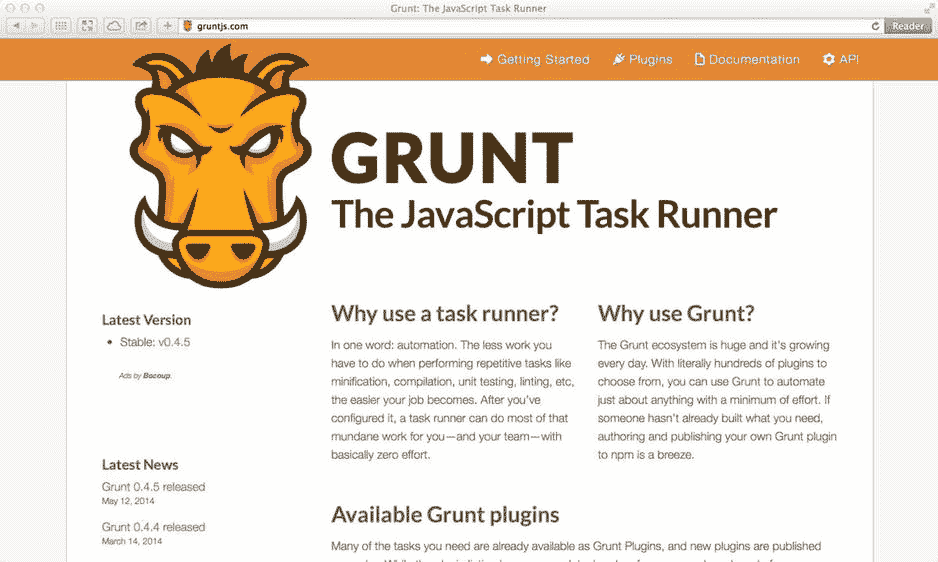
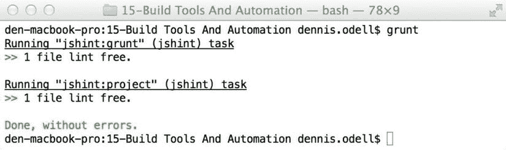
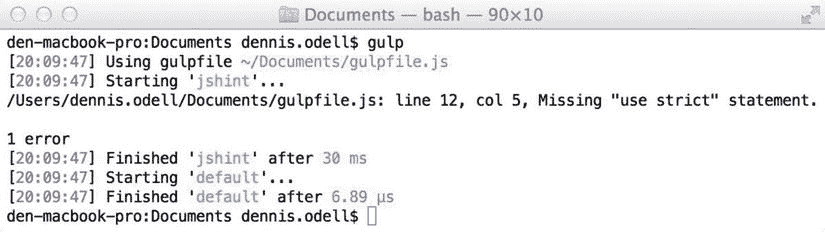
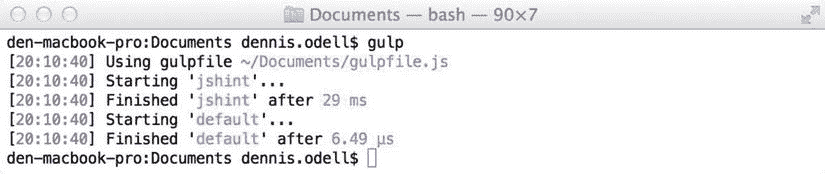
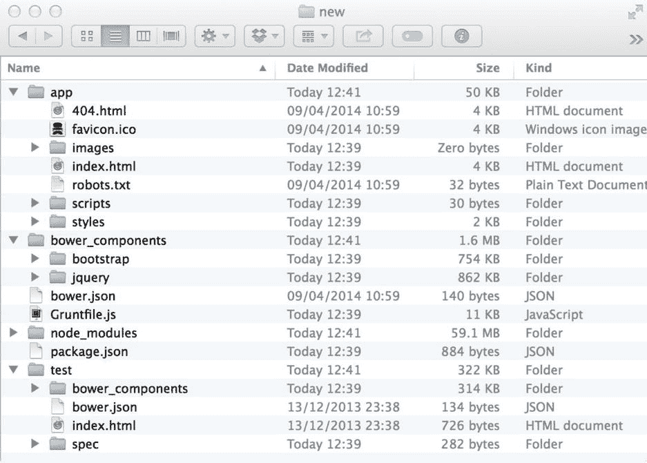

# 15.构建工具和自动化

多年来，web 开发人员的日常工作流程基本保持不变，主要是管理资产、编写代码，然后在多种浏览器中测试代码的手动过程。用于检查代码质量和简化某些任务的工具已经存在，但是这些工具都是手动运行的，因此容易被遗忘或者运行不一致，从而很容易忽略这些检查产生的结果。类似地，第三方库的管理经常是从一个项目到另一个项目的复制和粘贴，几乎没有版本控制和管理。最后，新项目的建立经常涉及到每次都完全从头开始，尽管可能会重用其他项目的代码。在这一章中，我将介绍一些工具，这些工具可以让你自动化你的开发工作流程和代码发布过程，管理你的第三方依赖，并且每次都为你的项目建立一个可靠的基础。

## 构建工具

当其他语言的程序员想要发布代码时，他们熟悉运行某种构建过程；除了为输出而编译代码之外，该过程通常还会根据预定义的基准检查代码质量，针对代码库中的每个功能运行单元测试，并根据解决方案的需要运行其他自动化任务。作为 JavaScript 开发人员，是时候通过使用 JavaScript 构建工具或自动化任务运行器将同样的原则应用到我们的工作中，来简化我们的开发工作流，提高我们的代码质量，并打包我们的代码的生产就绪版本了。

构建工具服务于任何想要针对他们的代码库自动运行任务的 web 开发人员，例如 JavaScript 静态代码分析、单元测试和最小化、图像压缩、SASS ( [http:// sass-lang。com](http://sass-lang.com/) )编译成 CSS，或者与其他系统的专业集成任务。如果您在团队中工作，您可以将您的构建配置与您的其余代码一起存储在一个文件中，允许每个人共享相同的任务集。全球许多公司和项目团队都在使用构建工具，包括 Adobe、Twitter 和 jQuery。在我领导的 AKQA 开发团队中，我们在运行的每个项目中都使用了本章中提到的构建工具。

在整个章节中，我们遇到了许多旨在帮助专业 JavaScript 开发人员的工具——简化新开发人员的入职，提高他们代码的质量，并减少他们代码的大小。从第 2 章的[自动代码文档生成器和第 3 章](02.html)的[代码质量工具，到第 4 章](03.html)的[的缩小和混淆工具，都是为了确保我们的代码是最好的，也是最容易理解的。在这一节中，我们将探讨如何将所有这些类型的工具与任务运行器结合在一起，这些任务运行器将自动执行典型的开发工作流，并生成面向公共发布的代码文件的生产就绪版本。](04.html)

任务运行器允许您将一系列任务或操作链接在一起，然后这些任务或操作可以按顺序运行，以针对您的代码执行某些操作。一些流行的命令行任务运行程序，如果你从其他编程语言转到 JavaScript，你可能有过经验，包括 Ant([http://bit . ly/Ant-build](http://bit.ly/ant-build))、grad le([http://bit . ly/grad le-build](http://bit.ly/gradle-build))、Rake([http://bit . ly/Rake-build](http://bit.ly/rake-build))、Make([http://bit . ly/Make-build](http://bit.ly/make-build))和 Maven([http://bit . ly/ly 对于基于 JavaScript 的项目，拥有一个命令行任务运行器是有意义的，它可以本地执行基于 JavaScript 的任务，这样开发人员就可以根据他们的特定需求轻松地编写和修改他们自己的任务。它还允许本地处理和执行项目中的任何 JavaScript 文件，从而可以轻松地运行概要分析和代码检查。通过在 Node.js 应用程序平台上构建这样一个构建系统，我们获得了跨平台兼容性的额外好处。](http://bit.ly/maven-build)

### grunt—JavaScript 任务运行器

专业 JavaScript 开发人员在撰写本文时使用的最流行的构建工具是 Grunt ( [http:// gruntjs。com](http://gruntjs.com/) )，你可能还记得在[第三章](03.html)中简单提到过。Grunt 是一个自动化的任务运行器，用 JavaScript 编写，通过 Node.js 运行，可以设置任意数量的插件任务，配置为在需要时运行，可以单独运行，也可以按定义的顺序运行，以帮助您自动化 JavaScript 工作流——检查代码质量，将文件连接在一起，缩小文件，并最终生成您最满意的最终 JavaScript 代码发布给公众。通过自动化任务序列，您可以确保不会遗漏任何步骤，并且任务总是以正确的顺序运行，从而产生一致的开发工作流和构建过程。

图 15-1。

The Grunt homepage features a wealth of resources to help you get started running tasks

在撰写本文时，Grunt 有超过三千个插件任务，列在[http://bit . ly/Grunt-plugins](http://bit.ly/grunt-plugins)上，可用于您的任务序列，涵盖了您可能希望执行的最流行的任务。

#### 安装咕噜声

在我们开始使用 grunt 之前，我们需要安装 Grunt 命令行界面(CLI)工具，可通过 [http:// bit. ly/ grunt-cli](http://bit.ly/grunt-cli) 获得，它提供了对机器上所有文件夹的 Grunt 命令行工具的全局访问。Grunt CLI 工具允许您在不同的项目文件夹中运行不同版本的 Grunt 任务运行器，如果您计划在您的机器上安装多个项目，这是一个好消息。

要安装 Grunt CLI 工具，请在机器上的任意文件夹中的命令提示符下执行以下命令(Mac 和 Linux 用户可能需要在该命令前加上`sudo`以作为超级用户进行身份验证):

`npm install -g grunt-cli`

Grunt CLI 工具、Grunt 任务运行器及其每个插件任务都是 Node.js 包，托管在 NPM 目录中。要下载 Grunt task runner 工具用于您的项目，请在您的项目目录中执行以下命令(如果该文件夹中没有文件，请运行`npm init`来创建一个新的`package.json`文件):

`npm install grunt --save-dev`

注意`--save-dev`命令行参数的使用，它自动将下载的 Grunt 包的特定版本的引用保存在`package.json`文件的`devDependencies`部分。这特别表明 Grunt 是一个仅用于开发的工具，而不是运行项目代码本身所需的包。类似地，我们安装的所有其他任务都将放在这个`devDependencies`部分中。例如，要为 Grunt 安装 JSHint 插件任务以对 JavaScript 文件执行静态代码分析，请在命令行上执行以下命令。关于这个名为`grunt-contrib-jshint`的插件的更多细节，可以通过[http://bit . ly/grunt _ js hint](http://bit.ly/grunt_jshint)找到——插件名称的`contrib`部分表明它是 Grunt 的官方插件，与任务运行器工具本身由同一团队开发:

`npm install grunt-contrib-jshint --save-dev`

#### 配置普通任务

Grunt 及其相关的 JSHint 插件安装在我们的项目文件夹中后，下一步是配置 Grunt，用我们选择的设置执行我们的插件任务。Grunt 是通过一个名为 Gruntfile 的配置文件进行配置的，这个文件必须命名为`Gruntfile.js`，并且应该存在于您的项目的根文件夹中，与您的`package.json`文件位于同一位置。

Gruntfile 是一个标准的 JavaScript 文件，它将通过 Node.js 应用程序框架与 Grunt 工具一起运行，并且应该配置为 Node.js 模块——我们希望在文件外部访问的任何代码，以及 Grunt 本身，都必须设置为 Gruntfile 中的`module.exports`属性。

`Gruntfile.js`文件应该用包装函数初始化，通过`grunt`参数提供对 Grunt API 的访问，然后通过`module.exports`属性公开访问。我们所有的 Grunt 配置设置都将存在于这个函数体中:

`module.exports = function(grunt) {`

`// Configuration goes here. The 'grunt' function parameter contains the Grunt API methods.`

`};`

下一步是使用 API 的`loadNpmTasks()`方法加载我们希望 Grunt 能够运行的每个插件任务包。应该为每个插件重复以下代码行，在相关位置替换插件名称:

`grunt.loadNpmTasks("grunt-contrib-jshint");`

我们现在可以使用 Grunt API 的`initConfig()`方法来配置我们的任务设置。我们将一个 JavaScript 对象传递给该方法，每个任务有一个属性，包含应用于该任务的设置。对于 JSHint 插件任务，要使用的属性名是`jshint`——要使用的确切任务名将在您选择引用的任何插件的文档中详细说明。对于 JSHint 任务，该文档可在[http://bit . ly/grunt _ JSHint](http://bit.ly/grunt_jshint)上在线获得。

JSHint 插件文档详细说明了可以应用于该任务的设置，其中包括一个用于引用要应用该任务的文件的`src`属性，以及一个用于指定覆盖默认设置的确切规则的`options`属性。JSHint 规则选项的完整列表可以在[http://bit . ly/JSHint _ opts](http://bit.ly/jshint_opts)上在线查看。如果我们希望针对名为`scripts/`的项目文件夹的特定子目录中的所有 JavaScript 文件以及`Gruntile.js`本身运行 JSHint 任务，我们可以为该任务的`src`属性使用以下数组值:

`src: ["Gruntfile.js", "scripts/*.js"]`

请注意，我们不仅可以指定确切的文件名，还可以使用星号(`*`)通配符值来引用匹配特定文件名模式的所有文件。例如，`"scripts/*.js"`模式直接在`scripts/`文件夹中匹配任何扩展名为`.js`的文件。然而，包含双星号(`**`)的模式，比如`"scripts/**/*.js"`，将匹配所有扩展名为`.js`的文件，不仅仅是`scripts/`目录，还包括该文件夹的任何子目录。如果您不知道想要应用 Grunt 任务的文件夹层次结构的确切结构，双星号模式会非常有用。

因此，更新我们的 Gruntfile 来配置 JSHint 任务以对这些文件执行静态代码分析，在所有文件中强制使用严格模式`"use strict"`语句，这是将配置对象传递给 Grunt API 的`initConfig()`方法的一个简单例子，如下所示:

`grunt.initConfig({`

`jshint: {`

`options: {`

`strict: true`

`},`

`src: ["Gruntfile.js", "scripts/**/*.js"]`

`}`

`});`

执行 Grunt 时，任何任务都可以通过在命令行上直接指定其名称来运行；然而，我们需要能够轻松地管理最终将按顺序运行的任务列表，这可以通过定义别名任务名称并将其与我们希望执行的任务列表相关联来实现。在命令行上将这个别名传递给 Grunt，然后依次执行所有相关的任务。为了简单起见，Grunt 将允许一个名为`default`的别名任务执行，而不需要在命令行上传递它的名字。别名任务使用 Grunt API 的`registerTask()`方法`registerTask()`方法`registerTask()`方法注册在 Gruntfile 中，如图所示；我们可以在稍后阶段添加更多任务，方法是向数组中的任务列表添加:

`grunt.registerTask("default", ["jshint"]);`

清单 15-1 显示了我们基本 Gruntfile 的最终版本。将这个文件命名为`Gruntfile.js`,这样 Grunt 就可以识别它。

清单 15-1。一个基本的 Gruntfile

`// Specify the wrapper function, which will be passed the Grunt API as a parameter, making this`

`// function externally available outside of this file by applying it to the module.exports`

`// property, as with any other Node.js modules`

`module.exports = function(grunt) {`

`// Load the Grunt plugin tasks we have previously installed with the npm tool`

`grunt.loadNpmTasks("grunt-contrib-jshint");`

`// Configure the JSHint task loaded previously with options to apply to the listed files`

`grunt.initConfig({`

`jshint: {`

`options: {`

`strict: true`

`},`

`// The use of the ** and * wildcard values ensures all .js files within the`

`// scripts/ folder and any subfolders are loaded for use with JSHint`

`src: ["Gruntfile.js", "scripts/**/*.js"]`

`}`

`});`

`// Register a task alias. The "default" task name ensures the listed tasks will load`

`// simply by executing the "grunt" command on the command line`

`grunt.registerTask("default", ["jshint"]);`

`};`

#### 跑步咕噜声

要使用任务别名`default`运行 Grunt，只需在命令行上执行以下命令:

`grunt`

如果希望运行单个任务或另一个命名别名，可以直接在命令行上指定任务或别名，如下所示:

`grunt jshint`

使用清单 15-1 中的 Gruntfile，当 Grunt 运行时，会产生如图 [15-2](#Fig2) 所示的输出，表明发生了一个错误并给出了该错误的详细信息。构建在这一点上停止，直到错误被修复，Grunt 再次运行。响应表明 Gruntfile 缺少一个`"use strict"`语句，这是我们在任务配置中强制实施的一个条件。

图 15-2。

The command line output from Grunt, indicating that a warning has occurred

在 Gruntfile 中的函数顶部添加一个`"use strict"`并重新运行 Grunt 会产生如图 [15-3](#Fig3) 所示的响应，表明 JSHint 任务现在已经成功，因此 Grunt `default`别名任务已经完成，没有错误。

图 15-3。

The command line output from Grunt, indicating that all tasks have completed successfully

#### 扩展咕哝配置

Grunt 支持比我们到目前为止介绍的更多的特性，包括对 JSON 数据文件导入的支持，允许不同需求的替代配置设置的多任务，以及在没有可接受的现有解决方案的情况下编写自己的定制插件的能力。插件目录可以在[http://bit . ly/grunt-plugins](http://bit.ly/grunt-plugins)找到。

##### JSON 文件导入

Grunt API 包含一系列处理外部文件读取、写入和复制的方法。其中最常用的是`file.readJSON()`方法，该方法允许将存储在外部 JSON 格式文件中的数据加载到 Gruntfile 中，使其数据可以作为标准 JavaScript 对象在任务配置中使用。通常，存储在`package.json`文件中的属性被导入以访问项目细节，比如名称、版本、描述和存储在其中的任何其他属性。

Note

Grunt API 中的一个伴随方法`file.readYAML()`允许将 YAML 格式的数据文件读入 Grunt 配置文件。YAML 格式被设计成 JSON 的一个更易于阅读的等价物，更适合需要经常由人而不是机器来编辑数据文件的情况。要了解关于这种数据格式的更多信息，请访问项目主页。org 。

将`package.json`文件的内容加载到 Gruntfile 中，如图所示，将返回值设置为与`initConfig()`方法一起使用的配置对象中的`pkg`属性:

`grunt.initConfig({`

`pkg: grunt.file.readJSON("package.json")`

`});`

然后可以从模板分隔符`<%=`和`%>`包围的字符串值中的`pkg`对象属性或配置对象中的任何其他命名属性中读出值。例如，为了从`package.json`文件中读取`name`和`version`属性，并在我们的 JSHint 任务中使用它们，我们引用了它们，如下所示:

`grunt.initConfig({`

`pkg: grunt.file.readJSON("package.json"),`

`jshint: {`

`options: {`

`strict: true`

`},`

`src: ["Gruntfile.js", "<%= pkg.name %>-<%= pkg.version %>.js"]`

`}`

`});`

假设我们的`package.json`文件包含以下属性，例如:

`{`

`"name": "my-project",`

`"version": "0.0.1"`

`}`

我们的 JSHint 配置将有效地解析为其`src`配置属性中的以下数组值:

`src: ["Gruntfile.js", my-project-0.0.1.js"]`

在 Grunt 运行之前，中的值被替换为指定的值，就像这些值被硬编码在文件中一样。我们可以在多个地方引用它们，对我们的`package.json`文件中的属性进行简单的更改，就可以在我们的 Gruntfile 中的任何需要的地方对我们的任务配置进行所有必要的更改，而不需要我们做任何额外的工作。

##### 多任务和目标

Grunt 支持将每个任务配置分成几个独立的配置，允许不同的任务选项来适应不同的场景，例如，将不同的设置应用于不同的文件。这个特性被称为多任务，通过在 Gruntfile 的配置部分的每个任务属性名称下添加一个额外的命名对象属性来实现。这些多任务配置对象中的每一个都被称为一个目标，不同的目标可以通过 Grunt 一次运行一个，或者所有目标按照定义的顺序一起运行。

清单 15-2 中的代码显示了一个完整的 Gruntfile，其中为配置了两个目标，分别命名为`grunt`和`project`。`jshint.options`属性中的设置将应用于所有目标，但是可以通过在每个目标的单独配置属性中放置一个额外的`options`对象来覆盖每个目标。

清单 15-2。为 JSHint 多任务指定了多个目标的 grunt 文件

`module.exports = function(grunt) {`

`// Enable strict mode`

`"use strict";`

`grunt.loadNpmTasks("grunt-contrib-jshint");`

`grunt.initConfig({`

`// Load external data from another file for use within task configuration`

`pkg: grunt.file.readJSON("package.json"),`

`jshint: {`

`// Apply a set of JSHint options to apply to all targets`

`options: {`

`strict: true`

`},`

`// Define a target with settings to apply in addition to those defined for all`

`// JSHint tasks above, including which files to apply JSHint to`

`grunt: {`

`src: ["Gruntfile.js"]`

`},`

`// Define a second target, named "project"`

`project: {`

`// Apply extra options for this target, in addition to those options applied`

`// for all JSHint tasks. In this case, both "strict" and "trailing" properties`

`// will be set to "true". Settings at this level with the same name as those`

`// previously defined will cause the setting to be overwritten`

`options: {`

`trailing: true`

`},`

`// Use the settings from the package.json file, stored locally in the "pkg"`

`// property to dynamically apply values to the Gruntfile configuration`

`src: ["<%= pkg.name %>-<%= pkg.version %>.js"]`

`}`

`}`

`});`

`grunt.registerTask("default", ["jshint"]);`

`};`

对清单 15-2 所示的 Gruntfile 运行 Grunt 会产生如图 [15-4](#Fig4) 所示的输出，多任务运行中的每个单独的目标都按照 Gruntfile 本身指定的顺序依次运行。

图 15-4。

Running Grunt with a JSHint multitask containing two separate

可以在别名任务中执行特定的目标，也可以直接在命令行上执行，方法是指定任务名称后接冒号(`:`)，然后指定目标名称。例如，要在命令行上运行 JSHint 任务的`project`目标，执行以下命令，将产生如图 [15-5](#Fig5) 所示的输出:

`grunt jshint:project`

图 15-5。

Executing a single target of an individual Grunt multitask

多任务是强大的，随着你的 Gruntfile 的增长，它变得更加有用，允许你将任务分成更具体的目标，以满足你的确切需求。

#### 编写自己的咕哝插件

随着您使用 Grunt 的经验的积累，您可能会发现您所需要的插件在。如果是这种情况，您会很高兴听到您可以用 JavaScript 编写自己的定制插件来满足您特定的项目需求。通过[http://bit . ly/grunt-write-plugin](http://bit.ly/grunt-write-plugin)查看在线文档，了解如何编写自己的 Grunt 插件。

除了我们在本节中介绍的特性之外，Grunt 还支持在您的任务配置中使用大量其他选项。要了解更多关于 Grunt 提供的附加功能和示例，请查看项目网站上关于 Grunt 任务的文档页面，网址是 http:// bit. ly/ grunt-tasks 。

### gulp . js——流式构建系统

紧随 Grunt 之后的是相对较新的 Gulp.js。作为一个较新的解决方案，在撰写本文时，可用插件的数量超过 600 个，约占 Grunt 可用插件数量的 20%，尽管列表每周都在增长。关于 Gulp.js 和可用插件的全部细节可以在项目主页上找到。com ，如图 [15-6](#Fig6) 所示。

图 15-6。

The Gulp.js project homepage

Gulp.js 构建系统以 Grunt 为基础，并以类似于 Grunt 的方式执行任务，但有三个明显的区别。首先，它利用了 Node.js 的 streams 功能，该功能允许一个任务的输出通过管道输入到另一个任务的输入，而不需要将临时文件写入磁盘的中间步骤；这使得任务运行更有效，在大多数情况下，更快。第二，配置从一个单一的大型配置对象中移出，支持基于代码的链式方法调用方法，将相关的配置传递给代表每个任务的方法。第三，Gulp.js 任务被有意设计成小任务——做一件事并把这件事做好——这意味着大任务执行多个动作被避开，而有利于将较小的任务连接在一起，一个任务的输出馈入下一个任务。

#### 安装 Gulp.js

要安装 Gulp.js 以便在系统中任何文件夹的所有项目中使用，请在命令行上执行以下命令(Mac 和 Linux 用户可能需要在命令前加上`sudo`):

`npm install -g gulp`

接下来，将`gulp`包安装到您的项目文件夹中，将其保存到您的`package.json`文件的`devDependencies`部分——如果您还没有 package.json 文件，那么首先执行`npm init`来初始化该文件:

`npm install gulp --save-dev`

正如 Grunt 一样，插件任务是通过`npm`工具安装的。要为 Gulp.js 安装 JSHint 任务，我们需要通过在命令行上执行以下命令来安装`gulp-jshint`任务，保存它对我们的`package.json`文件的`devDependencies`部分的引用:

`npm install gulp-jshint --save-dev`

这个任务的文档可以在 http:// bit. ly/ gulp-jshint 上找到。

#### 配置 Gulp.js

与 Grunt 一样，需要一个 JavaScript 配置文件来设置要运行的任务以及运行的顺序。这个文件被称为 gulpfile，必须命名为`gulpfile.js`。这个配置文件的结构实际上是 Node.js 应用程序本身，而不是像 Grunt 那样创建 Node.js 模块。因此，为了设置文件，我们需要`require()`“T2”包并调用由此暴露的方法，这些方法代表 Gulp.js API。

插件是 Node.js 模块，它公开了表示其功能的方法，所以它们不像在 Grunt 中那样直接定义任务名。因此，要定义一个任务，必须调用 Gulp.js API 的`task()`方法，为新任务传入一个惟一的名称和一个在任务运行时要执行的函数，执行任何引用的插件方法并返回输出。

gulpfile 的基本结构如下:

`var gulp = require("gulp");`

`gulp.task("default", function() {`

`// Tasks get called here, with the output returned to the calling function`

`});`

Gulp.js API 包含我们将在 gulpfile 任务中使用的方法，包括`src()`，它让我们定义应用于插件的文件列表，`dest()`，它允许我们将插件和其他方法的输出写入文件系统，以及`pipe()`，它将一个插件或方法的输出传递给。每个方法都被设计成链式的，从而产生由一系列小的组成函数调用表示的任务。

清单 15-3 显示了一个定义了一个`jshint`任务的 gulpfile 示例，它在将一组文件传递给 JSHint 插件方法以对这些文件运行静态代码分析之前加载这些文件。然后，结果被传递给一个报告函数，该函数在命令窗口中显示代码分析的结果——这正是 Gulp.js 所基于的任务划分，这使得它很容易配置。与 Grunt 一样，别名任务(包括一个`default`任务)可以被定义为将其他任务组合成一系列应该按顺序执行的任务。

清单 15-3。样品

`// Reference the gulp package and JSHint plugin package`

`var gulp = require("gulp"),`

`jshint = require("gulp-jshint");`

`// Define a Gulp.js task, naming it "jshint" - we can then execute it directly by name, or link`

`// it together with other tasks under an alias name, to be executed in sequence`

`gulp.task("jshint", function() {`

`// Return the result of the operation to the calling function`

`// Locate the files to use with this task - here, this gulpfile itself and any .js file`

`// within the scripts/ folder and its subfolders`

`return gulp.src(["gulpfile.js", "scripts/**/*.js"])`

`// Pipe those files to the "jshint" plugin, specifying the options to apply - here, we`

`// ensure strict mode is enforced in the selected files. This runs JSHint but does not`

`// display its results`

`.pipe(jshint({`

`strict: true`

`}))`

`// Finally, pipe the output of JSHint to a reporter for displaying on the command line.`

`// By splitting up JSHint into one part that performs the static code analysis and one`

`// part that displays the results, we are capable of creating more functional tasks`

`// that can take the direct results from JSHint and use them in any other way we`

`// wish to. This is what makes Gulp.js so highly configurable.`

`.pipe(jshint.reporter("default"));`

`});`

`// Define a default task - naming it "default" ensures it will be executed without the need to`

`// pass through a specific task name from the command line`

`gulp.task("default", ["jshint"]);`

#### 运行 Gulp.js

针对清单 15-3 中的代码运行 Gulp.js 工具，通过在命令行上执行以下命令，首先将清单 15-3 中的代码保存在名为`gulpfile.js`的文件中:

`gulp`

由于没有提供任务名称，将执行`default`任务，产生如图 [15-7](#Fig7) 所示的结果。

图 15-7。

The command line output from Gulp.js, indicating that an error has occurred

响应表明`gulpfile.js`文件缺少一个`"use strict"`。将该语句添加到 gulpfile 中的函数顶部，并重新运行 Gulp.js，产生如图 [15-8](#Fig8) 所示的响应，表明 JSHint 已经成功运行，因此整个 Gulp.js `default`别名任务已经完成，而没有。

图 15-8。

The command line output from Gulp.js, indicating that all tasks have completed successfully

#### 扩展 Gulp.js 配置

因为 gulpfile 只是一个 Node.js 应用程序，所以 Grunt 配置中需要的特殊 API 方法和模板字符串在这里不需要。要从一个`package.json`文件中导入属性以便在任务设置中使用，只需使用 Node.js 并直接以标准 JavaScript 对象的形式访问属性:

`var pkg = require("package.json");`

`pkg.name;   // "my-project"`

`pkg.version; // "0.0.1"`

#### 编写自己的 Gulp.js 插件

随着使用 Gulp.js 的经验的积累，您可能会发现您所需要的插件并不在插件目录中。如果是这种情况，您会很高兴听到您可以用 JavaScript 编写自己的定制插件来满足您特定的项目需求。在 http://bit . ly/gulp-write-plugin 查看在线文档，了解如何编写自己的 Gulp.js 插件。

除了我们在本节中介绍的特性，Gulp.js 还支持大量其他选项，供您在任务配置中使用。要了解更多关于 Gulp.js 提供的附加功能和示例，请查看项目网站上的 Gulp.js API 的文档页面，网址为 [http:// bit. ly/ gulp-api](http://bit.ly/gulp-api) 。

### 使用构建工具自动化常见任务

构建工具能够通过提供自动化来彻底改变常见的重复性任务，使开发人员能够专注于他们的代码，而构建工具可以确保他们不需要担心其他的事情。JavaScript 构建工具的两个常见用途是在开发过程中自动执行标准工作流任务，以及准备或构建一组供公众使用的代码，确保交付高质量和高效的代码供最终的 web 应用程序使用。在这一节中，我将带您了解通过 Grunt 和 Gulp.js 实现满足这两种用途所需的自动化的过程。

#### 改进您的开发工作流程

专业的 JavaScript 开发人员希望将时间花在他们的代码上，但需要确保当他们需要在浏览器中运行代码时，代码是无错误的、最新的，并且在看到任何结果之前不涉及耗时的设置过程。在本节中，我们将配置 Grunt 和 Gulp.js 来启动一个本地 web 服务器来运行我们的代码，并使用静态代码分析来检查 JavaScript 文件中的潜在错误。然后，它将等待我们对文件进行更改，当我们这样做时重新运行静态代码分析，并在分析完成后动态地重新加载连接到本地 web 服务器的任何打开的 web 浏览器。我们只需要启动我们选择的构建工具，剩下的就是自动的了。

让我们假设我们从一个项目文件夹开始，这个项目文件夹包含我们正在工作的网站的许多文件，包括我们根文件夹中的一个`index.html`文件和存储在一个`scripts/`文件夹中的 JavaScript 文件。接下来的部分解释了如何配置您选择的构建工具来改进我们在这个项目中的开发工作流程。

##### 使用 Grunt 改进您的开发工作流程

我们可以通过使用三个 Grunt 插件来改进我们的开发工作流程:JSHint，它将提供静态代码分析；Connect([http://bit . ly/Grunt-Connect](http://bit.ly/grunt-connect))，它将快速轻松地启动本地 web 服务器；Watch([http://bit . ly/Grunt-Watch](http://bit.ly/grunt-watch))，它是一个文件更改观察器，它将查找对指定文件夹中的文件所做的更改，触发静态代码分析，并在这些更改以任何方式发生时重新加载连接到本地 web 服务器的任何打开的网页。

动态网页重载是通过 Live Reload 功能实现的([)http://livere load。com](http://livereload.com/) 。本地 web 服务器将一个特殊的 JavaScript 文件引用注入到它所服务的任何 HTML 页面中，打开并维护到服务器的 web 套接字连接。当对代码文件进行更改时，监视任务通过此套接字连接广播一条消息，指示 web 浏览器重新加载页面，使其加载对已更改文件所做的更改。

首先将 Grunt 和三个必需的插件安装到您的项目目录中(如果这个文件夹中没有文件，使用`npm init`来建立一个`package.json`文件):

`npm install grunt --save-dev`

`npm install grunt-contrib-jshint --save-dev`

`npm install grunt-contrib-connect --save-dev`

`npm install grunt-contrib-watch --save-dev`

清单 15-4 中的代码展示了一个 Gruntfile，它可以用来改进你的开发工作流程，方法是启动一个 web 服务器，每当一个 JavaScript 文件发生变化时，使用 JSHint 运行静态代码分析，同时自动刷新连接到那个服务器的打开的浏览器窗口。遵循内联代码注释来理解每个任务是如何配置的。

清单 15-4。改进开发工作流程的 Gruntfile 文件

`module.exports = function(grunt) {`

`"use strict";`

`// Define the location of the JavaScript files in our application that we wish to run our`

`// tasks against - along with this Gruntfile, the use of wildcard (* and **) values means`

`// that we're representing .js files within the scripts/ folder directly, as well as files`

`// one level beneath that in the folder hierarchy`

`var scriptFiles = ["Gruntfile.js", "scripts/**/*.js"];`

`// Load the JSHint, Connect and Watch plugin tasks previously installed via npm`

`grunt.loadNpmTasks("grunt-contrib-jshint");`

`grunt.loadNpmTasks("grunt-contrib-connect");`

`grunt.loadNpmTasks("grunt-contrib-watch");`

`// Configure Grunt with the JSHint, Connect and Watch tasks`

`grunt.initConfig({`

`// Configure the JSHint task to perform static code analysis on the files in our`

`// scripts/ folder and enforce strict mode in all`

`jshint: {`

`options: {`

`strict: true`

`},`

`src: scriptFiles`

`},`

`// Configure the Connect task to start up a web server at``http://localhost:3000`T2】

`// default it will point to the files in the root of the project folder, so a file`

`// named index.html in the root folder will be displayed when browser this new URL.`

`// By enabling the "livereload" property, the server will inject a reference to a`

`// Live Reload script into your HTML pages automatically - used in conjunction with`

`// another task that will trigger the Live Reload in specific circumstances, such as`

`// the Watch task, below`

`connect: {`

`server: {`

`options: {`

`port: 3000,`

`livereload: true`

`}`

`}`

`},`

`// Configure the Watch task to observe changes made to any JavaScript file in our`

`// scripts/ folder and trigger the JSHint task when those files are changed, ensuring`

`// code quality standards are kept high throughout project development. Enabling the`

`// "livereload" option ensures that any Live Reload script in a running web page is`

`// notified once the JSHint task has run, causing it to be reloaded automatically,`

`// saving us the task of manually refreshing the page. This option thus works in`

`// conjunction with the Live Reload script injected into the page by the Connect task`

`watch: {`

`scripts: {`

`files: scriptFiles,`

`tasks: ["jshint"],`

`options: {`

`livereload: true`

`}`

`}`

`// Extra targets can be added in here for different file types, such as CSS or HTML`

`// files, to allow specific tasks to be triggered when those file types are changed`

`}`

`});`

`// Configure the default Grunt task to run JSHint, Connect and Watch tasks in sequence.`

`// The Watch plugin will continue to monitor for changes and, together with the LiveReload`

`// capability, will ensure that the web site hosted on our new web server will be kept`

`// up to date automatically as we change the JavaScript files in our project - no need to`

`// even press Refresh in our browsers!`

`grunt.registerTask("default", ["jshint", "connect", "watch"]);`

`};`

对清单 15-4 中保存到名为`Gruntfile.js`的文件中的代码运行 Grunt，将对`scripts/`文件夹中的 JavaScript 文件执行 JSHint，然后导致 web 服务器在 http://localhost:3000 上旋转，指向我们项目文件夹中的文件。Grunt 进程将在命令窗口中保持活动状态，因为它会监视对 JavaScript 文件所做的更改。当它检测到发生了变化时，它将针对更新的文件重新运行 JSHint，重新加载任何打开的浏览器窗口来查看`index.html`页面，或者我们的 web 应用程序中的任何其他 HTML 页面。如果您希望停止 Grunt 进程，请使用 Ctrl+C (Windows、Linux)或 Cmd+C (Mac)键盘快捷键来终止该命令。

##### 使用 Gulp.js 改进您的开发工作流程

我们可以利用 JSHint 和 Connect([http://bit . ly/gulp-Connect](http://bit.ly/gulp-connect))插件，通过 Gulp.js 实现这种自动化开发工作流。与 Grunt 不同，它没有单独的监视插件，因为文件更改观察功能通过其`watch()`方法直接内置在 Gulp.js API 中。虽然这个方法不直接支持实时重载，但是我们可以配置一个定制的监视任务来执行这个方法，然后调用 Connect 插件的`reload()`方法，这将产生我们需要的结果。

首先将 Gulp.js 和两个必需的插件安装到您的项目目录中(如果这个文件夹中没有文件，使用`npm init`来建立一个`package.json`文件):

`npm install gulp --save-dev`

`npm install gulp-jshint --save-dev`

`npm install gulp-connect --save-dev`

清单 15-5 中的代码展示了一个 gulpfile，它可以用来改进你的开发工作流程，方法是启动一个 web 服务器，每当一个 JavaScript 文件发生变化时，使用 JSHint 运行静态代码分析，同时自动刷新连接到那个服务器的打开的浏览器窗口。遵循内联代码注释来理解每个任务是如何配置的。

清单 15-5。Gulpfile 改进开发工作流程

`// Load the Gulp package, along with the JSHint and Connect plugins for Gulp, all of which`

`// have previously been installed through npm`

`var gulp = require("gulp"),`

`jshint = require("gulp-jshint"),`

`connect = require("gulp-connect"),`

`// Define the location of the JavaScript files in our application that we wish to run our`

`// tasks against - this gulpfile and any .js file within the scripts/ folder and its`

`// sub directories`

`scriptFiles = ["gulpfile.js", "scripts/**/*.js"];`

`// Define a Connect task, which will start up a web server at``http://localhost:3000`T2】

`// to the files stored in the project root folder. Enabling the "livereload" property injects`

`// a Live Reload script into any running HTML page so that, if a message is received to reload`

`// the page, or any files within, the browser will do so - we will trigger this message in the`

`// JSHint task below`

`gulp.task("connect", function() {`

`"use strict";`

`connect.server({`

`port: 3000,`

`livereload: true`

`});`

`});`

`// Define the JSHint task to perform static code analysis on our code files, ensuring that`

`// strict mode is enabled for all our functions. This is similar to the JSHint task from`

`// Listing 15-3 with an additional command at the end of the function chain to force a Live`

`// Reload of any running HTML page through the web server spun up in the Connect task previously`

`gulp.task("jshint", function() {`

`"use strict";`

`return gulp.src(scriptFiles)`

`.pipe(jshint({`

`strict: true`

`}))`

`.pipe(jshint.reporter("default"))`

`// Send the message through the web server to perform a Live Reload of any HTML pages`

`// running from the server in any connected web browser`

`.pipe(connect.reload());`

`});`

`// Define a Watch task to execute the JSHint task when any of the predefined JavaScript files`

`// are altered. Gulp.js features its own built-in watch() method - no external plugin required`

`gulp.task("watch", function() {`

`"use strict";`

`gulp.watch(scriptFiles, ["jshint"]);`

`});`

`// Configure the default Grunt task to run JSHint, Connect and Watch tasks in sequence, ensuring`

`// high code quality whilst hosting our application and reloading the browser when changes are`

`// made to JavaScript files`

`gulp.task("default", ["jshint", "connect", "watch"]);`

针对清单 15-5 中保存到名为`Gruntfile.js`的文件中的代码运行 Gulp.js 工具，将针对`scripts/`文件夹中的 JavaScript 文件执行 JSHint，然后导致 web 服务器在 http://localhost:3000 上启动，指向我们项目文件夹中的文件。Gulp.js 进程将在命令窗口中保持活动状态，因为它会监视对 JavaScript 文件所做的更改。当它检测到发生了变化时，它将针对更新的文件重新运行 JSHint，重新加载任何打开的浏览器窗口来查看`index.html`页面，或者我们的 web 应用程序中的任何其他 HTML 页面。如果您希望停止 Gulp.js 进程，请使用 Ctrl+C (Windows、Linux)或 Cmd+C (Mac)键盘快捷键来终止该命令。

#### 创建生产就绪代码

开发人员喜欢使用的 JavaScript 代码通常被分成几个文件，提供了应用程序结构的逻辑划分，并允许项目团队的几个成员之间进行更简单的协作。然而，供公众使用的理想 JavaScript 代码应该分布在尽可能少的文件上，以减少 HTTP 请求，并缩小文件大小和缩短下载时间。专业 JavaScript 开发人员不会选择一种结构而非另一种结构，而是转向构建工具，从他们的原始开发文件中自动生成这种形式的生产就绪代码，通过结合静态代码分析和运行单元测试，确保只发布高质量的代码，生成代码覆盖报告，甚至能够根据原始 JavaScript 文件中特殊格式的代码注释自动生成文档网站。

为了在开发代码和发布代码之间提供良好的分离，许多开发人员选择在单个文件夹中执行他们的开发工作，该文件夹通常被命名为`src/`，它形成了应用于构建工具的原始文件集的基础。构建通常会生成一个单独的文件夹，通常命名为`dist/`，所有应用程序文件的生产就绪版本都将放入其中。使用这种结构，可以很少混淆哪些文件应该用于开发，哪些文件是通过构建过程自动生成的，并提供单个输出文件夹，以便在将应用程序代码部署到实时 web 服务器供公众使用时使用。

让我们假设我们从项目文件夹中的一个`src/`文件夹开始，它包含了我们正在工作的网站的一些文件，包括一个`index.html`文件和我们存储在`scripts/`子文件夹中的 JavaScript 文件。以下部分解释了如何配置您选择的构建工具来创建生产就绪代码。

##### 使用 Gulp.js 创建生产就绪代码

我们可以添加代码来改进我们的开发工作流，通过使用七个额外的 Grunt 插件来创建生产就绪的代码:Clean([http://bit . ly/Grunt-Clean](http://bit.ly/grunt-clean))，它将清空一个文件夹的内容(在本例中是`dist/`文件夹，确保它在每次运行构建时都被清空)，Copy([http://bit . ly/Grunt-Copy](http://bit.ly/grunt-copy))，它将把选定的静态非 JavaScript 文件从`src/`目录复制到`dist/`目录， jasmine([http://bit . ly/grunt-jasmine](http://bit.ly/grunt-jasmine))和一个相关的伊斯坦布尔插件([http://bit . ly/grunt-Istanbul](http://bit.ly/grunt-istanbul))，用于运行单元测试并生成代码覆盖报告，Concat([http://bit . ly/grunt-Concat](http://bit.ly/grunt-concat))，我们将使用它将几个 JavaScript 文件的内容组合成一个，Uglify([http://bit . ly/grunt-Uglify](http://bit.ly/grunt-uglify))。

首先将 Grunt 和所需的插件安装到您的项目目录中(如果这个文件夹中没有文件，使用`npm init`来建立一个`package.json`文件):

`npm install grunt --save-dev`

`npm install grunt-contrib-jshint --save-dev`

`npm install grunt-contrib-connect --save-dev`

`npm install grunt-contrib-watch --save-dev`

`npm install grunt-contrib-clean --save-dev`

`npm install grunt-contrib-copy --save-dev`

`npm install grunt-contrib-jasmine --save-dev`

`npm install grunt-template-jasmine-istanbul --save-dev`

`npm install grunt-contrib-concat --save-dev`

`npm install grunt-contrib-uglify --save-dev`

`npm install grunt-contrib-yuidoc --save-dev`

清单 15-6 中的代码显示了一个完整的 Gruntfile，除了改进你的开发工作流程之外，还可以用来生成一个存储在`src/scripts/`文件夹中的 JavaScript 代码的生产就绪版本。遵循内联代码注释来理解每个任务是如何配置的。

清单 15-6。使用单独的开发和生成任务生成文件

`module.exports = function(grunt) {`

`"use strict";`

`// Define variables to represent the folder and file locations required for task`

`// configuration - saves repetition`

`// The "src/" folder contains the code we will work on during development, including`

`// "scripts/" and "tests/" folders containing our JavaScript code and Jasmine test spec`

`// scripts, respectively`

`var srcFolder = "src/",`

`scriptFolder = srcFolder + "scripts/",`

`scriptFiles = scriptFolder + "**/*.js",`

`unitTestFolder = srcFolder + "tests/",`

`unitTestFiles = unitTestFolder + "**/*.js",`

`// The "dist/" folder will be generated automatically by this Gruntfile when run, and`

`// populated with the release version of our application files`

`outputFolder = "dist/",`

`outputScriptFolder = outputFolder + "scripts/",`

`// Define the name and location of a single script file into which all others will`

`// be concatenated into, becoming the main JavaScript file of our application`

`outputScriptFile = outputScriptFolder + "main.js",`

`// Define the name and location for a minified version of our single application script`

`outputScriptFileMinified = outputScriptFolder + "main.min.js",`

`// Define output folders for generated Istanbul reports and YUIDoc documentation files`

`outputReportFolder = outputFolder + "report/",`

`outputDocsFolder = outputFolder + "docs/";`

`// Load the JSHint, Connect and Watch tasks, which will be used for local development`

`grunt.loadNpmTasks("grunt-contrib-jshint");`

`grunt.loadNpmTasks("grunt-contrib-connect");`

`grunt.loadNpmTasks("grunt-contrib-watch");`

`// Load the Clean, Copy, Jasmine, Concat, Uglify and YUIDoc tasks, which will be used`

`// together with JSHint (loaded previously) to form our release build, preparing all`

`// files for public consumption`

`grunt.loadNpmTasks("grunt-contrib-clean");`

`grunt.loadNpmTasks("grunt-contrib-copy");`

`grunt.loadNpmTasks("grunt-contrib-jasmine");`

`grunt.loadNpmTasks("grunt-contrib-concat");`

`grunt.loadNpmTasks("grunt-contrib-uglify");`

`grunt.loadNpmTasks("grunt-contrib-yuidoc");`

`// Configure Grunt for all tasks`

`grunt.initConfig({`

`// Load the properties from the package.json file into a property for use in task`

`// configuration`

`pkg: grunt.file.readJSON("package.json"),`

`// Configure JSHint as in Listing 15-4`

`jshint: {`

`options: {`

`strict: true`

`},`

`src: scriptFiles`

`},`

`// Configure Connect as in Listing 15-4`

`connect: {`

`server: {`

`options: {`

`port: 3000,`

`livereload: true,`

`// Now we're working within the "src/" folder, use this as the location`

`// to find the files to host on this web server`

`base: srcFolder`

`}`

`}`

`},`

`// Configure Watch as in Listing 15-4`

`watch: {`

`scripts: {`

`files: scriptFiles,`

`tasks: ["jshint"],`

`options: {`

`livereload: true`

`}`

`}`

`},`

`// Probably the simplest Grunt plugin to configure, the Clean task empties the contents`

`// of a given folder - here we wish to ensure the "dist/" folder is empty each time`

`// we wish to regenerate our production-ready files`

`clean: [outputFolder],`

`// We'll use the Copy task to duplicate static files from the "src/" folder that need`

`// no extra processing, placing them into the "dist/" folder. In this case, we copy`

`// over everything except the contents of the "scripts/" and "tests/" folders`

`copy: {`

`all: {`

`files: [{`

`// The use of the exclamation point (!) before a folder or file name`

`// causes it to be excluded from the list of files. Here we wish to copy`

`// all files witin "src/", except those in the "scripts/" and "tests/"`

`// folders, over to the "dist/" output folder`

`cwd: srcFolder,`

`src: ["**", "!scripts/**", "!tests/**"],`

`dest: outputFolder,`

`// The "expand" property ensures the orginal folder structure is kept`

`// intact when the files are copied over`

`expand: true`

`}]`

`}`

`},`

`// Configure Jasmine to run together with Istanbul to ensure unit tests pass and to`

`// generate a code coverage report which will be placed in the "dist/report" output`

`// folder for review. We saw this Jasmine task first in Listing 3-13.`

`jasmine: {`

`coverage: {`

`src: scriptFiles,`

`options: {`

`// Point to the location of the unit test spec files`

`specs: unitTestFiles,`

`// Import the Istanbul template plugin for the Jasmine plugin task`

`template: require("grunt-template-jasmine-istanbul"),`

`// Configure the output folder and file for Istanbul's code coverage`

`// reports`

`templateOptions: {`

`coverage: outputReportFolder + "coverage.json",`

`report: outputReportFolder`

`}`

`}`

`}`

`},`

`// Instruct the Concat task to combine all the JavaScript files located in the`

`// "src/scripts/" folder into a single file, which we'll call "main.js". We can`

`// then separate our development across separate JavaScript files and combine them`

`// in this stage to avoid the need for an excessive number of HTTP requests to load`

`// all our scripts on our page`

`concat: {`

`scripts: {`

`src: scriptFiles,`

`dest: outputScriptFile`

`}`

`},`

`// The Uglify task will minify our concatenated JavaScript file, reducing its file`

`// size without removing any functionality`

`uglify: {`

`// The "banner" option allows us to add a comment to the top of the generated`

`// minified file, in which we can display the name and version of our project, as`

`// taken from our package.json file`

`options: {`

`banner: "/*! <%= pkg.name %> - version <%= pkg.version %> */\n"`

`},`

`scripts: {`

`// Execute a function to dynamically create the name of the destination file`

`// from the variable names above. This is equivalent of an object of the`

`// following structure, which will minify the "dist/scripts/main.js" file,`

`// storing the result in "dist/scripts/main.min.js", ready for use in our`

`// HTML page:`

`// {`

`//     "dist/scripts/main.min.js": "dist/scripts/main.js"`

`// }`

`files: (function() {`

`var files = {};`

`files[outputScriptFileMinified] = outputScriptFile;`

`return files;`

`}())`

`}`

`},`

`// The YUIDoc task will generate a separate static web site derived from specially`

`// formatted comments placed in our JavaScript files, allowing new developers to get`

`// up to speed with the structure of the project code without needing to comb through`

`// each line of code`

`yuidoc: {`

`docs: {`

`// The generated site will feature the name and version number, taken directly`

`// from the project package.json file`

`name: "<%= pkg.name %>",`

`version: "<%= pkg.version %>",`

`// Tell YUIDoc where to find the JavaScript files for this project, and where`

`// to place the generated web site files`

`options: {`

`paths: scriptFolder,`

`outdir: outputDocsFolder`

`}`

`}`

`}`

`});`

`// Define the default task to run JSHint, Connect and Watch, for local development`

`grunt.registerTask("default", ["jshint", "connect", "watch"]);`

`// Define a new "build" task to empty the "dist/" folder, copy over site files, run JSHint`

`// and Jasmine to check code quality, generate code coverage reports through Istanbul,`

`// concatenate the JavaScript files into a single application file, minify the contents of`

`// that file, and finally generate a documentation site based on the YUIDoc-formatted code`

`// comments in the original JavaScript files`

`grunt.registerTask("build", ["clean", "copy", "jshint", "jasmine", "concat", "uglify", "yuidoc"]);`

`};`

对清单 15-6 中的代码运行 Grunt，并保存到一个名为的文件中，将执行`default`任务来改进您的开发工作流，或者执行单独的`build`任务来生成您的 JavaScript 应用程序代码文件的生产就绪版本，这取决于执行时在命令行上传递给 Grunt 工具的任务名称。运行后一项任务将自动在您的项目根文件夹中创建或清空一个`dist/`文件夹，将静态文件，如 HTML、图像和样式表文件(但不是 JavaScript 文件)复制到这个新文件夹中，保持与原始`src/`文件夹中相同的文件夹结构，执行静态代码分析并对您的 JavaScript 代码进行单元测试，生成代码覆盖报告，然后将 JavaScript 文件合并到一个单独的`main.js`文件中，该文件放在`dist/scripts/`文件夹中。然后这个文件被缩小并保存到相同的位置，命名为`main.min.js`，从这里可以从你的 HTML 页面中引用它。最后，该任务基于原始 JavaScript 文件中特殊格式的代码注释创建一个文档网站。

##### 使用 Gulp.js 创建生产就绪代码

我们可以添加代码来改进我们的开发工作流，通过使用八个额外的 Gulp.js 插件来创建生产就绪的代码:Clean([http://bit . ly/gulp-Clean](http://bit.ly/gulp-clean))、Jasmine([http://bit . ly/gulp-Jasmine](http://bit.ly/gulp-jasmine))、伊斯坦布尔([http://bit . ly/gulp-伊斯坦布尔](http://bit.ly/gulp-istanbul))、Concat([http://bit . ly/gulp-Concat](http://bit.ly/gulp-concat))、Uglify([http://bit . com 它允许 Gulp.js 任务以不同于其输入文件的名称保存文件，非常适合为我们的小型 JavaScript 文件提供一个`.min.js`文件后缀和头(](http://bit.ly/gulp-uglify)[http://bit . ly/gulp-Header](http://bit.ly/gulp-header))，这允许在任何文件的开头插入一个额外的文本字符串，非常适合在我们的小型 JavaScript 文件的开头添加注释，详细说明项目名称和版本号——这是 Grunt 的 Uglify 插件自动提供的。

首先将 Gulp.js 和所需的插件安装到您的项目目录中(如果这个文件夹中没有文件，使用`npm init`来建立一个`package.json`文件):

`npm install gulp --save-dev`

`npm install gulp-jshint --save-dev`

`npm install gulp-connect --save-dev`

`npm install gulp-clean --save-dev`

`npm install gulp-jasmine --save-dev`

`npm install gulp-istanbul --save-dev`

`npm install gulp-concat --save-dev`

`npm install gulp-uglify --save-dev`

`npm install gulp-yuidoc --save-dev`

`npm install gulp-rename --save-dev`

`npm install gulp-header --save-dev`

清单 15-7 中的代码展示了一个完整的 gulpfile，除了改进你的开发工作流程，它还可以用来生成一个保存在`src/scripts/`文件夹中的 JavaScript 代码的生产就绪版本。遵循内联代码注释来理解每个任务是如何配置的。

清单 15-7。Gulpfile 具有独立的开发和构建任务

`// Load the Gulp.js package`

`var gulp = require("gulp"),`

`// Load the JSHint, Connect, Clean, Jasmine, Istanbul, Concat, Uglify, YUIDoc, Rename and`

`// Header plugin tasks`

`jshint = require("gulp-jshint"),`

`connect = require("gulp-connect"),`

`clean = require("gulp-clean"),`

`jasmine = require("gulp-jasmine"),`

`istanbul = require("gulp-istanbul"),`

`concat = require("gulp-concat"),`

`uglify = require("gulp-uglify"),`

`yuidoc = require("gulp-yuidoc"),`

`rename = require("gulp-rename"),`

`// The Header task adds a given string of text to the top of a file, useful for adding`

`// dynamic comments at the start of a file`

`header = require("gulp-header"),`

`// Load the properties from the package.json file into a variable for use in task`

`// configuration`

`pkg = require("./package.json"),`

`// Define variables to represent the folder and file locations required for task`

`// configuration - saves repetition`

`// The "src/" folder contains the code we will work on during development, including`

`// "scripts/" and "tests/" folders containing our JavaScript code and Jasmine test spec`

`// scripts, respectively`

`srcFolder = "src/",`

`scriptFolder = srcFolder + "scripts/",`

`scriptFiles = scriptFolder + "**/*.js",`

`unitTestFolder = srcFolder + "tests/",`

`unitTestFiles = unitTestFolder + "**/*.js",`

`// The "dist/" folder will be generated automatically by this Gruntfile when run, and`

`// populated with the release version of our application files`

`outputFolder = "dist/",`

`outputScriptFolder = outputFolder + "scripts/",`

`// Define the name and location of a single script file into which all others will`

`// be concatenated into, becoming the main JavaScript file of our application`

`outputScriptFileName = "main.js",`

`outputScriptFile = outputScriptFolder + outputScriptFileName,`

`// Define the file suffix to apply to the minified version of our single``application`T2】

`outputScriptFileMinifiedSuffix = ".min",`

`// Define output folders for generated Istanbul reports and YUIDoc documentation files`

`outputReportFolder = outputFolder + "report/",`

`outputDocsFolder = outputFolder + "docs/";`

`// Configure Connect as in Listing 15-5`

`gulp.task("connect", function() {`

`"use strict";`

`connect.server({`

`port: 3000,`

`livereload: true`

`});`

`});`

`// Configure JSHint as in Listing 15-5`

`gulp.task("jshint", function() {`

`"use strict";`

`return gulp.src(scriptFiles)`

`.pipe(jshint({`

`strict: true`

`}))`

`.pipe(jshint.reporter("default"))`

`.pipe(connect.reload());`

`});`

`// Configure a Watch task as in Listing 15-5`

`gulp.task("watch", function() {`

`"use strict";`

`gulp.watch(scriptFiles, ["jshint"]);`

`});`

`// Define a Clean task to empty the contents of the "dist/" output folder each time we prepare`

`// our production-ready release code`

`gulp.task("clean", function() {`

`"use strict";`

`return gulp.src(outputFolder, {`

`// Setting the "read" option to false with gulp.src() causes Gulp.js to ignore the`

`// contents of the input files, resulting in a faster task`

`read: false`

`});`

`// Pipe the output folder through the clean() task method, erasing it from the file`

`// system`

`.pipe(clean());`

`});`

`// Define a Copy task to duplicate static files that we wish to bundle with our release code`

`// into our output "dist/" folder`

`gulp.task("copy", function() {`

`"use strict";`

`// Copy all files witin "src/", except those in the "scripts/" and "tests/" folders, over`

`// to the "dist/" output folder. There is no need for a special plugin to perform file`

`// copying, it is handled directly through the Gulp.js API methods src() and dest()`

`return gulp.src(["**", "!scripts/**", "!tests/**"], {`

`cwd: srcFolder`

`})`

`.pipe(gulp.dest(outputFolder));`

`});`

`// Define a task to perform unit testing through Jasmine and code coverage report generation`

`// via Istanbul. To save running two tasks, which will effectively end up running the unit`

`// tests twice, we combine the two together into one task`

`gulp.task("jasmine-istanbul", function() {`

`"use strict";`

`// Pipe the files from the "src/scripts/" directory into Istanbul, which "instruments" the`

`// files, ensuring that code coverage reports can be generated later. No files are actually`

`// saved to the file system, they are kept in memory while they are being used, and are`

`// then destroyed when the task is complete`

`return gulp.src(scriptFiles)`

`.pipe(istanbul())`

`// When the script files have been instrumented, execute Jasmine against the unit`

`// test specs, piping the code coverage reports generated by Istanbul when these tests`

`// are run into the "dist/reports" folder`

`.on("finish", function() {`

`// Run the unit test files through Jasmine. Due to the nature of the gulp-jasmine`

`// plugin, the unit test files must be Node.js application files, meaning that`

`// before the tests can be run, we need to include a line at the top of the test`

`// script to require() the original script file we are testing - this means that`

`// the script file we're testing needs to have a "module.exports = " line to`

`// expose the functions to test for the unit test script. A few extra hoops to jump`

`// through compared to when testing with Grunt, however it's not too` `unfamiliar`

`// territory!`

`gulp.src(unitTestFiles)`

`.pipe(jasmine())`

`// Create the Istanbul code coverage reports now the unit tests have been run`

`// against the instrumented code`

`.pipe(istanbul.writeReports({`

`dir: outputReportFolder,`

`reporters: ['lcov'],`

`reportOpts: {`

`dir: outputReportFolder`

`}`

`}));`

`});`

`});`

`// Define a Concat task to combine the files in the "src/scripts/" folder into a single`

`// JavaScript application file`

`gulp.task("concat", function() {`

`"use strict";`

`return gulp.src(scriptFiles)`

`// Pass the name of the new script file to create to the concat() function`

`.pipe(concat(outputScriptFileName))`

`// Place the new file into the "dist/scripts/" output folder`

`.pipe(gulp.dest(outputScriptFolder));`

`});`

`// Define an Uglify task to minify the contents of our concatenated JavaScript file to reduce`

`// its size without removing its functionality, before adding a header comment to the minified`

`// file, renaming it to add a ".min" suffix to the resulting file, and then placing the new`

`// file in the "dist/scripts/" output folder`

`gulp.task("uglify", function() {`

`"use strict";`

`// Run the "dist/scripts/main.js" file through the uglify() task method to produce a`

`// minified version of that file`

`return gulp.src(outputScriptFile)`

`.pipe(uglify())`

`// Add a comment header to the minified JavaScript file, including the name and`

`// version details from the package.json file`

`.pipe(header("/*! " + pkg.name + " - version " + pkg.version + " */\n"))`

`// Rename the minified file to add the ".min" suffix, the resulting file name will`

`// then be "main.min.js"`

`.pipe(rename({suffix: outputScriptFileMinifiedSuffix}))`

`// Place the minified file into the "dist/scripts/" output folder`

`.pipe(gulp.` `(outputScriptFolder));`

`});`

`// Define a YUIDoc task to generate a separate static web site derived from specially formatted`

`// comments placed in our JavaScript files, allowing new developers to get up to speed with the`

`// structure of the project code without needing to comb through each line of code`

`gulp.task("yuidoc", function() {`

`"use strict";`

`// Load the JavaScript files from the "src/scripts/" folder and run these through YUIDoc,`

`// passing in the name and version number of the project from the package.json file to`

`// include in the resulting static documentation web site`

`return gulp.src(scriptFiles)`

`.pipe(yuidoc({`

`project: {`

`"name": pkg.name,`

`"version": pkg.version`

`}`

`}))`

`// Place the resulting static web site files in the "dist/docs/" output folder`

`.pipe(gulp.dest(outputDocsFolder));`

`});`

`// Define a default task to run JSHint, Connect and Watch, for local development`

`gulp.task("default", ["jshint", "connect", "watch"]);`

`// Define a new "build" task to empty the "dist/" folder, copy over site files, run JSHint`

`// and Jasmine to check code quality, generating code coverage reports with Istanbul,`

`// concatenate the JavaScript files into a single application file, minify the contents of that`

`// file, and finally generate a documentation site based on the YUIDoc-formatted code comments`

`// in the original JavaScript files`

`gulp.task("build", ["clean", "copy", "jshint", "jasmine-istanbul", "concat", "uglify", "yuidoc"]);`

针对清单 15-7 中的代码运行 Gulp.js，并保存到一个名为`gulpfile.js`的文件中，将执行`default`任务来改进您的开发工作流，或者执行单独的`build`任务来生成您的 JavaScript 应用程序代码文件的生产就绪版本，这取决于执行时在命令行上传递给 Gulp.js 工具的任务名称。运行后一项任务将自动在您的项目根文件夹中创建或清空一个`dist/`文件夹，将静态文件，如 HTML、图像和样式表文件(但不是 JavaScript 文件)复制到这个新文件夹中，保持与原始`src/`文件夹中相同的文件夹结构，执行静态代码分析并对您的 JavaScript 代码进行单元测试，生成代码覆盖报告，然后将 JavaScript 文件合并到一个单独的`main.js`文件中，该文件放在`dist/scripts/`文件夹中。然后，这个文件被缩小，放在同一个位置，名为`main.min.js`，从这里可以从您的 HTML 页面引用它。最后，该任务基于原始 JavaScript 文件中特殊格式的代码注释创建一个文档网站。

Grunt 和 Gulp.js 都非常好地执行了这些自动化任务，尽管 Gulp.js 在速度上有优势，而 Grunt 有最好的插件支持。考虑到这一点和项目的需求，您应该选择合适的构建工具。

## 管理第三方库和框架

随着您的 web 应用程序的增长，您可能会发现您的代码依赖于许多第三方库、框架和插件脚本，您需要在项目中本地存储和管理它们。其中一些脚本最好与您引用的其他脚本的特定版本一起使用，确保您安装了每个脚本的正确版本可能是一项维护工作。受 Node.js `package.json`文件方法的启发，许多前端工具如雨后春笋般涌现，允许第三方库和框架以及它们的确切版本号在配置文件中定义。然后，包管理器可以使用这个配置在您的项目中安装这些库依赖项，这个过程可以使用 Grunt 和 Gulp.js 自动完成，这意味着您不需要将第三方依赖项文件提交到您的项目源代码控制系统，每次都可以使用您选择的构建工具动态安装每个依赖项的正确版本。

最常见的前端包管理器之一是 Bower ( [http:// bower。io](http://bower.io/) ，由 Twitter 开发。通过其类似于 NPM 目录的包目录，开发人员可以访问超过 15000 个 JavaScript 库和框架，包括 jQuery、RequireJS、AngularJS、Backbone 和许多其他流行的脚本和插件。与 Grunt 和 Gulp.js 一样，Bower 也是基于 Node.js 构建的，因此要安装该工具以便在您机器上的所有文件夹中使用，需要在命令行上执行以下命令(Mac 和 Linux 用户可能需要在命令前加上`sudo`):

`npm install -g bower`

与 Node.js 通常使用的用于管理包和依赖项的特定版本的`package.json`文件非常相似，Bower 包管理器需要使用一个`bower.json`文件，它包含一般的项目细节以及前端库和框架依赖项的列表。除了主项目依赖项之外，还可以指定仅开发依赖项，这些依赖项定义了仅开发所需的那些不应出现在代码的生产版本中的库，如调试脚本和单元测试框架。

用 Bower 安装软件包与使用`npm`工具安装软件包非常相似——命令行中提供了软件包的名称，取自在线目录中的 [http:// bower. io/ search/](http://bower.io/search/) ,还有用于将软件包添加到`bower.json`文件的`dependencies`部分的`--save`选项，以及允许将软件包添加到文件的`devDependencies`部分的`--save-dev`选项，表明软件包不应该是主应用程序的一部分，而只是开发所需的。因此，要安装 jQuery 包，请在项目的根文件夹中的命令行上执行以下命令:

`bower install jquery --save`

默认情况下，所有的包都被安装在一个`bower_components/`文件夹中，您应该确保这个文件夹不会被提交到您的源代码控制系统，因为特定版本的已定义包应该使用 Bower 动态安装到每个开发人员的机器上。然后，您的代码可以在应用程序中引用该目录中的文件。

清单 15-8 显示了一个示例`bower.json`文件，为一个 JavaScript 应用程序定义了三个第三方库依赖——jQuery、AngularJS 和 RequireJS，以及一个只用于开发的 Firebug Lite([http://bit . ly/Firebug-Lite](http://bit.ly/firebug-lite))脚本。

清单 15-8。一个示例`bower.json`文件

`{`

`"name": "my-project",`

`"version": "0.0.1",`

`"dependencies": {`

`"jquery": "∼2.1.1",`

`"angular": "∼1.2.17",`

`"requirejs": "∼2.1.14"`

`},`

`"devDependencies": {`

`"firebug-lite": "∼1.5.1"`

`}`

`}`

一旦您的项目有了一个已定义的`bower.json`文件，为新开发人员安装所有包就是一个简单的例子，在命令行上执行以下命令，将所有已定义的包安装到项目文件夹中:

`bower install`

Bower 的依赖项安装可以分别通过使用`grunt-bowercopy`([http://bit . ly/Grunt-Bower copy](http://bit.ly/grunt-bowercopy))和`gulp-bower`([http://bit . ly/gulp-Bower](http://bit.ly/gulp-bower))插件使用 Grunt 或 Gulp.js 实现自动化，这两个插件都将安装本地`bower.json`文件中定义的包，然后将结果文件从本地`bower_components/`目录复制到定义的输出目录，比如我们在前面的自动化部分看到的`dist/`文件夹结构。

Bower 和其他类似的包管理器——包括 spm。io 、组件( [http:// component。io](http://component.io/) )，以及 Jam ( [http:// jamjs。org](http://jamjs.org/) )，所有这些都以类似的方式配置和工作——允许在您的前端 web 应用程序中简单而有效地管理特定版本的第三方依赖项，确保不太可能出现错误，并且只为您的项目安装所需的确切依赖项。

## 项目设置和搭建

启动和设置一个新项目的过程通常很耗时，涉及到许多关于最佳文件夹和文件结构、最合适的框架以及自动化和依赖管理的最佳方法的决策。本着让开发人员有更多时间专注于开发的精神，谷歌的一个团队创建了一个名为 Yeoman 的自动化工具。io )旨在用于建立新项目、配置文件夹结构、创建初始文件以及安装和配置构建工具，使您(开发人员)能够在最快的时间内开始开发。

Yeoman 整合了用于自动化任务运行的 Grunt、用于 web 包管理的 Bower 以及 Yeoamn 的核心 yo——将 Grunt 和 Bower 工具与正确的配置连接在一起的粘合剂，并代表您创建默认文件夹和文件。因为不同类型的项目需要不同的配置、结构和文件，所以称为生成器的 Yeoman 插件提供了设置和初始化不同类型的项目所需的特定设置。

Yo 是一个 Node.js 工具，可以通过在命令行上执行以下命令来安装，如果 Grunt 和 Bower 尚未安装，它也会安装它们(Mac 和 Linux 用户可能需要在命令前加上`sudo`):

`npm install -g yo`

接下来，您需要选择一个合适的生成器，作为您想要创建的新项目的基础。一个超过二十个官方支持的生成器的目录，专门为 AngularJS、Backbone、jQuery 和其他框架定制，可以在[http://bit . ly/yeoman-official](http://bit.ly/yeoman-official)在线获得，一个超过九百个非官方社区生成器的列表可以通过[http://bit . ly/yeoman-community](http://bit.ly/yeoman-community)获得。如果您刚刚开始使用 Yeoman，并且需要使用 HTML5 样板文件([http://html 5 样板文件)生成一个简单的网站。com](http://html5boilerplate.com/) 、jQuery、Modernizr ( [http:// modernizr。com](http://modernizr.com/) )和 Bootstrap([http://get Bootstrap。com](http://getbootstrap.com/) ，那么推荐`generator-webapp`插件([http://bit . ly/yeoman-web app](http://bit.ly/yeoman-webapp))。要安装这个生成器，以便在机器上的任何文件夹中使用，只需在任何文件夹中的命令行上执行以下命令:

`npm install –g generator-webapp`

要使用生成器来设置新项目，请创建一个新文件夹，并在命令行上导航到该文件夹，然后执行 yo 工具，传入生成器的名称，该名称始终是其名称中连字符(`-`)之后的部分。例如，要使用`generator-webapp`生成器来初始化一个新的项目文件夹，请在新文件夹中的命令行上执行以下命令:

`yo webapp`

执行该命令产生如图 [15-9](#Fig9) 所示的响应，显示一个介绍图形，并询问用户关于他们想要安装哪些额外库的问题，该问题的答案将决定在结果结构中创建哪些文件夹和文件，以及如何设置配置文件。回答这个问题会触发目录中项目文件的安装和配置。在命令行上选择默认选项时产生的结果文件夹和文件结构如图 [15-10](#Fig10) 所示，只需几秒钟即可生成。

图 15-9。

Yeoman running on the command line, helping lay the foundation for a new project

图 15-10。

Yeoman generates and configures folders and files for use with your new project

Yeoman 允许开发人员使用预构建的生成器在几秒钟内初始化具有最佳文件夹、文件和配置的新项目，这些生成器会向开发人员询问他们希望如何设置项目。可以根据具体的项目需求，按照[http://bit . ly/yeoman-create](http://bit.ly/yeoman-create)上的在线说明来构建定制的生成器。利用 Yeoman 大大减少建立新项目所需的时间，并受益于其预装的 Grunt 和 Bower，简化您的开发工作流程，帮助您专注于编写最佳代码。

## 摘要

在这一章中，我们研究了 JavaScript 构建工具和重复耗时任务的自动化，以改进您的开发工作流程并确保您发布给公众的代码的质量。我们已经看到了 web 包管理器如何更好地为您的项目代码定义第三方前端依赖项，以及如何为您的项目文件创建初始设置，从而为进一步的开发提供坚实的基础。专业 JavaScript 开发人员使用构建工具让他们有更多的时间专注于编写和改进他们的代码，而不是担心他们的工作流程和管理他们的发布过程。尝试我在本章中介绍的工具，找到最适合您的特定项目需求的工具和插件，并在您的日常工作中从中受益。

在下一章中，我们将着眼于内置于当今 web 浏览器中的开发工具，这些工具可以帮助您在现实环境中运行时调试和分析 JavaScript 代码。