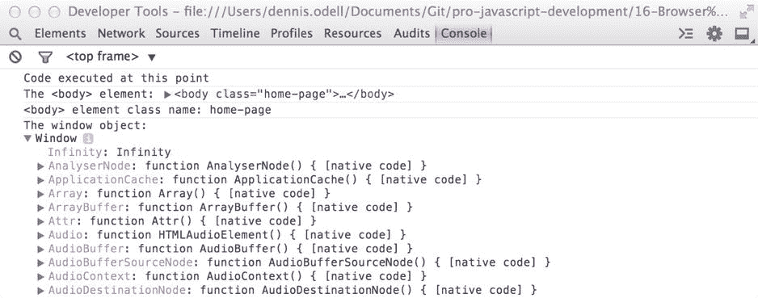
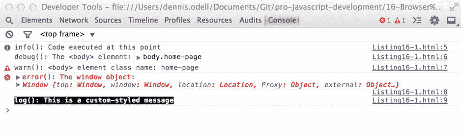
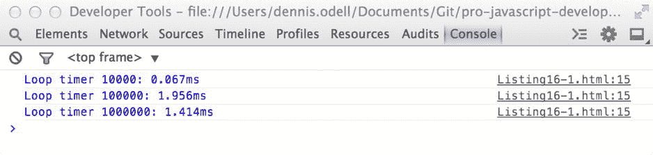
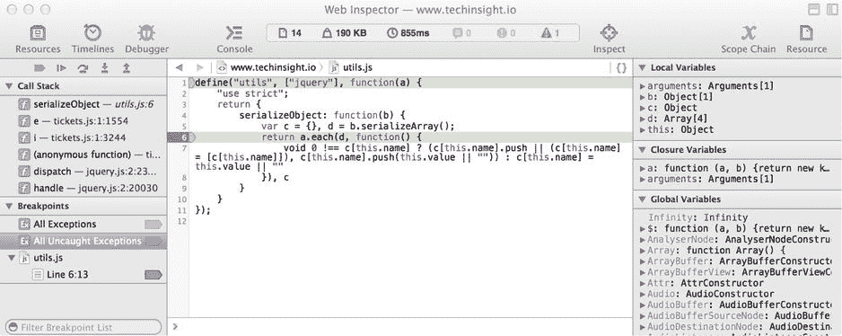
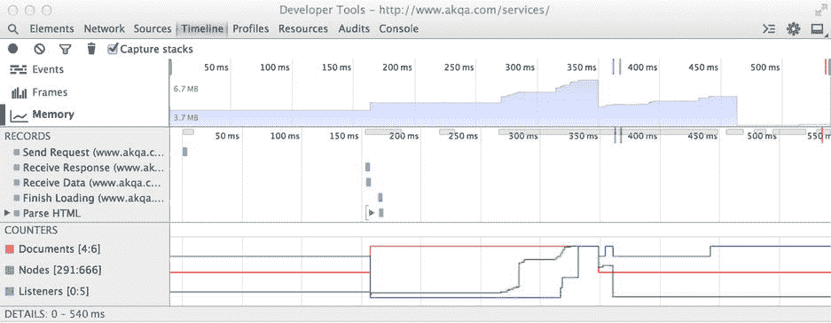
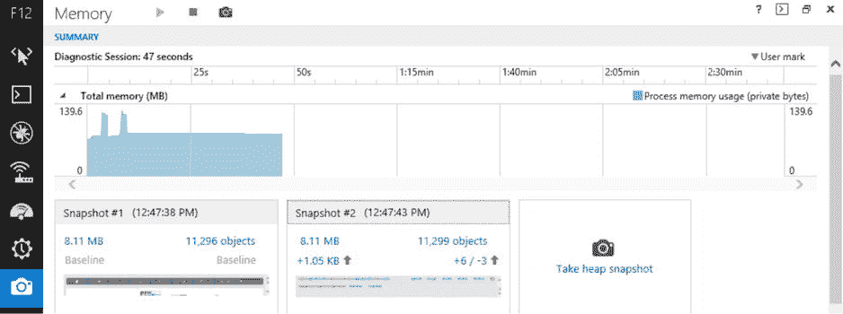

# 16.浏览器开发工具

在本书中，我解释了专业 JavaScript 开发人员如何使用高级编码技术、利用语言和浏览器功能，以及将工具应用到他们的工作流和代码中，以便生成高质量、可维护的 JavaScript 代码，使他们的应用的最终用户和其他开发人员受益。web 开发的主要前沿是浏览器，它是在野外运行我们的应用以供公众访问的平台。虽然我们可以针对我们的代码运行大量的工具来预先检查其质量，但是在 web 浏览器中运行代码以确保它不仅正确运行，而且高性能和高内存效率，这确实是无可替代的。我们可以在浏览器环境中使用内置于所有主流浏览器中的开发工具集来测量和调试我们的代码，以便深入了解代码执行时发生的情况。我们可以使用从这些工具中收集的数据来改进我们的代码，将最后的润色添加到我们的 JavaScript 中，以确保它能够为我们的最终用户高效地执行。在这一章中，我将带你浏览浏览器开发工具，这些工具将有助于确保你的代码是高性能和准确的。

最早流行的浏览器开发工具之一是 Firebug ( [https:// getfirebug。com](https://getfirebug.com/) ，2006 年发布的 Mozilla Firefox 浏览器的扩展，它允许开发人员针对当前运行的网页执行任务，包括检查当前页面结构的实时表示中的 DOM 元素和属性，观察应用于任何元素的 CSS 样式规则，跟踪渲染当前页面的所有网络请求的列表，以及针对内存中运行的页面代码执行命令的 JavaScript 开发人员控制台。由于其易用性和强大、准确的工具集，它很快被世界各地的专业 web 开发人员采用，并确保 Firefox 成为当时开发人员的首选浏览器。

自 2006 年以来，每个主要的浏览器制造商都将他们自己的一套等效的开发工具集成到他们的产品中，其中许多功能都是受 Firebug 的启发或从 Firebug 中派生出来的，而今天的 web 开发人员现在对于哪个是最好的浏览器内工具集存在分歧。在这一章中，我将向您介绍各种主流浏览器中的开发工具，并详细介绍它们共享的功能，这些功能将帮助您调试和提高 JavaScript 代码的效率。

## 定位隐藏的浏览器开发工具

桌面设备上最新版本的 Microsoft Internet Explorer、Google Chrome、Apple Safari、Opera 和 Mozilla Firefox 浏览器都包含一组隐藏的开发人员工具，可以通过以下方式访问:

*   在 Internet Explorer 中，只需按键盘上的 F12 键；或者，从浏览器的设置菜单中选择“F12 开发者工具”。
*   在 Chrome 中，使用 Windows 中的 Ctrl + Shift + I 组合键或 Mac OS X 中的 Option (  ) + Command (  ) + I 组合键，或者从菜单中选择 Tools\Developer Tools。
*   在 Safari 中，打开“偏好设置…”菜单，选择“高级”标签，然后选中“在菜单栏中显示开发菜单”选项。然后组合键 Option (  ) + Command (  ) + I 打开开发者工具。或者，在选择此选项时出现在菜单栏中的“新开发”菜单中，选择“显示 Web 检查器”菜单项。
*   在基于谷歌 Chrome 的 Opera 中，使用相同的组合键，Windows 中的 Ctrl + Shift + I 或 Mac OS X 中的 Option (  ) + Command (  ) + I，或者选择菜单栏中的 View\Show Developer 菜单选项。
*   要在 Firefox 中打开标准的开发人员工具，请在 Windows 中使用 Ctrl + Shift + C 组合键，或者在 Mac OS X 中使用 Option (  ) + Command (  ) + C 组合键，或者从菜单栏中选择 Tools\Web Developer\Inspector。
*   要打开 Firefox 的 Firebug 开发工具，首先从 [https:// getfirebug 安装浏览器扩展。然后从菜单栏中选择 Tools \ Web Developer \ Firebug \ Show Firebug 选项。](https://getfirebug.com/)

或者，许多浏览器允许您右键单击当前页面上的任何元素，并选择 Inspect Element 上下文菜单项，以调出开发人员工具栏，显示页面 DOM 当前状态的默认视图。

图 [16-1](#Fig1) 显示了在 Safari 浏览器中针对网页运行的浏览器开发工具。请注意，在工具栏的左侧可以看到正在运行的页面的动态 DOM 结构，在工具栏的右侧可以看到应用于每个元素的 CSS 样式规则。将鼠标悬停在 DOM 结构中的某个元素上，会在运行的网页上突出显示该元素，以帮助调试。您可以单击编辑 DOM 和 CSS 属性，以在浏览器窗口中实时更新页面内容。

图 16-1。

The browser developer tools running against a web page in the

所有主流浏览器中的开发工具都共享许多相同的数据视图。在这一章中，我们将关注那些最适合 JavaScript 开发的；但是，我鼓励您亲自体验每一种特性，以发现这些特性不仅仅可以帮助您进行 JavaScript 开发。

## JavaScript 控制台

JavaScript 开发人员的浏览器开发工具的主要选项卡称为控制台。这不仅允许您针对从当前运行页面加载到内存中的代码执行 JavaScript 命令，还允许您使用开发者工具提供的`console` JavaScript 对象从代码中输出调试信息。我们在第 14 章中看到了这个相同的对象，它被用来向运行 Node.js 应用的命令行输出消息。这里，它将消息输出到浏览器开发人员工具中的 JavaScript 控制台窗口。

### 将消息输出到控制台窗口

如果您希望输出变量值，或者向控制台窗口写一条消息来帮助您调试正在运行的 JavaScript 代码中的问题，请使用`console.log()`方法而不是标准浏览器`alert()`对话框。为了显示所需的信息，您可以根据需要随时写入控制台；您甚至可以向该方法传递多个参数，以便在控制台的同一行上并排写出这些参数。传递给函数的任何变量都将根据其值类型以适当的方式显示，包括对象和函数，对象显示时带有可单击的句柄，允许您浏览其层次结构以查看其属性和方法的内容，函数显示为字符串，允许您查看其中的代码内容。清单 16-1 显示了`console.log()`方法的一些可能用途，图 [16-2](#Fig2) 显示了当代码在浏览器的网页环境中运行时，Chrome 浏览器开发人员工具控制台的输出。

清单 16-1。将值和变量输出到 JavaScript 开发人员工具控制台

`console.log("Code executed at this point");`

`console.log("The <body> element:", document.body);`

`console.log("<body> element class name:", document.body.className);`

`console.log("The window object:", window);`

图 16-2。

The console output of running Listing 16-1 within a web page

您可以使用`console.log()`方法的四种不同方法将特定的控制台消息和变量值表示为不同的类型:

*   `console.info(),`表示该消息仅供参考
*   `console.debug(),`表示该消息旨在帮助调试错误
*   `console.warn(),`表示代码中可能出现了问题，该消息指出了潜在问题的详细信息
*   这表示发生了错误，并且附带的消息包含该错误的详细信息

每一个都以不同的方式在开发人员控制台中突出显示，控制台窗口顶部的一个过滤器控件允许根据显示消息的不同方法所表示的类型来隐藏和显示消息。

如果您希望使用自己的配色方案突出显示您的控制台消息，您可以提供 CSS 样式信息作为第二个参数给一个`console.log()`方法调用，前提是您以`%c`控制代码序列开始第一个参数中包含的基于字符串的消息。

清单 16-2 显示了可以应用于发送到控制台窗口的消息的不同类别级别，以及如何将您自己的定制样式应用到您的消息中。图 [16-3](#Fig3) 显示了当清单 16-2 中的代码在浏览器的网页环境中运行时，Chrome 浏览器开发者工具控制台的输出。请注意不同类别的消息如何以不同的方式显示，以便识别它们。

清单 16-2。向 JavaScript 开发人员工具控制台输出不同的类别级别和消息样式

`console.info("info(): Code executed at this point");`

`console.debug("debug(): The <body> element:", document.body);`

`console.warn("warn(): <body> element class name:", document.body.className);`

`console.error("error(): The window object:", window);`

`console.log("%clog(): This is a custom-styled message", "font-weight: bold; background: black; color: white;");`

图 16-3。

The console window output in Google Chrome when running Listing 16-2 within a web page

`console`对象的`info()`、`debug()`、`warn()`和`error()`方法对于较大的 JavaScript 应用非常有用，这些应用可能需要在开发期间进行大量的调试，以便在发布给公众之前识别和修复潜在的问题。您应该尽可能多地使用它们来理解您的代码是如何运行的，利用控制台窗口的消息过滤功能，只标记您在任何时候都需要的那些类型的消息。

### 使用控制台进行性能测量

`console`对象包含两个方法，`time()`和`timeEnd()`，用于处理时间的流逝，我们可以用它们来创建代码性能度量的基本形式。执行`console.time()`，将唯一标识符标签字符串作为参数传递给它，启动与给定标识符相关联的浏览器中运行的计时器。使用不同的标识符调用同一个方法允许启动多个计时器，而不会互相干扰。要停止计时器运行，执行`console.timeEnd()`，向其传递与启动计时器相同的标识符值。此时，计时器开始和结束之间经过的毫秒数将连同与该计时器相关联的标识符名称一起被写到 JavaScript 控制台。这允许对代码的各个部分进行基本的性能测量，这可以帮助您确定代码中的性能瓶颈，并帮助您重写代码以简化任何相对较慢的操作。

清单 16-3 中的代码演示了如何使用`console`对象的`time()`和`timeEnd()`方法来测量特定代码循环的性能。

清单 16-3。使用 JavaScript 开发人员控制台测量运行一段代码所需的时间

`function counter(length) {`

`var output = 0,`

`index = 0;`

`console.time("Loop timer " + length);`

`for (; index < length; index++) {`

`output = output + index;`

`}`

`console.timeEnd("Loop timer " + length);`

`}`

`counter(10000);`

`counter(100000);`

`counter(1000000);`

在浏览器的网页环境中运行清单 16-3 中的代码会产生如图 [16-4](#Fig4) 所示的 JavaScript 控制台输出。注意每个`time()`和`timeEnd()`方法调用之间的持续时间被写入控制台，旁边是与每个`counter()`方法调用相关联的唯一标识符名称。在本章的后面，我们将进一步了解 JavaScript 性能分析。

图 16-4。

The console output of running Listing 16-3 within the context of a web page

### 移除对用于释放的控制台对象的代码引用

在发布最终的公共代码之前，请确保从 JavaScript 文件中删除了对`console`对象的引用，因为该对象只存在于当前安装并启用了开发工具的浏览器中，而在大多数用户的浏览器中，情况可能并非如此。如果你正在使用一个自动化的 Grunt 构建过程，你可以使用`grunt-strip`插件任务([http://bit . ly/Grunt-strip](http://bit.ly/grunt-strip))来为你做这件事。对于 Gulp.js task runner 用户来说，`gulp-strip-debug`包( [http:// bit. ly/ gulp-strip](http://bit.ly/gulp-strip) )是你需要在发布前移除这个对象的方法调用的插件。

对于开发人员来说，JavaScript 控制台是一个非常有用的工具，可以在代码运行时输出消息，检查变量的状态，确定哪些代码分支正在执行，以及某些操作需要多长时间才能完成。要了解关于 JavaScript 控制台的更多信息，请查看 Matt West 在 Treehouse 博客上发表的文章“掌握开发人员工具控制台”，网址是 http:// bit. ly/ js-console 。

## 调试正在运行的 JavaScript 代码

除了 JavaScript 控制台，浏览器开发人员工具还允许观察和调试正在运行的代码，让代码停止运行，一行一行地执行，并在任何时候恢复运行。缩小的代码对于开发人员工具来说不是问题，因为我们有办法通过按下按钮将其转换为未缩小的代码，或者引入到每个 JavaScript 文件的未缩小版本的链接，当在工具窗口中显示时，浏览器工具用该链接替换运行的代码。

### 使用精简代码

尽管 JavaScript 开发人员控制台非常适合于在开发过程中调试和跟踪代码，但有时我们需要调试已经被缩小并从 web 服务器而不是本地开发机器上运行的代码。幸运的是，在浏览器开发工具中，有两个选项可以用来处理缩小的 JavaScript 文件:漂亮打印和源地图。

#### 漂亮的印刷

在 browser developer tools 中处理缩小代码的第一个选项是美化打印，通过遵循标准的制表符和空格模式将缩小过程中从 JavaScript 文件中删除的空格添加回文件中，以嵌套函数、对象和其他代码块，从而使缩小后的文件再次可读。

在 Firefox developer tools 中启用 pretty-print 是一个简单的例子，选择它的 Debugger 选项卡来显示当前由显示的 web 页面加载到内存中的 JavaScript 文件。从左侧面板的列表中选择一个缩小的文件，然后单击底部工具栏中标有“`{}`”的图标按钮，观察文件如何被赋予适当的间距，以便于阅读。如果变量已经被混淆，被更短、更晦涩的名字所取代，这些仍然会以它们的混淆形式显示，这可能会使调试更加困难；但是，漂亮的打印可以帮助您更好地识别原始文件的结构，以便在浏览器中调试它。

Firebug 扩展支持通过显示在其脚本选项卡顶部工具栏中的相同按钮进行漂亮打印。启用此选项后，选择左侧面板中的任何文件都会显示该文件的精美打印版本，无论原始文件是否被缩小。

在 Safari 的开发者工具中，选择“资源”选项卡，从左侧面板的列表中找到一个缩小的 JavaScript 文件，然后单击文件文本上方右上角工具栏中的“`{}`”按钮来美化其内容。

类似地，在 Chrome 和 Opera 开发工具中，它们共享相同的底层代码库，选择 Sources 选项卡并识别一个缩小的文件；点击文件下方的“`{}`”按钮，将打印出文件内容。

在 Internet Explorer 中，打开开发工具并选择调试器选项卡，找到一个缩小的文件，然后单击顶部工具栏中的“`{}`”按钮来美化所选文件的内容。

漂亮打印是在浏览器开发工具中查看缩小文件的一种非常快速和简单的方法，尽管对于更简单的调试，以及访问模糊变量和函数名的原始名称，源映射是更好的选择。

#### 源地图

在浏览器开发工具中处理缩小代码的第二个选项称为 source maps，其中缩小的文件通过引用相同 JavaScript 代码的完整、未缩小版本进行编码，即使原始代码分布在多个文件中。源映射文件使用一个`.map`扩展名，并具有一个 JSON 结构，描述原始文件和缩小文件之间的映射，包括它们的变量和函数名，如果它们在缩小过程中被混淆的话。

将一个缩小的文件链接到一个关联的源映射文件非常简单，只需在引用源映射位置的 JavaScript 文件的末尾附加一个特殊格式的注释。例如，要将名为`scripts.min.js`的缩小文件连接到名为`/scripts/scripts.js.map`的 JSON 格式的源映射文件，请在缩小文件的末尾添加以下注释:

`//# sourceMappingURL=/scripts/scripts.js.map`

或者，如果您可以访问您的 web 服务器，您可以将以下 HTTP 头添加到缩小文件的响应中，尽管许多人为了简单起见选择使用特殊格式的注释:

`X-SourceMap: /scripts/scripts/js.map`

在压缩 JavaScript 文件的同时生成源映射文件。UglifyJS([http://bit . ly/uglify _ js](http://bit.ly/uglify_js))和 Google Closure Compiler([http://bit . ly/Closure _ compile](http://bit.ly/closure_compile)—使用`create_source_map`选项)这两个在[第 4 章](04.html)中介绍的工具都能够自动生成一个源映射文件，并且会自动在缩小文件的底部包含特殊格式的推荐引用。

在 Chrome 开发者工具中，你必须启用识别源地图的功能。单击工具栏中的设置菜单图标，并选择常规选项部分中的启用源地图。默认情况下，其他浏览器的开发人员工具会启用该功能。在 Chrome 开发者工具中选择 Sources 标签，你会看到一个文件的分层文件夹视图，这些文件组成了当前的网页。从源映射的数据结构链接到的任何文件都显示在这个层次结构中，就好像它们是通过 HTML 页面本身的直接链接加载的一样。

类似地，在 Firefox 开发工具中，选择 Debugger 选项卡会在左侧的面板中生成一个 JavaScript 源文件列表。此列表中自动包括从任何源地图链接的每个文件的完整、未统一版本。在撰写本文时，Firebug 不支持源地图，所以您应该借助内置的 Firefox 开发工具来利用这一特性。

Safari 开发人员工具在“资源”标签的左侧面板中，将带有关联源地图的缩小文件显示为已加载文件层次结构中的额外项目。然后，通过源映射链接的文件显示在层次结构中缩小文件名称的下方，如图 [16-5](#Fig5) 所示，其中有一个名为`scripts.js`的缩小文件，链接到许多原始的、未缩小的文件。

图 16-5。

Unminified files from source maps are shown one level beneath the original minified file in Safari

Internet Explorer 开发人员工具通过调试器选项卡提供对源映射功能的访问。当选择引用源地图的 JavaScript 文件时，工具栏上的文件内容上方会出现一个额外的按钮，按下该按钮后，会在主面板中加载并显示文件的未缩小版本，替换缩小的文件。

### 暂停并观察正在运行的 JavaScript 代码

浏览器开发工具具有额外的功能，可以近距离观察 JavaScript 代码在浏览器中的运行情况，甚至允许一次执行一行代码，并在每行代码执行时观察变量值的变化。

要在 JavaScript 代码到达特定代码文件中的某一行时停止执行，请使用本章稍后介绍的两种技术之一在该行插入一个断点。加载或刷新页面并到达代码行后，页面暂停并让您控制 JavaScript 代码的运行。

在代码中插入断点的第一个技巧是添加一行代码，强制执行在文件中的该点暂停。为此，在 JavaScript 文件中您希望暂停执行的位置添加以下行:

`debugger;`

执行时，开发人员工具将在这一点暂停，让您控制执行流程，并允许您在代码执行的那一刻观察任何全局或局部变量的值。请确保在发布之前从代码中删除对该命令的任何引用，但是，与`console`对象一样，这是一个自定义的 JavaScript 命令，仅用于浏览器开发工具。

插入断点的第二种技术是，在浏览器开发人员工具中查看 JavaScript 文件时，只需单击希望暂停执行的代码行号。代码行旁边会出现一个标记，表示已经设置了一个断点，再次单击可以删除该断点。刷新页面将保留所有断点，代码将在到达第一个断点时暂停，等待您的下一个操作。设置完成后，大多数浏览器开发工具都允许您右键单击断点并编辑适用于它的条件，从而允许您指定在触发特定断点之前应用应该处于的确切状态。如果您希望在循环中放置一个断点，但只希望断点在到达该循环的特定迭代时停止代码执行，这将非常有用。

当在断点处暂停时，只需将鼠标悬停在任何变量名上，就可以检查断点周围代码中由该点设置的任何变量的值(不幸的是，Firefox 开发人员工具不支持这一点，所以请使用 Firebug 来利用这一特性)。工具提示将显示突出显示的变量中的值，并允许您扩展对象以显示其属性中的值。您也可以在暂停时打开 JavaScript 控制台，并使用数据输入字段来执行其他代码，或者查询特定变量的值，所有这些都在断点的当前范围内。这对于强制函数返回不同的值，或者确保特定的条件语句在代码流中执行非常有用。

无论使用何种浏览器开发工具，当在断点处暂停时，右侧的面板会显示执行调用堆栈的详细信息，包括引入当前暂停的函数的调用函数名、全局变量和局部范围变量的列表以及它们的当前值。例如，当在一个函数中暂停时，您可以访问该函数中声明的所有变量，以及特殊变量，如`arguments`，显示执行时传递给该函数的所有参数。这为您(开发人员)提供了应用中变量状态的一目了然的视图，使您能够确定它们是否符合预期，从而允许您在需要时进一步调试。

暂停后，您会注意到在工具栏中显示的 JavaScript 代码上方的工具栏中有一个 continue 按钮，让人想起视频播放按钮。当按下此按钮时，代码将继续执行，直到遇到下一个断点。还要注意在工具栏中的继续按钮旁边有一组三步操作按钮。这允许您一次一条语句地继续执行代码，而不需要设置另一个断点，允许您查看对变量执行的操作以及浏览器的 JavaScript 解释器在应用中执行的流程，而不需要预先知道将会执行什么过程。这些步骤按钮中的一个将执行当前文件中的下一条语句，而不需要输入任何调用的函数(如果遇到函数的话)。如果您对被调用函数的返回值比对这些函数中的代码更感兴趣，这将非常有用。这些按钮中的另一个将执行下一条语句，如果存在被调用的函数，则进入该函数，并在该函数中的第一条语句处再次暂停。final 按钮允许您执行当前正在执行的函数的其余部分，并在将程序流带入该函数的函数调用之后的下一条语句处再次暂停。使用这些按钮，您可以跟踪代码流，沿途观察存储在局部和全局变量中的值，以帮助您在当前浏览器中运行的网页的上下文中定位和调试代码中的问题。

图 [16-6](#Fig6) 显示了一个 Safari 开发者工具的例子，在到达中间区域代码旁边的行号列中指示的断点时暂停。左侧面板显示 continue 和 step 按钮、执行调用堆栈(包括到达当前断点之前执行的函数名)以及所有正在运行的文件中所有断点的列表。右侧面板显示了在局部作用域、当前函数闭包和全局作用域中声明的当前变量。其他浏览器开发工具以类似的布局显示相同的信息。

图 16-6。

Using breakpoints to pause code execution in order to observe the values in local variables

## 剖析 JavaScript 代码

浏览器开发工具允许您分析 web 应用的内存使用情况，以及各个 JavaScript 函数的运行时性能。使用这些数据，您可以更新您的代码，使其对您的用户更有效，消除内存泄漏并释放任何潜在的性能瓶颈。

### 定位内存泄漏

当您的代码在函数中创建和初始化变量时，这些值会消耗浏览器中一定量的内存，具体取决于它们的类型和值。当其作用域的执行结束时，变量在内部被标记为删除。浏览器中的垃圾收集器进程处理这些变量，以及它认为不再需要的任何其他变量，因为它们没有来自运行代码中任何其他对象的活动引用，从而释放它们的内存。内存泄漏是指随着时间的推移，不再需要的某些变量没有被释放，这意味着浏览器剩余的可用内存会慢慢减少，直到没有剩余内存，浏览器进程被迫崩溃。在基于 JavaScript 的 web 应用中，内存泄漏有三个主要原因。

首先，使用`console`对象将一个对象的值记录到浏览器开发人员工具中的 JavaScript 控制台会导致内存泄漏。这使得对该对象的引用在内存中保持“活动”,尽管代码库的其余部分可能不再需要访问它。这可能会导致开发中的内存泄漏问题，一旦这些日志记录方法调用被删除，这些问题将不会出现在您的最终代码中，因此要对此保持警惕。

其次，对 JavaScript 函数闭包的引用是 web 应用中内存泄漏的另一个常见来源。假设一个事件处理程序闭包引用了代码中某个地方的一个对象的属性。即使在代码中的某一点之后不再需要或使用该对象，闭包可能会被执行并引用该对象的事实意味着，只要该事件处理程序仍处于活动状态，该对象就会一直保留在内存中。因此，一定要对 DOM 元素使用`removeEventListener()`方法，以确保不再需要的对象的引用被删除，它们的内存被释放。

最后，内存泄漏可能是由于两个或多个对象之间的存储引用使其中一个对象分配的内存被保留，尽管应用不再需要它。这可能看起来违反直觉，但通常减少内存泄漏的最佳方法是将从其他对象引用的数据作为该数据的副本存储在单独的局部变量中。

Chrome、Opera 和 Internet Explorer 11 中的浏览器开发工具能够分析 JavaScript 代码在 web 应用环境中运行时的内存使用情况。

#### Chrome 和 Opera 中的内存分析

要查看 JavaScript 在 Chrome 浏览器中消耗了多少内存，通过窗口\任务管理器菜单栏选项打开任务管理器窗口。右键单击打开选项卡列表标题，并选择在表中显示 JavaScript 内存。然后，您将看到 web 应用的 JavaScript 部分消耗了多少内存。如果你有多个打开的标签页，你也会看到这些应用的内存消耗，允许你与其他网络应用进行比较。

如果您需要在任何时候观察应用的确切内存使用情况，您可以使用 Chrome 或 Opera 开发工具的 Profiles 选项卡中的堆快照功能。要按对象获取内存使用情况的即时快照，请选择获取堆快照单选按钮，然后单击开始按钮。拍摄的快照将在左侧面板中可见，您可以选择该面板向您显示由构造函数(或内置类型)组织的对象的摘要，这些对象用于实例化它，并显示每个对象消耗的内存大小。然后，您可以深入查看哪些对象消耗的内存比预期的多，以便修复这些对象中可能存在的特定问题。

如果您想比较 web 应用的整个内存使用量在特定时间段内的变化情况，请使用开发工具的 Profiles 选项卡中的 Record Heap Allocations 单选选项，然后单击 Start 按钮。一个红色的指示器将出现在开发者工具的左上方，表示内存使用情况正在被记录。准备就绪后，单击此指示器停止录制。从开始录制到停止录制之间的内存使用情况将绘制在 developer tools 主面板的图表上，峰值表示内存使用情况的变化。图表下方是在录制期间内存使用情况发生变化的对象列表。图表上方的范围选择器允许您将内存使用事件过滤到一个狭窄的范围内，帮助您准确地关注哪些对象更改引起了较大的内存更改，以便您可以研究在应用中改善过度内存使用的方法。

浏览器的开发人员工具中的时间轴选项卡在左侧面板中显示内存时间轴工具。要运行内存时间线检查，只需在刷新页面开始测量时选择时间线选项卡。应该会出现一个图形，显示正在运行的页面消耗的内存量，直到达到页面加载事件。图表下方是一个记录列表，显示了发生的每个影响应用内存使用的事件，以及事件类型、文件名和影响内存使用的操作行号的详细信息。使用图表上方的滑块选择一个时间范围，可以将记录列表过滤为特定范围内的记录(可能是您注意到内存使用量出现较大峰值但随后没有释放的记录)，这将有助于调试哪些操作导致应用在初始化和运行时消耗内存。图 [16-7](#Fig7) 显示了运行中的内存时间线工具，包括一个随时间变化的内存使用图，一个导致内存分配变化的事件列表，以及一个活动 DOM 节点和事件监听器的计数器，这通常是 web 应用中内存泄漏的原因。

图 16-7。

The Memory timeline tool active in Chrome and Opera browser developer tools

要了解更多关于 Chrome 浏览器开发工具的内存配置文件功能，以及 Opera 的开发工具，请查看以下在线资源:http:// bit. ly/ chrome-memory 。

#### Internet Explorer 11 中的内存分析

受 Chrome 浏览器开发工具的内存分析功能的启发，微软在他们的 Internet Explorer 浏览器版本 11 中添加了一个类似但更完善的相同功能版本。单击 IE11 开发人员工具中的 Memory 选项卡会弹出一个面板，其中有一个开始进行内存分析的选项。选择工具栏中的 play 按钮，或点击面板中间的链接，开始分析浏览器中的内存使用情况。将出现一个图表，详细说明久而久之的内存使用情况。要获取任意给定点的内存使用情况的快照，请选择图形下方的获取堆快照按钮。此时内存使用情况的详细信息将出现在图表下方的一个框中。单击框中显示的内存大小将显示内存中对象的列表及其各自的内存大小，让您可以看到哪些对象可能会导致应用中的内存问题。创建第二个快照将显示新快照与前一个快照之间内存大小和对象数量变化的详细信息。选择任何一条信息上的链接都会显示两个快照之间的内存使用情况和对象列表之间的比较。

图 [16-8](#Fig8) 显示了在 Internet Explorer 浏览器开发工具中运行的内存工具，显示了一段时间内存使用情况的图表，以及在几秒钟内拍摄的两个内存快照，在第二个快照的详细信息框中突出显示了两个快照在内存大小和对象数方面的差异。

图 16-8。

The Memory tab in IE11 developer tools provides a simple UI for investigating memory usage

Internet Explorer 中的内存分析工具在很大程度上与 Chrome 和 Opera 开发工具相匹配；但是，它们包含在一个选项卡中，在我看来，这是一个更易于使用的界面，用于调试 web 应用中的内存使用情况。

要了解关于 IE11 内存工具的更多信息，请查看以下关于该主题的在线资源:http://bit . ly/ie-Memory。

### 识别性能瓶颈

有时候，在测试 web 应用时，您会注意到，在 JavaScript 执行的某些时候，浏览器似乎会在一瞬间锁定或冻结。当浏览器被迫将 JavaScript 解释器的优先权给予其渲染器时，会发生这种情况，因为发生了一系列操作，没有给渲染器留下空间来赶上自己。这通常是由于`for`或`while`循环执行了太多的迭代，淹没了浏览器。在这种情况下，或者为了确保这种情况不会在您的代码中发生，请利用浏览器开发人员工具的性能分析功能来测量和改进您的 JavaScript 代码。

在 Chrome 和 Opera 开发工具中，Profiles 选项卡允许您使用 Collect JavaScript CPU Profile 单选选项来分析您的 JavaScript。单击 Start 开始分析，如果不想再收集任何数据，则停止分析。您将看到一个命名函数调用的列表，按照调用时间的顺序排列，并提供了指向文件的链接和执行它们的行号。顶部工具栏中的“`%`”切换按钮允许您在显示执行每个功能所用的绝对时间(以毫秒为单位)和该功能所用的总分析时间的百分比之间切换。如果任何特定的函数在内部执行了其他函数，这些函数旁边会显示一个箭头，允许您过滤每个单独的子函数花费的时间。这个视图本身应该允许您定位代码运行中出现性能瓶颈的位置，但是一个单独的图表视图(通过工具栏中的选择框可以访问)显示了一段时间内性能的图形视图，峰值表示活动。下图还允许您通过将鼠标悬停在峰值上来查看每个文件和函数所用的时间。图表上方的范围滑块允许您将显示的数据缩小到所分析的时间段内的某个时间范围，使您可以专注于特定的活动区域，以跟踪代码中的任何性能问题。要了解更多关于 Chrome 开发者工具的 JavaScript 分析功能，请在[http://bit . ly/Chrome-profile](http://bit.ly/chrome-profile)上在线阅读更多详细信息。

Safari 开发者工具的时间线标签中有一个非常相似的功能。配置文件标题旁边左侧面板中的按钮允许 JavaScript 配置文件按需启动和停止，方法是在弹出的选择框中选择启动 JavaScript 配置文件选项。工具栏中的“`%`”按钮可以在显示的时间单位之间切换，类似于 Chrome 开发工具中的功能调用和每次调用所用的时间，尽管这里没有图表功能。要更详细地了解 Safari 的档案功能，请在线查看[http://bit . ly/Safari-profile](http://bit.ly/safari-profile)。

Firefox 中的浏览器开发工具包含相同的配置特性，实现方式非常相似。在 developer tools 中选择 Profiles 选项卡，并选择左侧面板左上角的 time 图标开始分析，再次单击停止收集数据。类似的按执行持续时间顺序的分层函数调用视图显示在主面板中，上面的图表显示了性能峰值和谷值，如图 [16-9](#Fig9) 所示。选择顶部图形中的一个区域，可以过滤函数调用列表，只显示在所选时间范围内发生的函数调用，从而确定哪些函数可能会导致性能问题并需要解决。要了解更多关于 Firefox 开发工具的 JavaScript 分析能力，请查看[http://bit . ly/Firefox-profile](http://bit.ly/firefox-profile)。请注意，Firebug 中没有内置的类似工具，因此对于该功能，请使用内置的 Firefox 开发人员工具。

图 16-9。

The Profiler tab in Firefox developer tools allow you to drill down to locate poor performing functions

Internet Explorer 11 开发人员工具通过其 Profiler 选项卡提供了类似的分析功能。要开始分析 JavaScript，单击顶部工具栏中绿色的 play 按钮，单击红色的 stop 按钮以停止收集数据。然后，已执行函数的列表显示在主面板区域中，通过切换可以在函数和调用树视图之间切换，前者显示每个被调用函数的平面视图，执行时间最长的函数位于列表顶部，后者显示被调用函数的分层视图，基于内部调用的其他函数。和 Safari 开发者工具一样，没有允许你按时间过滤的图表视图；但是，该列表本身包含了足够的信息来调试性能问题，因为它指向了执行时间最长的函数的文件和行号，向您显示了调试工作的确切重点。要了解更多关于 IE11 开发者工具的 JavaScript 剖析功能，请查看 [http:// bit. ly/ ie-profile](http://bit.ly/ie-profile) 。

使用浏览器开发人员工具的分析功能，您可以深入到正在运行的代码中，发现哪些函数执行时间最长，这样您就可以检查这些函数的代码，试图找到更有效的方法来执行相同的操作并获得相同的结果。

## 摘要

在本章中，我们已经了解了如何使用浏览器的内置开发工具在真实、实时、运行的应用环境中调试和监控我们的 JavaScript 代码，使用这些工具提供的数据来改进我们的代码，以造福我们的用户，使其性能更高、内存效率更高、更不容易出现运行时错误。要了解更多关于浏览器开发工具的特性，包括哪个浏览器有哪些特性，请查看 Andi Smith 精彩的在线资源“开发工具秘密”。com 。

在本书的整个过程中，我解释了专业 JavaScript 开发人员如何使用高级编码技术、利用语言和浏览器功能，以及将工具应用到他们的工作流和代码中，以便生成高质量、可维护的 JavaScript 代码，使他们的应用的最终用户和其他开发人员受益。我相信您已经学到了一些想法、技术和技能，现在可以应用到您自己的项目中，让您获得更多的经验和更多的信心，成为一名优秀的专业 JavaScript 开发人员。感谢您的阅读，祝您编码愉快！