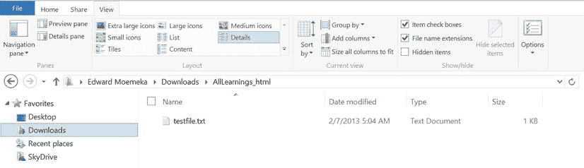
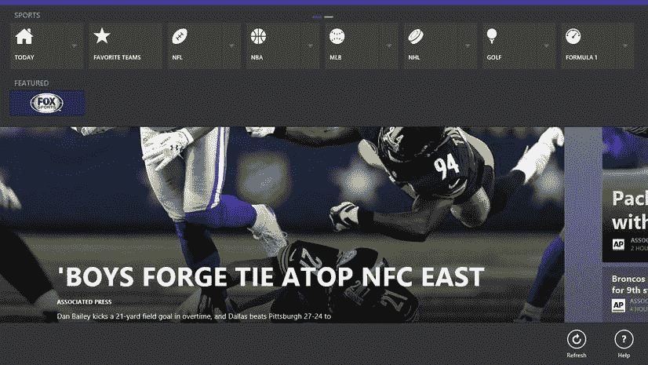
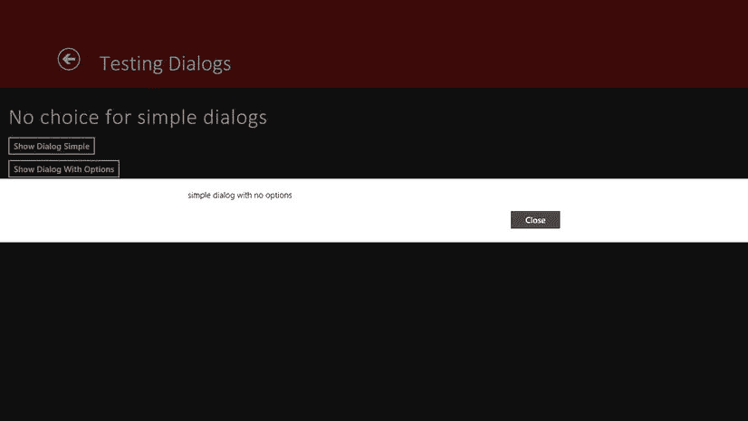

# 2.正确掌握基础知识

Abstract

如果您打算构建 Windows 8 应用程序，无论您选择使用哪种技术，都必须习惯某些基本的开发人员工作流程。从根本上说，对如何访问公开的文件系统有一个很好的理解，即使不是至关重要的，也是对给定系统中的开发非常重要的。本章通过向您展示用于处理这些关键领域的 API，向您介绍了这些领域。提供了详细的示例来帮助您了解这些 API 是如何工作的。在本章中，您将探索文件系统访问，以及 Windows 8 开发中生态系统的一些新的重要元素。在本章结束时，你应该了解如何进行文件访问，如何与锁定屏幕交互，如何用文件对话框提示用户，以及如何在应用程序继续在后台加载时使用闪屏来吸引用户，并随后通知用户。

如果您打算构建 Windows 8 应用程序，无论您选择使用哪种技术，都必须习惯某些基本的开发人员工作流程。从根本上说，对如何访问公开的文件系统有一个很好的理解，即使不是至关重要的，也是对给定系统中的开发非常重要的。本章通过向您展示用于处理这些关键领域的 API，向您介绍了这些领域。提供了详细的示例来帮助您了解这些 API 是如何工作的。在本章中，您将探索文件系统访问，以及 Windows 8 开发中生态系统的一些新的重要元素。在本章结束时，你应该了解如何进行文件访问，如何与锁定屏幕交互，如何用文件对话框提示用户，以及如何在应用程序继续在后台加载时使用闪屏来吸引用户，并随后通知用户。

## 文件输入输出

构建了服务器端风格代码甚至桌面客户端的开发人员可能非常熟悉文件访问的一般模式。如果你一直在构建 HTML 用户体验，你可能会有一点劣势，但只是一个小劣势。事实是，我们在使用计算机时都处理过文件，我们当然都了解它们的本质。可以打开、编辑、关闭、删除、列出、搜索、复制和移动它们。

尽管在逻辑上是相似的(如果不是相同的话)，但是这个讨论分为三个核心领域。首先，这一章谈到了存储位置(指存储文件的地方)。这一对话非常重要，因为它对您的应用程序的构建、交付以及最终部署到 Windows 应用商店的方式有着巨大的影响。然后你进入实际处理文件的本质。这是第二步，因为通过 Windows Runtime for JavaScript 访问文件的方法要求您首先理解存储位置的含义。如果没有这种核心的理解，你很可能会焦虑不安，不知道为什么一个给定的功能会莫名其妙地失败，并出现一个完全无用的神秘错误。

## 存储文件夹

`StorageFolder`类包含了存储位置的一般含义。如前所述，Windows 8 文件可以驻留在任意数量的位置。您开发的应用程序可以访问这些文件，或者是通过在应用程序的清单中声明权限。您的应用程序具有内在访问权限的一些存储位置包括应用程序的包安装位置和独立存储区域。这些存储位置将在以下章节中详细讨论。

### 隔离存储区

应用程序的独立存储区域是 Windows 系统上安装该应用程序的未发布位置。它充当应用程序读取和写入的缓存。通过添加或删除文件、创建文件夹等方式对独立存储区域所做的更改会在应用程序的更新中保持不变。这是这个位置和下一节讨论的包安装位置之间的主要区别。清单 2-1 显示了如何创建、编辑、删除和读取应用程序的独立存储中的文件。

Listing 2-1\. File Access from the Isolated Storage Area

`//write the file to isolated storage`

`btn_createfile_iso.onclick = function ()`

`{`

`if (txt_display.value.length > 0)`

`{`

`Windows.Storage.ApplicationData.current.localFolder.createFileAsync("testfile.txt"`，ⅵ

`Windows.Storage.CreationCollisionOption.replaceExisting).then(function (file)`

`{`

`Windows.Storage.FileIO.writeTextAsync(file`，ⅵ

`"The quick brown fox jumped over the lazy dog`，ⅵ

`and [" + txt_display.value + "]");`

`});`

`}`

`};`

`//read file`

`btn_readfile_iso.onclick = function ()`

`{`

`Windows.Storage.ApplicationData.current.localFolder`。*本文件迟交

`getFileAsync("testfile.txt").then(function (file)`

`{`

`if (file == null)`

`{`

`} else`

`{`

`Windows.Storage.FileIO.readTextAsync(file)`

`.then(function (text)`

`{`

`txt_display.value = text;`

`});`

`}`

`});`

`};`

`//edit file`

`btn_editfile_iso.onclick = function ()`

`{`

`Windows.Storage.ApplicationData.current.localFolder`。*本文件迟交

`getFileAsync("testfile.txt").then(function (file)`

`{`

`if (file == null)`

`{`

`} else`

`{`

`Windows.Storage.FileIO.writeTextAsync(file, txt_display.value);`

`}`

`});`

`};`

`//delete file`

`btn_deletefile_iso.onclick = function ()`

`{`

`Windows.Storage.ApplicationData.current.localFolder`。

`getFileAsync("testfile.txt").then(function (file)`

`{`

`if (file == null)`

`{`

`var v = new Windows.UI.Popups.MessageDialog("File was deleted");`

`v.showAsync();`

`} else`

`{`

`file.deleteAsync();`

`}`

`});`

`};`

清单 2-1 展示了如何使用`Windows.Storage.ApplicationData.current.localFolder.createFileAsync`函数在独立存储中创建一个文件。您调用的这个函数的版本需要两个参数:一个表示文件名(在本例中为`testfile.txt`),另一个称为`Windows.Storage.CreationCollisionOption`——确定当您要创建的文件与目标文件夹(在本例中为独立存储文件夹)中已经存在的文件同名时该如何处理。这个函数有两个版本:一个期望传入单个参数(文件名)，另一个也期望包含`CreationCollisionOption`。当您使用第一个版本时，会自动使用`failIfExists CreationCollisionOption`。表 [2-1](#Tab1) 显示了`Windows.Storage.CreationCollisionOption`的所有可能选项。

表 2-1。

`Windows.Storage.CreationCollisionOption` Members

<colgroup><col> <col> <col></colgroup> 
| 成员 | 价值 | 描述 |
| --- | --- | --- |
| `generateUniqueName` | Zero | 用所需的名称创建新文件或文件夹，如果已经存在同名的文件或文件夹，则自动附加一个编号 |
| `replaceExisting` | one | 用所需的名称创建新文件或文件夹，并用该名称替换任何已存在的文件或文件夹 |
| `failIfExists` | Two | 用所需的名称创建新的文件或文件夹，如果已经存在同名的文件或文件夹，则返回错误 |
| `openIfExists` | three | 用所需的名称创建新的文件或文件夹，如果已经存在同名的文件或文件夹，则返回现有项目 |

继续讨论清单 2-1，注意第一章中讨论的`then`承诺的使用。如上所述，许多 Windows JavaScript 库(WinJS)函数使用异步编程模型，这需要使用承诺。

这个例子的其余部分很简单。清单 2-2 是清单 2-1 的一个片段，重点是读取文件的过程。

Listing 2-2\. Reading a File from Isolated Storage

`btn_readfile_iso.onclick = function ()`

`{`

`Windows.Storage.ApplicationData.current.localFolder`。

`getFileAsync("testfile.txt").then(function (file)`

`{`

`if (file == null)`

`{`

`} else`

`{`

`Windows.Storage.FileIO.readTextAsync(file).then(function (text)`

`{`

`txt_display.value = text;`

`});`

`}`

`});`

`};`

从清单 2-2 可以看出，文件访问是一个两步过程。您首先需要获取文件，然后，一旦您有了一个表示您想要访问的文件的对象(一个`StorageFile`对象)，您就可以在后续调用中使用该句柄(在本例中，您将它用作`readTextAsync`函数中的一个参数)。你将在本章后面了解`StorageFile`。

### 软件包安装位置

与独立存储位置中的文件不同，当安装应用程序的新更新时，对应用程序的包安装位置(使用`Windows.ApplicationModel.Package`类访问)所做的修改将被清除。`Package`包含一个属性`InstalledLocation`，该属性返回对一个`StorageFolder`的引用，该引用表示最终用户计算机上应用程序被解包的位置。如前所述，`StorageFolder`是存储位置的抽象容器，特别是因为它是一个抽象，您可以使用相同的实例类型来表示两个位置(即使访问文件的底层机制不同)。例如，应用程序的安装位置可能是用户系统上的文件夹，但独立存储位置可能是压缩和加密的结构。尽管如此，相同的编程接口对两者都适用。

让我们重做清单 2-1 中的例子，这样它就足够一般化，任何`StorageFolder`都可以使用它。首先，让我们创建清单 2-1 所示的创建、读取、编辑和删除功能的通用版本(参见清单 2-3)。

Listing 2-3\. Generic Reading and Writing to a Storage Location

`var createFileAsync = function (store, file_name, file_content) {`

`return store.createFileAsync(file_name`，ⅵ

`Windows.Storage.CreationCollisionOption.replaceExisting)`

`.then(function (file) {`

`Windows.Storage.FileIO.writeTextAsync(file, file_content);`

`});`

`};`

`//write the file to isolated storage`

`var readFileAsync = function (store, file_name, completeFunction) {`

`return store.getFileAsync(file_name)↩`

`.then(function (file) {`

`if (file != null) {`

`Windows.Storage.FileIO.readTextAsync(file).then(function (text) {`

`if(completeFunction != null)`

`completeFunction(text);`

`});`

`}`

`});`

`};`

`var editFileAsync = function (store, file_name, new_content) {`

`return store.getFileAsync(file_name)↩`

`.then(function (file) {`

`if (file != null) {`

`Windows.Storage.FileIO.writeTextAsync(file, new_content);`

`}`

`});`

`};`

`var deleteFileAsync = function (store, file_name) {`

`return store.getFileAsync(file_name)↩`

`.then(function (file) {`

`if (file != null) {`

`file.deleteAsync();`

`}`

`});`

`};`

前面的示例概括了在目标存储位置操作文件的活动。您允许用户传入存储位置、文件名，以及在编辑或创建文件的情况下，他们想要添加到文件中的内容。您创建了四个私有函数:`createFileAsync`、`editFileAsync`、`readFileAsync`和`deleteFileAsync`。(注意在函数名中使用了`Async`。您这样做是因为这些函数都返回了其内部文件访问方法调用所返回的承诺。像这样的异步函数名称中不需要有`Async`，但是它可以帮助下游的开发人员快速识别哪些函数是异步的，哪些不是。)每个按钮点击事件中的文件访问模式被封装到这四个函数中，并被一般化，以便任何存储位置都可以作为参数传入，并且行为将保持不变(假设应用程序可以访问该存储位置)。

假设用户界面有创建、读取、编辑和删除文件的按钮，清单 2-4 展示了如何使用按钮的点击处理程序来操作应用程序的包安装位置中的文件。

Listing 2-4\. File Access Using the Application’s Install Location

`//read file in package`

`btn_readfile_iso.onclick = function () {`

`readFileAsync(Windows.ApplicationModel.Package.current`。*本文件迟交

`installedLocation, "testfile.txt", function (text)`

`{`

`txt_diplay.value = text;`

`});`

`};`

要点是，不管底层实现如何，您都可以以相同的方式针对`StorageFolder`进行编程。因此，这一章不再关注更多的例子，而是给出了一个开发者可以使用的各种位置的概述，以及哪些类的哪些属性公开了它们。

## 关于存储的更多信息:ApplicationData 类

如果您想要加载和读取数据的只读缓存，那么访问应用程序的包安装位置是很好的选择。但是因为它非常不稳定(当应用程序更新时，它会被删除)，所以您可能永远也不应该写入它(或者至少您应该预期在每次应用程序更新后，写入其中的内容都会消失)。如清单 2-1 所示，更好的解决方案是使用`Windows.Storage`名称空间中的类，特别是`ApplicationData`类。`ApplicationData`提供对应用程序虚拟文件存储的直接访问。它可用于访问本地、漫游或临时的存储位置。表 [2-2](#Tab2) 提供了值得注意的`ApplicationData`类成员的视图。

表 2-2。

`ApplicationData` Notable Members

<colgroup><col> <col></colgroup> 
| 财产 | 描述 |
| --- | --- |
| `current` | 提供对与应用程序包关联的应用程序数据存储的访问。这是静态的，也是访问当前`ApplicationData`对象实例的唯一方式。 |
| `localFolder` | 获取本地应用程序数据存储区中的根文件夹。 |
| `localSettings` | 获取本地应用程序数据存储区中的应用程序设置容器。 |
| `roamingFolder` | 获取漫游应用程序数据存储中的根文件夹。 |
| `roamingSettings` | 获取漫游应用程序数据存储区中的应用程序设置容器。 |
| `roamingStorageQuota` | 获取可从漫游应用数据存储同步到云的最大数据大小。 |
| `temporaryFolder` | 获取临时应用程序数据存储区中的根文件夹。 |

如果您想要创建和管理与当前登录用户相关的文件和文件夹，而不是用户所在的特定机器，那么`roamingFolder`属性是合适的选择。漫游文件夹在用户登录的所有设备之间同步。(请注意，对可漫游的总存储配额有限制，对用于文件以便文件漫游的命名约定也有限制。)这种方法的好处在于，它允许应用程序的用户在不同设备之间无缝流动，而无需显式同步回服务器。将内容存储在文件夹中，让 Windows 8 处理剩下的事情。

应用程序的临时存储甚至比包存储更不稳定。存储在此位置的项目只能保证与应用程序当前运行的会话一样长。这里的文件可以由系统随时删除，甚至可以由用户使用磁盘清理工具手动删除。因此，这个位置的理想用途是作为应用程序中的会话缓存。

### 用户的已知文件夹

您的应用程序并不局限于处理应用程序的独立数据存储、包安装位置或刚才讨论的本地/漫游/临时位置中的文件。使用 Windows Runtime(WinRT)for JavaScript 构建的应用程序也可以通过`Windows.Storage.KnownFolders`类访问文件夹。表 [2-3](#Tab3) 列出了为访问它们所代表的底层文件夹而定义的`KnownFolders`属性。

表 2-3。

`KnownFolders` Properties

<colgroup><col> <col></colgroup> 
| 财产 | 描述 |
| --- | --- |
| `documentsLibrary` | 获取文档库 |
| `homeGroup` | 获取`HomeGroup`文件夹 |
| `mediaServerDevices` | 获取`Media Server Devices`(数字生活网络联盟[DLNA])文件夹 |
| `musicLibrary` | 获取音乐库 |
| `picturesLibrary` | 获取图片库 |
| `removableDevices` | 获取`Removable Devices`文件夹 |
| `videosLibrary` | 获取视频库 |

为了让应用程序访问这些文件夹，它需要通过声明性地指示它打算使用一个存储位置而不是它可以自动访问的私有位置来询问用户。在 Windows 8 中，这是一个两步过程。首先，将您想要访问的目标 Windows 8 库启用为您的应用程序声明使用的功能。您可以通过应用程序清单的`Capabilities`部分做到这一点。在一个标准的 WinRT for JavaScript Windows 8 应用程序中，应用程序的清单位于项目的根文件夹中，名为`package.appxmanifest`(见图 [2-1](#Fig1) )。

图 2-1。

Application manifest’s location in the project structure

当您打开这个文件时，您应该会看到五个选项卡。选择 Capabilities 选项卡将打开如图 [2-2](#Fig2) 所示的屏幕。

图 2-2。

Capabilities tab

选择任何一个库功能(文档库、音乐库、图片库或视频库)可通过适当的`ApplicationData`属性访问相关的存储位置。“外部已知文件夹”一节讨论了如何为其他三个`KnownFolders`属性(`homeGroup`、`mediaServerDevices`和`removableDevices`)启用功能。

接下来，必须显式声明应用程序读取和写入的文件类型。您可以通过应用程序清单的“声明”选项卡来完成(参见图 [2-3](#Fig3) )。

图 2-3。

Declarations tab

您需要向您的应用程序添加一个新的文件类型关联。关联必须包括文件扩展名(扩展名前面带有点),并且可以选择提供 MIME 类型。图 [2-3](#Fig3) 显示了为文本文件(`.txt`)添加一个文件关联。您可以通过该接口读写与您的应用程序相关联的任何类型的文件(只要您的应用程序可以访问该文件夹)。

### 外部已知文件夹

如果您请求文档库、图片库、音乐库或视频库，您还可以通过使用`KnownFolders`的`mediaServerDevices`属性访问任何连接的媒体服务器上作为存储位置的文件。请注意，您在设备上看到的文件的范围基于您指定的功能，这意味着如果您仅声明音乐库功能，则您只能看到您所连接的媒体服务器上的音乐文件。另请注意，无论您指定什么功能，您都不会在所连接的服务器的“文稿”库中看到文稿。

您也可以将您的家庭组视为存储位置。与`mediaServerDevices`的结果一样，您的应用程序只能看到在其清单中声明为功能的库。这也不提供对家庭组文档库的访问。

最后，您的应用程序可以通过`KnownFolders`的`removableDevices`属性访问存储在可移动介质中的文件。`removableDevices`要求您的应用程序具有为其显式定义的功能，并且应用程序只能看到这个位置中已经在前面显示的声明部分的清单中声明为受支持的文件类型关联的文件。

### 下载文件夹

`Downloads`文件夹是一个特例；它提供自己的类作为`KnownFolders`的对等体，用于只写访问。表 [2-4](#Tab4) 描述了`DownloadsFolder`的功能。

表 2-4。

`DownloadsFolder` Methods

<colgroup><col> <col></colgroup> 
| 方法 | 描述 |
| --- | --- |
| `CreateFileAsync(String)` | 在`Downloads`文件夹中创建新文件 |
| `CreateFileAsync(String, CreationCollisionOption)` | 在`Downloads`文件夹中创建一个新文件，并指定如果文件夹中已经存在同名文件该如何处理 |
| `CreateFolderAsync(String)` | 在`Downloads`文件夹中创建新的子文件夹 |
| `CreateFolderAsync(String, CreationCollisionOption)` | 在`Downloads`文件夹中创建一个新的子文件夹，并指定如果文件夹中已经存在同名子文件夹时该如何操作 |

与`KnownFolders`类中的位置不同，所有应用程序都可以访问用户的`Downloads`文件夹；但是正如你在表 [2-5](#Tab5) 中看到的，他们只有写权限。还要注意，写入这个文件夹的文件不会直接写入终端用户机器的`Downloads`文件夹根目录。相反，它们的作用域是直接为创建文件或文件夹的应用程序创建的文件夹。因此，文件夹名称就是应用程序的名称。以示例应用程序`AllLearnings_html`为例。清单 2-5 显示了一个叫做`btn_createfile_download`的 UI 按钮的`click`事件的事件处理程序。点击按钮在我的机器上的以下位置创建一个文件:`Edward Moemeka\Downloads\AllLearnings_html\testfile.txt`(见图 [2-4](#Fig4) )。

图 2-4。

`Downloads` folder root for the `AllLearnings_html` application Note

文件夹位置`AllLearnings_html`是实际文件夹名称的别名。如果将鼠标或键盘焦点放在导航栏上(图中显示当前文件夹位置的区域)，就会显示文件的实际路径。在我的机器上是`C:\Users\Edward\Downloads\8a2843c4-6e36-40f7-8966-85789a855fa8_xctxhvdp4nrje!App`。

Listing 2-5\. Writing to the `Downloads` Folder

`btn_createfile_download.onclick = function ()`

`{`

`Windows.Storage.DownloadsFolder.createFileAsync("testfile.txt")`

`.then(function (file)`

`{`

`Windows.Storage.FileIO.writeTextAsync(file`，ⅵ

`"this is the content of the file written to the downloads folder");`

`});`

`};`

清单 2-4 中的代码使用在`Windows.Storage`名称空间中找到的`DownloadsFolder`类在用户的`Downloads`文件夹中创建一个文本文件`testfile.txt`。

### 关于通过 ApplicationData 类存储的最终想法

不管您为文件 I/O 函数使用什么存储，`ApplicationData`对象提供了额外的服务来帮助管理它。例如，`ApplicationData.SetVersionAsync`允许您更改应用程序未来版本中使用的应用程序数据格式，而不会导致与应用程序以前版本的兼容性问题。

你也可以通过调用`ApplicationData.ClearAsync()`来使用`ApplicationData`清空你的 Windows 缓存。请注意，此函数会清除与应用程序相关的所有存储位置的数据。此函数存在一个针对指定位置的重载方法。

## 文件

通过新的 Windows APIs 的文件访问通过`StorageFile`类进行。这个类提供了与给定文件交互的异步机制。正如您在上一节中看到的，它与`StorageFolder`类协同工作，作为创建、修改、复制或删除文件的工具。你也看到了在大多数情况下你不必直接使用它。相反，WinRT for JavaScript 提供了一个助手类`FileIO`。`FileIO`是一个静态类(意味着你不能创建它的实例),它为读写由`IStorageFile`接口的对象表示的文件提供了帮助方法。该界面是`StorageFile`功能的概括。表 [2-5](#Tab5) 提供了你可以用这个类做什么的完整列表。

表 2-5。

`FileIO` Methods

<colgroup><col> <col></colgroup> 
| 方法 | 描述 |
| --- | --- |
| `AppendLinesAsync(IStorageFile, IIterable(String))` | 向指定文件追加文本行 |
| `AppendLinesAsync(IStorageFile, IIterable(String), UnicodeEncoding)` | 使用指定的字符编码向指定的文件追加文本行 |
| `AppendTextAsync(IStorageFile, String)` | 向指定文件追加文本 |
| `AppendTextAsync(IStorageFile, String, UnicodeEncoding)` | 使用指定的字符编码向指定的文件追加文本 |
| `ReadBufferAsync` | 读取指定文件的内容并返回一个缓冲区 |
| `ReadLinesAsync(IStorageFile)` | 读取指定文件的内容并返回文本行 |
| `ReadLinesAsync(IStorageFile, UnicodeEncoding)` | 使用指定的字符编码读取指定文件的内容，并返回文本行 |
| `ReadTextAsync(IStorageFile)` | 读取指定文件的内容并返回文本 |
| `ReadTextAsync(IStorageFile, UnicodeEncoding)` | 使用指定的字符编码读取指定文件的内容，并返回文本 |
| `WriteBufferAsync` | 将数据从缓冲区写入指定的文件 |
| `WriteBytesAsync` | 将数据字节数组写入指定文件 |
| `WriteLinesAsync(IStorageFile, IIterable(String))` | 将文本行写入指定文件 |
| `WriteLinesAsync(IStorageFile, IIterable(String), UnicodeEncoding)` | 使用指定的字符编码将文本行写入指定的文件 |
| `WriteTextAsync(IStorageFile, String)` | 将文本写入指定文件 |
| `WriteTextAsync(IStorageFile, String, UnicodeEncoding)` | 使用指定的字符编码将文本写入指定的文件 |

## 窗口 8 锁定屏幕

您应该熟悉的另一个开发人员工作流元素是锁屏访问。锁屏可用于向用户呈现带有等待光标或消息的用户界面，同时具有长时间运行的启动序列的应用程序继续在后台加载。建议您在应用程序中包含一个锁定屏幕，作为与用户清晰交流的一种方式。鉴于锁屏的复杂性以及对应用可见性和用户与应用交互能力的潜在影响，我们认为 Windows 8 的设计者和 Windows 8 Store experience for developers 使其变得如此容易使用是一件好事。事实上，我们可以有把握地说，这是本书讨论的最不复杂的话题。

在开始编写代码之前，我们先来谈谈 Windows 8 应用程序寻求与锁屏交互的功能。图 [2-5](#Fig5) 显示了一个 Windows 8 锁定屏幕，屏幕上显示了您的应用程序信息可以出现的区域。

图 2-5。

Windows 8 lock screen

正如你所看到的，Windows 8 应用程序以小图标和相关数字(范围从 1 到 99)的形式出现在通知区域。它们也可能出现在时间部分的旁边，提供更详细的信息。此外，作为开发人员，您可以更改锁定屏幕的背景图像。

Note

用户可以决定允许哪些应用程序显示详细的状态信息，哪些显示简单的通知。有八个插槽:七个用于基本通知，一个用于详细状态。如果用户没有选择应用程序进行锁屏通知，它不会出现在锁屏屏幕上。

Windows 8 锁屏在你的应用中表现为静态的`LockScreen`类。锁屏交互也用`BackgroundExecutionManager`和`BadgeUpdateManager`。与`LockScreen`配合使用，这些类公开了为你的应用程序改变通知徽章(旁边有数字的小图标)的机制，请求访问锁定屏幕，读写锁定屏幕的背景图像，并向其发布通知更新。表 [2-6](#Tab6) 显示了`LockScreen`类的成员。

表 2-6。

`LockScreen` Class Members

<colgroup><col> <col></colgroup> 
| 方法 | 描述 |
| --- | --- |
| `getImageStream()` | 以数据流形式获取当前锁屏图像 |
| `getImageFileAsync()` | 从一个`StorageFile`对象设置锁屏图像 |
| `getImageStreamAsync()` | 从数据流中设置锁屏图像 |
| `OriginalImageFile` | 获取当前的锁屏图像 |

使用 Windows 8 时，您必须习惯的一件事是将用户选择集成到功能展示中。在之前关于 Windows 8 工作原理的讨论以及“用户已知文件夹”部分中，当需要开始处理应用程序可用的本地数据存储之外的文件和文件夹时，您已经看到了这一点。这没有什么不同，尽管用户工作流要清晰得多。所有的锁屏交互都需要用户注册。要访问背景图像权限(用于显示图像或应用您选择的图像)，您首先需要向用户请求权限。您可以通过调用静态类`Windows.ApplicationModel.Background.BackgroundExecutionManager`来实现。

使用`requestAccessAsync`功能，您可以提示用户在锁屏访问场景中注册您的应用程序，重点是它的背景图像。然而，为了让你的应用程序出现在锁定屏幕上，终端用户必须做更多的事情。您对此无能为力—用户需要更改系统设置，并专门选择您的应用程序(作为七个应用程序之一)来接收来自它的通知。图 [2-6](#Fig6) 显示了用户进行选择的 PC 设置屏幕。

图 2-6。

Lock screen personalization by an end user

清单 2-6 展示了一个应用程序如何请求访问锁定屏幕。

Listing 2-6\. Requesting Access to the Lock Screen and Reading the Result of the Request

`Windows.ApplicationModel.Background.BackgroundExecutionManager.requestAccessAsync()`

`.then(function (status)`

`{`

`switch (status)`

`{`

`case Windows.ApplicationModel.Background`。*本文件迟交

`BackgroundAccessStatus.allowedWithAlwaysOnRealTimeConnectivity:`

`txt_display.innerText = "This app is on the lock screen and has`

`access to Real Time Connectivity (always on).";`

`break;`

`case Windows.ApplicationModel.Background.BackgroundAccessStatus`。*本文件迟交

`allowedMayUseActiveRealTimeConnectivity:`

`txt_display.innerText = "This app is on the lock screen`，ⅵ

`and may have access to Real Time Connectivity.";`

`break;`

`case Windows.ApplicationModel.Background.BackgroundAccessStatus`。*本文件迟交

`denied:`

`txt_display.innerText = "This app is not on the lock screen.";`

`break;`

`case Windows.ApplicationModel.Background.BackgroundAccessStatus`。*本文件迟交

`unspecified:`

`txt_display.innerText = "The user has not yet taken any action`。*本文件迟交

`This is the default setting and the app is not on the`

`lock screen.";`

`break;`

`}`

`});`

锁定屏幕上的任何应用程序都可以收到通知。徽章通知是在开始屏幕中显示通知的技术术语。要使用锁屏通知功能，您需要使用`BadgeUpdateManager`类。这个类可以更新应用程序的锁屏图标的内容，甚至可以显示文本(如果应用程序已经被配置为主要的锁屏应用程序，默认情况下是用户的日历)。清单 2-7 展示了如何使用`BadgeUpdateManager`的通知机制来更新应用程序的徽章。在本例中，您更新了显示在应用程序锁屏旁边的数字。[第 7 章](07.html)对这个主题有更详细的介绍。

Listing 2-7\. Lock-Screen Badge Notification

`var count = 0;`

`btn_updatebadge.onclick = function ()`

`{`

`count++;`

`var badge_xml = Windows.UI.Notifications.BadgeUpdateManager`。*本文件迟交

`getTemplateContent(Windows.UI.Notifications.BadgeTemplateType.BadgeNumber);`

`badge_xml.documentElement.setAttribute("value", count.toString());`

`var badge = new Windows.UI.Notifications.BadgeNotification(badge_xml);`

`var badge_updater = Windows.UI.Notifications.BadgeUpdateManager`。*本文件迟交

`createBadgeUpdaterForApplication();`

`badge_updater.update(badge);`

`};`

## 应用程序栏

如果你过去使用过 Internet Explorer 和 Microsoft Word 等 Windows 应用程序，你可能会注意到 Windows 8 应用程序缺少了一些东西:主菜单。第一章谈到了这一点:Windows 8 应用程序中的主菜单已经被移除，取而代之的是应用程序栏。如前所述，应用程序栏是位于屏幕顶部和底部的区域，可以通过右键单击(如果你有鼠标)或触摸屏幕顶部或底部的滑动来激活。图 [2-7](#Fig7) 提供了一个应用程序栏外观的例子。

图 2-7。

App bar activated in an application

旧的 Windows 编程模型(如 Visual Studio 2012、Microsoft Word 和 Internet Explorer 等原生 Windows 应用程序)中的菜单对功能的公开方式没有任何限制。在很大程度上，顶层菜单具有高级导航和应用程序功能，而上下文菜单侧重于上下文感知功能。微软的指导方针是在现代 Windows 8 应用中保持同样的方法。你可以在 Sports 应用程序中看到这一点(它安装在默认的 Windows 8 安装中)。

第 1 章介绍了作者创建属性的概念，您创建了一个通常称为 expando 控件的简单实现。这是一个动态创建并注入占位符容器的 JavaScript 控件。在清单 1-11 和 1-12 的例子中，您使用这种技术创建了一个完全由 JavaScript 代码生成的 UI。Expando 控件是在应用程序中包含 UI 元素和行为组合的一种方式。

通过`WinJS.UI`名称空间公开的`AppBar`控件的功能如下。它抽象出了响应用户滑动和基于这些场景从顶部或底部向上或向下滑动的功能。清单 2-8 展示了如何使用`data-win-control`属性在页面上放置一个应用程序栏。

Listing 2-8\. `AppBar` Control in a Document

`<!DOCTYPE html>`

`<html>`

`<head>`

`<meta charset="utf-8" />`

`<title>TestAppBars</title>`

`<!-- WinJS references -->`

`<link href="//Microsoft.WinJS.1.0/css/ui-dark.css" rel="stylesheet" />`

``

``

`<link href="TestAppBars.css" rel="stylesheet" />`

``

`</head>`

`<body>`

`<section aria-label="Main content" role="main" style="margin-left: 100px;">`

`
This sample tests the app bar functionality
`

`</section>`

`
`

`<button id="btn_add" data-win-control="WinJS.UI.AppBarCommand"`

`data-win-options="{id:'cmdAdd',label:'Add',icon:'add',section:'global'`，ⅵ

`tooltip:'Add item'}">`

`</button>`

`
`

`</body>`

`</html>`

注意在`AppBar`控件中，您使用了一个已经添加了控件装饰器的按钮。虽然理论上你可以在应用程序的应用栏中放置任何东西，但惯例是使用遵循 Windows 8 风格指南的按钮。您当然可以构建自己的 UI 控件来模仿用户期望的外观和感觉，但是为了简化，Windows Library for JavaScript(WinJS)框架包括了一个与`AppBar`一起工作的附加控件，称为`AppBarCommand`控件。`AppBarCommand`通过其`data-win-options`属性提供选项，允许您指定给定按钮的命令类型。清单 2-8 使用`options`属性为你添加到应用程序栏的按钮设置标签、名称和默认图标。该页面的 JavaScript 代码如清单 2-9 所示

Listing 2-9\. Handling `AppBarCommand` Events

`(function () {`

`"use strict";`

`WinJS.UI.Pages.define("/samples/AppBarSample/TestAppBars.html", {`

`ready: function (element, options) {`

`btn_add.onclick = function ()`

`{`

`var v = new Windows.UI.Popups.MessageDialog("this is a test");`

`v.showAsync();`

`};`

`}`，

`unload: function () {`

`}`，

`updateLayout: function (element, viewState, lastViewState) {`

`}`

`});`

`})();`

## 对话

对话框是 Windows 应用程序中的中流砥柱。它们提供了一个简单，优雅，但功能强大的选择来启动完全成熟的窗口。对话框通常用于提示用户进行某些操作。但是在一些特殊的情况下(例如，当你希望将文件保存到用户选择的位置或者从用户选择的位置加载文件时)，你可以使用几种对话框类型中的一种。

在 Windows 8 中，仅仅为了通知用户而使用的对话框是不被允许的。这是因为对话框本质上是模态的，这意味着当它们打开时，不允许与应用程序进行其他交互。这是 Windows 8 咒语中的一股入侵力量，如果你过度使用`MessageDialog`这样的模态对话框，你就有可能无法通过认证。(注意，构建自己的模态对话框和使用微软提供的内置控件一样糟糕。如果用户交互不再可能，因为你有一个打开的提示，这对微软的测试人员来说很容易失败。)

尽管如此，在某些情况下，模态对话框是必要的，比如当用户没有进一步的动作来防止应用程序失败时。在这种情况下，`MessageDialog`可能是一笔宝贵的资产。这个类的伟大之处在于，尽管它向最终用户呈现了一个接口，但是不需要在 UI 中布置任何东西来支持它。您在清单 2-9 中看到了一个使用`MessageDialog`类的例子。清单 2-10 扩展了`MessageDialog`的简单用法，这次展示了如何用标题和选择选项来定制它。

Listing 2-10\. Using `MessageDialog`

`(function ()`

`{`

`"use strict";`

`WinJS.UI.Pages.define("/samples/DialogSample/TestDialogs.html", {`

`// This function is called whenever a user navigates to this page. It`

`// populates the page elements with the app's data`。

`ready: function (element, options)`

`{`

`btn_showdialog.onclick = function ()`

`{`

`var v = new Windows.UI.Popups.MessageDialog`

`("simple dialog with no options");`

`v.showAsync();`

`};`

`btn_showdialog_full.onclick = function ()`

`{`

`var v = new Windows.UI.Popups.MessageDialog`

`("Dialog with options", "Modal dialog");`

`var txt_dialogchoice =`

`document.getElementById("txt_dialogchoice");`

`v.commands.append(new Windows.UI.Popups`。*本文件迟交

`UICommand("Yes", function (command)`

`{`

`txt_dialogchoice.innerText = "User selected yes.";`

`}));`

`v.commands.append(new Windows.UI.Popups`。*本文件迟交

`UICommand("No", function (command)`

`{`

`txt_dialogchoice.innerText = "User selected no.";`

`}));`

`v.commands.append(new Windows.UI.Popups`。*本文件迟交

`UICommand("Maybe", function (command)`

`{`

`txt_dialogchoice.innerText = "User selected maybe.";`

`}));`

`v.showAsync();`

`};`

`}`，

`});`

`})();`

图 [2-8](#Fig8) 显示了当用户点击与`btn_showdialog`关联的 UI 中的按钮时代码的结果。

图 2-8。

Modal dialog using `MessageDialog through AppBar`

当用户点击`btn_showdialog_full`时，结果略有不同。图 [2-9](#Fig9) 显示模态对话框显示三个按钮和一个标题。

Note

API 将您可以添加到`ModalDialog`命令列表的命令数量限制为三个。试图追加更多会导致异常。有趣的是，文本本身并没有限制，所以当您创建对话框时，确保界面不会显得混乱和令人困惑是您的责任，这些对话框还可以提示用户进行进一步的操作。

图 2-9。

Advanced modal dialog using `MessageDialog`

## 消费组件

冒着对任何给定语言的能力进行激烈辩论的风险，我将在本节开始时声明，并非所有语言都生来平等。这个短语的流行用法通常被认为是对一种语言或另一种语言的一种隐藏的轻视，因为某种程度上它是次要的，但我指的是字面上的意思。语言被设计用来解决设计者所理解的特定问题。JavaScript 擅长于它擅长的领域。NET 语言在它们擅长的领域表现出色，当然，当与驱动它们发展的设计目标进行权衡时，本地语言也非常出色。因为这个事实，存在一种语言或技术可以覆盖而另一种语言不能覆盖的缺口。这与现代的 Windows 8 编程界面没有什么不同。

因为 Windows 主要是本机的(所有其他语言都是本机接口的投影，所以使用特定语言的开发人员可以继续使用他们选择的语言和技术)，API 环境中的许多特性只保留在本机环境中。例如，音频缓冲数据目前只能通过本地编程呈现。因为。NET 平台提供了一个成熟的基于类型的系统，它是 C++之上的第二原生层，共享许多库和一个公共的 UI 范例。它不包含本机应用程序可用的所有功能，但足以造成一些重大损害。在 WinRT 的当前实现中，基于 JavaScript 的应用程序提供了最少的本机编程外围应用。尽管 JavaScript 提供了 WinRT 的许多功能，但它缺乏进行低级编程的能力，并且不能将功能作为组件公开给其他平台。

微软设计了现代的 Window 8 应用程序，以便应用程序可以共享组件，而不管组件是用什么技术开发的(目前，仅。NET 和 C++/Cx 可以创建可共享的组件)或开发消费者的技术。所有 Windows 8 应用程序都可以使用已定义为 Windows 组件的库。通过在应用程序引用区域添加对 Windows 组件的引用，可以在应用程序中使用 windows 组件。

让我们在一个例子中看看这是如何工作的。清单 2-11 从创建一个简单的。NET web 服务应用程序，它将两个数相加并将总和返回给调用者。

Listing 2-11\. Web Service Written in .NET

`using System;`

`using System.Web;`

`using System.Web.Services;`

`namespace NormalWeb`

`{`

`[WebService(Namespace = "`[`http://tempuri.org/`](http://tempuri.org/)T2】

`[WebServiceBinding(ConformsTo = WsiProfiles.BasicProfile1_1)]`

`[System.ComponentModel.ToolboxItem(false)]`

`public class MathService : System.Web.Services.WebService`

`{`

`[WebMethod]`

`public CalculationResult AddTwoNumbers(int x, int y)`

`{`

`var start = DateTime.Now;`

`var result = x + y;`

`var duration = DateTime.Now.Subtract(start);`

`var calc_time_in_seconds = duration.TotalSeconds;`

`return new CalculationResult`

`{`

`CalculationTime = calc_time_in_seconds`，

`Result = result`，

`};`

`}`

`}`

`public class CalculationResult`

`{`

`public double CalculationTime { get; set; }`

`public int Result { get; set; }`

`}`

`}`

与专门为 JavaScript 设计的普通 web 服务不同——或者至少是在考虑 web 标准的情况下设计的——该服务将结果作为复杂的 SOAP 类型返回。SOAP 是一种重型技术，用于在通过 HTTP 连接的两个系统之间来回传递数据。为了。NET 应用程序，这是一个很好的工具，因为。早在 21 世纪初，NET 的通信框架和 IDE 工具就是在考虑 SOAP 的基础上设计的。现在我们使用 REST 和 JSON 等技术与服务器通信。因为 SOAP 是一个重协议，它会发回相对较大的 XML 文档，所以您不必使用 JavaScript 应用程序来与该服务通信。所以，您创建了一个基于. NET 的 WinRT 组件，连接到它，并将基于`AddTwoNumbers` HTTP 的服务调用封装到一个您可以轻松调用的函数中；请参见清单 2-12。

Note

如果您有 Visual Studio，您可以通过使用该工具的添加服务引用功能，使用 C#轻松地连接到 web 服务。在这种情况下，您必须将连接的服务添加到`MathServer`名称空间。

Listing 2-12\. C# Component to Encapsulate a Legacy SOAP Service Call

`using System;`

`using System.Runtime.InteropServices.WindowsRuntime;`

`using System.Threading;`

`using System.Threading.Tasks;`

`using Windows.Foundation;`

`namespace MathComponent`

`{`

`public sealed class MathManager`

`{`

`public IAsyncOperation<int> AddTwoNumbers(int x, int y)`

`{`

`MathServer.MathServiceSoapClient client = new MathServer`。*本文件迟交

`MathServiceSoapClient();`

`return AsyncInfo.Run<int>(new Func<CancellationToken`，ⅵ

`Task<int>>(async delegate(CancellationToken token)`

`{`

`var resp = await client.AddTwoNumbersAsync(x, y);`

`return resp.Body.AddTwoNumbersResult.Result;`

`}));`

`}`

`}`

`}`

注意，通过解开响应对象的内容并将其作为整数返回，而不是从`AddTwoNumbers`返回的基于 SOAP 的复杂类型，您抽象出了服务调用的更多复杂性。

最后一步是向您的 JavaScript 应用程序添加对新创建的`MathComponent` WinRT 组件的引用。添加后，项目中的所有 JavaScript 都可以使用该引用。您可以在 JavaScript 中调用`AddTwoNumbers`,如清单 2-13 所示。注意函数`AddTwoNumbers`在 JavaScript 中是如何被称为`addTwoNumbers`的；这说明。NET 版本的类以与 JavaScript 开发方法一致的方式自动投射到 JavaScript 中。这就是 Windows 8 开发的天才之处！

Listing 2-13\. Calling a WinRT Component in JavaScript

`var v = new MathComponent.MathManager();`

`v.addTwoNumbers(4, 17).then(function (answer)`

`{`

`if (answer > 0)`

`{`

`}`

`});`

## 摘要

本章介绍了开发人员在开发 Windows 8 应用时必须掌握的一些核心工作流程。您应该已经了解了文件系统的读写以及存储位置。以下是您在第 2 章中所学内容的概述:

*   存储位置的作用，以及某些位置在默认情况下对应用程序可用，而其他位置要求您通过应用程序清单显式声明功能。
*   应用程序栏及其用途。请随意返回并查看说明如何创建和使用权限来控制屏幕的详细示例。
*   对话框，它们在 Windows 8 中如何工作，以及在应用程序中何时使用和不使用这些设备。
*   当具有长时间运行的启动序列的应用程序在后台加载时，锁定屏幕呈现具有等待光标或消息的用户界面。如果应用程序加载时间过长，锁屏还可以防止应用程序关闭。
*   本地通知可用于通知用户应用程序中发生的事件。
*   Windows 运行时组件，以及如何使用它们来扩展 JavaScript 应用程序，使其具有可能无法使用的功能。