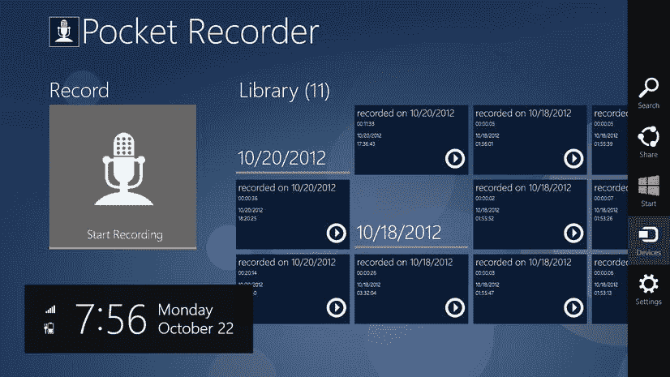
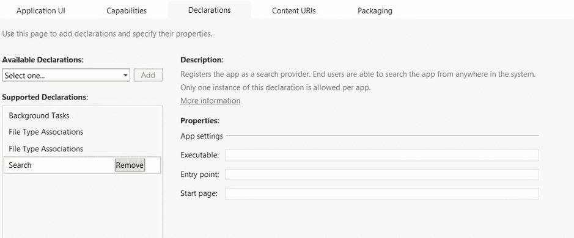
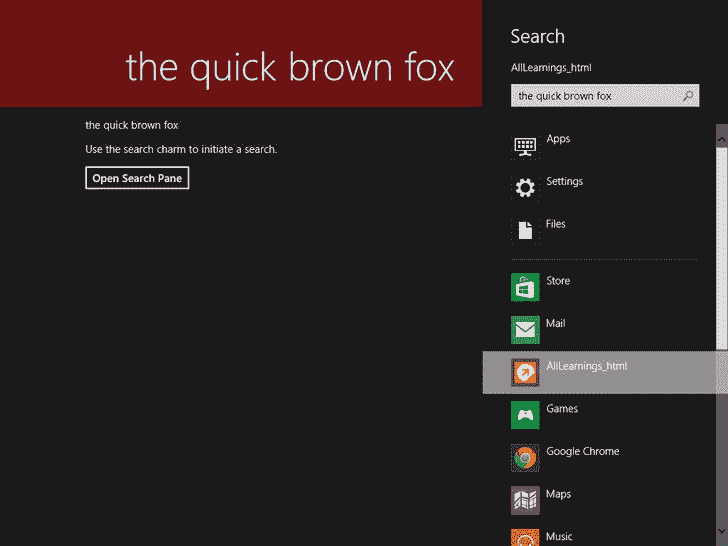
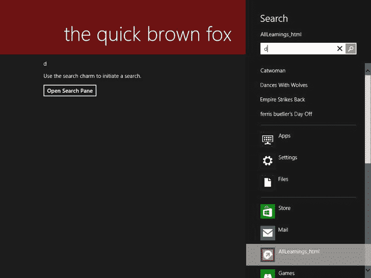
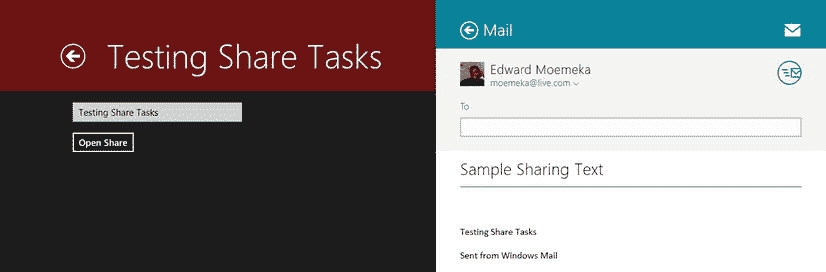

# 五、充分利用魅力和契约

Abstract

契约和魅力是 Windows 8 中引入的两个新概念，它们不仅彻底改变了应用之间的通信活动，还为开发人员引入了新的使用场景。使用 charms，用户可以在整个设备以及应用中进行搜索，向其他应用或设备发送内容，并以标准化的方式访问设置。使用契约可以进一步增强应用之间的互操作性。这种方法的美妙之处在于，安装在 Windows 8 系统上的每个应用都通过对正式交互(如打开文件或从联系人存储中选择联系人)进行良好定义的扩展来增强系统功能。作为 Windows 8 应用开发人员，您使用契约作为一种机制来处理用户通过 charms 进行的交互；您还可以使用契约来促进应用之间的这种隐式交互。这一章将在后面详细讨论契约。我们开始吧。

契约和魅力是 Windows 8 中引入的两个新概念，它们不仅彻底改变了应用之间的通信活动，还为开发人员引入了新的使用场景。使用 charms，用户可以在整个设备以及应用中进行搜索，将内容发送到其他应用或设备，并以标准化的方式访问设置。使用契约可以进一步增强应用之间的互操作性。这种方法的美妙之处在于，安装在 Windows 8 系统上的每个应用都通过对正式交互(如打开文件或从联系人存储中选择联系人)进行良好定义的扩展来增强系统功能。作为 Windows 8 应用开发人员，您使用契约作为一种机制来处理用户通过 charms 进行的交互；您还可以使用契约来促进应用之间的这种隐式交互。这一章将在后面详细讨论契约。我们开始吧。

## 吸引力

第 1 章介绍了 charms 的概念，介绍了终端用户可用的核心活动。如果你记得，在任何时候从右边滑动都会产生 charms 菜单，你可以用它来执行五个基本活动(在 Windows 8 上，尽管默认情况下不在 Windows Server 2012 上):搜索、共享、开始、设备和设置。图 [5-1](#Fig1) 显示了当魅力菜单可见时的样子。

图 5-1。

Windows charms

### 搜索魅力

本节将向您介绍 Windows 8 中的搜索魅力功能，详细介绍作为应用开发人员，您如何将系统范围内的搜索整合到您的应用中，甚至提供自动完成提示。如果你过去使用过 Windows 7，那么你应该熟悉 Search charm 的工作方式，因为它取代了 Windows 7 开始菜单中的搜索框。使用搜索功能，您可以在电脑上找到应用、设置和文件。

#### 搜索魅力用法

Search charm 用于跨所有应用、文件和设置执行系统范围的搜索。此外，Windows 8 提供了一个可扩展性框架，应用可以使用该框架显式插入搜索基础架构。当你在开始屏幕上开始输入时，你可以随时看到搜索的魅力。默认情况下，Windows 8 会按名称搜索所有应用，并将应用列表过滤为与您键入的文本匹配的应用。您还应该注意到，在搜索文本框处于焦点时，会出现“搜索魅力”弹出窗口(参见图 [5-2](#Fig2) )。

图 5-2。

Search charm at work

#### 搜索体验

如前所述，搜索体验为应用提供了许多可扩展点。首先，让我们看看如何直接从应用启动搜索体验。从 JavaScript 执行此操作的调用非常简单:

`Windows.ApplicationModel.Search.SearchPane.getForCurrentView().show();`

然而，正如你在新的 Windows 8 模型中多次看到的那样，进行这种呼叫需要用户在某种程度上的参与。就搜索而言，这种参与是通过应用清单实现的，它在 Windows 应用商店中表现为给定应用所需的一组功能。

图 [5-3](#Fig3) 显示了从最终用户的角度看应用的权限。在这里，用户可以决定是否要下载和安装该应用(考虑到在这种情况下，Skype 需要使用用户的网络摄像头)。

图 5-3。

Application permissions listed for the user in the Windows Store

这是一个愚蠢的例子；当然，鉴于 Skype 的受欢迎程度以及大多数用户已经对它的功能有所了解，一般用户会下载并安装它。事实上，它是目前(在撰写本文时)社交类的顶级应用。

清单 5-1 显示了一个名为 TestSearch 的应用的简单搜索用户界面，带有一个名为`TestSearch.html`的默认页面。我们首先定义了一个简单的用户界面，它只有一个按钮，用于启动搜索窗格。虽然页面上还有其他用户界面元素，但是这里的讨论主要集中在按钮上(`btn_startsearch`)。

Listing 5-1\. Search Example UI (`TestSearch.html`)

`<!DOCTYPE html>`

`<html>`

`<head>`

`<meta charset="utf-8" />`

`<title>Test Search</title>`

`<!-- WinJS references -->`

`<link href="//Microsoft.WinJS.1.0/css/ui-dark.css" rel="stylesheet" />`

``

``

`<link href="TestSearch.css" rel="stylesheet" />`

``

`</head>`

`<body>`

`
`

`<section aria-label="Main content" role="main">`

`
Search Text Goes Here
`

`</section>`

`<section aria-label="Main content" role="main">`

`
Use the search charm to initiate a search.
`

`</section>`

`<section aria-label="Main content" role="main">`

`
<input type="button" id="btn_startsearch" value="Open Search Pane" />
`

`</section>`

`
`

`</body>`

`</html>`

我们现在为`btn_search`的`clicked`事件添加一个事件处理程序(见清单 5-2)。

Listing 5-2\. Search Example JavaScript Code (`TestSearch.js`)

`(function () {`

`"use strict";`

`WinJS.UI.Pages.define("/samples/SearchSample/TestSearch.html", {`

`// This function is called whenever a user navigates to this page. It`

`// populates the page elements with the app's data`。

`ready: function (element, options) {`

`btn_startsearch.onclick = function ()`

`{`

`Windows.ApplicationModel.Search.SearchPane.getForCurrentView().show();`

`};`

`}`，

`});`

`})();`

如果我们编译并运行这个例子，在我们真正点击这个按钮之前，一切都应该运行良好。如果我们在没有调试的情况下运行，应用就会崩溃，单击按钮后我们会返回到 Windows 8 开始屏幕。如果我们使用 Visual Studio 2012 进行调试，窗口将切换到 IDE，并显示以下错误:

`Unhandled exception at line 13, column 17 in ms-appx://8a2843c4-6e36-40f7-8966 85789a855fa8`

`/samples/searchsample/TestSearch.js`

`0x80070005 - JavaScript runtime error: Access is denied`。

`WinRT information: The search extension must be specified in the manifest in order to use the Search Pane APIs`。

从错误消息中可以看出，应用默认情况下不能调用搜索基础设施。为了允许访问，应用必须首先明确声明它计划集成搜索。

无需以任何方式修改代码，我们可以通过向应用的包清单中添加正确的声明来让应用正常运行。首先，我们需要在标有`package.appxmanifest`的项目中定位文件。图 [5-4](#Fig4) 显示了一个 Windows 8 应用项目的典型应用清单的位置。(习惯这个文件；这本书的很多例子都用到了它。)

图 5-4。

Application manifest in a Visual Studio 2012 project structure

#### 搜索声明

如果您还记得，[第 2 章](02.html)在谈到已知文件夹和配置文件类型关联时讨论了一些包清单特性。图 [5-5](#Fig5) 显示了添加搜索声明后的“声明”选项卡(要添加声明，点击可用声明的下拉菜单，选择您想要的声明，然后点击“添加”按钮)。

图 5-5。

Declarations tab with Search declaration added

#### 添加权限

既然您已经看到了最终用户是如何使用权限的，那么让我们看看如何向应用添加适当的权限。将可执行文件、入口点和起始页字段留空，重新构建应用并再次运行它。请注意，单击搜索按钮不再导致错误；相反，它会激活 Windows 8 搜索体验(见图 [5-6](#Fig6) )。

图 5-6。

Search experience launched from an application

下表突出显示了`SearchPane`类的所有成员:表 [5-1](#Tab1) 中的事件、表 [5-2](#Tab2) 中的属性以及表 [5-3](#Tab3) 中的方法。

表 5-3。

`SearchPane` Methods

<colgroup><col> <col></colgroup> 
| 名字 | 描述 |
| --- | --- |
| `getForCurrentView` | 检索搜索窗格的实例，用户可以从该实例在应用中进行搜索 |
| `setLocalContentSuggestionSettings` | 指定基于本地文件的建议是否自动显示在搜索窗格中，并定义 Windows 用来查找和筛选这些建议的条件 |
| `show()` | 显示搜索窗格 |
| `show(String)` | 显示带有指定初始查询字符串的搜索窗格 |
| `trySetQueryText` | 尝试在搜索窗格的搜索框中设置文本 |

表 5-2。

`SearchPane` Properties

<colgroup><col> <col> <col></colgroup> 
| 名字 | 易接近 | 描述 |
| --- | --- | --- |
| `language` | 只读 | 标识当前与用户的文本输入设备关联的语言 |
| `placeholderText` | 读/写 | 当用户没有输入任何字符时，搜索框中的占位符文本 |
| `queryText` | 只读 | 搜索窗格的搜索框中的当前文本 |
| `searchHistoryContext` | 读/写 | 标识搜索上下文的字符串，用于存储用户在应用中的搜索历史记录 |
| `searchHistoryEnabled` | 读/写 | 指示是否自动跟踪用户以前使用应用进行的搜索，并用于提供建议 |
| `showOnKeyboardInput` | 读/写 | 获取或设置用户是否可以通过键入以下内容打开搜索窗格 |
| `visible` | 只读 | 指示搜索窗格是否打开 |

表 5-1。

`SearchPane` Events

<colgroup><col> <col></colgroup> 
| 名字 | 描述 |
| --- | --- |
| `onquerychanged` | 当用户更改搜索框中的文本时激发 |
| `onquerysubmitted` | 当用户在搜索框中提交文本并且应用需要显示搜索结果时激发 |
| `onresultsuggestionchosen` | 当用户选择应用提供并显示在搜索窗格中的建议结果之一时激发 |
| `onsuggestionsrequested` | 当用户的查询文本更改并且应用需要提供新的建议以显示在搜索窗格中时触发 |
| `onvisibilitychanged` | 当用户打开或关闭搜索窗格时激发 |

我们之前创建的搜索应用很简单，但它可以作为一个基础来整合更多的功能。示例中输入的文本目前没有推回到应用，所以让我们改变一下。清单 5-3 修改了这个例子，增加了处理搜索窗格中的用户输入。现在，当我们单击按钮打开搜索窗格时，搜索文本框显示文本“输入搜索”。此外，当我们在搜索文本框中键入文本时，文本会出现在应用中。

Listing 5-3\. Search Notification

`(function () {`

`"use strict";`

`WinJS.UI.Pages.define("/samples/SearchSample/TestSearch.html", {`

`// This function is called whenever a user navigates to this page. It`

`// populates the page elements with the app's data`。

`ready: function (element, options) {`

`btn_startsearch.onclick = function ()`

`{`

`var search =`

`Windows.ApplicationModel.Search.SearchPane.getForCurrentView();`

`search.placeholderText = "enter search";`

`search.onquerychanged = function (e)`

`{`

`txt_searchtext.innerText = e.queryText;`

`};`

`search.show();`

`};`

`}`，

`});`

`})();`

清单修改了我们开始的搜索示例，为`queryChanged`事件添加了一个事件监听器。事件的结果打印在 HTML 界面的搜索内容区域中。图 [5-7](#Fig7) 显示了克隆的，也就是复制的应用。

图 5-7。

Cloning search input

搜索框架还允许应用注入自动建议值。清单 5-4 使用这个特性根据用户在全局搜索框中输入的第一个字符创建建议。请注意，在现实场景中，搜索建议理想情况下是从数据库或 web 服务等外部源异步加载的。

Listing 5-4\. Search Auto-Suggestion Example

`(function () {`

`"use strict";`

`WinJS.UI.Pages.define("/samples/SearchSample/TestSearch.html", {`

`// This function is called whenever a user navigates to this page. It`

`// populates the page elements with the app's data`。

`ready: function (element, options) {`

`btn_startsearch.onclick = function ()`

`{`

`var search =`

`Windows.ApplicationModel.Search.SearchPane.getForCurrentView();`

`search.placeholderText = "enter search";`

`search.onquerychanged = function (args)`

`{`

`txt_searchtext.innerText = args.queryText;`

`};`

`search.onsuggestionsrequested = function (args)`

`{`

`if (search.queryText.charAt(0) == "a")`

`{`

`args.request.searchSuggestionCollection`

`.appendQuerySuggestion("Avengers");`

`args.request.searchSuggestionCollection`

`.appendQuerySuggestion("Aliens");`

`args.request.searchSuggestionCollection`

`.appendQuerySuggestion("A Man Apart");`

`args.request.searchSuggestionCollection`

`.appendQuerySuggestion("Anaconda");`

`} else if (search.queryText.charAt(0) == "b")`

`{`

`args.request.searchSuggestionCollection`

`.appendQuerySuggestion("Braveheart");`

`args.request.searchSuggestionCollection`

`.appendQuerySuggestion("Birds");`

`args.request.searchSuggestionCollection`

`.appendQuerySuggestion("Baby's Day Out");`

`args.request.searchSuggestionCollection`

`.appendQuerySuggestion("Bridesmaids");`

`} else`

`{`

`args.request.searchSuggestionCollection`

`.appendQuerySuggestion("Catwoman");`

`args.request.searchSuggestionCollection`

`.appendQuerySuggestion("Dances With Wolves");`

`args.request.searchSuggestionCollection`

`.appendQuerySuggestion("Empire Strikes Back");`

`args.request.searchSuggestionCollection`

`.appendQuerySuggestion("Ferris Bueller's Day Off");`

`}`

`};`

`search.show();`

`};`

`}`，

`});`

`})();`

图 [5-8](#Fig8) 显示了最终的用户体验。如您所见，根据在搜索文本框中输入的文本，显示了一个可能选项的列表。在该示例中，键入字母 d，这将产生包含 d 的建议列表。如前所述，在理想情况下，这些建议将从应用外部的源中检索，如数据库或 web 服务。请记住，在使用这种技术时，向用户提供的建议可能会有延迟。

图 5-8。

Auto-suggesting search

到目前为止，所有的例子都集中在应用运行时搜索应用。如果您检查这些示例，您会看到应用直到单击 search 按钮才订阅 Search。理想情况下，允许搜索的应用在全局级别订阅它，并根据搜索标准显示适当的界面。我们可以通过将搜索初始化代码移出`btn_startsearch` click 处理程序来轻松解决这个问题，但是另一个问题呢？

#### 在应用中搜索

如果你研究一下 Windows 8 的搜索体验，你会发现除了搜索应用、文件和设置内容之外，用户还可以直接在应用中搜索。清单 5-3 和 5-4 中的例子简单地提到了这一点；然而，前面的例子都是从应用运行开始的，并且在应用保持该状态时执行搜索。也可以在目前没有运行的应用中进行搜索。在这些场景中，您选择一个应用进行搜索；应用启动时，搜索信息已经存在，并且在许多情况下，搜索已经执行。用我们正在开发的示例应用来尝试一下。它会启动，但不会像您预期的那样响应搜索字符串。这是因为应用需要对其启动代码进行一些修改来支持这种情况。

通常，用户点击代表 Windows 8 应用的磁贴就可以启动该应用。然而，在搜索的情况下，应用是通过单击搜索窗格上代表它的图标来启动的。当这种情况发生时，理想的体验是直接进入特定于应用的搜索屏幕；但是正如你在例子中看到的，除非应用知道它是作为搜索的一部分被启动的(相对于正常激活)，否则应用会继续显示其标准的激活用户体验。为了帮助解决这一问题，在启动过程中，Windows 8 应用会被传递识别激活源的参数。因此，当应用通过搜索启动时，它有一个搜索激活类型，而不是标准的启动激活。通过在应用的`onactivated`事件处理程序中测试这一点，当应用使用 search 启动时，您可以用所有正确的信息引导应用。清单 5-5 说明了这一点。

Listing 5-5\. Handling Search Activation (`default.js`)

`"use strict";`

`var app = WinJS.Application;`

`var activation = Windows.ApplicationModel.Activation;`

`app.onactivated = function (args)`

`{`

`if (args.detail.kind === activation.ActivationKind.launch)`

`{`

`args.setPromise(WinJS.UI.processAll().then(function ()`

`{`

`WinJS.Navigation.navigate("samplelist.html");`

`}));`

`} else if (args.detail.kind === activation.ActivationKind.search)`

`{`

`WinJS.Navigation.navigate`ⅱ

`("/samples/searchsample/testsearch.html", args.detail.detail[0].queryText);`

`}`

`};`

在本例中，我们修改了示例应用的`onactivated`事件处理程序，以测试搜索激活。虽然应用通常会启动页面`samplelist.html`，但是在激活类型为`search`的场景中，我们会启动`testsearch.html`。如果我们发现应用已经通过搜索激活，我们将用户直接导航到搜索示例，并将`queryText`值(当前在全局搜索框中的文本)传播到该页面。清单 5-6 显示了如何修改搜索页面来支持这一变化。

Listing 5-6\. Handling Search Activation

`(function () {`

`"use strict";`

`WinJS.UI.Pages.define("/samples/SearchSample/TestSearch.html", {`

`// This function is called whenever a user navigates to this page. It`

`// populates the page elements with the app's data`。

`ready: function (element, options)`

`{`

`var state = WinJS.Navigation.state;`

`var search =`

`Windows.ApplicationModel.Search.SearchPane.getForCurrentView();`

`if (state != null)`

`{`

`txt_searchtext.innerText = state;`

`}`

`search.onquerychanged = function (args)`

`{`

`txt_searchtext.innerText = args.queryText;`

`//perform search against back end and present the results`

`};`

`search.onsuggestionsrequested = function (args)`

`{`

`if (search.queryText.charAt(0) == "a")`

`{`

`args.request.searchSuggestionCollection`

`.appendQuerySuggestion("Avengers");`

`args.request.searchSuggestionCollection`

`.appendQuerySuggestion("Aliens");`

`args.request.searchSuggestionCollection`

`.appendQuerySuggestion("A Man Apart");`

`args.request.searchSuggestionCollection`

`.appendQuerySuggestion("Anaconda");`

`} else if (search.queryText.charAt(0) == "b")`

`{`

`args.request.searchSuggestionCollection`

`.appendQuerySuggestion("Braveheart");`

`args.request.searchSuggestionCollection`

`.appendQuerySuggestion("Birds");`

`args.request.searchSuggestionCollection`

`.appendQuerySuggestion("Baby's Day Out");`

`args.request.searchSuggestionCollection`

`.appendQuerySuggestion("Bridesmaids");`

`} else`

`{`

`args.request.searchSuggestionCollection`

`.appendQuerySuggestion("Catwoman");`

`args.request.searchSuggestionCollection`

`.appendQuerySuggestion("Dances With Wolves");`

`args.request.searchSuggestionCollection`

`.appendQuerySuggestion("Empire Strikes Back");`

`args.request.searchSuggestionCollection`

`.appendQuerySuggestion("Ferris Bueller's Day Off");`

`}`

`};`

`btn_startsearch.onclick = function ()`

`{`

`search.placeholderText = "enter search";`

`search.show();`

`};`

`}`，

`});`

`})();`

### 分享魅力

Share charm 是应用之间最突出的共享方式。它专为这种功能而设计，因此是 Windows 8 的一流应用间通信机制。当应用订阅共享体验时，它可以发送和接收各种形式的内容，从纯文本和 HTML 内容到复杂的结构。

当涉及到权限时，共享遵循类似于搜索的模式——在这种情况下，需要`Share Target`声明。与搜索一样，当需要声明时，它会以权限的形式出现，用户可以在决定是否下载和安装你的应用时进行探索。如果他们因为兴奋而错过了这个，他们只需要使用设置菜单来访问给定应用运行所需的相同权限列表。图 [5-9](#Fig9) 显示了非常受欢迎的 ESPN 应用，设置面板的权限屏幕暴露在外。

图 5-9。

Permissions available through Settings menu

共享魅力支持两种类型的契约:本质上，一种用于提供内容，另一种用于接收内容。因为等式的给予方只能由最终用户通过 Share charm 激活，所以不需要明确定义任何东西来启动它。

#### 共享为源

就 Windows 8 应用而言，它总是可以“分享”它认为有意义分享的内容。让我们看一个简单的例子。我们将与 Windows Mail 应用共享示例应用中的一些文本(但实际上是与任何支持文本共享的应用)。清单 5-7 显示了启动这个的代码。

Listing 5-7\. Basic Sharing

`<!DOCTYPE html>`

`<html>`

`<head>`

`<meta charset="utf-8" />`

`<title>TestSharing</title>`

`<!-- WinJS references -->`

`<link href="//Microsoft.WinJS.1.0/css/ui-dark.css" rel="stylesheet" />`

``

``

`<link href="TestSharing.css" rel="stylesheet" />`

``

`</head>`

`<body>`

`
`

`<section aria-label="Main content" role="main">`

`
<input type="text" id="txt_content" />
`

`</section>`

`<section aria-label="Main content" role="main">`

`
<input type="button" id="btn_openshare" value="Open Share" />
`

`</section>`

`
`

`</body>`

`</html>`

`(function () {`

`"use strict";`

`WinJS.UI.Pages.define("/samples/SharingSample/TestSharing.html", {`

`ready: function (element, options)`

`{`

`var transfer = Windows.ApplicationModel`。*本文件迟交

`DataTransfer.DataTransferManager;`

`var share = transfer.getForCurrentView();`

`share.ondatarequested = function ( args)`

`{`

`args.request.data.properties.title = "Sample Sharing Text";`

`args.request.data.properties`

`.description = "Description of the text being sent";`

`args.request.data.setText(txt_content.value);`

`};`

`btn_openshare.onclick = function ()`

`{`

`transfer.showShareUI();`

`};`

`}`，

`});`

`})();`

当我们运行这个应用并点击 Open Share 按钮时，就会调用`ondatarequested`中的代码。它用来自`txt_content`文本框的文本填充共享上下文。基于指定的内容(在这种情况下，文本)，可以处理接收该内容类型的应用列表出现在共享窗格中(参见图 [5-10](#Fig10) )。

图 5-10。

Sharing pane with compatible applications for the shared content type

当单击其中一个应用时，该应用将在共享视图中启动，用户可以选择进行最后的编辑并完成共享过程。图 [5-11](#Fig11) 显示了点击 Windows Mail 应用时会发生什么。

图 5-11。

Sharing with Windows Mail

在清单 5-7 中你可以看到，共享遵循一个事件订阅模型来连接。这是因为，如上所述，共享仅通过 Windows 8 共享体验进行。每当用户暴露共享窗格(无论是通过 Share charm 还是通过`showShareUI()`)时，都会调用事件处理程序`ondatarequested`。它让应用有机会将任何信息加载到共享上下文中。

股份关系的给予通过三个主要的类来完成:`DataTransferManager`、`DataRequest`和`DataPackage`。`DataTransferManager`用于连接到共享上下文，监听共享按钮的点击。`DataRequest`封装 Windows 8 为响应用户开始共享体验而发起的数据请求——通过`args.request`属性公开。它通过`ondatarequested`事件的事件处理程序传递给应用。`DataPackage`代表在共享应用之间传输的数据的概念包；因此它控制数据的实际读写。它是通过`args.request.data`属性暴露的。表 [5-4](#Tab4) 列出了`DataPackage`类的一些方法。

表 5-4。

`DataPackage` Methods

<colgroup><col> <col></colgroup> 
| 名字 | 描述 |
| --- | --- |
| `getView` | 返回一个`DataPackageView`对象。该对象是`DataPackage`对象的只读副本。 |
| `setBitmap` | 设置包含在`DataPackage`中的位图图像。 |
| `setData` | 以`RandomAccessStream`格式设置`DataPackage`中包含的数据。 |
| `setDataProvider` | 设置委托来处理来自目标应用的请求。 |
| `setHtmlFormat` | 将 HTML 内容添加到`DataPackage`中。 |
| `setRtf` | 设置包含在`DataPackage`中的 RTF 内容。 |
| `setStorageItems(IIterable(IStorageItem))` | 设置包含在`DataPackage`中的文件和文件夹。 |
| `setStorageItems(IIterable(IStorageItem), Boolean)` | 向`DataPackage`添加文件和文件夹。 |
| `setText` | 设置`DataPackage`包含的文本。 |
| `setUri` | 设置包含在`DataPackage`中的统一资源标识符(URI)。 |

`DataPackage`还通过其`properties`属性公开了一个`DataPackagePropertySet`类型的属性，您可以使用它将元数据应用到正在共享的内容。它包含`title`和`description`属性，但也是一个属性包，可用于以名称/值格式存储附加属性。

清单 5-8 使用数据包类提供的标准格式之一在应用之间发送数据:`text`。正如您从表 [5-4](#Tab4) 中看到的，除此之外，您还可以跨应用发送图像、RTF 内容、HTML 内容，甚至原始数据(使用`setData`)。清单 5-7 显示了如何在两个应用之间的`DataPackage`中添加一个图像。

Listing 5-8\. Sharing Images

`(function ()`

`{`

`"use strict";`

`WinJS.UI.Pages.define("/samples/SharingSample/TestSharing.html", {`

`ready: function (element, options)`

`{`

`var transfer = Windows.ApplicationModel.DataTransfer`。*本文件迟交

`DataTransferManager;`

`var share = transfer.getForCurrentView();`

`share.ondatarequested = function (args)`

`{`

`args.request.data.properties.title = "Sample Sharing Text";`

`args.request.data.properties`。*本文件迟交

`description = "Description of the text being sent";`

`//set text`

`args.request.data.setText(txt_content.value);`

`//set image`

`var file = Windows.Storage.ApplicationData.current`

`.localFolder.getFileAsync("image_file.bmp");`

`var stream = Windows.Storage.Streams`

`.RandomAccessStreamReference.createFromFile(file);`

`args.request.data.setBitmap(stream);`

`};`

`btn_openshare.onclick = function ()`

`{`

`transfer.showShareUI();`

`};`

`}`，

`});`

`})();`

#### 作为目标的共享

每个应用都有一组它支持的内容类型(一些是公共的，一些是私有的)。例如，Windows Mail 应用可以接受 HTML 来呈现从“giving”应用生成的消息。为了正确呈现内容，消息必须遵循特定的格式(在本例中由 Microsoft 控制)。这个故事的寓意是，与直接从应用作者那里获得的文档定义的特定应用需求相比，内容结构更不重要。

通过共享契约接收内容要比发送内容复杂得多。首先，与向其他应用发送内容不同，接收内容需要将应用注册为共享内容类型的目标。这是有意义的，因为当用户希望在应用之间传输内容时，您不会希望共享的每个应用都出现在共享目标列表中。相反，Windows 8 会过滤用户点击共享按钮时出现的应用列表，只包括那些可以使用共享格式内容的应用。不难理解为什么想要注册为共享目标的应用需要声明它们可以处理的内容类型。

毫不奇怪，这样做的模式类似于搜索的注册和处理方式。首先，您必须将共享目标功能添加到应用清单中。图 [5-12](#Fig12) 显示了该能力的节点。

图 5-12。

Share Target configuration

在图片中，我添加了一些应用支持的数据格式。通过为格式类型指定格式名字对象，可以添加数据格式。在这种情况下，我是说应用可以处理任何类型的文本。(对于更具体的格式，我建议使用带有格式名的`setData`方法，该格式名可用于标识这种类型文档的布局和结构，而不仅仅是通过 MIME 类型。)让我们将简单的共享示例扩展为支持接收文本格式的内容。

如果您还记得搜索示例，当应用被激活时，它的激活类型由 Windows 注册并作为启动参数传递，这样应用就可以为给定的场景选择显示哪个页面。您还可以使用文件类型关联来启用共享。这样做允许应用使用非标准格式通过`StorageItems`属性共享数据。如果使用的文件格式与指定的数据格式相匹配，它将被视为匹配；否则，共享源必须使用`args.Request.Data.SetStorageItems`方法将非标准格式(作为存储文件)添加到共享上下文中。图 [5-13](#Fig13) 显示了包含数据格式和文件类型关联的共享目标配置页面的放大视图。

图 5-13。

Share Target configuration with file-type association

清单 5-5 使用了从 Windows 8 传递给它的 activation kind 参数，当应用从 Search charm 启动时，它直接指向 TestSearch 页面。清单 5-9 修改了清单 5-5，增加了一个新的`else-if`块来过滤掉那些`ActivationKind`是`shareTarget`的应用初创公司。

Listing 5-9\. `shareTarget` Activation Kind at Work

`"use strict";`

`var app = WinJS.Application;`

`var activation = Windows.ApplicationModel.Activation;`

`app.onactivated = function (args)`

`{`

`if (args.detail.kind === activation.ActivationKind.launch)`

`{`

`args.setPromise(WinJS.UI.processAll().then(function ()`

`{`

`WinJS.Navigation.navigate("samplelist.html");`

`}));`

`} else if (args.detail.kind == activation.ActivationKind.search)`

`{`

`WinJS.Navigation.navigate`

`("/samples/searchsample/testsearch.html", args.detail.detail[0].queryText);`

`}`

`else if (args.detail.kind === activation.ActivationKind.shareTarget)`

`{`

`var search_target_activated_args = args.detail.detail[0];`

`if (search_target_activated_args.shareOperation.data`

`.contains(Windows.ApplicationModel.DataTransfer.StandardDataFormats.text))`

`{`

`search_target_activated_args.shareOperation`

`.data.getTextAsync().then(function (text)`

`{ WinJS.Navigation.navigate("/samples/sharingsample/testsharing.html", text)`

`});`

`}`

`}`

`};`

如您所见，这个过程与搜索所用的方法非常相似。我们首先从`args`对象中检索特定于共享的对象实例。(在 JavaScript 中，这是一个动态对象，所以直到运行时才知道实际公开的类型。这种行为可能很难处理。)接下来，我们确保分享的内容是应用支持的格式；如果是这样，我们使用适当的方法来检索它(在本例中是`getTextAsync`)。当然，因为这是一个异步调用，我们知道必须使用`then`延续来处理调用的结果。最后，我们导航到`testsharing.html`，传递共享的内容。清单 5-10 显示了修改后的`testsharing.html`代码。基本上，我们所做的就是检查`state`属性是否包含值；如果是，我们将该值放入页面上的文本框中。

Listing 5-10\. Presenting Shared Content

`"use strict";`

`WinJS.UI.Pages.define("/samples/SharingSample/TestSharing.html", {`

`ready: function (element, options)`

`{`

`var transfer = Windows.ApplicationModel.DataTransfer.DataTransferManager;`

`var share = transfer.getForCurrentView();`

`var state = WinJS.Navigation.state;`

`if (state != null)`

`{`

`txt_content.value = state;`

`}`

`share.ondatarequested = function (args)`

`{`

`args.request.data.properties.title = "Sample Sharing Text";`

`args.request.data.properties`

`.description = "Description of the text being sent";`

`//set text`

`args.request.data.setText(txt_content.value);`

`};`

`btn_openshare.onclick = function ()`

`{`

`transfer.showShareUI();`

`};`

`}`，

为了验证这一点，我去 [`google.com`](http://google.com) 搜索了这本书。当我复制谷歌搜索文本框中的内容，然后点击共享时，该应用显示为可能的共享目标之一。点击后显示如图 [5-14](#Fig14) 所示的视图。

图 5-14。

Sharing between IE and the example application

需要注意的一点是，共享目标的宽度不同于普通应用。共享视图的布局必须考虑到这一点，否则用户体验会受到影响。将用户导航到正常尺寸的标准页面(像素或边距定位)可能会使用户无法共享。

### 开始魅力

Start charm 并不是一个扩展点，而是为了完整性而在这里列出的。它的功能类似于键盘上的硬件 Windows 键(并非所有键盘都有 Windows 键)。单击此按钮可以在新的开始屏幕和当前运行的应用之间切换，或者根据上下文在 Windows 桌面之间切换。

### 设备魅力

任何内置到使用外部设备的应用中的功能都通过 Devices charm 滑出菜单显示出来。如果应用订阅了适当的 Windows 8 机制(稍后将讨论)，单击 Devices charm 会显示功能和内容可以导出到的目标设备。

视频播放和数字生活网络联盟(DLNA)设备就是一个很好的例子。在应用中回放视频时，您可以选择将视频流式传输到任何兼容 DLNA 的屏幕(例如，兼容 Xbox 或 DLNA 的电视)。另一个很好的例子——也是第六章的基础——是打印。当在应用屏幕中启用打印时，用户可以在设备魅力的滑出式属性页中看到潜在的打印设备。后一种情况的有趣之处在于，它在某种程度上是间接起作用的。与 Share charm 不同,“设备”菜单显示一组设备，这些设备专门映射到当前应用视图显示的行为类型。在打印示例的情况下，打印功能的使用(通过`PrintManager`类)向 Windows 展示了要在列表中显示的一组适当的设备:打印机。与共享一样，该列表会筛选出有必要列出的设备。图 [5-15](#Fig15) 显示了我点击设备图标时的 Internet Explorer 应用(不是桌面版)。

图 5-15。

Devices pane when IE is the running app

### 设置魅力

设置魅力圆了魅力菜单扩展性的故事。毫不奇怪，它提供了一个扩展点，您可以将应用设置和配置用户界面附加到该扩展点。这些挂钩在设置菜单中显示为链接；单击时，它们会触发可以在应用中处理的事件。设置链接最常见的用途是启动应用中的配置页面，否则这些页面将无法导航。清单 5-11 是一个挂钩 Windows 8 设置魅力的基本例子。

Listing 5-11\. Connecting to the Settings Charm

`(function () {`

`"use strict";`

`WinJS.UI.Pages.define("/samples/SettingsSample/TestSettings.html", {`

`ready: function (element, options) {`

`var settings = Windows.UI.ApplicationSettings`

`.SettingsPane.getForCurrentView();`

`settings.oncommandsrequested = function (args)`

`{`

`var privacy_command = new Windows.UI.ApplicationSettings`

`.SettingsCommand("privacy_statement", "Privacy Policy", function (command)`

`{`

`var msg = new Windows.UI.Popups`

`.MessageDialog("This app does nothing so there is no policy.");`

`msg.showAsync();`

`});`

`var help_command = new Windows.UI.ApplicationSettings`

`.SettingsCommand("helo", "Help", function (command)`

`{`

`var msg = new Windows.UI.Popups`

`.MessageDialog("This app does nothing so there is need for help.");`

`msg.showAsync();`

`});`

`var about_command = new Windows.UI.ApplicationSettings`

`.SettingsCommand("about", "About", function (command)`

`{`

`var msg = new Windows.UI.Popups`

`.MessageDialog("This app was developed by the collective we.");`

`msg.showAsync();`

`});`

`var options_command = new Windows.UI.ApplicationSettings`

`.SettingsCommand("options", "Options", function (command)`

`{`

`var msg = new Windows.UI.Popups`

`.MessageDialog("This app does nothing so there are no options.");`

`msg.showAsync();`

`});`

`args.request.applicationCommands.clear();`

`args.request.applicationCommands.append(options_command);`

`args.request.applicationCommands.append(about_command);`

`args.request.applicationCommands.append(help_command);`

`args.request.applicationCommands.append(privacy_command);`

`};`

`}`，

`});`

`btn_settings.onclick = function ()`

`{`

`Windows.UI.ApplicationSettings.SettingsPane.show();`

`};`

`})();`

添加到`applicationCommands`属性中的每个命令实际上都包含一个标签、唯一的名称和一个处理函数，当单击命令的链接时会调用这个函数。图 [5-16](#Fig16) 显示了这个应用运行时的样子。

图 5-16。

Settings pane with additional settings added

## 隐性契约

与魅力驱动的契约一样，隐式契约通过允许每次额外安装应用时使用模式的新组合，扩展了 Windows 8 的开箱即用体验。然而，与它们的对手不同，与隐式契约的集成点更加无缝:应用甚至可能颠覆前面描述的以用户为中心的权限模型。例如，一个应用可以通过在其应用清单中指定它处理的文件类型的文件扩展名来声明它处理某种类型的文件。从 Windows 上的任何地方(甚至在另一个应用中)激活该类型的文件会立即启动声明的应用(或者提供一个界面，在该界面中，用户可以选择适当的应用，以便在多个应用声明它们可以处理指定文件类型的情况下使用)。

隐式契约包括扩展内置拣选器的契约:`FileSavePicker`、`FileOpenPicker`和`ContactPicker`。像搜索契约和共享目标契约一样，像这样的挑选者依赖于读取激活类型。表 [5-5](#Tab5) 列出了应用可用的所有可能的激活类型。

表 5-5。

`ActivationKind` Members

<colgroup><col> <col> <col></colgroup> 
| 成员名称 | 声明类型 | 描述 |
| --- | --- | --- |
| `launch` | 不适用的 | 用户启动了应用或点击了内容磁贴。 |
| `search` | 搜索 | 用户希望使用应用进行搜索。 |
| `shareTarget` | 共享目标 | 该应用被激活为共享操作的目标。 |
| `file` | 文件类型关联 | 一个应用启动了一个文件，该文件的文件类型是此应用注册处理的。 |
| `protocol` | 草案 | 一个应用启动了一个 URL，此应用注册处理该 URL 的协议。 |
| `fileOpenPicker` | 文件打开选择器 | 用户希望选择应用提供的文件。 |
| `fileSavePicker` | 文件保存选择器 | 用户想要保存文件，并选择应用作为位置。 |
| `cachedFileUpdater` | 缓存文件上传程序 | 用户想要保存应用提供内容管理的文件。 |
| `contactPicker` | 联系人选取器 | 用户想要选择联系人。 |
| `device` | 自动播放设备 | 该应用处理自动播放。 |
| `printTaskSettings` | 打印任务设置 | 该应用处理打印任务。 |
| `cameraSettings` | 相机设置 | 该应用从连接的摄像头捕捉照片或视频。 |

清单 5-12 展示了使用激活类型来决定应用应该如何表现自己的策略。

Listing 5-12\. More Contracts

`(function ()`

`{`

`"use strict";`

`var activation = Windows.ApplicationModel.Activation;`

`var stack = new Stack();`

`app.onactivated = function (args)`

`{`

`if (args.detail.kind === activation.ActivationKind.launch)`

`{`

`args.setPromise(WinJS.UI.processAll().then(function ()`

`{`

`WinJS.Navigation.navigate("samplelist.html");`

`}));`

`} else if (args.detail.kind == activation.ActivationKind.search)`

`{`

`//TODO: target the page you want here`

`}`

`else if (args.detail.kind === activation.ActivationKind.shareTarget)`

`{`

`//TODO: target the page you want here`

`}`

`else if (args.detail.kind === activation.ActivationKind.fileOpenPicker)`

`{`

`//TODO: target the page you want here`

`}`

`else if (args.detail.kind === activation.ActivationKind.fileSavePicker)`

`{`

`//TODO: target the page you want here`

`}`

`else if (args.detail.kind === activation.ActivationKind.contactPicker)`

`{`

`//TODO: target the page you want here`

`}`

`else if (args.detail.kind === activation.ActivationKind.file)`

`{`

`//TODO: target the page you want here`

`}`

`else if (args.detail.kind === activation.ActivationKind.cameraSettings)`

`{`

`//TODO: target the page you want here`

`}`

`};`

`})();`

## 摘要

随着本章的结束，您应该会对 Windows 8 的精神和环境有更深入的了解，以便在 Windows 8 的 JavaScript 开发中为您服务。Charms 使用户能够在整个设备和应用中进行搜索，向其他应用或设备发送内容，并以标准化的方式访问设置。通过使用契约，可以进一步增强应用之间的互操作性。在 Windows 8 平台中访问五个 charms。这些包括开始和本章所涉及的四个:搜索、共享、设备和设置。以下是这些魅力的一些要点:

*   Search charm 可用于跨所有应用、文件和设置执行系统范围的搜索。
*   Share charm 是应用之间最突出的共享方式。当应用订阅共享体验时，它可以以从简单到复杂的各种形式发送和接收内容。
*   内置于使用外部设备的应用中的功能通过设备魅力显现出来。设备魅力表面的目标设备的功能和内容可以导出。
*   Settings charm 提供了一个扩展点，应用设置和配置用户界面可以附加到这个扩展点上。它最常见的用途是在应用中启动原本无法导航的配置页面。
*   隐式契约通过允许使用模式的新组合与每个额外的应用安装相结合，扩展了 Windows 8 的开箱即用体验。