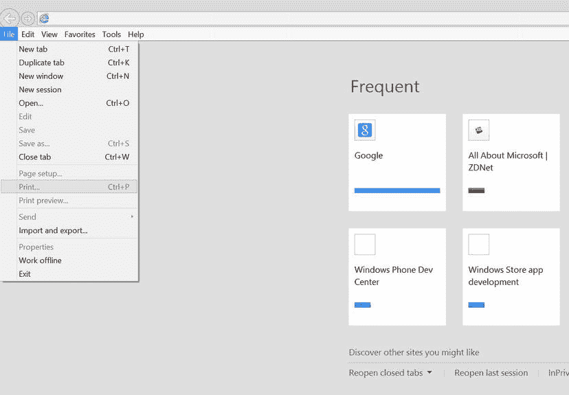
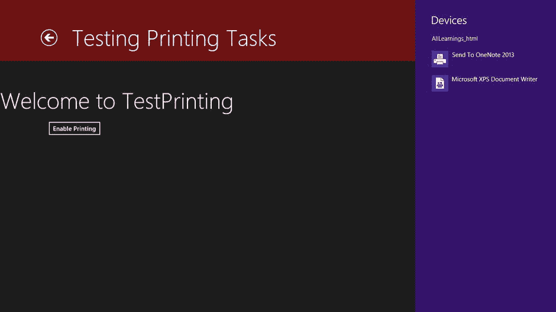
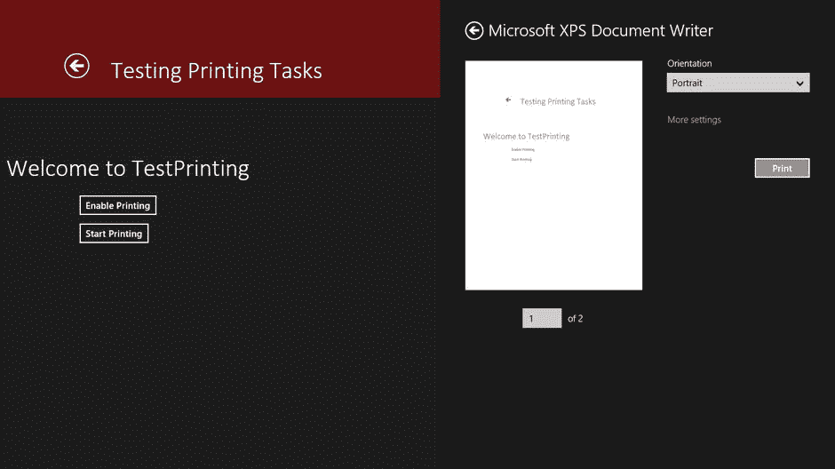

# 6.解决印刷问题

Abstract

现在你已经了解了所有的魅力和它们的用法和功能，你可以进入它们在现实世界中的使用细节。第五章讨论了设备的魅力。这一章深入探讨了在一个特定的场景中使用这种魅力的更多细节:打印。如前一章所述，当在应用屏幕中启用打印时，用户可以在设备魅力的弹出属性页中看到潜在的打印设备。本章还比较了 Windows 8 中的打印和 Windows 传统应用中的打印。并且查看创建了打印任务的示例。我们开始吧。

现在你已经了解了所有的魅力和它们的用法和功能，你可以进入它们在现实世界中的使用细节。第 5 章讨论了设备的魅力。这一章深入探讨了在一个特定的场景中使用这种魅力的更多细节:打印。如前一章所述，当在应用屏幕中启用打印时，用户可以在设备魅力的弹出属性页中看到潜在的打印设备。本章还比较了 Windows 8 中的打印和 Windows 传统应用中的打印。并且查看创建了打印任务的示例。我们开始吧。

## Windows 8 之前的打印

旧的 Windows 应用——现在称之为桌面应用——使用菜单范例来执行应用命令。这意味着一个应用通常有一个内容区域和一个用户可以通过命令控制内容的区域。这个命令区域就是菜单，它开始只是一个顶级菜单，后来演变成上下文菜单、工具栏和专用于发布命令的浮动窗口。

菜单之所以很棒，有很多原因，其中一个重要的原因是，它们可以让你直接看到一个应用可以执行的所有操作的完整列表。尽管它们是上下文感知的，菜单使用启用/禁用机制来训练用户在任何给定的时间什么能做什么不能做。好处是你知道在某个时候，你可以执行一个动作。

相比之下，上下文菜单和功能区等功能遵循不同的方法。随着应用可以执行的动作数量的增加，将它们全部列在顶部菜单中变得非常困难。在与应用的大多数正常交互过程中，大部分操作都被禁用。在这种情况下，使用上下文菜单只会显示适当的命令，即与特定上下文相关的命令。缺点是这种方法没有向用户宣传功能。

历史上，打印是通过菜单和命令的机制呈现给用户的。用户的打印方法很简单:单击文件菜单，如果菜单选项存在，则选择打印。图 [6-1](#Fig1) 显示了在我发表我最喜欢的博客作者艾德·博特(CNET)的一篇文章之前，Windows 8 机器上的 Internet Explorer 10 的文件菜单。

图 6-1。

The File menu with printing enabled

作为开发桌面的开发人员。NET 应用中，由您决定哪些屏幕包含可打印的内容并需要启用打印功能，哪些屏幕不需要。虽然 IE10 不是一个. NET 应用，但同样的规则也适用。图 [6-2](#Fig2) 显示了 IE10 的启动屏幕:因为它没有实际内容，所以没有什么可以打印的，因此文件菜单中的打印功能被禁用。

图 6-2。

The File menu with printing disabled

与标准的桌面应用不同，基于 web 的应用(JavaScript 开发人员以前可能开发过的那种应用)作为内容存在于总体应用(浏览器)的上下文中。虽然菜单可以模仿桌面上的功能，但习惯上是以链接和按钮的形式在内容中嵌入命令。在 JavaScript 中，您只能通过`window.print()`函数以编程方式调用打印对话框；您不能启动实际的打印操作(即，打印与用户看到的内容不同的文档)。因此，通常的方法是重定向到“打印就绪”页面，用户可以在此启动打印操作。当然，因为命令嵌入在内容的前端和中心，用户可以看到它们，广告功能的问题就解决了。

## Windows 8 打印故事

当您过渡到 Windows 8 应用时，从用户的角度来看，打印故事开始失去焦点。第一，菜单没有了，所以没有标准化的控制机制可言(app bars 确实在一定程度上填补了这个角色)。其次，没有用户可识别的打印命令或 charm——打印是通过 Devices charm 进行的，在我看来，这一点也不直观。

鉴于这一事实，您可能认为采用将命令嵌入内容的 web 应用方法是可行的，但您可能错了(至少根据微软发布的样式指南)。相反，这个想法是使用底部的应用栏——专门用于 Windows 8 应用的命令(按照惯例)的区域——并从应用中以编程方式调用打印体验，而不是期望用户单击设备图标来确定他们当前的页面是否可以打印。

### 创建打印任务

此示例从演示 Windows 8 中的打印开始，而不是向您展示如何以编程方式启动打印过程。清单 6-1 是一个简单的应用，当点击它时，在打印环境中打开设备弹出窗口。

Listing 6-1\. A Simple Printing App

`<!DOCTYPE html>`

`<html>`

`<head>`

`<meta charset="utf-8" />`

`<title>TestPrinting</title>`

`<!-- WinJS references -->`

`<link href="//Microsoft.WinJS.1.0/css/ui-dark.css" rel="stylesheet" />`

``

``

`<link href="TestPrinting.css" rel="stylesheet" />`

``

`</head>`

`<body>`

`
`

`<header aria-label="Header content" role="banner">`

`</header>`

`<section aria-label="Main content" role="main">`

`
`

`<input id="btn_start" type="button" value="Start Printing" />`

`
`

`</section>`

`
`

`</body>`

`</html>`

该文件的相关 JavaScript 如清单 6-2 所示。

Listing 6-2\. Print Experience JavaScript Handler

`btn_start.onclick = function (e)`

`{`

`Windows.Graphics.Printing.PrintManager.showPrintUIAsync();`

`};`

该清单要求 Windows 在单击指定按钮时显示打印用户界面。该界面的第一个视图总是显示可供用户选择的打印机列表。为了显示该列表，必须启用打印。

为应用启用打印意味着处理`PrintManager`类的`printtaskrequested`方法并调用`createPrintTask`函数(见清单 6-3)。

Listing 6-3\. Creating a Print Task

`<!DOCTYPE html>`

`<html>`

`<head>`

`<meta charset="utf-8" />`

`<title>TestPrinting</title>`

`<!-- WinJS references -->`

`<link href="//Microsoft.WinJS.1.0/css/ui-dark.css" rel="stylesheet" />`

``

``

`<link href="TestPrinting.css" rel="stylesheet" />`

``

`</head>`

`<body>`

`
`

`<header aria-label="Header content" role="banner">`

`<button class="win-backbutton" aria-label="Back" disabled type="button"></button>`

`<h1 class="titlearea win-type-ellipsis">`

`Welcome to TestPrinting`

`</h1>`

`</header>`

`<section aria-label="Main content" role="main">`

`
<input id="btn_print" type="button" value="Enable Printing" />
`

`</section>`

`
`

`</body>`

`</html>`

清单 6-4 显示了这背后的 JavaScript 代码。

Listing 6-4\. Handling a Print Request from Windows

`(function () {`

`"use strict";`

`WinJS.UI.Pages.define("/samples/PrintingSample/TestPrinting.html", {`

`ready: function (element, options) {`

`btn_print.onclick = function (e)`

`{`

`var print_manager = Windows.Graphics.Printing`

`.PrintManager.getForCurrentView();`

`print_manager.onprinttaskrequested = function (print_event)`

`{`

`print_event.request`

`.createPrintTask("Sample Print Task", function (args)`

`{`

`});`

`};`

`};`

`}`，

`});`

`})();`

将创建打印任务的代码放入按钮`click`事件对于日常使用来说是不切实际的。在正常情况下，支持打印的代码位于页面级别，不会被按钮调用。这样，点击设备图标会立即显示应用的打印选项。在本例中，它展示了在设备魅力和设备弹出窗口中启用打印的方式。如果您运行示例，然后单击 Devices charm，您的屏幕应该如图 [6-3](#Fig3) 所示。

图 6-3。

The Devices charm fly-out before printing is enabled by the application

单击“启用打印”按钮将应用挂接到打印。现在，点击设备图标，调用`onprinttaskrequested`，显示打印目标列表，如图 [6-4](#Fig4) 所示。

图 6-4。

Devices charm fly-out after printing is enabled by the application

因为我使用的特定机器(Windows 8 模拟器)没有连接打印机，所以没有打印机出现在列表中。OneNote 和 Microsoft 的 XPS Writer 具有打印机的功能，因此它们显示为默认设置。

注意应用也可以通过调用`showPrintUIAsync`通过`PrintManager`类初始化打印体验。这个函数除了自动执行用户点击设备的动作之外什么也不做。您可以修改代码样本来尝试这样做:首先向用户界面添加一个新按钮(参见清单 6-5)。

Listing 6-5\. Adding a Button to Invoke the Printing Pane

`<section aria-label="Main content" role="main">`

`
`

`<input id="btn_start" type="button" value="Start Printing" />`

`
`

`</section>`

然后处理该按钮的`click`事件，如清单 6-6 所示。

Listing 6-6\. Displaying the Printing Pane from Code

`btn_start.onclick = function (e)`

`{`

`Windows.Graphics.Printing.PrintManager.showPrintUIAsync();`

`};`

### 使用 WinJS 打印

要完成该过程并提供实际的打印文档，您需要创建一个打印文档。对于 XAML 应用，打印文档必须使用不同的`PrintDocument`类进行实例化。使用 WinJS 的 HTML 应用不需要这个。WinJS 提供了一个实用程序对象(`MSApp`)，您可以使用它将代表应用 HTML 的 document 对象转换为打印文档；实用方法是`getHtmlPrintDocumentSource`。使用这种方法，如清单 6-7 所示，您可以格式化打印源，用于打印到前面讨论的目标。

Listing 6-7\. Setting the Print Source for a Document

`btn_print.onclick = function (e)`

`{`

`var print_manager = Windows.Graphics.Printing.PrintManager`

`.getForCurrentView();`

`print_manager.onprinttaskrequested = function (print_event)`

`{`

`print_event.request.createPrintTask("Sample Print Task"`，`function (args)`

`{`

`args.setSource(MSApp.getHtmlPrintDocumentSource(document));`

`});`

`};`

`};`

`btn_start.onclick = function (e)`

`{`

`Windows.Graphics.Printing.PrintManager.showPrintUIAsync();`

`};`

设置打印源后，单击“启用打印”按钮，然后单击“开始打印”按钮，您将进入相同的“设备”弹出窗口。但是现在有了更多。点击任一打印目标将显示如图 [6-5](#Fig5) 所示的弹出窗口。您应该看到文档第一页的预览，分页控件允许您根据需要快速导航到其他页面。该弹出菜单还允许您指定要打印的文档的方向，并应用附加选项(通过更多设置链接)，如页面布局和纸张质量。

图 6-5。

Print fly-out after the source is set

WinJS 打印实现的伟大之处在于它自动化了分页。在标准 WinRT 打印中，应用开发人员通常必须确定打印文档的“页面”由什么组成。因为 WinJS 使用 HTML，所以大部分功能都是内置的。让我们修改文档来说明(见清单 6-8)。

Listing 6-8\. Multipage Document

`<!DOCTYPE html>`

`<html>`

`<head>`

`<meta charset="utf-8" />`

`<title>TestPrinting</title>`

`<!-- WinJS references -->`

`<link href="//Microsoft.WinJS.1.0/css/ui-dark.css" rel="stylesheet" />`

``

``

`<link href="TestPrinting.css" rel="stylesheet" />`

``

`</head>`

`<body>`

`
`

`<header aria-label="Header content" role="banner">`

`<button class="win-backbutton" aria-label="Back" disabled type="button"></button>`

`<h1 class="titlearea win-type-ellipsis">`

`Welcome to TestPrinting`

`</h1>`

`</header>`

`<section aria-label="Main content" role="main">`

`
<input id="btn_print" type="button" value="Enable Printing" />
`

`</section>`

`<section aria-label="Main content" role="main">`

`
`

`<input id="btn_start" type="button" value="Start Printing" />`

`
`

`</section>`

`
`

`
`

`Four score and seven years ago our fathers brought forth on this continent`

`a new nation conceived in liberty and dedicated to the`

`proposition that all men are created equal`。

`
`

`
`

`Now we are engaged in a great civil war testing whether that nation`，

`or any nation so conceived and so dedicated, can long endure`。

`We are met on a great battlefield of that war.  We have come to dedicate`

`a portion of that field as a final resting place for those who`

`here gave their lives that that nation might live.  It is altogether`

`fitting and proper that we should do this`。

`
`

`
`

`But in a larger sense we can not dedicate - we can not consecrate –`

`we can not hallow - this ground.  The brave men living and dead who`

`struggled here, have consecrated it far above our poor power to add`

`or detract`。

`
`

`
`

`
`

`</body>`

`</html>`

根据设备的不同，如果运行这个示例，应该会看到文档现在是两页(这可能会因用户的页面大小而略有不同)；见图 [6-6](#Fig6) 。

Note

如果这在你的电脑上没有显示为两页，在`Main content div`的正文中添加更多的文本，直到它结束。

图 6-6。

Printing with paging

### 印刷的要素

应用可以订阅打印完成后触发的事件。为此，您需要处理`PrintTask`对象的`oncompleted`事件。表 [6-1](#Tab1) 提供了可以在`PrintTask`课堂上订阅的活动的完整列表。

表 6-1。

PrintTask Events

<colgroup><col> <col></colgroup> 
| 事件 | 描述 |
| --- | --- |
| `completed` | 打印任务完成时引发 |
| `previewing` | 当打印系统初始化打印预览模式时引发 |
| `progressing` | 引发以提供进度信息，说明已将多少打印内容提交给打印子系统进行打印 |
| `submitting` | 当打印任务开始向打印子系统提交要打印的内容时引发 |

清单 6-9 是相同的 JavaScript，订阅了表 [6-1](#Tab1) 中列出的事件。

Listing 6-9\. `PrintTask` Events Handled

`(function () {`

`"use strict";`

`WinJS.UI.Pages.define("/samples/PrintingSample/TestPrinting.html", {`

`ready: function (element, options) {`

`btn_print.onclick = function (e)`

`{`

`var print_manager = Windows.Graphics.Printing.PrintManager`

`.getForCurrentView();`

`print_manager.onprinttaskrequested = function (print_event)`

`{`

`var print_task = print_event.request`

`.createPrintTask("Sample Print Task", function (args)`

`{`

`args.setSource(MSApp.getHtmlPrintDocumentSource(document));`

`});`

`print_task`。`oncompleted` `= function (e)`

`{`

`//called when the print has completed`

`};`

`print_task`。`onsubmitting` `= function (e)`

`{`

`//called when the actual print button is hit`。

`//The print activity has been submitted`。

`};`

`print_task`。`onprogressing` `= function (e)`

`{`

`//called to give feedback on the progress of the print job`

`};`

`print_task`。`onpreviewing` `= function (e)`

`{`

`//called when the print document is being previewed`

`};`

`};`

`};`

`btn_start.onclick = function (e)`

`{`

`Windows.Graphics.Printing.PrintManager.showPrintUIAsync();`

`};`

`}`，

`});`

`})();`

`PrintTask`还包含许多属性，可用于事后处理源或配置用户的打印体验(见表 [6-2](#Tab2) )。

表 6-2。

`PrintTask` Properties

<colgroup><col> <col> <col></colgroup> 
| 财产 | 访问类型 | 描述 |
| --- | --- | --- |
| `Options` | 只读 | 检索打印任务的`PrintTaskOptions`,该任务定义如何格式化内容以进行打印。 |
| `Properties` | 只读 | 检索一组与`PrintTask`相关联的属性。 |
| `Source` | 只读 | 返回一个指向应用提供的对象的指针，该对象表示要打印的内容。这个对象必须支持`IPrintDocumentSource`接口。 |

使用`Options`属性(它公开了`PrintTaskOptions`对象)，应用可以修改打印体验格式的各个方面。表 [6-3](#Tab3) 强调了该类的关键属性。如您所见，这些映射到可以编程设置的打印机选项。

表 6-3。

`PrintTaskOptions` Properties

<colgroup><col> <col> <col></colgroup> 
| 财产 | 访问类型 | 描述 |
| --- | --- | --- |
| `Binding` | 读/写 | 获取或设置打印任务的绑定选项 |
| `Collation` | 读/写 | 获取或设置打印任务的排序规则选项 |
| `ColorMode` | 读/写 | 获取或设置打印任务的颜色模式选项 |
| `DisplayedOptions` | 只读 | 获取为打印体验显示的选项列表 |
| `Duplex` | 读/写 | 获取或设置打印任务的双面打印选项 |
| `HolePunch` | 读/写 | 获取或设置打印任务的打孔选项 |
| `MaxCopies` | 只读 | 获取打印任务支持的最大份数 |
| `MediaSize` | 读/写 | 获取或设置打印任务的媒体大小选项 |
| `MediaType` | 读/写 | 获取或设置打印任务的媒体类型选项 |
| `MinCopies` | 只读 | 获取打印任务允许的最小份数 |
| `NumberOfCopies` | 读/写 | 获取或设置打印任务的份数的值 |
| `Orientation` | 读/写 | 获取或设置打印任务的方向选项 |
| `PrintQuality` | 读/写 | 获取或设置打印任务的打印质量选项 |
| `Staple` | 读/写 | 获取或设置打印任务的装订选项 |

由突出显示的属性返回的大多数对象都包含在`Windows.Graphics.Printing`名称空间中。当谈到打印时，这是挂钩 Windows 8 APIs 向开发人员公开的内容的起点。表 [6-4](#Tab4) 显示了这个名称空间包含的类型的完整列表。

表 6-4。

`Windows.Graphics.Printing` Namespace Classes

<colgroup><col> <col></colgroup> 
| 班级 | 描述 |
| --- | --- |
| `PrintManager` | 通知 Windows 应用希望参与打印。`PrintManager`类也用于以编程方式启动打印。 |
| `PrintTask` | 表示打印操作，包括要打印的内容，并提供对描述如何打印内容的信息的访问。 |
| `PrintTaskCompletedEventArgs` | 报告打印任务的完成情况。 |
| `PrintTaskOptions` | 表示用于管理定义内容打印方式的选项的方法和属性的集合。 |
| `PrintTaskProgressingEventArgs` | `PrintTask.Progressing`事件的事件参数。该事件在`PrintTask`的提交阶段(不要与`submitting`事件混淆)引发。在提交文档期间，内容被发送到打印子系统。这项工作的进展在这里被跟踪。 |
| `PrintTaskRequest` | 包含系统创建打印任务的请求。在清单 6-9 中，您调用了作为处理`onprinttaskrequested`的一部分返回的`print_event`对象的`request`属性。确切的代码是`print_event.request.createPrintTask("Sample Print Task", function (args)`。这里的`request`属性返回这个类的一个实例。 |
| `PrintTaskRequestedEventArgs` | 与`PrintTaskRequest`相关的事件参数。 |
| `PrintTaskSourceRequestedArgs` | 与`PrintTaskSourceRequestedHandler`委托相关联的参数。提供将要打印的内容交给`PrintTask`的方法。 |

## 摘要

恭喜你！现在，您对 Windows 应用商店应用的打印功能有了具体的了解。阅读完本章并检查示例后，您已经了解了

*   使用设备魅力进行打印
*   如何使用 WinJS 提供的工具对象将代表应用 HTML 的实际文档对象转换为打印文档
*   通过单击打印目标显示的弹出窗口
*   WinJS 打印实现如何自动分页
*   应用如何订阅在打印预览、进行或完成后触发的事件
*   `PrintTask`，包含对事后处理源或配置用户打印体验有用的属性
*   使用`Options`属性修改应用打印体验的各种格式