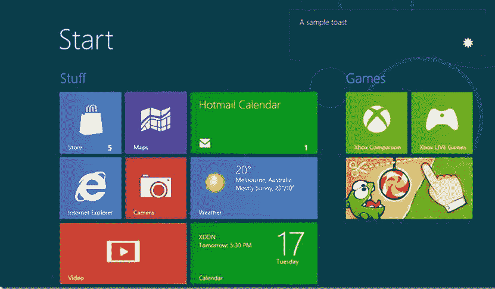
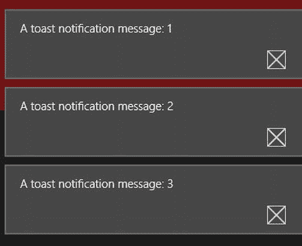
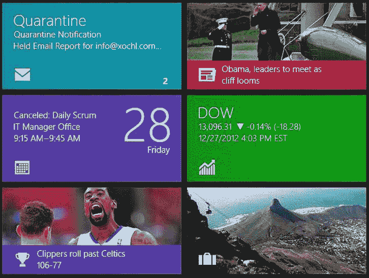
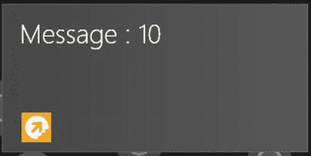
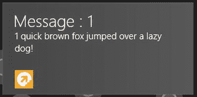
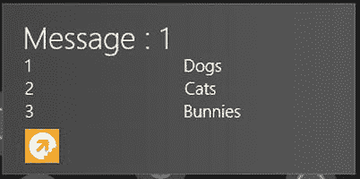

# 7.提供清晰的通知

Abstract

前一章的讨论以 Windows 8 锁定屏幕的演练结束，包括使用 Windows 应用商店 API 内置的通知机制以某种形式向用户发送消息的示例。这就引出了对两种主要通知类型的讨论:祝酒词和瓷砖。本章研究了这些通知，它们的用途，以及作为一名开发者，你如何设计它们来最有效地为你的应用和用户服务。

前一章的讨论以 Windows 8 锁定屏幕的演练结束，包括使用 Windows 应用商店 API 内置的通知机制以某种形式向用户发送消息的示例。这就引出了对两种主要通知类型的讨论:祝酒词和瓷砖。本章研究了这些通知，它们的用途，以及作为一名开发者，你如何设计它们来最有效地为你的应用和用户服务。

## 通知过程

让我们从定义现代 Windows 8 应用环境中的通知开始。通知是发送给应用最终用户的消息，提供有关应用使用的有意义的信息。可能是让用户知道他们的密码无效，他们无权访问应用中的某些内容，他们已经空闲了一段时间，他们的会话即将超时，或者应用中有错误。这种类型的通用通知不是本章讨论的内容。相反，您关注的是一类以前在 Windows 开发的 API 环境中没有明确表示的通知:当应用不在焦点上时发生的通知。

以微软 Office 的 Outlook 邮件客户端为例。如果您在 Outlook 中启用了 toast 通知，则每次收到新邮件时，系统托盘区域上方都会出现一个小的无边框窗口。单击此 toast 窗口会立即启动完整的 Outlook 客户端，并允许您查看邮件。

像这样的模式并没有融入传统的 Windows 应用开发中。每个开发人员都必须使用隐藏窗口和系统托盘图标创建该功能的独特实现。最重要的是，因为操作系统不提供任何机制来支持它，所以任何希望使用这种机制的应用都必须通过在关闭时隐藏自己或者拥有单独的可执行文件(守护程序)来表现出不运行的假象，该可执行文件拥有通知过程，并且还负责在用户与 toast 窗口交互时启动主应用。Windows 8 采用了通知的概念，并将其融入操作系统，以便所有 Windows 8 应用使用相同的机制，即所有用户都能立即识别并在所有应用中保持一致的机制。

作为构建面向现代应用平台的应用的 Windows 8 开发人员，您可以使用四种关键机制向您的用户提供通知:toast 通知、磁贴通知、徽章通知和推送通知。Toast、tile 和 badge 通知通常需要应用正在运行(如果不在焦点上)，而推送通知代表了一种新的通知类别，其中应用不需要在客户端上运行。

如前所述，Windows 8 试图解决的部分通知问题是一致性问题。如果每个应用都必须创建自己的通知框架，就像遗留应用一样，用户不仅很难确定用户界面元素是否是通知，还很难确定它是什么类型的通知以及它公开了什么交互模式。例如，Internet Explorer 10 使用通知。下载完成后，任务栏图标会闪烁以通知用户。对于受过训练的人来说，这是有道理的。但是新手用户可能不理解其中的含义——特别是因为不是每个应用都是这样运行的。在设计 Windows 8 API 环境时，在通知方面创造更强的一致性是很重要的。为此，Windows API 设计人员选择使用一组预定义的模板，而不仅仅是公开一个用户界面，让应用在其中显示它们的通知。这些模板确保所有通知都遵循标准化的呈现格式，在应用之间保持一致，防止用户体验不一致或不一致。在讨论 toast 和 tile 通知类型的过程中，以下部分将详细介绍这些模板。

## Toast 通知

Toast 通知的功能与上一节中讨论的通知类似。传统的 Windows toast 通知是应用遵循的一种交互模式，而现代 Windows 8 应用所采用的 toast 通知机制则融入了操作系统和 API 表面区域。这意味着所有现代应用都可以通过一组通用的 API 来使用它们，并且无论通知者是什么，用户都可以看到一个相似的交互模式。这与 Windows 8 的总体模式是一致的:应用之间的主要区别因素是内容。当然，应用可以在设计上有所不同，但总的来说，在现代 Windows 8 应用中，内容是王道，优先于 chrome。

图 [7-1](#Fig1) 显示了当用户在 Windows 8 开始屏幕上时，toast 通知的外观。如你所见，它出现在屏幕的右上角。

图 7-1。

Example of a toast notification

无论你在哪里，在操作系统中你在做什么，一个 toast 通知总是出现在右上角，当用户没有与之交互时逐渐淡化。在接收到多个祝酒词的情况下，后续的祝酒词显示在先前呈现的祝酒词下面。图 [7-2](#Fig2) 显示了多个 toast 通知如何出现在用户的屏幕上。

图 7-2。

Multiple toast notifications on screen (unlike the example in Figure [7-1](#Fig1), these notifications have no icon associated with them)

### 生成 Toast 通知

祝酒词可以在本地发送，也可以通过推送通知发送。用户可以通过触摸或点击来选择 toast，以便启动相关联的应用。因为这些通知被设计为上下文感知的，所以可以在启动的应用中处理 toast 通知的上下文，以便它呈现通知内容的详细视图。

清单 7-1 显示了一个非常简单的本地 toast 通知的例子。用户单击一个按钮(`btn_toast`)，在事件处理程序中，您使用对`show`方法的调用呈现一个 toast 通知。

Listing 7-1\. Local Toast Notification

`(function ()`

`{`

`"use strict";`

`WinJS.UI.Pages.define("/samples/NotificationSample/TestNotification.html", {`

`ready: function (element, options)`

`{`

`var count = 0;`

`btn_toast.onclick = function ()`

`{`

`count++;`

`var toast_xml = Windows.UI.Notifications.ToastNotificationManager`

`.getTemplateContent(Windows.UI.Notifications`

`.ToastTemplateType.toastText01);`

`var text_node = toast_xml.documentElement.getElementsByTagName("text")[0];`

`text_node.appendChild(toast_xml.createTextNode("A toast notification`

`message: " + count));`

`var toast = new Windows.UI.Notifications.ToastNotification(toast_xml);`

`var toast_notifier = Windows.UI.Notifications.ToastNotificationManager`。*本文件迟交

`createToastNotifier();`

`toast_notifier.show(toast);`

`};`

`}`，

`});`

`})();`

这个例子相对简单。首先，建立一个变量 count，它表示点击 toast 按钮的次数。每点击一次`btn_toast`,就增加 count，然后生成一个新的 toast 通知，将新的 count 合并到它的消息中。从清单中可以看出，生成 toast 非常简单，只需访问一个 XML 文档，操作该文档中的内容，然后将完成的文档作为参数传递给`ToastNotificationManager`类的实例。`ToastNotificationManager`然后用这个来构造合适的`ToastNotifier`。

清单 7-1 中的例子就是创建图 [7-2](#Fig2) 中的 toast 通知列表的例子。要让它工作，您必须打开您的`package.appmanifest`文件并为应用启用 toast 通知。可以在应用 UI 选项卡上找到完成此操作的设置。在“所有图像资产”树中，选择“徽章徽标”,您会看到“通知”部分，其中有一个标记为“Toast Capable”的下拉列表。要为您的应用启用 toast 通知，请将此下拉列表的值设置为`Try`。

这个用于启动流程的 XML 文档被称为模板，通过枚举`ToastTemplateType`公开。在本章的开始，你已经了解了模板。模板允许您以多种方式呈现 toast 通知。在本例中，您提供了一个纯文本通知。Windows 8 提供了八个模板:四个是纯文本的，四个同时使用图像和文本。

下一节将更详细地介绍各种 toast 通知格式。请注意，对于所有实例，溢出的文本将被修剪，无效的图像将被视为没有指定图像。

#### ToastText01

这是最基本的敬酒方式。该模板显示一个最多包含三行文本的字符串。清单 7-2 显示了这种模板类型的 XML。粗体的节点表示基于清单 7-1 所示模式的目标区域。

Listing 7-2\. ToastText01 Template Definition

`<toast>`

`<visual>`

`<binding template="ToastText01">`

`<text id="1">bodyText</text>`

`</binding>`

`</visual>`

`</toast>`

#### ToastText02

该模板在第一行显示一个粗体文本字符串，在第二行和第三行显示一个普通文本字符串。清单 7-3 显示了这种模板类型的 XML。粗体的节点表示基于清单 7-1 所示模式的目标区域。

Listing 7-3\. ToastText02 Template Definition

`<toast>`

`<visual>`

`<binding template="ToastText02">`

`<text id="1">headlineText</text>`

`<text id="2">bodyText</text>`

`</binding>`

`</visual>`

`</toast>`

#### ToastText03

这个模板是 ToastText02 设计的变体，在第一行和第二行用粗体文本显示一个字符串，在第三行用常规文本显示一个字符串。清单 7-4 显示了这种模板类型的 XML。注意这个和清单 7-3 的唯一区别是模板名。粗体的节点表示基于清单 7-1 所示模式的目标区域。

Listing 7-4\. ToastText03 Template Definition

`<toast>`

`<visual>`

`<binding template="ToastText03">`

`<text id="1">headlineText</text>`

`<text id="2">bodyText</text>`

`</binding>`

`</visual>`

`</toast>`

#### ToastText04

该模板在第一行显示一个粗体文本字符串，在随后的每一行显示一个常规文本字符串(注意，没有换行；每一行都有自己唯一的字符串)。清单 7-5 显示了这种模板类型的 XML。粗体的节点表示基于清单 7-1 所示模式的目标区域。

Listing 7-5\. ToastText04 Template Definition

`<toast>`

`<visual>`

`<binding template="ToastText04">`

`<text id="1">headlineText</text>`

`<text id="2">bodyText1</text>`

`<text id="3">bodyText2</text>`

`</binding>`

`</visual>`

`</toast>`

### 向祝酒词添加图像

Toast 通知还可以包括图像。图 [7-3](#Fig3) 显示了修改后的 toast 通知，现在编程为支持图像。

图 7-3。

Toast notification with an image

为此，您只需更改正在使用的模板，并将适当的内容插入到底层文档的适当节点中。清单 7-6 显示了用于生成图 [7-3](#Fig3) 中的 toast 通知的代码。粗体文本是更改的部分。

Listing 7-6\. Toast Notification with an Image

`(function ()`

`{`

`"use strict";`

`WinJS.UI.Pages.define("/samples/NotificationSample/TestNotification.html", {`

`ready: function (element, options)`

`{`

`var count = 0;`

`btn_toast.onclick = function ()`

`{`

`count++;`

`var toast_xml = Windows.UI.Notifications.ToastNotificationManager`

`.getTemplateContent(Windows.UI.Notifications.ToastTemplateType`

`.toastImageAndText01);`

`//set text`

`var text_node = toast_xml.documentElement.getElementsByTagName("text")[0];`

`text_node.appendChild(toast_xml.createTextNode`

`("A toast notification message: " + count));`

`//set image`

`var image_node = toast_xml.documentElement.getElementsByTagName("image")[0];`

`image_node.setAttribute("src", "ms-appx:///img/hiredup_150150.png");`

`var toast = new Windows.UI.Notifications.ToastNotification(toast_xml);`

`var toast_notifier = Windows.UI.Notifications.ToastNotificationManager`

`.createToastNotifier();`

`toast_notifier.show(toast);`

`};`

`}`，

`});`

`})();`

在指定要使用的图像源时，请注意协议`ms-appx`的使用。您可以使用此协议从应用的部署包中检索内容。该 API 还支持`http/https`检索基于网络的图像，支持`ms-appdata:///local/`从本地存储中提取图像。

清单 7-7 显示了所有为带有图像的 toast 通知公开的文档模板类型。它们反映了为纯文本 toast 通知公开的相同文档(除了添加的 image 元素)，因此无需进一步解释。

Listing 7-7\. Image-Based Toast Notification Document Types

`<toast>`

`<visual>`

`<binding template="ToastImageAndText01">`

`<image id="1" src="image1" alt="image1"/>`

`<text id="1">bodyText</text>`

`</binding>`

`</visual>`

`</toast>`

`<toast>`

`<visual>`

`<binding template="ToastImageAndText02">`

`<image id="1" src="image1" alt="image1"/>`

`<text id="1">headlineText</text>`

`<text id="2">bodyText</text>`

`</binding>`

`</visual>`

`</toast>`

`<toast>`

`<visual>`

`<binding template="ToastImageAndText03">`

`<image id="1" src="image1" alt="image1"/>`

`<text id="1">headlineText</text>`

`<text id="2">bodyText</text>`

`</binding>`

`</visual>`

`</toast>`

`<toast>`

`<visual>`

`<binding template="ToastImageAndText04">`

`<image id="1" src="image1" alt="image1"/>`

`<text id="1">headlineText</text>`

`<text id="2">bodyText1</text>`

`<text id="3">bodyText2</text>`

`</binding>`

`</visual>`

`</toast>`

### 为祝酒词增添声音

Toast 通知也可能有与之相关的声音。想象一个场景，一个像 Skype 这样的 VoIP 风格的应用正在接收一个来电。仅仅弹出一个通知可能是不够的(特别是如果用户目前不在计算机上工作！).在这个领域，API 设计者再次选择了统一性而不是终极灵活性，只允许一组指定的声音与 toast 通知一起使用。Windows 8 总共提供了八种声音:四种可以循环播放(像打电话的声音)，四种不能。此外，您可以指定 toast 通知为静音。清单 7-8 显示了完整的音频节点。

Listing 7-8\. Audio Node

`<audio src="ms-winsoundevent:Notification.Mail" loop="false" silent="false"/>`

您可以通过添加`audio`标签作为顶级 toast 元素的直接子元素，将 toast 通知音频添加到上述任何模板中。(请记住，到目前为止，您看到的所有其他内容都与烤面包的视觉表现相关。元素作为`visual`节点的子元素没有多大意义。)在清单 7-9 中，您在现有的例子中添加了一个循环调用声音。

Listing 7-9\. Toast Notification with Audio

`(function ()`

`{`

`"use strict";`

`WinJS.UI.Pages.define("/samples/NotificationSample/TestNotification.html", {`

`ready: function (element, options)`

`{`

`var count = 0;`

`btn_toast.onclick = function ()`

`{`

`count++;`

`var toast_xml = Windows.UI.Notifications.ToastNotificationManager`

`.getTemplateContent(Windows.UI.Notifications.ToastTemplateType`

`.toastImageAndText01);`

`toast_xml.documentElement.setAttribute("duration", "long");`

`//set text`

`var text_node = toast_xml.documentElement.getElementsByTagName("text")[0];`

`text_node.appendChild(toast_xml.createTextNode`

`("A toast notification message: " + count));`

`//set image`

`var image_node = toast_xml.documentElement.getElementsByTagName("image")[0];`

`image_node.setAttribute("src", "ms-appx:///img/hiredup_150150.png");`

`//add audio to the notification`

`var audio_node = toast_xml.createElement("audio");`

`audio_node.setAttribute("src", "ms-winsoundevent:Notification.Looping.Call");`

`audio_node.setAttribute("loop", "true");`

`toast_xml.documentElement.appendChild(audio_node);`

`var toast = new Windows.UI.Notifications.ToastNotification(toast_xml);`

`var toast_notifier = Windows.UI.Notifications.ToastNotificationManager`

`.createToastNotifier();`

`toast_notifier.show(toast);`

`};`

`}`，

`});`

`})();`

如您所见，要为 toast 通知添加声音，您需要创建 audio 节点，填充适当的属性，并将其添加到模板表示的 XML 文档中，这样就完成了。但是，请注意，示例中的其他内容发生了变化。您的顶层文档现在有了一个`duration`属性，它被设置为`long`。这是循环通知特别需要的，但可以在所有 toast 通知中使用，以创建持久的 toast。持续的祝酒持续的时间更长。

表 7-1。

Looping and Non-Looping Sounds that Can Be Attached to Toast Notifications

<colgroup><col> <col></colgroup> 
| 非循环 | 环 |
| --- | --- |
| `Notification.Default` | `Notification.Looping.Alarm` |
| `Notification.IM` | `Notification.Looping.Alarm2` |
| `Notification.Mail` | `Notification.Looping.Call` |
| `Notification.Reminder` | `Notification.Looping.Call2` |
| `Notification.SMS` |   |

Note

当您在`audio`标签的`src`属性中使用表 [7-1](#Tab1) 中的值时，一定要用`ms-winsoundevent`名称空间来限定它们。于是`Notification.Looping.Alarm2`变成了`ms-winsoundevent:Notification.Looping.Alarm2`。尽管忽略这一点不会导致错误，但音频通知不会起作用。

### 安排祝酒

在某些情况下，将 toast 安排在未来的某个时间点发生(或者以重复的方式发生)可能比在命令执行后立即发出通知更合适。在这种情况下，您可以使用一个名为`ScheduledToastNotification`的专门类。`ScheduledToastNotification`提供了一个构造函数，它不仅接受通知的 XML 模板，还接受应该显示通知的日期、通知的休眠时间(在通知在一段时间内重复的情况下)，以及一个指示通知在最终终止前休眠的最大次数的数字。清单 7-10 显示了这种 toast 通知的使用。当用户单击 toast 按钮时，您将通知安排在 2012 年 12 月 20 日，根据玛雅人的说法，这是世界末日的前一天！

Listing 7-10\. Toasting the End of the World

`(function ()`

`{`

`// "use strict";`

`WinJS.UI.Pages.define("/samples/NotificationSample/TestNotification.html", {`

`ready: function (element, options)`

`{`

`var count = 0;`

`btn_toast.onclick = function ()`

`{`

`count++;`

`var toast_xml = Windows.UI.Notifications.ToastNotificationManager`

`.getTemplateContent(Windows.UI.Notifications.ToastTemplateType`

`.toastImageAndText01);`

`toast_xml.documentElement.setAttribute("duration", "long");`

`//set text`

`var text_node = toast_xml.documentElement.getElementsByTagName("text")[0];`

`text_node.appendChild(toast_xml.createTextNode`

`("A toast notification message: " + count));`

`//set image`

`var image_node = toast_xml.documentElement.getElementsByTagName("image")[0];`

`image_node.setAttribute("src", "ms-appx:///img/hiredup_150150.png");`

`//add audio to the notification`

`var audio_node = toast_xml.createElement("audio");`

`audio_node.setAttribute("src", "ms-winsoundevent:Notification.Looping.Call");`

`audio_node.setAttribute("loop", "true");`

`toast_xml.documentElement.appendChild(audio_node);`

`var stoast = new Windows.UI.Notifications.ScheduledToastNotification`

`(toast_xml, new Date("12/20/2012"),(60 * 1000) * 60,5);`

`stoast.id = "the_end";`

`var toast_notifier = Windows.UI.Notifications.ToastNotificationManager`

`.createToastNotifier();`

`toast_notifier.addToSchedule(stoast);`

`};`

`}`，

`});`

`})();`

注意使用了`addToSchedule`而不是`show`。顾名思义，addToSchedule 将查询 toast 通知请求，并在到达指定日期时显示 toast。

### 响应 Toast 通知事件

前面，你已经了解到 toast 通知的一个很酷的地方——它与本章中讨论的其他类型的通知不同——是它们是上下文感知的。这意味着您的应用可以以独特的和特定于上下文的方式对用户激活或取消的 toast 通知做出反应。WinJS 在`ToastNotification`类上公开事件来处理这种情况。参见清单 7-11。

Listing 7-11\. Using the Events of the `ToastNotification` Class

`(function ()`

`{`

`// "use strict";`

`WinJS.UI.Pages.define("/samples/NotificationSample/TestNotification.html", {`

`ready: function (element, options)`

`{`

`var count = 0;`

`btn_toast.onclick = function ()`

`{`

`count++;`

`var toast_xml = Windows.UI.Notifications.ToastNotificationManager`

`.getTemplateContent(Windows.UI.Notifications.ToastTemplateType`

`.toastImageAndText01`

`);`

`toast_xml.documentElement.setAttribute("duration", "long");`

`//set text`

`var text_node = toast_xml.documentElement.getElementsByTagName("text")[0];`

`text_node.appendChild(toast_xml.createTextNode`

`("A toast notification message: " + count));`

`//set image`

`var image_node = toast_xml.documentElement.getElementsByTagName("image")[0];`

`image_node.setAttribute("src", "ms-appx:///img/hiredup_150150.png");`

`//add audio to the notification`

`var audio_node = toast_xml.createElement("audio");`

`audio_node.setAttribute("src", "ms-winsoundevent:Notification.Looping.Call");`

`audio_node.setAttribute("loop", "true");`

`audio_node.setAttribute("silent", "false");`

`toast_xml.documentElement.appendChild(audio_node);`

`var toast = new Windows.UI.Notifications.ToastNotification(toast_xml);`

`//lift the value of count so that it is always the value at the`

`//time when the button is clicked that is used when the toast`

`//is activated or deactivated`

`var indicator = count;`

`toast.onactivated = function ()`

`{`

`txt_display.innerText = "you activated toast for: " + indicator;`

`};`

`toast.ondismissed = function ()`

`{`

`txt_display.innerText = "you dismissed toast for: " + indicator;`

`};`

`var toast_notifier = Windows.UI.Notifications.ToastNotificationManager`

`.createToastNotifier();`

`toast_notifier.show(toast);`

`};`

`}`，

`});`

`})();`

在本例中，您添加了一个新的用户界面元素`txt_display`，用于记录用户对 toast 通知的处理。如果用户通过点击或轻敲激活了一个 toast，您将其记录为激活；如果用户取消它，你记录为解雇。(因为这些是长祝酒词通知，所以它们出现的时间更长。)您还可以通过显示用于生成 toast 的值`count`来指示哪个 toast 被取消或取消。

图 [7-4](#Fig4) 显示了实际应用。请注意，该图包含代码示例的用户界面 HTML 中没有的附加按钮。

Note

在清单 7-11 中，您在`onclick`事件处理程序中将`count`设置为一个局部变量。这样做可以确保调用任何 toast 事件处理程序时使用的`count`的值与最初单击按钮时使用的值相同。`indicator`的每个唯一值被称为在一个唯一的全局状态中被提升，因此当调用适当版本的`onactivated` / `ondismissed`时，每个值都可以被使用。

图 7-4。

Toast notification handling events

## 磁贴通知

还记得第一章里关于 Windows 8 的概述讨论吗？它谈到了开始屏幕上的矩形形状，将快速启动区域的功能与应用的启动快捷方式结合起来，并在任务栏上显示应用。正如在[第一章](01.html)中提到的，这些矩形形状被称为活瓷砖。关于它们的“活性”的伟大之处在于，它将这些磁贴变成了应用可以向用户呈现通知的另一个表面。磁贴通知在许多方面不同于 toast 通知。

首先，它们实际上是一种应用行为模式，位于动态磁贴的概念之上。你可能会说它们根本不是通知。许多应用，如 Travel，在不通知用户任何事情的情况下使用了实时磁贴功能(Travel 显示世界上不同地方的图片，这与 Mail 应用对磁贴的使用明显不同)。第二，因为这种通知方式使用给定应用的图块，所以可以通过多种方式对其进行限制。首先，如果磁贴不在 Windows 开始屏幕上，就不会有通知(也不会向应用指示通知没有发生)。另一个问题是这种类型的通知局限于 Windows 开始屏幕；根据磁贴在用户开始屏幕上的位置，它可能不可见。最后也是最重要的，应用的动态磁贴主要是为非侵入式浏览信息而设计的。它不应该是一个对话框或消息框；这意味着向用户提供快速的信息，可能会诱使他们点击磁贴并获得更多信息。

在您学习这一部分的过程中，让我们正确地看待这一功能。因为这里使用的术语通知有些误导(特别是与本节中的对应术语并列使用时)，所以您可能会尝试将 live tiles 的使用限制为向用户显示消息。这样做会严重低估这项技术的力量。图 [7-5](#Fig5) 显示了许多流行的 Windows 8 应用的实时磁贴。

图 7-5。

Live tiles for some Modern Windows 8 apps

图块通知可以是纯文本、带图像的文本、所有图像或图像的组合，或者它们可以包含另一类称为徽章通知的通知。与 toast 通知不同，如前所述，toast 通知主要用于提醒用户他们需要相对快速地采取行动或信息，tile 通知侧重于呈现更持久、侵入性更低的通知内容。区分 toast 通知和磁贴通知(就它们应该呈现的内容而言)的一般方法是，实时磁贴呈现用户可能感兴趣的内容和事件，而 toast 通知呈现用户应该感兴趣的内容和事件。

暂且不论应用的实时磁贴是一种多么强大的通知机制，使用实时磁贴基础设施向用户呈现通知还是有好处的。首先，因为动态磁贴是为了吸引用户，所以它可以被用作提醒或更新——抓住用户的注意力。您可以在微软 MSDN 网站 [`http://msdn.microsoft.com/en-us/library/windows/apps/hh761491.aspx`](http://msdn.microsoft.com/en-us/library/windows/apps/hh761491.aspx) 上找到所有磁贴模板的完整列表，以及最终磁贴布局的图像。这可以作为一个参考，以了解您可以做什么和不可以做什么。

注意 Windows 8.1 增加了两个新的磁贴大小，使用户可以配置应用开始屏幕磁贴的总共 4 种可能的大小。这些图块大小为 50x50 正方形、150x150 像素正方形、310x150 矩形和巨型 310x310 正方形。当微软第一次在 Windows 8 中构思磁贴的概念时，他们很自然地认为前面提到的“小”和“宽”磁贴大小对于用户来说已经足够了，因此用于识别模板的磁贴名称具有“tileSquare”和“tileWide”的通用形式。幸运的是，从 Windows 8.1 开始，微软已经对这些模板进行了重命名，以允许更多的磁贴尺寸。现在，除了通用名称之外，模板还包含瓷砖的实际尺寸。因此，模板名称的“tileSquare”部分现在变成了“tileSquare150x150”，允许方形图块格式有两种变体(另一种是 tileSquare310x310)。以下部分使用 Windows 8 惯例，但请记住，一旦用户升级到 Windows 8.1，如果您的应用没有使用更新的新模板名称重新编译和发布，您的磁贴通知将停止工作。

### 生成磁贴通知

像 toast 通知一样，磁贴通知可以在本地发送，也可以通过推送通知发送(在下一章讨论)。与 toasts 不同，针对应用磁贴的通知没有单独的交互模式。它们只是简单地呈现在磁贴上，由用户决定是否启动应用。

清单 7-12 显示了一个非常简单的本地磁贴通知的例子。它用一个新按钮`btn_tile`扩展了上一节中的通知示例，用户可以单击该按钮来生成基本的磁贴通知。

Listing 7-12\. Simple Tile Notification

`btn_tile.onclick = function ()`

`{`

`count++;`

`var tile_xml = Windows.UI.Notifications.TileUpdateManager`

`.getTemplateContent(Windows.UI.Notifications.TileTemplateType`

`.tileWideText01`

`);`

`var text_nodes = tile_xml.documentElement.getElementsByTagName("text");`

`text_nodes[0].appendChild(tile_xml.createTextNode("Message : " + count));`

`var tile = new Windows.UI.Notifications.TileNotification(tile_xml);`

`var tile_updater = Windows.UI.Notifications.TileUpdateManager`

`.createTileUpdaterForApplication();`

`tile_updater.update(tile);`

`};`

如果您阅读了整个前一节，那么您应该会注意到这里的一些东西。创建 tile 通知的开发模式类似于创建 toast 通知的方法。首先选择一个合适的模板(它映射到一个 XML 文档)。一旦检索到模板，就可以找到需要放置内容的文档部分。然后将内容放入这些元素/属性中，使用创建的文档生成适当的 tile-notification 对象，并将该对象传递给`TileUpdateManager`。更新实际的磁贴是`TileUpdateManager`的工作。由此你可以推测，微软又一次选择了统一性和模板驱动的方法来提供一个界面，开发人员可以在这个界面上一次性展示特定于应用的通知。当点击`btn_tile`十次时(只要已经为应用指定了一个宽的徽标图像)，清单 7-12 中的例子产生如图 [7-6](#Fig6) 所示的结果。

图 7-6。

Updated live tile

因为平铺显示比您在处理 toast 通知时看到的简单示例要复杂得多，所以平铺显示的模板也是不同的。总共有 45 个模板可供选择！它们从简单的文本，如清单 7-12 所示，到没有文本的图像数组。这些模板还包含现代 Windows 8 应用可用的两种可能的磁贴大小:方形磁贴和宽(矩形)磁贴。你在图 [7-5](#Fig5) 和 [7-6](#Fig6) 中看到了矩形瓷砖。方形磁贴的功能类似，但在 Windows 8 开始屏幕上占用的空间更少。

Note

方形图块不能用来呈现现代 Windows 8 应用所能提供的所有模板格式。总之，他们只能使用十个模板:五个纯文本的，一个纯图像的，四个带有图片和文本的。扫视图像块是配置有图像的块，这些图像从块的底部出现，然后向下滑动，就像从块显示区域下面的某个地方窥视一样。另请注意，当您没有在应用清单中包括宽磁贴徽标时，应用只负责它所呈现的磁贴类型(实际上强制您的应用只存在于开始屏幕上的方形磁贴中)。当应用磁贴处于方形磁贴状态时，通知仅限于那些仅针对方形磁贴的通知。如果您包含宽磁贴徽标，您需要同时对正方形和宽磁贴执行磁贴更新，因为您不知道开始屏幕上当前显示的是哪个版本的磁贴。

通常，图块模板采用六种形式:仅文本、仅图像、图像和文本、查看图像和文本、查看图像和查看图像集合。您可能已经在 windows 的“开始”屏幕上看到了“人物”应用的偷窥现象。图块更新从图块的底部开始显示，就像在偷看一样，然后向下滑动。几秒钟内，它会向上滑动并覆盖先前的磁贴内容。

本讨论专门关注宽瓷砖模板。两者的开发和交互模式是相同的，因此将下面几节中概述的相同概念应用到 square 应用块应该没有问题。此外，本章没有讨论所有广泛的模板类型，而是关注一些有趣的模板类型，您可能会发现它们对向用户呈现内容很有帮助。

### 用标题呈现文本内容

`TileWideText09`是向用户呈现简单文本内容的主体。它使用第一个文本元素作为标题，第二个元素作为文本内容换行到其余四行。清单 7-13 显示了这种模板类型的模板定义。

Listing 7-13\. `TileWideText09` Template Definition

`<tile>`

`<visual>`

`<binding template="TileWideText09">`

`<text id="1">Text Header Field 1</text>`

`<text id="2">Text Field 2</text>`

`</binding>`

`</visual>`

`</tile>`

这是一个很好的呈现文本的模板，因为它允许您将内容区域换行到多行。几乎所有其他模板类型都要求您分别在每一行中输入文本，这迫使您监控通知字符串的长度。如果您的内容区域不需要换行符，那么推荐使用这种方法。清单 7-14 修改了清单 7-12 的例子，用`TileWideText09`代替`TileWideText01`。图 [7-7](#Fig7) 显示了点击一次`btn_tile`按钮时磁贴呈现的效果。

Listing 7-14\. Using `TileWideText09` to Display Text Content

`btn_tile.onclick = function ()`

`{`

`count++;`

`var tile_xml = Windows.UI.Notifications.TileUpdateManager`

`.getTemplateContent(Windows.UI.Notifications.TileTemplateType`

`.tileWideText09`

`);`

`var text_nodes = tile_xml.documentElement.getElementsByTagName("text");`

`text_nodes[0].appendChild(tile_xml.createTextNode("Message : " + count));`

`text_nodes[1].appendChild(tile_xml.createTextNode`

`(count + " quick brown fox jumped over a lazy dog!"));`

`var tile = new Windows.UI.Notifications.TileNotification(tile_xml);`

`var tile_updater = Windows.UI.Notifications.TileUpdateManager`

`.createTileUpdaterForApplication();`

`tile_updater.update(tile);`

`};`

图 7-7。

What the tile renders when the `btn_tile` button is clicked once

### 纯文本内容

在需要展示没有标题的纯文本内容的情况下(例如，新闻类应用的标题)，`TileWideText04`是一个很好的模板。它删除了标题，并为应用提供了一行文本，该文本覆盖了图块的所有五行。清单 7-15 显示了这个模板的模板定义。

Listing 7-15\. Template Definition for `TileWideText04`

`<tile>`

`<visual>`

`<binding template="TileWideText04">`

`<text id="1">Text Field 1</text>`

`</binding>`

`</visual>`

`</tile>`

### 汇总模板

最后，如果应用需要以纯文本的列表格式显示摘要信息，`TileWideText02`和`TileWideText01`是很好的模板。清单 7-12 使用`TileWideText01`在屏幕上显示一些简单的文本。它单独列出文本行，上面有一个标题，如图 [7-6](#Fig6) 所示。`TileWideText02`遵循相同的格式，有一个关键区别:文本显示在两列中，每列包含四行文本。清单 7-16 显示了`TileWideText02`的模板定义。

Listing 7-16\. Template Definition for `TileWideText02`

`<tile>`

`<visual>`

`<binding template="TileWideText02">`

`<text id="1">Text Header Field 1</text>`

`<text id="2">Text Field 2</text>`

`<text id="3">Text Field 3</text>`

`<text id="4">Text Field 4</text>`

`<text id="5">Text Field 5</text>`

`<text id="6">Text Field 6</text>`

`<text id="7">Text Field 7</text>`

`<text id="8">Text Field 8</text>`

`<text id="9">Text Field 9</text>`

`</binding>`

`</visual>`

`</tile>`

清单 7-17 修改了 tile-notification 的例子，使用了`TileWideText02`。

Listing 7-17\. Using `TileWideText02` to Update an Application Tile

`btn_tile.onclick = function ()`

`{`

`count++;`

`var tile_xml = Windows.UI.Notifications.TileUpdateManager`

`.getTemplateContent(`

`Windows.UI.Notifications.TileTemplateType.tileWideText02`

`);`

`var text_nodes = tile_xml.documentElement.getElementsByTagName("text");`

`text_nodes[0].appendChild(tile_xml.createTextNode("Message : " + count));`

`text_nodes[1].appendChild(tile_xml.createTextNode(count.toString()));`

`text_nodes[3].appendChild(tile_xml.createTextNode((count + 1).toString()));`

`text_nodes[5].appendChild(tile_xml.createTextNode((count + 2).toString()));`

`text_nodes[7].appendChild(tile_xml.createTextNode((count + 3).toString()));`

`text_nodes[2].appendChild(tile_xml.createTextNode("Dogs"));`

`text_nodes[4].appendChild(tile_xml.createTextNode("Cats"));`

`text_nodes[6].appendChild(tile_xml.createTextNode("Bunnies"));`

`text_nodes[8].appendChild(tile_xml.createTextNode("Fish"));`

`var tile = new Windows.UI.Notifications.TileNotification(tile_xml);`

`var tile_updater = Windows.UI.Notifications.TileUpdateManager`

`.createTileUpdaterForApplication();`

`tile_updater.update(tile);`

`};`

当这个应用运行并且用户点击`btn_tile`时，磁贴看起来如图 [7-8](#Fig8) 所示。

图 7-8。

Using `TileWideText02`

### 创建更干净的模板

在我看来，工作做得很好，但是审美脱节。如果通知的外观非常重要，那么你可以使用一个更干净的模板，比如`TileWideBlockAndText01`。该模板在左侧呈现为四个展开的文本字符串，在右侧呈现为一个短的粗体文本字符串上的一大块文本。您丢失了列，但是可以使用左边的自由文本来显示数字和文本，如图 [7-9](#Fig9) 所示。

图 7-9。

Using `TileWideBlockAndText01`

这个通知是通过应用清单 7-18 中概述的模板定义实现的。

Listing 7-18\. `TileWideBlockAndText01` Template Definition

`<tile>`

`<visual>`

`<binding template="TileWideBlockAndText01">`

`<text id="1">1 dogs</text>`

`<text id="2">2 cats</text>`

`<text id="3">3 bunnies</text>`

`<text id="4">4 fish</text>`

`<text id="5">10</text>`

`<text id="6">House Pets</text>`

`</binding>`

`</visual>`

`</tile>`

### 将图像添加到图块通知

与 toast 通知一样，可以将图像应用于磁贴通知，以提高磁贴的整体美观性。在极端情况下，如果您对 Microsoft 提供的 45 种模板类型中的任何一种都不满意，您可以使用其中一种仅包含图像的通知模板，并通过动态图像生成来生成您自己的通知布局。目前，WinJS 没有提供从用户界面元素创建图像的方法，但在未来的版本中，这可能成为可能。此外，没有什么可以阻止您通过 web 服务调用来实现这一点。与图像相关的各种形式的图块通知太多了，在使用上也太相似了，所以在本书中不再深入讨论。

### 计划磁贴通知

像 toast 通知一样，磁贴通知可以安排在预先确定的时间运行。如前所述，在某些情况下，将图块更新安排在未来的某个时间进行更合适，而不是在命令执行后立即发出通知。在这样的场景中，可以使用`ScheduledTileNotification`。它的构造函数不仅接受通知的 XML 模板，还接受应该显示通知的日期。

清单 7-19 显示了安排图块通知是多么容易。当用户点击磁贴通知按钮时，您将通知安排在 2012 年 12 月 20 日，也就是玛雅人所说的世界末日的前一天。

Listing 7-19\. Summary of Equipment for the End of the World

`btn_tile.onclick = function ()`

`{`

`count++;`

`var tile_xml = Windows.UI.Notifications.TileUpdateManager`

`.getTemplateContent(Windows.UI.Notifications.TileTemplateType`

`.tileWideBlockAndText01`

`);`

`var text_nodes = tile_xml.documentElement.getElementsByTagName("text");`

`text_nodes[0].appendChild(tile_xml.createTextNode(count + " food"));`

`text_nodes[1].appendChild(tile_xml.createTextNode`

`((count + 1).toString() + " drink"));`

`text_nodes[2].appendChild(tile_xml.createTextNode`

`((count + 2).toString() + " maps"));`

`text_nodes[3].appendChild(tile_xml.createTextNode`

`((count + 3).toString() + " tools"));`

`text_nodes[4].appendChild(tile_xml.createTextNode`

`(count + (count + 1) + (count + 2) + (count + 3)));`

`text_nodes[5].appendChild(tile_xml.createTextNode("World End List"));`

`//var tile = new Windows.UI.Notifications.TileNotification(tile_xml);`

`var stile = new Windows.UI.Notifications.ScheduledTileNotification`

`(tile_xml, new Date("12/20/2012"));`

`var tile_updater = Windows.UI.Notifications.TileUpdateManager`

`.createTileUpdaterForApplication();`

`tile_updater.addToSchedule(stile);`

`};`

## 摘要

我希望你已经发现了这个关于 toast 和 tile 通知的详尽解释，并且对你未来的应用开发有所帮助。回顾一下，讨论内容包括生成 toast 和 tile 通知、添加图像和声音、计划和响应通知。通过本章介绍的规则和表单，Windows 8 再次为用户创造了统一性——在这种情况下，是通过通知。作为一名 Windows 8 开发人员，您现在有工具和真实世界的例子来使用这些通知进行磁贴设计和锁屏交互。以下是本章中需要记住的一些要点:

*   Toast 和 tile 通知可以在本地发送。
*   Toast 通知是上下文感知的。应用可以以特定于上下文的方式对用户激活或取消的 toast 通知做出独特的反应。
*   图块通知本质上是一种高于动态图块概念的模式。如果互动程序不在 Windows 开始屏幕上，则不会有通知。
*   图块通知可以是纯文本、带图像的文本、所有图像或图像的组合。Toast 通知可以是纯文本的，也可以是带图像的文本。
*   Toast 和 tile 通知可以作为以各种方式吸引用户注意力的动态工具。