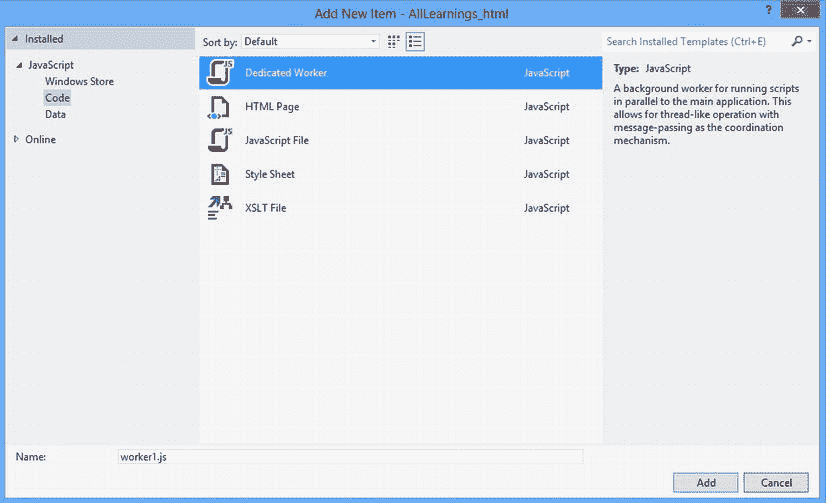

# 8.保持应用在后台运行

Abstract

微软定义、创造和注册的术语 Windows 与计算功能有关，应用的功能区域可以被划分到屏幕的一个角落，四处移动，并最大化以占据整个屏幕表面区域，对此任何人都不会感到惊讶。简而言之，Windows 允许你进入一个正在运行的应用。随着时间的推移，显示应用的能力演变为能够运行和使用多个应用，包括窗口重叠、快速任务切换和许多我们都知道、喜欢并期望从 Windows、Mac OS 甚至 Linux 和 Unix 产品树等自尊操作环境中获得的更多令人愉快的功能。

微软定义、创造和注册的术语 Windows 与计算功能有关，应用的功能区域可以被划分到屏幕的一个角落，四处移动，并最大化以占据整个屏幕表面区域，对此任何人都不会感到惊讶。简而言之，Windows 允许你进入一个正在运行的应用。随着时间的推移，显示应用的能力演变为能够运行和使用多个应用，包括窗口重叠、快速任务切换和许多我们都知道、喜欢并期望从 Windows、Mac OS 甚至 Linux 和 Unix 产品树等自尊操作环境中获得的更多令人愉快的功能。

因此，对于每个开始使用 Windows 8 的人来说，所有你喜欢的漂亮创新，以及多年来用户反馈、试错和功能调整的自然演变，都在这次 Windows 的重新发明中消失了，这应该是一个完全的惊喜。您如何提供相同的体验—应用切换、后台处理、窗口等等—同时保持新的范式，允许 Windows 在任何设备上运行，从基于 ARM 的设备(您可能在 iPhone 上找到的类型)到成熟的 Windows 体验(例如 Core i7 über 设备)？

这一章着重于 Windows 的一个原则，这个原则在我称之为“大清洗”中幸存了下来:多种形式的后台处理。在以前的 Windows 版本中，应用通过各种机制在后台运行。简单地从一个应用切换到另一个应用实际上是把第一个应用放到了后台(尽管在以前的 Windows 版本中，它继续像在前台一样运行)。这为用户和开发人员提供了极大的灵活性，但是不利的是，给他们的工作流带来了难以置信的复杂性。作为一个用户，如果不打开所有的超级用户工具，很难确切地知道在任何给定的时间你的机器上正在运行什么。作为一名开发人员，几乎不可能预测其他应用会如何反应和对待您的应用，而且您的应用与另一个应用之间的兼容性问题总是作为 bug 与您的应用联系在一起。我记得曾经写过一个小小的不可见的控制台应用，它定期监视某个文字处理软件的可执行文件，并用一个`process –kill`命令关闭它。(在你打电话给 FBI 之前，请明白这是 CS 室友之间的玩笑。)

因为 Windows 8 引入了一种新的应用行为方法，在这种方法中，应用用户界面总是占据整个屏幕表面区域，这意味着用户应该与一个应用(或者两个，如果用户已经捕捉到一个辅助应用)进行交互，所以前台应用被认为对用户来说是最重要的。

Note

捕捉功能仅在有足够水平空间支持的屏幕上可用。在 Windows 8 的当前版本中，这样的屏幕必须支持 1366 x 768 分辨率。在 Windows 8 的未来版本中，有传言称将允许更多的快照宽度。

第一章在某种程度上谈到了这一点。因为前台应用接收所有系统资源，所以用户看不到的应用会进入暂停状态，不再执行。以这种方式暂停的应用会一直保持这种状态，直到用户通过应用切换、重新启动或通过契约机制初始化来恢复它。这种方法的好处之一是，系统不会受到在用户看不到的后台运行的应用的负面影响。

Note

在 Windows 8 的当前实施中，这一开创性操作系统的愿景尚未完全实现。在 WinRT 版本的操作系统上，运行在基于 ARM 的处理器上，如 NVIDIA Tegra 3，你不能安装传统的应用，如 Skype for desktop(一直在后台运行)。但是，在 Windows 8 的完整版本中，用户可以在桌面模式下安装应用，这些应用会对系统产生持续的性能影响。因此，当批处理作业以桌面模式在 SQL Server 实例上运行时,“开始”菜单可能会出现滞后和延迟。

## 在后台运行

Windows 8 应用使用后台任务来提供运行的功能，而不管底层应用当前是否正在运行。注册后，后台任务由称为触发器的外部事件启动，并允许根据称为条件的大量标准启动，所有这些条件都必须为真，后台任务才能运行。即使触发了触发事件也是如此。后台任务的触发事件可能是时间，或者一些系统事件，如软件安装或系统更新的完成。

由于对速度和流畅性的要求，重要的是后台任务不能无节制地运行，在用户不知情的情况下降低系统速度。因此，这些任务是通过资源管理环境执行的，该环境只为后台任务提供有限的时间来运行其任意代码。

鉴于现代 Windows 8 应用以这种方式运行，问题是一个应用不在前台时可以做什么。Windows 8 提供了许多功能，让应用有机会从非运行状态执行、从后台执行或从前台切换时继续执行。尽管执行机制不在前台，但它们针对系统性能和更长的电池寿命进行了优化(这是不允许多个应用在后台运行的另一个原因)。Windows 8 允许这样做的一些情况如下:

*   按定时间隔执行任务
*   若要在应用关闭后继续后台传输数据
*   若要在应用关闭后继续播放音频
*   发生系统事件时执行任务

### 后台任务

本节的介绍说，后台任务使用一个称为触发器的外部事件。触发器指示任务应该何时运行，并提供一组条件，这些条件必须为真，任务才能运行。当触发触发器时，底层任务基础结构启动该类或调用与该触发器关联的方法。无论应用当前是正在运行、暂停还是完全从内存中删除，都会执行此操作。请注意，后台任务永远不会转移到前台，也不会使用任何与前台相关的功能，例如呈现用户界面。(不过，他们可以启动磁贴和吐司通知。)

清单 8-1 中的例子创建了一个基于时间的后台任务，每 15 分钟唤醒并执行一次。您可能想将此间隔缩短为一分钟，这样您就可以看到工作中的后台任务；但是要注意，这种类型的后台任务不能以少于 15 分钟的增量运行(下一节将进一步讨论这一点)。这应该强调了微软对性能的重视。更好或更坏的是，这个想法是为用户提供一致的体验，不管他们是在低功率的机器上还是在高功率的庞然大物上。不幸的是，这通常意味着将最小公分母暴露给 API 环境。

Listing 8-1\. Timer-Triggered Background Task

`function GetTask(task_name) {`

`var iter = Windows.ApplicationModel.Background.BackgroundTaskRegistration.allTasks.first();`

`var hascur = iter.hasCurrent;`

`while (hascur) {`

`var cur = iter.current.value;`

`if (cur.name === task_name) {`

`return cur;`

`}`

`hascur = iter.moveNext();`

`}`

`return null;`

`}`

`(function () {`

`"use strict";`

`var Background = Windows.ApplicationModel.Background;`

`WinJS.UI.Pages.define("/samples/BGTaskSample/TestBGTasks.html", {`

`ready: function (element, options) {`

`var timer_id = -1;`

`var task_name = "timer task";`

`var can_run = false;`

`var background_task = null;`

`//request the background task`

`Background.BackgroundExecutionManager.requestAccessAsync().then(`

`function (access_status) {`

`if (access_status != Background.BackgroundAccessStatus.Denied`

`&& access_status != Background .BackgroundAccessStatus.Unspecified) {`

`can_run = true;`

`background_task = GetTask(task_name);`

`if (background_task != null) {`

`btn_timer.innerText = "Unregister Background Task";`

`} else {`

`btn_timer.innerText = "Register Background Task";`

`}`

`}`

`});`

`btn_timer.onclick = function () {`

`if (!can_run) {`

`var v = new Windows.UI.Popups.MessageDialog("Application`

`cannot run in the background/");`

`v.showAsync();`

`return;`

`}`

`//if this has not been created, do so`

`if (background_task == null) {`

`btn_timer.innerText = "Unregister Background Task";`

`var task = new Background.BackgroundTaskBuilder();`

`var timer = new Background.TimeTrigger(15, false);`

`task.setTrigger(timer);`

`task.taskEntryPoint = "BackgroundTaskHost.TestTimerTask";`

`task.name = task_name;`

`background_task = task.register();`

`if (background_task != null) {`

`background_task.oncompleted = function (evt) {`

`try {`

`var complete_date = new Date();`

`txt_display.textContent = txt_display.textContent +`

`"_done at " + complete_date.getHours() + " : " +`

`complete_date.getMinutes();`

`} catch (e) {`

`}`

`};`

`background_task.onprogress = function (evt) {`

`try {`

`txt_display.Text = txt_display.Text + "_"`

`+ evt.progress.toString();`

`} catch (e) {`

`}`

`};`

`//countdown to the trigger being fired`

`var minutes_count = 0;`

`var seconds_count = 0;`

`timer_id = setInterval(function () {`

`try {`

`seconds_count++;`

`if (seconds_count == 60) {`

`seconds_count = 0;`

`minutes_count++;`

`}`

`txt_display.value = minutes_count + " mins, "`

`+ seconds_count + " secs";`

`} catch (e) {`

`}`

`}, 1000);`

`}`

`} else {`

`//unregister the created task`

`background_task.unregister(true);`

`if (background_task != null) {`

`}`

`btn_timer.innerText = "Register Background Task";`

`clearInterval(timer_id);`

`}`

`};`

`}`，

`});`

`})();`

清单 8-1 首先通过`requestAccessAsync`方法请求访问后台执行引擎。与 Windows 8 的所有功能一样，该操作会提示用户授予应用作为后台任务运行的权限。图 [8-1](#Fig1) 显示了你刚刚创建的应用的权限对话框。当你在电脑上运行应用时，你应该会看到这个。

图 8-1。

Permissions dialog box for background tasks

如果用户允许访问，您将答案记录为`can_run`中的`true`值。注意全局方法`getTask`，它返回一个给定名称的先前调度的任务。计划任务存储在应用外部的一个结构中，该结构以任务名称为关键字。这允许您引用以前创建的任务，以便取消注册它们。在清单 8-1 中，您首先使用这个功能来搜索任务名称:如果它不存在，您创建它；如果它确实存在，你注销它。

要向后台任务基础设施注册一个定时任务，可以使用`BackgroundTaskBuilder`。在这个例子中，您正在注册一个定义在类型`BackgroundTaskHost.TestTimerTask`中的任务。在这种情况下，这是使用另一种 Windows 8 编程语言(C#)创建的类型。因此，在注册希望作为后台任务执行的代码时，必须应用一些额外的规则。在 JavaScript 中，您只需创建一个简单的 JavaScript 文件，称为专用工作器，而在 C#中，您必须使用强类型系统将一段代码标识为后台任务。首先创建一个新类，它的类型必须实现`IBackgroundTask`，并作为字符串传递给`BackgroundTaskBuilder`的`TaskEntryPoint`属性。

请注意，您不必为了调试后台任务代码而等待触发条件得到满足。Visual Studio 2012 提供了一个漂亮的调试工具，让您可以在实际的后台任务类中运行代码。

回到 JavaScript 世界，您现在可以创建一个时间触发器，并将其作为参数传递给`BackgroundTaskBuilder`的`setTrigger`方法。时间触发器是一种使后台任务运行的触发机制。与传统 Win32 应用的方法不同，后台任务不能由它们的主机应用启动；相反，必须满足一组特定的条件，然后触发后台任务的启动。下一节更多地谈到这一点；现在，让我们看一下在满足本例的触发条件时运行的任务。清单 8-2 中显示了后台任务的摘录(用 C#)。

Listing 8-2\. Run Example for the Background Task

`async public void Run(IBackgroundTaskInstance taskInstance)`

`{`

`var def = taskInstance.GetDeferral();`

`try`

`{`

`//create the state for the application`

`var has_count = await Windows.Storage.ApplicationData.Current.LocalFolder`

`.FileExistsAsync("count.txt");`

`if (!has_count)`

`{`

`await Windows.Storage.ApplicationData.Current.LocalFolder`

`.CreateFileAsync("count.txt");`

`}`

`//read the count from the local state`

`var text = await Windows.Storage.ApplicationData.Current.LocalFolder`

`.ReadTextAsync("count.txt");`

`int count;`

`if (!int.TryParse(text, out count))`

`count = 0;`

`//display the toast notification`

`Toast("toast " + count);`

`//display the badge`

`var badge_type = count % 6;`

`Badge((BadgeType)badge_type);`

`//display the tile notification`

`Tile("Tile notification " + count);`

`count++;`

`await Windows.Storage.ApplicationData.Current`

`.LocalFolder.WriteAllTextAsync("count.txt",count.ToString());`

`}`

`catch (Exception ex)`

`{`

`}`

`def.Complete();`

`}`

我将首先说明，您不需要理解 C#来构建后台任务。这个例子使用一个 C#后台任务来说明 WinRT 提供的无缝语言集成。如果你不知道它是做什么的，或者它看起来过于复杂，不要惊慌。JavaScript 的部分魅力和强大之处在于它可以对您隐藏许多这些复杂性(或者至少通过一个不那么神秘的 API 来提供它们)。这个后台任务实现从一个文本文件中读取一个计数，并触发 toast、tile 和 badge 通知，这些通知显示计数、递增计数并将值保存回文本文件，以便下次触发该任务时，它会显示一个更大的数字。

如前所述，WinRT 的伟大之处在于它均匀地扩展到了所有语言(在大多数情况下)，这意味着没有一种语言被视为需要近亲才能进入的第二代表亲。这是一种迂回的说法，即您也可以使用 JavaScript 来构建后台任务，使用称为 workers 的专用 JavaScript 文件。(以下部分将更详细地介绍工作人员如何操作，并可以连接到后台任务引擎。)要使用 JavaScript worker 实现后台任务，您需要向项目中添加一个专门的 worker，并在`BackgroundTaskBuilder`的`TaskEntryPoint`属性中引用 worker 的文件名(而不是 C#类的完全限定类型名)。所以在清单 8-1 中，你使用了调用`task.taskEntryPoint = "/samples/bgtasksample/timerworker.js"`，而不是调用`task.taskEntryPoint = "BackgroundTaskHost.TestTimerTask";`，当然假设你已经将`timerworker.js`专用工人文件添加到你的项目中。同样，下面几节将进一步讨论这一点。图 [8-2](#Fig2) 显示了选择了专用工人模板的项目项目选择器。

图 8-2。

Selecting the background worker project item type

### 情况

后台任务也可以有与之相关联的条件。您可以使用`BackgroundTaskBuilder`的`addCondition`方法添加这些。应用于后台任务的条件必须全部评估为`true`，任务才能执行。例如，如果您希望您在清单 8-1 中创建的后台任务只在互联网连接可用时执行，那么在调用`setTrigger`之后添加清单 8-3 中的代码片段就可以激活该条件。

Listing 8-3\. Adding Conditions to a Background Task

`..`。

`task.setTrigger(timer);`

`task.addCondition(new Background.SystemCondition`

`(Background.SystemConditionType.internetAvailable));`

`..`。

表 [8-1](#Tab1) 列出了可能的条件类型。

表 8-1。

Conditions Types

<colgroup><col> <col></colgroup> 
| 成员 | 描述 |
| --- | --- |
| `userPresent` | 指定后台任务只能在用户在场时运行。如果触发了具有`userPresent`条件的后台任务，并且用户不在，则该任务不会运行，直到用户出现。 |
| `userNotPresent` | 指定后台任务只能在用户不在时运行。如果触发了具有`UserNotPresent`条件的后台任务，并且用户在场，则该任务不会运行，直到用户变为非活动状态。 |
| `internetAvailable` | 指定后台任务只能在 Internet 可用时运行。如果触发了具有`internetAvailable`条件的后台任务，并且互联网不可用，则该任务将不会运行，直到互联网再次可用。 |
| `internetNotAvailable` | 指定后台任务只能在互联网不可用时运行。如果触发了具有`internetNotAvailable`条件的后台任务，并且互联网可用，则该任务将不会运行，直到互联网不可用。 |
| `sessionConnected` | 指定后台任务只能在用户会话连接时运行。如果触发了具有`sessionConnected`条件的后台任务，并且用户会话未登录，则该任务将在用户登录时运行。 |
| `sessionDisconnected` | 指定后台任务只能在用户会话断开时运行。如果触发了具有`sessionDisconnected`条件的后台任务，并且用户已登录，则该任务将在用户注销时运行。 |

### 扳机

可以想象，基于计时器的后台任务并不是应用可以使用的唯一类型的后台任务。与条件一样，后台任务可以基于用户会话期间发生的系统事件来启动。到目前为止，您一直在使用`TimeTrigger`类来触发一个后台任务；该触发器以给定的时间间隔执行后台任务。表 [8-2](#Tab2) 提供了可用于启动后台任务的所有可能触发器的列表。许多触发器类型遵循相似的模式，因此本节重点介绍常见的维护和系统触发器。

表 8-2。

Background Task Trigger Types

<colgroup><col> <col></colgroup> 
| 触发器名称 | 描述 |
| --- | --- |
| 时间触发器 | `Windows.ApplicationModel.Background.TimeTrigger`表示触发后台任务运行的时间事件。 |
| 系统触发器 | `Windows.ApplicationModel.Background.SystemTrigger`表示触发后台任务运行的系统事件。系统事件的示例包括网络中断、网络访问以及用户登录或注销。 |
| 推送通知触发器 | `Windows.ApplicationModel.Background.PushNotificationTrigger`表示调用应用上的后台工作项的对象，以响应原始通知的接收。推送通知超出了本书的范围；有关为 Windows 8 应用设置推送通知服务的更多信息，请访问 Windows 8 应用开发中心。 |
| 维护触发器 | `Windows.ApplicationModel.Background.MaintenanceTrigger`代表维护触发器。与`TimeTrigger`一样，`MaintenanceTrigger`在时间间隔结束时执行(可以配置为只执行一次)，但是设备必须连接电源才能执行指定触发有效的任务。 |

对于需要代码在时间和交流电源范围之外的系统事件发生时执行的应用来说，`SystemTrigger`类是一个包罗万象的备选方案。`SystemTrigger`用一个枚举实例化，该枚举标识哪个系统事件触发底层后台任务。清单 8-4 创建了一个系统触发器，当设备连接到互联网时就会被触发。

Listing 8-4\. System Trigger

`var task = new Background.BackgroundTaskBuilder();`

`var internet_available = new Background.SystemTrigger(Background.SystemTriggerType.internetAvailable, false);`

`task.taskEntryPoint = "/samples/bgtasksample/timerworker.js";`

`task.setTrigger(internet_available);`

`background_task = task.register();`

表 [8-3](#Tab3) 列出了可用的系统触发类型。

表 8-3。

System Trigger Types

<colgroup><col> <col></colgroup> 
| 触发器类型 | 描述 |
| --- | --- |
| `smsReceived` | 当已安装的移动宽带设备收到新的 SMS 消息时，将触发后台任务。 |
| `userPresent` | 当用户出现时，触发后台任务。注意:应用必须放置在锁定屏幕上，才能使用此触发器类型成功注册后台任务。 |
| `userAway` | 当用户不在时，触发后台任务。注意:应用必须放置在锁定屏幕上，才能使用此触发器类型成功注册后台任务。 |
| `networkStateChange` | 当网络发生变化时，例如开销或连接性的变化，触发后台任务。 |
| `internetAvailable` | 当互联网变得可用时，触发后台任务。 |
| `sessionConnected` | 当会话连接时，将触发后台任务。注意:应用必须放置在锁定屏幕上，才能使用此触发器类型成功注册后台任务。 |
| `servicingComplete` | 当系统完成应用更新时，会触发后台任务。 |
| `lockScreenApplicationAdded` | 将磁贴添加到锁定屏幕时，会触发后台任务。 |
| `lockScreenApplicationRemoved` | 当磁贴从锁定屏幕移除时，触发后台任务。 |
| `timeZoneChange` | 当设备上的时区发生变化时(例如，当系统根据夏令时调整时钟时)，将触发后台任务。 |
| `onlineIdConnectedStateChange` | 当连接到该帐户的 Microsoft 帐户发生变化时，将触发后台任务。 |

Note

一些系统触发器需要应用在锁定屏幕上:`SessionConnected`、`UserPresent`、`UserAway`和`ControlChannelReset`。如果您在应用不在锁定屏幕上的情况下使用这些触发器，`BackgroundTaskBuilder`上的`register`呼叫将会失败。

### 宿主进程

后台任务要么在系统提供的主机可执行文件(称为`backgroundtaskhost.exe`)中执行，要么在 app 进程中执行。清单 8-1 使用了一个单独库中的后台任务作为后台任务。在这个场景中，使用了`backgroundtaskhost.exe`，任务的启动与应用的状态无关。这意味着后台任务可以在相关应用没有启动的情况下启动和运行。在清单 8-4 中，后台任务指向位于`/samples/bgtasksample/timerworker.js`的一个 JavaScript 工作器。这是一个在 app 进程中执行的后台任务的例子。因为应用正在托管这种类型的后台任务，所以可能需要启动它才能运行底层任务。如果当这样的任务被触发时，应用已经在运行，它将在应用的上下文中启动。如果应用在任务被触发时被挂起，它的线程将被解冻，然后任务将被启动。最后，如果应用在触发后台任务时处于终止状态，则启动应用，然后执行任务。

### 报告进度

为了向应用报告进度(当后台任务执行时，应用在前台运行)，`BackgroundTaskRegistration`提供了`progress`事件处理程序。对于 WinJS 应用，`WebUIBackgroundTaskInstance`被传递给`Run`方法以向前台应用传达进度。该接口有一个可选的`Progress`属性，可以由后台任务更新。

`BackgroundTaskRegistration`还提供了一个`completed`事件，当后台任务完成时，应用可以使用该事件得到通知。任务运行时引发的完成状态或任何异常都将作为事件处理程序的输入参数传递给前台应用中的任何完成处理程序。如果应用在任务完成时暂停，它会在下次恢复时收到完成通知。在应用被终止的情况下，它不会收到完成通知。在这种情况下，由应用开发人员将任何完成状态信息保存在一个商店中，前台应用也可以访问该商店。

JavaScript 后台任务必须在完成工作后调用`close`,这样任务才能被关闭。一定要进行这个调用，因为它向后台任务基础设施表明任务已经完成(没有它，JavaScript 主机将保持活动)。

在清单 8-2 中，你看到了一个基于 C#的后台工作器的例子。清单 8-5 用 JavaScript 创建了一个简单的后台任务。注意在方法返回之前使用了`close`函数。

Listing 8-5\. JavaScript Background Worker

`onmessage = function (event) {`

`var task_instance = Windows.UI.WebUIBackgroundTaskInstance.current;`

`var count= 0;`

`for (int i = 0; i < 10; i++)`

`{`

`count += 10;`

`backgroundTask.progress = count;`

`}`

`backgroundTask.succeeded = true;`

`close();`

`}`

### 声明后台任务

本章首先讨论了传统应用的一些缺点，因为它们与系统资源的使用有关。同样，假设遗留应用可以在没有用户通知或参与(除了启动它们)的情况下在后台运行，那么系统作为一个整体可能会感觉迟钝。并不是说在后台运行应用本身就有什么问题；但是这种活动的影响很少传达给用户。你会惊讶于你的系统中有多少前台应用运行着一个或多个后台任务，甚至在应用没有运行的时候！遵循 Windows 8 的总体主题，像这样的决定不是留给应用开发人员，而是委托给用户。由用户决定哪些应用应该在后台运行。

为了帮助实现这一点，寻求使用后台任务的现代 Windows 8 应用必须明确声明自己是后台任务，并明确指出它们公开的后台任务类型。图 [8-3](#Fig3) 显示了这个声明在 Visual Studio 2012 IDE 中的位置(`package.appmanifest`)。它在同一个声明选项卡中，这个选项卡被反复使用，向用户清楚地概述了应用公开的特性。这很好，因为用户最终负责选择使用一个应用还是另一个。

图 8-3。

Background task declaration

在图中，入口点表示包含后台任务实现的类的完全限定类型名。它应该用在使用 C#或 C++/Cx 开发后台任务的场景中。如果后台任务是在宿主 JavaScript 应用中定义的，那么起始页应该填充专用工作文件的路径。

Note

因为许多后台任务需要锁屏访问才能运行，所以您还需要在应用 UI 选项卡上指定徽章信息，以便声明正确。图 [8-4](#Fig4) 显示了应用清单的应用 UI 选项卡的视觉资产部分。为了使图 [8-1](#Fig1) 中的声明有效，应用必须具有有效的徽章标志，并且必须启用某种形式的锁屏通知。如图所示，如果没有正确配置这些元素，应用将无法正确构建。

图 8-4。

Visual Assets section of the Application UI tab in an app’s manifest

### 资源限制

因为后台任务是指快速进出、消耗很少系统资源的短期工作单元，所以对它们应用 CPU 和网络使用限制也就不足为奇了。具体来说，锁定屏幕上的每个应用每 15 分钟接收 2 秒钟的 CPU 时间，供应用的所有后台任务使用。在 15 分钟结束时，锁定屏幕上的每个应用都会获得另外 2 秒钟的 CPU 时间，供其后台任务使用。(不在锁屏的每个应用每 2 小时接收 1 秒的 CPU 时间。)

在网络方面，数据吞吐量用于限制后台任务。这些指标根据手机、网络接口、可用电池寿命以及 CPU 使用情况而有所不同。一般来说，在设备上可用的平均吞吐量为 10Mbps 的情况下，一个应用可能每 15 分钟被允许大约 4.69MB(每天 450MB)。

有一些警告；例如，如果该应用恰好也是前台应用，那么这些 CPU 和网络限制就不再适用。此外，如果设备没有连接到电源，网络限制就不适用。

最后，在控制信道和推送通知后台任务的情况下，存在约束，但是如同其他后台任务类型一样，约束是针对每个任务而不是针对所有任务应用的。

## 后台传输

在现代计算时代，通过网络移动文件是一种常见的活动。无论您是将视频、音频或图像上传到社交网站，还是从媒体目录下载电影，都有对该功能的基本需求。如果目标文件非常小，这通常就像连接到内容提供商并下拉(或上推)所需的内容一样简单。但是当内容非常大的时候会怎么样呢？鉴于 Windows 8 被设计为快速流畅，允许用户在应用之间快速无缝地切换，应用如何处理长时间运行的网络数据传输活动正在进行中，而用户将应用移出前台状态的情况？当然，解决方案不是告诉用户，“警告:在下载完成之前不要离开应用！”

微软的人用`BackgroundTransfer`功能覆盖了这个用例。使用`BackgroundDownloader`，应用可以安排下载(或使用`BackgroundUploader`上传)内容，这样即使用户暂停或终止应用，下载/上传仍会在后台继续。清单 8-6 显示了一个使用`BackgroundDownloader`类从远程资源中下载一个大文件的简单例子。

Listing 8-6\. `BackgroundDownloader` at Work

`btn_transfer.onclick = function ()`

`{`

`var known_folders = Windows.Storage.KnownFolders;`

`var foundation = Windows.Foundation;`

`var downloader = new Windows.Networking.BackgroundTransfer`

`.BackgroundDownloader();`

`var file = known_folders.videosLibrary.createFileAsync("kinectnui_ch9.wmv")`

`.then(function (file)`

`{`

`var download_operation = downloader.createDownload(`

`new foundation.Uri`

`("`[`http://www.xochl.com/media/videos/KinectNui_ch9.wmv`](http://www.xochl.com/media/videos/KinectNui_ch9.wmv)T2】

`download_operation.startAsync();`

`});`

`};`

清单 8-6 显示了一个`btn_transfer`按钮的事件处理程序，当点击这个按钮时，从远程资源下载一个大文件。要运行此示例，您必须将视频库功能添加到目标应用的清单中，因为这是远程文件下载到的位置。一旦点击按钮并开始下载，用户可以切换离开目标应用，甚至停止它，下载仍然会完成。

## 摘要

现在，您已经探索完了在 Windows 8 环境中让应用在后台运行的方法，让我们回顾一下本章涉及的一些要点:

*   您学习了各种类型的触发器。对于需要代码执行的应用，即使系统超出了时间和交流电源的范围，`SystemTrigger`类是一个包罗万象的选择。
*   后台任务是指快速进入和退出，消耗很少系统资源的短期工作单元。CPU 和网络使用限制适用于它们。
*   使用`BackgroundTransfer`功能，`BackgroundDownloader`是一个可以安排内容下载(或上传，使用`BackgroundUploader`)的类，这样即使应用被用户暂停或终止，下载/上传也会在后台继续。
*   后台任务在系统提供的主机可执行文件或 app 进程中执行。