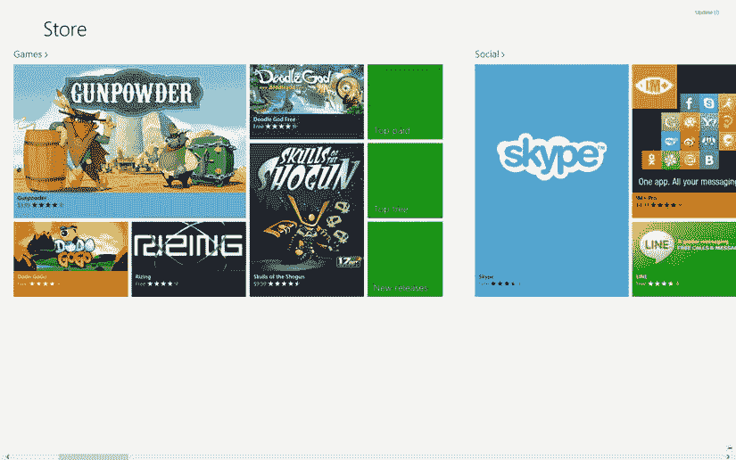
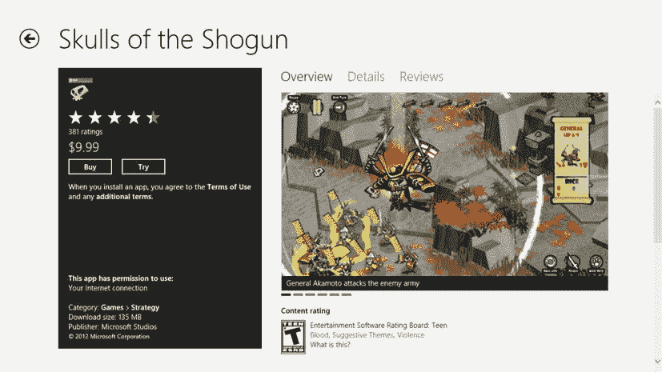
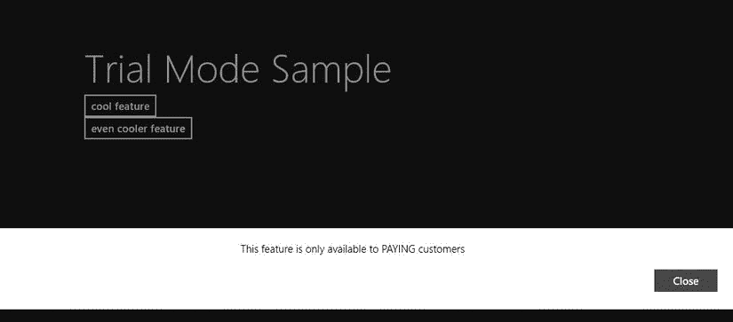
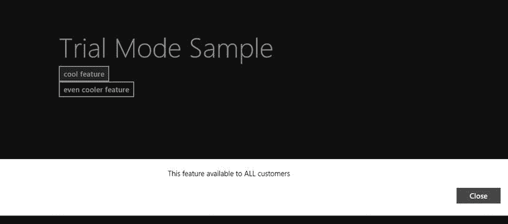
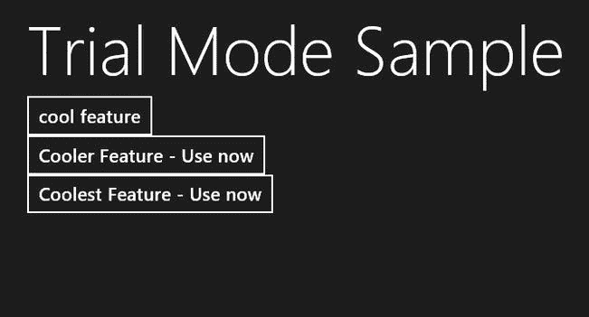

# 九、应用货币化：内幕

Abstract

说到底，大多数开发人员并不仅仅是为了创造性的表达。在大多数情况下，你希望从你所做的工作中获得一些经济上的收益——即使它仅够支付构建一个应用的费用。可以肯定的是，构建和维护现代应用会很快变得非常昂贵。首先，由于 Windows 8 应用的沙盒特性，许多功能——特别是那些针对传统桌面构建的应用——在 Windows 8 应用世界中不可用。Windows 8 应用当然是沙盒化的，这是有原因的——为了最大限度地减少行为不端的应用对设备造成的损害——但这些理所当然的限制的副作用是应用通常需要包含云组件。应用的这个驻留在云上的部分就像一个传统的应用一样，可以完全访问云服务器的环境。托管这样一个解决方案可以迅速将你的固定成本应用(用于构建应用的血汗资产与一次性价格相关联)转变为一个循环成本应用。

说到底，大多数开发人员并不仅仅是为了创造性的表达。在大多数情况下，你希望从你所做的工作中获得一些经济上的收益——即使它仅够支付构建一个应用的费用。可以肯定的是，构建和维护现代应用会很快变得非常昂贵。首先，由于 Windows 8 应用的沙盒特性，许多功能——特别是那些针对传统桌面构建的应用——在 Windows 8 应用世界中不可用。Windows 8 应用当然是沙盒化的，这是有原因的——为了最大限度地减少行为不端的应用对设备造成的损害——但这些理所当然的限制的副作用是应用通常需要包含云组件。应用的这个驻留在云上的部分就像一个传统的应用一样，可以完全访问云服务器的环境。托管这样一个解决方案可以迅速将你的固定成本应用(用于构建应用的血汗资产与一次性价格相关联)转变为一个循环成本应用。

市场加剧了这个问题。应用的消费者通常习惯于应用更新的便捷性和频繁性。这意味着对正在进行的开发的潜在期望扩展到市场上的任何应用，无论它是由像脸书这样的十亿美元的组织还是由你创建的。当你将一个应用发布到市场上时，你还必须考虑支持它所需的时间成本。

出于这些以及更多的原因，像 Windows Store、Windows Phone Store 和 Google Play 这样的数字市场都可以让你通过直接销售将应用货币化，市场就像商家一样。使用这种市场模式，潜在的 Windows 8 用户可以从 Windows 商店发现和购买应用。利润的一部分归开发目标应用的开发者，其余部分归微软，以帮助抵消维护 Windows 商店的成本。图 [9-1](#Fig1) 显示了 Windows Store 的登陆屏幕。

图 9-1。

Windows Store landing page

本章讨论了通过你的应用赚钱的两种常见方式:销售应用和在应用内销售。许多应用也通过应用内广告创收，但这种方法的细微差别超出了本书的范围。

## 销售您的应用

如果你有机会拥有一部 iPhone，并浏览苹果的应用商店购买流程，你可能会注意到许多非免费/收费应用有两个版本:一个免费的“演示”版本，用于展示应用可以做什么，以及一个附带的全功能版本。演示版要么功能有限，要么完全开放，但支持广告。附带的全功能版本通常不支持广告。用户可以习惯这样的约定，但在开发方面，这可能会导致头痛，因为特性必须跨两个代码库进行管理:一个用于应用的演示版本，另一个用于完整版本。

微软的 Windows Store 通过让你发布付费应用作为试用版来帮助解决这个问题。这允许开发人员维护应用的一个版本，作为试用版和完整版，并指定应用可以从一个版本迁移到另一个版本的条件。从 Windows Store 的角度来看，这避免了像苹果应用商店那样不必要的重复。从最终用户的角度来看，它提供了一种简单易行的方法来试用一个应用，如果你喜欢就购买它。图 [9-2](#Fig2) 显示了一个 Windows Store 付费应用页面，用户可以使用试用模式。

图 9-2。

Application with trial mode

从开发人员的角度来看，构建用于销售但包含试用组件的应用的工作流程相对简单:

Build the application as a full-featured application without worrying about which pieces of functionality are trial bits and which aren’t.   After the application is built and tested and you’re sure everything works as intended, determine which features you want available to trial-version users and which bits you want to make visible only to paid-version users.   Use the Microsoft-provided classes to gate the sections of the application that a trial user can’t access.  

每个应用都有自己控制试用用户的方法。对于一些应用，比如游戏，你可能想展示应用能做的一切，但是对高级功能(或者应用的整体使用)有时间限制。

试用的想法不仅仅是对应用进行测试；这也是为了推销这款应用的好处。当你为了赚钱而开发应用时，请记住这个核心概念:追加销售，追加销售，追加销售！

接下来，让我们看看示例试用应用。

### 试用应用示例

考虑到上一节中的三个步骤，清单 9-1 在步骤 1 的末尾给出了一个非常简单的应用。

Listing 9-1\. Simple Application with Two Features and a Buy App Button

`<!DOCTYPE html>`

`<html>`

`<head>`

`<meta charset="utf-8" />`

`<title>Listing1</title>`

`<!-- WinJS references -->`

`<link href="//Microsoft.WinJS.1.0/css/ui-dark.css" rel="stylesheet" />`

``

``

`<link href="Listing1.css" rel="stylesheet" />`

``

`</head>`

`<body>`

`
`

`<section aria-label="Main content" role="main">`

`<header aria-label="Header content" role="banner">`

`<button class="win-backbutton" aria-label="Back" disabled` `type="button"></button>`

`<h1 class="titlearea win-type-ellipsis">`

`Trial Mode Sample`

`</h1>`

`</header>`

`</section>`

`<section aria-label="Main content" role="main">`

`<input type="button" id="btn_buyapp" value="buy app" />`

`</section>`

`<section aria-label="Main content" role="main">`

`<input type="button" id="btn_coolfeature" value="cool feature" />`

`</section>`

`<section aria-label="Main content" role="main">`

`<input type="button" id="btn_coolerfeature" value="even cooler feature" />`

`</section>`

`
`

`</body>`

`</html>`

### 应用试用模式

试用模式应用向用户呈现了两个特性:一个很酷，另一个更酷。想必你想让这款应用的用户能够使用酷炫的功能，但只能看到更酷的功能。此外，当应用处于试用模式时，您希望购买应用按钮可见，但在购买应用后，您希望该按钮消失——否则用户可能会感到困惑，认为他们的购买没有注册或应用有缺陷。

对于 Windows 8 应用，购买是通过 Windows 商店 API 管理的，该 API 通过`Windows.ApplicationModel.Store`命名空间提供。这是所有相关信息的入口，这些信息包括用户是否在使用试用版，如果是，还有多长时间可以试用。不幸的是，这些类只针对实际生产的 Windows 应用商店数据，这意味着它们期望您的应用在商店中并处于活动状态。这当然带来了一个问题，因为一个未发布的应用没有可用的信息，因此不可能测试试用模式的工作流。为了帮助解决这一困境，Windows 应用商店 API 包括一个模拟器 API 集，它模仿实时版本的功能，但针对您提供的 XML 文件工作。以这种方式使用 Windows Store commerce 基础架构的 Windows Store 应用需要您构建和管理这个 XML 文件，该文件称为`WindowsStoreProxy.xml`，并且始终位于`%userprofile%\appdata\local\packages\<package-moniker>\localstate\microsoft\Windows Store\Apidata`文件夹中。由开发人员决定是否放置/修改该文件，以适应您打算在应用中进行测试的场景(在这种情况下，测试以查看应用在试用模式和购买模式下的行为)。清单 9-2 显示了这个文件格式的一个例子。

Listing 9-2\. `WindowsStoreProxy.xml`

`<?xml version="1.0" encoding="utf-16" ?>`

`<CurrentApp>`

`<ListingInformation>`

`<App>`

`<AppId>2B14D306-D8F8-4066-A45B-0FB3464C67F2</AppId>`

`<LinkUri>`[`http://apps.microsoft.com/app/2B14D306-D8F8-4066-A45B-0FB3464C67F2</LinkUri`](http://apps.microsoft.com/app/2B14D306-D8F8-4066-A45B-0FB3464C67F2%3C/LinkUri)T2】

`<CurrentMarket>en-us</CurrentMarket>`

`<AgeRating>6</AgeRating>`

`<MarketData xml:lang="en-us">`

`<Name>Trial management full license</Name>`

`<Description>Sample app for demonstrating trial license management</Description>`

`<Price>4.99</Price>`

`<CurrencySymbol>$</CurrencySymbol>`

`</MarketData>`

`</App>`

`</ListingInformation>`

`<LicenseInformation>`

`<App>`

`<IsActive>true</IsActive>`

`<IsTrial>true</IsTrial>`

`<ExpirationDate>2011-01-01T00:00:00.00Z</ExpirationDate>`

`</App>`

`</LicenseInformation>`

`</CurrentApp>`

### 许可您的应用

下一节将更详细地介绍`WindowsStoreProxy.xml`文件的各种元素。现在，让我们把注意力集中在`LicenseInformation`部分，重点放在`IsTrial`节点上——在本文档中它被设置为`true`。

您主要通过一个类与 Windows 商店进行交互:`CurrentApp`。(由于上述原因，在这个例子中，您使用了另一个类——使用了`WindowsStoreProxy.xml`的那个类——叫做`CurrentAppSimulator`。它模拟了`CurrentApp`的 API 表面积。)`CurrentApp`公开了一个`LicenseInformation`类型的`LicenseInformation`属性，您可以用它来读取与应用相关的许可数据。清单 9-2 中的`WindowsStoreProxy.xml`文件的粗体部分对应于这个部分。`LicenseInformation`提供`IsActive`、`IsTrial`、`ExpirationDate`等属性。在正常情况下(当你的应用已经发布到 Windows Store 并且是公开的)，调用`Windows.ApplicationModel.Store.CurrentApp.licenseInformation`返回应用的`LicenseInformation`实例。在这种情况下，因为您的应用还没有发布，所以您必须使用`CurrentAppSimulator`，当属性被调用时，它期望`WindowsStoreProxy.xml`文件位于前面讨论的位置；否则会出现错误。

在此示例中，您没有在 Windows 应用商店文件夹中查找该文件的放置位置并手动将其复制到该位置，而是创建了该文件的临时版本，您可以根据需要对其进行编辑。您将它放在应用的安装目录中；然后，每次应用启动时，您动态创建适当的 Windows Store 文件夹，在该文件夹中创建`WindowsStoreProxy.xml`文件，并将临时代理文件的内容复制到最终位置。这样，您可以轻松地使用本地副本。

在您的示例项目中，添加`storeproxy`文件夹；在其中，添加文件`TrialManagement.xml`，这是默认的`WindowsStoreProxy.xml`文件的副本。清单 9-3 显示了带有刚才描述的功能的样例应用的 JavaScript。

Listing 9-3\. JavaScript for Example App

`(function ()`

`{`

`"use strict";`

`var _listing_information = null;`

`var _license = null;`

`WinJS.UI.Pages.define("/Listing1/Listing1.html", {`

`// This function is called whenever a user navigates to this page. It`

`// populates the page elements with the app's data`。

`ready: function (element, options)`

`{`

`initializePurchaseState();`

`}`，

`});`

`function initializePurchaseState()`

`{`

`var proxy_folder = null;`

`var install_location = null;`

`var temp_proxy_file = null;`

`Windows.Storage.ApplicationData.current.localFolder`。

`createFolderAsync("Microsoft\\Windows Store\\ApiData"`，ⅵ

`Windows.Storage.CreationCollisionOption.replaceExisting)`

`.then(`

`function (folder)`

`{`

`proxy_folder = folder;`

`return Windows.ApplicationModel.Package.current.installedLocation`

`.getFolderAsync("storeproxy");`

`})`

`.then(function (location)`

`{`

`install_location = location;`

`return install_location.getFileAsync("trialmanagement.xml");`

`})`

`.then(function (temp)`

`{`

`temp_proxy_file = temp;`

`return proxy_folder.createFileAsync("WindowsStoreProxy.xml"`，ⅵ

`Windows.Storage.CreationCollisionOption.replaceExisting);`

`})`

`.then(function (proxy_file)`

`{`

`temp_proxy_file.copyAndReplaceAsync(proxy_file);`

`})`

`.done(function ()`

`{`

`_license = Windows.ApplicationModel.Store↩`

`.CurrentAppSimulator.licenseInformation;`

`});`

`}`

`})();`

清单 9-3 从调用`initializePurchaseState`开始。无论您是使用代理文件还是去 Windows 应用商店获取有关应用许可的信息，预先做这些都是有意义的。毕竟，您使用这些信息来确定向用户公开什么功能以及隐藏什么功能。`initializePurchaseState`相当直白；您打开或创建代理文件所在的目标文件夹，在那里创建正式的代理文件，然后将您的临时代理文件(您使用和修改的那个)的内容复制到正式的`WindowsStoreProxy.xml`文件。注意使用文件 I/O 时使用的承诺。在这种情况下，因为这只是为了开发目的，所有参数和文件名都在您的控制之下，所以您省略了每个`then`函数的第二个参数，它是错误条件的处理程序。正常情况下，这个应该包括在内！

在`async`链的末端是`done`函数，在这里您最终读取了`LicenseInformation`。同样，因为您使用的是`CurrentAppSimulator`，所以这是从您的`WindowsStoreProxy.xml`文件中读取的，而不是实际的 Windows 应用商店。图 [9-3](#Fig3) 显示了此时应用的外观和感觉。

图 9-3。

Trial mode sample app

现在您已经有了应用许可的详细信息，您可以根据需要开始显示和隐藏功能。在这种情况下，您需要做的就是读取`IsTrial`的值，并基于此切换购买应用按钮的可见性和更酷功能按钮的可交互性。清单 9-4 相应地更新了应用。

Listing 9-4\. Trial App Updated with `IsTrial` Logic

`(function ()`

`{`

`"use strict";`

`var _listing_information = null;`

`var _license = null;`

`WinJS.UI.Pages.define("/Listing1/Listing1.html", {`

`// This function is called whenever a user navigates to this page. It`

`// populates the page elements with the app's data`。

`ready: function (element, options)`

`{`

`initializePurchaseState();`

`btn_coolfeature.onclick = function ()`

`{`

`var v = new Windows.UI.Popups`

`.MessageDialog("This feature available to ALL customers");`

`v.showAsync();`

`};`

`btn_coolerfeature.onclick = function ()`

`{`

`if (_license.isTrial)`

`{`

`var v = new Windows.UI.Popups`

`.MessageDialog("This feature is only available to PAYING` `customers");`

`v.showAsync();`

`} else`

`{`

`var v = new Windows.UI.Popups`

`.MessageDialog("PAYING customer feature");`

`v.showAsync();`

`}`

`};`

`}`，

`});`

`function initializePurchaseState()`

`{`

`var proxy_folder = null;`

`var install_location = null;`

`var temp_proxy_file = null;`

`Windows.Storage.ApplicationData.current.localFolder`。

`createFolderAsync("Microsoft\\Windows Store\\ApiData"`，ⅵ

`Windows.Storage.CreationCollisionOption.replaceExisting)`

`.then(`

`function (folder)`

`{`

`proxy_folder = folder;`

`return Windows.ApplicationModel.Package.current.installedLocation`

`.getFolderAsync("storeproxy");`

`})`

`.then(function (location)`

`{`

`install_location = location;`

`return install_location.getFileAsync("trialmanagement.xml");`

`})`

`.then(function (temp)`

`{`

`temp_proxy_file = temp;`

`return proxy_folder.createFileAsync("WindowsStoreProxy.xml"`，ⅵ

`Windows.Storage.CreationCollisionOption.replaceExisting);`

`})`

`.then(function (proxy_file)`

`{`

`temp_proxy_file.copyAndReplaceAsync(proxy_file);`

`})`

`.done(function ()`

`{`

`_license = Windows.ApplicationModel.Store.CurrentAppSimulator`

`.licenseInformation;`

`loadAppPurchaseStateUI();`

`});`

`}`

`function loadAppPurchaseStateUI()`

`{`

`if (_license.isTrial)`

`{`

`btn_buyapp.style.visibility = "visible";`

`} else`

`{`

`btn_buyapp.style.visibility = "hidden";`

`}`

`}`

`})();`

粗体显示的变化很简单。当应用启动时，以及当用户点击更酷的特性按钮时，您实际上切换了基于`IsTrial`标志的行为。图 [9-4](#Fig4) 、 [9-5](#Fig5) 、 [9-6](#Fig6) 和 [9-7](#Fig7) 显示了基于用户点击的应用的各种状态。

图 9-7。

App view when Even Cooler Feature is clicked (`IsTrial` is `true`)

图 9-6。

App view when Even Cooler Feature is clicked (`IsTrial` is `false`)

图 9-5。

Prompt when Cool Feature is clicked

图 9-4。

App main screen when `IsTrial` is `false`

### 将代码添加到应用

该流程的最后一个部分是添加执行应用的实际购买所必需的代码。一旦应用被激活，您可以通过再次调用`loadAppPurchaseStateUI`来刷新用户界面。清单 9-5 显示了 Buy App 按钮的`onclick`事件的函数回调。

Listing 9-5\. Simulating the User Purchasing the Application

`btn_buyapp.onclick = function ()`

`{`

`Windows.ApplicationModel.Store.CurrentAppSimulator`

`.requestAppPurchaseAsync(true)`

`.then(function (receipt)`

`{`

`_license = Windows.ApplicationModel.Store.CurrentAppSimulator`

`.licenseInformation;`

`loadAppPurchaseStateUI();`

`});`

`};`

### 应用购买请求

通过调用`CurrentApp`或`CurrentAppSimulator`的`requestAppPurchaseAsync`方法，应用可以代表用户提出购买请求(这必须通过用户驱动的事件来完成，如鼠标点击)。虽然 API 是相同的，但是随后的操作会根据使用的类而有所不同。`CurrentApp`调用 Windows 商店购买用户界面，而`CurrentAppSimulator`启动一个传统的 Windows 对话框，您可以在其中选择您希望模拟器返回到您的应用的响应类型。您可以使用该功能来模拟快乐之路之外的各种用例。图 [9-8](#Fig8) 显示了点击购买应用按钮时出现的对话框。

您的代码应该能够处理这些场景，这样您的应用就不会崩溃。为此，您需要整合清单 9-5 中的错误处理函数。回想一下第 1 章中的[，您使用的`then`承诺可以接受三个函数:正常的完成处理程序、异步处理过程中发生错误时的错误处理程序，以及提供操作进度洞察的进度处理程序。在图](01.html) [9-8](#Fig8) 的对话框中选择的值作为参数传递给错误事件处理器。您可以使用该值向用户显示适当的消息。

图 9-8。

`CurrentAppSimulator` purchasing dialog for testing purchasing scenarios

## 在应用内销售

您已经了解了如何构建一个支持试用的应用。这种方法的前提是将您的应用发布为付费应用。付费应用代表了通过 Windows Store 应用赚钱的主要方式，但只是触及了总体模式的表面。

提供试用版是让潜在客户下载你的应用并在承诺支付费用前进行试运行的好方法，但这种方法在与免费同行竞争时有一些明显的缺点。毫无疑问，统计数据显示(在所有主要的应用商店中)，免费应用的下载量远远超过付费应用，并且与之相关的活动和对话也更多。虽然从技术上来说，试用应用是免费的，但它仍然在 Windows Store 的付费类别中列出，这使得发现你的应用成为一个问题。此外，正如您在前面的例子中看到的，付费/试用模式的灵活性有限。

作为一名开发者，你实际上只有两种产品可以呈现给最终用户:应用的免费版本和完整版本。实现的二进制性质限制了应用中自然存在的商业机会。例如，在这个例子中，假设您创建了一个“最酷的特性”功能，您额外给了它一美元。这将把应用的成本提高到 5.99 美元(根据`WindowsStoreProxy.xml`文件，该产品目前的成本为 4.99 美元)。不仅高昂的价格点可能难以消化，而且它还消除了用户只为一个功能付费的选择。通过应用内购买，你可以将购买的压力从整个应用转移到应用内的特定功能上。这一举两得。一方面，你把你的应用转移到世界上流量更高的地方，让它更容易被发现。另一方面，你继续将你的应用货币化，这一次你可以更好地控制你免费提供的应用。

在应用内购买方面，一个突出的应用类别是游戏。用户经常偶然发现免费游戏，由于不存在的价格标签，他们会很快下载。一旦参与(上瘾是一个常见的术语)，用户更倾向于为额外的功能付费。

### 将应用内购买添加到应用

让我们修改示例应用以使用应用内购买。清单 9-6 从稍微修改应用的用户界面开始。

Listing 9-6\. Modified User Interface for the Trial App

`<section aria-label="Main content" role="main">`

`<input type="button" id="btn_buyapp" value="buy app" />`

`</section>`

`<section aria-label="Main content" role="main">`

`<input type="button" id="btn_coolfeature" value="cool feature" />`

`</section>`

`<section aria-label="Main content" role="main">`

`<input type="button" id="btn_coolerfeature" value="please wait..." />`

`</section>`

`<section aria-label="Main content" role="main">`

`<input type="button" id="btn_coolestfeature" value="please wait..." />`

`</section>`

到目前为止，您已经添加了一个新按钮`btn_coolestfeature`，并且修改了`btn_coolerfeature`的内容，以向用户表明他们的内容正在加载。正如你马上看到的，你这样做是为了利用应用内购买的一个好处:你可以在应用外定义你的产品目录。你不再需要硬编码你正在销售的特性的名字；您可以直接从 Windows 应用商店阅读它们。

第 10 章将详细介绍如何在商店中设置你的应用。为了帮助解决这个问题，应用内购买向`WindowsStoreProxy.xml`文件引入了一些新的元素类型。清单 9-7 更新了您的本地副本，包含了表示应用内购买功能所需的所有元素。

Listing 9-7\. `WindowsStoreProxy.xml` with Product Listing Information Included

`<?xml version="1.0" encoding="utf-16" ?>`

`<CurrentApp>`

`<ListingInformation>`

`<App>`

`<AppId>2B14D306-D8F8-4066-A45B-0FB3464C67F2</AppId>`

`<LinkUri>`[`http://apps.microsoft.com/app/2B14D306-D8F8-4066-A45B-0FB3464C67F2</LinkUri`](http://apps.microsoft.com/app/2B14D306-D8F8-4066-A45B-0FB3464C67F2%3C/LinkUri)T2】

`<CurrentMarket>en-us</CurrentMarket>`

`<AgeRating>6</AgeRating>`

`<MarketData xml:lang="en-us">`

`<Name>Trial management full license</Name>`

`<Description>Sample app for demonstrating trial license management</Description>`

`<Price>0.00</Price>`

`<CurrencySymbol>$</CurrencySymbol>`

`</MarketData>`

`</App>`

`<Product ProductId="coolerfeature">`

`<MarketData xml:lang="en-us">`

`<Name>Cooler Feature</Name>`

`<Price>1.99</Price>`

`<CurrencySymbol>$</CurrencySymbol>`

`</MarketData>`

`</Product>`

`<Product ProductId="coolestfeature">`

`<MarketData xml:lang="en-us">`

`<Name>Coolest Feature</Name>`

`<Price>2.99</Price>`

`<CurrencySymbol>$</CurrencySymbol>`

`</MarketData>`

`</Product>`

`</ListingInformation>`

`<LicenseInformation>`

`<App>`

`<IsActive>true</IsActive>`

`<IsTrial>false</IsTrial>`

`</App>`

`<Product ProductId="coolerfeature">`

`<IsActive>false</IsActive>`

`</Product>`

`<Product ProductId="coolestfeature">`

`<IsActive>false</IsActive>`

`</Product>`

`</LicenseInformation>`

`</CurrentApp>`

### 实现应用内购买

实现应用内购买会以多种方式改变应用。在前面的方法中，您让用户单击更酷的特性按钮，然后用一条消息提示他们，要使用该特性，他们必须购买该应用。既然您正在将应用转换为商业风格的应用，那么您应该提前为用户提供信息，以帮助他们做出购买决定。为此，您需要访问产品列表信息，以确定每个特性的名称以及该特性的价格。

清单 9-6 修改了两个目标按钮来显示文本请等待。现在让我们进入下一步，用直接从`WindowsStoreProxy.xml`文件中提取的适当内容填充每个按钮。清单 9-8 显示了支持应用内购买的加载过程的修改。

Listing 9-8\. Loading Content from the Windows Store

`function initializePurchaseState()`

`{`

`var proxy_folder = null;`

`var install_location = null;`

`var temp_proxy_file = null;`

`Windows.Storage.ApplicationData.current.localFolder`。

`createFolderAsync("Microsoft\\Windows Store\\ApiData"`，ⅵ

`Windows.Storage.CreationCollisionOption.replaceExisting)`

`.then(`

`function (folder)`

`{`

`proxy_folder = folder;`

`return Windows.ApplicationModel.Package.current.installedLocation`

`.getFolderAsync("storeproxy");`

`})`

`.then(function (location)`

`{`

`install_location = location;`

`return install_location.getFileAsync("trialmanagement.xml");`

`})`

`.then(function (temp)`

`{`

`temp_proxy_file = temp;`

`return proxy_folder.createFileAsync("WindowsStoreProxy.xml"`，

`Windows.Storage.CreationCollisionOption.replaceExisting);`

`})`

`.then(function (proxy_file)`

`{`

`temp_proxy_file.copyAndReplaceAsync(proxy_file);`

`})`

。`then(` `function ()`

`{`

`_license = Windows.ApplicationModel.Store.CurrentAppSimulator`

`.licenseInformation;`

返回窗口。applicationmodel.store.currentappsimulator↩

`.loadListingInformationAsync();`

`})`

`.done(function (listing)`

`{`

`_listing_information = listing;`

`loadAppUI();`

`});`

`}`

`function loadAppUI()`

`{`

`if (_listing_information.productListings["coolerfeature"] != null)`

`{`

`GenerateButtonUI(btn_coolerfeature, "coolerfeature");`

`}`

`if (_listing_information.productListings["coolestfeature"] != null)`

`{`

`GenerateButtonUI(btn_coolestfeature, "coolestfeature");`

`}`

`}`

`function GenerateButtonUI(btn_target, feature_name)`

`{`

`var feature = _listing_information.productListings[feature_name];`

`var action_type = "Buy for " + feature.formattedPrice;`

`var feature_license = _license.productLicenses[feature_name];`

`if (feature_license.isActive)`

`{`

`action_type = "Use now";`

`}`

`btn_target.value = feature.name + " - " + action_type;`

`}`

在清单 9-8 中你做的第一件事是通过调用`Windows.ApplicationModel.Store.CurrentAppSimulator.loadListingInformationAsync`来扩展`async`链。这个调用返回向用户展示特性名称和价格所需的列表信息。此时运行应用会产生如图 [9-9](#Fig9) 所示的视图。

图 9-9。

User interface elements populated from the Windows Store listing

现在，您需要添加必要的逻辑，以便在单击任一按钮时购买或激活相应的功能。清单 9-9 显示了对每个按钮的`onclick`事件的更改，以启用该功能。

Listing 9-9\. Enabling In-App Commerce

`btn_coolerfeature.onclick = function ()`

`{`

`var feature_license = _license.productLicenses["coolerfeature"];`

`var feature_listing = _listing_information.productListings["coolerfeature"];`

`if (feature_license.isActive)`

`{`

`var v = new Windows.UI.Popups`

`.MessageDialog("Using " + feature_listing.name + "!");`

`v.showAsync();`

`}`

`else`

`{`

`//buy the product`

`Windows.ApplicationModel`

`.Store.CurrentAppSimulator`

`.requestProductPurchaseAsync(feature_license.productId, true)`

`.then(function (receipt)`

`{`

`//refresh after purchase`

`loadAppUI();`

`});`

`}`

`};`

`btn_coolestfeature.onclick = function ()`

`{`

`var feature_license = _license.productLicenses["coolestfeature"];`

`var feature_listing = _listing_information.productListings["coolestfeature"];`

`if (feature_license.isActive)`

`{`

`var v = new Windows.UI.Popups`

`.MessageDialog("Using " + feature_listing.name + "!");`

`v.showAsync();`

`}`

`else`

`{`

`//buy the product`

`Windows.ApplicationModel`

`.Store.CurrentAppSimulator`

`.requestProductPurchaseAsync(feature_license.productId, true)`

`.then(function (receipt)`

`{`

`//refresh after purchase`

`loadAppUI();`

`});`

`}`

`};`

逻辑很简单:当用户单击任一按钮时，您检查产品功能是否有有效的许可证。如果是，则调用特征功能。如果没有，则向商店发起购买该特征的请求。与 app 购买一样，`CurrentAppSimulator`显示了之前在图 [9-8](#Fig8) 中显示的对话框。一旦购买了一个特性，就调用`loadAppUI`来重新加载用户界面。这一次，您不会看到与该特定功能相关的价格，因为它已经被购买，并且现在处于活动状态。图 [9-10](#Fig10) 说明了。

图 9-10。

App after both features have been purchased

图 [9-11](#Fig11) 显示了当点击其中一个按钮时会发生什么——在这个例子中，是最酷的功能按钮。

图 9-11。

Using a purchased feature in an app

应用内购买和试用应用是帮助您将应用货币化的强大功能，因此确保正确的功能至关重要。考虑到从用户的角度来看，对应用稳定性的信心对购买体验有多么重要，你最不希望的事情就是你的应用在购买场景中不能正常运行。在测试这些场景时，结合使用`CurrentAppSimulator`和`WindowsStoreProxy.xml`文件是至关重要的。来自 MSDN 文档( [`http://msdn.microsoft.com/en-us/library/windows/apps/hh779766.aspx`](http://msdn.microsoft.com/en-us/library/windows/apps/hh779766.aspx) )的以下部分详细概述了该文件的各个节点。如果你有兴趣将你的应用货币化，请确保你了解这些节点是如何工作的:

`ListingInformation`: Represents data that would normally be found in the app’s listing and includes these elements: `App`: Represents data about the app and contains these elements: `AppId`: The GUID that identifies the app in the store. This can be any GUID for testing.   `LinkUri`: The URI of the listing page in the store. This can be any valid URI for testing.   `AgeRating`: An integer that represents the minimum age rating of the app. This is the same value you would specify in the Dashboard when you submit the app. The values used by the Windows Store are: 3, 7, 12, and 16.   `CurrentMarket`: The customer’s country/region. For each country/region in which the app is listed, there must be a `MarketData` element: `MarketData`: Info about the app for this country/region. Requires the `xml:lang` attribute, which specifies the country/region for which this info applies: `Name`: The name of the app in this country/region.   `Description`: The description of the app for this country/region.   `Price`: The price of the app in this country/region.   `CurrencySymbol`: The currency symbol used in this country/region.         `Product`: Describes a product or a feature in this app that is enabled when the customer makes an in-app purchase. Requires the `ProductId` attribute, which contains the string used by the app to identify the product or feature. Requires the `LicenseDuration` attribute, which contains the number of days the license will be valid after the purchase. The expiration date of the new license created by a product purchase is the purchase date plus the license duration: `MarketData`: Info about the product or feature for this country/region. Requires the `xml:lang` attribute, which specifies the country/region for which this information applies: `Name`: The name of the product or feature in this country/region.   `Price`: The price of the product or feature in this country/region.   `CurrencySymbol`: The currency symbol used in this country/region.   `CurrencyCode`: The currency code used in this country/region.         `LicenseInformation`: Represents data that describes the licenses available for this app and includes the following elements: `App`: Describes the app’s license: `IsActive`: Describes the current license state of this app. `true` indicates the license is valid. Normally this value is `true`, whether the app has a trial mode or not. `false` indicates an invalid license. Set this value to `false` to test how your app behaves when it has an invalid license.   `IsTrial`: Describes the current trial state of this app. `true` indicates the app is being used during the trial period. `false` indicates the app isn’t in a trial, either because the app has been purchased or because the trial period has expired.   `ExpirationDate`: The date the trial period for this app expires. The date must be express as: yyyy-mm-ddThh:mm:ss.ssZ. For example, 05:00 on January 19, 2012 is specified as `2012-01-19T05:00:00.00Z`. This element is required when `IsTrial` is `true`. Otherwise, it isn’t required.   `DefaultResponse`: Describes the default error code returned by a given method. The `MethodName` attribute allows you to specify one of these methods: `RequestAppPurchaseAsync_GetResult`, `RequestProductPurchaseAsync_GetResult`, or `LoadListingInformationAsync_GetResult`. The `HResult` attribute allows you to specify the error code.     `Product`: Describes the license status of a product or feature in the app: `IsActive`: Describes the current license state of this product or feature. `true` indicates the product or feature can be used. `false` indicates the product or feature can’t be used or has not been purchased.   `ExpirationDate`: The date the product or feature expires. The date must be express as: yyyy-mm-ddThh:mm:ss.ssZ. For example, 05:00 on January 19, 2012 is specified as `2012-01-19T05:00:00.00Z`. If this element is present, the product or feature has an expiration date. If this element isn’t present, the product or feature doesn’t expire.      

## 摘要

无论采取措施让你的应用赚钱是必要的坏事还是锦上添花，这都是你应该知道的事情，并且可以从现实世界的应用开发中受益。本章提供了要遵循的步骤，以及一些有用的见解，以最有效地将你的应用货币化。本章涵盖的要点包括以下内容:

*   Microsoft Windows 应用商店可以将付费应用发布为试用版，允许您创建和维护单个应用的试用(免费)和全功能(付费)版本，并指定应用从一个版本迁移到另一个版本的条件。
*   实现单个应用的试用版和全功能版有助于提升应用的销量。
*   在测试场景中，结合使用`CurrentAppSimulator`和`WindowsStoreProxy.xml`文件是很重要的。
*   通过销售你的应用来赚钱和通过在应用内销售来赚钱是不同的。
*   提供免费应用、付费应用或带有免费试用选项的付费应用都有潜在的利弊。
*   实现应用内购买是一种强大的应用货币化方法。