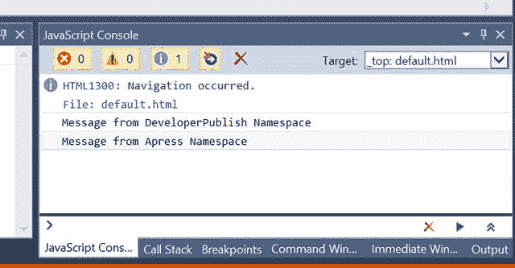
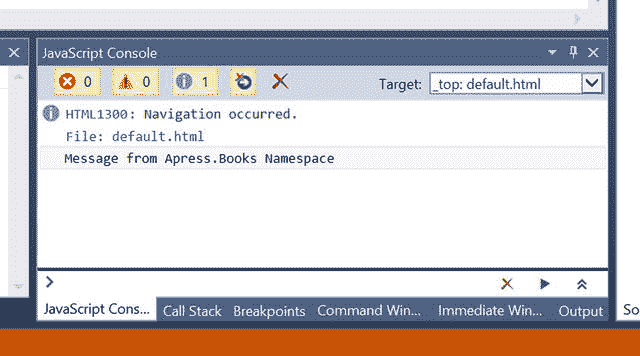
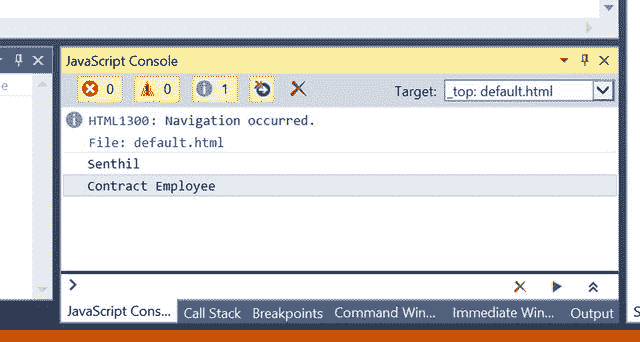
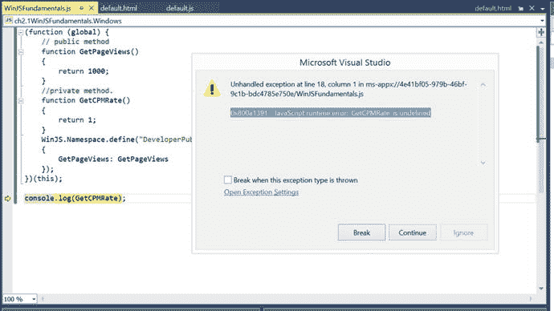
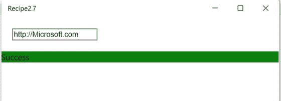

# 第 2 章:WinJS 基础知识

使用平台的库构建应用时，了解库提供的功能非常重要。在这一章中，你将看到 WinJS 为使用 JavaScript、HTML 和 CSS 构建 Windows 运行时应用提供的各种特性。这些特性包括名称空间、模块、承诺和查询选择器。几乎所有使用 WinJS 构建的应用都使用这些特性。通过利用名称空间和模块等特性，您可以使您的应用更容易维护，而不是在全局名称空间下添加所有内容。

## 2.1 JavaScript 中的名称空间

### 问题

使用 WinJS 库进行开发时，您需要对常见功能进行分组，并防止 JavaScript 代码中的命名冲突。

### 解决办法

名称空间允许开发人员更好地分组或组织公共功能。其他编程语言——c#、VB.NET、Java 等等——都提供了这个特性。许多 JavaScript 框架不支持名称空间，但是 WinJS 提供了一个特性，开发人员可以在他们的项目中使用名称空间。名称空间可以派上用场，尤其是当您的应用利用由不同开发人员编写的多个库时。

开发人员可以使用`WinJS.Namespace.define`方法来声明名称空间。

### 它是如何工作的

WinJS 库允许开发人员通过使用`WinJS.Namespace.define`方法来声明名称空间。

`WinJS.Namespace.define`方法有两个参数。

*   `Name`:这是第一个参数，代表新名称空间的名称。
*   `Members`:这是第二个参数，完全可选。此参数表示需要添加到正在定义的命名空间的对象列表。

以下是使用 WinJS 在 Windows 应用商店通用应用中创建新命名空间的步骤。

Launch Visual Studio 2015 and select File ➤ New Project. In the New Project dialog, select JavaScript ➤ Windows ➤ Universal from the Installed Templates sidebar. Select Blank App (Universal Windows) from the template and name the project ch2.1WinJSFundamentals. Click the OK button. This created the necessary files within the Visual Studio solution.   Add a new JavaScript file in the ch2.1WinJSFundamentals project by right-clicking the project’s js folder and selecting the Add ➤ New Item option. Select the JavaScript file from the Add New Item dialog and name the file WinJSFundamentals.js. Add the following code to the file.  

`// Define the Namespace Developerpublish`

`WinJS.Namespace.define("DeveloperPublish");`

`// Utilities created in the DeveloperPublish Namespace`

`DeveloperPublish.Utilities = {`

`DisplayMessage: function () {`

`return "Message from DeveloperPublish Namespace";`

`}`

`};`

`// Define the Namespace Apress and create the Utilities under it.`

`WinJS.Namespace.define("Apress",`

`{`

`Utilities: {`

`DisplayMessage: function () {`

`return "Message from Apress Namespace";`

`}`

`}`

`});`

`console.log(DeveloperPublish.Utilities.DisplayMessage());`

`console.log(Apress.Utilities.DisplayMessage());`

在前面的代码片段中，`DeveloperPublish`名称空间演示了带有单个参数的`WinJS.Namespace.define`方法的用法。对象被添加到命名空间中，命名空间后跟一个句点和对象的名称。

Apress 命名空间是用两个参数创建的。第一个参数是名称空间的名称 Apress 而第二个参数是作为 Apress 名称空间一部分的对象。

Open the `default.html` page and add the reference to the `WinJSFundamentals.js` file by using the following code snippet: ``   Run the Windows app. You will notice that the string that is returned from `DisplayMessage` of the `Utilities` class is displayed in the console window, as shown in Figure [2-1](#Fig1).

图 2-1。

Display the string in the Visual Studio 2015 console window  

`WinJS.Namespace`是默认的名称空间，它提供如下功能

*   `promise`物体
*   定义名称空间、`log`和`xhr`的函数。

以下是属于 WinJS.Namespace 的对象和函数

*   这个对象提供了在 JavaScript 代码中实现异步编程的机制。
*   `validation`:可以设置该属性来显示验证的结果。
*   `define`:这个函数用指定的名字定义一个新的名称空间。
*   `defineWithParent`:该函数在指定的父命名空间下定义一个具有指定名称的命名空间。
*   `log`:该函数将输出写入 Visual Studio 2015 中的 JavaScript 控制台窗口。
*   `xhr`:这个函数将对 XMLHttpRequest 的调用包装在一个承诺中。

请注意，您不应该在定义名称空间之前引用它。当您试图在命名空间定义之前访问它时，会收到“命名空间未定义”错误。

WinJS 库中包含了命名空间功能，以便更好地处理与作用域相关的问题。WinJS 中名称空间实现的源代码可以在项目的`WinJS/js`文件夹下的`base.js`文件中找到。

## 2.2 向现有名称空间添加名称空间

### 问题

您需要向现有的名称空间添加一个名称空间，并定义您的功能。

### 解决办法

使用`WinJS.Namespace.defineWithParent`方法将名称空间添加到 WinJS 中的现有名称空间。

### 它是如何工作的

`WinJS.Namespace.defineWithParent`方法允许开发人员向现有名称空间添加新的名称空间。这类似于`define`方法；它允许您在现有名称空间下创建一个新的名称空间。

`WinJS.Namespace.defineWithParent`方法接受三个参数:

*   父名称空间:第一个参数是父名称空间的名称。
*   Name:这是要添加到父名称空间的名称空间的名称。
*   Members:要添加到新命名空间的对象列表。这是一个可选参数。

让我们使用配方 2.1 中创建的配方。打开项目中的`WinJSFundamentals.js`文件，并用下面的代码片段替换它。

`WinJS.Namespace.define("Apress");`

`WinJS.Namespace.defineWithParent(Apress, "Books" ,`

`{`

`Utilities :`

`{`

`DisplayMessage: function () {`

`return "Message from Apress.Books Namespace";`

`}`

`}`

`}`

`);`

`console.log(Apress.Books.Utilities.DisplayMessage());`

运行 Windows Store 项目，您应该会看到字符串“Message from Apress。Books Namespace "显示在 Visual Studio JavaScript 控制台窗口中，如图 [2-2](#Fig2) 所示。

图 2-2。

Display the string in the JavaScript console window in Visual Studio 2015

请注意，名称空间应该只包含类、函数、常数和其他名称空间。

## 2.3 在 WinJS 中创建类

### 问题

您需要在 Windows 运行时应用中用 JavaScript 代码创建一个类。

### 解决办法

使用`WinJS.Class.define`方法在 WinJS 中创建一个类。

### 它是如何工作的

C#和 VB.NET 是面向对象的语言。它们对语言中面向对象的概念有很好的实现和支持；其中一个功能是创建类。另一方面，JavaScript 没有创建类的内置支持。JavaScript 中的一切都被视为对象。

WinJS 允许开发人员创建类并在他们的应用中使用它们。

您可以使用`WinJS.Class.define`方法在 WinJS 中创建新类。

`WinJS.Class.define`方法有三个参数。

*   构造函数:第一个参数让开发人员初始化一个新对象。
*   实例成员:第二个参数是实例成员的集合，包括属性和方法。
*   静态成员:第三个参数包括静态属性和静态方法。

打开项目中的`WinJSFundamentals.js`文件，并用下面的代码片段替换它。

`// Create a class called Author`

`var Author = WinJS.Class.define(`

`function (name, title) {`

`this.name = name;`

`this.title = title;`

`},`

`{`

`_Name: undefined,`

`_title: undefined,`

`name : {`

`set :function(value)`

`{`

`this._Name = value;`

`},`

`get :function()`

`{`

`return this._Name;`

`}`

`},`

`title : {`

`set :function(value)`

`{`

`this._title = value;`

`},`

`get :function()`

`{`

`return this._title;`

`}`

`}`

`});`

`// instantiate the author class by invoking the constructor with 2 parameters`

`var author1 = new Author("Senthil", "WinJS recipes");`

`// display the name and the title  in the console window.`

`console.log(author1.name);`

`console.log(author1.title);`

在前面的代码片段中，`Author`类是使用`WinJS.Class.define`方法创建的。该方法的第一个参数是构造函数，它接受两个参数并初始化名称和标题。

`Author`类有两个属性。

*   标题与其`backing field _title`
*   名称与其`backing field _name`

这两个属性都包含一个 getter 方法和一个 setter 方法。例如，看看下面的属性。

`title : {`

`set :function(value)`

`{`

`this._title = value;`

`},`

`get :function()`

`{`

`return this._title;`

`}`

`}`

`title`属性有一个`set`方法，它允许开发人员为该属性设置一个值。类似地，您可以使用带有`get`方法的`title`属性来检索`_title`的值。从开发人员的角度来看，调用`<PropertyName>`对象足以获取或设置值。

运行 Windows 项目。您应该看到实例化对象时使用的名称和标题，如图 [2-3](#Fig3) 所示。

图 2-3。

Displaying the name and title in the JavaScript console window in Visual Studio 2015

温家。类命名空间为定义类提供了以下帮助函数。

*   `define`:这个函数使用指定的构造函数和实例成员定义一个类。
*   `derive`:这个函数使用原型继承为指定的类创建一个子类。
*   `mix`:这个函数使用指定的构造函数定义一个类，并组合所有 mixin 对象指定的实例成员集合。

## 2.4 在 WinJS 中派生类

### 问题

您需要在 WinJS 应用中应用继承概念。

### 解决办法

在 WinJS 中使用`WinJS.Class.derive`方法从一个类派生另一个类。

### 它是如何工作的

WinJS 库提供了`WinJS.Class.derive`方法，允许开发人员应用继承来从一个类派生另一个类。`WinJS.Class.derive`方法采用以下参数。

*   基类:当前类需要继承的类。
*   构造函数:这个参数指的是可以用来初始化类成员的`constructor`函数。
*   实例成员:该参数定义实例成员，包括属性和方法。
*   静态成员:该参数定义静态属性和静态方法。

打开`WinJSFundamentals.js`文件，用下面的代码片段替换代码。

`// Create a class called Employee`

`var Employee = WinJS.Class.define(`

`function () {`

`this.name = name;`

`this.type = "Employee";`

`},`

`{`

`_Name: undefined,`

`_type: undefined,`

`name : {`

`set :function(value)`

`{`

`this._Name = value;`

`},`

`get :function()`

`{`

`return this._Name;`

`}`

`},`

`type: {`

`set :function(value)`

`{`

`this._type = value;`

`},`

`get :function()`

`{`

`return this._type;`

`}`

`}`

`});`

`var ContractEmployee = WinJS.Class.derive(Employee,`

`function (name) {`

`this.name = name;`

`this.type = "Contract Employee";`

`});`

`var ContractEmployee1 = new ContractEmployee("Senthil");`

`// display the name and the title  in the console window.`

`console.log(ContractEmployee1.name);`

`console.log(ContractEmployee1.type);`

这段代码片段创建了一个名为`Employee`的类。后来，创建了另一个名为`ContractEmployee`的类；它来自于`Employee`类。创建了一个合同雇员实例，其姓名和雇佣类型显示在控制台窗口中。

从 Visual Studio 运行 Windows 应用商店项目。这将在 JavaScript 控制台窗口中显示名称和类型，如图 [2-4](#Fig4) 所示。

图 2-4。

Displaying the name and type of employment in the JavaScript console window in Visual Studio 2015

`WinJS.Class.derive`函数的行为类似于`WinJS.Class.define`函数，除了它使用基类的原型使用`Object.create`函数来构造派生类。`Object.create`方法通过原型化父对象从一种类型派生出另一种类型；它还添加属于子对象的属性。

## 2.5 在 WinJS 中创建 Mixins

### 问题

您需要组合来自多个 JavaScript 对象的方法和属性，而不使用`WinJS.Class.derive`方法。

### 解决办法

使用`WinJS.Class.mix`方法组合 WinJS 中多个 JavaScript 对象的方法和属性。

### 它是如何工作的

`WinJS.Class.derive`方法使用原型继承，各有利弊。它需要额外的处理时间，并且会影响性能。这可以通过使用`WinJS.Class.mix`方法来克服。

`WinJS.Class.mix`方法有两个参数。

*   构造函数:第一个参数，用于初始化类成员。
*   Mixin:第二个参数是接受 mixin 方法的数组

打开项目中的`WinJSFundamentals.js`文件，并用下面的代码片段替换它。

`// Create a class called Employee`

`var Employee = WinJS.Class.define(`

`function () {`

`this.name = name;`

`this.type = "Employee";`

`},`

`{`

`_Name: undefined,`

`_type: undefined,`

`name : {`

`set :function(value)`

`{`

`this._Name = value;`

`},`

`get :function()`

`{`

`return this._Name;`

`}`

`},`

`type: {`

`set :function(value)`

`{`

`this._type = value;`

`},`

`get :function()`

`{`

`return this._type;`

`}`

`}`

`});`

`var ContractEmployee = WinJS.Class.mix(`

`function (name) {`

`this.name = name;`

`this.type = "Contract Employee";`

`},Employee);`

`var ContractEmployee1 = new ContractEmployee("Senthil");`

`// display the name and the title  in the console window.`

`console.log(ContractEmployee1.name);`

`console.log(ContractEmployee1.type);`

在这个代码示例中，创建了一个`Employee`类，然后创建了另一个名为`ContractEmployee`的类；它继承自`Employee`类。请注意，您使用了`mix`方法，而不是`derive`方法。

嗯，代码可能看起来与使用`derive`方法的代码相似，但是 mixin 增加了更多的特性。其中一个特性是支持多重继承。由于`mixin`方法中的第二个参数是一个 mixins 数组，您可以让`ContractEmployee`类实现多个类的特性。

当您执行这个程序时，您会看到员工的姓名和类型，如图 [2-5](#Fig5) 所示。

图 2-5。

Displaying the name and employee type in the JavaScript console window in Visual Studio 2015

Mixins 可以用来给你的类型增加功能。Mixins 通常包含可以添加到 WinJS 中许多类型的实现函数。

在 WinJS 中，您可以使用以下 mixins 之一来管理事件和绑定。

*   这个 mixin 可以用来给你定义的任何类型添加事件管理功能。它包括像`WinJS.Utilities.eventMixin.addEventListener`、`WinJS.Utilities.eventMixin.removeEventListener`和`WinJS.Utilities.eventMixin.dispatchEvent`这样的函数来引发和处理您定义的自定义事件。
*   `WinJS.Binding.dynamicObservableMixin`:该函数用于添加绑定管理功能，开发者可以将自定义对象绑定到一个控件上，该控件能够在属性值发生变化时通知监听器。

## 2.6 WinJS 中的封装

### 问题

您希望构建一个库，并且希望只向外部访问公开其中的一些方法。您需要支持 WinJS 应用中的封装。

### 解决办法

使用函数和名称空间的功能来实现这一点。变量可以有全局作用域或函数作用域。这个特性可以用来在 JavaScript 中引入封装功能。

### 它是如何工作的

当您创建自己的 JavaScript 库时，您可能希望同时创建公共和私有方法。公共方法可以作为 API 公开，并且可以由第三方开发人员使用。

这里的问题是 JavaScript 不支持访问修饰符。JavaScript 中的变量有以下范围。

*   全局范围:这在整个应用中都是可用的。
*   函数作用域:这仅在函数内部可用。

WinJS 中使用了函数作用域特性来隐藏方法，使其具有一定的私有性。通过手动将方法添加到命名空间，可以将方法公开为公共的。

设想一个场景，您正在编写一个库来跟踪页面浏览量并显示每百万成本(CPM)印象。您希望向用户公开`GetPageViews`方法，而不是`GetCPMRate`方法。这是你怎么做的…

打开共享项目中的`WinJSFundamentals.js`文件，并用下面的代码片段替换它。

`(function (global) {`

`// public method`

`function GetPageViews()`

`{`

`return 1000;`

`}`

`//private method.`

`function GetCPMRate()`

`{`

`return 1;`

`}`

`WinJS.Namespace.define("DeveloperPublish",`

`{`

`GetPageViews: GetPageViews`

`});`

`})(this);`

`console.log(DeveloperPublish.GetPageViews());`

自执行匿名函数有两种方法:`GetPageViews`和`GetCPMRate`。`DeveloperPublish`名称空间用于公开或导出`GetPageViews`函数，并为其提供公共访问。`GetCPMRate`则相反，是一种私有的方法。您可以在全局范围方法中调用`GetCPMRate`方法，但不能使用`DeveloperPublish`名称空间。例如，下面的代码片段演示了使用`DeveloperPublish`名称空间公开`GetPageViews`和`GetTotalRate`函数的场景；`GetCPMRate`仅在`GetTotalRate`内使用。

`(function (global) {`

`// public method`

`function GetPageViews() {`

`return 1000;`

`}`

`//private method.`

`function GetCPMRate() {`

`return 2;`

`}`

`function GetTotalRate() {`

`return GetPageViews() * GetCPMRate();`

`}`

`WinJS.Namespace.define("DeveloperPublish",`

`{`

`GetPageViews: GetPageViews,`

`GetTotalRate: GetTotalRate`

`});`

`})(this);`

`console.log(DeveloperPublish.GetPageViews());`

`console.log(DeveloperPublish.GetTotalRate());`

运行 Windows 项目。在图 [2-6](#Fig6) 中，您会看到`GetPageViews`方法在 Visual Studio JavaScript 控制台窗口中显示 1000。

图 2-6。

Display the string in the JavaScript console window in Visual Studio 2015

当你试图访问自执行匿名函数之外的`GetCPMRate`方法时，你会得到下面的错误(也见图 [2-7](#Fig7) )。

图 2-7。

Error when trying to access private methods

`0x800a1391: JavaScript runtime error: 'GetCPMRate' is undefined.`

这是一个有用的特性，尤其是当您正在构建一个库，并且希望限制对 WinJS 中某些方法的访问时。

## 2.7 在 WinJS 中使用 Promise

### 问题

您需要异步执行代码，以便 UI 响应更快。

### 解决办法

您可以在通用 Windows 应用中使用异步编程，这样某些方法的处理就可以异步完成。通过这种方式，你的应用的 UI 线程是免费的，并且可以响应用户的输入。

### 它是如何工作的

WinJS 和通用 Windows 应用中的异步 API 被表示为承诺。WinJS 中 promise 的一个常见实现是`xhr`函数，它将 XMLHttpRequest 包装在 promise 中。当您提供一个 URL 和响应类型时，`xhr`函数返回承诺，通过返回数据来实现，或者如果失败则返回一个错误。

在这个菜谱中，您将构建一个应用，它只是将 URL 作为输入，并尝试连接到它。结果是基于连接的成功或失败。

在 Visual Studio 2015 中，启动在之前的配方中构建的现有通用 Windows 应用。打开`default.html`页面，在 body 部分下添加以下`div`元素。这接受了`inputurl`文本框中的 URL，状态显示在输出`div`标签中。

`
`

`<input id="inputurl"/>`

`
`

`
`

`
`

您需要将 change 事件处理程序添加到 input 元素中，当用户输入文本并按下 Enter 键时，将会触发该事件处理程序。您可以在`default.js`文件的`app.onactivated`事件处理程序的`WinJS.Utilities.ready`函数中添加这个，如下所示。

`WinJS.Utilities.ready(function () {`

`var input = document.getElementById("inputurl");`

`input.addEventListener("change", changeEvent);`

`}, false);`

下一步是添加`changeEvent`函数，需要通过传递用户输入的 URL 来调用`xhr`函数；这相应地更新了结果。`xhr`函数的返回类型是 promise，它允许开发人员使用 promise 的`then`函数异步更新 UI。

`then`函数最多有三个参数，包括

*   如果承诺无误地实现，则执行的`completed`功能
*   处理错误的`error`函数
*   `progress`功能显示承诺的进度

让我们在`app.onactivated`事件之后将`changeEvent`添加到`default.js`文件中，如下所示。

`function changeEvent(e) {`

`var resultDiv = document.getElementById("output");`

`WinJS.xhr({ url: e.target.value }).then(function completed(result) {`

`if (result.status === 200) {`

`resultDiv.style.backgroundColor = "Green";`

`resultDiv.innerText = "Success";`

`}`

`},`

`function error(e) {`

`resultDiv.style.backgroundColor = "red";`

`resultDiv.innerText = e.statusText;`

`});`

`}`

该代码包括承诺的`completed`和`error`功能。它根据结果显示文本成功或错误，并改变输出`div`元素的颜色。

在本地机器上构建并运行应用，输入 URL，然后按回车键。如果 URL 有效，输出`div`标签变成绿色并显示成功消息。如果有错误，错误信息以红色背景显示，如图 [2-8](#Fig8) 所示。

图 2-8。

Using the xhr function to demonstrate the promise

您可以通过使用 promise 对象的`cancel`方法来停止当前正在执行的异步操作。

`xhrPromise.cancel();`

注意，您还可以通过调用前面的`then`函数返回的承诺上的`then`来链接承诺操作。