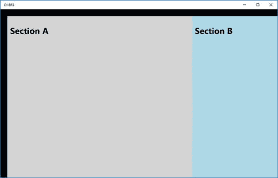
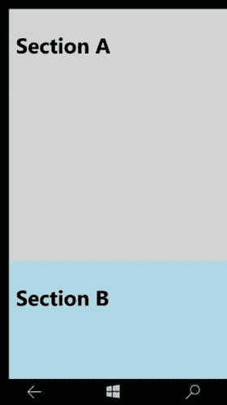
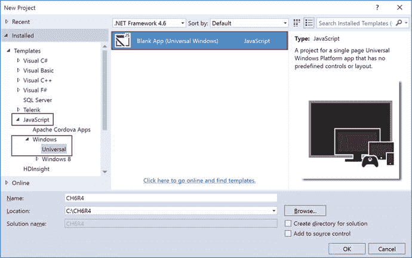
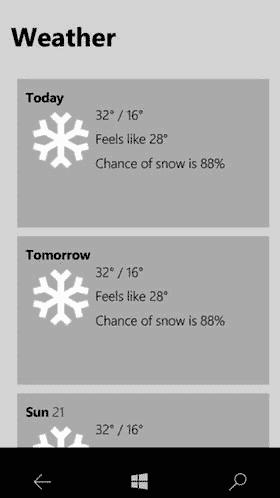

# 第 6 章:为不同的屏幕调整用户界面

借助通用 Windows 平台(UWP)，您可以在 Windows 系列的任何设备上运行您的应用。设备系列包括手机、平板电脑、笔记本电脑、Xbox 等等。设备系列中有不同的屏幕尺寸。该平台在幕后施展魔法，确保你的应用程序的用户界面在所有设备上都能正常工作。由于平台在幕后为你处理事情，你不需要对你的应用程序做任何定制来支持不同的屏幕尺寸。但是在某些情况下，您可能希望为特定的屏幕尺寸提供特定的 UI。例如，当你的应用程序在手机上运行时，你可能想要一个单列布局；而当同一个应用程序在平板电脑或个人电脑上运行时，你想要两栏布局。本章着眼于如何让你的用户界面适应不同的屏幕尺寸。

如果 UWP 应用可以在任何屏幕尺寸的任何 Windows 10 设备系列上运行，那么作为应用开发者，你为什么要担心为特定屏幕尺寸量身定制的用户界面呢？

如前所述，该平台负责确保您的应用程序的用户界面在所有屏幕尺寸下都能正常工作，但您可能仍然需要根据应用程序运行的屏幕进行定制。以下几点值得注意。它们提供了关于您为什么想要定制的见解。

*   有效利用可用空间，减少导航。当一个应用程序的用户界面被设计成在小屏幕上看起来不错时，这个应用程序也可以在个人电脑上使用。但是可能会有一些浪费的空间。更好的设计是当屏幕尺寸超过一定尺寸时显示更多的内容。在更大的屏幕上显示更多的内容可以减少用户导航的次数。
*   设备能力。不同的设备有不同的功能。通过为特定设备定制您的应用，您可以更好地利用该特定设备上的可用功能，然后您可以启用/禁用与此相关的功能。
*   输入优化。UWP 中的控件库适用于所有输入类型，包括触摸、笔、键盘和鼠标。但是您可以针对特定设备优化输入。例如，基于手机的应用程序通常在屏幕底部提供导航；而 PC 用户期望导航在屏幕的顶部可用。

## 6.1 为不同屏幕设计断点

### 问题

由于您需要支持 Windows 10 设备系列下的各种屏幕尺寸，您可能想知道您的应用程序中的具体目标宽度。

### 解决办法

断点是 CSS(级联样式表)中使用的术语，用来表示屏幕的大小或宽度，您可以根据它来编写样式规则。Windows 10 设备系列中有大量设备目标和屏幕尺寸可用。但是您不必针对这些设备目标或屏幕尺寸中的每一个来优化您的 UI。相反，你应该设计关键的屏幕宽度。这些关键屏幕宽度也称为断点。让我们看看您应该关注的断点。

*   小:320epx。这些设备目标/屏幕的有效像素宽度为 320。典型的屏幕尺寸是 4 到 6 英寸。通常，这些设备是电话。
*   中等:720epx。这些设备目标/屏幕的有效像素宽度为 720。典型的屏幕尺寸是 6 到 12 英寸。通常，这些设备是大屏幕的平板电脑和手机。
*   大:1024epx。这些设备目标/屏幕的有效像素宽度为 1024 或更高。典型的屏幕尺寸为 13 英寸及以上。通常，这些设备是 PC、笔记本电脑、Surface Hubs 等等。

## 6.2 自适应 UI 技术:重新定位

### 问题

您希望您的应用程序支持所有设备目标/屏幕尺寸。你想让你的用户界面自适应，你想根据你的应用程序运行的屏幕大小重新定位你的屏幕的某些部分。

### 解决办法

使你的应用程序的用户界面适应不同屏幕尺寸的技术之一涉及 CSS 媒体查询，这超出了本书的范围，因此，你不会深入研究它。但是你可以在 W3C 学校在线 [`http://www.w3schools.com/cssref/css3_pr_mediaquery.asp`](http://www.w3schools.com/cssref/css3_pr_mediaquery.asp) 阅读和了解更多关于媒体查询的信息。您将编写一个针对屏幕大小的媒体查询规则。该规则将定义样式，以根据应用程序运行的屏幕重新定位 UI 元素。

### 它是如何工作的

Open Visual Studio 2015\. Select File ➤ New Project ➤ JavaScript ➤ Windows ➤ Universal ➤ Blank App (Universal Windows) template. This creates a universal Windows app template (see Figure [6-1](#Fig1)).

图 6-1。

New Project dialog   Open the default.html, which is found at the root of the project. After the <body> tag, add the following content: `
`         `
`             `<h1>A</h1>`         `
`         `
`             `<h1>B</h1>`         `
` `
` You have created a bunch of divs. The outer div (appGrid) acts as a container. Next, you have two sections that are displayed as part of the app. On a small screen, you want to show sectionA and sectionB one on top of the other. When running on medium and large screens, place sectionA and sectionB next to each other.   Next, you create the necessary styles for the app. Open default.css, which is found in the css folder. Replace the contents of default.css with the following style rules. `.appGrid {`     `display: -ms-grid;`     `-ms-grid-columns: 2fr 1fr;`     `grid-columns: 2fr 1fr;`     `-ms-grid-rows: 1fr;`     `grid-rows: 1fr;`     `width: 100%;`     `height: 100%;`     `margin:24px;` `}` `.sectionA {`     `-ms-grid-row: 1;`     `-ms-grid-column: 1;`     `background-color: lightgray;`     `width: 100%;`     `height: 100%;`     `padding: 10px;`     `color: black;` `}` `.sectionB {`     `-ms-grid-row: 1;`     `-ms-grid-column: 2;`     `background-color: lightblue;`     `width: 100%;`     `height: 100%;`     `padding: 10px;`     `color: black;` `}` Let’s go through the code once. You have just defined three rules. One of the rules is for the outer grid. You are using a grid-based display with two columns and one row. Section A is placed in column 1 and Section B is placed in column 2\. Since there is no media query applied yet, these rules are applied all the time.   Now you define a media query for handling the UI when the max width of the screen is 320\. When you are running the app on a small screen, you want the layout to be narrow—only one column and two rows. Section A is placed in row 1 and Section B is placed in row 2\. You place the CSS rule in the same CSS file (default.css). Here is the code snippet for the media query: `@media (max-width:320px){`     `.appGrid {`         `display: -ms-grid;`         `-ms-grid-columns: 1fr;`         `grid-columns: 1fr;`         `-ms-grid-rows: 2fr 1fr;`         `grid-rows: 2fr 1fr;`         `width: 100%;`         `height: 100%;`         `margin:12px;`     `}`     `.sectionA {`         `-ms-grid-row: 1;`         `-ms-grid-column: 1;`         `background-color: lightgray;`         `width: 100%;`         `height: 100%;`     `}`     `.sectionB {`         `-ms-grid-row: 2;`         `-ms-grid-column: 1;`         `background-color: lightblue;`         `width: 100%;`         `height: 100%;`     `}` `}` This shows that when the screen size is 320px and lower, a new style rule is picked up. As part of the style rule, the app grid is now one column and two rows. This repositioned the placement of Section A and Section B.   Next, press F5 and run the app. You can run the app in a Windows 10 Mobile emulator or you can run it on a local machine. Figures [6-2](#Fig2) and [6-3](#Fig3) show the output from a phone and a PC.

图 6-3。

Output on a Windows PC

图 6-2。

Output on Windows Mobile  

## 6.3 自适应 UI 技术:流畅的布局

### 问题

您已经创建了一个布局，希望在列表视图中显示项目的数量。但是您希望列表视图适应窄屏幕和中或大屏幕。您希望列表视图项目根据屏幕大小做出响应。

### 解决办法

UWP 中的 ListView 控件用于需要显示大量项目的情况。顾名思义，列表视图在屏幕上呈现一个列表，每个项目都绑定到一个数据项。列表视图的每一项都可以通过提供模板来定制。ListView 还有一个概念叫布局。布局定义了项目应该如何在屏幕上展开。它支持两种现成的布局:ListLayout 和 GridLayout。ListLayout 用于单列/多行渲染。GridLayout 呈现基于网格的布局(即行和列占据屏幕上的可用空间)。

### 它是如何工作的

Open Visual Studio 2015\. Select File ➤ New Project ➤ JavaScript ➤ Windows Universal ➤ Blank App (Universal Windows) template. This creates a universal Windows app template (see Figure [6-4](#Fig4)).

图 6-4。

New Project dialog   Create a new file called weatherData.js in the js folder. Add an immediately invoked function expression. Here is the code snippet: `(function (undefined) {`     `'use strict'`     `//rest of the code here` `})();`   Next, create an array of weather data after the ‘use strict’ statement inside the function body, as shown earlier. Let’s build fictitious weather data for the purpose of this recipe demo. Here is the code snippet: `var weatherData = [`         `{`             `date: formatDateString(new Date().getDate()),`             `imgSrc: "img/tile-snow.png",`             `hi: "32°",`             `low: "16°",`             `temp: "24°",`             `feelsLike: "28°",`             `chanceOfSnow: "88%"`         `}`          `//add more items here`         `];`   Next, create a function to format the date. You want to display the date in a “Sun 10” type pattern. You need to customize the date string for display. Here is the code snippet for the formatDateString function: `function formatDateString(date) {`         `var daysOfWeek = ["Sun","Mon","Tues","Wed","Thurs","Fri","Sat"];`         `var nearDays = ["Yesterday","Today","Tomorrow"];`         `var dayDelta = date - new Date().getDate() + 1;`         `var dateString = "";`         `if (dayDelta < 3) {`             `dateString = nearDays[dayDelta];`         `}`         `else {`             `dateString = daysOfWeek[date % 7] +`             `" " + date + "";`         `}`         `return dateString;`     `};`   You need to expose this weatherData array so that you can consume it in default.html and bind it to the list view. Create a namespace and expose the weatherData, as shown here: `var weatherDataList = new WinJS.Binding.List(weatherData);` `WinJS.Namespace.define("FluidApp.Data", {`         `weatherData : weatherDataList` `})` You have created a namespace called FluidApp.Data and exposed weatherData as a public property, which can be bound to any win control.   You need to add a reference to weatherData.js. Add the following script tag in head section of default.html. Add this before the default.js script file reference: ``   Next, you need to create the UI. In default.html, remove the default contents, which are found inside the <body> tag. Add the following template, which is used for displaying each item of the list view:     `
`     `
`         `
`         `
`         `
`             ``         `
`         `
`             ``             `/`             ``         `
`         `
`             `Feels like `             ``         `
`         `
`             `Chance of snow is `             ``         `
`     `
` `
`   Next, let’s add the ListView control. Paste the following code snippet after the template that you created in the previous step: `

` You have created a list view and provided weatherData as the item data source. You have also provided the item template. You have set the layout of the list view to GridLayout by default. You will change this layout property of the list view based on the screen resize.   Open default.js, which is found in the js folder. Modify the app.onactivated function with the following code snippet: `app.onactivated = function (args) {`                 `if (args.detail.kind === activation.ActivationKind.launch) {`                         `if (args.detail.previousExecutionState !== activation.ApplicationExecutionState.terminated) {`                         `} else {`                         `}`                         `args.setPromise(WinJS.UI.processAll().then(function ready() {`                             `var listView = document.querySelector("#weatherListView");`                             `var listViewLayout = new WinJS.UI.GridLayout();`                             `if (document.body.clientWidth <= 320) {`                                 `listViewLayout = new WinJS.UI.ListLayout();`                             `}`                    `listView.layout = listViewLayout;`                 `window.addEventListener("resize", resizeListView, false)`                         `}));`                 `}`         `};` Let’s go over the code here. Once the UI processing is done, you grab the list view first. You then check the width of the screen that you are currently running on. If the width is less than or equal to 320 (i.e., you are on a small screen), you just change the layout of the list view accordingly. If you are on a small screen, you use ListLayout, but when not on a small screen, you set it to GridLayout. You also register an event listener to resize the window. Next, let’s look at what the resize event handler does.   After the app.onactivated function, create a new function, resizeListView, and paste the following code snippet: `function resizeListView() {`     `var listview = document.querySelector("#weatherListView").winControl;`     `if (document.body.clientWidth <= 320) {`         `if (!(listview.layout instanceof WinJS.UI.ListLayout)) {`             `listview.layout = new WinJS.UI.ListLayout();`         `}`     `}`     `else {`         `if (listview.layout instanceof WinJS.UI.ListLayout) {`             `listview.layout = new WinJS.UI.GridLayout();`         `}`     `}` `}`   Now run the app on a mobile device or on a PC to see the output. Press F5 to run the app. The screenshot shown in Figure [6-5](#Fig5) is on Windows 10 Mobile and the one shown in Figure [6-6](#Fig6) is on a Windows 10 PC.

图 6-6。

Output on a Windows PC

图 6-5。

Output on a Windows 10 Mobile  

你刚刚实现的是为不同屏幕尺寸量身定制的 UI。您使用了 ListView 布局技术来显示网格或列表布局，这取决于屏幕的大小。