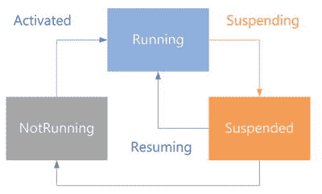
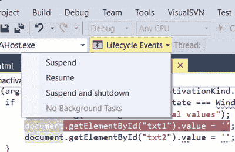
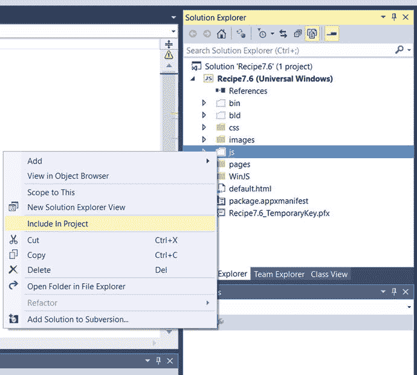
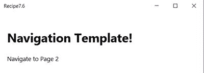

# 第 7 章:应用生命周期和导航

本章介绍通用的 Windows 应用事件和生命周期，包括启动 Windows 应用时引发的标准事件集以及如何处理这些事件。本章涵盖了开发者如何处理应用的暂停和终止。它还介绍了如何在这些事件期间保存和恢复数据，这有助于开发人员提供更好的用户体验。

本章还介绍了导航模型，并解释了如何构建一个可以包含多个虚拟 HTML 页面的单页面应用。

## 7.1 应用状态和事件

### 问题

当用户启动、关闭或恢复应用时，您需要识别和订阅应用中的各种事件。

### 解决办法

使用通用 Windows 应用项目中的`default.js`文件来订阅和处理应用生命周期中的各种事件。

### 它是如何工作的

使用通用 Windows 模板创建一个新的通用 Windows 项目，该模板可以在 Microsoft Visual Studio 2015 的“新建项目”对话框的 JavaScript ➤ Windows ➤通用节点下找到。这将在 Visual Studio 解决方案中创建一个项目，并在其中创建必要的文件。

从项目的`js`文件夹中，从 Visual Studio 解决方案资源管理器中打开 default.js 文件。您会看到两个默认订阅的重要事件。

*   `app.onactivated`
*   `app.oncheckpoint`

这些事件的代码如下所示。

`app.onactivated = function (args)`

`{`

`if (args.detail.kind === activation.ActivationKind.launch)`

`{`

`if (args.detail.previousExecutionState !== activation.ApplicationExecutionState.terminated) {`

`} else {`

`}`

`args.setPromise(WinJS.UI.processAll());`

`}`

`};`

`app.oncheckpoint = function (args)`

`{`

`};`

作为开发人员，您应该处理这些事件来描述当各种执行状态被触发时，应用应该如何保存和恢复数据。

在通用 Windows 应用中，有三种应用执行状态:

*   不运行
*   运转
*   暂停的

图 [7-1](#Fig1) 展示了通用 Windows 应用的生命周期。

图 7-1。

Application states and events

当一个通用的 Windows 应用启动时，WinJS 应用按下面显示的顺序触发以下事件。

WinJS.Application.loaded   WinJS.Application.activated   WinJS.Application.ready   WinJS.Application.unload  

当你的应用将要被挂起时。Application.checkpoint 事件被触发。

表 [7-1](#Tab1) 提供了应用事件列表。

表 7-1。

List of Application Events

<colgroup><col> <col></colgroup> 
| 事件名称 | 描述 |
| --- | --- |
| WinJS。应用.已加载 | 一旦 HTML 文档被完全加载，这个事件就由`DOMContentLoaded`事件触发。 |
| WinJS。应用.激活 | 当您的应用被激活时，该事件被触发。 |
| WinJS。应用.就绪 | 一旦加载和激活的事件执行完成，就会触发此事件。 |
| WinJS。应用.卸载 | 该事件在页面卸载前由`beforeunload`事件触发。 |
| WinJS。应用.检查点 | 当应用挂起时，会触发此事件。 |

开发人员应该处理激活事件和检查点事件，以添加他们的自定义逻辑来保存和恢复应用的状态，因此，在创建新项目时，您会看到默认情况下包括这两个事件。

其他事件可以使用`WinJS.Application.addEventListener`方法订阅。

打开`default.js`文件，在`onactivated`事件行上方添加以下代码片段。

`WinJS.Application.addEventListener("loaded", function(event) {`

`console.log("loaded event");`

`});`

`WinJS.Application.addEventListener("ready", function (event) {`

`console.log("ready event");`

`});`

另外，在`onactivated`事件中添加`console.log ("activated");`。

当您使用本地机器选项在 Windows 桌面上运行应用时，您会看到按指定顺序引发的事件，如图 [7-2](#Fig2) 所示。

图 7-2。

Application events in the JavaScript console window Note

在调用`WinJS.Application.start`事件之前，不会引发这些事件。这个方法在`default.js`文件中被调用。

Windows 应用必须首先安装在要激活的设备上。这通常可以通过从 Windows 应用商店安装应用或在开发期间使用 Visual Studio 来构建和部署通用应用来实现。

当用户从开始屏幕或应用列表中点击应用磁贴时，Windows 应用被激活。在此阶段，考虑到以下情况，应用处于未运行状态:

*   该应用首次推出。
*   应用没有运行，因为它崩溃了。
*   该应用被暂停，后来被系统终止。

该应用可以通过多种方式激活。`ActivationKind`枚举可用于找出应用是如何激活的，并确定应用激活的确切原因。

例如，当用户点击应用磁贴时，应用可以被激活。ActivationKind 值在这种情况下启动。同样，当从搜索契约中激活应用时，会搜索 ActivationKind 值。

下面的代码片段展示了如何在`onactivated`事件中处理这个问题。

`if (args.detail.kind === activation.ActivationKind.launch) {`

`console.log("launch activation kind");`

`}`

`else`

`if (args.detail.kind === activation.ActivationKind.Search) {`

`console.log("search activation kind");`

`}`

表 [7-2](#Tab2) 显示了一些最常见的激活方法及其枚举值。

表 7-2。

Activation Methods

<colgroup><col> <col> <col></colgroup> 
| 枚举成员 | 价值 | 描述 |
| --- | --- | --- |
| 发动 | Zero | 当用户启动应用或点击应用列表中的磁贴时，会收到该值。 |
| 搜索 | one | 当用户希望使用搜索契约通过应用进行搜索时，会收到该值。 |
| 共享目标 | Two | 当使用共享契约激活应用时，会收到该值。 |
| 文件 | three | 当设备中的另一个应用启动一个文件时，会收到该值，该文件的文件类型由该应用注册以进行处理。 |
| 草案 | four | 当另一个应用启动其方案名称被注册为由该应用处理的 URI 时，会收到该值。 |
| 文件 | five | 当用户选择该应用提供的文件时，会收到该值。 |
| 文件保存选择器 | six | 当用户尝试保存文件并选择应用作为位置时，会收到该值。 |
| 缓存文件更新程序 | seven | 当用户尝试保存应用提供内容管理的文件时，会收到此值。 |
| 联系人选取器 | eight | 该值在用户选择联系人时接收。 |
| 设备 | nine | 该应用处理自动播放。 |
| 语音命令 | Sixteen | 由于语音命令而激活应用时，会收到该值。 |
| 祝酒词 | One thousand and ten | 当用户点击 toast 通知或 toast 通知中的操作后激活应用时，会收到该值。 |

## 7.2 处理应用中未处理的异常

### 问题

你的应用崩溃，用户立即被带到 Windows 开始屏幕，没有任何信息。您需要处理这种情况，以提供更好的用户体验。

### 解决办法

您可以处理`default.js`文件中的`WinJS.Application.error`事件来记录错误并向用户显示一条消息。

### 它是如何工作的

当您的通用 Windows 应用中出现未处理的异常时，会调用`MSApp.terminateApp`函数，之后应用会关闭，不会向用户提供任何信息。

在这个方法中，让我们处理`WinJS.Application.error`事件，并在应用中出现未处理的异常时向用户显示一条消息。

使用通用 Windows 模板创建一个新的通用 Windows 项目，该模板可以在 Microsoft Visual Studio 2015 的“新建项目”对话框的 JavaScript ➤ Windows ➤通用节点下找到。这将在 Visual Studio 解决方案中创建一个项目，并在其中创建必要的文件。

从`js`文件夹中打开`default.js`文件，并用下面的代码片段替换它。

`(function () {`

`"use strict";`

`var app = WinJS.Application;`

`var activation = Windows.ApplicationModel.Activation;`

`WinJS.Application.addEventListener("error", function(eventArgs) {`

`var errorMessage = new Windows.UI.Popups.MessageDialog("There was an error in the app. Kindly contact the app publisher");`

`errorMessage.showAsync();`

`return true;`

`});`

`app.onactivated = function (args) {`

`args.setPromise(WinJS.UI.processAll());`

`throw new WinJS.ErrorFromName();`

`};`

`app.start();`

`})();`

这段代码从`onactivated`事件中抛出一个异常。`WinJS.Application.addEventListener`函数用于向错误事件添加一个监听器，以处理未处理的异常并向用户显示一条消息。

使用 Visual Studio 2015 中的本地计算机选项在 Windows 桌面上运行应用。您会看到图 [7-3](#Fig3) 中显示的信息。

图 7-3。

Displaying a message on an unhandled exception in the app Note

错误处理函数返回 true。值 true 用于指示错误已被处理，因此应用不应被终止。

## 7.3 处理应用的终止和恢复

### 问题

您需要确定应用以前的执行状态，以便在启动时恢复它。

### 解决办法

您可以使用激活事件的参数的`detail.previousExecutionState`属性来标识应用的状态。此属性确定应用是作为新应用启动的，还是之前被用户关闭的，或者是在应用暂停或终止后用户正在启动的。

### 它是如何工作的

previous ExecutionState 包含指示应用先前状态的值。您可以在激活的事件中使用该值来加载以前的状态值或基于该值的初始状态值。

使用通用 Windows 模板创建一个新的通用 Windows 项目，该模板位于 Microsoft Visual Studio 2015 中“新建项目”对话框的 JavaScript ➤ Windows ➤通用节点下。这将在 Visual Studio 解决方案中创建一个项目，并在其中创建必要的文件。

从`js`文件夹中打开`default.js`文件，用下面的代码片段替换`onactivated`事件。

`app.onactivated = function (args) {`

`if (args.detail.kind === activation.ActivationKind.launch) {`

`if (args.detail.previousExecutionState === activation.ApplicationExecutionState.notRunning) {`

`console.log("Previous state is not running");`

`}`

`if (args.detail.previousExecutionState === activation.ApplicationExecutionState.closedByUser) {`

`console.log("Previous state is closed by the user");`

`}`

`if (args.detail.previousExecutionState === activation.ApplicationExecutionState.terminated) {`

`console.log("Previous state is terminated");`

`}`

`args.setPromise(WinJS.UI.processAll());`

`}`

`};`

这段代码处理`onactivated`事件，其中`args.detail.previousExecutionState`用于查找应用的先前状态。`ApplicationExecutionState`枚举用于检查应用的状态。

当您运行应用时，您会在 JavaScript 控制台窗口中看到之前显示的状态，如图 [7-4](#Fig4) 所示。

图 7-4。

PreviousExecutionState displayed in the JavaScript console window

ApplicationExecutionState 枚举包含这些值，如表 [7-3](#Tab3) 所示。

表 7-3。

ApplicationExecutionState and Enumeration Values

<colgroup><col> <col></colgroup> 
| 状态 | 描述 |
| --- | --- |
| 不运行 | 当用户第一次启动应用，关闭应用，并在 10 秒内启动应用，或者当应用崩溃时，此应用的先前状态为“未运行”。 |
| 运转 | 如果应用已经在运行，并且用户使用契约或辅助磁贴启动应用，则应用的先前状态为“正在运行”。 |
| 暂停的 | 如果应用被暂停，并且稍后通过辅助磁贴或合约激活，则应用的先前状态为“暂停”。 |
| 终止的 | 如果应用先前被操作系统终止，则应用的先前状态为“已终止”。 |
| closedByUser | 如果应用被用户关闭并且在 10 秒内没有重新启动，则应用的先前状态为“closedByUser”。可以使用 Alt+ F4 快捷键或关闭手势来关闭应用。 |

## 7.4 使用 SessionState 存储状态

### 问题

您需要存储应用在整个生命周期中的状态，以便可以在应用激活时恢复其价值。

### 解决办法

使用`WinJS.Application.sessionState`将数据存储到应用的状态，可用于在应用暂停或终止后恢复应用。

### 它是如何工作的

`WinJS.Application.sessionState`对象用于存储应用信息，以便在应用暂停或终止后恢复应用的状态。

当应用暂停然后重新启动时，它不会丢失其状态。但是当应用被挂起，然后操作系统由于内存或其他原因终止应用时，应用的状态就会丢失。再次启动时，该应用将从头开始。

`WinJS.Application.sessionState`有助于克服这个问题。

让我们用一些代码来演示 SessionState 的用法。

Create a new Universal Windows project using the Universal Windows template, which can be found under the JavaScript ➤ Windows ➤ Universal node of the New Project dialog in Microsoft Visual Studio 2015\. This creates a single project in the Visual Studio Solution along with the necessary files in it to start.   Open the default.html page from Visual Studio Solution Explorer and replace it with the following code snippet. `<!DOCTYPE html>` `<html>` `<head>`     `<meta charset="utf-8" />`     `<title>Recipe7.4</title>`     `<!-- WinJS references -->`     `<link href="WinJS/css/ui-light.css" rel="stylesheet" />`     ``     ``     `<!-- Recipe7.4 references -->`     `<link href="/css/default.css" rel="stylesheet" />`     `` `</head>` `<body class="win-type-body" style="margin: 20px">` `
`     `<input id="txt1"/>`     `<input id="txt2"/>` `
` `</body>` `</html>` The preceding code snippet adds two input controls on the page so that the user can enter data.   Open the default.js file from the `js` folder and replace the `onactivated` and `oncheckpoint` events with the following code snippet. `app.onactivated = function (args) {`                 `if (args.detail.kind === activation.ActivationKind.launch) {`                     `if (args.detail.previousExecutionState === Windows.ApplicationModel.Activation.ApplicationExecutionState.notRunning) {`                         `console.log("setting the initial values");`                         `document.getElementById("txt1").value = '';`                         `document.getElementById("txt2").value = '';`                     `}`                     `if (args.detail.previousExecutionState === Windows.ApplicationModel.Activation.ApplicationExecutionState.closedByUser) {`                         `console.log("setting the initial values");`                         `document.getElementById("txt1").value = '';`                         `document.getElementById("txt2").value = '';`                     `}`                     `if (args.detail.previousExecutionState === Windows.ApplicationModel.Activation.ApplicationExecutionState.terminated) {`                         `console.log("setting the previous state values");`                         `document.getElementById("txt1").value = WinJS.Application.sessionState.txt1;`                         `document.getElementById("txt2").value = WinJS.Application.sessionState.txt2;`                     `}`                         `args.setPromise(WinJS.UI.processAll());`                 `}`         `};`         `app.oncheckpoint = function (args) {`             `WinJS.Application.sessionState.txt1 = document.getElementById("txt1").value;`             `WinJS.Application.sessionState.txt2 = document.getElementById("txt2").value;`         `};`  

代码片段处理`onactivated`和`oncheckpoint`事件。当应用暂停时，触发`oncheckpoint`事件。在此阶段，用户在两个文本框中输入的值保存在`sessionState`中。

如果应用的先前状态被终止，当应用被重新激活时，`sessionState`的值被恢复并更新到页面上的文本框中。如果先前的状态不是 Running 或 closedByUser，则恢复默认值。

当你运行已经挂起和终止的应用时，你会在页面中看到恢复的应用数据，如图 [7-5](#Fig5) 所示。

图 7-5。

Page displaying the data restored from the sessionState

您可以从 Visual Studio 2015 测试应用状态并模拟挂起和终止的事件。为此，您需要使用调试位置工具栏中的生命周期事件下拉列表，如图 [7-6](#Fig6) 所示。

图 7-6。

Tool to test the Application Lifecycle events from Visual Studio

可以通过单击暂停选项在应用运行时暂停应用，然后单击恢复选项恢复应用来模拟暂停和恢复生命周期事件。单击暂停选项时，会引发`onCheckpoint`事件。通过单击暂停和关闭按钮，可以模拟暂停和终止事件。此时，`onCheckpoint`事件被引发，您的应用终止。当您再次运行应用时，`previousExecutionState`包含终止值。

## 7.5 使用超链接在页面间导航

### 问题

你需要以一种最简单的方式在通用 Windows 应用的页面间导航。

### 解决办法

使用 HTML 在应用页面间导航的最简单方法之一是使用超链接。

### 它是如何工作的

假设你的 app 中有`default.html`和`newpage.html`文件，如果你想从`default.html`导航到`newpage.html`，在`default.html`中添加以下代码就可以做到这一点。

`
<a href="newpage.html">Navigate to page 2</a>
`

代码中的`href`是引用`newpage.html`的相对链接。这是一个 HTML 页面，是您的通用 Windows 应用的一部分，应该位于项目的根目录中。

或者，如果您希望指定作为应用一部分的本地文件的 URI，您可以使用名为 ms-appx 的新包内容 URI 方案。

前面的代码可以重写如下:

`
<a href="ms-appx:///newpage.html">Navigate to New page</a>
`

Note

尽管这个菜谱执行顶层导航，但您必须避免在 Windows 应用中这样做。这是网页的理想选择，但不适合手机或平板电脑应用。有时候，当应用加载下一页时，屏幕可能会变成空白。

微软建议使用单页导航，与顶级导航相比，它提供了更好的性能和更像应用的体验。

## 7.6 使用单页导航在页面之间导航

### 问题

您需要使用单页导航模式在通用 Windows 应用的页面之间导航。

### 解决办法

在通用 Windows 应用中实现单页导航的最简单的解决方案之一是使用必要的文件来执行从 Windows 8.1 导航应用模板到 Windows 10 项目的导航逻辑。

Note

在撰写本文时，Windows 10 没有提供类似于 Windows 8.1 中的导航模板。

### 它是如何工作的

Visual Studio 2015 没有为 UWP 应用提供导航模板。它只提供空白的应用模板。幸运的是，VS 2015 还包括 Windows 8.1 应用的模板和一个做大量导航逻辑的模板。让我们将 Windows 8.1 项目中的必要文件包含到通用 Windows 应用中。

启动 Visual Studio 2015，使用导航 App 模板新建一个 Windows 8.1 项目，如图 [7-7](#Fig7) 所示。

图 7-7。

Creating Windows 8.1 project using Navigation App

这个模板添加了`navigator.js`文件，并用导航逻辑更新了`default.js`。这些文件可以在项目的`js`文件夹下找到。

该模板还创建了一个名为`pages`的文件夹，并包含一个包含三个文件的`home`子文件夹:`home.css`、`home.html`和`home.js`。

`pages`文件夹包含所有页面控件，就像 Windows 应用中的页面。启动导航应用模板时，默认加载`pagecontrol home.html`文件。这是在`default.html`页面中设置的。

加载页面控件的所有细节都由`PageControlNavigator`处理，它是`navigator.js`文件的一部分。

下一步是创建一个新的通用 Windows 应用，并对其进行更新，以包含使用 Windows 8.1 导航模板创建的项目中的文件。

图 7-8。

Including the js folder and pages folder to UWP App in Visual Studio 2015 Create a new Universal Windows Project using the Universal Windows template, which can be found under the JavaScript ➤ Windows ➤ Universal node of the New Project dialog in Microsoft Visual Studio 2015\. This creates a single project in the Visual Studio Solution along with the necessary files in it to start.   Copy the complete `js` folder and the `pages` folder from the Windows 8.1 Navigation App that was created earlier and paste it into the root of the new Universal Project. Include them in the project from Visual Studio Solution Explorer, as shown in the Figure [7-8](#Fig8).  

现在，您已经准备好修改通用 Windows 应用来执行页面之间的导航。

从 Visual Studio 解决方案资源管理器中打开`default.html`页面，并用以下代码替换 body 部分。

`

`

另外，在`default.html`页面中包含对`navigator.js`的引用。

``

`default.html`页面就像一个外壳，用于从`pages`文件夹中加载不同的页面控件。默认情况下，它从`pages` / `home`文件夹中加载`home.html`页面。

PageControlNavigator 控件具有一个 id，其内容主机值充当从页面控件加载的内容的主机。

下一步是向项目添加一个新的页面控件，这样用户就可以从`home.html`文件导航到新的页面控件。

Microsoft Visual Studio 提供了页面控件项模板，允许开发人员轻松创建页面控件。

在 Visual Studio 解决方案资源管理器中右击`pages`文件夹，并从上下文菜单中选择“添加➤新项”。在“添加新项”对话框中，选择“页面控制”并提供名称“page2.html”。单击添加按钮。

这会将三个文件添加到项目中:

*   `page1.html`
*   `page1.css`
*   `page1.js`

接下来显示了`page1.html`的内容。

`<!DOCTYPE html>`

`<html>`

`<head>`

`<meta charset="utf-8" />`

`<title>page1</title>`

`<link href="page1.css" rel="stylesheet" />`

``

`</head>`

`<body>`

`
`

`<header class="page-header" aria-label="Header content" role="banner">`

`<button class="back-button" data-win-control="WinJS.UI.BackButton"></button>`

`<h1 class="titlearea win-type-ellipsis">`

`Welcome to page1`

`</h1>`

`</header>`

`<section class="page-section" aria-label="Main content" role="main">`

`
The content of page 2
`

`</section>`

`
`

`</body>`

`</html>`

`page1.js`文件的内容如下:

`// For an introduction to the Page Control template, see the following documentation:`

`//`[`http://go.microsoft.com/fwlink/?LinkId=232511`T3】](http://go.microsoft.com/fwlink/?LinkId=232511)

`(function () {`

`"use strict";`

`WinJS.UI.Pages.define("/pages/page1.html", {`

`// This function is called whenever a user navigates to this page. It`

`// populates the page elements with the app's data.`

`ready: function (element, options) {`

`},`

`unload: function () {`

`},`

`updateLayout: function (element) {`

`}`

`});`

`})();`

您将只修改`page1.html`的 body 标签，以表明导航到第 1 页是成功的。

现在，通用应用中有两个 HTML 页面。第一页是`home.html`，第二页是`page1.html`。如何在两个页面之间导航？

您可以使用`WinJS.Navigate.navigate()`方法在页面之间导航。

让我们通过添加下面的代码片段来修改`home.html`以包含一个导航到第 1 页的超链接。

`<a id="lnkPage2"> Navigate to Page 2</a>`

注意，超链接有`id`属性，但没有`href`属性。

打开`home.js`文件，用下面的代码片段替换它。

`(function () {`

`"use strict";`

`WinJS.UI.Pages.define("/pages/home/home.html", {`

`// This function is called whenever a user navigates to this page. It`

`// populates the page elements with the app's data.`

`ready: function (element, options) {`

`var page2link = document.getElementById('lnkPage2');`

`page2link.addEventListener('click', function(eventargs) {`

`eventargs.preventDefault();`

`WinJS.Navigation.navigate("/pages/page1.html");`

`});`

`}`

`});`

`})();`

该代码为页面的 ready 事件中的超链接设置 click 事件处理程序。click 事件处理程序首先调用`preventDefault`函数阻止正常的链接导航，然后调用`WinJS.Navigation.navigate`方法导航到`page1.html`。

当您使用本地机器选项在 Windows 桌面上运行应用时，您会看到显示有超链接的主页，如图 [7-9](#Fig9) 所示。

图 7-9。

home.html page with a hyperlink to navigate to page 2

当点击导航到第 2 页链接时，用户被带到第 2 页，如图 [7-10](#Fig10) 所示。当您查看`page2.html`时，请注意后退按钮，它会将您带回上一页。

图 7-10。

Page1.html with the Back button

表 [7-4](#Tab4) 显示了`WinJS.Navigation`类中可用的一些方法。

表 7-4。

WinJS.Navigation Class

<colgroup><col> <col></colgroup> 
| 方法名称 | 描述 |
| --- | --- |
| WinJS。Navigation.back() | 此方法将用户导航回历史记录中的上一页。 |
| WinJS。Navigation.forward() | 这种方法使开发人员能够在历史中向前导航。 |
| WinJS。Navigation.navigate() | 该方法使开发人员能够导航到指定的页面。 |