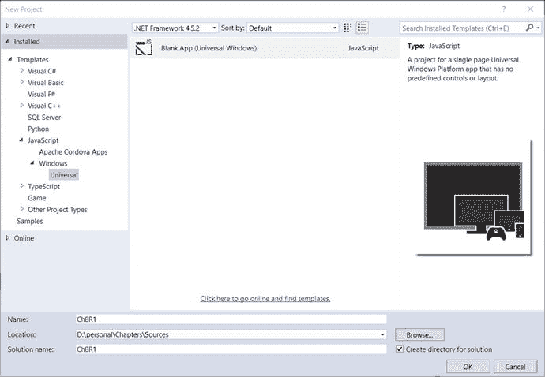
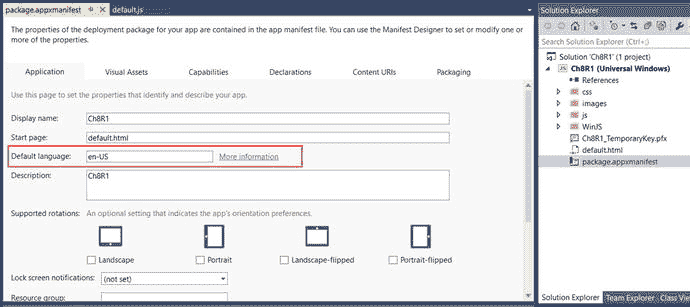
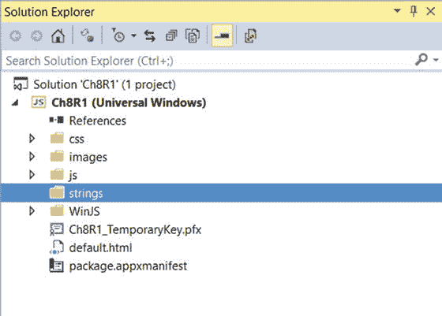
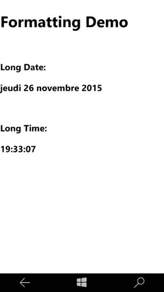
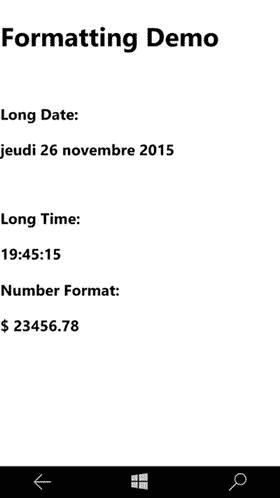
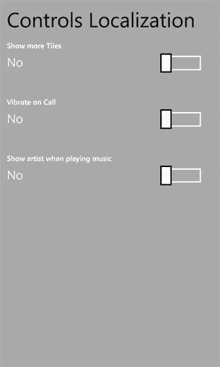

# 第八章:全球化和本地化

有机会在近 240 个 Windows 市场中推广您的 Windows 应用程序。目标受众在文化、地区和语言方面各不相同。您的应用程序的用户可能位于世界上的任何地方。他们可能说不同的语言，甚至是多种语言。作为应用程序开发人员，您有必要使您的应用程序适应多种语言、市场、文化和地区。全球化意味着让您的应用程序了解文化、语言和地区。本地化是将您的应用程序的某些方面本地化到它正在运行的文化的能力；例如，日期、数字或货币格式等等。在这一章中，你将看到如何全球化和本地化你的应用程序的方法。

## 8.1 使用资源字符串

### 问题

当你的 app 在非英语文化中使用，文本不适应新的文化和语言；相反，用户看到的是英文文本。

### 解决办法

为了全球化应用程序，有必要使用资源字符串来代替静态文本。例如，应用程序中的任何标签文本都不应该硬编码为静态文本。相反，应该为您需要支持的文化/语言创建资源文件。添加将文本翻译成相应语言的字符串。标签文本也使用资源字符串，而不是硬编码。

### 它是如何工作的

让我们看看资源字符串在应用程序中的用法，以及如何添加它们。

Open Visual Studio 2015\. Select File ➤ New Project ➤ JavaScript ➤ Windows ➤ Universal and select Blank App (Universal Windows) template. This will create a universal app with the necessary files that can run on machines powered by Windows 10\.

图 8-1。

Choosing the Blank App (Universal Windows) template in the New Project window   Open the `package.appxmanifest` file from the project in Visual Studio solution explorer. Go to the Application tab and check that the default language is set to en-US. When a new project is created, the language is set to en-US by default (see Figure [8-2](#Fig2)).

图 8-2。

Default language settings in the application manifest   Create a resource folder, as follows:

图 8-3。

Strings folder in the Windows project In the Solution Explorer, select the Universal Windows project and right-click on it. Select Add ➤ New Folder from the context menu.   Name the new folder strings. You will create different culture/language resource files inside this folder (see Figure [8-3](#Fig3)).     Create a subfolder and an English resource file, as follows: Create a folder named en-US in the `strings` folder (created in step 3).   Right-click the en-US folder and select Add ➤ New Item.   Select Text File from the template and give the name `resources.resjson` for the file. It is recommended to use this default name when naming the resource file.   Replace the content of the file with the following content: `{` `"greeting"          : "Hello World!",` `"_greeting.comment" : "Hello World Text comment",` `"farewell"          : "Goodbye",` `"_farewell.comment" : "A farewell comment."` `}`   The resource file is nothing but a JSON file with key value pairs. Here, `"greeting"` and `"farewell"` identify the strings that will be displayed. The other keys— `"_greeting.comment"` and `"_farewell.comment"` are comments that describe the strings itself. It’s a good practice to have meaningful comments for all of your strings.   Use string resource identifiers to do the following: Open the `default.js` file in the project from the Visual Studio solution explorer. This file can be found in the `js` folder of the project.   Add the following line of code to the `app.onactivated` function: `WinJS.Resources.processAll();` The completed code should look as follows: `app.onactivated = function (args) {`         `if (args.detail.kind === activation.ActivationKind.launch) {`             `if (args.detail.previousExecutionState !== activation.ApplicationExecutionState.terminated) {`                 `WinJS.Resources.processAll();`             `} else {`             `}`             `args.setPromise(WinJS.UI.processAll());`         `}`     `};`   To use the resource string in your markup, open the `default.html` file and add the following content in the body: `<h2>` `</h2>` `<h2>` `` `</h2>`     Add additional language resource files: In the `strings` folder of the project, add a folder named de-DE. This is for German culture.   Add a resource file in the `de-DE` folder. Name the resource file resources.resjson. Replace the content of the file with the following code: `{`         `"greeting"          : "Hallo Welt!",`         `"_greeting.comment" : " Hello World Text comment.",`         `"farewell"          : "Auf Wiedersehen",`         `"_farewell.comment" : "A farewell comment."` `}`   Add another folder in the `strings` folder of the project and name it fr-FR. This is for French culture.   Add a resource file in the `fr-FR` folder. This resource file name should also be `resources.resjson`. Replace the content of the file with the following code: `{`         `"greeting"          : "Salut tout le monde",`         `"_greeting.comment" : "Hello World Text comment.",`         `"farewell"          : "Au revoir",`         `"_farewell.comment" : "A farewell comment."` `}`     Run the app, as follows: Build and run the app by pressing F5.   Greeting and farewell messages are displayed in a user’s preferred language, set on the device. Figure [8-4](#Fig4) shows the output on a Windows screen run using the Local Machine option.

图 8-4。

English culture resource strings display   Change the language setting on the device and run the app again. Figure [8-5](#Fig5) shows the same text displayed with the language set to French on the device.

图 8-5。

French culture resource strings display.    

请注意，在 Windows Mobile 上更改语言设置时，您必须重新启动设备。

## 8.2 格式化日期、时间、数字和货币

### 问题

当语言更改为非英语区域性/语言时，日期、时间、数字和货币显示英语区域性设置。

### 解决办法

应用程序中的静态文本内容可以通过使用资源字符串进行本地化。但是如果您的应用程序必须显示日期、时间、数字或货币，您就不能使用资源字符串。相反，您需要使用`WinJS.Globalization`名称空间，它提供了日期时间、数字和货币格式助手方法的功能。

### 它是如何工作的

#### 格式化日期和时间

以下步骤解释了如何设置日期和时间的格式。

Use `DateTimeFormatter` in the `Windows.Globalization.DateTimeFormatting` namespace. Create a `DateTimeFormatter` instance with a template format. For a list of template formats, you can check the MSDN documentation at [`http://msdn.microsoft.com/en-us/library/windows/apps/windows.globalization.datetimeformatting.datetimeformatter.aspx`](http://msdn.microsoft.com/en-us/library/windows/apps/windows.globalization.datetimeformatting.datetimeformatter.aspx) .   Add the following markup to `default.html` file inside the body element: `<h1>Formatting Demo</h1>` ` ` `<h3>Long Date:</h3>` `<h3 id="spnDate"></h3>` ` ` `<h3>Long Time:</h3>` `<h3 id="spnTime"></h3>`   Modify the `onactivated` method in `default.js` as follows: `app.onactivated = function (args) {`         `if (args.detail.kind === activation.ActivationKind.launch) {`             `if (args.detail.previousExecutionState !== activation.ApplicationExecutionState.terminated) {`                 `var lang = Windows.System.UserProfile.GlobalizationPreferences.languages[0];`                 `var shortDateFmt = new Windows.Globalization.DateTimeFormatting.DateTimeFormatter("longdate", [lang]);`                 `var shortTimeFmt = new Windows.Globalization.DateTimeFormatting.DateTimeFormatter("longtime",[lang]);`                 `var currentDateTime = new Date();`                 `var shortDate = shortDateFmt.format(currentDateTime);`                 `var shortTime = shortTimeFmt.format(currentDateTime);`                 `document.getElementById("spnDate").innerHTML = shortDate;`                 `document.getElementById("spnTime").innerHTML = shortTime;`             `} else {`                 `// TODO: This application has been reactivated from suspension.`                 `// Restore application state here.`             `}`             `args.setPromise(WinJS.UI.processAll());`         `}` `};`   Run the app and verify the output (see Figure [8-6](#Fig6) and Figure [8-7](#Fig7)).

图 8-7。

Formatted output for French culture

图 8-6。

Formatted output for English culture  

图 [8-6](#Fig6) 显示英语文化格式的日期，图 [8-7](#Fig7) 显示法语文化格式的日期。

#### 格式化数字和货币

以下步骤解释了如何设置数字和货币的格式:

`NumberFormatting` should be used to display decimal and percentage numbers and currencies.   Add the following markup in `default.html` and append to the body: `<h3>Number Format:</h3>` `<h3 id="spnCurrency"></h3>`   Modify the `onactivated` method in `default.js` and append the following code:    `var userCurrency = Windows.System.UserProfile`                         `.GlobalizationPreferences.currencies;` `var number = 23456.78` `var currFmt = new Windows.Globalization.NumberFormatting`                         `.CurrencyFormatter(userCurrency[0],[lang]);` `var formattedCurrency = currFmt.format(number);` `document.getElementById("spnCurrency").innerHTML =`                 `formattedCurrency;`   Run the app by pressing F5\. Change the language settings on your phone or tablet to see the number and currency formatting in action (see Figure [8-8](#Fig8) and Figure [8-9](#Fig9)).

图 8-9。

Date and currency formatted output in French culture

图 8-8。

Date and currency formatted output in English culture  

## 8.3 本地化 WinJS 控件

### 问题

当区域性或语言更改时，WinJS 控件不显示本地化字符串。

### 解决办法

通常，像`label`或`title`这样的控件属性被设置在标记中。这有点像对字符串值进行硬编码。因此，当区域性或语言更改时，控件不会适应，并按原样显示硬编码的字符串。通过使用资源文件，可以将 WinJS 控件属性绑定到本地化字符串。WinJS 提供了直接将控件属性绑定到资源文件中的资源键的灵活性。

### 它是如何工作的

下列步骤解释如何本地化 WinJS 控件:

Open Visual Studio 2015\. Select File ➤ New Project ➤ JavaScript ➤ Windows ➤ Blank App (Universal Windows). This will create a universal app which is a single project that can run on devices powered by Windows 10.   Add resource files to the project (see Recipe 8.1 on how to add resource files).   Add the following string keys: `{` `"ShowMoreTilesTitle"            : "Show more Tiles",` `"_ShowMoreTilesTitle.comment"   : "show more tiles toggle title",` `"VibrateOnCallTitle"            : "Vibrate on Call",` `"_VibrateOnCallTitle.comment"   : "vibrate on call toggle title",` `"ShowArtistTitle"            : "Show artist when playing music",` `"_ShowArtistTitle.comment"   : "Show artist when playing music`                         `toggle title",` `"ToggleOn"              : "Yes",` `"_ToggleOn.comment"     : "show more tiles toggle on label",` `"ToggleOff"             : "No",` `"_ToggleOff.comment"    : "show more tiles toggle off label"` `}` Similarly, I have also added strings for other languages.   Add the following code to the `default.js` `onactivated` method: `WinJS.UI.processAll().then(function(){`      `WinJS.Resources.processAll();` `});` You need to call `processAll()` on the `WinJS.Resource` class because you will be referring to the resource strings in the markup.   Add the following markup to `default.html` inside the body element: `
` `<h1>Controls Localization</h1>` ` ` `
` `
` ` ` `
` `
` ` ` `
` `
` `
` Notice that you use `data-win-res` and refer the resource strings by their key names, and assign it to a property of the control. Usually, it is of the following pattern: `data-win-res="{winControl: {propertyName1:'resourceID1',`                                 `propertyName2:'resourceID2'}}"`   Press F5 and run the app. Initially, you will see an English string used by the control. Change the Language in the device and then run the app again. Now it will pick up the appropriate resource file and use the appropriate resource strings (see Figure [8-9](#Fig9) and Figure [8-10](#Fig10)).

图 8-11。

Formatted output in English culture

图 8-10。

Formatted output in French culture