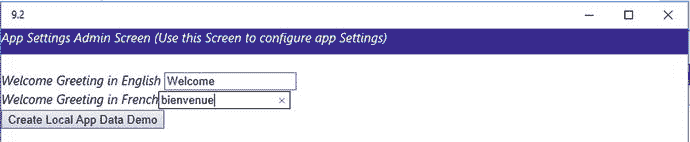
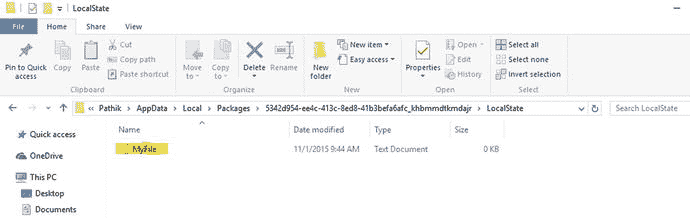
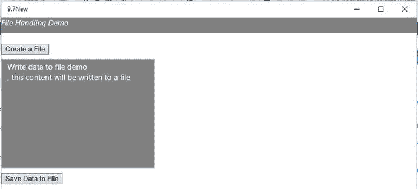
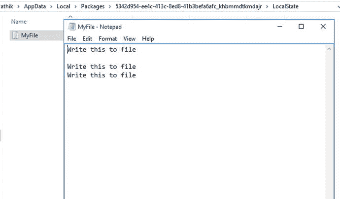

# 第 9 章:数据存储和应用数据

本章概述了在 Windows 10 应用中存储应用数据的数据存储技术。您将了解应用程序设置、如何将应用程序设置存储和检索为应用程序数据，以及如何使用应用程序数据文件夹。

那么什么是 app 数据呢？特定于特定应用程序的数据称为应用程序数据。通常，应用程序数据是用户的偏好、应用程序的配置、应用程序的状态等等，这些都是可变的。

当您在设备上安装应用程序时，应用程序会在设备上创建应用程序数据。但是，当你从设备上移除或卸载应用程序时，会发生什么呢？卸载应用程序时，应用程序数据会从设备中移除。所以建议不要将用户的数据(比如用户的图片)存储为 app 数据。

应用程序创建的另一种数据是用户数据。用户数据由用户创建，例如文档、图片、视频文件、音频文件等等。

## 9.1 如何创建和删除本地应用数据设置容器

### 问题

您需要在 Windows 10 应用的应用数据存储中创建和删除本地应用数据存储容器。

### 解决办法

使用`Windows.Storage.ApplicationData.current.LocalSettings.createContainer`在本地应用数据存储中创建本地应用设置容器。

### 它是如何工作的

该容器允许您组织您的应用程序数据设置；例如，您可以创建一个名为`Greeting_Data_Container`的容器来存储应用程序的所有问候语。创建另一个名为`UserPreference_Container`的容器，为您的应用程序用户存储所有用户偏好设置。您可以在本地设置和漫游设置中添加容器。一个容器中还可以有另一个容器。通用 Windows 应用程序允许您创建多达 32 个嵌套级别的容器。

Create a new project using the Windows Universal (Blank App) template in Microsoft Visual Studio 2015\. This creates a Windows Universal app, which can be run on PCs, tablets, and Windows Phones running Windows 10.   Open the default.html page from the project in Visual Studio Solution Explorer.   Define an HTML tag for a button within the `<body>` tag of default.html. `
`         `<i>App Settings Admin Screen</i>`     `
` ` Click on the button to Create a local app data settings container`     `<input type="button" value="Local Data Demo" id="btnLocalData" />`    `<h3></h3>` The complete `default.html` code will look like this: `<!DOCTYPE html>` `<html>` `<head>`     `<meta charset="utf-8" />`     `<title>Recipe9.1</title>`     `<!-- WinJS references -->`     `<link href="WinJS/css/ui-dark.css" rel="stylesheet" />`     ``     ``     `<!-- Recipe9.1 references -->`     `<link href="/css/default.css" rel="stylesheet" />`     `` `</head>` `<body class="win-type-body">`     `
`         `<i>App Settings Admin Screen</i>`     `
`         ` Click on the button to Create a local app data settings container`     `<input type="button" value="Local Data Demo" id="btnCreateContainer" />`    `<h3></h3>` `</body>` `</html>`   Right-click the project’s js folder in Solution Explorer and add a js file in the project’s `js` folder by using the Add ➤ New JavaScript file. Provide a name for the file. In this example, let’s name the file DatastorageDemo.js.   Refer to this file in `default.html` by adding the following code to the `<head>` tag: ``   Add the following code to the newly created `js` file: `(function () {`     `"use strict";`     `function GetControl() {`         `WinJS.UI.processAll().done(function () {`   `var localSettingsButton = document.getElementById("btnCreateContainer");` `localSettingsButton.addEventListener("click", btnCreateContainerClick, false);`         `});`     `}`     `document.addEventListener("DOMContentLoaded", GetControl);` `})();`  

这段代码获取按钮元素，并将一个事件侦听器绑定到按钮，当用户单击按钮时，该事件侦听器被触发。现在，使用下面的代码片段在`DatastorageDemo.js`文件中添加一个事件方法或函数。

`function btnCreateContainerClick(mouseEvent) {`

`var applicationData = Windows.Storage.ApplicationData.current;`

`var localSettings = applicationData.localSettings;`

`// Creating a local settings container`

`var localSettingscontainer = localSettings.createContainer("App_GreetingDataContainer", Windows.Storage.ApplicationDataCreateDisposition.Always);`

`document.getElementById("msgspan").innerText = "Container Created, the name of the container is :" + localSettingscontainer.name;`

`}`

这段代码声明了一个名为`applicationData`的变量。它被分配了`Windows.Storage.ApplicationData.current`，允许您访问 app 数据存储。应用数据存储可以存储应用设置和文件。下一行代码从变量`ApplicationData`中检索`localSettings`到变量`localSettings`。

然后它调用`createContainer`方法来创建一个设置容器。前面的示例创建了一个设置容器`App_greetingData`。`createContainer`方法有两个参数:设置容器的名称和`Windows.Storage.ApplicationDataCreateDisposition.Always`，表示总是检查容器是否存在。如果存在，返回指定的容器；否则，创建一个新的。

您也可以使用`localSettingscontainer.deleteContainer("<<name>>")`方法删除容器。`deleteContainer`方法从应用程序数据存储中删除容器。

删除代码片段使用`hasKey`函数检查容器是否存在，然后使用`deleteContainer`函数通过传递容器键删除容器。

这里给出了`DataStorageDemo.js`的完整代码:

`(function () {`

`"use strict";`

`function GetControl() {`

`WinJS.UI.processAll().done(function () {`

`var localSettingsButton = document.getElementById("btnCreateContainer");`

`localSettingsButton.addEventListener("click", btnCreateContainerClick, false);`

`});`

`}`

`document.addEventListener("DOMContentLoaded", GetControl);`

`})();`

`function btnCreateContainerClick(mouseEvent) {`

`var applicationData = Windows.Storage.ApplicationData.current;`

`var localSettings = applicationData.localSettings;`

`// Creating a local settings container`

`var localSettingscontainer = localSettings.createContainer("App_GreetingDataContainer", Windows.Storage.ApplicationDataCreateDisposition.Always);`

`document.getElementById("msgspan").innerText = "Container Created, the name of the container is :" + localSettingscontainer.name;`

`}`

现在，让我们构建应用程序，并在 Windows 10 中运行它。

图 [9-1](#Fig1) 展示了一个按钮和一个`h2`标签的外观。当您单击本地数据演示按钮时，它执行`btnSaveClick`方法，该方法创建容器并显示一条带有容器名称的消息。

图 9-1。

Creating a local app data settings container

## 9.2 如何创建和读取本地应用数据设置

### 问题

您需要在应用数据存储中的应用数据设置容器中创建本地应用数据设置。

### 解决办法

使用`ApplicationDataContainer.values`在 Windows 10 应用的本地应用数据存储中的应用数据设置容器中创建本地应用数据设置。

### 它是如何工作的

应用程序设置是应用程序中的个性化数据或自定义设置。用户偏好——例如用户想要启用还是停用定位服务——是一个应用程序设置。通用 Windows 应用程序开发公开了 API，允许您在应用程序数据存储中将应用程序设置作为应用程序数据进行存储和检索。

app store 由两个不同的设置位置组成:本地设置和漫游设置。

Create a new project using the Windows Universal (Blank App) template in Microsoft Visual Studio 2015.   Open the default.html page from the project in Visual Studio Solution Explorer.   Define HTML tags for two text boxes, a button, and a `` tag within the `<body>` tag of `default.html`. `
`   `<i>App Settings Admin Screen (Use this Screen to configure app Settings)</i>  
`     ` `     `<i>Welcome Greeting in English</i> <input type="text" value="" id="txtWelcomeGreetingseng" /> `     `<i>Welcome Greeting in French</i><input type="text" value="" id="txtWelcomeGreetingsfr" /> `   `<input type="button" value="Create Local App Data Demo" id="btnLocalData" />` The complete `default.html` contains should look like this: `<!DOCTYPE html>` `<html>` `<head>`     `<meta charset="utf-8" />`     `<title>Recipe9.2</title>`     `<!-- WinJS references -->`     `<link href="WinJS/css/ui-dark.css" rel="stylesheet" />`     ``     ``     `<!-- Recipe9.2 references -->`     `<link href="/css/default.css" rel="stylesheet" />`     `` `</head>` `<body class="win-type-body">`     `
`         `<i>App Settings Admin Screen (Use this Screen to configure app Settings)</i>`     `
`     ` `     `<i>Welcome Greeting in English</i> <input type="text" value="" id="txtWelcomeGreetingseng" /> `     `<i>Welcome Greeting in French</i><input type="text" value="" id="txtWelcomeGreetingsfr" /> `     `<input type="button" value="Create Local App Data Demo" id="btnLocalData" />` `</body>` `</html>`   Right-click the project’s js folder in Solution Explorer and select Add ➤ New JavaScript file. Provide a name for the file. In this example, let’s name the file DataStorageDemo.js. `(function () {`     `"use strict";`     `function GetControl() {`         `WinJS.UI.processAll().done(function () {`             `var submitbutton = document.getElementById("btnLocalData");`             `submitbutton.addEventListener("click", btnLocalDataClick, false);`         `});` `GetCurrentSettingValues();`     `}`     `document.addEventListener("DOMContentLoaded", GetControl);` `})();`   Now, add a function to retrieve the current greeting settings from the container: `function GetCurrentSettingValues() {`     `var applicationData = Windows.Storage.ApplicationData.current;`     `var localSettings = applicationData.localSettings;`     `// Creating a local settings container`     `var containerExists = localSettings.containers.hasKey("App_GreetingDatalocalContainer");`     `if (containerExists) {`         `document.getElementById("txtWelcomeGreetingseng").value = localSettings.containers.lookup("App_GreetingDatalocalContainer").values["App_Heading_English"];`         `document.getElementById("txtWelcomeGreetingsfr").value = localSettings.containers.lookup("App_GreetingDatalocalContainer").values["App_Heading_French"];`     `}` `}`  

此代码在应用程序加载时执行；它从容器中检索本地问候语设置。首次运行此应用程序时，您不会看到任何填充的值，但下次运行时，它会显示存储在容器中的设置。

现在，使用下面的代码片段在`DataStorageDemo.js`文件中添加一个事件方法或函数:

`function btnLocalDataClick(mouseEvent) {`

`var applicationData = Windows.Storage.ApplicationData.current;`

`var localSettings = applicationData.localSettings;`

`// Creating a local settings container`

`var localSettingscontainer = localSettings.createContainer("App_GreetingDatalocalContainer", Windows.Storage.ApplicationDataCreateDisposition.Always);`

`if (!localSettingscontainer.values.hasKey("App_Heading_English")) {`

`localSettingscontainer.values["App_Heading_English"] = document.getElementById("txtWelcomeGreetingseng").value;`

`}`

`if (!localSettingscontainer.values.hasKey("App_Heading_French")) {`

`localSettingscontainer.values["App_Heading_French"] = document.getElementById("txtWelcomeGreetingsfr").value;`

`}`

`} //end of function btnLocalDataClick`

这段代码创建了`applicationData`和`localSettings`变量来引用`localSettings`。之后，它使用`createContainer`函数创建一个名为`App_GreetingDatalocalContainer`的容器。然后，它使用`localSettingscontainer.values.hasKey("App_Heading_English")`来确保名为`App_Heading_English`的设置存在于应用程序数据的 localSettings 容器中。如果设置不存在，那么它使用`localSettingscontainer.["name"]`函数创建一个。它还通过使用以下代码行将文本框中的字符串值赋给它:

`localSettingscontainer.values["App_Heading_English"] = document.getElementById("txtWelcomeGreetingseng").value;`

对于法语标题的应用程序也是如此。

当您在 Windows 10 上运行该应用程序时，您会看到如图 [9-2](#Fig2) 所示的屏幕。

图 9-2。

Creating local app data settings for the greetings settings

## 9.3 如何创建和检索本地复合设置

### 问题

您需要在 Windows 10 应用的应用数据存储中创建和读取本地复合值。

### 解决办法

使用`ApplicationDataCompositeValue`类来创建和读取本地复合值。

### 它是如何工作的

`Windows.Storage.ApplicationDataCompositeValue`类允许您创建可存储在本地设置或漫游设置中的复合设置。复合值类允许您将名称值对作为应用数据存储在应用数据存储中。假设您想将图书信息存储为

`book["ISBN"] = 12345;`

`book["BookTitle"] = "Windows 10 Development";`

要存储复合信息，您可以使用如下所示的代码:

`var applicationData = Windows.Storage.ApplicationData.current;`

`var localSettings = applicationData.localSettings;`

`// Create a BookInfo Composite setting`

`var bookInfo = new Windows.Storage.ApplicationDataCompositeValue();`

`bookInfo["ISBN"] = 12345;`

`bookInfo["Title"] = "Windows 10 Development";`

`localSettings.values["AppLocalSettings"] = bookInfo;`

要从复合设置中读取数据，可以使用如下所示的代码:

`var bookInfo = localSettings.values["AppLocalSettings"];`

`if (bookInfo)`

`{`

`var ISBN = bookInfo["ISBN"];`

`var Title = bookInfo["Title"]`

`}`

## 9.4 如何创建漫游应用数据存储容器

### 问题

您需要在 Windows 10 应用的应用数据存储中创建一个漫游应用数据存储容器。

### 解决办法

使用`roamingSettings.createContainer`在应用数据存储中创建漫游应用设置容器。

### 它是如何工作的

这和你在 app data store 的本地设置中看到的非常相似，但是你没有使用`Windows.Storage.ApplicationData.current.LocalSettings`，而是使用了`Windows.Storage.ApplicationData.current.roamingSettings`。

Create a new project using the Windows Universal (Blank App) template in Microsoft Visual Studio 2015.   Open the default.html page from the project in Visual Studio Solution Explorer. Add the following HTML markup within the body tag of `default.html`: `<body class="win-type-body" style="background-color:goldenrod">` `
`         `<i>User Preferences Settings Screen (These settings will be available across devices)</i>`     `
`    ` `     `<input type="button" value="Save User Preference" id="btnUserPreferenceRoamingData" />`     ` `     `` `</body>`   Right-click the project’s js folder in the Solution Explorer and select Add ➤ New JavaScript file. Provide the name for the file. In this example, let’s name the file DatastorageDemo.js. `(function () {`     `"use strict";`     `function GetControl() {`         `WinJS.UI.processAll().done(function () {`             `var submitbutton = document.getElementById("btnUserPreferenceRoamingData");`             `submitbutton.addEventListener("click", btnCreateRoamingContainerClick, false);`         `});`     `}`     `document.addEventListener("DOMContentLoaded", GetControl);` `})();`   Now, add an event method or function using the following code snippet in the `Datastoragedemo.js` file: `function btnCreateRoamingContainerClick(mouseEvent) {` `var ApplicationData = Windows.Storage.ApplicationData.current;` `var roamingSettings = ApplicationData.roamingSettings;` `// Creating a local settings container` `if (!roamingSettings.containers.hasKey("UserPreference_RoamingProfile")) {` `var roamingSettingscontainer = roamingSettings.createContainer("UserPreference_RoamingProfile", Windows.Storage.ApplicationDataCreateDisposition.Always);` `document.getElementById("spantoDisplayRoamingData").innerText =roamingSettingscontainer.name +" User Preference Roaming App Data Container Created!!";`    `}` `}`  

这段代码声明了一个名为`ApplicationData`的变量。它被分配了`Windows.Storage.ApplicationData.current`，这表示应用数据存储中应用设置的容器。下一行从`ApplicationData`中检索`roamingSettings`，并将其存储在`roamingSettings`变量中。

然后它调用`roamingSettings.containers.hasKey`函数来检查容器是否存在。如果它不存在，那么它使用`createContainer`方法创建一个设置容器。前面的示例创建了一个设置容器`App_GreetingDataRoamingContainer`，并将其存储在`roamingSettingscontainer`中。`createContainer`方法有两个参数:设置容器的名称和`Windows.Storage.ApplicationDataCreateDisposition.Always`，它指示总是检查容器是否存在；如果存在，返回指定的容器；否则，创建一个新的。

当您在 Windows 10 模拟器或 Windows Mobile 上运行该应用程序时，它应该如图 [9-3](#Fig3) 所示。

图 9-3。

The form to save user preference settings using roaming app data settings

太好了。在前面的代码片段中，您学习了`roamingSettings`对象的`createContainer`和`deleteContainer`方法。

## 9.5 如何创建和读取漫游应用数据设置

### 问题

您需要在 Windows 10 应用的应用数据存储中的漫游应用数据设置容器中创建和读取漫游应用数据设置。

### 解决办法

使用`ApplicationDataContainer.values`在 Windows 10 应用的应用数据商店的应用数据设置容器中创建漫游应用数据设置。

### 它是如何工作的

Create a new project using the Windows Universal (Blank App) template in Microsoft Visual Studio 2015.   Open the default.html page from the project in Visual Studio Solution Explorer.   Add a form control to the body section of the page. The form control has a few `div` controls to display the title bar, input control for email, and a toggle switch control for mobile data and location services. `<body class="win-type-body">`     `
`         `<i>User Preferences Settings Screen (These settings will be available across devices)</i>`     `
`     ` `     `<form id="form1">`         `<fieldset class="formSection">`             `<legend class="formSectionHeading">User Preferenses</legend>`             `
`                 `
`                 `
`                 ` `                 `
`                 `
`                 ` `                 `

`                 ` `                 `
`                         `<button type="submit" id="btnSubmit" class="horizontalButtonLayout win-button">`                             `Submit`                         `</button>`                 `
`             `
`         `</fieldset>`     `</form>`     ` ` `</body>`   Right-click the project in Solution Explorer and select Add ➤ New JavaScript file and provide the name for the file. In this example, let’s name the file DataStorageDemo.js.   Add the following code to the `DataStorageDemo.js` file: `(function () {`     `"use strict";`     `function GetControl() {`         `WinJS.UI.processAll().done(function () {`             `var submitbutton = document.getElementById("btnSubmit");`             `submitbutton.addEventListener("click", btnCreateRoamingContainerClick, false);`         `});`     `}`     `document.addEventListener("DOMContentLoaded", GetControl);` `})();`  

前面的代码向`btnSubmit`按钮添加了一个事件接收器。现在添加一个`btnCreateRoamingContainerClick`函数，当用户单击用户首选项表单控件上的提交按钮时触发该函数。

`function btnCreateRoamingContainerClick(mouseEvent) {`

`var ApplicationData = Windows.Storage.ApplicationData.current;`

`var roamingSettings = ApplicationData.roamingSettings;`

`// Creating a local settings container`

`if (roamingSettings.containers.hasKey("UserPreference_RoamingProfile")) {`

`var roamingSettingscontainer = roamingSettings.createContainer("UserPreference_RoamingProfile", Windows.Storage.ApplicationDataCreateDisposition.Always);`

`var toggleMobileDataButton = document.getElementById("UserMobileData").winControl;`

`if (toggleMobileDataButton.checked) {`

`roamingSettingscontainer.values["UseMobileData"] = "Yes";`

`}`

`else {`

`roamingSettingscontainer.values["UseMobileData"] = "No";`

`}`

`var toggleLocationDataButton = document.getElementById("LocationServices").winControl;`

`if (toggleLocationDataButton.checked) {`

`roamingSettingscontainer.values["LocationServices"] = "Yes";`

`}`

`else {`

`roamingSettingscontainer.values["LocationServices"] = "No";`

`}`

`document.getElementById("msg").innerText = "Data Saved!!";`

`}`

`}//end of function btnCreateRoamingContainerClick`

这段代码声明了一个名为`ApplicationData`的变量。它被分配了`Windows.Storage.ApplicationData.current`，表示应用程序数据存储中应用程序设置的容器。下一行从`ApplicationData`中获取`roamingSettings`，并将其存储在`roamingSettings`变量中。

然后它调用`roamingSettings.containers.hasKey`函数来检查容器是否存在。如果它不存在，它使用`createContainer`方法创建一个设置容器。前面的示例创建了一个设置容器`App_GreetingDataRoamingContainer`，并将其存储在`roamingSettingscontainer`中。`createContainer`方法有两个参数:设置容器的名称和`Windows.Storage.ApplicationDataCreateDisposition.Always`，它指示总是检查容器是否存在。如果存在，返回指定的容器；否则，创建一个新的。

下一行代码检查切换开关控件的值，基于它是否被选中。如果切换开关选择“是”，它将使用`roamingSettingscontainer.values["UseMobileData"]`功能存储漫游数据应用程序设置，该功能使用`container.value`方法设置值。它也为位置服务拨动开关做同样的事情。

`DataStorageDemo.js`文件中的完整代码如下所示:

`(function () {`

`"use strict";`

`function GetControl() {`

`WinJS.UI.processAll().done(function () {`

`var submitbutton = document.getElementById("btnSubmit");`

`submitbutton.addEventListener("click", btnCreateRoamingContainerClick, false);`

`});`

`}`

`document.addEventListener("DOMContentLoaded", GetControl);`

`function btnCreateRoamingContainerClick(mouseEvent) {`

`var ApplicationData = Windows.Storage.ApplicationData.current;`

`var roamingSettings = ApplicationData.roamingSettings;`

`// Creating a local settings container`

`if (roamingSettings.containers.hasKey("UserPreference_RoamingProfile")) {`

`var roamingSettingscontainer = roamingSettings.createContainer("UserPreference_RoamingProfile", Windows.Storage.ApplicationDataCreateDisposition.Always);`

`var toggleMobileDataButton = document.getElementById("UserMobileData").winControl;`

`if (toggleMobileDataButton.checked) {`

`roamingSettingscontainer.values["UseMobileData"] = "Yes";`

`}`

`else {`

`roamingSettingscontainer.values["UseMobileData"] = "No";`

`}`

`var toggleLocationDataButton = document.getElementById("LocationServices").winControl;`

`if (toggleLocationDataButton.checked) {`

`roamingSettingscontainer.values["LocationServices"] = "Yes";`

`}`

`else {`

`roamingSettingscontainer.values["LocationServices"] = "No";`

`}`

`document.getElementById("msg").innerText = "Data Saved!!";`

`}`

`}//end of function btnCreateRoamingContainerClick`

`})();`

就这样。漫游数据将在用户访问此 Win 10 应用程序的所有设备上可用。

当您在 Windows 10 模拟器或 Windows Mobile 上运行该应用程序时，它将如图 [9-4](#Fig4) 所示。

图 9-4。

Form to save user preference settings using roaming app data settings

## 9.6 如何注册数据变更事件

### 问题

您需要注册并实现一个数据更改事件处理程序。

### 解决办法

您可以使用`ApplicationData.DataChanged`事件注册漫游数据的数据更改事件。

### 它是如何工作的

当漫游数据在其中一个设备上更改时，通用 Windows 应用程序会将漫游数据复制到云，然后将漫游数据同步到用户安装了应用程序的其他设备。假设在同步之后，您希望确保基于漫游数据更新应用程序数据。例如，您将用户首选项存储在漫游数据中，当用户首选项更改时，您希望根据新的首选项更改用户设备上的设置。嗯，通用 Windows 应用程序允许您注册一个事件，该事件将在应用程序数据刚刚完成从云同步后执行。

您可以使用`ApplicationData.DataChanged`事件来注册一个事件。所以我们来实现这个。

Create a new project using the Windows Universal (Blank App) template in Microsoft Visual Studio 2015\. This creates a Windows Universal app that can run on Windows tablets and Windows Phone running Windows 10.   Open the default.html page from the project in Visual Studio Solution Explorer.   Define an HTML `div` tag for the app title bar.  

`<body class="win-type-body">`

`
`

`<i>Custom title bar</i>`

`
`

`</body>`

完整的`default.html`代码将如下所示:

`<!DOCTYPE html>`

`<html>`

`<head>`

`<meta charset="utf-8" />`

`<title>_9.7</title>`

`<!-- WinJS references -->`

`<link href="WinJS/css/ui-dark.css" rel="stylesheet" />`

``

``

`<!-- _9.7 references -->`

`<link href="/css/default.css" rel="stylesheet" />`

``

``

`</head>`

`<body class="win-type-body">`

`
`

`<i>Custom title bar</i>`

`
`

`</body>`

`</html>`

在解决方案资源管理器中右键单击该项目，然后选择“添加➤新 JavaScript 文件”。提供文件的名称。在本例中，我们将文件命名为 DatastorageDemo.js。

在`js`文件中添加以下代码。代码首先向`applicationData`对象注册一个数据更改事件。

`(function () {`

`"use strict";`

`function GetControl() {`

`WinJS.UI.processAll().done(function () {`

`});`

`}`

`document.addEventListener("DOMContentLoaded", GetControl);`

`var applicationData = Windows.Storage.ApplicationData.current;`

`applicationData.addEventListener("datachanged", datachangeHandler);`

`function datachangeHandler(eventArgs) {`

`var applicationData = Windows.Storage.ApplicationData.current;`

`var roamingSettings = applicationData.roamingSettings;`

`// Creating a roaming settings container`

`var roamingSettingscontainer = roamingSettings.containers ("App_GreetingDataContainer");`

`//Read the Data again`

`document.getElementById("titleBarContent").innerText = roamingSettingscontainer.values["App_Heading_English"];`

`}`

`})();`

这段代码还在同一个`js`文件中定义了 data changed 事件处理程序。`datachangeHandler`事件通过使用`loopup`函数从`applicationData`对象中检索漫游容器。然后它读取名为`App_Heading_English`的漫游设置，并将其分配给标题栏的`div`选项卡。

## 9.7 如何创建、写入和读取本地文件

### 问题

您需要在 Windows 10 应用的应用数据存储中创建文件、写入文件和读取文件。

### 解决办法

使用`Windows.Storage.StorageFile`类进行文件处理。

### 它是如何工作的

`Windows.Storage.StorageFile`类为通用 Windows 应用程序中的文件处理提供了必要的方法。您创建的文件可以存储在文件夹、库(图片库)和通用 Windows 应用程序支持的网络位置中，如 OneDrive 等。

#### 本地文件夹

众所周知，通用的 Windows 应用程序可以在许多设备上运行:Windows Mobile、运行 Windows 10 的个人电脑、微软 Surface 平板电脑等等。因此，当您在 Windows 应用商店中部署应用时，您的应用用户可以在一台或多台设备上下载并运行您的应用。那么如何在特定设备上管理特定于你的应用的应用设置呢？你可以使用本地文件夹。本地文件夹可用于在特定设备上存储本地应用程序数据。本地文件夹数据可用于存储该数据的设备。它不能与其他设备同步。通用 Windows 应用程序将应用程序数据存储在应用程序包的`LocalState`中。

#### 漫游文件夹

现在，假设您想要存储应用程序的用户首选项，并且想要确保相同的用户首选项在特定用户的所有设备上都可用。嗯，你可以通过使用漫游文件夹来实现这一点。它将应用程序数据存储在应用程序包的`RoamingState`中。当应用程序用户在多个设备上运行应用程序时，存储在漫游文件夹中的应用程序数据会在设备之间同步。

#### 临时文件夹

第三种类型的位置是临时文件夹，它允许您短期存储应用程序数据。储存在临时文件夹中的应用程序数据一旦不再使用，就会被删除。所以总是使用这个文件夹来存储不太重要的数据。通用 Windows 应用程序将应用程序数据存储在应用程序包的`TemporaryState`中。

`StorageFolder`类公开了许多创建文件、从文件中读取内容以及将内容写入文件的方法。让我们来看看每一种方法。

方法在指定的位置创建一个新文件。如果文件已经存在，它将覆盖该文件。

使用该函数的语法如下:

`storageFolder.createFileAsync(desiredName).done(function CreationSuccess(newFileObj))`

`{`

`/* Success call back */`

`}, CreationFailed(error))`

`{`

`Failed call back */`

`});`

如您所见，`createFileAsync`方法必须使用一个成功的回调函数和一个失败的回调函数来定义。

在本地文件夹中创建文件的完整代码如下:

`function btnDataToFileClick(mouseEvent) {`

`var ApplicationData = Windows.Storage.ApplicationData.current;`

`var localFolder = ApplicationData.localFolder;`

`var newFilePromise = localFolder.createFileAsync("MyFile.txt");`

`newFilePromise.done(`

`function (file) {`

`// WinJS.log("The file MyFile.txt was created.", "sample", "status");`

`WinJS.log && WinJS.log("The file MyFile.txt was created.", "sample", "status");`

`},`

`function (error) {`

`});`

`}`

当你在你的 Windows 10 本地设备上运行这个应用时，会在本地文件夹中创建一个名为`MyFile.txt`的文件，如图 [9-5](#Fig5) 所示。

图 9-5。

A file created in local folder

本地文件夹位置为`C:\Users\<<UserName>>\AppData\Local\Packages\5342d954-ee4c-413c-8ed8-41b3befa6afc_khbmmdtkmdajr\LocalState`。这个文件是空的，因为我们还没有写入这个文件。

太好了。现在让我们编写代码将内容写入文件。为此，我们首先在`default.html`文件中添加一个文本区域框。`default.html`的 body 标签看起来像这样:

`<body class="win-type-body" style="background-color:goldenrod">`

`
`

`<i>File Handling Demo</i>`

`
`

` `

`<input type="button" value="Save Data to File" id="btnCreateAFile" />`

`<textarea rows="10" cols="100" id="textarea" class="win-textarea"></textarea>`

`<input type="button" value="Save Data to File" id="btnDataToFile" />`

`</body>`

这段代码向`default.html`文件添加了一个文本区域，以及名为`btnDataToFile`和`btnCreateaFile`的按钮。

在解决方案资源管理器中右键单击项目的 js 文件，然后选择“添加➤新 JavaScript 文件”。提供文件的名称。在本例中，我们将文件命名为 DatastorageDemo。js。

`(function () {`

`"use strict";`

`function GetControl() {`

`WinJS.UI.processAll().done(function () {`

`var submitbutton = document.getElementById("btnCreateAFile");`

`submitbutton.addEventListener("click", btnCreateAFileClick, false);`

`var submitbutton = document.getElementById("btnDataToFile");`

`submitbutton.addEventListener("click", btnDataToFileClick, false);`

`});`

`}`

`document.addEventListener("DOMContentLoaded", GetControl);`

`})();`

这段代码将事件接收器添加到两个按钮控件中。现在在 DatastorageDemo.js 文件中添加一个事件代码。

`function btnCreateAFileClick(mouseEvent) {`

`var ApplicationData = Windows.Storage.ApplicationData.current;`

`var LocalFolder = ApplicationData.localFolder;`

`var newFilePromise = LocalFolder.createFileAsync("MyFile.txt");`

`newFilePromise.done(`

`function (file) {`

`// WinJS.log("The file MyFile.txt was created.", "sample", "status");`

`WinJS.log && WinJS.log("The file MyFile.txt was created.", "sample", "status");`

`},`

`function (error) {`

`});`

`}`

这段代码用于在本地文件夹中创建一个新文件。您不会为`btnDataToFile`的点击事件向`DataStorageDemo.js`文件添加另一个事件。

`function btnDataToFileClick(mouseEvent) {`

`var ApplicationData = Windows.Storage.ApplicationData.current;`

`var LocalFolder = ApplicationData.localFolder;`

`// Open sample file.`

`var FilePromise = LocalFolder.getFileAsync("MyFile.txt");`

`FilePromise.then(function (file) {`

`// If file found …`

`if (file) {`

`// Write to file.`

`var txtarea = document.getElementById("textarea").innerText;`

`Windows.Storage.FileIO.writeTextAsync(file, txtarea).then(function (contents) {`

`WinJS.log && WinJS.log("The text was wrttien to file MyFile.txt.", "sample", "status");`

`});`

`}`

`}, function (error) {`

`// Handle error.`

`});`

`}`

这段代码通过使用本地文件夹的`getFileAsync`方法获取文件。如果文件存在，那么它接下来使用`Windows.Storage.FileIO.writeTextAsync.writeTextAsync`方法将内容写入文件。

当您在 Visual Studio 中使用本地设备运行此应用程序时，您会看到默认屏幕，如图 [9-6](#Fig6) 所示。

图 9-6。

File handling demo’s default screen

“创建文件”按钮会在运行应用程序的设备的本地文件夹中创建一个文件。创建文件后，在文本区域键入一些文本。单击将数据保存到文件将数据保存到文件。当您在记事本中打开该文件时，您会看到该文件的内容，如图 [9-7](#Fig7) 所示。

图 9-7。

The file on the local holder with the content

类似地，您可以使用`readTextAsync`方法来读取文件的内容。从文件中读取内容的代码如下:

`// Read from the file.`

`Windows.Storage.FileIO.readTextAsync(file).then(function (contents) {`

`document.getElementById("textarea1").innerText = contents;`

`});`

您可以通过引用正确的位置，以类似的方式在任何位置创建文件，如本地文件夹、漫游文件夹等。