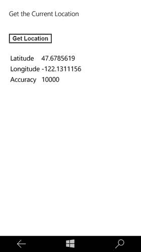
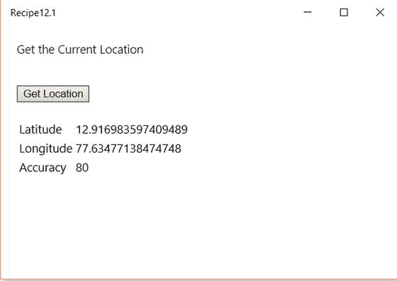
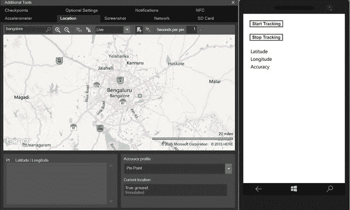
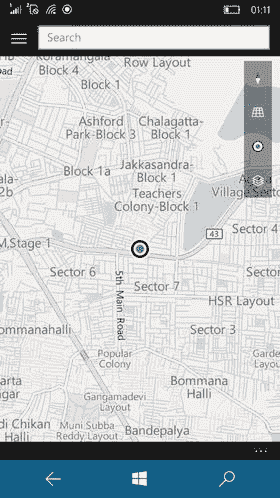
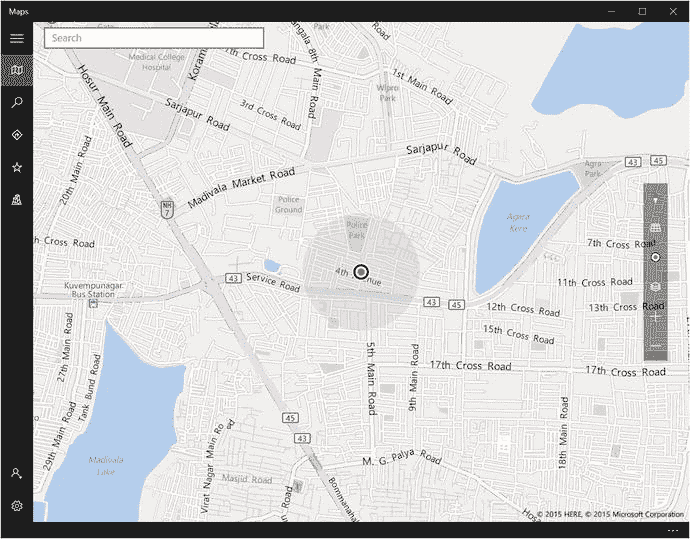
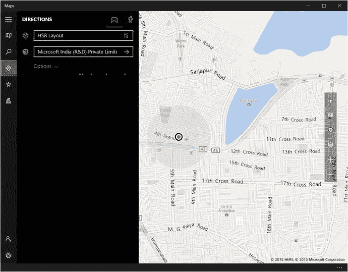
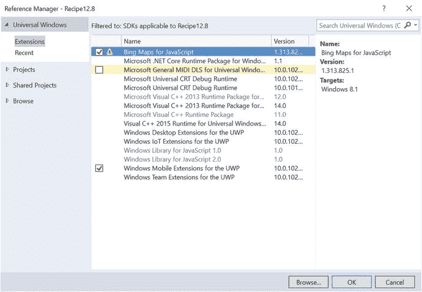
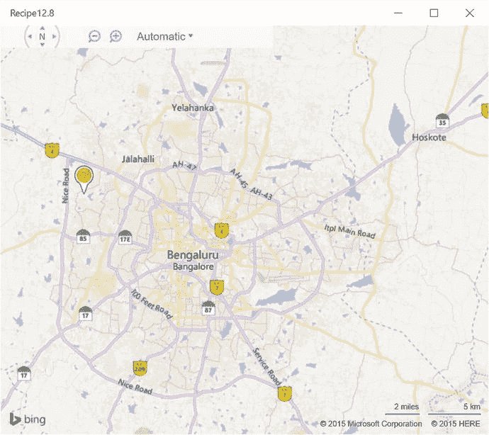

# 第 12 章:Windows 应用程序中的位置和地图

构建 Windows 应用程序的开发人员可以利用 Windows 设备的功能将位置和地图集成到他们的应用程序中。在这一章中，你将看到如何在通用 Windows 运行时应用程序中使用位置 API 的方法。

## 12.1 获取当前位置

### 问题

你不知道你在哪里。Windows 应用程序需要确定并显示您的当前位置。

### 解决办法

使用在`Windows.Devices.Geolocation`命名空间中定义的`Geolocator`类的`getGeopositionAsync`方法，从 Windows 10 支持的设备中获取当前位置。

### 它是如何工作的

Create a new Universal Windows project using the Universal Windows template, which can be found under the JavaScript ➤ Windows ➤ Universal node of the New Project dialog in Microsoft Visual Studio 2015\. This creates a single project in the Visual Studio Solution with the necessary files in it to start with.   The first step to integrate the location functionality in the app is to declare the Location capability in the `package.appxmanifest` file of the project. From Visual Studio Solution Explorer, double-click the package.appxmanifest file. In the GUI designer, click the Capabilities tab and select Location, as shown in Figure [12-1](#Fig1).

图 12-1。

Capabilities tab in Visual Studio   Open the project default.html file and add the following code under the body tag of each file: `
`     `
Get the Current Location
`     ` `     `<button id="btnLocation">Get Location</button>  ` `
` ` ` `
`     `<table>`         `<tr>`             `<td>`                 `Latitude`             `</td>`             `<td >`                 `
`                 `
`             `</td>`         `</tr>`         `<tr>`             `<td>`                 `Longitude`             `</td>`             `<td>`                 `
`                 `
`             `</td>`         `</tr>`         `<tr>`             `<td>`                 `Accuracy`             `</td>`             `<td>`                 `
`                 `
`             `</td>`         `</tr>`     `</table>` `
`   Open default.js (/js/default.js) in the project and replace the code in the file with the following: `// For an introduction to the Blank template, see the following documentation:` `//` [`http://go.microsoft.com/fwlink/?LinkID=392286`](http://go.microsoft.com/fwlink/?LinkID=392286) `(function () {`     `"use strict";`     `var app = WinJS.Application;`     `var activation = Windows.ApplicationModel.Activation;`     `app.onactivated = function (args) {`         `if (args.detail.kind === activation.ActivationKind.launch) {`             `if (args.detail.previousExecutionState !== activation.ApplicationExecutionState.terminated) {`             `} else {`             `}`             `args.setPromise(WinJS.UI.processAll().`                `done(function ()`                `{`                    `// Add an event handler to the button.`                    `document.querySelector("#btnLocation").addEventListener("click",`                        `getLocation);`                `}));`         `}`     `};`     `var geolocation = null;`     `function getLocation()`     `{`         `if (geolocation == null) {`             `geolocation = new Windows.Devices.Geolocation.Geolocator();`         `}`         `if (geolocation != null) {`             `geolocation.getGeopositionAsync().then(getPosition);`         `}`     `}`     `function getPosition(position)`     `{`         `document.getElementById('latitude').innerHTML = position.coordinate.point.position.latitude;`         `document.getElementById('longitude').innerHTML = position.coordinate.point.position.longitude;`         `document.getElementById('accuracy').innerHTML = position.coordinate.accuracy;`     `}`     `app.oncheckpoint = function (args) {`     `};`     `app.start();` `})();` The `document.querySelector` is used to add the click event handler for the `btnLocation` element. Upon click of the button, the `getLocation` method is called.   To get the current location information, create an instance of the `Geolocator` class defined in the `Windows.Devices.Geolocation` namespace and then invoke the `getGeopositionAsync` method of the `Geolocator` class. Once the location is retrieved, an action method needs to be defined to perform a certain set of actions. The `getPosition` method, as shown in the preceding code snippet, takes care of this. The parameter position is of type `Geolocation`, which can be used to get the current location information like latitude, longitude, accuracy, and so forth. The next step is to build the project and run it in the emulator or local machine.   Choose the Build menu and select Build Solution from Visual Studio to build the project. Select Mobile Emulator from the Run drop-down menu in the Visual Studio standard toolbar.   When you run the app for the first time on Windows, you are prompted to confirm if it is OK to use your location. Click Allow so that the app can use the location.   In the application, click the Get Location button to display the current location’s latitude and longitude, as shown in Figure [12-2](#Fig2).

图 12-2。

Current location in Windows Mobile app   When you click the app on the local machine, you are prompted with a message, as shown in Figure [12-3](#Fig3). Click the Allow button. This displays the current location (see Figure [12-4](#Fig4)).

图 12-4。

Current location in a Windows desktop family app

图 12-3。

Allow current location prompt in Windows desktop family app   Note

确保在您的 Windows 设备中启用了定位服务，以获取当前位置。

## 12.2 响应地理定位器位置更新

### 问题

您希望经常检查应用程序中的位置是否有任何变化。

### 解决办法

使用在`Windows.Devices.Geolocation`名称空间中定义的`Geolocator`类的`getGeopositionAsync`方法。订阅`PositionChanged`和`LocationChanged`事件，跟踪位置变化，并通过 Windows Mobile 或桌面系列应用程序做出响应。

### 它是如何工作的

Create a new Universal Windows project using the Universal Windows template, which can be found under JavaScript ➤ Windows ➤ Universal node of the New Project dialog in Microsoft Visual Studio 2015\. This creates a single project in the Visual Studio Solution with the necessary files in it to start with.   Enable the Location capability in the `package.appxmanifest` file in the project.   Open the default.html file from Visual Studio Solution Explorer, and then add the following code under the body tag of each file. `
`     `<button id="start">Start Tracking</button> `     ` `     `<button id="stop">Stop Tracking</button> ` `
` ` ` `
`     `<table>`         `<tr>`             `<td>`                 `Latitude`             `</td>`             `<td>`                 `
`                 `
`             `</td>`         `</tr>`         `<tr>`             `<td>`                 `Longitude`             `</td>`             `<td>`                 `
`                 `
`             `</td>`         `</tr>`         `<tr>`             `<td>`                 `Accuracy`             `</td>`             `<td>`                 `
`                 `
`             `</td>`         `</tr>`         `<tr>`             `<td>`                 `

`             `</td>`         `</tr>`     `</table>` `
` The preceding HTML code is similar to the code in the Recipe 12.1, but includes an additional `div` tag to display the status.   Open default.js (/js/default.js) in the project from Visual Studio Solution Explorer and replace the code in the file with the following: `(function () {`     `"use strict";`     `var app = WinJS.Application;`     `var activation = Windows.ApplicationModel.Activation;`     `app.onactivated = function (args) {`         `if (args.detail.kind === activation.ActivationKind.launch) {`             `if (args.detail.previousExecutionState !== activation.ApplicationExecutionState.terminated) {`             `} else {`             `}`             `args.setPromise(WinJS.UI.processAll().`                  `done(function () {`                      `// Add an event handler to the button.`                      `document.querySelector("#start").addEventListener("click",`                          `Starttracking);`                      `// Add an event handler to the button.`                      `document.querySelector("#stop").addEventListener("click",`                          `Stoptracking);`                  `}));`         `}`     `};`     `var geolocation = null;`     `// Start tracking`     `function Starttracking() {`         `if (geolocation == null)`         `{`             `geolocation = new Windows.Devices.Geolocation.Geolocator();`             `geolocation.reportInterval = 100;`         `}`         `if (geolocation != null)`         `{`             `geolocation.addEventListener("positionchanged", onPositionChanged);`             `geolocation.addEventListener("statuschanged", onStatusChanged);`         `}`     `}`     `// On change of location position , update the UI`     `function onPositionChanged(args) {`         `document.getElementById('latitude').innerHTML = args.position.coordinate.point.position.latitude;`         `document.getElementById('longitude').innerHTML = args.position.coordinate.point.position.longitude;`         `document.getElementById('accuracy').innerHTML = args.position.coordinate.accuracy;`     `}`     `// Stop the tracking`     `function Stoptracking()`     `{`         `if (geolocation != null) {`             `geolocation.removeEventListener("positionchanged", onPositionChanged);`         `}`     `}`     `// event handler for the Status Changed method.`     `function onStatusChanged(args) {`         `var Status = args.status;`         `document.getElementById('Status').innerHTML =`             `getStatus(Status);`     `}`     `// Gets the status`     `function getStatus(Status) {`         `switch (Status) {`             `case Windows.Devices.Geolocation.PositionStatus.ready:`                 `return "Ready";`                 `break;`             `case Windows.Devices.Geolocation.PositionStatus.initializing:`                 `return "Initializing";`                 `break;`             `case Windows.Devices.Geolocation.PositionStatus.disabled:`                 `return "Location is disabled . Check the Location settings in your device or Appxmanifest file";`                 `break;`             `case Windows.Devices.Geolocation.PositionStatus.notInitialized:`                 `return "Not Initialized";`             `default:`                 `return "Status us unknown";`         `}`     `}`     `app.oncheckpoint = function (args) {`     `};`     `app.start();` `})();` The first step is to add the click event handler for the Start Tracking and the Stop Tracking buttons. The `document.querySelector` is used to add the event listener. `document.querySelector("#start").addEventListener("click",Starttracking);` `document.querySelector("#stop").addEventListener("click",Stoptracking);` A new instance of the `Geolocator` class is created in the `Starttracking` method and the `reportInterval` is set. The `reportInterval` defines the minimum time interval between location updates, in milliseconds. `geolocation = new Windows.Devices.Geolocation.Geolocator();` `geolocation.reportInterval = 100;` The `positionchanged` and the `statuschanged` event listeners are added to the `geolocation` instance: `geolocation.addEventListener("positionchanged", onPositionChanged);` `geolocation.addEventListener("statuschanged", onStatusChanged);` The `positionchanged` event is raised when there is a change in location. The `statuschanged` event is raised when the ability of the `Geolocator` to provide updated location changes; for example, if the location is disabled or initialized, and so forth. The `getStatus` method returns the message based on the `Windows.Devices.Geolocation.PositionStatus`. When you don’t need to track the location, just remove the `positionchanged` event listener, as follows: `geolocation.removeEventListener("positionchanged", onPositionChanged);`   Now, build and run the project in the emulator.   In the app, click the Start Tracking button. The app subscribes for the location updates via the `Geolocator`’s `Onpositionchanged` event and displays the location information (see Figure [12-5](#Fig5)).

图 12-5。

Location updates using the Windows Mobile emulator’s additional tools When the app is run on Windows desktop using the Local Machine option, you should see the screen shown in Figure [12-6](#Fig6).

图 12-6。

Location updates in Windows desktop using Local Machine option   Note

Windows Mobile 模拟器提供了额外的工具，让开发者在开发过程中测试基于位置的应用，如图 [12-5](#Fig5) 所示。

## 12.3 用 HTML5 检测用户的位置

### 问题

你不知道你在哪里。Windows 应用程序需要确定并显示您的当前位置。

### 解决办法

除了 Windows 运行时 API，WinJS 应用程序还可以利用 W3C 地理位置 API，通过使用 Windows 应用程序中的 HTML5 来检测用户的当前位置。

### 它是如何工作的

Create a new Universal Windows project using the Universal Windows template, which can be found under JavaScript ➤ Windows ➤ Universal node of the New Project dialog in Microsoft Visual Studio 2015\. This creates a single project in the Visual Studio Solution with the necessary files in it to start with.   The first step to integrate the location functionality in the app is to declare the Location capability in the `package.appxmanifest` file of the Windows app. From Visual Studio Solution Explorer, double-click the package.appxmanifest file. In the GUI designer, click the Capabilities tab and select Location.   Open the default.html file of the Windows app and add the following code under the body tag of the file. `<h1>Current Location using HTML5</h1>` `<button id="btnLocation">Get Location</button>  ` `<label>Latitude</label> 

 ` `<label>Longitude</label> 
 
 ` `
 
 `   Open default.js (/js/default.js) in the project. Replace the code in the file with the following: `(function () {`     `"use strict";`     `var app = WinJS.Application;`     `var activation = Windows.ApplicationModel.Activation;`     `app.onactivated = function (args) {`         `if (args.detail.kind === activation.ActivationKind.launch) {`             `if (args.detail.previousExecutionState !== activation.ApplicationExecutionState.terminated) {`             `} else {`             `}`             `args.setPromise(WinJS.UI.processAll().`                  `done(function () {`                      `// Add an event handler to the button.`                      `document.querySelector("#btnLocation").addEventListener("click",`                          `GetLocation);`                  `}));`         `}`     `};`     `var nav = null;`     `function GetLocation() {`         `if (nav == null) {`             `nav = window.navigator;`         `}`         `var geoloc = nav.geolocation;`         `if (geoloc != null) {`             `geoloc.getCurrentPosition(Onsuccess, Onerror);`         `}`     `}`     `// after getting the location information`     `function Onsuccess(position) {`         `document.getElementById("latitude").innerHTML =`             `position.coords.latitude;`         `document.getElementById("longitude").innerHTML =`             `position.coords.longitude;`     `}`     `// On error when trying to get the location`     `function Onerror(error) {`         `var errorMessage = "";`         `switch (error.code) {`             `case error.PERMISSION_DENIED:`                 `errorMessage = "Location is disabled";`                 `break;`             `case error.POSITION_UNAVAILABLE:`                 `errorMessage = "Data unavailable";`                 `break;`             `case error.TIMEOUT:`                 `errorMessage = "Timeout error";`                 `break;`             `default:`                 `break;`         `}`         `document.getElementById("status").innerHTML = errorMessage;`     `}`     `app.oncheckpoint = function (args) {`     `};`     `app.start();` `})();`   Add the click event handler for the Get Location button. The `document.querySelector` is used to get the button control, and the `addEventListener` method is used to add the click event and map it to the `GetLocation` method. `document.querySelector("#btnLocation").addEventListener("click",`                          `GetLocation);` The `getCurrentPosition` method of the `window.navigator.geolocation` class is used to get the user’s current location. `if (nav == null) {`             `nav = window.navigator;`         `}`         `var geoloc = nav.geolocation;`         `if (geoloc != null) {`             `geoloc.getCurrentPosition(Onsuccess, Onerror);`         `}` Once the current position is successfully retrieved, the control is passed to the `Onsuccess` method to process the coordinates and display it. On an error, the `Onerror` method is invoked, which displays the error message in case of an issue getting the location information.   Build and run the project on the local machine.   Click the Get Location button in the app, as shown in Figure [12-7](#Fig7). The app immediately prompts the user to allow the app to use the location API. Once you click Allow, you should immediately see the latitude and the longitude of the current location.

图 12-7。

Current location in Windows Store app using HTML5   Note

W3C 地理定位 API 目前仅适用于 Windows 桌面设备系列应用程序。当您在 Windows Mobile 仿真程序上运行相同的时，状态显示为禁用。

## 12.4 使用 HTML5 检测位置更新

### 问题

您希望经常检查应用程序中的位置是否有任何变化。

### 解决办法

您可以使用 HTML5 中的 W3C 地理定位 API 来检测 Windows 应用程序中的位置变化。

### 它是如何工作的

Create a new Universal Windows project using the Universal Windows template, which can be found under JavaScript ➤ Windows ➤ Universal node of the New Project dialog in Microsoft Visual Studio 2015\. This creates a single project in the Visual Studio Solution with the necessary files in it to start with.   The first step to integrate the location functionality in the app is to declare the Location capability in the `package.appxmanifest` file of the Windows app. From Visual Studio Solution Explorer, double-click the package.appxmanifest file. In the GUI designer, click the Capabilities tab and check Location.   Open the default.html file of the Windows app and add the following code under the body tag of the file: `<h1>Current Location using HTML5</h1>` `<button id="btnstart">Start</button> <button id="btnstop">Stop</button>  ` `<label>Latitude</label> 

 ` `<label>Longitude</label> 
 
 ` `
 
 `   Open default.js (/js/default.js) in the Windows project and replace the code in the file with the following: `(function () {`     `"use strict";`     `var app = WinJS.Application;`     `var activation = Windows.ApplicationModel.Activation;`     `app.onactivated = function (args) {`         `if (args.detail.kind === activation.ActivationKind.launch) {`             `if (args.detail.previousExecutionState !== activation.ApplicationExecutionState.terminated) {`             `} else {`             `}`             `args.setPromise(WinJS.UI.processAll().`                 `done(function () {`                     `document.querySelector("#btnstart").addEventListener("click",`                         `starttracking);`                     `document.querySelector("#btnstop").addEventListener("click",`                         `stoptracking);`                 `}));`         `}`     `};`     `var geolocation = null;`     `var positionInstance;`     `// on click of the start tracking`     `function starttracking() {`         `if (geolocation == null) {`             `geolocation = window.navigator.geolocation;`         `}`         `if (geolocation != null) {`             `positionInstance = geolocation.watchPosition(onsuccess, onerror);`         `}`     `}`     `// on click of the stop tracking button`     `function stoptracking() {`         `geolocation.clearWatch(positionInstance);`     `}`     `// on success of getting the location`     `function onsuccess(pos) {`         `document.getElementById('latitude').innerHTML = pos.coords.latitude;`         `document.getElementById('longitude').innerHTML = pos.coords.longitude;`     `}`     `// On error when trying to get the location`     `function Onerror(error) {`         `var errorMessage = "";`         `switch (error.code) {`             `case error.PERMISSION_DENIED:`                 `errorMessage = "Location is disabled";`                 `break;`             `case error.POSITION_UNAVAILABLE:`                 `errorMessage = "Data unavailable";`                 `break;`             `case error.TIMEOUT:`                 `errorMessage = "Timeout error";`                 `break;`             `default:`                 `break;`         `}`         `document.getElementById("status").innerHTML = errorMessage;`     `}`     `app.oncheckpoint = function (args) {`     `};`     `app.start();` `})();`   Add the click event handler for the Start Tracking and Stop Tracking buttons. The `document.querySelector` is used to get the button control and the `addEventListener` method is used to add the click event to the tracking buttons. The tracking is handled by the `watchPosition` method of the `window.navigator.geolocation` class, as follows: `if (geolocation == null) {`             `geolocation = window.navigator.geolocation;` `}` `if (geolocation != null) {`             `positionInstance = geolocation.watchPosition(onsuccess, onerror);` `}` When the coordinates are retrieved, the `Onsuccess` method is invoked, which is used to process the result and display it. When there is any issue getting the location, the `Onerror` method is invoked with the appropriate error code, which can be used by the developer to display a user-friendly message for each error code. To stop the track, the `clearWatch` method of the geolocation needs to be called by providing the `watchid` parameter that was retrieved initially with the `watchPosition` function. `geolocation.clearWatch(positionInstance);`   Build and run the project on the local machine.   In the app, click the Start button. The app immediately prompts the user to allow the app to use the location API. Once you click Allow, you should immediately see the latitude and the longitude of the current location, and the tracking of the location begins, as shown in Figure [12-8](#Fig8).

图 12-8。

Detect location updates in Windows Store app using HTML5   Note

W3C 地理定位 API 目前仅适用于 Windows 桌面设备系列。Windows 10 Mobile 不支持它。

## 12.5 在内置地图应用程序中显示地图

### 问题

您希望在内置的地图应用程序中显示地图并标出位置。

### 解决办法

使用通用 Windows 应用程序中的`bingmaps` `:` URI 方案在内置地图应用程序中显示地图。

### 它是如何工作的

Create a new Universal Windows project using the Universal Windows template, which can be found under JavaScript ➤ Windows ➤ Universal node of the New Project dialog in Microsoft Visual Studio 2015\. This creates a single project in the Visual Studio Solution with the necessary files in it to start with.   Open the default.html file from the project, and add the following code under the body tag of the file: `<h1>Display Map</h1>` `<button id="btnDisplayMap">Display Map</button>  `   Open default.js (/js/default.js) in the project and replace the code in the file with the following: `(function () {`     `"use strict";`     `var app = WinJS.Application;`     `var activation = Windows.ApplicationModel.Activation;`     `app.onactivated = function (args) {`         `if (args.detail.kind === activation.ActivationKind.launch) {`             `if (args.detail.previousExecutionState !== activation.ApplicationExecutionState.terminated) {`             `} else {`             `}`             `args.setPromise(WinJS.UI.processAll().`                   `done(function () {`                       `// Add an event handler to the button.`                       `document.querySelector("#btnDisplayMap").addEventListener("click",`                           `DisplayMap);`                   `}));`         `}`     `};` `// Method to display the Built-in Map.`     `function DisplayMap() {`         `var latitude = "12.917264";`         `var longitude = "77.634786";`         `var uri = "bingmaps:?cp="+ latitude + "∼" + longitude + "lvl=10";`         `Windows.System.Launcher.launchUriAsync(new Windows.Foundation.Uri(uri));`     `}`     `app.oncheckpoint = function (args) {`     `};`     `app.start();` `})();`  

URI 计划可用于从您的 Windows 应用程序启动地图应用程序。`LaunchUriAsync`方法通常用于使用 URI 方案从 Windows 应用商店应用启动另一个应用。在这种情况下，`bingmaps:` URI 方案用于启动地图应用程序。

Note

使用`LaunchUriAsync`方法时，用户将被带到设备上的另一个应用程序，用户必须在使用地图应用程序后手动返回到您的应用程序。

开发者可以向 URI 方案提供适当的参数来显示位置，甚至在地图上显示路线。例如，以下 URI 方案打开 Bing 地图应用程序，并显示一幅以印度班加罗尔市为中心的地图:

`Bingmaps:? Cp=12.917264∼77.634786`

开发人员可以使用表 [12-1](#Tab1) 中所示的一些参数以及`bingmaps:` URI 方案。

表 12-1。

Examples of the Different Parameters Used with the bingmaps: URI

<colgroup><col> <col></colgroup> 
| 参数 | 例子 |
| --- | --- |
| 中心点 | cp=40.726966∼-74.006076 |
| 边界框 | bb=39.719 至 74.52 至 41.71 至 73.5 |
| q(查询术语或搜索术语) | q =墨西哥餐馆 |
| 缩放级别 | 拉特=10.50 |
| trfc(指定在地图中包含交通信息) | trfc=1 |
| 路由协议 | rtp=adr。一个% 20 微软% 20 微软% 20 微软% 20 微软% 20 微软% 20 微软% 20 微软% 20 微软% |

Note

必应地图包含了很多参数；表 [12-1](#Tab1) 只显示了其中的几个。关于必应地图参数的更多信息可以在 [`http://msdn.microsoft.com/en-us/library/windows/apps/xaml/jj635237.aspx`](http://msdn.microsoft.com/en-us/library/windows/apps/xaml/jj635237.aspx) 找到。

图 12-9。

Built-in maps in the Windows Mobile app Now, build the project and run it. Click the Display Map button on the screen. If you are running the Windows app on the Windows Mobile emulator, you should see the built-in map with the location being plotted, as shown in Figure [12-9](#Fig9).  

如果应用程序使用本地机器选项在 Windows 桌面上运行，地图应用程序会显示位置(参见图 [12-10](#Fig10) )。

图 12-10。

Built-in maps in Windows desktop family Note

URI 方案是 Windows Phone 8.1 和更早版本中可用的 MapsTask 启动器的替代品。

## 12.6 在内置地图应用程序中显示方向

### 问题

您希望在 Windows 设备的内置地图应用程序中显示从一个位置到另一个位置的方向或路线。

### 解决办法

带有`rtp`参数的`bingmaps` `:` URI 方案可以在您的 Windows 应用程序中使用，以在内置的地图应用程序中显示地图，以及显示从一个位置到另一个位置的点对点驾驶方向。

### 它是如何工作的

Create a new Universal Windows project using the Universal Windows template, which can be found under JavaScript ➤ Windows ➤ Universal node of the New Project dialog in Microsoft Visual Studio 2015\. This creates a single project in the Visual Studio Solution with the necessary files in it to start with.   Open the default.html file from the project using Visual Studio Solution Explorer, and add the following code under the body tag of each file: `<h1>Display Map</h1>` `<button id="btnDisplayRoute">Display Route</button>  `   Open default.js (/js/default.js) in the project and replace the code in the file with the following: `(function () {`     `"use strict";`     `var app = WinJS.Application;`     `var activation = Windows.ApplicationModel.Activation;`     `app.onactivated = function (args) {`         `if (args.detail.kind === activation.ActivationKind.launch) {`             `if (args.detail.previousExecutionState !== activation.ApplicationExecutionState.terminated) {`             `} else {`             `}`             `args.setPromise(WinJS.UI.processAll().`                  `done(function () {`                      `// Add an event handler to the button.`                      `document.querySelector("#btnDisplayRoute").addEventListener("click",`                          `DisplayRoute);`                  `}));`         `}`     `};`     `function DisplayRoute() {`         `var fromAddress = "adr.HSR Layout 5th sector, Bangalore";`         `var toAddress = "adr.Microsoft India,Signature Building,Bangalore";`         `var uri = "bingmaps:?rtp=" + fromAddress + "∼"+ toAddress;`         `Windows.System.Launcher.launchUriAsync(new Windows.Foundation.Uri(uri));`         `//Windows.Services.Maps.MapManager.showDownloadedMapsUI()`     `}`     `app.oncheckpoint = function (args) {`     `};`     `app.start();` `})();`  

URI 计划可用于从 Windows 应用程序中启动地图应用程序。`LaunchUriASync`方法通常用于使用 URI 方案从 Windows 应用程序启动另一个应用程序。在这种情况下，带有`rtp`参数的`bingmaps:` URI 方案用于启动内置地图，然后显示从指定地址到指定位置的行驶方向。

Note

使用`LaunchUriAsync`方法时，用户被带到设备上的另一个 app 用户在使用地图应用程序后，必须手动返回到您的应用程序。

开发人员可以将`trfc=1`参数与 URI 一起显示交通信息。

`"bingmaps:?rtp=adr.HSR Layout 5th sector, Bangalore∼adr.Microsoft India,Signature Building,Bangalore&trfc=1";`

在前面的 URI 方案中，`adr.`定义了地址。`rtp`需要两个路径点来寻找路线。提供`trfc`参数也是为了显示交通信息。

图 12-11。

Directions in Windows Mobile Build the project and run it. Click the Display Map button on the screen. If you are running the Windows app on a Windows Mobile emulator, you should see the built-in map with the location being plotted, as shown in Figure [12-11](#Fig11).  

如果 Windows 应用程序在桌面系列上运行，地图应用程序用于显示位置，如图 [12-12](#Fig12) 所示。

图 12-12。

Directions in Windows app Note

URI 方案是 Windows Phone 8 中 MapsDirectionsTask 启动器的替代品。

## 12.7 Windows 应用商店应用中的 Bing 地图控件

### 问题

您希望在 Windows 应用程序中使用地图，而不是启动内置地图应用程序。

### 解决办法

使用 Bing Maps AJAX Control 7.0 在使用 WinJS 开发的通用 Windows 应用程序中添加地图功能。

### 它是如何工作的

Bing 地图是微软提供的在线地图服务，允许用户使用微软的地图解决方案并利用 Bing 地图的各种功能。Bing Maps AJAX Control 7.0 和 Bing Maps REST 服务为开发人员提供了独特的机会，可以轻松地将位置和搜索功能纳入他们的移动和 web 应用程序。

要使用 Bing Maps AJAX Control 7.0，请按照下列步骤操作:

Download and install the Bing Maps SDK for Windows Store apps (for Windows 8.1, which also works for Windows 10) from [`http://go.microsoft.com/fwlink/?LinkID=322092`](http://go.microsoft.com/fwlink/?LinkID=322092) .   Get the Bing Maps key. Go to the Bing Maps Account Center at [`https://www.bingmapsportal.com`](https://www.bingmapsportal.com) and create a key for the application. You have to use this key in the Windows Store app.   Create a new project using the Windows Store app template in Microsoft Visual Studio 2013, which creates a Windows Store app.   Add the reference of the Bing Maps for JavaScript to the project. In Solution Explorer, right-click the project references and select Add Reference and Bing Maps for JavaScript. Click OK, as shown in Figure [12-13](#Fig13).

图 12-13。

Reference Manager in Visual Studio for Bing Maps   Open the default.html file in the project and add the following code in the body tag of the file: `

`   In the `default.html` file, also add the reference to the Bing Maps JavaScript files: `<!-- Bing Maps references -->`     ``     ``   Open default.js (/js/default.js) and replace the code in the file with the following: `(function () {`     `"use strict";`     `var app = WinJS.Application;`     `var activation = Windows.ApplicationModel.Activation;`     `app.onactivated = function (args) {`         `if (args.detail.kind === activation.ActivationKind.launch) {`             `if (args.detail.previousExecutionState !== activation.ApplicationExecutionState.terminated) {`             `} else {`             `}`             `args.setPromise(WinJS.UI.processAll().`                 `done(function () {`                     `Microsoft.Maps.loadModule('Microsoft.Maps.Map', { callback: GetMap });`                 `}));`         `}`     `};`     `var map;`     `function GetMap() {`         `//   Microsoft.Maps.loadModule('Microsoft.Maps.Map', { callback: GetMap });`         `var loc = new Microsoft.Maps.Location(13.0220, 77.4908);`         `// Initialize the map`         `map = new Microsoft.Maps.Map(document.getElementById("myMap"), {`             `credentials: "Bing Map Key",`             `zoom: 10`         `});`         `var pin = new Microsoft.Maps.Pushpin(loc);`         `map.entities.push(pin);`         `// Center the map on the location`         `map.setView({ center: loc, zoom: 10 });`     `}`     `app.oncheckpoint = function (args) {`     `};`     `app.start();` `})();` The `loadModule` of the `Microsoft.Maps` function needs to be called first to load the map. `loadModule` has an optional culture parameter that can be used to identify the localized language and the region. The `GetMap` callback function is specified for `loadModule`. `Microsoft.Maps.loadModule('Microsoft.Maps.Map', { callback: GetMap });` An instance of the `Microsoft.Maps.Map` is created by specifying the container `div` element and the Bing Map API key. `// Initialize the map` `map = new Microsoft.Maps.Map(document.getElementById("myMap"), {`     `credentials: "Bing Map API Key",` `});` The location on the map where the pushpin is to be added is identified using the `map.entities.push` method. `var loc = new Microsoft.Maps.Location(13.0220, 77.4908);` `var pin = new Microsoft.Maps.Pushpin(loc);` `map.entities.push(pin);` Finally, the map is displayed by setting the location at the center and with a zoom level value of 10.   Build the application and run it in the Windows emulator. You should be able to view the map and the pushpin added to the map, as shown in Figure [12-14](#Fig14).

图 12-14。

Bing Maps in Windows app  

Bing Maps AJAX 控件提供了额外的 API，允许开发人员集成额外的地图功能，如显示交通信息、方向等。

目前，WinJS 库没有在 SDK 中提供现成的地图控件，因此 Bing Maps AJAX 控件是一个很好的替代解决方案。