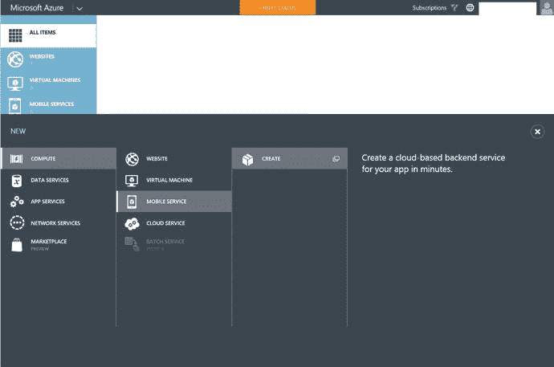
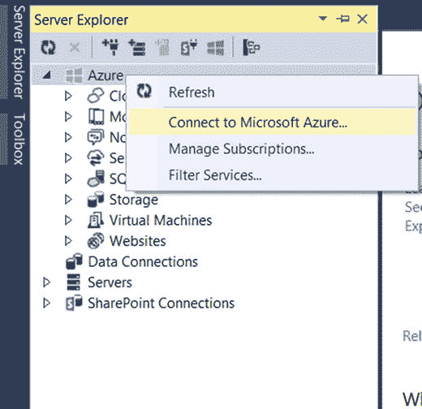
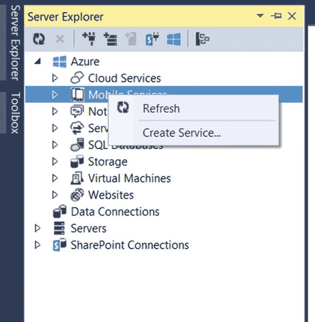
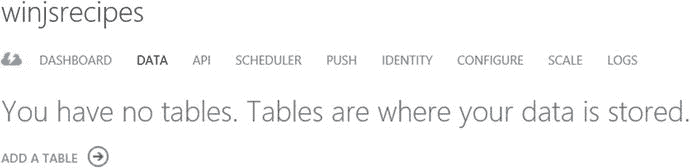
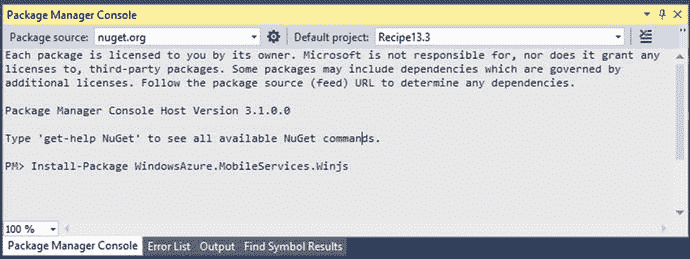
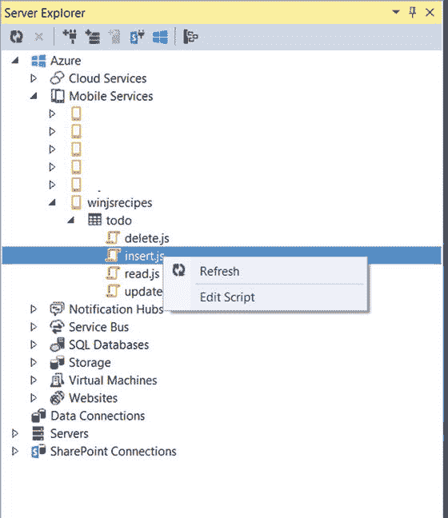

# 第 13 章:构建连接到云的应用

Microsoft Azure Mobile Services 为开发人员提供了一种最简单的方式来将数据从 Windows 应用程序存储到云中的 SQL Azure 数据库。通过使用微软 Azure 移动服务，开发人员无需担心创建和托管他们自己的 web 服务。大部分事情都由微软 Azure 移动服务处理。

本章介绍了从通用 Windows 应用程序设置和使用 Microsoft Azure 移动服务进行数据存储和检索的一些方法。

## 13.1 在 Microsoft Azure 中创建新的移动服务

### 问题

你需要在 Microsoft Azure Mobile Services 中创建一个新的移动服务，供你的通用 Windows 应用程序使用。

### 解决办法

登录到 Microsoft Azure 管理门户，并使用移动服务部分创建新的移动服务。

### 它是如何工作的

Microsoft Azure 移动管理门户为开发人员管理各种资源(如虚拟机、移动服务、云服务等)提供了必要的选项。

按照以下步骤在 Microsoft Azure 中创建新的移动服务:

Log in to the Microsoft Azure Management portal by navigating to [`http://manage.windowsazure.com`](http://manage.windowsazure.com/) and providing your login credentials.   You can create a new mobile service by clicking the +New button in the bottom bar and then selecting Compute ➤ Mobile Service ➤ Create, as shown in Figure [13-1](#Fig1).

图 13-1。

Microsoft Azure dashboard for creating a new mobile service   Provide the details of the mobile service. This includes the URL to access the mobile service, subscription, region, back end, and so forth. You can provide the Mobile Service name as winjsrecipes. Currently, Microsoft Azure supports JavaScript and .NET back ends. Select JavaScript in this recipe and click the Next button, as shown in Figure [13-2](#Fig2).

图 13-2。

New Mobile Service dialog   If you selected Create a new SQL database instance, you have to provide the existing database settings information, as shown in Figure [13-3](#Fig3). Complete the mobile service creation.

图 13-3。

New Mobile Service database settings dialog   Within a few minutes, the mobile service is ready and displayed in the Mobile Service overview screen.  

您还可以使用 Visual Studio 2015 在 Microsoft Azure 中创建移动服务。若要从 Visual Studio 2015 创建移动服务，请按照下列步骤操作:

Launch Visual Studio 2015 and open the Server Explorer window.   In the Server Explorer window, right-click Azure and select Connect to Microsoft Azure… in the context menu, as seen in Figure [13-4](#Fig4). Provide your Microsoft Azure login credentials. This imports the Azure subscription to Visual Studio.

图 13-4。

Connect to Azure from the Visual Studio Server Explorer window   The next step is to create the mobile service from Server Explorer. Right-click Mobile Services and select Create Service, as demonstrated in Figure [13-5](#Fig5).

图 13-5。

Create a Service from Visual Studio 2015   In the Create Mobile Service dialog, provide the necessary information for the mobile service to be created, which includes the URL, region, database information, and so forth. Name the recipe winjs, as shown in Figure [13-6](#Fig6).

图 13-6。

New Mobile Service dialog in Visual Studio 2015   Note

您需要订阅 Microsoft Azure。如果你还没有订阅它，那么你需要访问 [`http://azure.microsoft.com/en-us/`](http://azure.microsoft.com/en-us/) 。如果你想试用微软 Azure，你可以获得一个免费试用帐户。

## 13.2 在移动服务中创建数据库表

### 问题

您需要创建一个表来存储 Microsoft Azure 中的待办事项，这些事项将由您的通用 Windows 应用程序使用。

### 解决办法

您可以使用 Microsoft Azure 管理门户或 Visual Studio 2015 在 Microsoft Azure 移动服务中创建数据库表。

### 它是如何工作的

图 13-7。

Azure Mobile Service dashboard To create a table from Microsoft Azure Mobile Services, log in to the Azure Management portal with your login credentials. In the Mobile Services overview screen, select the mobile service in which you would like to create a new table.   In the selected mobile service (see Figure [13-7](#Fig7)), select the DATA tab and click ADD A TABLE to start creating a new table.  

在 Create New Table 对话框中，输入表名(称之为 todo ),并让任何人拥有应用程序键的默认权限进行插入、更新、删除和读取操作，如图 [13-8](#Fig8) 所示。单击提交按钮。

图 13-8。

Table creation within the Mobile Services in Microsoft Azure

请注意，您没有为 todo 表指定列。一种方法是从仪表板向表中添加列，这是一种首选方法。另一种选择是使用动态模式，其中的列是根据您插入的数据动态创建的(这使得开发新的移动服务更加容易)。使用本食谱中的第二个选项。开发人员可以从仪表板禁用动态模式。

## 13.3 为 WinJS 客户端库安装移动服务

### 问题

您需要为您的 Windows 应用安装 WinJS 客户端库的移动服务，以便与 Microsoft Azure 移动服务进行交互。

### 解决办法

使用 NuGet 包管理器控制台在通用 Windows 项目中执行以下命令，将移动服务添加到 WinJS 客户端库:

`Install-Package WindowsAzure.MobileServices.Winjs`

### 它是如何工作的

NuGet 包管理器控制台允许开发人员快速安装库。要为 WinJS 客户端库添加移动服务，请按照下列步骤操作。

Launch Visual Studio 2015 and create a new Universal Windows app using the JavaScript template.   In Visual Studio, select Tools ➤ Library package manager ➤ Package Manager Console, and then enter the following command: `install-package WindowsAzure.MobileServices.WinJS`   Before running this command, ensure that the correct project is selected as Default project in the Package Manager Console (see Figure [13-9](#Fig9)).

图 13-9。

Project selection in the Package Manager Console Once the installation is successful, you will see the new JavaScript files in the JS folder of the project in the Solution Explorer, as shown in Figure [13-10](#Fig10).

图 13-10。

Universal project in Solution Explorer after installation of library   To use the WinJS library for mobile services, you must add a reference to the `MobileServices.min.js` script in the HTML page. ``  

现在，您可以从 Windows 应用商店项目访问移动服务客户端库。

## 13.4 执行 CRUD 操作

### 问题

您需要从 Windows 应用程序的 todo 表中创建、读取、更新和删除(CRUD)记录。(todo 表的创建在前面的配方中已经演示过了。)

### 解决办法

通过使用通过移动服务库公开的方法，您可以对在移动服务中创建的表执行基本的 CRUD 操作。

### 它是如何工作的

在前一个配方中，您创建了一个名为`winjsrecipes`的移动服务和一个名为 todo 的表。在本菜谱中，您将探索如何从 Windows 应用程序中与 todo 数据库表进行交互。微软 Azure 移动服务:CRUD 操作:

Open the default.html page in the Windows app and add the following reference to the mobile service library head section: ``   In the same file, add the following code to the body tag. `
`         `<h4 style="margin-bottom:18px">winjsrecipes</h4>`         `
Enter some text below and click Save to insert a new TodoItem item into your database
`         `<input type="text" id="textInput" style="width:240px;vertical-align:middle;margin-right:10px;" />`         `<button id="buttonSave" style="vertical-align:middle">Save</button>`         `
Click refresh below to load the unfinished TodoItems from your database. Use the checkbox to complete and update your TodoItems
`         `<button id="buttonRefresh" style="width:100%">Refresh</button>`         `
`             `<input type="checkbox" style="margin-right:5px" data-win-bind="checked: complete; dataContext: this; innerText: text" />`         `
`         `
`         `
`     `
`   Open the default.js file from the JS folder and replace it with the following code: `// For an introduction to the Blank template, see the following documentation:` `//` [`http://go.microsoft.com/fwlink/?LinkID=392286`](http://go.microsoft.com/fwlink/?LinkID=392286) `(function () {`     `"use strict";`     `var app = WinJS.Application;`     `var activation = Windows.ApplicationModel.Activation;`     `app.onactivated = function (args) {`         `if (args.detail.kind === activation.ActivationKind.launch) {`             `if (args.detail.previousExecutionState !== activation.ApplicationExecutionState.terminated) {`             `} else {`             `}`             `args.setPromise(WinJS.UI.processAll());`             `var client = new WindowsAzure.MobileServiceClient(`                                 `"` [`https://winjsrecipes.azure-mobile.net/`](https://winjsrecipes.azure-mobile.net/) `",`                                 `"<Application Key2>"`                         `);`             `var todoTable = client.getTable('todo');`             `var todoItems = new WinJS.Binding.List();`             `var insertTodoItem = function (todoItem) {`                 `todoTable.insert(todoItem).done(function (item) {`                     `todoItems.push(item);`                 `});`             `};`             `var refreshTodoItems = function () {`                 `todoTable.where({ complete: false })`                     `.read()`                     `.done(function (results) {`                         `todoItems = new WinJS.Binding.List(results);`                         `listItems.winControl.itemDataSource = todoItems.dataSource;`                     `});`             `};`             `var updateCheckedTodoItem = function (todoItem) {`                 `todoTable.update(todoItem).done(function (item) {`                     `todoItems.splice(todoItems.indexOf(item), 1);`                 `});`             `};`             `buttonSave.addEventListener("click", function () {`                 `insertTodoItem({`                     `text: textInput.value,`                     `complete: false`                 `});`             `});`             `buttonRefresh.addEventListener("click", function () {`                 `refreshTodoItems();`             `});`             `listItems.addEventListener("change", function (eventArgs) {`                 `var todoItem = eventArgs.target.dataContext.backingData;`                 `todoItem.complete = eventArgs.target.checked;`                 `updateCheckedTodoItem(todoItem);`             `});`             `refreshTodoItems();`         `}`     `};`     `app.oncheckpoint = function (args) {`     `};`     `app.start();` `})();`   Run the application on the Windows desktop using the Local Machine option. You should see screens like the ones shown in Figure [13-11](#Fig11). You should be able to add, delete, or update the data from your app to the mobile service.

图 13-11。

Windows app with insert and refresh options  

在从 Windows 应用程序对 Microsoft Azure Mobile Services 执行任何操作之前，您必须首先连接到该服务并获得对远程服务的访问权限。使用`MobileServiceClient`对象可以访问远程服务客户端。类似地，通过使用`MobileServiceTable`对象可以访问远程表。

下面是如何获得`MobileServiceClient`和表引用:

`var client = new WindowsAzure.MobileServiceClient(`

`"`[`https://winjsrecipes.azure-mobile.net/`](https://winjsrecipes.azure-mobile.net/)T2】

`"<Enter the Application Key>"`

`);`

`var todoTable = client.getTable('todo');`

`MobileServiceClient`构造器接受两个参数。第一个参数是移动服务的 URL，第二个参数是应用程序密钥。

Note

若要获取您的移动服务的应用程序密钥，您需要登录到 Microsoft Azure 管理门户，导航到您的移动服务的仪表板，并使用“管理密钥”选项获取应用程序密钥。您需要使用这个键作为移动服务客户端的第二个参数。

插入操作可以通过调用`MobileServiceTable`对象的`insert`方法来执行。以下代码将新文本插入 todo 表中:

`insertTodoItem({`

`text: textInput.value,`

`complete: false`

`});`

`var insertTodoItem = function (todoItem) {`

`// This code inserts a new TodoItem into the database. When the operation completes`

`todoTable.insert(todoItem).done(function (item) {`

`todoItems.push(item);`

`});`

`};`

`insert`方法的返回类型是承诺。您可以包含成功和错误函数来处理`insert`方法的操作结果。在前面的例子中，一旦插入成功，UI 中的`todoItems`列表就会更新。

移动服务中现有记录的更新可以通过使用在`MobileServiceTable`类中定义的`update`方法来执行。例如，下面演示了如何更新 todo 表中的记录:

`var todoItem = { id:1 };`

`todoItem.complete = true;`

`updateCheckedTodoItem(todoItem);`

`var updateCheckedTodoItem = function (todoItem) {`

`// This code takes a freshly completed TodoItem and updates the database. When the MobileService`

`// responds, the item is removed from the list`

`todoTable.update(todoItem).done(function (item) {`

`todoItems.splice(todoItems.indexOf(item), 1);`

`});`

`};`

更新记录时，需要在要更新的记录中包含主键。在本例中，id 字段是主键。当创建新的 Azure 移动服务时，会自动创建 id 列并使其成为主键。该字段是自动递增列。

记录的删除可以通过调用`MobileServiceTable`类的`del()`方法来执行。例如，下面的示例演示了如何从 todo 表中删除记录:

`var deleteItem = { id:1};`

`todoTable.del(deleteItem);`

与`update`方法类似，`del`方法也需要传递对象的主键。

## 13.5 分页数据检索

### 问题

你需要控制从 Microsoft Azure 移动服务返回到你的通用 Windows 应用的数据量。

### 解决办法

在客户端使用`take`和`skip`查询方法从移动服务获取具体的记录数。

### 它是如何工作的

让我们用之前的食谱作为这个食谱的起点。

Add six more todo items from the app by changing the text and clicking the Save button.   Open the default.js file and replace the `refreshTodoItems` method with the following code. `var refreshTodoItems = function () {`     `// Define a filtered query that returns the top 2 items.`     `todoTable.where({ complete: false })`         `.take(2)`         `.read()`         `.done(function (results) {`             `todoItems = new WinJS.Binding.List(results);`             `listItems.winControl.itemDataSource = todoItems.dataSource;`         `});` `};` This example returns the top two items on the todo table, which are not marked as complete.   Run the application in the Windows desktop using the Local Machine option. You should see the first three todo items from the service, as shown in Figure [13-12](#Fig12).

图 13-12。

Windows app displaying only two records with paging  

如果您想跳过表中一定数量的项，然后返回之后的记录，该怎么办？您可以使用`skip`方法来实现这一点。

以下是跳过前四条记录并返回其后四条记录的代码片段。这类似于第 2 页，可以多显示四条记录。

`var refreshTodoItems = function () {`

`todoTable.where({ complete: false })`

`.skip(4)`

`.take(4)`

`.read()`

`.done(function (results) {`

`todoItems = new WinJS.Binding.List(results);`

`listItems.winControl.itemDataSource = todoItems.dataSource;`

`});`

`};`

Note

移动服务在一个响应中有最多 50 个项目的自动页面限制。`skip` / `take`方法可以帮助在一个响应中检索更多的记录(如果需要的话)。

## 13.6 对从移动服务返回的数据进行排序

### 问题

您需要对移动服务从通用 Windows 应用程序返回的数据进行排序。

### 解决办法

您可以在查询中使用`orderBy`或`orderByDescending`函数。

### 它是如何工作的

让我们用之前的食谱作为这个食谱的起点。您将更新`refreshTodoItems`方法来对记录进行排序。

Open the default.js file and replace the `refreshTodoItems` method with the following code to sort by text in descending order.  

`var refreshTodoItems = function () {`

`todoTable.where({ complete: false }).orderByDescending("text")`

`.read()`

`.done(function (results) {`

`todoItems = new WinJS.Binding.List(results);`

`listItems.winControl.itemDataSource = todoItems.dataSource;`

`});`

`};`

当您使用本地机器选项在 Windows 桌面中运行应用程序时，您会注意到列表现在以降序排序，如图 [13-13](#Fig13) 所示。

图 13-13。

Windows app displaying sorted data from a mobile service

为了按升序对数据进行排序，可以使用`orderBy`方法来指定对记录进行排序的列。下面的示例演示了如何按照`"text"`列以升序对 todo 表进行排序。

`todoTable.where({ complete: false }).orderBy("text")`

`.read()`

## 13.7 在服务器脚本中执行验证

### 问题

您希望在 Microsoft Azure Mobile Services 的服务器端 JavaScript 中执行验证。

### 解决办法

您可以在服务器脚本(插入、更新、删除等)中定义验证。).这可以从 Visual Studio 2015 或移动服务仪表板进行修改。

### 它是如何工作的

让我们使用前面的菜谱示例来演示如何在 Azure 移动服务中执行验证，然后在 Windows 应用程序中显示一条消息。

假设您想要验证在插入新记录时提交的数据的长度。您必须注册一个脚本来验证少于六个字符的数据。如果文本长度小于或等于六个字符，则需要显示一条错误消息。

Open the Server Explorer window in Visual Studio and expand the mobile service table.   Double-click the insert.js file to start modifying it within Visual Studio. You can also right-click and select the Edit Script option to edit the file, as shown in Figure [13-14](#Fig14). Note that when you modify and save the file, the file is automatically updated in Microsoft Azure.

图 13-14。

Script files in Visual Studio 2015 for Mobile Services   Replace the insert.js file with the following code snippet. `function insert(item, user, request) {`     `if (item.text.length <= 6) {`         `request.respond(statusCodes.BAD_REQUEST, 'Text length must be greater than 6 characters');`     `} else {`         `request.execute();`     `}` `}`   Open the default.js file from the project and replace the `insertTodoItem` function with the following: `var insertTodoItem = function (todoItem) {`                 `todoTable.insert(todoItem).done(function (item) {`                     `todoItems.push(item);`                 `}, function (error) {`                     `// Display the error message`                     `var msg = new Windows.UI.Popups.MessageDialog(`                         `error.request.responseText);`                     `msg.showAsync();`                 `});`             `};`   Run the app in Windows desktop using the Local Machine option and try to add a todo item with less than six characters. Click the Save button. The app should display the message shown in Figure [13-15](#Fig15).

图 13-15。

Windows app displaying a validation message from a mobile service  

或者，您可以从“脚本”选项卡修改脚本，这可以通过在 Azure 管理门户的“数据”选项卡中选择表格来找到。