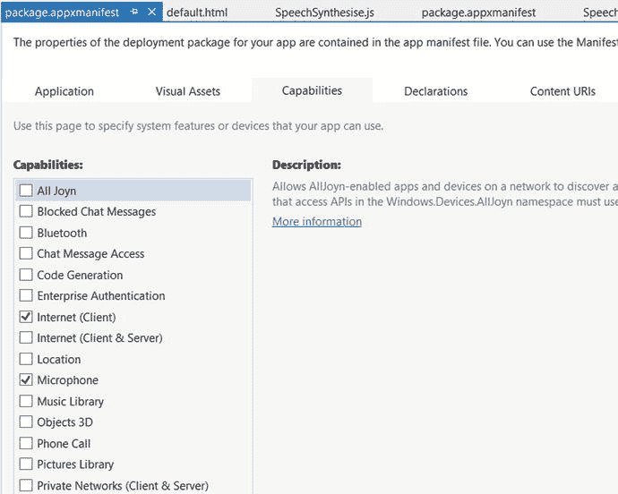
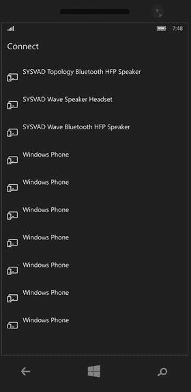
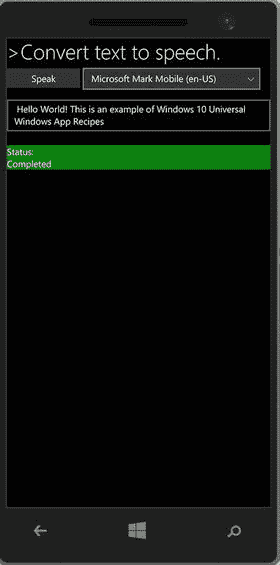

# 第 15 章:设备功能

本章概述了 Windows 10 应用程序中的设备功能。您还将了解如何在您的 UWP 应用中开发蓝牙、文本到语音、语音到文本和传感器功能。本章还概述了 Cortana 在应用程序中的集成。

## 15.1 如何在应用程序包清单中指定设备功能

### 问题

您需要指定 Windows 10 应用程序所需的不同设备的功能。

### 解决办法

使用应用程序包清单文件指定`DeviceCapability`元素和关联的子元素。

### 它是如何工作的

在 Visual Studio 2015 中打开您正在为 Windows 10 应用程序开发的项目。

从解决方案资源管理器中，找到`Package.appmanifest`文件。双击文件将其打开。单击功能选项卡。选择你的应用将使用的设备功能。这将在应用程序中添加功能列表(见图 [15-1](#Fig1) )。

图 15-1。

Capabilities tab in app package.appmanifest file

您还可以在 XML 编辑器中打开 app `package.appmanifest`文件，并使用`<Capabilities>`元素下的`<Capability>`元素添加设备功能；例如:

`<Capabilities>`

`<Capability Name="internetClient" />`

`<Capability Name="allJoyn" />`

`<Capability Name="codeGeneration" />`

`<Capability Name="internetClientServer" />`

`<uap:Capability Name="blockedChatMessages" />`

`<uap:Capability Name="chat" />`

`<uap:Capability Name="videosLibrary" />`

`<uap:Capability Name="phoneCall" />`

`<uap:Capability Name="removableStorage" />`

`<DeviceCapability Name="microphone" />`

`<DeviceCapability Name="webcam" />`

`</Capabilities>`

在本例中，该应用启用了以下功能:聊天、视频库、电话和可移动数据存储，如 USB 驱动器、麦克风和网络摄像头。请注意，有一些功能，如网络摄像头，不能使用`package.manifest`可视界面指定。您必须使用代码文件来完成这项工作。

## 15.2 如何为 Windows 应用的蓝牙指定设备功能

### 问题

您需要在 Windows 10 应用中访问蓝牙设备。

### 解决办法

使用`package.manifest`的`DeviceCapability`元素定义访问蓝牙设备的设备能力。这适用于蓝牙 Rfcomm 和 Gatt APIs。

### 它是如何工作的

Open your Windows Universal Windows app project in Visual Studio 2015.   From Solution Explorer, locate the `Package.appmanifest` file. Right-click and open the `Package.appmanifest` file in the XML editor.   Locate the `<Capabilities>` section. Add the following elements under `<Capabilities>:`  

`<DeviceCapability Name="bluetooth.rfcomm">`

`<Device Id="any">`

`<Function Type="name:obexObjectPush"/>`

`<Function Type="name:serialPort"/>`

`<Function Type="name:genericFileTransfer"/>`

`</ Device>`

`</DeviceCapability>`

在前面的代码中，`<DeviceCapability>`元素具有`Name`属性，该属性被指定为用于访问蓝牙 RFCOMM 设备的“`bluetooth.rfcomm`”。`<Device>`元素被设置为`"any"`，以允许访问与`<function>`元素中指定的功能类型相匹配的任何设备。

`<DeviceCapability>`也可以用于为蓝牙 GATT 设备指定设备功能，如下面的代码片段所示:

`<DeviceCapability Name="bluetooth.genericAttributeProfile">`

`<Device Id="any">`

`<Function Type="name:battery"/>`

`<Function Type="name:bloodPressure"/>`

`<Function Type=”serviceId:aaaaaaa”/>`

`</ Device>`

`</DeviceCapability>`

在前面的代码中，蓝牙 GATT“任何”设备的 DeviceCapabilities 支持所提到的具有指定服务名称和服务 id 的功能。

## 15.3 如何找到可用于 UWP 应用程序的设备

### 问题

您想要获取连接到系统的设备列表-外部连接或可用于 UWP 应用程序。

### 解决办法

使用`Windows.Devices.Enumeration.DevicePicker`类来枚举应用程序可发现的设备。

### 它是如何工作的

在 Microsoft Visual Studio 2015 中使用 Windows 通用(空白应用程序)模板创建一个新项目。

从 Visual Studio 解决方案资源管理器中的项目打开 default.html 页。添加以下 HTML 标记以显示按钮和标签:

`<body class="win-type-body">`

`
`

`<h2 id="sampleHeader" class="win-type-subheader">Description:</h2>`

`
`

`Recipe to demo DevicePicker to allows users of your app to pick a device`

`
`

`
`

`
`

`<button id="showDevicePickerButton" >Show Device Picker</button>`

`
`

`</body>`

在解决方案资源管理器中右键单击`js`文件夹。添加一个`DevicePicker.js` JavaScript 文件。在`default.html`中添加对这个`js`文件的引用。

``

在 Visual Studio 中打开`devicePicker.js`并添加以下脚本:

`(function () {`

`"use strict";`

`var DevEnum = Windows.Devices.Enumeration;`

`var devicePicker = null;`

`var page = WinJS.UI.Pages.define("../default.html", {`

`ready: function (element, options) {`

`// Hook up button event handlers`

`document.getElementById("showDevicePickerButton").addEventListener("click", showDevicePicker, false);`

`}`

`});`

在前面的代码中，我们声明了一个类型为`Windows.Devices.Enumeration`的变量。这个对象稍后将被用来创建`DevicePicker`对象。

当加载 DOM 时，`page`变量用于将其余的`js`脚本绑定到默认页面。

在`ready()`函数中，我们将事件处理程序`showDevicePicker`绑定到`showDevicePickerButton`按钮。

添加下面的`showDevicePicker()`方法，这将使设备可用:

`function showDevicePicker() {`

`var buttonRect;`

`devicePicker = new DevEnum.DevicePicker();`

`buttonRect = document.getElementById("showDevicePickerButton").getBoundingClientRect();`

`var rect = { x: buttonRect.left, y: buttonRect.top, width: buttonRect.width, height: buttonRect.height };`

`// Show the picker`

`devicePicker.show(rect);`

`}`

`})();`

在单击`showDevicePickerButton`按钮时调用的`showDevicePicker()`事件处理程序中，我们创建了一个`Windows.Devices.Enumeration.DevicePicker`对象和一个矩形对象来显示选择器 UI 输出。

编译这个项目，并使用移动仿真器运行它，以获得所有设备的列表，如图 [15-2](#Fig2) 所示。

图 15-2。

Get enumeration of all devices available to app on system

## 15.4 如何创建音频流并基于纯文本输出语音

### 问题

你需要在你的应用程序中添加一个语音功能，让它能够阅读文本。

### 解决办法

使用`Windows.Media.SpeechSynthesis.SpeechSynthesizer()`在你的 UWP 应用程序中开发基于文本的音频/语音输出。

### 它是如何工作的

微软已经提供了预定义的声音，可以用来合成单一语言的语音。

在 Microsoft Visual Studio 2015 中使用 Windows 通用(空白应用程序)模板创建一个新项目。在项目`package.appmanifest`文件中，单击 Capabilities 选项卡，并选中 Microphone 和 Internet 复选框。这允许应用程序使用音频源。

在 Visual Studio 解决方案资源管理器中打开项目的`default.html`页面。在`default.html`的`<body>`标签中添加以下 HTML 标记。

`<body class="win-type-body">`

`
`

`
`

`<h2 id="sampleHeader" class="win-type-subheader">>Convert text to speech.</h2>`

`
`

`
`

`<button id="btnSpeak" class="win-button">Speak</button>`

`<select id="voicesSelect" class="win-dropdown"></select>`

`<textarea id="textToSynthesize" style="width: 100%" name="textToSynthesize" class="win-textarea"> Hello World! This is an example of Windows 10 Universal Windows App Recipes</textarea>`

`

`

`
`

`
`

`
`

`

`

`
`

`Status:`

`

`

`
`

`
`

`</body>`

当在调试模式下在移动仿真器中启动应用时，显示图 [15-3](#Fig3) 所示的内容。

图 15-3。

Text to speech GUI with drop-down list to select the language

如您所见，添加了四个主要控件:

*   一个扬声器按钮
*   允许用户选择可用语言的下拉列表
*   包含预定义文本的文本框。该应用程序会将这些文本转换成音频
*   语音播放和停止时显示消息的状态标签

在解决方案资源管理器中右击该项目，并选择“添加➤新 JavaScript 文件”。提供文件的名称。在本例中，我们将文件命名为 SpeechSynthesise。js。在文件中添加以下代码:

`var page = WinJS.UI.Pages.define("../default.html", {`

`ready: function (element, options) {`

`try {`

`synthesizer = new Windows.Media.SpeechSynthesis.SpeechSynthesizer();`

`audio = new Audio();`

`var btnSpeak = document.getElementById("btnSpeak");`

`var voicesSelect = document.getElementById("voicesSelect");`

`btnSpeak.addEventListener("click", speakFn, false);`

`voicesSelect.addEventListener("click", setVoiceFunction, false);`

`var rcns = Windows.ApplicationModel.Resources.Core;`

`context = new rcns.ResourceContext();`

`context.languages = new Array(synthesizer.voice.language);`

`listbox_GetVoices();`

`audio_SetUp();`

`} catch (exception) {`

`if (exception.number == -2147467263) {// E_NOTIMPL`

`// If media player components aren't installed (for example, when using an N SKU of windows)`

`// this error may occur when instantiating the Audio object.`

`statusMessage.innerText = "Media Player components are not available.";`

`statusBox.style.backgroundColor = "red";`

`btnSpeak.disabled = true;`

`textToSynthesize.disabled = true;`

`}`

`}`

`},`

`unload: function (element, options) {`

`if (audio != null) {`

`audio.onpause = null;`

`audio.pause();`

`}`

`}`

`});`

声明以下变量:

`var synthesizer;`

`var audio;`

`// localization resources`

`var context;`

`var resourceMap;`

在加载应用程序的设备上为`default.html`页面加载 DOM 时，会执行`ready(`函数。在这个函数中，创建一个类型为`Windows.Media.SpeechSynthesis.SpeechSynthesizer()`的本地`synthesizer`对象，它提供对微软设备上已安装的语音合成引擎的功能访问，并控制语音合成引擎(voice)。

第二个对象是`audio`，用于播放音频。然后我们为 Speak 按钮和`voicesSelect`下拉 HTML 控件关联事件监听器。

我们还创建了一个类型为`Windows.ApplicationModel.Resources.Core`的本地`rcns`对象。此对象用于枚举设备中所有可用的资源。后来，它被用来获取已安装的声音，并使用下拉控件显示它们。

在前面的代码中，我们还声明了在其他方法中使用的局部变量，这些方法被称为单击 Speak 按钮和`voicesSelect`下拉列表。请注意，如果设备中缺少媒体播放器组件，并且无法播放音频，我们还会捕获一个异常。如果出现异常，我们捕获它并在 HTML `div`对象中显示 StatusMessage 错误消息。

添加以下方法:

`function audio_SetUp() {`

`audio.onplay = function () { // executes when the voice begins playing`

`statusMessage.innerText = "Playing";`

`};`

`audio.onpause = function () { // executes when the user presses the stop button`

`statusMessage.innerText = " Audio Completed";`

`btnSpeak.innerText = "Speak";`

`};`

`audio.onended = function () { // executes when the voice finishes playing`

`statusMessage.innerText = "Completed";`

`btnSpeak.innerText = "Speak";`

`voicesSelect.disabled = false;`

`};`

`}`

`audio_SetUp() method` `Sets up the voice element's events so the app UI updates based on the current state of voice playback.`

接下来，添加以下方法:

`function speakFn() {`

`var btnSpeak = document.getElementById("btnSpeak");`

`if (btnSpeak.innerText == "Stop") {`

`voicesSelect.disabled = false;`

`audio.pause();`

`return;`

`}`

`// Changes the button label. You could also just disable the button if you don't want any user control.`

`voicesSelect.disabled = true;`

`btnSpeak.innerText = "Stop";`

`statusBox.style.backgroundColor = "green";`

`// Creates a stream from the text. This will be played using an audio element.`

`synthesizer.synthesizeTextToStreamAsync(textToSynthesize.value).done(`

`function (markersStream) {`

`// Set the source and start playing the synthesized audio stream.`

`var blob = MSApp.createBlobFromRandomAccessStream(markersStream.ContentType, markersStream);`

`audio.src = URL.createObjectURL(blob, { oneTimeOnly: true });`

`markersStream.seek(0);`

`audio.play();`

`},`

`function (error) {`

`errorMessage(error.message);`

`});`

`}`

`speakFn()`是用户点击应用程序上的发言/停止按钮时调用的主要方法。`synthesizer.synthesizeTextToStreamAsync()`方法用于将文本框中的文本转换成 Blob 流。然后，它通过音频播放该流。

接下来，添加下面的方法，允许用户从资源中选择不同的音频语音选项。

`function setVoiceFunction() {`

`/// 
`

`/// This is called when the user selects a voice from the drop down.`

`/// 
`

`if (voicesSelect.selectedIndex !== -1) {`

`var allVoices = Windows.Media.SpeechSynthesis.SpeechSynthesizer.allVoices;`

`// Use the selected index to find the voice.`

`var selectedVoice = allVoices[voicesSelect.selectedIndex];`

`synthesizer.voice = selectedVoice;`

`// change the language of the sample text.`

`context.languages = new Array(synthesizer.voice.language);`

`}`

`}`

在这个方法中，我们使用了`Windows.Media.SpeechSynthesis.SpeechSynthesizer.allVoices()`来获取`allVoices`对象中所有已安装的语音合成引擎(voices)。

接下来，添加下面的方法来从设备安装的声音中创建项目。这些声音随后显示在`voicesSelect`下拉控件中。

`function listbox_GetVoices() {`

`/// 
`

`/// This creates items out of the system installed voices. The voices are then displayed in a listbox.`

`/// This allows the user to change the voice of the synthesizer in your app based on their preference.`

`/// 
`

`// Get the list of all of the voices installed on this machine.`

`var allVoices = Windows.Media.SpeechSynthesis.SpeechSynthesizer.allVoices;`

`// Get the currently selected voice.`

`var defaultVoice = Windows.Media.SpeechSynthesis.SpeechSynthesizer.defaultVoice;`

`var voicesSelect = document.getElementById("voicesSelect");`

`for (var voiceIndex = 0; voiceIndex < allVoices.size; voiceIndex++) {`

`var currVoice = allVoices[voiceIndex];`

`var option = document.createElement("option");`

`option.text = currVoice.displayName + " (" + currVoice.language + ")";`

`voicesSelect.add(option, null);`

`// Check to see if we're looking at the current voice and set it as selected in the listbox.`

`if (currVoice.id === defaultVoice.id) {`

`voicesSelect.selectedIndex = voiceIndex;`

`}`

`}`

`}`

最后，如果出现任何错误消息，有一个通用的`errorMessage()`方法来显示`errorTextArea`对象上的错误。

`function errorMessage(text) {`

`/// 
`

`/// Sets the specified text area with the error message details.`

`/// 
`

`var errorTextArea = document.getElementById("errorTextArea");`

`errorTextArea.innerText = text;`

`}`

一旦创建完`SpeechSynthesise.js`文件，确保在`default.html`文件中添加一个引用。

``

当你在 Windows 10 移动模拟器中运行应用程序时，应用程序会打开`default.html`文件。按“朗读”按钮以当前默认的声音播放声音。更新`Status div`中的值，如图 [15-4](#Fig4) 所示。

图 15-4。

Text to speech app

在这个菜谱中，您学习了如何使用`Windows SpeechSynthesizer()`类将文本转换成音频。请注意，您还可以用 SSML 语言指定文本，并将其传递给一个对象`Windows.Media.SpeechSynthesis.SpeechSynthesizer()`，以将指定的文本转换成音频。

## 15.5 如何为语音识别指定识别约束

### 问题

你需要创建一个允许语音识别的应用程序。

### 解决办法

使用`Windows.Media.SpeechRecognition.SpeechRecognizer`对象创建一个语音识别器，并使用`Windows.Media.SpeechRecognition.SpeechRecognitionListConstraint`指定不同的语音识别约束。

UWP 应用程序中有三种可能的语音限制。

*   `SpeechRecognitionTopicConstraint`:基于预定义的语法，依赖互联网连接。
*   `SpeechRecognitionListConstraint`:基于预定义的单词和短语列表。
*   `SpeechRecognitionGrammarFileConstraint`:添加了一个语音识别语法规范(SRGS)文件，所有的约束都在这个 XML 文件中指定。

这个菜谱使用`SpeechRecognitionListConstraint`将语音转换成文本。

### 它是如何工作的

在 Microsoft Visual Studio 2015 中使用 Windows 通用(空白应用程序)模板创建一个新项目。在项目`package.appmanifest`文件中，单击 Capabilities 选项卡，并选中 Microphone 和 Internet 复选框。这允许应用程序使用音频源。

打开`default.html`文件，复制以下代码:

`<body class="win-type-body">`

`
`

`
`

`<h2 id="sampleHeader" class="win-type-subheader">Speech to Text</h2>`

`
`

`
Speech recognition using a custom list-based grammar.
`

`
`

`
`

`
`

`
`

`<button id="btnSpeak" class="win-button">Speak</button>`

`
`

`

`

`
`

`
`

`</body>`

在解决方案资源管理器中右击该项目，并选择“添加➤新 JavaScript 文件”。提供文件的名称。在本例中，我们将其命名为 Speechrecognisation。js。

将以下代码添加到`Speechrecognisation.js`文件中:

`(function () {`

`"use strict";`

`function GetControl() {`

`WinJS.UI.processAll().done(function () {`

`var btnSpeak = document.getElementById("btnSpeak");`

`btnSpeak.addEventListener("click", buttonSpeechRecognizerListConstraintClick, false);`

`var resultTextArea = document.getElementById(resultTextArea);`

`});`

`}`

`document.addEventListener("DOMContentLoaded", GetControl);`

前面的代码向 btnSpeak 按钮添加了一个事件接收器。现在添加一个`buttonSpeechRecognizerListConstraintClick`函数，当用户单击用户首选项表单控件上的 Speak 按钮时触发该函数。

`function buttonSpeechRecognizerListConstraintClick() {`

`// Create an instance of SpeechRecognizer.`

`var speechRecognizer =`

`new Windows.Media.SpeechRecognition.SpeechRecognizer();`

`// You could create this array dynamically.`

`var responses = ["Yes", "No", "Hello", "Hello World"];`

`// Add a web search grammar to the recognizer.`

`var listConstraint =`

`new Windows.Media.SpeechRecognition.SpeechRecognitionListConstraint(`

`responses,`

`"YesOrNo");`

`speechRecognizer.uiOptions.audiblePrompt = "Say what you want to search for…";`

`speechRecognizer.uiOptions.exampleText = "Ex. 'Yes', 'No', 'Hello'";`

`speechRecognizer.constraints.append(listConstraint);`

`var resultTextArea = document.getElementById(resultTextArea);`

`// Compile the default dictation grammar.`

`speechRecognizer.compileConstraintsAsync().done(`

`// Success function.`

`function (result) {`

`// Start recognition.`

`speechRecognizer.recognizeWithUIAsync().done(`

`// Success function.`

`function (speechRecognitionResult) {`

`// Do something with the recognition result.`

`speechRecognizer.close();`

`},`

`// Error function.`

`function (err) {`

`if (typeof errorTextArea !== "undefined") {`

`errorTextArea.innerText = "Speech recognition failed.";`

`}`

`speechRecognizer.close();`

`});`

`},`

`// Error function.`

`function (err) {`

`if (typeof errorTextArea !== "undefined") {`

`errorTextArea.innerText = err;`

`}`

`speechRecognizer.close();`

`});`

`}`

`})();`

前面的代码声明了一个名为`speechRecognizer`的变量。它被分配给`Windows.Media.SpeechRecognition.SpeechRecognizer()`类，表示语音识别器对象的容器。下一行有一个`responses`静态数组变量，用来存储识别出的语音约束值。

然后在类型为`Windows.Media.SpeechRecognition.SpeechRecognitionListConstraint()`的对象实例中引用它，该实例加载在`responses`数组中指定的所有值。

以下是语音识别器的用户界面设置。将`SpeechRecognitionListConstraint listcontraint`传递给`speechRecognizer`对象。

然后我们调用`speechRecognizer.compileConstraintsAsync()`方法来异步编译由`constraints`属性指定的所有约束。该方法执行提供了类型为`SpeechRecognitionCompilationResult`的输出，该输出是使用`speechRecognitionResult`成功函数捕获的。我们还捕获错误并使用`errorTextArea`元素显示它们。

一旦你完成了`Speechrecognisation.js`文件，确保你在`default.html`中添加了一个引用。

``

就是这样。语音识别基于预定义的约束，在应用程序中可用。它可用于捕捉用户输入。

当您在 Windows Mobile 模拟器中运行该应用程序时，它看起来如图 [15-5](#Fig5) 所示。点按“开始”并说出具体的单词，例如“是”、“否”或“你好”语音识别器将对其进行验证。

图 15-5。

Speech recognition based on a custom list of words

## 15.6 如何在前台使用 Cortana 语音命令启动您的应用程序

### 问题

你想让用户能够使用 Cortana 语音命令在前台启动你的应用。

### 解决办法

使用语音命令定义(VCD)文件来定义语音命令，其中包含激活应用程序的命令。安装执行 app 时，VCD 文件安装在 Cortana 中。

用户可以说出 VCD 文件中指定的命令来启动应用程序。Cortana 在 Windows 语音平台和云托管的微软语音识别服务的帮助下识别用户语音命令。这两个服务都试图识别语音，Cortana 接收文本，并使用`onactivated`事件启动应用程序和应用程序中的语音命令。

### 它是如何工作的

在 Microsoft Visual Studio 2015 中使用 Windows 通用(空白应用程序)模板创建一个新项目。

在项目中添加新的视频命令定义文件`CortanaVoiceCommands.xml`。将以下 XML 代码添加到文件中:

`<?xml version="1.0" encoding="utf-8" ?>`

`<VoiceCommands xmlns="`[`http://schemas.microsoft.com/voicecommands/1.2`](http://schemas.microsoft.com/voicecommands/1.2)T2】

`<CommandSet xml:lang="en-gb" Name="CortanaVoiceCommandSet">`

`<AppName>Win10Recipes</AppName>`

`<Example> Show Win10 Recipes </Example>`

`<Command Name="showDevicesAvailableRecipes">`

`<Example>Show</Example>`

`<ListenFor RequireAppName="BeforeOrAfterPhrase">{command}</ListenFor>`

`<ListenFor RequireAppName="ExplicitlySpecified">Listening to command </ListenFor>`

`<Feedback> Recipes available in App </Feedback>`

`<Navigate/>`

`</Command>`

`<PhraseList Label="command">`

`<Item>Devices</Item>`

`<Item>Text to Speech</Item>`

`</PhraseList>`

`</CommandSet>`

`</VoiceCommands>`

在这个视频命令定义文件中，有几个主要元素。元素定义了用于激活应用程序和执行命令的命令。元素还具有指定命令语言的属性`xml:Lang`。在这个例子中，我们使用的是英国英语。

`<CommandPrefix>`是我们应用程序的唯一名称。它被用作语音命令的前缀或后缀来激活应用程序。`<Commmand>`元素用于命令用户可以说什么。`<ListenFor>`元素指定了 Cortana 应该识别的文本。`<Feedback>`元素指定了 Cortana 在启动应用程序时所说的文本。`<Navigate>`元素表示语音命令是在前台启动应用程序。

如果要在后台通过语音命令启动 app，使用`<VoiceCommandService>`。

创建 VCD 文件后，安装 VCD 文件指定的命令。为此，使用`installCommandDefinitionsFromStorageFileAsync`方法。

从解决方案资源管理器中打开 d `efault.js`。在这里，调用`onactivated`方法并添加以下代码:

`//load vcd`

`var storageFile = Windows.Storage.StorageFile;`

`var wap = Windows.ApplicationModel.Package;`

`var voiceCommandManager = Windows.ApplicationModel.VoiceCommands.VoiceCommandDefinitionManager;`

`wap.current.installedLocation.getFileAsync("CortanaVoiceCommands.xml")`

`.then(function (file) {`

`voiceCommandManager.installCommandDefinitionsFromStorageFileAsync(file);`

`});`

`var activationKind = args.detail.kind;`

`var activatedEventArgs = args.detail.detail;`

在前面的代码中，我们使用了`Windows.ApplicationModel.Package.current.installedLocation.getFileAsync`方法来获取对 VCD 文件的引用。调用了`installCommandDefinitionsFromStorageFileAsync`方法来安装文件中指定的命令。现在，我们必须指定应用程序如何响应与 VCD 文件匹配的语音命令。为此，首先检查`IActivatedEventArgs.Kind`是否为`VoiceCommand`。在`default.js`中的标准代码后替换以下代码，以检查激活参数类型:

`if (args.detail.kind === activation.ActivationKind.launch) {`

`if (args.detail.previousExecutionState !== activation.ApplicationExecutionState.terminated) {`

`// TODO: This application has been newly launched. Initialize your application here.`

`} else {`

`// TODO: This application was suspended and then terminated.`

`// To create a smooth user experience, restore application state here so that it looks like the app never stopped running.`

`}`

`args.setPromise(WinJS.UI.processAll());`

`}`

`else if (activationKind == Windows.ApplicationModel.Activation.ActivationKind.voiceCommand)`

`{`

`var speechRecognitionResult = activatedEventArgs[0].Result;`

`// Get the name of the voice command and the text spoken`

`var voiceCommandName = speechRecognitionResult.RulePath[0];`

`switch(voiceCommandName)`

`{`

`case "showDevicesAvailableRecipes":`

`var textSpoken = speechRecognitionResult.semanticInterpretation.properties[0];`

`var url = "Devices.html";`

`nav.history.backStack.push({ location: "/Devices.html" })`

`break;`

`default:`

`break;`

`}`

`}`

`};`

`app.oncheckpoint = function (args) {`

`// TODO: This application is about to be suspended. Save any state that needs to persist across suspensions here.`

`// You might use the WinJS.Application.sessionState object, which is automatically saved and restored across suspension.`

`// If you need to complete an asynchronous operation before your application is suspended, call args.setPromise().`

`};`

`app.start();`

前面的代码检查了指定激活类型的`Windows.ApplicationModel.Activation.ActivationKind`值。检查`ActivationKind`是否为`voiceCommand`或其他方式。如果应用程序是使用语音命令启动的，那么您需要在`speechRecognitionResult`变量中获取用户所说的文本；要获取字符串，请使用`activatedEventArgs`。

`activatedEventArgs`有一个名为`Result`的属性，它提供了`SpeechRecognitionResult`。

要获取用户所说的文本，使用`speechRecognitionResult.RulePath[0]`并将其存储在`voiceCommandName`局部变量中。

使用此文本(`voiceCommandName`)，您可以决定显示哪个应用程序页面。为此，请切换大小写，并将 voicecommandName 值与 VCD 文件中指定的命令名相匹配。在`CortanaVoiceCommands.xml`中，你指定命令名`showDevicesAvailableRecipes`。如果匹配，在`devices.html`中向用户显示应用页面。这样，应用程序就与 Cortana 集成在一起了。当用户使用语音命令启动应用程序时，您可以进一步增强以启动应用程序页面。

Note

您不能使用 Visual Studio 移动模拟器来测试这个配方，因为 Cortana 需要一个 Microsoft 帐户注册和登录过程，这在移动模拟器上不工作。相反，你需要在设备上安装应用程序，然后运行 Cortana 来测试应用程序在前台的启动。