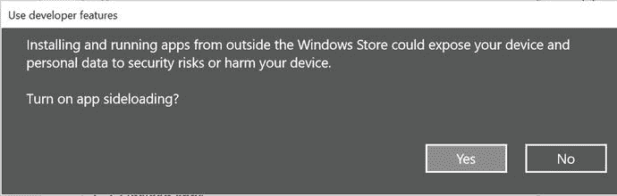
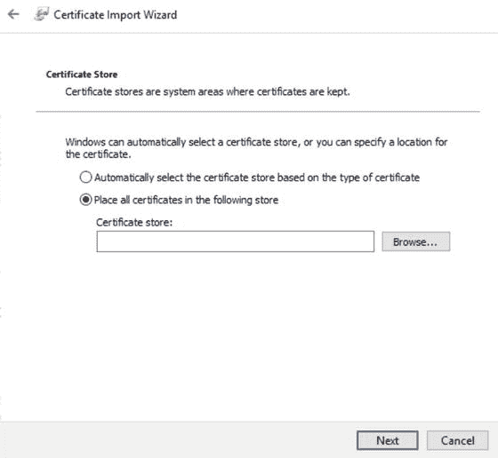
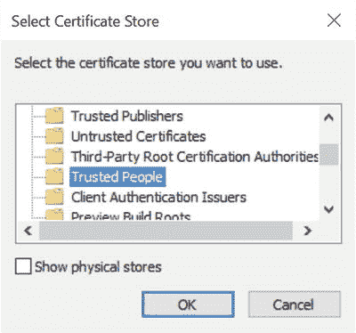
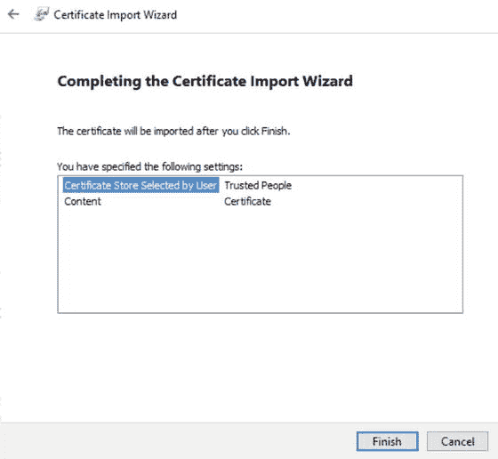
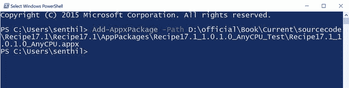
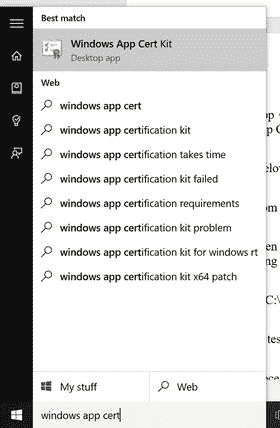
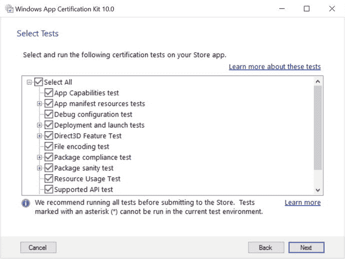
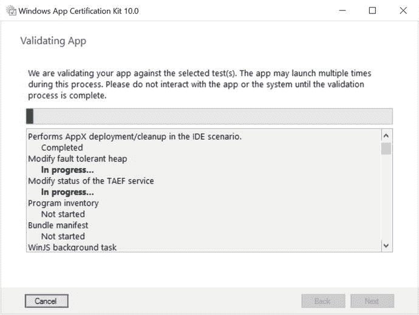
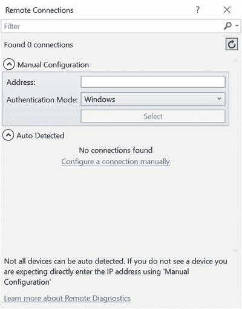

# 第 17 章:侧装和 Windows 应用认证套件

开发应用程序后，在将应用程序上传到商店之前，在各种机器上部署和测试应用程序是非常重要的。本章介绍了一些关于如何从命令提示符生成应用程序包的方法，并将您的应用程序加载到计算机上，然后使用 Windows 应用程序认证工具包来测试应用程序是否足以发布到 Windows 应用商店。第 18 章包括一个从 Visual Studio 交互生成应用包的方法，因此，这不在本章讨论。

## 17.1 侧装你的应用

### 问题

您需要在 Windows 设备上下载您的应用程序，而无需提交到 Windows 应用商店，以便测试人员可以使用您创建的应用程序包文件安装和测试它。

### 解决办法

使用 PowerShell 运行`Add-AppDevPackage`文件(它是在生成包文件时创建的),以便将您的应用程序下载到 Windows 设备上。

### 它是如何工作的

你的应用程序的用户不能像安装传统桌面应用程序那样简单地安装通用 Windows 应用程序。

通用 Windows 应用程序只能从商店下载，然后安装在设备上。如果您不想去商店就想安装某个应用程序，您可以将该应用程序下载到设备上，以便用户可以安装和测试它。

您可以按照以下步骤将应用程序包下载到 Windows 10 设备。

Enable your device for sideloading.   Install your app using PowerShell.  

侧面加载应用程序的第一步是确保在您的设备上启用侧面加载。您可以通过启动设置应用程序并访问更新与安全在您的 Windows 计算机上启用它。选择“开发人员”按钮，该按钮显示使用开发人员功能的各种选项。选择开发者模式以启用设备的侧面装载(参见图 [17-1](#Fig1) )。

图 17-1。

Enable Sideload apps and Developer mode in Windows 10

一旦你选择了开发者模式，就会显示一个确认对话框(见图 [17-2](#Fig2) )来确认你想要打开应用侧装。Sideload apps 选项允许您安装一个`.appx`文件和证书，该文件和证书是使用随软件包一起创建的 PowerShell 脚本运行应用程序所需的。此选项比开发人员模式更安全，因为您无法安装不受信任的应用程序。但是对于这个配方，让我们选择开发者模式并继续。

图 17-2。

Confirmation dialog for enabling sideloading

下一步是在机器上安装应用程序。要做到这一点，请遵循以下步骤。

Generate the package file for installation. This is covered in [Chapter 18](18.html).   Copy the complete folder of the package file that you want to install onto the target machine. For example, if you have created the app bundle, the folder name will contain the version number and `_test`. If the version number is 1.0.0.0 and the project name is Recipe17.1, targeting AnyCPU, the folder would be Recipe17.1_1.0.0.0_AnyCPU_Debug_Test.   On the target machine that you want to sideload the app, open the folder. Right-click the Add-AppDevPackage.ps1 file and click the Run with PowerShell button on the context menu, as shown in Figure [17-3](#Fig3).

图 17-3。

The Run with PowerShell menu in Windows Explorer   Follow the information shown in the PowerShell command. When the package is successfully installed, you will notice the Your app was successfully installed message in the command prompt, as shown in Figure [17-4](#Fig4).

图 17-4。

App installation message in PowerShell command  

现在，单击 Windows 中的开始按钮。找到应用程序并启动它。

## 17.2 分别安装证书和软件包

### 问题

您需要在 Windows 中分别安装软件包和证书。

### 解决办法

使用 PowerShell 运行`Add-AppDevPackage`文件(它是在生成包文件时创建的),以便将您的应用程序下载到 Windows 设备上。

### 它是如何工作的

Recipe 17.1 演示了使用 PowerShell 安装一个应用程序和证书。有些情况下，您可能希望分别安装证书和软件包文件。您可以先安装证书，然后使用`Add-AppDevPackage` PowerShell 命令。

如果要在 Windows 桌面上单独安装证书和软件包文件，需要执行以下步骤。

Open the folder where the app package was created. Ideally, this folder contains the following:

*   Add-AppDevPackage.resources 文件夹
*   add-appdevpackage . resources PowerShell 脚本文件
*   项目名称 _ 版本 _ 平台. appx 文件
*   project name _ Version _ platform . cer 安全或证书文件

  Double-click the certificate file (`.cer`) and then click the Install Certificate button on the Certificate screen (see Figure [17-5](#Fig5)).

图 17-5。

Install Certificate screen   On the Certificate Import Wizard screen, select the Local Machine option under the Store Location group, as shown in Figure [17-6](#Fig6). Click Next.

图 17-6。

Select store location from the Certificate Import Wizard   In the UAC dialog, click the OK button to continue.   In the next certificate import screen, select the Place all certificates in the following store radio button and click the Browse button (see Figure [17-7](#Fig7)).

图 17-7。

Select the certificate store to place the certificate   In the Select Certificate Store pop-up screen, select Trusted people and click the OK button (see Figure [17-8](#Fig8)).

图 17-8。

Select Certificate Store screen   Click Next in the Certificate Import Wizard and then complete the certificate by clicking Finish (see Figure [17-9](#Fig9)).

图 17-9。

Completion of the certificate import process   This installs the certificate to the Windows certificate store on the local machine. The next step is to install the app alone using the `add-appxpackage` cmdlet for PowerShell, as explained in the following steps.   Navigate to the AppPackages folder and identify the complete path of the package file (`.appx`) file that you want to install.   As shown in Figure [17-10](#Fig10), open Windows PowerShell from the Start menu and run the `Add-appxpackage` command by specifying the following parameters. `Add-appxpackage –Path <Path to appx file>`

图 17-10。

Add-appxpackage command in PowerShell to install the app   Once you enter the command, press the Enter key. This installs the app on your Windows 10 machine.  

现在，您可以从“开始”菜单启动应用程序。

## 17.3 使用 Windows 应用认证套件验证您的 Windows 应用

### 问题

您希望通过交互式使用 Windows 应用认证工具包来验证您的通用 Windows 平台应用。

### 解决办法

从 Windows“开始”菜单启动 Windows 应用认证工具包，并指定要验证和测试的应用。

### 它是如何工作的

在将应用提交给商店进行认证之前，最好在本地对其进行验证和测试。这为开发人员提供了更多的信息，以防软件包出现任何问题。

Windows 应用认证工具包是一个非常棒的工具，可以帮助开发人员在本地验证和测试您的应用。Windows 应用认证套件包含在 Windows 10 的 Windows 软件开发套件(SDK)中。

以下步骤使用 Windows 应用认证工具包验证和测试 Windows 应用。

From the Windows Start menu, search for Windows app cert kit and then click the Windows App Cert Kit desktop app (see Figure [17-11](#Fig11)).

图 17-11。

Windows App Certification Kit in the Start menu   In the Windows App Certification Kit, select the validation category that you want to perform. For example, if you are validating a Windows app, select Validate Store App (see Figure [17-12](#Fig12)).

图 17-12。

Selection of the type of app to perform validation   Once you select the Store App option, you are provided with options to either select an app that is already installed on the machine or choose the package file that you want to validate. You can enable the Browse for app you want to validate radio button and click the Browse button to select the package file (see Figure [17-13](#Fig13)).

图 17-13。

Selection of the app to validate and test   Once you have selected the app or the package file, click Next to continue. The subsequent screens display the tests workflows that are applicable for the app that you are testing (see Figure [17-14](#Fig14)). If a test is not applicable to your app type, it is grayed out.

图 17-14。

Types of tests applicable for the app   Click Next. The Windows App Certification Kit begins validating the app, as shown in Figure [17-15](#Fig15).

图 17-15。

Windows App Certification Kit validating the app   Once the validation is complete, you are prompted to save the report in the XML file format, which displays the results, as shown in Figure [17-16](#Fig16). The Windows App Certification Kit creates an HTML file along with an XML report and saves them in a specified folder.

图 17-16。

Test results from the Windows App Certification Kit  

## 17.4 在远程 Windows 10 设备上验证应用程序包

### 问题

你需要在远程 Windows 10 机器上验证你的应用包，并测试它。

### 解决办法

在远程计算机上安装 Visual Studio 远程工具和 Windows 应用程序认证工具包，并使用远程计算机选项在远程计算机上验证包。

### 它是如何工作的

当从 Visual Studio 生成包文件时，您还可以选择在远程计算机上验证它。

要在远程计算机上验证包，请按照下列步骤操作。

Enable your Windows 10 remote device for development by enabling Developer mode in the Use developer features in the Settings app, as shown in Figure [17-17](#Fig17). Note that the validation on the remote ARM device for Windows 10 is currently not supported.

图 17-17。

Enabling Developer mode in the Settings app   Download and install the remote tools for Visual Studio on the remote machine. Go to [`http://www.microsoft.com/en-us/download/details.aspx?id=48155&NavToggle=True`](http://www.microsoft.com/en-us/download/details.aspx?id=48155%26NavToggle=True) . The remote tools for Visual Studio are used to run the Windows App Certification Kit.   Download the Windows App Certification Kit from [`https://dev.windows.com/en-us/develop/app-certification-kit`](https://dev.windows.com/en-us/develop/app-certification-kit) and install it on your remote machine.   Now, start creating a package from your Windows app. In the Package Creation Completed wizard, select the Remote machine option and click the ellipsis button (see Figure [17-18](#Fig18)).

图 17-18。

Package creation and the Remote Machine option   Enter your subnet/Domain Name Server (DNS)/IP address. Select the appropriate mode in Authentication Mode menu of Windows credentials (see Figure [17-19](#Fig19)).

图 17-19。

Remote Connection screen   Click the Select button and then the Launch Windows App Certification Kit button. If the remote tools are running on the remote machine, you are connected and the validation tests should begin.