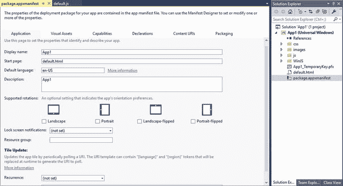
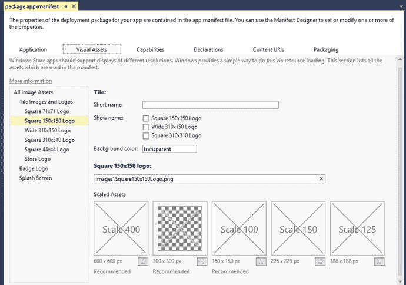
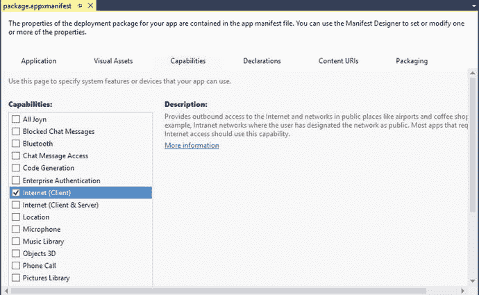
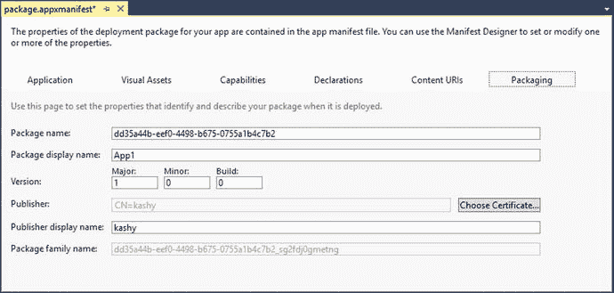
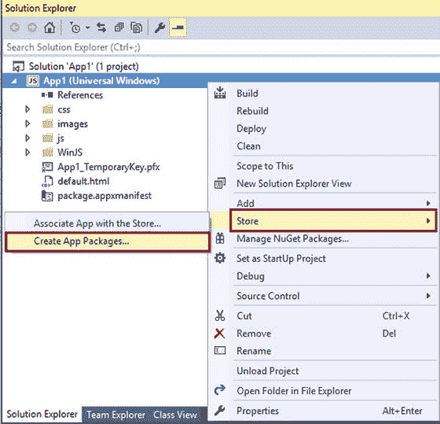
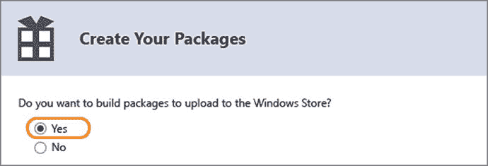
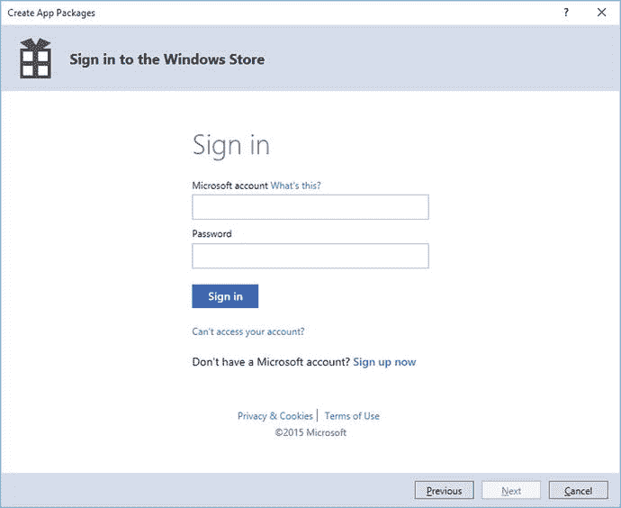
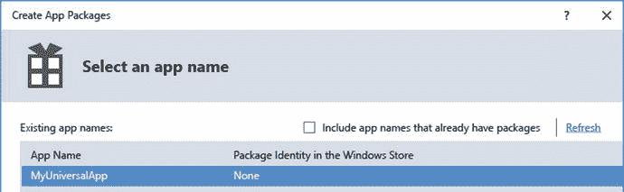
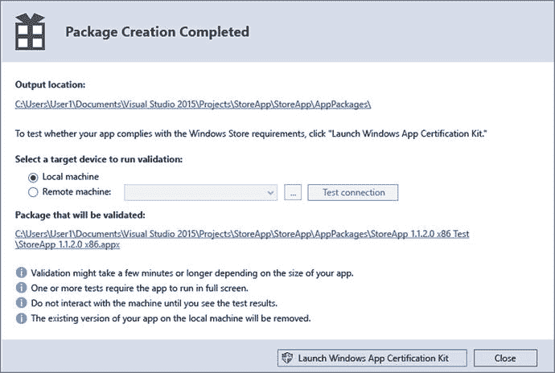
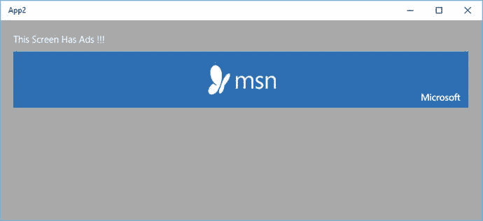

# 第 18 章:商店和货币化

到目前为止，您应该已经完成了针对 Windows 10 操作系统的通用 Windows 平台应用程序的开发。您需要构建您的应用程序，并将其上传到 Windows 应用商店，用户可以在那里搜索和下载应用程序。在本章中，您将了解在 Windows 应用商店中获得您的应用所需的东西，以及如何利用应用内广告赚钱。

## 18.1 创建一个 Windows 应用开发者帐户

### 问题

您需要构建您的应用程序并将其上传到 Windows 应用商店。但要做到这一点，您需要首先使用您的开发人员帐户登录 Windows 开发人员中心。在开始上传阶段之前，您需要知道如何创建开发人员帐户。

### 解决办法

在线创建一个开发者帐户。有两种方法可以开始这个过程。

*   直接去 [`http://dev.windows.com`](http://dev.windows.com) 。
*   通过 Visual Studio 访问帐户注册。

#### 通过 Windows 开发中心注册访问帐户

Windows 开发中心是 Windows 应用程序开发的一站式门户。该门户提供了您开始 Windows 10 应用程序开发所需的工具。有代码示例、如何开发 Windows 10 应用的教程，当然还有提交应用的条款。可以在 [`http://dev.windows.com`](http://dev.windows.com) 访问 Windows 开发中心。当您导航到此页面时，您会看到一个获取开发人员帐户链接。点按它并按照屏幕指示完成创建您自己的开发人员帐户。开发者帐户允许您将应用(适用于所有 Windows 设备)提交到 Windows 应用商店。它还允许您管理您的应用程序，并分析您的应用程序在商店中的表现。

您可以注册以下类别之一:

*   个人:此帐户类型允许您以个人、学生或非法人团体的身份开发和销售应用程序。这种账户的费用是 19 美元。
*   公司:这种帐户类型适用于拥有注册商业名称的公司，用于开发和销售应用程序。这种账户的费用是 99 美元。

您需要提供以下信息才能获得帐户:

*   您的联系信息
*   要显示的发布者名称
*   支付方式(VISA/MasterCard/PayPal)

#### 通过 Visual Studio 注册访问帐户

您也可以通过 Visual Studio 注册为开发人员。

在 Visual Studio 中，从项目菜单中选择 Store ➤ Open Developer Account(参见图 [18-1](#Fig1) )。

图 18-1。

Open a developer account from Visual Studio

此操作会打开一个新的浏览器窗口，并将您直接带到帐户注册页面。你必须按照屏幕上的指示来完成帐户注册。

## 18.2 为 Windows 10 打包一个通用 Windows 平台应用程序

### 问题

您已经完成了应用程序的开发。您已经完成了 Windows 开发人员中心的帐户注册。现在，您想要打包您的应用程序，以便提交到商店。

### 解决办法

要销售或分发 Windows 应用程序，您需要创建一个应用程序包或 appxupload 包，这是一个技术术语。使用通用 Windows 平台(UWP)，您可以生成一个包(`.appxupload`)。此包已上载到 Windows 应用商店。一旦应用程序进入商店，就可以在任何 Windows 10 设备上安装和运行，包括手机、平板电脑、个人电脑等。

### 它是如何工作的

打包 Windows 10 应用程序需要分两步完成。首先，用某些属性和设置配置包。然后，生成要上传到商店的包。

#### 配置应用程序包

要创建应用程序包，您需要首先设置描述您的应用程序的某些属性和设置。应用程序属性和设置存储在一个名为应用程序清单文件的文件中，该文件位于项目的根目录下，名为`package.appxmanifest`。您在清单中设置的一些属性/设置是用于应用程序切片的图像或应用程序支持的方向。

应用程序清单文件是一个 XML 文件。Visual Studio 提供了一个基于 GUI 的清单设计器/编辑器来编辑该文件。使用 GUI 设计器/编辑器，很容易对应用程序清单进行更改。

以下步骤提供了如何配置软件包的说明:

图 18-2。

Application package manifest editing In Solution Explorer, expand your application’s project node.   Double-click the package.appxmanifest file. Visual Studio will launch the manifest designer/editor (see Figure [18-2](#Fig2)).  

清单文件有几个选项卡，用于配置应用程序的不同方面。

*   应用程序:配置应用程序的显示名称、起始页、默认语言、描述、支持的方向、锁屏通知模式和磁贴更新信息。
*   Visual Assets: Configures your app’s visual assets, such as tile images and logos, the badge logo, and the splash screen (see Figure [18-3](#Fig3)).

    

    图 18-3。

    Visual Assets
*   Capabilities: Any capabilities that your app needs has to be declared in this area of the manifest file (see Figure [18-4](#Fig4)).

    

    图 18-4。

    Capabilities
*   Declarations: Use to add any declarations (for example, protocol or share target) for your app and sets their properties (see Figure [18-5](#Fig5)).

    

    图 18-5。

    Declarations
*   Content URIs: Specifies which pages in the app can be navigated to by a frame, and URIs that can be navigated to when loaded in a web view (see Figure [18-6](#Fig6)).

    

    图 18-6。

    Content URIs
*   Packaging: Sets the package details, such as package name (note: this is not the application name, rather just the package name), package display name, version details, publisher, publisher display name, and package family name (see Figure [18-7](#Fig7)).

    

    图 18-7。

    Packaging

#### 创建应用程序包

在使用清单文件配置应用程序包之后，接下来要做的事情是生成或创建包。该包是一个 appxupload 文件。Visual Studio 提供了创建应用程序包向导，您接下来将使用该向导。按照以下步骤创建包:

In Solution Explorer, open the solution of your Universal Windows app project.   With the project opened in the Solution Explorer, right-click your project. Choose Store ➤ Create App Packages from the context menu (see Figure [18-8](#Fig8)).

图 18-8。

Create App Packages   The wizard will be invoked. In the Create Your Packages dialog, select Yes to build packages and upload to the Windows Store (see Figure [18-9](#Fig9)).

图 18-9。

Create App Package wizard If you chose No, Visual Studio would not create the required `.appxupload` file required for Store submission. This option should be used when you only want to sideload your app to run it on an internal device.   Next, you need to sign in to your Windows Dev Center account (see Figure [18-10](#Fig10)).

图 18-10。

Create App Package Dev Center Sign in   Next, you need to select a name for your package, or you can reserve a name for your package from the wizard. The name you select needs to be unique to the Windows Store (see Figure [18-11](#Fig11)).

图 18-11。

Selecting app name   Next, you need to select and configure the package information: the output location where the package will be saved, and the version and the architecture configuration for the build. Make sure to select all three architecture options (see Figure [18-12](#Fig12)).

图 18-12。

Configuring package details   Click Create to generate the appxupload package, which is generated at the selected output location. You can then submit the appxupload package to the Store. Next, you see Package Creation Completed dialog (see Figure [18-13](#Fig13)).

图 18-13。

Creation Completion dialog It is important that you validate your app before submitting it to store for certification. Validation can be done by using the Windows App Certification Kit (WACK) that is installed as part of the SDK on your machine. Validation can be done on your local machine or on a remote machine.   To validate locally, select the Local machine radio button in the Package Creation Completed dialog. Click the Launch Windows App Certification Kit button. The Windows App Certification Kit performs tests and shows you the results.   If your app has passed the tests, you are ready to submit your app to the Store.  

## 18.3 向 Windows 应用商店提交应用

### 问题

您已经完成了包的创建。已为您的应用生成了一个 appxupload 包。您现在需要将应用提交到商店进行认证。

### 解决办法

为您的应用程序创建 appxupload 包后，下一步是将其提交到商店进行认证。认证后，您的应用程序会列在 Windows 应用商店中，以便用户可以搜索和下载安装。您可以使用 Windows 开发人员中心仪表板将应用包提交到 Windows 应用商店。下面概述了提交的过程。

Log in to the Windows Dev Center using your dev center account credentials. Head over to [`http://dev.windows.com`](http://dev.windows.com) and sign in.   Click the Dashboard link.   On the dashboard page, you see the My Apps section on the left-hand side of the page. Under this section, the app name you reserved during package creation is listed with an In progress status. Click the app name (see Figure [18-14](#Fig14)).

图 18-14。

Apps listing in Windows Dev Center dashboard   Next, you are presented with the App Overview page. Here you need to click the Start your submission button in the Submissions section.   Next, you are presented with the submission screen. Here you need to provide information related to pricing, the application properties, the application package, which countries you want your app to be available in, and any other instructions for certification team. Pricing and availability: Here you provide the pricing for your app or decide to list it as free. You also have option to choose the countries in which you want to list your app.   App Properties: Here you provide information such as the category and subcategories to which your app belongs in, as well as the age rating, any hardware preferences, and app declarations.   Packages: Here you submit the appxupload package that was generated by Visual Studio.     Once you have followed all the steps in the submission process, you can click the Submit to the Store button. Your package will then undergo a workflow. Your app is signed with a certificate, and then the certification team performs certification tests. Once certified by the certification team, your app is published to the Windows Store.  

## 18.4 在您的 UWP 应用中使用 Windows 广告中介

### 问题

你已经开发了你的 Windows 10 应用程序，并且你正在考虑通过运行广告来赚钱。你想与多个广告提供商签约，以便在你的应用中显示他们的广告。你的应用程序需要一个广告中介控件。

### 解决办法

应用内广告是你从应用中赚钱的方式之一。你可以订阅广告提供商，并在你的应用程序中运行他们的广告。你的应用程序中显示的广告的印象会得到报酬。不同的提供商有不同的与广告印象相关的经济学。但是要显示广告，你需要先安装 Windows Ad Mediator，这个控件可以帮助你显示来自多个提供商的广告。让我们学习如何从 Visual Studio 安装一个 Ad Mediator 控件。

Open your project in Solution Explorer. Expand your project if it is not expanded already.   From the menu bar, select Tools➤ Extensions and Updates (see Figure [18-15](#Fig15)).

图 18-15。

Extension and Updates dialog   Select Online from the left tree. Type Windows Ad Mediation in the dialog search bar (see Figure [18-16](#Fig16)).

图 18-16。

Windows ad mediation   Click Download on the Windows ad mediation package shown in the search results. This launches a browser and downloads the executable. After it downloads, install the MSI and follow the onscreen instructions. Restart Visual Studio once installation has finished.  

现在，您可以在应用程序中使用 Windows Ad 中介控件了。

## 18.5 在应用程序中显示广告

### 问题

您已经安装了 Windows Ad Mediation SDK，现在您希望开始在您的应用程序中显示广告。你想在你的应用程序页面上放广告。

### 解决办法

为了在应用程序页面中显示广告，您需要添加对 Windows 广告 SDK 的引用，该 SDK 是作为 Windows 广告中介安装的一部分安装的。一旦将引用添加到 Windows Ad SDK 中，您就可以在任何页面上实例化中介控件，并在其中显示广告。以下步骤解释了如何添加中介控件。

Open your project in Solution Explorer. Expand your project if it is not expanded already.   Right-click the References node and select Add Reference from the context menu.   In the Reference Manager dialog, select Microsoft Advertising SDK for JavaScript and click OK (see Figure [18-17](#Fig17)).

图 18-17。

Reference Manager dialog   Open the default.html or any other file where you want to place the ads.   In the `<head>` section, after the project’s JavaScript references of default.css and default.js, add the reference to ad.js. `<!-- Microsoft Advertising required references -->` ``   Modify the `<body>` section in the `default.html` file (or other HTML files, as appropriate for your project) to include the following: `
`     `
`   Compile and run the app to see it with an ad (see Figure [18-18](#Fig18)).

图 18-18。

Universal Windows app with ads   Note

在前面的代码片段中提供的应用程序 id 和 ad 单元 id 是 Microsoft 在开发过程中为您提供的测试值。出于测试目的，应用 id 将是相同的，但是有不同的测试广告单元，可以用于测试不同的广告维度。位于 [`https://msdn.microsoft.com/en-US/library/mt313178(v=msads.30).aspx`](https://msdn.microsoft.com/en-US/library/mt313178(v=msads.30).aspx) 的微软文档页面提供了关于测试广告单元 id 的更多信息。

To generate ApplicationID and AdUnitId in your production apps, follow these steps: Start the store submission process in the Windows Dev Center.   Make sure that you set the App Category in the App Properties section.   Next, select Monetization ➤ Monetize with ads from the options in the section on the left of the page.   On the Monetize with ads page, under the Microsoft Advertising ad units section, click Show Options.   Enter a name for your ad unit. Select the Ad unit type and the device family where the ad will be shown. Click the Create ad unit button.   Now you have created an ad unit. Copy the application id and ad unit id and paste into the ad control in your app.   Regenerate the package and use the new package in your submission process.